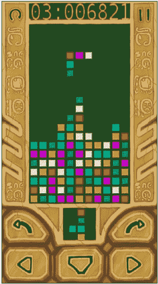
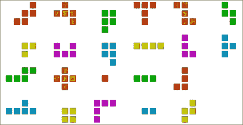
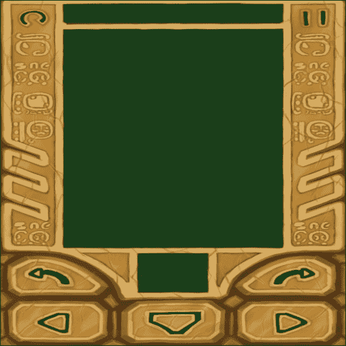
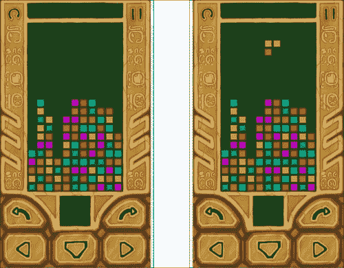
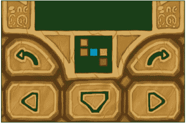
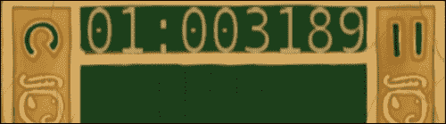
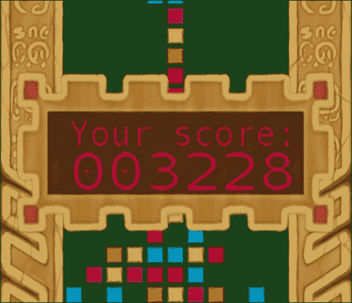

# 第八章：编写匹配-3 游戏

在本章中，我们将涵盖：

+   处理异步多点触控输入

+   改进音频播放机制

+   关闭应用程序

+   实现主循环

+   创建多平台游戏引擎

+   编写匹配-3 游戏

+   管理形状

+   管理游戏场地逻辑

+   在游戏循环中实现用户交互

# 简介

在本章中，我们开始将前面章节的食谱整合在一起。以下的大部分食谱旨在改进和整合前面章节中散布的材料。

### 注意

本章节的示例项目实际上是 Google Play 上发布的 MultiBricks 游戏的简化版：[`play.google.com/store/apps/details?id=com.linderdaum.engine.multibricks`](http://play.google.com/store/apps/details?id=com.linderdaum.engine.multibricks)。

# 处理异步多点触控输入

在上一章中，我们学习了如何在 Android 上处理多点触控事件。然而，我们简单的示例有一个严重的问题。Android 的触摸事件是异步发送的，可能会干扰游戏逻辑。因此，我们需要创建一个队列，以可控的方式处理事件。

## 准备就绪

在继续之前，请查看第七章中的“在 Android 上处理多点触控事件”的食谱，*跨平台 UI 和输入系统*。

## 如何操作…

1.  在上一章中，我们直接从异步 JNI 回调中调用触摸处理器：

    ```kt
    Java_com_packtpub_ndkcookbook_game1_Game1Activity_SendMotion(
      JNIEnv * env, jobject obj, int PointerID, int x, int y,
      bool Pressed, int Flag)
      {                        
      LVector2 Pos = LVector2( (float)x / (float)g_Width,
      (float)y / (float)g_Height );
      GestureHandler_SendMotion( PointerID, (eMotionFlag)Flag,
        Pos,Pressed );
    }
    ```

1.  这次，我们需要将所有事件存储在队列中，而不是立即处理它们。队列将持有传递给`GestureHandler_SendMotion()`的结构体中的参数：

    ```kt
    struct sSendMotionData
    {
      int ContactID;
      eMotionFlag Flag;
      LVector2 Pos;
      bool Pressed;
    };
    ```

1.  队列实现依赖于`std::vector`，持有触摸事件和`Mutex`，提供队列访问同步：

    ```kt
    Mutex g_MotionEventsQueueMutex;
    std::vector<sSendMotionData> g_MotionEventsQueue;
    ```

1.  我们新的`SendMotion()` JNI 回调需要做的工作就是将触摸事件参数打包进队列：

    ```kt
    Java_com_packtpub_ndkcookbook_game1_Game1Activity_SendMotion(
      JNIEnv * env, jobject obj, int PointerID, int x, int y,
      bool Pressed, int Flag)
    {                        
      sSendMotionData M;
      M.ContactID = PointerID;
      M.Flag = (eMotionFlag)Flag;
      M.Pos = LVector2( (float)x / (float)g_Width,
        (float)y / (float)g_Height );
      M.Pressed = Pressed;
      LMutex Lock( &g_MotionEventsQueueMutex );
      g_MotionEventsQueue.push_back( M );
    }
    ```

我们现在可以随时处理触摸事件。

## 工作原理…

为了处理队列中的触摸事件，我们扩展了`DrawFrame()` JNI 回调的实现：

```kt
Java_com_packtpub_ndkcookbook_game1_Game1Activity_DrawFrame(
  JNIEnv* env, jobject obj )
{
```

注意在额外的`{}`内的`Lock`变量的作用域。我们需要它，因为必须在继续游戏逻辑之前解锁互斥变量，以防止死锁：

```kt
  {
    LMutex Lock(&g_MotionEventsQueueMutex );
    for( auto m : g_MotionEventsQueue )
    {
      GestureHandler_SendMotion( m.ContactID, m.Flag,
        m.Pos, m.Pressed );
    }
    g_MotionEventsQueue.clear();
  }
  GenerateTicks();
}
```

### 注意

请查看示例`1_Game`中的`jni/Wrappers.cpp`文件，以获取完整的实现，可以从[www.packtpub.com/support](http://www.packtpub.com/support)获取。

## 还有更多…

我们的新方法更加健壮。然而，在`GestureHandler_SendMotion()`内部生成的触摸事件时间戳稍微有些健壮，不再对应于触摸的实际时间。这引入了一个大约等于单帧渲染时间的延迟，在多人游戏中可能成为一个问题。我们将添加真实时间戳的练习留给读者。这可以通过扩展`sSendMotionData`结构体，添加一个时间戳字段来完成，该字段在 JNI 回调`SendMotion()`内部赋值。

## 另请参阅

+   第七章，*跨平台 UI 和输入系统*中的*在 Android 上处理多触摸事件*配方

# 改进音频播放机制

在前面的章节中，我们学习了如何在 Android 上使用 OpenAL 播放音频。我们在第五章，*跨平台音频流*中实现的基本音频子系统缺乏对音频源的自动管理；我们不得不在单独的线程上手动控制它们。现在，我们将把所有这些代码放入一个新的音频子系统中，以便在实际游戏中使用。

## 准备就绪

此配方的完整源代码已集成到示例`1_Game`中，可以在文件`sound/Audio.h`和`sound/Audio.cpp`中找到。`sound`文件夹中的其他文件提供了对不同音频格式的解码能力——可以查看它们。

## 如何操作…

1.  我们需要我们的`clAudioThread`类来处理活动音频源。让我们通过负责注册的方法来扩展它：

    ```kt
    class clAudioThread: public iThread
    {
    public:
    …
      void RegisterSource( clAudioSource* Src );
      void UnRegisterSource( clAudioSource* Src );
    ```

1.  我们还需要一个用于活动源的容器以及控制对其访问的互斥锁：

    ```kt
    private:
    …
      std::vector< clAudioSource* > FActiveSources;
      Mutex FMutex;
    };
    ```

1.  `clAudioThread::Run()`方法变得更加复杂。除了初始化 OpenAL 之外，它还必须更新活动音频源，以便它们可以从提供者那里获取音频数据：

    ```kt
    void clAudioThread::Run()
    {
      if ( !LoadAL() ) { return; }
      FDevice = alcOpenDevice( NULL );
      FContext = alcCreateContext( FDevice, NULL );
      alcMakeContextCurrent( FContext );
      FInitialized = true;
      FPendingExit = false;
      double Seconds = GetSeconds();
    ```

1.  内部循环根据经过的时间更新活动音频源：

    ```kt
      while ( !IsPendingExit() )
      {
        float DeltaSeconds = static_cast<float>(
        GetSeconds() - Seconds );
    ```

1.  注意以下互斥锁的作用域：

    ```kt
        {
          LMutex Lock(&FMutex );
          for( auto i = FActiveSources.begin();
          i != FActiveSources.end(); i++ )
          {
            ( *i )->Update( DeltaSeconds );
          }
        }
        Seconds = GetSeconds();
    ```

1.  音频源每 100 毫秒更新一次。这个值纯粹是经验性的，适用于非实时音频播放，作为音频子系统滞后与 Android 设备功耗之间的折中：

    ```kt
        Env_Sleep( 100 );
      }
      alcDestroyContext( FContext );
      alcCloseDevice( FDevice );
      UnloadAL();
    }
    ```

1.  需要注册方法来维护`FActiveSources`容器。它们的实现可以在以下代码中找到：

    ```kt
    void clAudioThread::RegisterSource( clAudioSource* Src )
    {
      LMutex Lock(&FMutex );
    ```

1.  不要多次添加同一个音频源：

    ```kt
      auto i = std::find( FActiveSources.begin(),
      FActiveSources.end(), Src );
      if ( i != FActiveSources.end() ) return;
      FActiveSources.push_back( Src );
    }
    void clAudioThread::UnRegisterSource( clAudioSource* Src )
    {
      LMutex Lock(&FMutex );
    ```

1.  只需找到源并删除它：

    ```kt
      auto i = std::find( FActiveSources.begin(),
    FActiveSources.end(), Src );
      if ( i != FActiveSources.end() ) FActiveSources.erase( i );
    }
    ```

这个新的`clAudioThread`类的完整实现在示例`1_Game`中的`sound/Audio.cpp`和`sound/Audio.h`文件中可以找到。

## 工作原理…

为了利用新的`AudioThread`类，音频源必须注册自己。我们扩展了`clAudioSource`类的构造函数和析构函数，以执行 RAII 注册（[`en.wikipedia.org/wiki/Resource_Acquisition_Is_Initialization`](http://en.wikipedia.org/wiki/Resource_Acquisition_Is_Initialization)）：

```kt
clAudioSource::clAudioSource()
{
…
  g_Audio.RegisterSource( this );
}

clAudioSource::~clAudioSource()
{
…
  g_Audio.UnRegisterSource( this );
}
```

现在音频播放非常简单。声明一个全局音频线程：

```kt
clAudioThread g_Audio;
```

从主线程开始，等待初始化完成：

```kt
g_Audio.Start( iThread::Priority_Normal );
g_Audio.Wait();
```

### 注意

我们可以在`g_Audio.Start()`和`g_Audio.Wait()`调用之间调用其他有用的初始化例程，以利用异步初始化。

创建并配置一个新的音频源并播放它：

```kt
Music = new clAudioSource();
Music->BindWaveform(new
clModPlugProvider( LoadFileAsBlob("test.xm")) );
Music->LoopSound( true );
Music->Play();
```

所有的音频管理现在都在另一个线程上完成。

## 还有更多…

我们的音频线程能够播放不同类型的音频文件，如`.ogg`，`.xm`，`.it`和`.s3m`文件。你可以通过向`AudioSource`添加另一个方法来隐藏适当 wavedata 提供者的创建。只需根据文件扩展名切换选择以创建`ModPlugProvider`或`OggProvider`实例。我们把这个作为一个练习留给你。

## 另请参阅

+   在第五章，*跨平台音频流*中的*初始化 OpenAL 和播放.wav 文件*，*解码 Ogg Vorbis 文件*，*使用 ModPlug 解码跟踪器音乐*，以及*流式声音*食谱

# 关闭应用程序

智能手机的电池非常有限，这使得移动设备对任何后台活动都非常敏感。我们之前的应用示例在用户切换到另一个活动后仍然保持运行。这意味着我们没有尊重 Android 活动生命周期（[`developer.android.com/training/basics/activity-lifecycle`](http://developer.android.com/training/basics/activity-lifecycle)），在后台继续浪费宝贵的系统资源，而是应该在`onPause()`回调中暂停我们的应用程序。

## 准备就绪

如果你不太熟悉 Android 活动生命周期，请参考开发者手册：[`developer.android.com/training/basics/activity-lifecycle/index.html`](http://developer.android.com/training/basics/activity-lifecycle/index.html)。

## 如何实现…

1.  一个 Android 应用程序不必实现所有的生命周期方法。我们的生命周期管理策略将非常简单；一旦调用`onPause()`方法，保存游戏状态并终止应用程序。我们需要编写一些 Java 代码来实现这个功能。将这段代码添加到你的`Activity`类中，在我们的例子中是`Game1Activity.java`文件中的`Game1Activity`类：

    ```kt
      @Override protected void onPause()
      {
        super.onPause();
        ExitNative();
      }
      public static native void ExitNative();
    ```

1.  按照以下方式实现`ExitNative()` JNI 方法：

    ```kt
    JNIEXPORT void JNICALL Java_com_packtpub_ndkcookbook_game1_Game1Activity_ExitNative(
      JNIEnv* env, jobject obj )
    {
    OnStop();
      exit( 0 );
    }
    ```

1.  现在我们可以在我们的游戏中实现本地`OnStop()`回调。

## 它是如何工作的…

`OnStop()`回调的典型实现将保存游戏状态，以便稍后游戏恢复时可以恢复状态。由于我们的第一个游戏不需要任何保存，我们只提供一个空的实现：

```kt
void OnStop()
{
}
```

你可能想要稍后作为一个练习来实现游戏保存。

## 还有更多…

要使`OnStop()`方法在 Windows 上工作，只需在`Wrapper_Windows.cpp`中的主循环退出后调用它：

```kt
while ( !PendingExit )
{
  …
}
OnStop();
```

现在这个解决方案是可移植的，所有的逻辑都可以在 Windows 上进行调试。

## 另请参阅

+   *实现主循环*

# 实现主循环

在前面的章节中，我们的代码示例使用了带有粗略固定时间步长的`OnTimer()`回调来更新状态，以及`OnDrawFrame()`回调来渲染图形。这对于需要根据自上一帧以来经过的真实时间来更新状态的真实游戏来说是不合适的。然而，我们仍然希望使用较小的固定时间步长在`OnTimer()`的调用中。我们可以通过巧妙地交错调用`OnTimer()`和`OnDrawFrame()`，并将此逻辑放入游戏主循环中，来解决此问题。

## 准备就绪

在[`gafferongames.com/game-physics/fix-your-timestep`](http://gafferongames.com/game-physics/fix-your-timestep)有一篇非常有趣的文章，名为**修复你的时间步长！**，它详细解释了实现游戏主循环的不同方法以及固定时间步长的重要性。

## 如何操作…

1.  游戏主循环的逻辑与平台无关，可以放入一个方法中：

    ```kt
    void GenerateTicks()
    {
    ```

1.  `GetSeconds()`返回自系统启动以来的单调时间（秒）。然而，只有帧差是重要的：

    ```kt
      NewTime = GetSeconds();
      float DeltaSeconds = static_cast<float>( NewTime - OldTime );
      OldTime = NewTime;
    ```

1.  我们将使用与每秒 60 帧运行的游戏相对应的固定时间步长来更新游戏逻辑：

    ```kt
      const float TIME_QUANTUM = 1.0f / 60.0f;
    ```

1.  同时，我们还需要一个故障安全机制，以防止由于渲染速度慢而导致的游戏过度减慢。

    ```kt
      const float MAX_EXECUTION_TIME = 10.0f * TIME_QUANTUM;
    ```

1.  现在，我们累积经过的时间：

    ```kt
      ExecutionTime += DeltaSeconds;
      if ( ExecutionTime > MAX_EXECUTION_TIME )
      { ExecutionTime = MAX_EXECUTION_TIME; }
    ```

1.  并相应地调用一系列`OnTimer()`回调函数。所有的`OnTimer()`回调都接收相同的固定时间步长值：

    ```kt
      while ( ExecutionTime > TIME_QUANTUM )
      {
        ExecutionTime -= TIME_QUANTUM;
        OnTimer( TIME_QUANTUM );
      }
    ```

1.  更新游戏后，渲染下一帧：

    ```kt
      OnDrawFrame();
    }
    ```

## 工作原理…

`OnDrawFrame()`回调应该在更新后调用。如果设备足够快，每次`OnTimer()`调用后都会调用`OnDrawFrame()`。否则，为了保持游戏逻辑的实时速度，将跳过一些帧。如果设备太慢以至于无法运行游戏逻辑，我们的保护代码将启动：

```kt
if ( ExecutionTime > MAX_EXECUTION_TIME )
  { ExecutionTime = MAX_EXECUTION_TIME; }
```

整个过程将以慢动作进行，但游戏仍然可以玩。

### 注意

你可以尝试调整传递给`OnTimer()`的值，例如`OnTimer( k * TIME_QUANTUM )`。如果`k`小于`1.0`，游戏逻辑将变为慢动作。它可以用来制作类似于子弹时间（[`en.wikipedia.org/wiki/Bullet_time`](http://en.wikipedia.org/wiki/Bullet_time)）的效果。

## 还有更多…

如果应用程序被挂起，但你想让它继续在后台运行，最好完全省略渲染阶段或更改更新量子的持续时间。你可以通过为你的游戏添加`Paused`状态并在主循环中检查它，例如：

```kt
if ( !IsPaused() ) OnDrawFrame();
```

这将有助于在后台运行游戏逻辑模拟的同时节省宝贵的 CPU 周期。

## 另请参阅

+   第二章中*实现物理中的定时*的食谱，*移植通用库*

# 创建一个多平台游戏引擎

在前面的章节和食谱中，我们手工制作了许多针对多平台游戏开发任务的临时解决方案。现在，我们将所有相关的代码整合到一个初生的便携式游戏引擎中，并学习如何为 Windows 和 Android 准备 makefile 以构建它。

## 准备就绪。

要了解这个食谱中发生的情况，建议你从本书开始阅读第一章到第七章。

## 如何操作...

1.  我们将所有代码分成几个逻辑子系统，并将它们放入以下文件夹中：

    +   `core`：这包含低级别的设施，例如侵入式智能指针和数学库。

    +   `fs`：这包含与文件系统相关的类。

    +   `GL`：这包含官方的 OpenGL 头文件。

    +   `include`：这包含一些第三方库的头文件。

    +   `graphics`：这包含高级图形相关代码，如字体、画布和图像。

    +   `LGL`：这包含我们在 第七章 中实现的 OpenGL 包装器和函数加载代码以及抽象层，*跨平台 UI 和输入系统*。

    +   `Sound`：这包含音频相关类和解码库。

    +   `threading`：这包含与多线程相关的类，包括互斥量、事件、队列和我们的多平台线程包装器。

## 它是如何工作的...

每个文件夹中的大部分代码都被分成了类。在我们的简约游戏引擎中，我们尽量保持类的数量在一个合理的最低限度。

`graphics` 文件夹包含了以下结构和类的实现：

+   结构体 `sBitmapParams` 保存位图的参数，如宽度、高度和像素格式。

+   类 `clBitmap` 是一个与 API 独立的位图表示，保存实际的像素数据以及 `sBitmapParams`。它可以加载到 clGLTexture 中。

+   类 `clCanvas` 提供了一种立即渲染的机制。

+   类 `clVertexAttribs` 是一个与 API 独立的 3D 几何表示。它可以加载到 `clGLVertexArray` 中。

+   类 `clGeomServ` 提供了创建 3D 几何的方法，返回 `clVertexAttribs`。

+   类 `iGestureResponder` 是一个接口，如果你想要响应触摸或手势，就需要实现这个接口。

+   结构体 `sMotionData` 保存当前激活的触摸点集合。

+   类 `clTextRenderer` 提供基于 FreeType 的文本渲染设施。它可以指定字体将文本字符串渲染到 `clBitmap` 中。

+   结构体 `sTouchPoint` 表示一个带有标识符、2D 归一化浮点坐标、标志和时间戳的单个触摸点。

`LGL` 文件夹保存了特定于 OpenGL 的类：

+   结构体 `sUniform` 表示着色器程序中的一个统一变量。它只是一个名称和位置索引。

+   类 `clGLSLShaderProgram` 表示一个用 GLSL 编写的着色器程序，并提供桌面 GLSL 与移动 GLSL ES 之间的自动转换功能。

+   类 `clGLTexture` 提供对 OpenGL 纹理的访问，并可以读取 `clBitmap` 的像素数据。

+   类 `clGLVertexArray` 提供了对 OpenGL 顶点数组对象和顶点缓冲对象的抽象。它使用来自 `clVertexAttribs` 的数据。

低级类，如智能指针、侵入式计数器和数学相关代码被放入 `core` 文件夹：

+   类 `clPtr` 是一个引用计数式侵入式智能指针的实现。

+   类 `iObject` 持有一个侵入式引用计数器。

+   类 `LRingBuffer` 是一个环绕式环形缓冲区的实现。

+   基本数学库包括向量类，如 `LVector2`、`LVector3`、`LVector4`、`LVector2i` 和矩阵类，如 `LMatrix3` 和 `LMatrix4`。数学库还包含设置投影的最小代码。

文件系统相关的代码位于 `fs` 文件夹中：

+   类 `clArchiveReader` 使用 **libcompress** 库实现 `.zip` 归档解压算法。它用于访问 Android `.apk` 文件中的资源。

+   类 `clBlob` 表示内存中的字节数组，可以从中读取或写入文件。

+   类 `iRawFile` 是所有表示文件的类的基类。

+   类 `clRawFile` 表示物理文件系统上的文件。

+   类 `clMemRawFile` 将内存块表示为文件，适用于访问下载的数据（例如图像）。

+   类 `clManagedMemRawFile` 与 `MemRawFile` 类似，但内存由内部的 `Blob` 对象管理。

+   类 `clFileMapper` 是只读内存映射文件的抽象。

+   类 `clFileWriter` 是写入文件的抽象。

+   类 `clFileSystem` 是流和块（blobs）的工厂。它提供了管理我们应用程序中虚拟路径的功能。

+   类 `iMountPoint`、`clPhysicalMountPoint`、`clAliasMountPoint` 和 `clArchiveMountPoint` 用于以可移植的多平台方式路由到操作系统本地文件系统和 Android `.apk` 归档的访问。

`sound` 文件夹包含我们音频子系统的抽象：

+   类 `clAudioSource` 表示虚拟环境中的音频源。它可以播放、暂停或停止。

+   类 `clAudioThread` 更新活动源并将数据提交到底层的 OpenAL API。

+   类 `iWaveDataProvider` 抽象了音频文件的解码。

+   类 `clStreamingWaveDataProvider` 从太大而不能一次性解码到内存中的音频文件流式传输数据。

+   类 `clDecodingProvider` 为流式音频提供者提供公共倒带逻辑。它是实际解码器的基类。

+   类 `clOggProvider` 和 `clModPlugProvider` 使用 **libogg**/**libvorbis** 处理 `.ogg` 文件的解码和 **libmodplug** 处理跟踪音乐。

`threading` 文件夹包含不同多线程原语的可移植实现：

+   类 `clMutex`、`LMutex` 和 `iThread` 以可移植的方式实现了基本的低级多线程原语。

+   类 `clWorkerThread` 和 `iTask` 是基于 `iThread` 的高级抽象。

+   类 `iAsyncQueue` 和 `iAsyncCapsule` 用于实现异步回调。

    ### 注意

    我们小型引擎的源代码位于上一章示例中的 Engine 文件夹内。

## 另请参阅

+   *编写匹配-3 游戏*

+   第九章, *编写图片拼图游戏*

# 编写匹配-3 游戏

现在是开始开发一个完整的**匹配-3**游戏的时候了。匹配-3 是一种拼图类型，玩家需要排列瓷砖以使相邻的瓷砖消失。这里，`3`表示当相同颜色的瓷砖相邻放置时将消失的数量。以下截图是游戏的最终版本：



在我们的游戏中使用了 22 种单块、双块、三块、四块和五块形状。



由于大部分印象来自于屏幕上可视化的结果，让我们继续了解游戏屏幕渲染的基本要点。

## 准备就绪

完整的、可直接构建的源代码位于补充材料中的`1_Game`文件夹。

这款游戏于 2011 年由本书作者在 Google Play 以某种扩展形式发布。如果你想立即在 Android 设备上尝试这款游戏，可以在以下网站找到：[`play.google.com/store/apps/details?id=com.linderdaum.engine.multibricks`](http://play.google.com/store/apps/details?id=com.linderdaum.engine.multibricks) 和 [`play.google.com/store/apps/details?id=com.linderdaum.engine.multibricks_free`](http://play.google.com/store/apps/details?id=com.linderdaum.engine.multibricks_free)。

如果你在自己的项目中使用这款游戏的图形作品，作者并不介意。这是一个学习工具，而不是商品。

对通用匹配-3 游戏机制感兴趣的人可以参考以下维基百科文章：[`en.wikipedia.org/wiki/Match_3`](http://en.wikipedia.org/wiki/Match_3)。

## 如何操作…

每帧都在`OnDrawFrame()`回调中通过几个步骤重新渲染整个游戏屏幕。让我们通过源代码看看如何操作：

1.  全屏背景图像在清除前一个帧的图形后渲染。图像存储为 512 x 512 的方形`.png`文件，并按比例缩放到全屏，如下截图所示：

    ### 注意

    为了使游戏兼容旧的 Android 硬件，使用了 2 的幂次图像。如果你的最低要求是 OpenGL ES 3，可以使用任意大小的纹理。

1.  以下是渲染背景的 C++代码：

    ```kt
    LGL3->glDisable( GL_DEPTH_TEST );
    ```

1.  首先，绑定 3 个纹理和着色器：

    ```kt
    BackTexture_Bottom->Bind(2);
    BackTexture_Top->Bind(1);
    BackTexture->Bind(0);
    BackShader->Bind();
    ```

1.  更新控制按钮的按下标志：

    ```kt
    BackShader->SetUniformNameFloatArray( "b_MoveLeft",  1, 
      b_Flags[b_MoveLeft] );
    BackShader->SetUniformNameFloatArray( "b_Down",      1, 
      b_Flags[b_Down] );
    BackShader->SetUniformNameFloatArray( "b_MoveRight", 1, 
      b_Flags[b_MoveRight] );
    BackShader->SetUniformNameFloatArray( "b_TurnLeft",  1, 
      b_Flags[b_TurnLeft] );
    BackShader->SetUniformNameFloatArray( "b_TurnRight", 1, 
      b_Flags[b_TurnRight] );
    BackShader->SetUniformNameFloatArray( "b_Reset",     1, 
      b_Flags[b_Reset] );
    BackShader->SetUniformNameFloatArray( "b_Paused",    1, 
      b_Flags[b_Paused] );
    ```

1.  最后，渲染一个全屏矩形：

    ```kt
    Canvas->GetFullscreenRect()->Draw(false);
    ```

1.  `float b_Flags[]`数组对应于控制按钮的状态；`1.0f`的值表示按钮被按下，`0.0f`表示按钮被释放。这些值被传递给着色器，相应地突出显示按钮。

1.  游戏场地的单元格在背景之上渲染，然后是当前形状：

    ```kt
    for ( int i = 0; i < g_Field.FWidth; i++ )
    {
      for ( int j = FIELD_INVISIBLE_RAWS;j < g_Field.FHeight; j++ )
      {
        int c = g_Field.FField[i][j];
        if ( c >= 0 && c < NUM_COLORS )
        {
          int Img = c % NUM_BRICK_IMAGES;
          int P = ( j - FIELD_INVISIBLE_RAWS );
    ```

1.  场的每个单元格只是一个带有纹理的小矩形：

    ```kt
          DrawTexQuad( i * 20.0f + 2.0f,
          P * 20.0f + 2.0f,16.0f, 16.0f,
          Field_X1, Field_Y1,
          g_Colors[c], Img );
        }
      }
    }
    ```

1.  当前行形状在一行中渲染：

    ```kt
    DrawFigure(&g_CurrentFigure, g_GS.FCurX,
          g_GS.FCurY - FIELD_INVISIBLE_RAWS,Field_X1, Field_Y1,
          BLOCK_SIZE );
    ```

1.  下一个图形在控制按钮附近渲染，如下面的截图所示：

1.  代码更为复杂，因为我们需要计算形状的边界框以正确渲染它：

    ```kt
      int Cx1, Cy1, Cx2, Cy2;
      g_NextFigure.GetTopLeftCorner(&Cx1, &Cy1 );
      g_NextFigure.GetBottomRightCorner(&Cx2, &Cy2 );
      LRect FigureSize = g_NextFigure.GetSize();
      float dX = ( float )Cx1 * BLOCK_SIZE_SMALL / 800.0f;
      float dY = ( float )Cy1 * BLOCK_SIZE_SMALL / 600.0f;
      float dX2 = 0.5f * (float)Cx2 * BLOCK_SIZE_SMALL/800.0f;
      float dY2 = 0.5f * (float)Cy2 * BLOCK_SIZE_SMALL/600.0f;
      DrawFigure( &g_NextFigure, 0, 0, 0.415f - dX - dX2,
        0.77f - dY - dY2, BLOCK_SIZE_SMALL );
    ```

1.  渲染当前分数文本，如下面的截图所示：

1.  文本一旦更改，就会被渲染成位图，并更新纹理：

    ```kt
    std::string ScoreString( Str_GetFormatted( "%02i:%06i",
    g_GS.FLevel, g_GS.FScore ) );
    if ( g_ScoreText != ScoreString )
    {
      g_ScoreText = ScoreString;
      g_ScoreBitmap = g_TextRenderer->RenderTextWithFont(
        ScoreString.c_str(), g_Font,32, 0xFFFFFFFF, true );
      g_ScoreTexture->LoadFromBitmap( g_ScoreBitmap );
    }
    ```

1.  我们只需在每一帧中渲染一个带有纹理的矩形：

    ```kt
      LVector4 Color( 0.741f, 0.616f, 0.384f, 1.0f );
      Canvas->TexturedRect2D( 0.19f, 0.012f, 0.82f, 0.07f,Color,
      g_ScoreTexture );
    ```

1.  如果需要，渲染游戏结束信息，如下面的截图所示：

1.  这与文本渲染类似，然而，由于这个消息框显示得不频繁，我们可以避免缓存：

    ```kt
      if ( g_GS.FGameOver )
      {
        DrawBorder( 0.05f, 0.25f, 0.95f, 0.51f, 0.19f );
        std::string ScoreStr = Str_GetPadLeft(
        Str_ToStr( g_GS.FScore ), 6, '0' );
        Canvas->TextStr( 0.20f, 0.33f, 0.84f, 0.37f,
        LocalizeString("Your score:"), 32,
        LVector4( 0.796f, 0.086f,0.086f, 1.0f ),
        g_TextRenderer, g_Font );
        Canvas->TextStr( 0.20f, 0.38f, 0.84f, 0.44f,ScoreStr,
        32, LVector4( 0.8f, 0.0f, 0.0f,1.0f ),
        g_TextRenderer, g_Font );
      }
    ```

1.  Canvas 完成了渲染文本和更新纹理所需的所有工作。然而，对于更频繁的操作来说，它有点慢。查看`graphics/Canvas.cpp`文件中的完整实现。

## 工作原理…

在前面的代码中，我们使用了一些辅助函数，可能需要一些解释。`DrawQuad()`和`DrawTexQuad()`函数绘制游戏场的一个单元格。它们包含一些硬编码的值，用于将单元格相对于背景图像定位。以下是其中一个函数的源代码：

```kt
void DrawTexQuad( float x, float y, float w, float h,
float OfsX, float OfsY,
const LVector4& Color, int ImageID )
{
```

`800.0f`和`600.0f`的魔法常数在这里出现，用于将 UI 坐标系统（为`600×800`纵向屏幕设计）转换为浮点标准化坐标：

```kt
  float X1 = x / 800.0f;
  float Y1 = y / 600.0f;
  float X2 = ( x + w ) / 800.0f;
  float Y2 = ( y + h ) / 600.0f;
```

其他魔法常数也是设计的一部分，是通过经验选择的。尝试调整它们：

```kt
  X1 *= Field_Width / 0.35f;
  X2 *= Field_Width / 0.35f;
  Y1 *= Field_Height / 0.75f;
  Y2 *= Field_Height / 0.75f;
  Canvas->TexturedRect2D( X1 + OfsX, Y1 + OfsY,
  X2 + OfsX, Y2 + OfsY,
  Color, BricksImage[ImageID] );
  }
```

`DrawFigure()`方法用于在游戏场地的任何位置绘制单个形状：

```kt
void DrawFigure( clBricksShape* Figure, int X, int Y,
float OfsX, float OfsY, float BlockSize )
{
  for ( int i = 0 ; i < Figure->FWidth ; i++ )
  {
    for ( int j = 0 ; j < Figure->FHeight ; j++ )
    {
```

跳过游戏场顶部不可见的行：

```kt
      if ( Y + j < 0 ) { continue; }
      intc = Figure->GetMask( i, j );
      if ( c >= 0 && c < NUM_COLORS )
      {
        DrawTexQuad(
          (X + i) *(BlockSize + 4.0f) + 2.0f,
          (Y + j) * (BlockSize + 4.0f) + 2.0f,
          BlockSize, BlockSize, OfsX, OfsY,
          g_Colors[c], c % NUM_BRICK_IMAGES );
        }
    }
  }
}
```

`DrawBorder()`函数只是`Canvas`的一个快捷方式：

```kt
void DrawBorder( float X1, float Y1, float X2, float Y2,
 float Border )
{
  Canvas->TexturedRect2D( X1, Y1, X1+Border, Y2,
    LVector4( 1.0f ), MsgFrameLeft  );
  Canvas->TexturedRect2D( X2-Border, Y1, X2, Y2,
    LVector4( 1.0f ), MsgFrameRight );
  Canvas->TexturedRect2DTiled( X1+Border, Y1, X2-Border, Y2,
    3, 1, LVector4( 1.0f ), MsgFrameCenter );
}
```

## 还有更多…

我们提到过，控制按钮在片段着色器中会被突出显示。以下是实现方法。

将按钮的状态作为统一变量传递：

```kt
uniform float b_MoveLeft;
uniform float b_Down;
uniform float b_MoveRight;
uniform float b_TurnLeft;
uniform float b_TurnRight;
uniform float b_Reset;
uniform float b_Paused;
```

检查矩形是否包含指定点的函数如下：

```kt
bool ContainsPoint( vec2 Point, vec4 Rect )
{
  return Point.x >= Rect.x && Point.y >= Rect.y &&
  Point.x <= Rect.z && Point.y <= Rect.w;
}
```

存储一些硬编码的值，对应于我们的控制按钮所在的位置：

```kt
void main()
{
  const vec4 MoveLeft  = vec4( 0.0,  0.863, 0.32, 1.0 );
  const vec4 Down      = vec4( 0.32, 0.863, 0.67, 1.0 );
  const vec4 MoveRight = vec4( 0.67, 0.863, 1.0,  1.0 );
  const vec4 TurnLeft  = vec4( 0.0,  0.7,  0.4,  0.863);
  const vec4 TurnRight = vec4( 0.6,  0.7,  1.0,  0.863);
  const vec4 Reset     = vec4( 0.0,  0.0,  0.2,  0.1 );
  const vec4 Paused    = vec4( 0.8,  0.0,  1.0,  0.1 );
```

阅读背景纹理和突出部分。查看随附项目中的`back.png`、`back_high_bottom.png`和`back_high_top.png`文件：

```kt
  vec4 Color      = texture( Texture0,TexCoord );
  vec4 ColorHighT = texture( Texture1,TexCoord*vec2(4.0,8.0) );
  vec4 ColorHighB = texture( Texture2,TexCoord*vec2(1.0,2.0) );
```

检查按钮是否被按下，并相应地选择正确的纹理：

```kt
  if ( b_MoveLeft>0.5 &&ContainsPoint(TexCoord.xy, MoveLeft))
    Color = ColorHighB;
  if ( b_Down> 0.5 && ContainsPoint( TexCoord.xy, Down ) )
    Color = ColorHighB;
  if ( b_MoveRight>0.5 && ContainsPoint(TexCoord.xy,MoveRight) )
    Color = ColorHighB;
  if ( b_TurnLeft>0.5 && ContainsPoint(TexCoord.xy, TurnLeft) )
    Color = ColorHighB;
  if ( b_TurnRight>0.5 && ContainsPoint(TexCoord.xy,TurnRight) )
    Color = ColorHighB;
  if ( b_Reset> 0.5 && ContainsPoint( TexCoord.xy, Reset) )
    Color = ColorHighT;
  if ( b_Paused> 0.5 && ContainsPoint( TexCoord.xy, Paused ) )
    Color = ColorHighT;
```

哇！我们只用一次传递就为所有按钮纹理化了背景：

```kt
   out_FragColor = Color;
}
```

## 另请参阅

+   *创建一个多平台游戏引擎*

# 管理形状

在上一个食谱中，我们学习了如何渲染游戏屏幕。有些类尚未实现。在本食谱中，我们将实现`clBricksShape`类，负责存储和操作游戏中出现的每个形状。

## 准备就绪

看看可以存在多少不同的五格拼板形状。维基百科提供了一个全面的概述：[`en.wikipedia.org/wiki/Pentomino`](http://en.wikipedia.org/wiki/Pentomino)。

## 如何操作…

1.  我们的`clBricksShape`类的接口如下所示：

    ```kt
    class clBricksShape
    {
    public:
    ```

1.  我们游戏中使用的形状大小。我们使用`5x5`的形状。

    ```kt
      static const int FWidth  = SHAPES_X;
      static const int FHeight = SHAPES_Y;
    ```

1.  存储构成这个形状的单元格的颜色。颜色作为索引存储：

    ```kt
    private:
      int FColor[NUM_COLORS];
    ```

1.  图形索引定义了形状类型：

    ```kt
      int FFigureIndex;
    ```

1.  旋转索引对应于图形的旋转角度：`0`、`1`、`2`和`3`分别代表`0`、`90`、`180`和`270`度：

    ```kt
      int FRotationIndex;
    ```

1.  这些方法非常简短直接，如下所示：

    ```kt
    public:
      int GetMask( int i, int j ) const
      {
        if ( i < 0 || j < 0 ) return -1;
        if ( i >= FWidth || j >= FHeight ) return -1;
        int ColorIdx =
        Shapes[FFigureIndex][FRotationIndex][i][j];
        return ColorIdx ? FColor[ColorIdx] : -1;
      }
    ```

1.  `Rotate()`方法并不旋转单个单元格。它什么也不做，只是调整旋转角度：

    ```kt
      void Rotate( bool CW )
      {
        FRotationIndex = CW ?
             ( FRotationIndex ? FRotationIndex - 1 : ROTATIONS - 1 ) :
             ( FRotationIndex + 1 ) % ROTATIONS;
      }
    ```

1.  图形生成也非常简单。它只是从预定义图形的表格中选择：

    ```kt
      void GenFigure( int FigIdx, int Col )
      {
        for ( int i = 0; i != NUM_COLORS; i++ )
          FColor[i] = Random( NUM_COLORS );
        FFigureIndex = FigIdx;
        FRotationIndex = 0;
      }
    ```

1.  这些方法用于计算形状的边界框。参考《game/Shape.h》文件以获取它们的源代码：

    ```kt
    void GetTopLeftCorner( int* x, int* y ) const;
      void GetBottomRightCorner( int* x, int* y ) const;
      LRect GetSize() const;
    };
    ```

## 工作原理…

前一节代码的主要技巧在于预定义形状的表格。其声明位于《Pentomino.h》文件中：

```kt
static const int NUM_SHAPES = 22;
static const int SHAPES_X = 5;
static const int SHAPES_Y = 5;
static const int ROTATIONS = 4;
extern char
  Shapes[ NUM_SHAPES ][ ROTATIONS ][ SHAPES_X ][ SHAPES_Y ];
```

就是这样。我们将每一个形状存储在这个 4D 数组中。《Pentomino.cpp》文件定义了数组的内容。以下代码是定义单个形状所有 4 种旋转的摘录：

```kt
char Shapes [ NUM_SHAPES ][ ROTATIONS ][ SHAPES_X ][ SHAPES_Y ] =
{
  {
    {
      {0, 0, 0, 0, 0},
      {0, 0, 0, 1, 0},
      {0, 0, 3, 2, 0},
      {0, 5, 4, 0, 0},
      {0, 0, 0, 0, 0}
    },
    {
      {0, 0, 0, 0, 0},
      {0, 5, 0, 0, 0},
      {0, 4, 3, 0, 0},
      {0, 0, 2, 1, 0},
      {0, 0, 0, 0, 0}
    },
    {
      {0, 0, 0, 0, 0},
      {0, 0, 4, 5, 0},
      {0, 2, 3, 0, 0},
      {0, 1, 0, 0, 0},
      {0, 0, 0, 0, 0}
    },
    {
      {0, 0, 0, 0, 0},
      {0, 1, 2, 0, 0},
      {0, 0, 3, 4, 0},
      {0, 0, 0, 5, 0},
      {0, 0, 0, 0, 0}
    }
  },
```

数组中的非零值定义了哪些单元格属于形状。值的绝对定义了单元格的颜色。

## 另请参阅

+   *编写匹配-3 游戏*

# 管理游戏场逻辑

现在我们知道如何存储不同的形状并渲染它们。让我们实现一些游戏逻辑，让这些形状在游戏场中相互交互。

## 准备就绪

参阅《编写匹配-3 游戏》的菜谱，了解如何渲染游戏场。

## 如何操作…

1.  `clBricksField`的接口如下所示：

    ```kt
    class clBricksField
    {
    public:
    ```

1.  我们的游戏场大小为`11×22`：

    ```kt
      static const int FWidth = 11;
      static const int FHeight = 22;
    public:
      void clearField()
    ```

1.  检查图形是否可以自由地放入某个位置的方法如下：

    ```kt
      bool figureFits( int x, int y, const clBricksShape& fig )
      bool figureWillHitNextTurn( int x, int y,
        const clBricksShape& fig )
    ```

1.  这个方法将形状印在游戏场的指定位置：

    ```kt
      void addFigure( int x, int y, const clBricksShape& fig )
    ```

1.  以下代码是主要的游戏逻辑。计算并删除同色单元格区域的方法：

    ```kt
      int deleteLines();
      int CalcNeighbours( int i, int j, int Col );
      void FillNeighbours( int i, int j, int Col );
    ```

1.  由于我们正在制作一个匹配-3 游戏，因此我们给这个方法传递了`3`的值。然而，逻辑是通用的；你可以使用自己的值调整游戏玩法：

    ```kt
      int deleteRegions( int NumRegionsToDelete );
      void collapseField();
    ```

1.  游戏场的单元格存储在这里。值对应于单元格的颜色：

    ```kt
    public:
        int FField[ FWidth ][ FHeight ];
    };
    ```

## 工作原理…

形状拟合使用简单的遮罩检查，非常简单。我们将更多关注邻近单元格的计算。它基于递归的洪水填充算法（[`en.wikipedia.org/wiki/Flood_fill`](http://en.wikipedia.org/wiki/Flood_fill)）：

```kt
int clBricksField::deleteRegions( int NumRegionsToDelete )
{
  int NumRegions = 0;
  for ( int j = 0; j != FHeight; j++ )
  {
    for ( int i = 0 ; i != FWidth ; i++ )
    {
      if ( FField[i][j] != -1 )
      {
```

递归地计算每个单元格的邻居数量：

```kt
        int Neighbors = CalcNeighbours( i, j,
        FField[i][j] );
```

如果邻居数量足够多，则标记单元格：

```kt
        if ( Neighbors >= NumRegionsToDelete )
        {
          FillNeighbours( i, j, FField[i][j] );
          NumRegions += Neighbours;
        }
      }
    }
  }
```

从游戏场中移除标记的单元格：

```kt
  CollapseField(); 
```

返回删除区域的数量。这用于评估当前分数：

```kt
  return NumRegions;
}
```

递归的洪水填充是直接的。以下代码计算相邻单元格的数量：

```kt
intclBricksField::CalcNeighbours( int i, int j, int Col )
{
  if ( i < 0 || j < 0 || i >= FWidth ||
  j >= FHeight || FField[i][j] != Col ) return 0;
  FField[i][j] = -1;
  int Result =  1 + CalcNeighbours( i + 1, j + 0, Col ) +
  CalcNeighbours( i - 1, j + 0, Col ) +
  CalcNeighbours( i + 0, j + 1, Col ) +
  CalcNeighbours( i + 0, j - 1, Col );
  FField[i][j] = Col;
  return Result;
}
```

以下代码标记相邻的单元格：

```kt
void clBricksField::FillNeighbours( int i, int j, int Col )
{
  if ( i < 0 || j < 0 || i >= FWidth ||
    j >= FHeight || FField[i][j] != Col ) { return; }
  FField[i][j] = -1;
  FillNeighbours( i + 1, j + 0, Col );
  FillNeighbours( i - 1, j + 0, Col );
  FillNeighbours( i + 0, j + 1, Col );
  FillNeighbours( i + 0, j - 1, Col );
}
```

## 还有更多…

这个项目中还实现了另一种游戏逻辑变体。查看文件 `game/Field.h` 中的 `deleteLines()` 方法以了解如何实现它。

# 在游戏循环中实现用户交互

在之前的食谱中，我们学习了如何渲染游戏环境并实现游戏逻辑。开发中还有一个重要的方面需要我们关注：用户交互。

## 准备就绪

查看项目 `1_Game` 中的 `main.cpp` 文件以获取完整实现。

## 如何操作…

我们需要实现一些函数来移动当前下落的形状：

1.  在移动图形左右时强制执行游戏场地限制：

    ```kt
    bool MoveFigureLeft()
    {
      if ( g_Field.FigureFits( g_GS.FCurX - 1, g_GS.FCurY,
      g_CurrentFigure ) )
      {
        g_GS.FCurX--;
        return true;
      }
      return false;
    }
    ```

1.  `MoveFigureRight()` 的源代码与 `MoveFigureLeft()` 类似。`MoveFigureDown()` 的代码需要在形状触地后更新得分：

    ```kt
    bool MoveFigureDown()
    {
      if ( g_Field.FigureFits( g_GS.FCurX, g_GS.FCurY + 1,
      g_CurrentFigure ) )
      {
        g_GS.FScore += 1 + g_GS.FLevel / 2;
        g_GS.FCurY++;
        return true;
      }
      return false;
    }
    ```

1.  旋转代码需要检查旋转是否实际可行：

    ```kt
    bool RotateFigure( bool CW )
    {
      clBricksShape TempFigure( g_CurrentFigure );
      TempFigure.Rotate( CW );
      if ( g_Field.FigureFits(g_GS.FCurX, g_GS.FCurY, TempFigure))
      {
        g_CurrentFigure = TempFigure;
        return false;
      }
      return true;
    }
    ```

1.  我们需要响应按键或触摸来调用这些方法。

## 工作原理…

`ProcessClick()` 函数处理单个点击。为了简化代码，我们将点击位置存储在全局变量 `g_Pos` 中：

```kt
void ProcessClick( bool Pressed )
{
```

重置按钮的状态：

```kt
  b_Flags[b_MoveLeft] = 0.0f;
  b_Flags[b_MoveRight] = 0.0f;
  b_Flags[b_Down] = 0.0f;
  b_Flags[b_TurnLeft] = 0.0f;
  b_Flags[b_TurnRight] = 0.0f;
  b_Flags[b_Paused] = 0.0f;
  b_Flags[b_Reset] = 0.0f;
  bool MousePressed = Pressed;
  if ( Reset.ContainsPoint( g_Pos ) )
  {
    if ( MousePressed ) { ResetGame(); }
    b_Flags[b_Reset] = MousePressed ? 1.0f : 0.0f;
  }
```

一旦游戏结束，不允许按下任何按钮：

```kt
  if ( g_GS.FGameOver ) { if ( !Pressed ) ResetGame(); return; }
```

运行操作并更新按钮的高亮状态：

```kt
  if ( Pressed )
  {
    if ( MoveLeft.ContainsPoint( g_Pos ) )
    { MoveFigureLeft(); b_Flags[b_MoveLeft] = 1.0f; }
    if ( MoveRight.ContainsPoint( g_Pos ) )
    { MoveFigureRight(); b_Flags[b_MoveRight] = 1.0f; }

    if ( Down.ContainsPoint( g_Pos ) )
{
if ( !MoveFigureDown() ) { NextFigure(); } b_Flags[b_Down] = 1.0f;
}
    if ( TurnLeft.ContainsPoint( g_Pos ) )
    { rotateFigure( false ); b_Flags[b_TurnLeft] = 1.0f; }
    if ( TurnRight.ContainsPoint( g_Pos ) )
    { rotateFigure( true ); b_Flags[b_TurnRight] = 1.0f; }
    if ( Paused.ContainsPoint( g_Pos ) )
    {
      b_Flags[b_Paused] = 1.0f;
```

这被用于在触摸屏上实现自动重复：

```kt
      g_KeyPressTime = 0.0f;
    }
  }
}
```

## 还有更多…

我们游戏的主循环是在 `OnTimer()` 回调中实现的：

```kt
void OnTimer( float DeltaTime )
{
  if ( g_GS.FGameOver ) { return; }
  g_GS.FGameTimeCount += DeltaTime;
  g_GS.FGameTime += DeltaTime;
  g_KeyPressTime += DeltaTime;
```

在这里，我们检查标志位的值以在触摸屏上实现方便的自动重复：

```kt
  if ( (b_Flags[b_MoveLeft] > 0 || 
      b_Flags[b_MoveRight] > 0 || 
      b_Flags[b_Down] > 0 || 
      b_Flags[b_TurnLeft] > 0 || 
      b_Flags[b_TurnRight] > 0 ) &&
  g_KeyPressTime > g_KeyTypematicDelay )
  {
    g_KeyPressTime -= g_KeyTypematicRate;
    ProcessClick( true );
  }
  while ( g_GS.FGameTimeCount > g_GS.FUpdateSpeed )
  {
    if ( !MoveFigureDown() )
    {
      NextFigure();
    }
```

检查行删除：

```kt
    int Count = g_Field.deleteRegions( BlocksToDisappear );

    …Update the game score here…
  }
}
```

自动重复值是按照现代操作系统中开发人员通常使用的值来选择的：

```kt
const float g_KeyTypematicDelay = 0.2f;  // 200 ms delay
const float g_KeyTypematicRate  = 0.03f; // 33 Hz repeat rate
```

我们原始的 MultiBricks 游戏包含一个暂停按钮。你可以使用 第九章 *编写图片谜题游戏* 中描述的基于页面的用户界面作为练习来实现它。

## 另请参阅…

+   *编写三消游戏*

+   第九章 *编写图片谜题游戏* 中的 *基于页面的用户界面* 食谱
