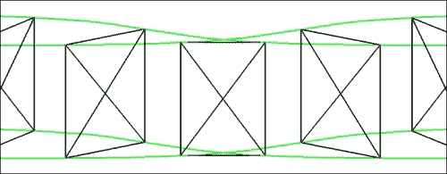
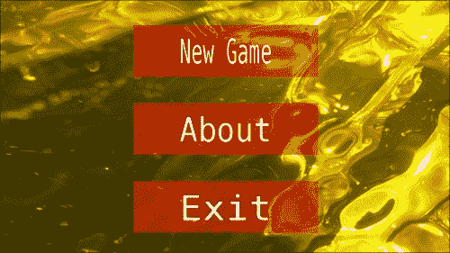
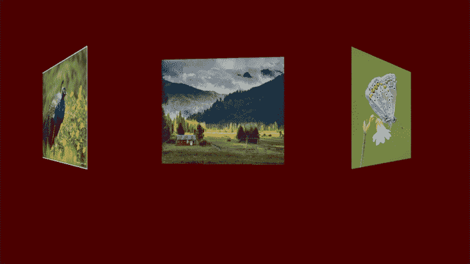
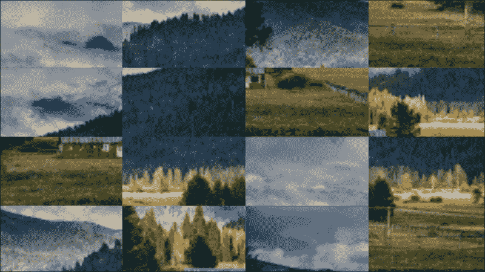

# 第九章：编写一个拼图游戏

在本章中，我们将涵盖：

+   实现拼图游戏逻辑

+   实现 3D 动画图像选择器

+   基于页面的用户界面

+   带有 Picasa 下载器的图像画廊

+   实现完整的拼图游戏

# 引言

在本章中，我们继续将前几章的食谱组合在一起。我们将实现一个拼图游戏，玩家需要将拼图块拼在一起以重现原始图像。图像是从 Picasa 照片托管特色画廊流式传输的，可以通过 3D 动画图像选择器进行挑选。我们的游戏有一个简单的基于页面的用户界面，可以作为更复杂游戏 UI 框架的起点。

### 注意

本章节的示例项目实际上是作者在 Google Play 上发布的 Linderdaum Puzzle HD 游戏的简化版本：[`play.google.com/store/apps/details?id=com.linderdaum.engine.puzzLHD`](http://play.google.com/store/apps/details?id=com.linderdaum.engine.puzzLHD)。

# 实现拼图游戏逻辑

本食谱展示了如何为拼图游戏实现游戏逻辑。游戏由一组矩形瓦片组成，这些瓦片在屏幕上随机排列并渲染。用户可以点击单个瓦片，并将它们移动，与其他瓦片交换位置。让我们草拟实现此逻辑的骨干数据结构。

## 准备开始

为了更好地感受游戏逻辑，你可以构建并运行`2_PuzzleProto`项目，该项目可以从[www.packtpub.com/support](http://www.packtpub.com/support)下载。如果你想享受功能完整的游戏，只需继续从 Google Play 下载我们的 Linderdaum Puzzle HD。你可以在这里下载：[`play.google.com/store/apps/details?id=com.linderdaum.engine.puzzLHD`](http://play.google.com/store/apps/details?id=com.linderdaum.engine.puzzLHD)。


## 如何操作...

1.  首先，我们需要`clTile`类来存储单个拼图块的状态。它包含瓦片左上角的当前坐标、瓦片在网格中的原始索引以及此瓦片将要移动到的目标坐标：

    ```kt
    class clTile
    {
    public:
      int   FOriginX, FOriginY;
      vec2  FCur, FTarget;
      LRect FRect;
      clTile(): FOriginX( 0 ), FOriginY( 0 ) {};
    ```

1.  第二个构造函数计算并设置`FRect`字段，该字段包含稍后用于渲染的纹理坐标：

    ```kt
      clTile( int OriginX, int OriginY, int Columns, int Rows ): FOriginX( OriginX )
      , FOriginY( OriginY )
      {
    ```

1.  计算瓦片的纹理坐标并将它们存储在`FRect`中：

    ```kt
        float TileWf = 1.0f / Columns, TileHf = 1.0f / Rows;
        float X1f = TileWf * ( OriginX + 0 );
        float X2f = TileWf * ( OriginX + 1 );
        float Y1f = TileHf * ( OriginY + 0 );
        float Y2f = TileHf * ( OriginY + 1 );
        FRect = LRect( X1f, Y1f, X2f, Y2f );
        FTarget = FCur = vec2( OriginX, OriginY );
      }
    ```

1.  下两个方法设置目标和当前坐标：

    ```kt
      void SetTarget( int X, int Y )
      { FTarget = vec2( X, Y ); }
      void MoveTo( float X, float Y )
      { FCur.x = X; FCur.y = Y; };
    ```

1.  瓦片平滑地移动到目标坐标。我们使用时间计数器更新瓦片位置，并且每个时间步都重新计算坐标：

    ```kt
      void Update( float dT )
      {
        vec2 dS = FTarget - FCur;
        const float c_Epsilon = 0.001f;
        if ( fabs( dS.x ) < c_Epsilon )
        {
          dS.x = 0;
          FCur.x = FTarget.x;
        }
        if ( fabs( dS.y ) < c_Epsilon )
        {
          dS.y = 0;
          FCur.y = FTarget.y;
        }
        const float Speed = 10.0f;
        FCur += Speed * dT * dS;
      }
    };
    ```

1.  游戏的状态由一个瓦片数组表示，该数组存储在`clPuzzle`类中：

    ```kt
    class clPuzzle
    {
    public:
      mutable std::vector<clTile> FTiles;
      int FColumns, FRows;
      bool FMovingImage;
      int FClickedI, FClickedJ;
      float FOfsX, FOfsY;

      clPuzzle()
      : FMovingImage( false )
      , FClickedI( -1 ), FClickedJ( -1 )
      , FOfsX( 0.0f ), FOfsY( 0.0f )
      {
        Retoss( 4, 4 );
      }
    ...
    ```

1.  交换由它们的`(i,j)`二维坐标指定的两个瓦片：

    ```kt
      void SwapTiles( int i1, int j1, int i2, int j2 )
      {
        std::swap( FTiles[j1 * FColumns + i1],FTiles[j2 * FColumns + i2] );
      }
    };
    ```

1.  如果所有的瓦片都在它们的位置上，游戏就完成了。为了检查瓦片是否在位，我们需要比较它的`FOriginX`和`FOriginY`坐标与它当前的`i`和`j`坐标：

    ```kt
    bool clPuzzle::IsComplete() const
    {
      for ( int i = 0; i != FColumns; i++ )
      {
        for ( int j = 0; j != FRows; j++ )
        {
          clTile* T = GetTile( i, j );
          if ( T->FOriginX != i || T->FOriginY != j)
            return false;
        }
      }
      return true;
    }
    ```

1.  `clPuzzle::Timer()` 调用 `Update()` 方法，该方法计算每个瓦片的新坐标。这样做的目的是当玩家松开触摸时，让瓦片返回到原来的位置：

    ```kt
    void clPuzzle::Timer( float DeltaSeconds )
    {
      for ( int i = 0; i != FColumns; i++ )
      {
        for ( int j = 0; j != FRows; j++ )
          GetTile( i, j )->Update( DeltaSeconds );
      }
    }
    ```

1.  游戏的初始状态在 `Retoss()` 方法中生成：

    ```kt
    void Puzzle::Retoss(int W, int H)
    {
      FColumns = W;
      FRows    = H;
      FTiles.resize( FColumns * FRows );
    ```

1.  首先，我们在初始位置创建所有瓦片：

    ```kt
      for ( int i = 0; i != FColumns; i++ )
        for ( int j = 0; j != FRows; j++ )
          FTiles[j * FColumns + i] =clTile( i, FRows - j - 1, FColumns, FRows );
    ```

1.  然后，我们使用克努斯洗牌法，也称为费雪-耶茨洗牌法（[`en.wikipedia.org/wiki/Fisher%E2%80%93Yates_shuffle`](http://en.wikipedia.org/wiki/Fisher%E2%80%93Yates_shuffle)），生成瓦片的随机排列：

    ```kt
      for ( int i = 0; i != FColumns; i++ )
      {
        for ( int j = 0; j != FRows; j++ )
        {
          int NewI = Math::RandomInRange( i, FColumns - 1 );
          int NewJ = Math::RandomInRange( j, FRows - 1    );
          SwapTiles( i, j, NewI, NewJ );
        }
      }
      …
    }
    ```

1.  用户输入的处理在 `OnKey()` 方法中完成。当用户按下鼠标按钮或轻触屏幕时，该方法会以 `KeyState` 参数为真被调用。在鼠标释放或轻触结束时，`OnKey()` 方法会以 `KeyState` 设置为假被调用。`mx` 和 `my` 参数包含触摸的 2D 坐标。一旦触摸激活，我们存储瓦片的索引和触摸点相对于瓦片左上角的初始偏移量：

    ```kt
    void Puzzle::OnKey( float mx, float my, bool KeyState )
    {
      int i = (int)floor( mx * FColumns );
      int j = (int)floor( my * FRows );
      int MouseI = ( i >= 0 && i < FColumns ) ? i : -1;
      int MouseJ = ( j >= 0 && j < FRows ) ? j : -1;
      FMovingImage = KeyState;
      if ( FMovingImage )
      {
        FClickedI = MouseI;
        FClickedJ = MouseJ;

        if ( FClickedI >= 0&& FClickedJ >= 0&& FClickedI < FColumns&& FClickedJ < FRows )
        {
          FOfsX = ( ( float )FClickedI / FColumns - mx );
          FOfsY = ( ( float )FClickedJ / FRows    - my );
        }
        else
        {
          FClickedI = FClickedJ = -1;
        }
      }
      else
    ```

1.  当触摸结束时，我们检查新瓦片位置的有效性，并用新位置中的瓦片交换选择的瓦片：

    ```kt
      {
        bool NewPosition = ( MouseI != FClickedI ||MouseJ != FClickedJ );
        bool ValidPosition1 = ( FClickedI >= 0 && FClickedJ >=0 && FClickedI < FColumns && FClickedJ < FRows );
        bool ValidPosition2 = ( MouseI >= 0 && MouseJ >= 0 &&MouseI < FColumns && MouseJ < FRows );
        if ( NewPosition && ValidPosition1 && ValidPosition2 )
        {
          int dX = MouseI - FClickedI;
          int dY = MouseJ - FClickedJ;
          SwapTiles( FClickedI, FClickedJ, MouseI, MouseJ );
        }
        if ( IsComplete() )
        {
          // TODO: We've got a winner!
        }
        FClickedI = FClickedJ = -1;
      }
    }
    ```

## 工作原理...

`2_PuzzleProto` 示例使用 `clPuzzle` 类来展示没有任何纹理或花哨图形的游戏玩法。

为了渲染拼图的状态，使用了以下例程：

```kt
void RenderGame( clPuzzle* g, const vec4& Color )
{
```

如果我们选择了瓦片，我们将其移动到新的鼠标或触摸位置：

```kt
  if ( g->FMovingImage && g->FClickedI >= 0 &&g->FClickedI >= 0 &&g->FClickedI < g->FColumns &&g->FClickedJ < g->FRows )
  {
    vec2 MCI = Env_GetMouse();
    int NewI = g->FClickedI;
    int NewJ = g->FClickedJ;
    float PosX, PosY;
    PosX = Math::Clamp( MCI.x + g->FOfsX, 0.0f, 1.0f );
    PosX *= g->FColumns;
    PosY = Math::Clamp( MCI.y + g->FOfsY, 0.0f, 1.0f );
    PosY *= g->FRows;
    g->GetTile( NewI, NewJ )->MoveTo( PosX, PosY );
  }
```

最后，每个瓦片通过调用 `DrawTile()` 方法进行渲染：

```kt
  for ( int i = 0; i != g->FColumns; i++ )
    for ( int j = 0; j != g->FRows; j++ )
      DrawTile( g, i, j, Color );
}
```

`DrawTile()` 方法计算瓦片在标准化屏幕坐标 `(0...1)` 中的位置，并使用矩形顶点数组和 `g_Canvas` 对象来渲染 `Tile` 实例：

```kt
void DrawTile( clPuzzle* g, int i, int j, const vec4& Color )
{
  if ( i < 0 || j < 0 || i >= g->FColumns || j >= g->FRows )
  { return; }
  clTile* Tile = g->GetTile( i, j );
  Tile->SetTarget( i, j );
  float X = Tile->FCur.x;
  float Y = Tile->FCur.y;
  float TW = 1.0f / g->FColumns;
  float TH = 1.0f / g->FRows;
  vec4 TilePosition(TW * ( X + 0 ), TH * ( Y + 0 ),TW * ( X + 1 ), TH * ( Y + 1 ) );
  g_Canvas->TexturedRectTiled(TilePosition, 1.0f, 1.0f, g_Texture,Effect, Color, VA, Tile->GetRect() );
}
```

在接下来的教程中，我们将这个简单的游戏玩法与动画图像选择器和 Picasa 图像下载器结合起来，创建一个功能更丰富的拼图游戏。

# 实现 3D 动画图像选择器

我们拼图游戏的主要 UI 元素是动画 3D 图像选择器。在本教程中，我们将向您展示如何渲染类似旋转木马的动画选择器并与用户互动。

## 准备就绪

在继续本教程之前，您可能需要回到第七章，*跨平台 UI 和输入系统*，了解 `Canvas` 类是如何工作的。为了更好地理解本教程中的代码，还需要一些数学知识。

## 如何操作...

渲染背后的想法非常简单。我们让各个四边形沿着四条引导曲线移动，使它们的角滑动。下图展示了同一个四边形在不同位置的一系列状态：



四条曲线展示了四边形角的路径。

1.  我们从辅助类 `Curve` 开始，这个类实现了对控制点集的线性插值。曲线以参数形式表示。

    > *曲线的参数方程是通过将曲线上的点的坐标表示为参数的函数来表示这条曲线的方程。*

    参考文献：[`en.wikipedia.org/wiki/Parametric_equation`](http://en.wikipedia.org/wiki/Parametric_equation)

    ```kt
    class Curve
    {
    public:
      Curve() {}
    ```

1.  `AddControlPoint()`方法向曲线添加一个新的控制点。曲线是延迟计算的，现在我们只需存储指定的值：

    ```kt
      void AddControlPoint( float t, const vec3& Pos )
      {
        T.push_back( t );
        P.push_back( Pos );
      }
    ```

1.  `GetPosition()`方法找到给定参数`t`的段，并计算曲线上点的线性插值坐标：

    ```kt
      vec3 GetPosition( float t ) const
      {
        if ( t <= T[0] ) { return P[0]; }
        int N = (int)T.size();
        int i = N - 1;
        for ( int s = 0 ; s < N - 1 ; s++ )
        {
          if ( t > T[s] && t <= T[s + 1] )
          {
            i = s;
            break;
          }
        }
        if ( i >= N - 1 ) { return P[N - 1]; }
        vec3 k = ( P[i + 1] - P[i] ) / ( T[i + 1] - T[i] );
        return k * ( t - T[i] ) + P[i];
      }
    ```

1.  控制点和相应的参数存储在两个向量中：

    ```kt
      std::vector<float> T;
      std::vector<vec3> P;
    };
    ```

1.  3D 图像选择器的控制逻辑在`clFlowUI`类中实现：

    ```kt
    class clFlowUI: public iObject
    {
    public:
      clFlowUI( clPtr<clFlowFlinger> Flinger, int NumQuads )
      {
        FFlinger = Flinger;
    ```

1.  为我们的 UI 创建一个 3D 相机：

    ```kt
        mtx4 RotationMatrix;
        RotationMatrix.FromPitchPanRoll( 0.0f, -90.0f, 0.0f );
        FView = mtx4::GetTranslateMatrix(-vec3( 0.0f, -13.2f, 1.2f ) ) * RotationMatrix;
    ```

1.  使用标准透视相机：

    ```kt
        FProjection = Math::Perspective(45.0f, 1.33333f, 0.4f, 2000.0f );
        float Y[] = { c_Height, c_Height, 0, 0 };
        float Offs[] = { -c_PeakOffset, c_PeakOffset,c_PeakOffset, - c_PeakOffset };
        float Coeff[] ={ c_Slope, - c_Slope, - c_Slope, c_Slope };
        for ( int i = 0 ; i < 4 ; i++ )
        {
          const int c_NumPoints = 100;
          for ( int j = - c_NumPoints / 2 ;j < c_NumPoints / 2 + 1 ; j++ )
          {
            float t = ( float )j * c_PointStep;
            float P = Coef[i] * ( Ofs[i] - t );
    ```

1.  余切乘以`exp(-x²)`：

    ```kt
            float Mult = c_FlowMult *exp( - c_FlowExp * P * P );
            vec3 Pt( -t, Mult * c_Elevation *atan( P ) / M_PI, Y[i] );
            FBaseCurve[i].AddControlPoint(t *exp( c_ControlExp * t * t ), Pt);
          }
        }
        …
    ```

1.  使用当前元素数量更新 UI 滚动限制：

    ```kt
        FFlinger->FMinValue = 0.0f;
        FFlinger->FMaxValue = c_OneImageSize *( ( float )FNumImg - 1.0f );
      }
    ```

1.  计算当前选定索引图像的索引：

    ```kt
      int GetCurrentImage() const
      {
         return
           (int)ceilf( FFlinger->GetValue() / OneImageSize );
      }
    ```

1.  每个 四边形的坐标在`QuadCoords()`方法中计算，该方法为每条引导曲线调用`Curve::GetPosition()`：

    ```kt
      virtual void QuadCoords( vec3* Pts, float t_center )const
      {
        float Offs[] ={ c_QuadSize, - c_QuadSize, - c_QuadSize, c_QuadSize };
        for ( int i = 0 ; i < 4 ; i++ )
          Pts[i] = FBaseCurve[i].GetPosition(t_center - Offs[i] / 2 );
      }
    ```

1.  为每条基本曲线添加轨迹控制点：

    ```kt
      Curve FBaseCurve[4];
    };
    ```

1.  以下是引导曲线的参数。屏幕单位（在标准化坐标中）之间的连续控制点数量：

    ```kt
    const float c_PointStep = 0.2f;
    ```

1.  用于四边形顶点的经验调整参数，速度：

    ```kt
    const float c_ControlExp = 0.001f;
    ```

1.  图像的高度，即两条曲线之间的距离，厚度，以及曲线的斜率：

    ```kt
    const float c_Height = 4.0f
    const float c_Elevation = 2.0f;
    const float c_Slope = 0.3f;
    ```

1.  曲线峰值的对称位移，指数衰减，以及主系数：

    ```kt
    const float c_PeakOffset = 3.0f;
    const float c_FlowExp = 0.01f;
    const float c_FlowMult = 4.0f;
    ```

1.  `clFlowFlinger`类保存选择器的动态状态：

    ```kt
    class clFlowFlinger: public iObject
    {
    public:
      clFlowFlinger()
      : FPressed( false ), FValue( 0.0f ), FVelocity( 0.0f ) {}
      virtual ~clFlowFlinger() {}
    ```

1.  决定在选定时要做什么——如果选择完成则返回`true`，否则返回`false`：

    ```kt
      virtual bool HandleSelection( float mx, float my ){ return false; }
    ```

1.  更新动画和处理触摸：

    ```kt
      void Update( float DeltaTime );
      void OnTouch( bool KeyState );
    …
    };
    ```

1.  触摸处理在`OnTouch()`方法中执行：

    ```kt
    void clFlowFlinger::OnTouch( bool KeyState )
    {
      int CurImg = ( int )ceilf( FValue / OneImageSize );
      vec2 MousePt = Env_GetMouse(); 
      double MouseTime = Env_GetMouseTime();
      FPressed = KeyState;
      if ( KeyState )
      {
        FClickPoint = FLastPoint = MousePt;
        FClickedTime = FLastTime  = MouseTime;
        FInitVal = FValue;
        FVelocity = 0;
      }
      else
      {
    ```

1.  如果触摸点移动距离少于屏幕的 1%，或者手势耗时少于 10 毫秒，我们认为这是一个点击：

    ```kt
        double Time = MouseTime - FClickedTime;
        double c_TimeThreshold = 0.15;
        float c_LenThreshold = 0.01f;
        if ( ( FClickPoint - MousePt ).Length() <c_LenThreshold&& ( Time < c_TimeThreshold ) )
        {
          HandleSelection( MousePt.x, MousePt.y );
          FVelocity = 0;
          return;
        }
    ```

1.  否则，如果手势持续时间少于 300 毫秒，我们停止运动：

    ```kt
        float c_SpanThreshold = 0.3f;
        float dT = (float)( MouseTime - FLastTime );
        float dSx = MousePt.x - FLastPoint.x;
        FVelocity = ( dT < c_SpanThreshold ) ?-AccelCoeff * dSx / dT : 0;
      }
    }
    ```

1.  位置和时序的系数是根据运动的感知经验选择的。动态实现在`Update()`方法中：

    ```kt
    void clFlowFlinger::Update( float DeltaTime )
    {
      float NewVal = 0.0f;
      if ( FPressed )
      {
        vec2 CurPoint = Env_GetMouse();
        NewVal = FInitVal;
        NewVal -= AccelCoef * ( CurPoint.x - FLastPoint.x );
      }
      else
      {
        NewVal = FValue + FVelocity * DeltaTime;
        FVelocity -= FVelocity * c_Damping * DeltaTime;
    ```

1.  当我们到达最后一个图像时，只需将位置固定在引导曲线上。为了获得流畅的体验，我们还通过使用线性公式插值位置添加了**橡皮筋**效果。`Damper`系数纯粹是经验性的：

    ```kt
        const float Damper = 4.5f * DeltaTime;
        if ( NewVal > FMaxValue )
        {
          FVelocity = 0;
          NewVal = FMaxValue * Damper + 
            NewVal * ( 1.0f - Damper );
        }
        else if ( NewVal < FMinValue )
        {
          FVelocity = 0;
          NewVal = FMinValue * Damper +NewVal * ( 1.0f - Damper );
        }
      }
      FValue = NewVal;
    }
    ```

1.  在`FlowFlinger.h`文件中定义了一组舒适的滚动参数：

    ```kt
    const float c_AccelCoeff = 15.0f;
    const float c_ValueGain =  0.1f;
    const float c_IntGain   = 0.1f;
    const float c_DiffGain  = 0.1f;
    const float c_Damping   = 0.7f;
    ```

鼓励您尝试自己的值。

## 工作原理...

轮播渲染基于`Canvas`，在`RenderDirect()`函数中实现：

```kt
void RenderDirect( clPtr<clFlowFlinger> Control )
{
  int Num = Control->FNumImg;
  if ( Num < 1 ) { return; }
  int CurImg = Control->GetCurrentImage();
  float Dist = ( float )( Num * c_OneImageSize );
```

我们手动指定四边形的渲染顺序。首先渲染左侧的图像，然后是右侧的图像，最后是中央的图像：

```kt
  int ImgOrder[] = {CurImg - 3, CurImg - 2, CurImg - 1,CurImg + 3, CurImg + 2, CurImg + 1,CurImg };
```

实际渲染时检查数组边界，并将`Projection`和`View`矩阵应用到四边形的每个角：

```kt
  for ( int in_i = 0 ; in_i < 7 ; in_i++ )
  {
    int i = ImgOrder[in_i];
    if ( i < 0 )
      { i += ( 1 - ( ( int )( i / Num ) ) ) * Num; }
    if ( i >= Num )
      { i -= ( ( int )( i / Num ) ) * Num; }
    if ( i < Num && i > -1 )
    {
      vec3 Pt[4];
      Control->QuadCoords(Pt,Control->FFlinger->FValue - ( float )(i) *c_OneImageSize);
      vec3 Q[4];
      for(int j = 0 ; j < 4 ; j++)
        Q[j] = Control->FProjection *Control->FView * Pt[j];
      BoxR(Q, 0xFFFFFF);
    }
  }
}
```

最终的渲染是通过`BoxR()`函数完成的，该函数实现在`main.cpp`文件中。

为了支持选择功能，需要对轮播图代码进行修改。我们添加了`GeomUtil.h`文件，其中包含了一些交线测试方法。类似于`RenderFlow()`过程，我们遍历可见的图像，并对每个图像，从点击位置通过图像平面发射射线进行交点检测：

```kt
int clFlowUI::GetImageUnderCursor( float mx, float my ) const
{
  if ( FNumImg < 1 ) { return -1; }
```

将 2D 屏幕触摸点映射到 3D 点和一个射线：

```kt
  vec3 Pt, Dir;
  MouseCoordsToWorldPointAndRay( FProjection, FView,mx, my, Pt, Dir );
  int CurImg = GetCurrentImage();
  int ImgOrder[] = { CurImg, CurImg - 1, CurImg + 1, CurImg - 2,CurImg + 2, CurImg - 3, CurImg + 3 };
```

遍历当前图像四边形：

```kt
  for ( int cnt = 0 ; cnt < countof( ImgOrder ) ; cnt++ )
  {
    int i = ImgOrder[cnt];
    if ( i < 0 || i >= (int)FNumImg ) { continue; }
```

将四边形坐标转换到世界空间：

```kt
    vec3 Coords[4];
    QuadCoords( Coords, FFlinger->GetValue() –( float )(i) * OneImageSize );
```

将射线与两个三角形相交：

```kt
    vec3 ISect;
    if ( IntersectRayToTriangle( Pt, Dir,Coords[0], Coords[1], Coords[2], ISect ) ||( IntersectRayToTriangle( Pt, Dir,Coords[0], Coords[2], Coords[3], ISect ) ) )
      return i;
  }
  return -1;
}
```

`Unproject()`和`MouseCoordsToWorldPointAndRay()`函数将 2D 屏幕点坐标转换为 3D 世界空间中的射线，我们的轮播图四边形在其中飞行。它们的实现在`GeomUtil.h`文件中可以找到。

为了将选择器回退到特定的图像，我们设置了一个目标位置：

```kt
void SetCurrentImageTarget( int i )
{ FFlinger->SetTargetValue( ( float )i * ( OneImageSize ) ); }
```

## 还有更多...

在这个示例中，我们使用了 3D 线来渲染轮播图。使用`Canvas`类来渲染每个带纹理的四边形非常简单。我们也鼓励读者添加反射效果，这可以通过使用额外的变换来渲染相同的一组四边形，从而轻松实现水平面的反射效果。

## 另请参阅

+   *实现完整的拼图游戏*

# 基于页面的用户界面

在上一章中，我们开发了一个只包含单个页面的游戏。然而，大多数现代移动游戏都包含由复杂业务逻辑支持的复杂用户界面。典型的用户界面包括几个全屏页面和多个 UI 元素，如按钮、图像和输入框。这些使用游戏内渲染系统进行渲染，并不依赖于底层操作系统的用户界面。在本示例中，我们将展示如何解决这个问题。

## 准备就绪

你可能想要了解目前存在的开源 C++跨平台 UI 库。以下链接将帮助你：[`en.wikipedia.org/wiki/List_of_platform-independent_GUI_libraries`](http://en.wikipedia.org/wiki/List_of_platform-independent_GUI_libraries)。

如果你想要为游戏提供完整的 HTML/CSS 用户界面，我们建议你看看**libRocket** ([`librocket.com`](http://librocket.com))。它的集成过程简单直接，但超出了本书的讨论范围。

## 如何操作...

1.  单个页面处理所有按键、触摸、定时器和渲染事件：

    ```kt
    class clGUIPage: public iObject
    {
    public:
      clGUIPage(): FFallbackPage( NULL ) {}
      virtual ~clGUIPage() {}

      virtual void Update(float DeltaTime) {}
      virtual void Render() {}
      virtual void SetActive();
    ```

1.  处理基本的 UI 交互事件：

    ```kt
      virtual bool OnKey( int Key, bool KeyState );
      virtual void OnTouch( const LVector2& Pos, boolTouchState );
    ```

1.  当点击**BACK**或**ESC**按钮时返回的页面：

    ```kt
      clPtr<clGUIPage> FFallbackPage;
      …
    };
    ```

1.  所有 UI 页面都由`clGUI`类管理，该类将所有事件委托给当前选中的页面：

    ```kt
    class clGUI: public iObject
    {
    public:
      clGUI(): FActivePage( NULL ), FPages() {}
      virtual ~clGUI() {}
      void AddPage(const clPtr<clGUIPage>& P)
      {
        P->FGUI = this;
        FPages.push_back(P);
      }
      void SetActivePage( const clPtr<clGUIPage>& Page )
      {
        if ( Page == FActivePage ) { return; }
        FActivePage = Page;
      }
      void Update( float DeltaTime )
      {
        if ( FActivePage ) FActivePage->Update( DeltaTime );
      }
      void Render()
      {
        if ( FActivePage ) FActivePage->Render();
      }
      void OnKey( vec2 MousePos, int Key, bool KeyState )
      {
        FMousePosition = MousePos;
        if ( FActivePage ) FActivePage->OnKey( Key, KeyState );
      }
      void OnTouch( const LVector2& Pos, bool TouchState )
      {
        if ( FActivePage )FActivePage->OnTouch( Pos, TouchState );
      }
    private:
      vec2 FMousePosition;
      clPtr<clGUIPage> FActivePage;
      std::vector< clPtr<clGUIPage> > FPages;
    };
    ```

1.  页面本身作为`clGUIButton`对象的容器：

    ```kt
    class clGUIButton: public iObject
    {
    public:
      clGUIButton( const LRect& R, const std::string Title,clPtr<clGUIPage> Page ): FRect(R), FTitle(Title), FPressed(false), FFallbackPage(Page) {}

      virtual void Render();
      virtual void OnTouch( const LVector2& Pos, boolTouchState );
    ```

1.  这里最重要的一点是`clGUIButton`可以检测触摸点是否包含在按钮内部：

    ```kt
      virtual bool Contains( const LVector2& Pos )
      {
        return FRect.ContainsPoint( Pos );
      }
    public:
      LRect       FRect;
      std::string FTitle;
      bool        FPressed;
      clPtr<clGUIPage> FFallbackPage;
    };
    ```

这两个类足以构建我们游戏的简约交互式用户界面。

## 工作原理...

在设置用户界面时，我们构建页面并将它们添加到全局`g_GUI`对象：

```kt
  g_GUI = new clGUI();
  clPtr<clGUIPage> Page_MainMenu = new clPage_MainMenu;
  clPtr<clGUIPage> Page_Game     = new clPage_Game;
  clPtr<clGUIPage> Page_About    = new clPage_About;
```

当点击**BACK**按钮时，页面回流如下所示：

```kt
Page_About → Page_MainMenu
Page_Game → Page_MainMenu
Page_MainMenu → exit the application
```

我们相应地设置返回导航目标页面的引用：

```kt
  Page_Game->FFallbackPage = Page_MainMenu;
  Page_About->FFallbackPage = Page_MainMenu;
  g_GUI->AddPage( Page_MainMenu );
  g_GUI->AddPage( Page_Game );
  g_GUI->AddPage( Page_About );
```

主菜单页面还包含一些有用的按钮，可以帮助玩家在页面间导航：

```kt
  Page_MainMenu->AddButton( new clGUIButton( LRect(0.3f, 0.1f, 0.7f, 0.3f ), "New Game", Page_Game  ) );
  Page_MainMenu->AddButton( new clGUIButton( LRect(0.3f, 0.4f, 0.7f, 0.6f ), "About",    Page_About ) );
  Page_MainMenu->AddButton( new clGUIButton( LRect(0.3f, 0.7f, 0.7f, 0.9f ), "Exit",     NULL       ) );
```

应用程序从主菜单页面开始：

```kt
  g_GUI->SetActivePage( Page_MainMenu );
```

单个页面的实现非常直接。`clPage_About`包含一些信息，我们只覆盖了`Render()`方法：

```kt
class clPage_About: public clGUIPage
{
public:
  virtual void Render()
  {
    …
  }
};
```

主菜单页面包含三个按钮——一个用于退出应用程序，另一个用于开始游戏，还有一个用于进入关于页面：

```kt
class clPage_MainMenu: public clGUIPage
{
public:
```

`OnKey()`方法还处理**BACK**和**ESC**按钮。由于我们的抽象层将这两个键转换成了单一的`LK_ESCAPE`代码，所以我们使用单个检查：

```kt
  virtual bool OnKey( int Key, bool KeyState )
  {
    if ( Key == LK_ESCAPE ) ExitApp();
    return true;
  }
  …
};
```

游戏页面将渲染、触摸处理和计时事件重定向到全局`g_Game`对象：

```kt
class clPage_Game: public clGUIPage
{
public:
  virtual void OnTouch( const LVector2& Pos, bool TouchState )
  {
    g_Game.OnKey(Pos.x, Pos.y, TouchState);
    clGUIPage::OnTouch(Pos, TouchState);
  }
  virtual void Update(float DT)
  {
    g_Game.Timer( DT );
  }
  virtual void Render()
  {
    RenderGame(&g_Game);
    clGUIPage::Render();
  }
};
```

## 还有更多内容...

作为练习，可以在这个简约框架中添加更多 UI 控件。添加静态文本标签和图片很容易。更复杂的 UI 控件，如输入框，也可以实现，但需要更多努力。如果你想要为你的游戏构建复杂的 UI，我们建议使用[`en.wikipedia.org/wiki/List_of_platform-independent_GUI_libraries`](http://en.wikipedia.org/wiki/List_of_platform-independent_GUI_libraries)上的开源 C++ UI 库之一。

## 另请参阅

+   *实现动画 3D 图片选择器*

# 带有 Picasa 下载器的图片库

在这个教程中，我们将把 Picasa 图片下载器与基于旋转木马的 3D 图库集成，并在我们的游戏中将其用作图片选择页面。

## 如何操作...

1.  为了下载图片并跟踪下载器的状态，我们使用描述任何游戏图片状态的`sImageDescriptor`结构：

    ```kt
    class sImageDescriptor: public iObject
    {
    public:
      size_t FID;
      std::string FURL; 
    ```

    现在是图片大小代码部分。我们仅支持一种图片类型：宽度为 256 像素的小预览图。游戏初次加载时可以通过网络加载非常小的图片，比如说不超过 128 像素，然后更大的 256 像素预览图替换它们，以便在 Full HD 屏幕上提供清晰的预览。当玩家从图库中选择了一张图片后，会从服务器获取全尺寸的预览图。

1.  之前描述的方法正是我们在 Linderdaum Puzzle HD 游戏中采用的方法：

    ```kt
      LPhotoSize FSize;
    ```

1.  我们最初将此图片的当前状态设置为`L_NOTSTARTED`：

    ```kt
      LImageState FState;

      clPtr<clGLTexture> FTexture;
      clPtr<clBitmap> FNewBitmap;
      sImageDescriptor():
        FState(L_NOTSTARTED),FSize(L_PHOTO_SIZE_256)
      {
        FTexture = new clGLTexture();
      }
      void StartDownload( bool AsFullSize );
      void ImageDownloaded( clPtr<Blob> Blob );
      void UpdateTexture();
    };
    ```

1.  图片状态可以是以下之一：

    ```kt
    enum LImageState
    {
      L_NOTSTARTED, // not started downloading
      L_LOADING,    // download is in progress
      L_LOADED,     // loading is finished
      L_ERROR       // error occured
    };
    ```

1.  下载完成后，我们使用`FreeImage`库从数据块中异步加载图片：

    ```kt
    void sImageDescriptor::ImageDownloaded( clPtr<clBlob> B )
    {
      if ( !B )
      {
        FState = L_ERROR;
        return;
      }
      clPtr<clImageLoadingCompleteCallback> CB =new clImageLoadingComplete( this );
      clPtr<clImageLoadTask> LoadTask =new clImageLoadTask( B, 0, CB,g_Events.GetInternalPtr() );
      g_Loader->AddTask( LoadTask );
    }
    ```

1.  异步加载很重要，因为图像解码可能相当慢，可能会干扰游戏用户体验。图像加载并转换为 `clBitmap` 后，我们应该更新纹理。纹理更新是在 OpenGL 渲染线程上同步完成的：

    ```kt
    void sImageDescriptor::UpdateTexture()
    {
      this->FState = L_LOADED;
      FTexture->LoadFromBitmap( FNewBitmap );
    }
    ```

1.  让我们上升一个层次，看看如何从服务器获取图像。图像集合是从网站检索并存储在 `clGallery` 对象中的：

    ```kt
    class clGallery: public iObject
    {
    public:
      clGallery(): FNoImagesList(true) {}
    ```

1.  返回全尺寸图像的 URL：

    ```kt
      std::string GetFullSizeURL(int Idx) const
      {
        return ( Idx < (int)FURLs.size() ) ?Picasa_GetDirectImageURL(FURLs[Idx], L_PHOTO_SIZE_ORIGINAL ): std::string();
      }
      size_t GetTotalImages() const{
        return FImages.size();
      }
      clPtr<sImageDescriptor> GetImage( size_t Idx ) const{
        return ( Idx < FImages.size() ) ?
           FImages[Idx] : NULL;
      }
      …
    ```

1.  重新开始下载所有未加载的图像：

    ```kt
      void ResetAllDownloads();
      bool StartListDownload();
      …
    ```

1.  我们存储所有图像的基础 URL 以及图像本身：

    ```kt
      std::vector<std::string> FURLs;
      std::vector< clPtr<sImageDescriptor> > FImages;
    };
    ```

1.  要解码图像列表，我们使用来自 第三章，*网络通信* 的 Picasa 下载器代码：

    ```kt
    class clListDownloadedCallback: public clDownloadCompleteCallback
    {
    public:
      clListDownloadedCallback( const clPtr<clGallery>& G ): FGallery(G) {}
      virtual void Invoke()
      {
        FGallery->ListDownloaded( FResult );
      }

      clPtr<clGallery> FGallery;
    };

    void clGallery::ListDownloaded( clPtr<clBlob> B )
    {
      if ( !B )
      {
        FNoImagesList = true;
        return;
      }
    ```

1.  解析从 Picasa 加载的 XML 图像列表对应的数据块：

    ```kt
      FURLs.clear();
      void*  Data     = B->GetData();
      size_t DataSize = B->GetSize();
      Picasa_ParseXMLResponse(std::string( ( char* )Data, DataSize ), FURLs );
    ```

1.  更新描述符并开始下载图像：

    ```kt
      FImages.clear();
      for ( size_t j = 0 ; j != FURLs.size() ; j++ )
      {
        LPhotoSize Size = L_PHOTO_SIZE_256;
        std::string ImgUrl = Picasa_GetDirectImageURL(FURLs[j], Size);
        clPtr<sImageDescriptor> Desc = new sImageDescriptor();
        Desc->FSize    = Size;
        Desc->FURL     = ImgUrl;
        Desc->FID      = j;
        FImages.push_back(Desc);
        Desc->StartDownload( true );
      }
      FNoImagesList = false;
    }
    ```

1.  当图像加载完成后，该任务会向主线程分派一个 `clBitmap::Load2DImage()` 调用，以便更新 OpenGL 纹理：

    ```kt
    class clImageLoadTask: public iTask
    {
    public:
    …
      virtual void Run()
      {
        clPtr<ImageLoadTask> Guard( this );
        clPtr<iIStream> In = (FSourceStream == NULL) ?g_FS->ReaderFromBlob( FSource ) : FSourceStream;
        FResult = new clBitmap();
        FResult->Load2DImage(In, true);
        if ( FCallback )
        {
          FCallback->FTaskID = GetTaskID();
          FCallback->FResult = FResult;
          FCallback->FTask = this;
          FCallbackQueue->EnqueueCapsule( FCallback );
          FCallback = NULL;
        }
      }
      …
    };
    ```

完整的源代码可以在 `5_Puzzle` 项目中找到。

## 工作原理…

下载是在全局 `g_Downloader` 对象中完成的，下载数据的实际解码是使用 `FreeImage` 库完成的。

## 另请参阅

+   第三章，*网络通信*

# 实现完整的图片拼图游戏

最后，我们手中有了所有部件，可以将它们组合成一个拼图游戏应用程序。

## 准备开始

构建并运行补充材料中的示例 `5_Puzzle`。这个例子与本书中的其他例子一样，可以在 Android 和 Windows 上运行。

## 如何操作…

1.  我们首先通过向 `3_UIPrototype` 项目添加一个新页面 `clPage_Gallery` 来开始。这个页面将渲染和更新委托给全局 `g_Flow` 对象：

    ```kt
    class clPage_Gallery: public clGUIPage
    {
    public:
      …
      virtual void Render()
      {
        RenderDirect( g_Flow );
      }
      virtual void Update(float DT)
      {
        g_Flow->FFlinger->Update(DT);
      }
    private:
      void RenderDirect( clPtr<clFlowUI> Control );
    };
    ```

1.  `RenderDirect()` 方法实际上是对本章中 *实现动画 3D 图像选择器* 的 `RenderDirect()` 方法的轻微修改版本。只有两个区别——我们用 `clCanvas::Rect3D()` 调用（渲染一个带纹理的 3D 矩形）替换了线框四边形渲染，并使用本章最近描述的 `g_Gallery` 对象中的纹理：

    ```kt
      void RenderDirect( clPtr<clFlowUI> Control );
      {
    …
    ```

1.  渲染顺序是从左到右，以防止图像重叠错误：

    ```kt
        int ImgOrder[] = { CurImg - 3, CurImg - 2, CurImg - 1,CurImg + 3, CurImg + 2, CurImg + 1, CurImg };
    ```

1.  根据预定义的顺序渲染七个带纹理的 3D 矩形。如果没有图像可用，我们使用占位符纹理 `g_Texture`：

    ```kt
        for ( int in_i = 0 ; in_i < 7 ; in_i++ )
        {
    …
          if ( i < Num && i > -1 )
          {
            …
            clPtr<sImageDescriptor> Img =g_Gallery->GetImage( i );
            clPtr<clGLTexture> Txt =Img ? Img->FTexture : g_Texture;
            g_Canvas->Rect3D( Control->FProjection,Control->FView, Pt[1], Pt[0], Pt[3], Pt[2], Txt,NULL );
          }
        }
      }
    ```

1.  一旦我们将用户界面分成多个页面，就可以将所有渲染、更新和输入委托给我们的 `g_GUI` 对象。引擎回调实现起来非常简单：

    ```kt
    void OnDrawFrame() 
    {
      g_GUI->Render(); 
    }
    void OnKey( int code, bool pressed )
    {
      g_GUI->OnKey( g_Pos, code, pressed );
    }
    ```

1.  在定时器更新时，我们应该处理其他线程发布的事件：

    ```kt
    void OnTimer( float Delta )
    {
      g_Events->DemultiplexEvents();
      g_GUI->Update( Delta );
    }
    ```

1.  点击处理要复杂一些，因为我们还需要额外存储图库标志。为了简单起见，我们将其实现为全局变量 `g_InGallery`：

    ```kt
    void OnMouseDown( int btn, const LVector2& Pos )
    {
      g_Pos = Pos;
      g_GUI->OnTouch( Pos, true );
      if  ( g_InGallery )
      {
        g_MousePos = Pos;
        g_MouseTime = Env_GetSeconds();
        g_Flow->FFlinger->OnTouch( true );
      }
    }
    ```

回调`OnMouseMove()`和`OnMouseUp()`类似，可以在`5_Puzzle/main.cpp`文件中找到。

## 它是如何工作的…

让我们简要地看一眼这个游戏。主菜单看起来如下面的截图所示：



点击**新游戏**会显示从 Picasa 获取的 3D 旋转木马图像，如下面的截图所示：



向左或向右滚动以选择所需的图片。点击它。游戏场地会以打乱的照片瓦片打开，如下面的截图所示：



移动瓦片以恢复原始图像。

## 还有更多...

以下是一些不错的特点，增加了拼图的可用性，你可以作为练习来实现：

+   实现不同的瓦片网格。4 x 4 的比较容易玩。8 x 14 的相当有挑战性。即使是更大的网格在 10 英寸的平板上也很好看。

+   将正确组装的瓦片缝合在一起，并将它们作为一个整体移动。

+   你可以使用洪泛填充算法来查找相邻的瓦片。

+   保存游戏状态，这样玩家就可以从上次离开的地方继续游戏。当有来电时保存游戏也是一个好主意。你可以在`OnStop()`回调中实现这一点。

+   多阶段预览——在 3D 旋转木马里加载小尺寸的低分辨率预览。一旦粗略预览加载完毕，获取更高分辨率的预览图像。当玩家点击他想玩的游戏图像时，下载高分辨率图像。这将使游戏在 Full HD 平板设备上看起来更加清晰。

+   实现不同的图库。你可以从 Flickr 开始，如第三章中的菜谱*从 Flickr 和 Picasa 获取照片列表*所述，*网络通信*。

## 另请参阅

+   第三章，*网络通信*

+   第四章，*组织虚拟文件系统*

+   第五章，*跨平台音频流媒体*

+   第六章，*统一 OpenGL ES 3 和 OpenGL 3*
