# 第一章：Android 开发工具

在本章中，我们将介绍以下内容：

+   安装 Android 开发工具（ADT）

+   安装 Java 开发工具包（JDK）

+   更新 API 源

+   ADT 的替代安装方法

+   安装本地开发工具包（NDK）

+   模拟 Android

+   创建 Android 虚拟设备（AVDs）

+   使用 Android 调试桥（ADB）与 AVD 进行交互

+   在 AVD 上复制文件

+   通过 ADB 在 AVD 上安装应用程序

# 引言

曾经有位非常聪明的人说过，“你应该亲近你的朋友，但更要亲近你的敌人”。作为一名安全专业人士意味着要关注开发者正在做什么，已经做了什么，以及可能做什么。因为他们的决定极大地影响着安全环境；毕竟，如果没有人编写糟糕的软件，没有人会去利用它！

鉴于这本书面向任何对分析、黑客或开发 Android 平台感兴趣的人，*了解你的敌人*的概念同样适用于你！Android 开发者需要跟上 Android 黑客的活动，以希望在他们给用户带来负面影响之前捕捉到安全漏洞。反之，Android 黑客也需要跟上 Android 开发者的步伐。

接下来的章节将指导你获取最新和最棒的开发及黑客工具，并让你直接与 Android 安全架构进行交互，既包括破解应用程序也包括保护它们。

本章重点介绍如何安装并运行**Android 开发工具**（**ADT**），并讨论如何解决安装问题以及保持工具更新。如果你认为自己已经非常熟悉 Android 开发环境和工具链，可以自由跳过这一章。

不再赘述，让我们直接讨论如何获取并安装最新的 Android 开发工具。

# 安装 Android 开发工具（ADT）

考虑到已经有许多版本的 Android 框架部署在移动平台上，以及支持它的各种不同手机，Android 开发者需要能够访问到 Android 平台上许多设备和操作系统特定的应用程序编程接口（**APIs**）。

我们不仅仅讨论 Android API，还包括手机特定的 API。每个手机制造商都希望通过提供专有的 API 和服务来吸引开发者，例如 HTC OpenSense APIs。ADT 统一了这些 API 的访问方式；提供了所有必要的工具来调试、开发和部署你的 Android 应用；并且让你轻松下载并保持更新。

## 如何操作...

以下步骤将指导你完成下载 ADT 并让它们运行起来的过程：

1.  你需要访问[`developer.android.com`](https://developer.android.com)，并导航到 ADT **下载**页面，或者直接访问[`developer.android.com/sdk/index.html#download`](https://developer.android.com/sdk/index.html#download)。你应该能看到如下截图所示的页面：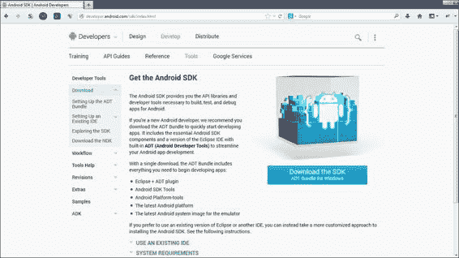

1.  到达那里后，点击**下载 SDK**，应出现以下屏幕：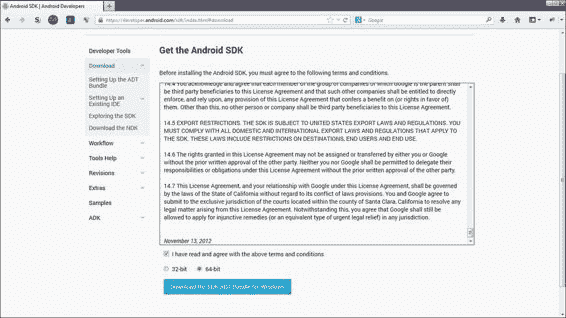

1.  当然，在下载之前，你需要接受许可协议，并选择适当的 CPU 类型。如果你不确定如何检查 CPU 类型，可以选择注册大小。

    在 Windows 上，你需要完成以下步骤：

    1.  点击**开始**。

    1.  在**我的电脑**上右键点击。

    1.  选择**属性**。

    1.  应弹出包含计算机系统特定信息的窗口。你寻找的信息应在**系统**部分，标记为**系统类型**。

    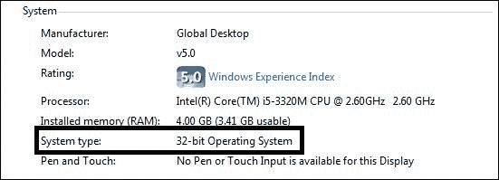

    在 Ubuntu、Debian 或基于 Unix 的发行版上检查系统类型，执行以下步骤：

    1.  按 *Ctrl* + *Alt* + *T* 打开终端，或者直接通过图形界面启动它。

    1.  执行以下命令：

        ```kt
         uname -a

        ```

    1.  或者，你可以使用 `lscpu`，它应该会显示类似于以下截图的内容：

    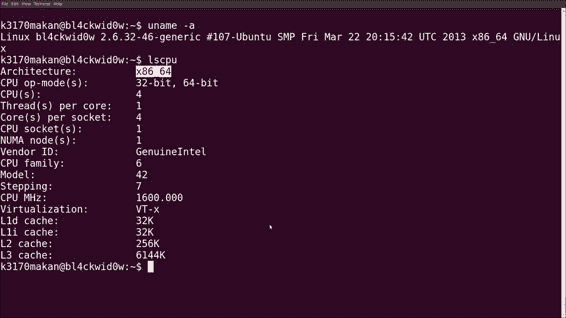

1.  当你对许可协议感到满意，并选择了正确的系统类型后，在 ADT **下载**页面上点击**下载**。下载 ZIP 文件后，在 Windows 上应该看起来像以下截图：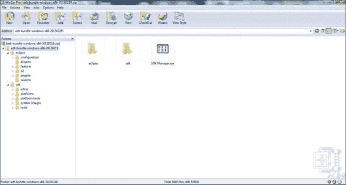

在基于 Linux 或 Unix 的发行版上，该归档文件具有相同的结构。

# 安装 Java 开发工具包（JDK）

Android 使用定制的 Java 运行时版本来支持其应用程序。这意味着，在我们可以使用 Eclipse 开发 Android 应用程序之前，实际上需要安装 Java 运行时和开发工具。这些工具包含在**Java 开发工具包**（**JDK**）中。

## 如何操作...

在 Windows 上安装 JDK 的步骤如下：

1.  从 Oracle 的**下载**页面获取 JDK 的副本，[`www.oracle.com/technetwork/java/javase/downloads/index.html`](http://www.oracle.com/technetwork/java/javase/downloads/index.html)。点击**DOWNLOAD**。以下截图显示了**下载**页面：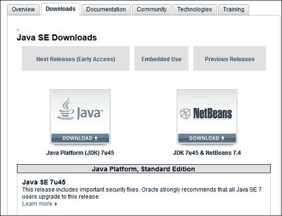

1.  确保选择适合你的系统类型的适当版本；查看前面的演练以了解如何检查系统类型。以下截图突出了 Oracle Java JDK 支持的 Windows 系统类型：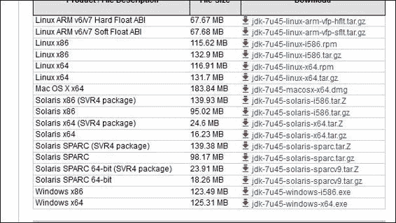

1.  下载 JDK 后，运行`jdk-[版本]-[平台版本].exe`文件。例如，您可能有一个名为`jdk-7u21-windows-i586.exe`的 EXE 文件。现在您需要做的就是按照提示操作，直到所有设置安装完成。一旦启动安装向导，它看起来应该像下面的截图：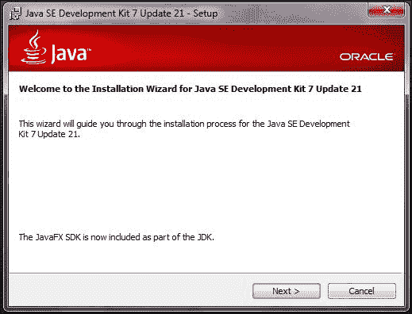

一旦安装向导完成其工作，您应该在`C:\Program Files\Java\jdk[版本]`下看到全新安装的 JDK 和 JRE，并且现在应该能够启动 Eclipse。

## 还有更多…

在 Ubuntu Linux 上安装 Java 运行时和开发工具相对简单。考虑到 Ubuntu 有一个成熟的包和仓库管理器，您只需要通过终端窗口执行几个简单的命令来利用它。您需要执行以下步骤：

1.  打开一个终端，可以通过您的 Unity、KDE 或 Gnome 桌面搜索终端应用程序，或者按*Ctrl* + *Alt* + *T*。

1.  在安装之前，您可能需要更新您的软件包列表，除非您几分钟前已经做过。您可以通过执行以下任一命令来完成此操作：

    ```kt
    sudo aptitude update   //If you have aptitude installed 

    ```

    或者：

    ```kt
    sudo apt-get update

    ```

    您应该会看到您的终端打印出从您的仓库执行的所有下载，如下面的截图所示：

    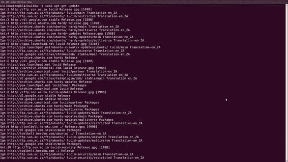

1.  完成后，执行以下命令：

    ```kt
    sudo apt-get install openjdk-[version]-jdk apt-get 

    ```

    如果您已正确添加到`sudoers`文件，您需要输入密码。或者，如果您有 root 用户的密码，可以通过执行以下命令借用 root 权限来完成此操作：

    ```kt
    su root

    ```

    下面的截图显示了这一点：

    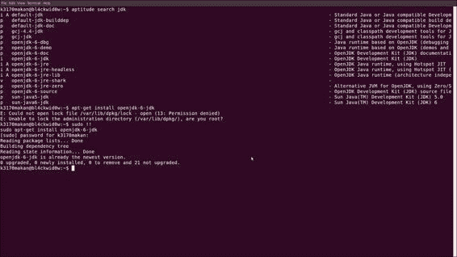

一旦您的 JDK 安装正确，您应该能够启动 Eclipse 并开始进行 Android 开发。当您启动 Eclipse 时，您应该会看到以下截图：


成功安装后，您的 Eclipse 安装中的工具栏应该看起来类似于下面截图中的样子：


# 更新 API 源

SDK 管理器和相关工具与 ADT 包捆绑在一起；它们提供了对最新和最稳定的 API、Android 模拟器镜像以及各种调试和应用程序测试工具的访问。以下演练将指导您如何更新您的 API 和其他与 Android 开发相关的资源。

## 如何操作...

更新 ADT 的 API 如下操作：

1.  导航到 SDK 管理器。如果您从 Windows 进行所有操作，您应该在`ADT-bundle`文件夹的根目录中找到名为`SDK Manager.exe`的文件。Ubuntu 用户可以在`[ADT-bundle 路径]/sdk/tools/android`找到它。

1.  您需要做的就是启动 SDK 管理器。它应该启动并开始检索可用的 API 和文档包的新列表。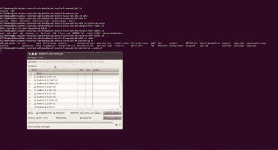

1.  你需要确保选择了 **工具** 软件包；当然，你也可以选择其他附加软件包。一个好的建议是下载最后两个版本。Android 向后兼容性很好，所以你不必太担心较旧的 API 和文档，除非你正在使用它们来支持非常旧的 Android 设备。

1.  你需要表明你接受许可协议。你可以为每个正在安装的对象这样做，或者点击 **全部接受**。

1.  接受完许可协议后，你可以通过点击 **安装** 来收集你的文档和 API，如下截图所示：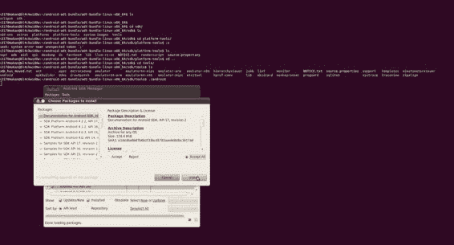

# ADT 的替代安装方法

如果前面介绍安装 Eclipse 和 ADT 插件的方法由于某些原因不奏效，你可以选择走老路，下载你自己的 Eclipse 副本并手动通过 Eclipse 安装 ADT 插件。

## 如何操作...

下载并安装 ADT 的步骤如下：

1.  从 [`www.eclipse.org/downloads/`](http://www.eclipse.org/downloads/) 下载 Eclipse—Helios 或更高版本。请确保选择适合你操作系统的版本。你应该会看到一个类似以下截图的页面：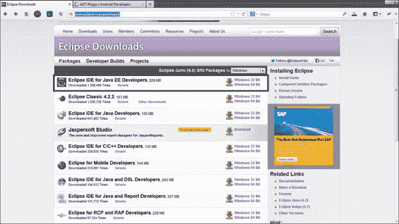

1.  从 Android 网站 [`developer.android.com/sdk/installing/installing-adt.html`](http://developer.android.com/sdk/installing/installing-adt.html) 下载适合你平台版本的 ADT 套件。以下截图显示该网站页面的部分内容：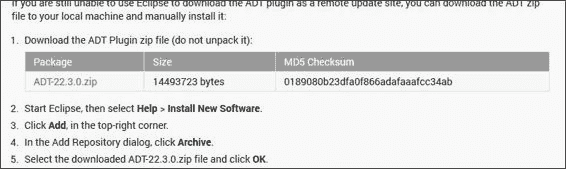

1.  确保你已经安装了 Java JDK。

1.  如果你的 JDK 安装没有问题，运行在第 1 步下载的 Eclipse 安装程序。

1.  一旦 Eclipse 安装完毕并准备就绪，就可以安装你的 ADT 插件了。

1.  打开 Eclipse 并点击菜单栏中的 **帮助** 按钮。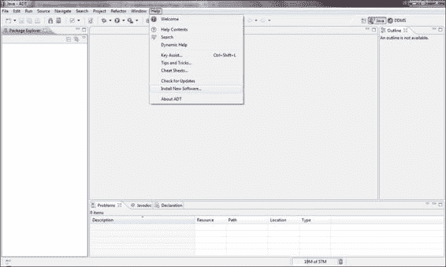

1.  点击 **安装新软件...**。

1.  将会弹出 **可用软件** 对话框。你需要点击 **添加…**。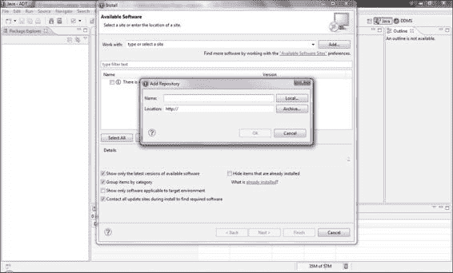

1.  将会显示 **添加仓库** 对话框。你需要点击 **归档...** 按钮。

1.  应该会弹出一个文件浏览器。此时，你需要导航到在前面的步骤中下载的 ADT ZIP 文件。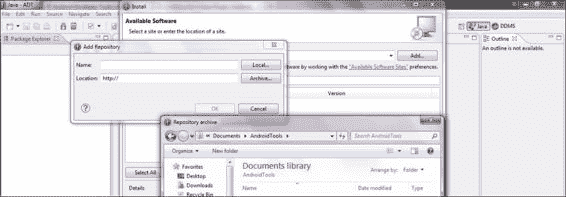

1.  找到 ADT 文件后，点击 **打开**。

1.  然后点击 **确定**。

1.  将会显示 `.zip` 压缩文件中的可用软件包。点击 **全选** 然后点击 **下一步**。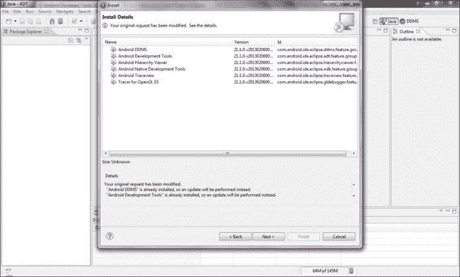

1.  现在你需要接受许可协议；当然，你有权不接受。阅读它总是一个好主意。如果你满意，选择 **我接受许可协议的条款** 选项，然后点击 **完成**。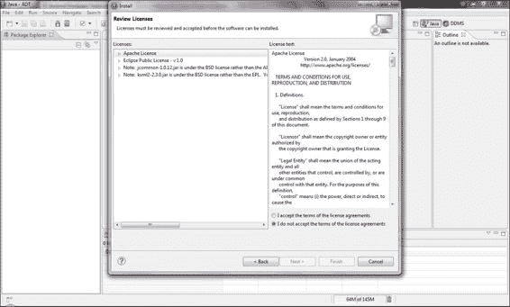

1.  软件安装现在开始。你可能会收到一个警告，指出内容未签名，无法验证真实性。点击**确定**。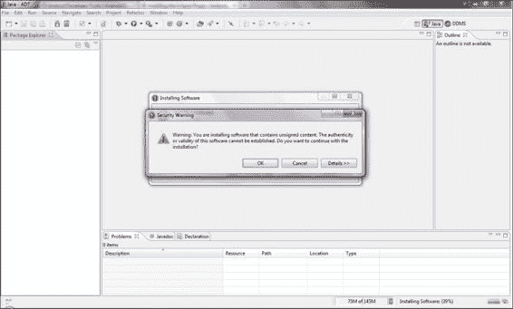

1.  重启 Eclipse。

Android SDK、设备模拟器和支持 Eclipse 的功能现在应该已经准备就绪。查看你的 Eclipse 工具栏，它应该有一些新图标。

# 安装本地开发工具包（NDK）

如果你想在 Android 设备上进行任何低级利用或开发，你需要确保自己能够在 Android 平台上进行较低级别的应用程序编写。低级别指的是使用诸如 C/C++等语言进行开发，这些语言使用的编译器是为了适应嵌入式平台及其各种细节而构建的。

Java 和本地/低级编程语言之间有什么区别？这个话题本身就足以写成一本书。但仅就表面层次的差异来说，Java 代码是在虚拟机中运行的，之前会进行编译和静态分析——即源代码在运行前会被检查。对于 Android Java，这个虚拟机被称为 Dalvik——稍后会详细介绍。Android 的本地开发组件按照其源代码的精确描述，在随 Android 设备附带的类 Linux 嵌入式操作系统上运行。除了编译器扩展和优化之外，没有额外的解释和检查层次，使本地代码得以运行。

Android 团队提供的工具链和文档，使得 Android 开发者能够轻松地进行本地开发，这些工具和文档统称为**本地开发工具包**（**NDK**）。NDK 包含了 Android 开发者编译其 C/C++代码所需的所有工具，并支持 ARM、MIPS 和 x86 嵌入式平台。它还包括一些帮助本地开发者分析和调试本地应用程序的工具。本教程将介绍如何在你的机器上安装并运行 NDK。

在开始之前，你需要查看[`developer.android.com/tools/sdk/ndk/index.html#Reqs`](http://developer.android.com/tools/sdk/ndk/index.html#Reqs)上的系统要求列表，以确保你的机器可以顺利运行。

## 如何操作...

在你的机器上获取 NDK 就像下载它并确保它能运行一样简单。我们可以使用以下步骤：

1.  下载 NDK 非常简单。前往[`developer.android.com/tools/sdk/ndk/index.html`](http://developer.android.com/tools/sdk/ndk/index.html)获取最新版本，并确保选择适合你系统类型的适当版本。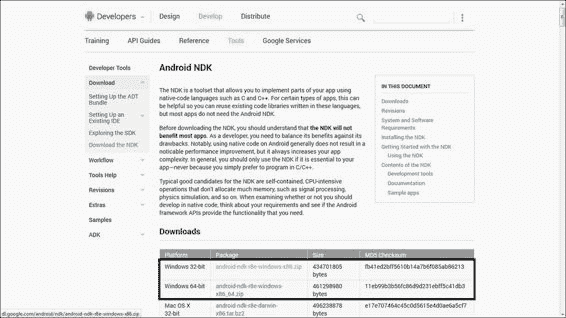

1.  将 NDK 解压到方便的位置。

# 模拟 Android

Android SDK 带有一个相当不错的工具，名为模拟器，它允许你模拟 Android 设备。该模拟器包含一些最受欢迎的手机，并允许你创建自己的模拟手机。使用这个工具，你可以刷新新内核，摆弄平台，当然，还可以调试应用程序和测试你的 Android 恶意软件和应用漏洞。在整本书中，我们将大量使用这个工具，所以，重要的是你要了解 Android 模拟器。

模拟器使用起来非常直观。当你想要启动一个设备时，你需要做的就是从 SDK 文件夹或直接从 Eclipse 打开**Android 虚拟设备**（**AVD**）工具。然后，你可以设置一个新的设备，为其配备自己的内存卡、CPU 和屏幕大小以及其他自定义功能，或者你可以从列表中选择一个预配置的设备。在本节中，我将详细介绍这些内容。

只是一个简短的免责声明：以下屏幕截图是在 Windows 7 机器上拍摄的，但 AVD 管理器和设备模拟器在 Windows 和 Linux 平台上工作完全相同，所以 Linux 用户也将能够跟随操作指南。

## 如何操作...

要在 Eclipse 中模拟一个设备，请按照以下步骤操作：

1.  点击工具栏上的 AVD 管理器图标。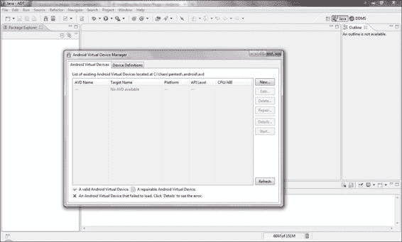

1.  AVD 会弹出。你可以选择一个预配置的特色设备，或者根据你自己的标准设置一个设备。对于这个指南，让我们坚持配置我们自己的设备。

1.  点击**新建…**。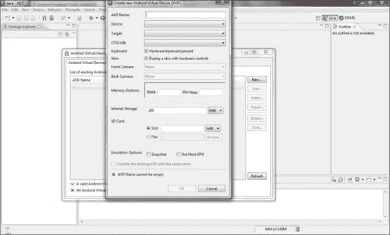

1.  **创建新的 Android 虚拟设备 (AVD)** 对话框应该会弹出。你需要为新的虚拟设备填写一些指标并为其命名。这里你可以输入任何你感觉合适的内容，因为这个指南只是为了让你模拟你的第一个设备。

1.  完成后，点击**确定**。新的设备应该会出现在 AVD 对话框中。

1.  点击你刚刚创建的设备，然后点击**启动…**。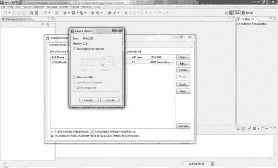

在这一点上，AVD 会提示你选择屏幕尺寸选项；默认值还不错。完成后点击**启动**，几秒钟后你的新 AVD 将开始启动。

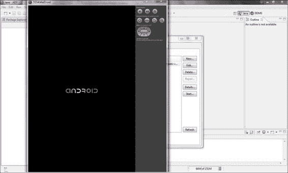

# 创建 Android 虚拟设备 (AVD)

你们中的一些人可能出于某些原因更喜欢从命令行界面使用 AVD。也许你有一些很棒的脚本，你想编写它们来设置一些出色的 AVD。本指南详细介绍了如何创建 AVD 并直接从命令行启动它们。

## 如何操作…

在创建你自己的 AVD 之前，你需要为它指定一些属性；最重要的一个是将要使用的系统镜像。为此，执行以下步骤：

1.  你可以使用以下命令找到可供你使用的系统镜像列表：

    ```kt
    [path-to-sdk-install]/tools/android list targets

    ```

    或者在 Windows 终端中使用以下命令：

    ```kt
    C:\[path-to-sdk-install]\tools\android list targets

    ```

    例如，在命令提示符中输入以下内容：

    ```kt
    C:\Users\kmakan\Documents\adt-bundle-windows-x86-20130219\sdk\tools\android list targets

    ```

    这个命令将列出你系统上可用的系统镜像。如果你想要更多，需要通过 SDK 管理器安装它们。在这份列表中你需要找的信息是目标 ID，因为下一步你需要它们来识别系统镜像。

1.  使用以下命令创建 AVD：

    ```kt
    [path-to-sdk-install]/tools/android create avd –n [name of your new AVD] –t [system image target id]

    ```

    你需要为新创建的 AVD 决定一个名称，通过`–n`开关来指定。你需要在上一步骤中选择系统镜像 ID，使用`–t`开关来指定。如果一切顺利，你应该刚刚创建了一台全新的虚拟机。

1.  你可以使用以下命令启动全新的 AVD：

    ```kt
    [path-to-sdk-install]/tools/emulator –avd [avd name]

    ```

    在这里，`[avd name]`是你在上一步中决定的 AVD 名称。如果一切顺利，你新创建的 AVD 应该会立即启动。

## 还有更多…

你可能想要了解更多关于命令的信息。关于模拟器，它能够模拟具有不同配置的设备。

### 模拟内存卡或外部存储

当你创建虚拟设备时，可以使用`–c`选项指定它也模拟一些外部存储，如下面的命令所示：

```kt
android create –avd –n [avd name] –t [image id] –c [size][K|M]

```

例如，请看以下命令：

```kt
android create –avd –n virtdroid –t 1 –c 128

```

显然，你需要提供新模拟内存卡的大小。你还需要指定单位，通过指定`K`表示千字节或`M`表示兆字节。

### 分区大小

另一件你可能想要做的事情是指定希望分配给内部存储分区的空间大小。你可以通过使用`-partition-size`开关来实现，如下面的命令所示，当你调用模拟器时指定：

```kt
emulator –avd [name] –partition-size [size in MBs]

```

你还需要为分区提供大小。默认情况下，测量单位是兆字节（MB）。

## 另请参阅

在模拟器方面，还有许多其他选项可以利用。如果你有兴趣了解更多，请查看以下链接提供的文档：

+   [`developer.android.com/tools/devices/managing-avds-cmdline.html`](http://developer.android.com/tools/devices/managing-avds-cmdline.html)

+   [`developer.android.com/tools/help/android.html`](http://developer.android.com/tools/help/android.html)

# 使用 Android 调试桥（ADB）与 AVD 交互

与模拟的 Android 设备交互是开发者和 Android 安全工程师/审计师最重要的技能之一。**Android 调试桥**（**ADB**）提供了与 Android 设备本地级别组件交互所需的功能。它允许开发者和安全工程师读取文件系统的内容，并与包管理器、应用程序管理器、内核驱动接口和初始化脚本等进行交互，仅举几例。

## 如何操作...

使用 ADB 与虚拟设备交互的方法如下：

1.  你需要首先启动一个 AVD，或者，如果你愿意，只需通过 USB 将你的 Android 设备连接到任何安装了 SDK 的机器上。你可以使用以下命令启动 AVD：

    ```kt
    emulator –avd [name]

    ```

1.  我们可以使用以下命令列出所有连接的 Android 设备（针对 Windows 机器）：

    ```kt
    C;\\[path-to-sdk-install]\platform-tools\adb devices

    ```

    或者，如果你使用的是 Linux 机器，使用以下命令：

    ```kt
    [path-to-sdk-install]/platform-tools/adb devices

    ```

    这个命令会给你列出连接的设备列表，基本上就是你可以通过 ADB 连接的所有设备。你需要留意列表中的设备名称。当你使用 ADB 启动与它们的连接时，你需要识别这些设备。

1.  你可以使用以下命令向你的 Android 设备启动 shell 连接：

    ```kt
    /sdk/platform-tools/abd shell –s [specific device]

    ```

    或者，如果你恰好知道你想连接的 Android 设备是唯一的模拟设备，你可以使用以下命令：

    ```kt
    /sdk/platform-tools/adb shell –e

    ```

    或者，如果设备是唯一通过 USB 连接的设备，你可以使用以下命令：

    ```kt
    /sdk/platform-tools/adb shell –d

    ```

    开关 `–d`、`-e` 和 `-p` 同样适用于其他 ADB 命令，不仅仅是 shell。如果这操作顺利，你应该会看到类似以下命令的提示字符串——用于标识正在使用的命令 shell 的字符串：

    ```kt
    root@android$

    ```

现在你应该拥有一个功能齐全的 shell，其中包含一些传统的 Unix/Linux 命令和工具。在你的指尖尝试搜索文件系统，了解所有内容的位置。

## 还有更多…

既然你已经连接了一个设备，你需要了解一些关于导航 Android 文件系统和使用命令的知识。以下是一个帮助你开始的小列表：

+   `ls {path}`: 这将列出指定路径目录的内容

+   `cat {file}`: 这将在屏幕上打印文本文件的内容

+   `cd {path}`: 这将改变当前工作目录到指定路径的目录

+   `cd ../`: 这将改变当前工作目录到刚好高一级的目录

+   `pwd`: 这将打印当前工作目录

+   `id`: 这将检查你的用户 ID

## 另请参阅

+   [`developer.android.com/tools/help/adb.html`](http://developer.android.com/tools/help/adb.html)（该链接无需翻译，保留英文）

# 在 AVD 上复制文件

在你即将进行的 Android 平台冒险中，你可能会想要在某些时刻从 Android 设备（无论它们是不是模拟器）上复制东西。复制文件相当简单。你需要的是以下内容：

+   你希望连接的设备

+   你想要复制到/从设备上复制的文件

+   你想要放置这个文件的位置

## 如何操作…

要使用 ADB 访问你 Android 设备上的文件，你需要执行以下操作：

1.  实际上这个过程相当简单。你需要从命令行界面执行以下命令：

    ```kt
    adb {options} pull [path to copy from] [local path to copy to]

    ```

1.  要将文件复制到 AVD 上，你可以使用以下命令：

    ```kt
    adb {options} push [local path to copy from] [path to copy to on avd]

    ```

# 通过 ADB 向 AVD 安装应用程序

有时你可能需要将本地文件系统上的**应用安装包**（**APKs**）安装到你自己拥有的模拟器或设备上。通常基于 Android 的安全工具在 Play 商店中无法获取——因为它们可能会让不守规矩的用户面临过多风险，或者被恶意软件滥用——需要手动安装。此外，你可能还需要开发和 Android 原生二进制文件来演示和验证漏洞利用。

## 如何操作...

使用 ADB 安装 APK 可以通过以下方式完成：

1.  你需要知道 APK 在你本地机器上的具体位置，找到后，你可以像下面这个命令一样，用`path`来替换它：

    ```kt
    adb {options} install [path to apk]

    ```

1.  你还可以使用针对特定设备的命令来缩小你想安装的目标设备。你可以使用以下命令：

    ```kt
    adb {-e | -d | -p } install [path to apk]

    ```
