# 第二章：与应用程序安全互动

在本章中，我们将涵盖以下内容：

+   检查应用程序证书和签名

+   签名 Android 应用程序

+   验证应用程序签名

+   检查 AndroidManifest.xml 文件

+   通过 ADB 与活动管理器交互

+   通过 ADB 提取应用程序资源

# 引言

在本章中，我们将通过直接与它们互动，了解一些 Android 安全架构组件的实际应用，特别是那些专注于保护应用程序的部分。"在你亲自动手之前，你永远不会真正理解任何事。" 这正是本章试图激发的理念；实际动手拆卸一些安全机制，剖析它们，真正了解它们的作用。

我们在这里只介绍最基本的内容，这些技巧和窍门能让你在需要逆向工程应用程序或对 Android 应用程序进行彻底的手动安全评估时，或者你只是纯粹对应用程序安全感兴趣并想了解更多时，获取所需的信息。

# 检查应用程序证书和签名

应用证书是开发者用来声明他们对发布到应用市场的应用程序的信任。这是通过声明他们的身份并将其与他们的应用程序以加密方式相关联来完成的。应用签名确保没有应用程序可以通过提供一种简单有效的机制来冒充另一个应用程序，从而确定并强制执行 Android 应用程序的完整性。所有应用程序在安装前必须使用证书进行签名，这是一个要求。

Android 应用程序签名是对 JAR 签名的重新利用。它通过对应用程序内容应用加密哈希函数来工作。我们很快将看到 APK 文件中确切哪些内容被哈希。然后，这些哈希值与声明开发者身份的证书一起分发，将其与开发者的公钥以及实际上他的私钥相关联，因为它们在语义上是相关的。证书通常使用开发者的私钥进行加密，这意味着它是一个自签名证书。没有可信赖的第三方来证明开发者实际上拥有给定的公钥。这个过程产生了一个签名，并且应该与这个公钥一起分发或发布。

一个应用程序的签名是唯一的，找到应用程序的证书和签名是一项关键技能。你可能在设备上寻找恶意软件签名，或者你可能想要列出共享给定公钥的所有应用程序。

## 准备工作

在开始之前，你需要在你的机器上安装以下软件：

+   **Java JDK**：这可以在 Unix/Linux 发行版或 Microsoft Windows 系统上安装，如前一章所示

+   **Android SDK**：如前一章所示，可以在你的 Linux Debian 或 Microsoft Windows 系统上安装。

+   **WinZip**（针对 Windows）：可以在[`www.winzip.com`](http://www.winzip.com)下载；如果你运行的是 Windows 7，则不需要显式安装 WinZip

+   **解压**（针对 Debian/Ubuntu Linux 系统）：可以通过在终端输入以下命令进行安装：

    ```kt
    sudo apt-get install unzip

    ```

假设我们还没有一个明确想要查看证书的应用程序，并且你想要完全复制这里所展示的内容，从模拟器中提取一个应用会方便得多。此食谱还详细介绍了如何设置模拟器以执行此操作。

按照这里的方式进行模拟器设置，确保你可以访问完全相同的程序和模拟系统，最终，拥有相同的证书，这样容易检查你是否走在正确的轨道上。在模拟 Android 设备之前，需要确保 Android SDK 工具已更新，包括最新的 API 级别和模拟器镜像。如果你不确定如何升级你的 Android SDK，请参考上一章。

因此，首先让我们通过执行以下步骤来启动一个**Android Virtual Device**（**AVD**）：

1.  打开命令行界面并执行以下命令：

    ```kt
    [path-to-your-sdk-install]/android create avd –n [your avd name]  –t [system image target]

    ```

    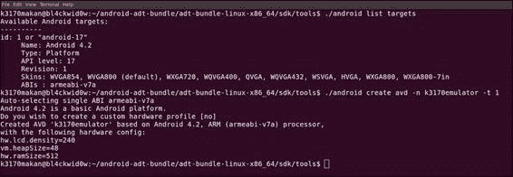

    如果你使用的是 Windows 机器，请输入：

    ```kt
    C:\[path-to-your-sdk-install]\android create avd –n [your avd name] –t [system image target]

    ```

1.  如果一切顺利，你应该刚刚创建了一个 AVD。现在可以执行以下命令来启动它：

    ```kt
    [path-to-your-sdk-install]/emulator –avd [your avd name] –no-boot-anim

    ```

    

1.  你应该会立即看到一个模拟器弹出。给它一点时间启动。一旦完全启动，你可以看到锁屏，这意味着你可以启动 ADB，为我们提取一些 APK 文件。你可以通过输入以下命令来提取 APK 文件：

    ```kt
    adb pull /system/app/Contacts.apk

    ```

    以下截图为实际操作示例：

    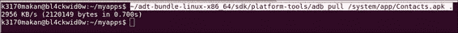

    如果你需要其他示例，可以查看`system/app/`目录的内容，找到联系人应用或其他应用，如下面的截图所示：

    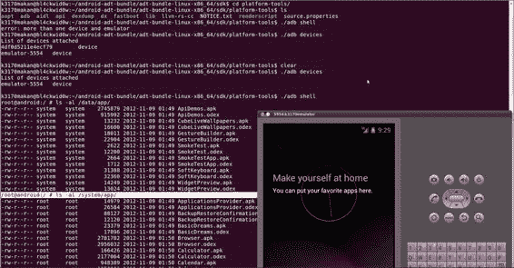

    你应该刚刚将联系人应用复制到你的本地设备上。如果这部分内容让你感到困惑，请参考上一章；它涵盖了如何创建模拟器以及如何从模拟器复制设备。

## 如何操作…

你应该在硬盘上有一个你想要检查的 APK 文件的本地副本。我们现在可以开始检查应用程序的证书。要查看应用程序的公钥证书和签名，首先需要解压 APK 文件。如果你知道如何解压归档文件，这非常简单，因为 APK 文件实际上是被重命名的 ZIP 归档文件。你可以通过执行以下步骤来解压归档文件：

1.  如果你使用的是 Windows 机器，你可能需要确保已安装 WinZip。你需要做的就是使用 WinZip 打开 APK 文件，它应该像其他任何 ZIP 存档一样打开。在 Linux Debian 机器上，你需要将此文件复制到一个带有 ZIP 扩展名的文件中，以便 WinZip 可以为我们愉快地解压：

    ```kt
    cp Contacts.apk Contacts.zip

    ```

1.  将存档解压到容易记住的地方；你可以通过执行以下命令来完成：

    ```kt
    unzip Contacts.zip

    ```

    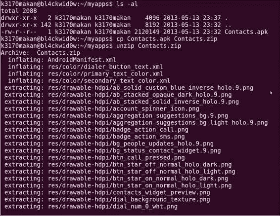

    解压存档后，你的目录应该如下截图所示：

    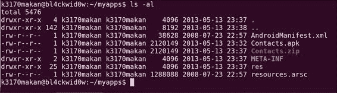

1.  定位名为`META-INF`的文件夹。这个文件夹包含签名文件和实际的`CERT.RSA`文件，这是自签名的公钥证书；你可以使用随 Java JDK 捆绑的 keytool 来查看它，你应该在尝试此配方之前安装 Java JDK。使用以下命令打印证书：

    ```kt
    keytool –printcert –file META-INF/CERT.RSA

    ```

    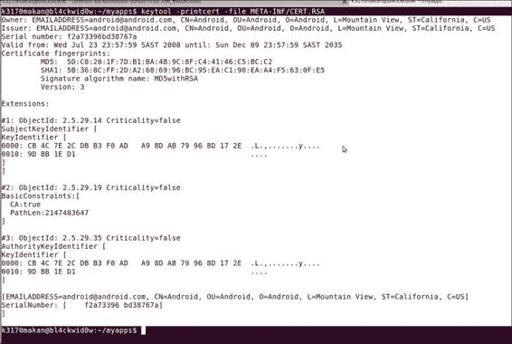

    现在你面前的是声明公钥持有者的证书。

1.  要查看与应用程序内容相关的实际签名，请定位到`META-INF`文件夹下的名为`CERT.SF`的文件。你可以在 Windows 上通过记事本或其他可用的文本编辑器打开它来查看，或者在 Unix/Linux 机器上执行以下命令：

    ```kt
    cat [path-to-unzipped-apk]/META-INF/CERT.SF

    ```

    现在你面前应该有签名文件。它包含了应用程序中包含的资源文件的加密哈希；以下截图为例：

    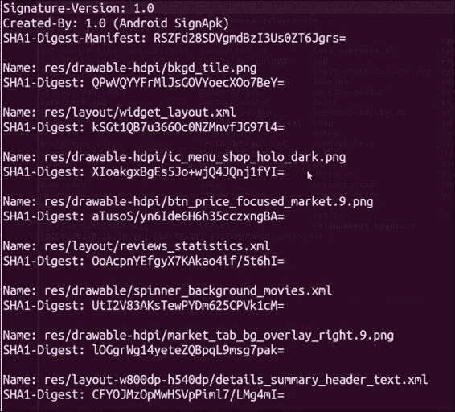

    当`jarsigner`工具尝试验证应用程序内容时，会使用此文件；它会计算`CERT.SF`文件中列出的资源的加密哈希，并将其与每个资源的摘要进行比较。在之前的截图中，哈希—`SHA-1 Digests`—已经进行了 base64 编码。

## 工作原理…

`META-INF`文件夹是一个非常重要的资源，因为它有助于建立应用程序的完整性。由于该文件夹中的内容在应用程序内容的加密安全中扮演着重要角色，因此有必要讨论该文件夹的结构以及其中应该包含什么内容以及原因。

在`META-INF`文件夹内，你应该至少能找到以下内容：

+   `MANIFEST.MF`：此文件声明资源，与`CERT.SF`文件非常相似。

+   `CERT.RSA`：这是前面讨论过的公钥证书。

+   `CERT.SF`：此文件包含了应用程序中所有在应用程序签名中已计算的资源。它被添加以适应 JAR 特定的加密签名。

+   `CERT.RSA`：这是一个 X.509 v3 证书；其中的信息由 keytool 以下列方式结构化：

    +   **所有者**：此字段用于声明公钥持有者，其中包含有关与此个人相关的国家和组织的一些基本信息。

    +   **颁发者**：此字段用于声明将公钥与声明持有者关联的 X.509 证书的颁发者。这里提到的人或组织是有效为密钥持有者担保的人。他们是确立证书中列出的公钥真实性的人。

    +   **序列号**：这是用于标识已颁发证书的识别码。

    +   **有效期限**：此字段指定了证书及其相关属性可以被颁发者验证的期限。

    +   **证书指纹**：此字段保存了证书的摘要和。它用于验证证书是否被篡改。

数字签名是通过使用受信任第三方的私钥加密证书来计算的。在大多数 Android 应用程序中，“受信任的第三方”是开发者。这意味着此签名是通过使用他/她自己的私钥（通常与公钥关联的私钥）加密证书生成的。这种数字签名用法在功能上可能是正确的——它利用了数字签名机制的功能——但它不如依赖像证书颁发机构（**CA**）这样的受信任第三方那样健壮。毕竟，任何人都可以通过用自己的密钥签署来说他们开发了 Twitter 应用，但没有人可以说他们拥有 VeriSign 或赛门铁克的私钥！

如果证书是自签名的，开发者在填写与证书相关的信息时可以发挥其创造性。Android 包管理器并不努力验证证书的颁发者、所有者或任何其他证书详细信息的有效性或是否是实际存在的实体。例如，“所有者”无需明确提及关于开发者的任何有效个人信息，或者“颁发者”可以是完全虚构的组织或个人。尽管这样做是可能的，但强烈建议不要这样做，因为它使得应用程序非常难以被信任；毕竟，移动应用程序经常被存储和使用在非常私人的设备上，而那些得知公钥证书虚构细节的人可能不再信任这样的应用程序。

生成可信任应用程序证书的最佳方式是通过合格证书颁发机构（CA），你可以生成自己的公钥和私钥对之后，请求签署公钥证书，或者请求 CA 生成带有公钥证书的公私钥对，因为他们通常会验证证书中发布的信息。像赛门铁克等 CA 和安全供应商经常提供一系列服务以方便生成可信任的公钥证书，其中一些服务专门用于支持 Android 应用程序开发。

本教程的下一部分包含了一些关于公钥证书的有用链接，供您查看。

## 还有更多内容...

你也可以在 Linux 的命令行工具中使用 OpenSSL 库执行以下步骤来查看完整的公钥证书：

1.  确保你已经安装了 OpenSSL；如果没有，你可以使用以下命令安装 OpenSSL：

    ```kt
    apt-get install openssl

    ```

1.  安装完成后，如果你处于解压后的`APK`目录的根目录下，可以使用以下命令查看证书：

    ```kt
    openssl pcks7 –inform DER –in META-INF/CERT.RSA –noout –print_certs –text

    ```

    你应该在终端屏幕上看到类似以下截图的内容：

    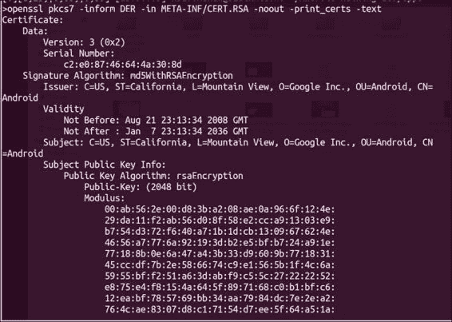

    上一个截图的后半部分如下：

    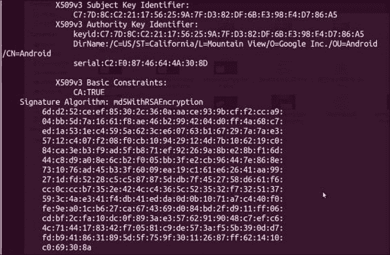

    前一个截图的证书最后一部分是颁发证书的 CA 的实际数字签名。

## 另请参阅

+   *RFC2459 – Internet X.509 公钥基础设施证书和 CRL 概要*文档在[`datatracker.ietf.org/doc/rfc2459/?include_text=1`](http://datatracker.ietf.org/doc/rfc2459/?include_text=1)

+   Oracle 的*X.509 证书和证书撤销列表（CRLs）*文档在[`docs.oracle.com/javase/6/docs/technotes/guides/security/cert3.html`](http://docs.oracle.com/javase/6/docs/technotes/guides/security/cert3.html)

# 签名 Android 应用

所有 Android 应用在安装到 Android 设备之前都必须进行签名。Eclipse 和其他 IDE 几乎可以为你处理应用签名的所有工作；但为了让你真正理解应用签名是如何工作的，你应该尝试使用 Java JDK 和 Android SDK 中的工具亲自签一个应用。

首先，关于应用签名的一些背景知识。Android 应用签名只是 JAR 签名的重新利用。多年来，它一直被用来验证 Java 类文件存档的真实性。Android 的 APK 文件与 JAR 文件并不完全相同，并且比 JAR 文件包含更多的元数据和资源；因此，Android 团队需要对 JAR 签名进行调整以适应 APK 文件的结构。他们通过确保 Android 应用中包含的额外内容成为签名和验证过程的一部分来实现这一点。

所以，在不过多透露关于应用签名的情况下，让我们获取一个 APK 文件并进行签名。在后续的演练中，我们将尝试在我们签署后的应用安装在 Android 设备上，作为一个简单的方式来验证我们确实正确地签了名。

## 准备工作

在开始之前，你需要安装以下内容：

+   **Java JDK**：这包含了所有必要的签名和验证工具

+   **APK 文件**：这是一个待签名的 APK 示例

+   **WinZip**：这是 Windows 机器上必需的操作

+   **解压**：这是 Ubuntu 机器上必需的操作

考虑到你可能使用的是一个已经签名的 APK 文件，你首先需要从 APK 文件中删除证书和签名文件。为此，你需要执行以下步骤：

1.  解压 APK 文件。重新解包 APK 文件是浪费时间的；所以，如果你在这一步需要帮助，请参考*检查应用程序证书和签名*的菜谱。

1.  解压 APK 文件后，你需要删除`META-INF`文件夹。Windows 用户可以直接打开解压后的`APK`文件夹，使用图形用户界面删除`META-INF`文件夹。在 Unix/Linux 系统上，可以通过执行以下命令从命令行界面完成：

    ```kt
    rm –r [path-to-unzipped-apk]/META-INF

    ```

    现在你应该准备好签署应用程序了。

## 如何操作...

通过执行以下步骤可以为你的 Android 应用程序签名：

1.  你首先需要为自己设置一个密钥库，因为它将保存你用来签署应用程序的私钥。如果你已经有了一个密钥库，可以跳过这一步。在 Windows 和 Unix/Linux 发行版上生成全新的密钥库，你需要执行以下命令：

    ```kt
    keytool –genkey –v -keystore [nameofkeystore] –alias [your_keyalias] –keyalg RSA –keysize 2048 –validity [numberofdays]

    ```

1.  输入这个命令后，keytool 将帮助你为你的密钥库设置密码；你应该确保输入一些你真正能记住的东西！另外，如果你打算将这个密钥库用于实际用途，请确保将其保存在一个非常安全的地方！

1.  在为你的密钥库设置好密码后，keytool 将开始提示你输入用于构建证书的信息；请密切关注所请求的信息，并尽可能诚实回答——尽管以下截图并未展示这一点：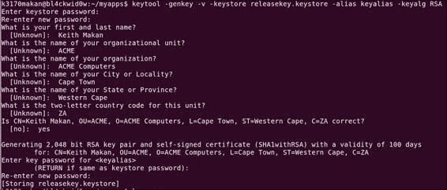

    现在你应该已经设置了一个全新的密钥库，其中安全地保存了你的新私钥、公钥和自签名证书，并为你提供加密保护。

1.  你现在可以使用这个全新的密钥库来签署应用程序，通过执行以下命令即可完成：

    ```kt
    jarsigner –verbose –sigalg MD5withRSA –digestalg SHA1 –keystore [name of your keystore] [your .apk file] [your key alias]

    ```

1.  系统将提示你输入密钥库的密码。一旦你正确输入，`jarsigner`将开始原地签署应用程序。这意味着它将修改你提供的 APK 文件，通过添加带有所有证书和签名相关细节的`META-INF`文件夹。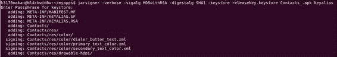

    就是这样。签署应用程序就是如此简单。我也无意中展示了如何重新签署应用程序，即替换原本与应用程序一起分发的签名。

## 工作原理...

首先，让我们看看提供给 keytool 的选项：

+   `-genkey`：这个选项告诉 keytool 你想要生成一些密钥。

+   `-v`：这个选项启用详细输出；然而，这个命令是可选的。

+   `-keystore`：这个选项用于定位你希望用来存储生成的密钥的密钥库。

+   `-alias`：这个选项是为你生成的密钥对的别名。

+   `-keyalg`：这个选项说明了用于生成密钥的加密算法；你可以选择使用 RSA 或 DSA。

+   `-keysize`：此选项指定你将要生成的密钥的实际位数。

+   `-validity`：此选项提到生成的密钥将有效的天数；Android 官方推荐使用超过 10,000 天的值。

Keytool 实际上对公钥和私钥的操作是将公钥包装在一个 X.509 v3 证书内进行存储。此证书用于声明公钥持有者的身份，并且可以用来确认提到的公钥属于声明的持有者。这需要像 CA 这样的可信第三方的参与，但 Android 并不要求以这种方式确认公钥。关于这些证书如何被使用和构建的更多信息，请参考 *检查应用程序证书和签名* 的食谱。

`jarsigner` 的选项将在以下命令后详细描述：

```kt
jarsigner –verbose –sigalg MD5withRSA –digestalg SHA1 –keystore [nameof your keystore] [your .apk file] [your key alias]

```

以下部分解释了前述命令的属性：

+   `-verbose`：用于启用详细输出。

+   `-sigalg`：用于提供签名过程中将要使用的算法。

+   `-digestalg`：用于提供将计算 `.apk` 文件中每个资源的签名的算法。

+   `-keystore`：用于指定你想要使用的密钥库。

+   `[你的 .apk 文件]`：这是你打算签名的 `.apk` 文件。

+   `[你的密钥别名]`：这是你与密钥/证书对关联的别名。

## 参见

+   *Jarsigner* 的文档在 [`docs.oracle.com/javase/6/docs/technotes/tools/windows/jarsigner.html`](http://docs.oracle.com/javase/6/docs/technotes/tools/windows/jarsigner.html)

+   *签名你的应用程序 - Android 开发者* 页面在 [`developer.android.com/tools/publishing/app-signing.html`](http://developer.android.com/tools/publishing/app-signing.html)

+   *Keytool* 的文档在 [`docs.oracle.com/javase/6/docs/technotes/tools/solaris/keytool.html`](http://docs.oracle.com/javase/6/docs/technotes/tools/solaris/keytool.html)

# 验证应用程序签名

在前面的食谱中，我们讲解了应用程序是如何签名的以及如何生成密钥以安全地签名它们。这个食谱将详细说明如何验证应用程序签名。能够手动完成这一操作非常重要，因为它不仅让你了解验证实际是如何工作的，而且也是深入了解加密应用程序安全性的门户。

## 准备开始

要执行此食谱，你需要以下内容：

+   JDK

+   一个待验证的已签名应用程序样本

这就是你需要的一切。让我们开始吧！

## 如何操作...

要验证应用程序签名，你需要执行以下步骤：

1.  Java JDK 有一个名为 `jarsigner` 的工具，它能够处理所有繁重的工作；你需要做的就是执行以下命令：

    ```kt
    jarsigner –verify –verbose [path-to-your-apk]

    ```

1.  现在你需要做的是在屏幕上寻找**jar 已验证**的字样；这表示应用程序签名已经经过验证。

# 检查 AndroidManifest.xml 文件

应用程序清单可能是对 Android 应用程序安全专家来说最重要的信息来源。它包含了有关应用程序权限以及构成应用程序的各个组件的所有信息，并且向我们详细介绍了这些组件将如何被允许与平台上的其他应用程序交互。我将使用这个食谱作为讨论应用程序清单、其结构以及示例清单中每个组件含义的好借口。

## 准备工作

在开始之前，你需要安装以下软件：

+   Windows 上的 WinZip

+   Java JDK

+   一个便捷的文本编辑器；通常 Vi/Vim 可以胜任，但 Emacs、Notepad++和 Notepad 也都很好用；在这里我们不需要花哨的东西。

+   Android SDK（这里并不意外！）

你可能还需要获取一个名为**apktool**的工具；它使得解码`AndroidManifest.xml`文件变得非常简单。实际上，它所做的只是重新格式化另一个 Android SDK 工具的输出。设置它非常简单，你只需要执行以下步骤：

1.  下载工具；你可以在[`android-apktool.googlecode.com/files/apktool1.5.2.tar.bz2`](http://android-apktool.googlecode.com/files/apktool1.5.2.tar.bz2)找到它。

    如果你已经安装了 Android SDK，你可以将刚刚下载的 apktool 解压到 SDK 文件夹中的`platforms-tools`目录下，具体来说：

    ```kt
    C:\\[path to your sdk]\sdk\platform-tools\

    ```

    或者对于 Linux 机器：

    ```kt
    /[path to your sdk]/sdk/platform-tools/

    ```

    请确保你获取了`apktool.jar`文件和 apktool 脚本，与其他文件放在同一目录下；不要将其放在自己的子文件夹中！

1.  如果你不想下载 Android SDK，还有一些依赖项需要你下载。它们可以在[`code.google.com/p/android-apktool/downloads/list`](http://code.google.com/p/android-apktool/downloads/list)下载。

    特别是，如果你使用的是 Windows 电脑，你应该在[`android-apktool.googlecode.com/files/apktool-install-windows-r05-ibot.tar.bz2`](http://android-apktool.googlecode.com/files/apktool-install-windows-r05-ibot.tar.bz2)获取 apktool。

    如果你在使用 Linux Debian 系统，你应该在这个地址获取相应的工具[`android-apktool.googlecode.com/files/apktool-install-linux-r05-ibot.tar.bz2`](http://android-apktool.googlecode.com/files/apktool-install-linux-r05-ibot.tar.bz2)。

    你还需要确保所有下载的文件都在同一个目录下。

1.  你应该能够启动它，并且可以通过以下方式测试它：

    在 Windows 上：

    ```kt
    C:\[path-to-apktool]\apktool -help

    ```

    在 Debian Linux 上：

    ```kt
    /[path-to-apk-too]/apktool -help

    ```

    如果你完成了所有这些步骤，你就可以进入下一步，也就是实际剖析一个`AndroidManifest.xml`文件。

## 如何操作...

要获取给定应用程序包的`AndroidManifest.xml`文件副本，你需要执行以下步骤：

1.  你需要做的就是将 apktool 指向你的 APK 文件。我们将使用之前食谱中从模拟器中提取的`Contacts.apk`应用程序。在命令提示符中输入以下内容，并确保你的工作目录——你当前所在的终端/命令提示符目录——是提取 apktool 的目录。

    在 Debian Linux 上：

    ```kt
    /[path-to-apktool]/apktool d -f –s [apk file] decoded-data/

    ```

    在 Windows 上：

    ```kt
    C:\[path-to-apktool]/apktool d –f –s [apk file] decoded-data/

    ```

    例如，如果你使用的是`Contacts.apk`应用程序，并且你想将所有解码的文件保存到一个名为`decoded`的文件夹中，你可以在 Linux 机器上输入以下命令：

    ```kt
    ~/adt-bundle-linux-x86_64/sdk/platform-tools/apktool d –f –s Contacts.apk decoded

    ```

    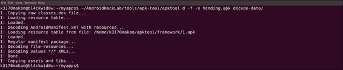

1.  现在你可以查看应用程序清单了。它应该在你上一步选择提取的文件夹中，在一个名为`AndroidManifest.xml`的文件里。要查看它，只需拿出你最喜欢的文本编辑器——Linux 用户，你的操作系统几乎捆绑了一百万个文本编辑工具——并将其指向`AndroidManifest.xml`文件。

    在 Linux 上：

    ```kt
    vi [path-to-your-decoded-data]/AndroidManifest.xml

    ```

    或者，你也可以通过执行以下命令在终端屏幕上显示清单：

    ```kt
    cat [path-to-your-decoded-data]/AndroidManifest.xml

    ```

    在 Windows 上：

    ```kt
    C:\Windows\System32\notepad.exe [path-to-decoded-data]\AndroidManifest.xml

    ```

1.  你可以在终端屏幕上看到清单——如果你使用的是 Linux 机器——或者记事本会自动弹出并打开清单。你们中的一些人可能不理解屏幕上的这些乱码是什么，或者这些信息有多宝贵，因此下一个食谱将包含对应用程序清单结构所有重要部分的解释：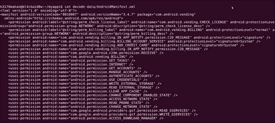

    所以，你可能正盯着`AndroidManifest.xml`文件中的乱码信息。它的意义以及为什么这一切都很重要，在接下来的演练食谱中会有说明。它提供了关于某些元素及其属性如何工作的良好背景。我只涵盖了与安全和应用程序安全评估最相关的元素背景。

## 工作原理...

为了帮助你理解应用程序清单，我将在这里向你展示清单的结构，并解释最重要部分的意义。如果你想了解更多关于 Android 清单语言的信息，你应该查看本食谱的*另请参阅*部分。

清单的结构如下：

```kt
<?xml version="1.0" encoding="utf-8"?>

<manifest>

  <uses-permission /> <permission /> <permission-tree /> <permission-group /> <instrumentation /> <uses-sdk /> <uses-configuration /> <uses-feature /> <supports-screens /> <compatible-screens /> <supports-gl-texture />
  <application>
    <activity>
      <intent-filter>
        <action />
        <category />
        <data />
      </intent-filter>
      <meta-data />
    </activity>
    <activity-alias>
      <intent-filter> . . . </intent-filter>
      <meta-data />
    </activity-alias>
    <service>
      <intent-filter> . . . </intent-filter>
      <meta-data/>
    </service>
    <receiver>
      <intent-filter> . . . </intent-filter>
      <meta-data />
    </receiver>

    <provider>
      <grant-uri-permission />
      <meta-data />
      <path-permission />
    </provider>
    <uses-library />
  </application>
</manifest>
```

### 提示

**下载示例代码**

你可以从你在[`www.packtpub.com`](http://www.packtpub.com)的账户下载你购买的所有 Packt 图书的示例代码文件。如果你在其他地方购买了这本书，可以访问[`www.packtpub.com/support`](http://www.packtpub.com/support)注册，我们会直接将文件通过电子邮件发送给你。

这究竟意味着什么呢？首先，第一行更多是关于文件类型和 Android 清单，几乎与它的作用和目的无关。从`.xml`扩展名你可能已经看出，它是一个**可扩展标记语言**（**XML**）文件。这意味着 Android 清单是用 XML 语言编写的。XML 基本上是用于创建任何你希望的语言的格式；一些资料坦率地将其描述为定义标记语言的的语言。XML 旨在成为一组描述几乎所有事情的规则！

所以，当你看到以下代码时，你就知道紧随其后的行是一个使用 UTF-8 编码的 XML 版本 1 的 XML 文件：

```kt
<?xml version="1.0" encoding="utf-8"?>
```

接下来谈谈 Android 特有的部分：

```kt
<manifest>
```

此元素是应用程序清单中条目的开始标签；它标志着开始，被称为 XML 文档的根元素。下一个标签声明应用程序需要给定权限：

```kt
<uses-permission android:name="string"/>
```

这通常是在你安装应用程序时根据权限类型显示的字符串。`android:name`属性指定了权限的名称；例如，如果你的应用程序需要使用设备的摄像头服务，它的清单中应该有以下代码：

```kt
<uses-permission android:name="android.permission.CAMERA">
```

下一个元素类型如下：

```kt
<permission android:description="string resource" android:icon="drawable resource" android:label="string resource" android:name="string" android:permissionGroup="string" android:protectionLevel=["normal" | "dangerous" | "signature" | "signatureOrSystem"] />
```

此元素用于定义权限；例如，当开发者认为其他应用程序要与特定应用程序组件交互时，需要特殊的唯一权限。这个元素相当有趣；让我们看看它的属性：

+   `android:description`：此属性用于定义当用户被提示授予权限时作为权限描述显示的字符串。

+   `android:icon`：此属性用于定义当用户被提示授予权限时显示的描述性图标。

+   `android:label`：此属性用作当用户被提示授予权限时权限的名称，例如，网络访问和读取短信。

+   `android:name`：此属性是权限的实际名称。这是在应用程序的清单中查找的字符串，以确定它是否具有此权限，例如`android.permission.Camera`。

+   `android:protectionLevel`：此属性用于指示与此权限相关的风险级别。这些级别被分类如下：

    +   `"dangerous"`：此级别通常分配给任何允许应用访问敏感用户数据或操作系统配置数据的权限。这用于保护任何可能被用于危害用户的函数或数据的访问。

    +   `"normal"`：此级别用于指示任何授予访问不带来固有风险的数据或服务的权限。

    +   `"signature"`：当权限需要自主授予与定义该权限的应用具有相同证书的任何应用时，会设置此级别，即`AndroidManifest.xml`中带有相关`<permission>`标签的应用。

    +   `"signatureOrSystem"`：当权限需要自主授予与定义该权限的应用具有相同证书的任何应用时，会设置此级别。

你应该密切关注`protectionLevel`属性中使用的值，尤其是那些需要专业进行应用评估的人。尝试思考开发者决定的保护级别是否恰当。你需要能够确保与此权限相关的风险能够明确地指示给用户。

`protectionLevel`的另一个关键属性在于它决定了在应用安装前向用户显示哪些权限。用户总是会被提示授予危险保护级别的权限，而普通权限只有在用户明确请求时才会显示。另一方面，`signature`和`signatureOrSystem`权限在应用安装前不会显示给用户。这意味着如果应用在`signature`或`signatureOrSystem`保护级别下被授予了风险权限，用户将对此一无所知。在检查应用清单时请考虑这一点，因为它将帮助确定应用如何向用户传达风险。接下来是下一个元素类型！

```kt
<application>
```

此元素用于定义一个应用的开始。关于安全，此元素的重要之处在于其属性以及它们如何影响在此元素内定义的组件。为了简洁起见，这里省略了属性定义；你需要参考在[`developer.android.com/guide/topics/manifest/application-element.html`](http://developer.android.com/guide/topics/manifest/application-element.html)可获取的官方文档以获取更多详细信息。

此元素的一个重要属性是，某些属性仅为元素内部定义的组件的相应属性设置默认值；这意味着其组件将能够覆盖它们。这些可覆盖属性中的一个显著元素是称为`permission`的属性，它声明了其他应用与之交互所需的权限。这意味着如果一个应用设置了一个给定的权限，而它的一个组件设置了不同的权限作为其属性，那么组件的权限将优先考虑。如果组件用普通权限覆盖了危险权限，这可能会带来相当大的风险。

其他属性不能被它们的组件覆盖。这取决于属性中设定的值，并应用于每一个单独的组件。组件包括以下属性：

+   `debuggable`：此属性指定给定的组件或组件组是否可调试。

+   `enabled`：此属性指定安卓应用框架是否能够启动或运行此元素定义的组件；默认为`true`。只有当设置为`false`时，它才会覆盖所有组件的值。

+   `description`：这个属性仅是一个用于描述应用的字符串。

+   `allowClearUserData`：此属性是一个标志，用于确定用户是否可以清除与 app 关联的数据；默认情况下，它被设置为`true`，在一些平台上非系统应用不能将其设置为其他值。

以下元素是应用程序组件的定义，允许开发者为它们决定某些属性：

```kt
<activity
  android:exported=["true" | "false"]
  android:name="string"
  android:permission="string"
  android:enabled=["true" | "false"]
  android:permission="string"
...other attributes have been omitted
>
```

```kt
`android:exported`: This attribute is used to decide whether the components of other applications will be able to interact with this element. All application components—services, broadcast receivers, and content providers—have this attribute in common.

What's interesting here is the default behavior of this attribute, if it is not explicitly set for this element. Whether or not it will be "`exported`" partly depends on whether intent filters are defined for the activity or not. If intent filters are defined and the value is not set, the Android system assumes that the component intends to respond to interaction from external application components and will allow them to interact with it, given that the initiator of the interaction has the necessary permissions to do so. If no intent filters are defined and the attribute value is not set, the Android application framework will only allow explicit intents to be resolved against the component.

There is another caveat. Because of the way in which older Android API levels work, there are attributes that can override the default value; for applications that set either `android:minSdkVersion` or `android:targetSdkVersion` to 16 or lower, the default value is `true`. For applications that set `android:minSdkVersion` or `android:targetSdkVersion` as equal to or higher than 17, the default value is `false`.

This is very valuable information because it will help us determine an application's attack surface—it determines how potentially malicious applications will interact with its components—and quite literally determine the difference between a good security assessment and an ineffective one.

`android:name`: This attribute specifies the class file that contains the Java code for the component; I've added it here because you will need to know this value should you want to launch explicit intents aimed at a given component. All component types have this attribute in common.`android:permission`: This attribute is used to specify the permission required to interact with the component.`android:enabled`: This attribute is used to indicate whether the system is allowed to start/instantiate the component:

```

<service android:enabled=["true" | "false"] android:exported=["true" | "false"] android:icon="drawable resource" android:isolatedProcess=["true" | "false"] android:label="string resource" android:name="string" android:permission="string">

</service>

```kt

It is used to define the attributes of a service; some XML attributes are unique to services, namely:

*   `android:isolatedProcess`: This attribute indicates if the service will run in an isolated process with no permissions.

    ```

        <receiver android:enabled=["true" | "false"] android:exported=["true" | "false"] android:icon="drawable resource" android:label="string resource" android:name="string" android:permission="string" android:process="string" ></receiver>

    ```kt

    This element declares the broadcast receiver component:

    ```

        <provider android:authorities="list" android:enabled=["true" | "false"] android:exported=["true" | "false"] android:grantUriPermissions=["true" | "false"] android:icon="drawable resource" android:initOrder="integer" android:label="string resource" android:multiprocess=["true" | "false"] android:name="string" android:permission="string" android:process="string" android:readPermission="string" android:syncable=["true" | "false"] android:writePermission="string" ></provider>

    ```kt

    It defines the components of the content provider type. Seeing that the content providers are basically database-like components, they would need to be able to define the controls for accessing their data structures and content. The following attributes help them to do just that:

*   `android:writePermission`: This attribute specifies the name of the permission components from other applications that this content provider is in charge of. It is a must-have in order to change or augment data structures.
*   `android:readPermission`: This attribute specifies the name of the permission components from other applications that this content provider is in charge of. It is a must-have in order to read from or query the data structures.
*   `android:authorities`: This attribute specifies a list of names identifying the URI authorities. Usually, these are the Java classes that implement the provider: 

    ```

        <intent-filter android:icon="drawable resource" android:label="string resource" android:priority="integer" ></intent-filter>

    ```kt

```

## 另请参阅

+   有关[*AndroidManifest.xml 文件*](http://developer.android.com/guide/topics/manifest/manifest-intro.html)的页面

# 通过 ADB 与活动管理器交互

对于任何初露头角的安卓安全专家来说，了解**安卓调试桥**（**ADB**）是非常重要的。ADB 允许你直接与本地服务和资源进行交互，例如包管理器、活动管理器以及其他各种对安卓系统操作至关重要的守护进程，这些都被安卓系统所使用。本指南将提供如何通过演示一些你可以执行的命令与活动管理器交互的详细信息。

## 准备就绪

在开始之前，你需要准备以下物品：

+   安卓 SDK 工具

+   可以是虚拟设备，查看*检查 AndroidManifest.xml 文件*的菜谱以了解如何创建和启动一个，或者是物理的安卓设备

## 如何操作…

要使用应用程序管理器启动活动，你需要执行以下步骤：

1.  使用以下命令在你的安卓设备上打开一个 shell：

    ```kt
    adb shell

    ```

1.  找到一个要启动的活动；你可以通过使用包管理器搜索设备上已安装的活动列表来实现这一点。

    ```kt
    pm list packages

    ```

    大量的包列表应该开始从你的屏幕上倾泻而下；其中任何一个都可以作为一个很好的示例：

    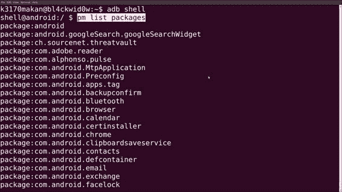

1.  选择你想要启动的活动后，执行以下命令：

    ```kt
    am start [package name]

    ```

## 还有更多…

除了启动活动之外，你还可以通过使用 start 命令接受的意图参数，指定要发送到活动的意图，如下所示：

```kt
am start <INTENT> < --user UID | current >

```

`<INTENT>` 参数可以由允许你详细描述一个意图的几个参数组成。

+   `-a [动作]`：此参数指定要指定的动作的字符串标签。它有助于详细说明被发送意图的预期目的或“动作”。

+   `-d [数据 URI]`：此参数指定要附加到意图的数据 URI。它指向处理意图的应用程序要使用的数据。

+   `-t [MIME 类型]`：此参数指定意图中包含的数据的 MIME 类型。

+   `-c [类别]`：此参数指定意图的类别。

+   `-n [组件]`：此参数指定了意图指定的包的目标组件。它用于精确调整意图的目标。

+   `-f [标志]`：此参数指定意图标志。它用于描述应如何尊重意图，并允许你控制尊重意图的应用程序的一定数量的行为。

+   `-e [额外键] [字符串值]`：此参数添加与给定键关联的字符串值。某些意图定义允许你向应用程序传递字符串值的字典。当意图被尊重时，将访问这些字符串值。

+   `-e [额外键] [字符串值]`：此参数的功能与 `-e` 相同。

+   `-ez [额外键] [布尔值]`：此参数将布尔值与名称关联。

+   `-ei [额外键] [整数值]`：此参数将整数值与名称关联。

+   `-el [额外键] [长整数值]`：此参数将长数字值与名称关联。

+   `-ef [额外键] [浮点数值]`：此参数将浮点数值与名称关联。

+   `-eu [额外键] [URI 值]`：此参数将 URI 与名称关联。

+   `-ecn [额外键] [组件名称]`：此参数将组件名称（将被转换为 `ComponentName` 对象）与名称关联。

+   `-eia [额外键] [整数值, 整数值,...]`：此参数允许你将整数数组与名称关联。

+   `-efa [额外键] [浮点值, 浮点值,...]`：此参数与`-eia`相同，不同之处在于在这种情况下，您可以将一系列浮点数值与一个名称关联。

并非所有意图参数都是必须的。要让此命令逻辑上合理，只需要意图目标组件或动作值；这些规则适用于所有针对应用程序的意图。

可选的`--user`参数允许您指定应用程序应以哪个用户身份运行。如果没有为活动提供此参数，它将以 ADB 用户的身份运行。

您还可以将标志与意图关联。要获取完整选项列表，请参考*意图规范 - Android 开发者*部分中的标记链接。

使用此命令的工作方式类似于以下命令：

```kt
am start –n com.android.MyPackage/com.android.MyPackageLaunchMeActivity –e MyInput HelloWorld –a android.intent.MyPackageIntentAction –c android.intent.category.MyPackageIntentCategory

```

您也可以使用活动管理器启动服务；您可以通过使用`startservice`命令来完成此操作：

```kt
am startservice <package name>/<component name> <INTENT>

```

使用此命令的工作方式如下：

```kt
am startservice com.android.app/com.android.app.service.ServiceComponent
you can also specify

```

活动管理器支持的另一个功能是停止服务和进程。当应用程序占用所有系统资源并减慢系统速度时，这非常有用。以下是使用活动管理器杀死进程的方法：

```kt
kill < --user UID | current > <package>

```

与之前的命令一样，`UID`参数是可选的。在这里，此参数允许您将`kill`命令限制为以给定用户身份运行的包。如果未指定，ADB 将尝试杀死与给定包关联的所有用户的运行进程。

有关 Android 活动管理器支持的其他命令，请参见*Android 调试桥 - Android 开发者*部分中的标记链接。

## 另请参阅

+   有关*Android 调试桥 - Android 开发者*的页面，请访问[`developer.android.com/tools/help/adb.html`](http://developer.android.com/tools/help/adb.html)

+   有关*意图规范 - Android 开发者*的详细信息，请访问[`developer.android.com/tools/help/adb.html#IntentSpec`](http://developer.android.com/tools/help/adb.html#IntentSpec)

# 通过 ADB 提取应用程序资源

以下指南将展示如何对您的 Android 应用程序进行一些侦查。具体来说，找出它们用来存储重要信息的数据结构类型以及它们存储的信息类型，例如，高分、密码、联系人和电子邮件。除了允许您将高分设置为负数，这还是一种有效的方法，可以允许您从后端影响应用程序行为。它还让您了解应用程序如何保护用户数据，例如，数据是否加密？如何加密？应用程序是否保护用户数据的完整性？在进行逆向工程和评估应用程序安全性时，这也是一项非常有用的技能。

## 准备工作

不幸的是，对于这一点，您需要一个“已 root”的手机或模拟器，因为您已经拥有模拟设备上的 root 权限。

如果你想要访问其他应用程序的资源，你需要获得 root 权限。如果你想研究市场上应用程序的行为，使用 ADB 将它们从你的设备上拉下来并在虚拟设备上安装没有任何阻碍。

你还需要安装 Android SDK。

## 如何操作…

在 Android 设备上列出文件可以通过以下方式完成：

1.  使用以下命令在你的 Android 设备上启动 shell：

    ```kt
    adb shell [options]

    ```

1.  导航到`/data/data/`目录：

    ```kt
    cd /data/data/

    ```

    该目录应类似于以下截图：

    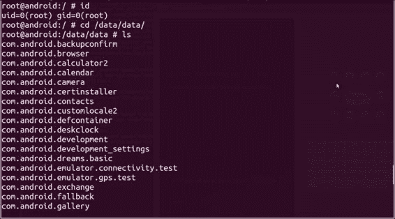

    如果你列出文件权限、创建、修改和其他元数据，它应该看起来像以下截图：

    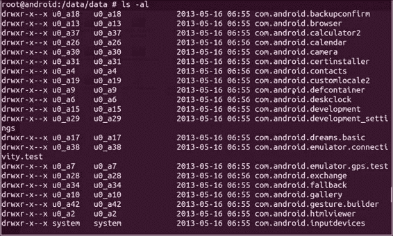

    注意数据目录的所有者和组，这是列表从左数第一和第二个列。这里所有者是实际的应用程序。默认情况下，Linux 将每个应用程序作为其自己的 Linux 用户运行，这本质上是应用程序沙箱操作的方式。当一个应用程序被赋予对它本质上无法访问的资源的权限时，Linux 会将它放入相关的用户组。

1.  如果你希望一次性查看所有应用程序资源和元数据，请执行以下命令：

    ```kt
    ls –alR */

    ```

    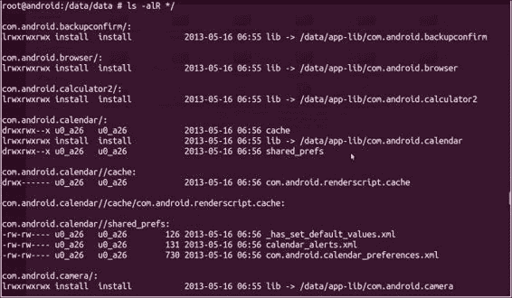

    但是，通常情况下，除非你将输出重定向到文件，否则你不会希望屏幕被大量的目录列表淹没。你可能只想显示数据库：

    ```kt
    ls –alR */databases/

    ```

    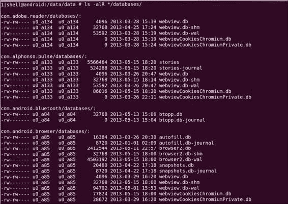

    或者，也许只显示每个应用程序在`/files/`目录中保存的文件或其他内容：

    ```kt
    ls –alR */files/

    ```

    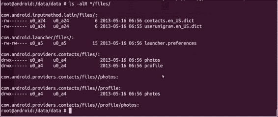

    或者，你可以通过指定扩展名来搜索特定类型的文件，以下是一些例子：

    ```kt
    ls –al */*/*.xml
    ls –al */*/*.png
    ls –al */*/*.mp3

    ```

1.  找到你要找的文件后，你需要使用古老的`adb pull`命令将它们复制到你的机器上：

    ```kt
    adb pull /data/data/[package-name]/[filepath] 

    ```

## 还有更多…

我们在这里真正做的只是列出不同的文件类型。其中一种是 sqlite3 数据库，你可能在一些目录中看到的 DB 文件。我敢肯定你很想知道如何打开它们并看看里面有什么。以下是操作方法。

在开始之前，你需要确保已安装 sqlite3，它随 Android SDK 一起提供。

1.  使用以下命令将 DB 文件提取到你的机器上的位置：

    ```kt
    adb pull /data/data/[package-name]/databases/[database-filename] 

    ```

1.  使用 sqlite3 加载`.db`文件：

    ```kt
    sqlite3 [database-filename]

    ```

    如果你需要一个示例，请查看以下截图：

    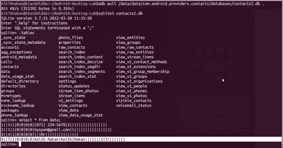

在本章中，我们介绍了一些保护应用程序的机制，一些涉及应用程序间通信、应用程序权限以及加密签名和文件系统相关保护的基本保护措施。

你应该从这儿带走的是执行安全机制所需的一些技巧和窍门。这使你能够独立于执行这些机制的 Android 设备来评估这些机制的有效性，并且还能让你直接与它们交互，希望这能帮助你更好地理解它们。
