# 第三章：Android 安全评估工具

在本章中，我们将介绍以下内容：

+   安装和设置 Santoku

+   设置 drozer

+   运行 drozer 会话

+   枚举已安装的软件包

+   枚举活动

+   枚举内容提供者

+   枚举服务

+   枚举广播接收器

+   确定应用程序攻击面

+   启动活动

+   编写一个 drozer 模块——一个设备枚举模块

+   编写一个应用程序证书枚举器

# 引言

我们已经介绍了所有 Android 开发基础，并介绍了所有 Android 开发工具。现在是我们开始深入了解 Android 黑客和安全评估工具的时候了。

本章介绍了一个名为**drozer**的利用和 Android 安全评估框架——正式名称为**Mercury**——由 MWR Labs 的一些人开发。同时本章还介绍了一个基于 Debian 的 Linux 发行版，名为**Santoku**，它基本上就像是移动安全评估的 BackTrack 或 Kali Linux。这里我们将介绍如何设置它并使其运行。

在我们开始设置 drozer 并编写一些示例脚本之前，对于你来说非常重要的一件事是要了解一些关于 drozer 的运作方式以及它是如何在 Android 安全评估游戏中解决一些问题的。

drozer 分为两部分：一部分是在你的本地机器上运行的“控制台”，另一部分是安装在目标 Android 设备上的“服务器”。当使用控制台与 Android 设备交互时，你实际上是在将 Java 代码注入到 drozer 代理中，该代理在实际设备上执行。

为什么要这样设计呢？在 drozer 出现之前，编写以应用程序漏洞为目标的利用意味着为了利用特定的漏洞，你需要编译一个 Android 应用，将其部署到目标手机上，并检查是否有效。如果无效，你需要重新进行整个流程！这种做法非常繁琐，会使得 Android 安全评估变得像一件苦差事。drozer 通过代理 drozer 代理传递命令到设备，使得部署和测试利用变得简单，这意味着你永远不需要接触 Android 开发环境或多次重新编译利用应用。

drozer 被称为框架，因为它允许你通过编写自己的模块或插件来扩展其功能，并适应你的需求。它本质上是最接近移动安全评估的 Metasploit。

标准 drozer 框架的另一个效果是，它本质上是一个 Android 应用程序——其中的一部分——没有权限，这意味着你在 Android 设备上成功执行的任何利用将自动变得非常可移植，并且成功所需的权限级别非常低。目的是展示一个“无权限”应用程序在利用 Android 设备及其上托管的应用程序时可以多么有效。

关于 drozer 的基本背景知识就介绍到这里。至于本章的其余部分，你可能需要一些 Python 编程语言的基础知识，因为 drozer 的模块是用 Python 开发的。如果你了解 Java 反射，或者知道如何开发一些 Android 应用，也会有所帮助。如果你从未认真开发过东西，或者通常不使用 Python 编程，不要担心——我会确保详细解释所有的 Python 代码。

那么不再犹豫，让我们开始吧！

# 安装和设置 Santoku

viaForensics 的开发者们开发了一个基于 Ubuntu 的非常酷的发行版，其中包含移动安全评估工具，名为 Santoku。以下指南将展示如何设置你自己的安装。我首先做这个是因为你可能想要在你的 Santoku 操作系统安装中安装并运行 drozer。

## 准备就绪

首先，我们将进行一些下载。从[`santoku-linux.com/download`](https://santoku-linux.com/download)获取最新 Santoku 映像的副本。

## 如何操作...

下载最新版本的 Santoku 后，你可以按照以下步骤开始设置：

1.  首先，你可以使用 Ubuntu 启动盘创建器或 Windows 的通用 USB 安装程序将 Santoku 映像写入 USB 存储棒，可从[`www.pendrivelinux.com/downloads/Universal-USB-Installer/Universal-USB-Installer-1.9.4.7.exe`](http://www.pendrivelinux.com/downloads/Universal-USB-Installer/Universal-USB-Installer-1.9.4.7.exe)获取。

1.  将你下载的 Santoku 映像写入 USB 磁盘。

1.  使用通用 USB 安装程序，执行以下步骤：

    1.  启动通用 USB 安装程序，在**步骤 1**中选择**尝试未列出的 Linux ISO**。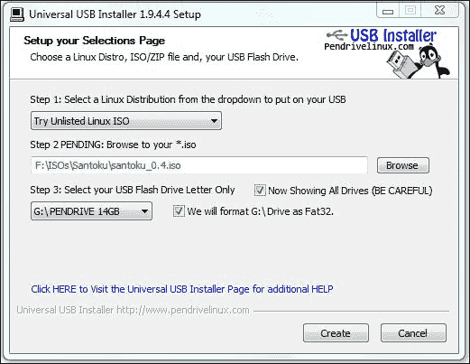

    1.  点击**浏览**，选择你 Santoku ISO 的路径，如前一个截图所示。

    1.  在**步骤 3**中，选择你希望写入映像的 USB 闪存盘。

    1.  点击**创建**，然后放松休息，同时你的安装磁盘映像正在准备中。

1.  在插入 USB 设备的情况下重启你的主机；打开启动菜单并选择从 USB 磁盘启动。

1.  一旦从 USB 启动盘启动，你应该会看到以下屏幕：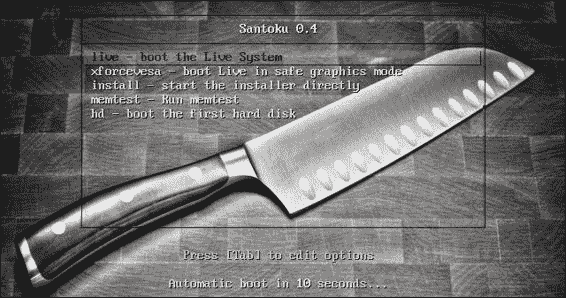

1.  在启动屏幕上，选择**install – 直接启动安装程序**。

1.  安装应该从以下截图所示的屏幕开始：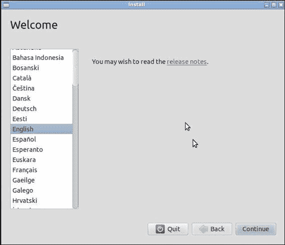

1.  按照安装向导的提示操作，直到开始安装。这个过程非常容易理解，对于之前安装过 Ubuntu 的人来说应该很熟悉。

    安装完成后，你应该会看到一个全新的 Santoku 桌面，如下截图所示：

    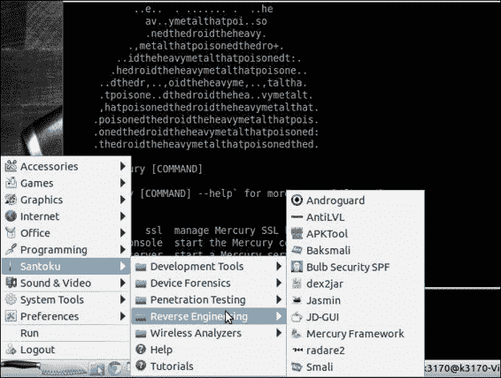

## 还有更多...

如果你打算在虚拟机上安装，你需要获取 VirtualBox 的副本。对于 Windows 和 Unix/Linux 用户，可以在[`www.virtualbox.org/wiki/Downloads`](https://www.virtualbox.org/wiki/Downloads)找到。

下载并安装 VirtualBox 后，你需要通过以下步骤创建一个新的虚拟机：

1.  点击 VirtualBox 窗口左上角的**新建**按钮。

1.  **创建虚拟机**对话框应该会弹出。在**名称**字段中输入`Santuko`，或者你也可以根据喜好为新的虚拟机命名。

1.  在**类型**下拉菜单中选择**Linux**。

1.  在**版本**下拉菜单中选择**Ubuntu**并点击**下一步**。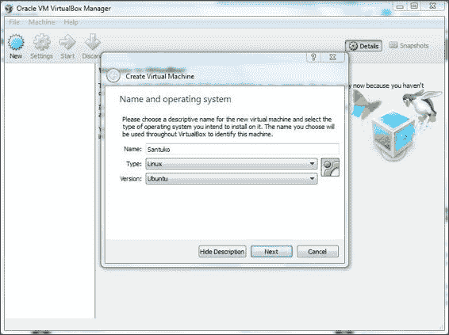

1.  此时会出现**内存大小**对话框；默认设置为**512**。这个设置是足够的；但是，如果你的宿主机有足够的内存，你可以更慷慨一点。确定内存大小后，点击**下一步**。

1.  **硬盘设置**对话框会出现；选择**现在创建虚拟硬盘**选项并点击**下一步**。

1.  你将看到**硬盘文件类型**对话框；选择**VDI（VirtualBox 磁盘映像）**选项并点击**下一步**。

1.  **物理硬盘上的存储**对话框应该会出现；选择**动态分配**选项；因为你会很可能在这个虚拟机的硬盘上安装和下载许多应用程序和工具。点击**下一步**。

1.  **文件位置和大小**对话框应该会出现。你可以接受这里的默认设置；8 吉字节足以存储所有初始操作系统数据及工具。如果你需要更多空间，可以配置虚拟机占用更多的存储空间；一切由你决定。选择合适的大小后，点击**下一步**。

1.  你的虚拟机现在应该设置好了；你需要为其配置一个可启动的实时 CD。为此，点击**设置**。

1.  **设置**对话框出现后，点击**设置**对话框左侧面板中的**存储**。

1.  在**控制器: IDE**部分下，点击**控制器: IDE**部分标签旁边的第一个按钮**添加 CD/DVD 设备**。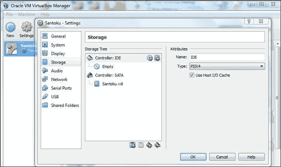

1.  会弹出一个**VirtualBox 问题**对话框；在这个对话框上，点击**选择磁盘**。你应该会看到一个**文件**对话框。

1.  导航到并选择你已下载的 Santoku 映像。

1.  你现在可以启动新的 Santoku 虚拟机并开始安装。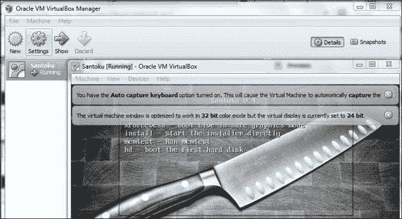

# 设置 drozer

安装并设置 drozer 是相当简单的；设置过程适用于 Windows 7 和 Unix/Linux 类型的系统。

## 如何操作...

在开始编写一些 drozer 脚本并了解利用和枚举模块之前，你需要获取适合你系统的 drozer 安装程序。以下是操作方法：

1.  访问 [`www.mwrinfosecurity.com/products/drozer/community-edition/`](https://www.mwrinfosecurity.com/products/drozer/community-edition/) 获取 drozer 框架的副本；当然，这里我将讨论社区版。如果你愿意花钱购买非免费版本，请访问 [`products.mwrinfosecurity.com/drozer/buy`](https://products.mwrinfosecurity.com/drozer/buy)。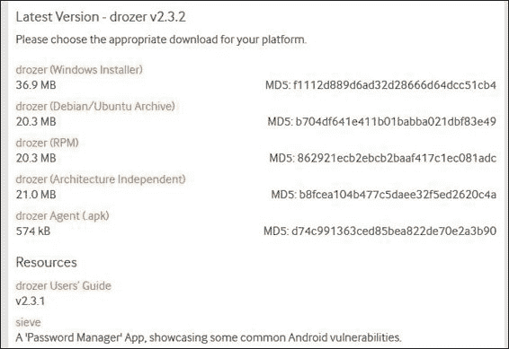

    Windows 用户应点击 **drozer (Windows 安装程序)** 选项；它应该会立即开始下载 `drozer-installer-[version].zip` 文件。

    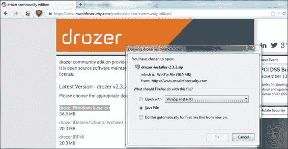

    Unix/Linux 用户根据你的发行版或操作系统类型，选择 **drozer (Debian/Ubuntu Archive)** 文件或 **drozer (RPM) 包** 文件。

1.  下载与你的系统兼容的 drozer 版本后，根据你的系统，你需要执行以下操作：

    对于 Windows 用户：

    1.  你需要将 `drozer-installer-[version].zip` 文件解压到你能轻松记住的位置/路径中。![如何操作...    1.  解压后，运行 ZIP 归档中包含的名为 `setup.exe` 的文件。应该会如以下截图所示启动安装向导：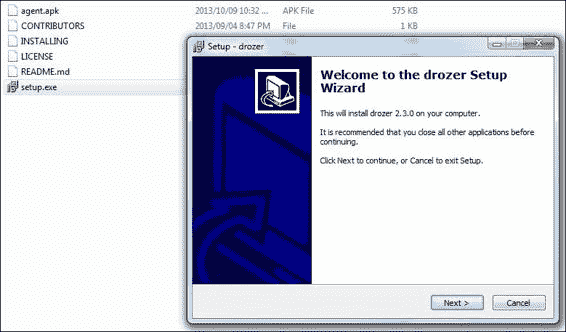

    1.  安装向导设置好后，你需要做的就是按照提示操作，注意配置对话框，并确保记下 drozer 将安装在系统上的位置；你需要经常访问此路径以使用 drozer。安装开始后，你应该会看到以下对话框出现：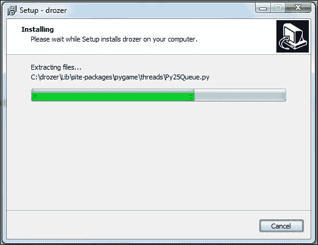

    1.  安装完成后，你应该已经将 drozer 安装到你指定的路径中。默认情况下，这被配置在 `C` 驱动的根目录下，如下截图所示：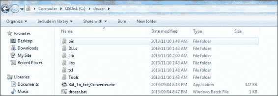

        对于 Unix/Linux 用户：

        drozer 框架以与你的系统相关的包文件格式提供，因此对于 Debian 用户是 DEB 文件，对于 Red Hat 用户是 RPM 文件。你只需使用包管理器打开此文件，其余的它会处理。Debian 用户可以使用以下命令来安装 drozer：

        ```kt
        dpkg –I drozer-[version].deb

        ```

1.  安装完 drozer 后，你应该尝试运行它。如何运行部分取决于你的操作系统。

    对于 Windows 用户：

    1.  打开命令提示符并转到你安装 drozer 的路径。如前所述，默认情况下这是 `C:\drozer` 路径。

    1.  通过执行以下命令调用 drozer：

        ```kt
         C:\drozer\drozer

        ```

        你应该看到类似于以下截图的输出：

        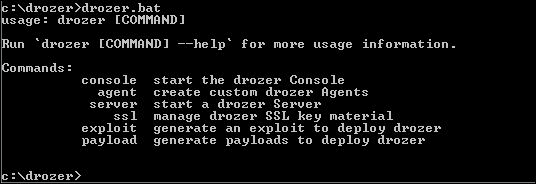

    1.  作为诊断测试，尝试调用 drozer 控制台。如果出现问题，它会在告诉你设备（这里未连接）不可用或拒绝连接之前，通知你错误。执行以下命令：

        ```kt
         C:\drozer\drozer console

        ```

        除非你已经足够聪明地解决了错误，否则你应该看到与以下屏幕截图相似的输出：

        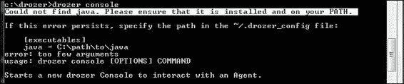

        这个错误意味着 drozer 无法找到你的 Java 安装。

1.  假设你已经安装了 Java，你可以将 drozer 添加到你的系统 `PATH` 变量中。

    在 Windows 上增强你的 `PATH` 变量非常直接；你可以通过执行以下步骤开始：

    1.  打开 **我的电脑**。

    1.  点击 **系统属性**。

    1.  在屏幕的 **控制面板** 部分下，点击 **高级系统设置**。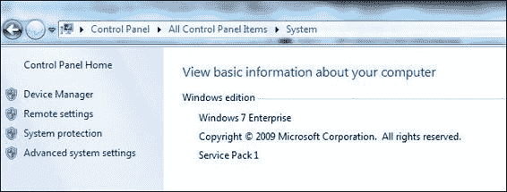

    1.  应该会弹出 **用户访问控制** 提示。如果你有管理员权限，只需点击 **确定** 或输入管理员密码。

    1.  在 **系统属性** 对话框中，点击标记为 **环境变量...** 的按钮。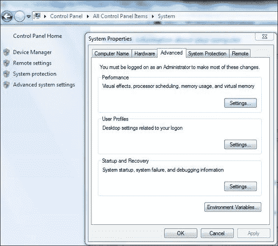

    1.  一旦弹出 **环境变量** 对话框，在标记为 **系统变量** 的部分，向下滚动到名为 **Path** 的变量并点击 **编辑…**。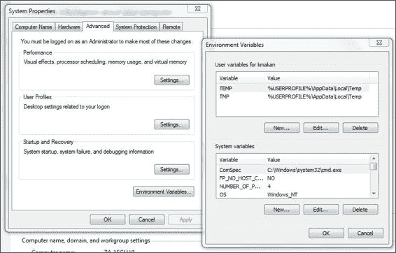

    1.  应该会弹出一个对话框，允许你编辑 `PATH` 变量。在变量值的末尾添加以下字符串：

        ```kt
               ;C:\Program Files\Java\jre7
        ```

对于 Unix/Linux 用户：

1.  你可以通过从你的终端窗口执行以下命令来调用 drozer：

    ```kt
    drozer

    ```

1.  如果一切正常，你应该看到与 Windows 版 drozer 完全相同的输出。

1.  如果 Java 尚未添加到你的 `PATH` 变量中，执行以下命令以添加它：

    ```kt
    PATH=$PATH:`which java

    ```

    为了使这个持久化，将之前的命令行添加到你的 `/home/[user]/.bashrc` 文件的末尾。

## 还有更多…

在 drozer 能够启动并运行之前，你需要在 Android 设备上安装 drozer 代理。这很简单；以下是操作方法：

1.  假设设备通过 USB 连接到你的主机，你可以按照以下方式安装 `drozer.apk` 文件：

    ```kt
    adb install drozer.apk

    ```

1.  为了使这个工作，你需要确保目标 Android 设备已启用 **未知来源** 和 **USB 调试**。

    启动 drozer 后，你应该看到以下内容：

    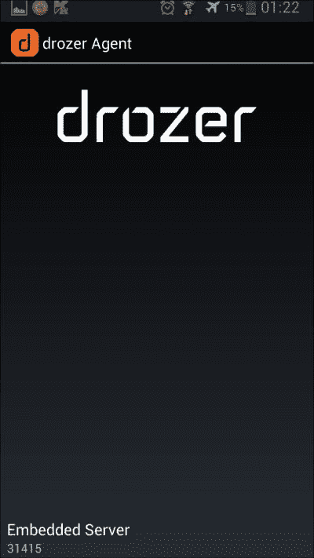

1.  为了使从命令行界面使用 drozer 控制台更加方便，你也可以将 drozer 本身添加到你的系统 `PATH` 变量中。

    对于 Windows 用户：

    1.  按照前一个菜谱描述的方式访问 **环境变量** 对话框。

    1.  将以下字符串添加到你的 `PATH` 变量中：

        ```kt
               ;C:\drozer\drozer

        ```

    如果你是一个 Unix/Linux 用户，从你的终端执行以下命令：

    ```kt
    PATH=$PATH:`which drozer`

    ```

    为了使这个持久化，将之前的命令行添加到你的 `/home/[user]/.bashrc` 文件的末尾。

如果 DEB 文件安装失败，还有另一种相对无痛的方法来安装 drozer。要在不使用 DEB 包的情况下安装 drozer，请执行以下步骤：

1.  首先，通过执行以下命令获取 Python 开发头文件和软件包的副本：

    ```kt
    apt-get install python-dev

    ```

1.  通过执行以下命令获取 Python 安装工具的副本：

    ```kt
    apt-get install python-setuptools

    ```

1.  为你的 Debian 系统安装 32 位支持库：

    ```kt
    apt-get install ia32-libs-i386

    ```

1.  安装 Python 依赖项；第一个是 `protobuf`，你可以通过执行以下命令来安装：

    ```kt
    easy_install –allow-hosts pypi.python.org protobuf==2.4.1

    ```

1.  安装 `protobuf` 之后，你需要为 Python 安装 `twisted`，可以通过执行以下命令来完成：

    ```kt
    easy_install twisted==10.2.0

    ```

1.  接下来你需要做的是获取一份可在 [`www.mwrinfosecurity.com/system/assets/571/original/drozer-2.3.2.tar.gz`](https://www.mwrinfosecurity.com/system/assets/571/original/drozer-2.3.2.tar.gz) 下载的 drozer 独立架构包。

1.  下载后，将其解压到你选择的某个目录中。解压后，它应该包含一个名为 `drozer-[version]-py2.7.egg` 的文件。然后你可以通过执行以下命令来安装这个 EGG：

    ```kt
    easy_install drozer-[version]-py2.7.egg

    ```

    就这样——drozer 应该已经准备好大显身手了！

# 运行 drozer 会话

既然已经设置好 drozer 并准备就绪，你就可以在示例 Android 设备上运行一些 drozer 会话了——最好是已经安装了 drozer 代理的设备。

以下教程将带你了解设置 drozer 会话的基础知识以及如何通过 drozer 控制台快速运行一些简单的模块。

## 如何操作...

在继续本教程之前，你需要在你的机器上安装 drozer 控制台，在目标设备上安装 drozer 代理。如果这些都准备好了，你可以通过执行以下步骤来开始你的 drozer 控制台会话：

1.  使用 ADB，设置一些端口转发，前提是你连接了某种设备：

    ```kt
    adb forward tcp:31415 tcp:31415

    ```

1.  您需要确保已启动 drozer 嵌入式服务器。你需要通过设备上的应用程序界面来启动它。只需在设备上找到 drozer 代理；它应该会出现在其他应用程序中，但由于你可能刚刚安装了它，你可能会看到一条关于它的通知，并且可以从通知菜单中启动它。

1.  点击通过 drozer 代理用户界面标记为 **嵌入式服务器** 的按钮。你应该会看到如下截图所示的屏幕：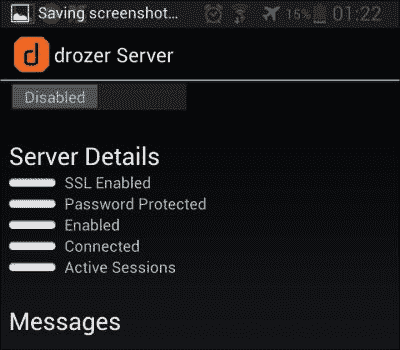

1.  将标记为 **禁用** 的按钮向右拖动。现在它应该显示 **启用**，并且用户界面中 **服务器详情** 部分下的 **启用** 标签应该已激活，如下截图所示：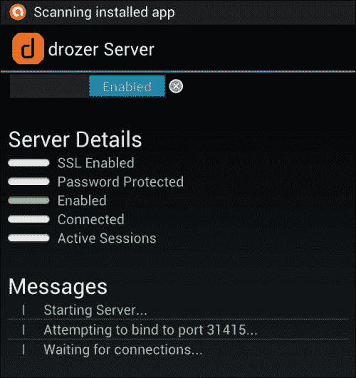

1.  然后，你可以通过执行以下命令来连接 drozer 控制台：

    ```kt
    drozer console connect

    ```

    然后 drozer 应该进入控制台模式，允许你开始执行命令和模块。

    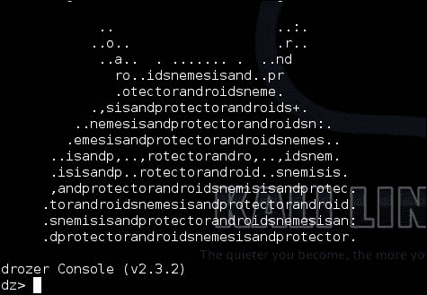

# 枚举已安装的包

drozer 代理已经设置好了，你也成功启动了 drozer 控制台；你可以开始运行一些 drozer 模块，真正与设备的安全性进行交互。

以下教程详细介绍了如何使用 drozer 框架执行诸如枚举已安装的包并根据包名进行过滤等新任务。

## 如何操作...

当你搭建并运行了你的 drozer 框架后，你可能想要开始在 Android 设备上摸索和尝试。你可能想要做的一件有用的事情是列出设备上安装的所有包。你可以通过从你的 drozer 控制台触发以下命令来实现这一点：

```kt
dz> run app.package.list

```

你应该会在屏幕上看到类似以下内容开始出现：

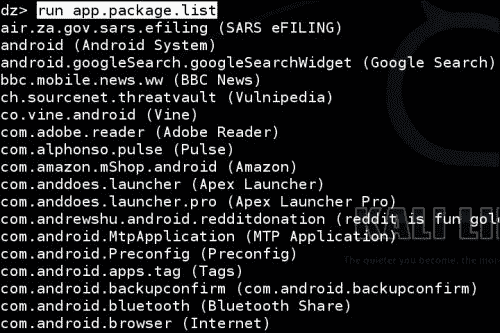

## 它是如何工作的...

让我们来看看 drozer 的源代码，确切地了解它是如何与包管理器 API 接口来获取所有这些有用信息的。我将解释大部分模块背后的代码，以便你了解 drozer 是如何工作的，并在本章的后面指导你自己编写一个 drozer 模块！毕竟，框架的意义就在于——构建你自己的模块和插件。

非 Python 用户/开发者请注意！你可能需要一些 Python 背景知识才能阅读这段源代码；尽管如此，考虑到 Python 的语义性，即使你从未编写过 Python 代码，你也应该能很容易地跟上。drozer 设计的一个额外好处是，它们基本上镜像了 Android Java API，使得模块开发对 Android 开发者来说很容易上手。所以，总之，你暂时还不需要去拿本 Python 的书来读。如果你之前写过 Android 应用，这将非常容易理解。无论如何，废话少说——让我们来看一些代码！

### 注意

以下代码可以在[`github.com/mwrlabs/drozer/blob/master/src/drozer/modules/app/package.py`](https://github.com/mwrlabs/drozer/blob/master/src/drozer/modules/app/package.py)（第 99-121 行）找到。

```kt
def add_arguments(self, parser):
  parser.add_argument("-a", "--package", default=None, help="the identifier of the package to inspect")
  parser.add_argument("-d", "--defines-permission", default=None, help="filter by the permissions a package defines")
  parser.add_argument("-f", "--filter", default=None, help="keyword filter conditions")
  parser.add_argument("-g", "--gid", default=None, help="filter packages by GID")
  parser.add_argument("-p", "--permission", default=None, help="permission filter conditions")
  parser.add_argument("-u", "--uid", default=None, help="filter packages by UID")

def execute(self, arguments):
  if arguments.package == None:
    for package in self.packageManager().getPackages(common.PackageManager.GET_PERMISSIONS | common.PackageManager.GET_CONFIGURATIONS | common.PackageManager.GET_GIDS | common.PackageManager.GET_SHARED_LIBRARY_FILES):
      self.__get_package(arguments, package)
  else:
    package = self.packageManager().getPackageInfo(arguments.package, common.PackageManager.GET_PERMISSIONS | common.PackageManager.GET_CONFIGURATIONS | common.PackageManager.GET_GIDS | 
            common.PackageManager.GET_SHARED_LIBRARY_FILES)

      self.__get_package(arguments, package)

def get_completion_suggestions(self, action, text, **kwargs):
  if action.dest == "permission":
    return android.permissions

def __get_package(self, arguments, package):
  application = package.applicationInfo
```

`execute()`方法在你从控制台触发`app.activity.info`模块时会被调用。它实际上是模块执行实际工作的入口点。

我们看到对包管理器的调用，`self.packageManager().getPackages(…)`；这返回一个包含每个包对象及其权限、配置、GID 和共享库的列表。脚本在每个包对象上调用`self.__get_package()`来将其输出到 drozer 控制台。当通过命令行参数提供特定包时，也会执行相同的操作。

如果你想要获取这段代码的副本，可以从 drozer 的官方 GitHub 仓库获取，如果你足够用心去 Google，找到它是非常容易的。为了让大家更方便，我在本食谱的*另请参阅*部分提供了一个代码仓库的 URL。

## 还有更多...

`dz> run app.package.list`命令是对 Android 包管理器的一个封装；因此，你能做的很酷的一件事就是基于应用名称进行筛选，如下所示：

```kt
dz> run app.package.list –f [application name]

```

在这里，`[application name]`是你想要检查的应用程序或包的名称。以下是一个例子：

```kt
dz> run app.package.list –f facebook

```

drozer 中的另一个用于提取信息的枚举类型模块是`app.package.info`，它会获取关于一个包的以下信息：

+   权限

+   配置

+   群组 ID

+   共享库

你可以通过从你的 drozer 控制台发出以下命令来使用这个模块：

```kt
dz> run app.package.info --help

```

以这种方式使用时，它将提取关于你 Android 设备上所有软件包的相关信息。

自然地，你可能希望将此信息缩小到特定的软件包：

```kt
dz> run app.package.info –-package [package name]

```

你也可以使用以下开关的简写方式：

```kt
dz> run app.package.info –a [package name]

```

这是一个示例：

```kt
dz> run app.package.info –a com.android.browser

```

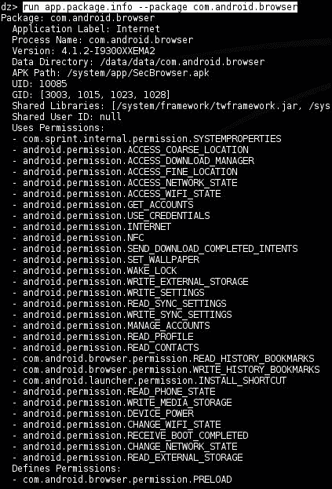

之前截图中显示输出的快速解释如下：

+   **应用程序标签**：应用程序显示的名称

+   **进程名称**：此应用程序运行的进程名称

+   **版本**：安装的应用程序版本

+   **数据目录**：将用于存储与该应用程序特别关联的用户数据和应用程序的目录的完整路径

+   **APK 路径**：设备上实际 Android 应用程序包文件的路径

+   **UID**：与应用程序关联的用户 ID；它在 Android 系统上执行的所有操作都将使用与此用户 ID 关联的访问权限，除非它让其他应用程序和进程代表它执行操作

+   **GID**：与该应用程序用户 ID 关联的系统群组 ID；通常，这些 ID 基于授予应用程序的特殊权限数量与之关联

+   **共享库**：此应用程序使用的共享库的完整路径

+   **共享用户 ID**：此应用程序允许使用的共享用户 ID

+   **使用权限**：授予此应用程序的权限列表

另一个例子，如果你有一个 Nexus 设备，可以按照以下方式针对 Google 服务框架运行：

```kt
dz> run app.package.info –a com.google.android.gsf

```

之前的命令应该会产生如下截图所示的输出：

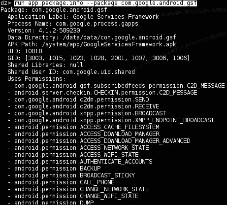

你还可以使用`app.package.info`模块做另一件很酷的事情，那就是基于权限查找软件包。你可以通过执行以下命令来完成：

```kt
dz> run app.package.info –p [permission label]

```

一个例子如下：

```kt
dz> run app.package.info –p android.permission.INTERNET

```

这为什么这么酷？好吧，你可能想知道所有具有一组危险权限的应用程序。我的意思是，你知道你的应用程序中有多少个具有`INTERNET`权限或其他危险权限的吗？不知道吧？正是如此！

## 另请参阅

+   drozer GitHub 仓库位于[`github.com/mwrlabs/drozer`](https://github.com/mwrlabs/drozer)

+   `package.py` drozer 模块位于[`github.com/mwrlabs/drozer/blob/master/src/drozer/modules/app/package.py`](https://github.com/mwrlabs/drozer/blob/master/src/drozer/modules/app/package.py)

# 枚举活动

drozer 还提供了一个有用的模块，用于枚举目标 Android 设备上可用的活动组件信息。以下食谱演示了此模块的使用。

## 如何操作...

你可能有时候想要找出设备上安装并导出的活动。drozer 框架使这变得相当简单，以下是操作方法：

从你的 drozer 控制台执行以下命令：

```kt
dz> run app.activity.info

```

此命令将列出设备上导出的所有活动。

## 还有更多...

你可能想要获取有关设备上活动的更多信息；例如，列出所有具有特定名称或名称中包含特定字符串的应用程序，如"browser"或"facebook"，这些应用程序具有什么权限，甚至搜索未导出的活动。以下是操作方法：

通过执行以下命令，根据名称搜索活动：

```kt
dz> run app.activity.info –-filter [activity name]

```

这将列出名称中带有`[activity name]`的所有活动。例如：

```kt
dz> run app.activity.info –-filter facebook

```

与所有 Unix 风格或 Linux 风格的命令一样，这个命令也有一个快捷方式：

```kt
dz> run app.activity.info –f facebook

```

上一个命令应该会产生如下截图所示的输出：

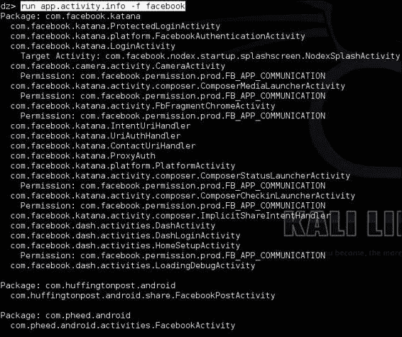

你还可以指定要检查活动的包。

按照以下方式在给定包中搜索活动：

```kt
dz> run app.activity.info –-package [package name]

```

你也可以使用此命令的快捷方式：

```kt
dz> run app.activity.info –a [package name]

```

这是一个例子：

```kt
dz> run app.activity.info –a com.android.phone

```

上一个命令应该会产生如下截图所示的输出：

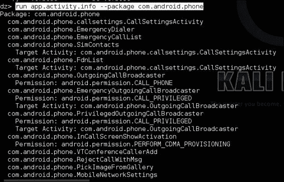

## 另请参阅

+   drozer 活动模块的源代码在[`github.com/mwrlabs/drozer/blob/master/src/drozer/modules/app/activity.py`](https://github.com/mwrlabs/drozer/blob/master/src/drozer/modules/app/activity.py)

# 枚举内容提供者

与枚举活动和包类似，drozer 也提供了一些模块来列出所有内容提供者及其一些信息。以下食谱将介绍如何使用`app.provider.info`模块进行操作。

## 如何操作...

让我们开始枚举内容提供者。

1.  从你的 drozer 终端执行以下命令：

    ```kt
    dz> run app.provider.info

    ```

1.  这将返回有关内容提供者的以下信息：

    +   权限 - 实现其 SQLite 前端的类名称

    +   读取权限

    +   写入权限

    +   授予 URI 权限

    +   路径

## 它是如何工作的...

让我们看看`app.provider.info`模块的代码。

### 注意

以下代码在[`github.com/mwrlabs/drozer/blob/766329cacde6dbf1ba05ca5dee36b882041f1b01/src/drozer/modules/app/provider.py`](https://github.com/mwrlabs/drozer/blob/766329cacde6dbf1ba05ca5dee36b882041f1b01/src/drozer/modules/app/provider.py)。

```kt
def execute(self, arguments):
  if arguments.package == None:
    for package in self.packageManager().getPackages      (common.PackageManager.GET_PROVIDERS |         common.PackageManager.GET_URI_PERMISSION_PATTERNS):
      self.__get_providers(arguments, package)
  else:
    package = self.packageManager().getPackageInfo(arguments.package, common.PackageManager.GET_PROVIDERS | common.PackageManager.GET_URI_PERMISSION_PATTERNS)

    self.__get_providers(arguments, package)

def get_completion_suggestions(self, action, text, **kwargs):
  if action.dest == "permission":
    return ["null"] + android.permissions

def __get_providers(self, arguments, package):
  providers = self.match_filter(package.providers, 'authority', arguments.filter)

  if arguments.permission != None:
    r_providers = self.match_filter(providers, 'readPermission',       arguments.permission)
    w_providers = self.match_filter(providers, 'writePermission',       arguments.permission)

```

代码中第一个值得注意的部分是脚本调用包管理器的地方。它看起来像这样：

```kt
self.packageManager().getPackages(common.PackageManager.GET_PROVIDERS | common.PackageManager.GET_URI_PERMISSION_PATTERNS)
```

脚本通过调用 Android 包管理器获取一个包列表，并抛出一些标志以确保获取到带有授权 URI 权限模式的提供者。接下来我们看到，一旦包管理器收集了关于内容提供者的详细信息，脚本就会调用一个名为 `__get_provider()` 的函数，该函数提取有关提供者读取和写入权限的信息（如果有的话）。通过 `match_filters()` 调用进行一些简单的字符串匹配，`__get_provider()` 函数基本上在定义内容提供者权限的部分查找某个字符串值。这个字符串值由 `readPermission` 标记，表示从内容提供者读取所需的权限，或者由 `writePermission` 标记，出人意料的是，它表示写入内容提供者所需的权限。在此之后，它会在将提供者对象打印到控制台之前重置该对象。

## 还有更多...

与 drozer 中的其他 `.info` 模块类似，你可以通过以下方式添加过滤器信息：

+   基于包名称搜索：

    ```kt
    dz> run app.provider.info –a [package name]

    ```

    或者：

    ```kt
    dz> run app.provider.info –-package [package name]

    ```

+   基于权限搜索：

    ```kt
    dz> run app.provider.info –p [Permission label]

    ```

    或者：

    ```kt
    dz> run app.provider.info –-permission [permission label]

    ```

## 另请参阅

+   关于 *内容提供者* 的网页在 [`developer.android.com/guide/topics/providers/content-providers.html`](http://developer.android.com/guide/topics/providers/content-providers.html)

# 枚举服务

你可能还想了解设备上安装了哪些服务。drozer 有一个名为 `app.service.info` 的模块，可以提取有关服务的有用信息。

## 如何操作...

从你的 drozer 控制台执行以下命令：

```kt
dz> run app.service.info –-package [package name]

```

不带参数运行此命令将列出目标设备上安装的所有服务。运行时它看起来会像以下截图：

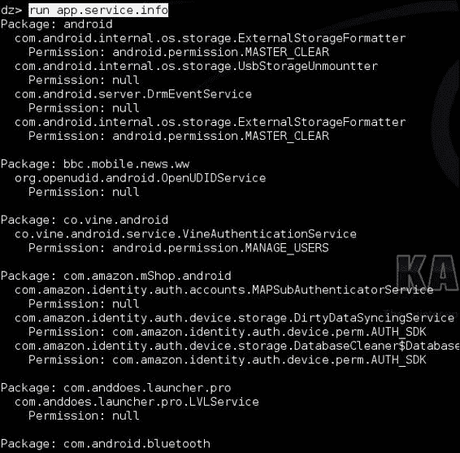

你还可以使用以下过滤器来缩小搜索范围：

+   基于权限搜索：

    ```kt
    dz> run app.service.info –p [permission label]
    dz> run app.service.info –-permission [permission label]

    ```

+   基于服务名称搜索：

    ```kt
    dz> run app.service.info –f [Filter string]
    dz> run app.service.info. –filter [filter string]

    ```

+   你还可以选择列出未导出的服务，例如以下：

    ```kt
    dz> run app.service.info –u
    dz> run app.service.info –-unexported

    ```

+   最后，如果你想了解其他开关和选项的信息，可以随时运行 `–help` 选项，如下所示：

    ```kt
    dz> run app.service.info –-help

    ```

    之前的命令应该会产生如下截图所示的输出：

    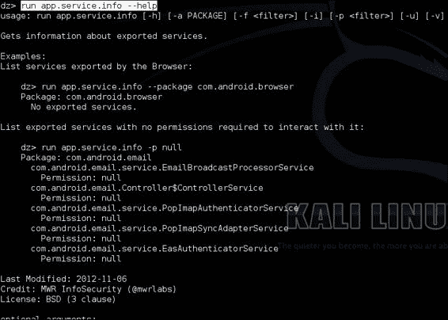

## 它是如何工作的…

`app.service.info` 模块通过 API 调用包管理器，其工作方式与其他 `.info` 和 `.list` 类型的 drozer 模块类似。以下是来自 `drozer/master/src/drozer/modules/service.py` 的包管理器调用：

```kt
def execute(self,arguments):
  if arguments.package == None:
    for package in self.packageManager().getPackageInfo      (common.PackageManager.GET_SERVICES |         common.PackageManager.GET_PERMISSIONS):
      self.__get_servcies(arguments, package)
  else:
    package = self.packageManager().getPackageInfo(arguments.package, common.PackageManager.GET_SERVICES | common.PackageManager.GET_PERMISSIONS)
    self.__get_services(arguments,package)
```

脚本会检查是否将特定包作为参数传递，这是 `execute` 方法中的第一段代码：

```kt
if arguments.package == None:
```

如果没有定义参数或包名，脚本会获取一个包列表，并通过调用`self.__get_services()`方法来遍历它们，这个方法通过字符串匹配从`self.packageManager().getPackageInfo(arguments.package,common.PackageManager.GET_SERVICES | common.PackageManager.GET_PERMISSIONS)`调用返回的数据来确定一些包属性；例如，在寻找具有特定权限的服务时，它会执行以下操作：

```kt
services = self.match_filter(services, "permission", arguments.permission)
```

这是为了提取具有所需权限的服务列表。

## 参见

+   drozer 的*service.py*模块源码在[`github.com/mwrlabs/drozer/blob/master/src/drozer/modules/app/service.py`](https://github.com/mwrlabs/drozer/blob/master/src/drozer/modules/app/service.py)

+   [Services – Android 开发者](http://developer.android.com/guide/components/services.html)网页

+   [Bound Services – Android 开发者](http://developer.android.com/guide/components/bound-services.html)网页

+   [Service – Android API 参考](http://developer.android.com/reference/android/app/Service.html)网页

# 枚举广播接收器

广播接收器通常包含有关应用程序攻击面的有用信息，并可能为攻击者提供执行任意代码到传播信息等多种机会；因此，在针对应用程序的安全评估中不能忽略它们。drozer 的开发者深知这一点，并提供了模块来帮助获取有关广播接收器的信息。

下面的指南详细介绍了`app.broadcast.info`模块的不同调用选项，以此演示其功能。

## 如何操作...

广播接收器的枚举是通过以下命令执行的：

```kt
dz> run app.broadcast.info

```

前一个命令的输出应类似于以下截图：

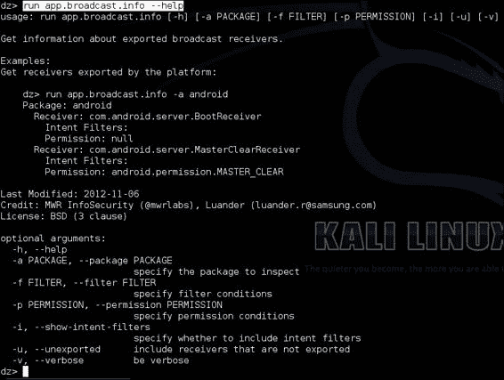

这个`app.broadcast.info`模块具有其他`.info`模块所有的酷功能，以及一些特定的广播接收器选项。

你可以指定一个特定的包，从中提取接收器的信息；以下命令是一个示例：

```kt
dz> run app.broadcast.info –a [package]

```

下面的命令是另一个示例：

```kt
dz> run app.broadcast.info –-package [package]

```

你也可以基于它们的名称搜索和列出广播接收器；例如：

```kt
dz> run app.broadcast.info –f [filter]

```

或者使用更长的形式：

```kt
dz> run app.broadcast.info –-filter [filter]

```

另一个选项是选择包含未导出的接收器：

```kt
dz> run app.broadcast.info –u
dz> run app.broadcast.info –-unexported

```

最后，你可以选择是否在请求的信息中包含意图过滤器；例如：

```kt
dz> run app.broadcast.info –i

```

或者：

```kt
dz> run app.broadcast.info –-show-intent-filters

```

## 参见

+   [BroadcastReceivers – Android 参考文档](http://developer.android.com/reference/android/content/BroadcastReceiver.html)网页

+   位于 [`github.com/mwrlabs/drozer/blob/master/src/drozer/modules/app/broadcast.py`](https://github.com/mwrlabs/drozer/blob/master/src/drozer/modules/app/broadcast.py) 的 drozer 源码 *broadcast.py* 模块

# 确定应用程序的攻击面

在您的应用程序安全评估过程中，您可能想要了解给定应用程序的攻击面是什么。drozer 有一个非常整洁的模块可以帮助您确定这一点。就这个模块而言，应用程序的攻击面仅是指导出组件的数量。

## 如何操作...

从您的 drozer 控制台执行以下命令：

```kt
dz> app.package.attacksurface [package name]

```

此命令将列出由包管理器 API 确定的给定包的所有导出活动。

例如，您可以尝试针对一个示例包按以下方式运行它：

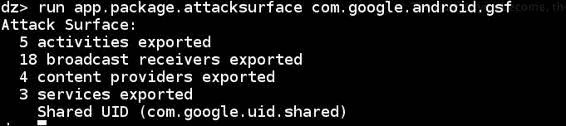

## 它的工作原理...

让我们看看 `app.package.attacksurface` 模块的代码。我认为这可能是最有趣的模块之一，通过阅读其代码应该能激发您如何以应用程序的形式编写自动化测试工具的想法。当您想要进行大规模的自动化应用程序扫描时，它绝对会派上用场！

来自 `drozer-master/src/mrw/droidhg/modules/package.py` 的代码如下：

```kt
from drozer import android
from drozer.modules import common, Module
class AttackSurface(Module,common.Filters, common.PackageManager):

def execute(self,arguments):
  If arguments.package != None:
    Package = self.packageManger().getPackageInfo(arguments.package, common.PackageManager.GET_ACTIVITIES | common.PackageManager.GET_RECEIVERS | common.PackageManager.GET_PROVIDERS | common.PackageManager.GET_SERVICES)
    application = package.applicationInfo
    activities = self.match_filter(package.activities, 'exported',True)
    receivers = self.match_filter(package.receivers, 'exported', True)
    providers = self.match_filter(package.proviers, 'exported', True)
    services = self.match_filter(package.services, 'exported', True)
    self.stdout.write("Attack Surface:\n")
    self.stdout.write(" %d activities exported\n" % len(activities))
    self.stdout.write(" %d broadcast receivers exported\n" % len(receivers))
    self.stdout.write(" %d content providers exported\n" % len(providers))
    self.stdout.write(" %d services exported\n" % len(services))
    if (application.flags & application.FLAG_DEBUGGABLE) != 0:
      self.stdout.write("is debuggable\n")
    if package.sharedUserId != None:
      self.stdout.write("Shared UID (%s)\n" % package.sharedUserId)
  else:
  self.stdout.write("Package Not Found\n")
```

这里的代码很多，但这个模块的好处在于它遵循与包管理器接口的相同风格。该模块从包管理器获取关于服务、活动、广播接收器和内容提供者的信息，并尝试确定它们是否根据包管理器导出。确定了哪些组件是导出的，它只是枚举它们，并在屏幕上打印导出组件的数量。该模块所做的就是尝试确定应用程序是否可调试以及是否使用共享用户 ID，这对于攻击面来说是非常有价值的信息。我将在下一章解释为什么。

## 另请参阅

+   位于 [`github.com/mwrlabs/drozer/blob/master/src/drozer/modules/app/package.py`](https://github.com/mwrlabs/drozer/blob/master/src/drozer/modules/app/package.py) 的 drozer 源码 *broadcast.py* 模块

# 启动活动

活动是促进用户交互的应用程序组件。在应用程序安全评估期间，了解哪些应用程序可以在没有权限的情况下启动可能很有用，以防它们中的任何一个提供了对敏感数据的访问或如果在不正确的上下文中启动导致应用程序崩溃。除了通过 drozer 控制台与活动互动的明显好处之外，它还是一个很好的响应式介绍，可以与应用程序组件互动，因为您实际上可以从终端看到您的 Android 设备对您的命令做出响应。所以，不再赘述，让我们开始一些活动吧！

## 如何操作...

你需要选择一个要启动的活动，但由于你无法本质上知道可启动活动在哪里或者它们叫什么，我认为我应该在教程中包含查找可启动活动的过程。

1.  使用 `app.activity.info` 模块查找一些活动：

    ```kt
    dz> run app.activity.info –-package [package name]

    ```

    在下一步中，你需要选择一个包和一个活动。习惯于多次运行这个命令；如果你打算进行 Android 渗透测试，你会经常使用它。

1.  找到你要找的活动后，你可以向它发送一些启动意图，并在你的 Android 设备屏幕上看到它弹出。以下是操作方法：

    ```kt
    dz> run app.activity.start –-action [intent action] –-category [intent category] –-component [package name] [component name]

    ```

    在这里，`[intent action]` 是目标活动设置的意图过滤器的动作属性，`[intent category]` 是目标活动设置的意图过滤器的类别属性，你可以从第一步的命令中获得。

这是一个你可以尝试的例子：

```kt
dz> run app.activity.start –-action android.intent.action.MAIN –-category android.intent.category.LAUNCHER –-component com.android.browser com.android.browser.BrowserActivity

```

## 它的工作原理...

让我们查看 drozer 的源代码，确切地了解它是如何启动某些活动的。

### 注意

以下代码可以在[`github.com/mwrlabs/drozer/blob/master/src/drozer/modules/app/activity.py`](https://github.com/mwrlabs/drozer/blob/master/src/drozer/modules/app/activity.py)（第 166-174 行）找到。

```kt
.... #some code has been omitted for brevity
def execute(self,arguments)
  intent = android.Intent.fromParser(arguments)

  if len(intent.flags) == 0:
    intent.flags.append('ACTIVITY_NEW_TASK')

  if intent.isValid():
    self.getContext().startActivity(intent.buildIn(self))
  else:
    self.stderr.write('invlaid intent: one of action or component must be set')
...#some code has been omitted for brevity
```

我们可以看到，drozer 通过参数解析器获取用户提供的参数后，将这些参数打包成一个意图；在检查意图是否有效后，它发送这个意图。这与来自 Android 应用的意图工作方式相同。

## 还有更多...

你可以使用 `app.activity.forintent` 模块查找要启动的活动。

这个便捷的模块允许你根据给定的意图动作和类别搜索活动；以下是操作方法：

```kt
dz> run app.activity.forintent –-action [intent action] –category [intent category]

```

这是一个例子：

```kt
dz> run app.activity.forintent –-action android.intent.action.VIEW –-category android.intent.category.DEFAULT

```

## 另请参阅

+   请参考[*Intent*过滤器参考资料](http://developer.android.com/reference/android/content/Intent.html)。

+   请参考[*Intents and Intent Filters – Android Developer*](http://developer.android.com/guide/components/intents-filters.html)网页。

+   请参考[*Activites – Android Developer*](http://developer.android.com/guide/components/activities.html)网页。

# 编写一个 drozer 模块——设备枚举模块

本教程通过演示构成 drozer 模块开发的实际步骤，解释了如何实际开发 drozer 模块。以下设备信息枚举器获取有关部分硬件和操作系统版本的信息。

## 如何操作...

让我们开始编写一个 drozer 设备枚举模块：

1.  打开文本编辑器并输入以下代码：

    ```kt
    from drozer.modules import Module
    class Info(Module):
      name = "Get Device info"
      description = "A module that returns information about the device and hardware features"
      examples = "run ex.device.info"
      date = "10-11-13"
      author = "Keith Makan"
      license = "GNU GPL"
      path = ["ex","device"]
      def execute(self,arguments):
        build = self.new("android.os.Build")
        self.stdout.write("Getting device info...\n")
        self.stdout.write("[*] BOARD : %s\n" % (build.BOARD))
        self.stdout.write("[*] BOOTLOADER : %s\n" % (build.BOOTLOADER))
        self.stdout.write("[*] BRAND : %s\n" % (build.BRAND))
        self.stdout.write("[*] CPU_ABI : %s\n" % (build.CPU_ABI))
        self.stdout.write("[*] CPU_ABI2 : %s\n" % (build.CPU_ABI2))
        self.stdout.write("[*] DEVICE : %s\n" % (build.DEVICE))
        self.stdout.write("[*] DISPLAY : %s\n" % (build.DISPLAY))
        self.stdout.write("[*] FINGERPRINT : %s\n" % (build.FINGERPRINT))
        self.stdout.write("[*] HARDWARE : %s\n" % (build.HARDWARE))
        self.stdout.write("[*] MANUFACTURER : %s\n" % (build.MANUFACTURER))
        self.stdout.write("[*] MODEL : %s\n" % (build.MODEL))
        self.stdout.write("[*] TAGS : %s\n" % (build.TAGS))
    ```

1.  将该文件保存为 `ex.device.info`。

1.  创建一个目录来保存你未来所有的 drozer 模块，并将 `ex.device.info` 文件保存在其中。

1.  启动 drozer 控制台并执行以下命令：

    ```kt
    dz> module repository create [path-to-your-module-dir]/repo

    ```

1.  然后执行以下命令：

    ```kt
    dz> module install [path-to-your-module-dir]/ex.device.info

    ```

1.  如果没有语法错误或故障，drozer 应该已经安装了你的新模块。现在你可以使用以下命令执行它：

    ```kt
    dz> run ex.device.info

    ```

    之前命令的输出应该类似于以下截图中的输出：

    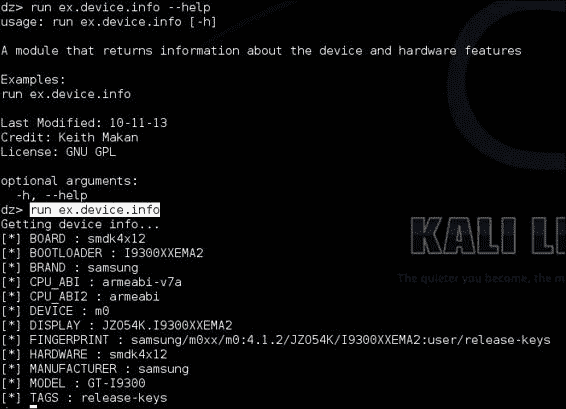

接下来的几个食谱都是关于编写一些有用的模块来扩展你的 drozer 框架；在每一个中，我将演示一些你会在本书后面发现有用的关键模块开发技能。

## 它是如何工作的...

为了开始这个解释，我想讨论一下你刚刚为你新的 drozer 模块编写的代码，以及它是如何设法提取关于你设备的信息的。

首先，我想谈谈 drozer 模块的结构。你编写的每个模块都将从以下这行开始：

```kt
import drozer.modules import Module
class Info(Module)
```

第一行本质上是包含了一些来自`modules`库的代码，并让 drozer 模块能够访问到它们操作所需的所有魔法方法和属性。第二行称为类声明的头部，并标记了 Python 中对象定义的开始。你可能注意到了头部中的`(Module)`部分；这就是`Info`类如何采用`Module`类的属性，从语义上讲，这类似于 Java 中的继承。

接下来的几行如下：

```kt
name = ""
description = ""

license = ""
```

这些只是 drozer 用来将一些元数据关联到模块，并使文档标准化、易于执行的一些变量——这里没有技术性的内容。继续：

```kt
def execute(self, arguments):
```

这段特定的代码称为函数头，并标记了 Python 函数定义的开始。这个函数的特殊之处在于，它是执行模块所有繁重工作的方法，类似于 Java 类中的`Main`方法。让我们谈谈`execute`方法期望传递的参数：

+   `self`：这是正在定义的类的实例。它被解析到类中的每个函数，以便它们可以访问类实例。

+   `arguments`：这是从控制台传给 drozer 模块的分析后的参数字典。

最后，我们有以下这段代码：

```kt
build = self.new("android.os.Build")
```

好吧，除了解引用`self`对象和使用一个名为`new`的魔法方法之外，我们看到一个字符串值`android.os.Build`作为参数传递。这个字符串是 Android Java API 中的一个 Java 类的名称，而`new`方法使用了一种称为 Java 反射的东西来实例化持有我们想要打印到屏幕上所有信息的`Build`类。

代码的其余部分看起来像下面这样：

```kt
self.stdout.write("[*] BOARD : %s\n" % (build.BOARD))
```

上面的代码只是简单地打印出设备信息。

## 另请参阅

+   *构建类参考——Android 开发者*网页在[`developer.android.com/reference/android/os/Build.html`](http://developer.android.com/reference/android/os/Build.html)

+   访问[编写模块](https://github.com/mwrlabs/drozer/wiki/Writing-a-Module)的网页，位于*Writing a Module*。

# 编写一个应用程序证书枚举器

在这个教程中，我将向你展示如何编写一个证书枚举器，它所做的不过是提取应用程序证书作为十六进制摘要并在屏幕上输出。我之所以包含这部分内容，首先是因为它演示了如何与包管理器接口并获取本节其他模块无法获取的信息。其次，当你寻找使用相同公钥签名的所有应用程序时，它可能有助于你获取应用程序签名。这很有用，因为开发者和恶意软件作者通常会用同一把钥匙为他们的多数应用程序签名。它还将允许你识别可能共享资源并自主互相授权权限的应用程序；这一过程将在下一节详细讨论。

## 如何操作...

1.  打开你喜欢的文本编辑器并输入以下代码：

    ```kt
    from drozer.modules import Module, common
    from drozer import android
    import M2Crypto
    import subprocess
    from OpenSSL import crypto
    class Info(Module,common.Filters,common.PackageManager):
      name = "Print the Signer certificate for an application"
      description = "this module allows you to print the signer x509 certificate for a given applicaiton"
      examples = "run ex.cert.info -p com.android.browser"
      author = "Keith Makan"
      date = "11-11-2013"
      license = "GNU GPL"
      path = ["ex","cert"]
      def add_arguments(self, parse):
        parse.add_argument("-p","--package",default=None,help="The Package Name")
      def execute(self,arguments):
        pm = self.packageManager()
        if arguments.package == None:
          for info in pm.getPackages(common.PackageManager.GET_SIGNATURES):
            self.stdout.write("[*] certificate info for {%s}\n" % (info.packageName))
            self.__print_certs(info)
        elif arguments.package != None:
          self.stdout.write("[*] certificate info for {%s}\n" % (arguments.package))
          info = pm.getPackageInfo(arguments.package,common.PackageManager.GET_SIGNATURES)
          self.__print_certs(info)
        else:
          self.stdout.write("[!] cannot process arguments : '%s'\n" % (repr(arguments)))
      def __print_certs(self,info):
        sigs = info.signatures[0].toCharsString()
        sigs = sigs + '\n'
        temp_cert = open("/tmp/cert.crt","w")
        end = 2
        #converting to DER file
        for start in range(0,len(sigs)-2,2):
          temp_cert.write(chr(int(sigs[start:end],16)))
          end +=2
        temp_cert.flush()
        temp_pem = open("/tmp/cert.pem","w")
        temp_pem.flush()
        temp_pem.close()
        certtext = subprocess.check_output(["openssl","x509","-inform","DER","-in","/tmp/cert.crt","-outform","PEM","-out","/tmp/cert.pem","-text"])
        temp_pem = open("/tmp/cert.pem","r")
        pem_cert_string = temp_pem.read()
        temp_pem.close()
        x509cert = crypto.load_certificate(crypto.FILETYPE_PEM,pem_cert_string)
        m2crypto_crt = M2Crypto.X509.load_cert_string(pem_cert_string,1)
        self.stdout.write("[*] Version : %s\n" % (x509cert.get_version()))
        self.stdout.write("[*] Issuer : %s\n" % (self._print_x509Name(x509cert.get_issuer())))
        self.stdout.write("[*] Subject : %s\n" % (self._print_x509Name(x509cert.get_subject())))
        self.stdout.write("[*] Algorithm : %s\n" % 
          (x509cert.get_signature_algorithm()))
        self.stdout.write("[*] NotBefore : %s\n" % (x509cert.get_notBefore()))
        self.stdout.write("[*] NotAfter : %s\n" % (x509cert.get_notAfter()))
        self.stdout.write("[*] Key Length : %s\n" % (x509cert.get_pubkey().bits()))
        self.stdout.write("[*] Public Key : \n%s\n" % (self._print_key(m2crypto_crt)))
        self.stdout.write("\n")
        #self.stdout.write("\n%s\n" % (certtext))
      def _print_x509Name(self,xname):
        return ''.join(["%s=%s " % (i[0],i[1]) for i in xname.get_components()])
      def _print_key(self,m2cert):
        return m2cert.get_pubkey().get_rsa().as_pem()
    ```

1.  将其保存到你的模块仓库中；如果你还没有仓库，只需在你的机器上创建一个文件，用来保存你所有的模块。你可以通过从你的 drozer 控制台执行以下命令来安装模块：

    ```kt
    dz> module install [path to your module code]

    ```

    当这一切准备就绪，你可以使用以下命令运行该模块：

    ```kt
    run external.cert.info –p com.google.android.gsf

    ```

    你的屏幕上应该会显示类似以下截图的内容：

    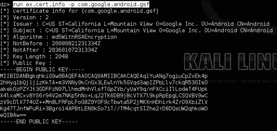
