# 第四章：利用应用程序

在本章中，我们将介绍以下内容：

+   通过 logcat 泄露信息

+   检查网络流量

+   通过活动管理器进行被动意图嗅探

+   攻击服务

+   攻击广播接收器

+   列举易受攻击的内容提供者

+   从易受攻击的内容提供者中提取数据

+   向内容提供者插入数据

+   列举易受 SQL 注入攻击的内容提供者

+   利用可调试的应用程序

+   对应用程序进行中间人攻击

# 引言

到目前为止，我们已经介绍了一些基本开发和安全评估工具，甚至还涵盖了扩展和定制这些工具的一些示例。本章将重点介绍如何使用这些工具分析 Android 应用程序，以识别漏洞并为它们开发利用程序。尽管如此，鉴于应用程序功能的任意性以及 Android 应用程序开发人员几乎无限的创造力，不难看出评估 Android 应用程序的安全性必须被视为一门艺术。对于作为安全审计师、分析师、顾问或爱好者的你来说，这意味着可以肯定，永远不会有一个完全自动化的方法来分析 Android 应用程序的安全性。几乎总是，你需要依赖自己的创造力和分析能力，为 Android 应用程序的安全性提供一个具体的评估。

在我们开始深入探讨一些应用程序之前，重要的是要明确 Android 应用程序的安全问题，定义一些目标，并列举应用程序的攻击面。在接下来的几节中，我们将讨论应用程序安全的一些通用目标以及为实现这些目标应该实施的控件。之所以讨论应用程序安全目标非常重要，是因为这有助于确保在评估应用程序安全性时，你拥有正确的心态和原则。同时，它也使得审核应用程序安全变得简单，只需验证这些控件的存在，然后开发利用这些控件缺失或不足的方法。

那么应用程序安全的目的是什么？

## 保护用户数据

应用程序常常被托付与用户相关的非常敏感的数据，以下是一些例子：

+   密码

+   认证令牌

+   联系人

+   通信记录

+   IP 地址或域名到敏感服务

如果每个应用程序有此倾向，其数据将被缓存，并且通常会明确地将用户内容保存在数据库、XML 文件或其他任何磁盘存储格式中；它们有自由使用所需的任何文件格式或存储机制。评估这些数据存储的安全性同样重要，就像评估和审计在线或基于云的数据库和信息存储机制一样，特别是由于应用程序中存储的信息可能影响网站和其他云服务的安全性。例如，如果攻击者从应用程序传播到云服务的认证凭据，他/她立即可以访问实际的云服务。同样考虑在线银行应用，以及这些应用存储的双重认证令牌以及它们的存储方式——短信收件箱？真的吗！

应用程序需要实施许多在线数据库所使用的控制措施，这些措施独立于 Android 操作系统所提供的；即确保以下属性的控制措施：

+   机密性

+   完整性

+   可用性

+   不可抵赖性

+   认证

我们将在后面的章节中讨论如何确保这些控制措施。现在，你需要集中精力理解的是，当这些控制措施不被执行时，用户所承担的风险。

## 保护应用彼此之间（隔离与权限分离）

应用程序通过 Android 沙盒受到保护，这意味着每个应用程序都被分配了一个用户 ID，本质上只能访问自己的资源。这是就 Android 中 Linux 部分而言的应用程序隔离的故事。Android 引入了一些自己的保护机制，以防止应用程序相互滥用组件和数据；最值得注意的是 Android 权限框架，它在应用程序级别上操作，并由应用程序中间件执行。它的存在是为了将 Linux 访问控制机制转换为应用程序级别，反之亦然。从更实际的角度来说，这意味着每次应用程序被授予一个权限，可能意味着相关的 UID 被分配了一个相应的 GID。例如，`android.permission.INTERNET` 权限被映射到 `inet` 组。任何被授予此权限的应用程序将被放置在 `inet` 组中。

应用通常由许多经典应用组件的实例组成，如服务、内容提供者、活动和广播接收器。为了保护这些组件免受恶意或任何非意图的损害，应用开发者必须与用户沟通并减轻他们的应用在服务和数据访问方面给用户带来的风险。应用开发者还应尊重这些资源的完整性。通过确保他们只请求必要的权限并且不过分要求被授予的权限，安全开发这两大原则可以通过权限框架来实施。关键是确保开发者遵循最小权限原则。通过确保访问给定应用的组件和数据需要正确的权限，并且只向整个系统提供必要的服务和组件，可以在一定程度上防止恶意应用，即在不必要时不要导出组件。

在分析应用对其数据和组件实施的隔离措施时，考虑访问它们所需的权限是非常重要的。获取这些权限是否容易？访问给定组件所需的权限是否被赋予了正确的保护级别？一个不好的例子是，仅使用`android.permission.SEARCH`权限就能轻松搜索和获取用户银行对账单的应用。

## 保护敏感信息的通信

应用开发者保护应用存储的数据是不够的，他们还需要注意这些信息的通信方式。例如，考虑一个应用虽然安全地存储了用户数据，但却允许将其传达给未经授权的第三方。如果通信不安全，那么世界上所有的数据存储安全都毫无意义！

通信可以通过以下方式完成：

+   **组件间通信**：应用通常需要在其各自组件之间发送信息，例如，在广播接收器和活动之间。考虑到这种通信可能通过意图和意图过滤器来促进，并且意图过滤器的非排他性，未授权的应用可能以各种方式截取此通信。

+   **应用间通信**：应用之间的数据通信应以防止未授权应用篡改、截取或获取数据的方式进行。

+   **跨设备通信**：应用可能会利用 NFC、蓝牙、GMS 或 Wi-Fi 等通信媒介传输敏感数据。应用开发者必须采取适当的预防措施，确保以这种方式通信的数据的保密性、完整性和不可抵赖性。

因此，在审核应用程序的通信故障时，查看提供以下内容的控制措施非常重要：

+   接收和发起应用程序之间的身份验证

+   访问控制，防止未经授权的第三方/应用程序获取通信数据或控制通信流程

所以，希望你已经阅读了介绍，并对安全应用程序所期望的控制措施有了很好的了解；因为接下来，我将介绍如何验证这些控制措施是否已经实施，以及如何利用这些控制措施的缺失。

# 通过 logcat 信息泄露

Android 应用程序可能会固有地或由于有害影响而泄露敏感信息。当这种情况发生时，它被称为*信息泄露*漏洞。这个环节讲述了如何通过检查应用程序开发人员用作调试工具的 Android logcat 来检查应用程序潜在的敏感信息泄露。我们还将讨论如何利用 Android 内置的一个基准测试工具，使 logcat 检查更有成效。

## 准备工作

在我们开始之前，你需要以下内容：

+   一个通过 ADB 连接到你的机器的模拟器或 Android 设备，这将需要在你 Android 设备上启用 USB 调试

+   **Android 调试桥**（**ADB**）

在开始这个环节之前，你应该已经下载并更新了你的 Android SDK。你应该已经适当地设置了你的`PATH`变量，或者你应该处于包含适当工具/二进制文件的工作目录中。

## 如何操作...

首先，让我们通过 ADB 启用调试。在 Windows 或 Linux 上执行以下命令：

```kt
adb logcat

```

这只有在您处于正确的的工作目录下才会起作用，对于 Linux 用户来说是 `[path-to-sdk]/sdk/platform-tools/`，对于 Windows 用户来说是 `[path-to-sdk]\sdk\platformtools\`。

这将输出一些软件和硬件级别事件的日志信息。自然地，我们希望将关注点放在我们正在检查安全漏洞的事件和应用程序上。幸运的是，logcat 能够筛选日志信息。以下是所有选项的详细说明：

```kt
adb logcat [options] [filter]

```

其中`[options]`可以是以下任何一个——为了简洁和切中要点，我省略了一些：

+   `-v <format>`：这个选项设置输出的格式；可能是`brief`、`process`、`tag`、`thread`、`raw`、`time`、`threadtime`或`long`

+   `-d`：这个选项会转存日志文件并退出

`[filter]`是一个`tag:priority`命令列表，下面将进行讨论：

+   `tag`：它是标识日志组件的字符串。日志组件是输出日志的字符串。例如，如果日志输出如下所示：

    ```kt
    E/ClockAlarmWidget( 6590): [AlarmWidgetIdManager] getListItem()
    ```

    `ClockAlarmWidget`，在之前代码中高亮的部分将是日志组件标签。在`/`之前的部分称为优先级。这里，优先级是`Error`，由`E`表示。

+   `priority`：可以是以下任何一个：

    +   `V, verbose`：它启用了详细日志记录

    +   `D, debug`：它启用了调试日志记录

    +   `I, Info`：它启用了信息目的的日志记录

    +   `W, Warn`：它启用了所有警告信息的日志记录

    +   `E, Error`：它启用了错误日志记录

例如，如果你想监控`Error`级别优先级日志组件及更高级别的日志，你会使用以下命令：

```kt
adb logcat *:E

```

`*`表示我们希望所有日志组件标签的`Error`级别优先级。

另一个有效筛选日志的方法是将 logcat 输出转储到一个文本文件中，并使用`grep`（大多数 Linux/Unix 发行版随附）或 Windows 用户的文本编辑器如 Notepad++进行搜索。Notepad++和`grep`的下载页面链接在本食谱的*另请参阅*部分提供。对于 Windows 用户，如果你真的想进行一些基于强大正则表达式的匹配，有一个名为 WinGrep 的 Microsoft 版本的`grep`。WinGrep 下载页面的链接也已在食谱的*另请参阅*部分提供。

一旦决定了如何搜索文本，只要你知道如何在日志中找到你要找的内容，实际上怎么做并不重要。你可以通过执行以下命令转储日志文件的输出：

```kt
adb logcat > output.txt

```

这同样适用于 Linux 终端或 Windows 命令提示符。你也可以将输出“管道化”——这意味着将一个程序的输出传递给另一个程序的输入——直接进入另一个程序，如下所示。这在 Windows 命令提示符或 Linux 终端中都可以工作。

```kt
adb logcat | [other program]

```

如果你使用`grep`，你可以通过执行以下命令来完成：

```kt
adb logcat | grep [pattern]

```

其中`[pattern]`是你搜索的文本模式，例如：

```kt
adb logcat | grep ApplicationManager

```

我真的不想在这里写一个关于如何使用`grep`的完整教程。如果你想利用`grep`或 WinGrep 更强大的功能，请查看本食谱的*另请参阅*部分。

这里有一些你可能觉得有用的例子；监控与网页相关的信息的日志文件：

```kt
adb logcat | grep [Cc]ookie
adb logcat | grep "http[s]*"
adb logcat | grep "ftp[s]*"

```

我知道这些例子不是非常严格，但它们足以匹配网页地址。

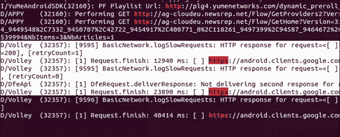

之前的日志是由三星 Galaxy S3 手机上的 Google Play 商店应用生成的。

你还可以尝试捕获通过日志文件泄露的一些登录或认证类型的令牌字符串：

```kt
adb logcat | grep –i "[\w\s_-]*token[\w\s_-]*"

```

在日志文件中寻找有价值的信息时，通常一个好主意是寻找那些否则需要权限才能获取的信息，或者直接导致你获得其他应用程序保护的信息的知识。例如，如果应用程序记录了用户登录他/她的 LinkedIn 个人资料后返回的 cookie 值，这会危险吗？

是的！实际上你刚刚绕过了需要知道他/她的 LinkedIn 密码的需求，或者你的应用程序需要被授予 LinkedIn 应用程序中某些身份验证功能的权限。在你阅读日志文件的时间里，你应该尽量关注查找这类信息。

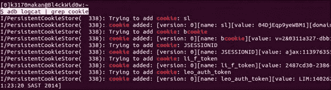

案例证明！这里记录的 cookie 是由 Android LinkedIn 应用程序在 Galaxy S3 手机上有害地泄露的。在*发现 Facebook Android SDK 中的主要安全漏洞*中可以找到这种漏洞的另一个真实世界示例。相关链接在*参见以下内容*部分提供。

## 还有更多...

当然，应用程序通常是为了响应硬件或软件事件而开发的，可以通过广播接收器或其他应用程序或系统服务的意图来实现。自然而然地，你会想知道应用程序是如何响应这些事件的，或者它们在响应这类事件时的行为是否可能有害。那么问题来了，在不按下音量键、锁定和解锁屏幕、自己按键的情况下，你如何创建/发送这些事件给正在测试的应用程序呢？答案是 Android Monkey 测试框架。它旨在向应用程序发送系统和硬件级别的事件，以便开发者可以衡量应用程序处理这些事件的效率。它在某种程度上可以作为应用程序的设备事件“模糊测试”框架。

在解释如何使用它之前，重要的是要提到，对安装在个人 Android 设备上的应用程序运行 Monkey 测试可能不是一个好主意，无论是你的还是别人的。这是因为应用程序对 Monkey 测试的响应可能会导致被“猴子”的应用程序受损，导致应用程序数据丢失，甚至使手机崩溃。除非你有适当的权限或接受可能会丢失或损坏你正在测试的应用程序存储的数据，否则你只能在模拟器或专门用于安全测试的设备上进行此操作。

使用这个框架的一种方式是通过 ADB 连接一个设备，并通过命令提示符或终端执行以下命令：

```kt
adb shell monkey –p [package] –v [event count]

```

其中`[package]`是你想要发送这些事件的包/应用程序的名称，`[event count]`是你想要发送的随机事件的数量。以下是针对 Flipboard 应用程序使用它的一个例子：

```kt
adb shell monkey –p Flipboard.app –v 10

```

这将向 Flipboard 应用程序发送 10 个随机选择的事件，并报告应用程序的行为。

## 参见以下内容

+   *安卓调试桥 - 启用 logcat 日志*的网页，位于[`developer.android.com/tools/help/adb.html#logcat`](https://developer.android.com/tools/help/adb.html#logcat)

+   *Vogella 教程 - 猴子测试*的网页，位于[`www.vogella.com/articles/AndroidTesting/article.html`](http://www.vogella.com/articles/AndroidTesting/article.html)

+   *Notepad++*软件，位于[`notepad-plus-plus.org/download/v6.3.3.html`](http://notepad-plus-plus.org/download/v6.3.3.html)

+   *安卓开发者 - logcat*的网页，位于[`developer.android.com/tools/help/logcat.html`](https://developer.android.com/tools/help/logcat.html)

+   *WinGrep*软件，位于[`www.wingrep.com/download.htm`](http://www.wingrep.com/download.htm)

+   *发现 Facebook 安卓 SDK 重大安全漏洞*的网页，位于[`blog.parse.com/2012/04/10/discovering-a-major-security-hole-in-facebooks-android-sdk/`](http://blog.parse.com/2012/04/10/discovering-a-major-security-hole-in-facebooks-android-sdk/)

+   *安卓开发者 - 读写日志*的网页，位于[`developer.android.com/tools/debugging/debugging-log.html`](http://developer.android.com/tools/debugging/debugging-log.html)

# 检查网络流量

众所周知，应用程序可以利用安卓设备上可用的网络服务，许多应用程序被开发为基于云服务的界面。这意味着理解它如何与互联网服务通信是安全风险概况中非常重要的一部分——应用程序向其用户和设备暴露的风险集合。

在这个指南中，我将向你展示一些新颖的方法，你可以使用它们直接从安卓设备监控网络流量，使用的是一直很受欢迎的**Wireshark**。

## 准备工作

在我们开始之前，你需要在本地机器和安卓设备上安装一些工具。以下是你会需要获取的工具：

+   **Wireshark**：你可以在 Wireshark 网站下载它[`www.wireshark.org`](http://www.wireshark.org)，Wireshark 支持 Linux/Unix 和 Windows 机器。在开始之前，你应该确保你的主机上已安装它。安装 Wireshark 非常简单；Wireshark 开发团队甚至为 Windows 和 Unix/Linux 发行版提供了一些非常有用的文档，可在[`www.wireshark.org/docs/wsug_html_chunked/ChapterBuildInstall.html`](http://www.wireshark.org/docs/wsug_html_chunked/ChapterBuildInstall.html)找到。

+   **Netcat**：Linux/Unix 用户可以在[`netcat.sourceforge.net/download.php`](http://netcat.sourceforge.net/download.php)下载它，Windows 用户可以在[`joncraton.org/blog/46/netcat-for-windows/`](http://joncraton.org/blog/46/netcat-for-windows/)下载。Linux/Unix 用户可能不需要明确下载 Netcat，因为它已经包含在许多 Linux/Unix 发行版中。

+   **适用于 Android 的 TCPdump**：可以在[`www.strazzere.com/android/tcpdump`](http://www.strazzere.com/android/tcpdump)下载。

## 如何操作…

一旦你设置好所有工具并准备就绪，你可以通过执行以下步骤来监控你的 Android 设备的流量：

1.  假设你的 Android 设备已经获得 root 权限，你应该创建一个目录来存放你的 TCPdump 二进制文件，如下所示：

    在 Android 设备上，通过 ADB 按照出现的顺序执行以下命令：

    ```kt
    su
    mkdir /data/tcpdump/
    chmod 755 /data/tcpdump/

    ```

    然后在本地机器上，在你下载了适用于 Android 的 TCPdump 版本的文件夹中，执行以下命令：

    ```kt
    adb push tcpdump /data/tcpdump/.
    adb shell chmod 755 /data/tcpdump/tcpdump

    ```

1.  一旦将 TCPdump 的 Android 版本上传到设备并标记为可执行。你应该确保 Android 设备上可用 Netcat，尝试运行以下命令：

    ```kt
    nc

    ```

    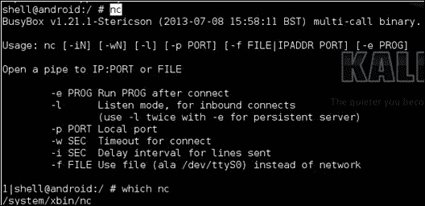

    这只是一个健全性检查，大多数 Android 版本默认都会安装 Netcat。如果没有，可以在 Google Source Android GitHub 仓库中找到带有 NDK Makefile 的适用于 Android 的版本，地址是[`android.googlesource.com/platform/external/netcat/+/master`](https://android.googlesource.com/platform/external/netcat/+/master)。要了解如何使用此 Makefile，请参考第八章中的*跨编译本地可执行文件*菜谱，*本地利用与分析*。

1.  为了确保一切正常工作，在确认你的 Android 设备上已经安装了 TCPdump 和 Netcat 之后，你可以实际捕获一些网络流量并尝试执行以下命令：

    ```kt
    ./data/tcpdump/tcpdump –w - | nc –l –p 31337

    ```

    如果一切正常，你应该会在屏幕上看到以下内容：

    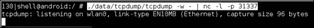

    要查看一些实际输出，你可以尝试打开一个会向 Web 发送请求的应用程序或使用一些网络 API。

1.  如果一切顺利，你应该能够将 TCPdump 的输出传递给本地设备上安装的 Wireshark。为此，你首先需要通过 ADB 设置一些端口转发，这是通过执行以下命令完成的：

    ```kt
    adb forward tcp:12345 tcp:31337

    ```

1.  一旦设置好端口转发，你就可以在本地机器上通过执行以下命令来使用 Netcat：

    ```kt
    netcat 127.0.0.1 12345

    ```

1.  这意味着所有流量都被正确转发。你应该能够将输出传递给 Wireshark，Wireshark 将对其进行解释，并便于进行深度数据包检查和其他有用的事情。要在本地机器上执行输出传递给 Wireshark 的命令，请执行以下操作：

    ```kt
    adb forward tcp:12345 tcp:31337 && netcat 127.0.0.1 12345 | wireshark –k –S –i – 

    ```

    几秒钟后，如果一切正常，你应该会看到 Wireshark 启动。以下内容将显示在你的屏幕上：

    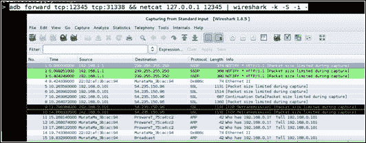

## 工作原理...

在这个教程中，我们使用了 Netcat、Wireshark 和 TCPdump 直接从 Android 设备提取网络流量进行分析和深度包检查。鉴于在演练中对命令行参数和工具组合的解释非常少，这个教程详细说明了每个操作是如何执行以及为什么这样执行。

在第一步中，执行了以下命令以在 Android 设备上创建一个目录，用于承载 TCPdump 的安装：

```kt
su; mkdir /data/tcpdump/; chmod 755 /data/tcpdump/

```

`su`命令代表**Substitute User**（**SU**），它允许我们获取 root 权限——这是在没有提供参数时`su`的行为。我们使用`su`假设的 root 权限包括能够修改和查看 Android 文件系统上的任何目录或文件。这是必需的，因为我们是在`/data/`文件夹内创建`tcpdump`目录。

执行`su`之后，我们执行了带有参数`/data/tcpdump/`的`mkdir`命令，在`/data/`文件夹下创建了`tcpdump/`目录。

紧接着是`chmod`命令——它是改变模式的缩写，参数为`755`。它修改了`/data/tcpdump`文件夹的访问模式，允许低权限用户访问`tcpdump`路径。这是必需的，因为我们将会使用`adb push`命令将`tcpdump`二进制文件存储在此路径下。

创建了`tcpdump`文件夹后，我们执行了以下命令：

```kt
adb push tcpdump /data/tcpdump/.
adb shell chmod 755 /data/tcpdump/tcpdump

```

这些命令确保了`tcpdump`二进制文件存储在`tcpdump`路径下。第一个命令将`push`命令传递给`adb`，参数为`tcpdump`，这是适用于 Android 的 TCPdump 版本。您会注意到，在`/data/tcpdump`文件夹下为`tcpdump`二进制文件提供了一个点作为名称；这是确保被复制的文件在复制后保持其文件名的简写方式。这是显而易见的，因为我们从本地机器复制了一个名为`tcpdump`的文件，在 Android 设备上也同样被命名为`tcpdump`。

在`push`命令之后是带有参数`chmod 755 /data/tcpdump/tcpdump`的`adb shell`命令，它改变了`tcpdump`二进制文件的访问模式，允许低权限用户执行它。

在第二步中，我们使用了`nc`命令——这是 Netcat 的缩写。这个工具作为与网络服务交互的多功能工具。在这个教程中，我们将使用它来读写网络连接中的数据。不带任何参数运行`nc`会打印使用说明。这让我们可以确认`nc`是否正常运行，并确认它实际上已经安装在 Android 设备上。

在第 3 步中，我们使用了带有`–w`参数的`tcpdump`，这允许我们指定一个文件进行写入，第二个参数确保输出会同时写入到终端屏幕。作为我们执行的命令的一部分，我们还指定了如下内容：`| nc –l –p 31337`。在操作系统术语中，`|`字符被称为管道，它将前一个程序的输出作为输入传递给管道后面的程序。Netcat 使用`–l`参数被调用，这导致 Netcat 监听作为`–p`命令行开关参数提供的端口上的连接。在这个上下文中，这意味着`tcpdump`的原始二进制网络流量作为输入传递给 Netcat；这意味着它将从端口号码`31337`输出这些原始流量。

在第 4 步中，我们使用了 ADB 的端口转发功能。它允许我们将 Android 设备上的一个端口（作为第二个参数`tcp:12345`）与本地机器上的一个端口（作为第一个参数`tcp:31337`）连接起来。你会注意到我们将端口`12345`与端口`31337`耦合，并告诉前一步的 Netcat 在端口`31337`上监听连接。这样我们就可以通过本地机器上的端口`31337`与 Netcat 实例进行交互。简单来说，Android 设备上的端口`31337`变成了我们本地机器上的端口`12345`。

在第 5 步中，我们使用参数`127.0.0.1`启动了 Netcat，这是我们的本地机器的地址（称为环回地址），以及`12345`，这是我们上一步转发的端口。这告诉 Netcat 连接到本地机器的端口`12345`；由于端口`12345`与 Android 设备上的端口`31337`耦合，这意味着我们通过本地端口`12345`的代理与端口`31337`进行交互。这样做的结果是，我们可以从本地机器捕获传递到 Android 设备上 Netcat 的网络流量。

在第 6 步中，我们将所有与本地机器相关的命令组合在一起，以确保 Wireshark 获取原始二进制网络流量并为我们的解释。我们使用以下参数启动了 Wireshark：

+   `–k`：根据 Wireshark 手册，此参数执行以下操作：

    +   立即开始捕获会话。如果指定了`-i`标志，捕获将使用指定的接口。

    +   否则，Wireshark 会搜索接口列表，如果有非环回接口，则选择第一个非环回接口；如果没有非环回接口，则选择第一个环回接口。

    +   如果没有接口，Wireshark 会报告错误并且不会开始捕获。

+   `–S`：此参数指定快照长度，即每个数据包捕获的字节数。如果没有给出长度参数，则捕获整个数据包。

+   `–i`：此参数指定了捕获数据包的输入来源。这里我们再次提供了 – 符号，告诉 Wireshark 从标准输入读取数据。这样做是因为 Wireshark 的输入是通过 Netcat 的管道传输给它的。

如果想要更有趣地使用这个想法，你可以尝试构建工具，通过在由 Android 设备产生的网络流量上运行**入侵检测系统**（**IDS**）或其他以安全为重点的网络监控工具（如 Snort），来分析 Android 流量中的活跃威胁。这个想法将非常适合进行恶意软件和漏洞分析。

## 另请参阅

+   [分析 Android 网络流量](http://mobile.tutsplus.com/tutorials/android/analyzing-android-network-traffic/)网页

+   [Wireshark 用户指南](http://www.wireshark.org/docs/wsug_html_chunked/)

+   [Wireshark 显示过滤器](http://wiki.wireshark.org/DisplayFilters)网页

+   [Wireshark 捕获过滤器](http://wiki.wireshark.org/CaptureFilters)网页

+   [TCPdump 手册页](http://www.tcpdump.org/tcpdump_man.html)

# 通过活动管理器进行被动意图嗅探

想要广泛传播关于应用程序及其组件的信息，一个有效的方法是窃听应用程序间的通信。你可以通过请求活动管理器中最近意图的信息来实现这一点。

这个方法非常直接，正如你所发现的，如果你愿意编写一些 Python 脚本，可以通过 drozer（在第三章，*Android 安全评估工具*中介绍）来完成。iSec Partners 的团队开发了一个能够执行此操作的应用程序，以下食谱中讨论的 drozer 模块的大部分灵感都来自他们的应用。想要了解如何获取这个应用，请查看本食谱的*另请参阅*部分。

## 准备工作

在我们实际编写这个模块之前，我们需要对 drozer 代理进行一些修改，使其具有从活动管理器请求意图信息的必要权限。最简单的方法是通过其 `AndroidManifest.xml` 文件增加 drozer 请求的权限。这里，我将向你展示如何使用 Eclipse 来完成这个操作。

1.  首先，你需要从以下网站获取 drozer 代理及其依赖项的副本：

    +   [drozer 代理](https://github.com/mwrlabs/drozer-agent)网页

    +   [jdiesel (为 drozer 提供动力)](https://github.com/mwrlabs/jdiesel)网页

    +   [TLS 支持](https://github.com/mwrlabs/mwr-tls)网页

    +   访问[`github.com/mwrlabs/mwr-android`](https://github.com/mwrlabs/mwr-android)的*Android utilities for drozer*网页。

1.  下载并保存到同一文件夹后，你可以打开 Eclipse 并将它们作为 Android 项目导入。对于每一个项目，在 Eclipse 打开后，导航到**文件** | **导入**。![准备就绪]

1.  点击**Android**文件夹，然后选择**Existing Android Code into Workspace**，并点击**Next**。![准备就绪]

1.  在这一点上，Eclipse 会要求你指定一个要导入的文件夹。你需要添加在第 1 步下载的文件夹之一。要选择文件夹，点击**浏览...**，文件选择对话框将会弹出。![准备就绪]

1.  使用**文件**对话框，导航到下载 drozer 代理和依赖项的文件路径。你需要以这种方式添加它们。

    确保以这种方式导入每个文件夹。否则，Eclipse 将无法成功构建 drozer 代理。

1.  导入所有项目后，你需要编辑 drozer 代理的`AndroidManifest.xml`。你通过在 Eclipse 中双击`drozer-agent project`文件夹中的`AndroidManifest.xml`文件来进行编辑（确保在编辑前选择`AndroidManifest.xml`标签，以便直接编辑 XML）。然后，输入以下行：

    ```kt
    <uses-permission android:name="android.permission.GET_TASKS"/>

    ```

    如果步骤正确，`AndroidManifest.xml`文件应该看起来像以下截图：

    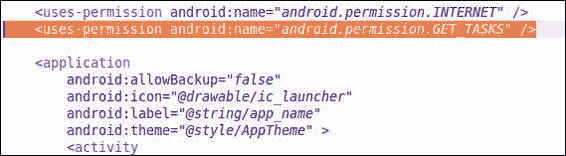

    就这样！你刚刚为 drozer 代理添加了一个额外的权限。现在你可以将 drozer 代理导出为 APK 文件，上传到你的设备上，开始工作了。

    请注意，在安装修改后的代理之前，你可能需要卸载设备上当前安装的 drozer 代理。

## 如何操作...

这样，drozer 代理的安装就完成了。现在我们可以开始开发意图嗅探模块了。

1.  导航到你的 drozer 模块仓库；如果你还没有设置，请参考第三章中的*编写一个 drozer 模块——一个设备枚举模块*食谱，了解如何操作。进入模块仓库后，创建一个名为`ex.sniffer.intents`的文件，并输入以下内容（以下代码将包含在本书的代码仓库中）：

    ```kt
    from drozer.modules import Module,common
    from drozer.modules import android
    class Intents(Module, common.PackageManager):
      name = "Dump recent intents to the console"
      description = "This module allows you to see the most recent intents that were sent, via the ActivityManager"
      examples = "run ex.sniffer.intents"
      author = "[your name]"
      date = "[the date]"
      license = "GNU GPL"
      path = ["ex","sniffer"]
      def execute(self,arguments):
        self.stdout.write("[*] initializing intent sniffer…\n")
        context = self.getContext()
        activityService = context.getSystemService("activity")
        self.stdout.write("[*] got system service ..\n")
        recentTasks = activityService.getRecentTasks(1000,1)
        self.stdout.write("[*] recentTasts Extracted..\n")
        list_length = recentTasks.size()
        self.stdout.write("[*] Extracted %s tasks ..\n" % (list_length))
        for task in range(list_length):
          cur_task = recentTasks.get(task)
          cur_taskBaseIntent = cur_task.baseIntent
          self.stdout.write("\t[%d] %s\n" % (task,cur_taskBaseIntent.toString()))
    ```

1.  完成后，通过执行以下命令将模块安装到 drozer 中：

    ```kt
    dz> module install [path-to-module-repo]/ex.sniffer.intent

    ```

1.  然后通过执行以下命令运行它：

    ```kt
    dz> run ex.sniffer.intents

    ```

    你应该会看到类似于以下截图的内容：

    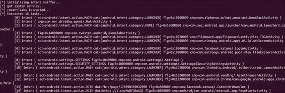

## 工作原理...

意图嗅探脚本实际上非常简单。下面我会分解它的操作原理以及它是如何实际嗅探到意图的。

意图嗅探器调用了`Context.getSystemService()`方法，并传递了`ACTIVITY_SERVICE`标志的标识符，它只是一个值为"activity"的字符串。这返回了`ActivityManager`类的一个实例，使脚本能够与活动管理器交互，并调用如`ActivityManager.getRecentTasks()`等方法。这个方法接收两个参数，第一个是一个整数，表示脚本希望从活动管理器接收的`RecentTaskInfo`对象的最大数量；第二个是一个指定最近活动类型的标志。在这个例子中，脚本被编写为请求完整列表，不省略任何任务。我之所以这样编写脚本，是因为发送到启动每个最近任务的意图与`RecentTaskInfo`对象捆绑在一起，作为一个名为`RecentTaskInfo.baseIntent`的字段。然后脚本可以使用它来提取有关意图的一些有用信息，例如组件名称、标志、动作和类别。为了快速简便，脚本随后记录了对`Intent.toString()`方法的调用，该方法仅将意图信息格式化为字符串并返回。

当然，你可以对意图信息进行更智能的解析。你甚至可以尝试找出是哪个包发出了原始调用。尽管这非常困难，但如果能完成，这将是一个非常有价值的 drozer 模块。

## 另请参阅

+   *Intent Sniffer* 安卓应用程序在[`www.isecpartners.com/tools/mobile-security/intent-sniffer.aspx`](https://www.isecpartners.com/tools/mobile-security/intent-sniffer.aspx)

+   `Context.getSystemService(String name)`命令在[`developer.android.com/reference/android/content/Context.html#getSystemService%28java.lang.String%29`](http://developer.android.com/reference/android/content/Context.html#getSystemService%28java.lang.String%29)

+   有关*ActivityManager.RecentTaskInfo*的参考资料在[`developer.android.com/reference/android/app/ActivityManager.RecentTaskInfo.html`](http://developer.android.com/reference/android/app/ActivityManager.RecentTaskInfo.html)

+   *Intent*参考资料在[`developer.android.com/reference/android/content/Intent.html`](http://developer.android.com/reference/android/content/Intent.html)

# 攻击服务

服务可能看起来并不危险，并且它们坚持在后台工作。但它们是为了支持其他应用程序组件而开发的，并且可能执行非常敏感的操作，如登录在线个人资料、重置密码，甚至通过作为主机系统服务的代理来促进一些潜在危险的过程。无论如何，在应用程序评估期间，它们绝不能被忽视。

什么时候服务是脆弱的？当一个服务能被用来对用户进行滥用、提升另一个应用程序/用户的权限，或者用来提取敏感信息时，这个服务就是可被利用的。这意味着你需要能够与服务进行交互，这意味着它必须是可导出的，或者能从意图、文件或网络堆栈等消息格式中响应/接受输入。另一个需要考虑的是与服务交互需要什么类型的权限——它是否是一个潜在危险的服务，执行非常敏感的操作，或者可能被滥用导致应用程序甚至设备出现**拒绝服务**（**DoS**）状况（即攻击者通过强制服务停止工作或拒绝提供服务来阻止访问服务）！更不用说如果这个潜在危险的服务根本不需要任何权限，应用程序及其用户将会陷入多么糟糕的境地！

```kt
OWASP GoatDroid project. Try reading through this, and think about the possible dangers and risks for this setup:
```

```kt
<service android:name=".services.LocationService" >
  <intent-filter>
    <action android:name="org.owasp.goatdroid.fourgoats.      services.LocationService" />
  </intent-filter>
</service>
</application>
  <uses-permission android:name="android.permission.SEND_SMS" />
  <uses-permission android:name="android.permission.CALL_PHONE" />
  <uses-permission android:name="android.permission.    ACCESS_COARSE_LOCATION" />
  <uses-permission android:name="android.permission.    ACCESS_FINE_LOCATION" />
  <uses-permission android:name="android.permission.INTERNET" />
</manifest>
```

我在这里突出了一些重要的区域。你应该注意到，名为`.services.LocationService`的服务可能通过 GPS 服务或地理定位 API 确定用户的位置，而且启动时不需要任何权限！考虑到应用程序本身会被授予`android.permission.ACCESS_COARSE_LOCATION`和`android.permission.ACCESS_FINE_LOCATION`这两个权限，这意味着攻击者如果足够接近这个服务（可能是物理访问设备，或者在用户设备上安装了恶意应用程序），很有可能会未经授权使用这项服务。

上一个示例来自*OWASPS GoatDroid*项目，有关 GitHub 仓库的链接请参见*另请参阅*部分。

所以这就是从代码源头上看这个漏洞的样子，或者说从开发者/逆向工程师的角度来看。现在让我们实际使用 drozer 来攻击一些易受攻击的服务，并给你这个漏洞攻击者的视角。

## 如何操作...

下面是如何寻找一些易受攻击的服务的方法：

1.  给定一个示例应用程序，找出哪些服务是可导出的。你可以通过 drozer 执行以下命令来实现：

    ```kt
     dz> run app.service.info –-permission null

    ```

    正如在上一章中我解释的，这个命令可以找到那些不需要任何权限的服务。

1.  找到一批服务后，你可以使用以下命令来启动它们：

    ```kt
    dz> run app.service.start –-action [ACTION] –-category [CATEGORY] –-data-uri [DATA-URI] –-component [package name] [component name] –-extra [TYPE KEY VALUE] –-mimetype [MIMETYPE]

    ```

    作为一个简单的例子，以下是启动`com.linkedin.android`应用程序中一个服务的方法：

    ```kt
    dz> run app.service.start –-component com.linkedin.android com.linkedin.android.authenticator.AuthenticationService

    ```

    在启动和停止这些服务时运行 logcat 总是一个好主意，以防它们可能会泄露一些关于它们操作方式的敏感信息，以及泄露一些认证凭据或其他有用的数据。

    当然，如果你想通过意图向服务发送一些数据，你需要知道你针对的服务意图过滤器看起来是什么样子。而且，如果你还没有猜到，了解这些的最简单方式就是检查应用程序清单。如果你需要回顾如何做到这一点，请参考第二章《*参与应用程序安全*》中的*检查 AndroidManifest.xml 文件*部分。

1.  你要寻找的 XML 代码大致如下所示：

    ```kt
    <service android:name=".authenticator.AuthenticationService" android:exported="true">
        <intent-filter>
          <action android:name="android.accounts.AccountAuthenitcator" />
        </intent-filter>
      <meta-data android:name="android.accounts.AccountAuthenticator"
      android:resource="@xml/authenticator" />
    </service>
    ```

    ```kt
    AndroidManifest.xml file of the Android LinkedIn application.
    ```

1.  要向此服务发送意图，你可以在 drozer 控制台执行以下命令：

    ```kt
    dz> run app.service.start –-component com.linkedin.android com.linkedin.android.authenticator.AuthenitactionService –-action anroid.accounts.AccountAuthenitcator

    ```

顺便一提，一些服务可能会与本地库交互，并将意图接收的数据传递给 C/C++数据结构，如栈或基于堆的变量。在审计需要通过意图传递数据的服务安全性时，你应该始终尝试识别意图数据可能导致的任何潜在内存破坏漏洞。在检查其他应用程序组件类型是否存在漏洞时，请记住这一点，因为任何应用程序组件都可能引发这类漏洞。

当发送手工制作的意图时，一些默认的系统服务的行为会相当奇怪。考虑以下发送到`com.android.systemui`的意图示例：

```kt
dz> run app.service.start –-component com.android.systemui com.android.systemui.PhoneSettingService

```

在三星 Galaxy S3 上的结果如下：

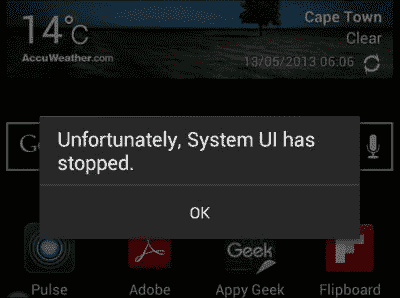

这是一个典型的拒绝服务（DoS）漏洞示例。系统 UI 服务没有预想到包含空元数据或额外数据字段的意图。因此，当发送不带额外数据的意图时，会导致空指针异常，整个服务随之崩溃。这个漏洞看起来可能不算严重，因为它只是一个 UI 服务。但如果关键的安全机制或与安全相关的服务的 UI 组件依赖于系统 UI 服务运行才能操作（例如，可能是锁屏或设置应用程序），这个简单的不带数据意图可能会引发非常复杂、风险相当高的漏洞。

为了帮助你了解这里的危险性，想象一下你的手机上安装了一个恶意应用程序，它不断地向你的系统 UI 服务发送有害意图。这导致它一次又一次地崩溃，屏幕上充满了弹窗和警告，有效地阻止了你对手机用户界面的交互。这将是一个相当讨厌的 bug，而且安装时不需要任何权限！

## 另请参阅

+   请访问[*CVE-2011-4276 漏洞概要*网页](http://web.nvd.nist.gov/view/vuln/detail?vulnId=CVE-2011-4276&cid=6)

+   请访问[*OWASP – GoatDroid*网页](https://github.com/jackMannino/OWASP-GoatDroid-Project/blob/master/)

# 攻击广播接收器

广播接收器响应硬件和软件级别的事件；它们通过意图获取这些事件的提醒。通常，广播接收器可能会使用通过意图发送的信息来执行敏感操作，而且这种方式可能会受到恶意广播或接收的数据的影响。

在利用广播接收器时，挑战在于确定输入是否可信以及程度如何。为此，你可能需要对目标应用程序中的广播接收器的意图过滤器定义进行有效的模糊测试，或者如果你能弄到源代码，阅读实际代码，以找出接收器操作哪种类型的数据以及如何操作。

与之前的食谱一样，这里我们将看到一个经典易受攻击的广播接收器的示例。以下示例同样来自 OWASP GoatDroid 项目：

```kt
 <receiver
    android:name=".broadcastreceivers.SendSMSNowReceiver"
    android:label="Send SMS" >
    <intent-filter>
        <action android:name="org.owasp.goatdroid.fourgoats.SOCIAL_SMS" />
    </intent-filter>
</receiver>
</application>

    <uses-permission android:name="android.permission.SEND_SMS" />
    <uses-permission android:name="android.permission.CALL_PHONE" />
    <uses-permission android:name="android.permission.ACCESS_COARSE_LOCATION" />
    <uses-permission android:name="android.permission.ACCESS_FINE_LOCATION" />
    <uses-permission android:name="android.permission.INTERNET" />

</manifest>
```

代码中的关键问题是，这个应用程序将被授予`android.permission.SEND_SMS`权限，同时其`.SendSMSNowReceiver`易受攻击的接收器没有得到适当的权限保护，从而暴露给其他应用程序。

这并不是这类漏洞的全部；还有另一部分。仅仅因为接收器允许其他应用程序与其交互，并不意味着它一定可以被利用；要验证它是否可被利用，你实际上可以尝试执行本食谱后面讨论的一些命令，如果可能的话，阅读接收器的部分源代码。

以下是确定接收器如何处理`org.owasp.goatdroid.fourgoats.SOCIAL_SMS`动作的代码：

```kt
public void onReceive(Context arg0, Intent arg1) {
  context = arg0;
  SmsManager sms = SmsManager.getDefault();

  Bundle bundle = arg1.getExtras();
  sms.sendTextMessage(bundle.getString("phoneNumber"), null,
    bundle.getString("message"), null, null);
    Utils.makeToast(context, Constants.TEXT_MESSAGE_SENT, Toast.LENGTH_LONG);
}
```

代码中的关键问题是接收器直接从`bundle`对象中获取值，而没有首先检查调用应用程序或提供的值，并将其插入到`sendTextMessage`调用中。这意味着任何应用程序都将能够发送任意的、不受控制的短信。

好的，那么这就是一个经典广播接收器漏洞的样子；让我们看看如何使用 drozer 实际利用这些漏洞。

## 如何做到这一点...

要向广播接收器发送意图，你可以执行以下命令：

```kt
dz> run app.broadcast.send –-action [ACTION] –-category [CATEGORY] –-component [PACKAGE COMPONENT] –data-uri [DATA_URI] –extra [TYPE KEY VALUE] –flags [FLAGS*] –mimetype [MIMETYPE]

```

例如，在本食谱的介绍部分，我们看到了一个可以接受电话号码和短信的接收器。要攻击该接收器，你会执行以下命令：

```kt
dz> run app.broadcast.send –-action org.owasp.goatdroid.fourgoats.SOCIAL_SMS –-component org.owasp.goatdroid.fourgoats org.owasp.goatdroid.fourgoats.broadcastreceivers.SendSMSNowReceiver –-extra string phoneNumber 1234567890 –-extra string message PWNED

```

执行之前的命令将向电话号码`1234567890`发送包含消息`PWNED`的文本信息。

## 它是如何工作的…

在这个食谱中，我们滥用了保护`org.owasp.goatdroid.fourgoats.broadcastreceivers.SendSMSNowReceive`广播接收器的不足权限。这个组件缺乏权限保护，允许没有`SEND_SMS`权限的攻击者实际发送短信。这种危险在于，恶意攻击者可以开发针对这个接收器的应用程序，向高级服务发送短信或从设备泄露信息。

实际上，许多安卓木马和基于安卓的恶意软件都利用这种模式从受害者那里窃取钱财；有数百个实际例子。关于其中一些的好资源，请参阅*另请参阅*部分。希望这能让你意识到，对于像这样的广播接收器来说，权限不足是多么危险。

## 另请参阅

+   *丹尼斯·马斯拉尼科夫*在 Securelist 撰写的文章《短信木马：全球范围内》([`www.securelist.com/en/blog/208193261/`](https://www.securelist.com/en/blog/208193261/))

+   *杰里米·克莱因*和*帕克·斯皮尔曼*的《安卓木马项目》([`www.cs.wustl.edu/~jain/cse571-11/ftp/trojan/index.html`](http://www.cs.wustl.edu/~jain/cse571-11/ftp/trojan/index.html))

+   *蒂姆·怀亚特*在 Lookout 撰写的文章《野生的第一个安卓短信木马》([`blog.lookout.com/blog/2010/08/10/security-alert-first-android-sms-trojan-found-in-the-wild/`](https://blog.lookout.com/blog/2010/08/10/security-alert-first-android-sms-trojan-found-in-the-wild/))

# 枚举容易受到攻击的内容提供者

内容提供者通常包含大量有价值的信息，比如用户的电话号码或 Twitter 密码，你可能想要找出恶意攻击者是否有可能获取这些信息。确定内容提供者是否容易受到攻击的最佳方式，就是尝试自己对其进行攻击。

要对你能够攻击的内容提供者进行攻击，与许多应用程序级别的攻击一样，通常归结于向应用程序发送一个恶意意图。对于内容提供者来说，你的意图将通过它包含的 URI 字符串来精确指向目标，因为此 URI 标识了哪个内容提供者应该处理该意图。

那么问题来了——我们如何找出哪些 URI 可以使用？一个简单的解决方案就是猜测它们，但这可能需要很长时间！drozer 有一个名为`app.provider.info`的模块，可以为你解决这个问题。

本文档详细介绍了几个你可以用来查找可能容易受到攻击的内容提供者的 drozer 模块。

## 如何操作...

要找到一些很可能容易受到攻击的内容提供者，你需要执行以下操作：

1.  使用 drozer 查找不需要权限的内容提供者非常容易；你只需要在 drozer 控制台中执行以下命令：

    ```kt
    dz> run app.provider.info –-permission null

    ```

    前面的命令列出了所有不需要任何读写权限的内容提供者。

1.  一旦找到合适的内容提供者，你可能想要枚举它具有权限的 URI；你可以使用以下命令来完成这个操作：

    ```kt
    dz> run app.provider.finduri [package]

    ```

    在前面的命令中，`[package]`是你想要提取信息包的完整名称。

1.  下面的命令是一个你可以尝试的示例：

    ```kt
    dz> run app.provider.finduri com.android.providers.downloads

    ```

所以你刚才所做的就是找到了一个可能的入口点，该入口点可以访问给定包在内容提供者中保存的数据。下一个食谱将讨论如何提取这些数据。

## 它是如何工作的...

`.finduri` 模块非常直接；它实际上使用了一种非常“狡猾”的方法来枚举可能的内容 URI。它基本上是打开应用程序的 `DEX` 文件，并扫描未解析的文件，寻找类似于有效内容 URI 格式的字符串字面量。之所以这样做非常有效，是因为应用程序开发人员通常将这些作为静态字符串保存在应用程序的源代码中。以下是 Python 脚本的实际源代码。它来自 [`github.com/mwrlabs/drozer/blob/master/src/drozer/modules/common/provider.py`](https://github.com/mwrlabs/drozer/blob/master/src/drozer/modules/common/provider.py)。

```kt
 def findContentUris(self, package):

    self.deleteFile("/".join([self.cacheDir(), "classes.dex"]))

    content_uris = []
    for path in self.packageManager().getSourcePaths(package):
// This is where the script requests the application path from the 
// package manager, which will determine where the actual .apk file
// is stored.
        strings = []

        if ".apk" in path:
            dex_file = self.extractFromZip("classes.dex", path,self.cacheDir())
// In this line you can see the script extract the "classes.dex"
// file from the .apk file

            if dex_file != None:
                strings = self.getStrings(dex_file.getAbsolutePath())

                dex_file.delete()

                # look for an odex file too, because some system packages do not
                # list these in sourceDir
            strings += self.getStrings(path.replace(".apk",".odex")) 
        elif (".odex" in path):
            strings = self.getStrings(path)

        content_uris.append((path, filter(lambda s: ("CONTENT://"in s.upper()) and ("CONTENT://" != s.upper()), strings)))
// In this you can see the script actually search for the literal //"CONTENT://" or "content://" in the extracted .dex file.

return content_uris
```

## 另请参阅

+   drozer 主仓库 – Provider.py ([`github.com/mwrlabs/drozer/blob/master/src/drozer/modules/app/provider.py`](https://github.com/mwrlabs/drozer/blob/master/src/drozer/modules/app/provider.py))

+   drozer 主模块 – Common/Provider.py ([`github.com/mwrlabs/drozer/blob/master/src/drozer/modules/common/provider.py`](https://github.com/mwrlabs/drozer/blob/master/src/drozer/modules/common/provider.py))

+   安卓开发者 – URI 权限 ([`developer.android.com/guide/topics/security/permissions.html#uri`](http://developer.android.com/guide/topics/security/permissions.html#uri))

+   CVE-2013-231 – MovatwiTouch 内容提供者漏洞 ([`web.nvd.nist.gov/view/vuln/detail?vulnId=CVE-2013-2318&cid=3`](http://web.nvd.nist.gov/view/vuln/detail?vulnId=CVE-2013-2318&cid=3))

+   Marakana – 安卓内容提供者教程 ([`marakana.com/s/post/1375/android_content_provider_tutorial`](http://marakana.com/s/post/1375/android_content_provider_tutorial))

# 从易受攻击的内容提供者中提取数据

如果某些内容提供者的 URI 不需要**读取**权限，或者将**GrantURI**设置为`true`，你可能可以使用一些 drozer 工具从中提取数据。在某些情况下，**读取**/**写入**权限的发放和执行方式也会将内容提供者的数据暴露给攻击。

本指南将介绍一些简单技巧，你可以用它们来了解提供者中存储的信息类型。本指南接着上一条，并假定你已经枚举了一些内容 URI，并确定与之交互和查询相关 URI 时不需要任何或权限不足。

## 如何操作...

找到一个 URI 后，你可以使用前一个指南中详细描述的命令进行查询，具体为：

```kt
run app.provider.info –-permission null
run app.provider.finduri [package]

```

前面的命令会为你提供一些相当有用的目标 URI；然后你可以执行以下命令来提取一些数据：

```kt
dz> run app.provider.query [URI]

```

以下是一个简单示例；关于许多与内容提供者相关的脚本，drozer 帮助文档都使用这个例子：

```kt
dz> run app.provider.query content://settings/secure

```

下面是一个易受攻击的内容提供者的示例。在这个例子中，攻击者使用了 drozer 提取的关于用户银行交易的信息；请参阅以下屏幕截图以查看查询命令的输出：

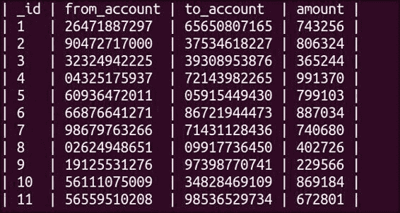

某些内容提供者支持查询文件，尤其是那些文件管理器类型的程序。如果内容提供者没有限制应用程序允许读取的文件类型和路径，这意味着攻击者可能能够执行路径遍历，访问内容提供者实际意图提供的文件之外的目录，或者在许多情况下，允许攻击者从受害者设备上的敏感目录中提取文件。要提取文件，你可以使用以下命令：

```kt
dz> run app.provider.download [URI]

```

在前面的命令中，`URI` 是你希望从内容提供者那里提取的文件的 URI。如果在处理这类查询的内容提供者实际实现部分没有进行输入保护或过滤，你可以注入文件路径并利用这种缺乏保护来枚举设备文件系统中其他区域的文件及其内容；你可以通过尝试不同的文件路径来实现，如下所示：

```kt
dz> run app.provider.download content://[valid-URI]/../../[other file path]    [local-path]

```

在前面的命令中，`[valid-URI]` 是脆弱的内容提供者有权处理或已注册处理的 URI，`[other file path]` 是你希望提取的文件的路径，`[local-path]` 是你希望这个文件被 "下载" 的文件路径。以下是一个示例：

```kt
dz> run app.provider.download content://vulnerabledatabase/../../../system/etc/hosts /tmp/hostsFileExtracted.txt

```

对于那些有黑客攻击/审计 Web 应用程序经验的人来说，这类似于 Web 应用程序中的路径遍历和本地文件包含漏洞。它也使 Android 应用面临许多相同的风险。这种漏洞的一些实际示例已经针对一些非常流行的应用程序报告；有关示例，请参阅食谱的 *另请参阅...* 部分。

如果你的内容提供者使用 `PATTERN_LITERAL` 匹配类型设置路径级别的权限，那么 Android 权限框架只有在请求的路径与你的路径完全匹配时才会执行检查以保护你的内容提供者！以下是一个示例的屏幕截图：

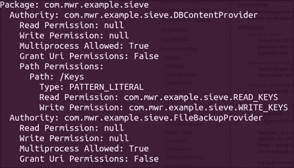

当前示例来自 MWR 实验室的 Sieve Android 应用，该应用内置了一些漏洞；有关下载页面的链接，请参阅 *另请参阅* 部分。

在前面的屏幕截图中，我们可以看到这个应用使用 `PATTERN_LITERAL` 类型的匹配来保护 `Keys` 路径，这意味着如果我们尝试使用 drozer 进行查询，结果将如下所示：

```kt
run app.provider.query content://com.mwr.example.sieve.DBContentProvider/Keys

```

下面的屏幕截图显示了之前命令的输出：

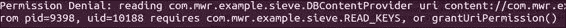

前面的屏幕截图显示了由于 drozer 没有与提供者交互所需的权限而导致的权限拒绝。但是，如果我们简单地在路径后加上`/`，它仍然有效，结果如下：

```kt
run app.provider.query content://com.mwr.example.siever.DBContentProvider/Keys/

```

下面的屏幕截图显示了前面命令的输出：


路径中添加了一个正斜杠，因此`PATTERN_LITERAL`检查未能找到`content://com.mwr.example.sieve.DBConentProvider/Keys`路径，而是找到了`content://com.mwr.example.sieve.DBConentProvider/Keys/`路径。这意味着查询内容提供者的应用程序将需要`/Keys/`路径的权限，该路径未定义，因此不需要权限，这使得查询能够顺利解决。在之前的屏幕截图中，我们可以看到在这种情况下，恶意应用程序能够提取用户针对 Sieve 密码管理应用程序的登录 PIN 码详情。

## 另请参阅

+   《Shazam (Android)应用程序上的路径遍历漏洞》文章（[`blog.seguesec.com/2012/09/path-traversal-vulnerability-on-shazam-android-application/`](http://blog.seguesec.com/2012/09/path-traversal-vulnerability-on-shazam-android-application/)）

+   《Adobe Reader (Android)应用程序上的路径遍历漏洞》文章（[`blog.seguesec.com/2012/09/path-traversal-vulnerability-on-adobe-reader-android-application/`](http://blog.seguesec.com/2012/09/path-traversal-vulnerability-on-adobe-reader-android-application/)）

+   《WinZip for Android 内容处理目录遍历漏洞》文章（[`vuln.sg/winzip101-en.html`](http://vuln.sg/winzip101-en.html)）

+   在 CVE Details 上的 Android 2.3.4 浏览器本地文件包含漏洞；**CVE-2010-4804** ([`www.cvedetails.com/cve/CVE-2010-4804/`](http://www.cvedetails.com/cve/CVE-2010-4804/))

+   drozer Sieve – 一个展示了一些常见 Android 漏洞的密码管理应用（[`www.mwrinfosecurity.com/system/assets/380/original/sieve.apk`](https://www.mwrinfosecurity.com/system/assets/380/original/sieve.apk)）

# 向内容提供者中插入数据

与任何以数据库为中心的应用程序一样，内容提供者也可能具备向其 SQLite 数据库或文件存储中插入数据的能力；如果任何内容提供者没有使用适当的**写入**权限来限制此功能，攻击者可能会恶意地向 SQLite 数据库中插入数据。本教程将讨论如何执行此类攻击；在下一章中，我们将查看导致这些漏洞的实际代码，并讨论一些补救措施。

## 如何操作...

在我们向内容提供者插入数据之前，我们需要了解数据库的架构或列设置是什么样的；您可以使用以下命令从您的 drozer 控制台枚举此信息：

```kt
dz> run app.provider.columns [URI]

```

在前面的命令中`[URI]`是你希望了解的 URI。例如，如果你想针对 Sieve 运行它，你会执行以下命令：

```kt
dz> run app.provider.columns content://com.mwr.example.seive.DBContentProvider/Passwords

```

前面的命令将产生如下截图所示的输出：


枚举数据库列之所以有用，是因为它可能有助于你针对内容提供者构建未来的攻击；你可能需要了解一些关于模式的信息，以便知道你可能感兴趣从中提取和插入的列和行。

当你了解了数据库的结构以及可能需要哪些列名以便正确构建查询时，你可以使用以下命令将数据插入内容提供者：

```kt
dz> run app.provider.insert [URI] [--boolean [name] [value]] [--integer [name] [value]] [--string [name] [value]]...

```

在前面的命令中，`[URI]` 是指向相关数据库的 URI，而 `--boolean`、`--integer` 和 `--string` 是你应该提供的标志，以将给定的数据片段标记为给定的数据类型。此模块支持以下数据类型：

```kt
--boolean –-double –-float –-integer –-long –-string –short
```

每个都需要`[name]`值，这表示列名，以及`[value]`，表示你希望插入的实际值。

下面的代码是一个示例：

```kt
dz> run app.provider.insert –-int _id 12 –-int from_account 31337 –-int to_account –-int amount 31337    content://com.example.vulnerabledatabase.contentprovider/statements 

```

下面的例子是虚构的。`content://com.example.vulnerabledatabase.contentprovider/statement` URI 在你的设备上可能不存在，除非你已经明确开发了一些处理它的应用。

下面是针对 Sieve 的工作示例：

```kt
dz>  run app.provider.insert content://com.mwr.example.sieve.DBContentProvider/Passwords –-int _id 3 –-string username injected –-string service injected –-string password woopwoop –-string email myspam@gmail.com 

```

当你查询 Sieve 的密码 URI 并执行之前的命令后，将返回以下数据：

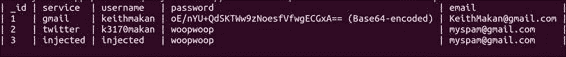

我们可以清楚地看到，对于 **_id** **3** 的数据，我们刚刚注入的数据实际上出现在数据库中。这意味着我们刚刚成功用一些伪造数据破坏了 Passwords 数据库中的数据。在实际情况下，这可能允许攻击者更改用户的密码或删除它们，从而拒绝用户访问相关账户；更具体地说，在像 Sieve 这样的密码管理应用（这里仅作为示例）中，攻击者能够阻止用户访问他们存储的密码，甚至可能是他们的 Gmail、Twitter 或 LinkedIn 账户。

关于示例的一个小注：我们注入密码字符串 `woopwoop` 仅作为标记，以确保我们可以注入密码数据——它只是一个很容易识别的字符串；如果你要测试这个密码，它可能不会起作用。实际上，要注入一个有效的密码，你需要注入密码的 base64 编码值。

# 枚举 SQL 注入漏洞的内容提供者

与网络应用一样，Android 应用可能会使用不可信的输入来构建 SQL 查询，并以可被利用的方式进行。最常见的情况是应用没有对任何 SQL 输入进行清理，也没有限制对内容提供者的访问。

你为什么要阻止 SQL 注入攻击？嗯，假设你处于一种经典情况，通过查询数据库来为用户提供授权。代码可能类似于以下这样：

```kt
public boolean isValidUser(){ 
u_username = EditText( some user value );
u_password = EditText( some user value );
//some un-important code here...
String query = "select * from users_table where username = '" +  u_username + "' and password = '" + u_password +"'";
SQLiteDatabase db
//some un-important code here...
Cursor c = db.rawQuery( p_query, null );
return c.getCount() != 0;
}
```

```kt
occurs more often in real-world applications. So when auditing Android code for injection vulnerabilities, a good idea would be to look for something that resembles the following:
```

```kt
public Cursor query(Uri uri, String[] projection, String selection,String[] selectionArgs, String sortOrder) {
   SQLiteDBHelper sdbh = new StatementDBHelper(this.getContext());
   Cursor cursor;
   try {
//some code has been omitted  
   cursor = sdbh.query(projection,selection,selectionArgs,sortOrder);
   } finally {
      sdbh.close();
   }
   return cursor;
}
```

在前面的代码中，`projection`、`selection`、`selectionArgs` 或 `sortOrder` 变量都没有直接来自外部应用程序。如果内容提供者被导出并授予 URI 权限，或者如我们之前所见，不需要任何权限，这意味着攻击者将能够注入任意的 SQL 来增强恶意查询的评估方式。

让我们看看实际上是如何使用 drozer 攻击易受 SQL 注入攻击的内容提供者的。

## 如何操作...

在这个教程中，我将讨论两种 SQL 注入漏洞：一种是 SQL 语句的选择子句可注入，另一种是投影可注入。使用 drozer，查找可注入选择子句的内容提供者非常容易：

```kt
dz> run app.provider.query [URI] –-selection "1=1" 

```

前文提到的方法将尝试向由内容提供者解析的 SQL 语句中注入所谓的逻辑恒真式，最终由数据库查询解析器处理。由于这里使用的模块的性质，你可以判断它是否真的起作用了，因为它应该返回数据库中的所有数据；也就是说，选择子句的条件被应用于每一行，并且因为它总是返回真，所以每一行都会被返回！

你还可以尝试任何总是为真的值：

```kt
dz> run app.provider.query [URI] –-selection "1-1=0"
dz> run app.provider.query [URI] –-selection "0=0"

dz> run app.provider.query [URI] –-selection "(1+random())*10 > 1" 

```

下面是一个故意使用易受攻击的内容提供者的例子：

```kt
dz> run app.provider.query content://com.example.vulnerabledatabase.contentprovider/statements –-selection "1=1"

```

它返回了被查询的整个表，如下面的截图所示：


当然，你也可以在 `SELECT` 语句的投影部分注入，即语句中 `FROM` 之前的部分，即 `SELECT [投影] FROM [表] WHERE [选择子句]`。

## 另请参阅

+   [SQLite 语言参考指南中的 *SQL As Understood By SQLite* 文章](http://www.sqlite.org/lang.html)

+   [关于 SQL 注入的文章](https://www.owasp.org/index.php/SQL_Injection)

# 利用可调试的应用程序

应用程序可以被标记为可调试，以便在进行功能测试和错误跟踪时，允许你在应用程序执行过程中设置断点，从而大大简化这些操作。为此，可以在应用程序在设备上运行时查看虚拟机堆栈并挂起或恢复线程。

不幸的是，谷歌应用商店上的一些应用程序仍然被标记为可调试。这不一定总是世界末日，但如果应用程序希望保护任何认证数据、密码地址或存储在应用程序内存中的任何值，被标记为可调试意味着攻击者可以非常容易地获取这些数据。

本文档讨论了如何从一个可调试的应用程序中泄露变量值。攻击者也可能能够通过应用程序触发远程代码执行，并在应用程序的上下文中运行一些代码。

这里使用的例子是安卓版的华尔街日报应用，在撰写本文时，它是谷歌 Play 商店中作为可调试应用程序发布的应用之一。

## 如何操作...

你需要做的第一件事是确定应用程序是否可调试。这相当简单，因为一个应用程序是否可调试直接取决于其应用程序清单。在 Android 应用程序清单的应用元素中的`debuggable`字段。要枚举和利用可调试的应用程序，你需要执行以下步骤：

1.  要检查一个应用程序是否可调试，你可以提取清单文件，或者从你的 drozer 控制台执行以下命令：

    ```kt
    dz> run app.package.debuggable 

    ```

    这将列出所有设置为可调试的包，并显示它们被授予的权限。以下截图显示了一个包列表：

    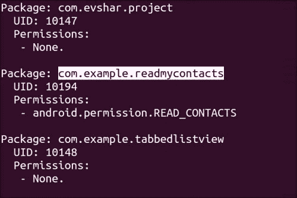

    你可能会问自己，像这样的简单漏洞在现实世界中真的存在吗？嗯，是的，实际上仍然存在！以下截图显示了一个相对知名的应用程序，它被发布到谷歌 Play 市场时是可调试的：

    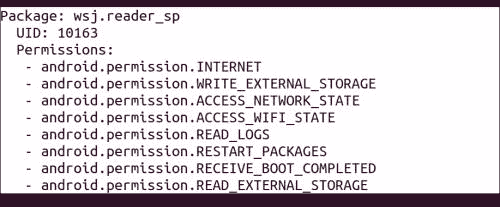

    本例显示`.debuggable`模块的输出，表明华尔街日报阅读器应用是可调试的。

1.  一旦你确定了一个好的目标，你应该使用如下命令来启动它：

    ```kt
    dz> run app.activity.start –-component com.example.readmycontacts com.example.readmycontacts.MainActivity 

    ```

1.  一旦运行起来，你可以使用 ADB 获取为该虚拟机实例打开的 Java 调试协议端口；以下是操作方法：

    ```kt
    adb jdwp

    ```

    你应该会看到如下内容：

    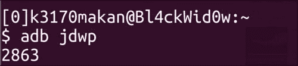

1.  ADB 返回的数字是你可以用来连接到虚拟机的端口，但在你的机器上这样做之前，你需要通过`adb`转发这个端口；以下是操作方法：

    ```kt
    adb forward tcp:[localport] jdwp:[jdwp port on device]

    ```

    对于截图中给出的例子，你需要执行以下命令来转发端口：

    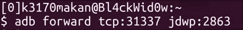

1.  现在你可以从你的机器上访问运行这个应用的虚拟机。从这一点开始，你可以依赖 Java 调试器连接到虚拟机；你可以通过运行以下命令来实现：

    ```kt
    jdb –attach localhost:[PORT]

    ```

    你将使用的`[PORT]`端口是上一步转发的端口；在这个例子中，那将是`31337`。通过`jdb`连接的操作如下：

    ```kt
    jdb –attach localhost:31337

    ```

    下面的截图显示了前面命令的输出：

    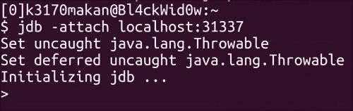

1.  然后，你将连接到在 Android 设备上运行这个应用虚拟机；然后你可以执行诸如提取与应用程序编译的类信息等操作；这是通过在`jdb`会话中执行以下命令完成的：

    ```kt
    classes

    ```

    这将产生类似于以下的输出：

    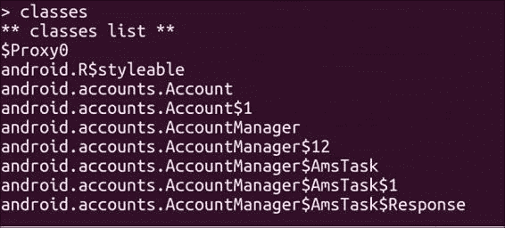

1.  你还可以通过执行以下命令枚举每个类的方法：

    ```kt
    > methods [class-path]

    ```

    在前面的命令中，`[class-path]`是你想要了解的类的完整类路径。

1.  以下截图演示了针对名为`com.example.readmycontacts`的应用程序包执行前一个命令的情况。这里我们正在提取有关`.MainActivity`类的信息，这是调用启动活动的类。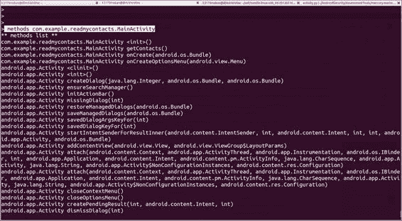

1.  你甚至可以进一步深入，列出给定类的“字段”或类属性名称和值；这是通过在 JDB 内部执行以下命令来完成的：

    ```kt
    > fields [class name ]

    ```

    例如：

    ```kt
    > fields com.example.readmycontacts.MainActivity

    ```

作为一名 Android 应用程序黑客，你为什么会对从类文件中的字段读取值感兴趣？因为开发人员可能会经常将敏感信息显式地存储在类文件中，而不是从云端获取；因此你可以期待在类的字段中保存诸如密码、API 令牌、单点登录令牌、默认用户名以及通常用于身份验证或其他敏感操作的数据。

对于某些 Android 操作系统，特别是任何未打补丁的 Gingerbread 设备及更低版本。这个漏洞可能意味着恶意应用程序能够在另一个应用程序的上下文中执行任意命令。为什么只有 Gingerbread 及更低版本？因为在 Dalvik 虚拟机更新到 Gingerbread 之前，Dalvik 导致可调试的应用程序即使在没有运行 ADB 的情况下也会尝试连接到 Java 调试线协议端口；这意味着能够在目标设备上打开网络套接字的恶意应用程序能够接受来自可调试应用程序的连接，并且因为 Java 调试的工作方式，能够执行任意代码。有关此行为的更多详细信息，请访问*Android 市场中的可调试应用程序*文章中的链接，以及不同版本的 Dalvik 虚拟机代码的链接。

你还可以使用 Java 调试器做更多的事情；对于那些想了解更多关于它的信息的读者，我在*另请参阅*部分包含了一些有用的链接。

## 另请参阅

+   [Jdb – Java 调试器](http://docs.oracle.com/javase/1.5.0/docs/tooldocs/windows/jdb.html)文章

+   [Java 平台调试器架构](http://docs.oracle.com/javase/1.5.0/docs/guide/jpda/index.html)文章

+   [Android:debuggable – Android 开发者参考指南](http://developer.android.com/guide/topics/manifest/application-element.html#debug)

+   位于 MWRLabs 的*Android Market 中的可调试应用*文章（[`labs.mwrinfosecurity.com/blog/2011/07/07/debuggable-apps-in-android-market/`](http://labs.mwrinfosecurity.com/blog/2011/07/07/debuggable-apps-in-android-market/)）

+   Saurik 撰写的*利用（及修复）Android "Master Key"*文章，位于[`www.saurik.com/id/17`](http://www.saurik.com/id/17)

+   位于[`www.packtpub.com/article/debugging-java-programs-using-jdb`](http://www.packtpub.com/article/debugging-java-programs-using-jdb)的*使用 JDB 调试 Java 程序*文章

+   JdwpAdb.c – Kitkat 版本，Android 源代码仓库（[`android.googlesource.com/platform/dalvik/+/kitkat-release/vm/jdwp/JdwpAdb.cpp`](https://android.googlesource.com/platform/dalvik/+/kitkat-release/vm/jdwp/JdwpAdb.cpp)）

+   JdwpAdb.c – Éclair Passion 版本，Android 源代码仓库（[`android.googlesource.com/platform/dalvik/+/eclair-passion-release/vm/jdwp/JdwpAdb.c`](https://android.googlesource.com/platform/dalvik/+/eclair-passion-release/vm/jdwp/JdwpAdb.c)）

+   JdwpAdb.c – Gingerbread 版本，Android 源代码仓库（[`android.googlesource.com/platform/dalvik/+/gingerbread-release/vm/jdwp/JdwpAdb.c`](https://android.googlesource.com/platform/dalvik/+/gingerbread-release/vm/jdwp/JdwpAdb.c)）

# 应用程序中的中间人攻击

手机用户经常在咖啡店、图书馆以及任何可用之处通过公共 Wi-Fi 网络访问互联网。不幸的是，由于某些应用程序的开发方式，它们仍然可能成为**中间人**（**MITM**）攻击的受害者。对于那些不了解 MITM 攻击的人来说，它们本质上是一种允许攻击者截取你与网络设备通信的攻击；如果你想在非移动环境中了解这些攻击的危险性和技术细节，请查看*另请参阅*部分的一些链接。

为什么我们应该关注手机上的中间人攻击（MITM）呢？因为，如果不受信任的渠道到网络资源的信任度很高，攻击者可能会做任何事情，从对你的设备上运行的应用程序进行指纹识别，到详细记录你曾经到过的每一个地方，你大概的居住和工作地点，甚至可能控制你手机上的某些应用程序，如果手机安全性不高或可以被 root，甚至可能控制整部手机。一些非常流行的应用程序中存在实际的安全漏洞，这些漏洞可能被中间人攻击所利用；查看*另请参阅*部分中的链接了解其中一些。

本指南展示了如何在 Android 手机上执行 MITM 攻击，以及一种在 MITM 攻击期间可能使用的简单漏洞利用，即 DNS 投毒。

这里有一个小警告，即执行 MITM 攻击所使用的 Ettercap 工具并没有官方提供任何 Windows 支持版本。不过，如果你没有 Ubuntu 或 Debian Linux 机器，你可以设置一个，只需下载 Ubuntu 的 CD/DVD 镜像并在 Oracle 的 Virtualbox 或 VMware 中使用虚拟机运行。要了解如何安装虚拟机，请查看 第三章 *Android Security Assessment Tools* 中 *安装和设置 Santuko* 食谱的 *还有更多...* 部分。如果你真的想在 Windows 机器上使用 Ettercap，你可以查看 *另请参阅* 部分中非官方 Windows 二进制文件的下载链接。

## 准备就绪

为了让整个过程变得更简单，我将向大家展示如何下载一个让 MITM 攻击变得非常简单的工具。你可以使用以下命令下载 Ettercap：

```kt
sudo aptitude install ettercap-graphical

```

下面的截图显示了前面命令的输出：

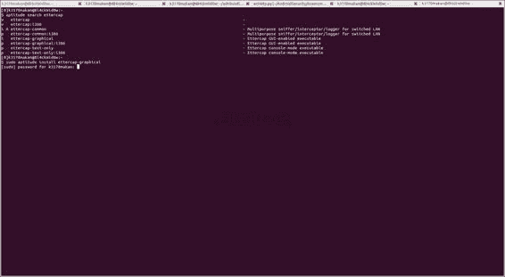

下载并设置后，你就可以开始 MITM 攻击了。

## 如何操作...

让我们按照以下步骤开始：

1.  在我们开始设置 MITM 攻击之前，你需要为 Ettercap 设置 DNS 欺骗插件；你需要做的唯一一件事就是为保存在 Linux 机器上的 `/usr/share/ettercap/etter.dns` 的 Ettercap DNS 配置脚本添加一些有用的地址。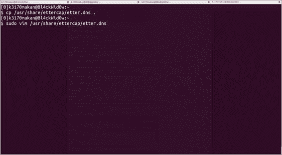

    `etter.dns` 文件应该看起来像下面这样：

    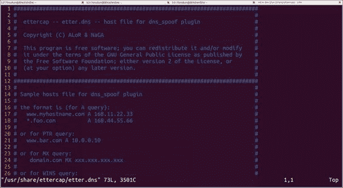

    编辑这个文件后，它应该看起来像下面这样：

    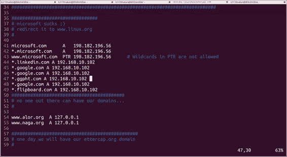

    地址 `192.168.10.102` 应该替换成你的机器的互联网地址，因为你想使用你的机器来欺骗 DNS 服务器，这意味着你的机器将充当 DNS 服务器。

1.  一旦 DNS 插件设置正确，你可以通过从终端或命令提示符执行以下命令来启动 MITM 攻击：

    ```kt
    ettercap –T –I [interface] –M ARP:remote –P dns_spoof /[address of target] /[address of gateway]/

    ```

    在前面的命令中，`[interface]` 是你用来连接网络的网络接口，可能是以太网或无线接口。[address of target] 是你的安卓设备的互联网地址；你可以在安卓手机的 **设置** | **Wi-Fi** | **[网络名称]** | **IP 地址** 下找到这个地址。[address of gateway] 是这个网络的默认网关的互联网地址。这种攻击利用 **地址解析协议** (**ARP**) 缺乏认证的弱点，让你的手机误认为你攻击的机器就是实际的网关。

1.  例如，如果你的网关 IP 地址是 `192.168.10.1` 而你的安卓设备 IP 是 `192.168.10.106`，以下是设置 MITM 攻击的方法：

    ```kt
    sudo ettercap –T –i wlan0 –M ARP:remote –P dns_spoof /192.168.10.1/ /192.168.10.106/

    ```

    你可以互换最后两个地址；只要它们都在，顺序无关紧要。执行这个命令后，你应该能在终端上看到以下内容出现：

    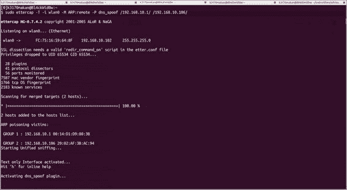

1.  一段时间后，你应该能看到类似以下截图的内容，这是由 Ettercap 记录的流量：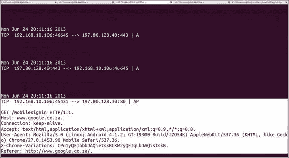

1.  一旦你开始使用这个“中毒”的网络启动一些应用程序，你就能在攻击者机器上看到一些奇怪的事情发生；例如，你将能够看到你的安卓应用程序发送的 DNS 请求；以下截图显示了 Flipboard 应用程序发送的 DNS 请求：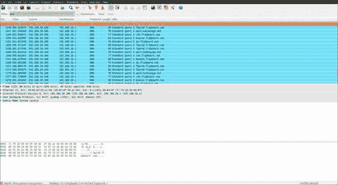

    这个输出是由 Wireshark 生成的。

1.  如果你的机器上配置了一个网页服务器，你可以通过伪装成 LinkedIn 和 Google 等网站，向你的安卓手机提供一些内容；以下是演示这一点的截图：

    这里还有一个例子；以下截图显示了被拦截的[www.google.com](http://www.google.com)的请求：

    

显然，这些不是 LinkedIn 和 Google 的网页；实际上，这里返回的页面是从本地机器到网络的。这可能是一个非常平凡的演示，但它涵盖了攻击的难点部分，即建立 MITM（中间人攻击）上下文，攻击者能够控制应用程序向互联网发出的响应。

在建立了 MITM 上下文之后，你可以利用移动浏览器，使用诸如 Metasploit 及其`browser_autopwn`模块之类的东西，或者使用一些社交工程工具来镜像这些网站——社会工程工具包在这方面非常出色。有关这些优秀工具的信息链接，请参阅*另请参阅*部分。

除了普通的 MITM 攻击之外，还有一些特定于 Android 的 MITM 攻击类别，即针对那些使用未加密的`addJavaScriptInterface` WebKit 和相关 API 调用的应用程序。关于这个漏洞的更多信息，请参阅*Android WebView 的冒险*文章和*Android 系统中的 WebView 攻击*的链接，在*另请参阅*部分。

## 另请参阅

+   Tongbo Luo, Hao Hao, Wenliang Yifei Wang 和 Heng Yin 的*Android 系统中的 WebView 攻击*论文（[`www.cis.syr.edu/~wedu/Research/paper/webview_acsac2011.pdf`](http://www.cis.syr.edu/~wedu/Research/paper/webview_acsac2011.pdf)）

+   MWR InfoSecurity 的*WebView addJavaScriptInterface 远程代码执行*论文（[`labs.mwrinfosecurity.com/system/assets/563/original/mwri_webview-addjavascriptinterface-code-execution_2013-09-23.pdf`](https://labs.mwrinfosecurity.com/system/assets/563/original/mwri_webview-addjavascriptinterface-code-execution_2013-09-23.pdf)）

+   MWR 实验室的《*Android WebViews 的冒险之旅*》文章 ([`labs.mwrinfosecurity.com/blog/2012/04/23/adventures-with-android-webviews/`](https://labs.mwrinfosecurity.com/blog/2012/04/23/adventures-with-android-webviews/))

+   Ettercap 的 Windows 二进制文件 ([`sourceforge.net/projects/ettercap/files/unofficial%20binaries/windows/`](http://sourceforge.net/projects/ettercap/files/unofficial%20binaries/windows/))

+   Ettercap 的官方网站 ([`ettercap.github.io/ettercap/index.html`](http://ettercap.github.io/ettercap/index.html))

+   Penetration Testing Lab 的《*Metasploit 浏览器 Autopwn*》文章 ([`pentestlab.wordpress.com/2012/04/23/metasploit-browser-autopwn/`](http://pentestlab.wordpress.com/2012/04/23/metasploit-browser-autopwn/))

+   Cain 和 Abel 的官方网站 ([`www.oxid.it/cain.html`](http://www.oxid.it/cain.html))

+   以太网地址解析协议，互联网标准 STD 37 ([`tools.ietf.org/html/rfc826`](http://tools.ietf.org/html/rfc826))
