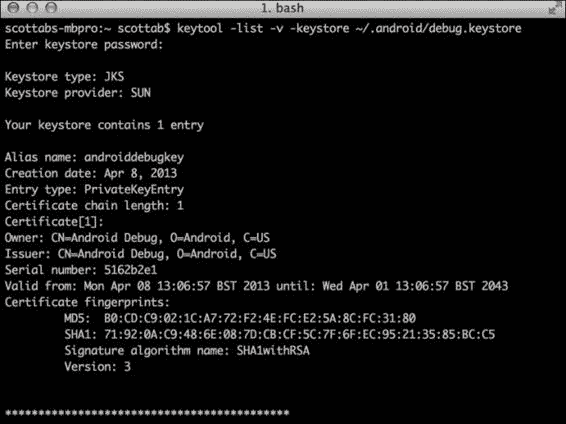
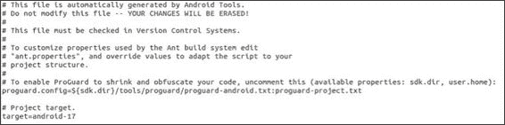

# 第五章：保护应用

在本章中，我们将介绍以下技巧：

+   保护应用组件

+   使用自定义权限保护组件

+   保护内容提供者路径

+   防范 SQL 注入攻击

+   应用签名验证（防篡改）

+   通过检测安装程序、模拟器和调试标志来实现篡改保护

+   使用 ProGuard 移除所有日志消息

+   使用 DexGuard 进行高级代码混淆

# 引言

到目前为止，我们已经了解了如何建立和自定义一个环境，以便发现并利用 Android 应用中的漏洞。在本章中，我们将讨论几种保护技术，使逆向工程师和攻击者更难以进行操作。

开发应用时常见的错误之一是不小心暴露了应用组件。我们将重点关注如何防止组件被暴露并可供其他应用访问。如果需要共享数据，我们还将了解如何通过自定义权限限制访问。

入侵或篡改检测是所有优秀防御系统的基石，为此，我们将尝试检测是否正在发生攻击，以及我们的应用是否在受威胁的状态下运行。

在本章的最后，我们将介绍两个让逆向工程师工作更加困难的技巧。我们将了解如何使用代码混淆以及自定义 ProGuard 配置，从应用中移除所有日志消息并隐藏敏感的 API 调用。

网络传输过程中数据保护的主题在第七章，*安全网络*中进行讨论，而如何通过加密保护静止数据的安全将在第九章，*加密与开发设备管理策略*中进行介绍。

# 保护应用组件

应用组件可以通过正确使用`AndroidManifest.xml`文件以及在代码层面强制进行权限检查来得到保护。这两个应用安全因素使得权限框架相当灵活，并允许你以非常细致的方式限制访问你组件的应用数量。

你可以采取许多措施来锁定对组件的访问，但在做任何事情之前，你应该确保你了解组件的目的，为什么需要保护它，以及如果恶意应用开始向你的应用发送意图并访问其数据，用户将面临哪些风险。这被称为基于风险的安全方法，建议你在配置`AndroidManifest.xml`文件并为你的应用添加权限检查之前，首先诚实回答这些问题。

在这个技巧中，我详细列出了一些你可以采取的措施来保护通用组件，无论它们是活动、广播接收器、内容提供者还是服务。

## 如何操作...

首先，我们需要审查你的 Android 应用程序`AndroidManifest.xml`文件。`android:exported`属性定义了一个组件是否可以被其他应用程序调用。如果你的应用程序组件不需要被其他应用程序调用，或者需要显式地防止与 Android 系统其他部分的组件交互—除了应用程序内部的组件—你应在应用组件的 XML 元素中添加以下属性：

```kt
<[component name] android:exported="false">
</[component name]>
```

在这里，`[组件名称]`可以是活动、提供者、服务或接收器。

## 它的工作原理…

通过`AndroidManifest.xml`文件执行权限意味着对不同应用组件类型有不同的含义。这是因为可以用来与它们交互的不同的**进程间通信**（**IPC**）机制。对于每个应用组件，`android:permission`属性执行以下操作：

+   **活动**: 限制可以成功调用 `startActivity` 或 `startActivityForResult` 的外部应用组件为具有所需权限的组件

+   **服务**: 限制可以绑定（通过调用`bindService()`）或启动（通过调用`startService()`）服务的的外部应用组件为具有指定权限的组件

+   **接收器**: 限制具有指定权限的外部应用组件向接收器发送广播意图的数量

+   **提供者**: 限制对通过内容提供者可访问的数据的访问

每个组件 XML 元素的`android:permission`属性会覆盖`<application>`元素的`android:permission`属性。这意味着，如果你没有为你的组件指定任何所需的权限，并且在`<application>`元素中指定了一个，它将适用于其中包含的所有组件。尽管通过`<application>`元素指定权限并不是开发者经常做的事情，因为这样做会影响组件对 Android 系统本身的友好性（也就是说，如果你使用`<application>`元素覆盖了一个活动的所需权限），主屏幕启动器将无法启动你的活动。话虽如此，如果你足够谨慎，不需要任何未经授权的交互发生在你的应用程序或其组件上，你应该使用`<application>`标签的`android:permission`属性。

### 提示

当你在组件上定义 `<intent-filter>` 元素时，除非你明确设置 `exported="false"`，否则它将被自动导出。然而，这似乎是一个鲜为人知的事实，因为许多开发者在无意中将自己的内容提供者开放给其他应用程序。因此，谷歌通过在 Android 4.2 中更改 `<provider>` 的默认行为作出了回应。如果你将 `android:minSdkVersion` 或 `android:targetSdkVersion` 设置为 `17`，则 `<provider>` 上的 `exported` 属性将默认为 `false`。

## 另请参阅

+   在[Android 开发者参考资料](https://developer.android.com/guide/topics/manifest/service-element.html)中的 `<service>` 标签

+   在[Android 开发者参考资料](https://developer.android.com/guide/topics/manifest/receiver-element.html)中的 `<receiver>` 标签

+   在[Android 开发者参考资料](https://developer.android.com/guide/topics/manifest/activity-element.html)中的 `<activity>` 标签

+   在[Android 开发者参考资料](https://developer.android.com/guide/topics/manifest/application-element.html)中的 `<application>` 标签

+   在[Android 开发者参考资料](http://developer.android.com/guide/topics/manifest/manifest-intro.html)中的 `AndroidManifest.xml` 文件

+   在[Android 开发者参考资料](http://developer.android.com/reference/android/content/Context.html)中的 `Context` 类

+   在[Android 开发者参考资料](http://developer.android.com/reference/android/app/Activity.html)中的 `Activity` 类

# 使用自定义权限保护组件

Android 平台定义了一套默认权限，用于保护系统服务和应用程序组件。在很大程度上，这些权限在大多数通用情况下是有效的，但是当在应用程序之间共享定制功能或组件时，通常需要更具体地使用权限框架。这可以通过定义自定义权限来实现。

本教程展示了如何定义你自己的自定义权限。

## 如何操作…

让我们开始吧！

1.  在添加任何自定义权限之前，你需要为权限标签声明字符串资源。你可以通过编辑你的应用程序项目文件夹下的 `res/values/strings.xml` 文件来实现这一点：

    ```kt
    <string name="custom_permission_label">Custom Permission</string>.
    ```

1.  通过向你的 `AndroidManifest.xml` 文件添加以下几行，可以为你的应用程序添加正常保护级别的自定义权限：

    ```kt
    <permission   android:name="android.permission.CUSTOM_PERMISSION"
        android:protectionLevel="normal"
        android:description="My custom permission"
        android:label="@string/custom_permission_label">
    ```

    我们将在*它是如何工作的...*部分解释`android:protectionLevel`属性的含义。

1.  使用此权限与使用任何其他权限一样；你需要将其添加到应用程序组件的`android:permission`属性中。对于活动：

    ```kt
    <activity ...
     android:permission="android.permission.CUSTOM_PERMISSION">
    </activity>
    ```

    或者一个内容提供者：

    ```kt
    <provider ...
     android:permission="android.permission.CUSTOM_PERMISSION">
    </provider>
    ```

    或者一个服务：

    ```kt
    <service ...
     android:permission="android.permission.CUSTOM_PERMISSION">
    </service>
    ```

    或者一个接收器：

    ```kt
    <receiver ...
     android:permission="android.permission.CUSTOM_PERMISSION">
    </receiver>
    ```

1.  你还可以通过将`<uses-permission/>`标签添加到应用程序的`AndroidManifest.xml`文件中，允许其他应用程序请求此权限：

    ```kt
    <uses-permission android:name="android.permission.CUSTOM_PERMISSION"/>
    ```

### 定义一个权限组

自定义权限可以通过逻辑分组来为请求给定权限的应用程序或需要某些权限的组件分配语义意义。通过定义一个权限组并将你的权限分配给这些组来进行权限分组，正如之前所演示的。以下是定义权限组的方法：

1.  为权限组的标签添加一个字符串资源，就像之前所做的那样。这可以通过将以下行添加到`res/values/strings.xml`文件来完成：

    ```kt
    <string name="my_permissions_group_label">Personal Data Access</string>
    ```

1.  然后，将以下行添加到你的应用程序的`AndroidManifest.xml`文件中：

    ```kt
    <permission-group 
      android:name="android.permissions.personal_data_access_group"
      android:label="@string/my_permissions_group_label"
      android:description="Permissions that allow access to personal data"
    />
    ```

1.  然后，你可以将你定义的权限分配给以下群组：

    ```kt
    <permission ...
      android:permissionGroup="android.permission.personal_data_acess_group"
    />
    ```

## 它是如何工作的...

前面的演练展示了如何通过使用`AndroidManifest.xml`文件中的`<permission>`元素来定义自定义权限，以及如何通过使用清单中的`<permission-group>`元素来定义一个权限组。这里，我们将详细解析这些元素及其属性的细微差别。

`<permission>`元素很容易理解。以下是属性分解：

+   `android:name`：这定义了权限的名称，这是一个字符串值，将用于引用此权限

+   `android:protectionLevel`：这定义了权限的保护级别，并控制是否提示用户授予权限。我们之前已经讨论过这个问题，但这里是保护级别的回顾：

    +   `normal`：此权限用于定义非危险权限，这些权限不会被提示，可能会自动授予

    +   `dangerous`：此权限用于定义可能会让用户面临相当大的财务、声誉和法律风险的权限

    +   `signature`：此权限自动授予与定义它们的程序使用相同密钥签名的应用程序

    +   `signatureOrSystem`：此权限自动授予系统映像的一部分的任何应用程序，或者与定义它们的程序使用相同密钥签名的应用程序

如果你只想在你开发的应用间共享组件，请使用`signature`权限。例如，这可能是一个免费应用，而解锁应用则作为一个单独的付费下载，或者是一个带有多个可选插件的 应用，希望共享功能。危险权限不会自动授予。在安装时，可能会显示`android:description`属性以供用户确认。这在你希望向用户标记其他应用可以访问你的应用数据时非常有用。`normal`权限在安装时会自动授予，并且不会向用户标记。

## 另请参阅

+   Android 开发者指南中的`<permission>`标签，链接为：[`developer.android.com/guide/topics/manifest/permission-element.html`](http://developer.android.com/guide/topics/manifest/permission-element.html)

+   Android 开发者指南中的`<uses-permission>`标签，链接为：[`developer.android.com/guide/topics/manifest/uses-permission-element.html`](http://developer.android.com/guide/topics/manifest/uses-permission-element.html)

+   请参考 Android 开发者指南中的`<permission-group>`标签，链接为：[`developer.android.com/guide/topics/manifest/permission-group-element.html`](http://developer.android.com/guide/topics/manifest/permission-group-element.html)

+   Android 开发者指南中的`Manifest.permission`类，链接为：[`developer.android.com/reference/android/Manifest.permission.html`](https://developer.android.com/reference/android/Manifest.permission.html)

# 保护内容提供者路径

内容提供者可能是最容易被利用的应用组件，因为它们经常包含对用户身份验证最关键的数据。它们通常包含大量关于用户及其对 SQL 注入攻击敏感的信息。本演练将详细介绍你可以采取的一些措施来保护你的内容提供者，防止由于配置权限时的常见错误导致的一般信息泄露。我们还将讨论如何保护数据库和内容提供者免受 SQL 注入攻击。

本指南将讨论如何向你的`AndroidManifest.xml`文件添加特定配置，以保护对内容提供者的访问，直至 URI 路径级别。它还讨论了误用授权 URI 机制的一些安全风险，以避免将过多的内容提供者路径暴露给未经授权或潜在恶意应用。

**统一资源标识符**（**URIs**）与内容提供者一起使用，用于标识特定的数据集，例如，`content://com.myprovider.android/email/inbox`。

## 如何操作...

保护任何组件的第一步是确保你已经正确注册了它的权限。保护内容提供者不仅仅是允许与内容提供者的一般交互，还包括相关的 URI 路径。

1.  为了使用控制所有与你的权限相关的路径的读取和写入权限的权限来保护你的内容提供者，你可以在你的 Android 清单中添加以下 `provider` 元素：

    ```kt
    <provider  android:enabled="true"
        android:exported="true"
        android:authorities="com.android.myAuthority"
        android:name="com.myapp.provider"
     android:permission="[permission name]">
    </provider>
    ```

    在这里，`[permission name]` 是其他应用必须拥有的权限，以便读取或写入任何内容提供者路径。在这个级别添加权限是一个非常好的步骤，以确保在保护路径方面没有留下任何机会。

1.  自然地，内容提供者会有几个他们希望从中提供内容的内容路径。你可以按照以下方式为它们添加读取和写入权限：

    ```kt
    <provider  
      android:writePermission="[write permission name]"
      android:readPermission="[read permission name]">
    </provider>
    ```

    `android:writePermission` 和 `android:readPermission` 标签用于声明，每当外部应用想要执行任何读取相关（`query`）或写入相关（`update` 和 `insert`）的操作时，它们必须拥有指定的权限才能这么做。

    ### 提示

    一个常见的错误是认为授予写入权限会隐式地授予读取权限，但实际上，这不应是默认行为。Android 很好地遵循最佳实践，要求分别声明读取和写入权限。

    下面是来自 Android Google Chrome 应用的实际示例：

    ```kt
    <provider  android:name="com.google.android.apps.chrome.ChromeBrowserProvider"
      android:readPermission="com.android.browser.permission.READ_HISTORY_BOOKMARKS"
      android:writePermission="com.android.browser.permission.WRITE_HISTORY_BOOKMARKS"
      android:exported="true"
           ...
    ```

    你还可以通过使用 `AndroidManifest.xml` 架构中的 `<path-permission>` 元素，为每个路径添加更细粒度的权限；以下是操作方法：

    ```kt
    <provider ...>
    <path-permission  android:path="/[path name]"
     android:permission="[read/write permission name]"
     android:readPermission="[read permission name]"
     android:writePermission="[write permission name]">
    </provider>
    ```

    你可能会想知道，如果你同时使用这两个级别的权限会发生什么情况。在 `<provider>` 和 `<path-permission>` 级别，应用是否需要拥有在这两个级别注册的所有权限？答案是否定的，路径级别的读取、写入和读写权限优先。

1.  另一件值得一提的事情是 **授权 URI** 机制。你可以在提供者级别配置它以应用于所有路径，或者在路径级别配置，这只会影响相关路径。然而，如果在路径级别指定权限而在提供者级别授权 URI，这有点奇怪，因为实际上这意味着没有设置任何权限！完全建议开发人员不要在提供者级别使用授权 URI 权限，而应该按路径使用。所以，只有当你需要确保任何应用在仍具有保护其他路径权限的情况下，能够查询、插入或更新某个特定路径时，才应按以下方式操作：

    ```kt
    <provider ...>
    <grant-uri-permission android:path="[path name]" />
    </provider>
    ```

    你还可以使用 `pathPrefix` 或 `pathPattern` 属性指定一个路径范围，以授权 URI 权限。`pathPrefix` 将确保授权 URI 机制适用于所有以给定前缀开头的路径。`pathPattern` 将确保授权 URI 机制适用于所有与给定模式匹配的路径。例如：

    ```kt
    <grant-uri-permission android:path="[path name]" 
                     android:pathPrefix="unsecured"/>
    ```

    这将应用授权 URI 权限到所有以 "unsecured" 字符串开头的路径，例如：

    +   `content://com.myprovider.android/unsecuredstuff`

    +   `content://com.myprovider.android/unsecuredsomemorestuff`

    +   `content://com.myprovider.android/unsecured/files`

    +   `content://com.myprovider.android/unsecured/files/music`

    对于前一个示例，如果查询、更新、插入或删除这些路径中的任何一个，将触发授权 URI 权限。

## 另请参阅

+   请参考 Android 开发者参考指南中的 `<provider>` 标签，链接为：[`developer.android.com/guide/topics/manifest/provider-element.html`](http://developer.android.com/guide/topics/manifest/provider-element.html)

+   请参考 Android 开发者参考指南中的 `<path-permission>` 标签，链接为：[`developer.android.com/guide/topics/manifest/path-permission-element.html`](http://developer.android.com/guide/topics/manifest/path-permission-element.html)

# 防范 SQL 注入攻击

前一章介绍了一些针对内容提供者的常见攻击方式，其中之一就是臭名昭著的 SQL 注入攻击。这种攻击利用了这样一个事实：攻击者能够提供 SQL 语句或与 SQL 相关的语法作为他们选择参数、投影或有效 SQL 语句的任何部分。这使得他们能够从内容提供者那里提取比未授权更多的信息。

确保攻击者无法将不受欢迎的 SQL 语法注入到您的查询中的最佳方法是避免使用 `SQLiteDatabase.rawQuery()`，而选择使用参数化语句。使用编译后的语句，如 `SQLiteStatement`，既提供了参数绑定和转义，以防范 SQL 注入攻击。此外，由于数据库不需要在每次执行时解析语句，因此还有性能上的优势。`SQLiteStatement` 的替代方法是使用 `SQLiteDatabase` 上的 `query`、`insert`、`update` 和 `delete` 方法，因为它们通过使用字符串数组提供参数化语句。

当我们描述参数化语句时，我们指的是带有问号（?）的 SQL 语句，值将在这里插入或绑定。以下是参数化 SQL `insert` 语句的一个示例：

```kt
INSERT VALUES INTO [table name] (?,?,?,?,...)
```

在这里，`[table name]` 将是相关表的名称，需要在该表中插入值。

## 如何操作...

在本例中，我们使用了一个简单的 **数据访问对象** (**DAO**) 模式，所有针对 RSS 项的数据库操作都包含在 `RssItemDAO` 类中：

1.  当我们实例化 `RssItemDAO` 时，我们使用带有参数化 SQL `insert` 语句字符串的 `insertStatement` 对象进行编译。这只需要做一次，并且可以多次重用进行多次插入：

    ```kt
    public class RssItemDAO {

    private SQLiteDatabase db;
    private SQLiteStatement insertStatement;

    private static String COL_TITLE = "title";
    private static String TABLE_NAME = "RSS_ITEMS";

    private static String INSERT_SQL = "insert into  " + TABLE_NAME + " (content, link, title) values (?,?,?)";

    public RssItemDAO(SQLiteDatabase db) {
      this.db = db;
      insertStatement = db.compileStatement(INSERT_SQL);
    }
    ```

    `INSERT_SQL` 变量中列的顺序很重要，因为它直接映射到绑定值时的索引。在上述示例中，`content` 映射到索引 `0`，`link` 映射到索引 `1`，`title` 映射到索引 `2`。

1.  现在，当我们向数据库中插入一个新的 `RssItem` 对象时，我们按语句中出现的顺序绑定每个属性：

    ```kt
    public long save(RssItem item) {
      insertStatement.bindString(1, item.getContent());
      insertStatement.bindString(2, item.getLink());
      insertStatement.bindString(3, item.getTitle());
      return insertStatement.executeInsert();
    }
    ```

    请注意，我们调用了`executeInsert`这个辅助方法，它返回新创建行的 ID。使用`SQLiteStatement`语句就这么简单。

1.  下面的代码展示了如何使用`SQLiteDatabase.query`来获取与给定搜索词匹配的`RssItems`：

    ```kt
    public List<RssItem> fetchRssItemsByTitle(String searchTerm) {
      Cursor cursor = db.query(TABLE_NAME, null, COL_TITLE + "LIKE ?", new String[] { "%" + searchTerm + "%" }, null, null, null);

      // process cursor into list
      List<RssItem> rssItems = new ArrayList<RssItemDAO.RssItem>();
      cursor.moveToFirst();
      while (!cursor.isAfterLast()) {
        // maps cursor columns of RssItem properties
        RssItem item = cursorToRssItem(cursor);
        rssItems.add(item);
        cursor.moveToNext();
      }
      return rssItems;
    }
    ```

    我们使用`LIKE`和 SQL 的通配符语法来匹配标题列中任何部分的文本。

## 另请参阅

+   安卓开发者参考指南中的`SQLiteDatabase`类，请访问[`developer.android.com/reference/android/database/sqlite/SQLiteDatabase.html`](https://developer.android.com/reference/android/database/sqlite/SQLiteDatabase.html)

+   安卓开发者参考指南中的`SQLiteStatment`类，请访问[`developer.android.com/reference/android/database/sqlite/SQLiteStatement.html`](https://developer.android.com/reference/android/database/sqlite/SQLiteStatement.html)

+   OWASP 社区页面《*查询参数化速查表*》在[`www.owasp.org/index.php/Query_Parameterization_Cheat_Sheet`](https://www.owasp.org/index.php/Query_Parameterization_Cheat_Sheet)

+   SQLite 表达式，请访问[`www.sqlite.org/lang_expr.html`](http://www.sqlite.org/lang_expr.html)

# 应用签名验证（防篡改）

安卓安全的核心基石之一是所有应用都必须进行数字签名。应用开发者使用私钥证书的形式对应用进行签名。无需使用证书授权机构，实际上，更常见的是使用自签名证书。

证书通常都有定义的过期日期，而谷歌应用商店要求证书的有效期截止日期在 2033 年 10 月 22 日之后。这突显了我们的应用签名密钥在整个应用生命周期中保持一致的重要性。其中一个主要原因是保护并防止应用升级，除非旧版本和升级后的`.apk`文件的签名完全相同。

那么，既然已经有了这种验证，为什么还要增加一个签名一致性的检查呢？

攻击者修改你的应用程序的`.apk`文件的过程会破坏数字签名。这意味着，如果他们想在安卓设备上安装这个`.apk`文件，就需要使用不同的签名密钥重新签名。这样做可能有各种动机，从软件盗版到恶意软件都有可能。一旦攻击者修改了你的应用，他们可能会通过各种替代应用商店或更直接的途径，如电子邮件、网站或论坛进行分发。因此，本指南的目的是保护我们的应用、品牌和用户免受这种潜在风险。幸运的是，在运行时，安卓应用可以查询`PackageManager`以获取应用签名。本指南展示了如何将当前应用签名与你所知的应该一致的签名进行比较。

## 准备就绪

本食谱使用 Keytool 命令行程序，并假定您已经创建了一个包含私钥的 `.keystore` 文件。如果没有，您可以使用 Eclipse 中的 Android 工具导出向导创建应用签名密钥，或者通过在终端窗口中使用以下命令的 Keytool 程序：

```kt
keytool -genkey -v -keystore your_app.keystore
-alias alias_name -keyalg RSA -keysize 2048 -validity 10000

```

## 如何操作...

首先，您需要找到证书的 SHA1 签名/指纹。我们将把这个硬编码到应用中，并在运行时与之比较。

1.  从终端窗口使用 Keytool，您可以输入以下内容：

    ```kt
    keytool -list -v -keystore your_app.keystore

    ```

    系统会提示您输入 keystore 密码。

    Keytool 现在将打印出 keystore 中包含的所有密钥的详细信息。找到您的应用密钥，在证书指纹标题下，您应该看到一个十六进制格式的 SHA1。下面是一个使用示例 keystore 的证书的 SHA1 值样本 `71:92:0A:C9:48:6E:08:7D:CB:CF:5C:7F:6F:EC:95:21:35:85:BC:C5`：

    

1.  从终端窗口复制您的 SHA1 哈希到您的应用中，并在 Java `.class` 文件中将其定义为静态字符串。

1.  移除冒号后，您应该得到类似这样的结果：

    ```kt
    private static String CERTIFICATE_SHA1 = "71920AC9486E087DCBCF5C7F6FEC95213585BCC5";
    ```

    移除冒号的一个快速简便的方法是将哈希复制粘贴到以下网站，并按下验证按钮：

    [`www.string-functions.com/hex-string.aspx`](http://www.string-functions.com/hex-string.aspx)

1.  现在，我们需要编写代码以在运行时获取 `.apk` 文件的当前签名：

    ```kt
    public static boolean validateAppSignature(Context context) {
      try {
          // get the signature form the package manager
          PackageInfo packageInfo = context.getPackageManager()
              .getPackageInfo(context.getPackageName(),
                  PackageManager.GET_SIGNATURES);
          Signature[] appSignatures = packageInfo.signatures; 

      //this sample only checks the first certificate
        for (Signature signature : appSignatures) {

          byte[] signatureBytes = signature.toByteArray();

          //calc sha1 in hex
          String currentSignature = calcSHA1(signatureBytes);

          //compare signatures 
          return CERTIFICATE_SHA1.equalsIgnoreCase(currentSignature);
        }

      } catch (Exception e) {
      // if error assume failed to validate
      }
      return false;
    }
    ```

1.  我们正在存储签名的 SHA1 哈希；现在，由于我们有了证书，我们需要生成 SHA1 并转换为相同的格式（十六进制）：

    ```kt
    private static String calcSHA1(byte[] signature)
          throws NoSuchAlgorithmException {
      MessageDigest digest = MessageDigest.getInstance("SHA1");
      digest.update(signature);
      byte[] signatureHash = digest.digest();
      return bytesToHex(signatureHash);
    }
    public static String bytesToHex(byte[] bytes) {
      final char[] hexArray = { '0', '1', '2', '3', '4', '5', '6', '7', '8','9', 'A', 'B', 'C', 'D', 'E', 'F' };
      char[] hexChars = new char[bytes.length * 2];
      int v;
      for (int j = 0; j < bytes.length; j++) {
        v = bytes[j] & 0xFF;
        hexChars[j * 2] = hexArray[v >>> 4];
        hexChars[j * 2 + 1] = hexArray[v & 0x0F];
      }
      return new String(hexChars);
    }
    ```

1.  我们现在比较我们签名的证书的哈希、应用中硬编码的哈希以及当前签名证书的哈希。如果它们相等，我们可以确信应用没有被重新签名：

    ```kt
    CERTIFICATE_SHA1.equalsIgnoreCase(currentSignature);
    ```

如果一切正常，并且正在运行的是我们签名的 `.apk` 版本，`validateAppSignature()` 方法将返回 `true`。然而，如果有人编辑了 `.apk` 文件并重新签名，`currentSignature` 将不会与 `CERTIFICATE_SHA1` 匹配。所以，`validateAppSignature()` 将返回 false。

### 提示

记得确保哈希以大写形式存储，或者使用 `String.equalsIgnoreCase()` 方法进行比较。

## 还有更多...

这种技术应被视为足以阻止当前的自动化应用重新打包。然而，了解其局限性是值得的。由于签名证书的哈希值被硬编码在 `.apk` 文件中，熟练的逆向工程师有可能剖析 `.apk` 文件并用新证书的哈希替换 SHA1。这使得 `verifyAppSignature` 调用可以正常通过。此外，`verifyAppSignature` 的方法调用也可能被完全移除。这两种选项都需要时间和逆向工程技能。

在讨论签名时，我们不能不提到 bug 8219321，它是由 Bluebox 安全在 2013 年 Blackhat USA 上公布的，也被称为 Master Key 漏洞利用。此漏洞此后已被谷歌和 OEM 厂商修复。关于这一漏洞的完整分解和分析可以在[`www.saurik.com/id/17`](http://www.saurik.com/id/17)找到。

### 对篡改检测的响应

当然，这完全取决于你的应用程序。最明显和简单的解决方案是在启动时检查篡改，如果检测到，可以选择退出应用程序并给用户一条解释原因的消息。此外，你可能还希望了解有关妥协的情况。因此，向你的服务器发送通知是适当的。另外，如果你没有服务器并正在使用像 Google Analytics 这样的分析工具，你可以创建一个自定义的“篡改”事件并报告它。

为了阻止软件盗版，你可以禁用高级应用功能。对于游戏来说，禁用多人游戏或删除游戏进度/高分将是一个有效的威慑。

## 另请参阅

+   本章后面提到的《使用 DexGuard 进行高级代码混淆》食谱，它为篡改保护提供了有用的补充，使得逆向工程师更难以找到、理解，更重要的是移除篡改检查

+   在 Android 开发者网站上的《签名你的应用程序》页面（[`developer.android.com/tools/publishing/app-signing.html`](https://developer.android.com/tools/publishing/app-signing.html)）

+   在[`gist.github.com/scottyab/b849701972d57cf9562e`](https://gist.github.com/scottyab/b849701972d57cf9562e)的签名检查代码要点

+   在[`developer.android.com/reference/android/content/pm/Signature.html`](https://developer.android.com/reference/android/content/pm/Signature.html)的 Android 开发者参考指南中的`Signature`类

+   在[`developer.android.com/reference/android/content/pm/PackageManager.html`](https://developer.android.com/reference/android/content/pm/PackageManager.html)的 Android 开发者参考指南中的`PackageManager`类

+   描述 Master Key 漏洞的《利用（和修复）Android "Master Key"》博客文章，在[`www.saurik.com/id/17`](http://www.saurik.com/id/17)

+   在[`docs.oracle.com/javase/6/docs/technotes/tools/windows/keytool.html`](http://docs.oracle.com/javase/6/docs/technotes/tools/windows/keytool.html)的 Keytool Oracle 文档

# 通过检测安装程序、模拟器、和调试标志来进行篡改保护

在这个食谱中，我们将查看三个额外的检查，这些检查可能表明一个被篡改、被破坏或敌对的环境。这些检查设计在你准备发布时激活。

## 如何操作...

这些篡改检查可以位于应用程序中的任何位置，但最合理的是让它们从单独的类或父类中的多个位置被调用。

1.  检测 Google Play 商店是否是安装程序：

    ```kt
      public static boolean checkGooglePlayStore(Context context) {
        String installerPackageName = context.getPackageManager()
            .getInstallerPackageName(context.getPackageName());
        return installerPackageName != null
            && installerPackageName.startsWith("com.google.android");
      }
    ```

1.  检测是否在模拟器上运行：

    ```kt
    public static boolean isEmulator() {
      try {

        Class systemPropertyClazz = Class
        .forName("android.os.SystemProperties");

        boolean kernelQemu = getProperty(systemPropertyClazz,
              "ro.kernel.qemu").length() > 0;
          boolean hardwareGoldfish = getProperty(systemPropertyClazz,
              "ro.hardware").equals("goldfish");
          boolean modelSdk = getProperty(systemPropertyClazz,
              "ro.product.model").equals("sdk");

        if (kernelQemu || hardwareGoldfish || modelSdk) {
          return true;
        }
      } catch (Exception e) {
        // error assumes emulator
      }
      return false;
    }

    private static String getProperty(Class clazz, String propertyName)
          throws Exception {
      return (String) clazz.getMethod("get", new Class[] { String.class })
          .invoke(clazz, new Object[] { propertyName });
    }
    ```

1.  检测应用是否启用了`debuggable`标志——这应该只在开发期间启用：

    ```kt
    public static boolean isDebuggable(Context context){
        return (context.getApplicationInfo().flags & ApplicationInfo.FLAG_DEBUGGABLE) != 0;
      }
    ```

## 它是如何工作的...

检测安装程序是否为 Google Play 商店是一个简单的检查，即安装程序应用的包名与 Google Play 商店的包名是否匹配。具体来说，它会检查安装器的包名是否以`com.google.android`开头。如果你只通过 Google 商店分发，这是一个有用的检查。

Java 反射 API 使得在运行时检查类、方法和字段成为可能；在这种情况下，它允许我们覆盖那些会阻止普通代码编译的访问修饰符。模拟器检查使用反射来访问隐藏的系统类`android.os.SystemProperties`。警告一下：使用隐藏 API 可能会有风险，因为它们可能会在 Android 版本之间发生变化。

当`debuggable`被启用时，可以通过 Android 调试桥连接并进行详细的动态分析。`debuggable`变量是`AndroidManifest.xml`文件中`<application>`元素的简单属性。它可能是最容易被修改以进行动态分析的属性之一。在第 3 步中，我们看到了如何检查应用信息对象上的`debuggable`标志的值。

## 还有更多...

如果检测到篡改，请参阅*应用程序签名验证（防篡改）*的技巧，了解应采取的措施。一旦应用发布到 Play 商店，在检测到应用正在模拟器上运行或正在被调试时，可以合理地假设应用正在被分析和/或攻击。因此，在这种情况下，采取更积极的措施挫败攻击者，如清除应用数据或共享偏好设置是合理的。但是，如果你打算清除用户数据，请确保在许可协议中注明，以避免潜在的法律问题。

## 另请参阅

+   使用 DexGuard 进行*高级代码混淆*的技巧，它为防篡改提供了有用的补充，使得逆向工程师更难以找到、理解以及重要的是移除这些篡改检查。

+   来自 Android 源代码的`SystemProperties.java`类，位于[`github.com/android/platform_frameworks_base/blob/master/core/java/android/os/SystemProperties.java`](https://github.com/android/platform_frameworks_base/blob/master/core/java/android/os/SystemProperties.java)

+   在[Android 开发者参考指南](https://developer.android.com/reference/android/content/pm/PackageManager.html)中的`PackageManager`类

+   在[Android 开发者参考指南](https://developer.android.com/reference/android/content/pm/ApplicationInfo.html)中的`ApplicationInfo`类

# 使用 ProGuard 移除所有日志消息

ProGuard 是一个开源的 Java 代码混淆器，它与 Android SDK 一起提供。对于那些不熟悉混淆器的人来说，它们会从代码中移除任何执行不需要的信息，例如，未使用的代码和调试信息。同时，标识符会被重命名为易于阅读、描述性和可维护性强的代码，你写的是优化后的、更短且非常难以阅读的代码。之前，一个对象/方法的调用可能看起来像这样：`SecurityManager.encrypt(String text);`，但混淆后，它可能看起来像：`a.b(String c);`。正如你所看到的，它没有给出其目的的任何线索。

ProGuard 还通过移除未使用的方法、字段和属性来减少代码量，并通过使用机器优化的代码使其执行得更快。这对于移动环境来说非常理想，因为这种优化可以大大减少导出的`.apk`文件的大小。特别是当你只使用第三方库的一个子集时，这特别有用。

还有其他可用的 Java 混淆器，但由于 ProGuard 是 Android SDK 的一部分，许多第三方开发库包含自定义的 ProGuard 配置以确保它们能正确运行。

## 准备就绪

首先，我们将在 Android 应用程序上启用 ProGuard：

1.  如果你使用带有 Android ADT 插件的 Eclipse 开发应用程序，你需要找到你的工作区，并导航到包含你的应用程序代码的文件夹。找到之后，你应该会看到一个名为`project.properties`的文本文件：

    要启用 ProGuard，你需要确保以下行被取消注释：

    ```kt
    proguard.config=${sdk.dir}/tools/proguard/proguard-android.txt:proguard-project.txt
    ```

    这假设你有 Android SDK 的默认文件夹结构，因为之前的配置包括一个静态路径，即`/tools/proguard/proguard-android.txt`。如果你没有正确的文件夹结构或你没有使用 Eclipse 的 Android Developer's Toolkit 插件，你可以获取`proguard-android.txt`文件并将其放在应用程序工作文件夹的上一级文件夹中。在这种情况下，你可以按以下方式配置这个目录：

    ```kt
    proguard.config=proguard-android.txt:proguard-project.txt
    ```

1.  Android Studio 配置需要以下行在你的`buildType`发布到 Gradle 构建文件中：

    ```kt
    android {
    ...
        buildTypes {
            release {
                runProguard true
                proguardFile file('../proguard-project.txt)
                proguardFile getDefaultProguardFile('proguard-android.txt')
            }
        }
    }
    ```

1.  保留对`proGuard-android.txt`文件的引用很重要，因为它包含了 Android 特定的排除项，如果没有它们，应用程序很可能会无法运行。以下是`proguard-android.txt`文件的一个摘录，指导 ProGuard 保留在活动中可能被 XML 属性`onClick`使用的方法：

    ```kt
    -keepclassmembers class * extends android.app.Activity {
       public void *(android.view.View);
    }
    ```

## 如何操作...

一旦为你的项目启用了 ProGuard，有两个简单的步骤可以确保移除所有的日志消息。

1.  为了让 ProGuard 成功找到所有的日志语句，我们必须使用一个包装类来包装 Android 日志：

    ```kt
    public class LogWrap {

      public static final String TAG = "MyAppTag";

      public static void e(final Object obj, final Throwable cause) {
          Log.e(TAG, String.valueOf(obj));
          Log.e(TAG, convertThrowableStackToString(cause));
        }

      public static void e(final Object obj) {
          Log.e(TAG, String.valueOf(obj));
        }

      public static void w(final Object obj, final Throwable cause) {
          Log.w(TAG, String.valueOf(obj));
          Log.w(TAG, convertThrowableStackToString(cause));
        }

      public static void w(final Object obj) {
          Log.w(TAG, String.valueOf(obj));
        }

      public static void i(final Object obj) {
          Log.i(TAG, String.valueOf(obj));
        }

      public static void d(final Object obj) {
          Log.d(TAG, String.valueOf(obj));
      }

      public static void v(final Object obj) {
          Log.v(TAG, String.valueOf(obj));
      }

      public static String convertThrowableStackToString(final Throwable thr) {
        StringWriter b = new StringWriter();
        thr.printStackTrace(new PrintWriter(b));
        return b.toString();
      }
    }
    ```

1.  在你的应用程序代码中，使用`LogWrap`代替标准的`android.util.Log`。例如：

    ```kt
    try{
      …
     } catch (IOException e) {
      LogWrap.e("Error opening file.", e);
    }
    ```

1.  在项目的`proguard-project.txt`文件中插入以下自定义 ProGuard 配置：

    ```kt
    -assumenosideeffects class android.util.Log {
        public static boolean isLoggable(java.lang.String, int);
        public static int v(...);
        public static int i(...);
        public static int w(...);
        public static int d(...);
        public static int e(...);
    }
    ```

1.  通过向项目添加优化配置文件来启用 ProGuard 优化：

    ```kt
    proguard.config=${sdk.dir}/tools/proguard/proguard-android-optimize.txt:proguard-project.txt

    ```

1.  以发布模式构建你的应用程序以应用 ProGuard：

    +   使用 Eclipse 中的 Android Tools 导出向导

    +   在项目根目录下的终端窗口中，输入以下命令：

        **对于 Ant**：`ant release`

        **对于 Gradle**：`gradle assembleRelease`

## 它的工作原理...

当你以发布模式构建应用程序时，构建系统会在取消注释`proguard.config`属性时检查它，并在打包应用程序（`.apk`）之前使用 ProGuard 处理应用程序的字节码。

当 ProGuard 处理字节码时，`assumeNoeffects`属性允许它完全删除这些代码行——在这种情况下，所有相关的`android.util.Log`方法。使用优化配置和日志包装器，我们让 ProGuard 安全地识别所有对各种`android.util.Log`方法的调用。启用优化的一个额外好处是，优化代码可以提高混淆因子，使其更难以阅读。

## 还有更多...

让我们更仔细地看看 ProGuard 的一些输出和限制。

### ProGuard 输出

这些是应用 ProGuard 到 Android `.apk`后的输出文件：

+   `mapping.txt`：顾名思义，这包含了混淆后的类、字段名和原始名称之间的映射关系，这对于使用伴随工具**ReTrace**去混淆由混淆应用程序产生的堆栈跟踪/错误报告至关重要

+   `Seeds.txt`：这列出了没有被混淆的类和成员

+   `Usage.txt`：这列出了从`.apk`文件中删除的代码

+   `Dump.txt`：这描述了`.apk`文件中所有类文件的内部结构

### 提示

还值得注意的是，每次构建的输出文件都会被 ProGuard 覆盖。保存每个应用程序版本的`mappings.txt`文件的副本至关重要；否则，将无法转换堆栈跟踪。

### 限制

使用 ProGuard 混淆应用程序增加了逆向工程、理解和利用应用程序所需的时间和技能水平。然而，逆向仍然是可能的；因此，这绝不应该成为保护应用程序的唯一手段，而应该是整体安全策略的一部分。

## 另请参阅

+   *使用 DexGuard 进行高级代码混淆*的技巧，其中讨论了 ProGuard 的姊妹产品 DexGuard，用于更深入的 Android 特定混淆

+   在[Android Developers 网站](http://developer.android.com/tools/help/proguard.html)上的*ProGuard*工具网页

+   ProGuard 的官方网站在[这里](http://proguard.sourceforge.net/index.htm)

+   在[这里](http://proguard.sourceforge.net/index.html#manual/examples.html)的 ProGuard 示例配置

# 使用 DexGuard 进行高级代码混淆

DexGuard 是一个商业优化和混淆工具，由*Eric Lafortune*（ProGuard 的开发者）编写。它用于替代 ProGuard。与针对 Java 的 ProGuard 不同，DexGuard 专门针对 Android 资源和 Dalvik 字节码。对于开发者来说，一个关键优势是源代码保持可维护和可测试，而编译后的输出既优化又加固。

通常来说，使用 DexGuard 更为安全，因为它针对 Android 进行了优化，并提供额外的安全功能。在本教程中，我们将基于上一个教程的签名验证检查，实现其中的两个功能：API 隐藏和字符串加密。

+   **API 隐藏**：这使用反射来伪装对敏感 API 和代码的调用。它非常适合隐藏攻击者想要攻击的关键区域。例如，许可证检查检测将是软件盗版者的目标，因此这是一个需要加强防护的重点区域。当被反编译时，基于反射的调用要难以解读得多。

+   **字符串加密**：这会对源代码中的字符串进行加密，防止被逆向工程师查看。这对于隐藏 API 密钥和其他在代码中定义的常量特别有用。

我们使用 API 隐藏将特定的方法调用转换为基于反射的调用。这对于我们想要从攻击者那里隐藏的敏感方法特别有用，在本例中，就是验证签名方法。反射调用由作为字符串存储的类和方法签名组成。我们可以通过使用补充的**字符串加密**功能来加密这些反射字符串，进一步强化它。这为保护应用程序的敏感区域提供了一种强大的方法，例如篡改检测、许可证检查以及加密/解密。

### 注意

DexGuard 需要开发者许可证，可在[`www.saikoa.com/dexguard`](http://www.saikoa.com/dexguard)获取。

## 准备工作

假设 Android SDK Tools（版本 22 或更高）和 DexGuard 已被下载并解压到可访问的目录。示例将使用`/Users/user1/dev/lib/DexGuard/`目录，基于 DexGuard 版本 5.3。这里，我们将介绍如何在 Eclipse 中安装 DexGuard，并将其集成到 Ant 和 Gradle 构建系统中。安装后，应用程序将比 ProGuard 具有更高的安全级别。但是，我们将启用一些自定义配置来保护应用程序的敏感区域：

### 安装 DexGuard Eclipse 插件

1.  从 DexGuard 的`/eclipse`目录复制插件 JAR 文件（`com.saikoa.dexguard.eclipse.adt_22.0.0.v5_3_14.jar`）到 Eclipse 安装目录的`/dropins`目录。

1.  启动/重启 Eclipse 时，DexGuard 插件将自动安装。

1.  如果一切顺利，当你在 Android 项目上右键点击时，在 Android 工具菜单中应该会注意到一个新的选项：

    **导出优化和混淆应用程序包 (DexGuard)**

1.  你的项目现在将像往常一样编译并构建成一个 `.apk` 文件；然而，在幕后，DexGuard 将被用来优化和混淆应用程序。

### 为 Ant 构建系统启用 DexGuard

启用 Ant 很简单。在你的 Android 项目的 `local.properties` 配置文件中指定 DexGuard 目录。

1.  如果你没有 `local.properties` 文件，创建一个。为此，添加以下行：

    ```kt
    dexguard.dir=/Users/user1/dev/lib/DexGuard/
    ```

1.  从 DexGuard 目录 `ant` 复制 `Custom_rules.xml` 到你的 Android 项目的根目录。

### 为 Gradle 构建系统启用 DexGuard

要为 Gradle 构建系统启用 DexGuard，请修改项目的 `build.gradle` 文件：

```kt
buildscript {
    repositories {
flatDir { dirs '/=/Users/user1/dev/lib/DexGuard/lib' }
    }
    dependencies {
        classpath 'com.android.tools.build:gradle:0.5.1'
        classpath ':dexguard:'
    }
}
apply plugin: 'dexguard'

android {
    .....
    buildTypes {

      release {
            proguardFile plugin.getDefaultDexGuardFile('dexguard-release.pro')
            proguardFile 'dexguard-project.txt'
        }
    }
}
```

## 如何操作...

设置完成后，我们可以启用和配置 API 隐藏和字符串加密：

1.  在你的 Android 项目的根目录中，创建一个名为 `dexguard-project.txt` 的新文件。

1.  配置 DexGuard 加密敏感字符串。在这个例子中，我们使用了一个常见的模式来在接口中包含不可变常量，并使用上一食谱中使用的证书哈希，因为即使使用 ProGuard 混淆，这些常量在反编译后也很容易被读取。

1.  在 `Constants` 接口中加密特定字符串：

    ```kt
    -encryptstrings interface com.packt.android.security.Constants {
    public static final java.lang.String CERTIFICATE_SHA1;
    }
    ```

    另外，你还可以加密一个接口或类中的所有字符串。以下是加密 `MainActivity.java` 中定义的所有字符串的示例：

    ```kt
    -encryptstrings class com.packt.android.security.MainActivity
    ```

1.  为了响应在 *应用程序签名验证（防篡改）* 食谱中提到的限制，我们将演示一个相关的方法，除了隐藏对 `verifyAppSignature` 方法的调用使攻击者很难弄清楚篡改检测发生在哪里这一事实：

    ```kt
    -accessthroughreflection class com.packt.android.security.Tamper {
        boolean verifyAppSignature (Context);
    }
    -accessthroughreflection class android.content.pm.PackageManager {
        int checkSignatures(int, int);
        int checkSignatures(java.lang.String, java.lang.String);
        android.content.pm.PackageInfo getPackageInfo(java.lang.String, int);
    }
    -accessthroughreflection class android.content.pm.Signature {
        byte[]           toByteArray();
        char[]           toChars();
        java.lang.String toCharsString();
    }
    ```

1.  最后一步是以发布模式构建/导出，以确保将 DexGuard 保护应用于生成的 `.apk` 文件：

    +   **Eclipse**: 在项目上右键点击，然后选择 **Android Tools** | **导出优化和混淆的应用程序包… (DexGuard)**

    +   **Ant**: 在项目根目录的终端窗口中运行 `ant release` 命令

    +   **Gradle**: 在项目根目录的终端窗口中运行 `gradle releaseCompile` 命令

## 还有更多...

这是与 ProGuard 的正面比较：

|   | ProGuard | DexGuard |
| --- | --- | --- |
| 缩减 | X | X |
| 优化 | X | X |
| 名称混淆 | X | X |
| 字符串加密 |   | X |
| 类加密 |   | X |
| 反射 |   | X |
| 资产加密 |   | X |
| 资源 XML 混淆 |   | X |
| 转换为 Dalvik |   | X |
| 打包 |   | X |
| 签名 |   | X |
| 篡改检测 |   | X |

篡改检测是一个长期以来受到喜爱的方法，它使用一个实用程序库，并基于本章中其他食谱的相同原则工作。它之所以受到青睐，是因为它非常容易实现，因为它只是一行代码。

从 ProGuard 升级到 DexGuard 是无缝的，因为为 ProGuard 定义的任何自定义配置都是完全兼容的。这种兼容性的另一个好处是现有的 ProGuard 支持和专业知识社区。

## 另请参阅

+   官方 DexGuard 网站位于[`www.saikoa.com/dexguard`](http://www.saikoa.com/dexguard)
