# 第六章：逆向工程应用程序

在本章中，我们将涵盖以下内容：

+   从 Java 编译到 DEX

+   反编译 DEX 文件

+   解释 Dalvik 字节码

+   从 DEX 反编译到 Java

+   反编译应用程序的本地库

+   使用 GDB 服务器调试 Android 进程

# 引言

前一章讨论了应用程序中的缺陷；它们可以在不需要确切了解其开发方式的情况下被利用和发现。尽管有一些关于导致这一具体问题的常见源代码的详细解释，但我们不需要阅读源代码就知道 SQL 注入是可能的。在很大程度上，我们向成功利用迈出的第一步是从一个对应用程序行为实际细节一无所知的背景下来分析应用程序的行为。本章讨论的逆向工程旨在揭示应用程序内部工作的每一个细节，以便利用它。

当逆向工程应用于计算机软件时，它是了解某物如何工作并开发利用或滥用这些信息的方法的过程。例如，阅读内核驱动程序的源代码可能会导致发现潜在的记忆体破坏缺陷，如缓冲区的边界检查不正确。了解这一点可能允许你开发一个利用，鉴于这种漏洞存在的背景。逆向工程是任何安全专家最基本的技术，也是所有真正开发利用的核心。当利用和漏洞在导致成功利用的事件链中的某个地方被开发时，逆向工程就已经发生了。

安卓应用程序与其他计算机软件类型并无不同，因此它们同样可以被逆向工程。为了逆向一个应用程序，需要了解其构建方式、各个部分的作用及其原因。缺乏这些信息会导致无尽的、不眠之夜的模糊测试和暴力破解，而在大多数情况下，最终会以挫败告终。本章讨论了一些你可以用于提取应用程序内部工作信息的技巧，并讨论了一些恶意软件开发者和安全审计师用于滥用和逆向应用程序的新奇技巧。

在我们开始使用这些技巧之前，有一个问题需要被提出：为什么你要逆向工程一个安卓应用程序？

下面是几个回答这个问题的方法：

+   **阅读源代码**：通常，许多漏洞对攻击者保持隐藏，仅仅因为它们在应用程序的“黑盒”评估期间没有表现出来。这并不意味着它们不容易受到攻击；引用一句话，“没有证据并不意味着证据不存在！”阅读应用程序的源代码是了解其弱点的最有效方式，而且往往比纯黑盒分析能发现更多的漏洞。阅读源代码仍然是理解应用程序的唯一具体方式；除了源代码，你不能信任任何东西；换句话说，文档在源代码证明之前都是谎言！

+   **泄露信息**：应用程序中的一些漏洞并不直接来自代码的行为，而是来自应用程序存储的信息类型，例如静态私钥和密码、电子邮件地址、登录令牌、URI 以及其他敏感内容。破解应用程序可以让你访问其所有秘密。

+   **分析防御机制**：通常，应用程序中常见的漏洞以最荒谬的方式进行保护。尽管缓解了常见的攻击路径，但应用程序是否能够抵御某些攻击完全取决于其源代码和配置。通常，如果没有源代码和内部配置，可能极其困难，有时甚至不可能，揭示它是如何自我保护的。阅读同一类别的大量应用程序的源代码，可以让你深入了解保护应用程序的最佳和最差方法，例如登录应用。阅读这些应用的许多源代码可以教你开发者如何创建针对认证暴力攻击、凭证嗅探攻击以及其他登录应用特定防御的防御措施。

+   **分析攻击技术**：你可能对找出最新的 Android 恶意软件使用了哪些应用程序和系统级别的漏洞感兴趣。真正了解这一点，并将自己置于 Android 安全研究前沿的唯一方式，就是逆向工程 Android 应用程序。

带着这些目标，让我们开始着手食谱。

# 从 Java 编译到 DEX

下一份食谱将分解 DEX 文件格式；但在深入了解 DEX 文件之前，先了解将 Java 程序解释/编译为 DEX 程序的过程会很有用。演示从 Java 到 DEX 的编译的关键原因之一是因为本例中使用的文件将在下一份食谱中用来解释 DEX 文件格式。

## 准备工作

在开始之前，有几样东西你需要准备：

+   **Java 开发工具包**：我们需要它来编译 Java 代码到 class 文件

+   **Android SDK**：我们需要这个软件包中的某些工具，以便能够将 Java class 文件转换为 DEX 文件

+   **文本编辑器**：我们需要一个文本编辑器，以便我们可以编写一个示例 Java 程序以转换成 DEX 程序

准备好所有这些后，我们可以开始准备一个 DEX 文件的样本。

## 如何操作...

要将 Java 程序编译成 DEX 程序，你需要执行以下操作：

1.  打开你的文本编辑器，使用以下代码创建一个文件：

    ```kt
    public class Example{
      public static void main(String []args){
        System.out.printf("Hello World!\n");
      }
    }
    ```

1.  将前一个文件保存为`Example.java`，然后通过在终端或命令提示符中输入以下内容来编译代码：

    ```kt
    javac –source 1.6 –target 1.6 Example.java

    ```

1.  如果你已经准备好了`CLASS`文件，现在可以拿出一个名为`dx`的工具，位于以下路径：

    ```kt
    [SDK path]/sdk/platform-tools/dx

    ```

    如果你拥有 SDK 的 4.4 版本，可以在以下路径找到它：

    ```kt
    /sdk/built-tools/android-[version]/dx

    ```

    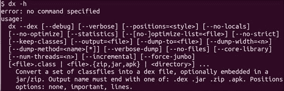

1.  要准备 DEX 文件，你需要执行以下命令：

    ```kt
    [SDK path]/sdk/platform-tools/dx –-dex –-output=Example.dex Example.class

    ```

    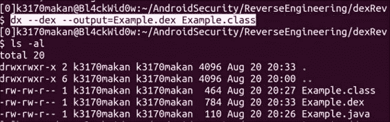

    完成这些后，你应在当前目录中拥有一个名为`Example.dex`的文件；这是`Example.class`的 DEX 版本。

## 工作原理...

在第一步中，我们做了 Java 开发人员每天都会做的事情，描述了 Java 对象；我们的对象名为`Example`。

在第二步中，我们将`Example.java`编译成了类文件。这里发生的情况是，Java 编译器获取我们编写的漂亮的语义代码并将其解析成一系列基于栈的 Java 虚拟机指令。

在第三步中，我们取`CLASS`文件，以及它的 Java 元数据和基于栈的指令，准备了一组资源、数据结构和 Dalvik 虚拟机能理解的基于寄存器的指令集合。以下是使用的`dx`命令的分解说明：

+   `-dex`：这个命令告诉`dx`你想创建一个 DEX 文件

+   `-output=Example.dex`：这个指令让`dx`知道我们希望将输出结果放入名为`Example.dex`的文件中。

+   `Example.class`：这是输入文件，即我们在第二步中编译的`class`文件

# 反编译 DEX 文件

DEX 文件，或称 Dalvik 可执行文件，是 Java 中`CLASS`文件在 Android 平台上的等价物。它们包含了定义 Android 应用程序行为的 Java 代码的编译格式。作为即将成为的 Android 安全专家，你自然会感兴趣了解这些文件是如何工作的以及它们究竟有什么用途。对 DEX 文件进行反编译是许多应用程序进行安全评估的一个重要部分；它们提供了关于 Android 应用程序行为的大量信息，并且常常能揭示从源代码视角无法获得的关于应用程序开发的信息。对 DEX 文件格式有一个良好的理解，并知道如何解释它，可能会导致发现新的漏洞，或者针对 Android 平台和 Dalvik 虚拟机的攻击利用的开发与改进。恶意软件可能很快就会开始利用 DEX 文件解释的方式来隐藏与其行为相关的细节。而只有那些真正了解 DEX 文件如何工作的少数有识之士，才能掌握新的 Android 恶意软件混淆技术，并拥有挫败它们所需的技能。本指南包括对 DEX 文件格式的详细分解，描述了 DEX 文件中每个字段的使用和解释方法。然后，它继续讨论如何将 DEX 文件反编译回易于阅读和逆向工程的 Java 源代码。

## 理解 DEX 文件格式

本指南专门用于分解和描述 DEX 文件每个重要部分。它逐个字段进行讲解，并直接基于用于解释 DEX 文件的 Dalvik 源代码进行分析。

接下来的几段提供了关于 DEX 文件不同部分出现位置的信息，例如在哪里可以找到对可打印字符串的引用，以及每个编译类的实际 DEX 代码的位置。DEX 文件有一个相当简单且易于理解的格式。DEX 文件的结构如下：

```kt
struct DexFile {
/* directly-mapped "opt" header */
  const DexOptHeader* pOptHeader;

/* pointers to directly-mapped structs and arrays in base DEX */
  const DexHeader*    pHeader;
  const DexStringId*  pStringIds;
  const DexTypeId*    pTypeIds;
  const DexFieldId*   pFieldIds;
  const DexMethodId*  pMethodIds;
  const DexProtoId*   pProtoIds;
  const DexClassDef*  pClassDefs;
  const DexLink*      pLinkData;
/*
    * These are mapped out of the "auxiliary" section, and may not be
    * included in the file.
*/
  const DexClassLookup* pClassLookup;
  const void*         pRegisterMapPool;       // RegisterMapClassPool

/* points to start of DEX file data */
  const u1*           baseAddr;

/* track memory overhead for auxiliary structures */
  int                 overhead;

/* additional app-specific data structures associated with the DEX */
  //void*               auxData;
};
```

### 注意

上述代码可以在[`github.com/android/platform_dalvik/blob/master/libdex/DexFile.h`](https://github.com/android/platform_dalvik/blob/master/libdex/DexFile.h)找到。

### DEX 文件头

DEX 文件的第一部分称为 DEX 文件头。以下是根据 Dalvik 虚拟机中的`libdex`对 DEX 文件头的定义：

```kt
struct DexHeader {
  u1  magic[8];           /* includes version number */
  u4  checksum;           /* adler32 checksum */
  u1  signature[kSHA1DigestLen]; /* SHA-1 hash */
  u4  fileSize;           /* length of entire file */
  u4  headerSize;         /* offset to start of next section */
  u4  endianTag;
  u4  linkSize;
  u4  linkOff;
  u4  mapOff;
  u4  stringIdsSize;
  u4  stringIdsOff;
  u4  typeIdsSize;
  u4  typeIdsOff;
  u4  protoIdsSize;
  u4  protoIdsOff;
  u4  fieldIdsSize;
  u4  fieldIdsOff;
  u4  methodIdsSize;
  u4  methodIdsOff;
  u4  classDefsSize;
  u4  classDefsOff;
  u4  dataSize;
  u4  dataOff;
};
```

数据类型`u1`和`u4`只是无符号整数类型的别名。以下是 Dalvik 虚拟机本身的`Common.h`头文件中的类型定义：

```kt
  typedef uint8_t             u1; /*8 byte unsigned integer*/
  typedef uint16_t            u2; /*16 byte unsigned integer*/
  typedef uint32_t            u4; /*32 byte unsigned integer*/
  typedef uint64_t            u8; /*64 byte unsigned integer*/
  typedef int8_t              s1; /*8 byte signed integer*/
  typedef int16_t             s2; /*16 byte signed integer*/
  typedef int32_t             s4; /*32 byte signed integer*/
  typedef int64_t             s8; /*64 byte signed integer*/
```

### 注意

上述代码可以在[`github.com/android/platform_dalvik/blob/master/vm/Common.h`](https://github.com/android/platform_dalvik/blob/master/vm/Common.h)找到。

这样，我们就可以把预备工作做好。你现在对 DEX 文件的外观有了基本的了解，也对每个部分的位置有了一个基本的掌握。接下来的几段将详细解释每个部分的作用以及 Dalvik 虚拟机是如何使用它们的。

首先，DEX 文件中的第一个字段定义如下：

```kt
  u1  magic[8];           /* includes version number */
```

`magic[8]`保存一个“标记”，通常称为魔数，它保存了一组 DEX 文件独有的字符。DEX 文件的魔数是`dex\n035`，或者用十六进制表示，`64 65 78 0a 30 33 35 00`。

下面是`classes.dex`的截图，显示了魔数以十六进制表示：

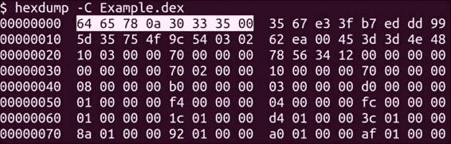

下一个字段定义如下：

```kt
  u4  checksum;           /* adler32 checksum */
```

下面的截图显示了 DEX 文件中 Adler32 校验和的样子：

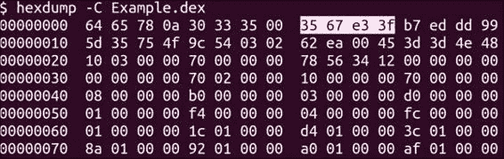

这个 4 字节字段是整个头的校验和。校验和是对组成头的位执行一系列**异或（**XORs**）和加法操作的结果。它被检查以确保`DexHeader`文件内容没有损坏或错误更改。确保这个头没有被破坏非常重要，因为它决定了如何解释 DEX 文件的其他部分，并作为其余解释的路线图。因此，Dalvik 使用`DexHeader`文件来定位 DEX 文件的其他组件。

下一个字段是一个 21 字节的**安全散列算法**（SHA）签名，定义如下：

```kt
  u1  signature[kSHA1DigestLen]; /* SHA-1 hash length = 20*/
```

下面的截图显示了 SHA 摘要如何在 DEX 文件中出现：

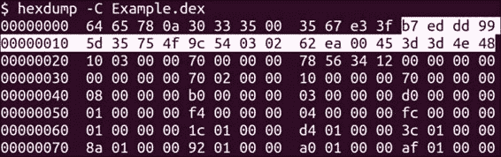

`kSHA1DigestLen`定义为`20`，如果你还没猜到的话。这是因为 SHA1 的块长度被标准化为`20`。根据 Dalvik 代码中的一小段注释，这个摘要用于唯一标识 DEX 文件，并在签名后的 DEX 文件部分计算。计算 SHA 摘要的 DEX 文件部分是指定所有地址偏移和其他大小参数的地方，以及它们所引用的内容。

SHA 摘要字段之后是`fileSize`字段，定义如下：

```kt
  u4  fileSize;/* length of entire file */
```

下面的截图显示了`fileSize`字段在 DEX 文件中的样子：

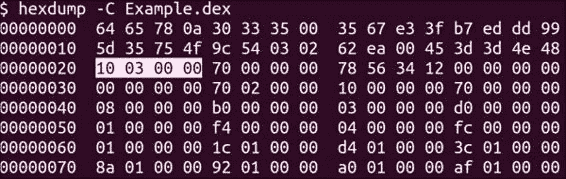

`fileSize`字段是一个 4 字节字段，保存整个 DEX 文件的长度。这个字段用于帮助计算偏移量，轻松定位某些部分。它还帮助唯一标识 DEX 文件，因为它构成了 DEX 文件的一部分，这部分被送入安全散列操作：

```kt
  u4  headerSize;/* offset to start of next section */
```

下面的截图显示了`headerSize`字段在 DEX 文件中的样子：

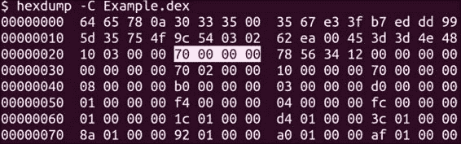

`headerSize`保存整个`DexHeader`结构的大小（以字节为单位），正如注释所提示，它用于帮助计算文件中下一个部分开始的位置。

DEX 文件中的下一个字段是字节序标签，定义如下：

```kt
  u4  endianTag;
```

下面的截图显示了示例`classes.dex`文件的`endianTag`字段：

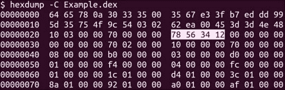

`endianTag`字段保存一个在所有 DEX 文件中相同的静态值。此字段的值`12345678`用于确保文件以正确的“字节序”或位顺序进行解释。一些架构更喜欢将最有效位向左，而另一些则喜欢向右；这称为架构的字节序。此字段通过允许 Dalvik VM 读取值并检查字段中数字出现的顺序，帮助确定架构使用的是哪一个。

接下来的`linkSize`和`linkOff`字段；当多个类文件编译成一个 DEX 文件时使用它们：

```kt
  u4  linkSize;
  u4  linkOff;
```

下一部分是映射部分偏移量，定义如下：

```kt
  u4  mapOff;
```

下一个字段`stringIdsSize`定义如下：

```kt
  u4  stringIdsSize;
```

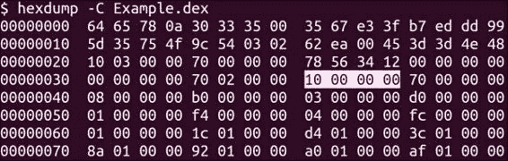

`stringIdsSize`字段保存了`StringIds`部分的大小，其使用方式与其他大小字段相同，有助于计算`StringIds`部分相对于 DEX 文件开头的起始位置。

下一个字段`stringIdsOff`定义如下：

```kt
  u4  stringIdsOff;
```

此字段保存到实际`stringIds`部分的字节偏移量。它帮助 Dalvik 编译器和虚拟机跳转至此部分，而无需进行任何严格计算或反复读取文件以找到`stringIds`部分。在`StringIdsOff`字段之后是类型、原型、方法、类和数据 ID 部分的相同偏移量和大小字段——这些属性具有与`stringIds`和`stringIdsOff`字段完全相同的大小和偏移字段。这些字段的目的与`stringIdsOff`和`stringIdsSize`字段相同，除了它们旨在为访问相关部分提供高效和简单的机制。如前所述，这意味着它将归结为要么多次重新读取文件，要么对相对起始地址进行一些简单的加法和减法。以下是大小和偏移字段定义： 

```kt
  u4  typeIdsSize;
  u4  typeIdsOff;
  u4  protoIdsSize;
  u4  protoIdsOff;
  u4  fieldIdsSize;
  u4  fieldIdsOff;
  u4  methodIdsSize;
  u4  methodIdsOff;
  u4  classDefsSize;
  u4  classDefsOff;
  u4  dataSize;
  u4  dataOff;
```

所有这些大小和偏移字段保存的值都是要解释为，或包含需要形成 DEX 文件内部位置计算的一部分的值。这是它们都具有相同类型定义的主要原因，即无符号 4 字节整数字段。

### StringIds 部分

`StringIds`部分完全由一系列地址组成——相对于 Dalvik 命名法的识别号——相对于 DEX 文件开头的位置，用于查找在`Data`部分定义的实际静态字符串的起始位置。根据 Dalvik VM 中的`libdex`，`StringIds`部分中的字段定义如下：

```kt
struct DexStringId {
  u4 stringDataOff;      /* file offset to string_data_item */
};
```

所有这些定义都表明，每个字符串 ID 只是一个无符号的 4 字节字段，这并不奇怪，因为它们都是像`DexHeader`部分中找到的偏移值。以下是从一个示例`classes.dex`文件中的`StringIds`部分的截图：

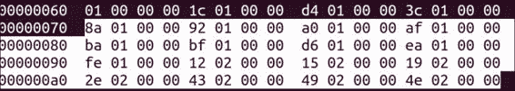

在前面的截图中，突出显示的值是之前提到过的地址，或来自`StringIDs`段的值。如果你取其中一个值，用正确的字节序读取它们，并跳到 DEX 文件中这个值的偏移所在的段，你最终会进入一个看起来像下面截图的段：


如你所见，读取`00 00 01 8a`的样本值，由于文件格式的字节序，实际上指向了 DEX 文件中的字符串。以下截图显示了 DEX 文件中偏移`0x018a`位置的内容：

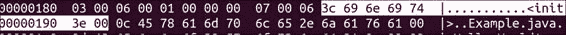

如你所见，位置`0x018a`包含的值`3c 69 6e 69 74 3e 00`实际上是`<init>`的十六进制等价。

这基本上是编译器、反编译器和 Dalvik VM 在查找字符串值时所经历的过程。以下是来自`libdex`的代码提取，它正是这样做的：

```kt
DEX_INLINE const char* dexGetStringData(const DexFile* pDexFile,
  const DexStringId* pStringId) {
    const u1* ptr = pDexFile->baseAddr + pStringId->stringDataOff;

    // Skip the uleb128 length.
    while (*(ptr++) > 0x7f) /* empty */ ;

    return (const char*) ptr;
}
```

### 注意

```kt
 shows how the arguments are parsed and how the file data is used. It is as follows:
```

```kt
void dexFileSetupBasicPointers(DexFile* pDexFile, const u1* data){
    DexHeader *pHeader = (DexHeader*) data;

    pDexFile->baseAddr = data;
    pDexFile->pHeader = pHeader;
    pDexFile->pStringIds = (const DexStringId*) (data + pHeader-      >stringIdsOff);
...some code has been omitted for brevity
}
```

### 注意

前面的代码可以在[`github.com/android/platform_dalvik/blob/master/libdex/DexFile.cpp`](https://github.com/android/platform_dalvik/blob/master/libdex/DexFile.cpp)（第 269-274 行）找到。

通过名为`data`的指针解引用的字符数组是 DEX 文件的实际内容。前面的代码片段应该有效地展示了如何使用`DexHeader`字段找到 DEX 文件中的不同位置；代码中某些部分被突出显示以展示这一点。

### `TypeIds`段

接下来是`TypeIds`段。这个段包含了关于如何找到每种类型的字符串标签的信息。在我们了解这是如何工作的之前，让我们先看看`TypeIds`是如何定义的：

```kt
struct DexTypeId {
  u4  descriptorIdx;      /* index into stringIds list for type descriptor */
};
```

### 注意

前面的代码可以在[`github.com/android/platform_dalvik/blob/master/libdex/DexFile.h`](https://github.com/android/platform_dalvik/blob/master/libdex/DexFile.h)（第 270-272 行）找到。

如注释所述，这个值持有一个 ID，或者更确切地说，是`StringIds`段中某物的索引，这是被描述类型的字符串标签。以下是一个从`TypeIds`段中定义的第一个值——示例值的例子：


像之前一样，这个值被读取为`03`。像之前一样，我们需要考虑文件的字节序，这是`StringIds`段中一个值的索引，具体来说，是`StringIds`段中第四个定义的字符串 ID。如下所示：


第四个定义的值是`0x01af`，它进而对该值在数据段中的偏移进行解引用：


在上一个截图中，我们可以看到值`LExample`，这可能会让人有点困惑，因为我们明确将我们的类定义为`Example`。`L`是什么意思？这个字符串实际上是按照 Dalvik 类型描述语言对类型的描述，这与 Java 的方法、类型和类签名非常相似。实际上，它的工作方式完全一样。关于 Dalvik 的类型、方法和其他描述或签名的完整分解可以在[`source.android.com/devices/tech/dalvik/dex-format.html`](http://source.android.com/devices/tech/dalvik/dex-format.html)找到。在我们的例子中，类名前的`L`值表示`Example`是一个类或对象的描述名称。当 Dalvik 编译器和虚拟机查找和构建类型时，它们遵循相同的基本过程。现在我们理解了这一部分是如何工作的，我们可以继续下一部分，即`ProtoIds`部分。

### ProtoIds 部分

`ProtoIds`部分保存了一组原型 ID，用于描述方法；它们包含有关每个方法的返回类型和参数的信息。以下是你在`libdex`文件中看到的命令：

```kt
struct DexProtoId {
  u4  shortyIdx;          /* index into stringIds for shorty descriptor */
  u4  returnTypeIdx;      /* index into typeIds list for return type */
  u4  parametersOff;      /* file offset to type_list for parameter types */
};
```

结构非常容易理解。名为`shortyIdx`的无符号 4 字节字段保存了一个字符串 ID 的索引，该字符串 ID 在`StringIds`部分中定义，用于给出原型的简短描述；这个描述几乎与 Dalvik 中的类型描述一样工作。如果你还没猜到，`returnTypeIdx`保存了一个索引，该索引解引用了`TypeIds`部分中的一个值。这是返回类型的描述。最后，`parametersOff`保存了方法参数列表的地址偏移量。以下是从`Example.dex`中的`ProtoIds`部分的示例。这是我们示例 DEX 文件中`ProtoIds`部分的样子：

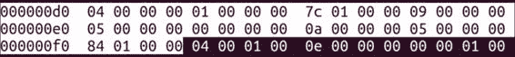

### FieldIds 部分

`FieldIds`部分与其他部分类似，由一组引用`StringIds`和`TypeIds`的字段组成，但专门用于描述类中的字段。以下是来自`libdex`的 DEX 文件`FieldIds`的官方定义：

```kt
struct DexFieldId {
  u2  classIdx;           /* index into typeIds list for defining class */
  u2  typeIdx;            /* index into typeIds for field type */
  u4  nameIdx;            /* index into stringIds for field name */
};
```

### 注意

上述代码可以在[`github.com/android/platform_dalvik/blob/master/libdex/DexFile.h#L277`](https://github.com/android/platform_dalvik/blob/master/libdex/DexFile.h#L277)找到。

我们在这里可以看到三个字段构成了类型的描述，分别是它所属的类（由`classIdx`字段中的类 ID 标识）、字段的类型（如`string`、`int`、`bool`等，详细在`TypeId`中，并通过`typeIdx`变量中保存的值进行解引用），以及类型的名称，即我们之前讨论过的规范中的定义。这个值，与所有字符串值一样，存储在数据部分，并通过`StringIds`部分中存储在`nameIdx`中的值进行解引用。以下是我们`FieldIds`部分的截图：

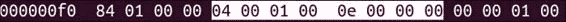

让我们继续下一部分，即`MethodIds`部分。

### 方法 ID 部分

每个方法 ID 的字段定义如下：

```kt
struct DexMethodId {
  u2  classIdx;           /* index into typeIds list for defining class */
  u2  protoIdx;           /* index into protoIds for method prototype */
  u4  nameIdx;            /* index into stringIds for method name */
};
```

### 注意

上述代码可以在[`github.com/android/platform_dalvik/blob/master/libdex/DexFile.h#L286`](https://github.com/android/platform_dalvik/blob/master/libdex/DexFile.h#L286)找到。

方法所属的类通过`classIdx`字段中存储的值来解除引用。这完全与`TypeIds`部分的方式相同。此外，每个方法都有一个原型引用与之关联。这保存在`protoIdx`变量中。最后，`nameIdx`变量存储了对构成方法定义的字符的引用。以下是我们`Example.dex`文件中方法定义的一个示例：

```kt
(Ljava/lang/String;)V
```

理解上述定义的最佳方式是从右向左阅读。分解这个定义，它读作如下：

+   `V`: 这表示 void 类型，即方法的返回类型。

+   `()`: 这表示接下来将指定方法参数的类型规范。

+   `java/lang/String;`: 这是`String`类的标识符。这里，第一个也是唯一的参数是一个字符串。

+   `L`: 这表明紧跟此字符的类型是一个类。

+   `[`: 这表明紧跟此字符的类型是指定类型的数组。

因此，将这些信息综合起来，该方法返回 void，并接受来自`String`类的对象数组。

这是我们的示例中`MethodIds`部分的屏幕截图：

![方法 ID 部分

### 类定义部分

`ClassDefs`部分定义如下：

```kt
struct DexClassDef {
  u4  classIdx;           /* index into typeIds for this class */
  u4  accessFlags;
  u4  superclassIdx;      /* index into typeIds for superclass */
  u4  interfacesOff;      /* file offset to DexTypeList */
  u4  sourceFileIdx;      /* index into stringIds for source file name */
  u4  annotationsOff;     /* file offset to annotations_directory_item */
  u4  classDataOff;       /* file offset to class_data_item */
  u4  staticValuesOff;    /* file offset to DexEncodedArray */
};
```

这些字段相当容易理解，从`classIdx`字段开始，正如注释所暗示的，它在`TypeIds`部分中保存一个索引，表示文件类型。`AccessFlags`字段保存一个数字，表示其他对象如何访问此类，并描述了其某些用途。以下是标志定义的方式：

```kt
enum {
  ACC_PUBLIC       = 0x00000001,       // class, field, method, ic
  ACC_PRIVATE      = 0x00000002,       // field, method, ic
  ACC_PROTECTED    = 0x00000004,       // field, method, ic
  ACC_STATIC       = 0x00000008,       // field, method, ic
  ACC_FINAL        = 0x00000010,       // class, field, method, ic
  ACC_SYNCHRONIZED = 0x00000020,       // method (only allowed on natives)
  ACC_SUPER        = 0x00000020,       // class (not used in Dalvik)
  ACC_VOLATILE     = 0x00000040,       // field
  ACC_BRIDGE       = 0x00000040,       // method (1.5)
  ACC_TRANSIENT    = 0x00000080,       // field
  ACC_VARARGS      = 0x00000080,       // method (1.5)
  ACC_NATIVE       = 0x00000100,       // method
  ACC_INTERFACE    = 0x00000200,       // class, ic
  ACC_ABSTRACT     = 0x00000400,       // class, method, ic
  ACC_STRICT       = 0x00000800,       // method
  ACC_SYNTHETIC    = 0x00001000,       // field, method, ic
  ACC_ANNOTATION   = 0x00002000,       // class, ic (1.5)
  ACC_ENUM         = 0x00004000,       // class, field, ic (1.5)
  ACC_CONSTRUCTOR  = 0x00010000,       // method (Dalvik only)
  ACC_DECLARED_SYNCHRONIZED =
  0x00020000,       // method (Dalvik only)
  ACC_CLASS_MASK =
  (ACC_PUBLIC | ACC_FINAL | ACC_INTERFACE | ACC_ABSTRACT
  | ACC_SYNTHETIC | ACC_ANNOTATION | ACC_ENUM),
  ACC_INNER_CLASS_MASK =
  (ACC_CLASS_MASK | ACC_PRIVATE | ACC_PROTECTED | ACC_STATIC),
  ACC_FIELD_MASK =
  (ACC_PUBLIC | ACC_PRIVATE | ACC_PROTECTED | ACC_STATIC | ACC_FINAL
  | ACC_VOLATILE | ACC_TRANSIENT | ACC_SYNTHETIC | ACC_ENUM),
  ACC_METHOD_MASK =
  (ACC_PUBLIC | ACC_PRIVATE | ACC_PROTECTED | ACC_STATIC | ACC_FINAL
  | ACC_SYNCHRONIZED | ACC_BRIDGE | ACC_VARARGS | ACC_NATIVE
  | ACC_ABSTRACT | ACC_STRICT | ACC_SYNTHETIC | ACC_CONSTRUCTOR
  | ACC_DECLARED_SYNCHRONIZED),
};
```

`superClassIDx`字段还包含一个指向`TypeIds`部分中类型的索引，用于描述超类的类型。`SourceFileIDx`字段指向`StringIds`部分，并允许 Dalvik 查找此类实际源代码的位置。对于`classDef`结构来说，另一个重要的字段是`classdataOff`，它指向 Dalvik 文件内部的一个偏移量，描述了类的更多重要属性，即代码的位置以及代码量。`classDataOff`字段指向包含以下结构的偏移量：

```kt
/* expanded form of class_data_item. Note: If a particular item is
 * absent (e.g., no static fields), then the corresponding pointer
 * is set to NULL. */
struct DexClassData {
  DexClassDataHeader header;
  DexField*          staticFields;
  DexField*          instanceFields;
  DexMethod*         directMethods;
  DexMethod*         virtualMethods;
};
```

`DexClassDataHeader`文件包含有关类的元数据，即静态字段、实例字段、直接方法和虚拟方法的大小。Dalvik 使用这些信息来计算每个方法可以访问的内存大小的重要参数，并且这也是检查字节码所需信息的一部分。这里一个有趣的字段组是`DexMethod`，定义如下：

```kt
struct DexMethod {
  u4 methodIdx;    /* index to a method_id_item */
  u4 accessFlags;
  u4 codeOff;      /* file offset to a code_item */
};
```

这个组包含了指向组成类的实际代码的引用。代码偏移量保存在`codeOff`字段中；`methodId`和`accessFlags`字段也是结构的一部分。

既然我们已经讨论了在普通 DEX 文件中大多数事物是如何结合在一起的，我们可以继续使用一些自动化工具来进行反编译。

## 准备工作

在开始反编译之前，你需要确保已经安装了几种工具，即安卓 SDK。

## 如何操作…

现在你已经理解了 DEX 文件的格式和结构，你可以按照以下步骤使用`dexdump`工具进行反编译。

安卓 SDK 包含一个名为`dexdump`的工具，它位于 SDK 的`sdk/build-tools/android-[version]/dexdump`文件夹下。要反编译 DEX 文件，只需将其作为参数传递给`dexdump`。以下是操作方法：

```kt
[SDK-path]/build-tools/android-[version]/dexdump classes.dex

```

在这里，`[SDK-path]`指的是你的 SDK 路径，而`classes.dex`是你想要解析的 DEX 文件。对于我们之前的示例，你可以执行以下命令来编译我们在之前章节中的 Java 代码文件：

```kt
[SDK-path]/build-tools/android-[version]/dexdump Example.dex

```

我们示例的输出如下所示：

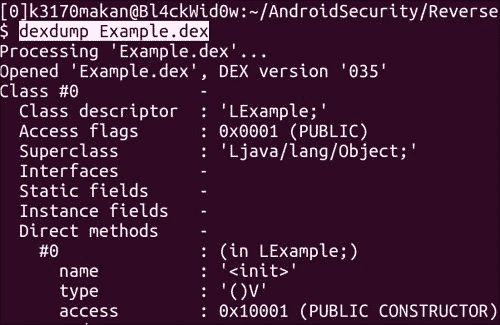

## 还有更多内容...

安卓 SDK 还有一个名为`dx`的工具，能够以更接近 DEX 文件格式的方式分解 DEX 文件。你很快就会明白为什么：

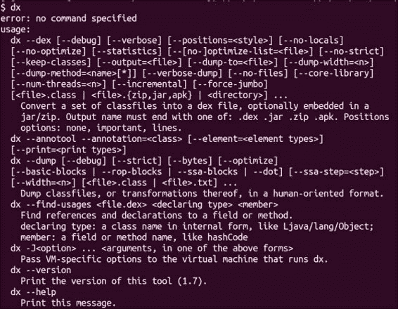

不幸的是，`dx`只针对`CLASS`文件进行操作，通过将它们编译成 DEX 文件然后执行指定操作。因此，如果你有一个想要操作的`CLASS`文件，你可以执行以下命令来查看相应 DEX 文件的内容和语义结构：

```kt
dx –dex –verbose-dump –dump-to=[output-file].txt [input-file].class

```

`dx`可以在 Android SDK 包的`sdk/build-tools/android-[version]/`路径下找到：


对于我们的示例，即`Example.class`，输出将如下所示：

```kt
000000: 6465 780a 3033|magic: "dex\n035\0"
000006: 3500          |
000008: 3567 e33f     |checksum
00000c: b7ed dd99 5d35|signature
000012: 754f 9c54 0302|
000018: 62ea 0045 3d3d|
00001e: 4e48          |
000020: 1003 0000     |file_size:       00000310
000024: 7000 0000     |header_size:     00000070
000028: 7856 3412     |endian_tag:      12345678
00002c: 0000 0000     |link_size:       0
000030: 0000 0000     |link_off:        0
000034: 7002 0000     |map_off:         00000270
000038: 1000 0000     |string_ids_size: 00000010
00003c: 7000 0000     |string_ids_off:  00000070
000040: 0800 0000     |type_ids_size:   00000008
000044: b000 0000     |type_ids_off:    000000b0
000048: 0300 0000     |proto_ids_size:  00000003
00004c: d000 0000     |proto_ids_off:   000000d0
000050: 0100 0000     |field_ids_size:  00000001
000054: f400 0000     |field_ids_off:   000000f4
000058: 0400 0000     |method_ids_size: 00000004
00005c: fc00 0000     |method_ids_off:  000000fc
000060: 0100 0000     |class_defs_size: 00000001
000064: 1c01 0000     |class_defs_off:  0000011c
000068: d401 0000     |data_size:       000001d4
00006c: 3c01 0000     |data_off:        0000013c
                      |
                      |
```

输出左侧的列以十六进制详细列出了文件偏移量及其内容。右侧的列则包含了语义值以及每个偏移量和值的解释。

请注意，为了简洁起见，部分输出已被省略；只包含了包含`DexHeader`文件在内的部分。

## 另请参阅

+   *DEX 文件格式 - RetroDev*网页：[`www.retrodev.com/android/dexformat.html`](http://www.retrodev.com/android/dexformat.html)

+   访问 [*Smali Decompiler – Google Code* 网页](https://code.google.com/p/smali/)

+   *Godfrey Nolan* 编著的《*Decompiling Android*》，Apress 出版

+   阅读 [*Practicing Safe Dex* 文档](http://www.strazzere.com/papers/DexEducation-PracticingSafeDex.pdf)

+   访问 [Android Dalvik 内核源代码仓库网页](https://github.com/android/platform_dalvik/tree/master/libdex)

+   阅读 [*Dalvik 可执行格式 – Android 开放源代码项目* 文档](http://source.android.com/devices/tech/dalvik/dex-format.html)

# 解释 Dalvik 字节码

你可能已经了解到，Dalvik VM 在结构和操作上与 Java VM 略有不同；其文件和指令格式也有所区别。Java VM 是基于栈的，这意味着字节码（之所以这样命名，是因为每条指令都是一个字节长）通过在栈上推入和弹出指令来工作。Dalvik 字节码被设计成类似于 x86 指令集；它还使用了一种类似 C 语言风格的调用约定。你很快就会看到每种调用方法是如何在调用另一个方法之前负责设置参数的。有关 Dalvik 代码格式的设计和一般注意事项的更多详细信息，请参阅*另请参阅*部分中名为 *General Design—Bytecode for the Dalvik VM, Android Open Source project* 的条目。

解释字节码意味着实际上能够理解指令格式是如何工作的。这一节旨在为你提供理解 Dalvik 字节码所需的参考和工具。让我们深入研究字节码格式，了解其工作原理以及所有这些都意味着什么。

## 理解 Dalvik 字节码

在深入字节码的具体内容之前，了解一些背景知识是很重要的。我们需要了解字节码是如何执行的。这将帮助你理解 Dalvik 字节码的属性，并确定在给定执行上下文中，了解一个字节码是什么与它意味着什么之间的区别，这是一项非常有价值的技能。

Dalvik 虚拟机逐个执行方法，必要时在方法间进行分支跳转，例如当一个方法调用另一个方法时。每个方法可以被视为 Dalvik VM 执行的独立实例。每个方法都有一个私有的内存空间，称为**栈帧**，它包含足够的空间以容纳执行该方法所需的数据。每个栈帧还包含对 DEX 文件的引用；自然地，方法需要这个引用以便引用 TypeIds 和对象定义。它还持有一个程序计数器实例的引用，这是一个控制执行流程的寄存器，可用于跳转到其他执行流程。例如，在执行 "if" 语句时，根据比较结果，方法可能需要在不同的代码部分之间跳转。栈帧还包含称为**寄存器**的区域，这些寄存器用于执行诸如加、乘、移动值等操作，有时这也意味着将参数传递给其他方法，如对象构造函数。

字节码由一系列操作符和操作数组成，每个操作符对其提供的操作数执行特定操作。一些操作符还概括了复杂的操作，如调用方法。这些操作符的简单和原子性是它们如此健壮、易于阅读和理解，并支持像 Java 这样复杂的高级语言的原因。

关于 Dalvik 需要注意的一个重要事项，与所有中间代码表示一样，是 Dalvik 字节码的操作数的顺序。对于相关操作，操作的目标总是出现在源操作数之前。例如，以下操作的顺序：

```kt
move vA,vB
```

这意味着寄存器 B 的内容将被放置在寄存器 A 中。这种顺序的流行术语是"目标-然后-源"；这意味着操作结果的 目标首先出现，然后是指定源的 操作数。

操作数可以是寄存器，每个方法（独立执行的实例）都有一组寄存器。操作数还可以是字面值（指定大小的有符号/无符号整数）或给定类型的实例。对于如字符串这样的非原始类型，字节码会引用在 `TypeIds` 部分定义的类型。

有多种指令格式决定了给定操作码可以使用多少寄存器和类型实例作为参数。你可以在[`source.android.com/devices/tech/dalvik/instruction-formats.html`](http://source.android.com/devices/tech/dalvik/instruction-formats.html)找到这些详细信息。阅读这些定义是非常值得的，因为 Dalvik 指令集中的每个操作码及其详细信息仅是操作码格式的一种实现。尝试理解格式 ID，因为它们在阅读指令格式时非常有用。

在了解了基础知识之后，相信你已经至少浏览了操作码和操作码格式，我们可以继续以使字节码具有语义性的方式来转储它。

## 准备工作

在开始之前，你需要一个名为 baksmali 的 Smali 反编译器。为了方便起见，我们将介绍如何设置你的路径变量，以便你可以从计算机的任何位置使用 baksmali 脚本和 JAR 文件，而无需每次都明确引用它。以下是设置方法：

1.  在[`code.google.com/p/smali/downloads/list`](https://code.google.com/p/smali/downloads/list)，或新仓库[`bitbucket.org/JesusFreke/smali/download`](https://bitbucket.org/JesusFreke/smali/download)获取 baksmali JAR 文件的副本。特别寻找`baksmali[version].jar`文件——其中`[version]`是最新可用的版本。

1.  将其保存在一个方便命名的目录中，因为需要下载的两个文件在同一个目录中会让事情简单得多。

1.  下载 baksmali 包装脚本；它允许你避免每次需要运行 baksmali JAR 时都显式调用`java –jar`命令。你可以在[`code.google.com/p/smali/downloads/list`](https://code.google.com/p/smali/downloads/list)或新仓库[`bitbucket.org/JesusFreke/smali/downloads`](https://bitbucket.org/JesusFreke/smali/downloads)获取该脚本的副本。将其保存在与 baksmali JAR 文件相同的目录下。此步骤不适用于 Windows 用户，因为这是一个 bash 脚本文件。

1.  将 baksmali jar 文件的名称更改为`baksmali.jar`，省略版本号，以便你在步骤 2 中下载的包装脚本能够找到它。你可以在 Linux 或 Unix 机器上使用以下命令来更改名称：

    ```kt
    mv baksmali-[version-number].jar baksmali.jar

    ```

    你也可以使用你的操作系统使用的任何窗口管理器；只要将名称更改为`baksmali.jar`，你就是正确操作的！

1.  然后，你需要确保 baksmali 脚本可执行。如果你使用的是 Unix 或 Linux 操作系统，可以通过以下命令来设置：

    ```kt
    chmod +x 700 baksmali

    ```

1.  将当前文件夹添加到你的默认`PATH`变量中。

    完成这些后，你可以反编译 DEX 文件了！查看下一节了解如何操作。

## 如何操作...

现在，你已经下载并设置好了 baksmali，想要将一些 DEX 文件反编译成语义丰富的 smali 语法；以下是操作方法。

从你的终端或命令提示符执行以下命令：

```kt
baksmali [Dex filename].dex

```

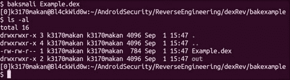

这个命令将输出 DEX 文件的内容，就像是一个被解压的 JAR 文件，但所有的源文件都是`.smali`文件，包含了一种名为 smali 的语义 Dalvik 字节码的轻微翻译或方言：

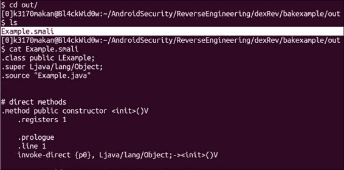

让我们看一下由 baksmali 生成的 smali 文件，并了解每条字节码指令的含义。代码如下：

```kt
.class public LExample;
.super Ljava/lang/Object;
.source "Example.java"

# direct methods
.method public constructor <init>()V
    .registers 1

    .prologue
    .line 1
    invoke-direct {p0}, Ljava/lang/Object;-><init>()V

    return-void
.end method

.method public static main([Ljava/lang/String;)V
    .registers 4

    .prologue
    .line 3
    sget-object v0, Ljava/lang/System;->out:Ljava/io/PrintStream;

    const-string v1, "Hello World!\n"

    const/4 v2, 0x0

    new-array v2, v2, [Ljava/lang/Object;

    invoke-virtual {v0, v1, v2}, Ljava/io/PrintStream;->printf(Ljava/lang/String;[Ljava/lang/Object;)Ljava/io/PrintStream;

    .line 4
    return-void
.end method
```

请注意，由于 baksmali、Android 的 Dalvik 虚拟机以及 Java 语言在持续改进，你可能会看到与之前代码示例略有不同的结果。如果你遇到了这种情况，不要慌张；之前的示例代码仅用于供你学习参考。你仍然可以将本章的信息应用到 baksmali 生成的代码中，其前几行如下所示：

```kt
.class public LExample;
.super Ljava/lang/Object;
.source "Example.java"
```

这些只是关于实际被反编译的类的元数据；它们提到了类名、源文件和超类（这个方法继承的类）。你可能从`Example.java`的代码中注意到，我们从未显式地从另一个类继承，尽管在反编译时，`Example.java`似乎有一个父类：这是如何可能的？因为所有 Java 类都隐式地从`java.lang.Object`继承。

接下来，下一组行更有趣。它们是`Example.java`构造函数的 smali 代码：

```kt
# direct methods
.method public constructor <init>()V
    .registers 1

    .prologue
    .line 1
    invoke-direct {p0}, Ljava/lang/Object;-><init>()V

    return-void
.end method
```

第一行，`.method public constructor <init>()V`，是接下来要声明的方法。它表示名为`init`的方法返回 void 类型，并且具有 public 访问标志。

接下来包含代码的那一行，即：

```kt
.registers 1
```

这表示该方法只使用了一个寄存器。方法在运行前会知道需要多少个寄存器。我稍后会提到它需要的那个寄存器。接下来是一行看起来像以下代码的行：

```kt
.prologue
```

这声明了接下来的方法是`prologue`，这是每个 Java 方法都有的。它确保调用继承形式的方法（如果有）。这解释了为什么下一行，包含以下代码，似乎调用了另一个名为`init`的方法：

```kt
invoke-direct {p0}, Ljava/lang/Object;-><init>()V
```

但这次它从`java.lang.Object`类中取消引用。这里的`invoke-direct`方法接受两个参数：`p0`寄存器和需要调用的方法的引用。这由`Ljava/lang/Object;-><init>()V`标签指示。`invoke-direct`操作码的描述如下：

"`invoke-direct`用于调用一个非静态的直接方法（一个本质上不可覆盖的实例方法，要么是一个`private`实例方法，要么是一个构造函数）。"

### 注意

有关摘录可以在 [`source.android.com/devices/tech/dalvik/dalvik-bytecode.html`](http://source.android.com/devices/tech/dalvik/dalvik-bytecode.html) 找到。

因此总结一下，它所做的就是调用 `java.lang.Object` 类的构造函数，这是一个非静态直接方法。

让我们继续看 smali 代码的下一行：

```kt
return-void
```

它所做的正如它看起来那样，即返回一个 `void` 类型并退出当前方法，将执行流程返回到调用它的方法。

根据官方网站的定义，这个操作码是“从一个 void 方法返回”。

这并没有什么复杂的。接下来以句点（"."）开头的行，像其他行一样，是一段元数据，或者是由 smali 反编译器添加的脚注，以帮助添加关于代码的一些语义信息。`.end` 方法行标记了此方法的结束。

主方法的代码如下。在这里，你会看到一些将反复出现的代码形式，即当参数传递给方法时以及调用它们时生成的代码。由于 Java 是面向对象的，当你调用另一个对象的方法时，你做的很多事情就是传递参数和从一种对象类型转换为另一种。因此，一个好主意是学习如何通过将执行这些操作的 Java 代码反编译为 smali 代码来识别这种情况。主方法的代码如下：

```kt
.method public static main([Ljava/lang/String;)V
    .registers 4

    .prologue
    .line 3
    sget-object v0, Ljava/lang/System;->out:Ljava/io/PrintStream;

    const-string v1, "Hello World!\n"

    const/4 v2, 0x0

    new-array v2, v2, [Ljava/lang/Object;

    invoke-virtual {v0, v1, v2}, Ljava/io/PrintStream;->printf(Ljava/lang/String;[Ljava/lang/Object;)Ljava/io/PrintStream;

    .line 4
    return-void
.end method
```

根据第一行 `.method public static main([Ljava/lang/String;)V`，该方法接受 `java.lang.String` 类型的数组并返回 void，如下所示：

```kt
([Ljava/lang/String;)V
```

接下来看方法名称，它还指出主方法是静态的，并且具有 public 访问标志。

在方法头之后，我们看到以下代码片段，它表明正在形成 `sget-object` 操作：

```kt
sget-object v0, Ljava/lang/System;->out:Ljava/io/PrintStream;
```

根据官方网站的描述，这个操作码是“使用指定的静态字段执行标识的对象静态字段操作，在值寄存器中进行加载或存储”。

根据官方文档，`sget-object` 操作接受两个参数：

+   Dalvik 将使用一个寄存器来存储操作结果

+   用于存储在所述寄存器中的对象引用

这实际上是在获取一个对象实例并将其存储在寄存器中。在这里，这个寄存器是第一个名为 `v0` 的寄存器。下一行如下所示：

```kt
const-string v1, "Hello World!\n"
```

之前的代码展示了 `const-string` 指令的作用。它的作用是获取一个字符串并将其保存在由第一个参数指示的寄存器中。这个寄存器是主方法框架中的第二个寄存器，名为 `v1`。根据官方网站，`const-string` 操作码的定义是“将指定索引的字符串引用移动到指定寄存器中”。

如果这里不明显，那么正在获取的字符串是 "Hello World\n"。

接下来，下一行也是`const`操作码家族的一部分，在这里被用来将`0`值移入名为`v2`的第三个寄存器：

```kt
const/4 v2, 0x0
```

这看起来可能有些随意，但下一行你会明白为什么它需要在`v2`寄存器中有一个`0`值。下一行的代码如下：

```kt
new-array v2, v2, [Ljava/lang/Object;
```

新数组的操作是构建一个给定类型和大小的数组，并将其保存在最左边的第一个寄存器中。在这里这个寄存器是`v2`，所以执行完这个操作码后，`v2`将保存一个类型为`java.lang.Object`且大小为`0`的数组；这是操作码第二个参数中`v2`寄存器的值。这也使得在执行此操作码之前将`0`值移入`v2`的操作变得清晰。根据官方网站的定义，这个操作码是“构建一个指定类型和大小的新的数组。类型必须是数组类型。”

下一行包含一个非常常见的操作码；确保你了解这个操作码家族的工作原理，因为你将会经常看到它。继续，下一行如下：

```kt
invoke-virtual {v0, v1, v2}, Ljava/io/PrintStream;->printf(Ljava/lang/String;[Ljava/lang/Object;)Ljava/io/PrintStream;
```

根据官方网站的定义，`invoke-virtual`操作码是“用于调用一个普通的虚拟方法（一个不是`private`、`static`或`final`的方法，也不是构造函数）。”

`invoke-virtual`方法的参数如下工作：

```kt
invoke-kind {vC, vD, vE, vF, vG}, meth@BBBB
```

其中`vC`、`vD`、`vE`、`vF`和`vG`是用于传递参数给被调用方法的参数寄存器，由最后一个参数`meth@BBBB`进行解引用。这意味着它接受一个 16 位的 方法引用，因为每个`B`字段表示一个 4 位的字段。总之，这个操作码在我们的`Example.smali`代码中所做的是调用一个名为`java.io.PrintStream.printf`的方法，该方法接受一个类型为`java.lang.Object`的数组和一个`java.lang.String`对象，并返回一个类型为`java.io.PrintStream`的对象。

就这样！你刚刚解读了一些 smali 代码。要习惯阅读 smali 代码需要一些练习。如果你想了解更多，请查看*另请参阅*部分中的参考资料。

## 另请参阅

+   *通用设计——Dalvik VM 的字节码*，请访问[Android 开源项目](http://source.android.com/devices/tech/dalvik/dalvik-bytecode.html)

+   *介绍与概览——Dalvik 指令格式*，请访问[Android 开源项目](http://source.android.com/devices/tech/dalvik/instruction-formats.html)

+   *Dalvik 虚拟机及 Class Path 库分析*文档，请访问[这里](http://imsciences.edu.pk/serg/wp-content/uploads/2009/07/Analysis-of-Dalvik-VM.pdf)

# 将 DEX 反编译为 Java

我们知道，DEX 代码是从 Java 编译而来的，Java 是一种相当语义化、易于阅读的语言，现在肯定有人想知道是否有可能将 DEX 代码反编译回 Java？好消息是，这是可能的，当然，这取决于你使用的反编译器的质量和 DEX 代码的复杂性。这是因为除非你真正理解 DEX 代码是如何工作的，否则你将始终受制于你的 DEX 反编译器。有很多方法可以干扰流行的反编译器，比如反射和非标准的 DEX 操作码变体，所以如果你希望这个方法意味着即使你不能阅读 DEX 代码，你也可以称自己为 Android 逆向工程师，那么你就错了！

话说回来，大多数 Android 应用中的 DEX 代码都是相当标准的，我们即将使用的反编译器可以处理一般的 DEX 文件。

## 准备工作

在开始之前，你需要从互联网上获取一些工具。

+   **Dex2Jar**：这是一个从 APK 文件中提取 DEX 文件并输出包含相应类文件的 JAR 的工具；你可以在[`code.google.com/p/dex2jar/`](http://code.google.com/p/dex2jar/)获取它。访问这个 URL 并下载适合你操作系统的版本。

+   **JD-GUI**：这是一个 Java 类文件反编译器，你可以在[`jd.benow.ca/`](http://jd.benow.ca/)获取它。它支持 Linux、Mac 和 Windows 系统。

## 如何操作...

要将一个 DEX 文件样例反编译成 Java 代码，你需要执行以下步骤：

1.  假设我们从 APK 或 DEX 文件开始。在这种情况下，你需要先将 DEX 文件转换为 Java 的`CLASS`文件。以下是使用`Dex2jar`进行转换的方法：

    ```kt
    dex2jar [Dex file].dex

    ```

    对于我们的示例，你会执行以下语句：

    ```kt
    dex2jar Example.dex

    ```

    输出应该看起来像以下截图：

    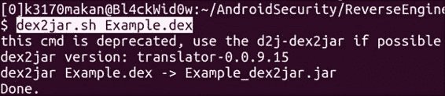

    如果你正确执行了这些步骤，你应在工作目录或当前目录中拥有一个名为`Example_dex2jar.jar`的文件：

    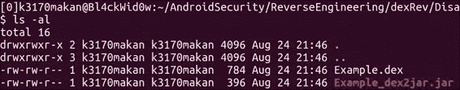

1.  所以现在我们已经有了我们的类文件，我们需要将它们转换回 Java 代码。`JD-GUI`是我们将用来解决问题的工具。要启动`JD-GUI`，你只需要执行`JD-GUI`工具附带的`JD-GUI`可执行文件。以下是 Linux 上的操作方法；从你的终端执行以下命令：

    ```kt
    jd-gui

    ```

    它应该会生成一个看起来像以下截图的窗口：

    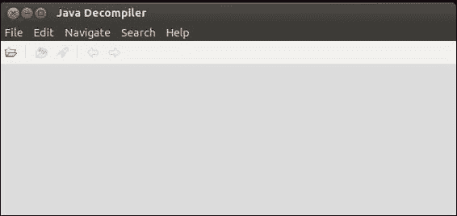

1.  当这个窗口出现时，你可以通过点击文件夹图标来打开一个类文件；接下来应该会出现以下文件选择对话框：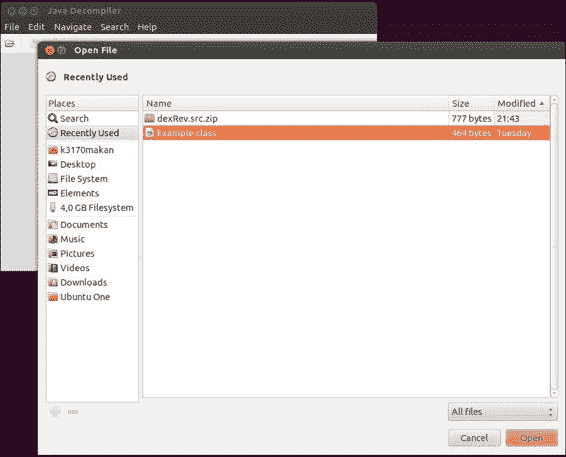

    一旦这个对话框打开，你应该导航到包含我们从`Example.dex`文件解析出的`Example.class`文件的路径。如果你能找到它，`JD-GUI`将如下显示代码：

    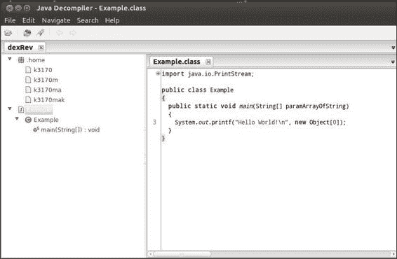

1.  你可以使用`JD-GUI`保存源文件；你需要做的就是在工具栏上点击**文件**菜单，选择**保存所有源文件**，然后提供一个目录来保存它：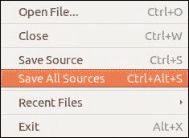

# 反编译应用程序的原生库

反编译 Android 原生库相当简单；毕竟，它们只是从 ARM 平台编译的 C/C++目标文件和二进制文件。因此，反编译它们只需找到一个像 Linux 中“非常流行”的`objdump`这样的反编译器，它可以处理 ARM 二进制文件，而正如我们所发现的，Android NDK 已经为我们解决了这个问题。

在深入了解这个过程之前，你需要确保你有正确的工具。

## 准备工作

为这个食谱做准备只需确保你有 Android NDK 包的最新副本；你可以在[这里](http://developer.android.com/tools/sdk/ndk/index.html)获取一份副本。

## 如何操作...

反编译原生库只需调用 Android NDK 工具链提供的工具之一，即`objdump`；它已经预编译，包含了允许`objdump`解释特定于 ARM 二进制文件的字节序和代码结构的所有插件。

要反编译一个 Android 原生库，你需要从终端或命令提示符执行以下命令：

```kt
arm-linux-androideabi-objdump –D [native library].so

```

这是一个示例：

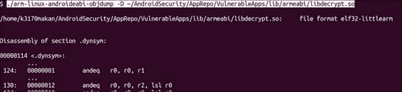

其中`arm-linux-androideabi-objdump`位于 Android NDK 的`toolchains/arm-linux-androideabi-[version]/prebuilt/[arch]/bin/`文件夹下，其中`[arch]`是与你的机器相关的架构或构建版本。在这个例子中，我使用的是 Linux x86_64 机器。

要利用`objdump`输出的信息，你需要了解 ARM 平台的操作码格式和指令，以及一些关于 ELF 格式的内容。我在*另请参阅*部分提供了一些好的参考资料，包括一个名为 Sieve 的 Android 应用程序的链接，该程序用于演示本食谱中使用的某些命令。

## 另请参阅

+   请查看[ARM 架构的 ELF 文档](http://infocenter.arm.com/help/topic/com.arm.doc.ihi0044e/IHI0044E_aaelf.pdf)

+   请查看[ARM7TDMI 技术参考手册](http://www.atmel.com/Images/DDI0029G_7TDMI_R3_trm.pdf)

+   请访问[ARM 处理器架构网页](http://www.arm.com/products/processors/instruction-set-architectures/index.php)

+   请查阅[工具接口标准（TIS）可执行文件和链接格式（ELF）规范版本 1.2](http://refspecs.linuxbase.org/elf/elf.pdf)

+   *Sieve* – 一个密码管理应用，展示了某些常见的 Android 漏洞，可在[`www.mwrinfosecurity.com/system/assets/380/original/sieve.apk`](https://www.mwrinfosecurity.com/system/assets/380/original/sieve.apk)找到

# 使用 GDB 服务器调试 Android 进程

大多数内存破坏、缓冲区溢出和恶意软件分析的专家每天都会使用类似 GDB 的工具进行调试。无论你关注哪个平台，检查内存和执行应用程序进程的动态分析都是任何逆向工程师的基本工作；这当然也包括 Android。以下方法将向你展示如何使用 GDB 调试在 Android 设备上运行的过程。

## 准备就绪

为了完成这个方法，你需要准备以下内容：

+   在[`developer.android.com/tools/sdk/ndk/index.html`](http://developer.android.com/tools/sdk/ndk/index.html)可获取的 Android NDK 软件包

+   Android SDK 软件包

## 如何操作...

要使用`gdbserver`调试实时 Android 进程，你需要执行以下步骤：

1.  第一步是确保你有一个已经 root 的 Android 设备或者一个正在运行的模拟器。这里我不打算详细说明设置模拟器的过程，但如果你对让一个模拟的 Android 设备运行起来的细节不清晰，请参考第二章中的*检查应用程序证书和签名*的方法，*参与应用程序安全*。如果你已经知道如何创建一个模拟的 Android 设备，你可以使用以下命令启动它：

    ```kt
    [SDK-path]/sdk/tools/emulator –no-boot-anim –memory 128 –partition-size 512

    ```

    

1.  一旦模拟器或目标设备启动并运行，你应该使用 ADB shell 访问设备。你可以通过执行以下命令来实现：

    ```kt
    abd shell

    ```

    你还需要确保你有 root 权限。模拟器默认授予 root 权限，不过，如果你在实机上这样做，可能需要首先执行`su`替代用户命令。

1.  然后，你需要将系统目录挂载为可读写，这样我们就可以将`gdbserver`的副本放入其中。以下是在 adb shell 中重新挂载目录的方法，执行以下命令：

    ```kt
    mount

    ```

    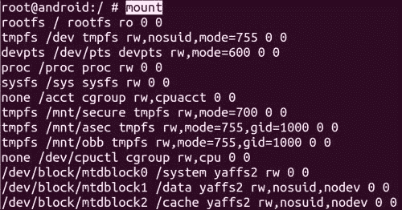

    这应该会输出一些关于每个块设备挂载位置的信息；我们关心的是`/system`目录。记下提及`/system`的行中打印的`/dev/`路径。在之前的示例中，名为`/dev/block/mtdblock0`的设备被挂载在`/system`上。

1.  使用以下命令重新挂载目录：

    ```kt
    mount –o rw,remount [device] /system

    ```

    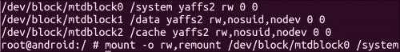

1.  现在你已经准备好将`gdbserver`的副本放入设备中。以下是在非 Android 机器上执行此操作的方法：

    ```kt
    adb push [NDK-path]/prebuilt/android-arm/gdbserver/gdbserver /system/bin

    ```

    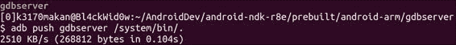

1.  一旦`gdbserver`在目标设备上，你可以通过将其附加到一个运行中的进程来启动它；但在你这样做之前，你需要获取一个示例**进程 ID**（**PID**）。你可以通过在目标设备上以下列方式启动`ps`命令来做到这一点：

    ```kt
    ps

    ```

    `ps`命令将列出当前运行进程的信息摘要；我们对其中一个当前运行进程的 PID 感兴趣。以下是我们正在运行的模拟器中`ps`命令输出的一个例子：

    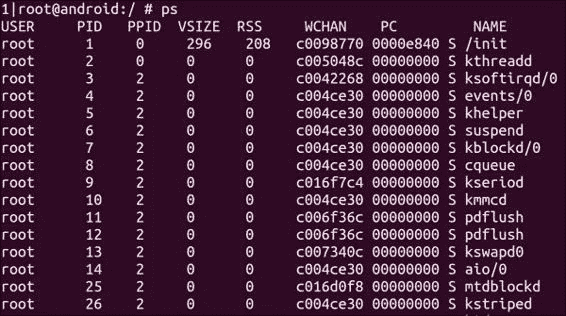

    在前面的截图中，你可以看到第二列标题为`PID`；这是你要查找的信息。这里用作例子的日历，其 PID 为`766`：

    

1.  拿到一个有效的 PID 后，你可以通过执行以下命令使用`gdbserver`连接到它：

    ```kt
    gdbserver :[tcp-port number] –-attach [PID]

    ```

    其中`[tcp 端口号码]`是你希望允许连接的 TCP 端口号，PID 当然是你在上一步获取的 PID 号码。如果操作正确，`gdbserver`应该会产生以下输出：

    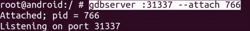

1.  一旦`gdbserver`启动并运行，你需要确保你将从目标 Android 设备转发 TCP 端口号，这样你就可以从你的机器连接到它。你可以通过执行以下命令来完成这个操作：

    ```kt
    adb forward tcp:[device port-number] tcp:[local port-number]

    ```

    这是`adb`端口转发的例子：

    

1.  然后，你应该在 Linux 机器上启动预构建的`gdb`，它位于路径`android-ndk-r8e/toolchains/arm-linux-androideabi-[version]/prebuilt/linux-x86_64/bin/`下。你可以在上述 NDK 路径内运行以下命令来启动它：

    ```kt
    arm-linux-androideabi-gdb

    ```

    这是它启动方式的截图：

    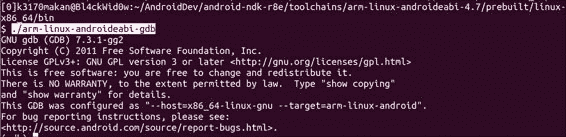

1.  一旦`gdb`启动并运行，你应该尝试通过在`gdb`命令提示符下发出以下命令，将其连接到运行目标设备的`gdb`实例：

    ```kt
    target remote :[PID]

    ```

    其中`[PID]`是你在第 8 步使用`adb`转发的本地 TCP 端口号。以下是这个操作的截图：

    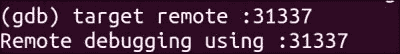

    就这样！你已经可以与运行在 Android 设备上的进程的内存段和寄存器进行交互了！
