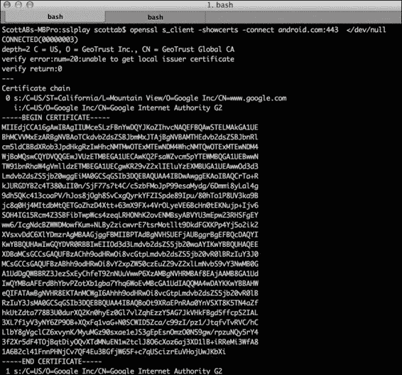

# 第七章：安全网络

在本章中，我们将涵盖以下内容：

+   验证自签名 SSL 证书

+   使用 OnionKit 库中的 StrongTrustManager

+   SSL 固定证书验证

# 引言

**安全套接层**（**SSL**）是客户端和服务器之间加密通信的核心部分之一。其主要部署是用在网页浏览器上，以加密消息并确保与第三方服务在进行在线交易（如购买 DVD 或网上银行）时的信任级别。与网页浏览器不同，安卓应用左上角没有挂锁图标，无法提供视觉提示表明连接是安全的。不幸的是，已经有应用开发者跳过了这一验证的情况。这一点在论文《为什么 Eve 和 Mallory 喜欢安卓：安卓 SSL（不）安全性分析》([`www2.dcsec.uni-hannover.de/files/android/p50-fahl.pdf`](http://www2.dcsec.uni-hannover.de/files/android/p50-fahl.pdf))中被强调。

在本章中，我们将探讨在安卓上使用 SSL 的一些常见陷阱，特别是与自签名证书相关的问题。主要焦点是如何使 SSL 更强大，以帮助防御前一章提到的某些漏洞。毕竟，安卓应用实际上是胖客户端。因此，为什么不利用与网页浏览器相比的额外能力，执行额外的验证，并对我们信任的证书和证书根施加限制。

尽管这超出了本书的范围，但网络服务器的配置对有效的网络安全是一个重要因素。应用程序能做得很少的常见攻击方式包括 SSL 剥离、会话劫持和跨站请求伪造。然而，这些风险可以通过健壮的服务器配置来缓解。为了帮助这一点，SSL 实验室最近发布了一份最佳实践文档，可在[`www.ssllabs.com/downloads/SSL_TLS_Deployment_Best_Practices_1.3.pdf`](https://www.ssllabs.com/downloads/SSL_TLS_Deployment_Best_Practices_1.3.pdf)获取。

# 验证自签名 SSL 证书

安卓支持使用 SSL 与标准的安卓 API 组件，如`HTTPClient`和`URLConnection`。但是，如果你尝试连接到一个安全的 HTTPS 服务器 URL，可能会遇到`SSLHandshakeException`。常见的问题包括：

+   颁发服务器 SSL 证书的证书机构（CA）没有包括在安卓系统中包含的约 130 个 CA 中，因此被视为未知

+   服务器 SSL 证书是自签名的

+   服务器没有配置中间 SSL 证书

如果服务器没有配置中间证书，只需安装它们，允许连接代码验证信任的根。然而，如果服务器使用自签名证书或由 CA 颁发的证书，但该 CA 不被安卓信任，我们需要自定义 SSL 验证。

通常的做法是与拥有自签名 SSL 证书的服务器进行开发和测试，只在生产环境中使用付费的 CA 签名证书。因此，本指南特别关注于健壮地验证自签名 SSL 证书。

## 准备工作

对于本指南，我们将导入自签名的 SSL 证书到应用中，为此，我们将运行一些终端命令。这一部分将介绍在你的机器上下载 SSL 证书文件的工具和命令。

在本指南后面的部分，我们需要用到最新版本的 Bouncy Castle 库来创建和导入证书到信任库中。我们选择 Bouncy Castle，因为这是一个健壮的开源密码学库，Android 有内置支持。你可以在[`www.bouncycastle.org/latest_releases.html`](http://www.bouncycastle.org/latest_releases.html)找到`bcprov.jar`文件。下载并保存到当前工作目录。对于这个指南，我们将其保存到了一个名为`libs`的本地目录，所以引用`.jar`文件的路径是`/libs/bcprov-jdk15on-149.jar`（这是本书编写时的最新版本）。

我们需要从服务器获取一个自签名的 SSL 证书文件；如果你是手动创建的或已经有了，可以跳过这一部分，继续指南的后续内容。

要创建或下载 SSL 证书，我们需要利用一个名为**OpenSSL**的开源 SSL 工具包：

+   **Mac** – 幸运的是，从 Mac OS X 10.2 版本开始，OpenSSL 就已经包含在内。

+   **Linux** – 许多 Linux 发行版预装了编译好的 OpenSSL 软件包。如果没有，可以从[`www.openssl.org/source/`](https://www.openssl.org/source/)下载并构建源代码，或者在 Ubuntu 上，应该执行`apt-get install openssl`。

+   **Windows** – 从源代码构建或使用 Shining Light Productions 提供的第三方 Win32 安装程序（[`slproweb.com/products/Win32OpenSSL.html`](http://slproweb.com/products/Win32OpenSSL.html)）。

在终端窗口中，输入以下命令从服务器获取证书，其中`server.domain`可以是 IP 地址或服务器名称：

```kt
Openssl s_client -showcerts -connect server.domain:443 </dev/null.
```

证书详情将在控制台输出中显示。复制并粘贴以`-----BEGIN CERTIFICATE-----`开始，以`-----END CERTIFICATE-----`结束的证书定义，到一个新文件中，并将其保存为`mycert.crt`。重要的是不要包含任何额外的空白或尾随空格。

下面的屏幕截图展示了`android.com`的`Openssl –showcerts`命令示例：



如果你还没有服务器，并且想要创建一个新的自签名证书来使用，我们首先需要使用 OpenSSL 工具包生成一个私有的 RSA 密钥。在终端窗口中输入以下内容：

```kt
openssl genrsa –out my_private_key.pem 2048

```

这将创建私钥文件`my_private_key.pem`。下一步是使用上一步生成的私钥生成证书文件。在终端中，输入：

```kt
openssl req -new -x509 -key my_private_key.pem -out mycert.crt -days 365

```

按照屏幕上的提示填写证书详情。请注意，通用名称通常是您的服务器 IP 地址或域名。

准备工作就这些！接下来的一节我们应该手头有一个证书文件。

## 如何操作...

让我们开始吧！

1.  您应该有一个 SSL 证书，格式为 CRT/PEM 编码，在文本编辑器中打开时，看起来像这样：

    ```kt
    -----BEGIN CERTIFICATE-----
    WgAwIBAgIDA1MHMA0GCSqGSIb3DQEBBQUAMDwxCzAJBgNVBAYTAlVTMRcwFQYDVQQK
    …
    -----END CERTIFICATE-----
    ```

    对于这个示例，我们将使用名为`mycert.crt`的证书。

1.  为了将证书打包到应用中，我们创建并导入证书到一个`.keystore`文件，我们将这个文件称为我们应用程序的信任存储。

1.  在终端窗口中，设置`CLASSPATH`变量，以便以下命令可以访问`bcprov.jar`文件：

    ```kt
    $export CLASSPATH=libs/bcprov-jdk15on-149.jar

    ```

    `bcprov-jdk15on-149.jar`文件的先前命令路径应与`-providerpath`参数相匹配。

1.  现在，使用以下`keytool`命令创建并导入证书：

    ```kt
    $ keytool -import -v -trustcacerts -alias 0 /
    -file <(openssl x509 -in mycert.crt) /
    -keystore customtruststore.bks /
    -storetype BKS /
    -providerclass org.bouncycastle.jce.provider.BouncyCastleProvider /
    -providerpath libs/bcprov-jdk15on-149.jar 
    -storepass androidcookbook 

    ```

1.  系统会提示您信任该证书，输入`yes`：

    ```kt
    Trust this certificate? [no]: yes

    ```

    输出文件为`customtruststore.bks`，其中添加了公共证书。信任存储受密码保护，密码为`androidcookbook`，在应用程序中加载信任存储时，我们将在代码中引用此密码。我们将`–storetype`参数设置为`BKS`，表示 Bouncy Castle Keystore 类型，这也解释了`.bks`扩展名。可以将多个证书导入到信任存储中；例如，开发和测试服务器。

    ### 提示

    **密钥库与信任存储之间的区别**

    尽管它们是同一类型的文件（`.keystore`），实际上也可以是同一个文件，但我们倾向于使用不同的文件。我们使用术语**信任存储**来定义一组您预期与之通信的第三方公共证书。而密钥库用于私钥，并且应该存储在受保护的位置（即不在应用程序中）。

1.  将信任存储文件复制到 Android 应用程序的`raw`文件夹中；如果该文件夹不存在，请创建它：

    `/res/raw/customtruststore.bks`

1.  从`raw`目录加载本地信任存储到`KeyStore`对象：

    ```kt
    private static final String STORE_PASSWORD = "androidcookbook";

    private KeyStore loadKeyStore() throws Exception {
        final KeyStore keyStore = KeyStore.getInstance("BKS");
        final InputStream inputStream = context.getResources().openRawResource(
            R.raw.customtruststore);
        try {
          keyStore.load(inputStream, STORE_PASSWORD.toCharArray());
          return keyStore;
        } finally {
          inputStream.close();
        }
      }
    ```

    在这里，我们创建了一个类型为 `BKS`（Bouncy Castle Keystore）的 `KeyStore` 类实例，这与我们创建的类型相匹配。方便的是，有一个 `.load()` 方法，它接收已加载的 `.bks` 文件的输入流（`InputStream`）。你会注意到，我们使用的是创建信任存储时使用的同一个密码，用于打开、验证和读取内容。密码的主要用途是验证信任存储的完整性，而不是强制实施安全措施。特别是由于信任存储包含服务器的公钥证书，将其硬编码并不是安全问题，因为证书很容易从 URL 访问到。然而，为了使攻击者更难以攻击，这可以作为 DexGuard 字符串加密的一个好选择，如第五章《保护应用程序》中所述。

1.  扩展 `DefaultHttpClient` 以使用本地信任存储：

    ```kt
    public class LocalTrustStoreMyHttpClient extends DefaultHttpClient {

        @Override
        protected ClientConnectionManager createClientConnectionManager() {
          SchemeRegistry registry = new SchemeRegistry();
          registry.register(new Scheme("http", PlainSocketFactory
              .getSocketFactory(), 80));
          try {
            registry.register(new Scheme("https", new SSLSocketFactory(
                loadKeyStore()), 443));
          } catch (Exception e) {
            e.printStackTrace();
          }
          return new SingleClientConnManager(getParams(), registry);
        }
      }
    ```

    我们重写了 `createClientConnectionManager` 方法，以便我们可以注册一个新的 `SSLSocketFactory` 接口以及我们的本地信任存储。为了代码示例的简洁，这里我们捕获了异常并将错误打印到系统日志；然而，建议在使用实时代码时实现适当的错误处理并减少日志记录的信息量。

1.  使用 `HttpClient` 编写一个示例 HTTP `GET` 请求：

    ```kt
      public HttpResponse httpClientRequestUsingLocalKeystore(Stringurl)
          throws ClientProtocolException, IOException {
        HttpClient httpClient = new MyHttpClient();
        HttpGet httpGet = new HttpGet(url);
        HttpResponse response = httpClient.execute(httpGet);
        return response;
      }
    ```

    这展示了如何构建一个简单的 HTTP `GET` 请求，并使用 `LocalTrustStoreMyHttpClient` 类，该类不会抛出 `SSLHandshakeException`，因为来自服务器的自签名证书可以成功验证。

### 提示

**注意**

我们为所有 HTTPS 请求定义了一个明确的信任存储。请记住，如果后端服务器证书发生更改，应用程序将停止信任连接并抛出 `SecurityException`。

这就完成了这个方法；我们可以与受 SSL 保护并由我们的自签名 SSL 证书签名的互联网资源进行通信。

## 还有更多内容...

通常，在处理 SSL 时，一个常见的错误是捕获并隐藏证书和安全异常。这正是攻击者依赖的做法，以欺骗一个不知情的应用程序用户。关于 SSL 错误，你选择如何处理是主观的，取决于应用程序。然而，阻止网络通信通常是确保数据不会通过可能受损的通道传输的一个好步骤。

### 在生产环境中使用自签名 SSL 证书

安卓应用程序开发人员通常在编译/构建时就知道他们正在与之通信的服务器。他们甚至可能控制这些服务器。如果你遵循这里提到的验证步骤，那么在生产环境中使用自签名证书是没有安全问题的。优点是，你可以使自己免受证书颁发机构妥协的影响，并节省 SSL 证书续费的费用。

### HttpsUrlConnection

使用`HttpsURLConnection` API 没有额外的安全好处，但你可能更喜欢它。为此，我们采用稍微不同的方法，创建一个自定义的`TrustManager`类，它验证我们的本地信任库文件：

1.  创建一个自定义的`TrustManager`类：

    ```kt
    public class LocalTrustStoreTrustManager implements X509TrustManager {

      private X509TrustManager mTrustManager;

      public LocalTrustStoreTrustManager(KeyStore localTrustStore) {
        try {
          TrustManagerFactory factory = TrustManagerFactory
              .getInstance(TrustManagerFactory.getDefaultAlgorithm());
          factory.init(localTrustStore);

          mTrustManager = findX509TrustManager(factory);
          if (mTrustManager == null) {
            throw new IllegalStateException(
                "Couldn't find X509TrustManager");
          }
        } catch (GeneralSecurityException e) {
          throw new RuntimeException(e);
        }
      }

      @Override
      public void checkClientTrusted(X509Certificate[] chain, String authType)
          throws CertificateException {
        mTrustManager.checkClientTrusted(chain, authType);
      }

      @Override
      public void checkServerTrusted(X509Certificate[] chain, String authType)
          throws CertificateException {
        mTrustManager.checkServerTrusted(chain, authType);
      }

      @Override
      public X509Certificate[] getAcceptedIssuers() {
        return mTrustManager.getAcceptedIssuers();
      }

      private X509TrustManager findX509TrustManager(TrustManagerFactory tmf) {
        TrustManager trustManagers[] = tmf.getTrustManagers();
        for (int i = 0; i < trustManagers.length; i++) {
          if (trustManagers[i] instanceof X509TrustManager) {
            return (X509TrustManager) trustManagers[i];
          }
        }
        return null;
      }

    }
    ```

    我们实现了`X509TrustManager`接口，我们`LocalTrustStoreTrustManager`类的构造函数接受一个`KeyStore`对象，这是我们在之前的步骤中加载的。如前所述，这个`KeyStore`对象被称为信任库，因为它包含我们信任的证书。我们使用信任库初始化`TrustManagerFactory`类，然后使用`findX509TrustManager()`方法获取`X509TrustManager`接口的系统特定实现。然后我们保留对这个`TrustManager`的引用，它使用我们的信任库来验证连接中的证书是否可信，而不是使用系统信任库。

1.  这是一个使用`HttpsURLConnection`和上一步创建的自定义`TrustManager`类进行 HTTP `GET`请求的例子：

    ```kt
      public InputStream uRLConnectionRequestLocalTruststore(String targetUrl)
          throws Exception {
        URL url = new URL(targetUrl);

        SSLContext sc = SSLContext.getInstance("TLS");
        sc.init(null, new TrustManager[] { new LocalTrustStoreTrustManager(
            loadKeyStore()) }, new SecureRandom());
        HttpsURLConnection.setDefaultSSLSocketFactory(sc.getSocketFactory());

        HttpsURLConnection urlHttpsConnection = (HttpsURLConnection) url.openConnection();
        urlHttpsConnection.setRequestMethod("GET");
        urlHttpsConnection.connect();
        return urlHttpsConnection.getInputStream();
      }
    ```

    我们使用`LocalTrustStoreTrustManager`类初始化`SSLContext`，这样当我们调用`sc.getSocketFactory()`时，它将使用我们的`TrustManager`实现。通过使用`setDefaultSSLSocketFactory()`覆盖默认设置，将其设置在`HttpsURLConnection`上。这就是你需要成功连接到使用`URLConnection`的自签名 SSL 资源的全部操作。

### 反模式——不应该做的事情！

这是一个反模式，不幸的是，当开发人员尝试使用自签名证书或由不受信任的证书颁发机构签名的 SSL 证书时，它被发布在各种论坛和留言板上。

在这里，我们看到`X509TrustManager`接口的不安全实现：

```kt
public class TrustAllX509TrustManager implements X509TrustManager {

  @Override
  public void checkClientTrusted(X509Certificate[] chain, String authType)
      throws CertificateException {
    // do nothing, trust all :(
  }

  @Override
  public void checkServerTrusted(X509Certificate[] chain, String authType)
      throws CertificateException {
    // do nothing, trust all :( 
  }

  @Override
  public X509Certificate[] getAcceptedIssuers() {
    return null;
  }
}
```

从代码中可以看出，`checkServerTrusted`方法没有实现任何验证，因此所有服务器都被信任。这使得 HTTPS 通信容易受到中间人（MITM）攻击，这完全失去了使用证书的意义。

## 另请参阅

+   本章后面的“SSL 钉扎”部分展示了类似的方法来增强 SSL 连接的验证。

+   [Android 培训文档中的“使用 HTTPS 和 SSL 的安全”页面](https://developer.android.com/training/articles/security-ssl.html)。

+   [Bouncy Castle Java 加密 API](http://www.bouncycastle.org/latest_releases.html)。

+   [Android 开发者参考指南中的*HttpsURLConnection*页面](https://developer.android.com/reference/javax/net/ssl/HttpsURLConnection.html)。

+   在 Android 开发者参考指南中的[*SSLSocketFactory*页面](https://developer.android.com/reference/javax/net/ssl/SSLSocketFactory.html)

# 使用 OnionKit 库中的 StrongTrustManager

在这个教程中，我们将利用 Guardian Project 的工作成果，增强我们应用程序对 SSL 连接的验证。具体来说，我们将使用`StrongTrustManager`。

## 准备工作

OnionKit 作为一个 Android 库项目进行分发。在我们开始这个教程之前，从 GitHub 页面下载 OnionKit 库（[`github.com/guardianproject/OnionKit`](https://github.com/guardianproject/OnionKit)）。

然后，像添加其他任何 Android 库项目一样，提取并添加到你的项目中。

## 如何操作...

让我们开始吧！

1.  集成`StrongTustManager`类再简单不过了。只需替换你的`HttpClient`实现即可。因此，更改以下代码：

    ```kt
    public HttpResponse sampleRequest() throws Exception {
        HttpClient httpclient = new DefaultHttpClient();
        HttpGet httpget = new HttpGet("https://server.com/path?apikey=123");
        HttpResponse response = httpclient.execute(httpget);
        return response;
    }
    ```

    修改为以下内容：

    ```kt
    public HttpResponse strongSampleRequest() throws Exception {
        StrongHttpsClient httpclient = new StrongHttpsClient(context);
        ch.boye.httpclientandroidlib.client.methods.HttpGet httpget = new HttpGet(
            "https://server.com/path?apikey=123");
        HttpResponse response = httpclient.execute();
        return response;
      }
    ```

    在你的代码中，将`org.apache.http.*`的导入改为`ch.boye.httpclientandroidlib.*`。OnionKit 使用的`HttpGet`和`HttpResponse`对象来自另一个名为`httpclientandroidlib`的库（也包含在 OnionKit 中）。`httpclientandroidlib`是针对 Android 重新打包的`HttpClient` 4.2.3 版本，它包含了相较于 Android SDK 中标准`HttpClient`库的更新和错误修复。

1.  启用通知功能：

    ```kt
    httpclient.getStrongTrustManager().setNotifyVerificationFail(true)
    ```

    这是一个有用的功能，它通知用户在验证过程中出现了问题，同时他们当前连接的互联网资源是不安全的。

1.  启用证书链的完全验证：

    ```kt
    httpclient.getStrongTrustManager().setVerifyChain(true);
    ```

    启用`verifyChain`可以确保在建立 HTTPS 连接时调用`TrustManager.checkServerTrusted server(…)`方法时，验证整个证书链。此设置默认启用。

1.  启用对弱加密算法的检查：

    ```kt
    httpclient.getStrongTrustManager().setCheckChainCrypto(true);
    ```

    这会检查证书链中是否存在颁发者使用了 MD5 算法的情况，这种算法被认为是弱算法，应当避免使用。此设置默认启用。

## 还有更多...

在本章中，我们使用了`HttpClient` API；你可能会想知道为什么，因为`HttpClient` API 在 Android 中已被弃用。为了澄清，谷歌弃用了包含在 Android SDK 中的`HttpClient`版本，因为存在多个现有错误。谷歌目前建议使用`URLConnection`。但是，如前所述，OnionKit 使用一个单独的、更新的、修复过的`HttpClient` API 库，因此不应视为已弃用。

### Orbot 和 Tor 网络

Tor 项目是一个免费的 Onion 路由实现，它提供了互联网匿名和抵抗流量监控的功能。Orbot 是一个免费的 Android 应用程序，它提供了一个专门供其他 Android 应用使用的代理。

OnionKit 的另一个关键特性是允许你的应用通过 Orbot 代理连接到互联网，从而使其互联网流量匿名化。

`OrbotHelper` 类有助于确定是否安装并运行了 Orbot 应用，并提供方便的方法来启动和使用它。

### 锁定和 CACert

`StrongTrustManager` 类确实提供了一些有限的证书锁定功能，当与 Guardian Projects 的另一个库 **CACert** 结合使用时，通过限制信任的根证书颁发机构。

我们将在下一章中详细讨论 SSL 锁定，并创建我们自己的 `TrustManager` 类，专门锁定适合 CA 和自签名证书的 SSL 证书链。

## 另请参阅

+   有关 *OnionKit for Android* 的文章，请访问 [`guardianproject.info/code/onionkit/`](https://guardianproject.info/code/onionkit/)

+   有关 *Orbot: Proxy with Tor* Android 应用，请访问 [`play.google.com/store/apps/details?id=org.torproject.android`](https://play.google.com/store/apps/details?id=org.torproject.android)

+   OnionKit 项目使用的针对 Android 的 HttpClient 4.2.3 重新打包版本 ([`code.google.com/p/httpclientandroidlib/`](https://code.google.com/p/httpclientandroidlib/))

+   CACert 项目，对于限制信任的根 CA 很有用，位于 [`github.com/guardianproject/cacert`](https://github.com/guardianproject/cacert)

# SSL 锁定

需要一个证书颁发机构（CA）来解决常规网络客户端中的密钥分发问题，例如网页浏览器、即时通讯和电子邮件客户端。它们需要与许多服务器通信，应用程序开发人员对这些服务器事先并不了解。正如我们在之前的食谱中所讨论的，通常我们知道应用与之通信的后端服务器或服务，因此建议限制其他 CA 根证书。

Android 目前信任大约 130 个 CA，不同制造商和版本之间略有差异。它还限制其他 CA 根证书，增强连接的安全性。如果这些 CA 中的一个被攻破，攻击者可以使用被攻破 CA 的根证书为我们的服务器域名签署和颁发新证书。在这种情况下，攻击者可以针对我们的应用完成 **MITM** 攻击。这是因为标准的 HTTPS 客户端验证会将这些新证书视为可信。

SSL 锁定是限制信任对象的一种方式，通常采用以下两种方法之一：

+   证书锁定

+   公钥锁定

就像本章中*验证自签名 SSL 证书*的食谱一样，证书固定将信任的证书数量限制为本地信任库中的证书。当使用 CA 时，你会在本地信任库中包含你的服务器 SSL 证书以及证书的根签名和任何中间证书。这允许对整个证书链进行完全验证；因此，当被破坏的 CA 签署新证书时，这些证书将无法通过本地信任库的验证。

公钥固定遵循同样的理念，但实现起来稍微复杂一些。除了在应用中捆绑证书外，还需要从 SSL 证书中提取公钥的额外步骤。然而，额外的努力是值得的，因为公钥在证书续期之间保持一致。这意味着当 SSL 证书续期后，无需强制用户升级应用。

在这个食谱中，我们将使用[Android.com](http://Android.com)作为示例，针对几个证书公钥进行固定。该食谱由两个不同的部分组成；第一部分是一个独立的 Java 工具，用于处理并获取链中所有 SSL 证书的公钥，并将它们转换为 SHA1 哈希以嵌入/固定在你的应用中。我们嵌入公钥的 SHA1 哈希，因为这更安全。

第二部分涉及应用代码以及如何在运行时验证固定公钥，并决定是否信任特定的 SSL 连接。

## 如何操作...

让我们开始吧！

1.  我们将创建一个名为`CalcPins.java`的独立 Java 文件，在命令行上运行它以连接并打印证书公钥的 SHA1 哈希。由于我们处理的是由 CA 签名的证书，链中将有二个或更多证书。这个第一步主要是初始化和获取传递给`fetchAndPrintPinHashs`方法的参数：

    ```kt
    public class CalcPins {

      private MessageDigest digest;

      public CalcPins() throws Exception {
        digest = MessageDigest.getInstance("SHA1");
      }

      public static void main(String[] args) {
        if ((args.length == 1) || (args.length == 2)) {
          String[] hostAndPort = args[0].split(":");
          String host = hostAndPort[0];
          // if port blank assume 443
          int port = (hostAndPort.length == 1) ? 443 : Integer
              .parseInt(hostAndPort[1]);

          try {
            CalcPins calc = new CalcPins();
            calc.fetchAndPrintPinHashs(host, port);
          } catch (Exception e) {
            e.printStackTrace();
          }
        } else {
          System.out.println("Usage: java CalcPins <host>[:port]");
          return;
        }
      }
    ```

1.  接下来，我们定义`PublicKeyExtractingTrustManager`类，它实际上负责提取公钥。当套接字连接时，将调用`checkServerTrusted`方法，并带上完整的`X509Certificates`链，这在后面的步骤中会展示。我们取得链（`X509Certificate[]`数组），并调用`cert.getPublicKey().getEncoded();`来获取每个公钥的字节数组。然后我们使用`MessageDigest`类来计算密钥的 SHA1 哈希。由于这是一个简单的控制台应用，我们将 SHA1 哈希输出到`System.out`：

    ```kt
    public class PublicKeyExtractingTrustManager implements X509TrustManager {

        public X509Certificate[] getAcceptedIssuers() {
          throw new UnsupportedOperationException();
        }

        public void checkClientTrusted(X509Certificate[] chain, String authType)
            throws CertificateException {
          throw new UnsupportedOperationException();
        }

        public void checkServerTrusted(X509Certificate[] chain, String authType)
            throws CertificateException {
          for (X509Certificate cert : chain) {
            byte[] pubKey = cert.getPublicKey().getEncoded();
            final byte[] hash = digest.digest(pubKey);
            System.out.println(bytesToHex(hash));
          }
        }
      }
    ```

1.  然后，我们按照以下方式编写`bytesToHex()`工具方法：

    ```kt
    public static String bytesToHex(byte[] bytes) {
        final char[] hexArray = { '0', '1', '2', '3', '4', '5', '6', '7', '8','9', 'A', 'B', 'C', 'D', 'E', 'F' };
        char[] hexChars = new char[bytes.length * 2];
        int v;
        for (int j = 0; j < bytes.length; j++) {
          v = bytes[j] & 0xFF;
          hexChars[j * 2] = hexArray[v >>> 4];
          hexChars[j * 2 + 1] = hexArray[v & 0x0F];
        }
        return new String(hexChars);
      }
    ```

    我们使用一个工具方法将字节数组转换成大写十六进制字符串，在输出到`System.out`之前，这样它们就可以嵌入到我们的 Android 应用中。

1.  最后，我们使用从`main`方法传递过来的主机和端口来打开到主机的`SSLSocket`连接：

    ```kt
    private void fetchAndPrintPinHashs(String host, int port) throws Exception {
        SSLContext context = SSLContext.getInstance("TLS");
        PublicKeyExtractingTrustManager tm = new PublicKeyExtractingTrustManager();
        context.init(null, new TrustManager[] { tm }, null);
        SSLSocketFactory factory = context.getSocketFactory();
        SSLSocket socket = (SSLSocket) factory.createSocket(host, port);
        socket.setSoTimeout(10000);
        socket.startHandshake();
        socket.close();
      }
    ```

    我们使用自定义的 `PublicKeyExtractingTrustManager` 类初始化 `SSLContext` 对象，该类依次将每个证书的公钥哈希打印到控制台，以便在 Android 应用中嵌入。

1.  从终端窗口，使用 `javac` 编译 `CalcPins.java` 并使用 `java` 带有 `hostname:port` 作为命令行参数运行命令。示例使用 `Android.com` 作为示例主机：

    ```kt
    $ javac CalcPins.java 
    $ java -cp . CalcPins Android.com:443

    ```

    然而，你可能发现直接在 IDE 中创建 `CalcPins.java` 作为简单的 Java 项目，然后将其导出为可运行的 `.jar` 文件会更容易。

    可运行的 `.jar` 文件的示例终端命令如下：

    ```kt
    $ java -jar calcpins.jar android.com:443

    ```

    如果公钥提取成功，你将看到哈希的输出。这个示例输出展示了 `Android.com` 主机的三个 SSL 证书公钥的 pins：

    ```kt
    B3A3B5195E7C0D39B8FA68D41A64780F79FD4EE9
    43DAD630EE53F8A980CA6EFD85F46AA37990E0EA
    C07A98688D89FBAB05640C117DAA7D65B8CACC4E

    ```

    现在，我们继续这个方法的第二部分，在 Android 应用项目中验证 SSL 连接。

1.  现在我们有了 pins，我们从终端复制它们到一个 `String` 数组中：

    ```kt
    private static String[] pins = new String[] {
          "B3A3B5195E7C0D39B8FA68D41A64780F79FD4EE9",
          "43DAD630EE53F8A980CA6EFD85F46AA37990E0EA",
          "C07A98688D89FBAB05640C117DAA7D65B8CACC4E" };
    ```

1.  实现一个自定义的 `TrustManager` 类来验证 pins：

    ```kt
    public class PubKeyPinningTrustManager implements X509TrustManager {

      private final String[] mPins;
      private final MessageDigest mDigest;

      public PubKeyPinningTrustManager(String[] pins)
          throws GeneralSecurityException {
        this.mPins = pins;
        mDigest = MessageDigest.getInstance("SHA1");
      }

      @Override
      public void checkServerTrusted(X509Certificate[] chain, String authType)
          throws CertificateException {
        // validate all the pins
        for (X509Certificate cert : chain) {
          final boolean expected = validateCertificatePin(cert);
          if (!expected) {
            throw new CertificateException("could not find a validpin");
          }
        }
      }

      @Override
      public void checkClientTrusted(X509Certificate[] chain, String authType)
          throws CertificateException {
        // we are validated the server and so this is not implemented.
        throw new CertificateException("Cilent valdation not implemented");
      }

      @Override
      public X509Certificate[] getAcceptedIssuers() {
        return null;
      }
    ```

    `PubKeyPinningTrustManager` 构造函数内部使用 pins 数组进行验证。同时创建一个 `MessageDigest` 实例来生成传入 SSL 证书公钥的 SHA1 哈希。注意，对于这个示例，我们没有实现 `checkClientTrusted()` 或 `getAcceptedIssuers()` 方法；请参阅 *增强功能* 部分。

1.  验证证书：

    ```kt
    private boolean validateCertificatePin(X509Certificate certificate)
          throws CertificateException {
        final byte[] pubKeyInfo = certificate.getPublicKey().getEncoded();
        final byte[] pin = mDigest.digest(pubKeyInfo);
        final String pinAsHex = bytesToHex(pin);
        for (String validPin : mPins) {
          if (validPin.equalsIgnoreCase(pinAsHex)) {
            return true;
          }
        }
        return false;
      }
    ```

    我们提取公钥并计算 SHA1 哈希，然后使用前面提到的 `bytesToHex()` 方法将其转换为十六进制字符串。验证过程简化为一个简单的 `String.isEquals` 操作（实际上，我们使用 `equalsIgnoreCase` 以防大小写不匹配）。如果证书中的 pin 与嵌入的 pin 不匹配，将抛出 `CertificateException` 并且不会建立连接。

1.  我们可以像本章前面讨论的 `LocalTrustStoreTrustManager` 类一样集成 `PubKeyPinningTrustManager`。以下是它与 `HttpsURLConnection` 一起使用的示例：

    ```kt
    TrustManager[] trustManagers = new TrustManager[] { new PubKeyPinningTrustManager(pins) };
        SSLContext sslContext = SSLContext.getInstance("TLS");
        sslContext.init(null, trustManagers, null);
        HttpsURLConnection urlConnection = (HttpsURLConnection)url.openConnection();
        urlConnection.setSSLSocketFactory(sslContext.getSocketFactory());
        urlConnection.connect();
    ```

总之，我们提取了证书公钥并生成了 SHA1 哈希值，以便嵌入到我们的应用程序中。在运行时使用这些值来验证 SSL 连接的 SSL 证书的公钥。这不仅保护了其他 CA 被破坏的风险，同时也使 MITM 攻击者更难以行动。好处在于我们采用的是严格的行业标准 SSL 基础设施。

## 还有更多...

了解这个方法的改进之处和限制是非常重要的。

### 增强功能

为了最大程度的安全，每次您建立服务器连接时，都应该验证 SSL 固定。然而，这会与每个连接的性能产生权衡；因此，您可以将之前的代码调整为每个会话检查最初几次连接。尽管这显然会降低安全性。同时，包括 Android 的默认信任管理器验证将进一步增加安全性。

`validateCertificatePin`方法非常适合 DexGuard 的 API 隐藏，如第五章 *保护应用程序*中所述。

### 限制

尽管 SSL 固定使得 MITM 攻击者更加难以攻击，但这并不是一个 100%的解决方案（没有哪种安全解决方案是 100%的）。iSECPartners 提供了一个有趣的库，旨在绕过固定技术（[iSECPartners/android-ssl-bypass](https://github.com/iSECPartners/android-ssl-bypass)）。

然而，如第五章所述的防篡改方法可以用来减轻`.apk`修改和运行在模拟器上的能力。

## 另请参阅

+   了解更多关于 MITM 攻击的信息，请访问[MITM 攻击](https://www.owasp.org/index.php/Man-in-the-middle_attack)。

+   [OpenSSL 命令行 HowTo 指南](http://www.madboa.com/geek/openssl/)可在以下链接找到。

+   [证书和公钥固定指南](https://www.owasp.org/index.php/Certificate_and_Public_Key_Pinning)可在以下链接找到。

+   [AndroidPinning 项目](https://github.com/moxie0/AndroidPinning)，一个由*Moxie Marlinspike*创建的开源固定库，也可提供这些增强功能。

+   谷歌浏览器使用固定技术，这在其[博客](https://www.imperialviolet.org/2011/05/04/pinning.html)中有解释。
