# 第八章：本地利用与分析

在本章中，我们将涵盖以下内容：

+   检查文件权限

+   跨编译本地可执行文件

+   竞争条件漏洞的利用

+   栈内存破坏利用

+   自动化本地 Android 模糊测试

# 引言

到目前为止，我们已经涵盖了 Android 平台上应用程序的大多数高级方面；本章关注一些本地方面——支持应用层组件的所有内容。本地方面包括系统守护进程、为系统架构编译的二进制可执行文件，以及文件系统和设备级配置的组件。Android 系统的这些方面任何一方面可能导致安全漏洞并使 Android 设备——尤其是智能手机——上的权限提升，因此在 Android 系统的完整安全审查中不能被忽视。

本章节还涵盖了如何捡起一些基本的内存破坏利用缺陷。然而，请注意，本章并不包括所有已知的内存利用风格和技术。但所涵盖的内容足以使你能够自学大部分其他技术。对于想要深入兔子洞的人来说，这一章还包括了关于其他技术的好文章和信息来源。

为什么要研究本地利用技术？嗯，你还有什么其他方法可以获取手机的根权限呢？根利用通常是通过滥用 Android 设备中的本地漏洞来工作的，这些漏洞允许权限提升到足以允许对 Android 设备上的根（或超级用户）账户持久访问。自然地，这些漏洞可能表现为对 Android 设备无拘束定制的门户，但它们也为恶意软件和远程攻击者打开了大门；不难看出，允许某人获取你手机上超级用户权限的漏洞是个坏主意！因此，任何称职的移动安全审计师都应该能够识别可能导致此类利用的任何潜在漏洞。

# 检查文件权限

在本地环境中提升权限的最常见利用方式之一是滥用操作系统中文件系统权限设置的方式——或者说访问权限——的不一致和不完善。有无数的漏洞和权限提升攻击方法滥用文件权限的实例，无论是全局可执行易受攻击的二进制文件上的`setuid`标志，如`su`或`symlink`，还是对由超级用户拥有的应用程序可全局读取和写入的文件的竞争条件攻击；例如，pulse audio CVE-2009-1894。

能够清楚地识别文件系统呈现的任何潜在入口点是定义 Android 原生攻击面的良好起点。本节中的演练详细介绍了几种方法，你可以使用这些方法通过 ADB shell 与设备交互时找到可能启用利用的危险或潜在文件。

鉴于以下教程主要详细介绍了寻找权限不足或权限不一致的文件的方法，为了理解为什么执行某些命令，你需要掌握的一个基本技能是了解基于 Linux 或 Unix 的操作系统如何定义文件权限。顺便一提：在某些 Linux 圈子中，将文件和目录权限称为访问权限是很常见的；在这里，这些术语将互换使用。

基于 Linux 或 Unix 的操作系统定义文件权限时涉及以下内容：

+   文件的潜在用户（简称`o`），这些用户不属于其他用户类别。

+   文件的所有者（简称`u`）

+   对文件所有者所属用户组的访问控制（简称`g`）

以这种方式对用户进行分类允许互斥性，使用户能够精细调整谁可以访问文件。这意味着可以根据文件和每个可能用户来指定访问权限。

对于每组用户（组、其他用户和所有者），定义了五个访问控制属性，分别为：

+   文件的读取能力（**r**）；决定哪些用户可以实际读取文件内容。

+   文件的写入能力（**w**）；控制谁被允许增加或修改文件内容。

+   文件的执行能力（**x**）；决定给定用户组是否被允许执行文件的指令。

+   设置组 ID 的能力（**s**）；如果文件可执行，这定义了根据其组权限如何增加用户的权限。此权限可能允许低权限用户提升其权限以执行某些任务；例如，替换一个将任何用户的权限提升到 root 或它所希望的用户权限的用户——当然是在认证成功的情况下！

+   设置用户 ID 的能力（**s**）；这决定了文件所有者的用户 ID 以及随之而来的所有访问权限是否可以传递给执行进程。

每个这些属性都可以用助记符（使用缩写）或以八进制格式编码的逐位的字面值来定义。对于初学者来说，这可能是一个令人困惑的描述，这就是为什么本节包含了一个小表格，定义了二进制和八进制（基数为 8 的数字）的值。

为什么是基数为 8？因为二进制中的基数为 8 允许三个位的空间，每个位描述每个属性的布尔值；`1`表示开启（或真）和`0`表示关闭（或假）：

| 描述 | 二进制值 | 十进制值 |
| --- | --- | --- |
| 读取 | 100 | 4 |
| 写入 | 010 | 2 |
| 执行 | 001 | 1 |

这些是通过添加二进制值来组合的。下面是一个描述该组合的表格：

| 描述 | 读取 | 写入 | 执行 |
| --- | --- | --- | --- |
| --- | --- | --- | --- | --- | --- | --- | --- | --- | --- | --- | --- | --- | --- | --- | --- | --- | --- | --- | --- | --- | --- | --- | --- | --- | --- | --- | --- | --- | --- | --- | --- | --- | --- | --- | --- | --- | --- | --- | --- | --- | --- | --- | --- | --- | --- | --- | --- | --- | --- | --- | --- | --- | --- | --- | --- | --- | --- | --- | --- | --- | --- | --- | --- | --- | --- | --- | --- | --- | --- | --- | --- | --- | --- | --- | --- | --- | --- | --- | --- | --- | --- | --- | --- | --- | --- | --- | --- | --- | --- | --- | --- | --- | --- | --- | --- | --- | --- | --- | --- | --- | --- | --- | --- | --- | --- | --- | --- | --- | --- | --- | --- | --- | --- | --- | --- | --- | --- | --- | --- | --- | --- | --- | --- | --- | --- | --- | --- | --- | --- | --- | --- | --- | --- | --- | --- | --- | --- | --- | --- | --- | --- | --- | --- | --- | --- | --- | --- | --- | --- | --- | --- | --- | --- | --- | --- | --- | --- | --- | --- | --- | --- | --- | --- | --- | --- | --- |
| 读取 | 100 | 4 | 110 | 6 | 101 | 5 |
| 写入 |   | 010 | 2 | 011 | 3 |
| 执行 |   | 001 | 1 |

这些权限是为每一组用户明确指定的；这意味着每个用户都有一个权限位，由于有三个用户组，分别是文件所有者、组和其他用户——通常被称为“世界”。权限位还包括一个额外的位来定义`setuid`、`setguid`以及**粘性**位。

粘性位是一种访问权限，它允许只有文件或目录的所有者才能删除或重命名文件或目录。当指定时，它会在`ls`命令显示的访问权限位中作为一个`T`符号出现。

结构如下所示：

| 所有者 | 组 | 其他 |
| --- | --- | --- |
| r | w | x | r | w | x | r | w | x |

关于文件访问权限的基础知识就这么多；如果你仔细阅读了前面的段落，你应该有足够的知识来发现 Android 本地访问权限的最基本缺陷。

为了正确理解供应商在设备构建中添加的差异，你需要对“默认”或标准的 Android 文件系统的结构和访问权限设置有所了解。

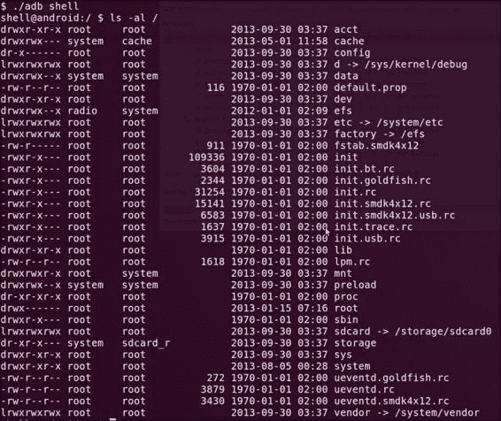

以下是默认或标准文件系统文件夹及其目的的概要，根据 Linux 文件系统层次结构标准和 Jelly Bean 上的`init.rc`脚本。下一教程“检查系统配置”中的*另请参阅*部分提供了其他平台的`init.rc`脚本的参考资料。

| 文件夹 | 目的 |
| --- | --- |
| `/acct` | `cgroup`的挂载点——CPU 资源的会计和监控 |
| `/cache` | 临时存储正在进行的下载，也用于非重要数据 |
| `/data` | 包含应用和其他特定于应用程序存储的目录 |
| `/dev` | 设备节点，如同经典的 Linux 系统，尽管不广泛用于设备和硬件驱动访问 |
| `/etc` | 到`/system/etc/`的符号链接，包含配置脚本，其中一些在启动引导过程中启动 |
| `/mnt` | 临时挂载点，类似于许多其他传统的 Linux 系统 |
| `/proc` | 包含关于进程的数据结构和信息，如同传统的基于 Linux 或 Unix 的系统 |
| `/root` | 通常是一个空目录，但类似于许多 Linux/Unix 系统上的 root 用户的主目录 |
| `/sbin` | 包含用于系统管理任务的重要实用程序的文件夹 |
| `/sdcard` | 外部 SD 卡的挂载点 |
| `/sys` | `sysfs`的挂载点，包含导出的内核数据结构 |
| `/system` | 在系统构建期间生成的不可变（只读）二进制文件和脚本；在许多 Android 系统中，这也包含系统拥有的应用程序 |
| `/vendor` | 为设备特定的增强保留的目录，包括二进制文件、应用程序和配置脚本 |
| `/init` | 在引导过程中，内核加载后执行的`init`二进制文件 |
| `/init.rc` | `init`二进制文件的配置脚本 |
| `/init[device_name].rc` | 设备特定的配置脚本 |
| `/ueventd.rc` | `uevent`守护进程的配置脚本 |
| `/uevent[device_name].rc` | `uevent`守护进程的设备特定配置脚本 |
| `/default.prop` | 包含系统全局属性的配置文件，包括设备名称 |
| `/config` | `configfs`的挂载点 |
| `/storage` | 从 4.1 设备开始的添加目录；用作外部存储的挂载点 |
| `/charger` | 一个本地独立应用程序，显示电池充电进度 |

请记住，设备制造商的版本可能会有所不同；将这些视为最基本的、未修改的文件系统布局和目的。通常，制造商在使用其中一些文件路径时也会犯错误，违背了它们的预期用途，因此要关注这些文件夹的目的和默认访问权限。

本节不会详细介绍文件系统布局；然而，在*另请参阅*部分有一些关于 Android 和 Linux 文件系统的语义、布局和约定的好资源。

让我们看看如何在 Android 系统上寻找有趣的基于文件或目录的目标。以下演练假设你在被评估的设备上拥有 ADB shell 权限。

## 准备就绪

为了使用以下示例中提到的命令，你需要能够安装`find`二进制文件或 Android 的 Busybox；安装说明可以在[`www.busybox.net/`](http://www.busybox.net/)以及本章末尾的*设置 Busybox*部分找到，该部分位于*自动化原生 Android 模糊测试*菜谱中。

## 如何操作...

若要根据文件的访问权限搜索文件，你可以在 ADB shell 中执行以下命令来查找可读文件；首先，对于全世界可读的文件，这个命令可以解决问题：

```kt
find [path-to-search] –perm  0444 –exec ls –al {} \;

```

请查看以下截图以获取示例输出：

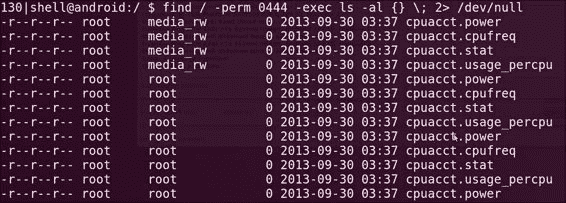

上述截图——以及本节后续的截图——来自一个已获得 root 权限的三星 Galaxy S3。这里，命令行指令包含了一个重定向到`/dev/null`的操作，以省略因权限拒绝引起的错误输出。

### 提示

**对于非 Linux/Unix 用户的一个小警告**

`/dev/null` 对于输出来说就像一个“黑洞”，允许 Linux/Unix 用户将其作为一个放置不希望看到的输出的地方。作为一个额外的好处，它还会返回一个值，让您知道写入操作是否成功。

接下来，如果您在寻找全局可写文件，可以使用以下参数找到它们：

```kt
find [path-to-search] –perm  0222 –exec ls –al {} \;

```

查看以下截图以获取示例输出：

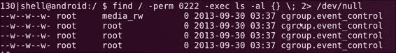

对于对所有用户设置了可执行权限的文件：

```kt
find [path-to-search] –perm  0111 –exec ls –al {} \;

```

您并非必须使用八进制格式；`find` 命令也理解用户集合和权限的常用简写。

例如，要查找除了所有者组之外所有人可读的文件，您可以这样指定权限：

```kt
find [path-to-search] –perm  a=r –exec ls –al {} \;

```

查看以下截图以获取示例输出：

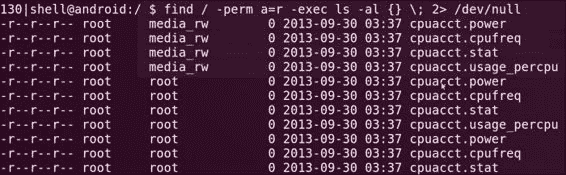

之前的规格将确保只有完全匹配的文件；这意味着返回的文件必须只具有指定的位。如果您寻找至少设置了指定位以及任何其他位的文件——您可能大多数时间都会这样做——您可以通过在前面示例中包含 `-` 符号作为前缀来指定权限。对于八进制模式，这将按以下方式工作：

```kt
find [path-to-search] –perm  -444 –exec ls –al {} \;

```

查看以下截图以获取示例输出：

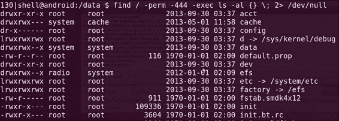

这至少会匹配所有用户集合设置了读位的文件，这意味着将匹配 445、566、777 等权限位。而 344、424、222 等则不会匹配。

您可能感兴趣的几个非常实用的访问权限模式包括查找具有 `setuid` 的可执行文件：

```kt
find [path-to-search] –perm  -4111 –exec ls –al {} \;

```

查看以下截图以获取示例输出：

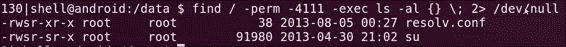

在前面的截图中，我们看到使用前面的命令找到了 `su` 二进制文件。如果您在 Android 设备上找到这个二进制文件，这总是表明设备已经被 root。

您还可以查找对所有用户具有 `setguid` 和执行权限的文件：

```kt
find [path-to-search] –perm  -2111 –exec ls –al {} \;

```

查看以下截图以获取示例输出：

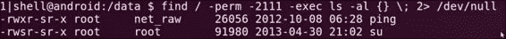

`find` 命令还允许您将用户作为搜索条件的一部分；例如：

+   您可以如下列出属于 root 用户的所有文件：

    ```kt
    find [path-to-search] –user 0 –exec ls –al {} \;

    ```

+   您可以如下列出所有系统用户的文件：

    ```kt
    find [path-to-search] –user 1000 –exec ls –al {} \;

    ```

+   您也可以根据组 ID 设置来列出文件，如下所示：

    ```kt
    find [path-to-search] –group 0 –exec ls –al {} \;

    ```

你可能想要了解你的 Android 系统上的每个用户——或者更确切地说，是每个应用——可以访问多少内容，为此你可能想要构建一个用户 ID 的列表——或者更重要的是，应用的 UID。最简单的方法是转储 `/data/data` 目录中文件的访问权限，因为它包含了大多数安装在 Android 设备上的应用的数据。然而，要从 ADB shell 访问这个列表，你需要有 root 或系统账户的访问权限，或者任何具有等效权限的账户；这在模拟器上很容易获得——它会自动授权。另外，如果你选择这样做，你可以向 XDA 开发者网站发起几个搜索，寻找 root 手机的方法。XDA 开发者网站可以在 [`www.xda-developers.com/`](http://www.xda-developers.com/) 找到。

对手机进行 root 操作有好有坏；在这种情况下，它允许你更详细地检查文件系统和访问权限。然而，另一方面，如果 root 权限的访问没有得到妥善管理，它可能会让你的手机面临许多非常严重的攻击！因此要吝啬你的 root 权限，并且只在需要时临时 root 手机。

接下来，如果你列出 `/data/data` 目录中的所有文件，你应该会看到以下内容；这是从三星 Galaxy S3 中获取的：

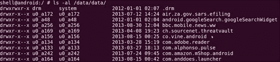

你可能注意到了每个应用的命名约定很奇怪，即 `u[number]_a[number]`，这表示的是应用安装的用户配置文件的 `u[配置文件编号]` ——因为某些 Android 版本支持多个用户配置文件，从 Jelly Bean 及其之后的版本开始——以及 `a[number]`，它是应用程序 ID。

你可以使用应用程序 ID 通过加上这个数字到 `10000` 来构建应用的实际系统用户 ID（UID）；例如，对于用户名为 `u0_a170` 的 Mozilla 安装，相应的 UID 将是 `10170`。要找到所有拥有这个 UID 作为所有者的文件，你接下来会执行这个命令：

```kt
find /data/data/ -user 10170 –exec ls –al {} \;  2> /dev/null

```

以下是样本输出的截图：

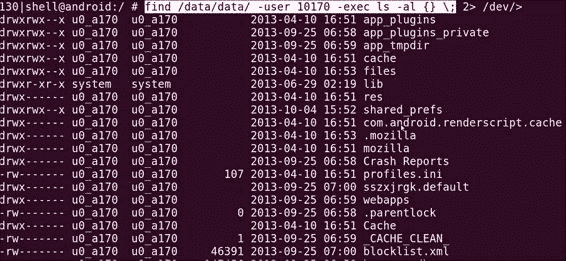

你可以通过查看本食谱 *另请参阅* 部分提到的 `Android_filesystem_config.h` 文件来找到其他用户名。

## 还有很多...

可以使 `find` 命令输出更有用的一个命令是 `stat`。这个命令显示文件属性，并允许你指定这些详情的显示格式。`stat` 命令具有众多功能，使得查找权限设置错误的文件比仅仅通过 `find –exec` 命令调用 `ls –al` 要更加具有信息量。

你可以将 `stat` 与 `find` 一起使用如下：

```kt
find . –perm [permission mode] –exec stat –c "[format]" {} \;

```

例如，如果你想显示以下内容：

+   `%A`：以人类可读格式显示的访问权限

+   `%u`：文件所有者的用户 ID

+   `%g`：文件所有者的组 ID

+   `%f`：文件的原始十六进制模式

+   `%N`：带有引用的文件名，如果是符号链接则解引用

你可以通过执行以下命令来完成此操作：

```kt
find . –perm [permission] –exec stat –c "%A %u %g  %f  %N" {} \;

```

此命令生成的输出如下——这里示例使用 `-0666` 作为示例权限模式：

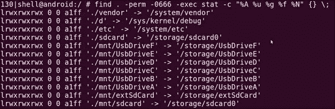

## 另请参阅

+   在 [`web.nvd.nist.gov/view/vuln/detail?vulnId=CVE-2009-1894`](http://web.nvd.nist.gov/view/vuln/detail?vulnId=CVE-2009-1894) 的 *CVE-2009-1894 漏洞摘要* 文章

+   在 Android Git 仓库中的 `Android_filesystem_config.h` 文件，位于 [`android.googlesource.com/platform/system/core/+/android-4.4.2_r1/include/private/android_filesystem_config.h`](https://android.googlesource.com/platform/system/core/+/android-4.4.2_r1/include/private/android_filesystem_config.h)

+   Linux 文档项目中的*文件系统层次标准*，在 [`www.tldp.org/HOWTO/HighQuality-Apps-HOWTO/fhs.html`](http://www.tldp.org/HOWTO/HighQuality-Apps-HOWTO/fhs.html)

+   文件系统层次结构组在 [`www.pathname.com/fhs/pub/fhs-2.3.pdf`](http://www.pathname.com/fhs/pub/fhs-2.3.pdf) 的*文件系统层次标准*指南

+   *嵌入式 Android*，*O'Reilly*，2013 年 3 月，作者 *Karim Yaghmour*

# 跨编译本地可执行文件

在我们能够在 Android 设备上开始破坏堆栈和劫持指令指针之前，我们需要一种方法来准备一些易受攻击的示例应用程序。为此，我们需要能够编译本地可执行文件，而要做到这一点，我们需要使用 Android 本地开发工具包中的一些优秀应用程序。

## 如何操作...

要跨编译你自己的本地 Android 组件，你需要执行以下操作：

1.  准备一个目录来开发你的代码。你需要做的就是创建一个你想命名为“模块”名称的目录，例如，你可以像我在这里的示例中一样，将目录命名为 `buffer-overflow`。创建该目录后，你还需要创建一个名为 `jni/` 的子目录。你必须这样命名它，因为 NDK 中的编译脚本会特别寻找这个目录。

1.  一旦你有了这些目录，你就可以创建一个 `Android.mk` 文件。在你的 `jni` 目录中创建这个文件。`Android.mk` 文件基本上是一个 Make 文件，它准备了一些你编译的属性；以下是它应该包含的内容：

    ```kt
    LOCAL_PATH := $(call my-dir)
    include $(CLEAR_VARS)
    # give module name
    LOCAL_MODULE    := buffer-overflow  #name of folder
    # list your C files to compile
    LOCAL_SRC_FILES :=  buffer-overflow.c #name of source to compile
    # this option will build executables instead of building library for Android application.
    include $(BUILD_EXECUTABLE)

    ```

1.  一旦你正确设置了所需的 `jni` 目录结构和 `Android.mk`，你就可以开始编写一些 C 代码了；以下是一个你可以使用的示例：

    ```kt
    #include <stdio.h>
    #include <string.h>
    void vulnerable(char *src){
      char dest[10]; //declare a stack based buffer
      strcpy(dest,src);
      printf("[%s]\n",dest); //print the result
      return;  }

    void call_me_maybe(){
      printf("so much win!!\n");
      return;  }

    int main(int argc, char **argv){
      vulnerable(argv[1]); //call vulnerable function
      return (0);  }
    ```

    请确保此文件与 `jni` 目录中的 `Android.mk` 文件一起出现。

1.  现在是乐趣的一部分；你现在可以编译你的代码了。你可以通过调用 NDK 构建脚本来完成这个操作，令人惊讶的是，这是通过执行以下命令完成的：

    ```kt
    [path-to-ndk]/ndk-build

    ```

    在这里，`[path-to-ndk]` 是你的 Android NDK 的路径。

如果一切顺利，你应该看到类似以下的输出：

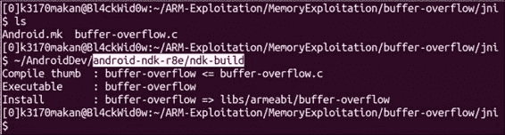

## 还有更多...

只编译是不够的；我们需要能够修改正常可执行文件的编译方式，这样我们才能利用并研究某些漏洞。我们将在这里移除的保护措施是一种保护函数栈不被以允许被利用的方式破坏的保护——大多数利用。在移除这保护之前，详细说明这种保护是如何实际工作的，并展示移除保护后的差异将是有用的。做好心理准备——ARMv7 汇编代码即将到来！

我们可以使用随 NDK 捆绑的**objdump**工具来转储这个可执行文件的反汇编代码；自然你会期望任何普通的 Linux 或 Unix 发行版中捆绑的标准`objdump`工具都能正常工作，但这些可执行文件是专门为嵌入式 ARM 设备交叉编译的。这意味着字节序可能不同；可执行文件的结构也可能是普通`objdump`无法理解的。

为了确保我们可以使用正确的`objdump`工具，Android 团队确保了与 ARM 可执行文件兼容的版本随 NDK 一起打包。你应在 NDK 的`/toolchains/arm-linux-androideabi-[version]/prebuilt/linux-x86-64/bin/`路径下找到它；尽管你可以使用任何`arm-linux-androideabi`版本，但坚持使用最新版本总是更简单。

在前述文件夹中的`objdump`二进制文件将被命名为类似`arm-linux-androideabi-objdump`的名字。

要使用它，你需要做的就是指向`/buffer-overflow/obj/local/armeabi/`目录根部的二进制文件，这个文件应该出现在你的`jni`目录中，并执行以下命令：

```kt
[path-to-ndk]/toolchains/arm-linux-Androideabi-[version]/prebuilt/linux-x86_64/bin/arm-linux-Androideabi-objdump –D /[module name]/obj/local/armeabi/[module name] | less

```

对于我们的示例，命令看起来会像这样：

```kt
[path-to-ndk]/toolchains/arm-linux-Androideabi-4.8/prebuilt/linux-x86_64/bin/arm-linux-Androideabi-objdump –D /buffer-overflow/obj/local/armeabi/buffer-overflow | less

```

这将产生相当多的输出；我们感兴趣的是围绕"脆弱"函数编译的函数。我将输出重定向到`less`，这样我们就可以滚动和搜索文本；接下来你应该在`less`打开`objdump`输出时按下`/`字符，并输入`<vulnerable>`，然后按*回车*。

如果你正确完成了这些步骤，你的屏幕应该会显示以下输出：

```kt
00008524 <vulnerable>:
 8524:  b51f        push  {r0, r1, r2, r3, r4, lr}
 8526:  4c0a        ldr  r4, [pc, #40]  ; (8550 <vulnerable+0x2c>)
 8528:  1c01        adds  r1, r0, #0
 852a:  4668        mov  r0, sp
 852c:  447c        add  r4, pc
 852e:  6824        ldr  r4, [r4, #0]
 8530:  6823        ldr  r3, [r4, #0]
 8532:  9303        str  r3, [sp, #12]
 8534:  f7ff ef7e   blx  8434 <strcpy@plt>
 8538:  4806        ldr  r0, [pc, #24]  ; (8554 <vulnerable+0x30>)
 853a:  4669        mov  r1, sp
 853c:  4478        add  r0, pc
 853e:  f7ff ef80   blx  8440 <printf@plt>
 8542:  9a03        ldr  r2, [sp, #12]
 8544:  6823        ldr  r3, [r4, #0]
 8546:  429a        cmp  r2, r3
 8548:  d001        beq.n  854e <vulnerable+0x2a>
 854a:  f7ff ef80   blx  844c <__stack_chk_fail@plt>
 854e:  bd1f        pop  {r0, r1, r2, r3, r4, pc}
 8550:  00002a7c   andeq  r2, r0, ip, ror sl
 8554:  00001558   andeq  r1, r0, r8, asr r5

00008558 <main>:
 8558:  b508        push  {r3, lr}
 855a:  6848        ldr  r0, [r1, #4]
 855c:  f7ff ffe2   bl  8524 <vulnerable>
 8560:  2000        movs  r0, #0
 8562:  bd08        pop  {r3, pc}

```

### 提示

**只是一个小提示**

在上述`objdump`输出中，最左边的列显示了指令的偏移量；紧随其后的由`:`字符分隔的列，保存了代码的实际十六进制表示；再往后的列显示了相关汇编指令的人类可读助记符。

注意之前`objdump`输出中加粗的代码。位于`8526`偏移的指令加载了从程序计数器（`pc`）寄存器当前值起`0x40`地址偏移处内存中的内容；这个地址保存了一个特殊的值，称为**栈金丝雀**。

### 提示

这通常被称为金丝雀，因为实际的金丝雀曾被矿工用来确保矿井通道是安全的可供探索。

这个值被放置在堆栈上，介于局部变量和已保存的指令及基指针之间；这样做是为了如果攻击者或错误指令足以破坏堆栈，影响到那里保存的值，那么它也将需要破坏或更改堆栈守护者，这意味着程序能够检查这个值是否发生了变化。这个值来自一个加密安全（据称是）的伪随机数生成器，并在程序运行时存储在内存中，以避免可靠地预测这个值。

接下来，我们看到位于偏移量`852c-8530`的指令将堆栈守护者放入`r3`和`r4`寄存器中。偏移量`8532`的后续指令确保在危险的`strcpy`调用（位于偏移量`8534`）之前将堆栈守护者放置在堆栈上。到目前为止，所有代码完成的工作只是在`strcpy`调用之后将值放在堆栈上——实际上是靠近`printf`函数。从偏移量`8542`到`8544`，从寄存器`r4`和堆栈上放置的位置获取堆栈守护者的值，加载到`r2`和`r3`寄存器中，然后在偏移量`8546`进行比较。如果它们不匹配，我们看到位于`854a`的指令将被执行，这将基本上导致程序中断，而不是正常退出。所以，总结一下，它从文件中的某个偏移量获取堆栈守护者，将其放入寄存器和堆栈上的另一个副本，并在退出前检查是否有任何变化。

你可能会注意到，尽管这防止了已保存的指令指针被破坏，但它根本没有保护局部变量！根据它们在内存中的布局——它们与守护者和堆栈上的其他缓冲区的关系位置——仍然有可能恶意地破坏堆栈上的其他变量。在某些特殊情况下，这仍然可能被滥用，恶意地影响进程的行为。

那么现在我们如何移除这个烦人的保护措施，以便我们可以正确地破坏堆栈并获得控制指令指针的能力呢？由于堆栈守护者是编译器级别的保护措施——这意味着它是可执行编译器强制实施的——我们应该能够修改 NDK 可执行文件的编译方式，使得堆栈保护不被强制执行。

尽管这在 Android 系统上的二进制文件中可能很少是实际情况，但这仍然是非常可能发生的事情。我们移除这个保护是为了模拟基于堆栈的溢出漏洞。

要移除保护，你需要更改 NDK 使用的一些 GCC 编译器扩展。为此，你需要：

1.  导航到`/toolchains/arm-linux-Androideabi-4.9/`目录，找到一个名为`setup.mk`的文件。请注意，你的 NDK 可能使用不同版本的`arm-linux-androideabi`。如果以下步骤不起作用或没有达到预期效果，你应该尝试移除栈保护：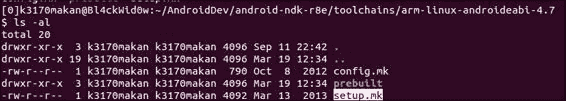

1.  接下来你可能想要备份`setup.mk`文件。我们即将更改 NDK 的默认编译配置，因此备份总是好的。你可以通过将脚本复制到另一个名称略有不同的文件来创建一个临时的备份。例如，你可以通过执行以下命令备份`setup.mk`文件：

    ```kt
    cp setup.mk setup.mk.bk

    ```

    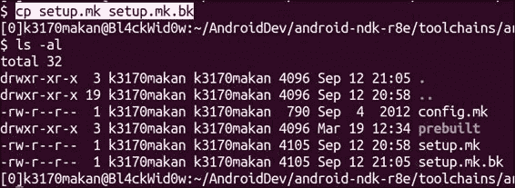

1.  备份之后，你应该在你喜欢的文本编辑器中打开`setup.mk`文件，并移除标志，特别是包含`-fstack-protector`切换的那一个；查看以下截图以获得更清晰的信息：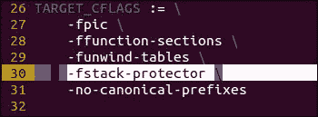

    移除指定标志后，你的`setup.mk`文件应该看起来像这样：

    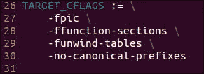

1.  完成上述操作后，你可以使用`ndk-build`脚本编译你的可执行文件的全新副本，然后将其传递给`androideabi-objdump`。在没有栈保护的情况下，你的代码应该看起来像这样：

    ```kt
    000084bc <vulnerable>:
     84bc:  b51f        push  {r0, r1, r2, r3, r4, lr}
     84be:  1c01        adds  r1, r0, #0
     84c0:  a801        add  r0, sp, #4
     84c2:  f7ff ef8a   blx  83d8 <strcpy@plt>
     84c6:  4803        ldr  r0, [pc, #12]  ; (84d4 <vulnerable+0x18>)
     84c8:  a901        add  r1, sp, #4
     84ca:  4478        add  r0, pc
     84cc:  f7ff ef8a   blx  83e4 <printf@plt>
     84d0:  b005        add  sp, #20
     84d2:  bd00        pop  {pc}
     84d4:  0000154a   andeq  r1, r0, sl, asr #10

    000084d8 <main>:
     84d8:  b508        push  {r3, lr}
     84da:  6848        ldr  r0, [r1, #4]
     84dc:  f7ff ffee   bl  84bc <vulnerable>
     84e0:  2000        movs  r0, #0
     84e2:  bd08        pop  {r3, pc}

    ```

注意到与前一个可执行文件版本中的指令没有任何关联。这是因为我们移除的`-fstack-protector`编译器标志告诉 GCC 自主寻找可能潜在破坏函数栈的任何函数实例。

## 另请参阅

+   ARM 信息中心提供的《*ARM and Thumb Instruction Set Quick Reference Card*》可以在[`infocenter.arm.com/help/topic/com.arm.doc.qrc0001l/QRC0001_UAL.pdf`](http://infocenter.arm.com/help/topic/com.arm.doc.qrc0001l/QRC0001_UAL.pdf)找到

+   《*ARM Instruction Set*》文档可以在[`simplemachines.it/doc/arm_inst.pdf`](http://simplemachines.it/doc/arm_inst.pdf)找到

+   密歇根大学电气工程与计算机科学系提供的《*ARM v7-M Architecture Reference Manual*》可以在[`web.eecs.umich.edu/~prabal/teaching/eecs373-f10/readings/ARMv7-M_ARM.pdf`](http://web.eecs.umich.edu/~prabal/teaching/eecs373-f10/readings/ARMv7-M_ARM.pdf)找到

+   *Emanuele Acri*所著的《*Exploiting Arm Linux Systems, An Introduction*》可以在[`www.exploit-db.com/wp-content/themes/exploit/docs/16151.pdf`](http://www.exploit-db.com/wp-content/themes/exploit/docs/16151.pdf)找到

+   可以在[`infocenter.arm.com/help/topic/com.arm.doc.ihi0042e/IHI0042E_aapcs.pdf`](http://infocenter.arm.com/help/topic/com.arm.doc.ihi0042e/IHI0042E_aapcs.pdf)找到《*ARM Architecture 的 Procedure Standard*》文档

+   《*ARM Instruction Set*》文档可以在[`bear.ces.cwru.edu/eecs_382/ARM7-TDMI-manual-pt2.pdf`](http://bear.ces.cwru.edu/eecs_382/ARM7-TDMI-manual-pt2.pdf)找到

+   ARM 信息中心提供的*ARM 开发者套件 1.2 版汇编指南*文档，位于[`infocenter.arm.com/help/topic/com.arm.doc.dui0068b/DUI0068.pdf`](http://infocenter.arm.com/help/topic/com.arm.doc.dui0068b/DUI0068.pdf)

+   位于[`github.com/android/platform_bionic/blob/master/libc/upstream-dlmalloc/malloc.c`](https://github.com/android/platform_bionic/blob/master/libc/upstream-dlmalloc/malloc.c)的 Android 平台 Bionic GitHub 页面上的*DLMalloc 实现库*

+   位于[`github.com/android/platform_bionic/blob/master/libc/upstream-dlmalloc/malloc.c#L4715`](https://github.com/android/platform_bionic/blob/master/libc/upstream-dlmalloc/malloc.c#L4715)的 Android 平台 Bionic GitHub 页面中 DLMalloc 实现中的`ok_magic`调用

+   位于[`android.googlesource.com/platform/bionic/`](https://android.googlesource.com/platform/bionic/)的 Android 源代码仓库中的*Bionic*源代码

+   位于[`android.googlesource.com/platform/bionic/+/jb-mr0-release/libc/bionic/dlmalloc.c`](https://android.googlesource.com/platform/bionic/+/jb-mr0-release/libc/bionic/dlmalloc.c)的 Android 官方 GitHub 仓库中的`DLMalloc.c`，Android 平台 Bionic `jb-mr0-release`

# 利用竞态条件漏洞的攻击行为。

竞态条件在 Android 平台上引起了很多问题和权限提升攻击；其中许多允许恶意攻击者获得 root 权限。

基本上，竞态条件是由多线程（允许多个进程同时运行的平台）系统在采用抢占式进程调度时缺乏强制互斥所引起的。抢占式调度允许任务调度器预先中断线程或正在运行的进程，这意味着不需要首先等待任务准备好被中断。这使得竞态条件成为可能，因为通常开发者没有使应用程序以能够适应来自进程调度器的任意和不可预测的中断的方式运行；结果是，依赖访问可能共享的资源（如文件、环境变量或共享内存中的数据结构）的进程总是在“竞速”，以获取这些资源的首次和独占访问权。攻击者通过首先获取这些资源并加以篡改，以这种方式滥用这种情况，从而可能导致进程操作受损或允许他们恶意影响进程的行为。一个简单的例子是，一个程序检查正在验证身份的用户是否在给定文件中的有效用户名列表中；如果此进程不能适应抢占式调度器，它可能只能在恶意用户通过将自己的用户名添加到列表中篡改文件之后访问该文件，从而允许他们被验证。

在本演练中，我将详细说明一些基本的竞态条件漏洞，并讨论其他潜在原因；我还将详细说明一些最基本的竞态条件漏洞的利用方法。演练最后会提供有关过去基于 Android 的竞态条件漏洞的参考资料和有用信息来源；其中大部分是在撰写本文那年报告的。

竞态条件漏洞的利用取决于几个因素，攻击者至少必须能够做到以下几点：

+   **获取易受攻击进程正在争夺访问的资源**: 如果一个进程没有对其外部资源实施互斥访问，但攻击者又无法访问这些相同资源，那么这种情况下的利用潜力并不大。如果不是这样，那么每个进程进行的每一次非互斥访问都将是可以被利用的。这包括每次进程在未经信号量或自旋锁检查的情况下取消对内存中指针的引用，这种情况可能发生数十亿次！

+   **恶意影响这些资源**: 如果进程在攻击无法增加或恶意修改资源的环境中不独占地访问其资源，那么这样做不会有太大帮助。例如，如果一个进程访问攻击者只能读取的共享内存或文件，除非这会导致易受攻击的进程崩溃，考虑到进程的语义优先级；例如，防病毒程序、入侵检测系统或防火墙。

+   **使用时/检查时窗口大小** (**TOU/TOC**): 这本质上是应用程序检查资源访问权限和实际访问资源之间的时间差，或者更确切地说，是调度器中断的可能性。竞态条件的可利用性很大程度上取决于这个时间差，因为利用行为本质上是在这个时间框架内争夺访问权限，以恶意影响资源。

考虑到这些条件，让我们看看一些构建的竞态条件漏洞示例以及如何在 Android 上利用它们。

## 准备工作

在我们开始利用竞态条件之前，我们需要准备一个示例。以下是操作方法：

1.  我们将准备一个嵌入式 ARM Android 平台——在此示例中为 Jelly Bean 模拟器——这可能会导致竞态条件漏洞。以下代码详细描述了一个易受攻击进程的行为：

    ```kt
    #include <stdio.h>
    #include <unistd.h>
    #include <errno.h>
    #define MAX_COMMANDSIZE 100
    int main(int argc,char *argv[],char **envp){
      char opt_buf[MAX_COMMANDSIZE];
      char *args[2];
      args[0] = opt_buf;
      args[1] = NULL;
      int opt_int;
      const char *command_filename = "/data/race-condition/commands.txt";
      FILE *command_file;
      printf("option: ");
      opt_int = atoi(gets(opt_buf));
      printf("[*] option %d selected...\n",opt_int);
      if (access(command_filename,R_OK|F_OK) == 0){
        printf("[*] access okay...\n");
        command_file = fopen(command_filename,"r");
        for (;opt_int>0;opt_int--){
          fscanf(command_file,"%s",opt_buf);
        }
        printf("[*] executing [%s]...\n",opt_buf);
        fclose(command_file);
      }
      else{
        printf("[x] access not granted...\n");
      }
      int ret = execve(args[0],&args,(char **)NULL);
      if (ret != NULL){
        perror("[x] execve");
      }
      return 0;
    }
    ```

    按照在*交叉编译本地可执行文件*一节中详细描述的相同过程编译此文件，并将其部署到您的安卓设备上。尝试将其部署到作为可执行文件和任何安卓系统用户可读的分区或文件夹中（如何操作请参考第一章，*安卓开发工具*中的*复制文件到/从 AVD 中*一节）。在本节中，我们使用作为`/system`的已挂载分区，该分区在其他菜谱中以读写权限重新挂载。请注意，这可能会导致 NDK 发出一些警告，但只要一切编译成可执行文件，就可以继续操作！

1.  您还需要将`commands.txt`文件放在代码中提到的目录中，即`/data/race-condition/command.txt`。这需要在`/data`路径中创建一个竞争条件文件夹。关于如何做到这一点的良好示例可以在第四章，*利用应用程序*中的*检查网络流量*一节中找到，因为我们需要为`TCPdump`创建类似的设置。

1.  您需要在安卓设备上为这个可执行文件设置`setuid`权限；您可以在将其部署到设备后执行以下命令来完成此操作：

    ```kt
    chmod 4711 /system/bin/race-condition

    ```

    这个命令还确保系统上的任何用户都有执行权限。请注意，您需要 root 权限才能执行此命令。我们正在模拟`setuid`二进制文件的效果以及它可能导致的任意代码执行。

我们已经为利用做好了一切设置；现在可以详细说明这种利用方法了。

## 如何操作...

要利用这个有漏洞的二进制文件，您需要执行以下操作：

1.  运行 ADB shell 进入安卓设备；如果您使用的是模拟器或已获得 root 权限的设备，您应该可以使用`su`来获取另一个应用程序的访问权限。

    尝试访问一些对您的用户没有设置执行、读取或写入权限的 root 拥有的文件夹和文件。这里我选择用户`10170`作为示例，当您尝试访问`/cache/`目录时，您应该会看到抛出的`Permission denied`消息：

    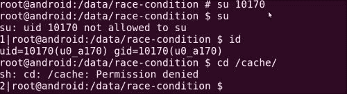

1.  让我们利用`race-condition`二进制文件。我们通过在`commands.txt`文件中添加另一个命令来实现，即`/system/bin/sh`，这将为我们打开一个 shell。您可以通过执行以下命令来完成此操作：

    ```kt
    echo "/system/bin/sh" >> /data/race-condition/commands.txt

    ```

    `/system/bin/sh`命令现在应该是`commands.txt`文件中的最后一个条目，这意味着，如果我们希望通过菜单选择它，需要选择选项 5。

    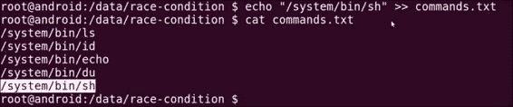

1.  在安卓设备上执行`race-condition`，并输入`5`作为选项。有漏洞的二进制文件将执行`sh`命令，并赋予您 root 权限。

1.  通过尝试将目录更改为`/cache`来测试你的 root 访问权限。如果你运行的是 Jelly Bean 或更高版本的 Android，你不应该看到任何`Permission denial`消息，这意味着你刚刚将自己的权限提升到了 root！！如何操作...

前面的例子旨在详细说明竞态条件的基本概念，即当一个应用程序访问任何其他进程都可以修改的文件，并将其用于以 root 用户身份执行操作时。还有更复杂和微妙的情形会导致竞态条件，一个常见被利用的情况涉及到符号链接。这些漏洞源于应用程序无法区分文件和符号链接，这使得攻击者可以通过精心构造的符号链接来修改文件，或者当一个文件读取符号或硬链接但不能确定链接目标的真实性时，这意味着链接可以被恶意重定向。要了解关于竞态条件漏洞的更现代的例子，请查看*另请参阅*部分中的链接。

## 另请参阅

+   [CVE-2013-1727 漏洞概述](http://web.nvd.nist.gov/view/vuln/detail?vulnId=CVE-2013-1727&cid=8)一文

+   [CVE-2013-1731 漏洞概述](http://web.nvd.nist.gov/view/vuln/detail?vulnId=CVE-2013-1731&cid=8)一文

+   *Justin Case*撰写的[*Sprite Software Android 竞态条件*](http://packetstormsecurity.com/files/122145/Sprite-Software-Android-Race-Condition.html)文章

+   *Prabhaker Mateti*撰写的[*竞态条件利用*](http://cecs.wright.edu/~pmateti/InternetSecurity/Lectures/RaceConditions/index.html)文章

# 栈内存损坏利用

栈内存利用可能不是 Android 错误和安全漏洞的最常见来源，尽管这类内存损坏错误仍然有可能影响到即使拥有 ASLR、StackGuard 和 SE Linux 等保护措施的原生 Android 可执行文件。此外，大部分 Android 市场份额由那些对栈和其他基于内存的利用没有强有力保护的设备组成，尤其是 2.3.3 版本的 Gingerbread 设备。除了与安全研究的直接相关性之外，包括基于栈的利用讨论和演练的另一个重要原因是它为更高级的利用技术提供了很好的入口。

在本节中，我们将详细说明如何利用常见的基于栈的内存损坏漏洞来控制执行流程。

## 准备工作

在开始之前，你需要准备一个易受攻击的可执行文件；以下是操作方法：

1.  创建一个包含通常的`jni`文件夹和与之前菜谱相同命名约定的目录。如果你需要回顾，请查看本章中的*跨编译本地可执行文件*的菜谱。

1.  在`jni`文件夹中写这段代码到一个`.c`文件中：

    ```kt
    #include <stdio.h>
    #include <string.h>
    void
    vulnerable(char *src){
      char dest[10]; //declare a stack based buffer
      strcpy(dest,src); //always good not to do bounds checking
      printf("[%s]\n",dest); //print the result
      return;  }

    int
    main(int argc, char **argv){
      vulnerable(argv[1]); //call vulnerable function
      printf("you lose...\n");
      return (0);  }
    ```

    这个代码与之前的例子惊人地相似。实际上，你可以编辑之前的示例代码，因为它只在几行代码上有所不同。

1.  使用之前的`ndk-build`脚本编译代码。

1.  将代码部署到 Android 设备或模拟器上；在以下示例中，我使用了模拟的 Android 4.2.2 设备。

当你设置好代码后，可以继续将二进制文件推送到你的模拟器或设备上——如果你愿意接受挑战的话。

## 如何操作...

要利用基于栈的缓冲区溢出，你可以执行以下操作：

1.  在你的模拟器上多次启动应用程序，每次都提供更大的输入，直到它无法正常退出执行，你的 Android 系统报告段错误。

    尝试记住你给应用程序输入了多少个字符，因为你需要使用`gdbserver`给出相同的数量来触发崩溃。以下是可执行文件正常运行的截图：

    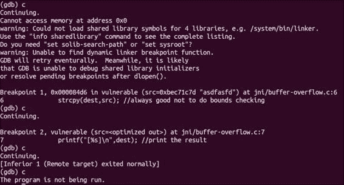

    你应该看到 GDB 输出`exited normally`，这表明进程的返回码相同，没有中断或强制它停止。

    当输入过多时，应用程序会以段错误退出，这在 GDB 中看起来像这样：

    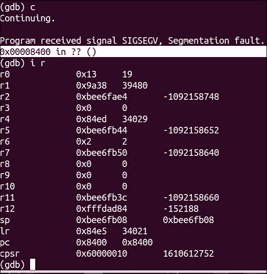

1.  在`gdbserver`中启动应用程序，提供一个“不安全”的输入量，即会导致崩溃的输入量。对于我们的代码，这应该是超过 14 到 16 个字符的任何输入。在这个例子中，我输入了大约 16 个字符，以确保我覆盖了正确的内存部分。

1.  运行`androideabi-gdb`并连接到远程进程。如果你需要回顾如何进行这一步，请查看第六章中*使用 GDB 服务器调试 Android 进程*的菜谱，*逆向工程应用*。

1.  使用 GDB 设置几个断点。在`blx`到`strcpy`之前设置一个断点，再在之后设置一个，如下截图所示：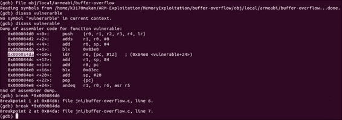

    ### 提示

    你可以使用`break`命令或简写为`b`来设置断点，并给出代码行的偏移量或指向持有指令的地址的指针；因此，在内存值前有`*`字符。

1.  当你设置好断点后，通过`gdbsever`重新运行应用程序，并使用 Android GDB 重新连接。按照后面解释的内容，逐步执行每个断点。你需要在 GDB 提示符中输入`continue`，或者简写为`c`。GDB 将继续执行程序，直到达到断点。

    你应该首先到达的是`strcpy`调用之前的断点；我们在这里设置一个断点，以便你可以看到`strcpy`调用前后堆栈的变化。理解这一点至关重要，这样你才能在开始覆盖返回地址之前计算出要给应用程序多少数据。以下屏幕截图显示了这一点：

    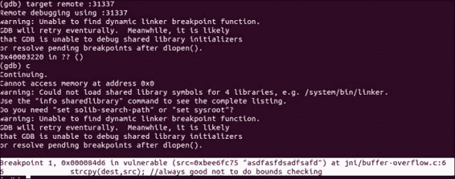

    这是`vulnerable`函数在调用`strcpy`之前堆栈的快照；除了为局部变量准备了一些空间外，还没有发生太多事情。一旦到达第一个断点，你应该通过打印一些内存内容来检查堆栈。

    在以下示例中，通过在 GDB 中执行这个`x`命令来展示：

    ```kt
    x/32xw $sp

    ```

    这个命令告诉 GDB 打印出`sp`（堆栈指针）寄存器中包含的内存地址的 32 个十六进制字；以下是您应该看到的内容：

    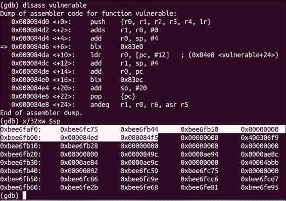

    你会注意到有几个值被突出显示；这些值是由函数序言中的指令传递到堆栈的，该指令如下：

    ```kt
    push  {r0, r1, r2, r3, r4, lr}

    ```

    ### 提示

    之前命令中使用的`push`指令确保了调用函数的寄存器值被保留。这条指令有助于确保当执行的函数将控制权返回给调用它的函数时，堆栈能恢复到原始状态。

    `push`指令中使用的值之一是`lr`或链接寄存器。链接寄存器通常保存当前函数的返回地址。在这里，`lr`寄存器保存的值是`0x000084f5`。我们稍后会尝试用我们自己的值覆盖它；几分钟内，你应该能看到我们的输入是如何改变这个值的，所以暂时请记住它。

    你想要这么做是因为在`vulnerable`函数中更下面的指令，具体如下：

    ```kt
    pop   {pc}

    ```

    这条指令将保存的`lr`值直接移动到程序计数器寄存器中；这导致执行在保存在`lr`寄存器中的地址继续。如果我们能覆盖保存的`lr`值，我们实际上可以在`vulnerable`函数末尾控制执行分支的位置。下一步将介绍如何精确计算以及输入程序中的内容，以确保你如前所述控制执行。

1.  继续到下一个断点。一旦 GDB 达到这个断点，`strcpy`应该已经将你的输入写入堆栈。此时检查堆栈应该得到以下输出：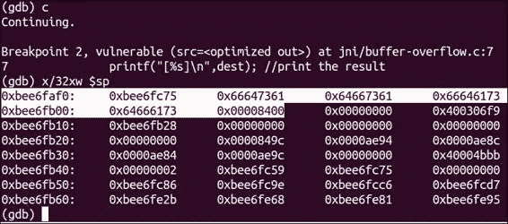

    你应该注意到 `0x000084f5` 的值变为了 `0x00008400`；它们非常相似，因为当 `strcpy` 将我们的输入写入缓冲区时，它部分地用跟随我们字符串的 `NULL` 字节覆盖了保存的 `lr` 值；这就是为什么 `0xf5` 被替换为 `0x00`。现在我们知道，我们的 16 个字符的输入覆盖了保存的返回地址的一个字节。这意味着要完全覆盖 2 字节的返回地址，我们需要添加 2 字节的输入——容纳 `NULL` 字节——最后 4 个字节是新的返回地址。以下是它的工作原理：

    在 `strcpy` 调用之前，栈有以下结构：

    | 无关紧要的栈内容 | 输入缓冲区字段 | 保存的 lr 值 |
    | --- | --- | --- |
    | 0xbee6fc75 | 0xbee6fb44 | 0xbee6fb50 | 0x00000000 | 0x000084ed | 0x00000 | 0x84 | 0xF5 |

    在使用 16 字节输入的 `strcpy` 调用之后，栈有以下结构：

    | 无关紧要的栈内容 | 输入缓冲区字段 | 保存的 lr 值 |
    | --- | --- | --- |
    | …0xbee6fc75 | 16 个字符 | 0x00000 | 0x84 | 0x00 |

    加粗的 `0x00` 值是我们输入的 `NULL` 字节；基于此，我们需要输入 16 个字符加上 2 个字符作为新的返回地址，如下所示：

    | 无关紧要的栈内容 | 输入缓冲区字段 | 保存的 lr 值 |
    | --- | --- | --- |
    | …0xbee6fc75 | [16 个字符] | 0x00000 | 0x?? | 0x?? |

    在这里，`0x??` 字符表示我们给 `strcpy` 调用提供的额外输入字符，以覆盖返回地址；同样，我们在额外输入字符后看到了 `0x00` 字符。

1.  使用给定的输入重新启动 GDB 服务器；尝试跳过 `printf "you lose"` 调用并检查它是否被执行——这是一种检查你是否成功重定向执行流程的简单方法。以下是你可以获取一个重定向执行流程的示例地址的方法。通过在 GDB shell 中执行以下命令来反汇编主部分：

    ```kt
    disass main

    ```

    这将产生以下输出：

    ```kt
    0x000084ec <+0>:  push {r3,lr}
    0x000084ee <+2>:  ldr r0,[r1, #4]
    0x000084f0 <+4>:  bl 0x84d0 <vulnerable>
    0x000084f4 <+8>:  ldr r0, [pc, #8]
    0x000084f6 <+10>:  add r0,pc
    0x000084f8 <+12>:  blx 0x83f8
    0x000084fc <+16>:  movs r0,#0
    0x000084f3 <+18>:  pop {r3,pc}
    0x00008500 <+20>:  andeq r1,r0,r2,asr,r5

    ```

    在 `0x000084f8` 的 `blx` 指令显然是调用 `printf` 的，如果我们想跳过它，我们需要获取紧随其后的指令的地址，即 `0x000084fc`。更具体地说，我们将以下内容作为输入提供给我们的程序：

    `[16 个填充字符] \xfc\x84`

    由于架构的字节序，指定返回地址的字节是反序给出的。

1.  使用 GDB 服务器重新启动应用程序，这次给它以下输入：

    ```kt
    echo –e "1234567890123456\xfc\x84"`

    ```

    如果一切顺利，你不应该看到应用程序打印 `"you lose"` 消息，而是直接退出。

你不仅仅可以跳过简单的`print`指令；在某些情况下，你甚至可以完全控制运行具有此类漏洞的程序的过程。有关如何执行此操作的信息，请参阅*另请参阅*部分中标题为《无返回的返回导向编程》的链接。关于一般内存破坏攻击的好资源，请参阅*另请参阅*部分中的《内存破坏攻击，（几乎）完整历史》以及《为了乐趣和利润而破坏堆栈》链接。

## 另请参阅

+   《ARM 利用简明指南》可以在[`www.exploit-db.com/wp-content/themes/exploit/docs/24493.pdf`](http://www.exploit-db.com/wp-content/themes/exploit/docs/24493.pdf)找到。

+   *Aleph One*撰写的《为了乐趣和利润而破坏堆栈》一文可以在[`www.phrack.org/issues.html?issue=49&id=14#article`](http://www.phrack.org/issues.html?issue=49&id=14#article)找到。

+   *Haroon Meer*撰写的《内存破坏攻击，（几乎）完整历史》指南，Thinkst Security 2010，可以在[`thinkst.com/stuff/bh10/BlackHat-USA-2010-Meer-History-of-Memory-Corruption-Attacks-wp.pdf`](http://thinkst.com/stuff/bh10/BlackHat-USA-2010-Meer-History-of-Memory-Corruption-Attacks-wp.pdf)找到。

+   由*Stephen Checkoway*、*Lucas Davi*、*Alexandra Dmitrienko*、*Ahmad-Reza Sadeghi*、*Hovav Shacham*和*Marcel Winandy*撰写的《无返回的返回导向编程》指南可以在[`cseweb.ucsd.edu/~hovav/dist/noret-ccs.pdf`](http://cseweb.ucsd.edu/~hovav/dist/noret-ccs.pdf)找到。

+   由*Lucas Davi*、*Alexandra Dmitrienko*、*Ahmad-Reza Sadeghi*和*Marcel Winandy*撰写的《ARM 上的无返回的返回导向编程》指南可以在[`www.informatik.tu-darmstadt.de/fileadmin/user_upload/Group_TRUST/PubsPDF/ROP-without-Returns-on-ARM.pdf`](http://www.informatik.tu-darmstadt.de/fileadmin/user_upload/Group_TRUST/PubsPDF/ROP-without-Returns-on-ARM.pdf)找到。

# 自动化原生 Android 模糊测试

模糊测试是发现可利用漏洞或系统实用程序中错误的好方法。它允许审计员针对畸形和可能的恶意输入衡量文件处理程序和其他应用程序的有效性，并帮助确定系统上是否存在任何容易利用的入口点。它还是自动化安全测试的绝佳方式。

Android 与任何其他系统并无不同，它也有无数的有趣模糊测试目标。Android 设备的攻击面并不仅限于 Java 应用层；实际上，有时基于原生可执行文件或系统实用程序的不当输入处理或对某些情况的安全响应，才会出现 root 漏洞。模糊测试是发现这些情况和 Android 设备上可能的 root 漏洞的好方法。

我将在这里介绍如何将一个名为**Radamsa**的模糊测试生成器移植到 Android 平台，并安装一些将帮助你编写使用 Radamsa 的健壮模糊测试脚本的实用程序。

## 准备工作

在开始移植之前，你需要获取 Radamsa 模糊器的副本；以下是操作方法：

1.  确保你的 Linux 机器上安装了**CURL**或**Wget**。Wget 可以正常工作，但按照 Radamsa 网站的建议，你可以通过执行以下命令来安装依赖项（仅限 Ubuntu 机器）：

    ```kt
    sudo apt-get install gcc curl

    ```

    运行这个命令应该会产生类似于以下截图的输出：

    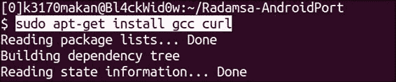

1.  下载完成后，你可以按照以下方式获取 Radamsa 源代码副本：

    ```kt
    curl http://ouspg.googlecode.com/files/radamsa-0.3.tar.gz > radamsa-0.3.tar.gz

    ```

    运行这个命令应该会产生类似于以下截图的输出：

    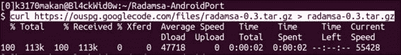

1.  然后，你应该通过执行以下命令来提取 Radamsa 源代码：

    ```kt
    tar –zxvf radamsa-0.3.tar.gz

    ```

    如果你正确执行了这个命令，你的输出应该类似于以下截图：

    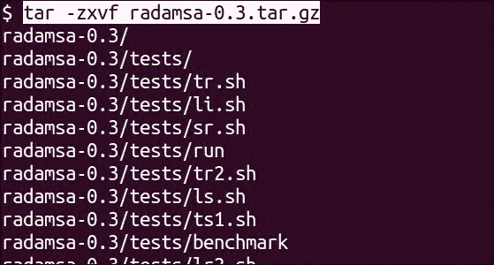

    完成后，你的目录应该看起来像下面这样：

    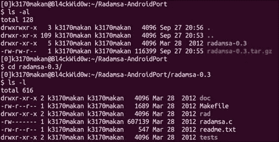

    现在一切准备就绪；我们可以开始设置`jni`目录结构并编译 Radamsa 以用于 Android。

## 如何操作...

要为 Android 跨编译 Radamsa，你应该做以下操作：

1.  在这个目录中解压 Radamsa 源代码后，你应该有一个名为`radamsa-0.3`的目录；你应该创建一个名为`jni`的目录，就像我们在*跨编译本地可执行文件*的菜谱中所做的那样。

1.  制作一份用于缓冲区溢出食谱的`Android.mk`文件副本，并将其放入`jni`目录中；你的目录应该类似于以下截图：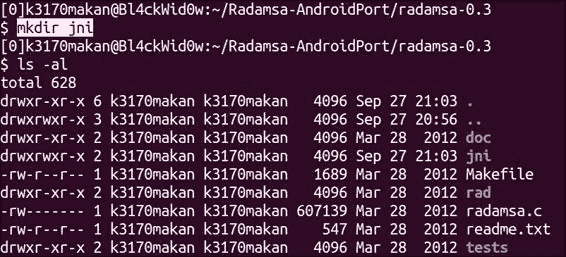

1.  将包含 Radamsa 源的`radamsa.c`文件复制到`jni`目录中，如下截图所示：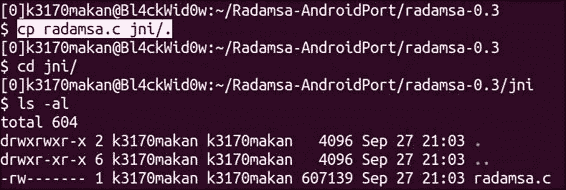

1.  获取一份`Android.mk`文件并将其放入`jni`文件夹中。

    复制你的`Android.mk`文件应该与以下截图中的演示类似：

    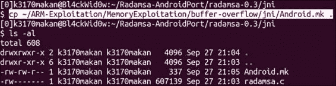

1.  编辑上一步复制的`Android.mk`文件，使其看起来像下面这样：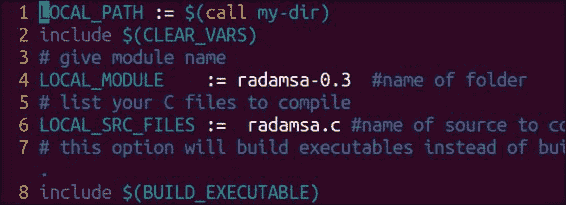

1.  设置好`Android.mk`文件后，你可以执行`ndk-build`命令；你应该得到以下输出：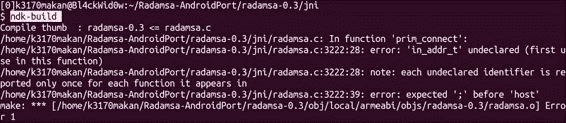

    这意味着构建失败了。GCC 还向你展示了哪些代码行导致了错误。实际上，这是一个通过其余代码级联的问题，即`typedef`，它将一个无符号长整型别名为`in_addr_t`；在下一步中，我们将修复此问题以成功编译 Radamsa。

1.  在你喜欢的代码编辑器中打开`radamsa.c`文件——最好是可以显示行号的。滚动到第`3222`行；如果你使用的是 vim 文本编辑器，你应该会看到以下代码：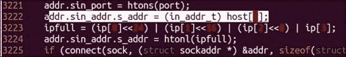

1.  在`radamsa.c`代码的`3222`行，将`in_addr_t`类型名称替换为无符号长整型。当你正确更改后，代码应该看起来像这样：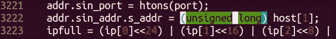

1.  你还应该删除`2686`行的`typedef`命令；编辑行之前，它应该看起来像这样：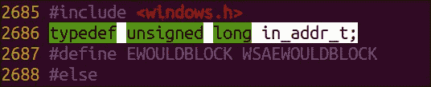

    注释掉之后，它应该看起来像以下这样：

    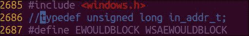

1.  修改`radamsa.c`源代码以使 NDK GCC 编译器满意后，你可以运行`ndk-build`脚本。如果你一切都做对了，你的输出应该看起来像这样：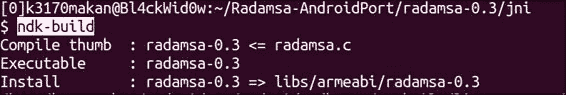

1.  成功构建可执行文件后，你可以将其推送到 Android 模拟器，如下所示——假设你已经设置好了，并且你已经将系统分区重新挂载为可写：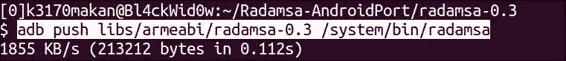

1.  推送 Radamsa 可执行文件后，你可以通过在 Android 模拟器上执行以下命令来测试它：

    ```kt
    radamsa –-help

    ```

    这应该生成以下输出：

    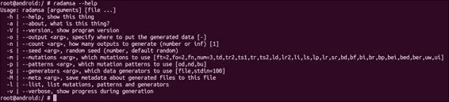

1.  你可以在一些测试输入上运行 Radamsa，以确保一切正常工作。例如，看看以下命令是如何运行 Radamsa 的，以确保一切正常并处于工作状态：

    ```kt
    echo "99 bottles of beer on the wall" | radamsa

    ```

    运行此命令应该会产生类似于以下截图的输出：

    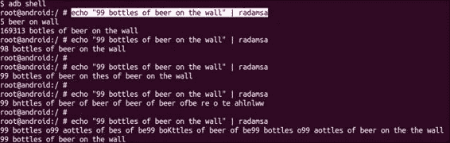

就这样！Radamsa 在 Android 上运行起来了。下一部分将讨论设置一个简单的模糊测试脚本并将其指向 dexdump，尝试生成一些崩溃，并希望找到一些可利用的漏洞。

如果你打算进行一些模糊测试，你最终需要进行一些 bash 脚本编写，以精确地定位 Radamsa 的目标，并自动报告引起有趣行为的输入数据。不幸的是，Android 平台并没有包含使 bash 脚本编写强大的所有工具；它们甚至没有 bash shell 应用程序，主要是因为它不是必需的。

我们可以使用`sh`壳来进行脚本编写，但 bash 功能更强大且更健壮，而且大多数人更习惯于 bash 脚本编写。因此，本食谱的下一部分将解释如何在 Android 平台上运行 Busybox。

### 设置 Busybox

要在 Android 上获取 Busybox 实用程序（一系列有用的终端应用程序的软件包），你需要执行以下操作：

1.  从[`benno.id.au/Android/busybox`](http://benno.id.au/Android/busybox)获取 Android 端口的副本；在示例中，我们使用`wget`来执行此操作：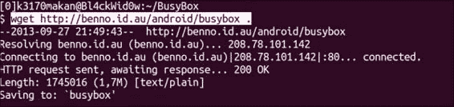

1.  然后，你需要准备一个`busybox`目录在你的 Android 模拟器上——假设你已经设置好并准备好启动。

    对于这个示例，`busybox`目录是在`/data/`文件夹中创建的；由于它是可写和可执行的，任何挂载有写、读和执行权限的分区的文件夹都应该工作得很好。

    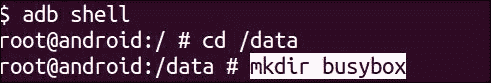

1.  当你为 Busybox 创建了一个专用目录后，你可以使用以下命令将其推送到模拟器：

    ```kt
    adb push [path to busybox] /data/busybox/.

    ```

    你应该做类似于以下截图的操作：

    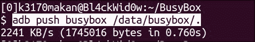

1.  当你将`busybox`二进制文件的一个副本推送到你的模拟器后，你可以通过在模拟器上执行以下命令来安装这些二进制文件：

    ```kt
    /data/busybox –-install

    ```

    以下是一个来自三星 Galaxy S3 智能手机的例子：

    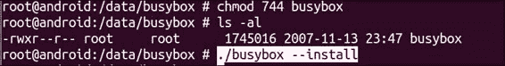

    执行此命令后，你的`busybox`文件夹应该看起来像下面这样：

    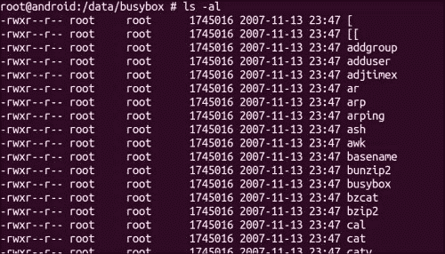

### 模糊测试 dexdump

现在你已经让测试用例生成器运行起来，并且安装了 Busybox 工具，你可以开始生成一些崩溃了！

在这个例子中，我们将看到如何设置一个简单的脚本来对 dexdump 进行一些“愚蠢”的模糊测试，dexdump 是一个剖析 Android DEX 文件并打印其内容的工具：

1.  在开始之前，你需要一个 DEX 文件样本；你可以通过使用 Android SDK 编写一个示例“hello world”类型的程序来获得，或者直接获取前一章食谱中创建的`Example.dex`文件。如果你想生成这个文件，请参考第六章中的*从 Java 编译到 DEX*食谱，*逆向工程应用*。

1.  创建一个目录来存放你生成输入测试用例文件的基准目录。这是在 Android 模拟器上，你的脚本将生成文件的文件夹。测试它们，如果它们导致任何崩溃，复制那些有趣的文件；`/data/`目录再次成为进行这项工作的好地方，不过模拟一个 SD 卡并将数据保存在那里也是不错的选择。

1.  在你进行模糊测试的目录中——即在上一步创建的目录——创建一个包含以下代码的 bash 脚本：

    ```kt
    #!/bin/bash
    ROOT=$1
    TARGET=dexdump
    ITER=$2
    for ((c=0;1;c++))
    do
     cat $ROOT | radamsa -m bf,br,sr -p bu > fuzz.dex
     $TARGET -d fuzz.dex 2>&1 > /dev/null
     RET_CODE=$?
     echo "[$c] {$RET_CODE} ($WINS)"
     test $RET_CODE -gt 127 && cp fuzz.dex win-dexdump_$ITER"_"$c.dex && WINS=`expr $WINS + 1`
    done

    ```

1.  通过在模拟器上执行以下命令来在 bash 中运行脚本：

    ```kt
    /data/busybox/bash; /data/busybox/source [fuzz script name] [example.dex]

    ```

现在你可以开始进行模糊测试了！

## 工作原理...

在本食谱的*如何操作...*部分的第一部分，我们介绍了交叉编译一个名为 Radamsa 的流行的模糊测试生成器。我们所做的大部分工作在*交叉编译本地可执行文件*食谱中已有解释。当 NDK 构建脚本因为一个类型定义而无法编译 Radamsa 时，事情变得有趣；以下是它看起来像什么样子：

```kt
typedef unsigned long in_addr_t;

```

这导致构建脚本失败，因为 NDK 构建脚本使用的 GCC 编译器——特别是支持 ARM 应用程序二进制接口的编译器——未能识别类型定义的效果。

### 提示

当引用了由该语句定义的类型时，它会导致 GCC 停止并报告它基本上不知道`in_addr_t`是什么。这个问题通过替换`in_addr_t`别名提及的地方为完整的无符号长整型变量，并注释掉`typedef`语句，从而消除了对`typedef`的需求而得到解决。

一旦这个问题得到解决，Radamsa 就可以成功编译并被部署到 Android 设备上。

然后我们编写了一个临时的模糊测试脚本到目标 dexdump。为了确保你们在这个配方中确切了解自己在做什么，详细说明 bash 脚本的作用是很重要的。

前几条指令确保我们有一些有用的助记符来帮助我们引用传递给脚本的参数。这些指令——在`#!/bin/bash`指令之后出现——只是为一些变量名赋值。

赋值这些变量后，脚本进入一个`for`循环，有一个哨兵值——该值限制了`for`循环迭代的次数——除非被用户或操作系统明确停止，否则这将导致脚本无限迭代。

在`for`循环内部，我们看到以下这行代码：

```kt
cat $ROOT | radamsa -m bf,br,sr -p bu > fuzz.dex

```

这条指令只是获取由`ROOT`变量指向的文件，并将其提供给 Radamsa。然后 Radamsa 对文件应用一些随机变换。

对 DEX 文件进行请求的随机变换后，Radamsa 将输出重定向到一个名为`fuzz.dex`的文件，这是样本 DEX 文件的“模糊”版本。

然后，用模糊后的 DEX 文件作为参数调用 dexdump；以下是它的样子：

```kt
$TARGET -d fuzz.dex 2>&1 > /dev/null

```

所有输出都被重定向到`/dev/null`，因为我们可能不会对它感兴趣。这行代码还将来自`STDIN`（标准输出文件）的所有输出重定向到`STDERR`文件（标准错误输出文件）。这允许将程序生成的所有输出——那些可能会使屏幕混乱的内容——重定向到`/dev/null`。

下一条指令如下所示：

```kt
RET_CODE=$?
```

这记录了最后一条命令的退出码；在这个例子中，它是`dexdump`。

脚本这样做是因为它将揭示关于`dexdump`如何退出的信息。如果`dexdump`正常退出执行，返回码将是`0`；如果由于输入损坏等原因导致`dexdump`异常退出或停止，退出码将非零。

更有趣的是，如果故障需要操作系统通过使用进程间信号来停止 dexdump，返回码将大于 127。这些返回码是我们感兴趣生成的，因为它们给出了由于给定的 dexdump 输入而暴露了相对严重缺陷的强烈指示。像段错误这样的错误，通常在使用内存的无效部分时以错误的方式发生，总是产生大于 127 的返回码。关于退出码或更准确地说退出状态如何工作的更多细节，请参见*另请参阅*部分中的*使用 Shell - 理解退出码*链接。

接下来，剩余的代码如下所示：

```kt
echo "[$c] {$RET_CODE} ($WINS)"
test $RET_CODE -gt 127 && cp fuzz.dex win-dexdump_$ITER"_"$c.dex && WINS=`expr $WINS + 1
```

这部分代码的第一条指令简单地帮助我们追踪脚本当前正在执行哪个迭代——通过打印 `$c` 值。它还会打印出前一次 dexdump 运行的返回码以及发生了多少次值得注意的停止。

在打印出提到的“状态指示器”之后，脚本将 `RET_CODE` 变量的值与 `127` 进行比较；如果这个值更大，它会复制导致此错误的样本输入，并将 `WINS` 变量增加 `1` 以反映生成了另一个值得注意的错误。

## 另请参阅

+   [Linux 期刊中的“掌握 Shell – 理解退出码”](http://www.linuxjournal.com/article/10844)

+   [Radamsa 的 Google 代码](http://code.google.com/p/ouspg/wiki/Radamsa)

+   [Blab 的 Google 代码](http://code.google.com/p/ouspg/wiki/Blab)

+   [代码生成约定选项](http://gcc.gnu.org/onlinedocs/gcc/Code-Gen-Options.html)网页

+   [使用 Radamsa 进行模糊测试及关于覆盖率的思考](http://www.cs.tut.fi/tapahtumat/testaus12/kalvot/Wieser_20120606radamsa-coverage.pdf)文件
