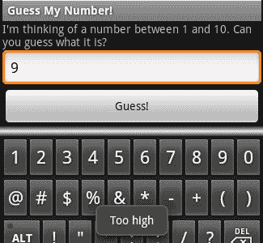

# 四、利用活动和意图

*在许多方面，安卓应用管理似乎受到了 JavaScript 和网络浏览器的启发，这是正确的！网络浏览器模型已经证明自己是一种用户觉得很容易使用的机制。安卓作为一个系统，安卓和网络浏览器有很多共同点，有些是显而易见的，有些你需要更深入地了解。*

*活动堆栈很像单向的网页浏览器历史。当你使用 `startActivity`方法启动一个 `Activity`时，你有效地将手控回到了安卓系统。当用户按下手机上的硬件“后退”按钮时，默认操作是将顶部的`Activity`从堆栈中弹出，并显示下面的按钮(不总是启动它的按钮)。*

在本章中，我们将探讨一下安卓如何运行应用和管理`Activity`实例。虽然对于用户界面设计来说并不是绝对必要的，但了解这是如何工作的很重要。恰当地利用这些概念将帮助您确保一致的用户界面体验。正如您将看到的，它将帮助您提高应用的性能，并允许您重用更多的应用组件。

了解`Activity`是如何创建的(以及何时创建的)以及安卓如何决定要创建什么`Activity`也很重要。我们还将研究构建`Activity`类时要遵循的一些良好实践，以及如何在安卓应用的范围内表现良好。

我们已经在[第 1 章](01.html "Chapter 1. Developing a Simple Activity")、*开发一个简单的活动*和[第 2 章](02.html "Chapter 2. Presenting Data for Views")、*展示视图数据*中遇到了“活动栈”，在这里我们构建了`Intent`对象来启动特定的`Activity`类。当你使用硬件“返回”按钮时，你会被自动带到先前的`Activity`实例，不需要任何代码(很像网络浏览器)。在本章中，我们将了解:

*   `Activity`对象的生命周期
*   使用`Bundle`类维护应用状态
*   探索一个`Intent`和一个`Activity`之间的关系
*   通过`Intent`将数据传入`Activity`

# 探索活动课

一个`Activity`对象的生命周期更像是一个 Java `Applet`而不是一个普通的应用。它可能被启动、暂停、恢复、再次暂停、杀死，然后以看似随机的顺序复活。大多数安卓设备都有非常好的性能规格。然而，与顶级设备相比，它们中的大多数似乎动力不足。对于那些确实具有良好规格的设备，用户往往对它们的要求比更便宜的设备高得多。在手机上，你永远无法摆脱这样一个事实，即你有许多应用和服务共享一个非常有限的设备。

一个`Activity`可以在用户看不到的任何时候被垃圾收集。这意味着可能是您的应用正在运行，但是因为用户正在查看不同的`Activity`，任何不可见或背景的`Activity`对象可能会被关闭或垃圾收集，以节省内存。默认情况下，安卓应用编程接口将通过存储关闭前的状态，并在重新创建时恢复状态，优雅地处理这些关闭/启动周期。下图显示了具有两个`Activity`实例的应用的生命周期的简单图表。当“主活动”暂停时，它就有资格被系统进行垃圾收集。如果发生这种情况，它将首先将其状态存储在一个临时位置，当它被带回前台时恢复状态。


### 类型

**用户界面状态的存储**

如果一个`Activity`被停止，所有被分配了一个标识的`View`对象将试图在它们可用于垃圾收集之前存储它们的状态。但是，此状态仅在应用的生存期内存储。当应用关闭时，这种状态会丢失。

虽然可以一次又一次地使用`setContentView`方法来更改屏幕上的内容(就像您可能使用 AWT `CardLayout`对象构建向导界面一样)，但这被认为是一个非常糟糕的想法。你实际上是在试图从安卓手中夺走控制权，这总是会给你带来问题。例如，如果您开发了一个只有一个`Activity`类的应用，并使用多个布局资源或您自己定制的`ViewGroup`对象来表示不同的屏幕，您还必须控制设备上的硬件“后退”按钮，以便允许用户后退。你的应用在安卓市场发布，几个月后，一家手机制造商决定在他们的新手机上安装一个“前进”按钮(与网络浏览器上的“前进”按钮风格相同)。安卓系统会打补丁来处理设备的这种变化，但你的应用不会。结果，你的用户对你的应用感到沮丧，因为“它不能正常工作”。

## 使用束对象

在`Activity`类的`onCreate`方法中，我们已经接受了一个名为 `saveInstanceState`的`Bundle`参数，你可能已经猜到了。这是状态信息存储在`Activity`的停止和开始之间的地方。不管它看起来像什么，一个`Bundle`对象不是一种持久存储的形式。当设备上下文的配置发生变化时(例如，当用户选择新的语言，或者从“纵向”模式变为“横向”模式时)，当前的`Activity`被“重启”。为此，安卓请求`Activity`将其状态保存在一个`Bundle`对象中。然后关闭并销毁现有实例，然后用保存状态信息的`Bundle`创建`Activity`(带有新配置参数)的新实例。

类实际上是一个包含任意数量值的类。由于`Bundle`对象用于存储短期状态(即用户正忙于打字的博文)，因此它们大多用于存储`View`对象的状态。在这方面，它们比标准的 Java 序列化有两个主要优势:

*   您被迫手动实现对象的存储。这需要考虑如何存储对象，以及需要存储对象的哪些部分。例如，在用户界面中的大部分时间，您不需要存储布局信息，因为这可以从布局文件中重新创建。
*   作为一个键值结构，一个`Bundle`比一个序列化的对象更加面向未来和灵活。您可以省去设置为默认值的值，减小`Bundle`的大小。

一个 `Bundle`对象也是一个类型安全的结构。如果使用`putString`方法，只有`getString` 或`getCharSequence` 才能检索对象。我强烈建议在使用`Bundle`的`get`方法时，应该始终提供一个默认值。

在安卓系统暂停`Activity`之前，系统会请求将任何状态信息保存在`Bundle`对象中。为此，将在`Activity`上调用`onSaveInstanceState`方法。这发生在`onPause`法之前。为了恢复`Activity`的状态，系统将调用保存状态`Bundle`的`onCreate`方法。

### 类型

**处理活动崩溃**

如果一个`Activity`类抛出了一个未被捕获的异常，用户将会看到可怕的 **强制关闭**对话框。安卓将尝试通过终止虚拟机并重新打开根活动来从这些错误中恢复，从而为`Bundle`对象提供来自`onSaveInstanceState`的最后已知状态。

T 他`View`类也有一个 `onSaveInstanceState`法，以及一个对应的`onRestoreInstanceState`法。如前所述，`Activity`类的默认功能将尝试在`Bundle`中保存每个带有标识的`View`对象。这是坚持 XML 布局而不是自己构建布局的另一个很好的理由。对`View`对象的引用不足以保存和恢复它，虽然您可以在 Java 代码中分配标识，但它会使您的用户界面代码更加混乱。

# 行动时间——构建一个示例游戏:“猜猜我的号码”

我们想建立一个简单的例子，从一个`Bundle`对象保存和恢复它的状态。对于这个例子，我们有一个非常简单的“猜我的号码”游戏。`Activity`对象选择一个介于 1 和 10 之间的数字，并要求用户猜测它。

这个例子的基本用户界面布局需要一个标签告诉用户该做什么，一个输入区域让他们输入猜测，一个按钮告诉应用他们希望输入猜测。下图是用户界面应该如何构造的基本概念:


如果 用户在玩这个游戏时收到一条短信，我们很有可能会丢失他试图猜测的号码。因此，当系统要求我们保存状态时，我们将把他试图猜测的数字存储在一个`Bundle`对象中。启动时，我们还需要查找存储的号码。

1.  在命令提示符下，创建一个名为`GuessMyNumber` :

    ```java
    android create project -n GuessMyNumber -p GuessMyNumber -k com.packtpub.guessmynumber -a GuessActivity -t 3

    ```

    的新项目
2.  在编辑器或 IDE 中打开默认的`res/layout/main.xml`文件。
3.  删除`LinearLayout`元素中的默认内容。
4.  添加新的`TextView`作为标签，告诉用户该怎么做:

    ```java
    <TextView android:text=
        "I'm thinking of a number between 1 and 10\. Can you guess what it is?"
        android:layout_width="fill_parent"
        android:layout_height="wrap_content"/>
    ```

5.  创建一个新的`EditText`，用户可以在这里输入他们的猜测。使用`TextView`的`android:numeric`属性仅强制`integer`输入:

    ```java
    <EditText
        android:id="@+id/number"
        android:numeric="integer"
        android:layout_width="fill_parent"
        android:layout_height="wrap_content"/>
    ```

6.  添加一个`Button`，用户可以点击提交他们的猜测:

    ```java
    <Button android:id="@+id/guess"
        android:text="Guess!"
        android:layout_width="fill_parent"
        android:layout_height="wrap_content"/>
    ```

7.  现在在编辑器或 IDE 中打开`GuessActivity.java`文件。
8.  使`GuessActivity`类实现`OnClickListener` :

    ```java
    public class GuessActivity
        extends Activity implements OnClickListener {
    ```

9.  创建一个字段变量来存储用户猜测的数字:

    ```java
    private int number;
    ```

10.  创建一个实用方法来生成一个介于 1 和 10 之间的随机数:

    ```java
    private static int random() {
        return (int)(Math.random() * 9) + 1;
    }
    ```

11.  在`onCreate`方法中，直接在呼叫`super.onCreate`后，检查确定传入的`Bundle`不是`null` :

    ```java
    if(savedInstanceState != null) {
    ```

12.  如果`Bundle`不是`null`，则尝试从其获取存储的`Number`:

    ```java
    number = savedInstanceState.getInt("Number", random());
    ```

13.  如果`Bundle`为`null`，则活动作为新实例运行—生成一个随机数:

    ```java
    else {
        number = random();
    }
    ```

14.  然后`setContentView`到`main.xml`布局资源:

    ```java
    setContentView(R.layout.main);
    ```

15.  找到您在`main.xml`布局资源中声明的`Button`对象:

    ```java
    Button button = (Button)findViewById(R.id.guess);
    ```

16.  将`Button`对象的`OnClickListener`设置为`GuessActivity`对象:

    ```java
    button.setOnClickListener(this);
    ```

17.  现在覆盖`onSaveInstanceState`方法:

    ```java
    protected void onSaveInstanceState(Bundle outState) {
    ```

18.  务必首先允许默认的`Activity`行为:

    ```java
    super.onSaveInstanceState(outState);
    ```

19.  然后将`number`变量存储在`Bundle` :

    ```java
    outState.putInt("Number", number);
    ```

    中
20.  我们需要覆盖`onClick`方法来处理用户的猜测:

    ```java
    public void onClick(View clicked) {
    ```

21.  找到用户输入猜测数字的`EditText`:

    ```java
    EditText input = (EditText)findViewById(R.id.number);
    ```

22.  将`EditText`的当前值解析为整数:

    ```java
    int value = Integer.parseInt(input.getText().toString());
    ```

23.  如果他们猜的数字太低，用一个`Toast`告诉他们:

    ```java
    if(value < number) {
        Toast.makeText(this, "Too low", Toast.LENGTH_SHORT).show();
    }
    ```

24.  如果他们猜的数字太高，再用一个`Toast`告诉他们:

    ```java
    else if(value > number) {
        Toast.makeText(this, "Too high", Toast.LENGTH_SHORT).show();
    }
    ```

25.  如果他们成功猜中了正确的号码，那么恭喜他们:

    ```java
    else {
        Toast.makeText(
                this,
                "You got it! Try guess another one!",
                Toast.LENGTH_SHORT).show();
    ```

26.  然后生成一个新的数字让用户猜:

    ```java
        number = random();
    }
    ```

`Toast`类在之前的代码中用来显示**过高**、**过低**、**的输出消息，你懂了！**`Toast`类是显示短输出消息的完美机制，几秒钟后自动消失。然而，它们不适合长消息，因为用户无法控制它们，并且不能根据命令打开或关闭消息，因为它们完全是非交互式的。

## *刚刚发生的事情*

在前面的例子中，为了记录用户应该猜测的号码，我们监听了对`onSaveInstanceState`的呼叫。我们还有用户最近以`EditText`的形式做出的当前猜测。由于我们在`main.xml`文件中为`EditText`分配了一个标识值，因此对`super.onSaveInstanceState`的调用将处理`EditText`小部件的确切状态(可能包括“选择”和“焦点”状态)的存储。

在`onCreate`方法中，示例首先检查以确保`Bundle`不是`null`。如果安卓试图创建`GuessActivity`对象的新实例，它不会以任何保存的状态通过。然而，如果我们有一个`Bundle`对象，我们调用`Bundle.getInt`方法试图获取我们先前存储的`number`值。我们还传入一个`r` `andom()`号作为第二个参数。如果`Bundle`对象(无论什么原因)没有存储`Number`，它将返回这个随机数，不需要我们检查这样的条件。

作为 的快速旁注，该示例利用`TextView`类的`android:numeric`属性在`EditText`对象上强制执行`integer`输入。切换到数字视图会阻止用户输入除“有效”字符以外的任何内容。它也影响软键盘。它不会显示完整的键盘，只会显示数字和符号。



# 创造和消费意图

`Intent`类是安卓的主要“后期绑定”方法。这是一种非常松散的耦合形式，允许您指定一个动作(以及一些参数数据)，而不指定应该如何执行该动作。例如，您可以使用`Intent`指定`browse to`[【http://www.packtpub.com/】](http://www.packtpub.com/)，但您不需要指定安卓应该如何执行此操作。它可以使用默认的“浏览器”应用，或者用户已经安装的另一个网络浏览器，或者它甚至可以询问用户他们想要如何到达[http://www.packtpub.com/](http://www.packtpub.com/)。`Intent`主要有两种类型:

*   明确的意图
*   隐含意图

到目前为止，我们只使用了显式`Intent`对象，在这里我们指定了我们想要运行的确切类。当从一个`Activity`切换到另一个`Activity`时，这些是非常重要的，因为您的应用可能依赖于一个`Activity`的确切实现。隐式`Intent`不是指定我们想要使用的确切类，而是包含我们想要执行的操作的抽象名称。一般来说，一个隐含的`Intent`会有更多的信息内容，原因如下:

*   为了允许系统很好地选择与哪个组件交互
*   `Intent`可能指向一个比我们自己构建的更通用的结构，而一个更通用的结构通常需要更多关于它预期如何表现的信息

`Intent`对象才是真正让安卓区别于其他(更传统)操作系统的地方。它们使应用之间的竞争变得公平，并允许用户在如何运行手机方面有更多的选择。对于用户来说，不仅要安装一个新的网络浏览器，还要安装一个新的菜单、桌面甚至拨号应用，这是完全合理的。

每个`Activity`实例都持有启动它的`Intent`对象。在[第 1 章](01.html "Chapter 1. Developing a Simple Activity")、*开发一个简单的活动中，*我们利用`Ac` `tivity.getIntent()`方法从`Intent`对象中获取一些参数，反过来告诉我们该问用户哪个问题。

## 定义意图动作

第一个隐含的是它的动作。动作定义了`Intent`“做什么”，但不是它如何做，或者它对什么做。`Intent`类定义了一长串代表常见动作的常数。这些常见的动作总是有某种形式的支持逻辑，通常由电话系统定义。因此，它们总是可供应用使用。

例如，您想要向用户展示 dialler 应用，以便他们可以拨打电话号码并拨打电话，您可以使用带有`ACTION_DIAL`的`Intent`:

```java
startIntent(new Intent(Intent.ACTION_DIAL));
```

`Intent`的动作值与为`Activity`定义的动作之一相匹配。一个`Activity`可以执行任意数量的动作，它们都被指定为应用的`AndroidManifest.xml`文件的一部分。例如，您想要定义一个`askQuestion`动作并将其绑定到一个`Activity`，您的`AndroidManifest.xml`文件将包含一个`Activity`条目，如下所示:

```java
<activity
    android:name=".AskQuestionActivity"
    android:label="Ask Question">

    <intent-filter>
        <action android:name="questions.askQuestion"/>
        <category android:name="android.intent.category.DEFAULT"/>
    </intent-filter>
</activity>
```

一个 `Activity`可以有任意数量的`<intent-filter>`元素，每个元素定义一个不同类型的匹配来在一个`Intent`上执行。选择与任何给定的`Intent`最匹配的`Activity`来执行`Intent`对象请求的动作。

## 在意图中传递数据

向用户展示拨号应用以便让他们拨打电话号码是非常好的，但是如果我们真的需要他们拨打电话号码呢？`Intent`类不仅仅通过使用动作来工作，它还为我们提供了一个默认的空间来告诉它我们想要在什么上执行动作。能打开一个网页浏览器却不能告诉浏览器该去哪个网址，这不是很有用吗？

由`Intent`提供的默认数据作为`Uri`对象提供。`Uri`在技术上可以指任何东西。对于我们之前的代码片段，我们启动了拨号程序，让用户拨打一个电话号码。然后我们如何告诉拨号者:“拨打 555-1234”？简单，只需看看下面的代码:

```java
startActivity(new Intent(
        Intent.ACTION_DIAL,
        Uri.parse("tel://5551234")));
```

## 向意图添加额外数据

有时`Uri`不允许指定足够的数据。对于这些情况，`Intent`类为您提供了一个键值对的`Map`空间，称为“额外”数据。访问额外数据的方法对应于`Bundle`类中的方法。回到[第 1 章](01.html "Chapter 1. Developing a Simple Activity")、*开发一个简单的活动*，我们使用额外的数据来跟踪我们在问用户哪个问题。

定义通用`Activity`类(如文件查看器)时，在寻找操作数据时，最好使用三阶段回退系统:

*   任何自定义(非标准)参数都可以在额外的字段中传递(它们都不应该是强制的)
*   检查数据`Uri`看你应该处理什么信息
*   如果没有指定数据`Uri`，优雅地退回到逻辑默认值，并为用户提供一些功能

## 玩一个围棋英雄——通用问答

回到[第 1 章](01.html "Chapter 1. Developing a Simple Activity")、*开发简单活动*的问答应用示例。返工`QuestionActivity`类，使用数据`Uri`指定问题标识(按名称)，而不是额外的参数。

此外，允许使用“额外”参数传递完整的问题——一个参数`Question`用于问题文本询问用户，另一个参数`Answers`，用于指定给定问题的可能答案的字符串数组。

# 使用高级意图功能

一个`Intent`对象被设计成根据用户的请求指示单个动作。它是一个独立的请求，在某些方面与 HTTP 请求非常相似，包含要执行的操作、应该执行该操作的资源以及可能需要的任何附加信息。

为了找到将处理`Intent`的`Activity`(服务或广播接收器)，系统使用意图过滤器(如我们之前简要讨论的)。每个意图过滤器指示一种可以由`Activity`执行的单一类型的动作。当两个或多个`Activity`实现匹配一个`Intent`时，系统发出 `ACTION_PICK_ACTIVITY Intent`以允许用户(或一些自动化系统)选择哪个`Activity`实现应该用于处理`Intent`。默认行为是询问用户他们希望使用哪个`Activity`实现。

## 从意图中获取数据

一个`Intent`并不总是单向的结构，一些`Intent`的动作会提供反馈。`Intent.ACTION_PICK`就是一个很好的例子。 `Intent.ACTION_PICK`动作是要求用户“挑选”或选择某种形式的数据的一种方式(通常的用法是要求用户从他们的联系人列表中选择一个人或电话号码)。

当你需要从一个`Intent`返回信息时，你使用 `startActivityForResult`方法，而不是正常的`startActivity`方法。`startActivityForResult`方法接受两个参数，要执行的`Intent`对象和一个有用的`int`值，该值将被传递回您。

如前所述，当出现另一个`Activity`而不是你的`Activity`时，你的`Activity`会被暂停，甚至可能被停止并被垃圾收集。因此， `startActivityForResult`方法会立即返回，您通常可以假设您的`Activity`会在您从当前事件返回后直接暂停(将控制权交还给系统)。

为了从您触发的`Intent`中获取信息，您需要覆盖`onActivityResult`方法。每次以`startActivityForResult`开始的`Intent`向您返回一些数据时，都会调用 `onActivityResult`方法。传递回`onActivityResult`方法的第一个参数是传递回`startActivityForResult`方法的相同整数值(允许您传递回简单的参数)。

### 类型

**将信息传递给另一个活动**

如果您打算让一个`Activity`实现将信息传递回它的调用者，您可以使用 `Activity.setResult`方法传递两者，一个结果代码和一个带有响应数据的`Intent`对象。

## 突击测验

1.  `onCreate`什么时候被传递一个有效的`Bundle`对象？
    1.  每次`Activity`被创建
    2.  当应用在先前的执行中将信息存储在`Bundle`中时
    3.  由于配置更改或崩溃而重新启动活动时
2.  `onSaveInstanceState`方法是什么时候调用的？
    1.  `onStop`法后
    2.  在`onPause`方法之前
    3.  当`Activity`重新启动时
    4.  在`onDestroy`方法之前
3.  一个`Bundle`对象将被存储直到:
    1.  应用已关闭
    2.  `Activity`不再可见
    3.  应用已卸载

# 行动时间-查看电话簿联系人

在这个例子中，我们将深入研究安卓系统的工作原理。我们将覆盖默认的“查看联系人”选项，提供我们自己的`Activity`来查看设备上电话簿中的联系人。当用户试图打开一个联系人发送电子邮件或打电话给他们时，他们将看到一个选项，使用我们的`Activity`而不是默认的查看联系人。

1.  从命令行创建一个新项目开始:

    ```java
    android create project -n ContactViewer -p ContactViewer -k com.packtpub.contactviewer -a ViewContactActivity -t 3
    ```

2.  在编辑器或 IDE 中打开`res/layout/main.xml`布局资源。
3.  删除`LinearLayout`元素中的默认内容。
4.  添加一个新的`TextView`对象来包含联系人的显示名称:

    ```java
    <TextView android:id="@+id/display_name"
              android:textSize="23sp"
              android:textStyle="bold"
              android:gravity="center"
              android:layout_width="fill_parent"
              android:layout_height="wrap_content"/>
    ```

5.  然后添加一个`Button`，用于“拨打”显示联系人的默认电话号码:

    ```java
    <Button android:id="@+id/phone_number"
            android:layout_marginTop="5sp"
            android:layout_width="fill_parent"
            android:layout_height="wrap_content"/>
    ```

6.  在编辑器或 IDE 中打开`ViewContactActivity.java`源文件。
7.  使`ViewContactActivity`实现`OnClickListener` :

    ```java
    public class ViewContactActivity
            extends Activity implements OnClickListener {
    ```

8.  在`onCreate`方法中的`setContentView(R.layout.main)`之后，找到您已经创建的`TextView`对象，在

    ```java
    TextView name = (TextView)findViewById(R.id.display_name);
    ```

    中显示联系人的姓名
9.  然后找到`Button`小部件显示电话号码在:

    ```java
    Button number = (Button)findViewById(R.id.phone_number);
    ```

10.  现在使用`Activity.managedQuery`方法在联系人数据库中查询我们的`Intent` :

    ```java
    Cursor c = managedQuery(
            getIntent().getData(),
            new String[]{
                People.NAME,
                People.NUMBER
            },
            null,
            null,
            null);
    ```

    中指定的`data Uri`
11.  在`try {} finally{}`块中，告诉`Cursor`到`moveToNext()`，并确保它这样做(这与`ResultSet.next()`的工作方式完全相同):

    ```java
    if(c.moveToNext()) {
    ```

12.  从`Cursor` :

    ```java
    name.setText(c.getString(0));
    ```

    获取并显示联系人显示名称
13.  从`Cursor` :

    ```java
    number.setText(c.getString(1));
    ```

    获取并显示联系人默认电话号码
14.  在`finally{}`区块，关闭`Cursor` :

    ```java
    finally {
        c.close();
    }
    ```

15.  现在将`number Button`的`OnClickListener`设置为`this` :

    ```java
    number.setOnClickListener(this);
    ```

16.  覆盖`onClick`方法:

    ```java
    public void onClick(View clicked) {
    ```

17.  我们知道`number Button`是被点击的(这是唯一一个带有事件监听器的`View`)。将`View`参数转换为`Button`以便我们可以使用它:

    ```java
    Button btn = (Button)clicked;
    ```

18.  创建一个`Intent`对象来拨打所选的电话号码:

    ```java
    Intent intent = new Intent(
            Intent.ACTION_DIAL,
            Uri.parse("tel://" + btn.getText()));
    ```

19.  使用`startActivity`打开拨号应用:

    ```java
    startActivity(intent);
    ```

20.  现在在编辑器或 IDE 中打开`AndroidManifest.xml`文件。
21.  在声明`<application>`元素之前，我们需要权限来读取联系人列表:

    ```java
    <uses-permission
         android:name="android.permission.READ_CONTACTS" />
    ```

22.  将`ViewContactActivity`的标签更改为**查看联系人** :

    ```java
    <activity
        android:name=".ViewContactActivity"
        android:label="View Contact">
    ```

23.  移除`<intent-filter>`元素中的所有默认内容。
24.  为这个`<intent-filter>`声明一个`<action>`类型的`ACTION_VIEW`:

    ```java
    <action android:name="android.intent.action.VIEW"/>
    ```

25.  将此`<intent-filter>`的`<catagory>`设置为`CATAGORY_DEFAULT` :

    ```java
    <category android:name="android.intent.category.DEFAULT"/>
    ```

26.  添加一个`<data>`元素来过滤`person`条目(这是一个 MIME 类型):

    ```java
    <dataandroid:mimeType="vnd.android.cursor.item/person"
        android:host="contacts" />
    ```

27.  添加另一个`<data>`元素来过滤`contact`条目:

    ```java
    <data android:mimeType="vnd.android.cursor.item/contact"
          android:host="com.android.contacts" />
    ```

当安装在设备上时，前面的代码将成为在用户的地址簿中打开“联系人”的选项。如您所见，替换标准安卓框架的一部分非常简单，与更传统的应用架构相比，它允许应用与基础系统更无缝地集成。

## *刚刚发生的事情*

如果您在模拟器上安装这个应用，您会注意到在启动器中，没有启动它的图标。这是因为这个应用不像我们到目前为止编写的所有其他应用那样有一个主入口点。相反，如果您打开“联系人”应用，然后单击地址簿中的一个联系人，您将看到以下屏幕:


如果您选择第二个图标，您的新 `ViewContactActivity`将启动，以便查看所选联系人。用户(如您所见)也可以优先使用您的应用(只要您的应用在设备上可用)。

O 在开发新的应用时，克服默认行为是一个非常重要的决定。安卓让它变得非常容易，正如你所看到的，第三方应用可以几乎无缝地插入两个默认应用之间。在正常的操作系统环境中，你需要编写一个完整的“联系人管理器”，而在安卓系统中，你只需要编写你感兴趣的部分。

这是用户界面设计的一部分，因为您可以使用它来扩展系统各种默认部分的功能。例如，如果您编写了一个聊天应用，如“J abber”客户端，您可以将该客户端嵌入到用户地址簿中链接了 Jabber ID 的每个联系人的**查看联系人** `Activity`中。这将允许用户直接从他们的地址簿中与可用联系人聊天，而不必转到您的应用。您的应用成为他们检查联系人状态的一种方式，并可能完全避免电话。

# 总结

以正确的粒度实现`Activity`是用户界面设计过程的一个重要部分。虽然它不是直接的图形部分，但它定义了系统将如何与您的应用交互，以及用户将如何与之交互。

在构建你的`Activity`将如何开始时，记住隐含的意图是一个好主意。创建通用的`Activity`允许其他应用与您自己的应用无缝集成，有效地将您的新应用转变为其他开发人员可以使用的平台。隐式启动的`Activity`可以被另一个应用替换或扩展，也可以在其他应用中重用。在这两种情况下，用户可以自由地定制你的应用，就像他们可以定制壁纸图片或主题一样。

始终尝试为用户可能想要采取的每个动作提供单一的`Activity`实现，不要让`Activity`在同一个屏幕上做太多事情。粒度的一个很好的例子是“联系人”应用——有一个联系人列表、联系人查看器、联系人编辑器和拨号应用。

当使用选项卡式界面时(正如我们在上一章中所做的)，可以将选项卡内容指定为`Intent`，有效地将`Activity`嵌入到您的应用中。我强烈建议您在构建选项卡式用户界面时考虑这样做，因为它允许应用更容易地重用每个选项卡，同时也允许第三方开发人员创建界面扩展，一次一个选项卡。

到目前为止，我们只真正使用了`LinearLayout`类，虽然它是简单用户界面的一个很好的基础，但它几乎永远不够。在下一章中，我们将看看安卓默认提供的许多其他类型的布局，探索每种布局的工作方式，以及如何使用它们。