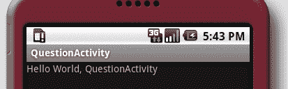
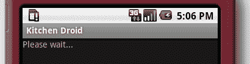
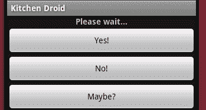
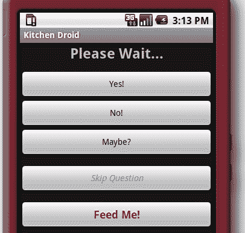
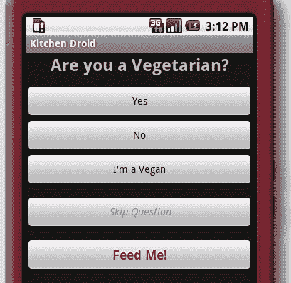

# 第一章：开发一个简单的 Activity

*在 Android 的世界里，`Activity`是您与用户接触的点。这是一个您向用户捕捉和展示信息的屏幕。您可以通过使用以下方式构建您的`Activity`屏幕：XML 布局文件或硬编码的 Java。*

为了开始我们的 Android 用户界面之旅，我们需要一个用户界面作为起点。在本章中，我们将从一个简单的`Activity`开始。我们将：

+   创建一个新的 Android 项目

+   在应用程序资源文件中构建`Activity`布局

+   将资源文件与`Activity`类关联

+   动态填充`Activity`一系列的多项选择题

# 开发我们的第一个示例

对于我们的第一个示例，我们将编写一个多项选择题和答案`Activity`。我们可以将其用于诸如“谁想成为百万富翁？”或“你是什么类型的猴子？”等应用程序。这个示例将通过提问来回答一个非常关键的问题：“我应该吃什么？”当用户回答问题时，这个应用程序将筛选出食物想法的数据库。用户可以在任何时候退出流程以查看建议的餐点列表，或者等到应用程序没有问题可问为止。

由于这是一个用户界面示例，我们将跳过构建筛选器和食谱数据库。我们只向用户询问与食物偏好相关的问题。对于每个问题，我们有一系列预设答案供用户选择（即多项选择题）。他们给出的每个答案都会让我们缩小合适的食谱列表。

# 创建项目结构

在我们开始编写代码之前，我们需要一个项目结构。一个 Android 项目远不止其 Java 代码——还有清单文件、资源、图标等等。为了简化事情，我们使用默认的 Android 工具集和项目结构。

您可以从[`developer.android.com`](http://developer.android.com)为您的常用操作系统下载最新版本的 Android SDK。一个单一的 Android SDK 可以用来开发针对任何数量的目标 Android 版本。您需要遵循网站上的安装说明，在[`developer.android.com/sdk/installing.html`](http://developer.android.com/sdk/installing.html)安装最新的 SDK“入门包”和一个或多个平台目标。本书中的大多数示例将在 Android 1.5 及更高版本上运行。Android 网站还维护了一个非常有用的图表，您可以在上面看到最受欢迎的 Android 版本。

# 动手操作——设置 Android SDK

在为您的操作系统下载了 Android SDK 归档文件之后，您需要安装它，然后至少下载一个 Android 平台包。打开命令行或控制台，完成以下步骤：

1.  解压 Android SDK 归档文件。

1.  更改目录到未打包的 Android SDK 的根目录。

1.  更改目录到 Android SDK 的 `tools` 目录。

1.  通过运行以下命令更新 SDK：

    ```kt
    android update sdk
    ```

1.  通过进入**虚拟设备**屏幕并点击**新建**按钮来创建一个新的虚拟设备。将新的虚拟设备命名为**default**。

1.  将其目标指定为 SDK 下载的最新版本的 Android。将 SD 卡的大小设置为**4096 MiB**。点击**创建 AVD**按钮。

## *刚才发生了什么？*

上述命令告诉新的 Android SDK 安装程序查找可用的软件包并安装它们。这包括安装一个平台软件包。你安装的每个平台软件包都可以用来创建一个**Android 虚拟设备**（**AVD**）。你创建的每个 AVD 都像购买了一个新的设备，可以在其上进行测试，每个设备都有自己的配置和数据。这些是虚拟机，当你要测试时，Android 模拟器将在上面运行你的软件。

# 开始一个新项目的行动时间——

Android SDK 提供了一个便捷的命令行工具，名为 `android`，可用于生成新项目的基本框架。你可以在你的 Android SDK 的 `tools` 目录下找到它。它能够创建基本的目录结构和一个 `build.xml` 文件（用于 Apache Ant），帮助你开始 Android 应用程序开发。你需要确保 `tools` 目录在你的可执行路径中，以便这个工具能够正常工作。打开命令行或控制台。

1.  在你的主目录或桌面上创建一个名为 `AndroidUIExamples` 的新目录。你应该使用这个目录来存储本书中的每个示例。

1.  更改目录到新的 `AndroidUIExamples`。

1.  运行以下命令：

    ```kt
    android create project -n KitchenDroid -p KitchenDroid -k com.packtpub.kitchendroid -a QuestionActivity -t 3
    ```

## *刚才发生了什么*

我们刚刚创建了一个框架项目。在前面的命令行中，我们使用了以下选项来指定新项目的结构：

| 选项 | 描述 |
| --- | --- |
| `-n` | 给项目一个名字，在我们的例子中是 `KitchenDroid`。这实际上只是项目的内部标识符。 |
| `-p` | 指定项目的基目录。在这种情况下，使用与项目相同的名称。`android`工具将为你创建这个目录。 |
| `-k` | 指定应用程序的根 Java 包。这是一个相当重要的概念，因为它定义了我们在 Android 客户端设备上的唯一命名空间。 |
| `-a` | 为工具提供一个“主” `Activity` 类的名称。这个类将被填充一个基本的布局 XML，并作为构建你的应用程序的基础点。框架项目将预先配置为在启动时加载这个 `Activity`。 |

如果你运行命令 `android list targets`，并且它提供了一个可能的空目标列表，那么你没有下载任何 Android 平台软件包。你通常可以单独运行 android 工具，并使用其图形界面下载和安装 Android 平台软件包。前面的示例使用 API 级别 3，对应于 Android 平台版本 1.5。

## 检查 Android 项目布局

一个典型的 Android 项目几乎拥有与企业级 Java 项目一样多的目录和文件。Android 既是一个框架，也是一个操作系统环境。在某种程度上，你可以将 Android 视为为在手机和其他有限设备上运行而设计的应用容器。

作为新项目结构的一部分，你将拥有以下重要文件和目录：

| 文件夹名称 | 描述 |
| --- | --- |
| `bin` | 编译器将把你的二进制文件放在这个目录中。 |
| `gen` | 由各种 Android 工具生成的源代码。 |
| `res` | 应用资源放在这里，将与你的应用一起编译和打包。 |
| `src` | 默认的 Java 源代码目录，`build`脚本将在这里查找要编译的源代码。 |
| `AndroidManifest.xml` | 你的应用描述符，类似于`web.xml`文件。 |

### 提示

**资源类型和文件**

大多数应用资源类型（位于`res`目录中）会受到 Android 应用打包器的特殊处理。这意味着这些文件占用的空间比它们通常情况下要少（因为 XML 会被编译成二进制格式，而不是保持纯文本形式）。你可以通过各种方式访问资源，但始终要通过 Android API（它会为你将这些资源解码成它们的原始形式）。

`res`的每个子目录表示不同的文件格式。因此，你不能直接将文件放入根`res`目录中，因为打包工具不知道如何处理它（你将得到一个编译错误）。如果你需要以原始状态访问一个文件，请将其放在`res/raw`目录中。`raw`目录中的文件会以字节为单位复制到你的应用程序包中。

# 动手操作时间——运行示例项目

android 工具为我们提供了一个最小的 Android 项目示例，基本上是一个“Hello World”应用。

1.  在你的控制台或命令行中，切换到`KitchenDroid`目录。

1.  要构建并签名项目，请运行：

    ```kt
    ant debug
    ```

1.  你需要启动之前创建的`default` AVD：

    ```kt
    emulator -avd default
    ```

1.  现在在模拟器中安装你的应用：

    ```kt
    ant install
    ```

1.  在模拟器中，打开**Android**菜单，你应在菜单中看到一个名为**QuestionActivity**的图标。点击这个图标。

## *刚才发生了什么？*

Android 模拟器是一个完整的硬件模拟器，包括 ARM CPU，承载整个 Android 操作系统栈。这意味着在模拟器下运行软件将完全和在裸机硬件上运行一样（尽管速度可能会有所不同）。

当你使用 Ant 部署你的 Android 应用时，需要使用`install` Ant 目标。`install` Ant 目标会寻找正在运行的模拟器，然后将应用归档文件安装到它的虚拟内存中。需要注意的是，Ant 不会为你启动模拟器。相反，它会发出错误，并且构建会失败。

### 提示

**应用签名**

每个 Android 应用程序包都是数字签名的。签名用于将你标识为应用程序的开发者，并建立应用程序的权限。它还用于建立应用程序之间的权限。

通常你会使用自签名证书，因为 Android 并不要求你使用证书授权机构。然而，所有应用程序必须进行签名，以便它们能够被 Android 系统运行。

# 屏幕布局

虽然 Android 允许你通过 Java 代码或通过在 XML 文件中声明布局来创建屏幕布局，但我们将在 XML 文件中声明屏幕布局。这是一个重要的决定，原因有几个。首先，使用 Java 代码中的 Android 小部件需要为每个小部件编写多行代码（声明/构造行，调用 setter 的几行，最后将小部件添加到其父级），而在 XML 中声明的小部件只占用一个 XML 标签。

将布局保持为 XML 的第二个原因是，当它存储在 APK 文件中时，会被压缩成特殊的 Android XML 格式。因此，你的应用程序在设备上占用的空间更少，下载时间更短，由于需要加载的字节码更少，其内存大小也更小。XML 在编译期间还会由 Android 资源打包工具进行验证，因此具有与 Java 代码相同类型的安全性。

将布局保持为 XML 的第三个原因是，它们需要经过与其他所有外部资源相同的选择过程。这意味着布局可以根据任何定义的属性进行变化，例如语言、屏幕方向和大小，甚至是一天中的时间。这意味着你可以在未来简单通过添加新的 XML 文件，来添加对同一布局的新变体，而无需更改任何 Java 代码。

## 布局 XML 文件

为了让 Android 打包工具能够找到它们，所有的 XML 布局文件必须放在你的 Android 项目的`/res/layout`目录下。每个 XML 文件将生成一个同名的资源变量。例如，如果我们将文件命名为`/res/layout/main.xml`，那么我们可以在 Java 中通过`R.layout.main`访问它。

由于我们将屏幕布局构建为一个资源文件，它将由应用程序资源加载器加载（在资源编译器编译后）。资源需要经过选择过程，因此尽管应用程序只加载一个资源，但在应用程序包中可能有多个相同资源的可用版本。这个选择过程也是 Android 国际化的基础。

如果我们想为几种不同类型的触摸屏构建用户界面布局的不同版本，Android 为我们定义了三种不同的触摸屏属性：`notouch`、`stylus`和`finger`。这大致相当于：没有触摸屏、电阻式触摸屏和电容式触摸屏。如果我们想为没有触摸屏的设备定义一个更依赖键盘的用户界面（`notouch`），我们可以编写一个新的布局 XML 文件，命名为`/res/layout-notouch/main.xml`。当我们在`Activity`代码中加载资源时，资源选择器会在我们运行的设备没有触摸屏时选择`notouch`版本的屏幕。

### 资源选择限定符

这里是一组常用的限定符（属性名），当 Android 选择要加载的资源文件时会考虑这些限定符。这个表格是按优先级排序的，最重要的属性在顶部。

| 名称 | 描述 | 示例 | API 级别 |
| --- | --- | --- | --- |
| MCC 和 MNC | 移动国家代码（MCC）和移动网络代码（MNC）。这些可以用来确定设备中的 SIM 卡绑定的是哪个移动运营商和国家。移动网络代码可选地跟随移动国家代码，但单独使用是不被允许的（你必须首先指定国家代码）。 | `mcc505``mcc505-mnc03``mcc238``mcc238-mnc02``mcc238-mnc20` | 1 |
| 语言和地区代码 | 语言和地区代码可能是最常使用的资源属性。通常，这是你根据用户语言偏好本地化应用程序的方式。这些值是标准的 ISO 语言和地区代码，并且不区分大小写。你不能没有国家代码指定一个地区（类似于`java.util.Locale`）。 | `en``en-rUS``es``es-rCL``es-rMX` | 1 |

| 屏幕尺寸 | 这个属性只有三种变化：小、中、大。这个值基于可使用的屏幕空间量：

+   小型：QVGA（320×240 像素）低密度类型的屏幕；

+   中型：WQVGA 低密度，HVGA（480x360 像素）中密度，以及 WVGA 高密度类型的屏幕；

+   大型：VGA（640x480 像素）或 WVGA 中密度类型的屏幕

| `small``medium``large` | 4 |
| --- | --- |
| 屏幕宽高比 | 这是基于设备“正常”使用方式的屏幕宽高比类型。这个值不会因为设备的方向改变而改变。 | `long``notlong` | 4 |
| 屏幕方向 | 用于确定设备当前是处于竖屏（`port`）还是横屏（`land`）模式。这只有在能检测到方向的设备上可用。 | `land``port` | 1 |
| 夜间模式 | 这个值简单地根据一天中的时间改变。 | `night``notnight` | 8 |

| 屏幕密度（DPI） | 设备屏幕的 DPI。这个属性有四个可能的值：

+   `ldpi`：低密度，大约 120dpi；

+   `mdpi`：中密度，大约 160dpi；

+   `hdpi`：高密度，大约 240dpi；

+   `nodpi`: 可用于不应该根据屏幕密度进行缩放的`bitmap`资源。

| `ldpi``mdpi``hdpi``nodpi` | 4 |
| --- | --- |
| 键盘状态 | 设备上可用的键盘类型是什么？这个属性不应该用来确定设备是否有硬件键盘，而应该用来确定键盘（或软件键盘）当前是否对用户可见。 | `keysexposed``keyshidden``keyssoft` | 1 |

# 动手操作时间——设置问题活动

为了开始，我们将使用 Android 最简单的布局，称为：`LinearLayout`。与 Java AWT 或 Swing 不同，Android 布局管理器被定义为特定的容器类型。因此，`LinearLayout`就像一个带有内置`LayoutManager`的`Panel`。如果您使用过 GWT，您会对这个概念非常熟悉。我们将以简单的从上到下结构（`LinearLayout`非常适合）来布局屏幕。

1.  在您喜欢的 IDE 或文本编辑器中打开项目`/res/layout`目录下名为`main.xml`的文件。

1.  删除任何模板 XML 代码。

1.  将以下 XML 代码复制到文件中：

    ```kt
    <?xml version="1.0" encoding="UTF-8"?>

    <LinearLayout

        android:orientation="vertical"
        android:layout_width="fill_parent"
        android:layout_height="wrap_content">

    </LinearLayout>
    ```

## *刚才发生了什么？*

我们刚刚移除了“Hello World”示例，并放入了一个完全空的布局结构，这将成为我们构建剩余用户界面的平台。如您所见，Android 为其资源有一个特殊的 XML 命名空间。

### 注意

Android 中的所有资源类型都使用相同的 XML 命名空间。

我们将根元素声明为`LinearLayout`。这个元素直接对应于类`android.widget.LinearLayout`。每个带有 Android 命名空间前缀的元素或属性都对应于由 Android 资源编译器解释的属性。

AAPT（Android 资源打包工具）将生成一个`R.java`文件到您的根（或主要）包中。这个文件包含了用于引用各种应用资源的 Java 变量。在我们的例子中，我们有`/res/layout`目录中的`main.xml`包。这个文件变成了一个`R.layout.main`变量，并分配一个常数作为其标识。

# 填充`View`和`ViewGroup`。

在 Android 中，一个控件被称为`View`，而一个容器（如`LinearLayout`）是`ViewGroup`。现在我们有一个空的`ViewGroup`，但我们需要开始填充它以构建我们的用户界面。虽然可以将`ViewGroup`嵌套在另一个`ViewGroup`对象中，但`Activity`只有一个根`View`——因此布局 XML 文件只能有一个根`View`。

# 动手操作时间——提出问题

为了向用户提问，你需要将`TextView`添加到布局的顶部。`TextView`有点像`Label`或`JLabel`。它也是许多其他显示文本的 Android `View`小部件的基础类。我们希望它占用所有可用的水平空间，但只需足够的垂直空间让我们的问题适应。我们用**请稍等...**作为其默认文本填充`TextView`。稍后，我们将用动态选择的问题替换它。

1.  回到你的`main.xml`文件。

1.  在`<LinearLayout...>`和`</LinearLayout>`之间创建一个`<TextView />`元素，使用空元素`/>`语法结束，因为代表`View`对象的元素不允许有子元素。

1.  为`TextView`元素设置一个 ID 属性：

    ```kt
    android:id="@+id/question"
    ```

1.  将布局的宽度和高度属性分别更改为`fill_parent`和`wrap_content`（与`LinearLayout`元素相同）：

    ```kt
    android:layout_width="fill_parent"
    android:layout_height="wrap_content"
    ```

1.  为`TextView`设置一些占位文本，以便我们可以在屏幕上看到它：

    ```kt
    android:text="Please wait..."
    ```

1.  从项目根目录使用 Apache Ant 重新安装应用程序：

    ```kt
    ant install
    ```

1.  再次在模拟器中运行应用程序，它应该看起来像以下截图：



`TextView`的代码最终看起来应该像这样：

```kt
<TextView android:id="@+id/question"
          android:text="Please wait..."
          android:layout_width="fill_parent"
          android:layout_height="wrap_content"/>
```

## *刚才发生了什么*

在前面的示例中，我们将`fill_parent`和`wrap_content`用作布局宽度和高度属性的值。`fill_parent`的值是一个特殊值，始终等于父视图的大小。如果它用作`android:layout_width`属性的值（如我们的示例所示），那么它就是父视图的宽度。如果它在`android:layout_height`属性中使用，那么它将等于父视图的高度。

`wrap_content`的值在 Java AWT 或 Swing 中类似于首选大小。它告诉`View`对象，“占用你所需要的空间，但不要更多”。这些特殊属性值唯一有效的使用地方是`android:layout_width`和`android:layout_height`属性中。其他任何地方使用都会导致编译错误。

我们稍后需要在 Java 代码中访问这个`TextView`，以便调用其`setText`方法（该方法直接对应于我们用于占位文本的`android:text`属性）。通过为资源分配 ID，创建了对资源变量的 Java 引用。在这个例子中，ID 在这里声明为`@+id/question`。AAPT 将为`id`类型的每个资源生成一个`int`值作为标识符，作为你的`R`类的一部分。ID 属性还用于从另一个资源文件访问资源。

# 动手时间——添加答案的空间

向用户提问当然很好，但我们还需要给他们提供回答问题的方法。我们有几种选择：可以使用带有`RadioButton`的`RadioGroup`来表示每个可能的答案，或者使用带有每个答案项的`ListView`。然而，为了最小化所需的交互，并尽可能清晰，我们为每个可能的答案使用一个`Button`。但这稍微有些复杂，因为你在布局 XML 文件中不能声明可变数量的`Button`对象。相反，我们将声明一个新的`LinearLayout`，并在 Java 代码中使用`Button`对象填充它。

1.  在我们提出问题的`TextView`下方，你需要添加一个`<LinearLayout />`元素。虽然这个元素通常会有子元素，但在我们的案例中，可能答案的数量是变化的，所以我们将其留为一个空元素。

1.  默认情况下，`LinearLayout`会将它的子`View`对象水平排列。然而，我们希望每个子`View`垂直排列，因此你需要设置`LinearLayout`的`orientation`属性：

    ```kt
    android:orientation="vertical"
    ```

1.  我们稍后需要在 Java 代码中填充新的`ViewGroup`（`LinearLayout`），所以给它一个 ID：`answers`：

    ```kt
    android:id="@+id/answers"
    ```

1.  与我们的`TextView`和根`LinearLayout`一样，将宽度设置为`fill_parent`：

    ```kt
    android:layout_width="fill_parent"
    ```

1.  将高度设置为`wrap_content`，使其不会占用比所有按钮更多的空间：

    ```kt
    android:layout_height="wrap_content"
    ```

最终代码应如下所示：

```kt
<LinearLayout android:id="@+id/answers"
              android:orientation="vertical"
              android:layout_width="fill_parent"
              android:layout_height="wrap_content"/>
```

## *刚才发生了什么？*

你可能已经注意到，对于这个例子，我们新的`LinearLayout`中没有内容。这可能看起来有些不寻常，但在这个案例中，我们希望用可变数量的按钮填充它——针对多项选择题的每个可能答案一个。然而，对于示例的下一部分，我们需要在这个`LinearLayout`中添加一些简单的内容`Button`小部件，以便我们可以看到整个屏幕布局的效果。在你的布局资源文件中使用以下代码，向`LinearLayout`添加**Yes!**，**No!**和**Maybe?** `Button`小部件：

```kt
<LinearLayout android:id="@+id/answers"
            android:orientation="vertical"
            android:layout_width="fill_parent"
            android:layout_height="wrap_content">

    <Button android:id="@+id/yes"
            android:text="Yes!"
            android:layout_width="fill_parent"
            android:layout_height="wrap_content" />

    <Button android:id="@+id/no"
            android:text="No!"
            android:layout_width="fill_parent"
            android:layout_height="wrap_content" />

    <Button android:id="@+id/maybe"
            android:text="Maybe?"
            android:layout_width="fill_parent"
            android:layout_height="wrap_content" />
</LinearLayout>
```

在 Android XML 布局资源中，任何从`ViewGroup`类扩展的`View`类都被视为容器。向它们添加小部件就像将那些`View`元素嵌套在`ViewGroup`的元素内（而不是用没有子 XML 元素的闭合它）一样简单。

以下是前述**Yes!**，**No!**，**Maybe?**选项的屏幕截图：



# 动手时间——添加更多按钮

我们还需要向屏幕布局添加两个额外的按钮。一个将允许用户跳过当前问题；另一个将允许他们查看到目前为止我们已过滤的简短餐单列表（基于他们已经回答的问题）。

1.  首先，在我们答案`ViewGroup <LinearLayout />`下方（但仍在根`LinearLayout`元素内）创建一个空的`<Button />`元素。给它分配 ID `skip`，这样我们就可以在 Java 中引用它：

    ```kt
    android:id="@+id/skip"
    ```

1.  使用边距为答案和新按钮之间创建一些填充：

    ```kt
    android:layout_marginTop="12sp"
    ```

1.  给它显示标签 **跳过问题**：

    ```kt
    android:text="Skip Question"
    ```

1.  与所有之前的控件一样，宽度应为`fill_parent`，高度应为`wrap_content`：

    ```kt
    android:layout_width="fill_parent"
    android:layout_height="wrap_content"
    ```

1.  现在，在**跳过问题**按钮下方创建另一个空的 `<Button />` 元素。

1.  新按钮的 ID 应为 `view`：

    ```kt
    android:id="@+id/view"
    ```

1.  我们希望这个按钮显示文本：**Feed Me!**：

    ```kt
    android:text="Feed Me!"
    ```

1.  再次，在**跳过问题**按钮和新**Feed Me!**按钮之间放置一点空间：

    ```kt
    android:layout_marginTop="12sp"
    ```

1.  最后，将**Feed Me!**按钮的宽度和高度设置为与我们迄今为止创建的其他元素一样：

    ```kt
    android:layout_width="fill_parent"
    android:layout_height="wrap_content"

    ```

完成这两个按钮后，你的布局 XML 文件现在应该以以下内容结束：

```kt
    <Button android:id="@+id/skip"
            android:text="Skip Question"
            android:layout_marginTop="12sp"
            android:layout_width="fill_parent"
            android:layout_height="wrap_content"/>

    <Button android:id="@+id/view"
            android:text="Feed Me!"
            android:layout_marginTop="12sp"
            android:layout_width="fill_parent"
            android:layout_height="wrap_content"/>
</LinearLayout>
```

## *刚才发生了什么*

将不相关的用户界面对象分开是用户界面设计的一个非常重要的部分。可以通过空白、边框或盒子将项目组分开。在我们的案例中，我们选择使用空白，因为空间也有助于让用户界面感觉更清洁。

我们通过在每个按钮上方使用边距来创建空白空间。边距和填充的工作方式与 CSS 中的（应该）完全一样。边距是控件外的空间，而填充是控件内的空间。在 Android 中，边距是`ViewGroup`的关注点，因此其属性名称以`layout_`为前缀。由于填充是`View`对象的责任，因此填充属性没有这样的前缀：

```kt
<Button android:id="@+id/view"
        android:text="Feed Me!"
        android:padding="25sp"
        android:layout_marginTop="12sp"
        android:layout_width="fill_parent"
        android:layout_height="wrap_content"/>
```

之前的代码会在`Button`的边缘和中间文本之间创建额外的空间，同时保留按钮上方的边距。

前一个示例中的所有测量单位均为`sp`，它是“与比例无关的像素”的缩写。与 CSS 类似，你可以在你指定的尺寸单位后缀上测量数字。Android 识别以下测量单位：

| 单位后缀 | 全名 | 描述和用途 |
| --- | --- | --- |
| `px` | 像素 | 设备屏幕上的一个精确像素。这个单位在编写桌面应用程序时最常见，但随着手机屏幕尺寸的多样化，它变得较难使用。 |
| `in` | 英寸 | 一英寸（或最接近的近似值）。这是基于屏幕的物理尺寸。如果你需要与实际世界尺寸一起工作，这很棒，但由于设备屏幕尺寸的变异，它并不总是非常有用。 |
| `mm` | 毫米 | 另一个实际尺寸的测量，尽可能近似。这仅是英寸的公制版本：1 英寸等于 25.4 毫米。 |
| `pt` | 点 | 点的大小为 1/72 英寸。与毫米和英寸类似，它们对于与实际尺寸相对的大小调整非常有用。它们也常用于调整字体大小，因此相对于字体大小来说非常好用。 |
| `dp` 或 `dip` | 密度独立像素 | 单个 DP 在 160 dpi 的屏幕上与单个像素大小相同。这个大小并不总是成比例的，也不总是精确的，但它是当前屏幕的最佳近似值。 |
| `sp` | 比例独立像素 | 与`dp`单位类似，它是根据用户选择的字体大小缩放的像素。这可能是最佳的单位，因为它是基于用户选择的参数。用户可能因为觉得屏幕难以阅读而增加了字体大小。使用`sp`单位可以确保你的用户界面随之缩放。 |

## 定义通用尺寸

安卓还允许你定义自己的尺寸值作为资源常量（注意：是尺寸，不是测量）。当你想要多个`view`组件大小相同，或者定义一个通用的字体大小时，这会很有用。包含尺寸声明的文件放在项目的`/res/values`目录中。实际的文件名并不重要，常见的名称是`dimens.xml`。从技术上讲，尺寸可以与其他值类型（即字符串）一起包含，但这并不推荐，因为它使得在运行时追踪应用的尺寸变得更加困难。

将尺寸放在它们自己的文件中，而不是内联声明的一个优点是，你可以根据屏幕大小对它们进行本地化。这使得与屏幕分辨率相关的刻度（如像素）更加有用。例如，你可以将一个`dimens.xml`文件放入`/res/values-320x240`目录中，并带有不同的值，再将同一尺寸的另一个版本放入`/res/values-640x480`目录中。

尺寸资源文件是一个简单的值文件（类似于`strings.xml`），但是尺寸是通过`<dimen>`标签定义的：

```kt
<resources>
    <dimen name="half_width">160px</dimen>
</resources>
```

要在布局 XML 文件中作为大小访问，你可以使用资源引用（这与访问资源字符串的方式类似）：

```kt
<TextView layout_width="@dimen/half_width" />
```

构建一个通用尺寸列表在构建复杂布局时会很有帮助，这些布局将在许多不同的屏幕上看起来都很好，因为它避免了需要构建几个不同的布局 XML 文件。

## 尝试改进样式的大侠——提升样式

现在我们有了这个用户界面最基本的结构，但它看起来并不太好看。除了答案按钮之间的边距，以及**跳过问题**和**给我提示！**按钮之外，你几乎无法区分它们。我们需要让用户知道这些按钮各司其职。同时，我们也需要让问题更加突出，尤其是如果他们没有太多时间在屏幕上眯着眼看的时候。你可能需要安卓的文档，可以在网上找到，地址是[`developer.android.com/reference/`](http://developer.android.com/reference/)。

我们在屏幕顶部有一个问题，但正如你在之前的屏幕截图中看到的，它并不突出。因此，对于用户来说，他们需要做什么并不是非常清晰（尤其是第一次使用该应用程序时）。

尝试对屏幕顶部的题目`TextView`进行以下样式更改。这只需要你为其 XML 元素添加一些属性：

1.  文本居中。

1.  使文本加粗。

1.  将文本大小改为`24sp`。

1.  在问题和答案按钮之间添加`12sp`的间距

**喂我！**按钮也非常重要。这是让用户访问应用程序根据他们的答案过滤出的建议食谱列表的按钮，所以它应该看起来不错。

以下样式应该有助于**喂我！**按钮很好地突出（提示：`Button`继承自`TextView`）：

1.  将文本大小设置为`18sp`。

1.  将文本颜色改为好看的红色`#9d1111`。

1.  将文本样式设置为加粗。

1.  添加文本阴影：`x=0`，`y=-3`，`radius=1.5`，`color=white`（"`#fff`"）。

当你完成屏幕样式的调整后，它应该看起来像以下截图：



# 布局 XML 格式的限制

布局 XML 格式最明显的限制之一是，你不能基于外部变量动态填充`Activity`的一部分——XML 文件中没有循环或方法。

在我们的示例中，这种限制以空`LinearLayout`的形式出现。因为每个问题都有任意数量的可能答案，我们需要在组内变动数量的按钮。对于我们的目的，我们将在 Java 代码中创建`Button`对象并将它们放入`LinearLayout`。

XML 布局格式另一个失败的地方是动态引用外部资源。这可以在我们的示例中看到，我们在`TextView`元素上放置了占位符文本——`question`的`android:text`属性。我们可以使用以下语法引用外部字符串：

```kt
<TextView android:id="@+id/question"
          android:text="@string/question"
          android:gravity="center"
          android:textStyle="bold"
          android:layout_width="fill_parent"
          android:layout_height="wrap_content"/>
```

这将有效地引用`strings.xml`文件中的静态变量。它不适合动态选择的问题，每次初始化`Activity`时都会改变。

## 突击测验

1.  你有什么理由用 XML 而不是纯 Java 代码来编写你的布局？

    1.  安卓可以从外部读取布局文件以进行优化。

    1.  布局成为资源选择过程的一部分。

    1.  你的用户可以从 App Store 下载新的布局。

    1.  布局可以应用自定义主题。

1.  我们如何使**下一题**按钮的文本加粗？

    1.  使用`android:typeface`属性。

    1.  创建一个自定义的`Button`实现。

    1.  添加一个 CSS 属性：`style="font-weight: bold"`。

    1.  使用`android:textStyle`属性。

1.  如果我们将`LinearLayout`从`vertical`方向改为`horizontal`方向，会发生什么？

    1.  布局会侧翻。

    1.  所有小部件在屏幕上会被挤压在一起。

    1.  只有问题的`TextView`会显示在屏幕上。

    1.  根据可用的像素数量，问题以及可能的其他`View`对象可能会显示在屏幕上。

    1.  布局将溢出，导致小部件紧挨着出现在多行上。

# 填充 QuestionActivity

我们有一个基本用户界面，但现在它是静态的。我们可能想要向用户提出许多不同的问题，每个问题都有不同的答案。我们还可能以某种方式改变我们提出的问题。简而言之，我们需要一些 Java 代码来填充布局，加入一个问题及一些可能的答案。我们的问题由两部分组成：

+   问题

+   可能答案的列表

在此示例中，我们将利用字符串数组资源来存储所有问题和答案数据。我们将使用一个字符串数组来列出问题标识符，然后为每个问题及其答案使用一个字符串数组。这种方法的优势与使用布局 XML 文件而不是硬编码的优势非常相似。你的项目的`res/values`目录中将有一个自动生成的`strings.xml`文件。这个文件包含了你希望应用程序使用的字符串和字符串数组资源。以下是我们`strings.xml`文件的开始部分，其中包含两个要问用户的问题：

```kt
<?xml version="1.0" encoding="UTF-8"?>

<resources>
    <string name="app_name">Kitchen Droid</string>

    <string-array name="questions">
        <item>vegetarian</item>
        <item>size</item>
    </string-array>

    <string-array name="vegetarian">
        <item>Are you a Vegetarian?</item>
        <item>Yes</item>
        <item>No</item>
        <item>I\'m a vegan</item>
    </string-array>

    <string-array name="size">
        <item>How much do you feel like eating?</item>
        <item>A large meal</item>
        <item>Just a nice single serving of food</item>
        <item>Some finger foods</item>
        <item>Just a snack</item>
    </string-array>
</resources>
```

每个问题数组(`vegetarian`和`size`)的第一个条目是问题本身，而随后的每个条目都是一个答案。

# 行动时间——编写更多的 Java 代码

1.  打开编辑器或 IDE 中的`QuestionActivity.java`文件。

1.  在包声明下方导入 Android 的`Resources`类：

    ```kt
    import android.content.res.Resources;
    ```

1.  为了从你的`strings.xml`文件开始提问，你需要一个方法来查找`questions <string-array>`并找到包含当前问题的数组名称。这通常不是你在应用程序资源中需要做的事情——它们的标识符通常通过`R`类为你所知。但在此情况下，我们想要按照`questions <string-array>`中定义的顺序进行操作，这使得事情变得有些复杂：

    ```kt
    private int getQuestionID(Resources res, int index) {
    ```

1.  现在我们可以查看`questions`字符串数组，它包含了每个问题的标识名称（我们的索引字符串数组）：

    ```kt
    String[] questions = res.getStringArray(R.array.questions);
    ```

1.  我们有一个问题数组，需要找到标识符值。这类似于对`vegetarian`问题使用`R.array.vegetarian`，只不过这是一个动态查找，因此比正常情况要慢得多。通常情况下，以下这行代码是不推荐的，但对我们来说非常有用：

    ```kt
    return res.getIdentifier(
            questions[index],
            "array",
            "com.packtpub.kitchendroid");
    ```

1.  `QuestionActivity`类将向用户展示几个问题。我们希望应用程序能够与手机及其环境"友好相处"。因此，每个问题都将在`QuestionActivity`的新实例中提出（允许设备控制我们`Activity`的显示）。然而，这种方法引发了一个重要问题：我们如何知道要向用户提出的问题的索引？答案是：我们的`Intent`。`Activity`是通过一个`Intent`对象启动的，每个`Intent`对象可能携带任何数量的"额外"信息（类似于`HttpServletRequest`接口中的请求属性），供`Activity`使用，有点像`main`方法的参数。所以，`Intent`也像一个`HashMap`，包含供`Activity`使用的特殊数据。在我们的例子中，我们使用了一个名为`KitchenDroid.Question`的整型属性：

    ```kt
    private int getQuestionIndex() {
        return getIntent().getIntExtra("KitchenDroid.Question", 0);
    }
    ```

这两种方法构成了我们填充问题屏幕和按定义好的问题列表进行导航的基础。完成时，它们应该看起来像这样：

```kt
private static int getQuestionID(
        final Resources res,
        final int index) {

    final String[] questions = res.getStringArray(R.array.questions);

    return res.getIdentifier(
            questions[index],
            "array",
            "com.packtpub.kitchendroid");
}

private int getQuestionIndex() {
    return getIntent().getIntExtra("KitchenDroid.Question", 0);
}
```

## *刚才发生了什么*

`getQuestionID`方法非常直接。在我们的代码中，我们使用`R.array.questions`来访问`<string-array>`，它标识了我们将要向用户提出的所有问题。每个问题都有一个`String`形式的名称，以及一个`int`形式的对应资源识别号。

在`getQuestionID`方法中，我们使用了`Resources.getIdentifier`方法，该方法用于查找给定资源名称的资源标识符（整数值）。该方法的第二个参数是要查找的资源类型。这个参数通常是生成的`R`类的内部类。最后，我们传递了资源所在的基包。除了这三个参数，你也可以通过完整的资源名称来查找资源：

```kt
return res.getIdentifier(
        "com.packtpub.kitchendroid:array/" + questions[index],
        null,
        null);
```

`getQuestionIndex`方法告诉我们当前在`questions <string-array>`中的位置，从而确定要向用户提出哪个问题。这是基于触发`Activity`的`Intent`中的"额外"信息。`getIntent()`方法为你提供了访问触发你`Activity`的`Intent`的途径。每个`Intent`可以有任何数量的"额外"数据，这些数据可以是任何"原始"或"可序列化"的类型。这里我们从`Intent`中获取了`KitchenDroid.Question`额外的整数值，如果没有设置则替换为 0（即默认值）。如果用户点击菜单中的图标，Android 没有指定该值，那么我们从第一个问题开始。

# 动态创建小部件

到目前为止，我们只使用了布局 XML 文件来填充我们的屏幕。在某些情况下，这还不够。在这个简单的例子中，我们希望用户有一个按钮列表，他们可以点击来回答提出的问题。我们可以预先创建一些按钮并将它们命名为`button1`、`button2`等，但这意味着限制了可能的答案数量。

为了从我们的 `<string-array>` 资源中创建按钮，我们需要在 Java 中进行操作。我们之前创建了一个 `ViewGroup`（以我们命名为 `answers` 的 `LinearLayout` 的形式）。这就是我们将添加动态创建的按钮的地方。

# 是时候采取行动了——将问题显示在屏幕上。

你的应用程序现在知道去哪里找问题来询问，也知道应该询问哪个问题。现在它需要将问题显示在屏幕上，并允许用户选择答案。

1.  在编辑器或 IDE 中打开 `main.xml` 文件。

1.  从布局资源中移除 **Yes!**、**No!** 和 **Maybe?** `Button` 元素。

1.  在编辑器或 IDE 中打开 `QuestionActivity.java` 文件。

1.  我们需要一个新的类字段来保存动态创建的 `Button` 对象（作为引用）：

    ```kt
    private Button[] buttons;
    ```

1.  为了保持整洁，创建一个新的 `private` 方法来将问题显示在屏幕上：`initQuestionScreen`：

    ```kt
    private void initQuestionScreen() {
    ```

1.  在这个方法中，我们假设布局 XML 文件已经加载到 `Activity` 屏幕中（即，在 `onCreate` 中 `setContentView` 之后将被调用）。这意味着我们可以将布局的部分作为 Java 对象来查找。我们需要 `TextView` 名为 `question` 和 `LinearLayout` 名为 `answers` 的这两个对象：

    ```kt
    TextView question = (TextView)findViewById(R.id.question);
    ViewGroup answers = (ViewGroup)findViewById(R.id.answers);
    ```

1.  这两个变量需要用问题和其可能的答案来填充。为此，我们需要 `<string-array>`（来自我们的 `strings.xml` 文件），其中包含这些数据，因此我们需要知道当前问题的资源标识符。然后我们可以获取实际的数据数组：

    ```kt
    int questionID = getQuestionID(resources, getQuestionIndex());
    String[] quesionData = resources.getStringArray(questionID);
    ```

1.  `question` 字符串数组的第一个元素是向用户提出的问题。接下来的 `setText` 调用与在布局 XML 文件中指定 `android:text` 属性完全相同：

    ```kt
    question.setText(quesionData[0]);
    ```

1.  然后我们需要创建一个空数组来保存对我们 `Button` 对象的引用：

    ```kt
    int answerCount = quesionData.length – 1;
    buttons = new Button[answerCount];
    ```

1.  现在我们准备填充屏幕了。根据我们的数组，对每个答案值进行 `for` 循环：

    ```kt
    for(int i = 0; i < answerCount; i++) {
    ```

1.  从数组中获取每个答案，跳过索引为零的问题字符串：

    ```kt
    String answer = quesionData[i + 1];
    ```

1.  为答案创建一个 `Button` 对象并设置其标签：

    ```kt
    Button button = new Button(this);
    button.setText(answer);
    ```

1.  最后，我们将新的 `Button` 添加到我们的 answers 对象（`ViewGroup`）中，并在我们的 `buttons` 数组中引用它（我们稍后会需要它）：

    ```kt
    answers.addView(button);
    buttons[i] = button;
    ```

1.  做完这些之后，在 `onCreate` 中的 `setContentView` 调用之后，我们需要调用我们新的 `initQuestionScreen` 方法。

## *刚才发生了什么？*

`findViewById` 方法遍历 `View` 对象的树，寻找特定的标识整数值。默认情况下，任何在资源文件中使用 `android:id` 属性声明的资源都将有一个关联的 ID。你也可以通过使用 `View.setId` 方法手动分配一个 ID。

与许多其他用户界面 API 不同，Android 用户界面 API 更倾向于 XML 开发而非纯 Java 开发。这一点的完美例证是`View`子类有三个不同的构造函数，其中两个是为与 XML 解析 API 配合使用而设计的。我们无法在构造函数中填充`Button`标签（像大多数其他 UI API 那样），而是被迫先构造对象，然后使用`setText`来定义其标签。

你传给每个`View`对象构造函数的是`Context`对象。在前面示例中，你将`Activity`对象作为`this`传递给答案`Button`对象的构造函数中。`Activity`类从`Context`类继承。`Context`对象被`View`和`ViewGroup`对象用来加载它们为了正确运行所需的应用程序资源和服务。

现在你可以尝试运行应用程序，在这种情况下，你会看到以下屏幕。你可能已经注意到这个截图中还有额外的样式。如果你没有这个，你可能需要回溯到之前的*尝试一下英雄*部分。



# 在 Android 中处理事件

Android 用户界面事件的工作方式与 Swing 事件监听器或 GWT 事件处理程序非常相似。根据你想接收的事件类型，实现一个接口并将一个实例传递给你希望从中接收事件的小部件。在我们的例子中，我们有`Button`小部件，当用户触摸时会触发点击事件。

事件监听接口在许多 Android 类中声明，因此没有一个单独的地方可以查找它们。而且，与大多数事件监听系统不同，许多小部件可能只有一个给定类型的事件监听器。你可以通过类名前缀为`On`来识别事件监听接口（类似于 HTML 事件属性）。为了监听小部件上的点击事件，你会使用`View.setOnClickListener`方法来设置其`OnClickListener`。

下面的代码片段展示了如何向`Button`对象添加一个点击监听器来显示一个`Toast`。`Toast`是一个小型的弹出框，会短暂显示以向用户提供一些信息：

```kt
button.setOnClickListener(new View.OnClickListener() {
    public void onClick(View clicked) {
        Toast.makeText(this, "Button Clicked!", Toast.LENGTH_SHORT).
             show();
    }
});
```

前面的事件监听器被声明为一个匿名内部类，当你需要将类似的事件监听器传递给许多不同的组件时，这样做是可以的。然而，大多数情况下，你会在 XML 布局资源中声明的组件上监听事件。在这些情况下，最好让你的`Activity`类实现所需的接口，或者为不同的事件驱动操作创建专门的类。尽管 Android 设备非常强大，但与台式电脑或笔记本电脑相比，它们仍然有限制。因此，你应该避免创建不必要的对象，以节省内存。通过将尽可能多的事件监听器方法放在已经创建的对象中，你可以降低所需的资源开销。

## 小测验

1.  当你在布局 XML 文件中声明一个对象时，你如何获取其 Java 对象？

    1.  对象将在`R`类中声明。

    1.  使用`Activity.findViewById`方法。

    1.  使用`Resources.getLayout`方法。

    1.  对象将被注入到`Activity`类中的一个字段中。

1.  在 Android 应用程序中监听事件的“最佳”方式是什么？

    1.  将监听器声明为匿名内部类。

    1.  为每个`Activity`创建一个单独的事件监听器类。

    1.  在`Activity`类中实现事件监听接口。

1.  为什么你要将`this Activity`传递给`View`对象（例如`new Button(this)`）的构造函数中？

    1.  它定义了`Activity`屏幕，它们将在上面显示。

    1.  这是事件消息将被发送到的位置。

    1.  这是`View`将引用其操作环境的方式。

# 总结

Android 提供了一些出色的工具来创建和测试应用程序，即使你没有 Android 设备在身边。话虽如此，实际触摸你的应用程序是无法替代的。这是 Android 平台如此吸引人的部分原因，它的感觉和响应方式（而模拟器并不能传达这一点）。

Android 开发者工具库中最重要工具之一是资源选择系统。通过它，你可以构建高度动态的应用程序，这些程序能够响应设备的变化，从而响应用户环境的变化。根据设备的方向改变屏幕布局，或者当用户滑出手机的 QWERTY 键盘时，让他们知道你在构建应用程序时考虑了他们的偏好。

在 Android 中构建用户界面时，强烈建议至少在 XML 文件中构建布局结构。XML 布局文件不仅被视为应用程序资源，而且 Android 也强烈倾向于通过编写 XML 用户界面而不是 Java 代码来构建。然而，有时布局 XML 文件是不够的，你需要用 Java 构建用户界面的一部分。在这种情况下，最好至少定义一个 XML 的布局框架（如果可能的话），然后使用标记 ID 和容器将动态创建的`View`对象放入布局中（类似于在 JavaScript 中动态添加到 HTML 文档）。

在构建用户界面时，要仔细考虑最终的外观和感觉。在我们的示例中，我们使用`Button`对象作为问题的答案。我们本可以使用`RadioButton`对象，但那样用户就需要选择一个选项，然后触摸**下一题**按钮，需要两次触摸。我们也本可以使用`List`（它与需要动态填充的事实很好地交互），然而，`List`并不像`Button`那样向用户清楚地表示一个“动作”。

在编写布局代码时，要小心使用测量单位。强烈建议在大多数情况下使用`sp`——除非你可以使用特殊的`fill_parent`或`wrap_content`值。其他值很大程度上取决于屏幕大小，并且不会响应用户偏好。你可以利用资源选择过程为小、中、大屏幕构建不同的屏幕设计。你也可以定义自己的测量单位，并基于屏幕大小进行设置。

时刻考虑你的用户将如何与应用程序互动，以及他们可能会花费多少时间（或很少的时间）在其中。保持每个屏幕简洁且响应迅速可以使你的用户感到满意。

既然我们已经学会了如何创建一个基本的 Android 项目和一个简单的`Activiy`，我们可以专注于 Android 用户界面设计的更微妙的问题和解决方案。在下一章中，我们将重点关注数据驱动小部件的工作。Android 有几个专门设计用于显示和选择更复杂数据结构的小部件。这些小部件构成了数据驱动应用程序（如地址簿或日历应用程序）的基础。
