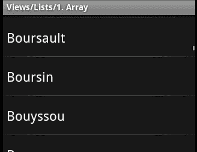
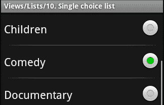
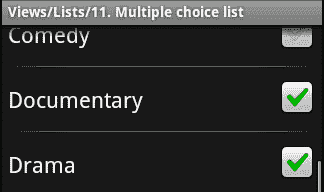
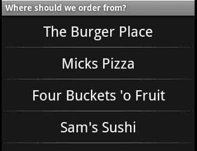
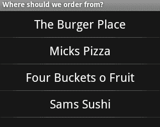
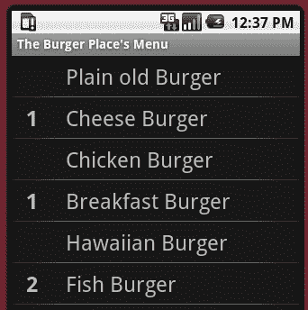
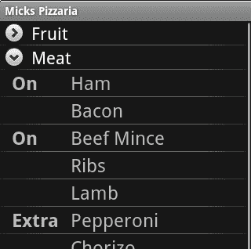
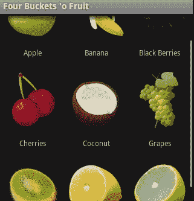

# 第二章：视图的数据展示

*在第一章中，我们介绍了如何创建一个项目，以及如何构建一个简单的用户界面。我们为第一个`Activity`编写了足够的代码，以动态生成用户可以用来回答我们的多项选择题的按钮。*

*现在我们已经可以捕获一些数据了，但如何显示数据呢？软件的一大优势是它能快速并以易于阅读的格式呈现和筛选大量数据。在本章中，我们将介绍一系列专门用于展示数据的安卓控件。*

大多数以数据为中心的安卓类都是建立在`Adapter`对象之上的，因此扩展了`AdapterView`。可以将`Adapter`视为 Swing Model 类和渲染器（或呈现器）之间的交叉。`Adapter`对象用于为软件需要向用户显示的数据对象创建`View`对象。这种模式允许软件维护并处理数据模型，并且只在需要时为每个数据对象创建图形`View`。这不仅有助于节省内存，而且从开发角度来看也更合逻辑。作为开发者，您处理自己的数据对象，而不是试图将数据保存在图形小部件中（这些小部件通常不是最健壮的结构）。

您最常遇到的`AdapterView`类有：`ListView`，`Spinner`和`GridView`。在本章中，我们将介绍`ListView`类和`GridView`，并探讨它们的各种使用方式和样式设置。

# 列表和选择数据

`ListView`类可能是显示数据列表的最常见方式。它由`ListAdapter`对象支持，后者负责保存数据并渲染数据对象在`View`中的显示。`ListView`内置了滚动功能，因此无需将其包裹在`ScrollView`中。

## ListView 选择模式

`ListView`类支持三种基本的项选择模式，由其常量定义：`CHOICE_MODE_NONE`，`CHOICE_MODE_SINGLE`和`CHOICE_MODE_MULTIPLE`。可以通过在布局 XML 文件中使用`android:choiceMode`属性，或者在 Java 中使用`ListView.setChoiceMode`方法来设置`ListView`的选择模式。

### 注意

**选择模式和项目**

`ListView`的选择模式改变了`ListView`结构的行为方式，但不会改变其外观。`ListView`的外观主要由`ListAdapter`定义，后者为应该出现在`ListView`中的每个项目提供`View`对象。

### 无选择模式 - CHOICE_MODE_NONE

在桌面系统中，这种情况没有意义——一个不允许用户选择任何内容的列表？然而，这是 Android `ListView` 的默认模式。原因是当用户通过触摸导航时，这很有意义。`ListView` 的默认模式允许用户点击其中一个元素，并触发一个动作。这种行为的结果是，无需“下一步”按钮或类似的东西。因此，`ListView` 的默认模式是表现为一个菜单。以下截图显示了一个默认的 `ListView` 对象，它从一个默认的 `ApiDemos` 示例中的 `String` 数组 Java 对象中展示不同的字符串列表。



### 单选模式 —— CHOICE_MODE_SINGLE

在此模式下，`ListView` 更像是一个桌面 `List` 小部件。它有当前选择的概念，点击列表项仅仅会选中它，不会再有其他动作。这种行为对于配置或设置等操作很合适，用户希望应用程序记住他们当前的选择。单选列表在屏幕上有其他交互式小部件时也很有用。但是，要注意不要在单个 `Activity` 中放置太多信息。`ListView` 占据几乎整个屏幕是很常见的。

### 注意

单选模式：它不会直接改变你的列表项的外观。你的列表项的外观完全由 `ListAdapter` 对象定义。

然而，Android 确实在系统资源中提供了一系列合理的默认值。在 `android` 包中，你会发现一个 `R` 类。这是访问系统默认资源的编程方式。如果你想创建一个带有 `<string-array>` 颜色列表的单选 `ListView`，你可以使用以下代码：

```kt
list.setAdapter(new ArrayAdapter(
        this,
        android.R.layout.simple_list_item_single_choice,
        getResources().getStringArray(R.array.colors)));
```

在此情况下，我们使用了 `android.widget` 包中提供的 `ArrayAdapter` 类。在第二个参数中，我们引用了名为 `simple_list_item_single_choice` 的 Android 布局资源。这个资源被 Android 系统定义为在 `CHOICE_MODE_SINGLE` 模式下显示 `ListView` 项的默认方式。通常这是一个带有 `RadioButton` 的标签，对应 `ListAdapter` 中的每个对象。



### 多选模式 —— CHOICE_MODE_MULTIPLE

在多选模式下，`ListView` 用普通的复选框替换单选模式中的单选按钮。这种设计结构在桌面和基于 Web 的系统中也经常使用。复选框容易被用户识别，也便于返回并关闭选项。如果你希望使用标准的 `ListAdapter`，Android 为你提供了 `android.R.layout.simple_list_item_multiple_choice` 资源作为有用的默认选项：每个 `ListAdapter` 中的对象都有一个带有 `CheckBox` 的标签。



## 添加头部和底部控件

`ListView`中的头部和底部允许你在列表的顶部和底部放置额外的控件。默认情况下，头部和底部控件被视为列表中的项（就像它们来自你的`ListAdapter`一样）。这意味着你可以像选择`List`结构中的数据元素一样选择它们。一个简单的头部项示例可能是：

```kt
TextView header = new TextView(this);
header.setText("Header View");
list.addHeaderView(header);
```

通常你不想让`ListView`中的头部和底部成为列表项，而是一个标签或一组标签，标识`ListView`的各个部分，或提供其他信息。在这种情况下，你需要告诉`ListView`，你的头部或底部视图不是可选的列表项。这可以通过使用`addHeaderView`或`addFooterView`的扩展实现来完成：

```kt
TextView footer = new TextView(this);
footer.setText("Footer View");
list.addFooterView(footer, null, false);
```

`ListView`类将头部和底部与列表结构紧密集成，因此你也可以提供一个`Object`，它将通过`AdapterView.getItemAtPosition(index)`方法返回。在我们之前的示例中，我们提供了`null`。每个头部项都会将后续视图的索引偏移一个（就像你向`ListView`添加新项一样）。第三个参数告诉`ListView`是否应将头部或底部视为可选择的列表项（在我们之前的示例中不应该）。

如果你习惯了桌面控件，那么 Android `ListView`上的头部和底部控件可能会让你有点惊讶。它们会随着列表中的其他项一起滚动，而不会固定在`ListView`对象的顶部和底部。

## 创建一个简单的 ListView

为了介绍`ListView`类，我们将开始一个新示例，该示例将通过本章的后续各个部分进行增强。我们将创建的第一个`Activity`将使用从`<string-array>`资源填充的简单`ListView`。

# 动手操作——创建快餐菜单

为了继续我们的食物与饮食主题，让我们构建一个简单的应用程序，允许我们订购各种类型的快餐，并送到家！用户首先会选择他们想订购的餐厅，然后选择他们想吃的各种食物。

1.  使用 Android 命令行工具创建一个新的`android`项目：

    ```kt
    android create project -n DeliveryDroid -p DeliveryDroid -k com.packtpub.deliverydroid -a SelectRestaurantActivity -t 3
    ```

1.  使用你喜欢的编辑器或 IDE 打开`/res/values/strings.xml`文件。

1.  创建一个字符串数组结构，列出用户可以订购的各种快餐餐厅：

    ```kt
    <string-array name="restaurants">
        <item>The Burger Place</item>
        <item>Mick's Pizza</item>
        <item>Four Buckets \'o Fruit</item>
        <item>Sam\'s Sushi</item>
    </string-array>
    ```

1.  使用你喜欢的编辑器或 IDE 打开`/res/layout/main.xml`文件。

1.  移除默认`LinearLayout`中的任何控件。

1.  添加一个新的`<ListView>`元素。

1.  将`<ListView>`元素的 ID 设置为`restaurant`：

    ```kt
    <ListView android:id="@+id/restaurant"/>
    ```

1.  将`ListView`的宽度和高度设置为`fill_parent`：

    ```kt
    android:layout_width="fill_parent"
    android:layout_height="fill_parent"
    ```

1.  由于我们有一个包含我们想要填充`ListView`内容的字符串数组资源，我们可以在布局 XML 文件中直接引用它：

    ```kt
    android:entries="@array/restaurants"
    ```

1.  完成指定步骤后，你应该会得到一个看起来像下面的`main.xml`布局文件：

    ```kt
    <?xml version="1.0" encoding="UTF-8"?>
    <LinearLayout

        android:orientation="vertical"
        android:layout_width="fill_parent"
        android:layout_height="fill_parent">

     <ListView android:id="@+id/restaurant"
     android:layout_width="fill_parent"
     android:layout_height="fill_parent"
     android:entries="@array/restaurants"/>
    </LinearLayout>
    ```

## *刚才发生了什么*

如果你将应用程序安装到模拟器中并运行它，你将看到一个屏幕，你可以从中选择在你字符串数组资源中指定的餐厅列表。请注意，`ListView`上的`choiceMode`设置为`CHOICE_MODE_NONE`，这使得它更像是一个直接菜单，用户选择餐厅后，可以立即跳转到该餐厅的菜单。



在这个例子中，我们在布局 XML 文件中使用了`android:entries`属性，指定了一个引用字符串数组资源的引用，其中包含我们想要的列表项。通常，使用`AdapterView`需要你创建一个`Adapter`对象，为每个数据对象创建`View`对象。

使用`android:entries`属性允许你从布局资源中指定`ListView`的数据内容，而不是要求你编写与`AdapterView`相关的正常 Java 代码。然而，它有两个需要注意的缺点：

+   由生成的`ListAdapter`创建的`View`对象将始终是系统指定的默认值，因此不容易进行主题设置。

+   你不能定义将在`ListView`中表示的数据对象。由于字符串数组容易本地化，你的应用程序将依赖于项目索引位置来确定它们表示的内容。

你可能已经注意到截图顶部，标签`Where should we order from?`不是应用程序的默认设置。`Activity`的标签在`AndroidManifest.xml`文件中定义如下：

```kt
<activity
    android:name=".SelectRestaurantActivity"
    android:label="Where should we order from?">
```

## 设置标准 ListAdapter 的样式

标准的`ListAdapter`实现要求每个项目在`TextView`项中表示。默认的单选和多选项目是使用`CheckedTextView`构建的，尽管 Android 中有许多其他的`TextView`实现，但它确实限制了一些我们的选择。然而，标准的`ListAdapter`实现非常方便，并为最常见的列表需求提供了可靠的实现。

由于带有`CHOICE_MODE_NONE`的`ListView`与菜单非常相似，如果将项目改为`Button`对象而不是普通的`TextView`项，岂不是很好吗？从技术上讲，`ListView`可以包含任何扩展`TextView`的小部件。然而，有些实现比其他的更适合（例如，`ToggleButtonView`在用户触摸它时不会保持指定的文本值）。

### 定义标准尺寸

在这个例子中，我们将为应用程序创建各种菜单。为了保持一致的外观和感觉，我们应该定义一组标准尺寸，这些尺寸将用于我们的每个布局文件中。这样我们可以为不同类型的屏幕重新定义尺寸。对于用户来说，没有比只能看到部分项目更沮丧的了，因为它的尺寸比他们的屏幕还要大。

创建一个新的资源文件来包含尺寸。该文件应命名为`res/values/dimens.xml`。将以下代码复制到新的 XML 文件中：

```kt
<?xml version="1.0" encoding="UTF-8"?>

<resources>
    <dimen name="item_outer_height">48sp</dimen>
    <dimen name="menu_item_height">52sp</dimen>
    <dimen name="item_inner_height">45sp</dimen>
    <dimen name="item_text_size">24sp</dimen>
    <dimen name="padding">15dp</dimen>
</resources>
```

我们为列表项声明了两个高度尺寸：`item_outer_height`和`item_inner_height`。`item_outer_height`将是列表项的高度，而`item_inner_height`是列表项中包含的任何`View`对象的高度。

文件末尾的`padding`尺寸用于定义两个视觉元素之间的标准空白量。这被定义为`dp`，因此它会根据屏幕的 DPI 保持不变（而不是根据用户的字体大小偏好进行缩放）。

### 提示

**交互项目的大小调整**

在这个样式设置中，你会注意到`item_outer_height`和`menu_item_height`是`48sp`和`52sp`，这使得`ListView`中的项目相当大。Android 中列表视图项的标准大小是`48sp`。列表项的高度至关重要。如果你的用户手指较大，而你把项目设置得太小，他们将很难点击目标列表项。

这是一般针对安卓用户界面设计的“良好实践”。如果用户需要触摸操作，那么请把它设计得大一些。

# 行动时间——改善餐厅列表

我们之前整理的餐厅列表很棒，但它是一个菜单。为了进一步强调菜单，文本应该更加突出。为了使用标准`ListAdapter`实现来设置`ListView`的样式，你需要在你的 Java 代码中指定`ListAdapter`对象。

1.  在`res/layout`目录中创建一个名为`menu_item.xml`的新文件。

1.  将根 XML 元素创建为`TextView`：

    ```kt
    <?xml version="1.0" encoding="UTF-8"?>
    <TextView />
    ```

1.  导入 Android 资源 XML 命名空间：

1.  通过设置`TextView`小部件的 gravity 属性来使文本居中：

    ```kt
    android:gravity="center|center_vertical"
    ```

1.  我们将`TextView`的`textSize`赋值为我们的标准`item_text_size`：

    ```kt
    android:textSize="@dimen/item_text_size"
    ```

1.  `TextView`文本的默认颜色有点灰，我们希望它是白色：

    ```kt
    android:textColor="#ffffff"
    ```

1.  我们希望`TextView`的宽度与包含它的`ListView`相同。因为这是我们的主菜单，所以它的高度是`menu_item_height`：

    ```kt
    android:layout_width="fill_parent"
    android:layout_height="@dimen/menu_item_height"
    ```

1.  现在我们有一个样式化的`TextView`资源，我们可以将它整合到我们的菜单中。打开`SelectRestaurantActivity.java`文件。

1.  在`onCreate`方法中，使用`setContentView`之后，我们需要获取之前在`main.xml`中创建的`ListView`的引用：

    ```kt
    ListView restaurants = (ListView)findViewById(R.id.restaurant);
    ```

1.  将餐厅的`ListAdapter`设置为一个包含我们在`values.xml`文件中创建的字符串数组的新`ArrayAdapter`：

    ```kt
    restaurants.setAdapter(new ArrayAdapter<String>(
        this,
        R.layout.menu_item,
        getResources().getStringArray(R.array.restaurants)));
    ```

## *刚才发生了什么*

我们首先创建了一个新的布局 XML 资源，其中包含我们想要用于餐厅`ListView`中每个列表项的样式化`TextView`。你编写的`menu_item.xml`文件应该包含以下代码：

```kt
<?xml version="1.0" encoding="UTF-8"?>

<TextView 
              android:gravity="center|center_vertical"
              android:textSize="@dimen/item_text_size"
              android:textColor="#ffffff"
              android:layout_width="fill_parent"
              android:layout_height="@dimen/menu_item_height" />
```

与我们之前的布局资源不同，`menu_item.xml`不包含任何`ViewGroup`（如`LinearLayout`）。这是因为`ArrayAdapter`将尝试将`menu_item.xml`文件的根`View`转换为`TextView`。因此，如果我们以某种方式将`TextView`嵌套在`ViewGroup`中，我们将得到一个`ClassCastException`。

我们还创建了一个`ArrayAdapter`实例，以引用我们之前创建的`menu_item` XML 资源以及餐厅字符串数组。这个操作消除了在`main.xml`布局 XML 资源中的`ListView`上使用`android:entries`属性。如果你愿意，可以删除该属性。现在，你在`SelectRestaurantActivity`中的`onCreate`方法应如下所示：

```kt
public void onCreate(final Bundle icicle) {
        super.onCreate(icicle);
        setContentView(R.layout.main);

        final ListView restaurants = (ListView)
                findViewById(R.id.restaurant);

 restaurants.setAdapter(new ArrayAdapter<String>(
 this,
 R.layout.menu_item,
 getResources().getStringArray(R.array.restaurants)));
    }
```

尝试使用 Apache Ant 将应用程序重新安装到模拟器中，现在你将看到一个看起来更像菜单的屏幕：



## 尝试英雄——开发一个多选题应用程序。

尝试回到我们在第一章中编写的多选题应用程序，*Developing a Simple Activity*。它使用`LinearLayout`和`Button`对象来显示问题的可能答案，但它也使用字符串数组作为答案。尝试修改应用程序以：

+   使用`ListView`代替`LinearLayout`。

+   使用`Button`对象为`ListView`设置样式，就像我们使用`TextView`对象为餐厅菜单设置样式一样。

+   确保在`Button`列表项之间有一定的间距，使它们不会过于紧密。

## 创建自定义适配器。

当我们想要点餐时，我们通常想要订购一个项目的多个数量。`ListView`的实现以及标准的`ListAdapter`实现允许我们选择一个**Cheese Burger**项目，但并不允许我们请求**3 Cheese Burgers**。为了显示用户可以以多个数量订购的不同食品的菜单，我们需要一个自定义的`ListAdapter`实现。

### 为“The Burger Place”创建菜单。

对于主菜单中的每家餐厅，我们将构建一个单独的`Activity`类。实际上，这不是一个好主意，但它允许我们研究组织和展示菜单数据的不同方式。我们的第一站是**The Burger Place**，我们向用户展示一个汉堡列表，让他们在屏幕上点击他们想要的汉堡。每次点击列表项时，他们都会再点一个汉堡。我们将在汉堡名称左侧以粗体显示他们正在订购的汉堡数量。对于他们没有订购的汉堡旁边，则不显示数字（这使得用户可以快速查看他们正在订购的内容）。

#### 汉堡类。

为了显示菜单，我们需要一个简单的`Burger`数据对象。`Burger`类将保存要在菜单中显示的名称，以及用户正在订购的`Burger`数量。在项目的根包中创建一个`Burger.java`文件，并使用以下代码：

```kt
class Burger {
    final String name;
    int count = 0;

    public Burger(String name) {
        this.name = name;
    }
}
```

你会注意到，在前面的代码中没有 getter 和 setter 方法，而且`name`和`count`字段都声明为包保护的。在 Android 2.2 之前的版本中，与直接字段查找相比，方法会产生较大的开销。由于这个类将只是渲染过程的一小部分（我们将从中提取数据以显示），我们应该确保开销尽可能小。

# 动手时间——创建汉堡项布局

为了为**汉堡店**设计一个好看的菜单，首先要做的是设计菜单项。这与使用布局 XML 资源的餐厅列表样式设计非常相似。然而，由于这次我们将自己构建`ListAdapter`，因此不必使用单个`TextView`，而是可以构建更复杂的布局。

1.  在`res/layout`目录中创建一个名为`burger_item.xml`的新 XML 文件。这个文件将用于`ListView`中的每个汉堡项。

1.  将布局的根声明为`horizontal LinearLayout`（注意高度，这将是`ListView`中每个项目的高度）：

    ```kt
    <LinearLayout 

        android:orientation="horizontal"
        android:layout_width="fill_parent"
        android:layout_height="@dimen/item_outer_height">
    ```

1.  接下来，声明一个`TextView`，我们将用它作为订购汉堡数量的`counter`。我们稍后可以通过其 ID 访问这个`TextView`：

    ```kt
    <TextView android:id="@+id/counter" />
    ```

1.  `counter`的文本大小与应用程序中所有其他列表项完全相同。然而，它应该是加粗的，这样就可以轻松识别和阅读：

    ```kt
    android:textSize="@dimen/item_text_size"
    android:textStyle="bold"

    ```

1.  我们还希望`counter`是正方形的，因此将宽度和高度设置得完全相同：

    ```kt
    android:layout_width="@dimen/item_inner_height"
    android:layout_height="@dimen/item_inner_height"
    ```

1.  我们还希望文本在`counter`内居中：

    ```kt
    android:gravity="center|center_vertical"
    ```

1.  我们还需要一个文本空间来显示汉堡的名字：

    ```kt
    <TextView android:id="@+id/text" />
    ```

1.  文本大小是标准的：

    ```kt
    android:textSize="@dimen/item_text_size"
    ```

1.  我们希望`counter`和`text`标签之间有一点空间：

    ```kt
    android:layout_marginLeft="@dimen/padding"
    ```

1.  标签的宽度应填满`ListView`，但我们希望两个`TextView`对象的大小相同：

    ```kt
    android:layout_width="fill_parent"
    android:layout_height="@dimen/item_inner_height"
    ```

1.  标签文本应垂直居中，以匹配`counter`的位置。然而，标签应该是左对齐的：

    ```kt
    android:gravity="left|center_vertical"
    ```

## *刚才发生了什么？*

你刚刚构建了一个非常不错的`LinearLayout ViewGroup`，这将为我们从**汉堡店**销售的每个汉堡渲染。由于`counter TextView`与标签是分开的对象，因此可以独立地进行样式设计和管理。如果我们想独立地为它们应用额外的样式，这将使事情变得更加灵活。现在你的`burger_item.xml`文件应该如下所示：

```kt
<?xml version="1.0" encoding="UTF-8"?>

<LinearLayout

    android:orientation="horizontal"
    android:layout_width="fill_parent"
    android:layout_height="@dimen/item_outer_height">

 <TextView android:id="@+id/counter"
 android:textSize="@dimen/item_text_size"
 android:textStyle="bold"
 android:layout_width="@dimen/item_inner_height"
 android:layout_height="@dimen/item_inner_height"
 android:gravity="center|center_vertical" />

 <TextView android:id="@+id/text"
 android:textSize="@dimen/item_text_size"
 android:layout_marginLeft="@dimen/padding"
 android:layout_width="fill_parent"
 android:layout_height="@dimen/item_inner_height"
 android:gravity="left|center_vertical" />
</LinearLayout>
```

# 动手时间——展示汉堡对象

如果你的数据对象是字符串或者很容易表示为字符串，标准的`ListAdapter`类工作得很好。为了在屏幕上美观地显示我们的`Burger`对象，我们需要编写一个自定义的`ListAdapter`类。幸运的是，Android 为我们提供了一个名为`BaseAdapter`的很好的`ListAdapter`实现框架类。

1.  创建一个名为`BurgerAdapter`的新类，并让它继承自`android.widget.BaseAdapter`类：

    ```kt
    class BurgerAdapter extends BaseAdapter {
    ```

1.  `Adapter`是表示层的一部分，但也是`ListView`的底层模型。在`BurgerAdapter`中，我们存储了一个`Burger`对象的数组，我们在构造函数中分配它：

    ```kt
    private final Burger[] burgers;
    BurgerAdapter(Burger... burgers) {
        this.burgers = burders;
    }
    ```

1.  直接在`Burger`对象数组上实现`Adapter.getCount()`和`Adapter.getItem(int)`方法：

    ```kt
    public int getCount() {
        return burgers.length;
    }

    public Object getItem(int index) {
        return burgers[index];
    }
    ```

1.  还期望`Adapter`为各个项目提供标识符，我们将仅返回它们的索引：

    ```kt
    public long getItemId(int index) {
        return index;
    }
    ```

1.  当`Adapter`被请求提供一个列表项的`View`时，它可能会接收到一个可复用的现有`View`对象。我们将实现一个简单的方法来处理这种情况，如果需要，将使用`android.view`包中的`LayoutInflator`类来填充我们之前编写的`burger_item.xml`文件：

    ```kt
    private ViewGroup getViewGroup(View reuse, ViewGroup parent) {
        if(reuse instanceof ViewGroup) {
            return (ViewGroup)reuse;
        }
        Context context = parent.getContext();
        LayoutInflater inflater = LayoutInflater.from(context);
        ViewGroup item = (ViewGroup)inflater.inflate(
                R.layout.burger_item, null);
    return item;
    }
    ```

1.  在`BurgerAdapter`中，对我们来说最重要的方法是`getView`方法。这是`ListView`请求我们提供一个`View`对象的地点，以表示它需要显示的每个列表项：

    ```kt
    public View getView(int index, View reuse, ViewGroup parent) {
    ```

1.  为了获取给定项目的正确`View`，你首先需要使用`getViewGroup`方法以确保你有`burger_item.xml ViewGroup`来显示`Burger`项：

    ```kt
    ViewGroup item = getViewGroup(reuse, parent);
    TextView counter = (TextView)item.findViewById(R.id.counter);
    TextView label = (TextView)item.findViewById(R.id.text);
    ```

1.  我们将使用请求的`index`位置上的`Burger`对象的数据来填充这两个`TextView`对象。如果当前的`count`为零，则需要从用户界面隐藏`counter`小部件：

    ```kt
    Burger burger = burgers[index];
    counter.setVisibility(
            burger.count == 0
            ? View.INVISIBLE
            : View.VISIBLE);
    counter.setText(Integer.toString(burger.count));
    label.setText(burger.name);
    return item;
    ```

## *刚才发生了什么？*

我们刚刚编写了一个自定义的`Adapter`类，用于在`ListView`中向用户展示一系列`Burger`对象。当`ListView`调用`Adapter.getView`方法时，它会尝试传入之前调用`Adapter.getView`返回的`View`对象。将为`ListView`中的每个项目创建一个`View`对象。然而，当`ListView`显示的数据发生变化时，`ListView`将要求`ListAdapter`重用第一次生成的每个`View`对象。尽量遵循这一行为非常重要，因为它直接影响到应用程序的响应性。在我们之前的示例中，我们实现了`getViewGroup`方法，以便考虑到这一要求。

`getViewGroup`方法也用于加载我们编写的`burger_item.xml`文件。我们使用`LayoutInflator`对象来完成此操作，这正是`Activity.setContentView(int)`方法加载 XML 布局资源的方式。我们从`parent ViewGroup`获取的`Context`对象（通常是`ListView`）定义了我们将从哪里加载布局资源。如果用户没有选择“汉堡”，我们使用`View.setVisibility`方法隐藏计数器`TextView`。在 AWT 和 Swing 中，`setVisible`方法接受一个`Boolean`参数，而在 Android 中，`setVisibility`接受一个`int`值。这样做的原因是 Android 将可见性视为布局过程的一部分。在我们的例子中，我们希望`counter`消失，但仍然在布局中占据其空间，这将使`text`标签保持左对齐。如果我们希望计数器消失且不占用空间，我们可以使用：

```kt
counter.setVisibility(burger.count == 0
        ? View.GONE
        : View.VISIBLE);
```

`ListView`对象将自动处理选中项目的突出显示。这包括用户在项目上按住手指，以及他们使用轨迹板或方向键导航`ListView`时。当一个项目被突出显示时，其背景通常会根据标准的 UI 约定改变颜色。

然而，在`ListView`中使用某些直接捕获用户输入的小部件（例如，`Button`或`EditText`）会导致`ListView`不再为该小部件显示选中高亮。实际上，这将阻止`ListView`完全注册`OnItemClick`事件。

### 提示

**在 ListView 中自定义分隔符**

如果重写`ListAdapter`的`isEnabled(int index)`方法，你就可以策略性地禁用`ListView`中的指定项目。这种做法的一个常见用途是将某些项目设置为逻辑分隔符。例如，在按字母排序的列表中的部分分隔符，包含下一“部分”所有项目首字母。

## 创建 TheBurgerPlaceActivity 类

为了在屏幕上显示“汉堡”菜单，并允许用户订购项目，我们需要一个新的`Activity`类。我们需要知道用户何时触摸列表中的项目，为此我们将需要实现`OnItemClickListener`接口。当发生特定事件时（在本例中是用户在`ListView`中触摸特定项目），作为监听器注册的对象将调用与发生的事件相关的相应方法。Android 提供了一个简单的`ListActivity`类，为这种情况提供一些默认布局和实用方法。

# 动手实践——实现 TheBurgerPlaceActivity

为了使用 `BurgerAdapter` 类展示 `Burger` 对象的 `ListView`，我们将需要创建一个 **The Burger Place** 的 `Activity` 实现。新的 `Activity` 还将负责监听 `ListView` 中项目的“触摸”或“点击”事件。当用户触摸其中一个项目时，我们需要更新模型和 `ListView`，以反映用户又订购了一个 `Burger`。

1.  在项目的根包中创建一个名为 `TheBurgerPlaceActivity` 的新类，并确保它继承自 `ListActivity`：

    ```kt
    public class TheBurgerPlaceActivity extends ListActivity {
    ```

1.  重写 `Activity.onCreate` 方法。

1.  调用 `super.onCreate` 以允许正常的 Android 启动过程。

1.  使用一些 `Burger` 对象创建 `BurgerAdapter` 的实例，并将其设置为 `ListActivity` 代码要使用的 `ListAdapter`：

    ```kt
    setListAdapter(new BurgerAdapter(
            new Burger("Plain old Burger"),
            new Burger("Cheese Burger"),
            new Burger("Chicken Burger"),
            new Burger("Breakfast Burger"),
            new Burger("Hawaiian Burger"),
            new Burger("Fish Burger"),
            new Burger("Vegatarian Burger"),
            new Burger("Lamb Burger"),
            new Burger("Rare Tuna Steak Burger")));
    ```

1.  最后，使用以下代码实现 `onListItemClicked` 方法：

    ```kt
    protected void onListItemClick(
            ListView parent,
            View item,
            int index,
            long id) {
    BurgerAdapter burgers = (BurgerAdapter)
                parent.getAdapter();
    Burger burger = (Burger)burgers.getItem(index);
        burger.count++;
        burgers.notifyDataSetInvalidated();
    }
    ```

## *刚才发生了什么？*

这个 `TheBurgerPlaceActivity` 的实现有一个简单的硬编码 `Burger` 对象列表供用户显示，并创建了一个 `BurgerAdapter` 来将这些对象转换为之前创建的 `burger_item View` 对象。

当用户点击列表项时，我们在 `onItemClick` 方法中增加相关 `Burger` 对象的 `count`。然后我们调用 `BurgerAdapter` 上的 `notifyDataSetInvalidated()`。此方法将通知 `ListView` 底层数据已更改。当数据更改时，`ListView` 将重新调用 `Adapter.getView` 方法，针对 `ListView` 中的每个项目。

`ListView` 中的项目由实际上是静态的 `View` 对象表示。这意味着当数据模型更新时，适配器必须允许更新或重新创建该 `View`。一种常见的替代方法是获取表示你更新数据的 `View`，并直接更新它。

## 注册并启动 TheBurgerPlaceActivity

为了从我们的餐厅菜单启动新的 `Activity` 类，你需要在 `AndroidManifest.xml` 文件中注册它。首先，在编辑器或 IDE 中打开 `AndroidManifest.xml` 文件，并将以下 `<activity>` 代码复制到 `<application>...</application>` 块中：

```kt
<activity android:name=".TheBurgerPlaceActivity"
          android:label="The Burger Place\'s Menu">

    <intent-filter>
        <action android:name=
                "com.packtpub.deliverydroid.TheBurgerPlaceActivity"/>
    </intent-filter>
</activity>
```

为了启动 `Activity`，你将需要回到 `SelectRestaurantActivity` 并实现 `OnItemClickListener` 接口。在 `restaurants ListView` 上设置 `Adapter` 之后，将 `SelectRestaurantActivity` 设置为 `restaurants ListView` 的 `OnItemClickListener`。你可以在 `onItemClick` 方法中使用 `Intent` 对象启动 `TheBurgerPlaceActivity`。现在你的 `SelectRestaurantActivity` 类应该看起来像以下代码片段：

```kt
public class SelectRestaurantActivity extends Activity
 implements OnItemClickListener {

    @Override
    public void onCreate(Bundle icicle) {
        super.onCreate(icicle);
        setContentView(R.layout.main);

        ListView restaurants = (ListView)
                findViewById(R.id.restaurant);

        restaurants.setAdapter(new ArrayAdapter<String>(
                this,
                R.layout.menu_item,
                getResources().getStringArray(R.array.restaurants)));

 restaurants.setOnItemClickListener(this);
    }

 public void onItemClick(
 AdapterView<?> parent,
 View item,
 int index,
 long id) {

 switch(index) {
 case 0:
 startActivity(new Intent(
 this,
 TheBurgerPlaceActivity.class));
 break;
 }
 }
}
```

当你重新安装应用程序并在模拟器中启动它时，你将能够导航到 **The Burger Place** 并为汉堡包下订单。在 **The Burger Place** 菜单中按下硬件“返回”按钮将带你回到餐厅菜单。



## 小测验

1.  将 `ListView` 对象的选择模式设置为 `CHOICE_MODE_SINGLE` 将：

    1.  向每个项目添加一个`RadioButton`。

    1.  不执行任何操作（这是默认行为）。

    1.  使`ListView`跟踪一个“选中”的项目。

1.  `ListAdapter`定义了`ListView`如何显示其项目。它将在何时被要求重用一个`View`来显示一个项目对象？

    1.  当数据模型无效或更改时。

    1.  在每个项目上，用于橡皮图章。

    1.  当`ListView`重新绘制自身时。

1.  当`ListView`可以滚动时，头部和底部对象将被定位：

    1.  在滚动项目之上和之下。

    1.  水平并排显示，在滚动项目之上和之下。

    1.  与其他项目一起滚动。

# 使用`ExpandableListView`类

`ListView`类非常适合显示中小量的数据，但有时它会向用户展示过多的信息。考虑一个电子邮件应用程序。如果你的用户是重度电子邮件用户，或者订阅了几个邮件列表，他们可能会在文件夹中有数百封电子邮件。即使他们可能不需要滚动超过前几封，看到滚动条缩小到只有几像素大小，对用户的心理影响并不好。

在桌面邮件客户端中，你经常会按时间将邮件列表分组：今天、昨天、本周、本月以及更早（或类似）。Android 提供了`ExpandableListView`以实现这种类型的分组。每个项目嵌套在一个组内，用户可以显示或隐藏组。这有点像树形视图，但始终只嵌套一个层级（你不能将项目显示在组外）。

### 提示

**大量的`ExpandableListView`组**

有时即使是`ExpandableListView`也可能不足以将数据量保持在合理长度。在这些情况下，考虑为用户提供组中的前几个项目，并在最后添加一个特殊的**查看更多**项目。或者，对组使用`ListView`，对嵌套项目使用单独的`Activity`。

## 创建`ExpandableListAdapter`实现

由于`ExpandableList`类包含两个详细级别，它不能与只处理单一级别的普通`ListAdapter`一起工作。相反，它包含了`ExpandableListAdapter`，后者使用两组方法：一组用于组级别，另一组用于项目级别。在实现自定义`ExpandableListAdapter`时，通常最简单的方法是让你的实现继承自`BaseExpandableListAdapter`，因为它提供了事件注册和触发的实现。

`ExpandableListAdapter` 会在每个组项的左侧放置一个箭头指针，以指示组是打开还是关闭（类似于下拉/组合框）。箭头是在由 `ExpandableListAdapter` 返回的组 `View` 对象上方渲染的。为了防止你的组标签被这个箭头部分遮挡，你需要为列表项 `View` 结构添加填充。列表项的默认填充可以通过主题参数 `expandableListPreferredItemPaddingLeft` 获取，你可以使用它：

```kt
android:paddingLeft=
    "?android:attr/expandableListPreferredItemPaddingLeft"
```

为了保持 `ExpandableListView` 的外观一致性，建议你为 `ExpandableListView` 的普通（子）项目添加相同数量的填充（以保持它们的文本与父组对齐），除非你在左侧放置一个项目，如图标或复选框。

## 尝试英雄 - 订购定制比萨

在 `Mick's Pizza` 示例中，我们将创建一个分类的比萨配料菜单。每个配料包括一个名称，以及它是否在比萨上（'on' 或 'off'），或者需要'extra'（例如，额外芝士）。每个项目使用两个水平排列的 `TextView` 对象。右侧的 `TextView` 可以显示配料名称。当不包含配料时，左侧的 `TextView` 为空，包含配料时为 `On`，用户想要比通常更多配料时为 `Extra`。

创建一个对象模型，包含 `ToppingCatagory` 对象，其中包含一个名称和 `PizzaTopping` 对象数组。你需要记录每个配料是否被点单以及数量。

你还需要实现一个 `PizzaToppingAdapter` 类，扩展 `BaseExpandableListAdapter` 类。为组标签使用默认的 Android `simple_expandable_list_item_1` 布局资源，为项目标签使用一个新的定制布局资源。

当用户点击一个比萨配料时，它的状态会在三个值之间变化：**Off**，**On**，和 **Extra**。

### 注意

使用 `ListView.getAdapter()` 方法不会返回你的 `ExpandableListAdapter` 实现，而是一个包装器。要获取原始的 `ExpandableListAdapter`，你需要使用 `getExpandableListAdapter()` 方法。你还需要使用 `ExpandableListView.OnChildClickListener` 接口来接收点击事件。

当你的新 `Activity` 完成时，你应该有一个看起来像以下的屏幕：



# 使用 GridView 类

`GridView` 是一个具有固定列数的 `ListView`，从左到右，从上到下排列。标准的（未定主题的）Android 应用程序菜单像 `GridView` 一样排列。`GridView` 类使用与 `ListView` 完全相同的 `ListAdapter` 格式。然而，由于其固定的列数，`GridView` 非常适合图标列表。

### 提示

**有效使用 GridViews**

与`ListView`相比，`GridView`可以在单个屏幕上显示更多的信息，但代价是显示的文本信息较少。从可用性的角度来看，图标通常比文本更容易操作。由于它们的颜色，图标可以比文本更快地被识别。当您有可以使用图标表示的信息时，以这种方式显示它是一个好主意。但是，请记住，图标需要在单个屏幕内保持唯一性，最好是在整个应用程序内。

在下一个示例中，我们将使用`GridView`构建**四桶水果**菜单。`GridView`将为菜单上的每个项目提供一个图标，以及图标下方的项目名称。因此，完成后，它看起来将非常像标准的 Android 应用程序菜单。下一个示例将重点介绍`ListAdapter`的实现，因为它与我们为**汉堡店**构建的`ListAdapter`大致相同。

### 提示

**触摸屏设备上的图标**

在触摸屏设备上考虑图标非常重要。它们需要比平时更具自解释性，或者需要伴随一些文本。使用触摸屏很难提供像工具提示这样的上下文帮助。如果用户正在触摸对象，它通常会被他们的手指和/或手遮住，使得图标和工具提示不可见。

# 动手操作——创建水果图标的时间到了。

为了将各种类型的水果显示为图标，我们将需要创建一个布局 XML 文件。`GridView`中的每个图标都将作为此布局的一个实例表示，与`ListView`中表示列表项目的方式完全相同。我们为图标创建每个项目作为`ImageView`，并在其下方为标签创建一个`TextView`。

1.  在`res/layout`目录中创建一个名为`fruit_item.xml`的文件。

1.  将图标的根元素声明为垂直的`LinearLayout`：

    ```kt
    <LinearLayout

        android:orientation="vertical"
        android:layout_width="fill_parent"
        android:layout_height="fill_parent">
    ```

1.  创建将作为我们图标的`ImageView`元素：

    ```kt
    <ImageView android:id="@+id/icon"
        android:layout_width="fill_parent"
        android:layout_height="wrap_content"/>
    ```

1.  接下来，创建将作为标签的`TextView`元素：

    ```kt
    <TextView android:id="@+id/text"
        android:textSize="@dimen/item_description_size"
        android:layout_width="fill_parent"
        android:layout_height="wrap_content"
        android:gravity="center|center_vertical" />
    ```

## *刚才发生了什么？*

`fruit_item.xml`文件是我们菜单图标的非常简单的布局，也可以用于许多其他类型的图标，表现为网格形式。`ImageView`对象默认会尝试将其内容缩放到其尺寸。在我们之前的示例中，根`LinearLayout`的宽度和高度定义为`fill_parent`。当在`GridView`中作为单个项目放置时，使用`fill_parent`作为大小将导致`LinearLayout`填充为该网格项目提供的空间（不是整个`GridView`）。

## 在`GridView`中显示图标

我们需要一个对象模型和`ListAdapter`，以便在`GridView`中将水果显示给用户。此时，适配器相当直接。它是在一个项目类和为图标定义的布局 XML 之上构建的正常`ListAdapter`实现。

对于每种水果，我们需要一个同时保存水果名称和图标的对象。在根包中创建一个 `FruitItem` 类，并使用以下代码：

```kt
class FruitItem {
    final String name;
    final int image;

    FruitItem(String name, int image) {
        this.name = name;
        this.image = image;
    }
}
```

在前面的代码中，我们将水果的图标图像作为一个整数引用。在 Android 中引用应用程序资源和 ID 时，总是使用整数。在这个例子中，我们假设所有不同类型的水果都有一个作为应用程序资源的图标。另一个选项是每个 `FruitItem` 持有一个对 `Bitmap` 对象的引用。然而，这意味着当 `FruitItem` 可能不在屏幕上时，需要将完整的图像保存在内存中。

为了让 Android Asset Packaging Tool 识别并存储图标，你需要将它们放在 `res/drawable` 目录中。

### 提示

**安卓图像资源**

通常，在 Android 中，将位图图像存储为 PNG 文件被认为是一个好习惯。由于你将要从代码中访问这些文件，请确保它们具有 Java 友好的文件名。PNG 格式（与 JPG 不同）是无损的，可以具有不同的颜色深度，并且正确处理透明度。这使得它整体上成为一个很棒的图像格式。

# 是时候行动了——构建水果菜单

对于 **四个水果桶菜单**，我们需要一个 `ListAdapter` 实现，以将 `FruitItem` 对象渲染到 `fruit_item.xml` 布局资源中。我们还需要一个 `GridView` 的布局资源，我们将在新的 `Activity` 类中加载它。

1.  在项目的根包中创建一个名为 `FruitAdapter` 的类，继承自 `BaseAdapter`。

1.  `FruitAdapter` 需要保存并代表一个 `FruitItem` 对象数组。使用与 `BurgerAdapter` 相同的结构实现该类。

1.  在 `ListAdapter.getView` 方法中，按照 `fruit_item.xml` 布局资源中定义的标签和图标进行设置：

    ```kt
    FruitItem item = items[index];
    TextView text = ((TextView)view.findViewById(R.id.text));
    ImageView image = ((ImageView)view.findViewById(R.id.icon));
    text.setText(item.name);
    image.setImageResource(item.image);
    ```

1.  创建一个新的布局资源，用于保存我们将用于 **四个水果桶菜单** 的 `GridView`，并将其命名为 `res/layout/four_buckets.xml`。

1.  使用三列 `GridView` 填充新的布局资源：

    ```kt
    <GridView 

        android:numColumns="3"
        android:horizontalSpacing="5dip"
        android:verticalSpacing="5dip"
        android:layout_width="fill_parent"
        android:layout_height="fill_parent"/>
    ```

## *刚才发生了什么？*

新的 `four_buckets.xml` 布局资源中只有一个 `GridView`。这与我们迄今为止编写的其他布局资源不同，尤其是 `GridView` 没有 ID。对于这个例子，水果菜单 `Activity` 将只包含 `GridView`，因此无需 ID 引用或布局结构。我们还指定了水平和垂直间距为 `5dip`。`GridView` 对象的默认设置是在其单元格之间没有间距，这使得内容相当紧凑。为了使内容之间稍微有些间隔，我们要求在各个单元格之间有一些空白。

# 是时候行动了——创建 FourBucketsActivity

由于我们使用的是只有一个`GridView`的布局资源，并且没有 ID 引用，我们将逐步创建`Activity`。与之前的`Activity`实现不同，我们需要直接引用在`four_buckets.xml`中定义的`GridView`，这意味着需要手动加载它。

1.  从在你的项目的根包中创建一个新类开始：

    ```kt
    public class FourBucketsActivity extends Activity {
    ```

1.  重写`onCreate`方法，并调用父类实现：

    ```kt
    protected void onCreate(final Bundle istate) {
        super.onCreate(istate);
    ```

1.  为你的`Activity`对象获取`LayoutInflator`实例：

    ```kt
    LayoutInflater inflater = getLayoutInflater();
    ```

1.  充气`four_buckets.xml`资源，并将其内容直接转换为`GridView`对象：

    ```kt
    GridView view = (GridView)inflater.inflate(
            R.layout.four_buckets,
            null);
    ```

1.  将`view`对象的`ListAdapter`设置为新`FruitAdapter`类的实例，并用一些`FruitItem`对象填充新的`FruitAdapter`：

    ```kt
    view.setAdapter(new FruitAdapter(
            new FruitItem("Apple", R.drawable.apple),
            new FruitItem("Banana", R.drawable.banana),
            new FruitItem("Black Berries", R.drawable.blackberry),
            // and so on
    ```

1.  使用`setContentView`使`GridView`成为你的根`View`对象：

    ```kt
    setContentView(view);
    ```

1.  在你的`AndroidManifest.xml`中注册你的`FourBucketsActivity`类。

1.  向`SelectRestaurantActivity`添加一个案例，当用户选择时启动新的`FourBucketsActivity`。

## *刚才发生了什么？*

你刚刚完成了**四桶水果**菜单。如果你将应用程序重新安装到你的模拟器中，你现在将能够去订购水果（只需小心准备好 16 吨的重量，以防送货员攻击你）。

如果你查看`Activity`文档，你会注意到虽然有一个`setContentView`方法，但没有相应的`getContentView`方法。仔细查看，你会注意到`addContentView`方法。`Activity`对象可以有任意数量的“内容”`View`对象附加到它上面。这使得任何有用的`getContentView`方法的实现变得不可能。

为了克服这个限制，我们自己充气了布局。使用的`getLayoutInflator()`方法只是`LayoutInflator.from(this)`的简写。我们没有使用 ID 和`findViewById`，而是直接将返回的`View`转换为`GridView`，因为我们的`four_buckets.xml`文件只包含这个（与`ArrayAdapter`类处理`TextView`对象的方式类似）。如果我们想要更抽象一点，我们可以将其转换为`AdapterView<ListAdapter>`，在这种情况下，我们可以将文件中的实现替换为`ListView`。然而，这对于这个例子来说并没有太大帮助。

如果你现在重新安装并运行应用程序，你的新`FourBucketsActivity`将展示一个类似以下的屏幕：



## 尝试英雄——山姆寿司

菜单上的最后一家餐厅是`Sam's Sushi`。尝试使用`Spinner`类和`GridView`创建一个复合寿司菜单。将下拉菜单放在屏幕顶部，提供不同类型寿司的选项：

+   刺身

+   麻辣卷

+   寿司

+   押寿司

+   加州卷

+   时尚三明治

+   手卷

在`Spinner`下方，使用`GridView`显示用户可以订购的每种不同类型鱼的图标。以下是一些建议：

+   金枪鱼

+   黄尾鱼

+   鲷鱼

+   鲑鱼

+   鳗鱼

+   海胆

+   鱿鱼

+   虾

`Spinner` 类使用了 `SpinnerAdapter` 而不是 `ListAdapter`。`SpinnerAdapter` 包含了一个额外的 `View` 对象，它表示下拉菜单。这通常是指向 `android.R.layout.simple_dropdown_item_1line` 资源的引用。然而，对于这个例子，你或许可以使用 `Spinner` XML 元素上的 `android:entries` 属性。

# 概述

数据展示是移动应用程序最常见的要求之一，Android 有许多不同的选项可用。`ListView` 可能是标准 Android 套件中最常用的控件之一，对其样式进行设置可以使其用来显示不同数量的数据，从单行菜单项到多行的待办事项笔记。

`GridView` 实际上是 `ListView` 的表格版本，非常适合向用户展示图标视图。图标比文本有巨大的优势，因为用户可以更快地识别它们。图标还可以占用更少的空间，在 `GridView` 中，你可以在竖屏屏幕上轻松地放置四到六个图标，而不会让用户界面显得杂乱或难以操作。这也为其他项目显示释放了宝贵的屏幕空间。

构建自定义 `Adapter` 类不仅允许你完全控制 `ListView` 的样式，还可以决定数据来源以及如何加载数据。例如，你可以通过使用在 Web 服务响应实际数据之前生成虚拟 `View` 对象的 `Adapter` 直接从 Web 服务加载数据。仔细查看默认的 `Adapter` 实现，它们通常可以满足你的需求，尤其是与自定义布局资源结合使用时。

在下一章中，我们将看看 Android 提供的一些不那么通用、更加专业的 `View` 类。与 Android 中的几乎所有事物一样，默认值可能很具体，但它们可以通过多种方式定制，以适应一些非常特殊的需求。
