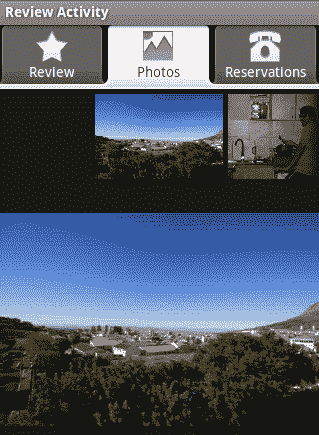
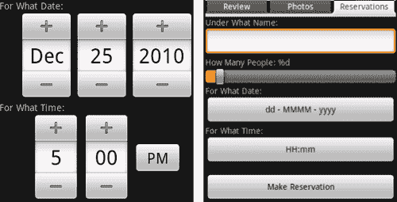
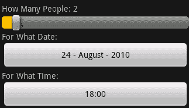
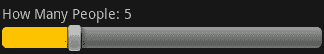
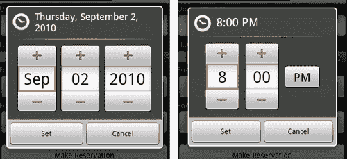

# 第三章：使用专用 Android 控件进行开发

*除了许多通用控件，如按钮、文本字段和复选框外，Android 还包括各种更专业的控件。虽然按钮相当通用，在许多情况下都有用途，但例如图库控件则更为针对性。在本章中，我们将开始研究更专业的 Android 控件，它们的出现位置以及最佳使用方法。*

尽管这些是非常专业的`View`类，但它们非常重要。如前所述（这一点真的非常重要）良好用户界面设计的一个基石是**一致性**。例如`DatePicker`控件。它绝对不是世界上最漂亮的日期选择器。它不是一个日历控件，因此用户有时很难选择确切的日期（大多数人会想到“下周二”，而不是“17 号星期二”）。然而，`DatePicker`是标准的！所以用户确切知道如何使用它，他们不必使用一个有问题的日历实现。本章将使用 Android 更专业的`View`和布局类：

+   `Tab`布局

+   `TextSwitcher`

+   `Gallery`

+   `DatePicker`

+   `TimePicker`

+   `RatingBar`

这些类具有非常特殊的目的，其中一些在实现方式上略有不同。本章将探讨如何以及在何处使用这些控件，以及在使用它们的实现细节上需要小心。我们还将讨论如何将这些元素最佳地融入到应用程序和布局中。

# 创建一个餐厅评论应用程序

在上一章中，我们构建了一个外卖应用程序。在本章中，我们将要看看餐厅评论。该应用程序将允许用户查看其他人对餐厅的看法，一个餐厅照片的图库，以及最终在线预订的部分。我们将应用程序分为三个部分：

+   **回顾**：此餐厅的评论和评分信息

+   **照片**：餐厅的照片图库

+   **预订**：向餐厅提出预订请求

当构建一个需要快速向用户展示这三个部分的应用程序时，最合理的选择是将每个部分放在屏幕上的一个标签页中。这样用户可以在三个部分之间切换，而无需同时将它们全部显示在屏幕上。这还节省了屏幕空间，为每个部分提供更多的空间。

**回顾**标签将包括人们对正在查看的餐厅的循环评论列表，以及餐厅的平均“星级”评分。

展示餐厅的照片是**照片**标签的工作。我们将在屏幕顶部为用户提供一个缩略图“轨道”，并使用剩余的屏幕空间显示所选图像。

对于**预订**标签，我们希望捕获用户的名字以及他们希望预订的时间（日期和时间）。最后，我们还需要知道预订将是为多少人。

# 动手时间——创建机器人评审项目结构

要开始这个示例，我们需要一个带有新的`Activity`的新项目。新的布局和`Activity`将与前两章的结构略有不同。为了构建标签式布局，我们需要使用`FrameLayout`类。因此，首先，我们将创建一个新的项目结构，并从一个框架开始，这个框架最终将成为我们的标签布局结构。这可以填充三个内容区域。

1.  使用 Android 命令行工具创建一个新的 Android 项目：

    ```kt
    android create project -n RoboticReview -p RoboticReview -k com.packtpub.roboticreview -a ReviewActivity -t 3

    ```

1.  在编辑器或 IDE 中打开`res/layout/main.xml`文件。

1.  清除默认代码（保留 XML 头）。

1.  创建一个根`FrameLayout`元素：

    ```kt
    <FrameLayout 

        android:layout_width="fill_parent"
        android:layout_height="fill_parent">
    ```

1.  在新的`FrameLayout`元素内，添加一个`垂直 LinearLayout`：

    ```kt
    <LinearLayout android:id="@+id/review"
                  android:orientation="vertical"
                  android:layout_width="fill_parent"
                  android:layout_height="wrap_content">
    </LinearLayout>
    ```

1.  在`LinearLayout`之后，添加另一个空的`LinearLayout`元素：

    ```kt
    <LinearLayout android:id="@+id/photos"
                  android:orientation="vertical"
                  android:layout_width="fill_parent"
                  android:layout_height="wrap_content">
    </LinearLayout>
    ```

1.  然后，在第二个`LinearLayout`元素之后，添加一个空的`ScrollView`：

    ```kt
    <ScrollView android:id="@+id/reservation"
                android:layout_width="fill_parent"
                android:layout_height="fill_parent">
    </ScrollView>
    ```

`FrameLayout`将被 Android 标签结构用作内容区域，每个子元素都将成为一个标签的内容。在上面的布局中，我们为**评审**和**照片**部分添加了两个`LinearLayout`元素，并为**预订**标签添加了一个`ScrollView`。

## *刚才发生了什么？*

我们刚刚开始“餐厅评审”应用程序，为用户界面构建了一个框架。在继续示例之前，我们应该先浏览一下这个`main.xml`文件的几个关键部分。

首先，我们的根元素是一个`FrameLayout`。`FrameLayout`将其所有子元素锚定在自己的左上角。实际上，两个`LinearLayout`和`ScrollView`将相互重叠。这种结构可以用来形成类似于 Java AWT `CardLayout`的东西，`TabHost`对象将使用它来在相应标签处于激活状态时显示这些对象。

其次，每个`LinearLayout`和`ScrollView`都有一个 ID。为了将它们标识为标签根，我们需要能够从 Java 代码轻松访问它们。标签结构可能在 XML 中设计，但它们需要在 Java 中组合。

# 构建 TabActivity

为了继续，我们需要我们的`Activity`类来设置我们在`main.xml`文件中声明为标签的三个标签内容元素。按偏好，Android 中的所有标签都应该有一个图标。

以下是去掉图标的标签页的截图：


以下是带有图标的标签页的截图：


## 创建标签图标

安卓应用程序具有由系统提供的默认控件定义的特定外观和感觉。为了使所有应用程序对用户保持一致，应用开发者应遵循一系列的用户界面指南。虽然让应用程序脱颖而出很重要，但用户经常会因为应用程序不熟悉或看起来不协调而感到沮丧（这也是自动移植的应用程序通常非常不受欢迎的原因之一）。

## 安卓的标签和图标

在为应用程序选择标签图标时，最好实践是包含几个不同版本，以适应不同的屏幕大小和密度。在高密度屏幕上看起来很好的抗锯齿角，在低密度屏幕上看起来会很糟糕。对于非常小的屏幕，你也可以提供完全不同的图标，而不是丢失所有图标细节。当安卓标签被选中时，它们会显得凸起，而在未选中时则降低到背景中。安卓标签图标应该具有与它们所在标签相反的“雕刻”效果，即选中时降低，未选中时凸起。因此，图标主要有两种状态：选中状态和未选中状态。为了在这两种状态之间切换，标签图标通常由三个资源文件组成：

+   选中图标的图像

+   未选中图标的图像

+   一个描述图标两种状态的 XML 文件

标签图标通常是简单的形状，而图像大小是正方形（通常最大为 32 x 32 像素）。对于不同像素密度的屏幕，应使用图像的不同变体（详见第一章，*开发一个简单的活动*关于“资源选择”的细节）。通常，对于选中状态，你会使用深色外凸图像，因为当标签被选中时，标签背景是浅色的。对于未选中的图标，正好相反，应该使用浅色内凹图像。

安卓应用程序中的位图图像应始终为 PNG 格式。我们将**评论**标签的选中图标命名为 `res/drawable/ic_tab_selstar.png`，未选中图标文件命名为 `res/drawable/ic_tab_unselstar.png`。为了自动在这两张图像之间切换状态，我们定义了一个特殊的 `StateListDrawable` 作为 XML 文件。因此，**评论**图标实际上在一个名为 `res/drawable/review.xml` 的文件中，其看起来像这样：

```kt
<selector 
          android:constantSize="true">

    <item
        android:drawable="@drawable/ic_tab_selstar"
        android:state_selected="false"/>

    <item
        android:drawable="@drawable/ic_tab_unselstar"
        android:state_selected="true"/>
</selector>
```

注意 `<selector>` 元素的 `android:constantSize="true"` 属性。默认情况下，安卓会假定 `StateListDrawable` 对象中的每个状态都会导致图像大小不同，进而可能导致用户界面重新运行布局计算。这可能会相当耗时，所以最好声明你的每个状态都是完全相同的大小。

在这个例子中，我们将使用三个标签图标，每个图标有两种状态。这些图标分别名为`review`、`photos`和`book`。每个图标都由三个文件组成：一个用于选中状态的 PNG 文件，一个用于未选中状态的 PNG 文件，以及一个定义状态选择器的 XML 文件。从我们的应用程序中，我们只需要直接使用状态选择器的 XML 文件，实际的 PNG 文件由 Android API 来加载。

# 实现 ReviewActivity

和往常一样，我们希望在我们的`strings.xml`文件中有本地化的文本。打开`res/values/strings.xml`文件，并复制以下代码到它里面：

```kt
<resources>
    <string name="app_name">Robotic Review</string>
    <string name="review">Review</string>
    <string name="gallery">Photos</string>
    <string name="reservation">Reservations</string>
</resources>
```

# 行动时刻——编写 ReviewActivity 类

如前所述，我们需要在 Java 代码中设置我们的标签布局结构。幸运的是，Android 提供了一个非常实用的`TabActivity`类，它为我们完成了大部分繁重的工作，提供了一个现成的`TabHost`对象，我们可以用这个对象构建`Activity`的标签结构。

1.  打开之前生成的`ReviewActivity.java`文件，在编辑器或 IDE 中。

1.  不要扩展`Activity`，将类改为继承`TabActivity`：

    ```kt
    public class ReviewActivity extends TabActivity
    ```

1.  在`onCreate`方法中，完全移除`setContentView(R.layout.main)`这一行（由`android create project`工具生成）。

1.  首先，从你的父类中获取`TabHost`对象：

    ```kt
    TabHost tabs = getTabHost();
    ```

1.  接下来，我们将布局 XML 文件加载到`TabHost`的内容视图中：

    ```kt
    getLayoutInflater().inflate(
            R.layout.main,
            tabs.getTabContentView(),
            true);
    ```

1.  我们需要访问我们应用程序的其他资源：

    ```kt
    Resources resources = getResources();
    ```

1.  现在我们为**Review**标签定义一个`TabSpec`：

    ```kt
    TabHost.TabSpec details =
            tabs.newTabSpec("review").
            setContent(R.id.review).
            setIndicator(getString(R.string.review),
            resources.getDrawable(R.drawable.review));
    ```

1.  使用前面的模式为**Photos**和**Reservation**标签定义另外两个`TabSpec`变量。

1.  将每个`TabSpec`对象添加到我们的`TabHost`中：

    ```kt
    tabs.addTab(details);
    tabs.addTab(gallery);
    tabs.addTab(reservation);
    ```

这就完成了`ReviewActivity`类的标签结构的创建。

## *刚才发生了什么？*

我们为我们的新`ReviewActivity`构建了一个非常基本的标签布局。在使用标签时，我们并没有简单地使用`Activity.setContentView`方法，而是自己加载了布局 XML 文件。然后我们使用了`TabActivity`类提供的`TabHost`对象创建了三个`TabSpec`对象。`TabSpec`是一个构建器对象，它允许你构建你的标签内容，类似于使用`StringBuilder`构建文本的方式。

`TabSpec`的内容是将会附加到屏幕上标签的内容视图（通过`setContent`方法分配）。在这个例子中，我们选择了最简单的选项，在`main.xml`文件中定义了标签内容。也可以通过使用`TabHost.TabContentFactory`接口懒加载标签内容，或者甚至通过使用`setContent(Intent)`将外部`Activity`（如拨号器或浏览器）放入标签中。但是，为了这个例子的目的，我们使用了最简单的选项。

你会注意到`TabSpec`（类似于`StringBuilder`类）支持方法调用的链式操作，这使得以“单次设置”方法（如之前所做的）或分阶段构建`TabSpec`（即在从外部服务加载时）变得简单且灵活。

我们分配给`TabSpec`的`indicator`是将在标签上显示的内容。在前一个案例中，是一段文本和我们的图标。从 API 级别 4（Android 版本 1.6）开始，可以使用`View`对象作为`indicator`，允许完全自定义标签的外观和感觉。为了保持示例简单（并与早期版本兼容），我们提供了一个`String`资源作为`indicator`。

# 行动时间 - 创建评论布局

我们已经有了一个标签结构的框架，但里面还没有内容。第一个标签标题为**评论**，这就是我们将要开始的地方。我们已经完成了足够的 Java 代码以加载标签并将它们显示在屏幕上。现在我们回到`main.xml`布局文件，用一些提供用户评论信息的部件填充这个标签。

1.  在编辑器或 IDE 中打开`res/layout/main.xml`。

1.  在我们命名为`review`的`<LayoutElement>`内，添加一个新的`TextView`，它将包含餐厅的名称：

    ```kt
    <TextView android:id="@+id/name"
              android:textStyle="bold"
              android:textSize="25sp"
              android:textColor="#ffffffff"
              android:gravity="center|center_vertical"
              android:layout_width="fill_parent"
              android:layout_height="wrap_content"/>
    ```

1.  在新的`TextView`下方，添加一个新的`RatingBar`，我们将在这里显示其他人对餐厅的评分：

    ```kt
    <RatingBar android:id="@+id/stars"
               android:numStars="5"
               android:layout_width="wrap_content"
               android:layout_height="wrap_content"/>
    ```

1.  为了保持这个第一个标签简单，我们添加了一个`TextSwitcher`，我们可以在其中显示其他人对餐厅的评论：

    ```kt
    <TextSwitcher android:id="@+id/reviews"
                  android:inAnimation="@android:anim/fade_in"
                  android:outAnimation="@android:anim/fade_out"
                  android:layout_width="fill_parent"
                  android:layout_height="fill_parent"/>
    ```

在这个例子中，**评论**标签只有三个小部件，但可以轻松添加更多，让用户输入自己的评论。

## *刚才发生了什么*

我们刚刚为第一个标签组合了布局。我们创建的`RatingBar`具有`wrap_content`的宽度，这非常重要。如果你使用`fill_parent`，则`RatingBar`中可见的星星数量将尽可能多地适应屏幕。如果你想控制`RatingBar`上显示的星星数量，请坚持使用`wrap_content`，但还要确保（至少在竖屏布局上）`RatingBar`有自己的水平线。如果你现在在模拟器中安装`Activity`，你将不会在`TextView`或`TextSwitcher`中看到任何内容。

`TextSwitcher`没有默认动画，因此我们将“进入”动画指定为`android`包提供的默认`fade_in`，而“退出”动画将是`fade_out`。这种语法用于访问可以在`android.R`类中找到的资源。

## 使用切换器类

我们已经放置的`TextSwitcher`用于在不同的`TextView`对象之间进行动画切换。它非常适合显示像股票价格变化、新闻标题或在我们的案例中，评论这样的内容。它继承自`ViewSwitcher`，后者可以用于在任意两个通用`View`对象之间进行动画切换。`ViewSwitcher`扩展了`ViewAnimator`，后者可以用作一种动画`CardLayout`。

我们希望展示一系列来自过去客户的评论，并通过简短动画使它们之间渐变。`TextSwitcher` 需要两个 `TextView` 对象（它会要求我们动态创建），在我们的示例中。我们希望这些对象在资源文件中。

为了示例的下一部分，我们需要一些评论。而不是使用网络服务或类似的东西来获取真实的评论，这个示例将从其应用程序资源中加载一些评论。打开 `res/values/strings.xml` 文件，并添加带有一些可能评论的 `<string-array name="comments">`：

```kt
<string-array name="comments">
    <item>Just Fantastic</item>
    <item>Amazing Food</item>
    <item>What rubbish, the food was too hairy</item>
    <item>Messy kitchen; call the health inspector.</item>
</string-array>
```

# 行动时间——开启 TextSwitcher

我们希望 `TextSwitcher` 每 5 秒钟显示下一个列出的评论。为此，我们将需要使用新的资源和一个 `Handler` 对象。`Handler` 是 Android 应用程序和服务之间在线程之间发布消息的方式，也可以用于在将来的某个时间点安排消息。它比 `java.util.Timer` 更受推荐的结构，因为 `Handler` 对象不会分配新的 `Thread`。在我们的情况下，`Timer` 过于复杂，因为只有一个任务我们想要安排。

1.  在你的 `res/layout` 目录中创建一个名为 `review_comment.xml` 的新 XML 文件。

1.  将以下代码复制到新的 `review_comment.xml` 文件中：

    ```kt
    <TextView 
    ```

    ```kt

        android:gravity="left|top"
        android:textStyle="italic"
        android:textSize="16sp"
        android:padding="5dip"
        android:layout_width="fill_parent"
        android:layout_height="wrap_content"/>
    ```

1.  在编辑器或 IDE 中打开 `ReviewActivity.java` 文件。

1.  我们需要能够加载 `TextSwitcher` 的 `review_comment` 资源，所以 `ReviewActivity` 需要实现 `ViewSwitcher.ViewFactory` 接口。

1.  为了更新 `TextSwitcher`，我们需要与一个 `Handler` 交互，在这里最简单的方法是也实现 `Runnable`。

1.  在 `ReviewActivity` 类的顶部，声明一个 `Handler` 对象：

    ```kt
    private final Handler switchCommentHandler = new Handler();
    ```

1.  我们还希望在我们的 `run()` 方法中保留对 `TextSwitcher` 的引用，当我们切换评论时：

    ```kt
    private TextSwitcher switcher;
    ```

1.  为了显示评论，我们将需要一个评论数组，以及一个索引来跟踪 `TextSwitcher` 正在显示哪个评论：

    ```kt
    private String[] comments;
    private int commentIndex = 0;
    ```

1.  现在，在 `onCreate` 方法中，将 `TabSpec` 对象添加到 `TabHost` 之后，从 `Resources` 中读取 `comments` 字符串数组：

    ```kt
    comments = resources.getStringArray(R.array.comments);
    ```

1.  接下来，找到 `TextSwitcher` 并将其分配给 `switcher` 字段：

    ```kt
    switcher = (TextSwitcher)findViewById(R.id.reviews);
    ```

1.  告诉 `TextSwitcher`，`ReviewActivity` 对象将是它的 `ViewFactory`：

    ```kt
    switcher.setFactory(this);
    ```

1.  为了符合 `ViewFactory` 的规范，我们需要编写一个 `makeView` 方法。在我们的例子中这非常简单——只需膨胀 `review_comment` 资源：

    ```kt
    public View makeView() {
        return getLayoutInflater().inflate(
                R.layout.review_comment, null);
    }
    ```

1.  重写 `onStart` 方法，以便我们可以发布之前声明的 `Handler` 对象上的第一个定时事件：

    ```kt
    protected void onStart() {
        super.onStart();
        switchCommentHandler.postDelayed(this, 5 * 1000l);
    }
    ```

1.  类似地，重写 `onStop` 方法以取消任何未来的回调：

    ```kt
    protected void onStop() {
        super.onStop();
        switchCommentHandler.removeCallbacks(this);
    }
    ```

1.  最后，`run()` 方法在 `TextSwitcher` 中交替评论，并在 `finally` 块中，在 5 秒后将自身重新发布到 `Handler` 队列中：

    ```kt
    public void run() {
        try {
            switcher.setText(comments[commentIndex++]);
            if(commentIndex >= comments.length) {
                commentIndex = 0;
            }
        } finally {
            switchCommentHandler.postDelayed(this, 5 * 1000l);
        }
    }
    ```

使用`Handler`对象而不是创建`Thread`对象意味着所有定时任务可以共享主用户界面线程，而不是各自分配一个单独的线程。这减少了应用程序在设备上占用的内存和 CPU 负载，对应用程序性能和电池寿命有直接影响。

## *刚才发生了什么?*

我们刚刚构建了一个简单的定时器结构，用旋转的评论数组更新`TextSwitcher`。`Handler`类是在两个应用程序线程之间发布消息和操作的一种便捷方式。在 Android 中，与 Swing 一样，用户界面不是线程安全的，因此线程间通信变得非常重要。`Handler`对象试图将自己绑定到创建它的线程（在前面的情况下，是`main`线程）。

创建`Handler`对象的线程必须有一个关联的`Looper`对象，这是前提条件。你可以在自己的线程中通过继承`HandlerThread`类或使用`Looper.prepare()`方法来设置这个。发送到`Handler`对象的消息将由与同一线程关联的`Looper`执行。通过将我们的`ReviewActivity`（实现了`Runnable`）发送到我们在`main`线程中创建的`Handler`对象，我们知道无论哪个线程发布它，`ReviewActivity.run()`方法都将在`main`线程上执行。

对于长时间运行的任务（例如获取网页或长时间的计算），Android 提供了一个与`SwingWorker`类惊人相似的类，名为`AsyncTask`。`AsyncTask`（与`Handler`一样）可以在`android.os`包中找到，你可以通过继承来使用它。`AsyncTask`用于允许后台任务与用户界面之间的交互（以更新进度条或类似需求）。


# 创建一个简单的照片画廊

`Gallery`这个词的使用有点误导人，它实际上是一个具有“单选项目”选择模型的水平行项目。在这个例子中，我们将使用`Gallery`类做它最擅长的事情，即显示缩略图。但是，正如你将看到的，它能够显示几乎任何内容的滚动列表。由于`Gallery`是一个微调器，你可以以与`Spinner`对象或`ListView`相同的方式使用它，即使用`Adapter`。

# 动手时间——构建照片标签

在我们能够将图像添加到`Gallery`之前，我们需要在屏幕上有一个`Gallery`对象。为了开始这个练习，我们将向我们的标签中的`FrameLayout`添加一个`Gallery`对象和一个`ImageView`。这将在本章开始时创建的**Photos**标签下显示。我们将坚持使用相对传统的照片画廊模型，在屏幕顶部滑动缩略图，在下面显示选定图像的完整视图。

1.  在你的编辑器或 IDE 中打开`res/layout/main.xml`。

1.  在第二个`LinearLayout`中，使用`android:id="@+id/photos"`，添加一个新的`Gallery`元素以容纳缩略图：

    ```kt
    <Gallery android:id="@+id/gallery"
             android:layout_width="fill_parent"
             android:layout_height="wrap_content"/>
    ```

1.  默认情况下，`Gallery`对象会将内容挤压在一起，这在我们的案例中看起来并不好。你可以通过使用`Gallery`类的`spacing`属性，在项目之间添加一点内边距：

    ```kt
    android:spacing="5dip"
    ```

1.  我们在`Gallery`正上方也有标签页，并且在它下面会直接放置一个`ImageView`。同样，这里不会有任何内边距，所以我们需要使用外边距来添加一些空间：

    ```kt
    android:layout_marginTop="5dip"
    android:layout_marginBottom="5dip"
    ```

1.  现在创建一个`ImageView`，我们可以用它来显示全尺寸的图片：

    ```kt
    <ImageView android:id="@+id/photo"
               android:layout_width="fill_parent"
               android:layout_height="fill_parent"/>
    ```

1.  为了确保全屏显示能正确缩放，我们需要在`ImageView`上指定`scaleType`：

    ```kt
    android:scaleType="centerInside"
    ```

`Gallery`元素在屏幕顶部为我们提供了缩略图轨道。在`Gallery`中选择的图片将在`ImageView`小部件中以全尺寸显示。

## *刚才发生了什么？*

我们刚刚用基本照片画廊所需的标准小部件填充了第二个标签页。这个结构非常通用，但用户也非常熟悉和理解。`Gallery`类将处理缩略图、滚动和选择。但是，你需要将选定的图片填充到主`ImageView`中，并提供`Gallery`对象要在屏幕上显示的缩略图小部件。

`Gallery`元素上的间距属性将添加一些空白，这作为缩略图之间的简单分隔符。你也可以在每个缩略图图像中添加边框，为返回的每个缩略图`ImageView`小部件添加边框，或者使用自定义小部件创建边框。

## 创建一个缩略图小部件

为了在`Gallery`对象中显示缩略图，我们需要为每个缩略图创建一个`ImageView`对象。我们可以在 Java 代码中轻松完成，但像往常一样，即使是最基本的小部件，也最好使用 XML 资源构建。在这种情况下，在`res/layout`目录中创建一个新的 XML 资源。将新文件命名为`gallery_thn.xml`，并将以下代码复制到其中：

```kt
<ImageView 
           android:scaleType="fitXY"/>
```

没错，它只有两行 XML，但重申一遍，这允许我们为许多不同的配置自定义此小部件，而无需编辑 Java 代码。虽然编辑代码可能看起来不是问题（资源需要重新编译），但你也同样不希望最终得到一系列长长的`if`语句来决定如何确切地创建`ImageView`对象。

## 实现一个 GalleryAdapter

为了简化问题，本例我们将继续使用应用资源。我们将有两个资源 ID 数组，一个是缩略图，另一个是完整尺寸的图片。`Adapter`实现期望为每个项目提供一个标识符。在下一个示例中，我们将提供完整尺寸图像的资源 ID 作为标识符，这样我们在`Adapter`实现之外的类中可以轻松访问完整尺寸的图像。虽然这是一个不寻常的约定，但它为我们提供了一种在已定义结构内传递图像资源的便捷方式。

为了显示你的图库，你需要一些图像进行展示（我的尺寸为 480 x 319 像素）。对于这些图像中的每一个，你都需要在`Gallery`对象中显示一个缩略图。通常，这些应该是实际图像的缩小版本（我的缩小到 128 x 84 像素）。

# 是时候行动了——GalleryAdapter

创建`GalleryAdapter`与我们在第二章中创建的`ListAdapter`类非常相似。但是，`GalleryAdapter`将使用`ImageView`对象而不是`TextView`对象。它还将两个资源列表绑定在一起，而不是使用对象模型。

1.  在你的项目根包中创建一个新的 Java 类，名为`GalleryAdapter`。它应该扩展`BaseAdapter`类。

1.  声明一个整数数组来保存缩略图资源的 ID：

    ```kt
    private final int[] thumbnails = new int[]{
        R.drawable.curry_view_thn,
        R.drawable.jai_thn,
        // your other thumbnails
    };
    ```

1.  声明一个整数数组来保存完整尺寸图像资源的 ID：

    ```kt
    private final int[] images = new int[]{
        R.drawable.curry_view,
        R.drawable.jai,
        // your other full-size images
    };
    ```

1.  `getCount()`方法仅仅是`thumbnails`数组的长度：

    ```kt
    public int getCount() {
        return thumbnails.length;
    }
    ```

1.  `getItem(int)`方法返回完整尺寸图像资源的 ID：

    ```kt
    public Object getItem(int index) {
        return Integer.valueOf(images[index]);
    }
    ```

1.  如前所述，`getItemId(int)`方法返回完整尺寸图像资源的 ID（几乎与`getItem(int)`完全一样）：

    ```kt
    public long getItemId(int index) {
        return images[index];
    }
    ```

1.  最后，`getView(int, View, ViewGroup)`方法使用`LayoutInflater`读取并填充我们在`gallery_thn.xml`布局资源中创建的`ImageView`：

    ```kt
    public View getView(int index, View reuse, ViewGroup parent) {
        ImageView view = (reuse instanceof ImageView)
                ? (ImageView)reuse
                : (ImageView)LayoutInflater.
                             from(parent.getContext()).
                             inflate(R.layout.gallery_thn, null);
        view.setImageResource(thumbnails[index]);
        return view;
    }
    ```

`Gallery`类是`AdapterView`的子类，因此其功能与`ListView`对象相同。`GalleryAdapter`将为`Gallery`对象提供`View`对象以显示缩略图。

## *刚才发生了什么*

与上一章构建的`Adapter`类类似，`GalleryAdapter`将尝试重用其`getView`方法中指定的任何`View`对象。然而，一个主要的区别是，这个`GalleryAdapter`是完全自包含的，并且总是显示相同的图像列表。

这个`GalleryAdapter`的示例非常简单。你也可以构建一个持有位图对象而不是资源 ID 引用的`GalleryAdapter`。然后你会使用`ImageView.setImageBitmap`方法，而不是`ImageView.setImageResource`。

你也可以通过让`ImageView`将全尺寸图片缩放成缩略图来消除缩略图。这将只需要修改`gallery_thn.xml`资源文件，以指定每个缩略图所需的大小。

```kt
<ImageView 
           android:maxWidth="128dip"
           android:adjustViewBounds="true"
           android:scaleType="centerInside"/>
```

`adjustViewBounds`属性告诉`ImageView`调整自身大小，以保持其中图片的宽高比。我们还改变了`scaleType`属性为`centerInside`，当图片缩放时，这也会保持图片的宽高比。最后，我们为`ImageView`设置了最大宽度。使用标准的`layout_width`或`layout_height`属性会被`Gallery`类忽略，因此我们改为向`ImageView`指定所需缩略图的大小（`layout_width`和`layout_height`属性由`Gallery`处理，而`maxWidth`和`maxHeight`由`ImageView`处理）。

这将是一个标准的速度/大小权衡。拥有缩略图会占用更多的应用空间，但让`ImageView`执行缩放会使应用变慢。`ImageView`中的缩放算法也不会像 Adobe Photoshop 这样的图像处理应用中的缩放那样高质量。在大多数情况下这不会是问题，但如果你有高细节的图片，通常使用更简单的缩放算法会出现“缩放失真”。

# 是时候行动了——让图库工作起来

既然我们已经让`GalleryAdapter`工作起来了，我们需要将`Gallery`、`GalleryAdapter`和`ImageView`连接起来，以便当选择了一个缩略图时，可以在`ImageView`对象中显示该图片的全视图。

1.  在你的编辑器或 IDE 中打开`ReviewActivity`源代码。

1.  在`ReviewActivity`实现的接口中添加`AdapterView.OnItemSelectedListener`。

1.  在`TextSwitcher`声明下方，声明一个对`ImageView`的引用，该`ImageView`将用于显示全尺寸的图片：

    ```kt
    private TextSwitcher switcher;
    private ImageView photo;
    ```

1.  在`onCreate`方法的末尾，找到名为`photo`的`ImageView`并将其分配给你刚刚声明的引用：

    ```kt
    photo = ((ImageView)findViewById(R.id.photo));
    ```

1.  现在，获取在`main.xml`布局资源中声明的`Gallery`对象：

    ```kt
    Gallery photos = ((Gallery)findViewById(R.id.gallery));
    ```

1.  创建一个新的`GalleryAdapter`并将其设置在`Gallery`对象上：

    ```kt
    photos.setAdapter(new GalleryAdapter());
    ```

1.  将`Gallery`对象的`OnItemSelectedListener`设置为`this`：

    ```kt
    photos.setOnItemSelectedListener(this);
    ```

1.  在`ReviewActivity`类的末尾，添加`onItemSelected`方法：

    ```kt
    public void onItemSelected(
            AdapterView<?> av, View view, int idx, long id) {
        photo.setImageResource((int)id);
    }
    ```

1.  `OnItemSelectedListener`还需要一个`onNothingSelected`方法，但对于这个例子，我们不需要它做任何事情。

`GalleryAdapter`通过`id`参数为`ReviewActivity`提供加载照片全视图所需的资源。如果图片位于远程服务器上，`id`参数也可以用作索引或标识符。

## *刚才发生了什么？*

我们现在已经将`Gallery`对象连接到`ImageView`，我们将在其中显示全尺寸图片，而不是缩略图。我们使用了项目 ID 作为将全尺寸图片的资源 ID 直接发送到事件监听器的方式。这是一个相当奇怪的概念，因为你通常会使用对象模型。然而，在这个例子中，引入一个对象模型不仅仅会带来一个新类，它还需要在事件触发时从`Adapter`获取图片对象的另一个方法调用。

当你在像`Gallery`这样的`AbsSpinner`类上指定一个`Adapter`时，它会默认尝试选择从其新`Adapter`返回的第一个项目。这进而会通知已注册的`OnItemSelectedListener`对象。然而，由于 Android 用户界面对象使用的单线程模型，这个事件不会立即触发，而是在我们从`onCreate`方法返回后一段时间触发。当我们在`Gallery`对象上调用`setAdapter(new GalleryAdapter())`时，它会安排一个选择变更事件，然后我们收到这个事件。该事件导致`ReviewActivity`类显示`GalleryAdapter`对象中的第一张照片。

如果你现在在模拟器中重新安装应用程序，你将能够转到**照片**标签，浏览你用`GalleryAdapter`填充的所有图片的`Gallery`。



## 小测验

1.  如果在前一个例子中，你将`OnItemSelectedListener`替换为`OnItemClickListener`（像在`ListView`示例中所做的那样），会发生什么？

    1.  全尺寸图片不再出现。

    1.  当触摸缩略图时，`Gallery`不会旋转它们。

    1.  只有当点击缩略图时，全尺寸照片才会出现。

1.  `ScaleType`值`fitXY`和`centerInside`之间的主要区别是什么？

    1.  `fitXY`类型会将图片锚定到左上角，而`centerInside`会在`ImageView`中居中图片。

    1.  `fitXY`会使图片扭曲到`ImageView`的大小，而`centerInside`将保持图片的宽高比。

    1.  `centerInside`会使较大的轴被裁剪，以使图片适应`ImageView`，而`fitXY`会缩放图片，使较大轴的大小与`ImageView`相同。

1.  当使用`wrap_content`属性时，什么决定了包含`ImageView`对象的`Gallery`对象的大小？

    1.  `ImageView`对象的宽度和高度，由其内容图片的大小，或者它们的`maxWidth`和`maxHeight`参数决定。

    1.  `Gallery`对象上的`itemWidth`和`itemHeight`参数。

    1.  设置在`ImageView`对象上的`LayoutParams`（通过`setLayoutParams`方法，或者`layout_width`/`layout_height`属性）。

## 尝试英雄——动画和外部资源

既然你已经让基本示例运行起来，尝试稍微改善一下用户体验。当你触摸图像时，它们应该真正地动画显示，而不是立即改变。它们也应该来自外部资源，而不是应用程序资源。

1.  将全尺寸图像的`ImageView`对象更改为`ImageSwitcher`，使用标准的 Android 淡入/淡出动画。

1.  从项目中移除缩略图，并使用在`gallery_thn.xml`文件中声明的`ImageView`来缩放图像。

1.  从应用程序资源 ID 列表更改为`Uri`对象列表，以便从外部网站下载图像。

# 构建预定标签

虽然这个例子的**评论**和**照片**标签关注的是信息的展示，但**预定**标签将关注于捕获预定的详细信息。我们实际上只需要三部分信息：

+   预定需要用到的名字

+   预定的日期和时间

+   预定的人数

在这个例子的这部分，我们将创建几个具有格式化标签的小部件。例如，**人数：2**，这将随着用户更改值而更新人数。为了简单地进行这个操作，我们指定小部件的文本（在布局文件中指定）将包含用于显示的格式。作为初始化过程的一部分，我们从`View`对象读取文本，并使用它来创建一个格式结构。一旦有了格式，我们就可以用它的初始值填充`View`。

# 行动时间——实现预定布局

在我们的`main.xml`布局资源中，我们需要添加将形成**预定**标签的`View`对象。目前它仅包含一个空的`ScrollView`，如果整个用户界面不适合屏幕，这将使用户能够垂直滚动布局。

1.  在编辑器或 IDE 中打开`main.xml`文件。

1.  在我们之前为`Reservation`标签创建的`<ScrollView>`内。声明一个新的垂直`LinearLayout`元素：

    ```kt
    <LinearLayout android:orientation="vertical"
                  android:layout_width="fill_parent"
                  android:layout_height="wrap_content">
    ```

1.  在新的`LinearLayout`元素内，创建一个`TextView`以询问用户预定应使用什么名字：

    ```kt
    <TextView android:text="Under What Name:"
              android:layout_width="fill_parent"
              android:layout_height="wrap_content"/>
    ```

1.  在`TextView`标签后，创建一个`EditText`以允许用户输入预定的名字：

    ```kt
    <EditText android:id="@+id/name"
              android:layout_width="fill_parent"
              android:layout_height="wrap_content"/>
    ```

1.  创建另一个`TextView`标签，询问用户将有多少人参加。这包括一个格式元素，我们将在其中放置数字：

    ```kt
    <TextView android:id="@+id/people_label"
              android:text="How Many People: %d"
              android:layout_width="fill_parent"
              android:layout_height="wrap_content"/>
    ```

1.  添加一个`SeekBar`，用户可以通过它告诉我们将有多少人参加：

    ```kt
    <SeekBar android:id="@+id/people"
             android:max="20"
             android:progress="1"
             android:layout_width="fill_parent"
             android:layout_height="wrap_content"/>
    ```

1.  使用另一个`TextView`询问用户预定将在哪一天：

    ```kt
    <TextView android:text="For What Date:"
              android:layout_width="fill_parent"
              android:layout_height="wrap_content"/>
    ```

1.  添加一个`Button`以显示预定日期。当用户点击这个`Button`时，我们会请他选择一个新的日期：

    ```kt
    <Button android:id="@+id/date"
            android:text="dd - MMMM – yyyy"
            android:layout_width="fill_parent"
            android:layout_height="wrap_content"/>
    ```

1.  创建另一个`TextView`标签来询问预定时间：

    ```kt
    <TextView android:text="For What Time:"
              android:layout_width="fill_parent"
              android:layout_height="wrap_content"/>
    ```

1.  添加另一个`Button`以显示时间，并允许用户更改它：

    ```kt
    <Button android:id="@+id/time"
            android:text="HH:mm"
            android:layout_width="fill_parent"
            android:layout_height="wrap_content"/>
    ```

1.  最后，添加一个`Button`以完成预订，并为表单中的其余输入添加一些边距：

    ```kt
    <Button android:id="@+id/reserve"
            android:text="Make Reservation"
            android:layout_marginTop="15dip"
            android:layout_width="fill_parent"
            android:layout_height="wrap_content"/>
    ```

前面的几个小部件包含了标签的格式而非标签文本，实际的标签将在 Java 代码中生成和设置。这是因为当用户更改日期、时间或预期预订的人数时，这些标签可能会发生变化。

## *刚才发生了什么？*

在**预订**标签中，我们询问用户预订的人数，为了获取他们的答案，我们使用了`SeekBar`对象。`SeekBar`的工作方式与 Swing 中的`JSlider`非常相似，并为用户提供了一种选择预订人数的方式，只要这个数字在我们定义的范围内即可。Android 中的`SeekBar`实际上是建立在`ProgressBar`类之上的，因此继承了其所有 XML 属性，有时这可能显得有些奇怪。不幸的是，与`JSlider`或`JProgressBar`不同，`SeekBar`类没有最小值，由于你不能为 0 人预订，我们通过在显示前始终将`SeekBar`的选择值加 1 来解决这个问题。这意味着默认值是`1`（将显示的值设置为 2 人）。

### 注意

大多数人可能会为两个人预订餐厅，因此默认值为`1`。

在**人数：**标签中，我们加入了一个`%d`，这是一个`printf`标记，用于放置用户预订的人数。当用户操作`SeekBar`时，我们将使用`String.format`更新标签为用户选择的数字。在“日期”和“时间”`Button`标签中，我们希望显示当前为预订选择的日期和时间。我们在 XML 文件中设置了要显示此数据的格式，稍后我们将使用标准的`java.text.SimpleDateFormat`解析它。

我们之前的示例中的国际化怎么办？我们不应该把标签放在`strings.xml`文件中，这样布局就不需要改变吗？答案是：是的，如果你想国际化用户界面。稍后，请确保你的所有显示文本都在应用程序资源文件中。然而，我强烈建议直接从布局中获取格式字符串，因为它允许你将格式数据解耦到一个额外的层次。

在前面的布局中，你创建了用于显示日期和时间的`Button`小部件。为什么不直接使用`DatePicker`和`TimePicker`对象呢？答案是：不幸的是，它们不适合正常的布局。它们占用了大量的垂直空间，并且不能水平缩放。如果我们在这个用户界面中内联放置一个`DatePicker`和`TimePicker`，它看起来将像左边的截图，而实际的用户界面是右边的截图。



如你所见，`Button`对象提供了一个更整洁的用户界面。值得庆幸的是，Android 为我们提供了`DatePickerDialog`和`TimePickerDialog`，正好适用于这种情况。当用户点击其中一个`Button`小部件时，我们会弹出适当的对话框，并在他确认后更新所选`Button`的标签。

尽管使用`Button`和`Dialog`至少增加了用户界面的两次触摸操作，但它极大地改善了应用程序的外观和感觉。如果界面没有正确对齐，用户会感到烦恼，即使他们无法说出为什么感到烦恼。用户觉得讨厌或烦恼的屏幕是他们将避免的，或者更糟的是——直接卸载。

# 行动时间——初始化预订标签

在**预订**标签中我们使用了格式化的标签。这些标签不应直接显示给用户，但在让用户看到之前需要用数据填充它们。为此，我们需要再次回到 Java 代码中，构建一些功能来记住格式，并填充标签。

1.  在编辑器或 IDE 中打开`ReviewActivity`的 Java 源文件。

1.  在你迄今为止声明的所有字段下方，我们需要为**预订**标签添加一些内容。声明一个`String`来记住**人数**标签的格式：

    ```kt
    private String peopleLabelFormat;
    ```

1.  然后声明一个对**人数**标签的引用：

    ```kt
    private TextView peopleLabel;
    ```

1.  为`date Button`的格式声明一个`SimpleDateFormat`对象：

    ```kt
    private SimpleDateFormat dateFormat;
    ```

1.  声明对`date Button`的引用：

    ```kt
    private Button date;
    ```

1.  为`time Button`的格式添加另一个`SimpleDateFormat`：

    ```kt
    private SimpleDateFormat timeFormat;
    ```

1.  接下来，为`time Button`对象声明一个`Button`引用：

    ```kt
    private Button time;
    ```

1.  在`onCreate`方法的末尾，我们需要初始化**预订**标签。首先使用`TextView.getText()`方法分配`peopleLabel`并获取`peopleLabelFormat`：

    ```kt
    peopleLabel = (TextView)findViewById(R.id.people_label);
    peopleLabelFormat = peopleLabel.getText().toString();
    ```

1.  然后获取`date Button`的引用及其标签格式：

    ```kt
    date = (Button)findViewById(R.id.date);
    dateFormat = new SimpleDateFormat(date.getText().toString());
    ```

1.  对`time Button`及其标签格式做同样的操作：

    ```kt
    time = (Button)findViewById(R.id.time);
    timeFormat = new SimpleDateFormat(time.getText().toString());
    ```

1.  现在，我们需要用默认日期和时间填充`Button`对象，为此我们需要一个`Calendar`对象：

    ```kt
    Calendar calendar = Calendar.getInstance();
    ```

1.  如果现在是下午 4 点以后，那么预订很可能应该是在下一天，所以如果这种情况，我们会在`Calendar`中加一天：

    ```kt
    if(calendar.get(Calendar.HOUR_OF_DAY) >= 16) {
        calendar.add(Calendar.DATE, 1);
    }
    ```

1.  现在我们设置`Calendar`对象上的预订默认时间：

    ```kt
    calendar.set(Calendar.HOUR_OF_DAY, 18);
    calendar.clear(Calendar.MINUTE);
    calendar.clear(Calendar.SECOND);
    calendar.clear(Calendar.MILLISECOND);
    ```

1.  从`Calendar`对象设置`date`和`time`按钮的标签：

    ```kt
    Date reservationDate = calendar.getTime();
    date.setText(dateFormat.format(reservationDate));
    time.setText(timeFormat.format(reservationDate));
    ```

1.  现在，我们需要`SeekBar`以便获取其默认值（如布局应用程序资源中声明的那样）：

    ```kt
    SeekBar people = (SeekBar)findViewById(R.id.people);
    ```

1.  然后，我们可以使用标签格式和`SeekBar`值来填充**人数**标签：

    ```kt
    peopleLabel.setText(String.format(
                peopleLabelFormat,
                people.getProgress() + 1));
    ```

现在我们有了标签需要显示在用户界面上的各种格式。这允许我们在用户更改预订参数时重新生成标签。

## *刚才发生了什么？*

**预订**标签现在将用预订的默认数据填充，并且所有标签中的格式都已消失。你可能已经注意到在之前的代码中有许多对`toString()`的调用。Android 的`View`类通常接受任何`CharSequence`作为标签。这比`String`类允许更高级的内存管理，因为`CharSequence`可以是`StringBuilder`，或者可以是实际文本数据的`SoftReference`的门面。

然而，大多数传统的 Java API 期望得到一个`String`，而不是一个`CharSequence`，因此我们使用`toString()`方法以确保我们有一个`String`对象。如果底层的`CharSequence`是一个`String`对象，`toString()`方法就是一个简单的`return this;`（这将起到类型转换的作用）。

同样，为了解决`SeekBar`没有最小值的事实，我们在填充`peopleLabel`的最后一行时，将其当前值加`1`。虽然`date`和`time`格式被存储为`SimpleDateFormat`，但我们将`peopleLabelFormat`存储为`String`，并在需要更新标签时通过`String.format`运行它。



# 动手时间——监听 SeekBar

界面现在已用默认数据填充。但是，它根本不具备交互性。如果你拖动`SeekBar`，**人数：**标签将保持在其默认值**2**。我们需要一个事件监听器，在`SeekBar`被使用时更新标签。

1.  在编辑器或 IDE 中打开`ReviewActivity`的 Java 源文件。

1.  将`SeekBar.OnSeekBarChangeListener`添加到`ReviewActivity`实现的接口中。

1.  在`onCreate`中，使用`findViewById`获取`SeekBar`之后，将其`OnSeekBarChangeListener`设置为`this`：

    ```kt
    SeekBar people = (SeekBar)findViewById(R.id.people);
    people.setOnSeekBarChangeListener(this);
    ```

1.  实现`onProgressChanged`方法以更新`peopleLabel`：

    ```kt
    public void onProgressChanged(
                SeekBar bar, int progress, boolean fromUser) {
        peopleLabel.setText(String.format(
                peopleLabelFormat, progress + 1));
    }
    ```

1.  实现一个空的`onStartTrackingTouch`方法：

    ```kt
    public void onStartTrackingTouch(SeekBar bar) {}
    ```

1.  实现一个空的`onStopTrackingTouch`方法：

    ```kt
    public void onStopTrackingTouch(SeekBar bar) {}
    ```

`String.format`方法是 Android 中在本地化字符串中放置参数的常用方法。虽然这与普通的`java.text.MessageFormat`类有所不同，但在 Android 中首选这种方法（尽管仍然支持`MessageFormat`）。

## *刚才发生了什么？*

当你在模拟器中重新安装应用程序时，你现在可以使用`SeekBar`来选择预订的人数。尽管我们没有实现`onStartTrackingTouch`或`onStopTrackingTouch`方法，但如果你默认隐藏实际状态值，它们会非常有用。例如，你可以使用一个包含人员图标的`Dialog`来告知用户预订的人数。当他们触摸`SeekBar`时——显示`Dialog`，然后当他们释放`SeekBar`时——再次隐藏`Dialog`。



# 动手时间——选择日期和时间

我们已经让`SeekBar`按预期工作，但`date`和`time Button`控件呢？当用户触摸它们时，他们希望能够为预订选择不同的日期或时间。为此，我们需要一个古老的`OnClickListener`，以及`DatePickerDialog`和`TimePickerDialog`类。

1.  再次在编辑器或 IDE 中打开`ReviewActivity` Java 源文件。

1.  将`View.OnClickListener`、`DatePickerDialog.OnDateSetListener`和`TimePickerDialog.OnTimeSetListener`添加到`ReviewActivity`实现的接口中。你的类声明现在应该看起来像这样：

    ```kt
    public class ReviewActivity extends TabActivity
            implements ViewSwitcher.ViewFactory,
            Runnable,
            AdapterView.OnItemSelectedListener,
            SeekBar.OnSeekBarChangeListener,
            View.OnClickListener,
            DatePickerDialog.OnDateSetListener,
            TimePickerDialog.OnTimeSetListener {
    ```

1.  实现一个实用方法，用指定的`SimpleDateFormat`将`CharSequence`解析为`Calendar`对象：

    ```kt
    private Calendar parseCalendar(
            CharSequence text, SimpleDateFormat format) {
    ```

1.  打开一个`try`块，以便在`CharSequence`不符合`SimpleDateFormat`格式时处理解析错误：

1.  将`CharSequence`解析为`Date`对象：

    ```kt
    Date parsedDate = format.parse(text.toString());
    ```

1.  然后创建一个新的`Calendar`对象：

    ```kt
    Calendar calendar = Calendar.getInstance();
    ```

1.  将`Calendar`对象的时间设置为`Date`对象中的时间：

    ```kt
    calendar.setTime(parsedDate);
    ```

1.  返回解析后的`Calendar`对象：

    ```kt
    return calendar;
    ```

1.  在这个方法中，你需要`捕获(ParseException)`。我建议将其包装在`RuntimeException`中并重新抛出：

    ```kt
    catch(ParseException pe) {
        throw new RuntimeException(pe);
    }
    ```

1.  在`onCreate`方法中，设置`date`和`time Button`控件的标签后，将它们的`OnClickListener`设置为`this`：

    ```kt
    date.setText(dateFormat.format(reservationDate));
    time.setText(timeFormat.format(reservationDate));
    date.setOnClickListener(this);
    time.setOnClickListener(this);

    ```

1.  实现`onClick`方法，以监听用户点击`date`或`time Button`的操作：

    ```kt
    public void onClick(View view) {
    ```

1.  使用`View`参数确定点击的`View`是否是`date Button`：

    ```kt
    if(view == date) {
    ```

1.  如果是，使用`parseCalendar`方法解析`date Button`控件的标签当前值：

    ```kt
    Calendar calendar = parseCalendar(date.getText(), dateFormat);
    ```

1.  创建一个`DatePickerDialog`并用`Calendar`中的日期填充它，然后`显示()``DatePickerDialog`：

    ```kt
    new DatePickerDialog(
            this, // pass ReviewActivity as the current Context
            this, // pass ReviewActivity as an OnDateSetListener
            calendar.get(Calendar.YEAR),
            calendar.get(Calendar.MONTH),
            calendar.get(Calendar.DAY_OF_MONTH)).show();
    ```

1.  现在检查用户是否点击了`View Button`而不是`date`：

    ```kt
    else if(view == time) {
    ```

1.  如果是，使用`time Button`控件的标签值解析一个`Calendar`：

    ```kt
    Calendar calendar = parseCalendar(time.getText(), timeFormat);
    ```

1.  现在创建一个以选定时间为准的`TimePickerDialog`，然后向用户`显示()`新的`TimePickerDialog`：

    ```kt
    new TimePickerDialog(
            this, // pass ReviewActivity as the current Context
            this, // pass ReviewActivity as an OnTimeSetListener
            calendar.get(Calendar.HOUR_OF_DAY),
            calendar.get(Calendar.MINUTE),
            false) // we want an AM / PM view; true = a 24hour view
            .show();
    ```

1.  现在实现`onDateSet`方法，以监听用户在选择新日期后接受`DatePickerDialog`的操作：

    ```kt
    public void onDateSet(
            DatePicker picker, int year, int month, int day)
    ```

1.  创建一个新的`Calendar`实例来填充日期：

    ```kt
    Calendar calendar = Calendar.getInstance();
    ```

1.  在`Calendar`上设置年、月和日：

    ```kt
    calendar.set(Calendar.YEAR, year);
    calendar.set(Calendar.MONTH, month);
    calendar.set(Calendar.DAY_OF_MONTH, day);
    ```

1.  将`date Button`的标签设置为格式化的`Calendar`：

    ```kt
    date.setText(dateFormat.format(calendar.getTime()));
    ```

1.  实现`onTimeSet`方法，以监听用户在选择新时间后接受`TimePickerDialog`的操作：

    ```kt
    public void onTimeSet(TimePicker picker, int hour, int minute)
    ```

1.  创建一个新的`Calendar`实例：

    ```kt
    Calendar calendar = Calendar.getInstance();
    ```

1.  根据`TimePickerDialog`给出的参数设置`Calendar`对象的`hour`和`minute`字段：

    ```kt
    calendar.set(Calendar.HOUR_OF_DAY, hour);
    calendar.set(Calendar.MINUTE, minute);
    ```

1.  通过格式化`Calendar`对象来设置`time Button`的标签：

    ```kt
    time.setText(timeFormat.format(calendar.getTime()));
    ```

存储了`date`和`time`对象的格式后，我们现在可以在`Button`控件中显示用户选择的值。当用户选择新的日期或时间时，我们更新`Button`标签以反映新的选择。

## *刚才发生了什么*

如果你是在模拟器中安装并运行应用程序，现在你可以点击`date`或`time Button`组件，你会看到一个模态`Dialog`，允许你选择一个新值。注意不要过度使用模态`Dialog`组件，因为它们会阻止访问应用程序的其他部分。你不应该使用它们来显示状态消息，因为它们在显示期间实际上会使应用程序的其他部分变得无用。如果你确实显示了模态`Dialog`，请确保用户有某种方式可以不进行任何其他交互就关闭`Dialog`（即一个**取消**按钮或类似的东西）。

使用`DatePickerDialog`和`TimePickerDialog`的第一个优点在于，两者都包含**设置**和**取消**按钮。这让用户可以操作`DatePicker`或`TimePicker`，然后取消更改。如果你使用内联的`DatePicker`或`TimePicker`组件，你可以提供一个**重置**按钮，但这会占用额外的屏幕空间，并且通常看起来不合适（直到实际需要它）。

`DatePickerDialog`与`DatePicker`组件相比的另一个优点是，`DatePickerDialog`在其标题区域以长格式显示选定的日期。这种长格式的日期通常包括用户当前选择的星期几。从`DatePicker`组件中明显缺失的“星期几”字段，使得它出人意料地难以使用。大多数人会想到“下个星期四”，而不是“2010 年 8 月 2 日”。让星期几可见使得`DatePickerDialog`比内联的`DatePicker`更适合日期选择。



# 使用 Include、Merge 和 ViewStubs 创建复杂布局

在本章中，我们构建了一个包含三个不同标签的单个布局资源。因此，`main.xml`文件变得相当大，因此更难以管理。Android 提供了几种方法，你可以用这些方法将大布局文件（如这个）分解成更小的部分。

## 使用 Include 标签

`include`标签是最简单的操作标签。它直接将一个布局 XML 文件导入另一个。对于我们之前的示例，我们可以将每个标签分离到它自己的布局资源文件中，然后在`main.xml`中`include`每个文件。`include`标签只有一个必填属性：`layout`。这个属性指向要包含的布局资源。这个标签不是静态或编译时的标签，因此包含的布局文件将通过标准的资源选择过程来选择。这允许你有一个单一的`main.xml`文件，但随后可以添加一个特殊的`reviews.xml`文件（可能是西班牙语的）。

`include`标签上的`layout`属性**不**带有`android` XML 命名空间前缀。如果你尝试将`layout`属性用为`android:layout`，你不会得到编译时错误，但你的应用程序将奇怪地无法运行。

`include`元素还可以用来分配或覆盖所包含根元素的多个属性。这些属性包括元素`android:id`以及任何`android:layout`属性。这允许你在应用程序的多个部分重用同一个布局文件，但具有不同的布局属性和不同的 ID。你甚至可以在同一屏幕上多次`include`同一个布局文件，但每个实例都有一个不同的 ID。如果我们更改`main.xml`文件以包含来自其他布局资源的每个标签，文件看起来会更像这样：

```kt
<?xml version="1.0" encoding="UTF-8"?>
<FrameLayout 
             android:layout_width="fill_parent"
             android:layout_height="fill_parent">

    <include
        android:id="@+id/review"
        layout="@layout/review"/>

    <include
        android:id="@+id/photos"
        layout="@layout/photos"/>

    <includeandroid:id="@+id/reservation"
        layout="@layout/reservations"/>
</FrameLayout>
```

## 合并布局

当你想要将单个`View`或`ViewGroup`包含到更大的布局结构中时，`include`元素是非常好用的。但是，如果你想在不暗示所包含结构中需要根元素的情况下，将多个元素包含到更大的布局结构中呢？在我们的示例中，每个标签都需要一个单一的根`View`，以便每个标签携带单一且唯一的 ID 引用。

然而，仅仅为了`include`而增加一个额外的`ViewGroup`可能会对大型布局树的性能产生不利影响。在这种情况下，`merge`标签可以提供帮助。你可以将布局的根元素声明为`<merge>`，而不是声明为`ViewGroup`。在这种情况下，所包含布局 XML 中的每个`View`对象都会成为包含它们的`ViewGroup`的直接子项。例如，如果你有一个名为`main.xml`的布局资源文件，其中包含一个`LinearLayout`，该`LinearLayout`又包含了`user_editor.xml`布局资源，那么代码看起来会像这样：

```kt
<LinearLayout android:orientation="vertical">
 <include layout="@layout/user_editor"/>
    <Button android:id="@+id/save"
            android:text="Save User"
            android:layout_width="fill_parent"
            android:layout_height="wrap_content"/>
</LinearLayout>
```

`user_editor.xml`的简单实现看起来像这样：

```kt
<LinearLayout

    android:orientation="vertical"
    android:layout_width="fill_parent"
    android:layout_height="wrap_content">

    <TextView android:text="User Name:"
              android:layout_width="fill_parent"
              android:layout_height="wrap_content"/>

    <EditText android:id="@+id/user_name"
              android:layout_width="fill_parent"
              android:layout_height="wrap_content"/>

    <!-- the rest of the editor -->
</LinearLayout>
```

然而，当这个被包含进`main.xml`文件时，我们将`user_editor.xml`的`LinearLayout`嵌入到`main.xml`的`LinearLayout`中，导致有两个具有相同布局属性的`LinearLayout`对象。显然，直接将`user_editor.xml`中的`TextView`和`EditView`放入`main.xml`的`LinearLayout`元素中会更好。这正是`<merge>`标签的用途。如果我们现在使用`<merge>`标签而不是`LinearLayout`来重写`user_editor.xml`文件，它看起来会像这样：

```kt
<merge >
    <TextView android:text="User Name:"
              android:layout_width="fill_parent"
              android:layout_height="wrap_content"/>

    <EditText android:id="@+id/user_name"
              android:layout_width="fill_parent"
              android:layout_height="wrap_content"/>

    <!-- the rest of the editor -->
</merge>

```

注意我们不再有`LinearLayout`元素，取而代之的是`TextView`和`EditView`将直接添加到`main.xml`文件中的`LinearLayout`。要小心那些嵌套了过多`ViewGroup`对象的布局，因为它们几乎肯定会引起问题（超过大约十级嵌套很可能会导致你的应用程序崩溃！）。同时也要注意那些含有过多`View`对象的布局。同样，超过 30 个很可能会引起问题或使你的应用程序崩溃。

## 使用 ViewStub 类

当你加载包含另一个布局的布局资源时，资源加载器会立即将包含的布局加载到内存中，以便将其附加到你请求的布局中。当 `main.xml` 被 `LayoutInflator` 读取时，`reviews.xml`、`photos.xml` 和 `reservations.xml` 文件也会被读取。在具有非常大型布局结构的情况下，这可能会消耗大量的应用程序内存，甚至可能导致应用程序崩溃。Android API 包含一个名为 `ViewStub` 的专用 `View`，它允许延迟加载布局资源。

默认情况下，`ViewStub` 是一个零大小（0x0）的空 `View`，当调用其专门的 `inflate()` 方法时，它会加载布局资源并替换为加载的 `View` 对象。这个过程允许一旦调用了 `inflate()` 方法，`ViewStub` 就可以被垃圾回收。

如果在我们的示例中使用 `ViewStub`，那么当用户选择一个标签页时，你需要延迟初始化该标签页的内容。这也意味着，在标签页被选中之前，该标签页中的任何 `View` 对象都不存在。虽然使用 `ViewStub` 比直接使用 `include` 要多做一些工作，但它可以让你处理比其他情况下更大的、更复杂的布局结构。

在 `ViewStub` 上设置的任何布局属性都将传递给其展开的 `View` 对象。你也可以为展开的布局分配一个单独的 ID。如果我们想在每个标签页中使用 `ViewStub`，那么 `main.xml` 文件看起来会像这样：

```kt
<?xml version="1.0" encoding="UTF-8"?>
<FrameLayout

         android:layout_width="fill_parent"
         android:layout_height="fill_parent">

 <ViewStub android:id="@+id/review"
 android:inflatedId="@+id/inflated_review"
 android:layout="@layout/review"/>

 <ViewStub android:id="@+id/photos"
 android:inflatedId="@+id/inflated_photos"
 android:layout="@layout/photos"/>

 <ViewStub android:id="@+id/reservations"
 android:inflatedId="@+id/inflated_reservations"
 android:layout="@layout/reservations"/>
</FrameLayout>
```

注意，与 `include` 标签不同，`ViewStub` 需要使用 `android` XML 命名空间为其 `layout` 属性。当你对一个 `ViewStub` 对象执行 `inflate()` 操作后，它将不再可以通过原来的 `android:id` 引用访问。相反，你可以使用 `android:inflatedId` 引用来访问被展开的布局对象。

## 实战英雄——分离标签页

将每个标签页提取到自己的布局资源文件中，并使用 `include` 标签加载它们。这不需要对 Java 源代码进行任何更改。

为了更具挑战性，尝试使用 `ViewStub` 对象代替 `include` 标签。这将要求你分解 `onCreate` 方法，并监听标签页被点击的时候。为此，你需要使用 `TabHost.OnTabChangeListener` 来知道何时加载特定标签页的内容。

# 摘要

标签页是将 `Activity` 分割成不同工作区域的好方法。在屏幕空间有限的情况下，它们是使 `Activity` 对用户更具可访问性的好方法。由于一次只渲染一个标签页，它们也具有性能影响。

`RatingBar` 和 `SeekBar` 是两种不同的捕获或向用户显示数值数据的方法。尽管它们密切相关，并且功能方式相同，但每个类用于处理不同类型的数据。在决定是否以及在哪里使用它们之前，要考虑到这两个类的局限性。

`Gallery` 类非常出色，允许用户查看大量不同的对象。尽管在这个例子中我们仅用它来显示缩略图，但它可以用作网页浏览器中标签的替代品，通过在浏览器视图上方显示页面缩略图列表。要自定义其功能，你所需要做的就是更改从 `Adapter` 实现中返回的 `View` 对象。

当涉及到日期和时间捕获时，尽量坚持使用 `DatePickerDialog` 和 `TimePickerDialog`，而不是它们内联的对应物（除非你有充分的理由）。使用这些 `Dialog` 小部件可以帮助你节省屏幕空间并提升用户体验。当他们打开 `DatePickerDialog` 或 `TimePickerDialog` 时，他们可以比你在用户界面中通常提供的编辑器更好地访问编辑器（特别是在屏幕较小的设备上）。

在下一章中，我们将更详细地了解 `Intent` 对象、活动堆栈以及 Android 应用程序的生命周期。我们将研究如何使用 `Intent` 对象和活动堆栈作为一种使应用程序更具可用性的方法。同时，我们也将学习如何提高 `Activity` 类的重用性。
