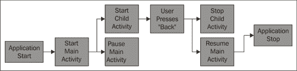
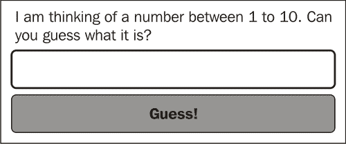
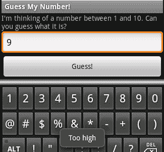
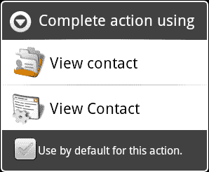

# 第四章：利用活动和意图

在许多方面，Android 应用程序管理似乎受到 JavaScript 和网页浏览器的启发，这是有道理的！网页浏览器模型已经证明它是一个用户容易操作的机制。作为一个系统，Android 与网页浏览器有许多共同之处，其中一些是显而易见的，其他的则需要你更深入地了解。

`活动`堆栈与单向的网页浏览器历史类似。当你使用`startActivity`方法启动一个`Activity`时，实际上是将控制权交还给了 Android 系统。当用户在手机上按下硬件“返回”按钮时，默认操作是从堆栈中弹出顶部`Activity`，并显示下面的一个（不总是启动它的那个）。

在本章中，我们将探讨 Android 如何运行应用程序以及如何管理`Activity`实例。虽然这对于用户界面设计并非绝对必要，但了解其工作原理很重要。正确利用这些概念将帮助你确保用户界面体验的一致性。正如你将看到的，它还有助于提高应用程序的性能，并允许你重用更多的应用程序组件。

理解`Activity`是如何创建的（以及它何时被创建），以及 Android 如何决定创建哪个`Activity`也同样重要。我们还将讨论在构建`Activity`类时应遵循的一些良好实践，以及如何在 Android 应用程序的范围内良好地表现。

我们已经在第一章和第二章中遇到了“活动堆栈”，在那里我们构建了`Intent`对象来启动特定的`Activity`类。当你使用硬件“返回”按钮时，你会自动被带到上一个`Activity`实例，无需编写任何代码（就像网页浏览器一样）。在本章中，我们将要了解：

+   `Activity`对象的生命周期

+   使用`Bundle`类维护应用程序状态

+   探索`Intent`与`Activity`之间的关系

+   通过`Intent`向`Activity`传递数据

# 探索活动类

`Activity`对象的生命周期更像 Java `Applet`而不是普通应用程序。它可能会被启动、暂停、恢复、再次暂停、被杀死，然后以看似随机的顺序重新激活。大多数 Android 设备的性能规格非常好。然而，与顶级设备相比，它们中的大多数似乎性能不足。对于那些规格好的设备，用户往往比便宜设备要求更多。在手机上，你永远无法摆脱这样一个事实：许多应用程序和服务正在共享非常有限的设备资源。

如果`Activity`对用户不可见，它可能会随时被垃圾回收。这意味着虽然你的应用程序可能在运行，但由于用户正在查看另一个`Activity`，任何不可见或后台的`Activity`对象可能会被关闭或垃圾回收以节省内存。默认情况下，Android API 会通过在关闭前存储它们的状态并在重新创建时恢复状态，优雅地处理这些关闭/启动周期。下面是一个包含两个`Activity`实例的应用程序生命周期的非常简单的图示。当"主 Activity"暂停时，它就有可能被系统垃圾回收。如果发生这种情况，它首先会在一个临时位置存储其状态，当它被带回前台时会恢复状态。



### 提示

**用户界面状态的存储**

如果一个`Activity`被停止，所有分配了 ID 的`View`对象在可供垃圾回收之前都会尝试存储它们的状态。然而，这种状态只会在应用程序的生命周期内存储。当应用程序关闭时，这个状态就会丢失。

尽管可以一次又一次地使用`setContentView`方法来改变屏幕上的内容（就像你可能使用 AWT 的`CardLayout`对象构建向导界面一样），但这被认为是一个非常糟糕的做法。你实际上是在试图从 Android 手中夺走控制权，这总会给你带来问题。例如，如果你开发了一个只有一个`Activity`类的应用程序，并使用多个布局资源或自己的自定义`ViewGroup`对象来表示不同的屏幕，你还必须控制设备上的硬件"返回"按钮，以允许用户后退。你的应用程序在 Android 市场上发布，几个月后，一个手机制造商决定在其新手机上添加一个"前进"按钮（类似于网页浏览器中的"前进"按钮）。Android 系统会被打补丁以处理这个设备变化，但你的应用程序不会。因此，你的用户会对你的应用程序感到沮丧，因为"它不能正常工作"。

## 使用 Bundle 对象

在`Activity`类的`onCreate`方法中，我们一直在接收一个名为`saveInstanceState`的`Bundle`参数，如您所猜测的那样。它是在`Activity`的停止和启动之间存储状态信息的地方。尽管看起来是这样，但`Bundle`对象并不是一种持久化存储形式。当设备上下文的配置发生变化（例如，当用户选择了一种新语言，或从“纵向”改为“横向”模式）时，当前的`Activity`会被“重新启动”。为此，Android 请求`Activity`将其状态保存在一个`Bundle`对象中。然后它会关闭并销毁现有实例，并使用保存状态信息的`Bundle`创建`Activity`的新实例（带有新的配置参数）。

`Bundle`类实际上是一个`Map<String, ?>`，包含任意数量的值。由于`Bundle`对象用于存储短期状态（即用户正在输入的博客文章），它们主要用于存储`View`对象的状态。在这方面，它们相对于标准的 Java 序列化有两个主要优点：

+   您必须手动实现对象存储。这需要考虑如何存储对象以及需要存储它的哪些部分。例如，在用户界面中，大多数时候您不需要存储布局信息，因为可以从布局文件重新创建它。

+   由于`Bundle`是一个键值结构，它比序列化对象更面向未来且灵活。您可以省略设置为默认值的值，从而减少`Bundle`的大小。

`Bundle`对象也是一个类型安全的结构。如果您使用`putString`方法，那么只有`getString`或`getCharSequence`可以用来检索对象。我强烈建议在使用`Bundle`的`get`方法时，您应该总是提供一个默认值。

在 Android 系统暂停`Activity`之前，系统会请求它将任何状态信息保存在一个`Bundle`对象中。为此，系统会在`Activity`上调用`onSaveInstanceState`方法。这发生在`onPause`方法之前。为了恢复`Activity`的状态，系统会使用保存的状态`Bundle`调用`onCreate`方法。

### 提示

**处理 Activity 崩溃**

如果`Activity`类抛出一个未捕获的异常，用户将看到可怕的**强制关闭**对话框。Android 将尝试通过终止虚拟机并重新打开根活动来从这些错误中恢复，并提供一个带有从`onSaveInstanceState`获取的最后已知状态的`Bundle`对象。

`View`类也有一个`onSaveInstanceState`方法，以及相应的`onRestoreInstanceState`方法。如前所述，`Activity`类的默认功能将尝试在`Bundle`中保存每个带有 ID 的`View`对象。这是坚持使用 XML 布局而不是自己构建布局的另一个好理由。拥有对`View`对象的引用还不足以保存和恢复它，虽然你可以在 Java 代码中分配 ID，但这会使你的用户界面代码更加混乱。

# 行动时间 - 构建一个示例游戏：“猜数字”

我们想要构建一个简单的示例，它将从一个`Bundle`对象保存和恢复其状态。在这个示例中，我们有一个非常简单的“猜数字”游戏。`Activity`对象在 1 到 10 之间选择一个数字，并挑战用户猜测它。

这个示例的基本用户界面布局需要有一个标签告诉用户要做什么，一个输入区域供他们输入猜测，以及一个按钮告诉应用他们想要输入猜测。以下图表是用户界面应该如何构建的基本思路：



如果用户在玩这个游戏时收到短信，我们很可能会丢失他试图猜测的数字。因此，当系统要求我们保存状态时，我们将尝试猜测的数字存储在`Bundle`对象中。启动时我们还需要查找存储的数字。

1.  从命令提示符中，创建一个名为`GuessMyNumber`的新项目：

    ```kt
    android create project -n GuessMyNumber -p GuessMyNumber -k com.packtpub.guessmynumber -a GuessActivity -t 3

    ```

1.  在编辑器或 IDE 中打开默认的`res/layout/main.xml`文件。

1.  移除`LinearLayout`元素中的默认内容。

1.  添加一个新的`TextView`作为标签，告诉用户要做什么：

    ```kt
    <TextView android:text=
        "I'm thinking of a number between 1 and 10\. Can you guess what it is?"
        android:layout_width="fill_parent"
        android:layout_height="wrap_content"/>
    ```

1.  创建一个新的`EditText`，用户将在其中输入他们的猜测。使用`TextView`的`android:numeric`属性来强制只输入`integer`（整数）：

    ```kt
    <EditText
        android:id="@+id/number"
        android:numeric="integer"
        android:layout_width="fill_parent"
        android:layout_height="wrap_content"/>
    ```

1.  添加一个用户可以点击提交猜测的`Button`：

    ```kt
    <Button android:id="@+id/guess"
        android:text="Guess!"
        android:layout_width="fill_parent"
        android:layout_height="wrap_content"/>
    ```

1.  现在在编辑器或 IDE 中打开`GuessActivity.java`文件。

1.  让`GuessActivity`类实现`OnClickListener`：

    ```kt
    public class GuessActivity
        extends Activity implements OnClickListener {
    ```

1.  创建一个字段变量以存储用户应该猜测的数字：

    ```kt
    private int number;
    ```

1.  创建一个实用方法以生成 1 到 10 之间的随机数：

    ```kt
    private static int random() {
        return (int)(Math.random() * 9) + 1;
    }
    ```

1.  在`onCreate`方法中，在调用`super.onCreate`之后，检查以确保传递进来的`Bundle`不为`null`：

    ```kt
    if(savedInstanceState != null) {
    ```

1.  如果`Bundle`不为`null`，尝试从其中获取存储的`Number`：

    ```kt
    number = savedInstanceState.getInt("Number", random());
    ```

1.  如果`Bundle`为`null`，则`Activity`作为新实例运行 - 生成一个随机数：

    ```kt
    else {
        number = random();
    }
    ```

1.  然后将`setContentView`设置为`main.xml`布局资源：

    ```kt
    setContentView(R.layout.main);
    ```

1.  在`main.xml`布局资源中找到你声明的`Button`对象：

    ```kt
    Button button = (Button)findViewById(R.id.guess);
    ```

1.  将`Button`对象的`OnClickListener`设置为`GuessActivity`对象：

    ```kt
    button.setOnClickListener(this);
    ```

1.  现在重写`onSaveInstanceState`方法：

    ```kt
    protected void onSaveInstanceState(Bundle outState) {
    ```

1.  首先确保允许默认的`Activity`行为：

    ```kt
    super.onSaveInstanceState(outState);
    ```

1.  然后将`number`变量存储在`Bundle`中：

    ```kt
    outState.putInt("Number", number);
    ```

1.  我们需要重写`onClick`方法来处理用户的猜测：

    ```kt
    public void onClick(View clicked) {
    ```

1.  找到用户输入猜测数字的`EditText`：

    ```kt
    EditText input = (EditText)findViewById(R.id.number);
    ```

1.  将`EditText`的当前值解析为整数：

    ```kt
    int value = Integer.parseInt(input.getText().toString());
    ```

1.  如果他们猜的数字太低，使用`Toast`告诉他们：

    ```kt
    if(value < number) {
        Toast.makeText(this, "Too low", Toast.LENGTH_SHORT).show();
    }
    ```

1.  如果他们猜的数字太高，再次使用`Toast`告诉他们：

    ```kt
    else if(value > number) {
        Toast.makeText(this, "Too high", Toast.LENGTH_SHORT).show();
    }
    ```

1.  如果他们成功猜对了数字，那么祝贺他们：

    ```kt
    else {
        Toast.makeText(
                this,
                "You got it! Try guess another one!",
                Toast.LENGTH_SHORT).show();
    ```

1.  然后为用户生成一个新的猜测数字：

    ```kt
        number = random();
    }
    ```

在之前的代码中使用了`Toast`类来显示**太高**、**太低**和**猜对了！**的输出信息。`Toast`类是显示简短输出信息的完美机制，几秒钟后它们会自动消失。然而，它们不适合长消息，因为用户无法控制它们，也不能按命令打开或关闭消息，因为它们完全是非交互式的。

## *刚才发生了什么*

在上一个示例中，我们监听`onSaveInstanceState`的调用，以记录用户应该猜测的数字。我们还有用户最近一次做出的猜测，以`EditText`的形式。由于我们在`main.xml`文件中为`EditText`分配了一个 ID 值，调用`super.onSaveInstanceState`将处理`EditText`小部件的确切状态存储（可能包括“选择”和“焦点”状态）。

在`onCreate`方法中，示例首先检查以确保`Bundle`不为`null`。如果 Android 试图创建`GuessActivity`对象的新实例，它不会传递任何保存的状态。然而，如果我们有一个`Bundle`对象，我们会调用`Bundle.getInt`方法尝试获取我们之前存储的`number`值。我们还传递一个`r` `andom()`数作为第二个参数。如果`Bundle`对象（无论什么原因）没有存储`Number`，它将返回这个随机数，这样就无需我们检查这种情况。

顺便一提，示例使用了`TextView`类的`android:numeric`属性，以强制`EditText`对象接受整数输入。切换到数字视图可以阻止用户输入除了“有效”字符以外的任何内容。它还会影响软键盘。它不会显示全键盘，只会显示数字和符号。



# 创建和使用意图：

`Intent`类是 Android 主要的“晚期绑定”方式。这是一种非常松散的耦合形式，允许你指定一个动作（以及一些参数数据），但不需要指定如何执行该动作。例如，你可以使用`Intent`指定浏览到[`www.packtpub.com/`](http://www.packtpub.com/)，但不需要指定 Android 如何执行此操作。它可能使用默认的“浏览器”应用，或者用户安装的其他网页浏览器，甚至可能询问用户他们确切想要如何访问[`www.packtpub.com/`](http://www.packtpub.com/)。有两种主要的`Intent`类型：

+   显式 Intents

+   隐式 Intents

到目前为止，我们只使用了显式`Intent`对象，我们指定了想要运行的的确切类。当从一个`Activity`切换到另一个时，这些非常重要，因为应用程序可能依赖于`Activity`的确切实现。隐式`Intent`是当我们不指定想要操作的确切类时，而是包含我们希望执行操作的抽象名称。通常，隐式`Intent`会包含更多信息，由于以下原因：

+   为了让系统在选择与哪个组件交互时做出最佳选择。

+   `Intent`可能指向一个比我们自行构建的更通用的结构，而一个更通用的结构通常需要更多信息来明确其预期行为。

`Intent`对象是真正让 Android 与其他（更传统的）操作系统不同的地方。它们平衡了应用程序之间的竞争环境，并让用户在使用手机时有更多的选择。用户不仅可以安装一个新的网页浏览器，还可以安装新的菜单、桌面甚至拨号应用。

每个`Activity`实例都保存着启动它的`Intent`对象。第一章中，我们通过*开发一个简单的活动*用到了`Activity.getIntent()`方法，从`Intent`对象中获取一些参数，这些参数告诉我们应该向用户提出哪个问题。

## 定义 Intent 动作

在隐式`Intent`中首先要看的是它的动作。动作定义了`Intent`“做什么”，但不是“怎么做”或“对什么做”。`Intent`类定义了一系列常量，代表常见动作。这些常见动作总是有某种形式的支撑逻辑，通常由电话系统定义。因此，它们总是可供应用程序使用。

例如，如果你想向用户展示拨号应用，使他们可以拨打电话号码并进行通话，你会使用带有`ACTION_DIAL`的`Intent`：

```kt
startIntent(new Intent(Intent.ACTION_DIAL));
```

`Intent`的动作值与`Activity`定义的一个动作匹配。一个`Activity`可能有多个它可以执行的动作，它们都作为应用程序`AndroidManifest.xml`文件的一部分被指定。例如，如果你想定义一个`askQuestion`动作并将其绑定到一个`Activity`，你的`AndroidManifest.xml`文件将包含一个`Activity`条目，看起来像这样：

```kt
<activity
    android:name=".AskQuestionActivity"
    android:label="Ask Question">

    <intent-filter>
        <action android:name="questions.askQuestion"/>
        <category android:name="android.intent.category.DEFAULT"/>
    </intent-filter>
</activity>
```

一个`Activity`可以有多个`<intent-filter>`元素，每个元素定义了一种不同类型的匹配要在`Intent`上执行。与任何给定的`Intent`最接近匹配的`Activity`被选中来执行`Intent`对象请求的动作。

## 在 Intent 中传递数据。

向用户展示拨号器应用程序，让他们拨打一个电话号码非常好，但如果实际上我们需要他们拨打一个电话号码呢？`Intent`类不仅仅通过使用动作来工作，它还为我们提供了一个默认的空间，告诉我们想要动作执行的对象。如果我们不能告诉浏览器要访问哪个 URL，那么打开网页浏览器不是非常有用，对吧？

`Intent`提供的默认数据作为一个`Uri`对象。`Uri`在技术上可以指向任何东西。对于我们之前的代码片段，我们启动了拨号器，让用户拨打一个电话号码。那么我们如何告诉拨号器：“拨打 555-1234”呢？很简单，看看以下代码：

```kt
startActivity(new Intent(
        Intent.ACTION_DIAL,
        Uri.parse("tel://5551234")));
```

## 向 Intent 添加额外数据

有时`Uri`不允许指定足够的数据。对于这些情况，`Intent`类为你提供了一个键值对的`Map`空间，称为"额外"数据。"额外"数据的访问方法与`Bundle`类中的方法相对应。在第一章《*开发简单活动*》中，我们使用了额外数据来跟踪我们向用户提出的问题。

在定义通用的`Activity`类（如文件查看器）时，查找操作数据时建立一个三阶段回退系统是一个好主意：

+   任何自定义（非标准）参数都可以在额外字段中传递（而且它们都不应该是强制性的）。

+   检查数据`Uri`以了解你应该处理哪些信息。

+   如果没有指定数据`Uri`，优雅地回退到逻辑默认值，并为用户提供一些功能。

## 动手实践英雄——通用问题与答案

回顾一下第一章《*开发简单活动*》中的示例问题与答案应用程序。重写`QuestionActivity`类，使用数据`Uri`来指定问题 ID（通过名称），而不是额外的参数。

同时，允许使用"额外"参数传递完整问题——一个参数`Question`用于要问用户的问题文本，以及一个参数`Answers`，指定给定问题的可能答案的字符串数组。

# 使用高级 Intent 功能

`Intent`对象旨在指示用户请求的单个动作。它是一个自包含的请求，在某些方面与 HTTP 请求非常相似，既包含要执行的动作，也包含要执行动作的资源，以及可能需要的相关信息。

为了找到将处理`Intent`的`Activity`（服务或广播接收器），系统使用了意图过滤器（我们之前简要讨论过）。每个意图过滤器指示了一个`Activity`可能执行的单个动作类型。当两个或更多的`Activity`实现匹配一个`Intent`时，系统会发送一个`ACTION_PICK_ACTIVITY Intent`，以允许用户（或某些自动化系统）选择哪个`Activity`实现应该用来处理`Intent`。默认行为是询问用户他们希望使用哪个`Activity`实现。

## 从 Intent 获取数据

`Intent`并不总是单向的结构，某些`Intent`动作会提供反馈。一个很好的例子就是`Intent.ACTION_PICK`。`Intent.ACTION_PICK`动作是请求用户“挑选”或选择某种数据形式的方式（一个常见的用法是请求用户从他们的联系人列表中选择一个人或电话号码）。

当你需要从`Intent`获取信息时，应使用`startActivityForResult`方法，而不是普通的`startActivity`方法。`startActivityForResult`方法接受两个参数：要执行的`Intent`对象和一个有用的`int`值，该值将被传回给你。

如前所述，当另一个`Activity`可见而不是你的时，你的`Activity`会被暂停，甚至可能被停止并垃圾回收。因此，`startActivityForResult`方法会立即返回，并且通常可以假设在你从当前事件返回后（将控制权交还给系统），你的`Activity`将直接被暂停。

为了获取你触发的`Intent`中的信息，你需要重写`onActivityResult`方法。每次使用`startActivityForResult`启动的`Intent`返回数据时，都会调用`onActivityResult`方法。传回`onActivityResult`方法的第一参数是你传给`startActivityForResult`方法的相同整数值（允许你传回简单的参数）。

### 提示

**向另一个 Activity 传递信息**

如果你打算让一个`Activity`实现将信息传回给调用者，你可以使用`Activity.setResult`方法来传递一个结果码和带有你响应数据的`Intent`对象。

## 快速测验

1.  `onCreate`何时会接收到一个有效的`Bundle`对象？

    1.  每次创建`Activity`时

    1.  当应用程序在之前的执行中在`Bundle`中存储了信息时

    1.  当由于配置更改或崩溃而重新启动 Activity 时

1.  `onSaveInstanceState` 方法何时被调用？

    1.  在 `onStop` 方法之后

    1.  在 `onPause` 方法之前

    1.  当 `Activity` 正在被重新启动时

    1.  在 `onDestroy` 方法之前

1.  `Bundle` 对象将被存储直到：

    1.  应用程序已关闭

    1.  `Activity` 不再可见

    1.  应用已被卸载

# 动手时间——查看电话簿联系人

在这个例子中，我们将更深入地探讨 Android 系统的运作方式。我们将覆盖默认的“查看联系人”选项，提供我们自己的 `Activity` 来查看设备上电话簿中的联系人。当用户尝试打开一个联系人以发送电子邮件或拨打电话时，他们将有机会使用我们的 `Activity` 而不是默认的来查看联系人。

1.  从命令行开始创建一个新项目：

    ```kt
    android create project -n ContactViewer -p ContactViewer -k com.packtpub.contactviewer -a ViewContactActivity -t 3
    ```

1.  在编辑器或 IDE 中打开 `res/layout/main.xml` 布局资源。

1.  移除 `LinearLayout` 元素中的默认内容。

1.  添加一个新的 `TextView` 对象以包含联系人的显示名称：

    ```kt
    <TextView android:id="@+id/display_name"
              android:textSize="23sp"
              android:textStyle="bold"
              android:gravity="center"
              android:layout_width="fill_parent"
              android:layout_height="wrap_content"/>
    ```

1.  然后添加一个 `Button`，该按钮将用于“拨打”显示联系人的默认电话号码：

    ```kt
    <Button android:id="@+id/phone_number"
            android:layout_marginTop="5sp"
            android:layout_width="fill_parent"
            android:layout_height="wrap_content"/>
    ```

1.  在编辑器或 IDE 中打开 `ViewContactActivity.java` 源文件。

1.  让 `ViewContactActivity` 实现 `OnClickListener`：

    ```kt
    public class ViewContactActivity
            extends Activity implements OnClickListener {
    ```

1.  在 `onCreate` 方法中的 `setContentView(R.layout.main)` 之后，找到你创建的 `TextView` 对象，以显示联系人的名称：

    ```kt
    TextView name = (TextView)findViewById(R.id.display_name);
    ```

1.  然后找到用于显示电话号码的 `Button` 控件：

    ```kt
    Button number = (Button)findViewById(R.id.phone_number);
    ```

1.  现在，使用 `Activity.managedQuery` 方法查询联系人数据库，获取我们的 `Intent` 中指定的 `data Uri`：

    ```kt
    Cursor c = managedQuery(
            getIntent().getData(),
            new String[]{
                People.NAME,
                People.NUMBER
            },
            null,
            null,
            null);
    ```

1.  在 `try {} finally{}` 代码块中，告诉 `Cursor` 执行 `moveToNext()` 并确保其这样做（这与 `ResultSet.next()` 的作用完全相同）：

    ```kt
    if(c.moveToNext()) {
    ```

1.  从 `Cursor` 中获取并显示联系人显示名称：

    ```kt
    name.setText(c.getString(0));
    ```

1.  从 `Cursor` 中获取并显示联系人的默认电话号码：

    ```kt
    number.setText(c.getString(1));
    ```

1.  在 `finally{}` 代码块中，关闭 `Cursor`：

    ```kt
    finally {
        c.close();
    }
    ```

1.  现在，将 `number Button` 的 `OnClickListener` 设置为 `this`：

    ```kt
    number.setOnClickListener(this);
    ```

1.  重写 `onClick` 方法：

    ```kt
    public void onClick(View clicked) {
    ```

1.  我们知道点击的是 `number Button`（此时唯一带有事件监听器的 `View`）。将 `View` 参数转换为 `Button`，这样我们就可以使用它了：

    ```kt
    Button btn = (Button)clicked;
    ```

1.  创建一个 `Intent` 对象以拨打选定的电话号码：

    ```kt
    Intent intent = new Intent(
            Intent.ACTION_DIAL,
            Uri.parse("tel://" + btn.getText()));
    ```

1.  使用 `startActivity` 打开拨号器应用：

    ```kt
    startActivity(intent);
    ```

1.  现在，在编辑器或 IDE 中打开 `AndroidManifest.xml` 文件。

1.  在 `<application>` 元素声明之前，我们需要读取联系人列表的权限：

    ```kt
    <uses-permission
         android:name="android.permission.READ_CONTACTS" />
    ```

1.  将 `ViewContactActivity` 的标签更改为 **查看联系人**：

    ```kt
    <activity
        android:name=".ViewContactActivity"
        android:label="View Contact">
    ```

1.  移除 `<intent-filter>` 元素内的所有默认内容。

1.  为此 `<intent-filter>` 声明一个类型为 `ACTION_VIEW` 的 `<action>`：

    ```kt
    <action android:name="android.intent.action.VIEW"/>
    ```

1.  将此 `<intent-filter>` 的 `<catagory>` 设置为 `CATAGORY_DEFAULT`：

    ```kt
    <category android:name="android.intent.category.DEFAULT"/>
    ```

1.  添加一个 `<data>` 元素以筛选 `person` 条目（这是一个 MIME 类型）：

    ```kt
    <dataandroid:mimeType="vnd.android.cursor.item/person"
        android:host="contacts" />
    ```

1.  添加另一个 `<data>` 元素以筛选 `contact` 条目：

    ```kt
    <data android:mimeType="vnd.android.cursor.item/contact"
          android:host="com.android.contacts" />
    ```

当在设备上安装时，前面的代码将成为用户打开通讯录中“联系人”的一个选项。正如你所见，替换 Android 标准框架的一部分非常简单，它允许应用程序与基础系统进行更加无缝的集成，这是更传统的应用程序架构所无法实现的。

## *刚刚发生了什么*

如果你在这个模拟器上安装这个应用程序，你会注意到在启动器中没有图标来启动它。这是因为这个应用程序不像我们迄今为止编写的所有其他应用程序那样有一个主要的入口点。相反，如果你打开“联系人”应用程序，然后点击通讯录中的一个联系人，你会看到以下屏幕：



如果你选择第二个图标，你新的`ViewContactActivity`将被启动以查看选定的联系人。正如你所见，用户也有能力在默认情况下使用你的应用程序（只要你的应用程序在设备上可用）。

在开发新应用程序时，覆盖默认行为是一个非常重要的决定。Android 使得这变得非常简单，正如你所见，第三方应用程序可以几乎无缝地插入两个默认应用程序之间。在正常的操作系统环境中，你需要编写一个完整的“联系人管理器”，而在 Android 中，你只需要编写你感兴趣的部分。

这是你用户界面设计的一部分，因为它可以用来扩展系统的各种默认部分的 功能。例如，如果你编写了一个聊天应用程序，比如一个“Jabber”客户端，你可以将客户端嵌入到用户通讯录中每个与 Jabber ID 关联的联系人**查看联系人**`Activity`中。这将使用户可以直接从他们的通讯录与可用的联系人聊天，而无需打开你的应用程序。你的应用程序成为他们检查联系人状态的方式，甚至可能完全避免打电话。

# 总结

在正确的粒度上实现`Activity`是你用户界面设计过程的一个重要部分。尽管它不是直接与图形相关的一部分，但它定义了系统如何与你的应用程序交互，从而也定义了用户如何与它交互。

在构建`Activity`启动方式时，考虑到隐式意图是一个好主意。创建一个通用的`Activity`可以让其他应用程序与你自己的程序无缝集成，从而有效地将你的新应用程序转变为其他开发人员工作的平台。通过隐式方式启动的`Activity`可以被另一个应用程序替换或扩展，也可以在其他应用程序中被复用。在这两种情况下，用户可以像定制壁纸图像或主题一样自由地定制你的应用程序。

一定要尝试为用户可能要采取的每个动作提供一个单独的`Activity`实现，不要让一个`Activity`在同一个屏幕上做太多事情。一个很好的粒度例子就是“联系人”应用——它包含了联系人列表、联系人查看器、联系人编辑器和拨号应用。

当处理标签界面（正如我们在上一章所做的）时，可以将标签内容指定为`Intent`，实际上是将`Activity`嵌入到你的应用中。我强烈建议你在构建标签用户界面时考虑这样做，因为它可以让每个标签更容易地被你的应用重复使用，同时也允许第三方开发者一次创建一个标签来扩展你的界面。

迄今为止，我们主要使用了`LinearLayout`类，虽然这对于简单的用户界面来说是一个很好的基础，但几乎永远不够用。在下一章中，我们将探讨 Android 默认提供的许多其他类型的布局，研究每种布局的工作方式以及如何使用它们。
