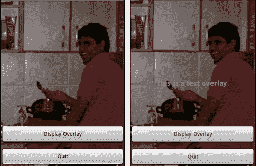
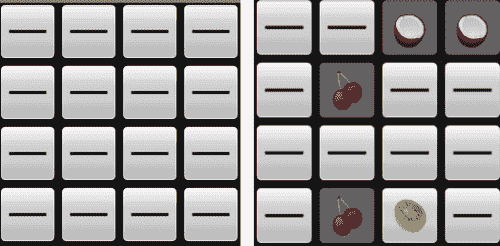
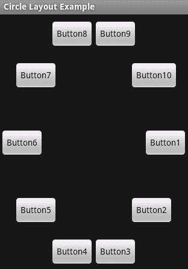
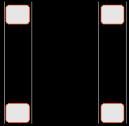
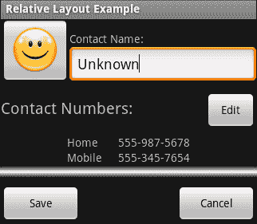
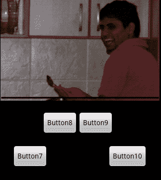

# 第五章：开发非线性布局

*非线性布局通常是完全的用户界面设计的基础课题。然而，在屏幕较小的设备上（许多 Android 设备都是如此），这样做并不总是合理的。也就是说，Android 设备可以切换到横屏模式，突然之间你就有大量的水平空间，而垂直空间有限。在这些情况下（以及我们将要看到的其他许多情况下），你会想要使用除了我们至今为止使用的普通`LinearLayout`结构之外的布局。*

*Android 布局的真正强大之处与旧的 Java AWT `LayoutManagers`的强大之处相同——通过将不同的布局类相互组合。例如，将`FrameLayout`与其他`ViewGroup`实现相结合，允许你将用户界面的各个部分层层叠加。*

考虑你的布局在不同大小的屏幕上的表现是很重要的。虽然 Android 允许你根据设备屏幕大小选择不同的布局，但这意味着你将不得不为不同的屏幕大小和密度维护多个布局，这些屏幕大小和密度将在野外遇到你的应用程序。尽可能使用 Android 提供的工具，并使用会根据各种`View`对象的大小进行缩放的布局。

在本章中，我们将探讨 Android 默认提供的各种其他布局样式，并研究每种布局的各种替代用途。我们还会更详细地了解如何为不同的布局指定参数，以及它们如何帮助提高可用性，而不仅仅是将你的小部件按特定顺序排列。

# 是时候行动了——创建一个布局示例项目

在我们逐一了解每种布局之前，我们需要一个公共项目，在其中展示每一种布局。

1.  从命令提示符中，创建一个名为**Layouts**的新项目：

    ```kt
    android create project -n Layouts -p Layouts -k com.packtpub.layouts -a LayoutSelectorActivity -t 3
    ```

1.  删除标准的`res/layout/main.xml`布局资源文件。

1.  在编辑器或 IDE 中打开`res/values/strings.xml`文件。

1.  在文件中添加一个名为`layouts`的新`<string-array>`：

    ```kt
    <string-array name="layouts">
    ```

1.  向新的`<string-array>`元素中添加以下项目：

    ```kt
    <item>Frame Layout</item>
    <item>Table Layout</item>
    <item>Custom Layout</item>
    <item>Relative Layout</item>
    <item>Sliding Drawer</item>
    ```

1.  在你的编辑器或 IDE 中打开`LayoutSelectorActivity`源文件。

1.  让类从`ListActivity`继承，而不是从`Activity`继承：

    ```kt
    public class LayoutSelectorActivity extends ListActivity {
    ```

1.  在`onCreate`方法中，将你在`strings.xml`资源文件中声明的`ListActivity`的内容设置为你`layouts`数组：

    ```kt
    setListAdapter(new ArrayAdapter<String>(
            this,
            android.R.layout.simple_list_item_1, Have the class inherit from"
            getResources().getStringArray(R.array.layouts)));
    ```

1.  重写`onListItemClick`方法：

    ```kt
    protected void onListItemClick(
            ListView l,
            View v,
            int position,
            long id) {
    ```

1.  在`position`参数上创建一个`switch`语句：

    ```kt
    switch(position) {
    ```

1.  添加一个`default`子句（目前唯一的一个），以让你知道你还没有为所选项目实现示例：

    ```kt
    default:
        Toast.makeText(
                this,
                "Example not yet implemented.",
                Toast.LENGTH_SHORT).show();
    ```

## *刚才发生了什么？*

新项目将作为本章每个示例的基础。对于我们要探讨的每个布局，我们将构建一个新的`Activity`，这将成为这个应用程序的一部分。目前，该应用程序只包含一个菜单，用于访问每个布局示例。现在的想法是给每个示例填充一些有趣的内容。

在本章中，我们将不仅探讨基本布局，还会了解它们如何相互作用。

# `FrameLayout`的使用

`FrameLayout`类将每个控件锚定在其自身的左上角。这意味着每个子控件都会在之前的控件上绘制。这可以通过使用`View.setVisible`来模拟 AWT 中的`CardLayout`，即显示一个子控件同时隐藏所有其他子控件（这正是`TabHost`的工作原理）。

由于`FrameLayout`实际上会绘制所有可见的子视图，因此可以用来将子控件层层叠加。在某些情况下，它会产生非常奇特的效果，而在其他情况下，它可能非常有用。例如，通过使用半透明的`View`对象和一个`FrameLayout`，可以实现除一个控件外所有控件变暗的效果。不活跃的控件是`FrameLayout`中的第一层，半透明的`View`对象是第二层，活跃的控件是第三层。

## 常见用途

`FrameLayout`最常见的用法可能是与`TabHost`结合使用——为每个标签页持有内容`View`对象。你也可以用它来模拟更像是桌面应用的感觉，通过将控件层层叠加。在游戏中也非常有效，可以用来显示游戏内的菜单，或者在游戏主菜单后面绘制动画背景。

通过将`FrameLayout`对象与占据整个屏幕的控件结合使用，可以利用`gravity`属性将对象更精确地放置在其他控件之上。为此，通常希望每个`FrameLayout`的子控件都是某种`ViewGroup`，因为除非特别指定，否则它们通常不会在背景中绘制（让下面的图层保持可见）。

`FrameLayout`还能够显示`前景`。虽然所有`View`对象都有`背景`属性，但`FrameLayout`包含一个`前景`（这也是一个可选的`Drawable`）。`前景`会在所有子控件之上绘制，允许显示一个“框架”。

# 动手实践时间——开发一个`FrameLayout`示例。

要真正理解`FrameLayout`的作用以及如何使用它，最好是通过一个示例来实践一下。在这个示例中，我们将使用`FrameLayout`将一些`Button`控件叠加在`ImageView`之上，并在点击其中一个按钮时显示和隐藏一个`TextView`消息。

为了使这个示例工作，你需要一张图片作为背景图。我将使用我朋友的一张照片。像往常一样，将你的图片放在`res/drawable`目录中，并尝试使用 PNG 文件。

1.  创建一个名为`res/layout/frame_layout.xml`的新布局资源文件。

1.  将根元素声明为占用所有可用空间的`FrameLayout`：

    ```kt
    <FrameLayout

        android:layout_width="fill_parent"
        android:layout_height="fill_parent">
    ```

1.  在`FrameLayout`内部，创建一个`ImageView`作为背景图像。它应该缩放以填满所有可用空间：

    ```kt
    <ImageView android:src="img/jaipal"
               android:scaleType="centerCrop"
               android:layout_width="fill_parent"
               android:layout_height="fill_parent"/>
    ```

1.  现在创建一个垂直的`LinearLayout`，我们将在屏幕底部放置两个`Button`对象：

    ```kt
    <LinearLayout android:orientation="vertical"
                  android:gravity="bottom"
                  android:layout_width="fill_parent"
                  android:layout_height="fill_parent">
    ```

1.  创建一个`Button`，我们将使用它来切换`FrameLayout`的一个子层（创建类似对话框的效果）：

    ```kt
    <Button android:text="Display Overlay"
            android:id="@+id/overlay_button"
            android:layout_width="fill_parent"
            android:layout_height="wrap_content"/>
    ```

1.  创建另一个`Button`以退出演示并返回菜单：

    ```kt
    <Button android:text="Quit"
            android:id="@+id/quit"
            android:layout_marginTop="10sp"
            android:layout_width="fill_parent"
            android:layout_height="wrap_content"/>
    ```

1.  在`</LinearLayout>`之后，创建一个最终的`TextView`元素，我们将在点击第一个按钮时显示和隐藏它。默认情况下它是隐藏的：

    ```kt
    <TextView android:visibility="gone"
              android:id="@+id/overlay"
              android:textSize="18sp"
              android:textStyle="bold"
              android:textColor="#ffff843c"
              android:text="This is a text overlay."
              android:gravity="center|center_vertical"
              android:layout_width="fill_parent"
              android:layout_height="fill_parent"/>
    ```

1.  在项目的根包中创建一个新的`FrameLayoutActivity` Java 类，并在编辑器或 IDE 中打开源文件。新类需要从`Activity`继承并实现`OnClickListener`类（用于那两个`Button`小部件的事件）：

    ```kt
    public class FrameLayoutActivity
            extends Activity implements OnClickListener {
    ```

1.  重写`onCreate`方法：

    ```kt
    protected void onCreate(Bundle savedInstanceState) {
    ```

1.  调用`super.onCreate`方法以使`Activity`代码工作：

    ```kt
    super.onCreate(savedInstanceState);
    ```

1.  将内容布局设置为刚才创建的`frame_layout`资源：

    ```kt
    setContentView(R.layout.frame_layout);
    ```

1.  在`frame_layout`资源文件中找到你声明的`overlay Button`小部件并创建一个引用：

    ```kt
    Button overlay = (Button)findViewById(R.id.overlay_button);
    ```

1.  将其`OnClickListener`设置为新的`FrameLayoutActivity`对象：

    ```kt
    overlay.setOnClickListener(this);
    ```

1.  查找你声明的`quit Button`小部件：

    ```kt
    Button quit = (Button)findViewById(R.id.quit);
    ```

1.  然后将它的`OnClickListener`设置为`FrameLayoutActivity`对象：

    ```kt
    quit.setOnClickListener(this);
    ```

1.  `OnClickListener`接口要求我们实现一个具有以下签名的`onClick`方法：

    ```kt
    public void onClick(View view) {
    ```

1.  对`View`参数的 ID 创建一个`switch`语句：

    ```kt
    switch(view.getId()) {
    ```

1.  如果用户点击的`View`是`overlay_button Button`，则使用以下代码：

    ```kt
    case R.id.overlay_button:
    ```

1.  从布局中获取`overlay View`对象：

    ```kt
    View display = findViewById(R.id.overlay);
    ```

1.  根据当前状态切换其可见性，然后从`switch`语句中`break`：

    ```kt
    display.setVisibility(
            display.getVisibility() != View.VISIBLE
            ? View.VISIBLE
            : View.GONE);
    break;
    ```

1.  如果用户点击的`View`是`quit Button`，则使用以下代码：

    ```kt
    case R.id.quit:
    ```

1.  调用`finish()`方法，并从`switch`语句中`break`：

    ```kt
    finish();
    break;
    ```

1.  在编辑器或 IDE 中打开`LayoutSelectorActivity` Java 源文件。

1.  在`onListItemClick`方法中，为`switch`语句创建一个新的`case`，用于`position`值为`0`的情况：

    ```kt
    case 0:
    ```

1.  使用显式`Intent`启动`FrameLayoutActivity`：

    ```kt
    startActivity(new Intent(this, FrameLayoutActivity.class));
    break;
    ```

1.  在编辑器或 IDE 中打开`AndroidManifest.xml`文件。

1.  将新的`FrameLayoutActivity`添加到清单文件中：

    ```kt
    <activity android:name=".FrameLayoutActivity"
              android:label="Frame Layout Example"/>
    ```

## *刚才发生了什么？*

新的`FrameLayoutActivity`使用了一个简单三层`FrameLayout`。我们使用`ImageView`对象绘制一个漂亮的背景图像，在其上放置了两个按钮。尽管第三层（`TextView`小部件）在顶部按钮被点击之前是不可见的，但需要注意的是，顶部`TextView`的背景不仅透明，而且还将点击事件委托给技术上位于其下的控件（`TextView`有一个消耗整个`FrameLayout`的控件和高度）。即使`TextView`的背景是不透明的，这也会继续工作。这更多是因为`TextView`不是“可点击”的。如果你为`overlay TextView`对象添加了一个`OnClickListener`，那么它下面的按钮将停止工作。这意味着你需要小心如何在`FrameLayout`中分层控件（尽管只要一个控件不占用另一个控件的空间，这对你来说不会成为问题）。

在这个例子中，我们在布局中添加了一个**退出**按钮，并在点击`Button`时使用`finish()`方法关闭`Activity`。你会发现你通常不会直接使用`finish()`方法，因为用户通常会继续向前浏览你的应用程序。如果用户想要返回，他们通常会使用硬件“返回”按钮，或者按下硬件“主页”按钮完全退出你的应用程序。

关于上述示例的最后说明——在`frame_layout.xml`文件中，我们将`overlay`声明为一个`TextView`小部件。然而，在 Java 代码中，我们使用`View`类而不是`TextView`来访问它。这是一个简单的解耦例子。除非你正在处理一个以性能为中心的代码段，否则最好尽可能地将你的布局小部件引用到类树的高层。这样，你就可以在以后更快地修改用户界面。在这种情况下，你可以将简单的`TextView`更改为整个`LinearLayout`，而无需更改 Java 代码。

下面是`FrameLayout`示例的两张屏幕截图，分别是有和没有启用`overlay TextView`的情况。这种布局非常适合用于游戏菜单或类似结构中，在这些地方你需要将不同的控件层层叠加在一起。



# 表格布局

`Table Layout`以 HTML 风格的网格排列其子项。它有点像 AWT 的`Grid Layout`类，但灵活性要大得多。与 Android 中的大多数其他布局类不同，`Table Layout`使用自己的专用直接子`View`类，名为`Table Row`。`Table Layout`类也不允许你定义行数或列数（使其更像一个 HTML 的`<table>`元素）。相反，行数和列数是由`Table Layout`及其`Table Row`子项中的控件数量计算得出的。

`Table Layout`中的单元格可以占用任意数量的行和列，尽管默认情况下，放在`Table Row`中的`View`会正好占据一个单元格。但是，如果你直接将`View`作为`Table Layout`的子项，它将占用整行。

`Table Layout`也是一个相对布局结构，这在处理 Android 设备时至关重要。能够基于网格线对齐所有内容，使得用户界面可以从低分辨率的小手机扩展到 7 英寸平板电脑上的高密度屏幕。

`android:gravity`属性在`Table Layout`中的使用远比其他布局类更为频繁。在小屏幕上看起来很棒的效果在大屏幕上可能会完全不同，这并不是因为屏幕的大小，而是因为所使用字体的缩放。特别是在标签和控件的垂直对齐上要小心。最简单的方法是先将所有表格控件垂直居中，然后在此基础上进行调整。务必在多种屏幕分辨率和尺寸上测试基于表格的布局。

## 常见用途

在大多数情况下，你会发现自己使用`Table Layout`来排列输入表单。它也适用于布局复杂信息，特别是在让某些`View`对象跨越多行和多列时。`Table Layout`最重要的特点在于它以非常严格的方式对其单元格进行对齐，同时它是一个相对尺寸的布局。

`Table Layout`也可以用来实现类似于 AWT `Border Layout`类的效果。通常，在调整`Table Layout`以适应整个屏幕时，它变成了一个非常不同于简单网格的工具，允许你在控件中间放置一个`Scroll View`。

通过在`FrameLayout`内使用`Table Layout`，你可以在内容`View`（如 Google Maps 中的控件）上方排列一个控制`View`。还要注意，与 AWT `GridLayout`不同，`TableLayout`内部的`View`尺寸并不附着在它所在的表格单元格尺寸上。通过使用`gravity`属性（可能还有布局边距），你可以在单元格内放置`View`对象，从而创建出更加用户友好的布局。

## 在记忆游戏中使用 TableLayout

为了演示`TableLayout`，我认为编写一个简单的记忆卡牌游戏会很有趣。你面对的是一个网格（以`TableLayout`的形式），你可以触摸它来有效地翻转“卡片”。然后你可以尝试匹配所有这些卡片上的内容（每次只允许翻转两张）。在这个例子中，你需要在卡片上放置一些图片（我这里复用了交付示例中的水果图标）。在这个应用中，我们还将创建一个简单的占位符图片，以 XML 文件的形式。

为了创建占位符图像，在`res/drawable`目录中创建一个新的 XML 资源，名为`line.xml`。这将是一个“形状”资源。形状资源对于创建简单、可伸缩的形状非常有用。此外，形状资源文件可以使用代码提供的任何颜色、纹理或渐变。

为了创建我们示例的简单占位符图像，将以下代码复制到`line.xml`文件中：

```kt
<?xml version="1.0" encoding="UTF-8"?>

<shape 
       android:shape="line">

    <stroke android:width="3dp"
            android:color="#ff000000"/>

    <padding android:left="1dp"
             android:top="1dp"
             android:right="1dp"
             android:bottom="1dp"/>
</shape>
```

# 是时候行动了——开发一个简单的记忆游戏

与几乎所有之前的示例不同，在这个游戏中，我们将完全在 Java 代码中生成布局。这样做的主要原因是内容高度重复，每个单元格几乎包含完全相同的控件。我们使用`TableLayout`创建网格，并在`ImageButton`控件中显示“卡片”。为了封装单个卡片的行为，我们创建了一个`MemoryCard`内部类，它持有一个对它控制的`ImageButton`的引用。

1.  在项目的根包中创建一个新的 Java 类，并将其命名为`TableLayoutActivity`。

1.  让新类继承`Activity`：

    ```kt
    public class TableLayoutActivity extends Activity {
    Declare and array of all the icon resources to use as card images, there must be eight images resources declared in this array:private static final int[] CARD_RESOURCES = new int[]{
        R.drawable.apple,
        R.drawable.banana,
        R.drawable.blackberry,
        // …
    };
    ```

1.  你需要一个定时器来将卡片翻回，因此声明一个`Handler`：

    ```kt
    private final Handler handler = new Handler();
    ```

1.  声明一个`MemoryCard`对象数组：

    ```kt
    private MemoryCard[] cards;
    ```

1.  我们要跟踪的卡片有一张或两张被翻过来。声明第一个的占位符：

    ```kt
    private MemoryCard visible = null;
    ```

1.  如果有两张卡片被翻过来，但它们不匹配，我们用一个简单的`boolean`开关禁用触摸（我们的事件监听器将检查这一点）：

    ```kt
    private boolean touchEnabled = true;
    ```

1.  现在声明一个名为`MemoryCard`的内部类，该类实现了`OnClickListener`接口：

    ```kt
    private class MemoryCard implements OnClickListener {
    ```

1.  `MemoryCard`类持有一个对`ImageButton`的引用：

    ```kt
    private ImageButton button;
    ```

1.  `MemoryCard`类还有一个值，它是卡片正面的图像资源的引用：

    ```kt
    private int faceImage;
    ```

1.  最后，`MemoryCard`使用一个`boolean`值来记住其状态（是显示正面图像还是占位符图像）：

    ```kt
    private boolean faceVisible = false;
    ```

1.  为`MemoryCard`类声明一个构造函数，它只需要获取正面图像的资源标识符：

    ```kt
    MemoryCard(int faceImage) {
    ```

1.  保存`faceImage`资源标识符以供以后使用：

    ```kt
    this.faceImage = faceImage;
    ```

1.  使用`TableLayoutActivity`对象作为其`Context`（`ImageButton`将使用它来加载图像）创建一个新的`ImageButton`对象：

    ```kt
    this.button = new ImageButton(TableLayoutActivity.this);
    ```

1.  将`ImageButton`的大小设置为固定的 64x64 像素：

    ```kt
    this.button.setLayoutParams(new TableRow.LayoutParams(64, 64));
    ```

1.  设置缩放类型，使图标适合`ImageButton`，然后将图像设置为占位符资源：

    ```kt
    this.button.setScaleType(ScaleType.FIT_XY);
    this.button.setImageResource(R.drawable.line);
    ```

1.  将`MemoryCard`对象设置为`ImageButton`对象的`OnClickListener`：

    ```kt
    this.button.setOnClickListener(this);
    ```

1.  为了方便以后使用，`MemoryCard`需要一个`setFaceVisible`方法，该方法将在显示占位符和`faceImage`资源之间切换。

    ```kt
    void setFaceVisible(boolean faceVisible) {
        this.faceVisible = faceVisible;
        button.setImageResource(faceVisible
                ? faceImage
                : R.drawable.line);
    }
    ```

1.  在`MemoryCard`类中实现`onClick`方法：

    ```kt
    public void onClick(View view) {
    ```

1.  首先确保当前脸部不可见（即我们已经翻面朝下），并且触摸功能已启用（其他一些卡片不会再次被翻面朝下）：

    ```kt
    if(!faceVisible && touchEnabled) {
    ```

1.  如果满足这些条件，我们告诉`TableLayoutActivity`我们已被触摸并希望被翻到正面朝上：

    ```kt
    onMemoryCardUncovered(this);
    ```

1.  在 `MemoryCell` 内部类之后，在 `TableLayoutActivity` 中创建一个简单的工具方法，以特定大小创建有序的 `MemoryCell` 对象数组：

    ```kt
    private MemoryCard[] createMemoryCells(int count) {
    ```

1.  当我们创建每个 `MemoryCell` 对象时，我们会成对创建它们，并且按照我们在图标资源数组中指定的顺序：

    ```kt
    MemoryCard[] array = new MemoryCard[count];
    for(int i = 0; i < count; i++) {
        array[i] = new MemoryCard(CARD_RESOURCES[i / 2]);
    }
    ```

1.  完成后，返回新的 `MemoryCell` 对象数组：

    ```kt
    return array;
    ```

1.  现在，重写 `onCreate` 方法：

    ```kt
    protected void onCreate(Bundle savedInstanceState) {
    ```

1.  调用 `Activity.onCreate` 方法：

    ```kt
    super.onCreate(savedInstanceState);
    ```

1.  现在，创建一个新的 `TableLayout` 对象，将其传递给 `TableLayoutActivity` 作为 `Context` 以加载样式和资源：

    ```kt
    TableLayout table = new TableLayout(this);
    ```

1.  默认情况下，我们创建一个 4x4 的网格：

    ```kt
    int size = 4;
    cards = createMemoryCells(size * size);
    ```

1.  然后，我们将其打乱以随机化顺序：

    ```kt
    Collections.shuffle(Arrays.asList(cards));
    ```

1.  创建所需的每个 `TableRow` 对象，并用由 `MemoryCard` 对象在网格中创建的 `ImageButtons` 填充它：

    ```kt
    for(int y = 0; y < size; y++) {
        TableRow row = new TableRow(this);
        for(int x = 0; x < size; x++) {
            row.addView(cards[(y * size) + x].button);
        }
        table.addView(row);
    }
    ```

1.  将 `Activity` 内容视图设置为 `TableLayout` 对象：

    ```kt
    setContentView(table);
    ```

1.  现在，我们编写 `onMemoryCardUncovered` 方法，它由 `MemoryCard.onClick` 实现调用：

    ```kt
    private void onMemoryCardUncovered(final MemoryCard cell) {
    ```

1.  首先，检查当前是否有可见的 `MemoryCard`，如果没有，用户触摸的卡片将翻转到正面，并记住它：

    ```kt
    if(visible == null) {
        visible = cell;
        visible.setFaceVisible(true);
    }
    ```

1.  如果已经有一张正面朝上的卡片，检查它们是否具有相同的图像。如果图像相同，禁用 `ImageButton` 小部件，以便我们忽略事件：

    ```kt
    else if(visible.faceImage == cell.faceImage) {
        cell.setFaceVisible(true);
        cell.button.setEnabled(false);
        visible.button.setEnabled(false);
        visible = null;
    }
    ```

1.  最后，如果正面图像不匹配，我们将用户触摸的卡片翻转到正面，并切换我们的 `touchEnabled` 开关，使 `MemoryCard` 对象将忽略所有其他触摸事件一秒钟：

    ```kt
    else {
        cell.setFaceVisible(true);
        touchEnabled = false;
    ```

1.  然后，我们在 `Handler` 上发布一个延迟的消息，它将再次翻转两张卡片并重新启用触摸事件：

    ```kt
    handler.postDelayed(new Runnable() {
        public void run() {
            cell.setFaceVisible(false);
            visible.setFaceVisible(false);
            visible = null;
            touchEnabled = true;
        }
    }, 1000); // one second before we flip back over again
    ```

## *刚才发生了什么*

在上一个示例中，我们手动编写布局代码的原因应该很明了，如果用 XML 文件构建将会非常重复。你会注意到，代码创建了一个 `TableRow` 对象作为 `TableLayout` 的直接子项，就像我们在 XML 文件中一样。

`MemoryCard` 的 `onClick` 方法使用 `touchEnabled` 开关来确定是否调用 `onMemoryCardUncovered`。然而，这既不能阻止用户按下 `ImageButton` 对象，也不能阻止对象对用户做出反应（尽管它们不会翻转）。为了提供更友好的用户体验，最好对每个启用的 `ImageButton` 对象使用 `setClickable` 方法，以完全阻止它们对用户的触摸做出反应。

当我们创建 `ImageButton` 对象时，会将它们预设为 64x64 像素大小。这对于大屏幕模拟器来说可能没问题，但有很多设备无法容纳屏幕上的 4x4 按钮网格。我建议你使用 XML 资源来创建 `ImageButton` 对象。

之前的代码使用`setLayoutParams(new TableRow.LayoutParams(64, 64));`来设置`ImageButton`对象的大小。需要注意的是，由于我们将`ImageButton`对象放入到`TableRow`中，它们的`LayoutParams`必须是`TableRow.LayoutParams`类型。如果你尝试改为通用的`ViewGroup.LayoutParams`，那么用户界面将不会布局（它会变成空白）。以下是应用程序运行的两个截图：



## 尝试一下英雄

`TableLayout`示例效果很好，但网格的位置不佳（在屏幕左上角），并且将其放在黑色背景上相当单调。是时候让它看起来很棒了！

首先，使用`FrameLayout`为游戏添加一个背景图像。这将通过添加更多色彩来增强游戏的整体吸引力。你也应该借此机会将网格在屏幕上居中。将其放在左上角不知为何会显得不平衡。

你还应该尝试移除`touchEnabled`开关，改为在每个`ImageButton`对象上使用`setClickable`。这将阻止它们在你将牌面朝下时提供视觉上的“按下和释放”反馈。

# AbsoluteLayout/自定义布局

**不要使用 AbsoluteLayout！ AbsoluteLayout 已被弃用！** 也就是说，有时使用`AbsoluteLayout`类是有意义的。那么你为什么不应该使用`AbsoluteLayout`类，你应该在什么时候使用它呢？第一个问题的答案很简单——`AbsoluteLayout`的所有子部件都有它们的确切位置，它们在不同屏幕上不会改变大小或位置。它还使你的布局几乎不可能被复用（例如，将其导入另一个布局，或嵌入到另一个应用程序中）。

如果你要使用`AbsoluteLayout`，你应该选择以下两种方法之一来接近它：

1.  仔细为每种不同的屏幕尺寸构建一个单独的布局 XML。

1.  在 Java 代码中编写你的布局数据，而不是在 XML 中。

第一种方法不切实际，除非你指定应用程序只能在特定设备上运行，而且该布局不能在你的应用程序之外使用。然而，第二种方法开启了“正确”的道路——编写自定义布局管理器。由于`AbsoluteLayout`需要严格的位置，并且不允许与子`View`对象的测量轻松交互，定义不适合任何其他布局类的布局的最佳方法是 在你自己的`ViewGroup`类中定义一个自定义布局。

## 开发你自己的布局

由于`AbsoluteLayout`已被弃用，但仍有很多人似乎坚持使用它，这个例子将展示如何编写自己的`ViewGroup`类定义一个新布局，以及将这个布局集成到布局 XML 资源中是多么容易。这将证明使用`AbsoluteLayout`并没有充分的理由（除非它真的有意义）。

# 行动时间——创建自定义布局

为了真正展示自定义布局的使用，你需要尝试构建一些不寻常的东西。在以下示例中，你将组合一个以美观的圆形排列其子项的`ViewGroup`。这并不是一个特别出色的布局，也不特别实用，但圆形看起来很美观，并且它将在屏幕中心提供有用的空白空间（可以使用`FrameLayout`填充）。

1.  在项目的根包中创建一个名为`CircleLayout.java`的新 Java 源文件，并在编辑器或 IDE 中打开它。

1.  声明`CircleLayout`扩展自`ViewGroup`类：

    ```kt
    public class CircleLayout extends ViewGroup
    ```

1.  声明三个`ViewGroup`构造函数，并直接将它们委托给`ViewGroup`的默认构造函数：

    ```kt
    public CircleLayout(Context context) {
        super(context);
    }
    // ...
    ```

1.  我们需要知道子`View`对象宽度占用的最大像素数，以及子`View`对象高度占用的最大像素数。为了避免不必要开销，我们借此机会也`测量`子`View`对象。声明一个名为`measureChildrenSizes`的实用方法来执行这两个操作：

    ```kt
    private int[] measureChildrenSizes(int sw, int sh) {
    ```

1.  声明一个`int`来保存我们找到的最大宽度和高度：

    ```kt
    int maxWidth = 0;
    int maxHeight = 0;
    ```

1.  创建一个`for`循环，遍历此`CircleLayout`对象中的每个子`View`对象：

    ```kt
    for(int i = 0; i < getChildCount(); i++) {
    ```

1.  声明一个对当前索引处`View`的引用：

    ```kt
    View child = getChildAt(i);
    ```

1.  作为布局组件，你的类需要负责为其所有子组件设置显示大小。为了知道子组件期望的宽度和高度，你需要在`ViewGroup`类中使用`measureChild`方法：

    ```kt
    measureChild(child, sw, sh);
    ```

1.  测试子`View`对象的宽度和高度，与你之前创建的最大宽度变量和高度变量进行比较：

    ```kt
    maxWidth = Math.max(maxWidth, child.getMeasuredWidth());
    maxHeight = Math.max(maxHeight, child.getMeasuredHeight());
    ```

1.  在方法末尾，返回一个包含在过程中找到的最大宽度和高度的数组：

    ```kt
    return new int[]{maxWidth, maxHeight};
    ```

1.  实现`ViewGroup`的`onLayout`方法：

    ```kt
    protected void onLayout(boolean changed,
            int l, int t, int r, int b) {
    ```

1.  计算我们可用空间的宽度和高度：

    ```kt
    int w = r – l;
    int h = b - t;
    ```

1.  声明一个变量来保存子`View`对象的数量：

    ```kt
    int count = getChildCount();
    ```

1.  对所有子`View`对象进行测量，以确定可用空间的大小：

    ```kt
    int[] max = measureChildrenSizes(w, h);
    ```

1.  从可用空间中减去最大宽度和高度，以确保所有子`View`对象都能在屏幕上显示：

    ```kt
    w -= max[0];
    h -= max[1];
    ```

1.  计算`CircleLayout`中的中心点：

    ```kt
    int cx = w / 2;
    int cy = h / 2;
    ```

1.  创建一个`for`循环，再次遍历每个子`View`对象：

    ```kt
    for(int i = 0; i < count; i++) {
    ```

1.  声明一个变量来保存当前的子`View`对象：

    ```kt
    View child = getChildAt(i);
    ```

1.  计算子`View`对象的`x`和`y`位置：

    ```kt
    double v = 2 * Math.PI * i / count;
    int x = l + (cx + (int)(Math.cos(v) * cx));
    int y = t + (cy + (int)(Math.sin(v) * cy));
    ```

1.  使用计算出的圆中坐标调用子`View`对象的布局方法：

    ```kt
    child.layout(
            x, y,
            x + child.getMeasuredWidth(),
            y + child.getMeasuredHeight());
    ```

## *刚才发生了什么？*

`CircleLayout`类是一个非常简单的`ViewGroup`实现。除了其子项请求的宽度和高度外，它没有可以在 XML 资源中使用的特殊属性。然而，它会注意到你为子项声明的尺寸，因此`layout_width`和`layout_height`属性将正常工作。

需要注意的是，为了从布局 XML 资源中使用自定义`View`或`ViewGroup`，你需要重写所有三个默认构造函数。

### 注意

`LayoutInflater`将使用这些构造函数中的一个来创建你的类的实例。如果它想要使用的那个不存在，那么在尝试膨胀布局 XML 文件时，你会遇到可怕的**强制关闭**对话框。

`CircleLayout`有其自己的实用方法来处理其子`View`对象的测量。通常，`ViewGroup`会使用`ViewGroup.measureChildren`工具方法来确保其所有子`View`对象在执行实际布局之前都已被测量。然而，我们需要遍历子`View`对象列表以找到最大的宽度和高度，因此我们不是执行三次迭代，而是自己执行测量。

## 使用 CircleLayout

为了使用自定义`ViewGroup`实现，了解 Android 在 XML 布局资源方面为你提供了支持是很有帮助的。当你需要从 XML 布局资源中引用自定义`View`或`ViewGroup`类时，只需使用完整的类名而不是简单的类名。以下是使用`CircleLayout`的 XML 布局的一个简单示例：

```kt
<com.packtpub.layouts.CircleLayout

    android:layout_width="fill_parent"
    android:layout_height="fill_parent">

    <Button android:text="Button1"
            android:layout_width="wrap_content"
            android:layout_height="wrap_content"/>

    <Button android:text="Button2"
            android:layout_width="wrap_content"
            android:layout_height="wrap_content"/>

    <!-- 10 Buttons in total works nicely 

</com.packtpub.layouts.CircleLayout>
```

# 动手实践时间——完成 CircleLayout 示例

我们已经有了`CicleLayout`的实现，但现在我们真的应该将其包含在“layouts”示例中。为此，我们需要一个布局资源 XML 文件，一个新的`CircleLayoutActivity`类。我们还需要在 Android（在清单文件中）和我们的`LayoutSelectorActivity`类（在其事件监听器中）注册新的`Activity`。

1.  将前面的 XML 布局复制到一个名为`res/layout/circle_layout.xml`的新文件中。最好添加大约十个小部件作为`CircleLayout ViewGroup`的子项。

1.  在项目的根包中创建一个名为`CircleLayoutActivity.java`的新 Java 源文件。在编辑器或 IDE 中打开它。

1.  `CircleLayoutActivity`必须继承`Activity`类：

    ```kt
    public class CircleLayoutActivity extends Activity {
    ```

1.  重写`Activity`的`onCreate`方法：

    ```kt
    protected void onCreate(Bundle savedInstanceState) {
    ```

1.  调用父类：

    ```kt
    super.onCreate(savedInstanceState);
    ```

1.  将内容视图设置为`circle_layout`布局资源：

    ```kt
    setContentView(R.layout.circle_layout);
    ```

1.  在编辑器或 IDE 中打开`AndroidManifest.xml`文件。

1.  在`TableLayoutActivity`声明之后，声明新的`CircleLayoutActivity`：

    ```kt
    <activity android:name=".CircleLayoutActivity"
              android:label="Circle Layout Example"/>
    ```

1.  在编辑器或 IDE 中打开`LayoutSelectorActivity`源文件。

1.  在`onListItemClick`方法中，在`default case`之前，添加一个新的`case`语句来启动`CircleLayoutActivity`：

    ```kt
    case 2:
        startActivity(new Intent(
            this, CircleLayoutActivity.class));
        break;
    ```

## *刚才发生了什么？*

现在你有一个使用自定义`ViewGroup`实现的新`Activity`实现。自定义`ViewGroup`类不仅在标准`ViewGroup`实现无法很好地处理难以表达的布局时有用。当默认的`ViewGroup`实现对于你想要实现的具体结构来说太慢时，自定义`ViewGroup`也是一个选项。

你在本章中一直在构建的“布局”示例现在将拥有一个可用的**自定义布局**菜单项。点击它，你会看到以下截图。尝试添加除`Button`对象之外的控件，甚至可以尝试加入一个子`ViewGroup`看看会发生什么。



## 快速测验

1.  布局通常分为两个阶段，第一个阶段叫什么？

    1.  预布局

    1.  计算

    1.  父布局

    1.  测量

1.  布局方法的四个参数表示什么？

    1.  x, y, 宽度, 高度。

    1.  左，上，右，下。

    1.  父`ViewGroup`的大小。

1.  自定义`ViewGroup`实现如何读取布局 XML 属性？

    1.  它们通过`LayoutInflator`注入到 setter 方法中。

    1.  它们通过`View.getAttribute`方法加载。

    1.  它们从传递给`ViewGroup`构造函数的`AttributeSet`对象中读取。

# RelativeLayout

`RelativeLayout`类可以说是 Android 提供的最强大的布局。它是一个相对布局，管理大小不一的控件，并使控件相互对齐，而不是与它们的父控件或网格线对齐。在某种程度上，`RelativeLayout`与 Swing 的`GroupLayout`类非常相似，尽管它远没有后者复杂。`RelativeLayout`中的每个控件都是相对于另一个控件或其父控件（即`RelativeLayout`本身）来定位的。

`RelativeLayout`通过单次循环计算每个子控件的位置，因此它非常依赖于你指定子控件的顺序。但这并不意味着你必须按照它们在屏幕上显示的顺序来指定控件。由于`RelativeLayout`的性质，子控件通常以不同的顺序声明和显示。这也要求任何用于对齐其他控件的用户界面元素必须分配一个 ID。这包括通常不需要 ID 的非交互式用户界面元素，现在也必须分配一个 ID，尽管它们永远不会在布局之外使用。

使用`RelativeLayout`非常灵活，但也可能需要一些仔细的规划。与任何用户界面一样，首先在纸上绘制布局会非常有帮助。一旦有了纸上的图表，你就可以开始根据`RelativeLayout`类的规则来规划如何构建布局了。

## 常见用途

`RelativeLayout`的用途与`TableLayout`非常相似。它非常适合绘制表单和内容视图。然而，`RelativeLayout`并不局限于`TableLayout`的网格模式，因此可以创建屏幕上物理位置相隔较远的控件之间的关联（即通过相互对齐）。

`RelativeLayout` 可以根据同一 `RelativeLayout` 中的其他组件以及/或者 `RelativeLayout` 边界来定位和设置组件的大小。这意味着某些组件可能被放置在屏幕顶部，而你可以将另一组组件对齐在屏幕底部，如下图所示。



## 集成 RelativeLayout

面对联系人编辑器时，`RelativeLayout` 是制作易于使用用户界面的完美工具。在下一个示例中，我们构建了一个非常简单的联系人编辑用户界面，包括用户图像。

# 动手时间——创建一个联系人编辑器

本示例要求部分用户界面元素按非顺序声明（如之前讨论的）。我们还在屏幕底部包含了 **保存** 和 **取消** `Button` 组件。这个示例回到了在资源 XML 文件中声明用户界面，而不是在 Java 代码中编写。对于此示例，你需要一个用户联系人照片的占位图像。一个 64x64 像素的 PNG 文件是合适的大小（我使用了一个大大的笑脸图像）。

1.  首先，创建一个新的 XML 布局文件，命名为 `res/layout/relative_layout.xml`。在你的编辑器或 IDE 中打开这个文件。

1.  将根元素声明为全屏的 `RelativeLayout`：

    ```kt
    <RelativeLayout

        android:layout_width="fill_parent"
        android:layout_height="fill_parent">
    ```

1.  创建一个带有用户图标的 `ImageButton`。`ImageButton` 应该与屏幕左上角对齐，并包含一个占位图像：

    ```kt
    <ImageButton android:src="img/face"
                 android:id="@+id/photo"
                 android:layout_alignParentTop="true"
                 android:layout_alignParentLeft="true"
                 android:layout_width="wrap_content"
                 android:layout_height="wrap_content"/>
    ```

1.  添加一个 `EditText`，用户可以在其中输入联系人的姓名。将其与 `ImageButton` 右下对齐：

    ```kt
    <EditText android:text="Unknown"
              android:id="@+id/contact_name"
              android:layout_alignBottom="@id/photo"
              android:layout_toRightOf="@id/photo"
              android:layout_width="fill_parent"
              android:layout_height="wrap_content"/>
    ```

1.  现在添加一个 `TextView` 作为 `EditText` 组件的标签。我们将这个标签与 `ImageButton` 右对齐，但位于 `EditText` 之上：

    ```kt
    <TextView android:text="Contact Name:"
              android:id="@+id/contact_label"
              android:layout_above="@id/contact_name"
              android:layout_toRightOf="@id/photo"
              android:layout_width="wrap_content"
              android:layout_height="wrap_content"/>
    ```

1.  我们需要一个 **编辑** `Button` 以允许用户编辑联系人的电话号码列表。将此按钮放置在屏幕右侧，并位于 `EditText` 下方。我们在按钮顶部添加边距，以在用户界面中形成逻辑分隔：

    ```kt
    <Button android:id="@+id/edit_numbers"
            android:text="Edit"
            android:paddingLeft="20dp"
            android:paddingRight="20dp"
            android:layout_below="@id/contact_name"
            android:layout_alignParentRight="true"
            android:layout_marginTop="10dp"
            android:layout_width="wrap_content"
            android:layout_height="wrap_content"/>
    ```

1.  创建一个大的 `TextView` 作为电话号码的标签，我们将在新的 `TextView` 和 **编辑** `Button` 下方列出电话号码：

    ```kt
    <TextView android:text="Contact Numbers:"
              android:id="@+id/numbers_label"
              android:textSize="20sp"
              android:layout_alignBaseline="@id/edit_numbers"
              android:layout_alignParentLeft="true"
              android:layout_width="wrap_content"
              android:layout_height="wrap_content"/>
    ```

1.  现在创建一个 `TableLayout` 以列出联系人电话号码，将这个 `TableLayout` 在 `RelativeLayout` 中居中对齐，并将其置于 **Contact Numbers** 标签下方，并留有微小边距：

    ```kt
    <TableLayout android:layout_below="@id/edit_numbers"
                 android:layout_marginTop="5dp"
                 android:layout_centerInParent="true"
                 android:layout_width="wrap_content"
                 android:layout_height="wrap_content">
    ```

1.  向 `TableLayout` 添加两个带有一些示例内容的 `TableRow` 元素：

    ```kt
    <TableRow>
        <TextView android:text="Home"
                  android:layout_marginRight="20dp"/>
        <TextView android:text="555-987-5678"/>
    </TableRow>
    <TableRow>
        <TextView android:text="Mobile" 
                  android:layout_marginRight="20dp"/>
        <TextView android:text="555-345-7654"/>
    </TableRow>
    ```

1.  创建一个位于屏幕左下角的**保存** `Button`：

    ```kt
    <Button android:text="Save"
            android:id="@+id/save"
            android:layout_alignParentLeft="true"
            android:layout_alignParentBottom="true"
            android:layout_width="100sp"
            android:layout_height="wrap_content"/>
    ```

1.  创建一个位于屏幕右下角的**取消** `Button`：

    ```kt
    <Button android:text="Cancel"
            android:id="@+id/cancel"
            android:layout_alignParentRight="true"
            android:layout_alignParentBottom="true"
            android:layout_width="100sp"
            android:layout_height="wrap_content"/>
    ```

## *刚才发生了什么*

在上一个示例中，许多用户界面元素是按照与逻辑布局顺序相反的顺序声明的，而其他元素则是相对于 `RelativeLayout` 本身定位的，因此可以放在 XML 文件的任何位置。

**联系人姓名**标签和编辑器相对于“联系人照片”定位，而“联系人照片”又相对于屏幕（或`RelativeLayout`）。然而，由于我们希望标签直接位于编辑器上方，因此我们需要在`TextView`元素之前声明并定位`EditText`元素。

**联系人姓名**的`EditText`元素使用了`fill_parent`的宽度，在`RelativeLayout`中，这将简单地填充可用的水平空间（如果是用在控件的高度上则是垂直空间）。当你希望一个元素简单地占据“行”的剩余部分，或者横跨整个屏幕（例如，作为分割线）时，这是一个很有用的特性。在`RelativeLayout`中，你不能对同一个轴上的控件使用两个相互冲突的布局属性。例如，你不能在同一个`View`控件上同时使用`layout_toRightOf`和`layout_alignRight`。

# 行动时间——与布局示例集成

`RelativeLayout`示例的集成与之前编写的自定义`CircleLayout`示例的集成几乎相同。集成将需要一个新的`Activity`实现，然后我们需要将其注册到 Android 和`LayoutSelectorActivity`中。

1.  在“layouts”示例项目的根包中创建一个新的 Java 源文件，命名为`RelativeLayoutActivity.java`。在你的编辑器或 IDE 中打开这个文件。

1.  新的`RelativeLayoutActivity`需要扩展`Activity`类：

    ```kt
    public class RelativeLayoutActivity extends Activity {
    ```

1.  重写`onCreate`方法：

    ```kt
    protected void onCreate(Bundle savedInstanceState) {
    ```

1.  调用`super`类来设置其状态：

    ```kt
    super.onCreate(savedInstanceState);
    ```

1.  将新的`Activity`的内容视图设置为之前创建的`relative_layout` XML 布局资源：

    ```kt
    setContentView(R.layout.relative_layout);
    ```

1.  在你的编辑器或 IDE 中打开`AndroidManifest.xml`文件。

1.  在`CircleLayoutActivity`之后注册`RelativeLayoutActivity`：

    ```kt
    <activity android:name=".RelativeLayoutActivity"
              android:label="Relative Layout Example"/>
    ```

1.  在你的编辑器或 IDE 中打开`LayoutSelectorActivity`的 Java 源代码。

1.  在`onListItemClick`方法中，在`default`语句之前声明一个新的`case`语句并启动新的`RelativeLayoutActivity`：

    ```kt
    case 3:
        startActivity(new Intent(
                this, RelativeLayoutActivity.class));
        break;
    ```

## *刚才发生了什么？*

现在`RelativeLayoutActivity`已经与布局示例的其余部分集成在一起，你可以启动模拟器并查看你刚刚构建的屏幕。正如以下截图所示，这个设计比我们迄今为止构建的其他大多数设计都要用户友好。这主要是因为它能够以逻辑上相互关联的方式对控件进行分组和对其，而不是被迫局限于所选`ViewGroup`的要求。

然而，这种灵活性并非没有代价。`RelativeLayout`结构比其他`ViewGroup`实现更容易被破坏，在许多情况下，它不会为你提供太多的额外灵活性。在上述示例中，我们嵌入了一个`TableLayout`来显示联系人号码列表，而不是直接在`RelativeLayout`元素下显示它们。不仅`TableLayout`更适合这项任务，它还允许我们将号码作为一个组居中排列，而不是将它们对齐到`RelativeLayout`的左右两侧。

将`RelativeLayout`与内嵌的`ScrollView`或`FrameLayout`结合使用，是提供以内容为中心的用户界面工具栏的绝佳方式。当你的用户界面以媒体为中心（如全屏地图、视频、照片或类似内容）时，使用`RelativeLayout`将工具按钮围绕屏幕边缘布局，并通过`FrameLayout`将实际内容置于其后，这在许多 Android 应用中都能看到，如谷歌地图或默认的浏览器应用。这种设计还允许你根据用户与应用的交互来显示或隐藏工具按钮，从而在用户不与工具集互动时，让他们更好地查看媒体内容。



# 滑动抽屉

如果你使用过未主题化的 Android 安装（如在模拟器中），或大多数主题化的 Android 版本，那么你已经使用过`SlidingDrawer`。这是推动启动器菜单打开和关闭的控件。虽然它本身并不是一个布局，但`SlidingDrawer`允许你快速向用户展示大量较少使用的控件。在开发新用户界面时，这使得它成为一个重要的控件考虑因素。

通常，在使用菜单和`SlidingDrawer`之间需要做出选择。虽然菜单非常适合显示动作项，但`SlidingDrawer`可以显示你想要的任何内容。然而，`SlidingDrawer`对其使用也有一些限制。例如，它要求你将其放置在`FrameLayout`或`RelativeLayout`实例中（其中`FrameLayout`更为典型），以使其正确工作。

`SlidingDrawer`在某种程度上是一种揭示控件。它由一个手柄和内容部分组成。默认情况下，只有手柄在屏幕上是可见的，直到用户触摸或拉动手柄来打开`SlidingDrawer`并显示内容部分。

## 常见用途

`SlidingDrawer`类的打开/关闭内容特性使其成为 Android 中应用启动器的理想选择。默认情况下，它是隐藏的，因此桌面可见且可用，直到你点击手柄以查看可用的应用程序列表。

这也使得 `SlidingDrawer` 成为构建策略游戏等应用程序的绝佳工具。例如，不要为用户提供所有可用的构建选项，而是将默认屏幕视图限制为关键地图元素。当用户想要构建某物或检查某些状态信息时，他们可以从屏幕底部轻触或拖动打开 `SlidingDrawer`，从而显示所有构建/命令选项。

通常，当用户不需要经常与之交互的动作或信息时，`SlidingDrawer` 是一个展示它们的绝佳方式。当需要用户注意的关键事件发生时，它也可以从你的 Java 代码中打开和关闭。

`SlidingDrawer` 的 handle 元素也是一个完整的 `View` 或 `ViewGroup`，允许你在其中放置状态信息。`slidingdrawer` 控件的另一个常见用途是，大多数 Android 设备顶部的状态栏通常实现为 `SlidingDrawer`。当事件发生时，在 handle 上显示摘要，用户可以拖开内容以查看最近事件的完整详情。

## 创建一个 SlidingDrawer 示例

为了让 `SlidingDrawer` 示例保持简洁，我们将重用 `CircleLayout` 示例，并进行一个主要修改——背景颜色需要改变。如果 `SlidingDrawer` 的背景没有特别设置，背景将会是透明的。通常，这是不希望发生的，因为打开的 `SlidingDrawer` 控件背后的内容会变得可见，这会干扰 `SlidingDrawer` 的内容。

# 是时候行动了——创建一个 SlidingDrawer

在本例中，我们将在一张图片上方放置一个 `SlidingDrawer` 控件（我再次选择了一位朋友的照片作为背景）。`SlidingDrawer` 的 handle 将使用为 `TableLayoutActivity` 创建的线条可绘制 XML 文件。`SlidingDrawer` 的内容将使用 `circle_layout` 资源。

1.  在你的编辑器或 IDE 中打开 `res/layout/circle_layout.xml` 文件。

1.  在根元素声明中，将背景属性设置为黑色：

    ```kt
    <com.packtpub.layouts.CircleLayout

        android:background="#ff000000"
        android:layout_width="fill_parent"
        android:layout_height="fill_parent">
    ```

1.  创建一个新的布局资源文件，命名为 `sliding_drawer.xml`，并在你的编辑器或 IDE 中打开这个文件。

1.  将此布局的根元素声明为 `FrameLayout`：

    ```kt
    <FrameLayout

        android:layout_width="fill_parent"
        android:layout_height="fill_parent">
    ```

1.  在 `FrameLayout` 内部，创建一个 `ImageView` 以包含背景图像。记得设置缩放类型和大小，使图像充满屏幕：

    ```kt
    <ImageView android:src="img/jaipal"
               android:scaleType="centerCrop"
               android:layout_width="fill_parent"
               android:layout_height="fill_parent"/>
    ```

1.  声明 `SlidingDrawer` 控件。由于 handle 和 content 控件尚未创建，你需要提前引用它们：

    ```kt
    <SlidingDrawer android:handle="@+id/handle"
                   android:content="@+id/content"
                   android:layout_width="fill_parent"
                   android:layout_height="fill_parent">
    ```

1.  在 `SlidingDrawer` 元素内部，创建一个 `ImageView`，使用之前为 `TableLayoutActivity` 创建的占位符 `line` 可绘制资源：

    ```kt
    <ImageView android:id="@id/handle"
               android:src="img/line"
               android:layout_width="fill_parent"
               android:layout_height="12dp"/>
    ```

1.  在 `SlidingDrawer` 元素内部，包含 `circle_layout` 布局资源，并将其 ID 分配为 "content"：

    ```kt
    <include android:id="@id/content"
             layout="@layout/circle_layout"/>
    ```

## *刚才发生了什么？*

你可能注意到了，在之前的例子中，`SlidingDrawer`为其手柄和内容小部件添加了 ID 引用，而小部件本身似乎访问这些 ID 而不是声明它们：

```kt
<SlidingDrawer android:handle="@+id/handle"
               android:content="@+id/content"
               android:layout_width="fill_parent"
               android:layout_height="fill_parent">
```

这是`SlidingDrawer`类工作方式的一个副作用。它需要 ID 值，然后才需要小部件本身。这种技术非常类似于向前引用，不同之处在于对象在技术上并没有被创建。`@+`语法告诉资源编译器我们正在创建一个新的 id，但不是一个新对象。当我们后来使用`@id/handle`值作为其`id`声明`ImageView`元素时，实际上我们正在引用在声明`SlidingDrawer`时生成的值。

# 行动时间——滑动抽屉集成

现在是时候将`SlidingDrawer`示例插入到“layouts”示例中了。这与其他所有集成一样，涉及一个新的`Activity`，以及将新的`Activity`注册到 Android 和`LayoutSelectorActivity`中。

1.  在“layouts”示例项目的根包中创建一个新的 Java 源文件，名为`SlidingDrawerActivity.java`。在你的编辑器或 IDE 中打开这个文件。

1.  新的`SlidingDrawerActivity`需要扩展`Activity`类：

    ```kt
    public class SlidingDrawerActivity extends Activity {
    ```

1.  重写`onCreate`方法：

    ```kt
    protected void onCreate(Bundle savedInstanceState) {
    ```

1.  调用超类来设置其状态：

    ```kt
    super.onCreate(savedInstanceState);
    ```

1.  将新`Activity`的内容视图设置为之前创建的`sliding_drawer` XML 布局资源：

    ```kt
    setContentView(R.layout.sliding_drawer);
    ```

1.  在你的编辑器或 IDE 中打开`AndroidManifest.xml`文件。

1.  在声明`RelativeLayoutActivity`之后注册`SlidingDrawerActivity`：

    ```kt
    <activity android:name=".SlidingDrawerActivity"
              android:label="Sliding Drawer Example"/>
    ```

1.  在你的编辑器或 IDE 中打开`LayoutSelectorActivity` Java 源代码。

1.  在`onListItemClick`方法中，在`default`语句之前声明一个新的`case`语句，并启动新的`SlidingDrawerActivity`：

    ```kt
    case 3:
        startActivity(new Intent(
                this, SlidingDrawerActivity.class));
        break;
    ```

## *刚才发生了什么？*

你已经完成了本章中的所有布局示例。你的`switch`语句中的`default`条件不应该再次触发了！`SlidingDrawer`示例非常简单，但很好地展示了这个部件可以有多么灵活。如果这个例子是一个绘图应用程序，`SlidingDrawer`将是一个隐藏更多复杂绘图功能的完美地方。

这个`SlidingDrawer`示例的手柄是一个简单的`ImageView`，但它可以是任何`View`或`ViewGroup`（如果你愿意，可以是`TableLayout`）。然而，你希望避免手柄变得可交互（即，一个`Button`或`EditText`小部件）。手柄中的交互式小部件会在用户触摸它时引起问题。尽管小部件完全功能正常，可以像手柄一样上下拖动，但触摸它以开始交互将导致`SlidingDrawer`打开或关闭。为了防止这种情况发生，你可以选择通过`allowSingleTap`属性关闭`SlidingDrawer`的“触摸切换”选项：

```kt
<SlidingDrawer android:handle="@+id/handle"
               android:content="@+id/content"
               android:allowSingleTap="false"
               android:layout_width="fill_parent"
               android:layout_height="fill_parent">
```

也就是说，将`EditText`（或类似的控件）作为`SlidingDrawer`的把手几乎是没有意义的，这很可能会让你的用户感到非常恼火。尽可能确保你的`SlidingDrawer`小部件的把手看起来像是用户可以拖动的东西。启动器应用程序的默认把手就是一个很好的例子。



# 总结

通过本章示例的学习，应该能让你很好地了解 Android 默认提供的布局，以及它们是如何实现的（以及在需要时如何实现新的布局）。在大多数情况下，这些`ViewGroup`实现将满足你的任何布局需求，但在构建 Android 布局时，仍然需要牢记以下原则： 

+   不同的设备具有不同的大小和分辨率屏幕

+   使用负空间（空白）和线条来分隔小部件组

+   你几乎肯定需要在将来修改布局

在选择使用`RelativeLayout`类时，最后一点尤为重要。虽然它比其他实现方式提供了更多的功能，但一个组合得不好的`RelativeLayout`可能会非常难以维护，且耗时。

在接下来的章节中，我们将探讨如何捕获输入以及输入验证应当作为用户界面设计决策的一部分。我们还将通过一些示例来进行实践，这些示例可以作为未来用户界面开发的基础。
