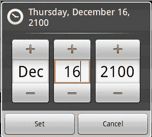
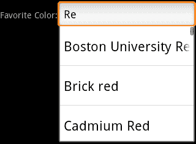
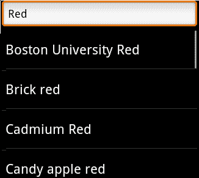

# 第六章：验证和处理输入数据

*不幸的是，在应用程序中验证和处理输入通常在设计过程中是一个后顾之忧。这些应该在用户界面第二轮草稿中的首要考虑事项。触摸屏设备提供了许多机会来简化从用户那里捕获数据的流程，在许多情况下，无需进行数据清理或验证，同时大幅提升用户的应用体验。*

安卓提供了一个优秀的工具集，以捕获用户的各种不同类型的数据，同时以`Intent`结构的形式为应用程序组件之间的松耦合提供支持。通过使用几个较小的`Activity`类来捕获数据，同时抽象出捕获不同类型输入的功能，你将能够更容易地重用输入捕获`Activity`类，不仅在应用程序内，也可以在其他应用程序中使用。此外，通过正确注册`Activity`，你将允许其他应用程序覆盖或使用你的`Activity`实现，让用户选择他们偏好的捕获机制。

# 处理不期望的输入

通常应用程序需要其用户输入特定类型的数据。应用程序从用户那里捕获输入是为了让用户告诉它关于世界的一些信息。这可以是任何东西，从用户正在寻找的内容（即一个搜索词），到关于用户自己的信息（即他们的年龄）。在大多数这些情况下，可以使用诸如自动完成框之类的机制引导用户输入。然而，如果用户可以给你“不期望”的输入，那么在某些环节中就会发生。

不期望的输入可以是任何从预期数字却输入文本，到搜索词没有结果的各种情况。在这两种情况下，你需要做三件事：

1.  告诉用户你期望数据以何种格式输入

1.  让他们知道他们输入了不期望的数据

1.  让他们重新输入数据

## 正确标记输入

防止用户输入不期望数据的第一道防线是正确标记输入控件。这不仅仅意味着，有一个如下所示的标签：

`出生日期（dd/mm/yy）：`

这意味着使用正确的控件来捕获数据。你的输入控件是一种标签，它们向用户指示你期望他们输入哪种类型的数据。在许多情况下，它们可以用来阻止用户输入无效数据，或者至少降低这种可能性。

### 注意

要牢记用户期望事物的工作方式，以及他们期望能够快速选择事物。如果你需要他们为你的应用程序提供一个国家的名字，不要使用`Spinner`并强迫他们浏览看似无尽的名称列表。

## 信号不期望的输入

如果用户确实输入了不希望或无用的内容，你需要迅速告诉他们！你越早让用户知道他们给了你无用的东西，他们就能越快地改正并回到使用你的应用程序。

一个常见的错误是在用户按下**保存**或**提交**按钮时简单地`Toast`通知用户。虽然如果你只能在那时确定他们的错误，这样做是可以的，但你几乎总是可以提前弄清楚。

请记住，在触摸屏设备上，虽然你有一个“聚焦”的小部件，但它并不像在桌面系统上那样发挥作用，用户不会“跳转”离开小部件。这意味着，只要可能，你的用户界面就应该实时响应用户的操作，而不是等待他们做其他事情（即选择另一个小部件）后才给予反馈。如果他们做了使另一个表单元素无效的事情，就禁用它。如果他们做了使一组小部件无效的事情，就将整个组从他们那里隐藏或放在另一个屏幕上。


使用颜色和图标是快速告诉用户他们做错了事情的好方法。当你意识到用户的某些输入是错误的时候，你可以采取额外的步骤，禁用任何**保存**、**下一步**或**提交**按钮。但是，如果你禁用这样的按钮，请确保清楚哪个表单元素上有不理想的数据，并确保它显示在屏幕上。一个很好的替代方法是当用户选择**下一步**按钮时`Toast`通知用户，并滚动到无效元素。

如果你需要检查用户的输入是否与某些远程服务相匹配，请使用后台（或异步）消息。这将允许你在用户使用应用程序时验证用户的内容。它还允许你在不阻止他们使用表单的其余部分的情况下，指出某些地方出了问题。他们总是可以回到无效字段并进行更正。

## 从不受欢迎的输入中恢复。

一定要确保用户纠正错误尽可能无痛。他们为了改正一个拼写错误（或类似的错误）而需要做的工作越多，他们停止使用应用程序的可能性就越大。从不受欢迎的输入中恢复（这与上述评论非常契合）的最简单方法是在用户有机会进入流程的另一部分之前告诉他们。然而，这并不总是可能的。

在某些流程中，你可能需要弹出一个**请等待**对话框，这通常会（作为副作用）验证用户的输入。在这种情况下，使用`ProgressDialog`是明智的，这样你就不会在这个阶段将用户从当前`Activity`中移开。这将带来两个重要的副作用：

+   你不要向活动堆栈中添加不必要的层次。

+   当你关闭`ProgressDialog`时，用户给出的输入仍然可用。

## 给用户提供直接反馈。

当接受用户输入文本或其他键盘输入时，最好在用户输入过程中向他们指示输入的有效性。一个常见的方法是在`EditText`组件右边使用一个`ImageView`，并通过更改图像内容来指示用户输入的是有效还是无效内容。`ImageView`中显示的图像可以根据输入当前是否有效来设置。这使用户能够实时查看验证过程。这种机制也适用于指示不同级别的验证（即输入不是严格的有效或无效，而是良好质量或不良质量），如在密码输入的情况下。

你可以使用图像图标，或者简单使用一个 Android 可绘制 XML 资源来表示有效性（即绿色表示有效，红色表示无效）。这也意味着你的图标会根据你在布局 XML 文件中指定的任何大小进行缩放。

### 提示

**颜色和图标**

通常使用非颜色指示器来区分图标是一个好主意。色盲的人可能很难或无法区分两个仅颜色不同的图标，除非你同时改变形状和颜色。将“有效”图标设为绿色圆形，而“无效”图标设为红色六边形，将使你的应用程序更具可用性。

为了避免屏幕上图标过多，你可能只想在用户当前操作的领域旁边显示验证图标。然而，使用`INVISIBLE View`状态而不是`GONE`是一个好主意，以避免用户改变用户界面焦点时改变布局。同时，请确保验证图标大小一致。

# 完全避免无效输入

请记住，在使用移动设备时，时间往往对用户是一种限制。因此（出于简单易用的原因），你通常应该尽力避免用户输入无效内容。Android 为你提供了多种机制来实现这一点，在每一个机会都利用它们是明智的。通常，你会想要使用那些避免验证需求的组件。在 Android 中这几乎总是一个选项，即使你的需求比简单的类型信息更复杂，你也可以通常自定义组件，以阻止用户违反你的验证规则。

## 捕获日期和时间

如我们已讨论的，在输入日期和时间时，你应该使用`DatePicker`和`TimePicker`组件，或使用`DatePickerDialog`和`TimePickerDialog`以避免基本组件引入的布局问题。

### 注意

除非你的应用程序有严格的要求，否则不要创建自己的日历小部件。你可能不喜欢`DatePickerDialog`的外观，但用户在其他 Android 应用程序中已经见过它们，并且知道如何使用。这些标准小部件还可能在未来的 Android 版本中得到改进，从而让你的应用程序在不做任何修改的情况下得到提升。



你可能会发现，对于日期和时间输入，你需要额外的验证，特别是在捕获日期或时间范围时。例如，如果你要求用户输入出生日期，用户不应该能够输入晚于“今天”的任何时间（除非是预期的出生日期）。虽然`DatePicker`类有一个事件监听器，允许你监听对其数据的更改（`DatePickerDialog`实现此事件监听器），但你不能使用此事件监听器来取消更改事件。

因此，为了**取消**事件，你需要在事件执行期间将输入改回有效的值。这是 Android 中一个出奇简单的技巧。由于事件是在进行绘制的同一线程上执行的，这允许你在无效数据在屏幕上渲染之前更改值。以下是一个`ValidatingDatePickerDialog`的简单示例，你可以使用它来实现应用程序中简单的日期验证级别。如果你需要，也可以轻松地为`TimePickerDialog`编写类似的类。

```kt
public class ValidatingDatePickerDialog extends DatePickerDialog {

    private int lastValidYear;
    private int lastValidMonth;
    private int lastValidDay;
    private ValidationCallback callback = null;

    public ValidatingDatePickerDialog(
            final Context context,
            final OnDateSetListener callBack,
            final int year,
            final int monthOfYear,
            final int dayOfMonth) {

        super(context, callBack, year, monthOfYear, dayOfMonth);
        setValidData(year, monthOfYear, dayOfMonth);
    }

 protected void setValidData(
 final int year,
 final int monthOfYear,
 final int dayOfMonth) {

 lastValidYear = year;
 lastValidMonth = monthOfYear;
 lastValidDay = dayOfMonth;
 }

    @Override
    public void onDateChanged(
            final DatePicker view,
            final int year,
            final int month,
            final int day) {

        if(callback != null && !callback.isValid(year, month, day)) {
 view.updateDate(
 lastValidYear,
 lastValidMonth,
 lastValidDay);
        } else {
            super.onDateChanged(view, year, month, day);
            setValidData(year, month, day);
        }
    }

    public void setValidationCallback(
            final ValidationCallback callback) {
        this.callback = callback;
    }

    public ValidationCallback getValidationCallback() {
        return callback;
    }

    public interface ValidationCallback {
        boolean isValid(int year, int monthOfYear, int dayOfMonth);
    }
}
```

这种处理验证的方法适用于大多数不提供事件隐式验证的 Android 小部件，并且它比给用户一个带有文本 **请输入一个有效的出生日期** 的`Toast` 提供了更好的用户体验。它还避免了在应用程序中增加额外验证层的需要。

## 使用下拉菜单和列表视图进行选择

在应用程序中，用户经常需要从可能的值列表中选择某项。我们在第二章 *视图的数据展示* 中已经讨论了`Spinner`和`ListView`小部件。然而，当涉及到验证时，它们提供的几个特性非常有用。它们是隐式验证的小部件，也就是说，由于输入的可能值是由应用程序定义的，用户不可能输入错误的数据。但是，当有效项目集基于其他用户输入或某些外部信息源改变时该怎么办呢？在这些情况下，你有几个选项可用。

### 更改数据集

阻止用户选择不再有效的值的简单方法是将其从数据集中移除。我们在`BurgerAdapter`中已经做过类似的事情，在第二章，*为视图提供数据*，当用户触摸某些项目时，我们修改了数据集。修改`AdapterView`的数据集是一个好主意，因为它“从菜单中移除了选项”。然而，它并不适用于`Spinner`类，因为如果项目从屏幕上移除，用户会想知道刚才还在那里的项目去哪了（可能会担心自己是否疯了）。

为了避免混淆或让用户感到沮丧，只有当某个项目可能不会重新添加到数据集中时，才应该从`Spinner`或`ListView`数据集中移除项目。一个符合这一要求的好例子是可用的 Wi-Fi 网络列表或范围内的蓝牙设备列表。在这两种情况下，可用的项目列表由环境定义。用户会接受显示的选项并不总是对他们可用，而且新的项目可能会时不时出现。

### 禁用选择

一种替代的、通常对用户更友好的阻止某些项目被选中的方法是禁用它们。你可以通过覆盖`ListAdapter`类中的`isEnabled(int)`方法，让`ListView`或`Spinner`忽略项目。然而，这种方法只会在事件级别上禁用项目，项目仍然会显示为启用状态（它的主要目的是定义分隔视图）。

为了在视觉上禁用一个项目，你需要禁用显示该项目的`View`。这是告诉用户“你改变了某些东西，使得这个项目不可用”的一种非常有效的方式。图形化地禁用一个项目也让用户知道它将来可能会变得可用。

## 捕获文本输入

最难处理的输入是各种文本输入形式。我发现使用软键盘可能不如使用硬件键盘快，但从开发角度来看，它提供了硬件键盘所不具备的东西——灵活性。当我想要在字段中输入文本时，软键盘的状态将指示该字段有效的输入类型。如果我需要输入电话号码，键盘可以只显示数字，甚至变成拨号盘。这不仅告诉我应该做什么，还阻止我输入可能导致验证错误的内容。

安卓的`TextView`（以及`EditText`）控件为你提供了众多不同的选项和方法，通过这些你可以为文本输入定义复杂的验证规则。这些选项中的许多也被各种软键盘所理解，使得它们可以根据`TextView`控件的配置显示完整键盘的子集。即使软键盘不完全理解（或使用硬件键盘时），也必须遵守指定选项的规则。最简单的方法是使用`inputType` XML 属性来告诉`EditText`你希望它捕获的数据类型。

从`inputType`的文档中，你可以看到其所有可能的值都是`android.view.inputmethod.InputType`接口中可用的位掩码的不同组合。`inputType`属性可用的选项将涵盖大多数需要捕获特定类型输入的情况。你也可以通过使用`TextView.setRawInput`或`TextView.setKeyboardListener`方法创建自己的更复杂的输入类型。

### 提示

**键盘监听器**

尽可能地，你应该使用输入类型或标准的`KeyListener`来处理你的文本验证。编写一个`KeyListener`并非易事，在某些情况下，你可能需要实现一个自定义软键盘。在安卓中，如果一个软键盘存在，定义了除`TYPE_NULL`之外输入类型的`KeyListener`可能根本不会调用其监听事件（`onKeyDown`、`onKeyUp`和`onKeyOther`）。`KeyListener`的按键事件仅用于接受或拒绝来自硬件键盘的事件。软件键盘使用`TextView`的输入类型属性来决定应向用户提供哪些功能。

## 自动完成文本输入

`Spinner`和`ListView`控件是让用户从预定义选项列表中选择的好方法。然而，它们的主要缺点是不适合非常长的列表。尽管实现和性能都很好，用户只是不喜欢查看大量数据列表。解决这个问题的标准方法是提供一个自动完成的文本输入控件。



带有自动完成功能的输入控件也常与用户过去提供的选项历史一起使用，或者建议用户可能想要“完成”输入的可能方式。安卓的`AutoCompleteTextView`控件是一个带有自动完成功能的`EditText`。它使用一个`ListAdapter`（也必须实现`Filterable`接口）来查找并显示可能的建议列表给用户。

然而，`AutoCompleteTextView`存在两个主要缺陷：

+   它仍然是一个`TextView`，并且用户并不需要选择建议项之一，这意味着它的内容必须单独验证。

+   提示列表直接显示在小部件下方，占用了相当大的屏幕空间。结合软键盘输入，用户界面可能会在小屏幕上变得杂乱无章或几乎无法使用。

通过谨慎和适度地使用`AutoCompleteTextView`类，可以解决这两个问题。当你需要一个搜索框、URL 输入或类似的东西时，它们非常有用，但它们通常不适合放在屏幕中间（最好放在顶部，这样它们有足够的空间显示提示列表）。

## 小测验

1.  `KeyboardListener`中的`onKeyDown`事件何时被调用？

    1.  当广播系统范围内的按键按下事件时

    1.  取决于系统是否有硬件键盘

    1.  当按下硬件键盘按键时

    1.  当按下硬件接口控制按钮之一时

1.  你何时会使用`Toast`通知用户验证错误？

    1.  当他们犯了一个错误（也就是说，勾选了不应该勾选的复选框）

    1.  当他们从无效小部件上移开焦点后

    1.  在从外部服务接收到验证错误之后

1.  在一个即时通讯（IM）应用中，如果用户的其中一个联系人下线了，你如何更新联系人`ListView`以反映这一变化？

    1.  在`ListView`中图形化地禁用用户图标，并将其移动到`ListView`底部

    1.  从`ListView`中移除用户

    1.  在`ListView`中禁用用户的图标

# 为结果构建活动

有时候，Android 中的默认小部件单独无法满足你的输入需求，你需要某种复合输入结构。在这种情况下，你可以创建一个`Dialog`小部件，或者构建一个新的`Activity`。当`Dialog`小部件的内容保持简短（最多两到三行小部件）时，它们非常有用，因为它们在视觉上保持在当前`Activity`的顶部。然而，这意味着它们会消耗额外的资源（因为它们的调用`Activity`不能被换到后台），并且由于它们有自己的装饰，它们没有像`Activity`那样多的可用屏幕空间。

在第四章，*利用活动和意图*中，我们讨论了`Activity`类将数据返回给调用者的概念。当你需要某种额外的验证形式或想要隔离特定的输入小部件（或小部件组）时，这是一个很好的技术。你可以在`Activity.setResult`方法中指定一些结果数据。通常，一个`Activity`只需指定成功或失败的结果（使用`RESULT_OK`和`RESULT_CANCELLED`常量）。也可以通过填充`Intent`来返回数据：

```kt
Intent result = new Intent();
result.putExtra("paymentDetails", paymentDetails);
setResult(RESULT_OK, result);
```

当你调用`finish()`方法时，`Intent`数据会被传递给父`Activity`对象的`onActivityResult`方法，以及结果代码。

# 通用筛选搜索 Activity

正如本章前面所讨论的，有时你有一个预定义的对象列表，并希望用户选择其中一个。这个列表对于用户来说太大，无法滚动浏览（例如，世界上所有国家的列表），但它也是一个定义好的列表，所以你不希望他们能够选择自由文本。

在这种情况下，一个可过滤的`ListView`通常是最合适的选择。尽管`ListView`类具有过滤功能，但在没有硬件键盘的设备上，它工作得并不是很好（如果有的话）。因此，利用`EditText`小部件让用户过滤`ListView`的内容是明智的。

这种需求非常常见，因此在本节中，我们将研究构建一个几乎完全通用的`Activity`，用于过滤和选择数据。这个例子将为用户提供两种显示数据的方式。一种是通过`Cursor`，另一种是通过简单的`Object`数组。在这两种情况下，过滤`ListView`的任务都留给`ListAdapter`实现，使得实现相对简单。

# 动手时间——创建`ListItemSelectionActivity`

这是一个相当大且有些复杂的例子，因此我会将其分解成易于消化的部分，每个部分都有一个目标。我们首先想要的是一个具有美观布局的`Activity`类。我们将构建的布局是一个`EditText`在上，一个`ListView`在下，每个都有可以被`Activity`使用的 ID。

1.  创建一个新项目来包含你的`ListItemSelectionActivity`类：

    ```kt
    android create project -n Selector -p Selector -k com.packtpub.selector -a ListItemSelectionActivity -t 3
    ```

1.  在编辑器或 IDE 中打开`res/layout/main.xml`文件。

1.  移除任何默认的布局代码。

1.  确保根元素是一个在`Activity`中占用可用屏幕空间的`LinearLayout`：

    ```kt
    <LinearLayout

        android:orientation="vertical"
        android:layout_width="fill_parent"
        android:layout_height="fill_parent">"
    ```

1.  在根元素内部，声明一个 ID 为`input`，`inputType`为`textFilter`的`EditText`，以表示它将过滤另一个小部件的内容：

    ```kt
    <EditText android:id="@+id/input"
              android:inputType="textFilter"
              android:layout_width="fill_parent"
              android:layout_height="wrap_content"/>
    ```

1.  在`EditText`之后，我们声明一个`ListView`，它将占用剩余的空间：

    ```kt
    <ListView android:id="@+id/list"
              android:layout_width="fill_parent"
              android:layout_height="fill_parent"/>
    ```

1.  在编辑器或 IDE 中打开`ListItemSelectionActivity` Java 源文件。

1.  在类的顶部声明一个`ListAdapter`字段：

    ```kt
    private ListAdapter adapter;
    ```

1.  在`ListAdapter`字段之后，声明一个`Filter`字段：

    ```kt
    private Filter filter;
    ```

1.  在`onCreate`方法中，确保你将`main.xml`加载为`ListItemSelectionActivity`的内容视图：

    ```kt
    setContentView(R.layout.main);
    ```

1.  然后获取在 XML 文件中声明的`ListView`，以供我们稍后使用：

    ```kt
    ListView list = (ListView)findViewById(R.id.list);
    ```

1.  最后，获取在 XML 文件中声明的`EditText`，以供我们稍后使用：

    ```kt
    EditText input = (EditText)findViewById(R.id.input);
    ```

## *刚才发生了什么？*

现在你已经得到了`ListItemSelectionActivity`类的框架。此时应用程序能够运行，向你展示一个空的`ListView`和一个`EditText`。稍后阶段将使用类顶部声明的`ListAdapter`和`Filter`字段来保存列表信息，并过滤屏幕上可见的内容。

# 动手时间——创建一个`ArrayAdapter`

`ListItemSelectionActivity`类将接受来自两个不同来源的列表内容。你可以指定一个数据库查询`Uri`，用于从外部源选择两列，或者可以在`Intent`对象中指定一个`Object`数组作为额外数据。对于下一个任务，我们将编写一个私有实用方法，从`Intent`对象创建一个`ArrayAdapter`。

1.  在编辑器或 IDE 中打开`ListItemSelectionActivity`的 Java 源文件。

1.  声明一个新的实用方法，用于为`Intent`创建`ListAdapter`：

    ```kt
    private ListAdapter createArrayAdapter(Intent intent) {
    ```

1.  从`Intent`的额外数据中获取`Object`数组：

    ```kt
    Object[] data = (Object[])intent.getSerializableExtra("data");
    ```

1.  如果数组不为`null`且不为空，返回一个新的`ArrayAdapter`对象，该对象将显示数组内容在 Android 定义的标准列表项资源中：

    ```kt
    if(data != null && data.length > 0) {
    return new ArrayAdapter<Object>(
        this,
        android.R.layout.simple_list_item_1,
        data);
    ```

1.  如果数组为`null`或为空，抛出`IllegalArgumentException`异常：

    ```kt
    else {
        throw new IllegalArgumentException(
                "no list data specified in Intent: "
                + intent);
    }
    ```

## *刚才发生了什么？*

你刚刚编写了一个非常基本的实用方法，从`Intent`中提取`Object`数组并返回它。如果数组不存在或为空，该方法会抛出`IllegalArgumentException`。这是一个有效的响应，因为我们在查找数据库查询*之后*会查找数组。如果我们没有从外部获取任何数据，那么这个`Activity`无法执行。让用户从空白列表中选择项目是没有意义的。

### 注意

请记住，这个`Activity`旨在由另一个`Activity`启动，而不是通过应用程序菜单直接由用户启动。因此，当`Activity`的使用方式不符合预期时，我们希望给自己或其他开发者提供有用的反馈。

# 动手操作——创建`CursorAdapter`

`CursorAdapter`的设置比`ArrayAdapter`复杂得多。一方面，`CursorAdapter`提供的选项比`ArrayAdapter`多。我们的`CursorAdapter`可以根据指定一列或两列来显示单行或双行列表项。尽管`ArrayAdapter`包含一些默认的过滤逻辑，但我们需要为`CursorAdapter`提供更多的支持。

1.  首先，我们允许使用两种不同的列命名约定，并附带一些默认值。声明一个实用方法，从`Intent`中查找预期的列名：

    ```kt
    private String getColumnName(
            final Intent intent,
            String primary,
            String secondary,
            String def) {
    ```

1.  首先，尝试使用`primary`属性名获取列名：

    ```kt
    String col = intent.getStringExtra(primary);
    ```

1.  如果列名为`null`，尝试使用`secondary`属性名：

    ```kt
    if(col == null) {
        col = intent.getStringExtra(secondary);
    }
    ```

1.  如果列名仍然是`null`，使用默认值：

    ```kt
    if(col == null) {
        col = def;
    }
    ```

1.  返回列名：

    ```kt
    return col;
    ```

1.  现在，声明另一个实用方法，该方法将创建实际的`CursorAdapter`，以便在`ListView`中使用：

    ```kt
    private ListAdapter createCursorAdapter(Intent intent) {
    ```

1.  查找要显示的第一列的名称：

    ```kt
    final String line1 = getColumnName(intent, "name", "line1", "name");
    ```

1.  查找要显示的可选第二列的名称：

    ```kt
    String line2 = getColumnName(
            intent, "description", "line2", null);
    ```

1.  现在我们有两种可能的路径——单行列表项或双行列表项。它们的构建非常相似，因此我们声明一些变量来保存这两条路径之间的不同值：

    ```kt
    int listItemResource;
    final String[] columns;
    String[] displayColumns;
    int[] textIds;
    ```

1.  如果已指定`line2`列名，我们使用以下代码：

    ```kt
    if(line2 != null) {
    ```

1.  我们将使用一个两行列表项资源：

    ```kt
    listItemResource = android.R.layout.two_line_list_item;
    ```

1.  数据库查询需要选择`_id`列以及`Intent`中指定的两列：

    ```kt
    columns = new String[]{"_id", line1, line2};
    ```

1.  然而，列表项将只显示两个指定的列：

    ```kt
    displayColumns = new String[]{line1, line2};
    ```

1.  `CursorAdapter`需要知道在`two_line_list_item`资源中声明的`TextView`小部件的资源 ID：

    ```kt
    textIds = new int[]{android.R.id.text1, android.R.id.text2};
    ```

1.  如果在`Intent`中没有指定第二列的名称，则`ListView`应该有单行项目：

    ```kt
    else {
    listItemResource = android.R.layout.simple_list_item_1;
    ```

1.  我们只需要请求`_id`列和单个列名：

    ```kt
    columns = new String[]{"_id", line1};
    ```

1.  列表中的项目应该包含请求列的内容：

    ```kt
    displayColumns = new String[]{line1};
    ```

1.  我们不需要告诉`CursorAdapter`在单行列表项资源中查找哪个小部件 ID：

    ```kt
    textIds = null;
    ```

1.  在`else`子句之后，我们将拥有所需的变量填充。我们可以运行初始的数据库查询并获得数据的完整列表以展示给用户：

    ```kt
    Cursor cursor = managedQuery(
            intent.getData(),
            columns,
            null,
            null,
            line1);
    ```

1.  我们现在可以创建`CursorAdapter`来包装数据库`Cursor`对象，供`ListView`使用。我们使用`SimpleCursorAdapter`的实现：

    ```kt
    CursorAdapter cursorAdapter = new SimpleCursorAdapter(
            this,
            listItemResource,
            cursor,
            displayColumns,
            textIds);
    ```

1.  为了让用户过滤列表，我们需要给`CursorAdapter`一个`FilterQueryProvider`。将`FilterQueryProvider`声明为一个匿名内部类：

    ```kt
    cursorAdapter.setFilterQueryProvider(
            new FilterQueryProvider() {
    ```

1.  在匿名`FilterQueryProvider`内部，声明`runQuery`方法，该方法将在用户每次按键时被调用：

    ```kt
    public Cursor runQuery(CharSequence constraint) {
    ```

1.  我们可以返回一个`managedQuery`，它只对我们将在`ListView`中渲染的第一列执行 SQL `LIKE`操作：

    ```kt
    return managedQuery(
            intent.getData(),
            columns,
            line1 + " LIKE ?",
            new String[] {constraint.toString() + '%'},
            line1);
    ```

1.  最后，`createCursorAdapter`方法可以返回`CursorAdapter`：

    ```kt
    return cursorAdapter;
    ```

## *刚才发生了什么？*

这个实用方法处理在`Intent`中指定了查询`Uri`时创建`CursorAdapter`的情况。这种结构允许对非常大的数据集进行过滤，因为它通常是建立在 SQL Lite 数据库之上的。其性能与它将查询的数据库表结构直接相关。

由于数据库查询可能非常大，`CursorAdapter`类本身不执行任何数据集过滤。相反，您需要实现`FilterQueryProvider`接口，为每次过滤更改创建并运行新的查询。在上述示例中，我们创建了一个与默认`Cursor`完全相同的`Cursor`，但我们为查询添加了`selection`和`selectionArgs`。这个`LIKE`子句将告诉 SQL Lite 只返回以用户输入的过滤条件开头的行。

# 动手时间——设置`ListView`：

现在我们有了创建此`Activity`可以过滤的两种类型`ListAdapter`的实现。现在我们需要一个实用方法来确定使用哪一个并返回它；然后我们希望使用新的实用方法在`ListView`小部件上设置`ListAdapter`。

1.  声明一个新方法来创建所需的`ListAdapter`对象：

    ```kt
    protected ListAdapter createListAdapter() {
    ```

1.  获取用于启动`Activity`的`Intent`对象：

    ```kt
    Intent intent = getIntent();
    ```

1.  如果`Intent`中的数据`Uri`不为`null`，则返回给定`Intent`的`CursorAdapter`。否则，返回给定`Intent`的`ArrayAdapter`：

    ```kt
    if(intent.getData() != null) {
    return createCursorAdapter(intent);

    else {
        return createArrayAdapter(intent);
    }
    ```

1.  在`onCreate`方法中，从布局中找到两个`View`对象之后，使用新的实用方法创建所需的`ListAdapter`：

    ```kt
    adapter = createListAdapter();
    ```

1.  将`Filter`字段分配给`ListAdapter`给出的`Filter`：

    ```kt
    filter = ((Filterable)adapter).getFilter();
    ```

1.  在`ListView`上设置`ListAdapter`：

    ```kt
    list.setAdapter(adapter);
    ```

## *刚才发生了什么？*

这段代码现在引用了创建的`ListAdapter`对象及其配合使用的`Filter`。如果你现在运行应用程序，会发现打开时会弹出**强制关闭**对话框。这是因为现在代码需要某种数据来填充`ListView`。虽然对于一个正常的应用程序来说这并不理想，但这实际上是一个可重用的组件，可以在多种情况下使用。

# 行动时间——过滤列表

尽管代码已经设置好了显示列表，甚至可以过滤它，但我们还没有将`EditText`框与`ListView`关联起来，因此在`EditText`中输入目前将完全不起作用。我们需要监听`EditText`框的变化，并根据输入的内容请求过滤`ListView`。这将涉及`ListItemSelectionActivity`类监听`EditText`上的事件，然后请求`Filter`对象缩小可用的项目集合。

1.  应该让`ListItemSelectionActivity`实现`TextWatcher`接口：

    ```kt
    public class ListItemSelectionActivity extends Activity
            implements TextWatcher
    ```

1.  在`onCreate`方法中在`ListView`上设置`ListAdapter`后，将`ListItemSelectionActivity`作为`TextWatcher`添加到`EditText`组件上：

    ```kt
    input.addTextChangedListener(this);
    ```

1.  你需要声明`beforeTextChanged`和`onTextChanged`方法的空实现，因为我们实际上并不关心这些事件：

    ```kt
    public void beforeTextChanged(
            CharSequence s,
            int start,
            int count,
            int after) {
    }

    public void onTextChanged(
            CharSequence s,
            int start,
            int count,
            int after) {
    }
    ```

1.  然后声明我们感兴趣的`afterTextChanged`方法：

    ```kt
    public void afterTextChanged(Editable s) {
    ```

1.  在`afterTextChanged`方法中，我们只需请求当前`ListAdapter`的`Filter`过滤`ListView`：

    ```kt
    filter.filter(s);
    ```

## *刚才发生了什么？*

`TextWatcher`接口用于追踪`TextView`组件的变化。实现该接口可以监听到`TextView`实际内容的任何改变，无论这些改变来自何处。尽管`OnKeyListener`和`KeyboardListener`接口主要用于处理硬件键盘事件，但`TextWatcher`可以处理来自硬件键盘、软键盘甚至内部调用`TextView.setText`的变化。

# 行动时间——返回选择项

`ListItemSelectionActivity`现在可以用来显示可能的条目列表，并通过在`ListView`上方的`EditText`中输入来过滤它们。然而，我们还没有办法让用户从`ListView`中实际选择一个选项，以便将其传递回我们的父`Activity`。这只需要实现一个简单的`OnItemClickListener`接口。

1.  `ListItemSelectionActivity`类现在需要实现`OnItemClickListener`接口：

    ```kt
    public class ListItemSelectionActivity extends Activity
            implements TextWatcher, OnItemClickListener {
    ```

1.  在`onCreate`方法中注册为`TextWatcher`之后，在`ListView`上注册为`OnItemClickListener`：

    ```kt
    list.setOnItemClickListener(this);
    ```

1.  重写`onItemClick`方法以监听用户的选择：

    ```kt
    public void onItemClick(
            AdapterView<?> parent,
            View clicked,
            int position,
            long id) {
    ```

1.  创建一个空的`Intent`对象，以便传回我们的父`Activity`：

    ```kt
    Intent data = new Intent();
    ```

1.  如果`ListAdapter`是`CursorAdapter`，传递给`onItemClick`的`id`将是选择的数据的数据库`_id`列值。将这个值添加到`Intent`中：

    ```kt
    if(adapter instanceof CursorAdapter) {
    data.putExtra("selection", id);
    ```

1.  如果`ListAdapter`不是`CursorAdapter`，我们将实际选择的`Object`添加到`Intent`中：

    ```kt
    else {
        data.putExtra(
                "selection",
                (Serializable)parent.getItemAtPosition(position));
    }
    ```

1.  将结果代码设置为`RESULT_OK`，并将`Intent`传回：

    ```kt
    setResult(RESULT_OK, data);
    ```

1.  用户已经做出了他们的选择，所以这部分我们已经完成了：

    ```kt
    finish();
    ```

## *刚才发生了什么？*

`ListItemSelectionActivity`现在已完成并准备使用。它提供了与`AutoCompleteTextView`非常相似的功能，但作为一个独立的`Activity`，它为用户提供了更大的建议列表，并且用户必须从`ListView`中选择一个项目，而不是简单地输入他们的数据。

## 使用 ListItemSelectionActivity

您需要指定用户要从哪个数据中选择，这是启动`ListItemSelectionActivity`的`Intent`的一部分。如已经讨论过的，实际上有两种路径：

+   传入某种类型的数组（非常适合在您自己的应用程序中使用）

+   提供一个数据库查询`Uri`以及您想要显示的列名（如果您想从另一个应用程序中使用它，这非常方便）

由于`ListItemSelectionActivity`返回其选择（如果它不这样做，那就没有多大用处），因此您需要使用`startActivityForResult`方法而不是正常的`startActivity`方法来启动它。如果您想传递一个`String`对象数组供选择，可以使用类似于以下意图的代码：`new Intent(this, ListItemSelectionActivity.class)`：

```kt
intent.putExtra("data", new String[] {
    "Blue",
    "Green",
    "Red",// more colors    
});
startActivityForResult(intent, 101);
```

如果上述`data`数组中有足够的颜色，您将看到一个可以按用户所需颜色进行筛选的`ListItemSelectionActivity`屏幕。以下是结果屏幕外观的截图：



为了从`ListItemSelectionActivity`接收结果，您需要在`onActivityResult`方法中监听结果（如第四章所述，*利用活动和意图*）。例如，如果您只是想`Toast`确认选择的结果，可以使用以下代码：

```kt
@Override
protected void onActivityResult(
        int requestCode,
        int resultCode,
        Intent data) {

    super.onActivityResult(requestCode, resultCode, data);

    if(requestCode == 101 && resultCode == RESULT_OK) {
        Object obj = data.getSerializableExtra("selection");
        Toast.makeText(
                this,
                String.valueOf(obj),
                Toast.LENGTH_LONG).show();
    }
}
```

最后，您会如何在`ListItemSelectionActivity`中使用数据库查询呢？这非常容易展示，可能是`ListItemSelectionActivity`最激动人心的功能。以下代码段将允许用户从他们的电话簿中选择一个联系人：

```kt
Intent intent = new Intent(
        this,
        ListItemSelectionActivity.class);

intent.setData(People.CONTENT_URI);
intent.putExtra("line1", People.NAME);
intent.putExtra("line2", People.NUMBER);

startActivityForResult(intent, 202);
```

## 动手试试吧！

`ListItemSelectionActivity` 可以过滤和选择几乎任何内容。尝试构建一个包含世界上所有国家（网上有许多这样的列表）的列表，然后创建一个 `Activity`，使用 `ListItemSelectionActivity` 让你选择其中一个。

# 总结

你如何接受用户的输入，以及如何验证这些输入，这在用户使用你的应用程序的整体体验中起着至关重要的作用。软件应该帮助用户，并在每一步告诉他们它需要什么。这不仅使应用程序更容易使用，而且还能让用户更快地操作。

使用 `ListItemSelectionActivity` 常常可以帮助用户浏览大量数据集，同时防止他们做出不想要或无效的选择。这是一种非常常用的控件类型，在许多不同的应用程序中以各种形式出现。目前，Android 没有一个通用的类能像这样轻松地执行这项任务。

在下一章中，我们将开始了解一种相当现代的用户反馈形式：动画。Android 不仅仅支持动画化用户界面的部分元素，还支持组合复杂的自定义动画。动画在用户享受应用程序的过程中起着至关重要的作用。这不仅仅因为它看起来很棒，还因为它提供了视觉线索，让用户了解应用程序当前正在做什么，以及他们的操作产生了什么效果。
