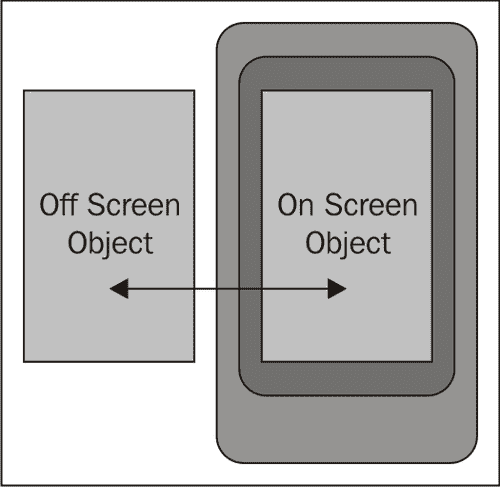
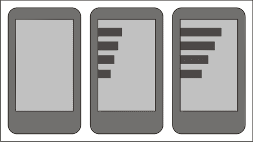
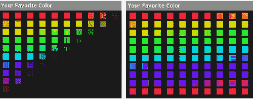
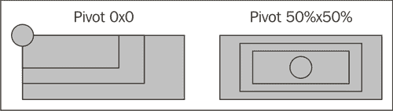
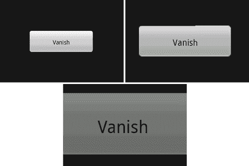

# 第七章：动画小部件和布局

*动画是现代应用程序用户界面设计的重要元素。然而，在设计中过度使用动画也是很容易的。在非游戏应用程序中使用动画的一般准则是——只对用户交互和通知进行动画处理，并保持动画时长简短，以免对用户体验产生负面影响。对于游戏来说，更多的动画通常是可以接受的（甚至可能是预期的）。*

那么为什么动画要针对用户交互而不是（例如）应用程序的背景呢？一方面，动画化应用程序的背景是分散注意力的，如果你试图捕捉或向用户呈现重要信息，这是不专业的（无论它看起来多好）。关于通知，动画也非常重要。屏幕上的移动会吸引注意力，因此，通常需要一个大的弹出对话框可以被一个小型动画图标所替代。一个完美的例子就是在安卓设备的通知区域顶部左侧放置的“下载中”图标，当安卓**市场**应用程序正在下载新软件或更新时。

布局动画和过渡为用户提供了有用的状态信息。当使用屏幕过渡时，你告诉用户刚刚发生了什么，或者即将发生什么。不同的过渡对用户意味着不同的事件，了解每个不同活动应使用哪种过渡，将让用户知道即将采取哪种类型的动作。布局动画是用户反馈的重要组成部分，如果省略它们或在错误的地方使用错误的动画，可能会让用户感到烦躁或稍微有些困惑（“改变茫然”）。使用正确的动画将提升用户体验，甚至可以通过提供简短的提示，告诉用户接下来需要做什么，从而加快他们使用应用程序的速度。

在本章中，我们将重点介绍两种主要的动画类型——小部件动画和布局动画。我们将查看安卓提供的标准动画结构，并探讨如何创建新的动画类型和扩展现有类型。我们还将探讨动画的定时和“良好实践”使用，以及在不降低速度或分散注意力的前提下让用户保持愉悦。

# 使用标准的安卓动画

安卓中的任何`View`或`ViewGroup`对象都可以附加动画。动画通常在 XML 文件中定义为应用程序资源，安卓在`android`包中提供了一些有用的默认动画。同时，安卓还包含几个专门设计用来处理动画的`View`类。使用这些类时，你会发现它们具有布局属性，这些属性允许你为某些特定动作设置特定类型的动画。然而，通常在布局文件中并不指定动画，而是依赖 Java 代码来设置和启动`Animation`对象。

动画通常不作为布局 XML 的一部分来指定，原因非常简单——它们应该在何时运行？许多动画可以作为对用户输入的响应，让用户知道正在发生什么。大多数动画在某种程度上都会由用户的行为触发（除非它们用于通知）。因此，你需要指定两个内容：应该在哪个小部件上运行哪个动画，以及关于动画何时运行的信号。默认的 Android 动画会立即开始动画，而其他动画结构可能有一个预定延迟才会开始。

# 动手操作——动画新闻源

我们将从创建一个选择器`Activity`和一个简单的`NewsFeedActivity`开始。在新闻源中，我们将使用计时器使最新的新闻标题“进入和退出”。对于这个示例，我们将使用 Android 提供的一些默认动画，并通过布局资源主要驱动这个过程。

1.  创建一个新项目，包含本章的动画示例，主`Activity`名为`AnimationSelectionActivity`：

    ```kt
    android create project -n AnimationExamples -p AnimationExamples -k com.packtpub.animations -a AnimationSelector -t 3
    ```

1.  在编辑器或 IDE 中打开`res/layout/main.xml`布局文件。

1.  清除布局资源的默认内容。

1.  声明一个消耗所有可用屏幕空间的垂直`LinearLayout`：

    ```kt
    <LinearLayout

        android:orientation="vertical"
        android:layout_width="fill_parent"
        android:layout_height="fill_parent">
    ```

1.  创建一个标签为“新闻源”的`Button`，链接到第一个动画示例：

    ```kt
    <Button android:id="@+id/news_feed"
            android:layout_width="fill_parent"
            android:layout_height="wrap_content"
            android:layout_marginBottom="10dip"
            android:text="News Feed"/>
    ```

1.  创建一个名为`news.xml`的新布局资源文件。

1.  声明一个垂直的`LinearLayout`，包含所有可用的屏幕空间：

    ```kt
    <LinearLayout

        android:orientation="vertical"
        android:layout_width="fill_parent"
        android:layout_height="fill_parent">"
    ```

1.  向`LinearLayout`添加一个`TextSwitcher`对象，指定默认的“滑动”动画作为“进入”和“退出”动画：

    ```kt
    <TextSwitcher
            android:id="@+id/news_feed"
            android:inAnimation="@android:anim/slide_in_left"
            android:outAnimation="@android:anim/slide_out_right"
            android:layout_width="fill_parent"
            android:layout_height="wrap_content"
            android:text=""/>
    ```

1.  在编辑器或 IDE 中打开`res/values/strings.xml`文件。

1.  声明一个名为`headlines`的字符串数组，包含一些模拟新闻标题的元素：

    ```kt
    <string-array name="headlines">
        <item>Pwnies found to inhabit Mars</item>
        <item>Geeks invent \"atoms\"</item>
        <item>Politician found not lying!</item>
        <!-- add some more items here if you like -->
    </string-array>
    ```

1.  在生成的根包中，声明一个名为`NewsFeedActivity.java`的新 Java 源文件。

1.  在你的`AndroidManifest.xml`文件中注册`NewsFeedActivity`类：

    ```kt
    <activity android:name=".NewsFeedActivity" android:label="News Feed" />
    ```

1.  新类应继承`Activity`类并实现`Runnable`接口：

    ```kt
    public class NewsFeedActivity
            extends Activity implements Runnable {
    ```

1.  声明一个`Handler`，用作改变标题的时间结构：

    ```kt
    private final Handler handler = new Handler();
    ```

1.  我们需要引用`TextSwitcher`对象：

    ```kt
    private TextSwitcher newsFeed;
    ```

1.  声明一个字符串数组，用于保存你添加到`strings.xml`文件中的模拟新闻标题：

    ```kt
    private String[] headlines;
    ```

1.  你还需要跟踪当前正在显示的新闻标题：

    ```kt
    private int headlineIndex;
    ```

1.  重写`onCreate`方法：

    ```kt
    protected void onCreate(final Bundle savedInstanceState) {
    ```

1.  调用`Activity`的`onCreate`方法：

    ```kt
    super.onCreate(savedInstanceState);
    ```

1.  将内容视图设置为`news`布局资源：

    ```kt
    setContentView(R.layout.news);
    ```

1.  从`strings.xml`应用程序资源文件中存储对标题字符串数组的引用：

    ```kt
    headlines = getResources().getStringArray(R.array.headlines);
    ```

1.  查找`TextSwitcher`小部件，并将其分配给之前声明的字段：

    ```kt
    newsFeed = (TextSwitcher)findViewById(R.id.news_feed);
    ```

1.  将`TextSwitcher`的`ViewFactory`设置为一个新的匿名类，当被请求时创建`TextView`对象：

    ```kt
    newsFeed.setFactory(new ViewFactory() {
        public View makeView() {
            return new TextView(NewsFeedActivity.this);
        }
    });
    ```

1.  重写`onStart`方法：

    ```kt
    protected void onStart() {
    ```

1.  调用`Activity`类的`onStart`方法：

    ```kt
    super.onStart();
    ```

1.  重置`headlineIndex`，以便我们从第一条新闻标题开始：

    ```kt
    headlineIndex = 0;
    ```

1.  使用`Handler`将`NewsFeedActivity`作为延迟动作发布：

    ```kt
    handler.postDelayed(this, 3000);
    ```

1.  重写`onStop`方法：

    ```kt
    protected void onStop() {
    ```

1.  调用`Activity`类的`onStop`方法：

    ```kt
    super.onStop();
    ```

1.  移除任何待处理的`NewsFeedActivity`调用：

    ```kt
    handler.removeCallbacks(this);
    ```

1.  实现我们将用来切换到下一个标题的`run`方法：

    ```kt
    public void run() {
    ```

1.  打开一个`try`块以交换内部标题：

1.  使用`TextSwitcher.setText`方法切换到下一个标题：

    ```kt
    newsFeed.setText(headlines[headlineIndex++]);
    ```

1.  如果`headlineIndex`超过了标题总数，将`headlineIndex`重置为零：

    ```kt
    if(headlineIndex >= headlines.length) {
        headlineIndex = 0;
    }
    ```

1.  关闭`try`块，并添加一个`finally`块。在`finally`块中，将`NewsFeedActivity`重新发布到`Handler`队列中：

    ```kt
    finally {
        handler.postDelayed(this, 3000);
    }
    ```

1.  在编辑器或 IDE 中打开自动生成的`AnimationSelector` Java 源文件。

1.  `AnimationSelector`类需要实现`OnClickListener`：

    ```kt
    public class AnimationSelector
            extends Activity implements OnClickListener {
    ```

1.  在`onCreate`方法中，确保将内容视图设置为之前创建的`main`布局资源：

    ```kt
    setContentView(R.layout.main);
    ```

1.  找到声明的`Button`并将其`OnClickListener`设置为`this`：

    ```kt
    ((Button)findViewById(R.id.news_feed)).
           setOnClickListener(this);
    ```

1.  声明`onClick`方法：

    ```kt
    public void onClick(final View view) {
    ```

1.  使用 switch 来判断点击了哪个`View`：

    ```kt
    switch(view.getId()) {
    ```

1.  如果是新闻源`Button`，则使用以下`case`：

    ```kt
    case R.id.news_feed:
    ```

1.  使用新的`Intent`启动`NewsFeedActivity`：

    ```kt
    startActivity(new Intent(this, NewsFeedActivity.class));
    ```

1.  从`switch`语句中断，从而完成`onClick`方法。

## *刚才发生了什么？*

`TextSwitcher`是一个动画工具`View`的示例。在这种情况下，它是交换新闻标题的完美结构，一次显示一个标题并在每段文本之间动画过渡。`TextSwitcher`对象创建两个`TextView`对象（使用匿名`ViewFactory`类）。当你使用`setText`方法时，`TextSwitcher`会改变“离屏”`TextView`的文本，并在“在屏”`TextView`和“离屏”`TextView`之间动画过渡（显示新的文本内容）。

`TextSwitcher`类要求你为其指定两个动画资源以创建过渡效果：

+   将文本动画移到屏幕上

+   将文本动画移出屏幕

在前一个示例中，我们使用了默认的`slide_in_left`和`slide_out_right`动画。这两个都是基于平移动画的示例，因为它们实际上改变了`TextView`对象的“在屏”位置以产生效果。

# 使用 flipper 和 switcher 小部件

本章的第一个示例使用了`TextSwitcher`类，这是标准 Android API 中的一个动画`View`类。还有其他几个动画工具类，你可能之前遇到过（比如`ImageSwitcher`）。`TextSwitcher`和`ImageSwitcher`都是相关类，并且都继承自更通用的`ViewSwitcher`类。

`ViewSwitcher`类是一个通用的动画工具，并定义了我们在前一个示例中匿名实现的`ViewFactory`接口。`ViewSwitcher`是一个只包含两个子`View`对象的`ViewGroup`。一个在屏幕上显示，另一个隐藏。`getNext`实用方法允许你找出哪个是“离屏”的`View`对象。

虽然你通常使用`ViewFactory`来填充`ViewSwitcher`，但你也可以选择手动填充。例如，你可以通过继承自`ViewGroup`的`addView`方法，为`TextSwitcher`添加内容。



## 使用 ImageSwitcher 和 TextSwitcher 的实现

`ImageSwitcher`和`TextSwitcher`类是`ViewSwitcher`的专业实现，它们了解所包含的`View`对象的类型。当你调用`TextSwitcher`对象的`setText`方法时，它类似于在包含两个`TextView`子项的`ViewSwitcher`上调用以下代码片段：

```kt
((TextView)switcher.getNext()).setText("Next text to display");
switcher.showNext();
```

`TextSwitcher`可用于显示内容，如（示例中的）新闻源，或像 Android 通知区域一样，显示不适合单行显示的文本内容。当动画使文本向上运行时，在`TextSwitcher`中显示多行特别有效，这会使文本看起来在`TextSwitcher`对象后面向上滚动。

`ImageSwitcher`通常用于画廊、幻灯片或类似结构中。你也可以使用`ImageSwitcher`让用户从一组小图片中选择，例如，选择登录头像的简短列表。

## 动手英雄 - 填充 TextSwitcher

在新闻源示例中，除了使用`ViewFactory`填充`TextSwitcher`外，还可以尝试在 XML 布局资源中填充。记住，它需要正好两个`TextView`子部件。如果做对了，尝试给两个`TextView`对象设置不同的字体颜色和样式。

## 动画布局小部件

使用如`TextSwitcher`和`ImageSwitcher`这样的动画工具小部件，可以让你随着时间的推移显示比一次能容纳在屏幕上的更多信息。通过`LayoutAnimationController`类，`ViewGroup`对象也可以在不进行重大修改的情况下进行动画处理。然而，在这种情况下，需要在你的 Java 代码中添加动画。

`LayoutAnimationController`最适合用于创建`ViewGroup`出现或即将从屏幕消失时的“进入”或“退出”效果。控制器只需在指定`ViewGroup`的每个`View`子项上启动一个指定的动画。然而，它不必同时进行，或按顺序进行。你可以轻松地配置`LayoutAnimationController`，使每个子部件动画开始之间有一小段延迟，从而产生交错效果。

如果正确应用于`LinearLayout`，你可以实现与以下图表类似的效果：



# 动手操作时间 - 动画化 GridView

`GridView`类拥有自己的`LayoutAnimationController`，专门设计用来以行和列的形式动画化它，可以实现比标准`LayoutAnimationController`更复杂的效果。在“动画”示例的下一部分，我们将使用`GridView`构建一个可爱的颜色选择器。当选择器首次出现在屏幕上时，每个颜色样本将从左上角开始淡入，直至右下角结束。

1.  首先，在项目的根包中声明一个新的 Java 源文件，命名为`ColorAdapter.java`，它将为`GridView`生成颜色样本。

1.  `ColorAdapter`需要扩展`BaseAdapter`以处理`Adapter`的样板要求：

    ```kt
    public class ColorAdapter extends BaseAdapter {
    ```

1.  `ColorAdapter`将被创建，并指定行数和列数，这些数字将在`GridView`上显示：

    ```kt
    private final int rows;
    private final int cols;

    public ColorAdapter(int rows, int cols) {
        this.rows = rows;
        this.cols = cols;
    }
    ```

1.  `ColorAdapter`将提供的项目数是行数乘以列数：

    ```kt
    public int getCount()
        return rows * cols;
    }
    ```

1.  颜色的 ID 是它所在的位置或索引：

    ```kt
    public long getItemId(int pos) {
        return pos;
    }
    ```

1.  我们使用一个实用方法从“列表”中的索引组合颜色。对于这个函数，我们利用了 Android `Color`类中的`HSVtoRGB`方法：

    ```kt
    private int getColor(int pos) {
        float h = (float)pos / (float)getCount();
        return Color.HSVToColor(new float[]{h * 360f, 1f, 1f});
    }
    ```

1.  适配器模型中索引处的项目作为其颜色值返回：

    ```kt
    public Object getItem(int pos) {
        return getColor(pos);
    }
    ```

1.  为了创建颜色样本`View`对象，我们像平常一样实现`Adapter`的`getView`方法：

    ```kt
    public View getView(int pos, View reuse, ViewGroup parent) {
    ```

1.  我们返回的`View`将是一个`ImageView`对象，因此我们要么复用父控件提供的对象，要么创建一个新的：

    ```kt
    ImageView view = reuse instanceof ImageView
            ? (ImageView)reuse
            : new ImageView(parent.getContext());
    ```

1.  我们利用`ColorDrawable`类用我们的`getColor`实用方法指定的颜色填充`ImageView`：

    ```kt
    view.setImageDrawable(new ColorDrawable(getColor(pos)));
    ```

1.  `ImageView`需要设置其`android.widget.AbsListView.LayoutParams`，然后才能返回给`GridView`进行显示：

    ```kt
    view.setLayoutParams(new LayoutParams(16, 16));
    return view;
    ```

1.  创建一个新的 XML 布局资源文件，名为`res/layout/colors.xml`，以保存将作为颜色选择器的`GridView`的声明。

1.  `colors.xml`布局文件的内容仅包含一个`GridView`小部件：

    ```kt
    <GridView

        android:id="@+id/colors"
        android:verticalSpacing="5dip"
        android:horizontalSpacing="5dip"
        android:stretchMode="columnWidth"
        android:gravity="center"
        android:layout_width="fill_parent"
        android:layout_height="fill_parent" />
    ```

1.  在你的`AnimationExamples`项目的根包中定义另一个新的 Java 源文件。将这个命名为`ColorSelectorActivity.java`。

1.  新的类声明应该扩展`Activity`：

    ```kt
    public class ColorSelectorActivity extends Activity {
    ```

1.  正常重写`onCreate`方法，并将内容视图设置为刚刚编写的`colors` XML 布局资源：

    ```kt
    protected void onCreate(Bundle savedInstanceState) {
        super.onCreate(savedInstanceState);
        setContentView(R.layout.colors);
    ```

1.  现在你可以使用`android.view.animation`包中的便捷`AnimationUtils`类加载默认的 Android“淡入”动画：

    ```kt
    Animation animation = AnimationUtils.loadAnimation(
            this, android.R.anim.fade_in);
    ```

1.  为了正确地动画化`GridView`，你需要实例化一个新的`GridLayoutAnimationController`对象，并传递给它“淡入”动画：

    ```kt
    GridLayoutAnimationController animationController =
            new GridLayoutAnimationController(
            animation, 0.2f, 0.2f);
    ```

1.  现在查找你在`colors.xml`文件中声明的`GridView`：

    ```kt
    GridView view = (GridView)findViewById(R.id.colors);
    ```

1.  将`GridView`中的列数设置为`10`（注意我们并没有在 XML 布局资源中这样做，尽管通常你会这样做）：

    ```kt
    view.setNumColumns(10);
    ```

1.  当你将`GridView`的适配器设置为`ColorAdapter`时，你还需要知道列数，最简单的方法是在 Java 中同时保持这两个值：

    ```kt
    view.setAdapter(new ColorAdapter(10, 10));
    ```

1.  现在`view`对象已经准备好使用`GridLayoutAnimationController`了：

    ```kt
    view.setLayoutAnimation(animationController);
    ```

1.  为了在屏幕显示时开始动画，我们重写了`onStart`方法。在这里，我们再次查找`GridView`并开始动画：

    ```kt
    protected void onStart() {
        super.onStart();
        ((GridView)findViewById(R.id.colors)).
                getLayoutAnimation().start();
    }
    ```

1.  为了将这个新示例与其它动画示例整合，你需要在一个编辑器或 IDE 中打开`res/layout/main.xml`文件。

1.  在`LinearLayout`的末尾添加一个新的`Button`，我们将使用它来启动颜色选择示例：

    ```kt
    <Button android:id="@+id/colors"
            android:layout_width="fill_parent"
            android:layout_height="wrap_content"
            android:layout_marginBottom="10dip"
            android:text="Color Selector" />
    ```

1.  在你的编辑器或 IDE 中打开`AnimationSelector`源文件。

1.  设置了`news_feed Button`的`OnClickListener`之后，以同样的方式找到并设置新的`colors Button`的`OnClickListener`：

    ```kt
    ((Button)findViewById(R.id.colors)).setOnClickListener(this);
    ```

1.  在`onClick`方法中，在`news_feed Button`的`switch case`之后，为新的`colors Button`添加另一个`switch case`，并启动`ColorSelectorActivity`：

    ```kt
    case R.id.colors:
        startActivity(new Intent(this, ColorSelectorActivity.class));
        break;
    ```

1.  在你的编辑器或 IDE 中打开`AndroidManifest.xml`文件。

1.  在`<application>`部分的底部，注册新的`ColorSelectorActivity`：

    ```kt
    <activity android:name=".ColorSelectorActivity"
              android:label="Your Favorite Color" />
    ```

## *刚才发生了什么？*

新示例使用了`GridLayoutAnimationController`，在上一动画开始后的几分之一秒内开始每个“淡入”动画。这创建了一个流畅的动画效果，颜色样本从屏幕左上角到右下角出现。

当你实例化一个`GridLayoutAnimationController`时，它需要你提供动画以及两个参数，这两个参数表示开始下一行或下一列动画之间的时间间隔。所给的延迟不是以“直接”时间格式指定，而是由给定动画完成所需的时间决定。在我们的例子中，如果动画需要一秒钟来完成，每个动画开始之间的延迟将是 200 毫秒，因为延迟被指定为`0.2`。

我们在`Activity`一变为可见状态时对色块进行动画处理，实际上这成为了一个过渡动画，向用户介绍这个新屏幕。对于这类动画，尽可能缩短时间同时提供一个令人愉悦的介绍是至关重要的。当你运行这个新示例时，你应该会得到与以下图片中展示的动画相似的动画效果：



## 创建自定义动画

到目前为止，我们已经探索了使用 Android 的默认动画与普通小部件，但是如果是将自定义动画应用于一个不是为动画设计的小部件呢？Android 支持四种基本动画类型，可以应用于`View`对象：

+   平移/移动

+   旋转

+   缩放

+   透明度/Alpha

这些不同的动画结构可以单独应用，或者在一个动画集合中合并在一起，任意三种组合都可以同时运行。通过在动画开始前设置延迟时间，你可以通过简单的动画集合一个接一个地创建复杂的动画。

与 Android 中的许多事物一样，创建自定义动画的最简单方法是在资源 XML 文件中定义它。Android 使用的动画格式中的元素直接对应于`android.animation.view`包中的类。动画文件还可以引用其他动画资源中的动画，这使得组合复杂动画和复用简单动画变得更加容易。

# 动手实践——编写自定义动画

编写自定义动画非常简单，但并不完全直观。在本节中，你将定义一个自定义动画，它将使动画组件的大小增加五倍，同时逐渐淡出直至完全透明。

1.  创建一个名为`res/anim/vanish.xml`的新 XML 资源文件，并在编辑器或 IDE 中打开它。

1.  动画文件的根元素将是一个动画`set`元素：

    ```kt
    <set >
    ```

1.  在`<set>`元素中，声明一个元素来定义缩放动画：

    ```kt
    <scale />
    ```

1.  缩放动画的持续时间需要设置为`300`毫秒：

    ```kt
    android:duration="300"
    ```

1.  动画从原始大小开始缩放：

    ```kt
    android:fromXScale="1.0"
    android:fromYScale="1.0"
    ```

1.  缩放动画需要将大小增加`5.0`倍：

    ```kt
    android:toXScale="5.0"
    android:toYScale="5.0"
    ```

1.  我们希望缩放效果从组件的中心向外扩展：

    ```kt
    android:pivotX="50%"
    android:pivotY="50%"
    ```

1.  `<scale>`元素的最后一部分定义了动画的加速曲线。在这里，我们希望缩放效果在运行时减速：

    ```kt
    android:interpolator="@android:anim/decelerate_interpolator"
    ```

1.  接下来，定义一个新元素来处理动画的淡出部分：

    ```kt
    <alpha />
    ```

1.  淡出动画的持续时间也是`300`毫秒：

    ```kt
    android:duration="300"
    ```

1.  我们从没有透明度开始：

    ```kt
    android:fromAlpha="1.0"
    ```

1.  淡出效果以组件完全不可见结束：

    ```kt
    android:toAlpha="0.0"
    ```

1.  淡出效果应该随着运行而加速，因此我们使用了加速插值器：

    ```kt
    android:interpolator="@android:anim/accelerate_interpolator"
    ```

## *刚才发生了什么？*

这是一个相对简单的动画集合，但其效果视觉效果令人满意。将动画保持在`300`毫秒内，足够快，不会干扰用户的交互，但又足够长，能让用户完全看到。

在`<set>`元素中定义动画时，每个非集合子动画都需要定义其`duration`。`<set>`元素没有它自己的`duration`的概念。然而，你可以为整个集合定义一个单一的`interpolator`来共享。

`<scale>`动画默认会使用左上角作为"轴心"点来缩放组件，导致组件向右和向下增长，而不是向左和向上。这会造成一边倒的动画效果，看起来并不吸引人。在上一个示例中，缩放动画以动画组件的中心作为轴心点运行。



# 动手实践——让一个按钮消失

那么我们如何将这个漂亮的光泽动画应用于 `Button` 对象呢？`Button` 对象没有动画属性，因此你不能直接从布局资源文件中引用它。我们想要的是当点击 `Button` 控件时运行动画。

1.  创建一个名为 `res/layout/vanish.xml` 的新布局资源文件，并在编辑器或 IDE 中打开。

1.  在新布局的根元素中，声明一个 `RelativeLayout` 元素：

    ```kt
    <RelativeLayout

        android:layout_width="fill_parent"
        android:layout_height="fill_parent">
    ```

1.  `Button` 需要足够大，并在屏幕上居中。为此，我们给它一些内边距：

    ```kt
    <Button android:id="@+id/vanish"
            android:paddingTop="20dip"
            android:paddingBottom="20dip"
            android:paddingLeft="60dip"
            android:paddingRight="60dip"
            android:layout_centerInParent="true"
            android:layout_width="wrap_content"
            android:layout_height="wrap_content"
            android:text="Vanish" />
    ```

1.  在 `AnimationExamples` 项目的根包中创建一个名为 `VanishingButtonActivity.java` 的新 Java 源文件。

1.  新类需要扩展 `Activity` 并实现 `OnClickListener` 接口：

    ```kt
    public class VanishingButtonActivity extends Activity
            implements OnClickListener {
    ```

1.  重写 `onCreate` 方法并调用 `Activity.onCreate` 方法以执行所需的 Android 设置：

    ```kt
    protected void onCreate(Bundle savedInstanceState) {
        super.onCreate(savedInstanceState);
    ```

1.  将内容视图设置为新的 `vanish` 布局资源：

    ```kt
    setContentView(R.layout.vanish);
    ```

1.  在 XML 布局资源中找到声明的 `Button` 控件并设置其 `OnClickListener`：

    ```kt
    Button button = (Button)findViewById(R.id.vanish);
    button.setOnClickListener(this);
    ```

1.  实现 `OnClickListener` 的 `onClick` 方法：

    ```kt
    public void onClick(View clicked) {
    ```

1.  从资源文件中加载 `Animation`：

    ```kt
    Animation vanish = AnimationUtils.loadAnimation(
            this, R.anim.vanish);
    ```

1.  在 `Button` 对象上启动 `Animation`：

    ```kt
    findViewById(R.id.vanish).startAnimation(vanish);
    ```

1.  在编辑器或 IDE 中打开 `AndroidManifest.xml` 文件。

1.  在 `<application>` 部分的末尾，使用显示标签声明 `VanishingButtonActivity`：

    ```kt
    <activity android:name=".VanishingButtonActivity"
              android:label="Vanishing Button" />
    ```

1.  在编辑器或 IDE 中打开 `res/layout/main.xml` 布局资源。

1.  在 `LinearLayout` 的末尾添加一个新的 `Button` 以激活 `VanishingButtonActivity`：

    ```kt
    <Button android:id="@+id/vanish"
            android:layout_width="fill_parent"
            android:layout_height="wrap_content"
            android:layout_marginBottom="10dip"
            android:text="Vanishing Button" />
    ```

1.  在编辑器或 IDE 中打开 `AnimationSelector` Java 源文件。

1.  在 `onCreate` 方法的末尾，从布局中获取新的 `vanish Button` 并设置其 `OnClickListener`：

    ```kt
    ((Button)findViewById(R.id.vanish)).setOnClickListener(this);
    ```

1.  在 `onClick` 方法中，添加一个新的 switch case 以启动 `VanishingButtonActivity`：

    ```kt
    case R.id.vanish:
        startActivity(new Intent(
            this, VanishingButtonActivity.class));
        break;
    ```

## *刚才发生了什么？*

前述示例的添加将在屏幕中央显示一个单独的 `Button`。点击后，`Button` 将被 `vanish` 动画改变 `300` 毫秒。完成时，动画将不再对 `Button` 产生任何影响。这是动画的一个重要特点——当它们完成时，它们动画化的控件将返回到原始状态。

还需要注意到，被动画修改的不是控件本身，而是它所绘制的 `Canvas` 的状态。这与在 Java AWT 或 Swing 中修改 `Graphics` 或 `Graphics2D` 对象的状态的概念相同，在控件使用 `Graphics` 对象绘制自身之前。

在以下图片中，你可以看到当点击 `Button` 时动画对其产生的影响。实际上，`Button` 在动画的每一帧都会重新绘制，并且在那个时间保持完全活跃。



# 总结

在本章中，我们探讨了将动画应用于用户界面各个部分的各种方法。我们研究了某些小部件是如何设计来自我动画化的，布局可以为了进出`Activity`而进行动画过渡。

安卓资源中默认提供了一些简单的动画，但最终，手动创建自己的动画并将它们应用到用户界面上，无疑会为用户带来最视觉吸引人且用户友好的体验。

移动设备上的许多应用程序需要在屏幕上展示大量信息，并以易于吸收的方式呈现。在下一章中，我们将探讨关于向用户友好且有用地展示信息方面的用户界面设计。这使得用户能够以快速简便的方式尽可能快地访问他们所需的信息，同时不限制他们所能获取的信息量。
