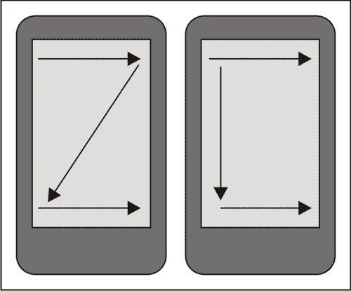
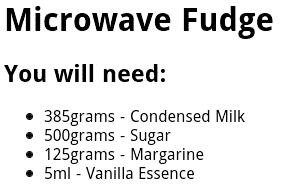
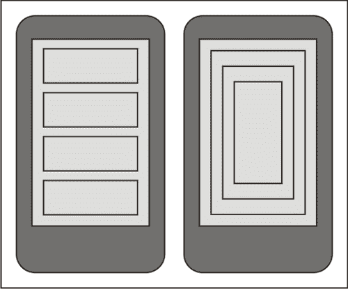
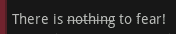
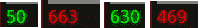
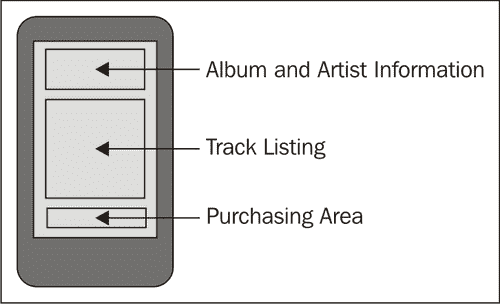
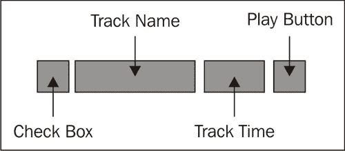
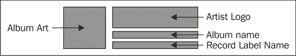
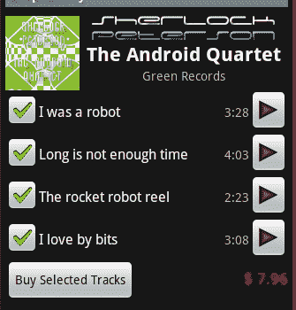

# 第八章：设计内容中心式活动

*当您需要向用户展示大量数据，并且需要一个内容展示`Activity`时，通常这类 Activity 会变成以内容为中心的。内容中心式`Activity`的主要目的是在不过度压倒用户的情况下向用户提供尽可能多的信息。这是执行某种搜索或展示任何类型专业信息的应用程序的一个常见要求。*

购物及相关电子商务应用是内容中心式应用的一个理想示例。在设计过程中，大部分努力都致力于展示有关在售产品的信息。如果用户无法找到他们想要的产品信息，他们就会去其他地方寻找。因此，产品展示不仅要吸引人、易于使用，还必须尽可能提供更多信息，同时避免晦涩难懂或杂乱无章。

另一个内容中心式布局的示例是社交网络应用中的用户个人资料页面。人们通常有很多关于自己的话要说，如果没有，其他人也经常会说很多关于他们的话。这些应用不仅需要向用户展示大量信息，而且信息的质量和相关性也大不相同。仅仅因为一个用户认为某件事很重要，并不意味着下一个人也会这么认为。在这些情况下，拥有一个可以根据用户偏好定制的界面（通常只需重新组织信息展示的顺序）也非常重要，同时还能吸引用户的注意力到他们可能感兴趣的新信息或区域。

一个吸引用户注意的好方法的绝佳示例可以在聊天应用程序中看到。如果用户向上滚动，他/她可能正在阅读几分钟前说过的内容。如果此时收到一条新消息，直接将他们滚动到新消息是非常不礼貌的，因为他们可能还在阅读旧消息。用音频提示通知他们有新消息是一种常见的选择，但这也会吸引其他人对用户的注意（毕竟这是移动设备）。最佳选择是在屏幕底部显示一个小型动画图标，可能通过颜色编码来告诉用户消息的相关性（如果有的话）。这样的图标也可以是交互式元素，允许用户点击它以自动滚动到最近发布的信息。这种思维方式在设计任何应用程序时都很重要，但在构建以内容为中心的`Activity`时，在设计上多花一些心思更为关键。

在本章中，我们将探讨在向用户展示内容时需要考虑的不同方面，以及内容屏幕可以开发的多种方式。具体来说，我们将探讨：

+   设计 Android 内容展示时的思考过程

+   用户如何使用和查看内容屏幕

+   使用`WebView`类来显示内容

+   构建用于显示内容的原生布局

+   在 Android 中格式化和样式化文本

+   引导用户注意屏幕的特定区域

# 在 Android 设备上显示内容时考虑设计选项

以内容为核心的`Activity`与网页非常相似，但在设计上有一些关键考虑因素，这些是人们在创建网页时不会考虑到的。例如，触摸屏设备通常没有软件指针，因此没有“悬停”的概念。然而，许多网页是利用光标悬停来驱动从链接高亮到菜单的一切操作。

在设计以内容为核心的`Activity`时，你需要仔细考虑设计的美观性。屏幕应避免杂乱，因为许多元素可能是可交互的，当用户触摸时会呈现附加信息。同时，你应尽量减少滚动的需要，尤其是水平滚动。保持信息简洁通常是使更多元素可交互的驱动力。如前几章所述，考虑在可能的地方使用图标代替文字，并按照对用户的重要性组织信息。

还要考虑到屏幕尺寸的变化。一些设备拥有大量像素（如各种 Android 平板电脑），而其他设备则只有 3.5 英寸的小屏幕。因此，考虑到一些人可以在一个屏幕上看到所有展示的信息，而其他人可能需要三个或四个屏幕来显示相同数量的内容，这是非常重要的。

当在 Android 应用程序中工作时，网页是快速轻松地构建以内容为中心的布局的好方法。它具有 WebKit 对 HTML 和 CSS 的出色支持以及与应用程序其他部分轻松集成的优势。它还可以由现有的网页设计师处理，或者如果应用程序连接到基于网页的系统，甚至只需显示一个网页。

然而，网页在某种程度上受到 HTML 和 CSS 布局结构的限制。虽然这些在一级上非常灵活，但如果你不习惯于构建基于网页的系统，即使是针对单一的渲染引擎（在 Android 的案例中是 WebKit），HTML 和 CSS 布局开发也可能是一个繁琐和令人沮丧的过程。当涉及到动画和类似结构时，你还会受到 HTML 渲染引擎性能的进一步限制，无论使用 JavaScript 还是 CSS3 动画。

## 考虑用户行为

与任何类型的用户界面一样，了解用户的行为以及他们如何与你提供的屏幕互动非常重要。在大量内容信息的情况下，了解哪些信息是重要的，以及用户如何阅读和吸收这些信息至关重要。

虽然你可能想要吸引用户注意某个选定的信息（如价格），但运行一个循环动画来改变该元素的颜色会分散用户对屏幕上其他信息的注意力。然而，简单地改变字体、将数据放在框内，或者改变文字颜色也可以达到预期的效果。同时，考虑用户如何与屏幕互动也很重要。在触摸屏设备上，用户几乎会触摸屏幕的每一个部分。他们还会拖动看起来可以移动的项，如果内容看起来超出了屏幕长度，他们也会使用滚动手势。 

大多数人以相同的方式扫描信息。当用户第一次看到一个屏幕，或者屏幕上有大量信息时，他们阅读信息的方式大致相同。以下是用户在屏幕上寻找重要信息时眼睛会遵循的各种移动模式的说明。



你通常需要确保重要信息位于一个箭头与另一个箭头相遇的区域。最重要的区域是用户通常开始阅读的角落。对于大多数西方用户来说，这是屏幕的左上角，而亚洲和阿拉伯用户经常会从右上角开始。

### 注意事项

在设计内容屏幕时，可以考虑让这些区域的信息比正常情况下更加突出。这将产生一个“停留”时间，用户的眼光通常会在这个区域上比平时停留得更久一些。这就是为什么我们通常会在网页的左上角放置一个标志的原因。

### 吸引用户注意

几乎总是，某些信息比其他信息更重要。你希望用户能够尽可能快地识别出重要信息，并继续他们正在做的事情。一旦用户熟悉了你的应用，他们很可能会完全停止阅读细则。这是一件好事，你通过让用户继续他们的生活，帮助他们更好地使用你的应用。

当你需要吸引用户注意特定信息，如产品名称或价格时，利用`TextView`类提供的广泛选项是一个好主意。简单地改变一个项目的颜色就可以让用户注意到它。如果你需要更进一步，可以考虑添加阴影，或者将内容放在“高亮框”中。正如我们在第七章 *动画小部件和布局*中已经讨论过的，动画也可以用来吸引用户界面的特定区域。一个简单的“闪烁”动画（由淡出后紧跟淡入动画组成）可以用来吸引用户注意变化。

### 提示

**一个更具体的例子：金钱**

如果你向用户销售产品，并允许他们选择不同的运输方式和包装选项，那么根据他们的选择，总价会发生变化。确保通过加粗字体使总价突出显示。当价格更新时，通过一系列的“中间”价格循环显示，以便总价的图形“递增”或“递减”到新值。

仔细考虑你希望在用户界面中使用的控件。你可能会选择将通常为单一字段的文本放入 `TextSwitcher`（或类似控件）中，以便对单个单词或值进行动画处理，而不是使用常规的`TextView`。

# 使用 `WebView` 类显示内容

`WebView` 类（位于 `android.webkit` 包中）通常是基于内容的设计逻辑选择，并且与构建用户界面和常规的 Android XML 布局资源相比，具有非常明显的优势。`WebView` 类提供了一个单独的入口，你可以在这里放置屏幕的所有内容，它自行处理历史记录和滚动，使得你的代码非常易于编写。

当显示需要复杂布局和/或大量文本内容（可能需要标记）的内容时，`WebView` 类是一个非常好的选择。它内置支持 HTML 和 CSS 标记，减少了屏幕上所需的控件数量。鉴于 Android 使用 Web-Kit 作为渲染引擎，你还可以使用许多 CSS3 结构（如 CSS 动画）。尽管 `WebView` 通常用于类似浏览器的网络应用，其中超链接非常重要，但你也可以轻松地为其提供不包含链接的本地内容。你还可以拦截链接请求，以允许导航到应用程序的其他部分。

通常在使用 `WebView` 结构时，你需要某种方法来生成你将要显示的内容。与在布局资源中构建用户界面不同，你可以简单地为需要注入动态内容的各种 `View` 对象分配 ID。也就是说，完整的模板引擎通常比 XML 布局和 Java 代码的混合更容易使用，尽管实施的难易程度强烈依赖于你拥有的技能以及需要在屏幕上显示的信息类型。

## 使用 `WebView` 对象

为了与 `WebView` 进行一些操作，并给出一个更具体的示例，说明如何使用它来呈现大量内容，我们将构建一个 `Activity` 来在屏幕上显示食谱。在这个例子中，我们将硬编码实际的食谱和布局代码以生成 HTML。实际上，你会希望使用如 Velocity/FreeMarker 或 XSLT 这样的模板引擎来生成 HTML 代码。

# 动手实践——创建食谱查看器应用

你会注意到，以下示例没有使用 XML 布局资源，而是完全在 Java 中创建了 `Activity`。在此示例中，我们使用 `Recipe` 对象生成 HTML 代码到 `StringBuilder` 以显示。这是一个简单但有效的实现。然而，如果需要更改食谱的外观和感觉，它要求修改 Java 代码。

1.  创建一个新项目以包含食谱阅读器应用程序：

    ```kt
    android create project -n RecipeViewer -p RecipeViewer -k com.packtpub.viewrecipe -a ViewRecipeActivity -t 3
    ```

1.  在新应用程序的根包中创建一个新的 `Ingredient.java` 源文件，以保存单个所需成分的信息，并在你的编辑器或 IDE 中打开这个新文件。

1.  声明 `name`、`amount` 和 `unit` 字段，这些字段对于食谱是必需的：

    ```kt
    private final String name;
    private final double amount;
    private final String unit;
    ```

1.  创建一个构造函数以接收参数并将它们赋值给字段：

    ```kt
    public Ingredient(
            String name,
            double amount,
            String unit) {
        this.name = name;
        this.amount = amount;
        this.unit = unit;
    }
    ```

1.  为每个字段创建一个获取器方法：

    ```kt
    public double getAmount() {
        return amount;
    }

    // . . .
    ```

1.  在项目的根包中，创建一个名为 `Recipe.java` 的新源文件以包含一个单独的食谱，并在编辑器或 IDE 中打开它。

1.  声明一个字段用于 `Recipe` 对象的名称：

    ```kt
    private final String name;
    ```

1.  声明另一个字段以包含此 `Recipe` 所需的成分列表。我们将这些作为 `Ingredient` 对象的数组存储：

    ```kt
    private final Ingredient[] ingredients;
    ```

1.  然后声明一个 `String` 对象数组，该数组将包含需要遵循的 `Recipe` 指令列表：

    ```kt
    private final String[] instructions;
    ```

1.  创建一个构造函数以接受字段数据并将其赋值以存储：

    ```kt
    public Recipe(
            String name,
            Ingredient[] ingredients,
            String[] instructions) {
        this.name = name;
        this.ingredients = ingredients;
        this.instructions = instructions;
    }
    ```

1.  为这三个字段创建一个获取器方法：

    ```kt
    public Ingredient[] getIngredients() {
        return ingredients;
    }

    // . . .
    ```

1.  在此示例中，`Recipe` 类负责生成 HTML。声明一个名为 `toHtml` 的新方法：

    ```kt
    public String toHtml() {
    ```

1.  创建一个 `DecimalFormat` 对象以处理体积的格式化：

    ```kt
    DecimalFormat format = new DecimalFormat("0.##");
    ```

1.  创建一个新的 `StringBuilder` 对象以构建 HTML：

    ```kt
    StringBuilder s = new StringBuilder();
    ```

1.  追加 HTML 标题：

    ```kt
    s.append("<html>").append("<body>");
    ```

1.  追加一个一级标题元素，其中包含食谱的名称：

    ```kt
    s.append("<h1>").append(getName()).append("</h1>");
    ```

1.  追加一个二级标题元素以打开 `ingredients` 部分：

    ```kt
    s.append("<h2>You will need:</h2>");
    ```

1.  打开一个无序列表以列出食谱所需的成分：

    ```kt
    s.append("<ul class=\"ingredients\">");
    ```

1.  对于每个 `Ingredient` 对象，为新的成分打开一个列表项：

    ```kt
    for(Ingredient i : getIngredients()) {
        s.append("<li>");
    ```

1.  使用声明的 `DecimalFormat` 格式化后，将成分的量追加到 `StringBuilder`：

    ```kt
    s.append(format.format(i.getAmount()));
    ```

1.  然后追加成分的测量单位：

    ```kt
    s.append(i.getUnit());
    ```

1.  现在将成分的名称追加到 `StringBuilder`，并关闭 `ingredient` 列表项：

    ```kt
    s.append(" - ").append(i.getName());
    s.append("</li>");
    ```

1.  在关闭 for 循环后，关闭无序列表：

    ```kt
    s.append("</ul>");
    ```

1.  创建一个二级标题，打开食谱的 `Instructions` 部分：

    ```kt
    s.append("<h2>Instructions:</h2>");
    ```

1.  打开另一个无序列表以将食谱指令渲染其中：

    ```kt
    s.append("<ul class=\"instructions\">");
    ```

1.  使用 for-each 循环遍历指令数组，将它们渲染成 `StringBuilder` 中的无序列表结构：

    ```kt
    for(String i : getInstructions()) {
        s.append("<li>").append(i).append("</li>");
    }
    ```

1.  关闭无序列表和 HTML 标题，返回 `StringBuilder` 对象的 `String` 内容：

    ```kt
    s.append("</ul>");
    s.append("</body>").append("</html>");
    return s.toString();
    ```

1.  在你的编辑器或 IDE 中打开 `ViewRecipeActivity` Java 源代码。

1.  在 `onCreate` 方法中，在调用 `super.onCreate` 之后，创建一个新的 `WebView` 对象，将 `this` 作为它的 `Context` 传递给它：

    ```kt
    WebView view = new WebView(this);
    ```

1.  将`WebView LayoutParams`设置为占用所有可用的屏幕空间，因为`WebView`（与`ListView`类似）具有内置的滚动功能：

    ```kt
    view.setLayoutParams(new LayoutParams(
            LayoutParams.FILL_PARENT,
            LayoutParams.FILL_PARENT));
    ```

1.  创建一个`Recipe`对象以在`WebView`中显示，完整的食谱在本示例部分末尾：

    ```kt
    Recipe recipe = new Recipe(
            "Microwave Fudge",
            // . . .
    ```

1.  将由`Recipe`对象生成的 HTML 内容加载到`WebView`中：

    ```kt
    view.loadData(recipe.toHtml(), "text/html", "UTF-8");
    ```

1.  将`Activity`的内容视图设置为创建的`WebView`对象：

    ```kt
    setContentView(view);
    ```

## *刚才发生了什么？*

食谱查看器示例显示了一个简单的结构，可以通过多种不同的方式扩展，以易于使用的格式向用户呈现大量信息。由于`WebView`与 HTML 一起工作，使得呈现非交互式信息列表比使用`ListView`或类似结构更具吸引力。

之前使用的`loadData`方法有限制，它不允许页面轻松引用外部结构，如样式表或图片。你可以通过使用`loadDataWithBaseURL`方法来绕过这个限制，该方法与`loadData`类似，但会相对于指定的 URL 渲染页面，该 URL 可能是线上的或设备本地的。

`Recipe`对象被认为负责渲染其 HTML，这在纯 Java 情况下工作良好。你也可以将`Recipe`传递给模板引擎，或者使用访问者模式将`Recipe`对象渲染为 HTML 代码。上一个示例中`Recipe`对象的完整代码如下：

```kt
Recipe recipe = new Recipe(
    "Microwave Fudge",
    new Ingredient[]{
        new Ingredient("Condensed Milk", 385, "grams"),
        new Ingredient("Sugar", 500, "grams"),
        new Ingredient("Margarine", 125, "grams"),
        new Ingredient("Vanilla Essence", 5, "ml")
    },
    new String[]{
        "Combine the condensed milk, sugar and margarine "
        + "in a large microwave-proof bowl",
        "Microwave for 2 minutes on full power",
        "Remove from microwave and stir well",
        "Microwave for additional 5 minutes on full power",
        "Add the Vanilla essence and stir",
        "Pour into a greased dish",
        "Allow to cool",
        "Cut into small squares"
    });
```

使用`WebView`对象的 一个不利的副作用是它不符合其他小部件的外观和感觉。这就是当你将其与其他小部件放在同一屏幕上时，它不能很好地工作的原因。上一个示例的最终效果实际上是一个非交互式的网页，如下所示：



## 动手英雄——改进食谱查看器的观感

上一个示例生成了一个非常简单的 HTML 页面，并且没有包含任何样式。内联包含 CSS 是一个非常简单的操作，甚至可以通过从应用资源中读取样式内容来完成。创建一个 CSS，将其内联包含在 HTML 页面中，并包含如下规则：

+   设置一级标题和二级标题元素背景颜色

+   将一级标题和二级标题的字体颜色改为白色

+   将头部元素的圆角设置为五个像素

+   将列表项目符号从圆形改为方形

## 进一步使用 WebView

`WebView`类具有非常重要的功能，在处理内容屏幕时非常有用，例如，使用超链接为不太重要的内容提供一个**显示**/**隐藏**的披露部分。这需要 HTML 页面中使用 JavaScript，此时强烈建议你的应用程序使用模板引擎来生成 HTML 页面，而不是在 Java 代码中生成（因为 Java 代码将很快变得难以维护）。

`WebView`类还允许你的应用程序通过一种非常简单的机制与页面上的 JavaScript 代码交互，你可以通过这种方式将 Java 对象暴露给 JavaScript 代码。这是通过`addJavascriptInterface`方法实现的。这样，HTML 页面就可以调用你提供的 Java 对象上的动作，从而有效地允许页面控制你应用程序的一部分。如果你的内容屏幕需要执行诸如**购买**或**取消**的业务动作，可以在 JavaScript 接口对象中公开所需的功能。当用户选择**书籍**HTML 元素时，页面中的 JavaScript 可以调用你定义的`appInterface.buy();`方法。

在考虑`WebView`类时，另一个重要的特性是“缩放”控件。当向用户展示大量信息时，用户可能需要放大或缩小以使某些元素更容易阅读。要启用`WebView`的内置缩放控件，你需要访问`WebSettings`对象：

```kt
webView.getWebSettings().setBuiltInZoomControls(true);
```

`WebSettings`对象可以用来启用和禁用 WebKit 浏览器组件中可用的许多其他功能，阅读可用的文档是非常值得的。

`WebView`类的主要问题是它的外观和感觉。默认主题的 Android 应用程序在黑色背景上是浅灰色，而`WebView`类在白色背景上是黑色，这使得由`WebView`驱动的屏幕在用户看来就像是一个单独的应用程序。

解决样式问题的最简单方法似乎是将 HTML 页面样式设计得与应用程序的其他部分一样。问题是，一些设备制造商有自己的 Android 应用程序样式，所以你无法确定应用程序的其余部分看起来会是什么样子。将 HTML 页面的背景和前景改为符合标准的 Android 主题，在制造商主题的设备上运行时，可能会使其与应用程序的其他部分形成鲜明对比。

## 小测验

1.  渲染大型对象图以在`WebView`中显示的最佳方式是什么？

    1.  将其转换为 XML 并通过 XSLT 处理

    1.  将其发送到外部网络服务以进行渲染

    1.  硬编码 HTML 生成

    1.  使用简单的模板引擎

1.  你如何通过`WebView`访问外部 CSS 和图片？

    1.  使用`loadDataWithBaseURL`方法

    1.  在 HTML 页面中指定完整的 URL 路径

    1.  生成包含内联数据的 HTML 代码

1.  Android 的`WebView`使用什么渲染引擎？

    1.  Gecko

    1.  MSIE/Trident

    1.  KHTML

    1.  WebKit

# 为内容显示创建相对布局

`WebView`提供了一种简单的方式，可以轻松地向用户展示大量内容，并以易于阅读的格式呈现。它还内置了许多专为查看内容而设计的功能。然而，它并不总是提供简单的解决方案，通常不允许使用其他小部件提供的现成功能。`RelativeLayout`类提供了与`WebView`类相同的布局功能。

正如我们刚刚讨论的，`WebView`几乎像一个独立的应用程序一样突出。使用`RelativeLayout`，你将使用标准的 Android 小部件来填充你的屏幕，这意味着从一屏切换到另一屏时，外观和感觉不会有任何变化。而`WebView`需要某种模板引擎（无论是 API 中的，还是在示例中简单的`StringBuilder`），`RelativeLayout`可以声明为应用程序资源中的 XML 文件。使用布局文件还意味着屏幕布局将通过资源选择过程进行选择，从而可以实现难以用`WebView`类和 HTML 代码实现的复杂自定义。

在某种意义上，使用`RelativeLayout`提供了一种模板引擎的形式。只需为需要用数据填充的`View`对象提供 ID，就可以通过将这些暴露的对象注入相关内容来填充屏幕。当我们构建基于 HTML 的视图时，我们需要为成分列表和说明列表创建标题元素，如果使用编码的布局结构，这些标题将从布局文件中加载，或从字符串束资源中加载。

在处理信息列表时，这是内容布局的常见要求，你可以以多种不同的方式提供数据。你可以使用`ListView`对象，或者你可以使用嵌入式`LinearLayout`作为列表。在使用它们中的任何一个时，建议有一个可以重复用于列表中每个项目的布局资源。使用`ListView`意味着你有了一个`Adapter`，通过它你可以将数据对象转换为可以在屏幕上显示的`View`对象。然而，`ListView`对象还有各种其他限制（如包含项目的大小），最好在它们显示的项目以某种方式交互时使用。如果你需要一个非交互式的项目列表（或网格），最好通过创建一个负责根据你的数据对象创建`View`对象的单独类来遵循`Adapter`机制。

## 充分利用 RelativeLayout

`RelativeLayout`结构的主要优势在于它们可以直接与你的应用程序的其余部分集成。它们比 HTML 页面更容易本地化。直接`ViewGroup`结构提供的事件结构比通过其专用的事件监听器和 JavaScript 的`WebView`对象提供的事件结构更为灵活。

XML 布局结构也提供了与模板引擎类似的效果，无需导入像 XSLT 引擎、Java 模板引擎这样的外部 API，或者硬编码 HTML 生成。标准的 Android `Activity` 类也内置了与 Android 动画结构工作的功能。虽然 `WebView` 类允许使用 CSS 动画或运行 JavaScript 动画，但这需要为动画的每一帧重新布局 HTML 结构。

一个实现了整个内容屏幕的 Android `Activity` 类还有个优点，那就是它可以从应用程序资源结构中加载外部资源。这不仅使得你能够更容易地本地化图像等资源，也意味着所有资源都会通过资源编译器处理，因此可以通过 Android 工具链进行优化。而使用 `WebView` 的话，你需要一个基本 URL 来加载这些资源，或者能够将它们内嵌编码在 HTML 页面中。

## 考虑到 Android 布局的限制

完全将内容视图开发为 Android 布局有一些缺点。从技能角度来看，只有开发者能够构建和维护用户界面。这也意味着任何针对单个小部件的样式设计都必须由开发者管理。而基于 `WebView` 的布局，布局的大部分创建工作可以由网页开发人员和图形设计师来处理。

### 注意

向屏幕上添加更多小部件会带来另一个问题——性能。不仅更大、更复杂的布局可能导致用户体验非常缓慢，还可能导致你的 `Activity` 完全崩溃。

屏幕上保持较少的小部件意味着用户一次需要吸收的信息量会减少，界面也将更容易操作。

过长或过深的布局会导致应用程序崩溃。如果你需要让句子中的一个单词动起来，你将不得不定义两个额外的 `TextView` 小部件，用来显示动画单词两侧的非动画文本。这增加了你的布局长度。如果你还需要一个水平 `LinearLayout` 来放置这三个 `TextView` 对象，你将增加布局结构的深度。考虑到这两个限制，你可以想象在布局渲染时，你很快就会耗尽内存或处理能力。每个小部件在渲染之前都必须进行布局测量。每次测量、布局步骤或渲染步骤都会通过递归调用方法来使用语言堆栈，以确保所有小部件在屏幕上的正确位置正确渲染（或者如果它们在屏幕外则不渲染）。Android 中的软件堆栈大小是有限的，每次方法调用都需要将其参数推送到堆栈上以进行调用。除此之外，所有测量信息都需要存储在堆空间中，这也是 Android 平台上另一个严重受限的资源（默认情况下，Dalvik VM 只分配了 8 MB 的堆空间开始）。

下图展示了布局结构的长度和深度的区别。左边的屏幕展示了一个长布局，而右边的屏幕展示了一个深布局：



## 设置 `TextView` 对象的样式

在这一点上，考虑如何让句子中的一个单词变粗体，或者给它加个阴影，这似乎令人担忧。在 `WebView` 中，只需添加一个带有特殊样式的 `<span>` 元素就很容易实现，但在原生布局中，难道你需要为文本的每个部分添加单独的 `TextView` 对象吗？如果是这样，你将极大地限制能够向用户显示的文本量，因为你将创建成千上万的几乎无用的对象。

幸运的是，Android 非常容易地对所有默认小部件中的文本进行标记。任何从 `TextView` 继承的类都可以处理带有样式信息或甚至图片的文本。通常，`android.text.style` 包中可用的类可以用来设置你想要显示的文本字符串的子片段的样式。

为了使用这些不同的样式结构，你需要使用一个`SpannableString`对象。`SpannableString`是 Android 字符串的一种特殊类型，它记录了一个需要显示的正常`CharSequence`文本的样式信息。还有其他一些类似的类（如`SpannableStringBuilder`），它们处理文本的简单修改，因此适合于将被编辑的文本。出于我们当前的目的，`SpannableString`是完美的，而且更简单易用。`SpannableString`有一个基于`Spannable`接口需要实现的方法——`setSpan`。`setSpan`方法允许你向`SpannableString`添加标记结构，这些标记结构影响文本特定部分的渲染方式。

如果我们只想在屏幕上写下**There is nothing to fear!**这个文本，你通常会使用一个指定字符串的`TextView`对象。但如果我们想将字符串中的**nothing**划掉呢？现在的方法是使用`StrikethroughSpan`对象来处理第 9 到 16 个字符。在这种情况下，字符串不能只在布局文件中定义，需要在 Java 代码中创建一个`SpannableString`。以下是实现此操作的一个简单示例，以及结果`TextView`的外观：

```kt
TextView fear = new TextView(this);
SpannableString string = new SpannableString(
        "There is nothing to fear!");
string.setSpan(new StrikethroughSpan(), 9, 16, 0);
fear.setText(string);
```

这段 Java 代码的结果是一个`TextView`小部件，它显示的是样式化的内容，而不是普通的`String`，如下面的截图所示：



如你所见，使用这种标记非常有效，而且实际上非常容易操作。与`WebView`渲染相比，这个示例的执行速度也非常快，因为它不包含任何形式的解析。

然而，这种机制存在一些问题。最重要的是索引处理。为了知道何时开始或结束标记渲染的`Span`，你需要指定需要用给定`Span`渲染的第一个和最后一个字符。除非你计划更改文本，甚至更糟——国际化它，否则这不是问题。

幸运的是，Android 已经有一个内置的解决方案，尽管这会牺牲一些性能。你可以将几乎任何 HTML 文本转换成一个`Spannable`对象，然后这个对象可以直接传递给任何`TextView`对象进行渲染。要使用的类是`android.text.Html`类，它包括用于将 HTML 代码解析为`Spannable`对象的实用方法，以及将`Spannable`对象转换为 HTML 代码的方法。

如果你需要国际化打算用额外样式属性渲染的字符串，`Html`类可能是唯一合理的做法。它还有一个额外的好处，即图片加载可以由你的应用程序处理（通过使用`Html.ImageGetter`接口）。此外，`TextView`仍然看起来和感觉像一个正常的 Android 小部件，这增强了用户的体验。

`Html`类处理大多数 HTML 标签，但并非所有。一方面，CSS 样式被忽略，因此颜色和边框不在考虑之列。然而，仍然可以实现很好的样式，至少你不需要在应用程序资源中记录字符索引值，以便所有样式对齐。

如果你想将`Button`标签中的文本设置为粗体，使用`Html`类可以轻松实现。直接将`fromHtml`方法的结果传递给`TextView`对象要快得多。例如，以下代码片段将生成一个`Button`对象，其中单词**Hello**会以斜体显示，而单词**World**则具有粗体权重：

```kt
Button button = new Button(this);
button.setText(Html.fromHtml("<i>Hello</i> <b>World!</b>"));
```

你还可以在布局资源 XML 文件中指定 HTML 内容，它将在传递给`TextView`对象的`setText`方法之前通过`Html`类进行解析。

上面的 Java 代码片段创建了一个`Button`小部件，其外观如下所示：


HTML 标签也可以用于将迷你文档渲染到`TextView`对象中，尽管它们具有自己的样式，但也会遵循`TextView`对象的样式。这意味着，如果你需要一个比`WebView`更快速处理静态文本（且不含超链接）的解决方案，`TextView`实际上可以作为一个很好的替代品。例如，考虑以下代码片段：

```kt
TextView text = new TextView(this);
text.setTextColor(0xff000000);
text.setBackgroundColor(0xffffffff);
text.setText(Html.fromHtml(
        "<h1>Cows Love to Eat Grass</h1>"
        + "<p>Do not fear the Cow</p>"));
```

这将渲染一个带有第一级标题和单行段落元素的`TextView`。两者都将包含一些内边距，以便与屏幕上的其他元素保持距离。生成的图像应该看起来相当熟悉：


如你所见，正确设置了样式的`TextView`可以成为`WebView`的优秀替代品，特别是当你将其与一系列原生小部件并列使用时。然而，黑底白字的样式确实带来了不一致的问题。因此，除非你的整个应用程序遵循这种模式，否则最好将样式保留为默认。

如果你打算使用`TextView`显示较长的内容，需要考虑一些额外的因素：

+   确保如果文本长度超过用户屏幕尺寸，用户将能够滚动。这很容易做到，只需将`TextView`放置在`ScrollView`对象中。

+   如果你的文本非常长，考虑对内容进行样式设计，要么使文本更亮白，要么使用黑底白字。虽然这与其他 Android 应用程序以及你自己的应用程序中的其他屏幕非常不一致，但它对眼睛来说要轻松得多，你的用户会为此感谢你。

+   考虑允许用户通过长按或菜单更改字体大小。如果他们的屏幕是低密度的，或者他们视力不佳，你可能使他们的生活变得稍微轻松一些。

## 小测验

1.  如果需要显示一个非交互式的项目符号列表，以下哪个更合适？

    1.  带有无序列表的`WebView`

    1.  一个特别样式的`ListView`对象

    1.  一个带有 HTML 内容的`TextView`对象

1.  关于超链接，你可能使用`WebView`而不是`TextView`，因为：

    1.  `TextView`不能处理超链接

    1.  在`WebView`中显示效果更佳

    1.  `WebView`具有内置的历史管理功能

1.  对于动画密集型应用，原生接口效果更好，因为：

    1.  你可以使用 Android 动画资源文件

    1.  `WebView`类不处理动画

    1.  HTML 动画运行成本更高

# 是时候采取行动了——开发专用内容视图

在许多情况下，你需要一种特定的交互逻辑，以便在应用程序的许多部分重复使用。在内容屏幕上，某些显示区域将需要更新，由显示的其他部分的变化来驱动。这通常是因为屏幕的一部分在向用户传递信息，而其他部分则在从用户那里捕获新数据。接下来，我们将构建一个简单的控件，负责向用户显示金额。它存在的主要原因是它不仅在变化之间进行动画处理，而且通过改变颜色来反馈给用户金额是上升还是下降。

1.  创建一个名为`AmountBox.java`的新 Java 源文件用于新类，并在编辑器或 IDE 中打开新文件。

1.  新类应扩展`TextSwitcher`类并实现`ViewSwitcher.ViewFactory`接口：

    ```kt
    public class AmountBox extends TextSwitcher
            implements ViewSwitcher.ViewFactory {
    ```

1.  声明一个字段用于`DecimalFormat`，以便渲染金额：

    ```kt
    private DecimalFormat format = new DecimalFormat("0.##");
    private double amount;
    ```

    同时声明一个字段来存储当前显示的数值：

1.  声明从`TextSwitcher`类提供的两个构造函数的副本，以允许`LayoutInflator`类从资源文件实例化`AmountBox`类：

    ```kt
    public AmountBox(Context context, AttributeSet attrs) {
        super(context, attrs);
        init();
    }
    public AmountBox(Context context) {
        super(context);
        init();
    }
    ```

1.  声明`init()`方法以处理“常见构造函数”的要求：

    ```kt
    private void init() {
    ```

1.  将“进入”和“退出”动画设置为 Android 提供的淡入淡出动画：

    ```kt
    setOutAnimation(getContext(), android.R.anim.fade_out);
    setInAnimation(getContext(), android.R.anim.fade_in);
    ```

1.  接下来，将`ViewFactory`设置为`AmountBox`：

    ```kt
    setFactory(this);
    ```

1.  最后，调用`setAmount(0)`以确保显示的金额已指定：

    ```kt
    setAmount(0);
    ```

1.  声明一个 setter 方法，以允许覆盖默认的`DecimalFormat`：

    ```kt
    public void setFormat(DecimalFormat format) {
        this.format = format;
    }
    ```

1.  声明一个 getter 方法，以便轻松访问当前数值：

    ```kt
    public double getAmount() {
        return amount;
    }
    ```

1.  重写`ViewFactory`的`makeView()`方法：

    ```kt
    public View makeView() {
    ```

1.  使用传递给此`AmountBox`的上下文创建一个新的`TextView`对象：

    ```kt
    TextView view = new TextView(getContext());
    ```

1.  指定一个较大的文本大小，因为该数量将表示货币，然后返回`TextView`对象以显示：

    ```kt
    view.setTextSize(18);
    return view;
    ```

1.  现在声明一个设置器方法，以允许更改金额值：

    ```kt
    public void setAmount(double value) {
    ```

1.  这个方法将改变文本的颜色，因此声明一个变量来显示新的文本`颜色`：

    ```kt
    int color;
    ```

1.  首先检查我们应该将文本更改为哪种`颜色`：

    ```kt
    if(value < amount) {
        color = 0xff00ff00;
    } else if(value > amount) {
        color = 0xffff0000;
    } else {
        return;
    }
    ```

1.  获取屏幕外的`TextView`对象：

    ```kt
    TextView offscreen = (TextView)getNextView();
    ```

1.  根据数值的变化设置字体颜色：

    ```kt
    offscreen.setTextColor(color);
    ```

1.  在文本周围渲染阴影以产生“光晕”效果：

    ```kt
    offscreen.setShadowLayer(3, 0, 0, color);
    ```

1.  将`TextView`的文本设置为新的值：

    ```kt
    offscreen.setText(format.format(value));
    ```

1.  显示屏幕外的`TextView`并记住新值：

    ```kt
    showNext();
    amount = value;
    ```

## *刚才发生了什么？*

`AmountBox`类是一个需要更新内容的小单元的很好例子。这个类向用户提供信息，同时也提供了一种反馈形式。当用户执行影响显示金额的操作时，`AmountBox`通过更新字体颜色来反映变化的方向——金额减少时为绿色，金额增加时为红色。

示例使用了第七章讨论的标准 Android 淡入淡出动画，即*动画小部件和布局*。动画的速度为两个金额之间的交叉淡入效果提供了很好的效果。注意在`setAmount`方法中，文本内容的更新和`View`对象的切换是手动处理的。

你可能可以用一个`setText`方法的调用替换`offscreen.setText`和`showNext`方法的调用，但了解它内部的工作原理很有趣。此方法也不受未来实现变更的影响。



# 开发在线音乐商店

一个以内容为中心的布局的绝佳例子是嵌入媒体播放器应用程序中的音乐商店。直接从媒体播放器购买音乐的能力是一个极大提升用户体验的功能，并且与 Android 应用程序作为“连接”应用程序的行为而非纯粹的离线系统相得益彰。Android 还使得将商店真正集成到应用程序中变得非常简单，而不仅仅是提供到适当网站的链接。通常，如果用户点击**购买音乐**按钮而没有突然跳转到网页浏览器，他们会更有信任感。将应用程序的在线和离线部分正确集成，对于你的销售统计也能起到很大的作用。

在线购买音乐与在商店购买音乐非常不同。关于用户正在查看的歌曲、艺术家或专辑的附加信息是吸引人的部分。因此，一个针对移动设备的在线音乐商店必须精心设计，以提供尽可能多的信息，同时不使屏幕显得杂乱，也不偏离用户购买音乐的初衷。与应用程序的整合感也有助于建立用户信任，因此外观和感觉非常重要。在线购买音乐的另一个优点是，你只需为你想购买的内容付费。为此，用户界面需要允许用户选择他们想从专辑中购买的曲目，以及他们不想购买或计划以后购买的曲目。另外，他们如何知道哪些是他们喜欢的？他们还需要能够播放每首曲目的样本（无论是限时播放，还是只是低质量的）。

## 设计音乐商店

要真正说明以内容为中心的设计是如何结合在一起的，你需要构建一个。在这个例子中，我们将通过设计过程以及该设计的实现来工作。由于设计和实现是这里的重要部分，我们不会深入构建一个功能性的示例。它只是一个漂亮的屏幕。

首先，我们需要有一个基本的用户界面设计。我发现最好是从一块白板或一张纸和一支笔开始。尽管市面上有很多绘制模拟屏幕的工具，但没有一个能真正接近纸和笔的用户界面。首先，我们绘制一个高级线框，展示整个屏幕设计。这只是一系列告诉我们在屏幕的哪些部分显示什么类型信息的盒子。



在图表中，我们将用户界面分成了三个部分：

+   专辑和艺术家信息区域：这一区域显示用户想要购买专辑的名称和封面艺术。

+   曲目列表区域：在这个区域，用户可以试听样本，并选择他们想要购买的曲目。

+   购买区域：这一区域显示用户将支付的总金额，以及一个购买选定曲目的按钮。

在上一个图表中，我遵循了屏幕的大小，但根据屏幕大小和可用的曲目数量，用户界面可能需要一个滚动条才能完全访问。

接下来的工作是对我们定义的用户界面的每个部分进行查看，并决定将哪些小部件放入它们中。首先，我们需要查看专辑和艺术家信息。专辑信息将作为专辑封面艺术和专辑名称显示。我们将包括一个用于艺术家标志的图像区域，并包括一个带有录音标签名称的文本块。


这样一个简单的块状图可以让你直观地考虑各种元素。它还允许你开始考虑诸如字体大小、边框和间距等因素。在上述图表中，我们希望右侧的三个元素大致与左侧的封面艺术大小相同。不幸的是，Android 的 `RelativeLayout` 类目前不允许我们直接规定这一点作为约定。接下来我们需要考虑的设计元素是音轨列表框。对于这个，我们不是在框中绘制所有内容，而是专注于单行外观及其包含的信息。



上述结构是一个非常简单的单行结构，用于显示单个音轨的详细信息。左侧的 `CheckBox` 可用于选择用户想要购买的音轨，而右侧的按钮可用于播放给定音轨的样本。两侧类似按钮的元素为中间的纯文本元素创建了一种框架。

最后，我们需要考虑我们打算如何让用户支付他们的钱。这是用户界面非常重要的部分，它需要清晰明了——他们预期要支付的金额。我们还需要让用户实际进行交易变得非常容易，所以需要一个单一的 **购买** 或 **购买选定音轨** 按钮。


用户界面的最后一部分仅包含两个小部件，左侧用于购买，右侧显示用户预期支付的总金额。对于左侧的按钮，我们将使用一个简单的 Android `Button` 小部件，而在右侧，我们将使用本章前一部分编写的新的 `AmountBox`。

## 开发音乐商店

我们将从构建一系列新的模型类开始新的示例，但首先你需要为我们的概念性媒体播放器创建一个新项目。为此，在命令行或控制台上运行以下命令：

```kt
android create project -n PacktTunes -p PacktTunes -k com.packtpub.packttunes -a ShopActivity -t 3
```

创建新项目后，将 `AmountBox` 源代码复制到新项目的根包中。然后，你需要创建一个类来包含单个音轨的数据。这只需存储音轨的名称和以秒为单位的音轨时长。我们还将包括一些实用方法，用于计算我们可以用来显示时长数据的分：秒值。

```kt
public class Track {
    private final String name;
    private final int length;

    public Track(final String name, final int length) {
        this.name = name;
        this.length = length;
    }

    public String getName() {
        return name;
    }

    public int getLength() {
        return length;
    }

    public int getMinutes() {
        return length / 60;
    }

    public int getSeconds() {
        return length % 60;
    }
}
```

`Track` 类是一个非常简单的结构，可以很容易地从 XML 解析或从二进制流反序列化。我们还需要另一个类来保存关于单个艺术家的信息。虽然以下类实际上不过是数据存储的一种形式，但很容易扩展以存储如需的生物信息：

```kt
public class Artist {
    private final Drawable logo;
    private final String description;

    public Artist(
            final Drawable logo,
            final String description) {

        this.logo = logo;
        this.description = description;
    }

    public String getDescription() {
        return description;
    }

    public Drawable getLogo() {
        return logo;
    }
}
```

最后，在数据类方面，我们需要一个类来将前两个类连接到一个单一的专辑。这个类将被用作可以传递给`Activity`的单一点。将以下代码复制到项目根包中名为`Album.java`的新文件中：

```kt
public class Album {
    private final Drawable cover;
    private final String name;
    private final Artist artist;
    private final String label;
    private final Track[] tracks;

    public Album(
            final Drawable cover,
            final String name,
            final Artist artist,
            final String label,
            final Track... tracks) {

        this.cover = cover;
        this.name = name;
        this.artist = artist;
        this.label = label;
        this.tracks = tracks;
    }

    public Drawable getCover() {
        return cover;
    }

    public Artist getArtist() {
        return artist;
    }

    public String getLabel() {
        return label;
    }

    public String getName() {
        return name;
    }

    public Track[] getTracks() {
        return tracks;
    }
}
```

# 动手时间——构建一个轨道条目

要开始新的用户界面工作，你需要一些图片。在接下来的部分，你需要一个用于播放按钮的图片。播放图片应该是一个简单的“播放”箭头，我们将它放入的按钮会提供背景和边框。列表结构中的行将被放入一个`TableLayout`中，以便对齐所有子结构。

1.  在项目的`res/layouts`目录中创建一个新的布局资源文件，并将新文件命名为`track.xml`。

1.  将新文件的根元素声明为一个`TableRow`元素，占用所有可用宽度和所需高度：

    ```kt
    <TableRowandroid:layout_width="fill_parent"android:layout_height="wrap_content">
    ```

1.  作为`TableRow`的第一个元素，创建一个`CheckBox`，用户可以使用它来选择和取消选择他们想要购买的轨道：

    ```kt
    <CheckBox android:id="@+id/selected"
              android:checked="true"
              android:layout_width="wrap_content"
              android:layout_height="wrap_content"/>
    ```

1.  声明一个`TextView`元素，以比通常更大的字体显示轨道名称，并使用纯白色字体颜色：

    ```kt
    <TextView android:id="@+id/track_name"
              android:textSize="16sp"
              android:textColor="#ffffff"
              android:layout_width="wrap_content"
              android:layout_height="wrap_content"/>
    ```

1.  在`TextView`轨道名称后面跟随另一个右对齐的`TextView`对象，用于显示轨道的时长：

    ```kt
    <TextView android:id="@+id/track_time"
              android:gravity="right"
              android:layout_width="wrap_content"
              android:layout_height="wrap_content"/>
    ```

1.  以一个`ImageButton`元素结束`TableRow`元素，用户可以使用它来在购买前试听轨道：

    ```kt
    <ImageButton android:id="@+id/play"
                 android:src="img/play"
                 android:layout_width="wrap_content"
                 android:layout_height="wrap_content"/>
    ```

## *刚才发生了什么*

上面的布局资源文件将处理用户界面第二部分轨道列表项的布局。我们需要能够创建几个这样的结构，以处理专辑中所有可用的轨道。我们将它们包裹在一个`TableRow`元素中，当它被放入一个`TableLayout`对象时，会自动将其子元素与其他行中的元素对齐。

之后，在 Java 代码中，我们将使用`LayoutInflator`加载这个资源，用轨道的名称和时长填充它，然后将其添加到一个`TableLayout`对象中，这个对象我们将作为主用户界面的一部分进行声明。一旦这个新项目被填充了一些数据，它看起来将类似于以下的截图：


# 动手时间——开发主用户界面布局

建立了后来将变成列表中轨道条目的布局资源文件后，我们现在需要定义这个用户界面的其余元素。虽然这个结构相对简单，但它也非常容易扩展，并且有一些小细节让它看起来非常棒。它还需要一些 Java 代码才能正确填充，但我们在完成资源文件后会涉及到这些内容。



1.  创建或打开新项目中的`res/layout/main.xml`文件。

1.  为了处理主布局可能超出可用屏幕空间的情况，主布局的根元素需要是一个`ScrollView`。`ScrollView`应占据所有可用屏幕空间：

    ```kt
    <ScrollView

        android:layout_width="fill_parent"
        android:layout_height="fill_parent">
    ```

1.  作为`ScrollView`的唯一元素，声明一个`RelativeLayout`，它占据可用宽度，但只有所需的高度。`RelativeLayout`应在顶部和底部包含一些内边距，以提供一些“呼吸空间”，使其内容不会显得过于拥挤：

    ```kt
    <RelativeLayout android:layout_width="fill_parent"
                    android:layout_height="wrap_content"
                    android:paddingTop="10dip"
                    android:paddingBottom="10dip">
    ```

1.  `RelativeLayout`的第一个元素是专辑封面，这是一个固定大小的`ImageView`对象，它将适应可用空间中的专辑封面艺术：

    ```kt
    <ImageView android:id="@+id/artwork"
               android:scaleType="fitCenter"
               android:gravity="left"
               android:layout_alignParentTop="true"
               android:layout_alignParentLeft="true"
               android:layout_width="84dip"
               android:layout_height="84dip"/>
    ```

1.  专辑封面之后的第二个元素是艺术家的标志图像，也是一个`ImageView`。这个元素需要将标志在可用空间中居中显示：

    ```kt
    <ImageView android:id="@+id/artist_logo"
               android:adjustViewBounds="true"
               android:scaleType="center"
               android:layout_alignParentTop="true"
               android:layout_toRightOf="@id/artwork"
               android:layout_width="fill_parent"
               android:layout_height="wrap_content"/>
    ```

1.  在艺术家标志之后，我们需要一个简单的`TextView`对象，并应用一些字体样式来显示我们试图销售的专辑名称。我们将按照之前看到的图像，在用户界面中将此放置在艺术家标志下方：

    ```kt
    <TextView android:id="@+id/album_label"
              android:gravity="center"
              android:textSize="22dip"
              android:textColor="#ffffff"
              android:textStyle="bold"
              android:layout_below="@id/artist_logo"
              android:layout_toRightOf="@id/artwork"
              android:layout_width="fill_parent"
              android:layout_height="wrap_content"/>
    ```

1.  在带有专辑名称的`TextView`下方，我们有一个小的非样式的`TextView`来显示发行专辑的唱片公司名称：

    ```kt
    <TextView android:id="@+id/record_label"
              android:gravity="center"
              android:layout_below="@id/album_label"
              android:layout_toRightOf="@id/artwork"
              android:layout_width="fill_parent"
              android:layout_height="wrap_content"/>
    ```

1.  如承诺的那样，在这些元素之后，我们使用一个`TableLayout`来保存可用的曲目信息。我们将`TableLayout`元素与专辑艺术相对齐，而不是与唱片公司`TextView`相对齐：

    ```kt
    <TableLayout android:id="@+id/track_listing"
                 android:stretchColumns="1"
                 android:layout_below="@id/artwork"
                 android:layout_width="fill_parent"
                 android:layout_height="wrap_content"/>
    ```

1.  在曲目列表下方，我们首先将**购买选定曲目**的按钮元素放置在屏幕左侧：

    ```kt
    <Button android:id="@+id/purchase"
            android:text="Buy Selected Tracks"
            android:layout_below="@id/track_listing"
            android:layout_alignParentLeft="true"
            android:layout_width="wrap_content"
            android:layout_height="wrap_content"/>
    ```

1.  最后，在屏幕右侧，我们添加了自定义的`AmountBox`小部件，在这里我们将告诉用户他们将支付多少费用：

    ```kt
    <com.packtpub.packttunes.AmountBox
        android:id="@+id/purchase_amount"
        android:layout_alignBaseline="@id/purchase"
        android:layout_alignParentRight="true"
        android:layout_width="wrap_content"
        android:layout_height="wrap_content
    ```

## *刚才发生了什么？*

在前面的布局中，每个指定的部件都通过提供信息给用户或从用户那里收集新信息来发挥重要作用。尽可能的，我们只给用户提供了对他们来说重要的信息。封面艺术和艺术家标志通常是人们识别特定专辑的第一方式，而名称可能是第二识别方式。专辑封面艺术中的颜色和形状通常比表明专辑名称的文本更快被人的大脑识别。

所有顶部元素：封面艺术、艺术家标志、专辑名称和唱片公司，都可以做成交互式元素，将用户带到包含所选元素更多信息屏幕。链接的信息可能包括评论、讨论论坛和评分小部件。另一个很好的补充是将所选专辑或艺术家的音乐视频链接过来（如果有）。

还要注意我们在购买区域的底部。`AmountBox`已经与“购买按钮”小部件的“基线”对齐。在这种情况下，它将这些两个小部件中的文本基线对齐，使它们相互看起来居中，尽管这是一种美学上的居中，而不是精确的计算。

# 动手实践——开发主要用户界面 Java 代码

为了将这个例子完整地组合在一起，并拥有一个以内容为中心的屏幕（尽管仅在示例意义上），我们需要一些 Java 代码。这段代码将处理用`Album`对象填充用户界面布局。对于接下来的这段代码，你需要封面艺术和艺术家标志的图片。

1.  在编辑器或 IDE 中打开`ShopActivity` Java 源文件。

1.  在`onCreate`方法中，确保将`main.xml`布局资源设置为`ShopActivity`的内容视图：

    ```kt
    setContentView(R.layout.main);
    ```

1.  获取应用资源，并用你最喜欢的音乐专辑的内容调用一个新的`setAlbum`方法：

    ```kt
    Resources resources = getResources();
    setAlbum(new Album(
            resources.getDrawable(R.drawable.album_art),
            "The Android Quartet",
            new Artist(resources.getDrawable(R.drawable.sherlock),
            "Sherlock Peterson"),
            "Green Records",
            new Track("I was a robot", 208),
            new Track("Long is not enough time", 243),
            new Track("The rocket robot reel", 143),
            new Track("I love by bits", 188)));
    ```

1.  声明`setAlbum`方法以接受一个`Album`对象：

    ```kt
    private void setAlbum(Album album) {
    ```

1.  获取用户界面的`track_listing`部分，并使用新的`addTrackView`方法将每个音轨添加到显示中：

    ```kt
    ViewGroup tracks = (ViewGroup)findViewById(R.id.track_listing);
    for(Track t : album.getTracks()) {
        addTrackView(tracks, t);
    }
    ```

1.  获取专辑封面艺术部件并设置其内容：

    ```kt
    ImageView albumArt = (ImageView)findViewById(R.id.artwork);
    albumArt.setImageDrawable(album.getCover());
    ```

1.  获取艺术家的标志部件并设置其内容：

    ```kt
    ImageView artistLogo = (ImageView)findViewById(R.id.artist_logo);
    artistLogo.setImageDrawable(album.getArtist().getLogo());
    ```

1.  获取专辑名称部件并设置其内容：

    ```kt
    TextView albumLabel = (TextView)findViewById(R.id.album_label);
    albumLabel.setText(album.getName());
    ```

1.  获取唱片公司部件并设置其内容：

    ```kt
    TextView recordLabel =
            (TextView)findViewById(R.id.record_label);
    recordLabel.setText(album.getLabel());
    ```

1.  获取`AmountBox`部件，并将其格式设置为货币格式，然后将其值设置为`1.99`乘以音轨的数量：

    ```kt
    AmountBox amount =
            (AmountBox)findViewById(R.id.purchase_amount);
    amount.setFormat(new DecimalFormat("$ 0.##"));
    ```

1.  声明`addTrackView`方法，并像之前一样使用它：

    ```kt
    private void addTrackView(ViewGroup tracks, Track track) {
    ```

1.  使用`LayoutInflator`来填充`track`布局资源：

    ```kt
    LayoutInflater inflater = getLayoutInflater();
    ViewGroup line = (ViewGroup)inflater.inflate(
            R.layout.track,
            tracks,
            false);
    ```

1.  从新的`ViewGroup`中获取音轨名称部件，并设置其内容：

    ```kt
    TextView trackName =
            (TextView)line.findViewById(R.id.track_name);
    trackName.setText(track.getName());
    ```

1.  从新的`ViewGroup`中获取音轨时长部件，并创建一个`StringBuilder`用来显示音轨时长：

    ```kt
    TextView trackTime =
            (TextView)line.findViewById(R.id.track_time);
    StringBuilder builder = new StringBuilder();
    ```

1.  将分钟数和一个分隔符追加到`StringBuilder`中：

    ```kt
    builder.append(track.getMinutes());
    builder.append(':');
    ```

1.  如果秒数小于`10`，我们需要一个前缀`'0'`字符：

    ```kt
    if(track.getSeconds() < 10) {
        builder.append('0');
    }
    ```

1.  将时长中的秒数追加：

    ```kt
    builder.append(track.getSeconds());
    ```

1.  设置时长部件的文本，并将新行添加到“音轨”列表中：

    ```kt
    trackTime.setText(builder.toString());
    tracks.addView(line);
    ```

## *刚才发生了什么？*

前面的 Java 代码足以将`Album`对象中的数据复制到用户界面。一旦显示在屏幕上，它看起来像一个简单的音乐商店页面，但主题为 Android 应用程序。这提供了与网页在布局结构和易于维护方面的许多好处，同时完全集成到最终用户设备上可能存在的任何品牌和样式。一旦显示在屏幕上，之前的示例将呈现给你类似以下截图的东西：



## 动手英雄——更新总价

为了让之前的例子感觉更加真实，当用户从专辑列表中选择或取消选择音轨时，它需要更新屏幕底部的总金额。如果没有任何音轨被选择，它还应该禁用**购买选定音轨**按钮。

尝试为音轨布局中的每个`CheckBox`元素添加一个事件监听器，并跟踪哪些被选中。为了显示总金额，将`1.99`乘以被选中的音轨数量。

# 总结

在本章中，我们已经深入探讨了在向用户展示大量信息或内容时使用的许多重要领域和技术。在开始构建之前，仔细考虑你的界面是很重要的，但同时也不要在动手编码之前花费太多时间。有时，一个简单的用户界面运行起来能告诉你的东西，比你的图表和模型所能展示的要多得多。

我们已经使用`WebView`类完成了一个显示食谱给用户的示例，展示了在 Android 平台上使用 HTML 是多么简单。我们还通过构建一个在线音乐商店，使用`RelativeLayout`来显示内容，探讨了与 HTML 视图相对的原生替代方案。通过这两个示例，我们比较了两种机制之间的差异，并洞察了各自最佳使用场景。

在决定如何展示内容时，请务必考虑性能和用户体验。虽然`WebView`在某些方面可能更具灵活性，允许你根据显示的内容改变视图，但也可能导致不一致性，并让用户感到烦恼。`RelativeLayout`提供了更刚性的结构，并且还将确保代码库更加一致。

在下一章中，我们将更详细地探讨如何为你的 Android 应用程序添加更多样式。我们还将研究如何最佳地处理设备和配置的变化（例如语言变化或从竖屏模式切换到横屏模式）。
