# 第九章：样式化安卓应用

*到目前为止，我们一直在使用标准的 Android 主题和样式。从一致性的角度来看，这是一个非常好的事情，因为应用将与设备的主题（如果有的话）很好地融合。然而，有时候你需要能够定义自己的样式。这种样式可能只适用于单个小部件，也可能适用于整个应用。在这些情况下，你需要了解 Android 为你提供了哪些工具，以便决定如何最佳地解决问题。*

样式设计不仅仅是让应用看起来好看。另外，你认为好看的，别人可能不喜欢。这也是关于让应用对用户更有用的问题。这可能涉及到确保无论用户选择哪种语言，应用看起来都是正确的。可能涉及到为某些选定的小部件添加额外的颜色，或者简单地实现某些关键屏幕的横屏布局。

在上一章中，我们探讨了在设计应用某些屏幕时可以做出的整体选择。该章节还介绍了使用`WebView`作为内容和窗口小部件容器的想法。使用`WebView`的一个优点是你可以使用 CSS。正如任何 Web 开发者都会告诉你的，使用 CSS 可以使高级样式设计变得非常容易。然而，Android 也内置了一系列样式工具，能够实现许多与 CSS 相同的效果，并且在某些情况下能做得更多。

让屏幕上的单个按钮看起来与众不同，使其与其他所有小部件区分开来。这有助于引起注意，使其与屏幕上的其他任何东西不同，它有特殊的作用。你可能还希望在两组小部件之间绘制一条线，以告知用户它们之间存在逻辑上的分隔。就像尝试理解别人的源代码一样，掌握一个新应用就是理解别人的逻辑。正确地样式化你的应用可以大大帮助用户理解你在构建应用时的思路，同时为他们提供关于预期操作的提示。如果你需要提供如何使用应用的说明，那么你在设计和样式化应用方面的努力就失败了。

在本章中，我们将探讨 Android 如何允许你为其提供的小部件设置样式，以及如何采用你自己的样式和主题。我们还将通过示例来展示自定义样式如何使用户更容易使用应用。我们将涵盖如下主题：

+   定义样式资源

+   可以用于样式设计的不同类型的图形资源

+   创建和使用九宫格图片

+   在运行时处理设备配置的变化

+   定义可跨不同设备和屏幕移植的样式

# 使用样式资源

处理 Android 样式时的首要切入点是了解样式值是如何工作的。应用程序能够定义任意数量的样式，就像定义字符串和字符串数组资源一样。样式资源用于为某些用户界面元素定义一系列默认值，这与 CSS 规则定义样式属性的方式非常相似。主要区别在于，在 Android 中，样式可以覆盖为给定小部件类定义的任何 XML 属性。

下表快速比较了 Android 样式资源和 CSS 样式表。它们有许多共同特征，但行为却大相径庭。

| Android 样式资源 | CSS 样式表 |
| --- | --- |
| 可应用于任何 XML 属性 | 有一个目的明确的属性集，它们可以定义或更改 |
| 可以从父样式继承 | 按定义顺序级联形成复杂样式 |
| 必须明确应用于`View`、`Activity`或`Application` | 通过选择器与文档元素匹配 |
| 以普通 XML 定义 | 使用专用语法定义 |

Android 样式的级联方式与 CSS 规则类似。然而，这种级联的定义更多地归功于 Java 类层次结构。每个样式都可以声明一个父样式，从中继承参数。一旦继承，这些参数可能会被新样式选择性地覆盖。拥有一个父样式总是一个好主意，因为设备制造商可能已经修改了默认值，这样你就可以在创建自己的新样式的同时，与用户设备上安装的第一方软件保持一致。

样式声明不能简单地覆盖所有可用的`TextView`对象的样式。相反，你必须要在小部件声明中为特定小部件导入样式，或者在清单文件中引用样式作为主题，以应用于单个`Activity`或整个应用程序。首先，我们将重点放在构建样式并将其应用于单个小部件上。

样式与尺寸、字符串和字符串数组一样，都是值资源。创建样式元素时，可以将其放在`res/values`目录下的任何 XML 文件中（尽管最好是将资源分开，并将样式放在`styles.xml`文件中）。与`values`目录中的所有 XML 资源一样，根元素应为`<resources>`，之后你会列出你的`<style>`元素。以下是一个简单的样式，可用于将任何`TextView`设置为标题：

```kt
<resources>
    <style name="TitleStyle" parent="@android:style/TextAppearance">
        <item name="android:textSize">25dip</item>
        <item name="android:textColor">#ffffffff</item>
        <item name="android:textStyle">bold</item>
        <item name="android:gravity">center</item>
    </style>
</resources>
```

上面的`<style>`元素中的`name`属性是必填项，而`parent`属性可选，它决定了使用哪个样式作为默认项（在这种情况下，是`TextView`对象的默认外观）。以下代码片段声明了一个使用我们上面声明的`TitleStyle`作为其样式的`TextView`：

```kt
<TextView
    style="@style/TitleStyle"
    android:layout_width="fill_parent"
    android:layout_height="wrap_content"
    android:text="Header"/>
```

注意在前一个例子中缺少了`android`命名空间前缀。实际上，在编译时，当资源被转换成二进制数据以便打包时，应用样式是有效的。当应用额外的属性时，任何在`<style>`元素上声明但应用样式的部件上不可用的项都会被忽略。理论上，这允许你创建更抽象的样式，并将它们应用于许多不同的部件。

应用了`TitleStyle`的`TextView`将如下渲染：


### 提示

**谁覆盖了谁？**

当对部件、活动或应用应用样式时，了解覆盖的顺序很重要。每个样式都会覆盖其父样式（如果有）的样式信息，同时每个部件将覆盖应用在它上面的任何样式信息。这意味着虽然你可以将`android:text`样式项应用于`TextView`对象，但这通常并不十分有用，因为`TextView`上的任何`android:text`属性都会覆盖样式中指定的值。

# 使用形状资源

能够改变部件中字体的大小和颜色当然很好，但如何从根本上改变该部件的渲染方式呢？我们已经使用过一些 XML 可绘制对象，但还可以用它们做更多的事情。

迄今为止，使用 XML 可绘制结构的工作仅限于为设计有图像的部件放置默认图片。然而，在 Android 中所有部件都被设计为可以拥有图像。`View`类的`background`属性允许你传入任何`drawable`资源，结合样式资源。这成为了一个非常强大的工具。当在 Java 代码中加载形状资源时，它会被返回为一个`Drawable`对象。

可供你使用的形状在`android.graphics.drawable.shapes`包中，除了`Shape`类，这是一个抽象类，该包中的其他类都继承自它。你通过在`res/drawable`目录中的 XML 文件引用这些类。然而，与布局 XML 资源不同，形状的使用更为有限：

+   你不能直接访问类的属性

+   你每个形状文件只能创建一个单一形状

+   你不能绘制任意的路径（即对角线或贝塞尔曲线）

尽管有这些限制，形状非常有用且重要，因为：

+   它们会缩放到所附加部件的尺寸

+   这使得它们非常适合创建边框和/或背景结构

+   它们还区分了形状的外框和填充

## 形状的行为

你可以定义的每个形状结构与其他形状略微不同，不仅在渲染方式上，而且在于哪些属性适用于它。由于形状资源的复杂性有限，它们的使用也相对有限。

### 渲染线条

在 Android 中，线条形状始终是居中于小部件内部的直线。之前我们在记忆游戏中将线条形状用作占位图像。然而，线条形状更常见的用法是作为垂直分隔符。线条形状在与`ListView`一起使用时很常见。线条形状不支持渐变填充，因此它总是实心颜色（默认为黑色）。但是，线条形状允许使用`stroke`元素中的所有属性。

一个简单的白色线条可以在几行代码中定义，通常可以用作`ListView`或类似结构中的分隔符。以下是一个线条定义的代码片段：

```kt
<shape 
       android:shape="line">

    <stroke android:width="1sp" android:color="#ffffffff"/>
</shape>
```

# 动手操作——绘制断线

Android 中定义的所有形状都允许你使用`<stroke>`元素来定义点线或虚线结构，但它在线元素上表现得最为出色。如果我们增加线条宽度并定义一个与间隔大小两倍的虚线模式，我们得到的线条看起来就像打印页面上的一条“切割”或“撕裂”线。这是在用户界面上制作更硬分隔线的好方法。

1.  在`res/drawable`目录下创建一个新的形状资源 XML 文件，命名为`line.xml`，并在编辑器或 IDE 中打开这个文件。

1.  将文件的根元素声明为`line shape`：

    ```kt
    <shape 
           android:shape="line">
    ```

1.  声明一个新的笔画元素，为新线条设置`width`为`3sp`，颜色为白色，`dashGap`为`5sp`，以及`dashWidth`为`10sp`：

    ```kt
        <stroke android:width="3sp"
                android:color="#ffffffff"
                android:dashGap="5sp"
                android:dashWidth="10sp" />
    ```

1.  结束形状声明：

    ```kt
    </shape>
    ```

## *刚才发生了什么？*

你刚才创建的`shape`资源将显示一个虚线。线中的虚线间距正好是虚线长度的一半。大小是相对于用户首选字体大小设置的，因此虚线会根据用户偏好增大或缩小。

以下是此线条在默认模拟器设置下运行的屏幕截图：

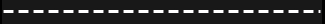

## 渲染矩形

矩形是使用最广泛的形状资源，因为`View`对象在屏幕上占据一个矩形空间（即使它们没有使用该空间的所有像素）。矩形形状包括拥有圆角的能力，每个角可以选择性地有不同的半径。

没有额外的样式信息，基本的矩形声明将渲染一个没有可见轮廓的填充黑色方块。然而，矩形更适合创建轮廓，可以用来单独吸引一个小部件的注意，或将一组小部件从屏幕上的其他所有小部件中隔离开来。一个简单的白色矩形边框可以通过将以下代码片段复制到名为`res/drawable/border.xml`的文件中构建：

```kt
<shape 
       android:shape="rectangle">

    <stroke android:width="2dip" android:color="#ffffffff" />
    <padding android:top="8dip"
             android:left="8dip"
             android:bottom="8dip"
             android:right="8dip" />

</shape>
```

这个形状中的填充元素将导致任何使用它的`View`对象将其填充大小增加`8dip`。这将阻止小部件的内容与形状资源渲染的边框相交。

# 动手时间——创建圆角边框

矩形形状也可能对其角进行圆滑处理，以形成一个圆角矩形。圆角矩形对于设置按钮样式或创建更干净的边框非常有用。

1.  在`res/drawable`目录中创建一个名为`rounded_border.xml`的新形状资源 XML 文件，并在编辑器或 IDE 中打开此文件。

1.  将文件的根元素声明为`矩形形状`：

    ```kt
    <shape 
           android:shape="rectangle">
    ```

1.  将矩形描边设置为`2dip`宽，颜色为白色：

    ```kt
    <stroke android:width="2dip" android:color="#ffffffff" />
    ```

1.  使用`8dip`的空白空间填充矩形：

    ```kt
    <padding android:top="8dip"
                    android:left="8dip"
                    android:bottom="8dip"
                    android:right="8dip" />
    ```

1.  将角落曲线半径设置为`4dip`：

    ```kt
    <corners android:radius="4dip"/>
    ```

1.  关闭形状声明：

    ```kt
    </shape>
    ```

## *刚才发生了什么？*

要将你刚刚创建的圆角边框应用于`View`对象，你有几种不同的选项，最简单的是直接作为背景应用。为此，你可以像引用 drawable 目录中的任何其他图像文件一样引用该形状。之前，我们声明了一个`TitleStyle`并将其应用于包含单词`Header`的`TextView`。如果你将新的`rounded_border`应用于这个`TextView`，布局资源中的`TextView`声明可能看起来更像这样：

```kt
<TextView
        style="@style/TitleStyle"
 android:background="@drawable/rounded_border"
        android:layout_width="fill_parent"
        android:layout_height="wrap_content"
        android:text="Header"/>
```

另外，你也可以将此边框应用于`TitleStyle`，这样就会将新边框应用于分配了`TitleStyle`的每个小部件，这对于标题和标题小部件来说非常合适：

```kt
<style name="TitleStyle" parent="@android:style/TextAppearance">
    <item name="android:background">@drawable/rounded_border</item>
    <item name="android:textSize">25dip</item>
    <item name="android:textColor">#ffffffff</item>
    <item name="android:textStyle">bold</item>
    <item name="android:gravity">center</item>
</style>
```

这两种方法都会导致新小部件的渲染完全相同。实现的决定实际上取决于你试图达到的目标。样式是保持用于相同目的的不同小部件之间共性的最佳方式。

在`TextView`上使用上述样式将得到一个看起来很不错的标题小部件，如下所示：

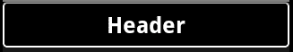

## 渲染椭圆

椭圆形正如其名所示——一个椭圆。椭圆形的使用比矩形更为受限，除非在其上绘制的组件最好由圆形或椭圆形边框，例如一个模拟时钟。也就是说，椭圆形，或者说圆形，在用户界面中作为图像使用非常有效。一个完美的例子就是通知用户他们是否连接到互联网，或者一个组件是否有效。出于这样的目的使用椭圆形与使用位图是相同的。然而，椭圆形可以根据用户的偏好进行缩放，而不会损失任何质量，而使用位图，你需要多个不同大小的位图图像来实现类似的效果（即便如此，一些位图可能还需要缩放）。

如果我们想要一个椭圆形来表示一个无效的组件（例如，当用户在选择密码时显示两个密码输入不匹配），那么最好是将椭圆形涂成红色。在以下代码片段中，我们以 XML 格式声明了一个带有灰色边框和红色填充的椭圆形：

```kt
<shape 
       android:shape="oval">

    <solid android:color="#ffff0000"/>
    <stroke android:width="1sp" android:color="#ffaaaaaa"/>
</shape>
```

在前面的例子中，我们使用 `<solid>` 元素以纯红色填充椭圆形，同时使用 `<stroke>` 元素为其围绕一个细的灰色轮廓。还要注意 `shape` 元素上没有尺寸设置。如之前所述，它们的尺寸是从它们被放置的宽度中继承的，可以作为背景，或者在 `ImageView` 的情况下，作为组件的内容。如果你想要将这个椭圆形放入 `ImageView` 中，你会在 `src` 属性中指定它，如下所示：

```kt
<ImageView
        android:src="img/oval"
        android:layout_width="8dip"
        android:layout_height="8dip"/>
```

之前的代码对于作为一个组件旁边的验证图标来说大小正合适，而将图标放大或缩小就像改变 `ImageView` 的宽度和高度一样简单。如果你使用 `wrap_content` 作为 `ImageView` 的大小，它将被设置为零像素乘零像素，实际上会从屏幕上消失。

下面是同一个椭圆形四种不同大小的截图，每一个都是前一个的两倍大小（从左边的 8x8 dip 开始）：

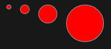

# 动手实践——给椭圆形应用渐变

之前的截图显示，虽然椭圆形看起来还可以，但当它被组成默认安卓工具包的渐变绘制组件包围时，它不会非常吸引人。为了让这个小椭圆形更好地融入，它需要看起来更像一个球，这需要应用一个简单的径向渐变。

1.  在 `res`/`drawable` 目录中创建一个新的形状资源 XML 文件，命名为 `ball.xml`，并在编辑器或 IDE 中打开这个文件。

1.  将文件的根元素声明为 `oval`：

    ```kt
    <shape 
           android:shape="oval">
    ```

1.  与其声明一个 `solid` 颜色作为填充，不如声明一个从浅灰色开始到红色结束的 `gradient` 填充：

    ```kt
    <gradient android:type="radial"
                  android:centerX="0.5"
                  android:centerY="0.25"
                  android:startColor="#ffff9999"
                  android:endColor="#ffff0000"
                  android:gradientRadius="8" />
    ```

1.  在 `stroke` 元素中定义椭圆形的细浅灰色轮廓：

    ```kt
        <stroke android:width="1sp" android:color="#ffaaaaaa"/>
    ```

1.  结束形状声明：

    ```kt
    </shape>
    ```

## *刚才发生了什么？*

不幸的是，径向渐变的受影响半径不会随图像的其他部分一起缩放，当你将图像放大到较大尺寸时，渐变区域会变得非常小。在这种情况下，效果就是最小的图像看起来很棒，而较大的版本看起来则很糟糕。在撰写本书时，还没有直接的方法来解决这个限制。相反，如果你想要使用径向渐变，需要将椭圆形的大小与`ImageView`的大小绑定起来。

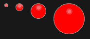

## 渲染环

`ring`形状在渲染上也是圆形的，但它与椭圆形形状的目的非常不同。虽然椭圆形形状的内容区域是轮廓空间内的所有内容，但环形状的内容区域是一个圆圈。

下图说明了两种形状之间的逻辑差异：

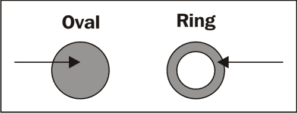

`ring`形状也有两个轮廓，一个在外部，另一个在内部（如前图所示）。将这一点与填充环内容区域的能力结合起来，你就有了用于进度旋转器（默认的 Android 不确定进度旋转器就是用环构建的）的完美形状。

# 动手操作——渲染一个旋转环

默认情况下，形状会假设它作为`LevelListDrawable`的一部分被使用，除非你禁用这个行为，否则可能不会出现。你通过在形状元素上指定`useLevel`属性为`false`来实现这一点。如果你不禁用这个功能，环可能无法正确渲染，或者根本不会渲染。

1.  在`res/drawable`目录中创建一个新的形状资源 XML 文件，命名为`spinner.xml`，并在编辑器或 IDE 中打开这个文件。

1.  将文件的根元素作为`ring shape`开始：

    ```kt
    <shape 
           android:shape="ring"
    ```

1.  `ring`形状需要在`shape`声明中设置其相对厚度：

    ```kt
           android:innerRadiusRatio="3.2"
           android:thicknessRatio="5.333"
    ```

1.  通过关闭`useLevel`功能来完成`shape`声明：

    ```kt
           android:useLevel="false">
    ```

1.  声明一个在椭圆形中心居中的`sweep`渐变：

    ```kt
        <gradient android:type="sweep"
                  android:useLevel="false"
                  android:startColor="#ffaaffff"
                  android:centerColor="#ff0000ff"
                  android:centerY="0.50"
                  android:endColor="#ff0000ff"/>
    ```

1.  用细白边框勾勒出`ring`：

    ```kt
        <stroke android:width="1sp" android:color="#ffffffff"/>
    ```

1.  结束`shape`声明：

    ```kt
    </shape>
    ```

## *刚才发生了什么*

扫描渐变是径向渐变的另一种形式。它不是从图像中心向外扩展，而是像时钟的指针一样在圆圈中扫描。

左侧的图像是一个用`sweep`渐变填充的矩形；而右侧的图像是`ring`形状。如你所见，这两个效果非常不同。右侧的图像基于 Android 1.6 用于不确定旋转指示器的图像。

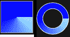

## 定义图层

到目前为止，我们仅将形状定义为单一元素的图像。可以将这些形状组合成更复杂的图像。这些图像以图层的形式组合在一起，这是一种常用的图形结构。在 Android 中，这是通过`layer-list`结构完成的。`layer-list`不是一种形状类型，但它是一个`Drawable`结构，这意味着它可以替代普通的位图图像。

分层图像资源不仅限于与我们前面讨论过的形状等矢量`Drawable`结构一起使用。分层的`Drawable`对象也可能包括一些位图图像图层，或任何其他可以定义的`Drawable`类型。

对于`layer-list`中的每一层，你需要定义一个`<item>`元素。`item`元素用于声明可选的元信息，如图层的 ID（这可以在你的 Java 代码中用于检索该图层的`Drawable`对象）。你还可以在`item`元素中声明图层的位置偏移或内边距。虽然你可以将图层作为外部的`Drawable`资源引用，但你也可以在`<item>`元素内内联`Drawable`对象，从而允许你在单个文件中组合各种不同的`Drawable`结构。

### 提示

**调整你的图层大小**

`layer-list`中的第一个`<item>`将根据其所在的组件大小进行调整。所有其他图层将被调整为它们的“自然”大小。对于位图图像，这是它渲染的大小。对于`<shape>`元素，自然大小是 0x0。为了指定`<shape>`的“自然”大小，你需要为`<shape>`提供一个带有`android:width`和`android:height`属性的`<size>`子元素。

如果你想让一个双层图像充当一个大的绿色按钮，你可能会声明一个灰色圆角矩形的图层作为背景，再声明一个绿色椭圆形的图层，使其看起来像是在灰色背景上的一个光点或球体。这样的`layer-list`可能看起来类似于以下的代码片段：

```kt
<layer-list >
    <item>
        <shape android:shape="rectangle" android:useLevel="false">
            <stroke android:width="1dip" android:color="#ffffffff" />

            <gradient android:type="linear"
                      android:angle="90"
                      android:startColor="#ffaaaaaa"
                      android:endColor="#ffcdcdcd" />

            <padding android:top="8dip"
                     android:left="8dip"
                     android:bottom="8dip"
                     android:right="8dip" />

            <corners android:radius="4dip" />
        </shape>
    </item>
    <item>
        <shape android:shape="oval" android:useLevel="false">
            <size android:width="32dip" android:height="32dip" />
            <gradient android:type="radial"
              android:centerX="0.45"
              android:centerY="0.25"
              android:startColor="#ff1a4e1a"
              android:endColor="#ff1ad049"
              android:gradientRadius="32" />
        </shape>
    </item>
</layer-list>
```

在前面的代码片段中，只有`shape`图层，但你可以轻松地通过在`<item>`元素中引用位图资源，来添加一个位图图层，如下面的代码片段所示：

```kt
<item android:drawable="@drawable/checkmark"/>
```

# 使用九宫格图像进行拉伸

有时你想要一个比简单线条更复杂的边框，例如，如果你想添加阴影。在网页上，你通常会找到各种 HTML 技巧，将八张或九张图片插入一个盒子中，以便在保持边框完整的同时缩放内容。在 Android 中，这种技术称为“九宫格”图像，因为它由九个不同的部分组成。在 Android 中，当九宫格图像以大于其原始尺寸的大小渲染时，会特别处理。为了将这些图像标识为特殊的，它们有一个`.9.png`扩展名（必须是有效的`PNG`文件）。

九宫格图像将边框和背景结合在单一图像中。当内容变得过大而无法适应图像时，背景区域将会扩大，图像的边框区域也会被缩放，以避免留下“空洞”。

从概念上讲，你可以从以下图表所示的九宫格图像开始思考：

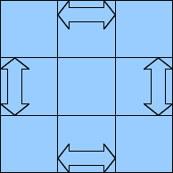

图中的箭头指出了根据中心“内容”区域大小而变大的概念性“边界”区域。九宫格图像的角落将完全不受任何缩放的影响。

## 创建九宫格图像

要创建九宫格图像，你需要一个像样的图像编辑应用程序。我个人使用**Gimp**应用程序（在[`www.gimp.org`](http://www.gimp.org)免费提供），尽管你可能更喜欢使用其他应用程序。无论你使用什么应用程序，它都必须能够输出**Portable Network Graphics** (**PNG**)文件，并且还应该能够放大到相当高的程度。九宫格图像中的所有数据实际上都编码在图像文件中，这意味着不需要 XML 文件来告诉 Android 图像的哪些部分是边框区域，哪些部分在缩放时不应受到影响。

与网页上出现的 CSS 盒子不同，Android 中对九宫格图像的大小调整是通过最近邻缩放完成的。**最近邻缩放**并不试图以任何方式改善缩放图像的质量，像素只是变成了更大颜色块。这对于渐变内容背景来说效果很好（只要它们没有被强制变得过大），但它可能导致你的图像出现一些奇怪的艺术效果。由于当前在缩放过程中没有进行颜色插值，某些效果在缩放时可能看起来相当奇怪。缩放也比简单的图像复制耗时更长，因此在调整图像大小时请记住这一点，它可能需要比你想象的要大得多。然而，这也意味着九宫格图像比你在网上可能了解的图像要灵活得多。

下面的两张图像是同一 32x32 像素九宫格图像的放大版本：

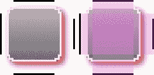

左侧的图像是原始的 PNG 文件，可用作九宫格图像。右侧的图像是同一图像的一部分被突出显示，以展示哪些区域将被缩放。顶部、底部左侧和右侧的区域将仅水平或垂直缩放，而中心区域将被拉伸以适应内容的大小。以下图像是作为`TextView`对象的背景使用的同一图像：

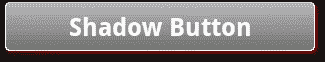

那么，图像左侧和顶部上的黑色线条告诉安卓系统要缩放图像的哪些部分，但右侧和底部的线条表示什么呢？这两条线决定了如何放置小部件内容的位置，类似于`<shape>`资源中的`<padding>`元素。

为了了解你的九宫格图像将如何渲染以及可能的缩放方式，安卓系统在 Android SDK 安装的`tools`目录中提供了一个实用工具。`draw9patch`工具将你的九宫格图像渲染成各种形状和大小，并允许你在将图像用于应用程序之前有效地调试图像。

# 在安卓中使用位图图像

图像是塑造你的应用程序风格的重要组成部分。它们用于图标、边框、背景、标志等许多其他用途。安卓系统尽力确保你使用的资源图像能在安卓设备上的不同类型屏幕上尽可能好地渲染。

安卓系统对图片的自动处理远非完美。然而，有时你需要为应用程序提供同一图像的多种不同变体，以使其在各种不同的设备上看起来都正确。

## 处理不同的屏幕尺寸

在安卓中处理任何位图图像时，非常重要的一点是要考虑到你的应用程序将在各种不同大小和密度的屏幕上运行。在非常大的屏幕（如在笔记本电脑或平板电脑上找到的屏幕）上工作時，你需要使用比在非常小的屏幕上更大的图像。虽然九宫格图像在很大程度上简化了事情，但它们仍然使用最近邻算法进行缩放，这可能会在比你预期更大的屏幕和字体大小上开始显现。

您可以在资源目录中提供不同大小的图片。对于每种屏幕尺寸，你可以提供不同的`drawable`目录。资源加载工具会自动从与当前设备配置最接近的目录中选择文件。你不需要在每个目录中都有一份每种资源的副本，只需提供那些你希望有更合适替代品的资源。当尝试查找要加载的资源文件时，资源加载器会在匹配度较低的目录中回退查找。

安卓系统识别出与屏幕尺寸相关的五个重要参数。虽然你可以指定与屏幕上确切像素数相关的参数，但这不是一个好主意，因为你无法轻易地适应所有不同的屏幕尺寸。相反，最好坚持使用安卓系统提供的五个参数：

+   `small`

+   `medium`

+   `large`

+   `long`

+   `notlong`

前三个参数直接与屏幕尺寸相关，而后两个参数与屏幕是否为“传统”（如 VGA）格式或“宽屏”（如 WVGA）格式有关。这些参数可以以各种组合方式混合，例如：

+   `/res/drawable-small/`

+   `/res/drawable-medium-long/`

+   `/res/drawable-large-notlong/`

前面的例子都是有效的资源目录，可用于覆盖正常`drawable`目录中的文件。您不能组合相互矛盾的参数，例如：

+   `/res/drawable-small-large/`

+   `/res/drawable-long-notlong/`

在上述情况下，您将收到资源打包工具的错误信息。每当您处理位图图像时，考虑到这些尺寸参数很重要，因为有些设备的屏幕与默认模拟器显示的屏幕有很大不同。

## 处理不同的屏幕密度

**屏幕密度**通常指的是在给定物理空间内填充的像素数量（即每英寸点数或 DPI）。它还与屏幕上像素的大小有关。虽然大多数 Android 设备具有中等或高密度屏幕，但大量较便宜的设备使用相对低密度的屏幕。

这为什么会影响到九宫格和位图图像呢？同样的原因也影响到了字体渲染——密度越低，抗锯齿和阴影效果看起来越差。解释这个现象最好的方式是用图像来说明。在以下图片中，左边的是在高密度屏幕上显示的简单圆角矩形。右边的图片类似于在低密度屏幕上渲染的同一图像：

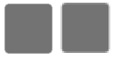

尽管这两张图片源自同一张图片，且以相同的物理尺寸渲染，但像素数量的减少使得在低密度屏幕上图像看起来变得块状。

以下两张图片是从右下角截取的，并放大以更详细地说明发生的情况：

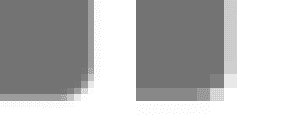

同样，这些图片被配置为占据相同的物理空间。如果图像的尺寸以屏幕像素指定，那么在低密度屏幕上它将占据更多的物理空间。这就是为什么推荐在 Android 中使用“密度独立像素”（`dp`或`dip`）单位而不是普通像素（`px`）单位来设置图像大小的一个原因。

与屏幕尺寸一样，Android 提供了一系列配置参数，可用于为不同屏幕密度的设备提供不同的资源。选择屏幕密度的参数可以与基于屏幕尺寸选择的参数混合使用。以下是 Android 提供的可用于根据当前设备的屏幕密度提供资源的参数列表：

+   `ldpi`：低密度屏幕（约 120dpi）

+   `mdpi`：中等密度屏幕（约 160dpi）

+   `hdpi`：高密度屏幕（约 260dpi）

+   `nodpi`：特殊情况

最后一个“特殊情况”可以在你有一个不希望根据设备密度缩放的九宫格图像或位图图像时使用。默认情况下，Android 会重新缩放图像，以尝试使图像的物理尺寸尽可能接近预期的尺寸。`nodpi` 目录中的图像不会被 Android 自动缩放，而是按像素对像素进行渲染。

### 提示

**不同密度的图标**

有时大尺寸的高分辨率图标并不能很好地缩小。在这些情况下，为低密度屏幕设计完全不同的图标通常是一个好主意。

# 处理配置变更

当你为 Android 提供与各种可能的硬件配置相关的不同资源目录时，资源加载器将尝试为运行你应用程序的设备匹配最佳的资源文件。然而，并非所有的配置参数都直接与硬件相关，而是描述设备状态或某些软件配置参数。这些参数的例子包括设备语言、网络 ID 和设备方向。这些参数可能会在应用程序运行时发生变化。最常见的例子就是设备方向。Android 有一个内置机制来为你处理这些变化，在大多数情况下，你不需要任何特殊的 Java 代码来处理这些变化。然而，至少为其中一些参数提供资源文件是非常可取的。

当配置参数发生变化时，Android 会将你的 `Activity` 状态存储在一个 `Bundle` 对象中，然后关闭 `Activity`。之后，系统会以新的配置参数启动 `Activity` 的新实例，并从 `Bundle` 对象中恢复状态。所有默认的 Android 控件都会在系统关闭你的 `Activity` 之前存储它们当前的状态。这意味着通常你不需要为配置变更执行任何特殊处理。

## 提供横屏布局

到目前为止，我们在这本书中只构建了竖屏布局。与桌面或网页系统不同，移动应用程序的默认方向是竖屏（因此配置参数是 `long` 和 `notlong` 而不是 `wide` 和 `narrow`）。拥有 Android 平台的好处之一是它必须包含加速度计这一硬件，这意味着你的应用程序可以响应设备的方向。得益于 Android 的配置处理（如前所述），作为开发者的你除了提供替代的横屏布局资源外，不需要做任何事情，假设你没有在 Java 中构建用户界面的大部分内容。为了提供特定于竖屏或横屏方向的布局，你可以将布局的特定版本的 XML 资源放置在以下配置参数配置的目录中：

+   `port`：针对竖屏的布局

+   `land`：特定于横向的布局

当屏幕竖向比横向长（即肖像模式）时，使用一个简单的垂直方向的`LinearLayout`来布局一个输入表单是非常有意义的。你所使用的任何输入控件都会被放置在它们标签的下方，因此它们有更多的水平空间来显示数据。额外的水平空间使得标签可以包含更多信息。

下图展示了这两种布局概念之间的区别：

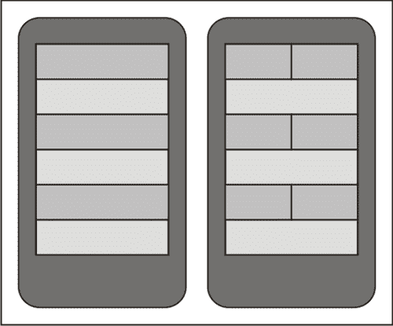

右侧使用的布局方法在网页或桌面系统中非常常见，如果标签和输入控件的大小足够小，在移动设备上也会工作得很好。

当切换到横向模式时，水平空间的显著增加和垂直空间的巨大损失使得垂直`LinearLayout`成为一个糟糕的选择。如果你正在处理一个简单的输入表单，那么横向布局应该使用`TableLayout`或`RelativeLayout`来将标签放置在与它们相关的输入控件同一行上。

## 在横向布局上提供文本输入

在构建你的横向布局时，你需要仔细考虑用户界面的哪些部分最重要。如果屏幕被用来编写电子邮件或文档，你的横向布局可能与纵向布局几乎相同。然而，这样的布局有一个几乎隐藏的敌人：软件键盘。在纵向布局中，软件键盘会限制在屏幕底部，并占用相对较小的空间（大约四分之一到三分之一的可用屏幕空间）。然而，在横向布局中，软件键盘可能会占用你一半的垂直屏幕空间，使得构建以内容为中心的横向布局变得非常困难。如果你的布局是强烈以输入驱动的，那么在横屏模式下移除用户界面的一部分，或者重新设计用户界面，使得软件键盘不会妨碍，可能是合理的。

安卓提供了一系列的配置参数，可以告诉您关于运行您应用程序设备上的键盘信息。在构建应用程序时考虑所有可能性是一个好主意。以下是应用程序可能面临的一些可能的键盘情况简短列表：

+   只有软件键盘

+   硬件键盘

+   硬件键盘可用；软件键盘在使用中

除了这些可能性，屏幕较小的设备通常会使用 12 键键盘而不是全 QWERTY 键盘。如果这是软件键盘（通常是这种情况），键盘可能占用高达 80%的屏幕空间。当用户激活文本输入框时，Android 通常会通过打开“文本输入”屏幕来处理这个问题。你可以通过以下配置参数确定键盘的可使用状态和使用的键盘类型：

+   `nokeys`：仅限软件键盘

+   `qwerty`：可以使用完整的硬件键盘

+   `12key`：可以使用 12 键硬件手机键盘

+   `keysexposed`：用户可以看到键盘，无论是硬件还是软件的

+   `keyshidden`：当前没有任何键盘可见

+   `keyssoft`：用户将使用软件键盘（尽管它可能不可见）

在设计屏幕时，请考虑软件键盘可能占用你一半的垂直空间。确保内容区域可以滚动，而重要的控件将始终在屏幕上可见。如果一个聊天应用程序简单地被包裹在`ScrollView`中，当软件键盘可见时，输入`EditView`对象可能会变得不可见。考虑屏幕的外观不仅仅是如何，还要考虑它将如何应对用户可能带来的变化。最后，测试屏幕在有无软件键盘的情况下看起来和表现如何是至关重要的。

## 更改屏幕内容

Android XML 布局格式的一大优势是它提供的解耦。竖屏和横屏布局通常彼此差异很大，用户可能会分别找到一个更喜欢的方向来使用你的应用程序。在设计新布局时，一个不太常见但有用的技巧是能够从两个不同的布局中添加或删除“非功能性”元素。

在一个简单的例子中，你可能想要在竖屏布局中缩写标签文本，并包含一些图标作为图形提示，而在横屏布局中，你可能希望图标大小加倍并使用两行标签，所有这些都位于输入字段同一行。

下图阐述了这一概念：

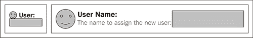

在前述图表的横屏布局中，你可以使用额外的`TextView`元素来显示标签的子文本。假设你的 Java 代码没有寻找额外的`TextView`对象，你的应用程序将完美运行。在设计`Activity`的替代布局时，能够更改用户界面的实际结构而不仅仅是布局，这是一个非常重要的考虑因素。

# 总结

应用程序的外观和感觉至关重要。对颜色或字体的一次更改就可能会影响屏幕的可用性。同时，过度设计应用程序可能会让它在使用者的设备上显得不协调。一个陌生的外观和感觉会将用户从该应用程序推向那些看起来和感觉更熟悉和舒适的应用程序。

Android 使用样式资源结构提供了一系列极其强大的功能。结合将你的图形放置在资源文件中并覆盖默认值的能力，你可以有效地重新设计任何小部件。使用样式也有助于维护你的应用程序，因为你只需要在样式资源中更改样式，而不是在每个特定样式的部件声明中进行更改。

将你的大部分小部件图形作为 `<shape>` 资源，将确保你的应用程序具有尽可能一致的外观和感觉。然而，这并不总是实用的。当你需要提供位图资源时，为用户可能使用的各种屏幕尺寸和密度提供不同的图像至关重要。

应用程序的风格设计还包括布局以及应用程序适应其运行设备的能力。拥有一个伟大的想法仅是应用程序吸引力的的一半，其风格和执行对它在“野外”的生存至关重要。关注细节是一个强大的工具，将吸引用户使用你的应用程序。那些“即开即用”的应用程序总是比那些需要时间和精力才能使用的应用程序更受欢迎。

利用 Android 模拟器提供的各种屏幕尺寸和密度，以确保你的应用程序能在尽可能多的设备上看起来良好。不要忘记，许多设备没有硬件键盘，而且软件键盘可能会占用你屏幕空间的一半。

在下一章中，我们将把这种样式知识扩展到应用程序的整体设计和主题。我们将构建一个具有许多提供布局的样式化应用程序，并进行相当广泛的样式设计。
