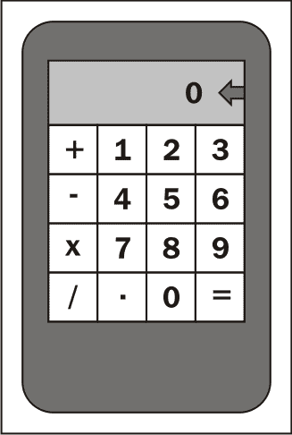
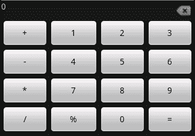
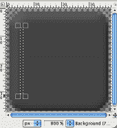
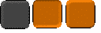
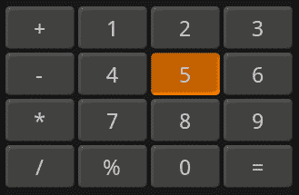
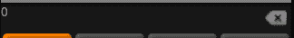
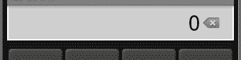
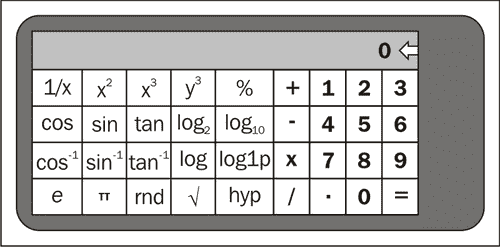
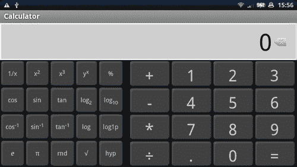
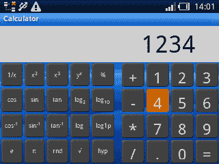

# 第十章：构建应用程序主题

*无论是否涉及图形样式，每个应用程序都有一个主题。应用程序的主题使其具有独特的外观和逻辑。*

当用户使用移动应用程序（大多数安卓设备的情况）时，与台式机或笔记本电脑相比，他们的行为有一些根本性的不同：

+   他们通常在应用程序上的时间更少，因此耐心也更小

+   他们通常一次只专注于一个应用程序

+   触摸屏设备鼓励用户进行近乎触觉的交互响应

安卓设备种类繁多，几乎兼容所有设备，包括常见的手机、平板、笔记本电脑，甚至一些桌面电脑。一个安卓应用程序预期在这些环境中都能良好运行，应用的主题应精心构建，以便用户在各种设备上获得最佳访问体验。

设备界面构成了你的应用程序主题的一部分。在台式机或笔记本电脑上使用鼠标时，仅考虑触摸屏的用户界面可能对用户来说会显得过大（因为所有控件都需要适合手指大小）。相反，为鼠标驱动的系统设计的应用程序通常会包含悬停效果，这在触摸屏设备上无法正常工作。确保你的应用程序在所有这些不同设备上都能正常工作的唯一方法是，在构建应用程序屏幕时考虑所有这些环境。

安卓自身定义了一种主题，尽可能的话，为安卓平台构建的应用程序应尝试符合或扩展这一主题，而不是重新定义。这并不意味着你的应用程序必须看起来和行为与其他所有安卓应用程序完全相同，但你的应用程序应该基于安卓所设定的基本原则。

### 注意

请记住，许多设备制造商对基本的安卓主题定义了额外的部分，你的应用程序也应如此。

在本章中，我们将探讨应用程序的构建，包括屏幕设计、构建和样式设计。我们还将研究此应用程序如何与各种不同设备交互，确保其外观和功能符合用户预期。我们将构建一个计算器应用程序，包含标准计算器和科学计算器功能。计算器将设计得更像物理计算器而非普通的安卓应用，并根据运行设备的性能调整其功能。总体而言，我们将定义一个具有自身一致主题的应用程序。

# 创建基本的计算器布局

要构建这个项目，我们首先需要一个标准的计算器的基本纵向布局。这个基本布局将作为用户首次启动应用程序时所看到的屏幕。鉴于计算器应用程序的性质以及用户对它的感知，屏幕简单且应用程序启动越快越好，这一点非常重要。

### 提示

计算器屏幕占据所有可用空间的功能性组件非常重要，以使其尽可能快地使用（更大的按钮等于更容易使用）。

## 小测验

1.  布局资源何时变成 Java 类？

    1.  当运行资源处理器时

    1.  当应用程序包被构建时

    1.  当布局资源被加载时

    1.  从不

1.  你如何引用那些在 Android 中默认未定义的小部件？

    1.  通过使用完整的类名作为元素名称

    1.  通过为 Java 包定义一个 XML 命名空间

    1.  目前不可能

    1.  通过在 `android:package` 属性中指定 Java 包名

1.  一个 `View` 对象的默认宽度和高度是什么？

    1.  它内容的大小

    1.  零像素

    1.  它取决于它所在的 `ViewGroup`

    1.  它父级的宽度和内容的高度

1.  你将布局资源写成 XML，它以什么格式存储？

    1.  作为原始 XML 文本

    1.  Android 二进制 XML

    1.  布局特定的二进制格式

    1.  Java 类

## 设计一个标准计算器

在开始构建计算器应用程序之前，最好先勾勒出它将是什么样子。这将帮助你决定如何确切地构建屏幕。由于计算器既是一个相当古老发明的东西，也是人们非常熟悉的东西，因此遵循最常见的设计非常重要。如果你推出的计算器对人们来说太陌生，他们可能没有耐心去“了解”你的应用程序。新想法是好的（即滑动键盘），但最成功的还是现有想法的延伸。同时，要向用户明确它们的工作方式。以下是我们将开始构建的标准计算器屏幕的区块图：



我们要最大化利用屏幕空间，因此我们会尽可能使按钮变大。同时，我们希望按钮之间稍微留点空隙，以避免用户不小心按下不想按的按钮。由于我们只有一个输出区域，我们会确保显示区域也足够大。

显示区域中的箭头将是一个图标，作为*退格*按钮，允许用户删除不需要的内容。给用户提供一种撤销操作的方法始终很重要。我们将使用与拨号应用中类似的图标，这将保持与系统的其他部分的整体一致性。这也有效地为我们提供了额外按钮的空间。这个用户界面不包括许多计算器所关联的常规“记忆”功能。基本屏幕设计得尽可能简单，我们将在开发应用程序时引入更多功能。

# 动手操作——构建标准计算器

计算器的第一个布局将由一系列正常的**0**至**9**的按钮组成，以及用于各种基本算术运算的按钮——加、减、乘、除。它还将包括等于号按钮和小数点按钮。尽管在 Java 代码中构建这样一个简单的屏幕非常容易，但我们将完全使用 XML 资源来构建这个示例。由于这个应用程序将具有相同屏幕的几种不同排列组合，使用不带 Java 代码的布局资源文件将使你的生活更加轻松。

1.  首先，为计算器创建一个新项目：

    ```kt
    android create project -n Calculator -p Calculator -k com.packtpub.calculator -a CalculatorActivity -t 3
    ```

1.  打开标准的主体布局文件`/res/layout/main.xml`。

1.  从文件中删除生成的布局结构。

1.  首先，声明一个垂直的`LinearLayout`作为根元素，以占据屏幕上所有可用空间：

    ```kt
    <LinearLayout

        android:orientation="vertical"
        android:layout_width="fill_parent"
        android:layout_height="fill_parent">
    ```

1.  声明一个`RelativeLayout`，它将由显示和用户可以用来删除不需要输入的**删除**或**取消**按钮组成：

    ```kt
    <RelativeLayout android:layout_width="fill_parent"
                    android:layout_height="wrap_content">
    ```

1.  在`RelativeLayout`的右侧使用`ImageView`显示标准的 Android 输入删除图标：

    ```kt
    <ImageView android:id="@+id/delete"
               android:src="img/ic_input_delete"
               android:layout_centerInParent="true"
               android:layout_alignParentRight="true"
               android:layout_width="wrap_content"
               android:layout_height="wrap_content"/>
    ```

1.  在`RelativeLayout`的左侧，创建一个`TextView`，它将实际显示计算器的数字状态：

    ```kt
    <TextView android:id="@+id/display"
              android:text="0"
              android:layout_alignParentTop="true"
              android:layout_toLeftOf="@id/delete"
              android:layout_width="fill_parent"
              android:layout_height="wrap_content"/>
    ```

1.  在`LinearLayout`内部，声明一个`TableLayout`，用于包含简单计算器的按钮输入：

    ```kt
    <TableLayout android:id="@+id/standard_functions"
                 android:layout_width="fill_parent"
                 android:layout_height="fill_parent"
                 android:layout_margin="0px"
                 android:stretchColumns="0,1,2,3">
    ```

1.  `TableLayout`将由四个`TableRow`对象组成。声明第一个对象，无边距且`layout_weight`为`1`：

    ```kt
    <TableRow android:layout_margin="0px"  
              android:layout_weight="1">
    ```

1.  右上角的`Button`对象需要是`plus`符号，我们也将其用作`Button` ID 的名称：

    ```kt
    <Button android:id="@+id/plus"
            android:text="+"/>
    ```

1.  第一行接下来的三个`Button`对象将是数字**1**、**2**和**3**。这些也需要 ID：

    ```kt
    <Button android:id="@+id/one"
            android:text="1"/>
    <Button android:id="@+id/two"
            android:text="2"/>
    <Button android:id="@+id/three"
            android:text="3"/>
    ```

1.  继续按块状图定义的顺序声明带有按钮的`TableRow`对象。

1.  在编辑器或 IDE 中打开`CalculatorActivity.java`源文件。

1.  在`onCreate`方法中，确保将`Activity`的内容视图设置为刚才定义的`main`布局：

    ```kt
    setContentView(R.layout.main);
    ```

## *刚才发生了什么？*

现在你应该已经为计算器创建了一个基本用户界面；尽管它仍然看起来像一个非常通用的 Android 应用程序，但这至少是从基础层面开始的。用户界面需要做一些样式设计工作，包括着色和一些字体更改，但基本结构现在已经完成。使用`RelativeLayout`是为了确保我们可以正确地将删除图标定位在`TextView`的右侧，无论屏幕大小如何。

为了让按钮尽可能占用可用空间，我们告诉`TableLayout`拉伸其所有列。如果`TableLayout`不拉伸其列，那么它将只占用其子项所需的水平空间（实际上与`wrap_content`宽度相同）。尽管告诉`TableLayout`也占用所有垂直空间，但其子项将根据它们所需的空间进行大小调整，这就是为什么按钮没有占用所有可用屏幕空间的原因。以下图像是基本计算器在模拟器中运行时的截图：



# 构建计算器样式。

我们真的希望这个计算器看起来更像一个真正的计算器，为此我们需要应用一些样式。目前计算器的主题完全是标准的 Android 主题，尽管它看起来与 Android 系统的其他部分完全一样，但它并不真正适合这个应用程序。我们希望对按钮和应用程序的显示区域进行样式设计。我们将在资源文件中定义样式值，并在布局 XML 文件中引用这些样式。

首先，我们将定义一系列九宫格图像来创建我们自己的按钮设计。为此，我们需要三张不同的图片。第一张是按钮的“正常”状态，第二张是按钮的“按下”状态，最后是按钮的“聚焦”状态。

## 小测验。

1.  九宫格图像边缘周围的黑色线条是做什么的？

    1.  提供给系统关于图像中哪些部分需要复制的提示。

    1.  指示图像中哪些部分需要缩放以及小部件内容放置的位置。

    1.  定义图像中包含元信息的内容部分。

1.  九宫格图像可以存储为什么格式？

    1.  JPEG、GIF 或 PNG 图像文件。

    1.  嵌入 TIFF 的 XML 文件。

    1.  可移植网络图形图像（Portable Network Graphic image）。

1.  `draw9patch`应用程序是做什么的？

    1.  在各种形状和大小中渲染九宫格图像。

    1.  这是一个用于绘制九宫格图像的应用程序。

    1.  为九宫格图像生成元数据作为 XML 文件。

# 动手操作——创建按钮图像。

为了在本节中构建按钮图像，你需要下载“GIMP”（可在[`www.gimp.org`](http://www.gimp.org)获取）。它非常适合这种图像创建或操作，而且它还有一个开源的优势。

1.  打开“GIMP”，选择**文件** | **新建**以创建新图像。

1.  将宽度和高度更改为`38x38`像素。

1.  打开**高级选项**并将**填充为**选项更改为**透明**，这样就没有背景色了。

1.  为了帮助调整大小，放大至大约**800%**。

1.  在工具箱左上角选择**矩形**工具（默认快捷键是*R*）。

1.  启用**圆角**选项并将其设置为`5`。

1.  启用**固定**选项，并在下拉列表中选择**大小**。

1.  输入`36x36`作为矩形选择的固定大小。

1.  将选择框放在图像画布中心，选择框和图像边缘之间应该有一个单像素的边界。

1.  双击工具箱中的“前景色”（默认为黑色）。

1.  在颜色选择器的**十六进制表示**框中输入`444444`。

1.  关闭颜色选择器对话框。

1.  在工具箱中选择**桶填充**工具（默认快捷键是*Shift-B*）。

1.  在选择框内部点击，用选定的颜色填充它。

1.  使用**选择**菜单，点击**无**选项以移除选择框。

1.  选择**滤镜** | **装饰** | **添加斜角**。

1.  将**厚度**选项更改为`3`。

1.  取消勾选**在副本上工作**选项，并点击**确定**按钮。

1.  再次从工具箱中选择**矩形**工具。

1.  取消勾选**圆角**和**固定**选项。

1.  使用选择工具在“按钮”形状内部选择一个单像素宽的垂直框，小心只选择按钮内容区域的一部分，避开斜角边框空间：

1.  将光标放在选择框中间，将选择框水平拖动至图像画布边缘（在单像素边界内）。

1.  再次双击“前景”矩形。

1.  将颜色重置为纯黑色。

1.  选择**桶填充**选项。

1.  在选择框内部点击，创建一个单像素宽，黑色的垂直线条在图像左侧。

1.  在图像右侧创建一个类似的垂直线条。

1.  在图像的顶部和底部创建一个单像素高的水平黑色线条。

1.  在你的`res/drawable`目录中将图像保存为`button.9.png`，保持 PNG 选项为默认值。

1.  重复上述过程，将前景色`444444`更改为如步骤 11 中的`c16400`，并将新的图像保存为`button_focus.9.png`。

使用**翻转工具**（默认快捷键*Shift* + *F*）翻转图像，你将创建`button_down.9.png`图像。

## *刚才发生了什么？*

虽然构建图像有许多步骤，但使用正确的工具并进行一些实验，它们本质上非常容易创建。如果你只需要一个简单的按钮或类似的东西，那么找一些关于如何使用“GIMP”或类似工具的教程是很有价值的。以下链接有一些在线教程：

+   [`www.gimp.org/tutorials/`](http://www.gimp.org/tutorials/)

+   [`gimp-tutorials.net/`](http://gimp-tutorials.net/)

你在上一个部分保存的图像应该看起来像我为我的计算器应用程序创建的以下图像：



# 动手时间——美化计算器按钮

接下来我们需要做的是使用选择器列表和你刚刚创建的九宫格图像来设置计算器按钮的样式。我们还将定义按钮样式在资源文件中，这样我们就不必为每个按钮指定所有的样式。为了用我们创建的图像替换标准按钮，我们只需要用我们创建的背景替换它的背景。

1.  在`res/drawable`目录中，创建一个名为`button.xml`的新 XML 文件，并在编辑器中打开它。

1.  将文件的根元素定义为一个固定大小的选择器：

    ```kt
    <selector

        android:constantSize="true"
        android:variablePadding="false">
    ```

1.  创建一个被按下的按钮状态，作为选择器的第一个子项：

    ```kt
    <item android:state_pressed="true" 
          android:drawable="@drawable/button_down"/>
    ```

1.  选择器的第二个子项应该是获得焦点状态：

    ```kt
    <item android:state_focused="true"
          android:drawable="@drawable/button_focus"/>
    ```

1.  选择器的最后一个子项是通用的，是正常状态：

    ```kt
    <item android:drawable="@drawable/button"/>
    ```

1.  在`res/values`目录中创建一个名为`styles.xml`的新文件，并在编辑器中打开它。

1.  `styles.xml`文件的根元素应该是一个没有命名空间声明的资源元素（在这个文件中不需要）：

    ```kt
    <resources>
    ```

1.  在文件中定义第一个样式为`CalculatorButton`，其父样式为默认的 Android `Button`小部件样式：

    ```kt
    <style name="CalculatorButton"
           parent="@android:style/Widget.Button">
    ```

1.  将文本大小设置为一种美观的大字体和浅灰色：

    ```kt
    <item name="android:textSize">30sp</item>
    <item name="android:textColor">#ffcacaca</item>
    ```

1.  将样式的背景指定为新的`button`可绘制资源：

    ```kt
    <item name="android:background">@drawable/button</item>
    ```

1.  在每个`Button`小部件周围创建一个两像素的边框，以创建一点间距：

    ```kt
    <item name="android:layout_margin">2dp</item>
    ```

1.  确保让`Button`小部件消耗它们可用的所有垂直空间：

    ```kt
    <item name="android:layout_height">fill_parent</item>
    ```

1.  在编辑器中打开`main.xml`布局资源。

1.  在每个`Button`元素上，添加一个样式属性，以赋予你刚刚在`styles.xml`文件中定义的样式：

    ```kt
    <Button style="@style/CalculatorButton"
            android:id="@+id/multiply"
            android:text="*"/>
    ```

## *刚才发生了什么？*

我们刚刚为计算器屏幕重新设计了`Button`对象。这个样式是标准 Android `Button`小部件的子样式。新的样式主要是通过将背景图像更改为我们之前创建的九宫格图像来驱动的。为了与新的背景图像一起工作，我们还指定了字体颜色和大小。运行时，新的计算器用户界面将如下截图所示：



在原始代码中，没有指定按钮周围的边距，但在新代码中，我们在自定义样式中添加了明确的边距。我们的九宫格图像在内容区域周围没有填充。

你会注意到我们在布局中为每个`Button`小部件设置样式。正如在前一章中提到的，样式属性不是 Android 资源命名空间的一部分。不幸的是，Android 目前不允许我们为特定类的所有小部件设置样式。相反，我们只能选择为每个小部件单独设置样式，或者在`Activity`或应用程序中为所有小部件设置相同的样式。作为新`Button`样式的一部分，我们声明了一个`<selector>`资源的可绘制资源。与标签结构一样，`Button`对象可以被样式化为使用不同的可绘制资源来表示它们的不同状态。在这种情况下，我们为`Button`被聚焦、按下或处于正常状态时指定背景图像。样式只适用于背景图像，因为新`Button`对象的背景是`<selector>`资源。

# 行动时间——设置显示样式

目前，数字显示看起来确实相当糟糕。这主要是因为我们还没有为其设置任何样式，现在它只是一个普通的`TextView`对象。我们希望样式能够同时涵盖`TextView`对象和`ImageView`。当前的显示效果如下截图所示：



为了修复这个显示，并将其样式与我们的新`Button`样式保持一致，我们将创建两种不同的样式。一种是在`TextView`和`ImageView`对象周围创建边框和背景，另一种是用更合适的字体样式化`TextView`小部件。

1.  创建一个名为`display_background.xml`的新可绘制资源文件，并在你的编辑器或 IDE 中打开它。

1.  显示背景的根需要是一个矩形形状：

    ```kt
    <shape    

        android:shape="rectangle">
    ```

1.  声明一些内边距来缩进文本和图像：

    ```kt
    <padding
        android:top="5sp"
        android:bottom="5sp"
        android:left="15sp"
        android:right="15sp"/>
    ```

1.  为矩形创建一个纯灰背景色：

    ```kt
    <solid android:color="#ffcccccc"/>
    ```

1.  指定描边大小，并将其颜色设置为白色：

    ```kt
    <stroke android:width="2px"
            android:color="#ffffffff"/>
    ```

1.  在你的编辑器或 IDE 中打开`res/values/styles.xml`文件。

1.  为显示包装器添加一个新的`<style>`项，并将新样式命名为没有父样式的`CalculatorDisplay`：

    ```kt
    <style name="CalculatorDisplay">
    Set the background as the display_background:<item name="android:background">
        @drawable/display_background
    </item>
    ```

1.  在显示包装器下方创建一个小边距：

    ```kt
    <item name="android:layout_marginBottom">25sp</item>
    ```

1.  在显示上方添加一些内边距：

    ```kt
    <item name="android:layout_marginTop">50sp</item>
    ```

1.  以名称`CalculatorTextDisplay`开始一个新的`<style>`元素，父样式应该是标准的`TextView`样式：

    ```kt
    <style name="CalculatorTextDisplay"
           parent="@android:style/TextAppearance">
    ```

1.  在新样式中，将字体设置为`45`像素，黑色等宽字体：

    ```kt
    <item name="android:typeface">monospace</item>
    <item name="android:textSize">45sp</item>
    <item name="android:textColor">#ff000000</item>
    ```

1.  计算器显示的文本应该是右对齐的，因此我们还将指定应用到`TextView`的重力属性：

    ```kt
    <item name="android:gravity">right</item>
    ```

1.  在你的编辑器或 IDE 中打开`res/layout/main.xml`文件。

1.  将`RelativeLayout`的样式指定为`CalculatorDisplay`：

    ```kt
    <RelativeLayout style="@style/CalculatorDisplay"
                    android:layout_width="fill_parent"
                    android:layout_height="wrap_content">
    ```

1.  设置显示的`TextView`样式：

    ```kt
    <TextView android:id="@+id/display"
              style="@style/CalculatorTextDisplay"
              android:text="0"
              android:layout_alignParentTop="true"
              android:layout_toLeftOf="@id/delete"
              android:layout_width="fill_parent"
              android:layout_height="wrap_content"/>
    ```

## *刚才发生了什么？*

新的样式适用于围绕`TextView`对象和`ImageView`对象的`RelativeLayout`。通过设置这个`RelativeLayout`的样式，你实际上将`TextView`和`ImageView`作为一个单一的小部件合并在一起。如果你看以下截图，你会看到这是如何为你的用户工作的：



`TextView`对象上下的边距会减少按钮可用的空间。在长垂直空间中，按钮通常会变长，看起来不成比例，因此通过为显示区域添加边距，我们可以帮助保持按钮更接近正方形。

## 尝试英雄——添加计算器逻辑

目前，我们有一个简单计算器的优秀用户界面。然而，它只是一个看起来很不错的用户界面。接下来要做的就是在其中添加一些逻辑。

以下是完成功能计算器所需的步骤：

1.  实现`OnClickListener`接口，并将其注册到用户界面上的每个`Button`小部件。

1.  创建一个新的`Calculator`类来处理实际的计算，并存储计算器的非用户界面状态。

1.  使用`StringBuilder`类实现当前输入值的构建和显示。

1.  使用`double`数据类型实现基本计算，以便处理带小数点的数字。

## 突击测验

1.  当从布局中选取字符串时，字符串是如何被选中的？

    1.  直接从根目录`values`字符串资源

    1.  从与布局相同的目录中的`strings.xml`文件

    1.  从与当前配置最接近匹配且包含请求名称字符串的`values`目录

    1.  从具有与布局资源文件选择相同的限定符的`values`目录

1.  放置样式资源的正确文件名是什么？

    1.  `values`目录中的任何文件

    1.  `styles.xml`

    1.  `values.xml`

    1.  `theme.xml`

1.  在 Java 代码中选取资源与从 XML 资源文件中选取资源有何不同？

    1.  Java 资源选择更快

    1.  XML 资源只能引用具有相同配置限定符集合的其他资源。

    1.  没有显著差异

    1.  XML 资源只能引用所有资源类型的一个子集。

# 科学景观布局

计算器的科学布局不仅仅是更多按钮的问题，因为当设备处于横屏方向时，我们希望使用此布局。这意味着我们可用的垂直空间大大减少，而标准布局占用了很多这样的空间。为了构建这个新的用户界面，我们不仅要定义一个新的布局资源，还要为新的布局添加额外的样式。

科学布局在其新按钮上也使用了更复杂的文本。一些数学函数，如平方根或反余弦，有特定的表示法应该被使用。在这些情况下，我们将需要使用 HTML 样式或特殊字符。幸运的是，Android 完全支持 UTF-8 字符集，在功能和字体渲染方面都支持，这使得这个过程变得容易得多。

## 为科学布局定义字符串资源

对于科学功能，我们将每个功能的字符串内容定义为一个资源字符串。这既是为了使它们成为资源选择过程的一个独立部分（这总是推荐的），同时也是为了让我们利用自动的 HTML 处理。如果你在字符串资源中使用 HTML，当使用 `Resources.getText` 方法访问时，资源处理器会自动解析该 HTML，而不是通常的 `Resources.getString` 方法。这正是 `TextView` 类加载其字符串资源的方式，使得将文本内容放在 `values` 资源文件中更具吸引力。

以下是我的 `values` 目录中 `strings.xml` 文件的内容。你会注意到这里的 HTML 标记是 HTML 3.2，而不是基于 HTML 4 的。这是因为 Android 的 `Html` 类不能处理 HTML 4 标记，而 `Html` 类实际上是用来加载包含标记的字符串资源的。在 `res/values` 目录中创建一个新的资源文件，命名为 `strings.xml`，并将以下代码片段复制到新文件中：

```kt
<resources>
    <string name="inverse">1/x</string>
    <string name="square">
        x<sup><font size="10">2</font></sup>
    </string>
    <string name="cube">
        x<sup><font size="10">3</font></sup>
    </string>
    <string name="pow">
        y<sup><font size="10">x</font></sup>
    </string>
    <string name="percent">%</string>

    <string name="cos">cos</string>
    <string name="sin">sin</string>
    <string name="tan">tan</string>
    <string name="log2">
        log<sub><font size="10">2</font></sub>
    </string>
    <string name="log10">
        log<sub><font size="10">10</font></sub>
    </string>

    <string name="acos">
        cos<sup><font size="10">-1</font></sup>
    </string>
    <string name="asin">
        sin<sup><font size="10">-1</font></sup>
    </string>
    <string name="atan">
        tan<sup><font size="10">-1</font></sup>
    </string>
    <string name="log">log</string>
    <string name="log1p">log1p</string>

    <string name="e"><i>e</i></string>
 <string name="pi">π</string>
    <string name="random">rnd</string>
 <string name="sqrt">√</string>
    <string name="hyp">hyp</string>
</resources>
```

`pi` 和 `sqrt` 字符串值中的 Unicode 十六进制值用于引用小写希腊字母 Pi 符号和标准的平方根符号。

## 设计科学布局的样式

标准计算器布局中使用的样式对于科学布局来说并不是很好。为了改变科学布局的样式，你可以将新样式添加到横屏布局的新 `values` 目录中。将以下代码片段复制到名为 `res/values-land/styles.xml` 的新文件中：

```kt
<resources>
    <style name="CalculatorDisplay">
        <item name="android:background">
            @drawable/display_background
        </item>
    </style>

    <style name="ScientificButton" parent="style/CalculatorButton">
        <item name="android:textSize">12sp</item>
    </style>
</resources>
```

前一个片段中的第一个样式资源用于计算器的显示区域。与标准计算器一样，我们使用本章前面编写的 `display_background` 形状。我们还为科学按钮定义了一种新样式。科学按钮将与标准计算器按钮完全相同，只是字体要小得多。由于科学按钮比标准按钮多得多，较小的字体使我们能够更舒适地在屏幕上容纳更多按钮。

## 构建科学布局

科学计算器布局包括屏幕右侧的标准计算器按钮，以及屏幕左侧的二十个附加按钮。这些附加按钮代表数学函数和常数，其中大部分可以在`java.lang.Math`和`java.lang.StrictMath`类中找到。下图展示了我们想要布局的科学计算器样式：



新样式对横向布局的计算器显示效果将“移除”显示和按钮之间的边距。由于横向布局的垂直空间较少，这样的填充除了是浪费空间之外，什么也不是，应该用来给按钮以保持合理的大小。

# 动手时间——编写科学计算器布局代码

横向布局被分割成多个子布局，以便为两个独立的功能区域保持 ID：科学函数和标准函数。为它们分配自己的 ID 值可以更容易地从 Java 代码中检测到可用的功能。这样，Java 代码就可以使用`findViewById`并测试`null`来检查科学功能是否可用，而不是基于配置决定可用的功能。这和 JavaScript 中的“能力测试”（相对于检查）非常相似。

1.  创建一个名为`res/layout-land`的新资源目录。

1.  在`layout-land`目录中创建一个新的布局资源 XML 文件，名为`main.xml`，并在编辑器或 IDE 中打开此文件。

1.  将新布局的根元素声明为一个垂直的`LinearLayout`，占据所有可用的屏幕空间：

    ```kt
    <LinearLayout

        android:orientation="vertical"
        android:layout_width="fill_parent"
        android:layout_height="fill_parent">
    ```

1.  新布局的第一个元素是一个`RelativeLayout`，用来包裹作为计算器显示的`TextView`和`ImageView`：

    ```kt
    <RelativeLayout style="@style/CalculatorDisplay"
                    android:layout_width="fill_parent"
                    android:layout_height="wrap_content">
    ```

1.  从标准计算器布局（`res/layout/main.xml`）复制`TextView`和`ImageView`元素，作为之前声明的`RelativeLayout`的两个子元素：

    ```kt
    <ImageView android:id="@+id/delete"
               android:src="img/ic_input_delete"
               android:layout_centerInParent="true"
               android:layout_alignParentRight="true"
               android:layout_width="wrap_content"
               android:layout_height="wrap_content"/>
    <TextView android:id="@+id/display"
              style="@style/CalculatorTextDisplay"
              android:text="0"
              android:layout_alignParentTop="true"
              android:layout_toLeftOf="@id/delete"
              android:layout_width="fill_parent"
              android:layout_height="wrap_content"/>
    ```

1.  根`LinearLayout`的第二个子元素是一个水平方向的`LinearLayout`，占据屏幕剩余空间：

    ```kt
    <LinearLayout android:orientation="horizontal"
                  android:layout_width="fill_parent"
                  android:layout_height="fill_parent">
    ```

1.  在新的`LinearLayout`子元素内，声明一个新的`TableLayout`来填充科学按钮：

    ```kt
    <TableLayout android:id="@+id/scientific_functions"
                 android:layout_width="wrap_content"
                 android:layout_height="fill_parent"
                 android:layout_marginRight="10dip">
    ```

1.  在`scientific_functions TableLayout`内创建一个`TableRow`元素，以包含第一行科学`Button`元素：

    ```kt
    <TableRow android:layout_margin="0px"
              android:layout_weight="1">
    ```

1.  在新的`TableRow`内声明前五个科学函数作为`Button`元素。`Button`的 ID 应与用作`Button`标签的资源字符串名称相同：

    ```kt
    <Button style="@style/ScientificButton"
            android:id="@+id/inverse"
            android:text="@string/inverse"/>
    ```

1.  第一行科学`Button`小部件包含`inverse`、`square`、`cube`、`pow`和`percent`。

1.  创建一个`TableRow`，其中包含第二行科学`Button`小部件，包括`cos`、`sin`、`tan`、`log2`和`log10`。

1.  第三行`TableRow`中的第三个科学`Button`小部件应为`acos`、`asin`、`atan`、`log`和`log1p`。

1.  第四个也是最后一个包含`Button`小部件的`TableRow`应该是`e`、`pi`、`random`、`sqrt`和`hyp`。

1.  这就是所有的科学函数，现在在`LinearLayout`子元素中为标准函数创建另一个`TableLayout`：

    ```kt
    <TableLayout android:id="@+id/standard_functions"
                 android:layout_width="fill_parent"
                 android:layout_height="fill_parent"
                 android:layout_margin="0px"
                 android:stretchColumns="0,1,2,3">
    ```

1.  将`res/layout/main.xml`中的`standard_functions TableLayout`内容复制到新的`TableLayout`元素中。

## *刚才发生了什么？*

在前面的布局中，我们重用了在标准计算器布局中创建的大部分基础内容，并添加了一个新的`TableLayout`结构来包含科学函数。新的`TableLayout`被设置为`wrap_content`的宽度，并且只占用容纳所有`Button`小部件所需的水平空间。两个`TableLayout`元素之间的主要区别在于，科学表格没有拉伸其列，因为这实际上与将其设置为`fill_parent`相同，这样就没有空间放置标准函数了。

你还会注意到，在用于创建科学`Button`标签的字符串资源中，那些使用 HTML 标记的，没有使用 XML 转义实体（如`&lt;`和`&gt;`）。这是告诉资源编译器一个字符串资源包含标记，并且应该以不同方式处理的主要指示。这种使用要求所有放入字符串资源中的 HTML 标记必须符合 HTML 3.2 规范，并且仍然是有效的 XML 内容。

为了测试新的横屏布局，你需要定义一个具有横屏大小的模拟器设备，或者在物理设备上运行应用程序。在模拟器中创建虚拟设备可以使用 Android SDK 安装目录中**tools**目录下的**android**应用程序，这个工具也用于创建项目框架。以下是新布局在物理 Android 设备上运行时的截图：



## 动手实践——在现有布局中使用 include

前面的布局重用了标准布局的几个元素。现在是把这些元素提取到它们自己的布局文件中的好时机，然后使用`include`元素将它们放置到两个特定的布局资源中。第五章 *开发非线性布局* 中介绍了布局包含的相关信息。

1.  创建一个`display.xml`布局资源，包含带有计算器显示的`RelativeLayout`，并将其包含在`main.xml`布局资源文件中的适当位置。

1.  创建一个`standard_buttons.xml`布局资源，包含名为`standard_functions`的`TableLayout`，并将其包含在`main.xml`布局资源文件中的适当位置。

## 处理活动重新启动

当设备改变方向时，屏幕上的`CalculatorActivity`对象会以新方向重新启动。在这个应用中，重新启动会导致一个严重的问题：计算器的状态丢失。正如第四章 *利用活动和意图* 中讨论的那样，有时你需要控制 Android 应用的状态——在关机前保存它，并在`Activity`再次启动时恢复它。

你需要重写`Activity.onSaveInstanceState`方法，以在提供的`Bundle`中存储计算器的当前状态。这个`Bundle`对象将在由于配置更改而重新启动时在`onCreate`方法中提供给你。在你的`onCreate`方法中，确保在从它恢复保存的参数之前，提供的`Bundle`对象非空。

## 尝试英雄——实现科学计算逻辑

目前计算器应该能够从标准计算按钮进行操作。然而，新的科学功能没有任何支持结构。此外，如果你重新调整设备方向以在科学和标准布局之间切换，任何“进行中”的计算都会丢失。

为了使科学计算按预期工作，需要完成以下步骤：

1.  实现`onSaveInstanceState`以将计算状态保存到提供的`Bundle`对象。

1.  实现`onCreate`方法，从提供的`Bundle`对象（假设有的话）恢复保存的状态。

1.  向你之前编写的`Calculator`类中添加所需的功能，使科学`Button`小部件按预期工作。

# 支持硬件键盘

我们在这里开发的计算器现在是一个很棒的 Android 屏幕计算器应用程序，具有你所期望的简单和科学功能。然而，如果一个设备有硬件键盘，用户可能会期望能够使用它，目前他们做不到。此外，如果设备没有触摸屏，点击屏幕按钮会很快变得令人沮丧。我们需要为应用程序实现硬件键盘支持。

实现硬件键盘处理代码只有在你完成了“尝试英雄”部分并构建了一个`Calculator`类来执行所需功能时才有用。为了处理硬件键盘事件，你会使用`KeyEvent.Callback`接口中声明的方法。`Activity`类已经实现了`KeyEvent.Callback`接口，并为所有方法提供了默认处理。对于这些按键事件的处理，我们只需要覆盖`onKeyDown`方法。

对于这个`onKeyDown`实现，最好确保按键事件来自硬件键盘，方法是检查`KeyEvent`的标志。在自行处理之前，将其传递给父类也是一个好主意。最后，如果你在 Android 2.0（API 级别 5）或更高版本上工作，你应该在处理之前检查`KeyEvent`是否没有被取消（这也是`KeyEvent`标志之一）。以下是我的`onKeyDown`方法实现中的代码片段：

```kt
@Override
public boolean onKeyDown(
        final int keyCode,
        final KeyEvent event) {

    super.onKeyDown(keyCode, event);

    boolean handled = false;

    if((event.getFlags() & KeyEvent.FLAG_SOFT_KEYBOARD) == 0) {
 switch(keyCode) {
 case KeyEvent.KEYCODE_0:
 calculator.zero();
 handled = true;
 break;
 case KeyEvent.KEYCODE_1:
 calculator.one();
 handled = true;
 break;
 // Cases for each of the handles keys
 }

        display.setText(calculator.getCurrentDisplay());
    }

    return handled;
}
```

上述代码片段调用了每种可以在硬件键盘上按下的不同键的方法。

### 注意事项

如果你的 Android 设备没有硬件键盘，你可以使用模拟器测试这段代码——你的 PC 键盘和模拟器显示右侧的屏幕键盘都被模拟器归类为硬件键盘。

# 添加显示动画

目前，该应用程序具备成为一个优秀计算器应用程序的所有要素。然而，当前显示只是一个简单的`TextView`对象。为了提升用户体验，我们应该使用`ViewSwitcher`对象在计算器操作更改或按下“等于”按钮时替换`TextView`。

# 动作时间——显示动画

为了为计算器显示构建一个漂亮的滑出滑入动画，我们需要定义自己的动画并将它们绑定到`ViewSwitcher`对象。这也需要我们修改 Java 代码以处理新的机制。由于我们不想在每次输入新数字时都让视图动画化，我们将直接更改当前屏幕上的`TextView`。

1.  在`res/anim`目录中创建一个名为`slide_out_top.xml`的新 XML 资源文件，并在编辑器或 IDE 中打开它。

1.  在动画资源中声明一个从`0%`到`100%`的 y 轴平移动画作为唯一的元素：

    ```kt
    <translate

        android:fromYDelta="0%"
        android:toYDelta="-100%"
        android:duration="300"/>
    ```

1.  在`res/anim`目录中创建一个名为`slide_in_bottom.xml`的新 XML 资源文件，并在编辑器或 IDE 中打开这个文件。

1.  在动画资源中声明一个从`100%`到`0%`的 y 轴平移动画作为唯一的元素：

    ```kt
    <translate

        android:fromYDelta="100%"
        android:toYDelta="0%"
        android:duration="300"/>
    ```

1.  打开你的`display.xml`文件，或者在你的编辑器或 IDE 中打开两个`main.xml`文件，具体打开哪一个取决于你是否完成了“尝试英雄——布局包含”部分。

1.  在用于显示的`RelativeLayout`中，使用两个新的动画资源将名为`display`的`TextView`替换为`ViewSwitcher`元素：

    ```kt
    <ViewSwitcher android:id="@+id/display"
                  android:inAnimation="@anim/slide_in_bottom"
                  android:outAnimation="@anim/slide_out_top"
                  android:layout_alignParentTop="true"
                  android:layout_toLeftOf="@id/delete"
                  android:layout_width="fill_parent"
                  android:layout_height="wrap_content">
    ```

1.  作为`ViewSwitcher`的子元素，声明两个具有`CalculatorTextDisplay`样式的`TextView`元素：

    ```kt
    <TextView style="@style/CalculatorTextDisplay"
              android:text="0"
              android:layout_width="fill_parent"
              android:layout_height="wrap_content"/>
    ```

1.  两个`TextView`元素将彼此完全相同。

## *刚才发生了什么？*

使用`ViewSwitcher`进行显示将导致现有 Java 代码崩溃，因为 Java 代码会期望该对象是某种`TextView`。你需要做的是使用`ViewSwitcher.getCurrentView`更新显示，而不是`ViewSwitcher`本身。

当使用操作`Button`时，例如乘或等于`Button`，你将希望将下一个显示内容放置在`ViewSwitcher.getNextView`小部件上，然后调用`ViewSwitcher.showNext()`方法。数字向上消失，新内容从显示底部出现的动画简单明了。这也是计算器应用程序中经常使用的，意味着用户通常会感到舒适。

在这个应用程序的案例中，动画更多的是视觉效果而非实用。然而，如果你在计算器中实现了一个历史栈，当用户按下“返回”`Button`时，动画可以反转。在计算器中，一个历史栈是一个非常实用的结构，因为它允许对同一计算进行轻微变化的反复运行。

## 动手英雄——圆角处理

在这一点上，这个计算器应用程序相当完整。它已经过样式设计，有一些不错的视觉效果，并且按预期工作。然而，它确实有一些注意事项——科学计算布局在小屏幕设备上工作得不是很好。以下截图是在小屏幕手机上以科学布局运行的应用程序：



前面的图片还展示了某些设备是如何为主题应用程序着色的。为了确保应用程序在所有设备上都能良好运行：

1.  为小屏幕设备定义一个新的`values`目录。

1.  在包含比默认样式边距和填充更小的样式的目录中创建一个新的`styles.xml`文件。

1.  在具有横向取向的小屏幕设备上，减小`display`字体的大小。

这种圆角处理过程将遵循大多数成功的 Android 应用程序项目。这是关于在各种各样的模拟器配置和设备上尝试应用程序，然后利用资源加载器确保应用程序在尽可能多的设备上良好运行的问题。

# 总结

创建应用程序主题是新的应用程序成功的关键部分，无论运行在 Android、桌面还是 Web 上。我们已经探讨了如何利用 Android 提供的各种工具，以保持应用程序的一致性，从而使其对用户友好。

一个应用程序的主题及其外观和感觉远超出简单的样式设计。你个人使用应用程序的次数越多，你越会发现稍微不同的颜色或过渡动画会有所帮助的地方。每一个小的不同之处都使得应用程序真正对用户友好，因为它让应用程序看起来更加精致。

尽管运行在数百种截然不同的设备上，安卓让开发者能够轻松地保持应用程序运行，就像它们是为该硬件特别构建的一样。资源加载系统是安卓中最关键的结构之一，不利用它，对应用程序来说可能是自杀式的行为。

我强烈建议你熟悉现有的安卓应用程序，以及其他移动设备上的应用程序。了解如何使用像样的图像处理应用程序也会有很大帮助。在开始构建它们之前，为每个屏幕绘制一张图表，而铅笔和纸通常是了解用户界面想法的最佳方式，在你开始编码之前。

仔细考虑你在哪里可以使用现有的安卓图标和样式，以及你会在哪里想要替换或扩展它们。你总是希望保持应用程序的一致性，但添加一些炫目的视觉糖果往往能使应用程序从众多竞品中脱颖而出。

结合 XML 资源和 Java 语言，安卓是一个极具吸引力的设计和编码平台。它被广泛部署并拥有出色的开发者支持。有数十家硬件制造商在生产各种形状和大小的安卓设备，还有成千上万的开发者在开发应用程序。

在这本书中，我们致力于利用安卓平台构建以用户为中心、易于使用且界面美观的应用程序。安卓平台和安卓市场为新想法提供了固定的受众和巨大的曝光度。从现在开始，你应该能够为安卓生态系统添加你自己的独特想法和工作。任何已经完成的事情总是可以做得更好，而任何尚未完成的事情，都有人在等待。无论你是团队的一员，还是在夜晚的阁楼里努力开发下一个大项目，成功应用程序的关键在于一个出色的用户界面。
