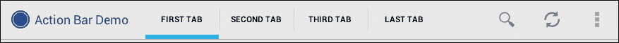
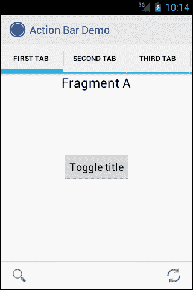
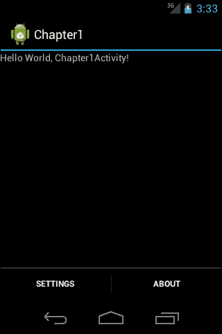
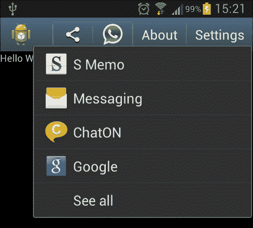
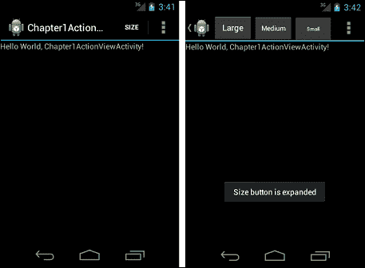
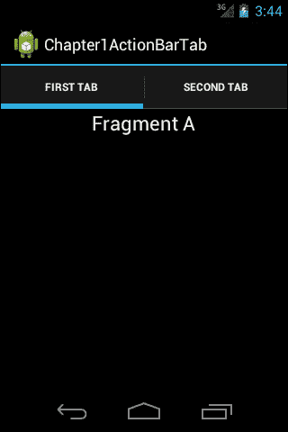

# 第一章：适用于所有人的操作栏

**操作栏** API 最初是在 Android 3.0 中引入的。随着 Android 冰激凌三明治的发布，操作栏支持小屏幕尺寸。本章展示了如何使用和配置操作栏。

本章涵盖的主题如下：

+   操作栏类型

+   添加操作栏

+   添加 ActionProvider 和 ShareActionProvider

+   添加操作视图

+   使用操作栏进行导航

# 操作栏

操作栏是位于用户设备屏幕顶部的用户界面元素。它为用户提供操作和导航功能。操作栏自 API 级别 11（Android 3.0 Honeycomb）起提供，冰激凌三明治发布后，也支持小屏幕设备。以下截图显示了一个带有标签的操作栏示例：



如前图所示，在栏的左侧有一个应用程序图标和标题，然后是导航标签。最后，在标签之后放置操作按钮。那些不适合屏幕显示的操作按钮会以三个点的溢出菜单形式显示在栏的右侧。在前面的截图中，操作栏显示在大屏幕设备上。然而，在小屏幕设备上，操作栏会显示为堆叠的栏，如下截图所示：


如前图所示，可以看到没有足够的空间显示所有操作栏项目，操作栏以屏幕顶部的双栏形式显示。

另一种类型的操作栏是**分割**操作栏。在这种类型的操作栏中，在窄屏幕上，操作按钮显示在屏幕底部的栏中，如下截图所示：



## 添加操作栏

冰激凌三明治之后，Android 不再需要使用菜单按钮来访问选项菜单。最佳实践是使用操作栏而不是菜单按钮。从选项菜单迁移到操作栏非常容易。现在我们将创建一个菜单，然后将该菜单迁移到操作栏。

首先，创建一个 Android 项目，然后添加一个包含`设置`和`关于`作为菜单项的菜单。生成的菜单 XML 文件应如下代码块所示：

### 提示

**下载示例代码**

您可以从您的账户下载您购买的所有 Packt 图书的示例代码文件，网址为[`www.PacktPub.com`](http://www.PacktPub.com)。如果您在别处购买了这本书，可以访问[`www.PacktPub.com/support`](http://www.PacktPub.com/support)注册，我们会直接将文件通过电子邮件发送给您。

```kt
<?xml version="1.0" encoding="utf-8"?>
<menu  >

    <item android:id="@+id/settings" android:title="Settings"></item>

    <item android:id="@+id/about" android:title="About"></item>

</menu>
```

本示例的布局 XML 是一个`LinearLayout`布局，其中包含一个`TextView`组件，如下代码块所示：

```kt
<?xml version="1.0" encoding="utf-8"?>
<LinearLayout 
    android:layout_width="fill_parent"
    android:layout_height="fill_parent"
    android:orientation="vertical" >

    <TextView
        android:layout_width="fill_parent"
        android:layout_height="wrap_content"
        android:text="@string/hello" />

</LinearLayout>
```

实现`onCreateOptionsMenu`和`onOptionsItemSelected`方法，如下代码块所示，以显示菜单项：

```kt
package com.chapter1;

import android.app.Activity;
import android.os.Bundle;
import android.view.Menu;
import android.view.MenuInflater;
import android.view.MenuItem;
import android.widget.Toast;

public class Chapter1Activity extends Activity {

    @Override
    public void onCreate(Bundle savedInstanceState) {
        super.onCreate(savedInstanceState);
        setContentView(R.layout.main);
    }

    @Override
    public boolean onCreateOptionsMenu(Menu menu) {
            //Inflate the menu.xml of the android project
 //in order to create menu
    MenuInflater inflater = getMenuInflater();
    inflater.inflate(R.menu.menu, menu);
    return true;
    }

    @Override
  public boolean onOptionsItemSelected(MenuItem item) {
    // Handle item selection
 //According to selection, show the Toast message
 //of the selected button
    switch (item.getItemId()) {

    case R.id.settings:
      Toast.makeText(this, "Settings options menu button is pressed", Toast.LENGTH_LONG).show();
      return true;
    case R.id.about:
      Toast.makeText(this, "About options menu button is pressed", Toast.LENGTH_LONG).show();
      return true;
      default:
      return super.onOptionsItemSelected(item);
    }
  }
}
```

为了显示操作栏，Android 应用程序应该在`AndroidManifest.xml`文件中至少针对 API 级别 11，如下面的代码块所示：

```kt
<?xml version="1.0" encoding="utf-8"?>
<!—set targetSDKversion to 11 because Action Bar is
 available since API Level 11-->
<manifest 
    package="com.chapter1"
    android:versionCode="1"
    android:versionName="1.0" >

    < uses-sdk android:minSdkVersion="5" 
 android:targetSdkVersion="11"  />

    <application
        android:icon="@drawable/ic_launcher"
        android:label="@string/app_name" >
        <activity
            android:name=".Chapter1Activity"
            android:label="@string/app_name" >
            <intent-filter>
                <action android:name="android.intent.action.MAIN" />

                <category android:name="android.intent.category.LAUNCHER" />
            </intent-filter>
        </activity>
    </application>

</manifest>
```

使用这个配置，当应用程序在搭载 Android 3.0 或更高版本的设备上运行时，操作栏将会显示。

当我们在 API 级别 15 的模拟器上运行这个应用程序时，我们将在操作栏的右侧看到溢出菜单，并且当按下溢出菜单时，选项菜单按钮将会显示。为了在操作栏上显示选项菜单按钮（而不是作为溢出菜单），只需在菜单 XML 文件的`item`标签内添加`android:showAsAction="ifRoom|withText"`。修改后的菜单 XML 文件应该如下面的代码块所示：

```kt
<?xml version="1.0" encoding="utf-8"?>
<menu  >

    <item android:id="@+id/settings" android:title="Settings" android:showAsAction="ifRoom|withText"></item>

    <item android:id="@+id/about" android:title="About" android:showAsAction="ifRoom|withText"></item>

</menu>
```

如果没有足够的空间（`ifRoom`）来显示选项菜单按钮，按钮将会作为溢出菜单显示。为了仅显示带有图标的选项菜单按钮（如果提供了图标），应该移除`withText`。当你运行应用程序时，它将如下面的截图所示：


在某些情况下，你可能不希望显示操作栏。为了移除操作栏，你需要在`AndroidManifest.xml`文件中的`activity`标签内添加`android:theme="@android:style/Theme.Holo.NoActionBar"`。修改后的`AndroidManifest.xml`应该如下面的代码块所示：

```kt
<?xml version="1.0" encoding="utf-8"?>
<manifest 
    package="com.chapter1"
    android:versionCode="1"
    android:versionName="1.0" >

    <uses-sdk android:minSdkVersion="5" 
              android:targetSdkVersion="11"  />

    <application
        android:icon="@drawable/ic_launcher"
        android:label="@string/app_name" >
        <activity
            android:name=".Chapter1Activity"
            android:label="@string/app_name" 
            android:theme="@android:style/Theme.Holo.NoActionBar" >
            <intent-filter>
                <action android:name="android.intent.action.MAIN" />

                <category android:name="android.intent.category.LAUNCHER" />
            </intent-filter>
        </activity>
    </application>

</manifest>
```

为了将操作栏显示为*分割*操作栏，在`AndroidManifest.xml`中的`activity`标签内添加`android:uiOptions="splitActionBarWhenNarrow"`属性。修改后的`AndroidManifest.xml`应该如下面的代码块所示：

```kt
<?xml version="1.0" encoding="utf-8"?>
<manifest 
    package="com.chapter1"
    android:versionCode="1"
    android:versionName="1.0" >

    <uses-sdk android:minSdkVersion="5"   
        android:targetSdkVersion="11"  />

    <application
        android:icon="@drawable/ic_launcher"
        android:label="@string/app_name" 
 android:uiOptions="splitActionBarWhenNarrow">
        <activity
            android:name=".Chapter1Activity"
            android:label="@string/app_name" 
            >
            <intent-filter>
                <action android:name="android.intent.action.MAIN" />

                <category android:name="android.intent.category.LAUNCHER" />
            </intent-filter>
        </activity>
    </application>

</manifest>
```

当你在这个模拟器上运行这个应用程序时，屏幕将如下面的截图所示：



# 添加 ActionProvider

为了在操作栏中使用自定义视图而不是简单的按钮，`ActionProvider`类可能是一个解决方案。**ActionProvider**从 API 级别 14 开始可用。ActionProvider 可以在操作栏中生成自定义视图，可以生成子菜单，并且可以处理它生成的视图的事件。为了创建一个 ActionProvider，我们应该继承`ActionProvider`类。下面的代码展示了一个扩展了`ActionProvider`类的示例类，并在操作栏中显示自定义布局而不是简单按钮：

```kt
import android.content.Context;
import android.view.ActionProvider;
import android.view.LayoutInflater;
import android.view.View;
import android.widget.ImageButton;
import android.widget.Toast;

public class Chapter1ActionProvider extends ActionProvider {

  Context mContext;

  public Chapter1ActionProvider(Context context) {
    super(context);
    mContext = context;
  }

  @Override
  public View onCreateActionView() {
        //This method is the place where we generate a custom layout for the Action Bar menu item
     LayoutInflater layoutInflater = LayoutInflater.from(mContext);
         View view = layoutInflater.inflate(R.layout.action_provider, null);
         ImageButton button = (ImageButton) view.findViewById(R.id.button);

         button.setOnClickListener(new View.OnClickListener() {
  @Override
  public void onClick(View v) {
          Toast.makeText(mContext, "Action Provider click", Toast.LENGTH_LONG).show();
             }
         });
    return view;
  }

  @Override
  public boolean onPerformDefaultAction() {
          //This is the method which is called when the Action Bar menu item is in overflow menu and clicked from there
          Toast.makeText(mContext, "Action Provider click", Toast.LENGTH_LONG).show();
    return true;
  }
}
```

我们必须添加一个构造函数并重写 `onCreateActionView()` 方法。在构造函数中，我们将 `Context` 赋值给一个变量，因为我们在后续实现中需要它。`onCreateActionView()` 方法是生成操作栏菜单项自定义布局的地方。`onPerformDefaultAction()` 是当操作栏菜单项在溢出菜单中并被点击时调用的方法。如果 ActionProvider 提供子菜单，则永远不会调用此方法。在 `onCreateActionView()` 方法中使用的自定义布局的布局 XML 如下代码块所示：

```kt
<?xml version="1.0" encoding="utf-8"?>
<LinearLayout 
    android:layout_width="wrap_content"
    android:layout_height="match_parent"
    android:layout_gravity="center"
    android:focusable="true"
    android:addStatesFromChildren="true"
    android:background="?android:attr/actionBarItemBackground"
    style="?android:attr/actionButtonStyle">

    <ImageButton android:id="@+id/button"
        android:background="@drawable/ic_launcher"
        android:layout_width="32dip"
        android:layout_height="32dip"
        android:layout_gravity="center"
        android:scaleType="fitCenter"
        android:adjustViewBounds="true" />
    <TextView
        android:id="@+id/textView"
        android:layout_width="wrap_content"
        android:layout_height="wrap_content"
        android:text="Some Text"
        android:textAppearance="?android:attr/textAppearanceLarge" />

</LinearLayout>
```

如你在 XML 文件中所见，我们将一个 `ImageButton` 组件和一个 `TextView` 组件添加到了 `LinearLayout` 布局中。`ImageButton` 的 `onClickListener()` 事件在 `Chapter1ActionProvider` 类的 `onCreateActionView()` 方法中实现。在此事件中，将显示一个 `Toast` 消息。

显示操作栏的 `Activity` 类如下代码块所示：

```kt
public class Chapter1ActionProviderActivity extends Activity{

  @Override
  protected void onCreate(Bundle savedInstanceState) {
    // TODO Auto-generated method stub
    super.onCreate(savedInstanceState);
    setContentView(R.layout.main);
  }

  @Override
  public boolean onCreateOptionsMenu(Menu menu) {
    MenuInflater inflater = getMenuInflater();
    inflater.inflate(R.menu.menu, menu);
    return true;
  }

   @Override
    public boolean onOptionsItemSelected(MenuItem item) {
    // Handle item selection
    switch (item.getItemId()) {

    case R.id.about:
        Toast.makeText(this, "About options menu button is pressed", Toast.LENGTH_LONG).show();
        return true;
      default:
        return super.onOptionsItemSelected(item);
      }
    }
}
```

为了为操作栏菜单项显示自定义布局，我们必须在 `menu` XML 文件中分配一个 `ActionProvider` 类。我们分配了之前作为 `ActionProvider` 实现的 `Chapter1ActionProvider`。我们示例中的 menu XML 文件如下所示：

```kt
<?xml version="1.0" encoding="utf-8"?>
<menu  >

    <item android:id="@+id/settings" android:title="Settings" android:showAsAction="ifRoom|withText"

 android:actionProviderClass="com.chapter1.Chapter1ActionProvider"></item>

    <item android:id="@+id/about" android:title="About" android:showAsAction="ifRoom|withText"></item>

</menu>
```

如你在 `menu` XML 文件中所见，我们为 `settings` 菜单项提供了一个 `ActionProvider` 类。最后重要的一步是在 `AndroidManifest.xml` 文件中将最低 SDK 版本设置为 API 级别 14，因为 `ActionProvider` 是在 API 级别 14 中发布的新功能。`AndroidManifest.xml` 文件应如下代码块所示：

```kt
<?xml version="1.0" encoding="utf-8"?>
<manifest 
    package="com.chapter1"
    android:versionCode="1"
    android:versionName="1.0" >
<!—set minSDKversion to 11 because ActionProvider is
 available since API Level 11-->

    <uses-sdk android:minSdkVersion="14" 
        android:targetSdkVersion="14"  />

    <application
        android:icon="@drawable/ic_launcher"
        android:label="@string/app_name" >
        <activity
            android:name=".Chapter1ActionProviderActivity"
            android:label="@string/app_name" 
            >
            <intent-filter>
                <action android:name="android.intent.action.MAIN" />

                <category android:name="android.intent.category.LAUNCHER" />
            </intent-filter>
        </activity>
    </application>

</manifest>
```

当你在模拟器中运行此应用程序时，操作栏中将显示一个带有图像按钮和文本视图的用户界面组件。如果你按下图像按钮，将显示一个吐司消息。屏幕将如下所示：


## 向 ActionProvider 添加子菜单

可以通过 ActionProvider 显示子菜单。为了添加子菜单，我们应该在 `Chapter1ActionProvider` 类中重写 `onPrepareSubMenu(SubMenu subMenu)` 和 `hasSubMenu()` 方法。`Chapter1ActionProvider` 类的结果代码应如下代码块所示：

```kt
package com.chapter1;

import android.app.Activity;
import android.content.Context;
import android.view.ActionProvider;
import android.view.LayoutInflater;
import android.view.MenuInflater;
import android.view.MenuItem;
import android.view.MenuItem.OnMenuItemClickListener;
import android.view.SubMenu;
import android.view.View;
import android.widget.ImageButton;
import android.widget.Toast;

public class Chapter1ActionProvider extends ActionProvider implements 
OnMenuItemClickListener {

  Context mContext;

  public Chapter1ActionProvider(Context context) {
    super(context);
    mContext = context;
  }

  @Override
  public View onCreateActionView() {
         return null;
  }

  @Override
  public boolean onPerformDefaultAction() {

    Toast.makeText(mContext, "Action Provider click", Toast.LENGTH_LONG).show();
    return true;
  }

  @Override
  public void onPrepareSubMenu(SubMenu subMenu) {
 //In order to add submenus, we should override this method
 // we dynamically created submenus

    subMenu.clear();
    subMenu.add("SubItem1").setOnMenuItemClickListener(this);
    subMenu.add("SubItem2").setOnMenuItemClickListener(this);
  }

  @Override
  public boolean onMenuItemClick(MenuItem item) {

    Toast.makeText(mContext, "Sub Item click", Toast.LENGTH_LONG).show();
    return true;
  }

  @Override
  public boolean hasSubMenu() {
 // we implemented it as returning true because we have menu
    return true;
  }

}
```

在 `onPrepareSubMenu(SubMenu subMenu)` 方法中，我们动态创建了子菜单并设置了它们的 `onMenuItemClickListener` 事件。如果 `hasSubMenu()` 方法返回 true，则会调用 `onPrepareSubMenu(SubMenu subMenu)` 方法，因此我们将其实现为返回 true。

也可以通过 `menu` XML 文件创建子菜单。如果你想从 `menu` XML 文件创建子菜单，`onPrepareSubMenu(SubMenu subMenu)` 应该如下代码块所示：

```kt
  @Override
  public void onPrepareSubMenu(SubMenu subMenu) {

    MenuInflater inflater = ((Activity)mContext).getMenuInflater();
    inflater.inflate(R.menu.menu2, subMenu);
  }
```

此代码展示了如何使用 `menu` XML 文件 `menu2` 将 XML 文件展开以创建子菜单。

## ShareActionProvider

**ShareActionProvider**提供了一种一致的分享方式。它在操作栏上放置一个带有分享图标的动作按钮。当你点击该按钮时，它会列出可用于分享的应用程序。你需要在`menu`项中声明`ShareActionProvider`，如下面的代码块所示：

```kt
<?xml version="1.0" encoding="utf-8"?>
<menu  >

    <item android:id="@+id/share" android:title="Share" android:showAsAction="ifRoom"
    android:actionProviderClass="android.widget.ShareActionProvider"></item>
    <item android:id="@+id/about" android:title="About" android:showAsAction="ifRoom"></item>
    <item android:id="@+id/settings" android:title="Settings" android:showAsAction="ifRoom"></item>

</menu>
```

使用`ShareActionProvider`的`Activity`类应该如下代码块所示：

```kt
package com.chapter1;

import android.app.Activity;
import android.content.Intent;
import android.os.Bundle;
import android.view.Menu;
import android.view.MenuInflater;
import android.view.MenuItem;
import android.widget.ShareActionProvider;

public class Chapter1ShareActionProviderActivity extends Activity {

    @Override
    public void onCreate(Bundle savedInstanceState) {
        super.onCreate(savedInstanceState);
        setContentView(R.layout.main);
    }

    @Override
    public boolean onCreateOptionsMenu(Menu menu) {

      ShareActionProvider myShareActionProvider;
    MenuInflater inflater = getMenuInflater();
    inflater.inflate(R.menu.menu, menu);
    MenuItem item = menu.findItem(R.id.share);
    myShareActionProvider = (ShareActionProvider)item.getActionProvider();
    myShareActionProvider.setShareHistoryFileName(ShareActionProvider.DEFAULT_SHARE_HISTORY_FILE_NAME);
 myShareActionProvider.setShareIntent(getShareIntent());

    return true;
    }

    private Intent getShareIntent() {
      Intent shareIntent = new Intent(Intent.ACTION_SEND);
      shareIntent.setType("text/plain");
      shareIntent.putExtra(Intent.EXTRA_TEXT, "www.somesite.com");
      return shareIntent;
      }

}
```

如代码所示，我们在`onCreateOptionsMenu(Menu menu)`方法中获取了`menu`项的`ShareActionProvider`属性。然后我们使用`ShareActionProvider`的`setShareIntent`方法定义分享的意图。`getShareIntent()`方法创建了一个用于分享文本的**意图**。我们使用此方法为`ShareActionProvider`实例定义意图。

`ShareActionProvider`会在一个文件中保存用于分享的应用程序历史记录。`ShareActionProvider`默认使用的文件是`ShareActionProvider.DEFAULT_SHARE_HISTORY_FILE_NAME`。可以通过`setShareHistoryFileName`方法更改此文件。你需要向此方法传递一个带有.xml 扩展名的 XML 文件名。`ShareActionProvider`使用这个文件来查找最常用于分享的应用程序。然后它将最常使用的应用程序显示在分享动作按钮附近，作为默认分享目标。

使用`ShareActionProvider`的应用程序界面如下所示：



由于`ShareActionProvider`是在 API 级别 14 引入的，因此我们必须在`AndroidManifest.xml`文件中将最小 SDK 设置为 14，如下代码块所示：

```kt
<?xml version="1.0" encoding="utf-8"?>
<manifest 
    package="com.chapter1"
    android:versionCode="1"
    android:versionName="1.0" >
<!—set minSdkVersion to 14 because ShareActionProvider is available
 since API Level 14-->

    <uses-sdk android:minSdkVersion="14" />

    <application
        android:icon="@drawable/ic_launcher"
        android:label="@string/app_name" >
        <activity
            android:name=".Chapter1ShareActionProviderActivity"
            android:label="@string/app_name" >
            <intent-filter>
                <action android:name="android.intent.action.MAIN" />

                <category android:name="android.intent.category.LAUNCHER" />
            </intent-filter>
        </activity>
    </application>

</manifest>

```

# 添加一个动作视图

**动作视图**是出现在操作栏中的用户界面组件，而不是操作按钮。这个视图是可以折叠的，即如果它被配置为可折叠，意味着在按下动作按钮时会展开。如果没有配置为可折叠，默认会展开显示。在以下示例中，我们添加了一个动作视图，并展示了其事件以及如何处理这些事件。

首先，添加一个动作视图的布局，其中包含三个带有文本`Large`、`Medium`和`Small`的按钮，如下代码块所示：

```kt
<?xml version="1.0" encoding="utf-8"?>
<LinearLayout 
    android:layout_width="match_parent"
    android:layout_height="match_parent"
    android:orientation="horizontal" >
    <Button
        android:id="@+id/buttonLarge"
        android:layout_width="match_parent"
        android:layout_height="wrap_content"
        android:layout_weight="1"
        android:text="Large"
        android:textSize="15dp" />

    <Button
        android:id="@+id/buttonMedium"
        android:layout_width="match_parent"
        android:layout_height="wrap_content"
        android:layout_weight="1"
        android:text="Medium"
        android:textSize="12dp" />

    <Button
        android:id="@+id/buttonSmall"
        android:layout_width="match_parent"
        android:layout_height="wrap_content"
        android:layout_weight="1"
        android:text="Small"
        android:textSize="9dp" />

</LinearLayout>
```

然后，我们需要将此动作视图绑定到操作栏的`menu`项。`menu`的 XML 代码如下所示：

```kt
<?xml version="1.0" encoding="utf-8"?>
<menu  >

 <item android:id="@+id/size" android:title="Size" android:showAsAction="ifRoom|collapseActionView"
 android:actionLayout="@layout/actionview"></item>

    <item android:id="@+id/about" android:title="About" android:showAsAction="ifRoom"></item>
    <item android:id="@+id/settings" android:title="Settings" android:showAsAction="ifRoom|withText"></item>

</menu>
```

如你在`menu`的 XML 代码中所见，我们通过设置`actionLayout`属性将动作视图绑定到`size`菜单项。我们还设置了`showAsAction`属性为`collapseActionView`。这样，动作视图就是可折叠的，当按下动作按钮项时展开。这个选项可以帮助我们在操作栏中节省空间。如果此属性未设置为`collapseActionView`，则动作视图默认会展开显示。

处理动作视图事件的`Activity`类如下代码块所示：

```kt
package com.chapter1;

import android.app.Activity;
import android.os.Bundle;
import android.view.Menu;
import android.view.MenuInflater;
import android.view.MenuItem;
import android.view.MenuItem.OnActionExpandListener;
import android.view.View;
import android.view.View.OnClickListener;
import android.widget.Button;
import android.widget.Toast;

public class Chapter1ActionViewActivity extends Activity implements 
OnClickListener {
  Button buttonLarge;
  Button buttonMedium;
  Button buttonSmall;
  Menu menu;

    /** Called when the activity is first created. */
    @Override
    public void onCreate(Bundle savedInstanceState) {
        super.onCreate(savedInstanceState);
        setContentView(R.layout.main);
    }

    @Override
    public boolean onCreateOptionsMenu(Menu menu) {
      //you can set on click listeners of the items in Action View in this method

      this.menu = menu;
    MenuInflater inflater = getMenuInflater();
    inflater.inflate(R.menu.menu, menu);
    MenuItem item = menu.findItem(R.id.size);
    item.setOnActionExpandListener(new Chapter1ActionListener(this));
    buttonLarge = (Button)item.getActionView().findViewById(R.id.buttonLarge);
    buttonLarge.setOnClickListener(this);

    buttonMedium = (Button)item.getActionView().findViewById(R.id.buttonMedium);
    buttonMedium.setOnClickListener(this);

    buttonSmall = (Button)item.getActionView().findViewById(R.id.buttonSmall);
    buttonSmall.setOnClickListener(this);

    return true;
    }

    @Override
  public boolean onOptionsItemSelected(MenuItem item) {
    // Handle item selection
    switch (item.getItemId()) {

    case R.id.size:
      Toast.makeText(this, "Size options menu button is pressed", Toast.LENGTH_LONG).show();
      return true;
    case R.id.about:
      Toast.makeText(this, "About options menu button is pressed", Toast.LENGTH_LONG).show();
      return true;
      case R.id.settings:
      Toast.makeText(this, "Settings options menu button is pressed", Toast.LENGTH_LONG).show();
      return true;
    default:
      return super.onOptionsItemSelected(item);
    }
  }

  @Override
  public void onClick(View v) {

    if(v == buttonLarge )
    {
      Toast.makeText(this, "Large button is pressed", Toast.LENGTH_LONG).show();
 //Collapse the action view
      menu.findItem(R.id.size).collapseActionView();
    }
    else if(v == buttonMedium )
    {
      Toast.makeText(this, "Medium button is pressed", Toast.LENGTH_LONG).show();
                    //Collapse the action view
      menu.findItem(R.id.size).collapseActionView();
    }
    else if(v == buttonSmall)
    {
      Toast.makeText(this, "Small button is pressed", Toast.LENGTH_LONG).show();
                    //Collapse the action view
      menu.findItem(R.id.size).collapseActionView();
    }

  }

      // This class returns a callback when Action View is expanded or collapsed
  public static class Chapter1ActionListener implements OnActionExpandListener
  {
    Activity activity;

    public Chapter1ActionListener(Activity activity)
    {
      this.activity = activity;
    }

    @Override
    public boolean onMenuItemActionCollapse(MenuItem item) {

      Toast.makeText(activity, item.getTitle()+" button is collapsed", Toast.LENGTH_LONG).show();
      return true;
  }

   @Override
    public boolean onMenuItemActionExpand(MenuItem item) {
      Toast.makeText(activity, item.getTitle()+" button is expanded", Toast.LENGTH_LONG).show();
      return true;
    }

  }
}
```

正如在`Chapter1ActionViewActivity`中看到的，你可以在`onCreateOptionsMenu(Menu menu)`方法中设置动作视图内各项目的事件监听器。我们在`onCreateOptionsMenu(Menu menu)`方法中设置了动作视图内按钮的`onClickListener`事件。

可以通过`expandActionView()`和`collapseActionView()`方法以编程方式展开和折叠动作视图。正如在`Chapter1ActionViewActivity`的`onClick(View v)`方法中看到的那样，我们使用`collapseActionView()`方法手动折叠了动作视图。

当动作视图展开或折叠时，你可以使用`OnActionExpandListener`类执行一个动作。正如代码中看到的，我们定义了实现`OnActionExpandListener`的`Chapter1ActionListener`类。我们重写了这个类的`onMenuItemActionCollapse(MenuItem item)`和`onMenuItemActionExpand(MenuItem item)`方法，以便显示一个`Toast`消息。我们将`Activity`作为参数传递给`Chapter1ActionListener`的构造函数，因为显示`Toast`消息时需要`Activity`。为了处理展开和折叠事件，我们必须注册`setOnActionExpandListener()`方法与`OnActionExpandListener`类。正如代码中看到的，我们在`onCreateOptionsMenu(Menu menu)`方法中注册了这个事件。当动作视图折叠和展开时，我们会显示一个`Toast`消息。

由于动作视图是在 API 级别 14 中引入的，因此我们必须在`AndroidManifest.xml`文件中将最小 SDK 属性设置为 14 或更高，如下代码块所示：

```kt
<?xml version="1.0" encoding="utf-8"?>
<manifest 
    package="com.chapter1"
    android:versionCode="1"
    android:versionName="1.0" >
<!—set minSdkVersion to 14 because Action View is
 available since API Level 14-->

    <uses-sdk android:minSdkVersion="14" />

    <application
        android:icon="@drawable/ic_launcher"
        android:label="@string/app_name" >
        <activity
            android:name=".Chapter1ActionViewActivity"
            android:label="@string/app_name" >
            <intent-filter>
                <action android:name="android.intent.action.MAIN" />

                <category android:name="android.intent.category.LAUNCHER" />
            </intent-filter>
        </activity>
    </application>

</manifest>
```

当你在模拟器上运行这个应用时，它看起来会像下面的截图一样：



# 使用操作栏进行导航

标签导航也可以通过`TabWidget`类实现。然而，操作栏有一些优点。操作栏会根据设备屏幕大小自动调整自身。例如，如果没有足够的空间显示标签，它会以堆叠条的方式显示标签。因此，在实现标签导航时，最好使用操作栏。

现在，我们将要了解如何使用操作栏进行标签导航。首先，创建一个 Android 项目并添加两个片段：一个显示`Fragment A`，另一个显示`Fragment B`。片段的布局 XML 应该如下代码块所示：

```kt
<?xml version="1.0" encoding="utf-8"?>
<LinearLayout 
    android:layout_width="match_parent"
    android:layout_height="match_parent"
    android:orientation="vertical" >

    <TextView
        android:id="@+id/textView1"
        android:layout_width="wrap_content"
        android:layout_height="wrap_content"
        android:text="Fragment A"
        android:textAppearance="?android:attr/textAppearanceLarge" android:layout_gravity="center_horizontal"/>

</LinearLayout>
<?xml version="1.0" encoding="utf-8"?>
<LinearLayout 
    android:layout_width="match_parent"
    android:layout_height="match_parent"
    android:orientation="vertical" >

    <TextView
        android:id="@+id/textView1"
        android:layout_width="wrap_content"
        android:layout_height="wrap_content"
        android:text="Fragment B"
        android:textAppearance="?android:attr/textAppearanceLarge" 
        android:layout_gravity="center_horizontal"/>

</LinearLayout>
```

为这两个片段扩展`Fragment`类的类应该如下代码块所示：

```kt
package com.chapter1;

import android.app.Fragment;
import android.os.Bundle;
import android.view.LayoutInflater;
import android.view.View;
import android.view.ViewGroup;

public class FragmentA extends Fragment {

  @Override
  public View onCreateView(LayoutInflater inflater, ViewGroup container,
      Bundle savedInstanceState) {
      View view = inflater.inflate(R.layout.fragment_a, container,false);
    return view;
  }
}
package com.chapter1;

import android.app.Fragment;
import android.os.Bundle;
import android.view.LayoutInflater;
import android.view.View;
import android.view.ViewGroup;

public class FragmentB extends Fragment {

  @Override
  public View onCreateView(LayoutInflater inflater, ViewGroup container,
      Bundle savedInstanceState) {
    View view = inflater.inflate(R.layout.fragment_b, container, false);
    return view;
  }
}
```

为了使用操作栏进行标签导航，我们首先应该实现`ActionBar.TabListener`类。实现`TabListener`的类将在`Activity`类中添加标签时使用。带有`TabListener`实现的`Activity`类应该如下代码块所示：

```kt
package com.chapter1;

import android.app.ActionBar;
import android.app.ActionBar.Tab;
import android.app.ActionBar.TabListener;
import android.app.Activity;
import android.app.Fragment;
import android.app.FragmentTransaction;
import android.os.Bundle;

public class Chapter1ActionBarTabActivity extends Activity {

  @Override
  public void onCreate(Bundle savedInstanceState) {
    super.onCreate(savedInstanceState);
    setContentView(R.layout.main);

    ActionBar actionBar = getActionBar();
    actionBar.setNavigationMode(ActionBar.NAVIGATION_MODE_TABS);

    Tab tab = actionBar
        .newTab()
        .setText("First tab")
        .setTabListener(
          new Chapter1TabListener<FragmentA>(this, "fragmentA",FragmentA.class));
    actionBar.addTab(tab);

    tab = actionBar
        .newTab()
        .setText("Second Tab")
        .setTabListener(
            new Chapter1TabListener<FragmentB>(this, "fragmentB",FragmentB.class));
    actionBar.addTab(tab);
  }

  public static class Chapter1TabListener<T extends Fragment> implements
 TabListener {
    private Fragment mFragment;
    private final Activity mActivity;
    private final String mTag;
    private final Class<T> mClass;

    public Chapter1TabListener(Activity activity, String tag, Class<T> clz) {
      mActivity = activity;
      mTag = tag;
      mClass = clz;
    }

    @Override
    public void onTabSelected(Tab tab, FragmentTransaction ft) {
 // we initialize and add the fragment to our Activity if it doesn't exist

      if (mFragment == null) {

        mFragment = Fragment.instantiate(mActivity, mClass.getName());			
        ft.add(android.R.id.content, mFragment, mTag);

        } else {
 // If it exists, we simply attach it
        ft.attach(mFragment);
      }
    }

    @Override
    public void onTabUnselected(Tab tab, FragmentTransaction ft) {
 // in this method we detach the fragment because // it shouldn't be displayed
    if (mFragment != null) {
        ft.detach(mFragment);
        }
    }
    @Override
    public void onTabReselected(Tab tab, FragmentTransaction ft) {
 // This method is called when the tab is reselected
    }
  }
}
```

在 `Chapter1TabListener` 类中有三个需要重写的方法：`onTabReselected(Tab tab, FragmentTransaction ft)`、`onTabUnselected(Tab tab, FragmentTransaction ft)` 和 `onTabSelected(Tab tab, FragmentTransaction ft)`。在 `onTabSelected(Tab tab, FragmentTransaction ft)` 方法中，如果片段不存在，我们会初始化并将片段添加到我们的活动中。如果它已存在，我们只需连接到它。当标签被取消选择时，会调用 `onTabUnselected(Tab tab, FragmentTransaction ft)` 方法。在这个方法中，我们分离片段，因为它不应该被显示。当标签被重新选择时，会调用 `onTabReselected(Tab tab, FragmentTransaction ft)` 方法。在这个方法中我们不执行任何操作。在 `Chapter1ActionBarTabActivity` 类中，我们创建并设置操作栏。我们活动的布局只有一个 `LinearLayout` 布局，我们使用片段作为用户界面。首先，我们将操作栏的导航模式设置为 `ActionBar.NAVIGATION_MODE_TABS`，因为我们需要标签导航。然后我们创建两个标签，设置它们的 `TabListener` 事件，并将它们添加到 `操作栏` 实例中。当你运行应用程序时，你会看到两个标签，名为 **FIRST TAB** 和 **SECOND TAB**。第一个标签将显示 **Fragment A**，第二个标签将显示 **Fragment B**。屏幕将如下所示：



重要的是不要忘记将最低 SDK 级别设置为 API 级别 11 或更高，因为操作栏是在 API 级别 11 中引入的。

# 总结

在本章中，你学习了如何使用操作栏，因为这种方法比使用选项菜单更为一致。你还了解了如何使用 ActionProvider 在操作栏中创建自定义布局。你学习了如何使用 ShareActionProvider，以及它如何在你的应用中实现分享的有效方式。你学习了如何使用操作视图以及如何使其可折叠。最后，你学习了如何使用操作栏进行标签导航。它具有适应设备屏幕尺寸的优点，因此使用操作栏比使用较旧的 API 更好。在下一章中，我们将学习一个名为 GridLayout 的 Android 布局，并了解如何添加和配置它。
