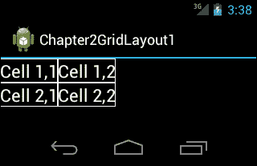
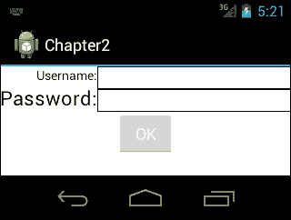
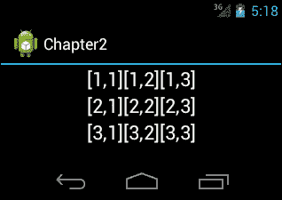
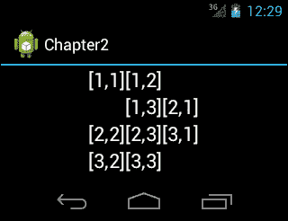
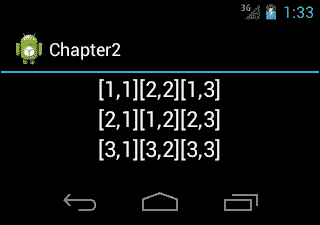
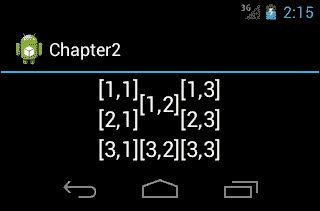
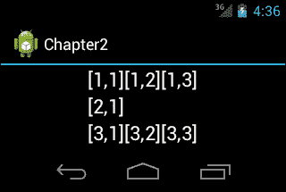

# 第二章：新布局——GridLayout

随着 Android Ice Cream Sandwich 的推出，引入了一种新的布局，称为**GridLayout**。这个布局是一个优化的布局，可以代替**LinearLayout**和**RelativeLayout**。本章展示了如何使用和配置 GridLayout。

本章涵盖的主题包括：

+   为什么使用 GridLayout

+   添加一个 GridLayout

+   配置 GridLayout

# GridLayout

**GridLayout**是一种将其视图空间划分为行、列和单元格的布局。GridLayout 自动在其中放置视图，但也可以定义列和行索引来在 GridLayout 中放置视图。通过单元格的跨度属性，可以使一个视图跨越多行或多列。下面的代码块展示了一个使用`GridLayout`布局的示例布局文件：

```kt
<?xml version="1.0" encoding="utf-8"?>
<GridLayout 
android:id="@+id/GridLayout1"
android:layout_width="match_parent"
android:layout_height="match_parent"
android:columnCount="2"
android:orientation="horizontal" android:rowCount="2">

<TextView
android:id="@+id/textView1"
android:text="Cell 1,1"
android:textAppearance="?android:attr/textAppearanceLarge" />

<TextView
android:id="@+id/textView2"
android:text="Cell 1,2"
android:textAppearance="?android:attr/textAppearanceLarge" />

<TextView
android:id="@+id/textView3"
android:text="Cell 2,1"
android:textAppearance="?android:attr/textAppearanceLarge" />

<TextView
android:id="@+id/textView4"
android:text="Cell 2,2"
android:textAppearance="?android:attr/textAppearanceLarge" />

</GridLayout>
```

当这个布局 XML 在模拟器中查看时，它将如下截图所示：



在这个布局 XML 文件中，我们放置了四个`TextView`组件，文本分别为`Cell 1,1`、`Cell 1,2`、`Cell 2,1`和`Cell 2,2`。将 GridLayout 的`orientation`设置为`horizontal`，并且`columnCount`和`rowCount`属性设置为`2`，GridLayout 首先自动将项目放置在第一行，当项目数量达到`columnCount`时，它开始将项目放置在第二行。

你在这个布局中首先会注意到的就是`TextView`组件没有`layout_width`和`layout_height`属性。这些属性没有被使用，因为`GridLayout`使用`layout_gravity`属性来确定单元格的大小，而不是`layout_width`和`layout_height`属性。通常`gravity`属性用于对齐视图的内容，但在`GridLayout`中它被用于不同的目的。可用的重力常数包括`left`、`top`、`right`、`bottom`、`center_horizontal`、`center_vertical`、`center`、`fill_horizontal`、`fill_vertical`和`fill`。

在`GridLayout`中，你可以通过指定列和行的索引明确地定义一个视图将被放置的单元格。如果没有指定索引，`GridLayout`会根据`GridLayout`布局的取向自动将视图放置在第一个可用的位置。

## 为什么使用 GridLayout

**LinearLayout**和**RelativeLayout**是 Android 用户界面设计中使用最普遍的布局。对于简单的用户界面，它们是一个不错的选择，但是当用户界面变得复杂时，嵌套 LinearLayout 的使用往往会增加。嵌套布局（任何类型）可能会影响性能，而且嵌套超过 10 层的 LinearLayout 可能会导致应用程序崩溃。因此，你应该避免使用过多的嵌套 LinearLayout 块，或者使用 RelativeLayout 以减少嵌套 LinearLayout 块。这些布局对于复杂用户界面的另一个缺点是可读性差。维护具有许多视图的嵌套 LinearLayout 或 RelativeLayout 布局很困难。在这些情况下，使用**GridLayout**是一个不错的选择。通过使用 GridLayout，可以避免使用过多的嵌套 LinearLayout。此外，维护 GridLayout 要容易得多。许多使用 LinearLayout、RelativeLayout 或**TableLayout**的用户界面可以转换为 GridLayout，其中 GridLayout 将提供性能提升。与其他布局相比，GridLayout 的主要优势之一是你可以控制视图在水平和垂直轴上的对齐方式。

## 添加一个 GridLayout

在本节中，我们将把一个 Android 应用程序从**LinearLayout**迁移到**GridLayout**。使用`LinearLayout`的应用程序的布局 XML 代码如下代码块所示：

```kt
<?xml version="1.0" encoding="utf-8"?>
<LinearLayout 
android:layout_width="match_parent"
android:layout_height="match_parent"
android:orientation="vertical" android:background="#ffffff">
<!-- we used 3 nested LinearLayout-->
<LinearLayout
android:layout_width="match_parent"
android:layout_height="wrap_content"
android:orientation="horizontal" >
<!—LinearLayout that contains labels-->
<LinearLayout
android:layout_width="wrap_content"
android:layout_height="wrap_content"
android:orientation="vertical" >

<TextView
android:id="@+id/textView1"
android:layout_width="wrap_content"
android:layout_height="wrap_content"
android:text="Username:"
android:textAppearance="?android:attr/textAppearanceSmall"
android:textColor="#000000" android:layout_gravity="right"/>

<TextView
android:id="@+id/textView2"
android:layout_width="wrap_content"
android:layout_height="wrap_content"
android:text="Password:"
android:textAppearance="?android:attr/textAppearanceLarge"
android:textColor="#000000" />
</LinearLayout>
<!—Linearlayout that contains fields-->
<LinearLayout
android:layout_width="match_parent"
android:layout_height="wrap_content"
android:orientation="vertical" >

<EditText
android:id="@+id/editText1"
android:layout_width="match_parent"
android:layout_height="wrap_content"
android:background="@drawable/borders_bottom_right"
android:ems="10" >

</EditText>

<EditText
android:id="@+id/editText2"
android:layout_width="match_parent"
android:layout_height="wrap_content"
android:layout_weight="1"
android:background="@drawable/borders_bottom_right"
android:ems="10" />
</LinearLayout>
</LinearLayout>

<Button
android:id="@+id/button1"
android:layout_width="wrap_content"
android:layout_height="wrap_content"
android:text="OK" android:layout_gravity="center_horizontal"/>

</LinearLayout>
```

在前一个布局文件中使用的 drawable `borders_bottom_right`背景如下代码块所示：

```kt
<?xml version="1.0" encoding="utf-8"?>
  <layer-list  >
  <item>
    <shape android:shape="rectangle">
    <stroke android:width="1dp" android:color="#FFFFFF" />
    <solid android:color="#000000" />
    </shape>
  </item>
  </layer-list>
```

屏幕将如下所示：



正如你在布局 XML 代码中看到的，我们使用了三个嵌套的`LinearLayout`实例来实现一个简单的登录屏幕。如果这个屏幕是用`GridLayout`设计的，布局的 XML 代码将如下代码块所示：

```kt
<?xml version="1.0" encoding="utf-8"?>
<GridLayout 
  android:layout_width="fill_parent"
  android:layout_height="fill_parent"
  android:background="#ffffff"
  android:columnCount="2"
  android:orientation="horizontal" >

  <TextView
    android:id="@+id/textView1"
    android:layout_gravity="right"
    android:text="Username:" android:textColor="#000000"/>

  <EditText
  android:id="@+id/editText1"
  android:ems="10" android:background="@drawable/borders"/>

  <TextView
    android:id="@+id/textView2"
    android:text="Password:"
    android:textAppearance="?android:attr/textAppearanceLarge" android:textColor="#000000"/>

  <EditText
    android:id="@+id/editText2"
    android:ems="10" android:background="@drawable/borders">

  </EditText>

  <Button
    android:id="@+id/button1"
    android:layout_columnSpan="2"
    android:text="Button" android:layout_gravity="center_horizontal"/>

</GridLayout>
```

我们将`columnCount`属性设置为`2`，因为我们在一行中有一个`TextView`组件和一个`EditText`组件。之后我们放置了视图，并没有指定行或列的索引。**GridLayout**会根据`orientation`和`columnCount`自动放置它们。我们将`layout_columnSpan`属性设置为`2`，以使按钮跨越两列。通过`layout_gravity`属性，我们使按钮在行的中心显示。正如你在布局的 XML 代码中看到的，使用 GridLayout 设计相同的屏幕非常简单和容易。此外，GridLayout 的对其方式更加简单，并且代码的可读性更好。

`GridLayout`从 API 级别 14 开始可用，因此在`AndroidManifest.xml`文件中，最低 SDK 属性应设置为`14`或更高，如下代码行所示：

```kt
<uses-sdkandroid:minSdkVersion="14" />
```

## 配置 GridLayout

首先，我们将编写一个示例`GridLayout` XML 代码，然后我们将使用此代码作为其他示例的基础。示例布局的 XML 代码将如下代码块所示：

```kt
<?xml version="1.0" encoding="utf-8"?>
<GridLayout 
android:layout_width="wrap_content"
android:layout_height="wrap_content"
android:layout_gravity="center_horizontal"
android:columnCount="3"
android:rowCount="3" >

<TextView
android:text="[1,1]" 
android:textAppearance="?android:attr/textAppearanceLarge"/>

<TextView
android:text="[1,2]" 
android:textAppearance="?android:attr/textAppearanceLarge"/>

<TextView
android:text="[1,3]" 
android:textAppearance="?android:attr/textAppearanceLarge"/>

<TextView
android:text="[2,1]" 
android:textAppearance="?android:attr/textAppearanceLarge"/>

<TextView
android:text="[2,2]" 
android:textAppearance="?android:attr/textAppearanceLarge"/>

<TextView
android:text="[2,3]" 
android:textAppearance="?android:attr/textAppearanceLarge"/>

<TextView
android:text="[3,1]" 
android:textAppearance="?android:attr/textAppearanceLarge"/>

<TextView
android:text="[3,2]" 
android:textAppearance="?android:attr/textAppearanceLarge"/>

<TextView
android:text="[3,3]" 
android:textAppearance="?android:attr/textAppearanceLarge"/>

</GridLayout>
```

使用前面的代码块，屏幕将如下所示：



如你在布局 XML 代码中所见，`TextView`组件没有索引地放置，并根据`orientation`、`columnCount`和`rowCount`在`GridLayout`中自动定位。现在我们将`[1, 3]`的索引编号设置为`[2, 1]`。布局 XML 代码应如下所示：

```kt
<?xml version="1.0" encoding="utf-8"?>
<GridLayout 
android:layout_width="wrap_content"
android:layout_height="wrap_content"
android:layout_gravity="center_horizontal"
android:columnCount="3"
android:rowCount="3" >

<TextView
android:text="[1,1]" 
android:textAppearance="?android:attr/textAppearanceLarge"/>

<TextView
android:text="[1,2]" 
android:textAppearance="?android:attr/textAppearanceLarge"/>
<!-- set the row and column index with layout_row and layout_column
properties-->
<TextView
android:text="[1,3]"
android:textAppearance="?android:attr/textAppearanceLarge"
android:layout_row="1" android:layout_column="1"/>

<TextView
android:text="[2,1]" 
android:textAppearance="?android:attr/textAppearanceLarge"/>

<TextView
android:text="[2,2]" 
android:textAppearance="?android:attr/textAppearanceLarge"/>

<TextView
android:text="[2,3]" 
android:textAppearance="?android:attr/textAppearanceLarge"/>

<TextView
android:text="[3,1]" 
android:textAppearance="?android:attr/textAppearanceLarge"/>

<TextView
android:text="[3,2]" 
android:textAppearance="?android:attr/textAppearanceLarge"/>

<TextView
android:text="[3,3]" 
android:textAppearance="?android:attr/textAppearanceLarge"/>

</GridLayout>
```

屏幕应如下所示：



如你在布局 XML 代码（高亮部分）中所见，我们使用`layout_row`和`layout_column`属性设置行和列索引。索引是基于零的，因此带有文本`[1, 3]`的`TextView`组件被放置在第二行和第二列。这里有趣的部分是，带有文本`[2, 1]`的`TextView`组件被放置在`[1, 3]`之后。这是因为`[2, 1]`没有索引，**GridLayout**在`[1, 3]`之后继续定位。这就是**GridLayout**在最后一个放置视图之后寻找第一个可用位置的方式。另一个值得注意的是，在移动索引后，行数增加到了`4`，尽管我们设置了行数为`3`。**GridLayout**在这种情况下不会抛出异常。

在以下示例中，我们将交换`[1, 2]`和`[2, 2]`。布局 XML 代码应如下所示：

```kt
<?xml version="1.0" encoding="utf-8"?>
<GridLayout 
android:layout_width="wrap_content"
android:layout_height="wrap_content"
android:layout_gravity="center_horizontal"
android:columnCount="3"
android:rowCount="3" >

<TextView
android:text="[1,1]" 
android:textAppearance="?android:attr/textAppearanceLarge"/>
<!-- set layout_row of [1, 2] to 1-->
<TextView
android:text="[1,2]"
android:textAppearance="?android:attr/textAppearanceLarge"
android:layout_row="1"/>
<!-- set layout_row of [1, 2] to 1-->
<TextView
android:text="[1,3]"
android:textAppearance="?android:attr/textAppearanceLarge"
android:layout_row="0"/>

<TextView
android:text="[2,1]" 
android:textAppearance="?android:attr/textAppearanceLarge"/>
<!-- set the layout_row of [2, 2] to 0 and layout_column to 1-->
<TextView
android:text="[2,2]"
android:textAppearance="?android:attr/textAppearanceLarge"
android:layout_row="0" android:layout_column="1"/>
<!-- set layout_row of [2, 3] to 1 in order to make it appear after [1,2]'s
new position-->
<TextView
android:text="[2,3]"
android:textAppearance="?android:attr/textAppearanceLarge"
android:layout_row="1"/>

<TextView
android:text="[3,1]" 
android:textAppearance="?android:attr/textAppearanceLarge"/>

<TextView
android:text="[3,2]" 
android:textAppearance="?android:attr/textAppearanceLarge"/>

<TextView
android:text="[3,3]" 
android:textAppearance="?android:attr/textAppearanceLarge"/>

</GridLayout>
```

屏幕应如下所示：



如你在布局 XML 代码中所见，我们首先将`[1, 2]`的`layout_row`设置为`1`。这样，它将出现在`[2, 2]`的位置。然后，我们必须将`[1, 3]`的`layout_row`设置为`0`，将`layout_column`设置为`2`，因为`GridLayout`的游标位置通过设置`[1, 2]`的索引而改变了。如果我们不改变`[1, 3]`的索引，它将被放置在`[1, 2]`索引新位置的后面。之后，为了使`[2, 2]`出现在`[1, 2]`的位置，我们将`[2, 2]`的`layout_row`设置为`0`，将`layout_column`设置为`1`。最后，我们必须将`[2, 3]`的`layout_row`设置为`1`，以使其出现在`[1, 2]`索引新位置的后面。在**GridLayout**中配置视图看起来有点复杂，但如果你在模拟器中尝试，你会发现这并不那么困难。

在以下示例代码中，我们将删除`[2, 2]`并将`[1, 2]`设置为跨越两行。布局 XML 代码应如下所示：

```kt
<?xml version="1.0" encoding="utf-8"?>
<GridLayout 
android:layout_width="wrap_content"
android:layout_height="wrap_content"
android:layout_gravity="center_horizontal"
android:columnCount="3"
android:rowCount="3" >

<TextView
android:text="[1,1]" 
android:textAppearance="?android:attr/textAppearanceLarge"/>
<!-- set layout_rowSpan property of [1,2] to 2\. By this way [1,2] will
cover 2 rows.-->
<TextView
android:text="[1,2]"
android:textAppearance="?android:attr/textAppearanceLarge"
android:layout_rowSpan="2" android:layout_gravity="fill"
android:gravity="center"/>

<TextView
android:text="[1,3]" 
android:textAppearance="?android:attr/textAppearanceLarge"/>

<TextView
android:text="[2,1]" 
android:textAppearance="?android:attr/textAppearanceLarge"/>

<TextView
android:text="[2,3]" 
android:textAppearance="?android:attr/textAppearanceLarge"/>

<TextView
android:text="[3,1]" 
android:textAppearance="?android:attr/textAppearanceLarge"/>

<TextView
android:text="[3,2]" 
android:textAppearance="?android:attr/textAppearanceLarge"/>

<TextView
android:text="[3,3]" 
android:textAppearance="?android:attr/textAppearanceLarge"/>

</GridLayout>
```

使用前面的代码块，我们得到以下屏幕：



如你在布局 XML 代码中所见，我们删除了单元格`[2,2]`并将`[1,2]`的`layout_rowSpan`属性设置为`2`。这样，`[1,2]`将覆盖两行。我们将`layout_gravity`属性设置为`fill`，以使其填充两行的空间。然后我们将`gravity`属性设置为`center`，以使`TextView`组件的内容对其覆盖的空间中心对齐。`

`# 一个新的视图 - 空间

**Space**是 Android Ice Cream Sandwich 中引入的一个新视图。它用于在视图之间放置空间。在**GridLayout**中它非常有用。在以下示例布局 XML 代码中，我们移除了带有文本`[2, 2]`和`[2, 3]`的`TextView`组件，然后用**Space**替换它们，如下面的代码块所示：

```kt
<?xml version="1.0" encoding="utf-8"?>
<GridLayout 
android:layout_width="wrap_content"
android:layout_height="wrap_content"
android:layout_gravity="center_horizontal"
android:columnCount="3"
android:rowCount="3" >

<TextView
android:text="[1,1]" 
android:textAppearance="?android:attr/textAppearanceLarge"/>

<TextView
android:text="[1,2]" 
android:textAppearance="?android:attr/textAppearanceLarge"/>

<TextView
android:text="[1,3]" 
android:textAppearance="?android:attr/textAppearanceLarge"/>

<TextView
android:text="[2,1]" 
android:textAppearance="?android:attr/textAppearanceLarge"/>
<Space
android:layout_row="1"
android:layout_column="1"
android:layout_columnSpan="2"
android:layout_gravity="fill"/>

<TextView
android:text="[3,1]" 
android:textAppearance="?android:attr/textAppearanceLarge"/>

<TextView
android:text="[3,2]" 
android:textAppearance="?android:attr/textAppearanceLarge"/>

<TextView
android:text="[3,3]" 
android:textAppearance="?android:attr/textAppearanceLarge"/>

</GridLayout>
```

如你在布局 XML 代码中所见，我们移除了带有文本`[2,2]`和`[2,3]`的`TextView`组件。我们在第`1`行和第`1`列放置了一个`Space`视图。我们将`layout_columnSpan`设置为`2`，以使其跨越两列。屏幕将看起来像下面这样：



# 总结

**LinearLayout**和**RelativeLayout**是 Android 应用开发中最常见的布局。然而，在设计复杂的用户界面时，你可能需要使用嵌套的 LinearLayout 或 RelativeLayout。这对你的代码性能和可读性是一个缺点，因为这些布局增加了视图层次结构，导致在视图刷新时进行不必要的迭代。**GridLayout**是 Android Ice Cream Sandwich 中引入的一种新布局，它克服了这些问题。你可以设计用户界面，而无需嵌套布局。如果你正在为 API 级别 14 及以上的版本开发应用，使用 GridLayout 会更好。在下一章中，我们将学习到 Android Ice Cream Sandwich 引入的新社交 APIs。`
