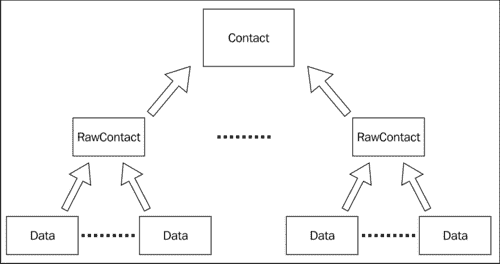
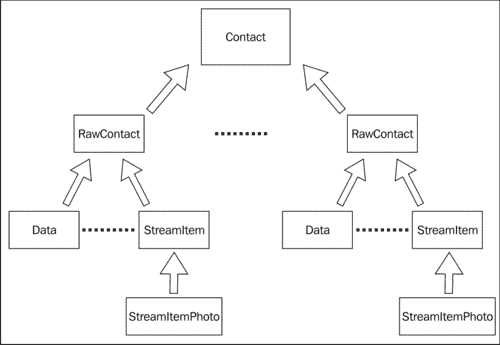
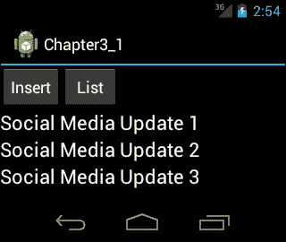
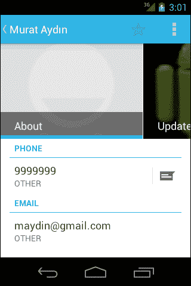
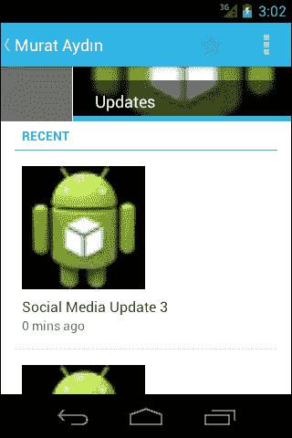
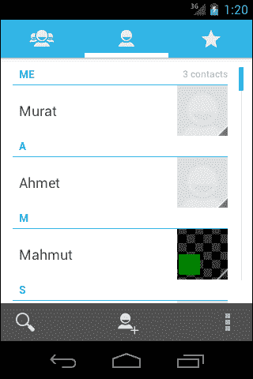

# 第三章：社交 API

随着 Android Ice Cream Sandwich 的推出，引入了新的社交 API，这个 API 使得集成社交网络变得简单。此外，在 Android Ice Cream Sandwich 发布后，可以使用高分辨率照片作为联系人照片。本章通过示例展示了社交 API 的使用。

本章涵盖的主题如下：

+   Android 中的联系人基础

+   使用社交 API

# Android 中的联系人基础

一个人可能有多个联系人信息详情。在 Android 中，这些多个联系人信息详情被合并并显示为一个联系人详情。例如；一个人可能有一个 Google+联系人，一个 Skype 联系人，以及一个电话联系人，Android 将这些联系人全部合并为一个联系人。这些联系人的每个来源都是**RawContact**。每个 RawContact 有一个或多个数据行，它们保存有关联系人的某些数据，如电话号码、电子邮件等。参考以下框图可以更好地理解它们之间的关系：



每个 RawContact 在 Android Ice Cream Sandwich 中都支持存储社交网络流——文本和照片。每个 RawContact 都与**StreamItems**相关联，其中包含来自社交媒体更新的文本、时间戳和评论，如 Google+，每个 StreamItem 都与包含照片的**StreamItemPhotos**相关联（如 Google+帖子中的照片）。然而，存储在 RawContact 中的 StreamItems 数量是有限制的。这个数字可以通过查询`StreamItems.CONTENT_LIMIT_URI URI`获取。当数量超过限制时，将移除时间戳最旧的流项目。以下框图描述了这些块之间的关系：



# 使用社交 API

在以下示例中，我们将展示如何添加**StreamItem**，以及如何显示已添加的 StreamItems。首先，我们在用户界面中插入了两个按钮，一个用于触发插入操作，另一个用于列出 StreamItems。为了显示 StreamItems，我们在布局中放置了三个`TextView`组件。布局 XML 应如下所示：

```kt
<?xml version="1.0" encoding="utf-8"?>
<LinearLayout 
    android:layout_width="fill_parent"
    android:layout_height="fill_parent"
    android:orientation="vertical" >
    <!-- we put two buttons to the user interface, one for triggering insert and one for listing stream items-->
    <LinearLayout
        android:layout_width="match_parent"
        android:layout_height="wrap_content" >
        <Button
            android:id="@+id/buttonInsert"
            android:layout_width="wrap_content"
            android:layout_height="wrap_content"
            android:text="Insert" />

        <Button
            android:id="@+id/buttonList"
            android:layout_width="wrap_content"
            android:layout_height="wrap_content"
            android:text="List" />
    </LinearLayout>
 <!-- In order to display stream items, we put three TextViews to the layout-->
    <TextView
        android:id="@+id/txt1"
        android:layout_width="fill_parent"
        android:layout_height="wrap_content"
        android:textAppearance="?android:attr/textAppearanceLarge"/>
    <TextView
        android:id="@+id/txt2"
        android:layout_width="wrap_content"
        android:layout_height="wrap_content"
        android:textAppearance="?android:attr/textAppearanceLarge" />
    <TextView
        android:id="@+id/txt3"
        android:layout_width="wrap_content"
        android:layout_height="wrap_content"
        android:textAppearance="?android:attr/textAppearanceLarge" />
</LinearLayout>
```

我们将逐步实现`Activity`类，首先添加一个联系人，然后添加`StreamItems`并显示它们。带有`onCreate()`方法的`Activity`类如下代码块所示：

```kt
package com.chapter3;

import java.io.IOException;
import java.io.InputStream;
import java.util.Calendar;
import android.app.Activity;
import android.content.ContentResolver;
import android.content.ContentUris;
import android.content.ContentValues;
import android.database.Cursor;
import android.net.Uri;
import android.os.Bundle;
import android.provider.ContactsContract;
import android.provider.ContactsContract.CommonDataKinds.Email;
import android.provider.ContactsContract.CommonDataKinds.Phone;
import android.provider.ContactsContract.CommonDataKinds.StructuredName;
import android.provider.ContactsContract.Data;
import android.provider.ContactsContract.RawContacts;
import android.provider.ContactsContract.StreamItemPhotos;
import android.provider.ContactsContract.StreamItems;
import android.view.View;
import android.view.View.OnClickListener;
import android.widget.Button;
import android.widget.TextView;

public class Chapter3_1Activity extends Activity implements OnClickListener {

  Button insertButton;
  Button listButton;
  Button chooseButton;
  TextView txt1;
  TextView txt2;
  TextView txt3;
  long rawContactId;

  @Override
  public void onCreate(Bundle savedInstanceState) {
    super.onCreate(savedInstanceState);
    setContentView(R.layout.main);
 //initialize UI components
    insertButton = (Button) this.findViewById(R.id.buttonInsert);
    insertButton.setOnClickListener(this);
    listButton = (Button) this.findViewById(R.id.buttonList);
    listButton.setOnClickListener(this);
    txt1 = (TextView) this.findViewById(R.id.txt1);
    txt2 = (TextView) this.findViewById(R.id.txt2);
    txt3 = (TextView) this.findViewById(R.id.txt3);

  }
       @Override
  public void onClick(View v) {
 // when the insert button is clicked, addContact method // is called
    if (v == insertButton)
      this.rawContactId = addContact("Murat Aydın", "9999999",
          "maydin@gmail.com", "Murat", "com.google");
    else if (v == listButton) {
      getStreams(this.rawContactId);
    } 
  }

}
```

如您在此代码中看到的，我们首先在`onCreate(Bundle savedInstanceState)`方法中获取布局中的`Button`和`TextView`实例。`Chapter3_1Activity`类为按钮实现了`OnClickListener`。如您在`onClick(View v)`方法中看到的，当点击**Insert**按钮时，会调用`addContact()`方法。`addContact()`方法定义如下：

```kt
public long addContact(String name, String phone, String email,
      String accountName, String accountType) {
 // firstly a raw contact is created with the // addRawContact method
    Uri rawContactUri = addRawContact(accountName, accountType);

    if (rawContactUri != null) {
      long rawContactId = ContentUris.parseId(rawContactUri);
 // we use the ID of the created raw contact in // creating name, email, phone number and stream // items
      addName(name, rawContactId);

      addPhoneNumber(phone, rawContactId);

      addEmail(email, rawContactId);

 addContactStreamItem(rawContactId, accountName,
 accountType, "Social Media Update 1");
 addContactStreamItem(rawContactId, accountName,
 accountType, "Social Media Update 2");
 addContactStreamItem(rawContactId, accountName,
 accountType, "Social Media Update 3");

      return rawContactId;
    }
    return 0;
  }
```

在`addContact()`方法中，首先使用`addRawContact()`方法创建一个 RawContact。在`addRawContact()`方法中，我们使用`accountName`和`accountType`来创建原始联系人。`addRawContact()`方法的定义如下：

```kt
public Uri addRawContact(String accountName, String accountType) {
             // we use account name and type to create a raw contact
    ContentResolver cr = getContentResolver();
    ContentValues values = new ContentValues();
 values.put(RawContacts.ACCOUNT_TYPE, accountType);
 values.put(RawContacts.ACCOUNT_NAME, accountName);
    Uri rawContactUri = cr.insert(RawContacts.CONTENT_URI, values);
    return rawContactUri;
  }
```

创建原始联系人后，我们使用创建的原始联系人 ID 来创建姓名、电子邮件、电话号码和 StreamItems。`addName()`，`addEmail()`和`addPhoneNumber()`方法使用`ContentValues`类来创建姓名、电子邮件和电话号码数据，如下代码块所示：

```kt
 // This method is for creating email data
  private void addEmail(String email, long rawContactId) {
    ContentResolver cr = getContentResolver();
    ContentValues values = new ContentValues();
    values.put(Email.ADDRESS, email);
    values.put(Email.TYPE, Email.TYPE_OTHER);
    values.put(Email.MIMETYPE, Email.CONTENT_ITEM_TYPE);
    values.put(Data.RAW_CONTACT_ID, rawContactId);
    cr.insert(Data.CONTENT_URI, values);
  }
 //This method is for creating phone number data
  private void addPhoneNumber(String phone, long rawContactId) {

    ContentResolver cr = getContentResolver();
    ContentValues values = new ContentValues();
    values.put(Phone.NUMBER, phone);
    values.put(Phone.TYPE, Phone.TYPE_OTHER);
    values.put(Phone.MIMETYPE, Phone.CONTENT_ITEM_TYPE);
    values.put(Data.RAW_CONTACT_ID, rawContactId);
    cr.insert(Data.CONTENT_URI, values);
  }
       //This method is for adding name data
  private void addName(String name, long rawContactId) {
    ContentValues values = new ContentValues();
    values.put(Data.RAW_CONTACT_ID, rawContactId);
    values.put(Data.MIMETYPE, StructuredName.CONTENT_ITEM_TYPE);
    values.put(StructuredName.DISPLAY_NAME, name);
    getContentResolver().insert(Data.CONTENT_URI, values);
  }
```

在`addContactStreamItem()`方法中，我们创建 StreamItems。我们提供了原始联系人 ID、StreamItem 的文本、StreamItem 创建时的时间戳（毫秒）、账户名称和类型来创建 StreamItems。原始联系人 ID、账户名称和类型是创建 StreamItem 所需的必填字段。`addContactStreamItem()`方法的定义如下：

```kt
 //StreamItems are created in this method
  private long addContactStreamItem(long rawContactId, String accountName,
 String accountType, String text) {
 // Raw contact ID, account name and type are required // fields for creating a stream item.

 ContentResolver cr = getContentResolver();
 ContentValues values = new ContentValues();
 values.put(StreamItems.RAW_CONTACT_ID, rawContactId);
 values.put(StreamItems.TEXT, text);
 values.put(StreamItems.TIMESTAMP, Calendar.getInstance().getTime()
 .getTime());
 Uri.Builder builder = StreamItems.CONTENT_URI.buildUpon();
 builder.appendQueryParameter(RawContacts.ACCOUNT_NAME,
 accountName);
 builder.appendQueryParameter(RawContacts.ACCOUNT_TYPE,
 accountType);
 Uri streamItemUri = cr.insert(builder.build(), values);
 long streamItemId = ContentUris.parseId(streamItemUri);

 addContactStreamPhoto(streamItemId, accountName, accountType);

 return streamItemId;
 }

```

`addContactStreamPhoto()`方法用于为 StreamItem 创建 StreamItemPhotos。我们必须提供二进制格式的照片，或者`PHOTO_FILE_ID`，或者`PHOTO_URI`。正如以下代码块所示，我们使用了`loadPhotoFromResource`和`readInputStream`方法从资源中加载并创建二进制照片。我们还提供了 StreamItem ID、排序索引、账户名称和类型以创建流照片。如果我们不提供排序索引，将使用 ID 列进行排序。`addContactStreamPhoto()`方法的定义如下：

```kt
 //This method is used for creating a stream photo for a stream item
 private long addContactStreamPhoto(long streamItemId,String accountName,
 String accountType) {
 // provide stream item ID, sort index, account name and type for creating a stream photo
 ContentValues values = new ContentValues();
 values.put(StreamItemPhotos.STREAM_ITEM_ID, streamItemId);
 values.put(StreamItemPhotos.SORT_INDEX, 1);
 values.put(StreamItemPhotos.PHOTO, loadPhotoFromResource(R.drawable.ic_launcher));
 Uri.Builder builder = StreamItems.CONTENT_PHOTO_URI.buildUpon();
 builder.appendQueryParameter(RawContacts.ACCOUNT_NAME, accountName);
 builder.appendQueryParameter(RawContacts.ACCOUNT_TYPE, accountType);
 Uri photoUri = getContentResolver().insert(builder.build(), values);
 long photoId = ContentUris.parseId(photoUri);
 return photoId;
 }
 //This method is used for creating a photo in binary
  private byte[] loadPhotoFromResource(int resourceId) {
        InputStream is = getResources().openRawResource(resourceId);
        return readInputStream(is);
    }
  private byte[] readInputStream(InputStream is) {
        try {
            byte[] buffer = new byte[is.available()];
            is.read(buffer);
            is.close();
            return buffer;
        } catch (IOException e) {
            throw new RuntimeException(e);
        }
    }
```

当点击**列表**按钮时，会调用`getStreams()`方法。正如以下代码所示，在`getStream()`方法中，我们首先使用`getContactId()`方法获取原始联系人的`contactId`详情。然后我们使用这个联系人 ID 作为查询参数来查询 StreamItems。由于我们查询的是 StreamItems，因此使用`ContactsContract.StreamItems.CONTENT_URI`作为 URI。最后，使用游标检索 StreamItems，并在 TextViews 中显示 StreamItems 的文本。`getStreams()`方法和`getContactId()`方法的定义如下：

```kt
 public void getStreams(long rawContactId) {
 long contactId = getContactId(rawContactId);
 ContentResolver cr = getContentResolver();
 Cursor pCur = cr.query(ContactsContract.StreamItems.CONTENT_URI,
 null,
 ContactsContract.StreamItems.CONTACT_ID + " = ?",
 new String[] { String.valueOf(contactId) }, null);
 int i = 0;
 if (pCur.getCount() > 0) {
 while (pCur.moveToNext()) {
 String text = pCur.getString(pCur
 .getColumnIndex(ContactsContract.StreamItems.TEXT));
 if (i == 0)
 this.txt1.setText(text);
 else if (i == 1)
 this.txt2.setText(text);
 else if (i == 2)
 this.txt3.setText(text);
 i++;

 }
 }
 pCur.close();
 }
  public long getContactId(long rawContactId) {
    Cursor cur = null;
    try {
      cur = this.getContentResolver().query(
          ContactsContract.RawContacts.CONTENT_URI,
          new String[] { 
          ContactsContract.RawContacts.CONTACT_ID },
          ContactsContract.RawContacts._ID + "=" + rawContactId, null, null);
      if (cur.moveToFirst()) {
        return cur
            .getLong(cur
                .getColumnIndex(ContactsContract.RawContacts.CONTACT_ID));
      }
    } catch (Exception e) {
      e.printStackTrace();
    } finally {
      if (cur != null) {
        cur.close();
      }
    }
    return -1l;
  }
```

最后，我们需要一些权限来读取和写入社交流和联系人：`READ_SOCI` `AL_STREAM`，`WRITE_SOCIAL_STREAM, READ_CONTACTS`和`WRITE_CONTACTS`。此外，为了使用社交 API，我们必须将最小 SDK 设置为 API Level 15。`AndroidManifest.xml`文件应如下代码块所示：

```kt
<?xml version="1.0" encoding="utf-8"?>
<manifest 
    package="com.chapter3"
    android:versionCode="1"
    android:versionName="1.0" >

 <uses-sdk android:minSdkVersion="15" />
 <uses-permission android:name="android.permission.READ_CONTACTS" />
 <uses-permission android:name="android.permission.READ_SOCIAL_STREAM" />
 <uses-permission android:name="android.permission.WRITE_SOCIAL_STREAM" />
 <uses-permission android:name="android.permission.WRITE_CONTACTS" />

    <application
        android:icon="@drawable/ic_launcher"
        android:label="@string/app_name" >
        <activity
            android:name=".Chapter3_1Activity"
            android:label="@string/app_name" >
            <intent-filter>
                <action android:name="android.intent.action.MAIN" />

                <category android:name="android.intent.category.LAUNCHER" />
            </intent-filter>
        </activity>
    </application>

</manifest>
```

当我们在模拟器中执行应用程序时，点击**插入**按钮，然后点击**列表**按钮；屏幕将如下所示：



当您在模拟器中执行`人员`应用时，您会看到名为**Murat Aydın**的联系人已创建，如下截图所示：



您还将看到我们以编程方式创建的包含照片的最新社交网络更新：



## 设备用户资料

从 API 级别 14 开始，Android 将在联系人列表顶部显示设备用户资料，标记为**我**，如下屏幕所示：



可以使用 `ContactsContract.Profile.CONTENT_URI` 和 `ContactsContract.Profile.CONTENT_RAW_CONTACTS_URI` URI 来读取和写入设备用户资料。操作与读取和写入联系人相似，但需要在 `AndroidManifest.xml` 文件中拥有 `READ_PROFILE` 和 `WRITE_PROFILE` 权限。

# 总结

新的社交 API 随 Android Ice Cream Sandwich 一同引入，使得联系人和社会网络的整合变得更加简单。`StreamItems` 和 `StreamItemPhotos` 类用于存储要保存在联系人中的社交网络更新。在本章中，我们学习了如何使用这些类。此外，我们还学习了设备用户资料，它显示设备用户联系信息。

Android Ice Cream Sandwich 引入了新的 API 来管理日历。在下一章中，我们将学习新的日历 API 及其使用方法。
