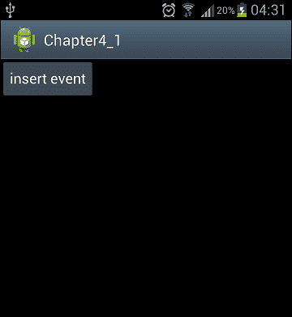
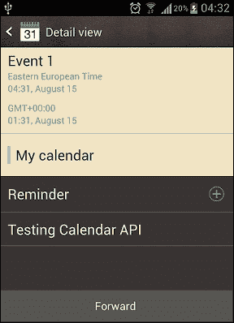
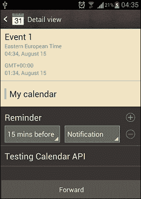

# 第四章：日历 API

Android Ice Cream Sandwich 引入了新的日历 API，用于管理日历。这些 API 可以管理事件、参与者、提醒和重复事件的数据库。这些 API 允许我们轻松地将日历与我们的 Android 应用程序集成。本章展示了如何使用示例使用日历 API。

本章涵盖的主题如下：

+   使用日历 API

+   创建一个事件

+   添加参与者

+   添加一个提醒

# 使用日历 API

管理日历数据的主要类是`CalendarContract`类。值得注意的存储日历信息的表格如下：

+   `CalendarContract.Calendar`：这个表格为每个日历存储特定的日历数据

+   `CalendarContract.Event`：这个表格为每个事件存储特定的事件数据

+   `CalendarContract.Attendee`：这个表格存储了事件参与者的数据

+   `CalendarContract.Reminder`：这个表格存储了事件提醒的数据

### 备注

在以下示例中，我们将在 Android 设备上执行应用程序，因为在模拟器中测试日历 API 需要一个账户。如果你想在模拟器中测试示例，确保在创建**AVD**时选择**Google API**的 API 级别 14 或更高。Google API 允许你向模拟器添加一个 Google 账户，这对于日历 API 是必需的。你还需要设置日历与 Gmail 同步。添加账户时，可以使用`[m.google.com](http://m.google.com)`作为服务器和`<your_email@gmail.com>`作为域/用户名。创建并同步账户后，你可以在模拟器中运行以下示例。

## 创建一个事件

为了创建一个日历事件，我们需要创建一个`ContentValues`实例并将事件信息放入这个实例中。然后，使用`ContentResolver`类，我们可以将事件信息插入到日历中。插入日历中的事件需要一些必填字段。这些字段如下：

+   事件的开始时间

+   如果事件不是重复的，其结束时间

+   如果事件是重复的，其重复规则或重复日期

+   如果事件是重复的，其持续时间

+   事件时区和日历 ID

插入事件的`Activity`类定义如下：

```kt
package com.chapter4;

import java.util.Calendar;
import java.util.TimeZone;

import android.app.Activity;
import android.content.ContentValues;
import android.database.Cursor;
import android.os.Bundle;
import android.content.ContentUris;
import android.net.Uri;
import android.provider.CalendarContract;
import android.view.View;
import android.view.View.OnClickListener;
import android.widget.Button;

public class Chapter4_1Activity extends Activity implements OnClickListener {

  Button insertButton;
  long calendarID;
  long eventID;

    /** Called when the activity is first created. */
    @Override
    public void onCreate(Bundle savedInstanceState) {
        super.onCreate(savedInstanceState);
        setContentView(R.layout.main);

        insertButton = (Button)this.findViewById(R.id.buttonInsertEvent);
        insertButton.setOnClickListener(this);
    }

  @Override
  public void onClick(View v) {

    addEvent();

  }

  private void addEvent() {
    calendarID = getCalendarID();
    ContentValues eventValues = new ContentValues ();
 // provide the required fields for creating an event to
 // ContentValues instance and insert event using // ContentResolver
    eventValues.put (CalendarContract.Events.CALENDAR_ID,calendarID);
    eventValues.put (CalendarContract.Events.TITLE,"Event 1");
    eventValues.put (CalendarContract.Events.DESCRIPTION,
    "Testing Calendar API");
    eventValues.put 
(CalendarContract.Events.DTSTART,Calendar.getInstance().getTimeInMillis());
    eventValues.put 
(CalendarContract.Events.DTEND,Calendar.getInstance().getTimeInMillis());

  eventValues.put(CalendarContract.Events.EVENT_TIMEZONE,
TimeZone.getDefault().toString());

    Uri eventUri = this.getContentResolver().insert 
(CalendarContract.Events.CONTENT_URI, eventValues);
             eventID = ContentUris.parseId(eventUri);
  }
 // we use this method in order to get the ID of the calendar because
 // calendar ID is a required field in creating an event
  public long getCalendarID() {
    Cursor cur = null;
    try {
 // provide CalendarContract.Calendars.CONTENT_URI to
 // ContentResolver to query calendars
      cur = this.getContentResolver().query(
          CalendarContract.Calendars.CONTENT_URI,
          null,null,null, null);
      if (cur.moveToFirst()) {
        return cur
            .getLong(cur

  .getColumnIndex(CalendarContract.Calendars._ID));
      }
      } catch (Exception e) {
      e.printStackTrace();
    } finally {
      if (cur != null) {
      cur.close();
      }
    }
    return -1L;
  }
}
```

如你所见，在这段代码中，我们使用`getCalendarID()`方法来获取日历的 ID，因为`calendarID`在创建事件时是一个必填字段。我们向`ContentResolver`提供了`CalendarContract.Calendars.CONTENT_URI`以查询日历。

我们使用了按钮点击事件来添加一个事件。点击这个按钮时，我们调用`addEvent()`方法。在`addEvent()`方法中，我们为创建事件的必要字段提供给`ContentValues`实例，并使用`ContentResolver`插入事件。我们向`ContentResolver`提供`CalendarContract.Events.CONTENT_URI`以添加一个事件。

本应用程序布局的 XML 代码是`LinearLayout`，包含一个`Button`组件，如下代码块所示：

```kt
<?xml version="1.0" encoding="utf-8"?>
<LinearLayout 
    android:layout_width="fill_parent"
    android:layout_height="fill_parent"
    android:orientation="vertical" >

    <Button
        android:id="@+id/buttonInsertEvent"
        android:layout_width="wrap_content"
        android:layout_height="wrap_content"
        android:text="insert event" />

</LinearLayout>
```

执行此代码时，屏幕将如下所示：



为了使用新的日历 API，`AndroidManifest.xml`文件中的最低 SDK 版本应设置为 API 级别 14 或更高。此外，还需要`WRITE_CALENDAR`和`READ_CALENDAR`权限才能读写日历。`AndroidManifest.xml`文件应如下所示：

```kt
<?xml version="1.0" encoding="utf-8"?>
<manifest 
    package="com.chapter4"
    android:versionCode="1"
    android:versionName="1.0" >

 <uses-sdk android:minSdkVersion="14" />
<uses-permission android:name="android.permission.WRITE_CALENDAR" />
<uses-permission android:name="android.permission.READ_CALENDAR" />
    <application
        android:icon="@drawable/ic_launcher"
        android:label="@string/app_name" >
        <activity
            android:name=".Chapter4_1Activity"
            android:label="@string/app_name" >
            <intent-filter>
                <action android:name="android.intent.action.MAIN" />

                <category android:name="android.intent.category.LAUNCHER" />
            </intent-filter>
        </activity>
    </application>

</manifest>
```

创建事件后，日历将如下所示：



## 使用意图创建事件

同样可以使用`Intent`对象创建事件。以下方法展示了如何使用`Intent`对象添加事件：

```kt
private void addEventUsingIntent() {
    calendarID = getCalendarID();
    Intent intent = new Intent(Intent.ACTION_INSERT)
        .setData(CalendarContract.Events.CONTENT_URI)
        .putExtra(CalendarContract.Events.DTSTART, 
Calendar.getInstance().getTimeInMillis())
        .putExtra(CalendarContract.Events.DTEND, 
Calendar.getInstance().getTimeInMillis())
        .putExtra(CalendarContract.Events.TITLE,"Event 1")
        .putExtra(CalendarContract.Events.DESCRIPTION,"Testing Calendar API");
    startActivity(intent);     
  }
```

我们可以调用这个方法，而不是`addEvent()`方法，以使用`Intent`对象创建事件。通过使用`Intent`对象，我们无需创建视图即可创建事件。使用`Intent`对象是修改和显示日历的最佳实践。

## 添加参与者

添加参与者的过程与创建事件类似。我们使用`CalendarContract.Attendees.CONTENT_URI`作为插入参与者的 URI。插入参与者所需的字段包括事件 ID、参与者电子邮件、参与者关系、参与者状态和参与者类型。我们在应用程序的 XML 布局中放置了一个`Button`组件。结果布局如下所示：

```kt
<?xml version="1.0" encoding="utf-8"?>
<LinearLayout 
    android:layout_width="fill_parent"
    android:layout_height="fill_parent"
    android:orientation="vertical" >

    <Button
        android:id="@+id/buttonInsertEvent"
        android:layout_width="wrap_content"
        android:layout_height="wrap_content"
        android:text="insert event" />

    <Button
        android:id="@+id/buttonInsertAttendee"
        android:layout_width="wrap_content"
        android:layout_height="wrap_content"
        android:text="insert attendee" />
</LinearLayout>
```

然后我们在点击添加参与者按钮时调用以下方法：

```kt
  private void addAttendee()
  {
    ContentValues cv = new ContentValues();
    cv.put(Attendees.ATTENDEE_NAME, "Murat AYDIN");
    cv.put(Attendees.ATTENDEE_EMAIL, "maydin@gmail.com");
    cv.put(Attendees.EVENT_ID, eventID);
    cv.put(Attendees.ATTENDEE_RELATIONSHIP, 
Attendees.RELATIONSHIP_ATTENDEE);
    cv.put(Attendees.ATTENDEE_STATUS, 
Attendees.ATTENDEE_STATUS_INVITED);
    cv.put(Attendees.ATTENDEE_TYPE,Attendees.TYPE_OPTIONAL);

  this.getContentResolver().insert(CalendarContract.Attendees.CONTENT_URI, 
cv);
  }
```

在点击添加参与者按钮之前，应该先创建一个事件，因为我们在插入参与者时需要使用事件 ID。

## 添加提醒

我们使用`CalendarContract.Reminder.CONTENT_URI`作为插入事件提醒的 URI。插入提醒所需的字段包括事件 ID、提醒需要在事件前触发的分钟数以及方法。我们在应用程序的 XML 布局中放置了一个`Button`组件。结果布局如下所示：

```kt
<?xml version="1.0" encoding="utf-8"?>
<LinearLayout 
    android:layout_width="fill_parent"
    android:layout_height="fill_parent"
    android:orientation="vertical" >

    <Button
        android:id="@+id/buttonInsertEvent"
        android:layout_width="wrap_content"
        android:layout_height="wrap_content"
        android:text="insert event" />

    <Button
        android:id="@+id/buttonInsertAttendee"
        android:layout_width="wrap_content"
        android:layout_height="wrap_content"
        android:text="insert attendee" />

    <Button
        android:id="@+id/buttonInsertReminder"
        android:layout_width="wrap_content"
        android:layout_height="wrap_content"
        android:text="insert reminder" />

</LinearLayout>
```

然后我们在点击添加提醒按钮时调用以下方法：

```kt
private void addReminder()
  {
    ContentValues values = new ContentValues();
    values.put(Reminders.MINUTES, 15);
    values.put(Reminders.EVENT_ID, eventID);
    values.put(Reminders.METHOD, Reminders.METHOD_ALERT);

  this.getContentResolver().insert(CalendarContract.Reminders.CONTENT_URI, 
  values);
  }
```

如你所见，在这段代码中，这个提醒会在事件发生前 15 分钟触发。在按下添加提醒按钮之前，应该先创建一个事件，因为我们在插入提醒时需要使用事件 ID。

添加提醒后，日历将如下所示：



# 概要

使用新的日历 API，将日历集成到 Android 应用程序变得更加容易。在本章中，我们学习了如何创建一个事件以及创建事件所需的字段。然后我们了解了如何向事件中添加参与者和提醒。我们需要设置修改日历所需的权限。

尽管片段（Fragments）是在 Android 3.0 中引入的，但现在它们也适用于配备 Android Ice Cream Sandwich 的小屏幕设备。在下一章中，我们将介绍**片段**的基础知识以及如何使用它们。
