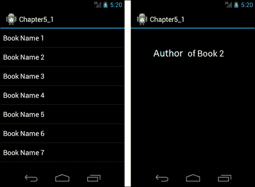

# 第五章：碎片

尽管**碎片**是在 Android 3.0 中引入的，但现在它们也适用于小屏幕设备，支持 Android Ice Cream Sandwich。本章将介绍碎片的基础知识以及如何使用它们。

本章涵盖的主题如下：

+   碎片基础

+   创建和管理碎片

+   碎片类型

# 碎片基础

**碎片**是活动中的一个模块化组件，它有自己的生命周期和事件处理，与活动非常相似。尽管碎片有自己的生命周期，但它们直接受到所属活动生命周期的直接影响。例如，如果一个活动被销毁，它的碎片也会被销毁。每个碎片都应该有一个所属活动。碎片可以动态地添加到活动中或从活动中移除。

碎片提高了软件的可复用性，并在用户界面设计中提供了灵活性。一个碎片可以被多个活动使用。这样，你只需实现一次，就可以多次使用。此外，碎片可以用于不同的布局配置和不同的屏幕模式，从而在用户界面设计中提供灵活性。

### 注意

设计碎片时，重要的是要使它们能够独立工作，即它们不应该依赖于其他碎片和活动。这样，碎片可以独立于其他碎片被复用。

## 碎片生命周期

碎片拥有自己的生命周期；然而，它们仍然直接受到所属活动生命周期的直接影响。下图展示了碎片生命周期的创建流程：


图中的各个块执行以下任务：

+   `onAttach():` 当碎片被添加到活动中时，会调用`onAttach()`方法。

+   `onCreate():` 当创建碎片时，会调用此方法。

+   `onCreateView():` 此方法返回一个视图。这个视图是碎片的用户界面。如果碎片只进行后台工作并且没有用户界面，那么这个方法应该返回 null。

+   `onActivityCreated():` 在所属活动创建后，会调用此方法。

+   `onStart():` 在此方法被调用后，碎片的视图对用户可见。

+   `onResume()`: 在此方法被调用后，碎片变为活动状态，用户可以与碎片交互。这个方法可能会被多次调用，因为每次应用重新启动或暂停后都会调用此方法。

下图展示了碎片生命周期的销毁流程：


图中的各个块执行以下任务：

+   `onPause():` 当碎片暂停并且不再与用户交互时，会调用此方法。

+   `onStop():` 当碎片停止时，会调用此方法。在此方法被调用后，碎片对用户不再可见。

+   `onDestroyView():` 当碎片视图被销毁时，会调用此方法。

+   `onDestroy():` 当片段不再使用时，会调用这个方法。

+   `onDetach()`: 当片段从活动中移除时，会调用这个方法。

# 创建和管理片段

我们将要学习如何通过一个示例安卓应用来创建和管理片段。这个应用将列出书籍名称。当点击书籍名称时，会显示书籍的作者。这个应用将针对小屏幕和大屏幕设备进行设计，这样我们就能看到如何在不同屏幕尺寸下使用片段。以下是为小屏幕设备的应用截图。如您在这张截图中所见，屏幕左侧有书籍列表，当点击书籍时，屏幕右侧会显示点击书籍的作者信息：



我们将首先实现这些屏幕，然后针对大屏幕设计这个应用。

在这个应用中，我们有两个活动（Activity），一个用于第一屏，另一个用于第二屏。每个活动包含一个片段（Fragment）。以下图表展示了该应用的结构：


`Fragment B` 的布局 XML 代码如下：

```kt
<?xml version="1.0" encoding="utf-8"?>
<LinearLayout 
    android:layout_width="match_parent"
    android:layout_height="match_parent"
    android:gravity="center_horizontal"
    android:orientation="vertical" >
    <TextView
        android:id="@+id/textViewAuthor"
        android:layout_width="wrap_content"
        android:layout_height="wrap_content"
        android:textAppearance="?android:attr/textAppearanceLarge" />

</LinearLayout>
```

如您在这段代码中看到的，它有一个包含 `TextView` 组件的 `LinearLayout` 布局。`TextView` 用于显示书籍的作者。我们没有为 `Fragment A` 设计布局，因为它是包含 `ListView` 组件的 `ListFragment` 属性。

现在我们需要为每个片段创建两个扩展 `Fragment` 类的类。以下是 `Fragment A` 的类定义：

```kt
package com.chapter5;

import android.app.ListFragment;
import android.content.Intent;
import android.os.Bundle;
import android.view.View;
import android.widget.AdapterView;
import android.widget.AdapterView.OnItemClickListener;
import android.widget.ArrayAdapter;

public class Chapter5_1FragmentA extends ListFragment implements  
OnItemClickListener {

  @Override
  public void onActivityCreated(Bundle savedInstanceState) {
             super.onActivityCreated(savedInstanceState);
             //initialize the adapter and set on click events of items
    ArrayAdapter<String> adapter = new ArrayAdapter<String>(getActivity(),
        android.R.layout.simple_list_item_1, Book.BOOK_NAMES);
    this.setListAdapter(adapter);
    getListView().setOnItemClickListener(this);
  }
  @Override
  public void onItemClick(AdapterView<?> parent, View view, int position, long id) 
  {
    //Start a new Activity in order to display author name
    String author = Book.AUTHOR_NAMES[position];
    Intent intent = new Intent(getActivity().getApplicationContext(),
    Chapter5_1Activity_B.class);
    intent.putExtra("author", author);
    startActivity(intent);
  }
}
```

如您所见，`Chapter5_1FragmentA` 类扩展了 `ListFragment`，因为我们在这一屏中列出书籍。它类似于 `ListActivity`，并且这个类有一个 `ListView` 视图。在 `onActivityCreated` 方法中，我们设置了 `ListFragment` 的 `ListAdapter` 属性。适配器的数据源是一个包含书籍名称和作者字符串数组的类，如下代码块所示：

```kt
package com.chapter5;

public class Book {
  public static final String[] BOOK_NAMES = { "Book Name 1", "Book Name 2", "Book Name 3", "Book Name 4", "Book Name 5", "Book Name 6", "Book Name 7", "Book Name 8" };
  public static final String[] AUTHOR_NAMES = { "Author of Book 1", "Author of Book 2", "Author of Book 3", "Author of Book 4", "Author of Book 5", "Author of Book 6", "Author of Book 7", "Author of Book 8" };
}
```

在初始化`ListAdapter`之后，我们设置了`ListView`视图的`OnItemClickListener`事件。当点击`ListView`的项时，会调用此事件。项被点击时，会调用`onItemClick`方法。在这个方法中，会启动一个新的活动，显示书籍作者的信息。如代码所示，我们通过`getActivity()`方法获取到片段的所有者活动。我们也可以通过`getActivity()`方法获取`ApplicationContext`。请记住，`OnCreateView`方法是在`OnActivityCreated`之前调用的，因此我们在`OnActivityCreated`方法中初始化`ListAdapter`和`ListView`，因为我们需要在初始化它们之前创建用户界面组件，而这些组件是在`OnCreateView`中创建的。我们不需要重写`ListFragment`的`OnCreateView`方法，因为它已经返回了一个`ListView`。如果你想要使用自定义的`ListView`，可以重写`OnCreateView`方法。

以下是`Fragment B`的类：

```kt
package com.chapter5;

import android.app.Fragment;
import android.os.Bundle;
import android.view.LayoutInflater;
import android.view.View;
import android.view.ViewGroup;

public class Chapter5_1FragmentB extends Fragment {

  @Override
  public View onCreateView(LayoutInflater inflater, ViewGroup container,
      Bundle savedInstanceState) {

    View view = inflater.inflate(R.layout.fragment_b, container, false);
    return view;
  }
}
```

从这段代码中可以看出，如果一个片段有用户界面，那么应该重写这个方法，并且返回一个视图。在我们的示例应用程序中，我们返回了一个使用我们之前实现的 XML 布局填充的视图。

现在我们需要两个托管这些片段的活动类。以下是托管`Fragment A`的`Activity A`的`Activity`类：

```kt
package com.chapter5;

import android.app.Activity;
import android.os.Bundle;

public class Chapter5_1Activity_A extends Activity {
    /** Called when the activity is first created. */
    @Override
    public void onCreate(Bundle savedInstanceState) {
        super.onCreate(savedInstanceState);
        setContentView(R.layout.activity_a);
    }
}
```

这是一个简单的`Activity`类，只是用布局设置了内容视图。`Activity A`类的 XML 布局代码如下：

```kt
<?xml version="1.0" encoding="utf-8"?>
<LinearLayout 
    android:layout_width="fill_parent"
    android:layout_height="fill_parent"
    android:orientation="vertical">

    <fragment
        android:id="@+id/fragment_a"
        android:layout_width="match_parent"
        android:layout_height="match_parent"
        class="com.chapter5.Chapter5_1FragmentA" />

</LinearLayout>
```

从这段代码中可以看出，我们使用类属性`com.chapter5.Chapter5_1FragmentA`指定了`Fragment A`，并且我们还指定了`id`属性。片段应该有一个`id`或`tag`属性作为标识符，因为当活动重新启动时，Android 需要它来恢复片段。

以下是托管`Fragment B`的`Activity B`的`Activity`类：

```kt
package com.chapter5;

import android.app.Activity;
import android.os.Bundle;
import android.widget.TextView;

public class Chapter5_1Activity_B extends Activity {
    /** Called when the activity is first created. */
    @Override
    public void onCreate(Bundle savedInstanceState) {
        super.onCreate(savedInstanceState);
        setContentView(R.layout.activity_b);

        Bundle extras = getIntent().getExtras();
    if (extras != null) {
      String s = extras.getString("author");
      TextView view = (TextView) findViewById(R.id.textViewAuthor);
      view.setText(s);
    }
    }
}
```

这是一个简单的`Activity`类，只是用布局设置了内容视图。`Activity B`的 XML 布局代码如下：

```kt
<?xml version="1.0" encoding="utf-8"?>
<LinearLayout 
    android:layout_width="match_parent"
    android:layout_height="match_parent"
    android:orientation="vertical" >

    <fragment
        android:id="@+id/fragment_b"
        android:layout_width="match_parent"
        android:layout_height="match_parent"
        class="com.chapter5.Chapter5_1FragmentB" />

</LinearLayout>
```

从这段代码中可以看出，我们使用类属性`com.chapter5.Chapter5_1FragmentB`指定了`Fragment B`。

## 以编程方式添加一个片段

在我们之前的示例应用程序中，我们曾在 XML 布局代码中将一个片段添加到活动布局中。你也可以以编程方式将片段添加到活动中。以下是我们之前示例应用程序的以编程方式添加片段的版本以及活动的 XML 布局代码：

```kt
package com.chapter5;

import android.app.Activity;
import android.app.FragmentManager;
import android.app.FragmentTransaction;
import android.os.Bundle;

public class Chapter5_1Activity_A extends Activity {
  /** Called when the activity is first created. */
  @Override
  public void onCreate(Bundle savedInstanceState) {
    super.onCreate(savedInstanceState);
    setContentView(R.layout.activity_a);
    addFragment();
  }

 public void addFragment() {
 FragmentManager fragmentManager = getFragmentManager();
 FragmentTransaction fragmentTransaction = fragmentManager.beginTransaction();

 Chapter5_1FragmentA fragment = new Chapter5_1FragmentA();
 fragmentTransaction.add(R.id.layout_activity_a, fragment);
 fragmentTransaction.commit();
 }
}
<?xml version="1.0" encoding="utf-8"?>
<LinearLayout 
    android:id="@+id/layout_activity_a"
    android:layout_width="fill_parent"
    android:layout_height="fill_parent"
    android:orientation="vertical" >

</LinearLayout>
```

从这个 XML 代码中可以看出，我们移除了`Fragment`标签，因为我们是程序化地添加`Fragment A`。在`Chapter5_1Activity_A`类中，我们添加了一个名为`addFragment()`的方法。我们使用了`FragmentTransaction`类来添加`Fragment A`。`FragmentTransaction`类用于添加片段、移除片段、将片段附加到 UI 等操作。在`addMethod()`方法中可以看出，你可以通过`FragmentManager`使用`beginTransaction()`方法获取`FragmentTransaction`的实例。最后，我们必须调用`commit()`方法，以便应用更改。

`FragmentManager`用于管理片段。从代码中可以看出，你可以通过`getFragmentManager()`方法获取`FragmentManager`的实例。`FragmentManager`允许你通过`beginTransaction()`方法开始一个事务，通过`findFragmentById()`或`findFragmentbyTag()`方法在活动中获取一个片段，以及通过`popBackStack()`方法将片段从返回栈中弹出。

## 与活动共享事件

在我们的示例中，我们在`ListFragment`类的`onItemClick`方法中启动了一个活动。我们可以通过在`ListFragment`中创建一个回调接口，并让`Activity`类实现该回调，来建立相同的操作。这样，`Fragment`类就会通知所有者`Activity`类。当所有者`Activity`类得到通知时，可以通过其他片段共享该通知。这种方式，片段可以共享事件并进行通信。我们可以按照以下步骤进行此操作：

1.  我们在`Chapter5_1FragmentA`类中创建回调接口：

    ```kt
    public interface OnBookSelectedListener 
      {
        public void onBookSelected(int bookIndex);
      }
    ```

1.  我们在`Chapter5_1FragmentA`类中创建一个`OnBookSelectedListener`实例，并将所有者活动分配给该实例：

    ```kt
    OnBookSelectedListener mListener;
    @Override
      public void onAttach(Activity activity) {
        super.onAttach(activity);
        mListener = (OnBookSelectedListener) activity;
      }
    ```

    从这段代码中可以看出，`Chapter5_1FragmentA`的所有者活动类应该实现`onBookSelectedListener`实例，否则会出现类转换异常。

1.  我们让`Chapter5_1Activity_A`类实现`onBookSelectedListener`接口：

    ```kt
    public class Chapter5_1Activity_A extends Activity implements 
    OnBookSelectedListener {
    //some code here
            @Override
            public void onBookSelected(int bookIndex) {

              String author = Book.AUTHOR_NAMES[bookIndex];
              Intent intent = new Intent(this,Chapter5_1Activity_B.class);
              intent.putExtra("author", author);
              startActivity(intent);
           } 
    //some more code here
    }
    ```

    从这段代码中可以看出，`Chapter5_1Activity_A`在事件回调中接收选定的书籍索引，并使用作者数据启动活动。

1.  我们在`Chapter5_1FragmentA`类的`onItemClick`方法中调用了`onBookSelected`方法：

    ```kt
    @Override
    public void onItemClick(AdapterView<?> parent, View view, int position, long id) {

      mListener.onBookSelected(position);
    }
    ```

这样，我们就让活动和片段共享了一个事件回调。

## 在活动中使用多个片段

我们的示例书籍列表应用程序是为小屏幕设计的。当你在更大的屏幕上执行此应用程序时，它看起来会很糟糕。我们必须在大屏幕尺寸中有效地利用空间。为了实现这一点，我们必须为大屏幕创建一个新的布局。新布局如下：

```kt
<?xml version="1.0" encoding="utf-8"?>
<LinearLayout 
    android:id="@+id/layout_small_a"
    android:layout_width="fill_parent"
    android:layout_height="fill_parent"
    android:orientation="horizontal" >

 <fragment
        android:id="@+id/fragment_a"
        android:layout_width="fill_parent"
        android:layout_height="fill_parent"
        class="com.chapter5.Chapter5_1FragmentA" 
        android:layout_weight="1"/>
 <fragment
        android:id="@+id/fragment_b"
        android:layout_width="fill_parent"
        android:layout_height="fill_parent"
        class="com.chapter5.Chapter5_1FragmentB" 
        android:layout_weight="1"/>

</LinearLayout>
```

从此代码中可以看出，我们将两个片段放入了水平`LinearLayout`布局中。在之前的示例应用程序中，每个活动中只有一个片段，但为了有效地利用空间，这个活动中有两个片段。通过将`layout_weight`属性设置为`1`，我们使片段在屏幕上占据相等的空间。

我们必须将这个新的布局 XML 文件放在`res`文件夹下的一个名为`layout-xlarge-land`的文件夹中。这样，当设备屏幕大且处于横屏模式时，Android 会使用这个布局文件。Android 根据布局文件夹名称在运行时决定使用哪个布局文件。`layout`是 Android 的默认文件夹名称。如果 Android 找不到适合设备屏幕尺寸和模式的布局文件夹，它会使用`layout`文件夹中的布局。一些常见的布局限定符如下：

+   `small`用于小屏幕尺寸

+   `normal`用于正常屏幕尺寸

+   `large`用于大屏幕尺寸

+   `xlarge`用于超大屏幕尺寸

+   `land`用于横屏方向

+   `port`用于竖屏方向

然而，这种布局还不足以使我们的示例在大屏幕上正确运行。为了使新布局正确运行，我们必须改变管理片段的方式。更新`Chapter5_1Activity_A`中的`onBookSelected`属性如下：

```kt
  @Override
  public void onBookSelected(int bookIndex) {

    FragmentManager fragmentManager = getFragmentManager();
    Fragment fragment_b = fragmentManager.findFragmentById(R.id.fragment_b);
    String author = Book.AUTHOR_NAMES[bookIndex];
    if(fragment_b == null)
    {
      Intent intent = new Intent(this,
          Chapter5_1Activity_B.class);
      intent.putExtra("author", author);
      startActivity(intent);
    }
    else
    {
      TextView textViewAuthor = (TextView)fragment_b.getView().findViewById(R.id.textViewAuthor);
      textViewAuthor.setText(author);
    }
  }
```

从这段代码中可以看出，我们通过使用`FragmentManager`获取了`Fragment B`类。如果`fragment_b`不为空，我们理解此活动包含`Fragment B`，并且设备具有大屏幕，因为只有在屏幕大且处于横屏模式时，`Activity A`才会使用`Fragment B`。然后使用`fragment_b`，我们获取了`textViewAuthor` TextView 组件，并用所选书籍的作者姓名更新其文本。在屏幕右侧，我们可以看到所选书籍的作者姓名。

如果`fragment_b`为空，我们理解设备屏幕较小，并通过`Intent`启动新的活动。

在`AndroidManifest.xml`文件中，我们必须将最低 SDK 版本设置为 API 级别 14，因为自 API 级别 14 起，小屏幕上就已经可以使用片段了。`AndroidManifest.xml`文件应如下面的代码块所示：

```kt
<?xml version="1.0" encoding="utf-8"?>
<manifest 
    package="com.chapter5"
    android:versionCode="1"
    android:versionName="1.0" >

    <uses-sdk android:minSdkVersion="14" />

    <application
        android:icon="@drawable/ic_launcher"
        android:label="@string/app_name" >
        <activity
            android:name=".Chapter5_1Activity_A"
            android:label="@string/app_name" >
            <intent-filter>
                <action android:name="android.intent.action.MAIN" />

                <category android:name="android.intent.category.LAUNCHER" />
            </intent-filter>
        </activity>
        <activity android:name=".Chapter5_1Activity_B"/>
    </application>

</manifest>
```

在大屏幕上，我们的示例应用程序将如下所示：


# 片段的类型

有四种类型的片段：

+   `ListFragment`

+   `DialogFragment`

+   `PreferenceFragment`

+   `WebViewFragment`

在本节中，我们将开发一个使用这些片段的示例应用程序。在本节结束时，应用程序将开发完成。

## `ListFragment`

此片段与`ListActivity`相似，默认包含一个`ListView`视图，用于显示项目列表。在我们之前的示例代码中，我们使用了`ListFragment`；有关`ListFragment`的创建和管理，请参阅*创建和管理片段*部分。

## `DialogFragment`

此片段在其所属活动的顶部显示一个对话框。在以下示例应用程序中，我们将创建一个带有**删除**按钮的片段。点击该按钮时，将显示一个**DialogFragment**对话框。**DialogFragment**对话框将包含一条确认信息以及两个按钮——**确定**和**取消**按钮。如果点击**确定**按钮，将显示一条消息，并关闭**DialogFragment**。示例应用程序的屏幕将如下截图所示：


带有**删除**按钮的片段的布局 XML 代码如下：

```kt
<?xml version="1.0" encoding="utf-8"?>
<LinearLayout 
    android:layout_width="match_parent"
    android:layout_height="match_parent"
    android:gravity="center_horizontal"
    android:orientation="vertical" >

    <Button
        android:id="@+id/buttonFragment"
        android:layout_width="wrap_content"
        android:layout_height="wrap_content"
        android:text="Delete" />

</LinearLayout>
```

这个布局是一个简单的布局，其中包含一个`LinearLayout`布局和一个`Button`组件。此布局的`Fragment`类如下：

```kt
package com.chapter5;

import android.app.Fragment;
import android.app.FragmentTransaction;
import android.os.Bundle;
import android.view.LayoutInflater;
import android.view.View;
import android.view.View.OnClickListener;
import android.view.ViewGroup;
import android.widget.Button;

public class Chapter5_2Fragment extends Fragment implements OnClickListener{

  Button fragmentButton;
  @Override
  public View onCreateView(LayoutInflater inflater, ViewGroup container,
      Bundle savedInstanceState) {

    View view = inflater.inflate(R.layout.fragment, container, false);
    fragmentButton = (Button)view.findViewById(R.id.buttonFragment);
    fragmentButton.setOnClickListener(this);
    return view;
  }

  @Override
 public void onClick(View v) {
 //we need a FragmentTransaction in order to display a dialog
 FragmentTransaction transaction = getFragmentManager().beginTransaction();

 Chapter5_2DialogFragment dialogFragment = new Chapter5_2DialogFragment();

 dialogFragment.show(transaction, "dialog_fragment");

 }
}
```

如您从这段代码中看到的，在`Chapter5_2Fragment`类的`onClick`方法中，创建了`Chapter5_2DialogFragment`类的一个实例，并使用此实例显示对话框，通过其`show()`方法。

**DialogFragment**对话框的布局代码如下：

```kt
<?xml version="1.0" encoding="utf-8"?>
<GridLayout android:layout_width="wrap_content"
    android:layout_height="wrap_content"
    android:layout_gravity="center_horizontal"
    android:columnCount="2"
    android:orientation="horizontal" >

    <TextView
        android:id="@+id/textViewMessage"
        android:layout_width="fill_parent"
        android:layout_height="wrap_content"
        android:layout_columnSpan="2"
        android:layout_gravity="fill"
        android:text="This item will be deleted. Do you want to continue?"
        android:textAppearance="?android:attr/textAppearanceLarge" />

     <!—we used a linear layout here because we need it in order to evenly distribute the buttons -->
    <LinearLayout
        android:layout_width="wrap_content"
        android:layout_gravity="fill_horizontal"
        android:layout_columnSpan="2" >

        <Button
            android:id="@+id/buttonOk"
            android:layout_width="fill_parent"
            android:layout_height="wrap_content"
            android:layout_weight="1"
            android:text="OK" />

    <Button
        android:id="@+id/buttonCancel"
        android:layout_width="fill_parent"
        android:layout_height="wrap_content"
        android:layout_weight="1"
        android:text="CANCEL" />

    </LinearLayout>

</GridLayout>
```

如您从之前的代码中看到的，我们使用了`GridLayout`作为根布局。然后我们输入了一个显示确认信息的`TextView`组件。最后，在布局中添加了两个按钮——**确定**和**取消**按钮。以下是此布局的`DialogFragment`类：

```kt
package com.chapter5;

import android.app.DialogFragment;
import android.os.Bundle;
import android.view.LayoutInflater;
import android.view.View;
import android.view.View.OnClickListener;
import android.view.ViewGroup;
import android.widget.Button;
import android.widget.Toast;

public class Chapter5_2DialogFragment extends DialogFragment implements
OnClickListener{

  Button okButton;
  Button cancelButton;
  @Override
  public View onCreateView(LayoutInflater inflater, ViewGroup container,
      Bundle savedInstanceState) {

    View view = inflater.inflate(R.layout.dialog_fragment, container, false);
    //initialize the buttons and set click events
    okButton = (Button)view.findViewById(R.id.buttonOk)
    okButton.setOnClickListener(this);

    cancelButton = (Button)view.findViewById(R.id.buttonCancel);
    cancelButton.setOnClickListener(this);

    return view;
  }

  @Override
  public void onClick(View v) {

    if(v == cancelButton)
      dismiss();
    else if( v == okButton)
    {
      Toast.makeText(this.getActivity(), "Item is deleted.", Toast.LENGTH_LONG).show();
      dismiss();
    }

  }
}
```

如您从这段代码中看到的，这个类扩展了`DialogFragment`类。在`Chapter5_2DialogFragment`类的`onCreateView`方法中，我们初始化按钮并为它们设置`onClick`事件。在`Chapter5_2DialogFragment`类的`onClick`方法中，我们处理按钮点击事件。如果点击的按钮是**取消**，我们关闭对话框窗口。如果点击的按钮是**确定**，我们显示一条信息消息并关闭对话框。如您从前面的代码中看到的，`dismiss()`方法用于关闭对话框。

## PreferenceFragment

这个片段与`PreferenceActivity`类似。它显示偏好设置，并将其保存到`SharedPreferences`中。在本节中，我们将扩展之前的示例代码。我们将添加一个关于在删除期间显示确认信息的偏好设置。用户可以选择是否查看确认信息。以下是使用`PreferenceFragment`的步骤：

1.  创建一个偏好屏幕的源 XML，并将其放在`res/xml`文件夹下：

    ```kt
    <?xml version="1.0" encoding="utf-8"?>
    <PreferenceScreen  >

        <CheckBoxPreference android:summary="check this in order to show confirmation message when deleting"
            android:title="show confirmation message" 
            android:key="checkbox_preference"/>

    </PreferenceScreen>
    ```

    如您从之前的代码中看到的，我们的偏好屏幕包含一个用于确认信息的复选框偏好设置。

1.  创建一个扩展`PreferenceFragment`的类：

    ```kt
    package com.chapter5;

    import android.os.Bundle;
    import android.preference.PreferenceFragment;

    public class Chapter5_2PereferenceFragment extends PreferenceFragment {

      @Override
      public void onCreate(Bundle savedInstanceState) {
        super.onCreate(savedInstanceState);
        addPreferencesFromResource(R.xml.pref);
      }

    }
    ```

从这段代码中可以看出，创建一个偏好设置屏幕非常简单；你只需调用`addPreferencesFromResource`方法，并传入你为偏好设置创建的 XML 文件即可。现在，我们将添加一个设置选项菜单项，并通过点击这个菜单项来打开偏好设置屏幕。为了实现这一点，我们将按照以下步骤修改`Chapter5_2Fragment`类：

1.  我们将在`Chapter5_2Fragment`类的`onCreateView`方法中添加`setHasOptionsMenu(true)`：

    ```kt
      @Override
      public View onCreateView(LayoutInflater inflater, ViewGroup container, Bundle savedInstanceState) 
    {

        View view = inflater.inflate(R.layout.fragment, container, false);
        fragmentButton = (Button)view.findViewById(R.id.buttonFragment);	
        fragmentButton.setOnClickListener(this);

        setHasOptionsMenu(true);
        return view;
      }
    ```

1.  我们将在`Chapter5_2Fragment`类中添加以下方法：

    ```kt
      @Override
      public void onCreateOptionsMenu(Menu menu, MenuInflater inflater) {
        inflater.inflate(R.menu.fragment_menu, menu);

      }

      @Override
      public boolean onOptionsItemSelected(MenuItem item) {

        Intent intent = new Intent(getActivity(),Chapter5_2PreferenceActivity.class);
        startActivity(intent);
        return true;
      }
    ```

从这段代码中可以看出，`onCreateOptionsMenu`为选项菜单做出了贡献。这就是一个片段如何为所属活动的菜单做出贡献的。当点击选项菜单项时，将使用`onOptionsItemSelected`方法启动一个新的活动。

`fragment_menu`菜单 XML 如下所示：

```kt
<menu >
    <item android:id="@+id/itemSettings" android:title="Settings"></item>
</menu>
```

`Chapter5_2PreferenceActivity`是托管`Chapter5_2PereferenceFragment`的类：

```kt
package com.chapter5;

import android.app.Activity;
import android.os.Bundle;

public class Chapter5_2PreferenceActivity extends Activity {

  @Override
  protected void onCreate(Bundle savedInstanceState) {
    super.onCreate(savedInstanceState);

    getFragmentManager().beginTransaction()
 .replace(android.R.id.content, new Chapter5_2PereferenceFragment())
 .commit();
  }
}
```

从这段代码中可以看出，我们以编程方式将`Chapter5_2PereferenceFragment`添加到`Chapter5_2PreferenceActivity`类中。

偏好设置屏幕应如下所示截图：


通过添加此偏好设置选项，用户可以选择是否接收确认消息。（要读取设置，请使用标准的`SharedPreference` API。）

## `WebViewFragment`

`WebViewFragment`是一个预先封装在片段中的`WebView`。当片段暂停或恢复时，此片段中的`WebView`会自动暂停或恢复。在本节中，我们将扩展之前的示例代码，以展示`WebViewFragment`的使用方法。

1.  我们在`Chapter5_2Fragment`类的布局 XML 代码中添加了一个**打开网页**按钮。生成的布局如下所示：

    ```kt
    <?xml version="1.0" encoding="utf-8"?>
    <LinearLayout 
        android:id="@+id/layout_fragment"
        android:layout_width="match_parent"
        android:layout_height="match_parent"
        android:gravity="center_horizontal"
        android:orientation="vertical" >

        <Button
            android:id="@+id/buttonFragment"
            android:layout_width="wrap_content"
            android:layout_height="wrap_content"
            android:text="Delete" />

     <Button
     android:id="@+id/buttonOpenWeb"
     android:layout_width="wrap_content"
     android:layout_height="wrap_content"
     android:text="Open Web" />

    </LinearLayout>
    ```

1.  我们创建了一个扩展`WebViewFragment`的类，以及一个使用以下代码块托管此片段的活动：

    ```kt
    package com.chapter5;

    import android.os.Bundle;
    import android.webkit.WebViewFragment;

    public class Chapter5_2WebViewFragment extends WebViewFragment {

      @Override
      public void onActivityCreated(Bundle savedInstanceState) {
        super.onActivityCreated(savedInstanceState);

        getWebView().loadUrl("http://www.google.com");
      }
    }
    ```

从这段代码中可以看出，我们在`onActivityCreated`方法中获取了`WebView`实例，并加载了一个打开谷歌网站的 URL。

托管此片段的活动如下：

```kt
package com.chapter5;

import android.app.Activity;
import android.os.Bundle;

public class Chapter5_2WebActivity extends Activity {

  @Override
  protected void onCreate(Bundle savedInstanceState) {
    super.onCreate(savedInstanceState);

 getFragmentManager().beginTransaction()
 .replace(android.R.id.content, new Chapter5_2WebViewFragment())
 .commit();
  }
}
```

从这段代码中可以看出，我们以编程方式将`Chapter5_2WebViewFragment`添加到`Chapter5_2WebViewActivity`中。当点击**打开网页**按钮时，这个示例应用程序将打开[www.google.com](http://www.google.com)网站。

`Chapter5_2Fragment`类的最终版本如下：

```kt
package com.chapter5;

import android.app.Fragment;
import android.app.FragmentTransaction;
import android.content.Intent;
import android.os.Bundle;
import android.view.LayoutInflater;
import android.view.Menu;
import android.view.MenuInflater;
import android.view.MenuItem;
import android.view.View;
import android.view.View.OnClickListener;
import android.view.ViewGroup;
import android.widget.Button;

public class Chapter5_2Fragment extends Fragment implements OnClickListener{

  Button fragmentButton;
  Button openWebButton;

  @Override
  public View onCreateView(LayoutInflater inflater, ViewGroup container, Bundle savedInstanceState) {

    View view = inflater.inflate(R.layout.fragment, container, false);
    fragmentButton = (Button)view.findViewById(R.id.buttonFragment);	
    fragmentButton.setOnClickListener(this);

    openWebButton = (Button)view.findViewById(R.id.buttonOpenWeb);
    openWebButton.setOnClickListener(this);

    setHasOptionsMenu(true);
    return view;
  }

  @Override
  public void onClick(View v) {
 if(v == fragmentButton)
 {
 FragmentTransaction transaction = getFragmentManager().beginTransaction();
 Chapter5_2DialogFragment dialogFragment = new Chapter5_2DialogFragment();
 dialogFragment.show(transaction, "dialog_fragment");
 }
 else if( v == openWebButton)
 {
 Intent intent = new Intent(getActivity(),Chapter5_2WebActivity.class);
 startActivity(intent);
 }
  }

  @Override
  public void onCreateOptionsMenu(Menu menu, MenuInflater inflater) {
    inflater.inflate(R.menu.fragment_menu, menu);

  }

  @Override
  public boolean onOptionsItemSelected(MenuItem item) {

Intent intent = new Intent(getActivity(),Chapter5_2PreferenceActivity.class);
    startActivity(intent);
    return true;
  }
}
```

该应用程序的主`Activity`类如下所示：

```kt
package com.chapter5;

import android.app.Activity;
import android.os.Bundle;

public class Chapter5_2Activity extends Activity {

    @Override
    public void onCreate(Bundle savedInstanceState) {
        super.onCreate(savedInstanceState);
        setContentView(R.layout.activity_main);
    }

}
```

这个`Activity`类是`Chapter5_2Fragment`的所有者活动。前面`Activity`的布局如下：

```kt
<?xml version="1.0" encoding="utf-8"?>
<LinearLayout 
    android:id="@+id/layout_small_a"
    android:layout_width="fill_parent"
    android:layout_height="fill_parent"
    android:orientation="vertical" >

 <fragment
 android:id="@+id/fragment"
 android:layout_width="match_parent"
 android:layout_height="match_parent"
 class="com.chapter5.Chapter5_2Fragment" />

</LinearLayout>
```

该示例应用程序的`AndroidManifest.xml`文件应如下所示：

```kt
<manifest 
    package="com.chapter5"
    android:versionCode="1"
    android:versionName="1.0" >

    <uses-sdk
 android:minSdkVersion="14"
 android:targetSdkVersion="15" />
    <uses-permission android:name="android.permission.INTERNET" />

    <application
        android:icon="@drawable/ic_launcher"
        android:label="@string/app_name"
        android:theme="@style/AppTheme" >
        <activity
            android:name=".Chapter5_2Activity"
            android:label="@string/title_activity_main" >
            <intent-filter>
                <action android:name="android.intent.action.MAIN" />

                <category android:name="android.intent.category.LAUNCHER" />
            </intent-filter>
        </activity>
 <activity android:name=".Chapter5_2PreferenceActivity"></activity>
 <activity android:name=".Chapter5_2WebActivity"></activity>
    </application>

</manifest>
```

从这段代码中可以看出，我们需要互联网权限来打开一个网站。此外，为了在小屏幕上使用片段，我们还需要将最低 SDK 设置为 API Level 14。

# 总结

片段（Fragments）在引入 Android Ice Cream Sandwich 的小屏幕设备上可用。在本章中，我们首先学习了片段的基础知识，以及片段的构建与销毁生命周期。接着，我们通过一个示例应用程序学习了创建和管理片段的方法。最后，我们了解了片段的特殊类型——`ListFragment`、`DialogFragment`、`PreferenceFragment`和`WebViewFragment`。在下一章中，我们将看到一些实践方法，以开发支持不同屏幕尺寸的应用程序。
