# 第六章：支持不同的屏幕尺寸

安卓 3.0 仅适用于大屏幕设备。然而，安卓冰淇淋三明治系统适用于所有小屏幕和大屏幕设备。开发者应该创建支持大屏幕和小屏幕尺寸的应用程序。本章将展示支持不同屏幕尺寸的设计用户界面的方法。

本章涵盖的主题包括：

+   使用`match_parent`和`wrap_content`

+   使用九宫格图（nine-patch）

+   使用`dip`而不是`px`

# 安卓 4.0 支持不同的屏幕尺寸

安卓设备种类繁多，因此也有许多不同的屏幕尺寸。

下面的图表（来源[opensignalmaps.com](http://opensignalmaps.com)）展示了安卓设备碎片化情况：

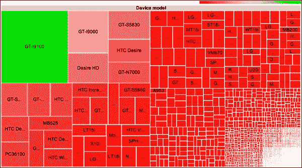

如同图中所示，有各种各样的设备（近 4000 种独特的设备）。这意味着有许多不同的屏幕尺寸和密度。安卓会缩放和调整你的应用程序的用户界面。然而，这并不总是足够。例如，为小屏幕设计的用户界面在大型屏幕上会被放大。这在大型屏幕上看起来并不美观。大型屏幕上的空间应该被有效利用，大型屏幕的用户界面应该与小屏幕的用户界面不同。安卓提供了一些 API，用于设计适合不同屏幕尺寸和密度的用户界面。你应该使用这些 API，使你的应用程序在不同的屏幕尺寸和密度上看起来都很好。这样，可以提高安卓应用程序的用户体验。

设计安卓应用程序用户界面时需要考虑的事项如下：

+   **屏幕尺寸**：这是设备的物理屏幕尺寸。屏幕尺寸可能从 2.5"到 10.1"不等，适用于智能手机和平板电脑。

+   **分辨率**：这是设备在每个维度上的像素数量。它通常以宽度和高度的乘积来定义，例如 640 x 480。

+   **屏幕密度**：这是物理区域内的最大像素数。高密度屏幕在相同区域内比低密度屏幕拥有更多的像素。

+   **屏幕方向**：设备可以是横向或纵向模式。在横向模式下，其宽度会增加。

## 使用`match_parent`和`wrap_content`

`match_parent`和`wrap_content`可用于设置视图的`layout_height`和`layout_width`属性。当使用`match_parent`时，Android 会扩展视图以使其大小与其父级相同。使用`wrap_content`时，Android 会根据内容大小扩展视图。也可以使用像素值设置宽度和高度。然而，使用像素值不是一个好的实践，因为像素数量会根据屏幕属性而变化，且给定的像素值在每个屏幕上不是相同的大小。在以下示例中，我们使用像素值来设置视图的宽度和高度。布局 XML 代码如下代码块所示：

```kt
<RelativeLayout 

    android:layout_width="match_parent"
    android:layout_height="match_parent" >

    <TextView
 android:layout_width="240px"
 android:layout_height="30px"
        android:layout_centerHorizontal="true"
        android:layout_centerVertical="true"
        android:padding="@dimen/padding_medium"
        android:text="hello world1 hello world 2 hello world 3 hello"
        tools:context=".Chapter6_1Activity" />

</RelativeLayout>
```

### 注意

在前面的布局 XML 文件中使用的一些定义，如`@dimen`，将在本书的源代码文件中提供。

如您在代码中所见，我们将`layout_width`设置为`240px`，将`layout_height`设置为`30px`。我们将在三个具有不同屏幕属性的模拟器中执行此应用程序。模拟器属性如下： 

+   **小屏幕属性：**此配置适用于小屏幕。这些属性可以像以下截图所示进行配置：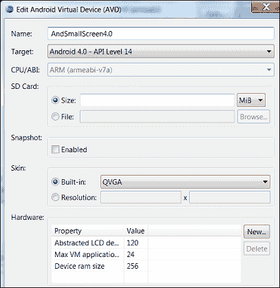

+   **正常屏幕属性：**此配置适用于正常屏幕。这些属性可以像以下截图所示进行配置：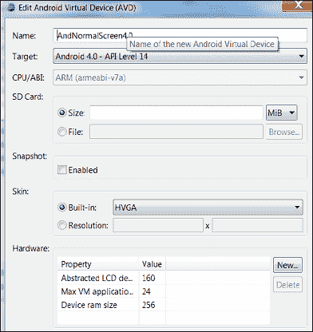

+   **大屏幕属性：**此配置适用于大屏幕。这些属性可以像以下截图所示进行配置：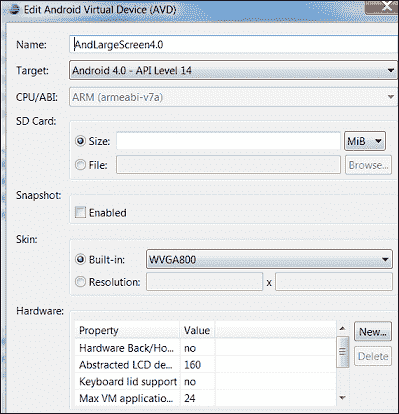

当此应用程序在前面的模拟器配置中执行时，屏幕将如下所示：

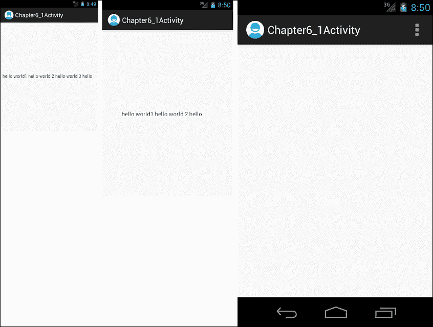

如截图中所示，在小屏幕上看起来是好的。然而，在正常屏幕上，文本被裁剪，不是`TextView`组件的所有内容都可见。在大屏幕上，则什么也看不见。这个示例说明使用像素作为宽度和高度值不是一个好的做法。

现在，我们将使用`wrap_content`和`match_parent`来设置高度和宽度长度。布局 XML 代码将如下所示：

```kt
<RelativeLayout 

    android:layout_width="match_parent"
    android:layout_height="match_parent" >

    <TextView
 android:layout_width="match_parent"
 android:layout_height="wrap_content"
        android:layout_centerHorizontal="true"
        android:layout_centerVertical="true"
        android:padding="@dimen/padding_medium"
        android:text="hello world1 hello world 2 hello world 3 hello"
        tools:context=".Chapter6_1Activity" />

</RelativeLayout>
```

当使用相同的模拟器配置执行应用程序时，屏幕将如下所示：

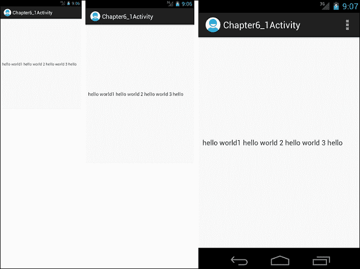

如您在截图中所见，应用程序在每个模拟器和屏幕配置中看起来都相同，且`TextView`组件的所有内容都得到显示。因此，在设计用户界面时使用`wrap_content`和`match_parent`是最佳实践。

## 使用 dip 代替 px

对于前面的示例，另一个选项是使用 `dip`（与密度无关的像素）值替代 `px` 值。这样，`TextView` 组件在不同屏幕尺寸下看起来几乎相同。代码如下所示：

```kt
<RelativeLayout 

    android:layout_width="match_parent"
    android:layout_height="match_parent" >

    <TextView
 android:layout_width="350dip"
 android:layout_height="40dip"
        android:layout_centerHorizontal="true"
        android:layout_centerVertical="true"
        android:padding="@dimen/padding_medium"
        android:text="hello world1 hello world 2 hello world 3 hello"
        tools:context=".Chapter6_1Activity" />

</RelativeLayout>
```

如你所见，在这个代码中，我们为宽度和高度使用了 `dip` 值。如果你在前一节定义的模拟器中运行这个应用，它将看起来如下所示：

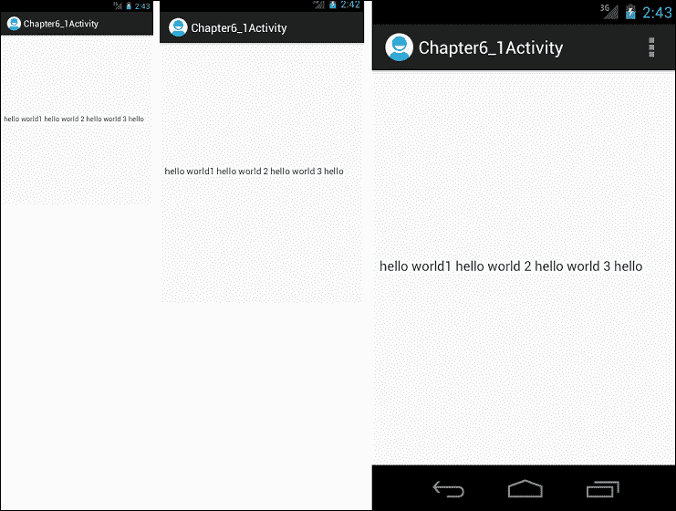

### 提示

对于字体大小，可以使用 sp（与缩放无关的像素）单位替代 px。

## 避免使用 AbsoluteLayout

**AbsoluteLayout** 是一个已弃用的布局，它为其中的视图使用固定位置。`AbsoluteLayout` 在设计用户界面中不是一个好的实践，因为它在不同屏幕尺寸下看起来不会相同。我们将通过以下示例布局看到这一点：

```kt
<?xml version="1.0" encoding="utf-8"?>
<AbsoluteLayout 
    android:layout_width="match_parent"
    android:layout_height="match_parent"
    android:orientation="vertical" >

    <TextView
        android:id="@+id/textView5"
        android:layout_width="wrap_content"
        android:layout_height="wrap_content"
 android:layout_x="96dp"
 android:layout_y="8dp"
        android:text="Text Top"
        android:textAppearance="?android:attr/textAppearanceLarge" />

    <TextView
        android:id="@+id/textView4"
        android:layout_width="wrap_content"
        android:layout_height="wrap_content"
 android:layout_x="89dp"
 android:layout_y="376dp"
        android:text="Text Bottom"
        android:textAppearance="?android:attr/textAppearanceLarge" />

</AbsoluteLayout>
```

如你所见，在这个 XML 代码中，`AbsoluteLayout` 中的视图使用了固定位置。当这个应用在前一节定义的模拟器中运行时，它将看起来如下所示：

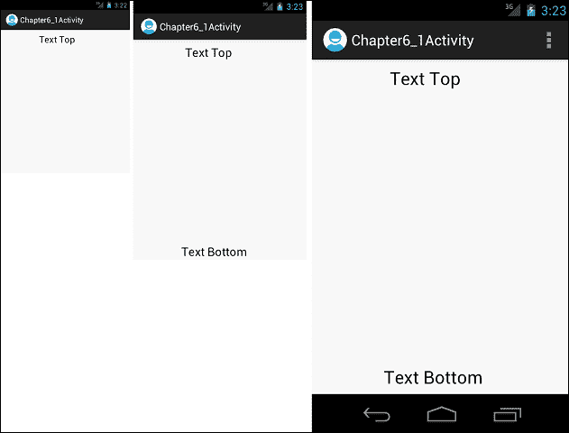

如你所见，在截图上，小屏幕底部文本是不可见的，但在其他屏幕上可见。`AbsoluteLayout` 在用户界面设计中不是一个好的实践。

## 为不同的屏幕密度提供不同的位图资源

安卓根据屏幕密度缩放位图。然而，如果只提供一个位图，图像看起来不会很好。图像可能会模糊或损坏。为不同的屏幕密度提供不同的位图资源是一个好习惯。在下面的截图中，使用了两个图像按钮。为第一个图像按钮提供了不同的位图资源，为第二个图像按钮提供了一个低密度的位图资源。如你所见，在截图中，第二个图像按钮的位图看起来模糊；然而，第一个图像按钮的位图看起来很好。

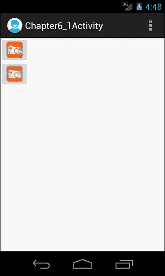

### 提示

如果将图像放在 `drawable-nodpi` 文件夹中，它们不会被缩放。

## 为不同的屏幕尺寸提供不同的布局

安卓会缩放布局以适应设备屏幕。然而，在某些情况下这还不够。在第五章，*片段*中，我们开发了一个列出书籍的应用，当点击书籍时，会显示书籍的作者。

以下是显示在小屏幕上的截图：

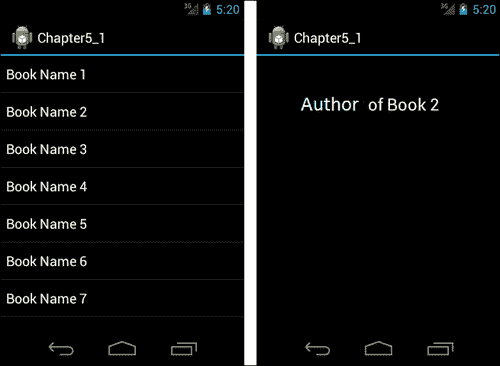

对于大屏幕来说，这个设计并不是一个好的选择。用户界面看起来会很糟糕。我们应该在大屏幕上高效地利用空间。我们可以为更大的屏幕使用不同的布局，将两个在小屏幕上显示的屏幕结合起来。用户界面应该看起来如下所示：


布局文件应放置在适当的文件夹中。例如，大屏幕的布局文件应放在`res/layout-large`文件夹中，小屏幕的应放在`res/layout-small`文件夹中。

除了现有的限定符外，Android 3.2 引入了新的屏幕尺寸限定符。新的限定符如下：

+   `sw<N>dp`：此限定符定义了最小的宽度。例如，`res/layout-sw600dp/`。

    +   当屏幕宽度至少为`N` dp 时，无论屏幕方向如何，都将使用此文件夹中的布局文件。

+   `w<N>dp`：此限定符定义了确切可用的宽度。例如，`res/layout-w600dp/`。

+   `h<N>dp`：此限定符定义了确切可用的高度。例如，`res/layout-h600dp/`。

## 九宫格

**九宫格**特性允许使用可拉伸的位图作为资源。位图根据定义的可拉伸区域进行拉伸。可拉伸区域由 1 像素宽的黑线定义。以下是一个示例九宫格可绘制资源：

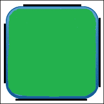

图像文件应放置在带有扩展名*.* `9.png` *.* 的 drawable 文件夹中。顶边和左边黑线定义了可拉伸区域，底边和右边黑线定义了适应内容的可拉伸区域。

有一个名为**Draw 9-patch**的工具与 Android SDK 捆绑在一起。你可以使用这个编辑器轻松创建九宫格图片。

# 总结

在本章中，我们学习了一些设计规范，以便支持不同的屏幕尺寸和密度。我们不应该使用硬编码的像素值来定义布局的宽度和高度。相反，我们应该使用`wrap_content`和`match_parent`属性，或者使用`dip`值代替`px`值。我们应该为不同的屏幕尺寸使用不同的布局，以使应用程序在所有屏幕尺寸上看起来都很好。我们还了解了使用九宫格规则创建可拉伸位图的方法。开发应用程序后，我们应在 Android 模拟器中测试各种屏幕尺寸和密度下的应用程序，以查看其外观。这样我们可以检测用户界面问题和错误。

在下一章中，我们将学习关于 Android 兼容性包的内容，并了解如何使用它。
