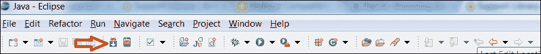
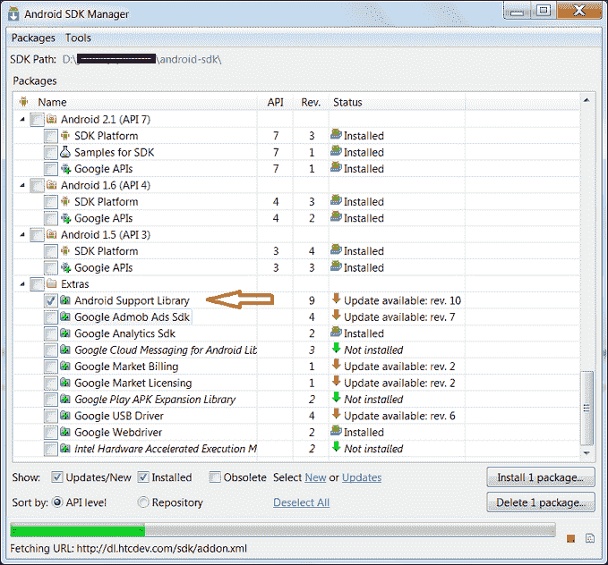
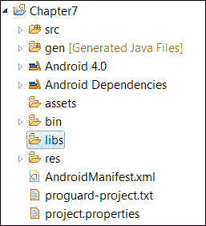
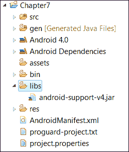
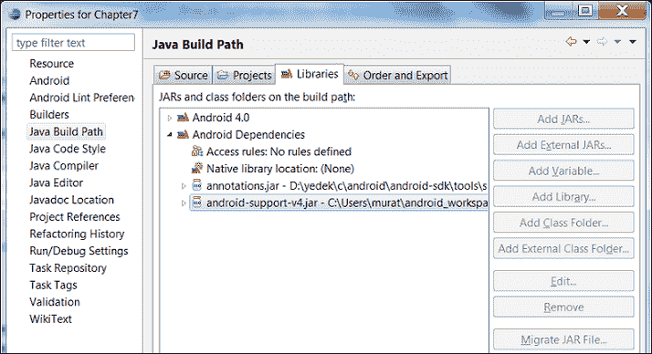

# 第七章：Android 兼容性包

新的 Android API 在之前版本的 Android 中无法工作，因此引入了 Android 兼容性包，以便将新的 API 移植到旧版本的 Android 平台。本章展示了我们如何使用 Android 兼容性包。

本章涵盖的主题包括：

+   Android 兼容性包是什么以及为什么我们要使用它

+   如何使用 Android 兼容性包

# 什么是 Android 兼容性包

Android 在 3.0 及其后续版本中发布了一些伟大的新 API。然而，许多用户并没有将他们的设备升级到最新的 Android 平台。Google 发布了包含对一些随 Android 3.0 及其后续版本发布的新 API 支持的 Android 兼容性包。这样，开发者就可以开发使用新 API 且能在旧版本 Android 中运行的应用程序。以下是一些包含在 Android 兼容性包中的类：

+   `Fragment`

+   `FragmentManager`

+   `FragmentTransaction`

+   `ListFragment`

+   `DialogFragment`

+   `LoaderManager`

+   `Loader`

+   `AsyncTaskLoader`

+   `CursorLoader`

Android 兼容性包中并不包括一些有用的 API，如动画类、操作栏和 FragmentMapActivity。

# 如何使用 Android 兼容性包

1.  我们需要下载并安装 Android 兼容性包。为了下载 Android 兼容性包，请按照以下截图所示在 Eclipse 菜单中点击**Android SDK 管理器**按钮：

    或者，我们可以通过 Eclipse 菜单使用**窗口** | **Android SDK 管理器**来访问 Android SDK 管理器。在打开**Android SDK 管理器**窗口后，勾选**Android 支持库**选项，如下截图所示：

    

1.  然后，点击**安装**按钮并安装该包。现在我们准备开发一个可以使用 Android 兼容性包的 Android 项目。首先，在 Eclipse 中创建一个 Android 项目。然后，我们需要将支持库添加到我们的 Android 项目中。如果不存在，请在 Android 项目的根目录下创建一个名为`libs`的文件夹，如下截图所示：

1.  现在，找到并复制`<your android sdk folder>/extras/android/support/v4/android-support-v4.jar`文件到`libs`文件夹中。文件夹结构应该如下截图所示：

1.  最后，如果`.jar`文件不在项目的构建路径中，请按照以下截图所示将`.jar`文件添加到项目构建路径中：

现在你知道了如何手动添加支持库。Eclipse 通过**添加支持库**的菜单选项使这个过程变得简单。使用以下步骤：

1.  在资源管理器中右键点击项目。

1.  转到**Android Tools** | **添加支持库…**选项。

1.  按照步骤完成向导。

现在我们可以使用兼容性包。我们将创建一个使用`Fragment`类的应用程序，但是使用的是兼容包中的`Fragment`类，通过以下步骤显示文本：

1.  首先，为 Fragment 创建一个布局 XML，并将 XML 文件命名为`fragment.xml`：

    ```kt
    <?xml version="1.0" encoding="utf-8"?>
    <LinearLayout 
        android:layout_width="match_parent"
        android:layout_height="match_parent"
        android:gravity="center_horizontal"
        android:orientation="vertical" >

        <TextView
            android:id="@+id/textView"
            android:layout_width="wrap_content"
            android:layout_height="wrap_content"
            android:text="Hello Android Compatibility Package"
            android:textAppearance="?android:attr/textAppearanceLarge" />

    </LinearLayout>
    ```

1.  然后，使用以下代码块为活动创建一个布局：

    ```kt
    <RelativeLayout 

        android:id="@+id/main_layout"
        android:layout_width="match_parent"
        android:layout_height="match_parent" >

    </RelativeLayout>
    ```

1.  现在，我们将为`fragment.xml`布局创建一个`Fragment`类：

    ```kt
    package com.chapter7;

    import android.os.Bundle;
    import android.support.v4.app.Fragment;
    import android.view.LayoutInflater;
    import android.view.View;
    import android.view.ViewGroup;

    public class Chapter7Fragment extends Fragment {

      @Override
      public View onCreateView(LayoutInflater inflater, ViewGroup 
    container,
          Bundle savedInstanceState) {
        View view = inflater.inflate(R.layout.fragment, container, 
    false);
        return view;
      }
    }
    ```

如你所见，在上述代码中，`Fragment`类来自`android.support.v4.app.Fragment`包。这意味着我们正在使用 Android 兼容性包。如果我们不想使用兼容包，那么我们应该使用`android.app.Fragment`包中的`Fragment`类。

我们应用程序的`Activity`类如下：

```kt
package com.chapter7;

import android.os.Bundle;
import android.support.v4.app.FragmentActivity;
import android.support.v4.app.FragmentManager;
import android.support.v4.app.FragmentTransaction;
import android.view.Menu;

public class Chapter7Activity extends FragmentActivity {

    @Override
    public void onCreate(Bundle savedInstanceState) {
        super.onCreate(savedInstanceState);
        setContentView(R.layout.main);
        addFragment();
    }

    public void addFragment() {
    FragmentManager fragmentManager = 
 this.getSupportFragmentManager();
    FragmentTransaction fragmentTransaction = fragmentManager.beginTransaction();

    Chapter7Fragment fragment = new Chapter7Fragment();
    fragmentTransaction.add(R.id.main_layout,fragment);
    fragmentTransaction.commit();
  }

    @Override
    public boolean onCreateOptionsMenu(Menu menu) {
        getMenuInflater().inflate(R.menu.main, menu);
        return true;
    }
}
```

如你所见，在上述代码块中，支持库 API 与标准 API 的命名相同。我们只需要使用正确的导入并调用正确的管理器。为了使用兼容包中的类，我们需要将`android.support.v4.app`添加到我们的导入列表中。

为了获取`FragmentManager`的实例，我们调用了我们`Activity`类的`getSupportFragmentManager()`方法。你可能已经注意到，`Activity`类扩展了`FragmentActivity`类。我们需要这样做，因为这是使用 Fragments 的唯一方式。

`AndroidManifest.xml`文件应该如下所示：

```kt
<manifest 
    package="com.chapter7"
    android:versionCode="1"
    android:versionName="1.0" >

    <uses-sdk
 android:minSdkVersion="8"
        android:targetSdkVersion="15" />

    <application
        android:icon="@drawable/ic_launcher"
        android:label="@string/app_name"
        android:theme="@style/AppTheme" >
        <activity
            android:name=".Chapter7Activity"
            android:label="@string/title_activity_chapter7" >
            <intent-filter>
                <action android:name="android.intent.action.MAIN" />

                <category android:name="android.intent.category.LAUNCHER" />
            </intent-filter>
        </activity>
    </application>

</manifest>
```

如你所见，在这段代码中，最低 SDK 级别被设置为 API 级别 8。我们可以将最低 API 级别设置为 4 或更高。这样，我们就可以在旧版本的 Android 中使用新的 API。

# 概要

在本章中，我们了解了 Android 兼容性包是什么以及如何使用它。我们还学习到了如何借助这个库，在旧版本的 Android 中使用新的 API。

在下一章中，我们将学习使用新的连接 API——Android Beam 和 Wi-Fi Direct。
