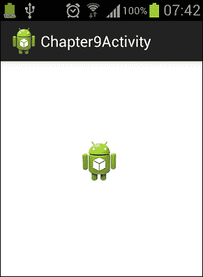
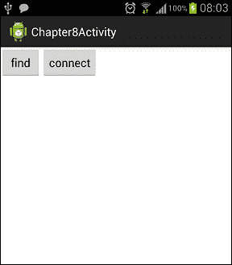

# 第八章：新的连接性 API - Android Beam 和 Wi-Fi Direct

随着 Android Ice Cream Sandwich 的推出，引入了新的连接性 API - **Android Beam**，它使用设备的 NFC 硬件，以及**Wi-Fi Direct**，允许设备在不使用无线接入点的情况下相互连接。本章将教我们如何使用 Android Beam 和 Wi-Fi Direct API。

本章节涵盖的主题包括：

+   Android Beam

+   发送 NdefMessages

+   使用 Wi-Fi Direct 共享数据

# Android Beam

拥有 NFC 硬件的设备可以通过轻触在一起来共享数据。这可以通过 Android Beam 功能实现。它类似于蓝牙，因为我们能无缝地发现和配对，就像蓝牙连接一样。设备在彼此靠近时（不超过几厘米）连接。用户可以使用 Android Beam 功能共享图片、视频、联系人等。

## 发送 NdefMessages

在本节中，我们将实现一个简单的 Android Beam 应用程序。此应用程序将在两个设备轻触在一起时将图片发送到另一设备。随着 Android Ice Cream Sandwich 的推出，引入了三种用于发送**NdefMessages**的方法。这些方法如下：

+   **setNdefPushMessage()**: 此方法接受一个 NdefMessage 作为参数，并在设备轻触在一起时自动将其发送到另一设备。当消息是静态的且不变化时，通常使用这种方法。

+   **setNdefPushMessageCallback()**: 此方法用于创建动态 NdefMessages。当两个设备轻触在一起时，会调用`createNdefMessage()`方法。

+   **setOnNdefPushCompleteCallback()**: 此方法设置一个回调，当 Android Beam 成功时调用。

我们将在示例应用程序中使用第二种方法。

我们的示例应用程序的用户界面将包含一个`TextView`组件用于显示文本消息，以及一个`ImageView`组件用于显示从另一设备接收的图片。布局 XML 代码如下所示：

```kt
<RelativeLayout 
    android:layout_width="match_parent"
    android:layout_height="match_parent" >

    <TextView
        android:id="@+id/textView"
        android:layout_width="wrap_content"
        android:layout_height="wrap_content"
        android:layout_centerHorizontal="true"
        android:layout_centerVertical="true"
        android:text=""
         />

    <ImageView
        android:id="@+id/imageView"
        android:layout_width="wrap_content"
        android:layout_height="wrap_content"
        android:layout_below="@+id/textView"
        android:layout_centerHorizontal="true"
        android:layout_marginTop="14dp"
         />

</RelativeLayout>
```

现在，我们将逐步实现示例应用程序的`Activity`类。带有`onCreate()`方法的`Activity`类的代码如下：

```kt
public class Chapter9Activity extends Activity implements
 CreateNdefMessageCallback
  {

  NfcAdapter mNfcAdapter;
  TextView mInfoText;
  ImageView imageView;

  @Override
  public void onCreate(Bundle savedInstanceState) {
    super.onCreate(savedInstanceState);
    setContentView(R.layout.main);

    imageView = (ImageView) findViewById(R.id.imageView);
    mInfoText = (TextView) findViewById(R.id.textView);
    // Check for available NFC Adapter
       mNfcAdapter = NfcAdapter.getDefaultAdapter(getApplicationContext());

    if (mNfcAdapter == null) 
    {
      mInfoText = (TextView) findViewById(R.id.textView);
      mInfoText.setText("NFC is not available on this device.");
      finish();
      return;
    }
    // Register callback to set NDEF message
    mNfcAdapter.setNdefPushMessageCallback(this, this);
  }

  @Override
  public boolean onCreateOptionsMenu(Menu menu) {
    getMenuInflater().inflate(R.menu.main, menu);
    return true;
  }
}
```

如您在此代码中看到的，我们可以检查设备是否提供`NfcAdapter`。如果提供，我们将获取`NfcAdapter`的实例。然后，我们使用`NfcAdapter`实例调用`setNdefPushMessageCallback()`方法来设置回调。我们将`Activity`类作为回调参数发送，因为`Activity`类实现了`CreateNdefMessageCallback`。

为了实现`CreateNdefMessageCallback`，我们应该重写`createNdefMessage()`方法，如下面的代码块所示：

```kt
  @Override
  public NdefMessage createNdefMessage(NfcEvent arg0) {

    Bitmap icon =  BitmapFactory.decodeResource(this.getResources(),
        R.drawable.ic_launcher);
    ByteArrayOutputStream stream = new ByteArrayOutputStream();
    icon.compress(Bitmap.CompressFormat.PNG, 100, stream);
    byte[] byteArray = stream.toByteArray();

    NdefMessage msg = new NdefMessage(new NdefRecord[] {
 createMimeRecord("application/com.chapter9", byteArray)
 , NdefRecord.createApplicationRecord("com.chapter9")
});
    return msg;
  }
  public NdefRecord createMimeRecord(String mimeType, byte[] payload) {

    byte[] mimeBytes = mimeType.getBytes(Charset.forName("US-ASCII"));
    NdefRecord mimeRecord = new NdefRecord(NdefRecord.TNF_MIME_MEDIA,
        mimeBytes, new byte[0], payload);
    return mimeRecord;
  }
```

如您在代码中所见，我们获取了一个可绘制对象，将其转换为位图，然后再转换为一个字节数组。然后我们使用两个`NdefRecords`创建了一个`NdefMessage`。第一个记录包含 mime 类型和字节数组。第一个记录是通过`createMimeRecord()`方法创建的。第二个记录包含**Android 应用记录**（**AAR**）。Android 应用记录是在 Android Ice Cream Sandwich 中引入的。这个记录包含了应用的包名，增加了当扫描**NFC 标签**时应用启动的确定性。也就是说，系统首先尝试将意图过滤器和 AAR 一起匹配以启动活动。如果它们不匹配，则启动与 AAR 匹配的活动。

当活动由 Android Beam 事件启动时，我们需要处理由 Android Beam 发送的消息。我们在`Activity`类的`onResume()`方法中处理此消息，如下面的代码块所示：

```kt
  @Override
  public void onResume() {
    super.onResume();
    // Check to see that the Activity started due to an Android Beam
    if (NfcAdapter.ACTION_NDEF_DISCOVERED.equals(getIntent().getAction())) {
      processIntent(getIntent());
    }
  }

  @Override
  public void onNewIntent(Intent intent) {
    // onResume gets called after this to handle the intent
    setIntent(intent);
  }

  void processIntent(Intent intent) {

    Parcelable[] rawMsgs = intent

  .getParcelableArrayExtra(NfcAdapter.EXTRA_NDEF_MESSAGES);
    // only one message sent during the beam
 NdefMessage msg = (NdefMessage) rawMsgs[0];
 // record 0 contains the MIME type, record 1 is the AAR
 byte[] bytes = msg.getRecords()[0].getPayload();
    Bitmap bmp = BitmapFactory.decodeByteArray(bytes, 0, bytes.length);

    imageView.setImageBitmap(bmp);
  }
```

如您在代码中所见，我们首先检查意图是否为`ACTION_NDEF_DISCOVERED`。这意味着`Activity`类是由于 Android Beam 而启动的。如果是因为 Android Beam 而启动，我们使用`processIntent()`方法处理意图。我们首先从意图中获取`NdefMessage`。然后我们从第一个记录中获取字节数组并将其转换为位图，使用`BitmapFactory`。记住，第二个记录是 AAR，我们不对其进行任何操作。最后，我们设置了`ImageView`组件的位图。

应用程序的`AndroidManifest.xml`文件应如下所示：

```kt
<manifest 
    package="com.chapter9"
    android:versionCode="1"
    android:versionName="1.0" >

    <uses-permission android:name="android.permission.NFC"/>
 <uses-feature android:name="android.hardware.nfc" android:required="false" />

    <uses-sdk
        android:minSdkVersion="14"
        android:targetSdkVersion="15" />

    <application
        android:icon="@drawable/ic_launcher"
        android:label="@string/app_name"
        android:theme="@style/AppTheme" >
        <activity
            android:name=".Chapter9Activity"
            android:label="@string/title_activity_chapter9" >
            <intent-filter>
                <action android:name="android.intent.action.MAIN" />

                <category android:name="android.intent.category.LAUNCHER" />
            </intent-filter>
 <intent-filter>
 <action android:name="android.nfc.action.NDEF_DISCOVERED" />
 <category android:name="android.intent.category.DEFAULT" />
 <data android:mimeType="application/com.chapter9" />
 </intent-filter>
        </activity>
    </application>

</manifest>
```

如您在代码中所见，我们需要在`AndroidManifest.xml`文件中将最低 SDK 设置为 API 级别 14 或更高，因为这些 API 在 API 级别 14 或更高版本中可用。此外，我们需要设置使用 NFC 的权限。我们还设置了`AndroidManifest.xml`中的`uses`特性。该特性设置为非必需。这意味着我们的应用可以在没有 NFC 支持的设备上使用。最后，我们为`android.nfc.action.NDEF_DISCOVERED`创建了一个意图过滤器，其`mimeType`为`application/com.chapter9`。

当一个设备使用我们的示例应用发送图像时，屏幕将如下所示：



# Wi-Fi Direct

在传统的无线网络中，设备通过无线接入点相互连接。借助**Wi-Fi Direct**，设备无需无线接入点即可相互连接。它类似于蓝牙，但速度更快，Wi-Fi Direct 的范围也更广。随着 Android Ice Cream Sandwich 引入了新的 Wi-Fi Direct API，我们可以使用 Android 设备的 Wi-Fi Direct 属性。

主要帮助我们查找和连接对等设备的类是`WifiP2pManager`类。在查找和连接对等设备的过程中，我们将使用以下`Listener`类：

+   `WifiP2pManager.ActionListener`

+   `WifiP2pManager.ChannelListener`

+   `WifiP2pManager.ConnectionInfoListener`

+   `WifiP2pManager.PeerListListener`

最后，以下意图将有助于我们在 Wi-Fi Direct 连接中：

+   `WIFI_P2P_CONNECTION_CHANGED_ACTION`

+   `WIFI_P2P_PEERS_CHANGED_ACTION`

+   `WIFI_P2P_STATE_CHANGED_ACTION`

+   `WIFI_P2P_THIS_DEVICE_CHANGED_ACTION`

在这一节中，我们将学习如何通过一个示例应用程序来使用这些新的 Wi-Fi Direct API。

## Wi-Fi Direct 应用示例

为了使用 Wi-Fi Direct API，我们需要在`AndroidManifest.xml`中将最小 SDK 版本设置为 API Level 14 或更高。此外，我们需要一些权限来使用 Wi-Fi Direct API。`AndroidManifest.xml`文件应如下所示：

```kt
<manifest 
    package="com.chapter9"
    android:versionCode="1"
    android:versionName="1.0" >

    <uses-sdk
        android:minSdkVersion="14"
        android:targetSdkVersion="15" />
 <uses-permission android:name="android.permission.ACCESS_WIFI_STATE" />
 <uses-permission android:name="android.permission.CHANGE_WIFI_STATE" />
 <uses-permission android:name="android.permission.CHANGE_NETWORK_STATE" />
 <uses-permission android:name="android.permission.INTERNET" />
 <uses-permission android:name="android.permission.ACCESS_NETWORK_STATE" />

    <application
        android:icon="@drawable/ic_launcher"
        android:label="@string/app_name"
        android:theme="@style/AppTheme" >
        <activity
            android:name=".Chapter9Activity"
            android:label="@string/title_activity_chapter9" >
            <intent-filter>
                <action android:name="android.intent.action.MAIN" />

                <category android:name="android.intent.category.LAUNCHER" />
            </intent-filter>
        </activity>
    </application>

</manifest>
```

我们需要的第一种类是扩展了`BroadcastReceiver`并处理我们之前在`onReceive()`方法中列出的意图的类。这个类的构造函数如下所示：

```kt
package com.chapter9;

import android.content.BroadcastReceiver;
import android.content.Context;
import android.content.Intent;
import android.net.NetworkInfo;
import android.net.wifi.p2p.WifiP2pManager;
import android.net.wifi.p2p.WifiP2pManager.Channel;
import android.net.wifi.p2p.WifiP2pManager.PeerListListener;
import android.widget.Toast;

public class Chapter9WiFiDirectBroadcastReceiver extends BroadcastReceiver {

 private WifiP2pManager manager;
 private Channel channel;
 private Chapter9Activity activity;

    public Chapter9WiFiDirectBroadcastReceiver(WifiP2pManager manager, Channel 
channel,
        Chapter9Activity activity) {
        super();
        this.manager = manager;
        this.channel = channel;
        this.activity = activity;
    }
}
```

如您在此代码中看到的，我们将`Channel`、`WifiP2pManager`和`Activity`类作为参数传递给构造函数，因为我们在后面的`onReceive()`方法中需要它们。我们需要重写`BroadcastReceiver`的`onReceive()`方法，如下代码块所示：

```kt
@Override
    public void onReceive(Context context, Intent intent) {
        String action = intent.getAction();
        if (WifiP2pManager.WIFI_P2P_STATE_CHANGED_ACTION.equals(action)) {

            int state = intent.getIntExtra(WifiP2pManager.EXTRA_WIFI_STATE, -1);

            if (state == WifiP2pManager.WIFI_P2P_STATE_ENABLED) {
                // Wifi Direct mode is enabled
              Toast.makeText(activity, "wifi direct is enabled",Toast.LENGTH_LONG).show();
            } else {
              // Wifi Direct mode is disabled
              Toast.makeText(activity, "wifi direct is disabled",Toast.LENGTH_LONG).show();
            }

        } else if (WifiP2pManager.WIFI_P2P_PEERS_CHANGED_ACTION.equals(action)) 
        {

            // request peers from the wifi p2p manager
            if (manager != null) {
                manager.requestPeers(channel, (PeerListListener) activity);
            }

        } else if (WifiP2pManager.WIFI_P2P_CONNECTION_CHANGED_ACTION.equals(action)) {

            if (manager == null) {
                return;
            }

            NetworkInfo networkInfo = (NetworkInfo) intent
                    .getParcelableExtra(WifiP2pManager.EXTRA_NETWORK_INFO);

            if (networkInfo.isConnected()) {

                // request connection info
                manager.requestConnectionInfo(channel, activity);
            } else {
                // It's a disconnect

            }
        } else if (WifiP2pManager.WIFI_P2P_THIS_DEVICE_CHANGED_ACTION.equals(action)) {

        }
    }
```

在这个方法中，我们处理收到的意图。首先，我们检查意图是否为`WIFI_P2P_STATE_CHANGED_ACTION`。当 Wi-Fi Direct 被启用或禁用时，我们会收到这个意图。我们从意图中获取 Wi-Fi Direct 的状态，并根据 Wi-Fi Direct 的状态采取行动。

其次，我们检查意图是否为`WIFI_P2P_PEERS_CHANGED_ACTION`。当调用`WifiP2pManager`类的`discoverPeers()`方法时，我们会收到这个意图。在收到`WIFI_P2P_PEERS_CHANGED_ACTION`意图时，我们从`Wifi2P2pManager`类的`requestPeers()`方法获取对等体列表。

接下来，我们检查收到的意图是否为`WIFI_P2P_CONNECTION_CHANGED_ACTION`。当 Wi-Fi 连接发生变化时，我们会收到这个意图。在收到`WIFI_P2P_CONNECTION_CHANGED_ACTION`意图时，我们处理连接或断开的情况。首先，我们从意图中获取`NetworkInfo`来判断是否存在连接或断开。如果是连接，我们会调用`WifiP2pManager`的`requestConnectionInfo()`方法进行连接。

最后，我们检查意图是否为`WIFI_P2P_THIS_DEVICE_CHANGED_ACTION`。当设备详情发生变化时，我们会收到这个意图。对于这个意图，我们不执行任何操作。

我们为这个应用程序提供了一个简单的用户界面；一个带有两个按钮的布局。第一个按钮用于查找，第二个按钮用于连接对等体。布局的 XML 代码如下：

```kt
<LinearLayout 

    android:layout_width="match_parent"
    android:layout_height="match_parent" >

    <Button
        android:id="@+id/buttonFind"
        android:layout_width="wrap_content"
        android:layout_height="wrap_content"
        android:text="find" />

    <Button
        android:id="@+id/buttonConnect"
        android:layout_width="wrap_content"
        android:layout_height="wrap_content"
        android:text="connect" />

</LinearLayout>
```

用户界面将如下截图所示：



最后，我们需要实现这个应用程序的`Activity`类。`Activity`类的代码应如下所示：

```kt
package com.chapter9;

import android.app.Activity;
import android.content.BroadcastReceiver;
import android.content.Context;
import android.content.IntentFilter;
import android.net.wifi.p2p.WifiP2pConfig;
import android.net.wifi.p2p.WifiP2pDevice;
import android.net.wifi.p2p.WifiP2pDeviceList;
import android.net.wifi.p2p.WifiP2pInfo;
import android.net.wifi.p2p.WifiP2pManager;
import android.net.wifi.p2p.WifiP2pManager.ActionListener;
import android.net.wifi.p2p.WifiP2pManager.Channel;
import android.net.wifi.p2p.WifiP2pManager.ChannelListener;
import android.net.wifi.p2p.WifiP2pManager.ConnectionInfoListener;
import android.net.wifi.p2p.WifiP2pManager.PeerListListener;
import android.os.Bundle;
import android.util.Log;
import android.view.Menu;
import android.view.View;
import android.view.View.OnClickListener;
import android.widget.Button;
import android.widget.Toast;
public class Chapter9Activity extends Activity implements 
ChannelListener,OnClickListener,PeerListListener,ConnectionInfoListener {

    private WifiP2pManager manager;
    private final IntentFilter intentFilter = new IntentFilter();
    private Channel channel;
    private BroadcastReceiver receiver = null;
    private Button buttonFind;
    private Button buttonConnect;
    private WifiP2pDevice device;
    @Override
    public void onCreate(Bundle savedInstanceState) {
        super.onCreate(savedInstanceState);
        setContentView(R.layout.main);

        manager = (WifiP2pManager) getSystemService(Context.WIFI_P2P_SERVICE);
 channel = manager.initialize(this, getMainLooper(), null);

 intentFilter.addAction(WifiP2pManager.WIFI_P2P_STATE_CHANGED_ACTION);
 intentFilter.addAction(WifiP2pManager.WIFI_P2P_PEERS_CHANGED_ACTION);
 intentFilter.addAction(WifiP2pManager.WIFI_P2P_CONNECTION_CHANGED_ACTION);
 intentFilter.addAction(WifiP2pManager.WIFI_P2P_THIS_DEVICE_CHANGED_ACTION);

        receiver = new Chapter9WiFiDirectBroadcastReceiver(manager, channel, this);
        registerReceiver(receiver, intentFilter);

        this.buttonConnect = (Button) this.findViewById(R.id.buttonConnect);
        this.buttonConnect.setOnClickListener(this);

        this.buttonFind = (Button)this.findViewById(R.id.buttonFind);
        this.buttonFind.setOnClickListener(this);
    }
}
```

目前的实现还不完整。我们将逐步添加必要的方法。

如您在此代码中所见，我们的`Activity`类实现了各种`Listeners`来处理 Wi-Fi Direct 事件。`ConnectionInfoListener`用于当连接信息可用时的回调。`PeerListListener`用于当对等设备列表可用时的回调。`ChannelListener`用于当通道丢失时的回调。

我们创建一个意图过滤器，并在继承`BroadcastReceiver`的类的`onReceive()`方法中添加我们将检查的意图。

我们通过调用`initialize()`方法来初始化`WifiP2pManager`类。这将使我们的应用程序与 Wi-Fi 网络注册。

1.  因为我们实现了`ChannelListener`，所以我们需要重写`onChannelDisconnected()`方法，如下代码块所示：

    ```kt
    @Override
      public void onChannelDisconnected() {
        //handle the channel lost event
      }
    ```

1.  因为我们实现了`PeerListListener`，所以我们需要实现`onPeersAvailable()`方法，如下代码块所示：

    ```kt
    @Override
      public void onPeersAvailable(WifiP2pDeviceList peerList) {

        for (WifiP2pDevice device : peerList.getDeviceList()) {
          this.device = device;
          break;
        }
      }
    ```

    在此方法中，我们获取可用的`peerList`。我们获取第一个设备并跳出`for`循环。我们需要这个设备来进行连接。

1.  因为我们实现了`ConnectionInfoListener`，所以我们需要实现`onConnectionInfoAvailable()`方法，如下代码块所示：

    ```kt
      @Override
      public void onConnectionInfoAvailable(WifiP2pInfo info) {
        String infoname = info.groupOwnerAddress.toString();

      }
    ```

    在这里，我们获取连接信息，并与对等设备连接并发送数据。例如，可以在这里执行一个传输文件的`AsyncTask`。

1.  我们需要为按钮实现`onClick()`方法：

    ```kt
      @Override
      public void onClick(View v) {
        if(v == buttonConnect)
        {
          connect(this.device);
        }
        else if(v == buttonFind)
        {
          find();
        }

      }
    ```

`find()`和`connect()`方法如下所示：

```kt
public void connect(WifiP2pDevice device)
  {
    WifiP2pConfig config = new WifiP2pConfig();
    if(device != null)
    {
      config.deviceAddress = device.deviceAddress;
      manager.connect(channel, config, new ActionListener() {

          @Override
          public void onSuccess() {

            //success
          }

          @Override
          public void onFailure(int reason) {
            //fail
          }
      });
  }
    else
    {
      Toast.makeText(Chapter9Activity.this, "Couldn't connect, device is not found",

                Toast.LENGTH_SHORT).show();
    }
  }  
       public void find()
  {
    manager.discoverPeers(channel, new WifiP2pManager.ActionListener() 
       {

            @Override
            public void onSuccess() {
                Toast.makeText(Chapter9Activity.this, "Finding Peers",
                        Toast.LENGTH_SHORT).show();
       }

            @Override
            public void onFailure(int reasonCode) 
           {
                Toast.makeText(Chapter9Activity.this, "Couldnt find peers ",
                        Toast.LENGTH_SHORT).show();
            }
        });
  }
```

当点击**查找**按钮时，我们会调用`WifiP2pManager`的`discoverPeers()`方法来发现可用的对等设备。如您所记得，调用`discoverPeers()`方法将导致`BroadcastReceiver`接收到`WIFI_P2P_PEERS_CHANGED_ACTION`意图。然后在`BroadcastReceiver`中我们会请求对等设备列表。

当点击**连接**按钮时，我们使用设备信息调用`WifiP2pManager`的`connect()`方法。这将开始与指定设备的点对点连接。

通过这些方法，介绍 Wi-Fi Direct API 的示例应用程序就完成了。

# 总结

在本章中，我们首先学习了 Android 的 Android Beam 功能。通过此功能，设备可以使用 NFC 硬件发送数据。我们实现了一个示例 Android Beam 应用程序，并学习了如何使用 Android Beam API。其次，我们了解了 Wi-Fi Direct 是什么以及如何使用 Wi-Fi Direct API。
