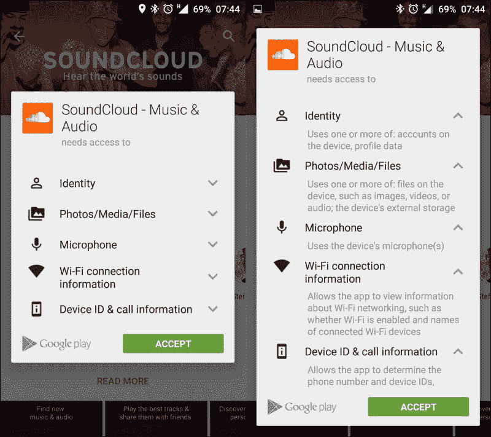
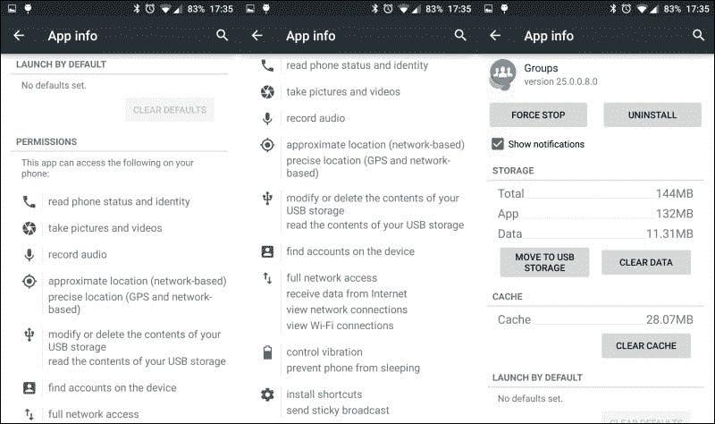
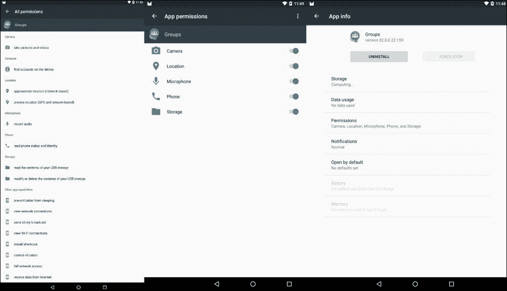
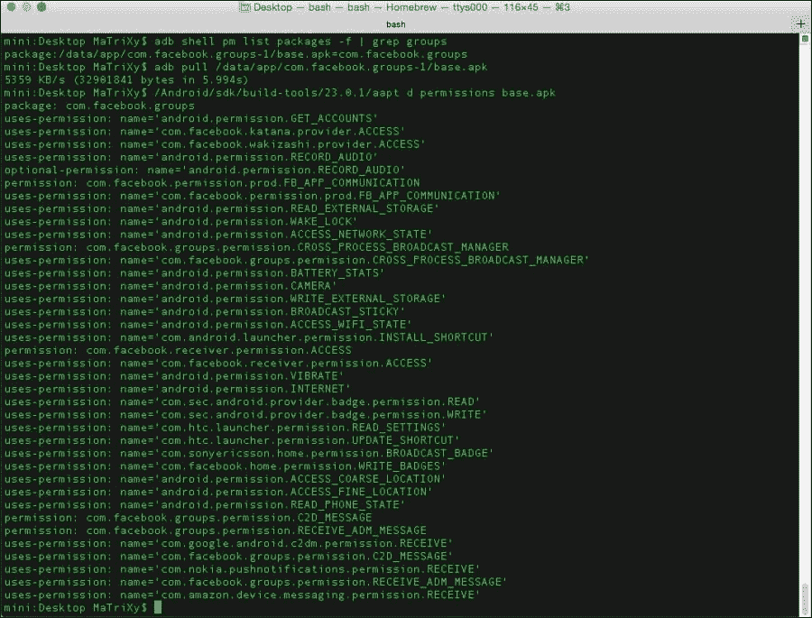
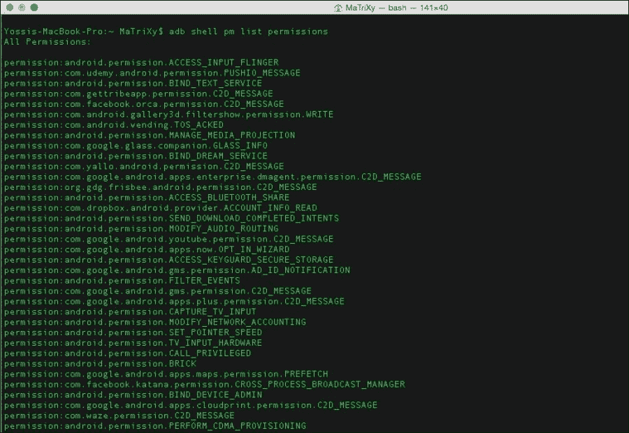

# 第一章：Android 棉花糖权限

**Android 权限**自从我们记忆中的 Android 1.0 版本以来就一直存在。多年来，随着平台的演变，Android 权限模型通过添加新权限，试图允许更细粒度地控制应用程序对设备硬件/数据的访问部分。

在本章中，我们将回顾一下**Android 棉花糖**之前的 Android 权限模型，并关注它带来的变化。我们还将解释作为开发人员你必须做的更改，以处理所有其他变化，并确保你的应用程序在 Android 棉花糖上按预期工作。

在本章中，我们将涵盖以下内容：

+   Android 权限概述

+   理解 Android 棉花糖权限

+   使用最佳实践处理代码权限

# Android 权限概述

在 Android 操作系统中，每个应用程序都使用独特的系统 ID 运行，这些 ID 被称为**Linux 用户 ID**和**组 ID**。系统的各个部分也被分配了不同的 ID，为应用程序形成了与其他应用及系统隔离的区域。作为这一隔离生命周期方案的一部分，访问服务或其他应用程序数据需要提前声明这一需求，即请求相应的权限。

这可以通过在`AndroidManifest.xml`文件中添加`uses-permission`元素来实现。你的清单可以有零个或多个`uses-permission`元素，它们都必须是根元素<`manifest`>的直接子元素。

尝试在没有适当权限的情况下访问数据或功能，通常会抛出安全异常（使用`SecurityException`类），告知我们缺少权限。

`sendBroadcast(Intent)`方法比较特殊，因为它在方法调用返回后检查权限，所以如果出现权限失败，我们不会收到异常。**权限失败**应该被记录到系统日志中。需要注意的是，在 Android 棉花糖版本之前，缺失权限是由于在清单中缺少声明。因此，在制定应用功能列表时，你应牢记权限问题。

## 权限

当使用 Android 平台作为应用程序时，你将受到限制，无法访问某些硬件、系统 API、私人用户数据和应用程序数据。

为了允许访问特定的 API、数据或硬件，需要权限；在安装应用直到 Android 棉花糖版本时，会请求权限。大多数权限用于限制访问。当权限被授予时，你就可以访问到特定的受限区域。一个功能最多可以被一个权限保护。

`uses-permission`元素需要一个名为`android:name`的属性，这是你的应用程序所需的权限名称：

```kt
<uses-permission android:name="string" android:maxSdkVersion="integer" />
```

你知道在 API 级别 19 中添加的`android:maxSdkVersion`属性，用于通知从哪个 API 版本开始不再授予此权限吗？如果权限在更高版本的 API 中不再需要，这很有用。例如，请看以下内容：

```kt
<uses-permission
  android:name="android.permission.READ_EXTERNAL_STORAGE"
  android:maxSdkVersion="18" />
```

在 API 19 中，你的应用无需请求此权限——它会自动授予你。

你的应用还可以通过权限保护自己的组件，如活动、服务、广播接收器和内容提供者。

它可以使用 Android 定义的任何权限，也可以使用其他应用声明的权限，或者可以定义自己的权限。

有关权限的更多信息，你可以阅读[`developer.android.com/reference/android/Manifest.permission.html`](http://developer.android.com/reference/android/Manifest.permission.html)。

## 权限组定义

权限被划分为多个组。根据谷歌的说法，我们可以认为**权限组**是将相关权限组合在一起的单个名称/标签。你可以在`<permission>`元素内的`permissionGroup`属性中组合权限。

当批准权限或检查应用的权限时，同一权限组中的权限将显示为一个组。

权限组是在从 Play 商店安装应用时你所看到的内容；例如，请看以下截图：



让我们来看一下`permission-group`标签的结构：

```kt
<permission-group android:description="string resource"
                  android:icon="drawable resource"
                  android:label="string resource"
                  android:name="string" />
```

前述结构的元素可以解释如下：

+   `android:description`：这指的是用于描述该组的简单文本。

+   `android:icon`：这指的是一个可绘制资源中的图标，代表该权限。

+   `android:label`：这指的是一个简单文本名称，用于标识该组。

+   `android:name`：这是组的名称。它用于将权限分配给特定的组。

下表展示了权限组中存在的各种权限类别：

| 权限组 |
| --- |
| 应用内购买 | 设备和应用历史 |
| 联系人 | 日历 |
| 电话 | 照片、媒体和文件 |
| Wi-Fi 连接信息 | 蓝牙连接信息 |
| 身份 | 移动数据设置 |
| 短信 | 位置 |
| 麦克风 | 相机 |
| 设备 ID 和通话信息 | 可穿戴传感器/活动数据 |
| 其他 |

### 注意

任何不属于权限组的权限将被显示为**其他**。当应用更新时，该应用的权限组可能会有所变化。

## 暗示功能需求的权限

某些权限是由功能需求暗示的；我们将在下一部分介绍这一点。

当在清单中声明一个功能时，我们还必须请求所需的权限。

举例来说，如果我们想要有一个为联系人设置图片的功能。如果我们想通过`Camera` API 拍照，那么我们就必须请求一个`Camera`权限。

`<users-feature>`标签确保我们声明需要支持我们应用程序工作并使用该功能所需特性的设备。如果这个特性不是必需的，并且我们的应用程序可以在没有它的情况下工作但功能较少，我们可以使用`android:required="false"`，记住这个特性是可选的。

`<uses-feature>`声明总是优先于由权限暗示的特性。可以在此找到暗示特性要求的权限类别完整列表：[`developer.android.com/guide/topics/manifest/uses-feature-element.html#permissions`](http://developer.android.com/guide/topics/manifest/uses-feature-element.html#permissions)。

## 查看每个应用程序的权限

你可以使用设置应用程序或`adb` shell 命令查看每个应用程序的权限。

要使用设置应用程序，请转到**设置** | **应用**。选择一个应用程序，向下滚动以查看应用程序使用的权限。你可以在以下截图中看到 Lollipop 版本：



在 Android 棉花糖系统中，用户界面是不同的。



第二个选项是使用`adb` shell 命令与`aapt`命令：

1.  列出所有应用程序及其安装路径。例如，让我们尝试使用以下命令找出 Facebook 群组应用程序的权限：

    ```kt
    adb shell pm list packages –f

    ```

    我们可以使用`-3`标志仅显示第三方应用程序，而不是整个列表。

1.  一旦我们获取到包位置（`apk`），我们需要通过`adb` pull 从设备中提取它：

    ```kt
    adb pull /data/app/com.facebook.groups-1/base.apk

    ```

1.  我们最后一步显示权限是使用`aapt`，在你的特定构建工具版本的`build-tools`文件夹中可以找到：

    ```kt
    aapt d permissions base.apk

    ```

    这给我们以下截图作为结果：

    

    要查看整个设备的权限，请查看以下截图：

    

使用`adb`命令，你可以打印出设备上所有已知的权限。`adb`命令中的包管理器（`pm`）命令如下所示：

```kt
$ adb shell pm list permissions [options] <GROUP>
```

列出权限获取`[options]`和`<GROUP>`参数（都是可选的）。

在这里，`options`可以是以下内容：

+   `-g`：这指的是按组组织权限的列表

+   `-f`：这将打印出所有信息

+   `-s`：这将打印简短的摘要，这是用户在检查权限或批准权限时在屏幕上看到的内容

+   `-d`：这会查找并只打印出被认为危险的权限

+   `-u`：这仅列出用户可见的权限

# 理解 Android 棉花糖权限

Android Marshmallow 引入了一个新的应用权限模型，使用户在安装和/或升级应用时过程更加简单。在 Marshmallow 上运行的应用应该遵循新的权限模型，在该模型下，用户可以在安装后授予或撤销权限——权限只有在用户接受的情况下才会被授予。

新的权限模型支持向后兼容，这意味着你的应用仍然可以在运行旧版本 Android 的设备上安装和运行，并在这些设备上使用旧的权限模型。

## 概述

在 Android Marshmallow 版本中，引入了新的应用权限模型。

让我们更深入地了解一下：

+   **声明权限**：应用需要的所有权限都在清单文件中声明，这样做是为了以类似早期 Android 平台版本的方式保持向后兼容性。

+   **权限组**：如前所述，权限根据其功能被划分为权限组：

    +   **PROTECTION_NORMAL 权限**：有些权限在用户安装应用时授予。在安装过程中，系统会检查应用的清单文件，并自动授予匹配`PROTECTION_NORMAL`组的权限。

    +   **INTERNET 权限**：一个重要的权限是`INTERNET`权限，该权限在安装时授予，用户无法撤销。

+   **应用签名权限已授予**：在安装时，系统不会提示用户授予任何权限。

+   **用户在运行时授予的权限**：作为应用开发者，你需要在自己的应用中请求权限；系统会向用户显示一个对话框，用户的回应会传递回你的应用，通知权限是否被授予。

+   **权限可以被撤销**：用户可以撤销之前授予的权限。我们必须学会如何处理这些情况，稍后会详细介绍。

### 注意

如果应用的目标是 Android Marshmallow 版本，则必须使用新的权限模型。

## 权限组

在处理权限时，我们将它们划分为不同的组。这种划分是为了在使用户审查和批准权限时能够快速交互。每个权限组只需授权一次。如果你添加了新的权限或请求同一权限组内的权限，而用户已经批准了该组，系统将自动授予你新增的权限，而无需用户再次审批。

欲了解更多信息，请访问[`developer.android.com/reference/android/content/pm/PermissionInfo.html#constants`](https://developer.android.com/reference/android/content/pm/PermissionInfo.html#constants)。

用户安装应用时，只有那些在清单文件中列出的属于`PROTECTION_NORMAL`组的权限会被授予。

如果应用程序使用与声明权限的应用程序相同的证书签名，那么来自`PROTECTION_SIGNATURE`组的权限请求将被授予。

### 注意

应用程序在运行时不能请求签名权限。

系统组件自动接收其清单中列出的所有权限。

## 运行时权限

Android Marshmallow 展示了一个新的权限模型，用户可以直接在应用程序运行时管理应用权限。谷歌改变了旧的权限模型，主要是为了使用户和应用程序开发者的安装和自动更新更加容易和无摩擦。这使得用户无需预先批准应用程序需要的每个权限即可安装应用程序。用户可以在不检查每个权限并因为一个权限而拒绝安装的情况下安装应用程序。

用户可以为已安装的应用程序授予或撤销权限，将调整和选择的自由留在用户手中。

大多数应用程序在将目标 API 更新到 23 时需要解决这些问题。

# 考虑编码权限

好了，经过所有解释之后，我们来到了编码部分，这里我们将亲自动手编码。以下是用于处理权限的关键方法：

+   `Context.checkSelfPermission()`: 这检查你的应用程序是否被授予了权限

+   `Activity.requestPermission()`: 这在运行时请求一个权限

即使你的应用程序还没有针对 Android Marshmallow，你也应该测试你的应用程序并准备支持它。

## 测试权限

在 Android Marshmallow 的权限模型中，你的应用程序必须在运行时向用户请求单个权限。对于遗留应用程序有有限的兼容性支持，你应该测试你的应用程序，并确保它得到支持。

你可以使用以下测试指南，用新的行为进行应用程序测试：

+   映射你应用程序的权限

+   测试权限被授予和撤销的流程

`adb`命令行可以非常有助于检查权限：

+   可以使用以下`adb`命令按组列出应用程序的权限和状态：

    ```kt
    adb shell pm list permissions -g

    ```

+   你可以使用以下`adb`语法授予或撤销权限：

    ```kt
    adb shell pm [grant|revoke] <permission.name>

    ```

+   你可以使用以下`adb`命令授予权限并安装`apk`：

    ```kt
    adb install -g <path_to_apk>

    ```

## 为运行时权限进行编码

当我们想要调整应用程序以适应新模型时，我们需要确保我们组织好步骤，不要遗漏任何权限：

+   **检查应用程序运行的平台**：当我们运行对 API 级别敏感的代码片段时，我们从检查我们正在运行的版本/API 级别开始。

    到现在，你应该熟悉`Build.VERSION.SDK_INT`。

+   **检查应用程序是否具有所需的权限**：在这里，我们得到了一个全新的 API 调用：

    `Context.checkSelfPermission(String permission_name)`。

    通过这种方式，我们默默地检查权限是否被授予。

    这个方法立即返回，因此任何与权限相关的控制/流程都应该首先通过检查这个方法来处理。

+   **请求权限**：我们有一个新的 API 调用，`Activity.requestPermissions (String[] permissions, int requestCode)`。这个调用会触发系统显示请求权限的对话框。这个方法是异步工作的。

    你可以一次性请求多个权限。第二个参数是一个简单的请求代码，在回调中返回，以便你可以识别这些调用。这就像多年来我们处理 `startActivityForResult()` 和 `onActivityResult()` 一样。

    另一个新的 API 是 `Activity.shouldShowRequestPermissionRationale(String permission)`。

    当你请求权限并且用户拒绝请求时，此方法返回 `true`。在确认后，向用户解释为什么需要这个权限被认为是最佳实践。用户可以选择拒绝权限请求并选择*不再询问*选项；然后，此方法将返回 `false`。

下面的示例代码检查应用是否有读取用户联系人的权限。如果需要，它会请求权限，结果回调返回到 `onRequestPermissionsResult`：

```kt
if (checkSelfPermission(Manifest.permission.READ_CONTACTS) != PackageManager.PERMISSION_GRANTED) {
  requestPermissions(new String[]{Manifest.permission.READ_CONTACTS}, SAMPLE_MATRIXY_READ_CONTACTS);
}
//Now this is our callback
@Override
public void onRequestPermissionsResult(int requestCode, String permissions[], int[] grantResults) {
  switch (requestCode) {
  case SAMPLE_MATRIXY_READ_CONTACTS:
    if (grantResults[0] == PackageManager.PERMISSION_GRANTED) {
      // permission granted - we can continue the feature flow.
    } else {
      // permission denied! - we should disable the functionality that depends on this permission.
    }
  }
}
```

为了确保我们都知道使用的常量，以下是解释：

+   `public static final int PERMISSION_DENIED=-1`：

    自 API 级别 1 起，给定的包未获得权限

+   `public static final int PERMISSION_GRANTED=0`：

    自 API 级别 1 起，给定的包已获得权限。

如果用户拒绝你的权限请求，你的应用应该采取适当的行动，比如通知用户为什么需要这个权限，或者解释没有这个权限功能无法工作。

### 注意

你的应用不能假设用户已经进行了交互，因为用户可以选择拒绝授予权限并选择*不再显示*选项；你的权限请求会被自动拒绝，`onRequestPermissionsResult`会收到结果。

## 最佳实践和用法说明

新的权限模型为用户带来了更流畅的体验，同时也为开发者带来了一些额外的代码处理。它使得安装和更新应用更加容易，让用户对应用的操作感到舒适。

### 极简主义是一个很好的选择

不要贪求过多的权限！在我们的应用生命周期中，应尽量减少权限请求。请求大量权限并维护它们可能会让一些用户感到危险，我们应当尽可能减少权限请求，让功能运行顺畅，以便用户能够轻松无忧地使用。在可能的情况下，考虑使用意图——依赖其他应用为我们完成一些工作（减少权限意味着减少摩擦，将好的应用变成卓越的应用）。

### 一次性请求过多权限

用户可能会因为太多弹出的对话框而分心，这些对话框要求他们授予越来越多的权限。相反，你应该在需要时请求权限。

然而，每条规则都有一些例外。你的应用可能一开始就需要一些权限，比如相机应用一开始就显示相机权限。但是，将照片设置到联系人可以在用户触发该特定操作时完成和请求。尝试映射你的流程，让用户更容易理解正在发生的事情。如果用户通过你的应用请求将信息设置到联系人，他们将理解你请求了联系人的权限。

再提供一个建议：带教程的应用可以在教程中整合必要的权限请求，让用户更好地理解流程以及为什么需要每个权限。

### 诚实可能是一项极好的政策

当请求权限时，系统会显示一个对话框，告知用户你的应用需要哪个权限，但不会说明原因。考虑一下那些不喜欢被蒙在鼓里，想知道为什么现在需要这个权限的用户，或者因为猜测而拒绝权限的用户。情况可能更糟：有时，用户的鼠标可能离一星评价或卸载按钮只有 2 厘米远。

这就是为什么在调用`requestPermissions()`之前解释你的应用为什么需要权限是个好主意。

请记住，大多数开发者会选择一个教程，但很多用户可能会选择尽可能跳过教程，所以你必须确保除了教程中的内容外，你还能提供关于权限的信息。

# 需要支持处理运行时权限吗？

使用最新修订的**v4**或**v13**支持库（23，与 Android Marshmallow API 版本相同，因此容易记住）管理权限更容易。

支持库现在提供了几种新方法来管理权限，并且可以在任何可以使用这些库的设备上正常工作。例如，这为你节省了检查足够 API 级别的时间，无论设备是否运行 Android Marshmallow。如果应用安装在运行 Android Marshmallow 的设备上，就能实现正确的行为——就像运行相同的框架调用一样。即使在较低版本上运行，你也可以从支持库方法中得到预期的行为。

v4 支持库有以下方法：

+   `ActivityCompat.checkSelfPermission (Context context, String permission)`：

    这会检查你的应用是否拥有一个权限。如果应用有该权限，则返回`PERMISSION_GRANTED`；否则，返回`PERMISSION_DENIED`。

+   `ActivityCompat.requestPermissions (Activity activity, String[] permissions, int requestCode`：

    如果需要，这会请求权限。如果设备没有运行 Android 6.0，你会得到一个回调。

+   `ActivityCompat.OnRequestPermissionsResultCallback(int requestCode, String[] permissions, int[] grantResults)`：

    如果应用已经拥有指定权限，这将传递`PERMISSION_GRANTED`；如果没有，则传递`PERMISSION_DENIED`。

+   `ActivityCompat.shouldShowRequestPermissionRationale (Activity activity, String permission)`：

    如果用户至少拒绝了一次权限请求并且还没有选择*不再询问*选项，这将返回`true`。

根据设计模式，我们现在应该向用户提供更多关于此功能的信息以及为什么这些权限对应用如此重要。

### 注意

如果设备未运行 Android 棉花糖版本，`shouldShowRequestPermissionRationale`将始终返回`false`。

`PermissionChecker`类也包含在 v4 中。

这个类为使用 IPC 的应用提供了几种方法，在 IPC 调用时检查特定包是否具有指定权限。

安卓有一个兼容模式，允许用户为遗留应用撤销对受权限保护方法的访问。当用户在兼容模式下撤销访问时，应用的权限保持不变，但对 API 的访问受到限制。

`PermissionChecker`方法可以在正常和遗留模式下验证应用权限。

### 注意

如果你的应用代表其他应用作为中介，并且需要调用需要运行时权限的平台方法，则应使用适当的`PermissionChecker`方法，以确保其他应用被允许执行该操作。

v13 支持库提供了以下权限方法：

+   `FragmentCompat.requestPermissions()`：

    如果需要，这将请求权限。如果设备未运行 Android 6.0，你将得到一个回调。

+   `FragmentCompat.OnRequestPermissionsResultCallback`：

    如果应用已经拥有指定权限，这将传递`PERMISSION_GRANTED`；如果没有，则传递`PERMISSION_DENIED`。

+   `FragmentCompat.shouldShowRequestPermissionRationale()`：

    如果用户至少拒绝了一次权限请求并且还没有选择*不再询问*选项，这将返回`true`。

根据设计模式，我们现在应该向用户提供更多关于此功能的信息以及为什么这些权限对应用如此重要。

### 注意

如果设备未运行 Android 棉花糖版本，它将始终返回`false`。

你可以查看示例项目，了解处理权限的三种方法：

[`github.com/MaTriXy/PermissionMigrationGuide`](https://github.com/MaTriXy/PermissionMigrationGuide)

要了解有关权限设计模式的更多信息，请阅读谷歌的*模式 - 权限*，链接为[`www.google.com/design/spec/patterns/permissions.html`](https://www.google.com/design/spec/patterns/permissions.html)。

## 一些权限是正常且更安全的用法

安卓系统会根据权限的保护级别来标记权限。级别描述可以在[`developer.android.com/reference/android/content/pm/PermissionInfo.html`](http://developer.android.com/reference/android/content/pm/PermissionInfo.html)找到。

我们讨论的相关级别是`PROTECTION_NORMAL`，当应用程序拥有这些权限时，被认为是几乎没有风险的。

假设你想构建一个手电筒应用；允许你的应用打开闪光灯被认为对隐私或安全没有巨大风险，这就是为什么手电筒权限被标记为`PROTECTION_NORMAL`。

当你在清单中声明普通权限时，系统会在安装时自动授予这些权限。对于普通权限组，不会有授权提示，且用户无法撤销这些权限。

这意味着你可以确信，普通权限在安装时会被授予。

目前，被归类为`PROTECTION_NORMAL`的权限如下：

+   `android.permission.ACCESS_LOCATION_EXTRA_COMMANDS`

+   `android.permission.ACCESS_NETWORK_STATE`

+   `android.permission.ACCESS_WIFI_STATE`

+   `android.permission.ACCESS_WIMAX_STATE`

+   `android.permission.BLUETOOTH`

+   `android.permission.BLUETOOTH_ADMIN`

+   `android.permission.BROADCAST_STICKY`

+   `android.permission.CHANGE_NETWORK_STATE`

+   `android.permission.CHANGE_WIFI_MULTICAST_STATE`

+   `android.permission.CHANGE_WIFI_STATE`

+   `android.permission.DISABLE_KEYGUARD`

+   `android.permission.EXPAND_STATUS_BAR`

+   `android.permission.FLASHLIGHT`

+   `android.permission.GET_ACCOUNTS`

+   `android.permission.GET_PACKAGE_SIZE`

+   `android.permission.INTERNET`

+   `android.permission.KILL_BACKGROUND_PROCESSES`

+   `android.permission.MODIFY_AUDIO_SETTINGS`

+   `android.permission.NFC`

+   `android.permission.PERSISTENT_ACTIVITY`

+   `android.permission.READ_SYNC_SETTINGS`

+   `android.permission.READ_SYNC_STATS`

+   `android.permission.READ_USER_DICTIONARY`

+   `android.permission.RECEIVE_BOOT_COMPLETED`

+   `android.permission.REORDER_TASKS`

+   `android.permission.SET_TIME_ZONE`

+   `android.permission.SET_WALLPAPER`

+   `android.permission.SET_WALLPAPER_HINTS`

+   `android.permission.SUBSCRIBED_FEEDS_READ`

+   `android.permission.TRANSMIT_IR`

+   `android.permission.VIBRATE`

+   `android.permission.WAKE_LOCK`

+   `android.permission.WRITE_SETTINGS`

+   `android.permission.WRITE_SYNC_SETTINGS`

+   `android.permission.WRITE_USER_DICTIONARY`

+   `com.android.alarm.permission.SET_ALARM`

+   `com.android.launcher.permission.INSTALL_SHORTCUT`

# 总结

正如你所见，Android 权限系统和模型非常广泛，引入了一些变化，可以帮助应用开发者和应用程序获得更多的牵引力和安装量，并让用户决定你的应用程序何时能够使用每个依赖权限的功能。但请记住，这只是一个起点，Android Marshmallow 还需要获得市场份额并得到 OEM 的采用，让用户拥有选择的自由。作为应用开发者，你必须提前做好准备，确保你的应用开发面向未来，让新用户尽快享受最新的更新，同时保持你的应用高性能。

在下一章中，我们将详细介绍 Android Marshmallow 版本中的一个虽小但重要的特性：应用链接。
