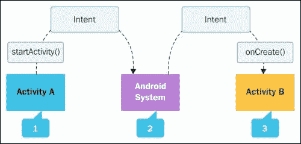
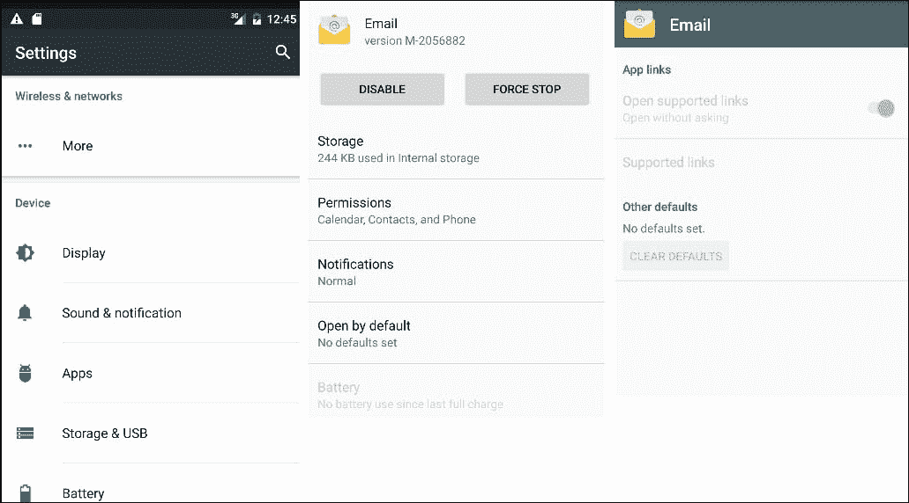
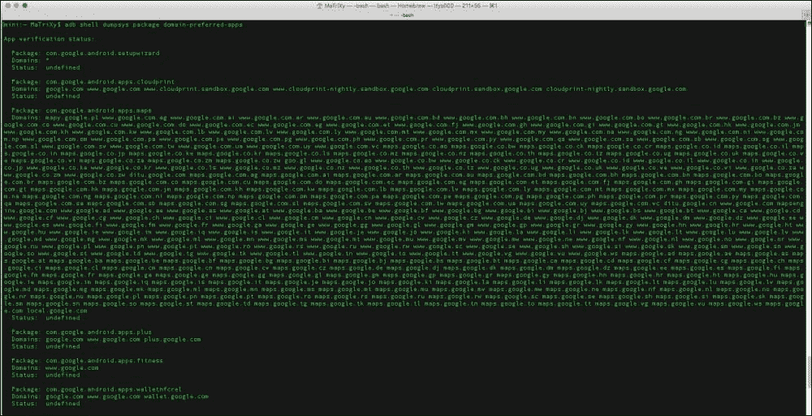
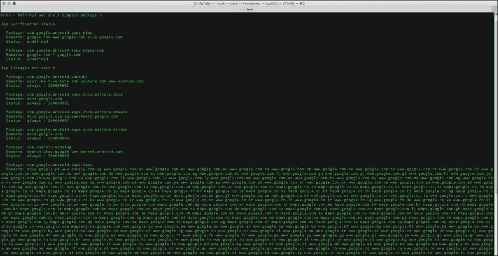

# 第二章：应用链接

新版 Android Marshmallow 的一个主要改进是强大的**应用链接**功能。它允许将你的应用与你所拥有的网络域关联起来。通过这种关联，你作为开发者允许系统确定处理特定网络链接的默认应用，并跳过提示用户选择应用的步骤。减少点击次数意味着摩擦更少，这意味着你可以更快地访问内容；这使用户和开发者都感到满意。在本章中，我们将涵盖以下主题：

+   Android Intent 系统

+   创建网站关联

+   触发应用链接验证

+   应用链接设置与管理

+   测试应用链接

# Android Intent 系统

几乎每个开发者都知道**Android Intent**系统是什么，但我们会稍作解释并概述理解应用链接功能所需的基本原则。Android Intent 系统可以在 Android 平台中找到；这允许通过小而简单的数据包传递数据。意图意味着我们想要执行一个动作。你可能已经知道了一些基本的意图：

+   `startActivity()`

+   `startActivityForResult()`

+   `startService()`

+   `sendBroadcast()`

下图展示了针对`startActivity()`和`onCreate()`意图的 Android Intent 系统：



来源：http://developer.android.com/guide/components/intents-filters.html

Android Intent 系统是一个灵活的机制，用于让应用能够处理内容和请求。多个应用可以在它们的**意图过滤器**中声明匹配的**URI**（即**统一资源标识符**的简称）模式。当用户点击没有默认**启动处理程序**的网络链接时，平台可能会显示一个对话框，让用户从声明了匹配意图过滤器的应用列表中选择。

意图还用于在系统范围内触发动作，其中一些动作是系统定义的，比如`ACTION_SEND`（称为*分享*动作），你作为应用开发者可以将特定的信息分享/发送到另一个应用程序，以完成用户所需的一个动作。

在 Android Marshmallow 之前，浏览器处理网页上点击的每个链接，系统会检查是否有可用的**自定义 URI 方案**。你的应用程序可以通过自定义 URI 方案处理特定的自定义动作。这种方法有时比较复杂，并不支持处理整个网络域下的链接。现在，这成为了可能。Android Marshmallow 增加的对应用链接的支持允许你作为应用开发者，将应用与一个网络域关联起来。这样，系统会自动确定哪个应用是处理特定网络链接的默认应用，而不是显示让用户选择应用的处理对话框。

### 注意

如果你希望了解更多关于意图的信息，可以访问以下链接：

[`developer.android.com/guide/components/intents-filters.html`](http://developer.android.com/guide/components/intents-filters.html)

## 创建网站关联

作为应用开发者以及网站所有者，你需要声明一个网站与应用的关联。声明是通过托管一个名为 `assetlinks.json` 的 JSON 文件来完成的。该文件必须位于有关域名的特定位置，例如：

`https://<domain>:<optional port>/.well-known/assetlinks.json`

### 注意

此文件通过 HTTPS 协议访问和验证，而不是 HTTP。

### 为什么需要这个文件？

JSON 文件保存有关将成为此域名下 URL 默认处理程序的 Android 应用程序的信息。在 JSON 文件中，你必须具有以下结构：

```kt
[{
  "relation": ["delegate_permission/common.handle_all_urls"],
  "target": {
    "namespace": "android_app",
    "package_name": "com.yourapp.androidapp",
    "sha256_cert_fingerprints": [""]
  }
}]
```

以下是一些前面结构中的元素：

+   `package_name`：这是来自你应用**清单**中的包名。

+   `sha256_cert_fingerprints`：这是你应用的 SHA-256 指纹

    如果你没有这个 **SHA**（**安全哈希算法**的简称），请使用以下命令：

    ```kt
    keytool -list -v -keystore app_release_signing.keystore

    ```

## 触发应用链接验证

你可以请求自动验证 `assetlinks.json` 文件中声明的任何应用链接。请求验证是通过将 `android:autoVerify` 属性添加到清单中的每个意图过滤器并设置为 `true` 来完成的。

假设我们拥有一个 WhatsApp 应用程序和域名。我们希望自动验证具有 `android.intent.action.VIEW` 动作的意图过滤器。

以下是一个来自 WhatsApp 的示例活动，它处理应用链接和自动验证属性：

```kt
<activity android:name="com.whatsapp.XXX" …>
  <intent-filter android:autoVerify="true">
    <action android:name="android.intent.action.VIEW"/>
    <category android:name="android.intent.category.DEFAULT"/>
    <category android:name="android.intent.category.BROWSABLE"/>
    <data android:scheme="http" android:host="www.whatsapp.com"/>
    <data android:scheme="https" android:host="www.whatsapp.com"/>
  </intent-filter>
</activity>
```

`android:autoVerify` 属性提醒平台在安装应用时验证应用链接。如果应用链接的验证失败，你的应用将不会被设置为处理这些链接的首选应用。如果用户打开其中任何一个链接时没有首选应用来处理这些链接，则会显示选择应用对话框。

如果用户已经使用系统设置并将一个应用设置为首选应用，那么链接将直接进入该应用，但这不是因为验证成功。

## 应用链接设置和管理

为了便于管理，你可以进入系统设置，通过导航到 **设置** | **应用** | **应用信息** | **默认打开** 来调整 URL 处理。



# 测试应用链接

与我们添加的每个新功能一样，我们必须测试我们将添加到应用程序中的应用链接功能。

## 检查清单和列出域名

我们的第一步是检查清单，确保所有域名都正确注册，并且所有意图过滤器都定义良好。下面提到的所有条件下的链接/域名是我们需要测试的：

+   带有 HTTP 或 HTTPS 值的 `android:scheme` 属性

+   带有域名 URI 模式的 `android:host` 属性

+   `category` 元素，可以是以下之一：

    +   `android.intent.action.VIEW`

    +   `android.intent.category.BROWSABLE`

## 数字资产链接 API

我们可以使用**数字资产链接 API**，通过以下语法确认我们的链接 JSON 文件是否被适当地托管和定义：

```kt
https://digitalassetlinks.googleapis.com/v1/statements:list?source.web.site=https://<DOMAIN>:<port>& relation=delegate_permission/common.handle_all_urls

```

## 测试我们的意图

既然我们已经确认托管的 JSON 文件是有效的，我们将在设备上安装应用，并等待至少 20-30 秒，让验证过程完成。之后，我们可以使用以下语法检查系统是否验证了我们的应用并设置了正确的链接处理策略：

`adb shell am start -a android.intent.action.VIEW \ -c android.intent.category.BROWSABLE \ -d "http://<DOMAIN>:<port>"`

例如，如果我们使用 YouTube 视频，可以使用以下命令触发 YouTube 应用直接打开视频：

```kt
adb shell am start -a android.intent.action.VIEW -c android.intent.category.BROWSABLE -d "http://youtu.be/U9tw5ypqEN0"

```

## 使用 adb 检查策略

**Android 调试桥**（**adb**）可以帮助我们使用以下命令检查设备上所有应用的现有链接处理策略：

```kt
adb shell dumpsys package domain-preferred-apps

```

下面的截图是前面命令的结果：



另一个选项如下：

```kt
adb shell dumpsys package d

```

下面的截图是前面命令的结果：



### 注意

安装后，我们必须等待至少 20-30 秒，以便系统完成验证过程。

下面的列表指示了每个用户与应用关联的域：

+   **包**：这指的是应用在其清单中声明的包名。

+   **域**：这指的是由该应用处理的网络链接的主机列表；空格用作分隔符。

+   **状态**：这指的是此应用的当前链接处理设置。

通过验证和`android:autoVerify="true"`将显示状态为`always`。

状态后面的十六进制数字（如前一个截图所示）是 Android 系统记录的用户应用链接偏好的记录。它并不表示验证已经成功。

### 注意

用户可以在验证过程结束前更改应用链接设置，这意味着我们可能会看到一个验证成功的假阳性。用户偏好优先于程序化验证，因此我们会看到链接直接跳转到我们的应用，而不会显示对话框，就像验证已经成功一样。

# 总结

正如我们所见，应用链接在 Android Marshmallow 中变得非常强大。这允许作为应用开发者的你帮助系统更好地决定如何行动。处理网页 URL 将为你提供更广泛的曝光，为你的应用带来更大的漏斗和更好的体验，从而你可以为用户提供更好的服务（这反过来又会导致更好的评分、更多的下载，反之亦然）。

应用链接的实现简单易懂，在当今的移动/网络世界中是必不可少的特性。尽管应用链接能为使用你应用程序的用户提供更好的操作处理，但用户可能会有多个设备，期待在每个设备上都有相同的行为表现，如果他们的数据和处理动作能够顺畅进行，用户将更加投入。这引出了我们的下一章内容，将会教您如何备份用户设置及更多功能。
