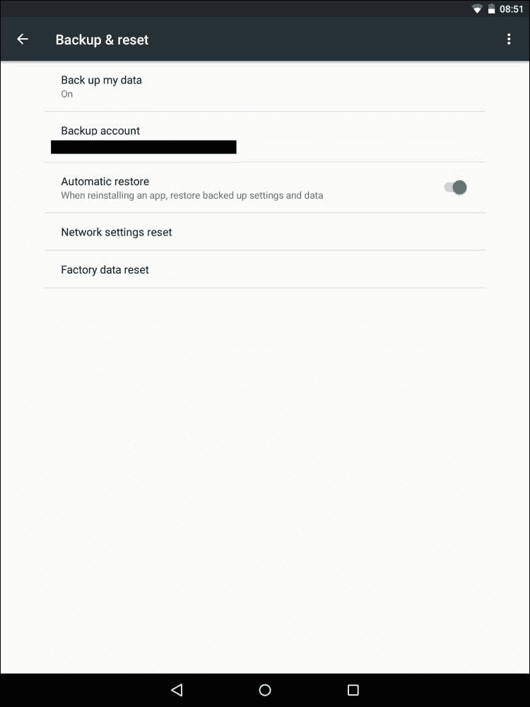
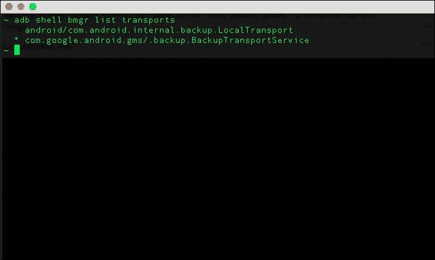

# 第三章：应用的自动备份

你是否曾经花时间在手机上设置一个应用，使用一段时间后，投入大量内容，由于意外而更换手机，却发现你的数据和设置随风而去了？

Android Marshmallow 的一个关键特性是它支持为用户应用进行完全自动的数据备份和恢复。这提升了用户体验，使整体参与更加有趣，并缩短了多设备上的登机时间。正如我们在前几章中讨论的，快乐的用户造就快乐的开发者。

你可以卸下设置新设备的负担；无论是新增设备还是替换设备都没关系。用户最终将拥有相同的应用配置和数据，使得工作更加**设备无关**。要在你的应用上启用此功能，你必须针对 Android Marshmallow SDK 的版本 23；默认情况下不需要额外的代码，尽管你可以根据需要配置此功能并允许特定的行为。当用户更换或升级设备时，数据会自动恢复。

在本章中，我们将学习此功能的工作原理以及配置我们想要备份的信息。我们将涵盖以下主题：

+   概述

+   数据备份配置

+   备份配置测试

+   重要的信息

# 概述

自动备份功能是通过将应用内创建的数据上传到用户的 Google Drive 账户来创建的，并保持加密状态。这不会影响用户的驱动器配额或你的配额。每个应用对每个用户限制为 25 MB 的备份，达到这个量后，你的应用将停止备份。另外，请注意这是*完全免费的*！

备份是在夜间以 24 小时为周期进行的，通常是自动的，当设备处于空闲、充电并连接到 Wi-Fi 网络时。这些条件是为了提高电池效率、数据费用，当然也是为了将用户干扰降到最低。Android 系统有一个**备份管理器**服务，它将所有可用的备份数据上传到云端。更换新设备或卸载后重新安装应用将触发恢复操作，进而将数据复制到应用的数据目录中。

### 注意

这种新行为允许你继续使用现有的备份服务调用。

要了解更多关于在 Android Marshmallow 之前使用的**Android 备份服务**，请访问：

[`developer.android.com/guide/topics/data/backup.html`](https://developer.android.com/guide/topics/data/backup.html)

# 数据备份配置

我们有很多想要为用户备份的数据，但我们也不希望备份所有数据。假设我们都同意不备份用户的密码或其他敏感数据，但如果你有一个基于用户使用的设备生成的特定应用配置该怎么办？这也应该以类似于设备令牌（如**Google Cloud Messaging** (**GCM**)等）的方式排除。我建议你弄清楚你的应用保留了哪些持久性数据，以及这些数据是否应该是与设备无关的。

你可以配置除了前面提到的自动排除文件之外需要备份的内容。这个配置应该在你的应用清单中通过`android:fullBackupContent`属性声明。你需要创建一个新的 XML 文件，它应该位于你的`res/xml`文件夹中，这将具有特定于你的应用数据备份的规则。

## 包含或排除数据

XML 文件配置包括一组简单的`include`/`exclude`标签，这些标签指示你是否需要备份一个目录或特定文件。请记住，默认情况下，XML 是*减法的*，这意味着除非你的 XML 中有排除的指示，否则备份所有可能的内容。

另一种可能的配置是建设性配置，你只需指定想要备份的内容，它们就会被添加到备份中。这种配置行为是通过在你的 XML 中添加一个`include`标签来实现的，从那时起，它将保持建设性。

正如我们示例中所看到的，我们在应用清单中指定了一个备份方案配置：

```kt
<?xml version="1.0" encoding="utf-8"?>
<manifest   package="com.yourapp.androidapp">
  <uses-sdk android:minSdkVersion="16" />
  <uses-sdk android:targetSdkVersion="23" />
  <app android:fullBackupContent="@xml/androidapp_backup_config">
  </app>
</manifest>
```

在我们的清单文件中声明文件之后，我们还需要在`res/xml`文件夹中构建它；例如，请看以下内容：

```kt
<?xml version="1.0" encoding="utf-8"?>
<full-backup-content>
  <exclude domain="database" path="sensitive_database_name.db"/>
  <exclude domain="sharedpref" path="androidapp_shared_prefs_name"/>
  <exclude domain="file" path="some_file.file_Extension"/>
  <exclude domain="file" path="some_file.file_Extension"/>
</full-backup-content>
```

这个示例备份配置只排除特定数据被备份。所有其他文件都会被备份。

## 备份配置语法

尽管你应该已经整理出应用特定的持久数据，我们可以回顾一下应该出现在 XML 中的配置语法。配置 XML 文件的语法如下：

```kt
<full-backup-content>
  <include domain=[ "root" | "sharedpref" | "database" | "file" | "external"] path="string" />
  <exclude domain=[ "root" | "sharedpref" | "database" | "file" | "external"] path="string" />
</full-backup-content>
```

不要忘记阅读这里每个属性和元素的说明：

+   `<include>`：每当你想要特别将一个经过批准的资源添加到备份中时，你应该使用这个标签。记住，每当你指定一个`<include>`标签时，备份行为会变为建设性，系统只备份用`<include>`标签指定的资源。

+   `<exclude>`：每当你想要从备份中排除应用的任何资源时，你应该使用这个标签。如前所述，你应该排除敏感数据和应用的设备特定数据。这里的行为是这样的：系统备份你应用的所有数据，除了使用`<exclude>`标签指定的资源。

+   `domain`：这出现在`include`以及`exclude`标签上。它允许您声明您希望包括或排除在备份中的资源类型。域有特定的有效值供您选择：

    +   `root`：这意味着资源应该在应用的`root`目录中

    +   `file`：这意味着资源位于`Files`目录中的文件，可以通过`getFilesDir()`方法访问。

    +   `database`：这意味着您的资源是一个数据库文件，可以通过`getDatabasePath()`方法或`SQLiteOpenHelper`类定位到该文件

    +   `sharedpref`：这意味着您的资源是一个可以通过`getSharedPreferences()`方法访问的`SharedPreferences`对象

    +   `external`：这意味着您的资源位于外部存储中的文件，该文件位于通过`getExternalFilesDir()`方法访问的目录中

    +   `path`：这是一个到您希望包含或排除在备份中的资源的`String`路径

## 选择退出应用数据备份

在某些情况下，您可能会决定不希望在您的应用中使用应用数据备份功能。在这种情况下，您可以通知系统您的应用已经选择退出。

在您的清单中将`android:allowBackup`属性设置为`false`，可以通过以下命令完成：

```kt
android:allowBackup="false"
```

# 备份配置测试

到目前为止，您已经创建了一个备份配置，您可能（应该）测试它并确保您的应用保存数据，恢复数据，并且没有问题地运行。

## 设置备份日志

在测试应用配置之前，您可能想要启用日志记录；这是通过`adb`完成的，您将解析器`log`属性设置为`VERBOSE`：

```kt
$ adb shell setprop log.tag.BackupXmlParserLogging VERBOSE

```

测试备份功能可以分为两部分：

+   测试备份阶段

+   测试恢复阶段

## 测试备份阶段

可以手动运行备份，但首先，您必须通过`adb`命令运行备份管理器：

```kt
$ adb shell bmgr run

```

在备份管理器启动并运行后，我们可以通过`adb`触发备份阶段，并将我们应用的包名作为`<PACKAGE.NAME>`参数运行：

```kt
$ adb shell bmgr fullbackup <PACKAGE.NAME>

```

## 测试恢复阶段

我们执行了备份阶段，一切顺利。现在，我们想要测试恢复阶段，并验证所有备份的数据是否正确恢复，我们没有遗漏任何资源。我们手动运行恢复（必须在备份应用数据后进行）。这是通过`adb` shell 完成的，指定您应用的包名为`<PACKAGE.NAME>`参数：

```kt
$ adb shell bmgr restore <PACKAGE.NAME>

```

### 注意

`restore`操作会停止您的应用并在实际执行恢复操作之前清除其数据。

## 故障排除

问题可能出现在任何地方，包括我们的案例中。如果您遇到问题，应该尝试通过导航到**设置** | **备份和重置**，打开和关闭备份来清除数据，对设备进行工厂重置：



您可以使用此命令清除数据：

```kt
$ adb shell bmgr wipe <TRANSPORT> <PACKAGE.NAME>

```

`<TRANSPORT>`标签前缀为`com.google.android.gms/`。要查看传输列表，可以运行以下`adb`命令：

```kt
$ adb shell bmgr list transports

```

下面的截图是前面命令的结果：



# 重要的字节

在我们进入下一章之前，让我们回顾一下 Android 应用备份功能中几个重要的子话题。

系统备份不包括以下内容：

+   通过`getCacheDir()`方法（API 1 及以上版本）位于`CacheDir`中的文件

+   通过`getCodeCacheDir()`方法（API 21 及以上版本）位于`CodeCacheDir`中的文件

+   位于外部存储且不在`ExternalFilesDir`中，通过`getExternalFilesDir(String type)`方法获取的文件，其中类型可以是以下这些：

    +   文件目录根部的`null`

    +   以下类型用于特定子文件夹/目录：

        +   `android.os.Environment.DIRECTORY_MUSIC`

        +   `android.os.Environment.DIRECTORY_PODCASTS`

        +   `android.os.Environment.DIRECTORY_RINGTONES`

        +   `android.os.Environment.DIRECTORY_ALARMS`

        +   `android.os.Environment.DIRECTORY_NOTIFICATIONS`

        +   `android.os.Environment.DIRECTORY_PICTURES`

        +   `android.os.Environment.DIRECTORY_MOVIES`

+   通过`getNoBackupFilesDir()`方法（API 21 及以上版本）位于`NoBackupFilesDir`中的文件

## 需要从备份中排除的内容

尽管我们之前讨论过这个问题，你可能需要修改哪些应用数据有资格进行备份。

在排除的数据中，你必须排除任何由服务器发出或设备生成的特定于设备的标识符，包括 GCM 注册令牌。

你还必须为任何账户凭据或其他敏感信息添加排除逻辑。

## 备份代理和备份事件

你可以实现自己的`BackupAgent`属性，这允许你监听事件。`BackupAgent`有几个你可以重写的回调，其中一个是`onRestoreFinished()`方法，在成功恢复后调用。除了`android:backupAgent`，你应在清单中添加`android:fullBackupOnly="true"`属性，这将指示尽管你的应用有`BackupAgent`属性，但 Android Marshmallow 和其他设备将只执行全数据备份操作。

当你想要从**SharedPreferences**备份中排除几个键（如特定于设备的令牌、GCM 令牌等）时，这个技术会很有用。你不需要将 SharedPreferences 分割成多个文件，只需在恢复时，即在`onRestoreFinished()`被调用时移除这些键。

请记住，其他敏感数据不应该被备份。你可以阅读更多关于`BackupAgent`的信息：

[Android 应用备份代理参考](http://developer.android.com/reference/android/app/backup/BackupAgent.html)。

# 总结

Android Marshmallow 为应用带来了出色的备份功能，减少了用户迁移到新设备时的摩擦。

在一个充满多样化应用的世界里，最大化自动备份的好处可以带来更好的用户体验。此功能的目的是减轻负担，并缩短用户在新设备上设置喜爱应用所需的时间。

允许用户在新安装后仅通过密码提示即可进入你的应用，这可以是一次很棒的经历；亲自尝试一下吧！你可以查看包含的示例代码，或者访问 GitHub 仓库：

[应用自动备份示例](https://github.com/MaTriXy/apps_autobackup_example)

在我们下一章中，我们将深入探讨更多在 Android Marshmallow 上执行的变化，随着我们揭示其令人惊叹之处。
