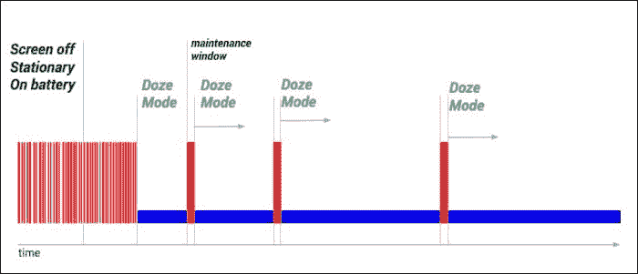
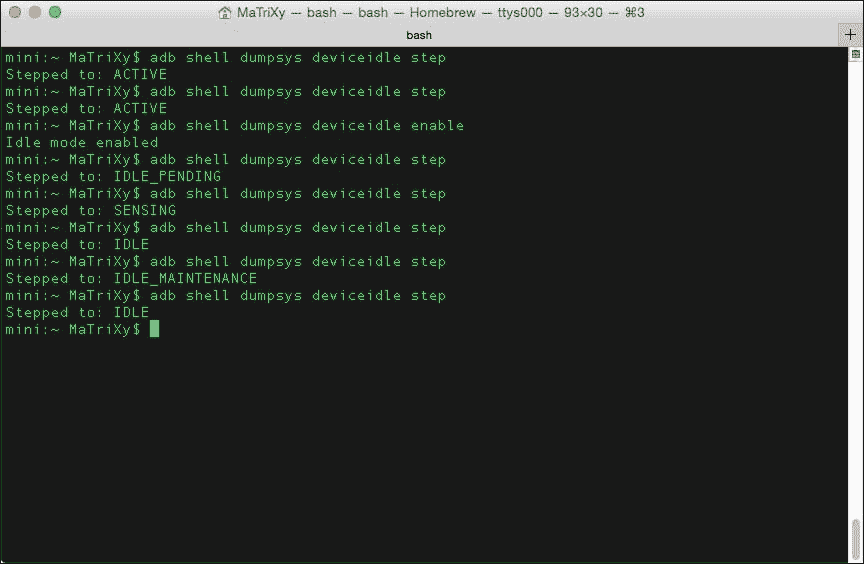
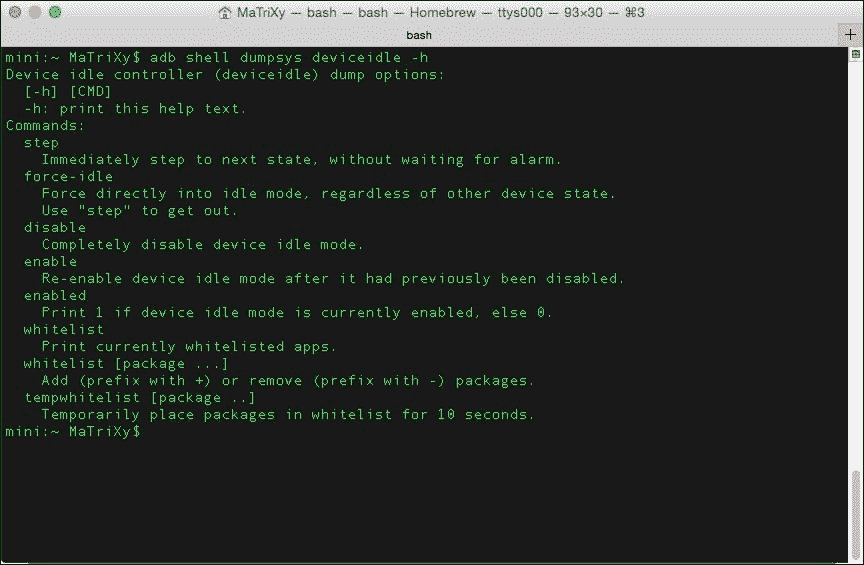
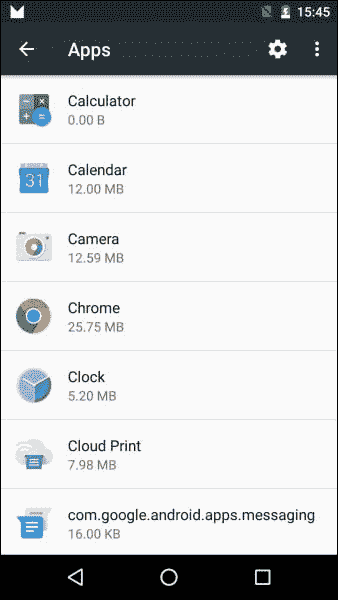
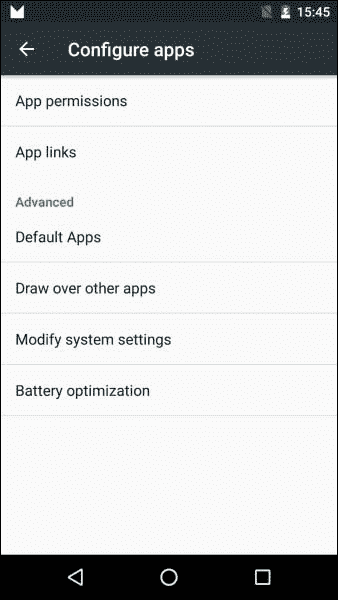
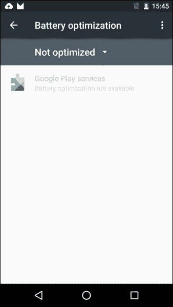
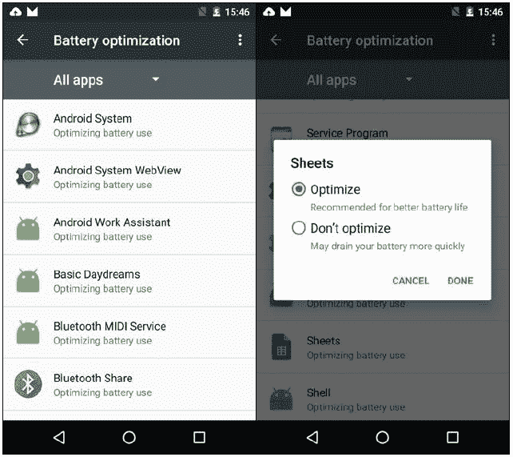

# 第四章：变化展开

安卓棉花糖有一些可能会被忽视的变化。这些变化虽短，但需要你全神贯注地理解它们，确保在使用已移除/不推荐使用的 API、新的*流程*或新的改进 API 时不会遗漏。

我整理了一系列变化，这些变化在为安卓 6.0（Marshmallow）构建应用时你可能需要了解或需要知道：

+   节能模式

+   采用可移动存储

+   移除 Apache HTTP 客户端

+   通知

+   文本选择

+   支持库通知

+   安卓 Keystore 更改

+   Wi-Fi 和网络更改

+   运行时

+   硬件标识符

+   APK 验证

+   USB 连接

+   直接分享

+   语音交互

+   Assist API

+   蓝牙 API 更改

前一组没有为重大变化单独设立章节，例如第一章中涵盖的权限模型，*Android Marshmallow Permissions*，或者改进的 API，比如我们将在下一章讨论的视频/音频/摄像头 API。

# 节能模式

安卓 6.0 增加了新的节能模式，**Doze**和**App Standby**，根据谷歌的测量，可将电池寿命延长多达 2 倍。Doze 模式旨在提高空闲设备的睡眠效率，而 App Standby 模式旨在防止应用在空闲状态下耗电。在这两种情况下，将设备插入充电器将允许恢复正常操作。

## Doze 模式

当设备未插入电源，屏幕关闭且处于静止状态（可以通过加速度传感器等传感器确定）一段时间后，就会进入休眠状态。我们得到的是一个尽可能长时间保持系统在睡眠状态的状态。当安卓 6.0 设备处于 Doze 模式时，后台不会发生太多事情，如下图所示：



简而言之，你认为会在后台发生的一切实际上并不会发生。

### 设备进入休眠状态时应用会发生什么？

当设备进入休眠状态时，你会遇到一些节能的系统行为，包括以下内容：

+   除非你的应用接收到高优先级的 GCM，否则网络访问受限

+   **唤醒锁**被忽略，但会被授予应用

+   使用以下方式延迟同步和工作：

    +   同步适配器

    +   `JobScheduler`（不允许运行；这是由系统强制执行的）

+   闹钟延迟

    ### 注意

    如果你有关键的闹钟并需要触发 UI：

+   使用`setAndAllowWhileIdle()`方法

+   不能滥用；每 15 分钟允许一次

+   Wi-Fi 扫描关闭

+   GPS 关闭

Doze 模式将在任何`setAlarmClock()`闹钟响起前不久结束；当静止和未插入状态互换时，它也可能结束。退出 Doze 模式将触发设备执行所有待定的工作和同步。

### 测试应用在 Doze 模式下的表现

使用你的设备（搭载 Android 6.0）和 `adb` 命令测试应用：

1.  使用以下命令模拟未插电的设备：

    ```kt
    $ adb shell dumpsys battery unplug

    ```

    这将导致你的电池图标显示为设备未插电的状态。

1.  使用以下命令进入下一个状态：

    ```kt
    $ adb shell dumpsys deviceidle step

    ```

    这可以在以下截图中看到：

    

1.  使用以下命令将电池状态重置回正常条件：

    ```kt
    $ adb shell dumpsys battery reset

    ```

你也可以使用以下命令列出可用的命令：

```kt
$ adb shell dumpsys deviceidle -h

```

这将打印出更多关于 `deviceidle` 使用的信息，如下面的截图所示：



## App Standby 模式

当系统确定一个应用处于空闲状态时，应用待机模式是一种特殊的模式。除非应用表现出以下特点，否则在一段时间后会被视为空闲：

+   在那时它有一个前台进程（一个活动或服务）

+   它在锁屏或通知托盘中显示通知

+   它是由用户明确启动的

+   它通过设置应用被标记为不参与优化

### 应用在 App Standby 模式下会发生什么？

如果设备未插电，同步和任务会被推迟，网络访问也会受到限制。

如果设备插电，系统会释放待机状态下的应用锁，允许设备恢复网络访问和/或执行任何挂起的工作和同步。

### 注意

在长时间处于空闲状态时，系统允许空闲应用每天访问网络一次。

### 测试应用在 App Standby 模式下的表现

使用你的设备（搭载 Android 6.0）和 `adb` 命令测试应用：

1.  模拟应用进入待机模式：

    ```kt
    $ adb shell am broadcast -a android.os.action.DISCHARGING
    $ adb shell am set-inactive <App Package Name > true

    ```

1.  通过唤醒你的应用来模拟：

    ```kt
    $ adb shell am set-inactive <App Package Name > false

    ```

1.  观察应用唤醒时会发生什么。测试从待机模式优雅地恢复。检查你的应用通知和后台任务是否如你所预期的那样工作。

你可以通过以下命令将你的应用设置为非活动状态：

```kt
$ adb shell am set-inactive <App Package Name > true

```

你也可以通过以下命令检查应用的状态：

```kt
$ adb shell am get-inactive <App Package Name >

```

### 注意

示例测试是对 Google Photos 行为进行的；保留所有权利。

控制台输出例如如下所示：

```kt
~ adb shell am set-inactive com.google.android.apps.photos false
~ adb shell am get-inactive com.google.android.apps.photos
Idle=false
~ adb shell am set-inactive com.google.android.apps.photos true
~ adb shell am get-inactive com.google.android.apps.photos
Idle=true

```

### 排除应用和设置

你可以通过设置应用排除应用参与 App Standby 模式，如前所述。执行此操作的步骤如下：

1.  前往 **设置** | **应用**。

1.  点击齿轮图标打开 **配置应用** 屏幕。

1.  选择 **电池优化**。

1.  下面的截图显示了一个从 App Standby 模式中排除的应用列表——即那些未被优化的应用。你可以打开所有应用的选择，并为每个应用程序选择你需要的确切行为。

### 提示

这里有一些你需要注意和记住的要点和提示：

+   使用 `PowerManager` 实例的 `isIgnoringBatteryOptimizations()`，检查你的应用是否在 **白名单** 上

+   使用以下方法直接引导用户到配置屏幕：

    ```kt
    startActivity(new Intent(Settings.ACTION_IGNORE_BATTERY_OPTIMIZATION_SETTINGS ));
    ```

+   执行以下步骤以显示系统对话框，询问是否将特定应用添加到白名单：

    1.  在应用的清单中添加 `REQUEST_IGNORE_BATTERY_OPTIMIZATIONS` 权限。

    1.  创建一个指向你应用的 URI 包。

    1.  将 URI 包装在意图中，并像以下代码所示调用 `startActivity()`：

        ```kt
        Intent intent = new Intent(Settings.ACTION_REQUEST_IGNORE_BATTERY_OPTIMIZATIONS , Uri.parse("package:" + getPackageName()));
        startActivity(intent);
        ```

+   请注意，如果我们的应用已经被加入白名单，则不会再次显示对话框

# 可移动存储的采用

Android Marshmallow 允许用户 *采用* 外部存储设备，如 SD 卡。这类采用将格式化并加密存储设备，并将其作为内部存储挂载。完成后，用户可以在存储设备之间移动应用及其私有数据。系统的 `android:installLocation` 首选在清单中将用于确定每个应用可用的位置。你需要记住的是，使用 `Context` 方法获取目录或文件以及 `ApplicationInfo` 字段返回的值可能会在运行之间发生变化。你应始终动态调用这些 API。不要使用硬编码的文件路径或持久化完全合格的文件路径。

`Context` 方法如下：

+   `getFilesDir()`

+   `getCacheDir()`

+   `getCodeCacheDir()`

+   `getDatabasePath()`

+   `getDir()`

+   `getNoBackupFilesDir()`

+   `getFileStreamPath()`

+   `getPackageCodePath()`

+   `getPackageResourcePath()`

`ApplicationInfo` 字段如下：

+   `dataDir`

+   `sourceDir`

+   `nativeLibraryDir`

+   `publicSourceDir`

+   `splitSourceDirs`

+   `splitPublicSourceDirs`

你可以使用以下命令调试此功能，并启用通过 **OTG**（即 **On The Go**）线连接的 USB 驱动的采用：

```kt
$ adb shell sm set-force-adoptable true

```

有关 USB 的更多信息，请访问 [Android USB 指南](https://developer.android.com/guide/topics/connectivity/usb/index.html)。

# Apache HTTP 客户端的移除

**Apache HTTP 客户端**已经被弃用有一段时间了——从 2011 年左右开始。在 Android 2.3 及更高版本上使用这个客户端并不推荐；现在随着 Android 6.0 Marshmallow 的发布，这个 API 已经被移除。因此，我们将使用 `HttpURLConnection` 类代替。

这个 API 更高效，减少了网络使用，并最小化了功耗。

如果你希望继续使用 Apache HTTP API，你必须在你的 `build.gradle` 文件中首先声明以下编译时依赖：

```kt
android {
  useLibrary 'org.apache.http.legacy'
}
```

### 注意

如果你在 Android Studio 中遇到编译错误，可以参考 stackoverflow 上的这些问题及其解决方案：

+   [关于 Android Marshmallow 的 stackoverflow 问题](http://stackoverflow.com/q/30856785/529518)

+   [关于编译错误的 stackoverflow 问题](http://stackoverflow.com/q/31653002/529518)

# 通知

通知功能有一些变化，如下：

+   `Notification.setLatestEventInfo()`方法现在已经移除。在构建通知时，我们必须使用`Notification.Builder`类。

+   更新通知也是通过使用相同的`Notification.Builder`实例完成的，并调用`build()`方法将获得一个更新的`Notification`实例。如果需要支持旧版本，可以使用`NotificationCompat.Builder`，它包含在**Android Support Library**中。

+   `adb shell dumpsys notification`命令不再打印通知文本。现在的正确用法是`adb shell dumpsys notification --noredact`。

+   新增的`INTERRUPTION_FILTER_ALARMS`过滤器级别对应于新模式：*仅闹钟不干扰*。

+   新增的`CATEGORY_REMINDER`类别用于用户计划的提醒。

+   新增的`Icon`类允许通过`setSmallIcon()`和`setLargeIcon()`方法将图标附加到通知上。

+   更新的`addAction()`方法现在接受一个`Icon`对象，而不是 drawable 资源 ID。

+   新增的`getActiveNotifications()`方法允许你找出当前存活的通知。

+   当我们使用以下方法时，可以获取用户希望在通知下看到和不希望看到的内容的一些知识：

    +   新增的`getCurrentInterruptionFilter()`方法返回当前允许通知打断用户的通知干扰过滤器。

    +   新增的`getNotificationPolicy()`方法返回当前的通知策略。

# 文本选择

材料设计指南规范部分讨论了应用程序中的文本选择。用户在你的应用内选择文本，现在你有一个 API 来集成类似于上下文操作栏的**浮动工具栏**设计模式。有关设计规范的更多信息，请访问[`www.google.com/design/spec/patterns/selection.html#selection-item-selection`](http://www.google.com/design/spec/patterns/selection.html#selection-item-selection)。

实现步骤如下：

1.  将你的`ActionMode`调用改为`startActionMode(Callback,ActionMode.TYPE_FLOATING)`。

1.  扩展`ActionMode.Callback2`。

1.  重写`onGetContentRect()`方法，并在视图中为内容`Rect`对象提供坐标。

1.  当你需要使`Rect`对象和其位置不再有效时，调用`invalidateContentRect()`方法。

## 支持库通知

浮动工具栏不具备向后兼容性。`Appcompat`默认控制`ActionMode`对象。这将阻止浮动工具栏的显示。

实现步骤如下：

1.  在返回的`AppCompatDelegate`对象上调用`getDelegate()`和`setHandleNativeActionModesEnabled()`。

1.  将输入参数设置为`false`。

此调用将`ActionMode`对象的控制权返回给框架，使得 6.0 设备支持`ActionBar`或浮动工具栏模式，并允许早期版本支持`ActionBar`模式。

# Android Keystore 更改

从 Android 6.0 开始，Android Keystore 提供者不再支持**数字签名算法**（**DSA**）。

有关 keystore 及其使用方式的更多信息，请访问[`developer.android.com/training/articles/keystore.html`](https://developer.android.com/training/articles/keystore.html)。

# Wi-Fi 和网络更改

Android Marshmallow 对 Wi-Fi 和网络 API 进行了一些更改。

更改`WifiConfiguration`对象的状态仅限于自行创建的对象。你被限制修改或删除用户或其他应用创建的`WifiConfiguration`对象。

在早期版本中，使用`enableNetwork()`强制设备连接到特定 Wi-Fi 网络并设置`disableAllOthers=true`会导致设备断开与其他网络的连接。这在 Android 6.0 中不会发生。当`targetSdkVersion <=20`时，你的应用将固定使用选定的 Wi-Fi 网络。当`targetSdkVersion >=21`时，你需要使用`MultiNetwork` API 并确保网络流量分配给正确的网络。有关`MultiNetwork` API 的更多信息，请参考[`developer.android.com/about/versions/android-5.0.html#Wireless`](https://developer.android.com/about/versions/android-5.0.html#Wireless)。

# 运行时

Android **ART**（即**Android 运行时**）在 Android Marshmallow 中也有所更新，以下是更新内容：

+   `newInstance()`方法：修复了**Dalvik**（另一个运行时）在检查访问规则时的问题。如果你想覆盖访问检查，请使用输入参数设置为`true`的`setAccessible()`方法。

+   使用`v7 Appcompat`库或`v7 Recyclerview`库？你必须更新到最新版本。

+   确保从 XML 引用的任何自定义类都已更新，使其类构造函数可访问。

+   动态链接器的行为已更新。

+   ART 运行时区分库的`soname`和其路径；现在实现了通过`soname`的搜索。此问题有一个公开的 bug 已被修复；如果你想扩展阅读，请访问：

    [`code.google.com/p/android/issues/detail?id=6670`](https://code.google.com/p/android/issues/detail?id=6670)

# 硬件标识符

Android 6.0 引入了一项重大更改，以增强数据保护；`WifiInfo.getMacAddress()`和`BluetoothAdapter.getAddress()`方法现在返回一个常量值`02:00:00:00:00:00`，这意味着你不能依赖这些方法获取信息。

现在，当你尝试使用 API 中的某些方法时，你需要添加权限：

+   `WifiManager.getScanResults()`和`BluetoothLeScanner.startScan()`需要授予这两个权限中的一个：

    +   `ACCESS_FINE_LOCATION`权限

    +   `ACCESS_COARSE_LOCATION`权限

+   `BluetoothDevice.ACTION_FOUND`：这必须具有`ACCESS_COARSE_LOCATION`权限

### 注意

当运行 Android 6.0（棉花糖）的设备启动后台 Wi-Fi 或蓝牙扫描时，外部设备看到的源地址是一个随机化的 MAC 地址。

# APK 验证

平台现在对**Android 软件包工具**（**APKs**）进行严格验证。

如果清单中声明的文件在 APK 本身中不存在，那么 APK 就被认为是损坏的。从 APK 中删除内容需要重新签名 APK。

# USB 连接

默认情况下，USB 连接仅用于充电。用户现在必须授权通过 USB 端口进行交互。你的应用程序应考虑到这一点，并意识到可能不会获得授权。

# 直接分享

在我看来，技术最棒的事情之一是它为用户提供了很好的互动和受益选择。**直接分享**可以作为优点列表中的一个伟大补充，为整个应用世界带来极佳流畅的用户体验。那么，直接分享是什么呢？几乎现在每个应用都会使用某种信息/数据交换机制与用户设备上的其他应用或通过分享机制与外部世界进行交互。分享机制将一个应用程序的信息暴露给另一个应用程序。通常，用户会与几个亲密伙伴（家人、亲密朋友或同事）互动，这正是直接分享能提供帮助的地方。

直接分享是一组使分享直观快速的 API。你定义了直接分享目标，这些目标会在你的应用程序中启动特定的活动。这些目标显示在**分享**菜单中，允许更快地分享和流畅的数据流。

使用直接分享，用户可以将内容分享到目标，比如其他应用中的联系人。

实现步骤如下：

1.  定义一个扩展了`ChooserTargetService`类的类。

1.  在清单中声明你的服务。

1.  指定`BIND_CHOOSER_TARGET_SERVICE`权限和意图过滤器`SERVICE_INTERFACE`动作。

一个服务声明的示例如下：

```kt
<service android:name=".MyChooserTargetService" android:label="@string/McTs_name" android:permission= "android.permission.BIND_CHOOSER_TARGET_SERVICE">
  <intent-filter>
    <action android:name= "android.service.chooser.ChooserTargetService"/>
  </intent-filter>
</service>
```

现在，我们已经声明了一个服务，对于每个我们想要公开的目标，我们在应用程序清单中添加了一个带有`android.service.chooser.chooser_target_service`名称的`<meta-data>`元素。

```kt
<activity android:name=".SampleDirectShareTarget" android:label="@string/SampleDirectShareTarget_name">
  <intent-filter>
    <action android:name="android.intent.action.SEND" />
  </intent-filter>
  <meta-data android:name= "android.service.chooser.chooser_target_service" android:value=".ChooserTargetService" />
</activity>
```

让我们看看我们服务中的代码：

```kt
public class MyChooserTargetService extends ChooserTargetService {
  private String mDirectShareTargetName;
  private final int MAX_SHARE_TARGETS = 5;

  @Override
  public void onCreate() {
    super.onCreate();
    mDirectShareTargetName = "Sharing Person demo #%d";
  }

  @Override
  public List < ChooserTarget > onGetChooserTargets(ComponentName sendTarget, IntentFilter matchedFilter) {
    ArrayList < ChooserTarget > result = new
    ArrayList < ChooserTarget > ();
    for (int i = 1; i <= MAX_SHARE_TARGETS; i++) {
      result.add(buildTarget(i));
    }
    return (result);
  }

  private ChooserTarget buildTarget(int targetId) {
    String title = String.format(mDirectShareTargetName, targetId);
    Icon icon = Icon.createWithResource(this, R.drawable.share_target_picture);
    float target_value = ((float)(25 - targetId) / 25);
    ComponentName componentName = new ComponentName(MyChooserTargetService.this, TargetActivity.class);
    Bundle bundle = new Bundle();
    bundle.putInt("simple_key", targetId);
    return (new ChooserTarget(title, icon, target_value, componentName, bundle));
  }
}
```

如果你希望更好地查看代码，可以访问**代码片段**；你可以访问[`gist.github.com/MaTriXy/adeacdf5496bcdae5f42`](https://gist.github.com/MaTriXy/adeacdf5496bcdae5f42)。

你必须实现`onGetChooserTargets()`方法，因为当触发直接分享时，会调用它。你返回一个表示应用程序分享入口点的`ChooserTarget`对象列表。`onGetChooserTargets()`的结果与常规`ACTION_SEND`活动本身一起包含。因此，我们只希望`ChooserTarget`对象能改善流程，而不是重复项。

在创建几个`ChooserTarget`对象时，每个对象可能都指向同一个活动。你必须确保额外的捆绑包将包含区分信息，以便每个请求都是唯一的。*不要*将自定义的`Parcelable`对象放在这个捆绑包中，因为它会导致崩溃。你可以通过[`developer.android.com/reference/android/service/chooser/ChooserTarget.html#ChooserTarget`](https://developer.android.com/reference/android/service/chooser/ChooserTarget.html#ChooserTarget)了解更多关于`ChooserTarget`的信息。

## 如果我们没有东西可以分享怎么办？

有时，对于特定的请求，你可能没有任何直接分享目标；那么，返回一个空列表会很棒。如果你知道在将来使用应用之前不会有任何结果，你也可以通过`android:enabled="false"`来禁用服务。另一个选择是只为 Android 6.0 启用服务。这可以通过使用布尔资源轻松完成：

+   让我们添加一个名为`is_share_targets_on`的布尔资源：

    +   默认值是`res/values/bools.xml`；将其设置为`false`

    +   Android 6.0 是 API 23，所以在`res/values-v23/bools.xml`中，将其设置为`true`

+   在你的服务声明中添加`android:enabled="@bool/is_share_targets_on"`

## 直接分享最佳实践

以下是在直接分享中遵循的一些最佳实践：

+   Android 6.0 限制了分享目标的数量，只显示其中的八个。提供超过八个分享目标将根据分数显示最佳的八个。

+   如果你的目标列表超过 1 MB，可能会出现`FAILED BINDER TRANSACTION`异常。

+   尝试限制/封顶你从`ChooserTargetService`类中尝试返回的分享目标数量。

+   确保你的应用图标显示正确，因为它将作为徽章应用于你用于直接分享目标的图标上。

# 语音交互

**语音交互**通常源于用户的语音动作。然而，语音交互活动在没有用户输入的情况下启动。Android 棉花糖有一个新的语音交互 API，结合**语音动作**，它允许我们将对话式语音体验构建到我们的应用中。使用`isVoiceInteraction()`方法来确定活动是否由语音动作触发。然后，你可以使用`VoiceInteractor`类与用户交互。

不要与`isVoiceInteractionRoot()`方法混淆，该方法仅在活动也是语音交互的根时返回`true`。在这里，如果你的活动直接由语音交互服务启动，而不是在语音交互过程中由另一个活动（另一个应用）启动，你将得到`true`。

一个最佳实践是提示用户并确认这是他们预期的操作。你已经知道语音输入是从**Google Now**中触发的，你只需简单的语音输入，如`open android.com`，就可以打开 URL。现在，你可以发明新的语音动作并将它们注册到 Google，直接且具体地引导流量到你的应用。

要了解更多关于实现语音操作的信息，请访问[`developers.google.com/voice-actions/interaction/`](https://developers.google.com/voice-actions/interaction/)。

# 辅助 API

在**2015 年的 Google I/O**上，我们看到了*Now on Tap*功能，Google Now 能够窥视正在运行的应用并提供上下文辅助。`Assist` API 为用户通过**助手**进行互动提供了一种新方式。在使用助手之前，必须先启用它，使其能够了解当前上下文。通过长按*主页*按钮来触发助手，无论哪个应用处于活动状态都可以。

你可以通过设置`WindowManager.LayoutParams.FLAG_SECURE`标志来选择退出。

要加入，你需要使用新的`AssistContent`类。

为了能够从我们的应用向助手提供额外的上下文信息，我们需要遵循以下步骤：

1.  实现`Application.OnProvideAssistDataListener`接口，当用户请求帮助时调用。

1.  使用`Application.registerOnProvideAssistDataListener()`注册它。

1.  重写`onProvideAssistData()`回调，当用户请求帮助时调用。它用于构建带有当前应用所有上下文的`ACTION_ASSIST`意图。

1.  重写`onProvideAssistContent()`回调，这是可选的。当用户请求帮助时调用，允许我们提供与当前活动相关的内容引用。

1.  完成后，使用`Application.unregisterOnProvideAssistDataListener()`注销自己。

# 蓝牙 API 变更

除了之前提到的变化，Android Marshmallow 6.0 还在蓝牙 API 中引入了一些其他变化。

## 蓝牙手写笔支持

**手写笔**已经存在一段时间了；在 Android 棉花糖版本之前，蓝牙手写笔没有完全支持规范。你可以将兼容的蓝牙手写笔与手机或平板配对并连接。由于你不仅限于屏幕上的触摸，还可以融合位置、压力和按钮状态数据，从而提供更精确的用户输入和体验。你的应用可以为手写笔按钮添加监听器并相应地作出反应。只需在你的活动中使用`View.OnContextClickListener`和`GestureDetector.OnContextClickListener`对象。

为了检测手写笔按钮的交互和移动，你需要以下内容：

+   `MotionEvent`方法

+   `getTooltype()`方法，如果带有按钮的手写笔在屏幕上触摸，将返回`TOOL_TYPE_STYLUS`

+   `getButtonState()`方法，在针对 Android 6.0 的应用中返回以下内容：

    +   `BUTTON_STYLUS_PRIMARY`: 按下手写笔主按钮

    +   `BUTTON_STYLUS_SECONDARY`: 按下副按钮

    +   `BUTTON_STYLUS_PRIMARY` | `BUTTON_STYLUS_SECONDARY`: 同时按下这两个按钮

+   针对低于 Android 6.0 API 级别的应用将导致以下结果：

    +   `BUTTON_SECONDARY`: 按下手写笔主按钮

    +   `BUTTON_TERTIARY`: 按下次级按钮

    +   `BUTTON_SECONDARY` | `BUTTON_TERTIARY`：按下这两个按钮

## 改进的蓝牙低能耗扫描

你的应用里使用过蓝牙低能耗（BLE）吗？现在，扫描过程变得更加简单和高效了。使用新的 `setCallbackType()` 方法，并指定当系统发现/看到与 `ScanFilter` 类匹配的广告包时，你希望获得回调。与之前安卓版本相比，你将获得更高的电源效率。

# 概述

我们回顾了安卓棉花糖版本中的一些变化。所有这些变化都值得关注，并将在你的应用开发周期中为你提供帮助。在后续章节中，我们还会更详细地讨论一些其他变化。我们的下一章将讨论音频、视频和摄像头特性，以及在安卓 6.0.6 中做出的改变。
