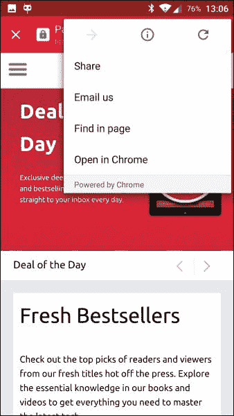

# 第七章：Chrome 自定义标签

你有没有想过在你的应用程序中添加一个**WebView**？也许你想要添加一些网页的浏览，并在你的应用程序中显示相关内容？我知道我必须这样做。几乎在每次，我都犹豫使用 WebView 功能，因为这是应用中最丑陋的部分之一。

你可以清楚地看到，WebView 功能是一个网页部分，UI 在相当多的 Android 版本之前就已经添加，这让我的 OCD UI/UX 感觉爆炸了。谷歌发布的最新功能之一就是**Chrome 自定义标签**。

在本章中，我们将探讨 Chrome 自定义标签，并尝试解释和演示使用它而不是普通的旧 WebView 的好处：

+   什么是 Chrome 自定义标签？

+   何时使用 Chrome 自定义标签

+   实现指南

# 什么是 Chrome 自定义标签？

好吧，我们大多数人都从每天的互联网浏览中知道标签。你使用哪个浏览器并不重要；所有浏览器都支持标签和多标签浏览。这允许我们同时打开多个网站，并在打开的实例之间导航。在 Android 中，事情差不多，但是使用 WebView 时，你没有标签。

## 什么是 WebView？

WebView 是 Android 操作系统的一部分，负责在大多数 Android 应用中渲染网页。如果你在 Android 应用中看到网页内容，很可能你正在看 WebView。这个规则的主要例外是一些 Android 浏览器，比如 Chrome、Firefox 等。

在 Android 4.3 及以下版本中，WebView 使用基于苹果**Webkit**的代码。在 Android 4.4 及更高版本中，WebView 基于**Chromium**项目，这是谷歌 Chrome 的开源基础。在 Android 5.0 中，WebView 被解耦成一个单独的应用程序，允许通过 Google Play 及时更新，而无需发布固件更新，与 Google Play 服务采用了同样的技术。

现在，让我们再次讨论一个简单场景：我们希望在我们的应用程序中显示网页内容（与 URL 相关）。我们有两个选择：要么启动浏览器，要么使用 WebView 构建自己的应用内浏览器。如果我们列出这两种选择，它们都有权衡或缺点。浏览器是一个外部应用程序，你实际上无法改变它的 UI；在使用它的过程中，你将用户推向其他应用，并且可能会在*野外*丢失他们。另一方面，使用 WebView 将用户紧密地留在应用内。然而，实际上处理 WebView 中所有可能的行为相当有负担。

谷歌听到了我们的抱怨，并推出了 Chrome 自定义标签来拯救。现在我们可以在应用程序中更好地控制网页内容，并且可以更干净、更美观地将网页内容嵌入到我们的应用中。

## 自定义选项

Chrome 自定义标签允许进行几项修改和调整：

+   工具栏颜色

+   进入和退出动画

+   工具栏和溢出菜单的自定义操作

+   预启动和预取内容以加快加载速度

# 何时使用 Chrome 自定义标签

自从 WebView 推出以来，应用程序一直在以多种方式使用它，嵌入内容——在 APK 内的本地静态内容以及动态内容，加载最初并非为移动设备设计的网页。后来，我们见证了移动网络时代的兴起，包括混合应用程序的出现。

Chrome 自定义标签页不仅仅是加载本地内容或移动兼容的网页内容。当你加载网页数据并希望允许简单实现、更容易的代码维护，以及进一步将网页内容变为应用程序的一部分时，应该使用它——就像它一直存在于你的应用中一样。

你应该使用自定义标签页的原因包括以下：

+   容易实现：在需要时使用支持库，或者只需向你的`View`意图中添加额外内容。就这么简单。

+   在应用用户界面修改中，你可以执行以下操作：

    +   设置工具栏颜色

    +   添加/更改操作按钮

    +   向溢出菜单中添加自定义菜单项

    +   设置并创建自定义的进入/退出标签页时的动画效果，回到上一个位置

+   更简单的导航和导航逻辑：如果需要，你可以获得一个回调通知，了解外部导航的情况。你知道用户何时导航到网页内容，以及他们完成后应该返回哪里。

+   Chrome 自定义标签页允许你使用以下性能优化：

    +   你可以保持引擎运行，这么说吧，实际上给自定义标签页一个提前启动的机会，在使用它之前进行一些预热。这样做不会干扰或占用宝贵的应用程序资源。

    +   你可以提供一个 URL，在等待其他用户交互时在后台提前加载。这加快了用户可见的页面加载时间，并给用户一种应用程序非常快速的感觉，所有内容都只需点击一下即可访问。

+   当使用自定义标签页时，应用程序不会被移除，因为即使标签页位于其顶部，应用程序级别仍然在前台。因此，在整个使用期间我们保持在顶级（除非电话来电或其他用户交互导致变更）。

+   使用相同的 Chrome 容器意味着用户已经登录到他们过去连接的网站；之前授予的特定权限在这里同样适用；甚至填充数据、自动完成和同步在这里也能工作。

+   Chrome 自定义标签页允许我们在预 Lollipop 设备上为用户提供最新的浏览器实现，这些设备上的 WebView 不是最新版本。

# 实现指南

如先前所讨论的，Chrome 自定义标签页集成了几个功能。第一个是自定义用户界面与自定义标签页的交互。第二个可以让页面加载更快，并保持应用程序活跃。

## 我们可以使用 Chrome 自定义标签页吗？

在我们开始使用自定义标签之前，我们希望确保它们得到支持。Chrome 自定义标签公开了一个服务，因此最好的支持检查就是尝试绑定到该服务。成功意味着自定义标签得到支持并且可以使用。你可以查看这个代码片段，它展示了一个帮助器如何进行检查，或者稍后查看项目源代码：

[`gist.github.com/MaTriXy/5775cb0ff98216b2a99d`](https://gist.github.com/MaTriXy/5775cb0ff98216b2a99d)

在确认并了解到存在支持之后，我们将从 UI 和交互部分开始。

## 自定义 UI 和标签交互

在这里，我们将使用众所周知的`ACTION_VIEW`意图动作，并通过向发送到 Chrome 的意图中附加额外内容，触发 UI 的变化。记住，`ACTION_VIEW`意图与所有浏览器兼容，包括 Chrome。有些手机没有 Chrome，或者设备的默认浏览器不是 Chrome 的情况也时有发生。在这些情况下，用户将导航到特定的浏览器应用。

意图是我们传递给 Chrome 额外数据的一种便捷方式。

在调用 Chrome 自定义标签时，不要使用这些标志：

+   `FLAG_ACTIVITY_NEW_TASK`

+   `FLAG_ACTIVITY_NEW_DOCUMENT`

在使用 API 之前，我们需要将其添加到我们的`gradle`文件中：

```kt
compile 'com.android.support:customtabs:23.1.0'
```

这将允许我们在应用中使用自定义标签支持库：

```kt
CustomTabsIntent.EXTRA_SESSION
```

之前的代码是自定义标签支持库的额外内容；它用于匹配会话。在打开自定义标签时，必须在意图中包含它。如果不需要与意图匹配任何服务端会话，它可以为 null。

### 注意

我们有一个示例项目，展示了 UI 的选项，名为**ChubbyTabby**，在[`github.com/MaTriXy/ChubbyTabby`](https://github.com/MaTriXy/ChubbyTabby)。

我们这里也将讨论重要的部分。我们的主要交互来自于支持库中一个特殊的构建器，称为`CustomTabsIntent.Builder`；这个类将帮助我们构建自定义标签所需的意图。

```kt
CustomTabsIntent.Builder intentBuilder = new CustomTabsIntent.Builder(); //init our Builder

//Setting Toolbar Color
int color = getResources().getColor(R.color.primary);

//we use primary color for our toolbar as well - you can define any color you want and use it.
intentBuilder.setToolbarColor(color);

//Enabling Title showing
intentBuilder.setShowTitle(true);

//this will show the title in the custom tab along the url showing at the bottom part of the tab toolbar.

//This part is adding custom actions to the over flow menu
String menuItemTitle = getString(R.string.menu_title_share);
PendingIntent menuItemPendingIntent = createPendingShareIntent();
intentBuilder.addMenuItem(menuItemTitle, menuItemPendingIntent);
String menuItemEmailTitle = getString(R.string.menu_title_email);
PendingIntent menuItemPendingIntentTwo = createPendingEmailIntent();
intentBuilder.addMenuItem(menuItemEmailTitle, menuItemPendingIntentTwo);

//Setting custom Close Icon.
intentBuilder.setCloseButtonIcon(mCloseButtonBitmap);

//Adding custom icon with custom action for the share action.
intentBuilder.setActionButton(mActionButtonBitmap, getString(R.string.menu_title_share), createPendingShareIntent());

//Setting start and exit animation for the custom tab.
intentBuilder.setStartAnimations(this, R.anim.slide_in_right, R.anim.slide_out_left);
intentBuilder.setExitAnimations(this, android.R.anim.slide_in_left, android.R.anim.slide_out_right);
CustomTabActivityHelper.openCustomTab(this, intentBuilder.build(), Uri.parse(URL), new WebviewFallback(), useCustom);
```

这里需要注意的几件事如下：

+   每个菜单项都使用了一个待定意图；如果你不知道待定意图是什么，可以访问：

    [`developer.android.com/reference/android/app/PendingIntent.html`](http://developer.android.com/reference/android/app/PendingIntent.html)

+   当我们设置自定义图标，比如*关闭*按钮或*动作*按钮时，我们使用位图，并且在传递给构建器之前必须对位图进行解码

+   设置动画很容易，你可以使用之前创建的动画 XML 文件；只需确保在发布应用之前测试结果。

下面的截图是一个 Chrome 自定义标签的例子：


### 自定义动作按钮

作为开发者，我们对自定义标签中显示的操作按钮拥有完全控制权。在大多数用例中，我们可以考虑一个分享动作，或者可能是用户会执行的一个更常见的选项。操作按钮基本上是一个捆绑包，包含动作按钮的图标和待定意图，当用户点击动作按钮时，Chrome 会调用它。根据规范，图标的高度应为 24 dp，宽度应为 24-48 dp。

```kt
//Adding custom icon with custom action for the share action
intentBuilder.setActionButton(mActionButtonBitmap, getString(R.string.menu_title_share), createPendingShareIntent());
```

### 配置自定义菜单

默认情况下，Chrome 自定义标签通常在顶部始终显示带有**前进**、**页面信息**和**刷新**三个图标的行，而**在页面中查找**和**在浏览器中打开（在 Chrome 中打开）**也可能出现在菜单底部。

作为开发者，我们有能力添加和定制最多三个菜单项，这些菜单项将显示在图标行和底部项目之间，如下面的截图所示：



我们看到的菜单实际上由一系列包含菜单文本和待定意图的捆绑包表示，当用户点击该项目时，Chrome 会代表我们调用这些意图。

```kt
//This part is adding custom buttons to the over flow menu
String menuItemTitle = getString(R.string.menu_title_share);
PendingIntent menuItemPendingIntent = createPendingShareIntent();
intentBuilder.addMenuItem(menuItemTitle, menuItemPendingIntent);
String menuItemEmailTitle = getString(R.string.menu_title_email);
PendingIntent menuItemPendingIntentTwo = createPendingEmailIntent();
intentBuilder.addMenuItem(menuItemEmailTitle, menuItemPendingIntentTwo);
```

### 配置自定义进入和退出动画

没有动画伴随总是不完整的。这里也不例外，因为我们需要制作两个过渡：一个是自定义标签进入，另一个是退出；我们可以为每个开始和退出动画设置特定的动画：

```kt
//Setting start and exit animation for the custom tab.
intentBuilder.setStartAnimations(this,R.anim.slide_in_right, R.anim.slide_out_left);
intentBuilder.setExitAnimations(this, android.R.anim.slide_in_left, android.R.anim.slide_out_right);
```

### Chrome 预热

通常，在使用意图构建器设置好意图之后，我们应该调用`CustomTabsIntent.launchUrl(Activity context, Uri url)`方法，这是一个非静态方法，会触发新的自定义标签活动来加载 URL，并在自定义标签中显示。这可能会花费一些时间，并影响应用提供的流畅性体验。

我们都知道用户要求近乎即时的体验，所以 Chrome 有一个我们可以连接的服务，并要求它预热浏览器及其本地组件。调用这个方法会要求 Chrome 执行以下操作：

+   对 URL 的主域进行 DNS 预解析

+   对最可能使用的子资源的 DNS 预解析

+   与目的地的预连接，包括 HTTPS/TLS 协商

预热 Chrome 的过程如下：

1.  连接到服务。

1.  附加一个导航回调，以便在页面加载完成时得到通知。

1.  在服务中，调用`warmup`方法在后台启动 Chrome。

1.  创建`newSession`；此会话用于所有 API 请求。

1.  使用`mayLaunchUrl`告诉 Chrome 用户可能会加载哪些页面。

1.  使用步骤 4 中生成的会话 ID 启动意图。

### 连接到 Chrome 服务

连接到 Chrome 服务需要处理**Android 接口定义语言**（**AIDL**）。

如果你不了解 AIDL，请阅读：

[`developer.android.com/guide/components/aidl.html`](http://developer.android.com/guide/components/aidl.html)

接口是用 AIDL 创建的，它会自动为我们创建一个代理服务类：

```kt
CustomTabsClient.bindCustomTabsService()
```

因此，我们会检查 Chrome 包名称；在我们的示例项目中，我们有一个特殊的方法来检查在各种变体中是否包含 Chrome。设置包之后，我们绑定到服务，并获取一个 `CustomTabsClient` 对象，我们可以使用它直到与服务断开连接：

```kt
pkgName - This is one of several options checking to see if we have a version of Chrome installed can be one of the following
static final String STABLE_PACKAGE = "com.android.chrome";
static final String BETA_PACKAGE = "com.chrome.beta";
static final String DEV_PACKAGE = "com.chrome.dev";
static final String LOCAL_PACKAGE = "com.google.android.apps.chrome";

private CustomTabsClient mClient;

// Binds to the service.
CustomTabsClient.bindCustomTabsService(myContext, pkgName, new CustomTabsServiceConnection() {
  @Override
  public void onCustomTabsServiceConnected(ComponentName name, CustomTabsClient client) {
    // CustomTabsClient should now be valid to use
    mClient = client;
  }

  @Override
  public void onServiceDisconnected(ComponentName name) {
  // CustomTabsClient is no longer valid which also invalidates sessions.
    mClient = null;
  }
});
```

绑定到服务后，我们可以调用我们需要的适当方法。

### 加热浏览器进程

该方法如下所示：

```kt
boolean CustomTabsClient.warmup(long flags)

//With our valid client earlier we call the warmup method.
mClient.warmup(0);
```

### 注意

当前未使用标志，因此现在我们传递 `0`。

温习过程会加载本地库和浏览器进程，以便稍后支持自定义标签浏览。这个过程是异步的，返回值表示请求是否已被接受。它返回 `true` 以表示成功。

### 创建新标签会话

该方法如下所示：

```kt
boolean CustomTabsClient.newSession(ICustomTabsCallback callback)
```

新标签会话用作将 `mayLaunchUrl` 调用、我们构建的 `VIEW` 意图以及生成的标签捆绑在一起的分组对象。我们可以获取与创建的会话相关联的回调，该回调将传递给任何连续的 `mayLaunchUrl` 调用。此方法在成功创建会话时返回 `CustomTabsSession`；否则，它返回 `Null`。

### 设置预取 URL

该方法如下所示：

```kt
boolean CustomTabsSession.mayLaunchUrl (Uri url, Bundle extras, List<Bundle> otherLikelyBundles)
```

此方法将通知浏览器，很快就会导航到此 URL。在调用此方法之前，请确保先执行 `warmup()` ——这是必须的。首先必须指定最可能的 URL，我们可以发送一个可选的其他可能 URL 列表（`otherLikelyBundles`）。列表必须按降序排序，可选列表可能会被忽略。对此方法的新的调用将降低之前调用的优先级，可能导致 URL 没有被预取。布尔值告诉我们操作是否已成功完成。

### 自定义标签连接回调

该方法如下所示： 

```kt
void CustomTabsCallback.onNavigationEvent (int navigationEvent, Bundle extras)
```

我们在自定义标签的每次导航事件中都有触发回调。`int navigationEvent` 元素定义页面状态的六个中的一个。更多信息请参考以下代码：

```kt
//Sent when the tab has started loading a page.
public static final int NAVIGATION_STARTED = 1;
//Sent when the tab has finished loading a page.
public static final int NAVIGATION_FINISHED = 2;
//Sent when the tab couldn't finish loading due to a failure.
public static final int NAVIGATION_FAILED = 3;
//Sent when loading was aborted by a user action.
public static final int NAVIGATION_ABORTED = 4;
//Sent when the tab becomes visible.
public static final int TAB_SHOWN = 5;
//Sent when the tab becomes hidden.
public static final int TAB_HIDDEN = 6;
private static class NavigationCallback extends CustomTabsCallback {
  @Override
  public void onNavigationEvent(int navigationEvent, Bundle extras) {
    Log.i(TAG, "onNavigationEvent: Code = " + navigationEvent);
  }
}
```

# 总结

我们了解到一项新增加的功能——Chrome 自定义标签，它允许我们将网页内容嵌入到我们的应用程序中并修改用户界面。Chrome 自定义标签使我们可以为用户提供更加完整、快速的应用内网页体验。我们在幕后使用 Chrome 引擎，这比常规 WebView 加载更快，甚至比加载整个 Chrome（或其他浏览器）应用程序还要快。

我们看到我们可以在后台预加载页面，使得我们的数据看起来非常快。我们可以自定义 Chrome 标签的外观，使其与我们的应用相匹配。我们看到的改变包括工具栏颜色、过渡动画，甚至是在工具栏中添加自定义操作。

自定义标签页同样能够享受到 Chrome 浏览器的功能，比如保存的密码、自动填充、点击搜索以及同步；所有这些功能在自定义标签页内都可以使用。对于开发者来说，集成这些功能相当简单，在基础层面上仅需添加几行代码。如果需要，支持库可以帮助实现更复杂的集成。

这是 Chrome 浏览器的一个功能，意味着在任何安装了最新版 Chrome 的 Android 设备上都可以使用它。请记住，随着新功能和修复的推出，Chrome 自定义标签页支持库会发生变化，这与其他支持库是一样的，因此请更新您的版本，并确保使用最新的 API 以避免任何问题。

在下一章节中，我们将深入探讨一下 Android Marshmallow 提供的一些新的认证/安全特性。
