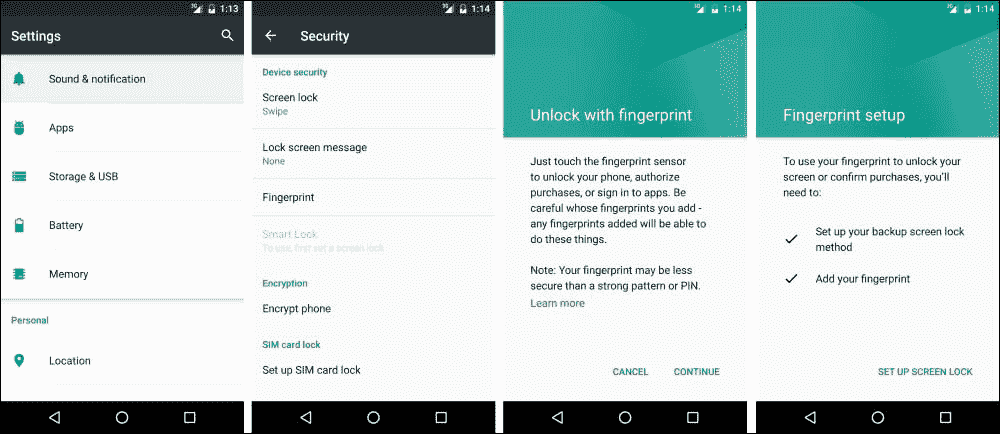
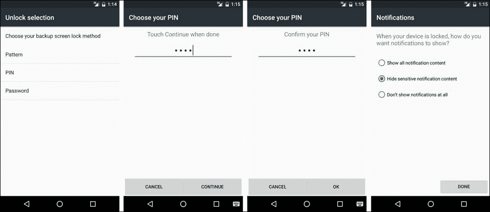
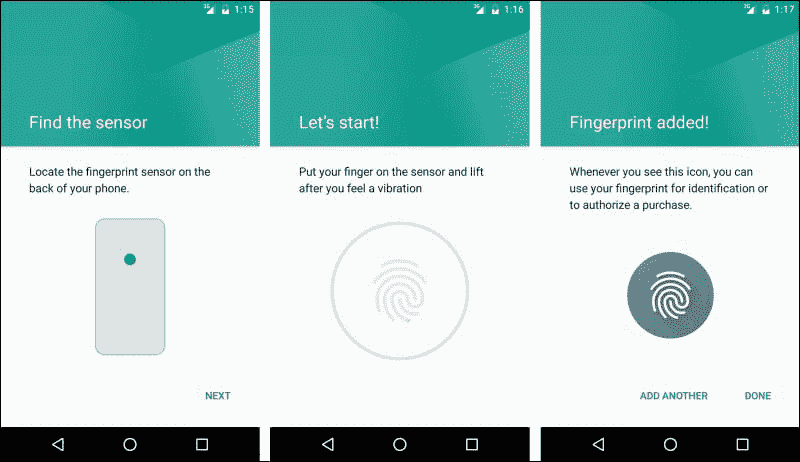
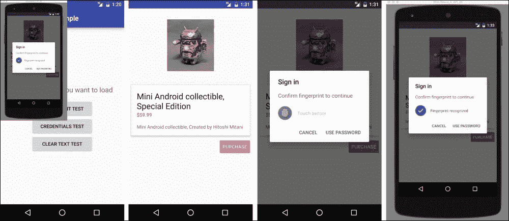
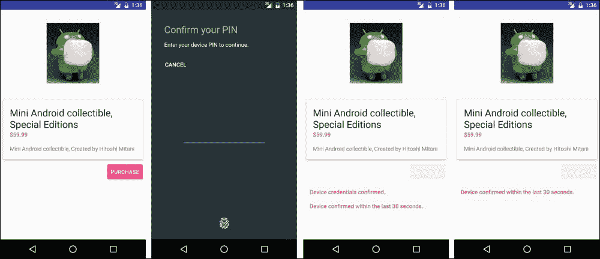
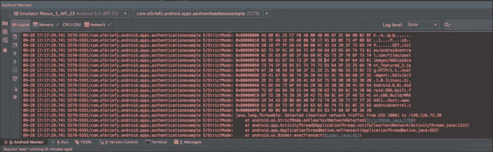

# 第八章：认证

安卓棉花糖引入了一个全新集成的 API，以更好地支持用户认证和用户验证。我们现在可以在带有指纹扫描器的设备上使用新的`Fingerprint` API 来认证用户。我们还可以设置特定时间，以便在应用登录时认为用户锁屏验证有效。在本章中，我们将尝试介绍这些新增功能并解释如何使用它们：

+   指纹认证 API

+   凭据宽限期

+   明文网络流量

# 指纹认证 API

安卓棉花糖现在允许我们，开发者，在使用支持设备上的此类认证扫描器时，通过用户的指纹扫描来认证用户。

`Fingerprint` API 是通过全新的包添加到安卓棉花糖中的：

`android.hardware.fingerprint`

包含四个类：

+   `FingerprintManager`

+   `FingerprintManager.AuthenticationCallback`

+   `FingerprintManager.AuthenticationResult`

+   `FingerprintManager.CryptoObject`

每个类在我们的指纹认证过程中都有特定的角色。

## 我们如何使用指纹识别进行认证？

`android.hardware.fingerprint`包中的前四个类可以用以下方式解释：

+   `FingerprintManager`：管理对指纹硬件的访问

+   `FingerprintManager.AuthenticationCallback`：在`auth`过程中使用的回调

+   `FingerprintManager.AuthenticationResult`：`auth`过程的 结果容器

+   `FingerprintManager.CryptoObject`：与`FingerprintManager`一起使用的特定`Crypto`对象

假设我们希望通过指纹来认证用户。必须使用带有指纹传感器的设备；否则，我们无法使用此 API。我们需要获取`FingerprintManager`的实例，然后调用`authenticate()`方法。我们必须为指纹认证流程实现特定的用户界面，并且源代码中包含了标准的 Android 指纹图标（`c_fp_40px.png`）。我们需要在应用清单中添加适当的权限：

```kt
<uses-permission android:name="android.permission.USE_FINGERPRINT" />
```

目前，我们没有带有指纹传感器的设备，因此我们需要从模拟器中测试我们的代码。（Nexus 5X 和 Nexus 6P 仍然供应有限）

## 设置测试环境

**必须安装至少是 Android SDK Tools 修订版 24.3**。现在，我们导航到**设置** | **安全** | **指纹**并添加一个指纹。



手动遵循指导说明；我们被要求选择 PIN 码，并引导我们找到以下截图：



最后，我们必须使用一个特殊的`adb`命令，欺骗传感器捕获一个模拟指纹：

```kt
adb -e emu finger touch <finger_id>

```

结果屏幕应如下面的截图所示：



我们使用`finger_id =1`来模拟单个指纹。同样的命令也可以在锁屏或我们的应用中模拟指纹触摸事件。



如果需要帮助设置模拟器，请阅读：

[安卓设备索引](https://developer.android.com/tools/devices/index.html)

现在，我们可以启动我们的应用程序，并看到当用户购买商品时，我们可以使用指纹作为认证方式。

# 凭据宽限期

你是否有过在设备解锁后想立即使用应用程序，却发现需要重新登录或再次输入应用密码的经历？现在，我们可以查询设备并检查它最近是否解锁以及解锁的时间有多近。这将给我们的用户一个避免使用我们应用程序带来麻烦的机会。请注意，这必须与用户身份验证的公钥或私钥实现结合使用。如果你想了解更多关于**Android Keystore System**的信息，请访问[`developer.android.com/training/articles/keystore.html`](https://developer.android.com/training/articles/keystore.html)。

我们使用`KeyguardManager`并通过`isKeyguardSecure()`方法检查锁屏是否安全。一旦确认安全，我们可以尝试使用该功能；否则，这意味着用户没有设置安全的锁屏，这个功能就是一项*a-no-op*。

我们在 Android KeyStore 中使用`KeyGenerator`生成一个对称密钥，只有在用户在过去*x*秒内使用设备凭据进行认证后才能使用。设置这个值（*x*）是在设置`KeyGenerator`或`KeyPairGenerator`时通过`setUserAuthenticationValidityDurationSeconds()`方法完成的。



你可以查看示例代码了解更多信息。该活动被称为`CredGraceActivity`。

### 注意事项

尽可能少地尝试显示重新认证对话框。在使用加密对象时，应尝试验证其有效期，只有在通过的情况下，才使用`createConfirmDeviceCredentialIntent()`重新认证用户。

# 明文网络流量

安卓棉花糖（Marshmallow）在清单文件中增加了一个新的标志。该标志指示应用程序是否正在使用如 HTTP 这样的明文网络流量。该标志是`android:usesCleartextTraffic`，默认值为`true`。将其设置为`false`意味着一些系统 API 组件——如 HTTP 和 FTP 堆栈、`DownloadManager`和`MediaPlayer`——将拒绝发出 HTTP 流量，只允许 HTTPS。构建一个尊重此设置的第三方库将是一个好习惯。为什么这样做是好的？因为明文流量缺乏机密性、真实性和防篡改保护，数据可能会在未被发现的情况下被篡改。这对于应用程序来说是一个主要风险，现在我们可以用它来尝试强制执行更强大、更安全的数据传输到/来自我们的应用程序。

我们需要记住，这个标志是基于最佳努力的，不可能阻止所有来自安卓应用程序的`明文`流量，因为它们有权限使用`Socket` API，例如，`Socket` API 无法确定`明文`的使用。我们可以通过从`ApplicationInfo.flags`或`NetworkSecurityPolicy.isCleartextTrafficPermitted()`读取来检查这个标志。

### 注意

`WebView`不尊重这个标志，这意味着即使标志为`false`，它也会加载 HTTP。

## 那么，我们要如何处理明文网络流量标志呢？

在应用程序开发期间，我们可以使用`StrictMode`并通过`StrictMode.VmPolicy.Builder.detectCleartextNetwork()`来识别应用程序中的任何`明文`流量。

`usesCleartextTraffic`的缺点是，当它不使用**SSL**（即**安全套接层**的简称）时，会导致应用程序崩溃或进程终止。这在理论上是很好的，但在生产环境中，由于某些原因，你的 SSL 证书出现问题，你将流量重定向到 HTTP，这就不好了。因此，要特别注意你的应用中哪里使用了 HTTPS，哪里可以使用 HTTP。

幸运的是，我们有`StrictMode`，现在它有一种方法可以通过`StrictMode.VmPolicy.Builder`上的`detectCleartextNetwork()`方法来警告您的应用程序是否执行了任何未加密的网络操作。在我们的示例项目中，我们有一个`ClearTextNetworkUsageActivity`活动；当运行`TestStrictHttp productFlavor`变体时，你会在`LogCat`中看到这个。



# 总结

安卓棉花糖为我们提供了一个新的 API，通过`Fingerprint` API 对用户进行身份验证。我们可以使用传感器，甚至在我们的应用程序中对用户进行身份验证，如果我们想节省用户登录的需要，还可以将其保存以后使用，利用安卓棉花糖引入的凭据宽限期功能。

我们还介绍了一种方法，通过仅使用 HTTPS 和`StrictMode`策略，使我们的应用程序更加安全，该策略通过`usesCleartextTraffic`标志实施，这使我们能够确保所有连接到外部世界的节点都需要安全的连接。

感谢您的阅读。

我想感谢安卓团队。这个产品改变了我的生活。

安卓生态系统拥有伟大的开发者们，他们通过发布库、撰写博文和回答支持问题做出贡献；我为能成为其中一员感到骄傲。

期待未来的版本。
