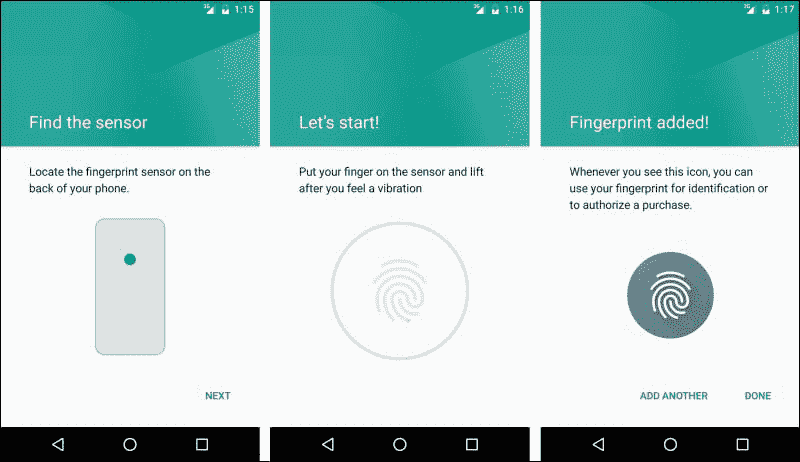
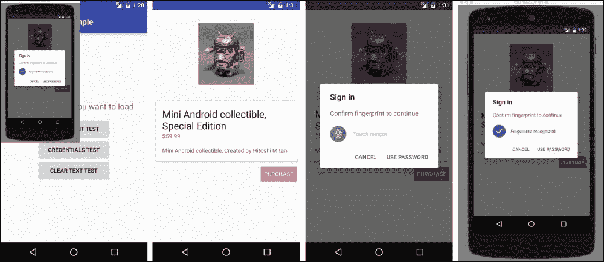

# 八、认证

安卓棉花糖引入了一个新集成的应用编程接口，以更好地支持用户身份验证和用户验证。我们现在可以对带有指纹扫描仪的设备使用新的`Fingerprint`应用编程接口来验证用户。我们还可以为用户锁定屏幕验证设置一个特定的时间，以便在应用登录时被视为有效。在本章中，我们将尝试浏览这些新增内容，并解释如何使用它们:

*   `Fingerprint`认证应用编程接口
*   凭据的宽限期
*   `Cleartext`网络流量

# 指纹认证 API

安卓棉花糖现在允许我们开发人员在支持的设备上使用这种身份验证扫描仪时，通过指纹扫描对用户进行身份验证。

`Fingerprint`应用编程接口通过一个全新的包被添加到安卓棉花糖中:

`android.hardware.fingerprint`

该包包含四个类:

*   `FingerprintManager`
*   `FingerprintManager.AuthenticationCallback`
*   `FingerprintManager.AuthenticationResult`
*   `FingerprintManager.CryptoObject`

每个类在我们的指纹认证过程中都有特定的角色。

## 我们如何使用指纹认证？

`android.hardware.fingerprint`包的前四类可以用以下方式解释:

*   `FingerprintManager`:管理对指纹硬件的访问
*   `FingerprintManager.AuthenticationCallback`:在`auth`过程中使用的回调
*   `FingerprintManager.AuthenticationResult`:结果容器用于`auth`过程
*   `FingerprintManager.CryptoObject`:具体 `Crypto`对象配合`FingerprintManager`使用

比方说，我们想通过用户的指纹来验证他们的身份。必须使用带有指纹传感器的设备；否则，我们不能使用这个 API。我们需要得到一个`FingerprintManager`的实例，然后我们称为`authenticate()`方法。我们必须为指纹认证流程实现一个特定的用户界面，并且标准的安卓指纹图标(`c_fp_40px.png`)包含在源代码中。我们需要将适当的权限添加到我们的应用清单中:

```java
<uses-permission android:name="android.permission.USE_FINGERPRINT" />
```

现在，我们没有带指纹传感器的设备，所以我们需要从模拟器中测试我们的代码。(Nexus 5X 和 Nexus 6P 仍供应有限)

## 设置测试

**安卓 SDK 工具修订版 24.3** (至少)必须安装。现在，我们导航到**设置** | **安全** | **指纹**并添加一个指纹。


手动遵循说明；我们被要求选择个人识别码，并引导我们找到以下截图:


最后，我们必须使用一个特殊的`adb`命令，让传感器捕捉模拟指纹:

```java
adb -e emu finger touch <finger_id>

```

结果屏幕应该如下图所示:



我们用`finger_id =1`表示单个手指。同样的命令也在锁屏或我们的应用中模拟指纹触摸事件。



如果需要帮助来设置模拟器，请阅读:

[https://developer.android.com/tools/devices/index.html](https://developer.android.com/tools/devices/index.html)

现在，我们可以启动我们的应用，看到当用户购买物品时，我们可以使用指纹作为我们的身份验证方法。

# 凭证的宽限期

有没有在设备解锁后想使用某个 app 却发现需要重新登录或者再次输入 app 密码的心痒痒？好了，现在我们可以查询该设备，并检查它最近是否解锁以及最近有多长时间。这将使我们的用户有机会避免使用我们的应用带来的所有麻烦。请注意，这必须与用户身份验证的公钥或私钥实现结合使用。如果您想了解更多关于**安卓密钥库系统**的信息，请访问[https://developer . Android . com/training/articles/Keystore . html](https://developer.android.com/training/articles/keystore.html)。

我们使用`KeyguardManager`并通过`isKeyguardSecure()`方法检查我们的锁屏是否安全。一旦我们知道它是安全的，我们可以尝试使用该功能；否则，这意味着用户没有设置安全的锁屏，这个功能是*无操作*。

我们在 Android KeyStore 中用`KeyGenerator`生成一个对称密钥，只有在用户在最后 *x* 秒内用设备凭证认证后才能使用。设置该值( *x* )通过`setUserAuthenticationValidityDurationSeconds()`方法完成，此时我们设置`KeyGenerator`或`KeyPairGenerator`。


更多信息可以查看示例代码。活动名为`CredGraceActivity`。

### 注

尽量少显示重新验证对话框。当使用加密对象时，您应该尝试验证它的到期时间，并且只有当它通过时，才使用`createConfirmDeviceCredentialIntent()`来重新验证用户。

# 明文网络流量

安卓棉花糖也在清单中增加了一个新的标志。该标志指示应用是否正在使用`cleartext`网络流量，如 HTTP。标志为`android:usesCleartextTraffic`，默认值为`true`。将此设置为`false`意味着一些系统 API 组件——如 HTTP 和 FTP 栈、`DownloadManager`和`MediaPlayer`——将拒绝发出 HTTP 流量，并且只允许 HTTPS。这将是一个很好的实践，建立一个第三方库，也尊重这一设置。为什么这样好？嗯，`cleartext`流量缺乏保密性、真实性和防篡改保护，数据可以在不被检测到的情况下被篡改。这是应用面临的一个主要风险，我们现在可以利用它来尝试和实施更强大、更安全的应用数据传输。

我们需要记住，这个标志是在尽最大努力的基础上授予的，并且不可能阻止来自安卓应用的所有`cleartext`流量，因为它们有权限使用`Socket`应用编程接口，例如，`Socket`应用编程接口不能确定`cleartext`的使用。我们可以通过阅读`ApplicationInfo.flags`或`NetworkSecurityPolicy.isCleartextTrafficPermitted()`来查看这个标志。

### 注

WebView 不尊重此标志，这意味着即使标志为`false`，它也会加载 HTTP。

## 那么，我们如何处理明文网络流量标志呢？

在应用开发过程中，我们可以使用`StrictMode`并使用`StrictMode.VmPolicy.Builder.detectCleartextNetwork()`识别来自我们应用的任何`cleartext`流量。

`usesCleartextTraffic`的缺点是在不使用 **SSL** (简称 **【安全套接字层】**时导致应用崩溃或进程终止。这在理论上很好，但在生产中却不行，在生产中，由于某种原因，您的 SSL 证书有问题，您需要将流量重新路由到 HTTP。因此，要格外注意 HTTPS 在你的应用中的使用位置，以及在哪里可以使用 HTTP。

幸运的是，我们有`StrictMode`，如果你的应用通过`StrictMode.VmPolicy.Builder`上的`detectCleartextNetwork()`方法执行任何未加密的网络操作，它现在有办法警告你。在我们的示例项目中，我们有一个`ClearTextNetworkUsageActivity`活动；运行`TestStrictHttp productFlavor`变型时，您将在`LogCat`中看到。


# 总结

安卓棉花糖给了我们一个新的应用编程接口，用`Fingerprint`应用编程接口认证用户。我们可以使用传感器，甚至在我们的应用中对用户进行身份验证，如果我们想使用安卓棉花糖引入的凭据宽限期功能来节省用户登录的需求，我们可以保存它以备后用。

我们还介绍了一种仅使用 HTTPS 使我们的应用更加安全的方法，以及借助`usesCleartextTraffic`标志实施的`StrictMode`策略，该策略允许我们确保连接到外部世界的所有节点都是安全连接，并检查是否需要安全连接。

我想感谢你的阅读。

感谢安卓团队。这个产品改变了我的生活。

安卓生态系统有优秀的开发者通过发布库、写博客和回答支持问题做出贡献；我很自豪能成为其中的一员。

期待未来的版本。