# 第一章：开始

你可能想知道自定义视图是什么；没问题，我们将在本书中介绍这个以及其他更多内容。如果你已经开发了一段时间的**Android**应用程序，你很可能已经多次使用过标准的 Android 视图或小部件。例如：**TextView**、**ImageView**、**Button**、**ListView**等等。自定义视图略有不同。简单来说，自定义视图是一个我们自行实现其行为的视图或**小部件**。在本章中，我们将介绍开始构建 Android 自定义视图所需的基本步骤，以及我们应该使用自定义视图的场景和应该依赖 Android 标准小部件的场景。更具体地说，我们将讨论以下主题：

+   自定义视图是什么，为什么我们需要它们？

+   如何设置和配置我们的开发环境以开发自定义视图

+   创建我们自己的第一个自定义视图

# 自定义视图是什么

正如我们刚刚提到的，自定义视图是我们自行实现其行为的视图。这有点过于简化了，但这是一个不错的起点。我们实际上并不需要自行实现其全部行为。有时，它可能只是一个简单的细节，或者是一个更复杂的功能，甚至是整个功能和行为，如交互、绘图、调整大小等等。例如，将按钮的背景颜色作为一个自定义视图的实现进行微调，这是一个简单的改变，但创建一个基于位图的 3D 旋转菜单在开发时间和复杂性上则完全不同。我们将在本书中展示如何构建这两种视图，但本章将仅关注一个非常简单的示例，在接下来的章节中，我们将添加更多功能。

在整本书中，我们将同时提到自定义视图和自定义布局。关于自定义视图的定义同样适用于布局，但主要区别在于，自定义布局可以帮助我们用我们创建的逻辑布置其包含的项目，并以我们希望的方式精确定位它们。稍后我们会学习如何做到这一点，敬请期待！

布局通常被称为**ViewGroup**。最典型的例子，也是你可能听说过的，在你的应用中很可能使用过的有：**LinearLayout**、**RelativeLayout**和**ConstraintLayout**。

如果想要了解更多关于 Android 视图和布局的信息，我们可以随时查阅官方的 Android 开发者文档：

[Android 开发者官网](https://developer.android.com/develop/index.html)。

# 为什么需要自定义视图

Google Play 和其他市场上有很多可爱的 Android 应用程序：仅使用标准**Android UI 组件**和布局的*亚马逊*。还有许多其他应用程序拥有让我们的互动更容易或仅仅更愉悦的小功能。虽然没有神奇的公式，但也许只是添加一些不同的东西，让用户觉得“这不仅仅是另一个用于...的应用程序”可能会提高我们的用户留存率。它可能不是决定性的因素，但有时确实可以产生差异。

一些自定义视图的影响力如此之大，以至于其他应用程序也希望效仿或构建类似的东西。这种效果为应用程序带来了病毒式营销，也吸引了开发者社区，因为可能会有许多类似的组件以教程或开源库的形式出现。显然，这种效果只会持续一段时间，但如果发生了，对你的应用程序来说绝对是值得的，因为它会在开发者中变得更加流行和知名，因为它不仅仅是另一个 Android 应用程序，而是有特色的东西。

我们为移动应用程序创建自定义视图的一个主要原因，正是为了拥有一些特别的东西。它可能是一个菜单、一个组件、一个屏幕，或者是我们应用程序真正需要的主要功能，或者只是一个附加功能。

此外，通过创建我们自己的自定义视图，我们实际上可以优化应用程序的性能。我们可以创建一种特定的布局方式，否则仅使用标准 Android 布局或自定义视图将需要许多层次结构，从而简化渲染或用户交互。

另一方面，我们很容易犯试图自定义构建一切的错误。Android 提供了一个出色的组件和布局列表，为我们处理了很多事情。如果我们忽略基本的 Android 框架，试图自己构建一切，那将是非常多的工作。我们可能会遇到许多 Android 操作系统开发者已经面对过的问题，至少也是非常相似的问题。一句话，我们就是在重新发明轮子。

# 市场上的例子

我们可能都使用过仅使用标准 Android UI 组件和布局构建的优秀应用程序，但也有许多其他应用程序有一些我们不知道或没有真正注意到的自定义视图。自定义视图或布局有时可能非常微妙，难以察觉。

我们不一定是第一个在应用程序中拥有自定义视图或布局的人。实际上，许多受欢迎的应用程序都有一些自定义元素。让我们来看一些例子：

第一个例子将是*Etsy*应用程序。*Etsy*应用程序有一个名为**StaggeredGridView**的自定义布局。它甚至在 GitHub 上作为开源发布。自 2015 年以来，它已被废弃，取而代之的是与**RecyclerView**一起使用的谷歌自己的`StaggeredGridLayoutManager`。

你可以通过从 Google Play 下载*Etsy*应用程序来亲自查看，但为了快速预览，以下截图实际上展示了*Etsy*应用程序中的 StaggeredGrid 布局：

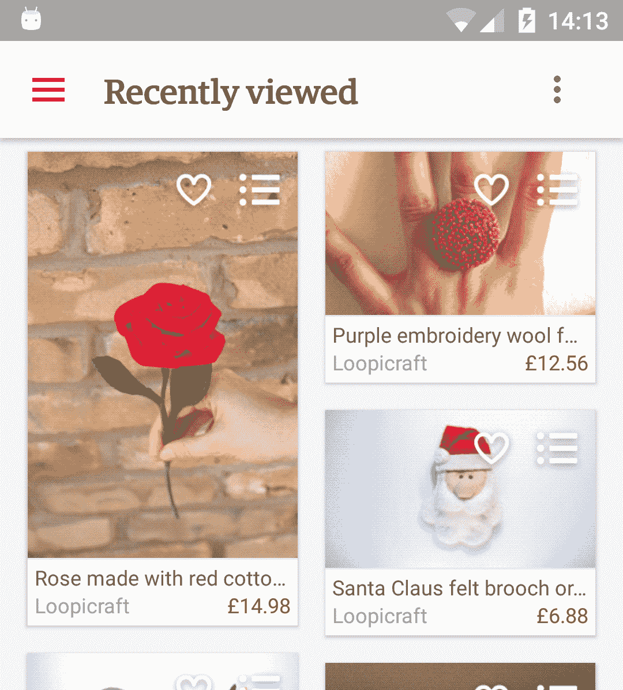

还有许多其他潜在的例子，但第二个好的例子可能是荷兰最大的有线电视运营商之一*Ziggo*的电子编程指南。电子编程指南是一个自定义视图，为电视节目呈现不同的盒子，并改变当前时间前后内容的颜色。

该应用只能在荷兰的 Google Play 下载，不过，以下截图展示了应用程序如何呈现电子编程指南：

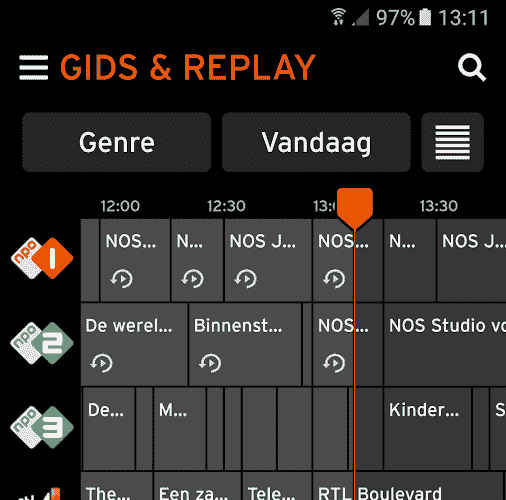

最后，第三个例子，也是最近发布的应用程序是来自 Airbnb 的*Lottie*。*Lottie*是一个示例应用程序，它实时呈现**Adobe After Effects**动画。

*Lottie*可以直接从 Google Play 下载，但以下截图展示了应用程序的快速预览：

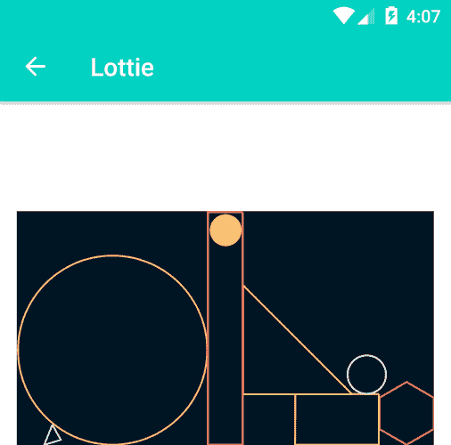

渲染视图和自定义字体是自定义渲染的例子。有关*Lottie*的更多信息，请参考：

[`airbnb.design/introducing-lottie/`](http://airbnb.design/introducing-lottie/)。

我们刚刚看到了一些例子，但还有更多可用。一个发现它们或查看可用内容的好网站是 Android Arsenal：

[`android-arsenal.com/`](https://android-arsenal.com/)。

# 设置环境

既然我们已经对自定义视图、为什么需要它们以及市场上的一些例子有了简要介绍，那么让我们开始构建自己的视图吧。如果我们还没有这样做，那么我们的第一步自然就是安装 Android 开发工具。如果你已经安装了 Android Studio，可以跳过这一部分，直接进入正题。本书中的大多数例子都可以完美地与 Android Studio 2.3.3 配合使用，但后面的章节将需要 Android Studio 3.0。在撰写本文时，Android Studio 3.0 仍处于测试阶段，但强烈建议使用它来测试提供的所有示例。

# 安装开发工具

要开始创建自己的自定义视图，你只需要正常开发 Android 移动应用程序所需的工具。在本书中，我们将使用 Android Studio，因为这是谷歌推荐的工具。

我们可以从 Android Studio 的官方网站获取最新版本：

[`developer.android.com/studio/index.html`](https://developer.android.com/studio/index.html)。

一旦我们为电脑下载了软件包，就可以开始安装了：

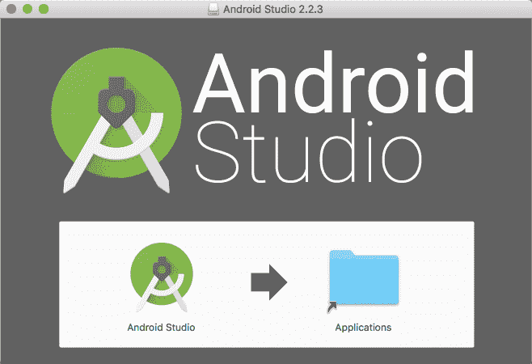

现在，我们可以创建一个新项目，这个项目将用于我们自定义视图的初步尝试。

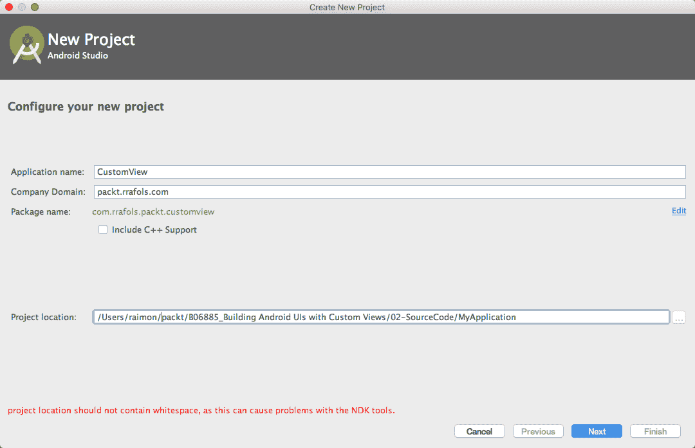

选择应用程序名称、公司域名（这将反转成应用程序包名）和项目位置后，Android Studio 会询问我们想要创建哪种类型的项目：

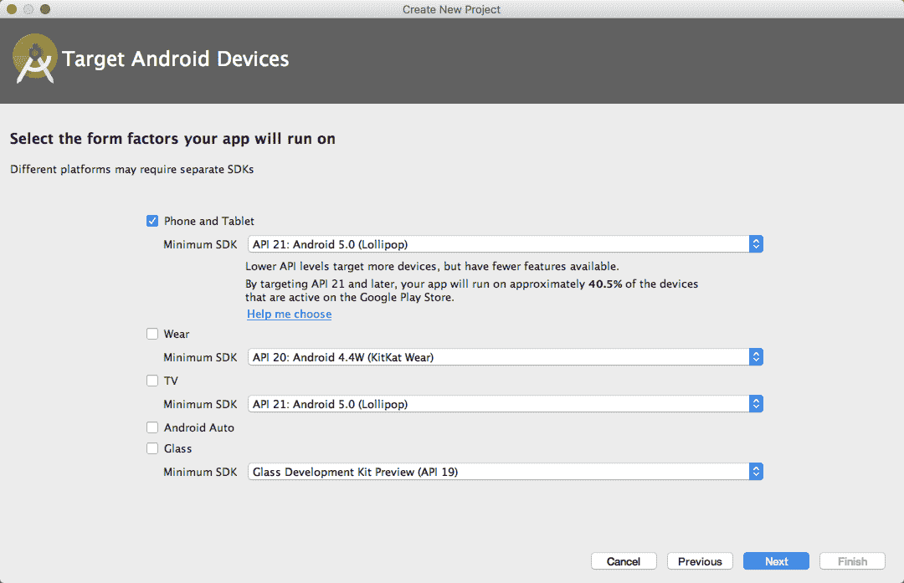

在这个例子中，我们不需要太花哨的东西，只要有手机和平板支持，API 21 的支持就足够了。完成这些设置后，我们可以添加一个空的活动（Empty Activity）：

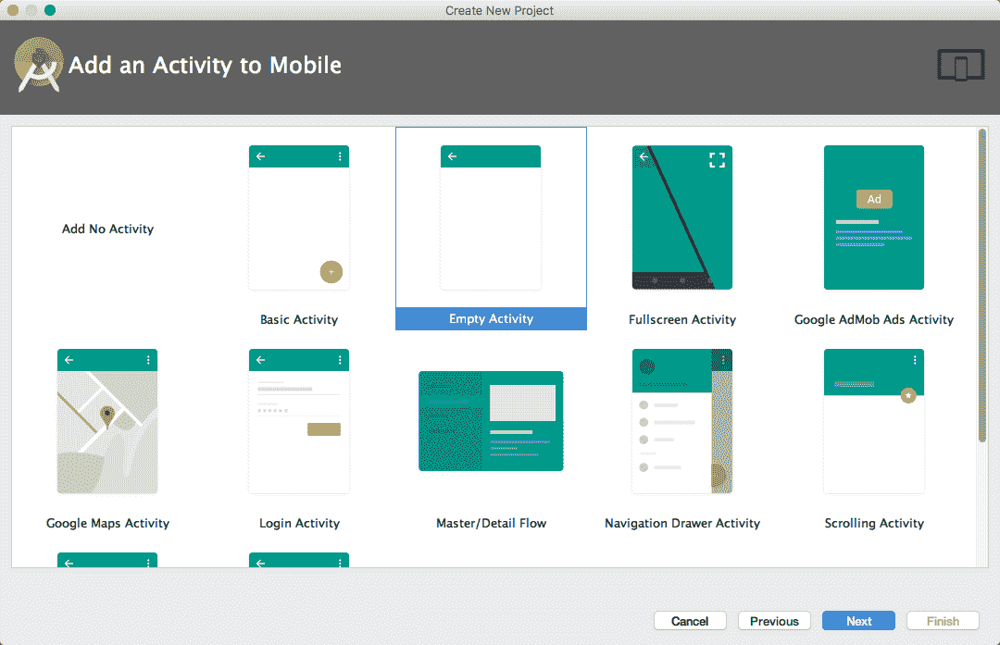

如果你需要安装 Android Studio 的帮助，可以在《*Learning Android Application Development*, *Packt Publishing*》中找到一份分步指南，或者在 Android 开发者文档网站上总有很多信息。更多信息，请参考：

[学习 Android 应用开发](https://www.packtpub.com/application-development/learning-android-application-development)

现在，我们可以在设备模拟器或真实设备上运行这个应用程序了。

# 如何设置模拟器

要设置模拟器，我们需要运行**Android 虚拟设备管理器**（**AVD Manager**）。我们可以在顶部栏找到它的图标，就在播放/停止应用程序图标旁边。

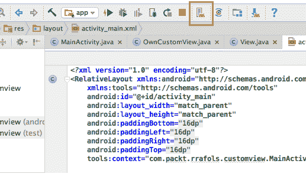

一旦我们执行了**Android 设备管理器**，就可以从那里添加或管理我们的虚拟设备，如下面的截图所示：

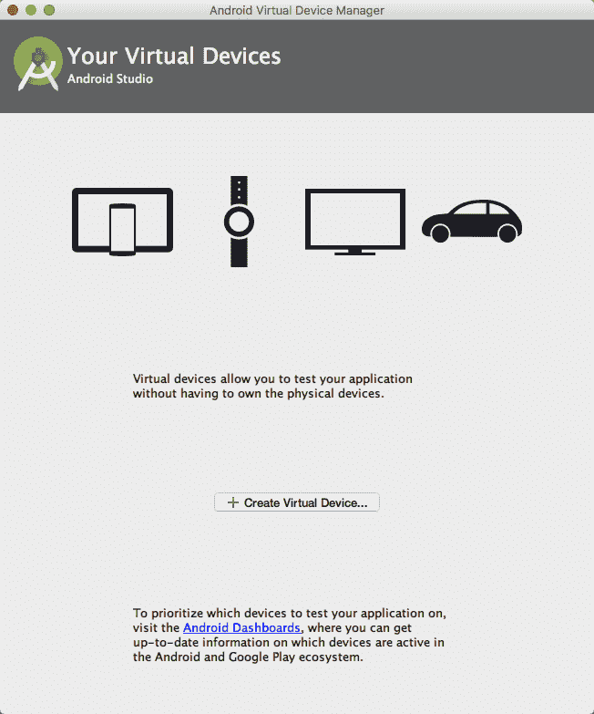

点击“创建虚拟设备”将给我们一个使用 Android 设备定义之一的机会，甚至可以创建我们自己的硬件配置文件，如下面的截图所示：

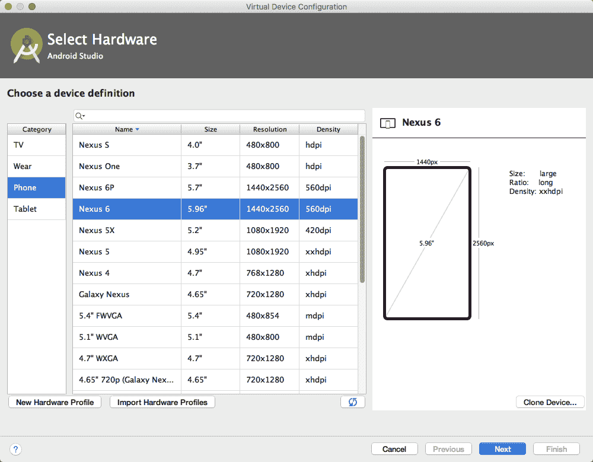

选择硬件后，我们需要选择在其上运行的软件，或者说是系统镜像。稍后，我们可以添加所有需要的测试组合：多种不同的设备，或者带有不同 Android 版本镜像的同一设备，甚至是两者的组合。

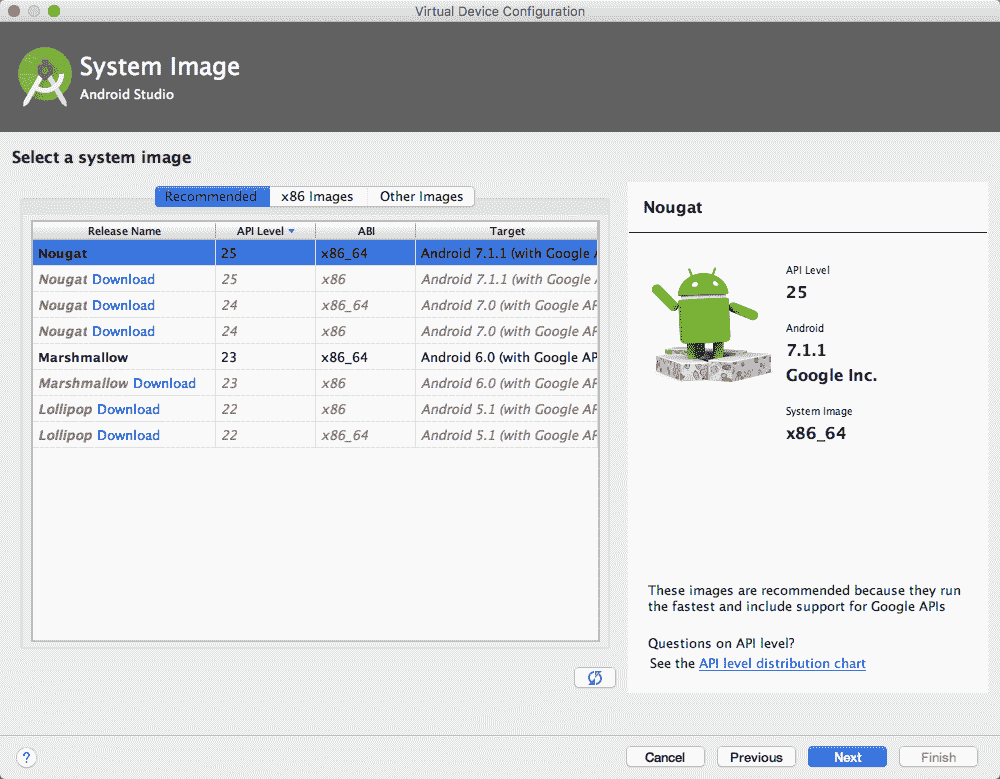

最后一步是给我们的 AVD 命名，检查我们的硬件和软件选择，然后就可以开始了！

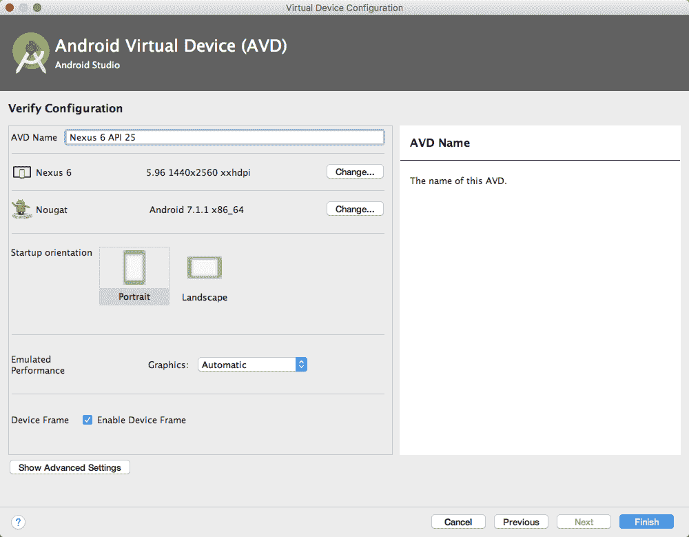

# 如何为开发设置真实设备

使用模拟器进行测试和调试是可以的，但有时我们确实想要在真实设备上测试或安装应用程序。为了在我们的设备上启用开发，我们需要执行几个步骤。首先，我们需要为开发启用我们的设备。我们可以轻松地通过在设置中点击七次“关于”菜单 -> “构建号”（自 Android 4.2 起）。完成这一步后，将出现一个新的菜单选项，称为“开发者选项”。那里有多种选项供我们探索，但现在我们需要的是启用 USB 调试。

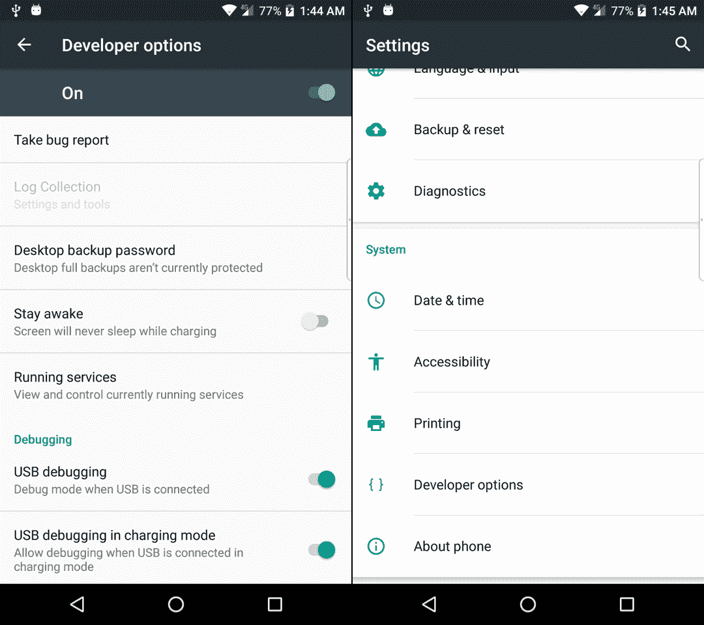

如果启用了 USB 调试，我们将在设备选择中看到我们的设备和正在运行的模拟器：

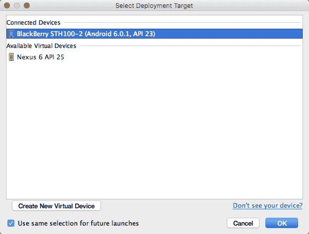

# 创建我们自己的第一个自定义视图

现在我们已经设置好了开发环境，可以在模拟器和真实设备上运行和调试 Android 应用程序，我们可以开始创建我们自己的第一个自定义视图了。为了简化，我们首先会轻松地修改一个现有的视图，稍后我们将从头开始创建我们自己的视图。

# 扩展一个视图

使用上一节的示例，或者如果你跳过了它，只需创建一个带有空活动的新项目，我们将用我们自己的实现来替换 `TextView`。

如果我们查看默认的布局 XML 文件，通常称为 `activity_main.xml`（除非在项目创建期间你更改了它），我们可以看到 `RelativeLayout` 中有一个 `TextView`：

```kt
<?xml version="1.0" encoding="utf-8"?> 
<RelativeLayout  

    android:id="@+id/activity_main" 
    android:layout_width="match_parent" 
    android:layout_height="match_parent" 
    android:paddingBottom="@dimen/activity_vertical_margin" 
    android:paddingLeft="@dimen/activity_horizontal_margin" 
    android:paddingRight="@dimen/activity_horizontal_margin" 
    android:paddingTop="@dimen/activity_vertical_margin" 
    tools:context="com.packt.rrafols.customview.MainActivity"> 

    <TextView 
        android:layout_width="wrap_content" 
        android:layout_height="wrap_content" 
        android:text="Hello World!" /> 
</RelativeLayout> 
```

让我们修改那个 `TextView`，将其变为我们接下来将实现的定制类。

```kt
<com.packt.rrafols.customview.OwnTextView 
        android:layout_width="wrap_content" 
        android:layout_height="wrap_content" 
        android:text="Hello World!" /> 
```

我们使用了 `com.packt.rrafols.customview` 包，但请根据你的应用程序的包名相应地更改它。

要实现这个类，我们首先会创建一个继承自 `TextView` 的类：

```kt
package com.packt.rrafols.customview; 

import android.content.Context; 
import android.util.AttributeSet; 
import android.widget.TextView; 

public class OwnTextView extends TextView { 

    public OwnTextView(Context context, AttributeSet attributeSet) { 
        super(context, attributeSet); 
    } 
} 
```

这个类或自定义视图将表现得像一个标准的 `TextView`。考虑到我们使用的构造函数。还有其他的构造函数，但现在我们只关注这一个。创建它是很重要的，因为它将接收上下文和我们定义在 XML 布局文件中的参数。

在这一点上，我们只是传递参数，并没有对它们进行任何花哨的操作，但让我们通过重写 `onDraw()` 方法来准备我们的自定义视图以处理新功能：

```kt
@Override 
protected void onDraw(Canvas canvas) { 
    super.onDraw(canvas); 
} 
```

通过重写 `onDraw()` 方法，我们现在可以控制自定义视图的绘制周期。如果我们运行应用程序，由于还没有添加任何新的行为或功能，我们不会注意到与原始示例有任何区别。为了解决这个问题，让我们做一个非常简单的更改，这将证明它实际上是在工作的。

在 `onDraw()` 方法中，我们将绘制一个红色矩形，覆盖视图的全部区域，如下所示：

```kt
@Override 
    protected void onDraw(Canvas canvas) { 
        canvas.drawRect(0, 0, getWidth(), getHeight(), backgroundPaint); 
        super.onDraw(canvas); 
    } 
```

我们可以使用`getWidth()`和`getHeight()`方法分别获取视图的宽度和高度。为了定义颜色和样式，我们将初始化一个新的`Paint`对象，但我们要在构造函数中执行这一操作，因为在`onDraw()`方法中执行是错误的做法。我们将在本书后面更多地讨论性能问题：

```kt
private Paint backgroundPaint; 

    public OwnTextView(Context context, AttributeSet attributeSet) { 
        super(context, attributeSet); 

        backgroundPaint= new Paint(); 
        backgroundPaint.setColor(0xffff0000); 
        backgroundPaint.setStyle(Paint.Style.FILL); 
    } 
```

在这里，我们使用整数十六进制编码将`Paint`对象初始化为红色，并将样式设置为`Style.FILL`，以便填充整个区域。默认情况下，`Paint`样式设置为`FILL`，但明确设置可以增加清晰度。

如果我们现在运行应用程序，我们将看到`TextView`，这是我们现在的类，背景为红色，如下所示：

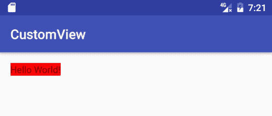

下面的代码片段是`OwnTextView`类的整个实现。更多详情，请查看 GitHub 仓库中`Example01`文件夹的完整项目：

```kt
package com.packt.rrafols.customview; 

import android.content.Context; 
import android.graphics.Canvas; 
import android.graphics.Paint; 
import android.util.AttributeSet; 
import android.widget.TextView; 

public class OwnTextView extends TextView { 

    private Paint backgroundPaint; 

    public OwnTextView(Context context, AttributeSet attributeSet) { 
        super(context, attributeSet); 

        backgroundPaint = new Paint(); 
        backgroundPaint.setColor(0xffff0000); 
        backgroundPaint.setStyle(Paint.Style.FILL); 
    } 

    @Override 
    protected void onDraw(Canvas canvas) { 
        canvas.drawRect(0, 0, getWidth(), getHeight(),
        backgroundPaint); 
        super.onDraw(canvas); 
    } 
} 
```

这个示例只是为了展示我们如何扩展标准视图并实现我们自己的行为；在 Android 中还有多种其他方法可以为小部件设置背景颜色或绘制背景颜色。

# 从零开始创建一个简单的视图

现在我们已经看到了如何修改已经存在的`View`，我们将看到一个更复杂的示例：如何从零开始创建我们自己的自定义视图！

让我们从创建一个继承自`View`的空类开始：

```kt
package com.packt.rrafols.customview; 

import android.content.Context; 
import android.util.AttributeSet; 
import android.view.View; 

public class OwnCustomView extends View { 

    public OwnCustomView(Context context, AttributeSet attributeSet) { 
        super(context, attributeSet); 
    } 

} 
```

我们现在将添加与上一个示例相同的代码以绘制红色背景：

```kt
package com.packt.rrafols.customview; 

import android.content.Context; 
import android.graphics.Canvas; 
import android.graphics.Paint; 
import android.util.AttributeSet; 
import android.view.View; 

public class OwnCustomView extends View { 

    private Paint backgroundPaint; 

    public OwnCustomView(Context context, AttributeSet attributeSet) { 
        super(context, attributeSet); 

        backgroundPaint= new Paint(); 
        backgroundPaint.setColor(0xffff0000); 
        backgroundPaint.setStyle(Paint.Style.FILL); 

    } 

    @Override 
    protected void onDraw(Canvas canvas) { 
        canvas.drawRect(0, 0, getWidth(), getHeight(),
        backgroundPaint); 
        super.onDraw(canvas); 
    } 
} 
```

如果我们运行应用程序，从下面的截图中可以看出，我们将得到与上一个示例略有不同的结果。这是因为在上一个示例中，`TextView`小部件调整大小以适应文本的大小。如果我们记得正确，我们在布局 XML 文件中有`android:layout_width="wrap_content"`和`android:layout_height="wrap_content"`。我们刚才创建的这个新的自定义视图不知道如何计算其大小。

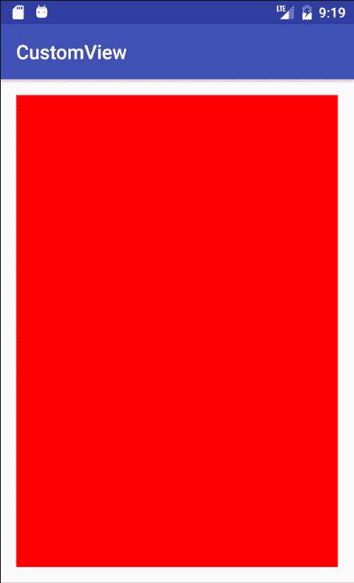

在 GitHub 仓库的`Example02`文件夹中查看这个简单例子的完整实现。

# 总结

在本章中，我们已经了解了为什么要构建自定义视图和布局的原因，同时也必须应用常识。Android 提供了一个用于创建 UI 的优秀基本框架，不使用它将是一个错误。并非每个组件、按钮或小部件都必须完全自定义开发，但通过在正确的位置执行此操作，我们可以添加一个可能会让我们的应用程序被记住的额外功能。此外，我们已经展示了一些已经在市场上使用自定义视图的应用程序示例，所以我们知道我们并不孤单！最后，我们已经看到了如何设置环境以开始工作，并且我们已经开始了自定义视图的初步尝试。

在下一章中，我们将继续添加功能；我们将了解如何计算自定义视图的正确大小并学习更多关于自定义渲染的内容。
