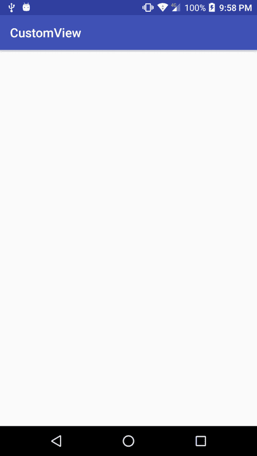
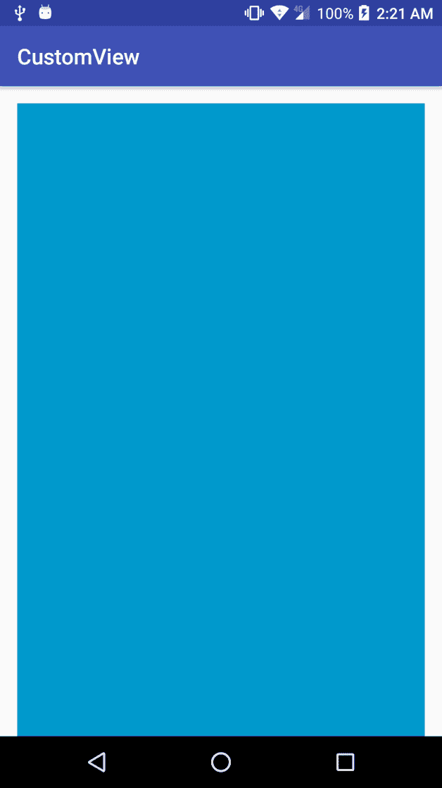
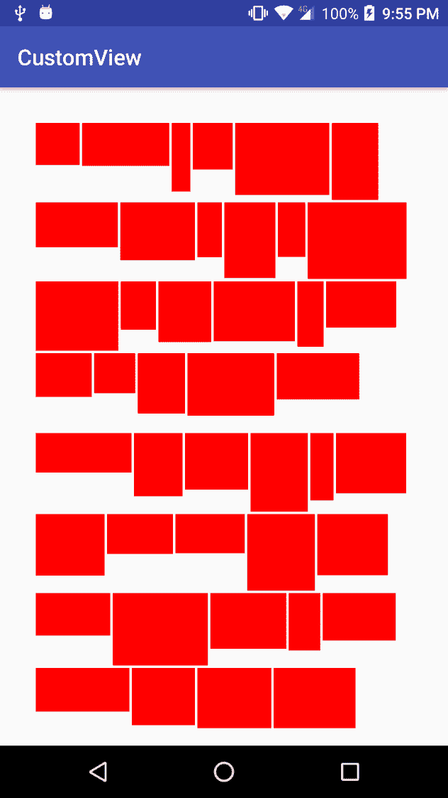
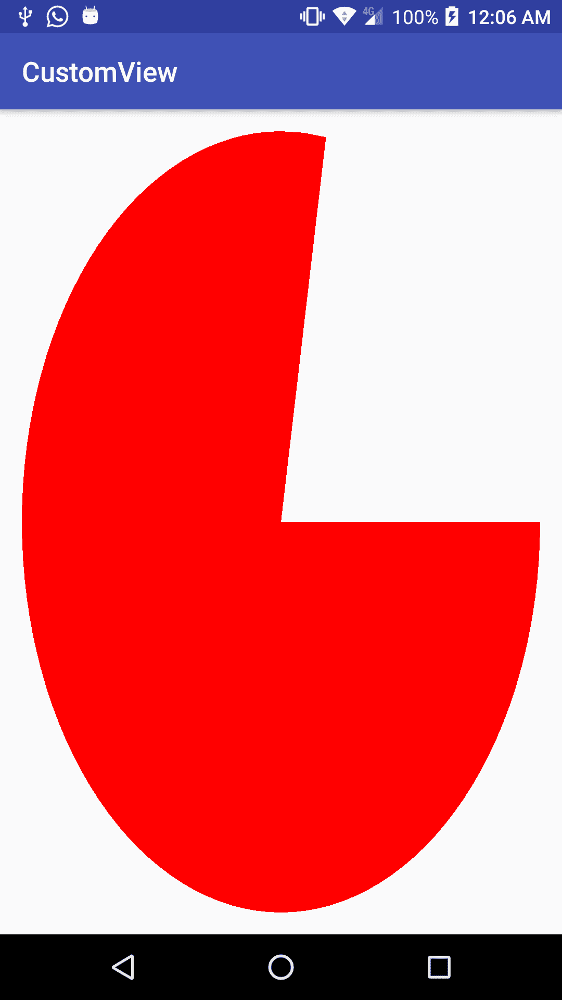
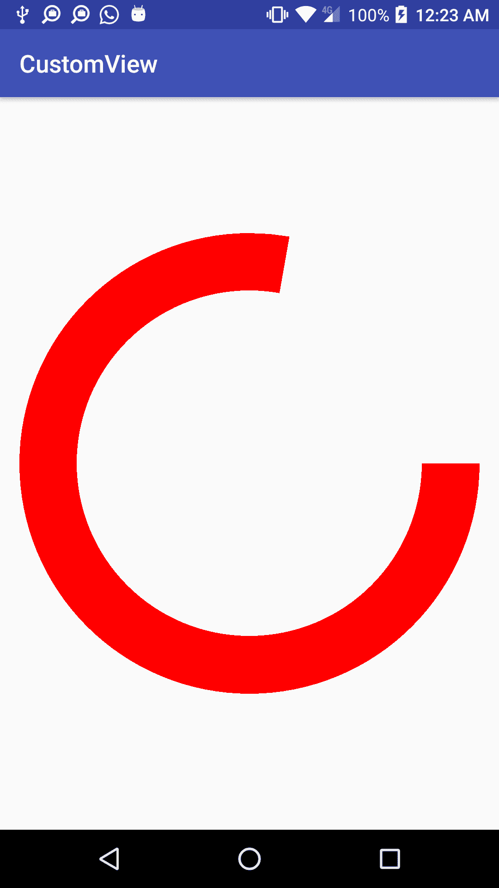
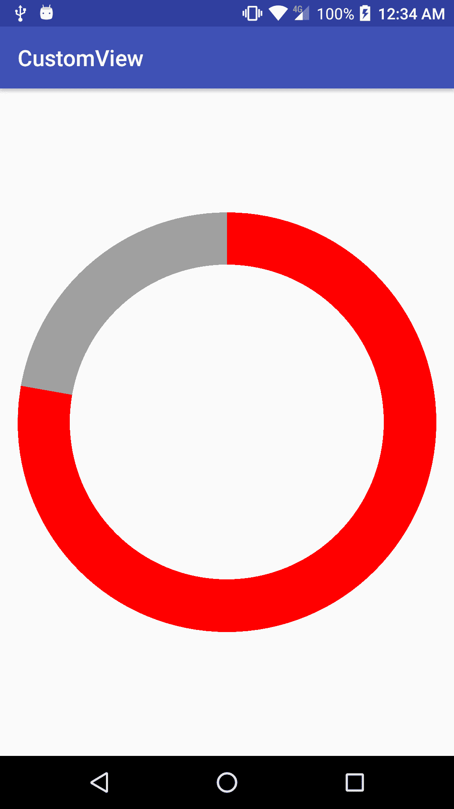

# 第二章：实现你的第一个自定义视图

在前一章中，我们已经看到了如何创建自定义视图的基础，但除非我们添加更多功能和自定义，否则它将相当无用。在本章中，我们将在这些基础上继续构建，了解如何参数化我们的自定义视图，以便我们或其他开发人员可以自定义它们，并在最后，涵盖一些渲染内容，这将使我们能够构建更复杂的自定义视图。

此外，正如我们在前一章提到的，我们还可以创建自定义布局。在本章中，我们将了解如何创建一个简单的自定义布局。

更详细地说，我们将涵盖以下主题：

+   测量和参数化我们的自定义视图

+   实例化自定义视图

+   创建自定义布局

+   基本渲染

# 测量和参数化我们的自定义视图

为了有一个好的可重用的自定义视图，它需要能够适应不同的尺寸和设备分辨率，为了进一步提高其可重用性，它应该支持参数化。

# 测量我们的自定义视图

在前一章中我们快速构建的示例中，我们将所有尺寸和测量都委托给了父视图本身。坦白说，我们甚至没有委托它；我们只是没有特别做任何事情来处理这个问题。能够控制我们自定义视图的尺寸和维度是我们绝对需要关注的事情。首先，我们将从视图**重写**`onMeasure()`方法，如下所示：

```kt
@Override 
protected void onMeasure(int widthMeasureSpec, int heightMeasureSpec) { 
    super.onMeasure(widthMeasureSpec, heightMeasureSpec); 
} 
```

阅读关于`onMeasure()`方法的 Android 文档，我们应该看到我们必须**调用** `setMeasuredDimension(int, int)`或者父类的`onMeasure(int, int)`。如果我们忘记这样做，我们将得到一个`IllegalStateException`：

```kt
com.packt.rrafols.customview E/AndroidRuntime: FATAL EXCEPTION: main Process: com.packt.rrafols.customview, PID: 13601 java.lang.IllegalStateException: View with id -1: com.packt.rrafols.customview.OwnCustomView#onMeasure() did not set the measured dimension by calling setMeasuredDimension() at android.view.View.measure(View.java:18871)
```

有三种不同的**模式**，我们的视图的父视图可以通过这些模式指示我们的视图如何计算其大小。我们可以通过使用`MeasureSpec.getMode(int)`方法与每个尺寸规范`widthMeasureSpec`和`heightMeasureSpec`来获取模式。

这些模式如下：

+   `MeasureSpec.EXACTLY`

+   `MeasureSpec.AT_MOST`

+   `MeasureSpec.UNSPECIFIED`

当父视图计算或决定了尺寸时，我们将得到`MeasureSpec.EXACTLY`。即使我们的视图需要或返回不同的尺寸，它也将具有这个大小。如果我们得到`MeasureSpec.AT_MOST`，我们则有更大的灵活性：我们可以根据需要变得更大，但最大不超过给定的大小。最后，如果我们收到`MeasureSpec.UNSPECIFIED`，我们可以将视图的大小设置为任意我们想要的或视图需要的尺寸。

使用`MeasureSpec.getSize(int)`，我们还可以从尺寸规范中获取一个尺寸值。

既然有了这些，我们如何知道哪些值对应于我们 XML 布局文件中的宽度和高度参数？很容易看出，让我们检查一下。例如，如果我们像 GitHub 仓库中的`activity_main.xml`文件那样指定精确值，我们将得到以下代码：

```kt
<com.packt.rrafols.customview.OwnCustomView 
   android:layout_width="150dp" 
   android:layout_height="150dp"/> 
```

在我们的自定义视图中，使用`MeasureSpec.toString(int)`获取测量规范和尺寸的字符串描述的代码如下：

```kt
@Override 
protected void onMeasure(int widthMeasureSpec, int heightMeasureSpec) { 
    Log.d(TAG, "width spec: " +
    MeasureSpec.toString(widthMeasureSpec)); 
    Log.d(TAG, "height spec: " +
    MeasureSpec.toString(heightMeasureSpec)); 
    super.onMeasure(widthMeasureSpec, heightMeasureSpec); 
} 
```

在 Android 日志上的结果如下：

```kt
D/com.packt.rrafols.customview.OwnCustomView: width : MeasureSpec: EXACTLY 394 D/com.packt.rrafols.customview.OwnCustomView: height: MeasureSpec: EXACTLY 394
```

我们的视图将是精确的`394`乘`394`像素。这个`394`像素来自于将`150dp`转换为我用于测试的移动设备上的像素。

由于有许多具有不同分辨率和屏幕密度的 Android 设备，我们应始终使用**密度独立像素**（**dp**）或（**dip**）而不是像素。

要了解更多关于 dp 的信息，请参考谷歌在 YouTube 上发布的一个视频：DesignBytes：密度独立像素。

如果你想在特定设备上将 dp 转换为实际像素，你可以使用以下方法：

```kt
public final int dpToPixels(int dp) { 
    return (int) (dp * getResources().getDisplayMetrics().density +
    0.5); 
} 
```

我们可以看到转换是如何使用屏幕密度的，因此在不同的设备上转换可能会有所不同。前面代码中的`+ 0.5`只是为了在从浮点数转换为`int`时将值四舍五入。

要从像素转换到密度独立点，我们必须进行相反的操作，如下面的代码所示：

```kt
public final int pixelsToDp(int dp) { 
    return (int) (dp / getResources().getDisplayMetrics().density +
    0.5); 
} 
```

现在我们来看看，如果我们使用不同的测量参数，比如`match_parent`或`wrap_content`，如 GitHub 仓库中的`activity_main.xml`文件所示，我们会得到什么结果：

```kt
<com.packt.rrafols.customview.OwnCustomView 
   android:layout_width="match_parent" 
   android:layout_height="match_parent"/> 
```

运行与之前相同的代码，我们在 Android 日志中得到以下信息：

```kt
D/com.packt.rrafols.customview.OwnCustomView: width : MeasureSpec: EXACTLY 996 D/com.packt.rrafols.customview.OwnCustomView: height: MeasureSpec: EXACTLY 1500
```

因此，我们仍然得到了一个`MeasureSpec.EXACTLY`，但这次是父`RelativeLayout`的大小；让我们尝试在`activity_main.xml`中将一个`match_parents`改为`wrap_content`：

```kt
<com.packt.rrafols.customview.OwnCustomView 
    android:layout_width="match_parent" 
    android:layout_height="wrap_content"/> 
```

结果如下：

```kt
D/com.packt.rrafols.customview.OwnCustomView: width : MeasureSpec: EXACTLY 996 D/com.packt.rrafols.customview.OwnCustomView: height: MeasureSpec: AT_MOST 1500
```

我们可以轻松地识别出`MeasureSpec.EXACTLY`和`MeasureSpec.AT_MOST`的模式，但`MeasureSpec.UNSPECIFIED`呢？

如果我们的父视图没有边界，我们将得到一个`MeasureSpec.UNSPECIFIED`；例如，如果我们有一个垂直的`LinearLayout`在`ScrollView`内部，如 GitHub 仓库中的`scrollview_layout.xml`文件所示：

```kt
<?xml version="1.0" encoding="utf-8"?> 
<ScrollView  
    android:orientation="vertical" 
    android:layout_width="match_parent" 
    android:layout_height="match_parent"> 

    <LinearLayout 
        android:layout_width="match_parent" 
        android:layout_height="wrap_content" 
        android:orientation="vertical" 
        android:padding="@dimen/activity_vertical_margin"> 
        <com.packt.rrafols.customview.OwnCustomView
        android:layout_width="match_parent"
        android:layout_height="wrap_content"/>
    </LinearLayout> 
</ScrollView> 
```

然后我们在 Android 日志中得到以下信息：

```kt
D/com.packt.rrafols.customview.OwnCustomView: width : MeasureSpec: EXACTLY 996 D/com.packt.rrafols.customview.OwnCustomView: height: MeasureSpec: UNSPECIFIED 1500
```

这看起来没问题，但如果我们现在运行这个代码会怎样呢？我们会得到一个空白屏幕；我们之前实现的红色背景不见了：



这是因为我们没有管理自定义视图的大小。让我们按照下面的代码所示进行修复：

```kt
private static int getMeasurementSize(int measureSpec, int defaultSize) { 
        int mode = MeasureSpec.getMode(measureSpec); 
        int size = MeasureSpec.getSize(measureSpec); 
        switch(mode) { 
            case MeasureSpec.EXACTLY: 
                return size; 

            case MeasureSpec.AT_MOST: 
                return Math.min(defaultSize, size); 

            case MeasureSpec.UNSPECIFIED: 
            default: 
                return defaultSize; 
        } 
    } 

    @Override 
    protected void onMeasure(int widthMeasureSpec, int
        heightMeasureSpec) { 
        int width = getMeasurementSize(widthMeasureSpec, DEFAULT_SIZE); 
        int height = getMeasurementSize(heightMeasureSpec,
        DEFAULT_SIZE); 
        setMeasuredDimension(width, height); 
    } 
```

现在，根据测量规格，我们将通过调用`setMeasuredDimension(int, int)`方法来设置视图的大小。

要查看完整示例，请检查 GitHub 仓库中`Example03-Measurement`文件夹中的源代码。

# 参数化我们的自定义视图

我们现在有一个能适应多种尺寸的自定义视图；这是好事，但如果我们需要另一个自定义视图，将背景色改为蓝色而不是红色呢？还有黄色？我们不应该为了每个定制而复制自定义视图类。幸运的是，我们可以在 XML 布局中设置参数，并从我们的自定义视图中读取它们：

1.  首先，我们需要定义我们将在自定义视图中使用的参数类型。我们必须在 `res` 文件夹中创建一个名为 `attrs.xml` 的文件：

```kt
<?xml version="1.0" encoding="utf-8"?> 
<resources> 
    <declare-styleable name="OwnCustomView"> 
        <attr name="fillColor" format="color"/> 
    </declare-styleable> 
</resources> 
```

1.  然后，在我们想要使用我们刚刚创建的这个新参数的布局文件中，我们添加了一个不同的命名空间：

```kt
<?xml version="1.0" encoding="utf-8"?> 
<ScrollView  

    android:orientation="vertical" 
    android:layout_width="match_parent" 
    android:layout_height="match_parent"> 

    <LinearLayout 
        android:layout_width="match_parent" 
        android:layout_height="wrap_content" 
        android:orientation="vertical" 
        android:padding="@dimen/activity_vertical_margin"> 

        <com.packt.rrafols.customview.OwnCustomView 
            android:layout_width="match_parent" 
            android:layout_height="wrap_content"
            app:fillColor="@android:color/holo_blue_dark"/>          
    </LinearLayout> 
</ScrollView> 
```

1.  现在我们已经定义了它，让我们看看如何从我们的自定义视图类中读取它：

```kt
int fillColor;
TypedArray ta =
    context.getTheme().obtainStyledAttributes(attributeSet,
        R.styleable.OwnCustomView, 0, 0);
try {
    fillColor =
        ta.getColor(R.styleable.OwnCustomView_ocv_fillColor,
            DEFAULT_FILL_COLOR);
} finally {
    ta.recycle();
}
```

通过使用我们在保存 `attrs.xml` 文件后，Android 工具为我们创建的样式属性 ID 来获取 `TypedArray`，我们将能够查询在 XML 布局文件上设置的这些参数的值。

在此示例中，我们创建了一个名为 `fillColor` 的属性，它将被格式化为颜色。这种格式，或者说基本上，属性的类别非常重要，因为它决定了我们可以设置哪种类型的值，以及之后如何从我们的自定义视图中检索这些值。

同时，对于我们定义的每个参数，我们将在 `TypedArray` 中获得一个 `R.styleable.<name>_<parameter_name>` 索引。在上述代码中，我们正在使用 `R.styleable.OwnCustomView_fillColor` 索引来查询 `fillColor`。

使用完 `TypedArray` 后，我们不应该忘记回收它，以便稍后可以重新使用，但一旦回收，我们就不能再使用它了。

让我们看看这个小小的自定义的结果：



在这个特定情况下我们使用了颜色，但我们也可以使用许多其他类型的参数；例如：

+   布尔值

+   整数

+   浮点数

+   颜色

+   尺寸

+   图像

+   字符串

+   资源

每个都有自己的获取方法：`getBoolean(int index, boolean defValue)` 或 `getFloat(int index, float defValue)`。

此外，为了知道是否设置了参数，我们可以在查询之前使用 `hasValue(int)` 方法，或者我们可以简单地使用获取器的默认值。如果在那个索引处没有设置属性，获取器将返回默认值。

有关完整示例，请查看 GitHub 存储库中的 `Example04-Parameters` 文件夹。

# 实例化自定义视图

现在我们已经看到了如何在 XML 布局上设置参数并在我们的自定义视图类中解析它们，接下来我们将看到如何从代码中实例化自定义视图，并尽可能多地重用这两种实例化机制。

# 从代码中实例化自定义视图

在我们的自定义视图中，我们创建了一个带有两个参数的单个构造函数，一个 `Context` 和一个 `AttributeSet`。现在，如果我们是编程式地创建我们的 UI，或者由于任何其他原因我们需要通过代码实例化我们的自定义视图，我们需要创建一个额外的构造函数。

因为我们想要在 XML 布局中继续使用我们的自定义视图，所以我们必须保留这两个构造函数。为了避免代码重复，我们将创建一些辅助方法来初始化它，并从两个构造函数中使用它们：

```kt
   public OwnCustomView(Context context) { 
        super(context); 

        init(DEFAULT_FILL_COLOR); 
    } 

    public OwnCustomView(Context context, AttributeSet attributeSet) { 
        super(context, attributeSet); 

        int fillColor; 

        TypedArray ta =
        context.getTheme().obtainStyledAttributes(attributeSet,
        R.styleable.OwnCustomView, 0, 0); 
        try { 
           fillColor = ta.getColor(R.styleable.OwnCustomView_fillColor,
           DEFAULT_FILL_COLOR); 
        } finally { 
            ta.recycle(); 
        } 

        init(fillColor); 
    } 

    private void init(int fillColor) { 
        backgroundPaint = new Paint(); 
        backgroundPaint.setStyle(Paint.Style.FILL); 

        setFillColor(fillColor); 
    } 

    public void setFillColor(int fillColor) { 
        backgroundPaint.setColor(fillColor); 
    } 
```

我们还创建了一个公共方法 `setFillColor(int)`，这样我们也可以通过代码设置填充颜色。例如，让我们修改我们的 `Activity`，以编程方式创建视图层次结构，而不是从 XML 布局文件中膨胀它：

```kt
public class MainActivity extends AppCompatActivity { 
    private static final int BRIGHT_GREEN = 0xff00ff00; 

    @Override 
    protected void onCreate(Bundle savedInstanceState) { 
        super.onCreate(savedInstanceState); 

        LinearLayout linearLayout = new LinearLayout(this); 
        linearLayout.setLayoutParams( 
                new LinearLayout.LayoutParams(ViewGroup.
                    LayoutParams.MATCH_PARENT,
                    ViewGroup.LayoutParams.MATCH_PARENT)); 

        OwnCustomView customView = new OwnCustomView(this); 
        customView.setFillColor(BRIGHT_GREEN); 
        linearLayout.addView(customView); 

        setContentView(linearLayout); 
    } 
} 
```

这里，我们只是创建了一个垂直方向的`LinearLayout`，并添加了一个自定义视图作为子视图。然后我们将`LinearLayout`设置为`Activity`的内容视图。此外，我们还直接使用了十六进制颜色。如果我们不习惯用十六进制格式指定颜色，可以使用`Color.argb()`或`Color.rgb()`将颜色组件转换为整数值。

完整的源代码可以在 GitHub 仓库中的`Example05-Code`文件夹中找到。

# 构建器模式

在上一个示例中，我们使用了`setFillColor()`方法来设置自定义视图的填充颜色，但是假设我们还有许多其他参数，代码可能会因为所有的设置器而变得有些混乱。

让我们创建一个简单的示例：不是使用单一背景色，我们将使用四种不同的颜色，并在我们的视图上绘制渐变：

让我们首先定义四种不同的颜色及其设置方法，如下所示：

```kt
private int topLeftColor = DEFAULT_FILL_COLOR; 
private int bottomLeftColor = DEFAULT_FILL_COLOR; 
private int topRightColor = DEFAULT_FILL_COLOR; 
private int bottomRightColor = DEFAULT_FILL_COLOR; 
private boolean needsUpdate = false;

public void setTopLeftColor(int topLeftColor) { 
    this.topLeftColor = topLeftColor; 
    needsUpdate = true; 
} 

public void setBottomLeftColor(int bottomLeftColor) { 
    this.bottomLeftColor = bottomLeftColor; 
    needsUpdate = true; 
} 

public void setTopRightColor(int topRightColor) { 
    this.topRightColor = topRightColor; 
    needsUpdate = true; 
} 

public void setBottomRightColor(int bottomRightColor) { 
    this.bottomRightColor = bottomRightColor; 
    needsUpdate = true; 
} 
```

我们还添加了一个布尔值以检查是否需要更新渐变。这里我们忽略线程同步，因为这不是此示例的主要目的。

然后，我们在`onDraw()`方法中为这个`boolean`添加了一个检查，如果需要的话，它会重新生成渐变：

```kt
@Override
protected void onDraw(Canvas canvas) {
    if (needsUpdate) {
        int[] colors = new int[] {topLeftColor, topRightColor,
        bottomRightColor, bottomLeftColor};

        LinearGradient lg = new LinearGradient(0, 0, getWidth(),
            getHeight(), colors, null, Shader.TileMode.CLAMP);

        backgroundPaint.setShader(lg);
        needsUpdate = false;
    }

    canvas.drawRect(0, 0, getWidth(), getHeight(), backgroundPaint);
    super.onDraw(canvas);
}
```

在`onDraw()`方法中创建新的对象实例是一个不好的实践。这里只做一次，或者每次更改颜色时都会执行。如果我们不断更改颜色，这将是一个不好的例子，因为它会不断创建新对象，污染内存，并触发**垃圾回收器**（**GC**）。关于性能和内存的内容将在第七章，*性能考量*中进行更详细的介绍。

我们必须更新我们的`Activity`的代码以设置这些新颜色：

```kt
public class MainActivity extends AppCompatActivity { 
    private static final int BRIGHT_GREEN = 0xff00ff00; 
    private static final int BRIGHT_RED = 0xffff0000; 
    private static final int BRIGHT_YELLOW = 0xffffff00; 
    private static final int BRIGHT_BLUE = 0xff0000ff; 

    @Override 
    protected void onCreate(Bundle savedInstanceState) { 
        super.onCreate(savedInstanceState); 

        LinearLayout linearLayout = new LinearLayout(this); 
        linearLayout.setLayoutParams( 
                new LinearLayout.LayoutParams(ViewGroup.
                LayoutParams.MATCH_PARENT,
                ViewGroup.LayoutParams.MATCH_PARENT)); 

        OwnCustomView customView = new OwnCustomView(this); 
        customView.setTopLeftColor(BRIGHT_RED); 
        customView.setTopRightColor(BRIGHT_GREEN); 
        customView.setBottomLeftColor(BRIGHT_YELLOW); 
        customView.setBottomRightColor(BRIGHT_BLUE); 
        linearLayout.addView(customView); 
        setContentView(linearLayout); 
    } 
} 
```

如我们所见，我们使用了四个设置器来设置颜色。如果我们有更多参数，可以使用更多设置器，但这种方法的其中一个问题是，我们必须处理线程同步，并且对象可能在所有调用完成之前都处于不稳定状态。

另一个选择是将所有参数添加到构造函数中，但这也不是一个好的解决方案。它会使得我们的工作更加复杂，因为记住参数的顺序可能会很困难，或者在有可选参数的情况下，创建许多不同的构造函数或传递 null 引用，这会使我们的代码更难以阅读和维护。

在 GitHub 仓库的`Example06-BuilderPattern-NoBuilder`文件夹中查看此示例的完整源代码。

既然我们已经介绍了这个问题，让我们通过在自定义视图上实现`Builder`模式来解决它。我们从在自定义视图中创建一个`public static class`开始，它会按照以下方式构建视图：

```kt
public static class Builder { 
    private Context context; 
    private int topLeftColor = DEFAULT_FILL_COLOR; 
    private int topRightColor = DEFAULT_FILL_COLOR; 
    private int bottomLeftColor = DEFAULT_FILL_COLOR; 
    private int bottomRightColor = DEFAULT_FILL_COLOR; 

    public Builder(Context context) { 
        this.context = context; 
    } 

    public Builder topLeftColor(int topLeftColor) { 
        this.topLeftColor = topLeftColor; 
        return this; 
    } 

    public Builder topRightColor(int topRightColor) { 
        this.topRightColor = topRightColor; 
        return this; 
    } 

    public Builder bottomLeftColor(int bottomLeftColor) { 
        this.bottomLeftColor = bottomLeftColor; 
        return this; 
    } 

    public Builder bottomRightColor(int bottomRightColor) { 
        this.bottomRightColor = bottomRightColor; 
        return this; 
    } 

    public OwnCustomView build() { 
        return new OwnCustomView(this); 
    } 
} 
```

我们还创建了一个新的私有构造函数，它只接受一个`OwnCustomView.Builder`对象：

```kt
private OwnCustomView(Builder builder) { 
    super(builder.context); 

    backgroundPaint = new Paint(); 
    backgroundPaint.setStyle(Paint.Style.FILL); 

    colorArray = new int[] { 
            builder.topLeftColor, 
            builder.topRightColor, 
            builder.bottomRightColor, 
            builder.bottomLeftColor 
    }; 

    firstDraw = true; 
 } 
```

为了清晰起见，我们删除了其他构造函数。在这个阶段，我们还基于`builder`对象具有的颜色创建颜色数组，以及一个`boolean`来判断是否是第一次绘制。

这将有助于只实例化一次`LinearGradient`对象，避免创建许多实例：

```kt
@Override 
    protected void onDraw(Canvas canvas) { 
        if (firstDraw) { 
            LinearGradient lg = new LinearGradient(0, 0, getWidth(),
            getHeight(), 
                    colorArray, null, Shader.TileMode.CLAMP); 

            backgroundPaint.setShader(lg); 
            firstDraw = false; 
        } 

        canvas.drawRect(0, 0, getWidth(), getHeight(),
        backgroundPaint); 
        super.onDraw(canvas); 
    } 
```

现在，一旦创建了对象，我们就不能更改其颜色，但我们不需要担心线程同步和对象的状态。

为了使其工作，让我们也更新我们的`Activity`上的代码：

```kt
public class MainActivity extends AppCompatActivity { 
    private static final int BRIGHT_GREEN = 0xff00ff00; 
    private static final int BRIGHT_RED = 0xffff0000; 
    private static final int BRIGHT_YELLOW = 0xffffff00; 
    private static final int BRIGHT_BLUE = 0xff0000ff; 

    @Override 
    protected void onCreate(Bundle savedInstanceState) { 
        super.onCreate(savedInstanceState); 

        LinearLayout linearLayout = new LinearLayout(this); 
        linearLayout.setLayoutParams( 
                new LinearLayout.LayoutParams(ViewGroup.
                LayoutParams.MATCH_PARENT,
                ViewGroup.LayoutParams.MATCH_PARENT)); 

        OwnCustomView customView = new OwnCustomView.Builder(this) 
                .topLeftColor(BRIGHT_RED) 
                .topRightColor(BRIGHT_GREEN) 
                .bottomLeftColor(BRIGHT_YELLOW) 
                .bottomRightColor(BRIGHT_BLUE) 
                .build(); 

        linearLayout.addView(customView); 

        setContentView(linearLayout); 
    } 
} 
```

使用`Builder`模式，我们的代码更清晰，当设置所有属性时构建或创建对象，如果自定义视图有更多参数，这将变得更加方便。

完整的示例源代码可以在 GitHub 仓库中的`Example07-BuilderPattern`文件夹中找到。

# 创建自定义布局

Android 提供了多种布局来以多种不同的方式定位我们的视图，但如果这些标准布局不适用于我们的特定用例，我们可以创建自己的布局。

# 扩展 ViewGroup

创建自定义布局的过程与创建自定义视图类似。我们需要创建一个从`ViewGroup`而不是视图继承的类，创建适当的构造函数，实现`onMeasure()`方法，并覆盖`onLayout()`方法，而不是`onDraw()`方法。

让我们创建一个非常简单的自定义布局；它会将元素添加到前一个元素的右侧，直到不适合屏幕，然后开始新的一行，使用较高的元素来计算新行的起始位置，并避免视图之间的任何重叠。

添加随机大小的视图，每个视图具有红色背景，将如下所示：



首先，让我们创建一个从`ViewGroup`继承的类：

```kt
public class CustomLayout extends ViewGroup { 

    public CustomLayout(Context context, AttributeSet attrs) { 
        super(context, attrs); 
    } 

    @Override 
   protected void onLayout(boolean changed, int l, int t, int r, int b) { 

   } 
} 
```

我们创建了构造函数，并实现了`onLayout()`方法，因为这是一个抽象方法，我们必须实现它。让我们添加一些逻辑：

```kt
@Override 
   protected void onLayout(boolean changed, int l, int t, int r, int b){ 
        int count = getChildCount(); 
        int left = l + getPaddingLeft(); 
        int top = t + getPaddingTop(); 

        // keeps track of maximum row height 
        int rowHeight = 0; 

        for (int i = 0; i < count; i++) { 
            View child = getChildAt(i); 

            int childWidth = child.getMeasuredWidth(); 
            int childHeight = child.getMeasuredHeight(); 

            // if child fits in this row put it there 
            if (left + childWidth < r - getPaddingRight()) { 
                child.layout(left, top, left + childWidth, top +
                childHeight); 
                left += childWidth; 
        } else { 
            // otherwise put it on next row 
                left = l + getPaddingLeft(); 
                top += rowHeight; 
                rowHeight = 0; 
            } 

            // update maximum row height 
            if (childHeight > rowHeight) rowHeight = childHeight; 
        } 
    } 
```

这个逻辑实现了我们之前描述的内容；它试图将子项添加到前一个子项的右侧，如果不适合布局宽度，检查当前的`left`位置加上测量的子项宽度，它就会开始新的一行。`rowHeight`变量测量那一行上的较高视图。

让我们也实现`onMeasure()`方法：

```kt
@Override 
protected void onMeasure(int widthMeasureSpec, int heightMeasureSpec) { 

    int count = getChildCount(); 

    int rowHeight = 0; 
    int maxWidth = 0; 
    int maxHeight = 0; 
    int left = 0; 
    int top = 0; 

    for (int i = 0; i < count; i++) { 
        View child = getChildAt(i); 
        measureChild(child, widthMeasureSpec, heightMeasureSpec); 

        int childWidth = child.getMeasuredWidth(); 
        int childHeight = child.getMeasuredHeight(); 

        // if child fits in this row put it there 
        if (left + childWidth < getWidth()) { 
            left += childWidth; 
        } else { 
            // otherwise put it on next row 
            if(left > maxWidth) maxWidth = left; 
            left = 0; 
            top += rowHeight; 
            rowHeight = 0; 
        } 

        // update maximum row height 
        if (childHeight > rowHeight) rowHeight = childHeight; 
    } 

    if(left > maxWidth) maxWidth = left; 
    maxHeight = top + rowHeight; 

    setMeasuredDimension(getMeasure(widthMeasureSpec, maxWidth),
    getMeasure(heightMeasureSpec, maxHeight)); 

} 
```

逻辑与之前相同，但它没有布置其子项。它计算将需要的最大宽度和高度，然后在一个帮助方法的帮助下，根据宽度和高度测量规范设置此自定义布局的尺寸：

```kt
private int getMeasure(int spec, int desired) { 
        switch(MeasureSpec.getMode(spec)) { 
            case MeasureSpec.EXACTLY: 
                return MeasureSpec.getSize(spec); 

            case MeasureSpec.AT_MOST: 
                return Math.min(MeasureSpec.getSize(spec), desired); 

            case MeasureSpec.UNSPECIFIED: 
            default: 
                return desired; 
        } 
    } 
```

现在我们有了自定义布局，让我们将其添加到我们的`activity_main`布局中：

```kt
<?xml version="1.0" encoding="utf-8"?> 
<RelativeLayout  

    android:id="@+id/activity_main" 
    android:layout_width="match_parent" 
    android:layout_height="match_parent" 
    android:padding="@dimen/activity_vertical_margin" 
    tools:context="com.packt.rrafols.customview.MainActivity"> 

    <com.packt.rrafols.customview.CustomLayout 
        android:id="@+id/custom_layout" 
        android:layout_width="match_parent" 
        android:layout_height="match_parent"> 

    </com.packt.rrafols.customview.CustomLayout> 
</RelativeLayout> 
```

在最后一步中，让我们添加一些随机大小的视图：

```kt
public class MainActivity extends AppCompatActivity { 
    @Override 
    protected void onCreate(Bundle savedInstanceState) { 
        super.onCreate(savedInstanceState); 
        setContentView(R.layout.activity_main); 

        CustomLayout customLayout = (CustomLayout)
        findViewById(R.id.custom_layout); 

        Random rnd = new Random(); 
        for(int i = 0; i < 50; i++) { 
            OwnCustomView view = new OwnCustomView(this); 

            int width = rnd.nextInt(200) + 50; 
            int height = rnd.nextInt(100) + 100; 
            view.setLayoutParams(new ViewGroup.LayoutParams(width,
            height)); 
            view.setPadding(2, 2, 2, 2); 

            customLayout.addView(view); 
        } 
    } 
} 
```

在 GitHub 的`Example08-CustomLayout`文件夹中查看此示例的完整源代码。

在此页面上，我们还可以找到一个功能齐全的自定义布局的相当复杂的示例。

# 基本渲染

到目前为止，我们只绘制了纯色背景或线性渐变。这既不令人兴奋也没有实际用途。让我们看看如何绘制更有趣的形状和图元。我们将通过创建一个圆形活动指示器的示例来实现，在接下来的章节中，我们将在其中添加越来越多的功能。

# 创建基本的圆形活动指示器

`Canvas`类为我们提供了许多绘图函数；例如：

+   `drawArc()`

+   `drawBitmap()`

+   `drawOval()`

+   `drawPath()`

要绘制圆形活动指示器，我们可以使用`drawArc()`方法。让我们创建基本的类并绘制一个弧线：

```kt
public class CircularActivityIndicator extends View { 
    private static final int DEFAULT_FG_COLOR = 0xffff0000; 
    private static final int DEFAULT_BG_COLOR = 0xffa0a0a0; 
    private Paint foregroundPaint; 
    private int selectedAngle; 

    public CircularActivityIndicator(Context context, AttributeSet
    attributeSet) { 
        super(context, attributeSet); 

        foregroundPaint = new Paint(); 
        foregroundPaint.setColor(DEFAULT_FG_COLOR); 
        foregroundPaint.setStyle(Paint.Style.FILL); 

        selectedAngle = 280; 
    } 

    @Override 
    protected void onDraw(Canvas canvas) { 
        canvas.drawArc( 
                0, 
                0, 
                getWidth(), 
                getHeight(), 
                0, selectedAngle, true, foregroundPaint); 
    } 
} 
```

结果如下截图所示：



让我们调整比例，使弧线的宽度与高度相同：

```kt
@Override 
protected void onDraw(Canvas canvas) { 
    int circleSize = getWidth(); 
    if (getHeight() < circleSize) circleSize = getHeight(); 

    int horMargin = (getWidth() - circleSize) / 2; 
    int verMargin = (getHeight() - circleSize) / 2; 

    canvas.drawArc( 
            horMargin, 
            verMargin, 
            horMargin + circleSize, 
            verMargin + circleSize, 
            0, selectedAngle, true, foregroundPaint); 
} 
```

我们将使用较小的尺寸，无论是宽度还是高度，并以正方形比例（宽度与高度相同）居中绘制弧线。

这看起来不像一个活动指示器；让我们改变它，只绘制弧线的一细带。我们可以通过使用`canvas`提供的剪裁功能来实现这一点。我们可以使用`canvas.clipRect`或`canvas.clipPath`，例如。使用剪裁方法时，我们还可以指定一个剪裁操作。如果我们不指定，默认情况下，它将与当前的剪裁相交。

为了只绘制一个细带，我们将在路径中创建一个较小的弧线，大小约为我们想要绘制的弧线的*75%*。然后，我们将它从整个视图的剪裁矩形中减去：

```kt
private Path clipPath; 

@Override 
protected void onDraw(Canvas canvas) { 
    int circleSize = getWidth(); 
    if (getHeight() < circleSize) circleSize = getHeight(); 

    int horMargin = (getWidth() - circleSize) / 2; 
    int verMargin = (getHeight() - circleSize) / 2; 

    // create a clipPath the first time 
    if(clipPath == null) { 
        int clipWidth = (int) (circleSize * 0.75); 

        int clipX = (getWidth() - clipWidth) / 2; 
        int clipY = (getHeight() - clipWidth) / 2; 
        clipPath = new Path(); 
        clipPath.addArc( 
                clipX, 
                clipY, 
                clipX + clipWidth, 
                clipY + clipWidth, 
                0, 360); 
    } 

    canvas.clipRect(0, 0, getWidth(), getHeight()); 
    canvas.clipPath(clipPath, Region.Op.DIFFERENCE); 

    canvas.drawArc( 
            horMargin, 
            verMargin, 
            horMargin + circleSize, 
            verMargin + circleSize, 
            0, selectedAngle, true, foregroundPaint); 
} 
```

在以下截图中，我们可以看到差异：



作为最后的润色，让我们给弧线添加一个背景颜色，并将起始位置改为视图的顶部。

为了绘制背景，我们将在构造函数中添加以下代码来创建一个背景`Paint`：

```kt
backgroundPaint = new Paint(); 
backgroundPaint.setColor(DEFAULT_BG_COLOR); 
backgroundPaint.setStyle(Paint.Style.FILL); 
```

然后修改`onDraw()`方法，在实际绘制另一个弧线之前绘制它：

```kt
canvas.drawArc( 
        horMargin, 
        verMargin, 
        horMargin + circleSize, 
        verMargin + circleSize, 
        0, 360, true, backgroundPaint); 
```

作为一个小差异，我们绘制了整个`360`度，这样它将覆盖整个圆。

要改变弧线的起始位置，我们将旋转绘图操作。`Canvas`支持旋转、平移和矩阵变换。在这种情况下，我们只需逆时针旋转`90`度，就能使我们的起始点位于弧线的顶部：

```kt
@Override 
protected void onDraw(Canvas canvas) { 
    int circleSize = getWidth(); 
    if (getHeight() < circleSize) circleSize = getHeight(); 

    int horMargin = (getWidth() - circleSize) / 2; 
    int verMargin = (getHeight() - circleSize) / 2; 

    // create a clipPath the first time 
    if(clipPath == null) { 
        int clipWidth = (int) (circleSize * 0.75); 

        int clipX = (getWidth() - clipWidth) / 2; 
        int clipY = (getHeight() - clipWidth) / 2; 
        clipPath = new Path(); 
        clipPath.addArc( 
                clipX, 
                clipY, 
                clipX + clipWidth, 
                clipY + clipWidth, 
                0, 360); 
    } 

    canvas.clipRect(0, 0, getWidth(), getHeight()); 
    canvas.clipPath(clipPath, Region.Op.DIFFERENCE); 

    canvas.save(); 
    canvas.rotate(-90, getWidth() / 2, getHeight() / 2); 

    canvas.drawArc( 
            horMargin, 
            verMargin, 
            horMargin + circleSize, 
            verMargin + circleSize, 
            0, 360, true, backgroundPaint); 

    canvas.drawArc( 
            horMargin, 
            verMargin, 
            horMargin + circleSize, 
            verMargin + circleSize, 
            0, selectedAngle, true, foregroundPaint); 

    canvas.restore(); 
} 
```

我们还使用了`canvas.save()`和`canvas.restore()`来保存我们的`canvas`的状态；否则，每次绘制时它都会旋转`-90`度。当调用`canvas.rotate()`方法时，我们还指定了旋转的中心点，该中心点与屏幕的中心点以及弧线的中心点相匹配。

每当我们使用如`rotate`、`scale`或`translate`等`canvas`函数时，实际上我们是在对所有后续的`canvas`绘图操作应用变换。

最终结果如下截图所示：



我们需要意识到的一件事是，并非所有的`canvas`操作在所有 Android 版本上都得到硬件支持。请检查您需要执行的操作是否受支持，或者为它们提供运行时解决方案。在以下链接中了解更多关于哪些操作是硬件加速的信息：

[`developer.android.com/guide/topics/graphics/hardware-accel.html`](https://developer.android.com/guide/topics/graphics/hardware-accel.html)。

这是类的最终实现代码：

```kt
public class CircularActivityIndicator extends View { 
    private static final int DEFAULT_FG_COLOR = 0xffff0000; 
    private static final int DEFAULT_BG_COLOR = 0xffa0a0a0; 
    private Paint backgroundPaint; 
    private Paint foregroundPaint; 
    private int selectedAngle; 
    private Path clipPath; 

    public CircularActivityIndicator(Context context, AttributeSet
        attributeSet) { 
        super(context, attributeSet); 

        backgroundPaint = new Paint(); 
        backgroundPaint.setColor(DEFAULT_BG_COLOR); 
        backgroundPaint.setStyle(Paint.Style.FILL); 

        foregroundPaint = new Paint(); 
        foregroundPaint.setColor(DEFAULT_FG_COLOR); 
        foregroundPaint.setStyle(Paint.Style.FILL); 

        selectedAngle = 280; 
    } 

    @Override 
    protected void onDraw(Canvas canvas) { 
        int circleSize = getWidth(); 
        if (getHeight() < circleSize) circleSize = getHeight(); 

        int horMargin = (getWidth() - circleSize) / 2; 
        int verMargin = (getHeight() - circleSize) / 2; 

        // create a clipPath the first time 
        if(clipPath == null) { 
            int clipWidth = (int) (circleSize * 0.75); 

            int clipX = (getWidth() - clipWidth) / 2; 
            int clipY = (getHeight() - clipWidth) / 2; 
            clipPath = new Path(); 
            clipPath.addArc( 
                    clipX, 
                    clipY, 
                    clipX + clipWidth, 
                    clipY + clipWidth, 
                    0, 360); 
        } 

        canvas.clipPath(clipPath, Region.Op.DIFFERENCE); 

        canvas.save(); 
        canvas.rotate(-90, getWidth() / 2, getHeight() / 2); 

        canvas.drawArc( 
                horMargin, 
                verMargin, 
                horMargin + circleSize, 
                verMargin + circleSize, 
                0, 360, true, backgroundPaint); 

        canvas.drawArc( 
                horMargin, 
                verMargin, 
                horMargin + circleSize, 
                verMargin + circleSize, 
                0, selectedAngle, true, foregroundPaint); 

        canvas.restore(); 
    } 
} 
```

整个示例源代码可以在 GitHub 仓库中的`Example09-BasicRendering`文件夹中找到。

此外，我在 2015 年 1 月在克拉科夫的 Android 开发者后台关于这个话题进行了演讲；以下是演讲的链接：

[`www.slideshare.net/RaimonRls/android-custom-views-72600098`](https://www.slideshare.net/RaimonRls/android-custom-views-72600098)。

# 总结

在本章中，我们学习了如何测量以及如何为自定义视图添加参数。我们还了解了如何从代码中实例化自定义视图，并使用`Builder`模式来简化所有参数，使代码保持整洁。此外，我们还快速通过一个自定义布局的示例，并开始构建圆形活动指示器。在下一章中，我们将学习如何处理事件并为刚刚开始构建的圆形活动指示器添加一些交互。
