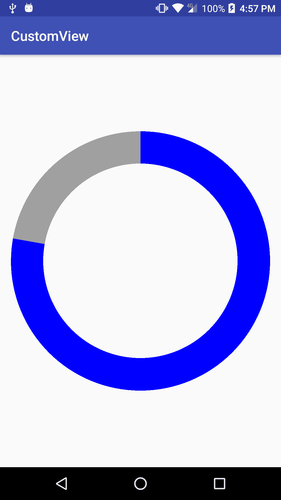
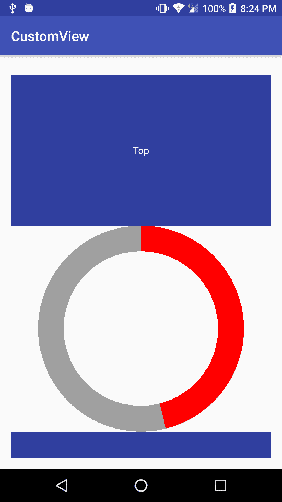

# 第三章：事件处理

现在我们已经了解了画布绘图的基础知识，并且我们的自定义视图已经适应了其大小，是时候与它进行交互了。许多自定义视图只需要以特定方式绘制某些内容；这就是我们创建它们为自定义视图的原因，但还有许多其他视图需要响应用户事件。例如，当用户在我们的自定义视图上点击或拖动时，它将如何表现？

为了回答这些问题，我们将在本章中详细介绍以下内容：

+   基本事件处理

+   高级事件处理

# 基本事件处理

让我们从为我们的自定义视图添加一些基本事件处理开始。我们将介绍基础知识，稍后我们将添加更复杂的事件。

# 响应触摸事件

为了使我们的自定义视图具有交互性，我们首先要实现的是处理并响应用户的触摸事件，或者基本上，当用户在我们的自定义视图上触摸或拖动时。

安卓提供了`onTouchEvent()`方法，我们可以在自定义视图中重写它。通过重写这个方法，我们将获取到发生在其上的任何触摸事件。为了了解它是如何工作的，让我们将它添加到上一章构建的自定义视图中：

```kt
@Override 
public boolean onTouchEvent(MotionEvent event) { 
    Log.d(TAG, "touch: " + event); 
    return super.onTouchEvent(event); 
} 
```

同时让我们添加一个日志调用，以查看我们接收的事件。如果我们运行此代码并在视图上触摸，我们将得到以下结果：

```kt
D/com.packt.rrafols.customview.CircularActivityIndicator: touch: MotionEvent { action=ACTION_DOWN, actionButton=0, id[0]=0, x[0]=644.3645, y[0]=596.55804, toolType[0]=TOOL_TYPE_FINGER, buttonState=0, metaState=0, flags=0x0, edgeFlags=0x0, pointerCount=1, historySize=0, eventTime=30656461, downTime=30656461, deviceId=9, source=0x1002 }
```

如我们所见，事件上有许多信息，如坐标、动作类型和时间，但即使我们对它执行更多操作，我们也只会收到`ACTION_DOWN`事件。这是因为视图的默认实现不是可点击的。默认情况下，如果我们不在视图上启用可点击标志，`onTouchEvent()`的默认实现将返回 false 并忽略进一步的事件。

`onTouchEvent()`方法必须返回`true`如果事件已经被处理，或者返回`false`如果还没有。如果我们在自定义视图中接收到一个事件，而我们不知道该如何处理或者对此类事件不感兴趣，我们应该返回`false`，这样它就可以由我们视图的父视图或其他组件或系统来处理。

为了接收更多类型的事件，我们可以做两件事：

+   使用`setClickable(true)`将视图设置为可点击

+   在我们自己的类中实现逻辑并处理事件

稍后，我们将实现更复杂的事件；我们将选择第二个选项。

让我们进行一个快速测试，将方法更改为只返回 true，而不是调用父方法：

```kt
@Override 
public boolean onTouchEvent(MotionEvent event) { 
    Log.d(TAG, "touch: " + event); 
    return true; 
} 
```

现在，我们应该能够接收许多其他类型的事件，如下所示：

```kt
...CircularActivityIndicator: touch: MotionEvent { action=ACTION_DOWN, ...CircularActivityIndicator: touch: MotionEvent { action=ACTION_UP, ...CircularActivityIndicator: touch: MotionEvent { action=ACTION_DOWN, ...CircularActivityIndicator: touch: MotionEvent { action=ACTION_MOVE, ...CircularActivityIndicator: touch: MotionEvent { action=ACTION_MOVE, ...CircularActivityIndicator: touch: MotionEvent { action=ACTION_MOVE, ...CircularActivityIndicator: touch: MotionEvent { action=ACTION_UP, ...CircularActivityIndicator: touch: MotionEvent { action=ACTION_DOWN,
```

如前一个示例所示，我们可以看到在之前的日志中，我们不仅拥有`ACTION_DOWN`和`ACTION_UP`，还有`ACTION_MOVE`来表示我们在视图上执行了拖动操作。

我们首先关注处理`ACTION_UP`和`ACTION_DOWN`事件。让我们添加一个名为`boolean`的变量，该变量将跟踪我们当前是否正在按或触摸我们的视图：

```kt
private boolean pressed; 

public CircularActivityIndicator(Context context, AttributeSet attributeSet) { 
    ... 
    ... 
    pressed = false; 
} 
```

我们添加了变量，并将其默认状态设置为`false`，因为视图在创建时不会被按压。现在，让我们在我们的`onTouchEvent()`实现中添加代码来处理这个问题：

```kt
@Override 
public boolean onTouchEvent(MotionEvent event) { 
    Log.d(TAG, "touch: " + event); 
    switch(event.getAction()) { 
        case MotionEvent.ACTION_DOWN: 
            pressed = true; 
            return true; 

        case MotionEvent.ACTION_UP: 
            pressed = false; 
            return true; 

        default: 
            return false; 
    } 
} 
```

我们处理了`MotionEvent`。`ACTION_DOWN`和`MotionEvent.ACTION_UP`事件；我们在这里收到的任何其他动作，我们都会忽略并返回`false`，因为我们没有处理它。

好的，现在我们有一个变量来跟踪我们是否正在按压视图，但我们还应该做其他事情，否则这个变量不会很有用。让我们修改`onDraw()`方法，当视图被按压时，以不同的颜色绘制圆形：

```kt
private static final int DEFAULT_FG_COLOR = 0xffff0000; 
private static final int PRESSED_FG_COLOR = 0xff0000ff; 

@Override 
protected void onDraw(Canvas canvas) { 
    if (pressed) { 
        foregroundPaint.setColor(PRESSED_FG_COLOR); 
    } else { 
        foregroundPaint.setColor(DEFAULT_FG_COLOR); 
    } 
```

如果我们运行这个例子并触摸我们的视图，我们会发现什么都没有发生！问题是什么？我们没有触发任何重绘事件，视图也没有再次被绘制。如果我们设法持续按压视图，并将应用放到后台然后再返回前台，我们就能看到这段代码是有效的。然而，为了正确地处理，当我们更改需要重新绘制视图的内容时，我们应该触发一个重绘事件，如下所示：

```kt
@Override 
public boolean onTouchEvent(MotionEvent event) { 
    Log.d(TAG, "touch: " + event); 
    switch(event.getAction()) { 
        case MotionEvent.ACTION_DOWN: 
            pressed = true; 
            invalidate(); 
            return true; 

        case MotionEvent.ACTION_UP: 
            pressed = false; 
            invalidate(); 
            return true; 

        default: 
            pressed = false; 
            invalidate(); 
            return false; 
    } 
} 
```

好的，这应该能解决问题！调用 invalidate 方法将在未来触发一个`onDraw()`方法的调用：

[`developer.android.com/reference/android/view/View.html#invalidate()`](https://developer.android.com/reference/android/view/View.html#invalidate())。

我们现在可以重构这段代码，并将其移动到一个方法中：

```kt
private void changePressedState(boolean pressed) { 
    this.pressed = pressed; 
    invalidate(); 
} 

@Override 
public boolean onTouchEvent(MotionEvent event) { 
    Log.d(TAG, "touch: " + event); 
    switch(event.getAction()) { 
        case MotionEvent.ACTION_DOWN: 
            changePressedState(true); 
            return true; 

        case MotionEvent.ACTION_UP: 
            changePressedState(false); 
            return true; 

        default: 
            changePressedState(false); 
            return false; 
    } 
} 
```

我们需要知道 invalidate 必须在 UI 线程中调用，如果从其他线程调用将会抛出异常。如果我们需要从另一个线程调用它，例如，在从网络服务接收到一些数据后更新视图，我们应该调用`postInvalidate()`。

这是结果：



# 拖动事件

既然我们已经对`ACTION_DOWN`和`ACTION_UP`事件做出了反应，我们将通过也对`ACTION_MOVE`事件做出反应来增加一点复杂性。

让我们根据在两个方向上拖动的距离来更新角度。为此，我们需要存储用户最初按压的位置，因此我们将用`ACTION_DOWN`事件中的`X`和`Y`坐标来存储变量`lastX`和`lastY`。

当我们收到一个`ACTION_MOVE`事件时，我们计算`lastX`和`lastY`坐标与事件中收到的当前值之间的差。我们用`X`和`Y`差值的平均值来更新`selectedAngle`，并最终更新`lastX`和`lastY`坐标。我们必须记得调用 invalidate，否则我们的视图将不会被重绘：

```kt
private float lastX, lastY; 

@Override 
public boolean onTouchEvent(MotionEvent event) { 
    switch(event.getAction()) { 
        case MotionEvent.ACTION_DOWN: 
            changePressedState(true); 

            lastX = event.getX(); 
            lastY = event.getY(); 
            return true; 

        case MotionEvent.ACTION_UP: 
            changePressedState(false); 
            return true; 

        case MotionEvent.ACTION_MOVE: 
            float dragX = event.getX(); 
            float dragY = event.getY(); 

            float dx = dragX - lastX; 
            float dy = dragY - lastY; 

            selectedAngle += (dx + dy) / 2; 

            lastX = dragX; 
            lastY = dragY; 

            invalidate(); 
            return true; 

        default: 
            return false; 
    } 
} 
```

这种移动可能感觉有点不自然，所以如果我们希望圆的角度跟随我们实际按压的位置，我们应该从笛卡尔坐标转换为极坐标：

[`en.wikipedia.org/wiki/List_of_common_coordinate_transformations`](https://en.wikipedia.org/wiki/List_of_common_coordinate_transformations)。

进行此更改后，无需跟踪先前坐标，因此我们可以用以下代码替换我们的代码：

```kt
private int computeAngle(float x, float y) { 
    x -= getWidth() / 2; 
    y -= getHeight() / 2; 

    int angle = (int) (180.0 * Math.atan2(y, x) / Math.PI) + 90; 
    return (angle > 0) ? angle : 360 + angle; 
} 

@Override 
public boolean onTouchEvent(MotionEvent event) { 
    switch(event.getAction()) { 
        case MotionEvent.ACTION_DOWN: 
            selectedAngle = computeAngle(event.getX(), event.getY()); 
            changePressedState(true); 
            return true; 

        case MotionEvent.ACTION_UP: 
            changePressedState(false); 
            return true; 

        case MotionEvent.ACTION_MOVE: 
            selectedAngle = computeAngle(event.getX(), event.getY()); 
            invalidate(); 
            return true; 

        default: 
            return false; 
    } 
} 
```

# 复杂布局

到目前为止，我们已经了解了如何在自定义视图上管理`onTouchEvent()`事件，但这仅适用于占据整个屏幕大小的视图，因此这是一个相对简单的处理方式。如果我们想在也处理触摸事件的`ViewGroup`中包含我们的视图，例如`ScrollView`，我们需要做哪些更改？

让我们更改这个布局：

```kt
<?xml version="1.0" encoding="utf-8"?> 
<RelativeLayout  

    android:id="@+id/activity_main" 
    android:layout_width="match_parent" 
    android:layout_height="match_parent" 
    android:padding="@dimen/activity_vertical_margin" 
    tools:context="com.packt.rrafols.customview.MainActivity"> 

    <ScrollView 
        android:layout_width="match_parent" 
        android:layout_height="wrap_content" 
        android:layout_alignParentTop="true" 
        android:layout_alignParentStart="true" 
        android:layout_marginTop="13dp"> 

        <LinearLayout 
            android:layout_width="match_parent" 
            android:layout_height="wrap_content" 
            android:orientation="vertical"> 

            <TextView 
                android:layout_width="match_parent" 
                android:layout_height="wrap_content" 
                android:paddingTop="100dp" 
                android:paddingBottom="100dp" 
                android:text="Top" 
                android:background="@color/colorPrimaryDark" 
                android:textColor="@android:color/white" 
                android:gravity="center"/> 

            <com.packt.rrafols.customview.CircularActivityIndicator 
                android:layout_width="match_parent" 
                android:layout_height="300dp"/> 

            <TextView 
                android:layout_width="match_parent" 
                android:layout_height="wrap_content" 
                android:paddingTop="100dp" 
                android:paddingBottom="100dp" 
                android:text="Bottom" 
                android:background="@color/colorPrimaryDark" 
                android:textColor="@android:color/white" 
                android:gravity="center"/> 
        </LinearLayout> 
    </ScrollView> 
</RelativeLayout> 
```

基本上，我们把自定义视图放在了`ScrollView`中，这样两者都可以处理事件。我们应该选择哪些事件由我们的视图处理，哪些事件由`ScrollView`处理。

为了实现这一点，视图为我们提供了`getParent()`方法，以获取其父视图：

[关于`ViewParent`的 Android 官方文档](https://developer.android.com/reference/android/view/ViewParent.html)。

一旦我们有了父视图，就可以调用`requestDisallowInterceptTouchEvent`来禁止父视图及其父视图拦截触摸事件。此外，为了只消耗我们感兴趣的事件，我们添加了一个检查，以查看用户触摸的位置是否在圆的半径内或外部。如果触摸在外部，我们将忽略该事件并不处理。

```kt
private boolean computeAndSetAngle(float x, float y) { 
    x -= getWidth() / 2; 
    y -= getHeight() / 2; 

    double radius = Math.sqrt(x * x + y * y); 
    if(radius > circleSize/2) return false; 

    int angle = (int) (180.0 * Math.atan2(y, x) / Math.PI) + 90; 
    selectedAngle = ((angle > 0) ? angle : 360 + angle); 
    return true; 
} 

@Override 
public boolean onTouchEvent(MotionEvent event) { 
    boolean processed; 

    switch(event.getAction()) { 
        case MotionEvent.ACTION_DOWN: 
            processed = computeAndSetAngle(event.getX(), event.getY()); 
            if(processed) { 
                getParent().requestDisallowInterceptTouchEvent(true); 
                changePressedState(true); 
            } 
            return processed; 

        case MotionEvent.ACTION_UP: 
            getParent().requestDisallowInterceptTouchEvent(false); 
            changePressedState(false); 
            return true; 

        case MotionEvent.ACTION_MOVE: 
            processed = computeAndSetAngle(event.getX(), event.getY()); 
            invalidate(); 
            return processed; 

        default: 
            return false; 
    } 
} 
```

我们通过应用之前使用的相同笛卡尔极坐标变换来计算半径。我们还更改了代码，所以如果触摸点在圆的半径内，我们会在`ACTION_DOWN`事件上调用`getParent().requestDisallowInterceptTouchEvent(true)`，告诉`ViewParent`不要拦截触摸事件。我们需要在`ACTION_UP`事件上调用相反的`getParent().requestDisallowInterceptTouchEvent(false)`来撤销这个动作。

这是此更改的结果，我们可以看到自定义视图顶部和底部各有一个`TextView`：



现在如果我们触摸圆圈，我们的自定义视图将只处理事件并改变圆圈的角度。另一方面，如果触摸圆圈外部，我们将让`ScrollView`处理这些事件。

变化并不多，但是当我们构建一个可能会在多个地方重复使用的自定义视图时，我们绝对应该在多种布局配置中测试它，以了解其表现如何。

在 GitHub 仓库的`Example10-Events`文件夹中找到此示例的完整源代码。

# 高级事件处理

我们已经了解了如何处理`onTouchEvent()`，但我们还可以检测一些**手势**或更复杂的交互。Android 为我们提供了`GestureDetector`来帮助检测一些手势。支持库中甚至还有一个`GestureDetectorCompat`，用于为旧版本的 Android 提供支持。

有关`GestureDetector`的更多信息，请查看 Android 文档。

# 检测手势

让我们改变我们一直在构建的代码，以使用`GestureDetector`。我们还将使用`Scroller`实现来在值之间平滑滚动。我们可以修改构造函数以创建`Scroller`对象和实现了`GestureDetector.OnGestureListener`的`GestureDetector`：

```kt
private GestureDetector gestureListener; 
private Scroller angleScroller; 

public CircularActivityIndicator(Context context, AttributeSet attributeSet) { 
    super(context, attributeSet); 

    ... 

    selectedAngle = 280; 
    pressed = false; 

    angleScroller = new Scroller(context, null, true); 
    angleScroller.setFinalX(selectedAngle); 

    gestureListener = new GestureDetector(context, new
    GestureDetector.OnGestureListener() { 
       boolean processed; 

       @Override 
       public boolean onDown(MotionEvent event) { 
           processed = computeAndSetAngle(event.getX(), event.getY()); 
           if (processed) { 
               getParent().requestDisallowInterceptTouchEvent(true); 
               changePressedState(true); 
               postInvalidate(); 
           } 
           return processed; 
       } 

       @Override 
       public void onShowPress(MotionEvent e) { 

       } 

       @Override 
       public boolean onSingleTapUp(MotionEvent e) { 
           endGesture(); 
           return false; 
       } 

       @Override 
       public boolean onScroll(MotionEvent e1, MotionEvent e2, float
       distanceX, float distanceY) { 
           computeAndSetAngle(e2.getX(), e2.getY()); 
           postInvalidate(); 
           return true; 
       } 

       @Override 
       public void onLongPress(MotionEvent e) { 
           endGesture(); 
       } 

       @Override 
       public boolean onFling(MotionEvent e1, MotionEvent e2, float
       velocityX, float velocityY) { 
           return false; 
       } 
   }); 
} 
```

这个接口中有许多回调方法，但首先，为了处理手势，我们需要在`onDown()`回调中返回 true；否则，我们表明不会进一步处理事件链。

现在我们简化了`onTouchEvent()`，因为它只需将事件简单地转发给`gestureListener`：

```kt
@Override 
public boolean onTouchEvent(MotionEvent event) { 
    return gestureListener.onTouchEvent(event); 
} 
```

因为我们可能有不同的手势，如长按、抛掷、滚动，所以我们创建了一个方法来结束手势并恢复状态：

```kt
private void endGesture() { 
    getParent().requestDisallowInterceptTouchEvent(false); 
    changePressedState(false); 
    postInvalidate(); 
} 
```

我们修改了`computeAndSetAngle()`方法以使用`Scroller`：

```kt
private boolean computeAndSetAngle(float x, float y) { 
    x -= getWidth() / 2; 
    y -= getHeight() / 2; 

    double radius = Math.sqrt(x * x + y * y); 
    if(radius > circleSize/2) return false; 

    int angle = (int) (180.0 * Math.atan2(y, x) / Math.PI) + 90; 
    angle = ((angle > 0) ? angle : 360 + angle); 

    if(angleScroller.computeScrollOffset()) { 
        angleScroller.forceFinished(true); 
    } 

    angleScroller.startScroll(angleScroller.getCurrX(), 0, angle -
    angleScroller.getCurrX(), 0); 
    return true; 
} 
```

`Scroller`实例将动画化这些值；我们需要不断检查更新的值以执行动画。一种实现方法是，在`onDraw()`方法中检查动画是否完成，并在动画未完成时触发失效以重新绘制视图：

```kt
@Override 
protected void onDraw(Canvas canvas) { 
    boolean notFinished = angleScroller.computeScrollOffset(); 
    selectedAngle = angleScroller.getCurrX(); 

    ... 

    if (notFinished) invalidate(); 
} 
```

`computeScrollOffset()`方法会在`Scroller`还未到达终点时返回 true；在调用它之后，我们可以使用`getCurrX()`方法查询滚动值。在这个例子中，我们正在动画化圆的角度值，但我们使用`Scroller`的`X`坐标来驱动这个动画。

使用这个`GestureDetector`，我们还可以检测长按和抛掷等手势。由于抛掷涉及更多动画，我们将在本书的下一章中进行介绍。

有关如何使视图具有交互性的更多信息，请参考：

[在 Android 开发者网站上了解如何使视图具有交互性](https://developer.android.com/training/custom-views/making-interactive.html)。

本例的源代码可以在 GitHub 仓库的`Example11-Events`文件夹中找到。

# 总结

在本章中，我们学习了如何与自定义视图进行交互。构建自定义视图的部分强大功能在于能够与它们互动并使它们具有交互性。我们也了解了如何简单地响应触摸和释放事件，如何拖动元素以及计算拖动事件之间的增量距离，最后学习了如何使用`GestureDetector`。

由于到目前为止渲染保持相当简单，我们将在下一章重点介绍使我们的渲染更加复杂并使用更多的绘图原语。
