# 第四章：高级 2D 渲染

能够绘制更复杂的原始图形或使用它们的组合对于使我们的自定义视图的用户体验变得出色、实用和特别至关重要。到目前为止，我们在自定义视图中使用了一些绘制和渲染操作，但如果我们仔细查看 Android 文档，这只是 Android 为开发者提供的一小部分功能。我们已经绘制了一些原始图形，保存和恢复了我们的`canvas`状态，并应用了一些剪辑操作，但这只是冰山一角。在本章中，我们将再次看到这些操作，但我们将看到一些新的绘制操作以及如何将它们一起使用。我们将更详细地介绍以下主题：

+   绘图操作

+   蒙版和剪辑

+   渐变

+   把它们放在一起

# 绘图操作

正如我们刚才提到的，我们已经看到并使用了一些绘图操作，但这只是冰山一角。我们将看到新的绘图操作以及如何将它们结合使用。

# 位图

让我们从绘制位图或图像开始。我们不是使用白色背景，而是将图像作为我们自定义视图的背景。使用我们之前示例的源代码，我们可以做一些非常简单的修改来绘制图像：

首先，定义一个`Bitmap`对象来保存对图像的引用：

```kt
private Bitmap backgroundBitmap; 
```

首先，让我们用已有的应用程序图标来初始化它：

```kt
public CircularActivityIndicator(Context context, AttributeSet attributeSet) { 
    super(context, attributeSet); 

    backgroundBitmap = BitmapFactory.decodeResource(getResources(),
    R.mipmap.ic_launcher); 
```

`BitmapFactory`为我们提供了多种加载和解码图像的方法。

当我们加载了图像之后，可以在`onDraw()`方法中通过调用`drawBitmap(Bitmap bitmap, float left, float top, Paint paint)`方法来绘制图像：

```kt
@Override 
protected void onDraw(Canvas canvas) { 
    if (backgroundBitmap != null) { 
        canvas.drawBitmap(backgroundBitmap, 0, 0, null); 
    } 
```

因为我们不需要从`Paint`对象中得到任何特别的东西，所以我们将其设置为`null`；我们将在本书稍后使用它，但现在，只需忽略它。

如果`backgroundBitmap`为`null`，这意味着它无法加载图像；因此，为了安全起见，我们应始终检查。这段代码只会在我们自定义视图的左上角绘制图标，尽管我们可以通过设置不同的坐标（这里我们使用了`0`，`0`）或对我们的`canvas`应用之前做过的变换来改变其位置。例如，我们可以根据用户选择的角度来旋转图像：

```kt
@Override 
protected void onDraw(Canvas canvas) { 
    // apply a rotation of the bitmap based on the selectedAngle 
    if (backgroundBitmap != null) { 
        canvas.save(); 
        canvas.rotate(selectedAngle, backgroundBitmap.getWidth() / 2,
        backgroundBitmap.getHeight() / 2); 
        canvas.drawBitmap(backgroundBitmap, 0, 0, null); 
        canvas.restore(); 
    } 
```

注意，我们已经将图像的中心作为轴心点，否则将以其左上角为中心旋转。

有其他方法可以绘制图像；Android 提供了另一种方法，可以从源`Rect`绘制到目标`Rect`。`Rect`对象允许我们存储四个坐标并将其用作矩形。

`drawBitmap(Bitmap bitmap, Rect source, Rect dest, Paint paint)`方法非常适用于将图像的一部分绘制成我们想要的任何其他大小。这个方法会处理缩放选定部分的图像以填充目标矩形。例如，如果我们想绘制图像的右半部分并缩放到整个自定义视图的大小，我们可以使用以下代码。

首先，让我们定义背景 `Bitmap` 和两个 `Rect`；一个用于保存源尺寸，另一个用于目标尺寸：

```kt
private Bitmap backgroundBitmap; 
private Rect bitmapSource; 
private Rect bitmapDest; 
```

然后，让我们在类构造函数中实例化它们。在 `onDraw()` 方法中这样做不是一个好习惯，因为我们应该避免为每次帧调用或每次绘制自定义视图的方法分配内存。这样做会触发额外的垃圾收集周期，影响性能。

```kt
public CircularActivityIndicator(Context context, AttributeSet attributeSet) { 
    super(context, attributeSet); 

    backgroundBitmap = BitmapFactory.decodeResource(getResources(),
    R.mipmap.ic_launcher); 
    bitmapSource = new Rect(); 

    bitmapSource.top = 0; 
    bitmapSource.left = 0; 
    if(backgroundBitmap != null) { 
        bitmapSource.left = backgroundBitmap.getWidth() / 2; 
        bitmapSource.right = backgroundBitmap.getWidth(); 
        bitmapSource.botto 
        m = backgroundBitmap.getHeight(); 
    } 
    bitmapDest = new Rect(); 
```

默认情况下，`Rect` 会将四个坐标初始化为 0，但在这里，为了清晰起见，我们将顶部和左侧坐标设置为 0。如果图像加载成功，我们将右侧和底部分别设置为图像的宽度和高度。由于我们只想绘制图像的右半部分，因此我们将左侧边界更新为图像宽度的一半。

在 `onDraw()` 方法中，我们将目标 `Rect` 的右侧和底部坐标设置为自定义视图的宽度和高度，然后我们绘制图像：

```kt
@Override 
protected void onDraw(Canvas canvas) { 
    if (backgroundBitmap != null) { 
        bitmapDest.right = getWidth(); 
        bitmapDest.bottom = getHeight(); 

        canvas.drawBitmap(backgroundBitmap, bitmapSource, bitmapDest,
        null); 
    } 
```

让我们检查一下结果：

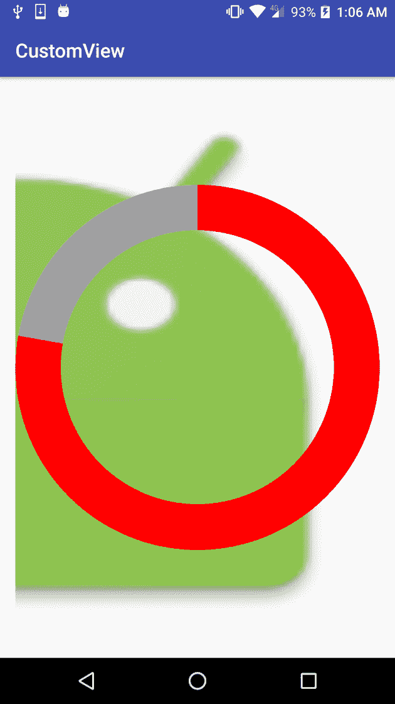

我们可以看到它并不遵循图像的宽高比，但我们可以通过计算较小维度（水平或垂直）的比例并以此比例进行缩放来解决它。然后，将这个比例应用到另一个维度上。计算图像比例后，我们将看到以下代码：

```kt
@Override 
protected void onDraw(Canvas canvas) { 
    if (backgroundBitmap != null) { 
        if ((bitmapSource.width() > bitmapSource.height() && getHeight() >
        getWidth()) || 
            (bitmapSource.width() <= bitmapSource.height() && getWidth() >=
            getHeight())) { 

            double ratio = ((double) getHeight()) / ((double)
            bitmapSource.height()); 
            int scaledWidth = (int) (bitmapSource.width() * ratio); 
            bitmapDest.top = 0; 
            bitmapDest.bottom = getHeight(); 
            bitmapDest.left = (getWidth() - scaledWidth) / 2; 
            bitmapDest.right = bitmapDest.left + scaledWidth; 
        } else { 
            double ratio = ((double) getWidth()) / ((double)
            bitmapSource.width()); 
            int scaledHeight = (int) (bitmapSource.height() * ratio); 
            bitmapDest.left = 0; 
            bitmapDest.right = getWidth(); 
            bitmapDest.top = 0; 
            bitmapDest.bottom = scaledHeight; 
        } 

        canvas.drawBitmap(backgroundBitmap, bitmapSource, bitmapDest,
        null); 
    } 
```

我们还可以使用变换 `Matrix` 绘制 `Bitmap`。为此，我们可以创建 `Matrix` 的新实例并应用变换：

```kt
private Matrix matrix; 
```

在构造函数中创建实例。不要在 `onDraw()` 实例中创建实例，因为这将污染内存并触发不必要的垃圾收集，如前所述：

```kt
matrix = new Matrix(); 
matrix.postScale(0.2f, 0.2f); 
matrix.postTranslate(0, 200); 
```

请注意矩阵操作顺序；也有后操作和前操作。更多信息请查看矩阵类文档。

在 `onDraw()` 方法中，只需使用 `drawBitmap (Bitmap bitmap, Matrix matrix, Paint paint)` 方法绘制 `Bitmap`，并使用我们在类构造函数中初始化的 `matrix`。在这个例子中，我们还使用了 `null Paint` 对象以简化，因为在这里我们不需要从 `Paint` 对象获取任何特定内容。

```kt
canvas.drawBitmap(backgroundBitmap, matrix, null); 
```

尽管这些是将 `Bitmap` 绘制到 `Canvas` 上最常见的方法，但还有更多方法。

此外，请查看 GitHub 存储库中的 `Example12-Drawing` 文件夹，以查看此示例的完整源代码。

# 使用 Paint 类

到现在为止我们一直在绘制一些基本图形，但 `Canvas` 为我们提供了更多基本渲染方法。我们将简要介绍其中一些，但首先，让我们正式介绍一下 `Paint` 类，因为我们还没有完全介绍它。

根据官方定义，`Paint`类保存了关于如何绘制基本图形、文本和位图的风格和颜色信息。如果我们检查我们一直在构建的示例，我们在类构造函数中或在`onCreate`方法中创建了一个`Paint`对象，并在后面的`onDraw()`方法中使用它来绘制基本图形。例如，如果我们把背景`Paint`实例的`Style`设置为`Paint.Style.FILL`，它会填充基本图形，但如果我们只想绘制边框或轮廓的笔触，我们可以将其更改为`Paint.Style.STROKE`。我们可以同时使用`Paint.Style.FILL_AND_STROKE`来绘制两者。

为了看到`Paint.Style.STROKE`的效果，我们将在自定义视图中的选定彩色栏上方绘制一个黑色边框。首先，在类构造函数中定义一个新的`Paint`对象，名为`indicatorBorderPaint`，并初始化它：

```kt
indicatorBorderPaint = new Paint(); 
indicatorBorderPaint.setAntiAlias(false); 
indicatorBorderPaint.setColor(BLACK_COLOR); 
indicatorBorderPaint.setStyle(Paint.Style.STROKE); 
indicatorBorderPaint.setStrokeWidth(BORDER_SIZE); 
indicatorBorderPaint.setStrokeCap(Paint.Cap.BUTT); 
```

我们还定义了一个常量来设置边框线的尺寸，并将笔触宽度设置为这个尺寸。如果我们把宽度设置为`0`，Android 保证会使用一个像素来绘制线条。由于我们现在想要绘制一条粗黑的边框，所以这不是我们的情况。此外，我们将笔触线帽设置为`Paint.Cap.BUTT`，以避免笔触溢出路径。还有两种线帽可以使用，`Paint.Cap.SQUARE`和`Paint.Cap.ROUND`。最后这两种线帽会分别以圆形（使笔触变圆）或方形结束笔触。

让我们快速了解三种线帽之间的区别，并介绍`drawLine`这个基本图形绘制方法。

首先，我们创建一个包含所有三种线帽的数组，这样我们可以轻松地在它们之间迭代，并编写更紧凑的代码：

```kt
private static final Paint.Cap[] caps = new Paint.Cap[] { 
        Paint.Cap.BUTT, 
        Paint.Cap.ROUND, 
        Paint.Cap.SQUARE 
}; 
```

现在，在我们的`onDraw()`方法中，让我们使用`drawLine(float startX, float startY, float stopX, float stopY, Paint paint)`方法，用每种线帽绘制一条线：

```kt
int xPos = (getWidth() - 100) / 2; 
int yPos = getHeight() / 2 - BORDER_SIZE * CAPS.length / 2; 
for(int i = 0; i < CAPS.length; i++) { 
    indicatorBorderPaint.setStrokeCap(CAPS[i]); 
    canvas.drawLine(xPos, yPos, xPos + 100, yPos,
    indicatorBorderPaint); 
    yPos += BORDER_SIZE * 2; 
} 
indicatorBorderPaint.setStrokeCap(Paint.Cap.BUTT); 
```

我们将得到类似以下图像的结果。如我们所见，当使用`Paint.Cap.BUTT`作为笔触线帽时，线条会稍微短一些：

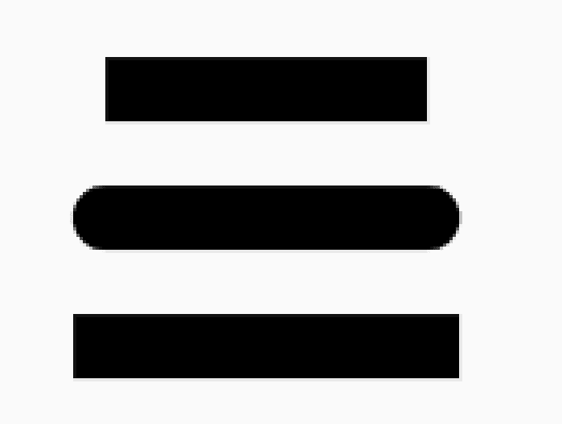

同样，正如我们之前所看到的，我们在`Paint`对象上设置了`AntiAlias`标志为 true。如果启用了这个标志，所有支持它的操作都会平滑它们正在绘制的图形的角。让我们比较一下启用和禁用这个标志时的差异：

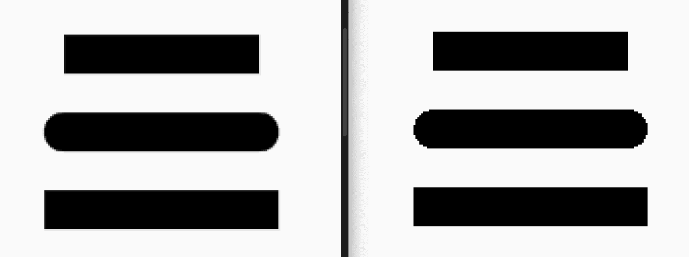

在左边，我们启用了`AntiAlias`标志的三条线，在右边，我们禁用了`AntiAlias`标志的同样三条线。我们只能在圆角上看到差异，但结果更平滑、更美观。并非所有的操作和基本图形都支持这个标志，并且可能会影响性能，因此在使用这个标志时需要小心。

我们还可以使用另一个名为`drawLine(float[] points, int offset, int count, Paint paint)`的方法或其简化形式`drawLine(float[] points, Paint paint)`来绘制多条线。

这个方法将为数组中的每组四个条目绘制一条线；这就像调用`drawLine(array[index], array[index + 1], array[index + 2], array[index +3], paint)`，将索引增加`4`，并重复此过程直到数组末尾。

在第一个方法中，我们还可以指定要绘制的线条数量以及从数组内部哪个偏移量开始。

现在，让我们来完成我们之前的任务并绘制边框：

```kt
canvas.drawArc( 
       horMargin + BORDER_SIZE / 4, 
       verMargin + BORDER_SIZE / 4, 
       horMargin + circleSize - BORDER_SIZE /2, 
       verMargin + circleSize - BORDER_SIZE /2, 
       0, selectedAngle, true, indicatorBorderPaint); 
```

它只是用这个新的`Paint`绘制相同的圆弧。一个小细节：由于边框宽度从绘制笔划的位置中心向外增长，我们需要将圆弧的大小减少`BORDER_SIZE / 2`。让我们看看结果：

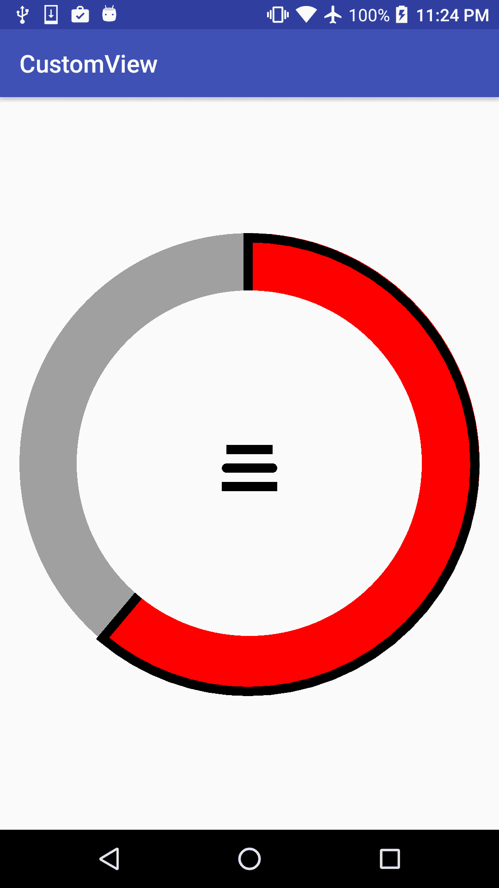

我们缺少内部边框，但这很正常，因为如果我们从之前的章节中记得，这部分存在是因为我们将其裁剪掉了，而不是因为`drawArc`以这种方式绘制。我们可以用一个小技巧来绘制这个内部边框。我们将绘制一个与裁剪区域大小相同的圆弧，但只绘制边框：

```kt
canvas.drawArc( 
       clipX - BORDER_SIZE / 4, 
       clipY - BORDER_SIZE / 4, 
       clipX + clipWidth + BORDER_SIZE / 2, 
       clipY + clipWidth + BORDER_SIZE / 2, 
       0, selectedAngle, true, indicatorBorderPaint); 
```

在这里，我们对边框大小应用了相同的逻辑，但反过来：我们绘制稍微大一点的圆弧，而不是小一点的。

让我们看看结果：

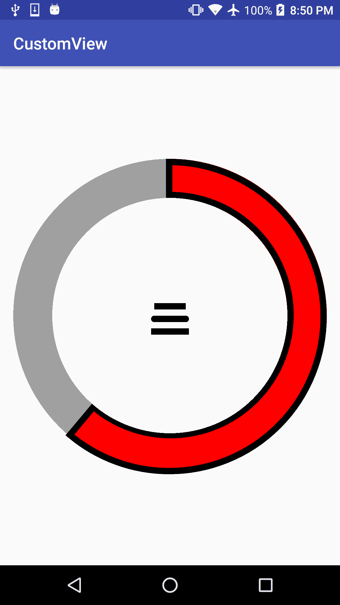

我们在这本书的一开始提到过，但重要的是不要在`onDraw()`方法中或基本上在任何每次绘制帧时都会被调用的方法中创建新的`Paint`对象。在某些情况下，我们可能觉得这样做很方便；然而，抵制诱惑，在类构造函数中创建对象或仅仅复用对象。我们可以更改`Paint`类实例属性并复用它来绘制不同的颜色或样式。

在 GitHub 仓库的`Example13-Paint`文件夹中找到这个例子的完整源代码。

我们将更多地玩转`Paint`对象及其属性，但现在，让我们开始绘制更多的基础图形。

# 绘制更多的基础图形

让我们从最简单的绘图操作开始：`drawColor(int color)`，`drawARGB(int a, int r, int g, int b)`，`drawRGB(int r, int g, int b)`，以及`drawPaint(Paint paint)`。这些将填充整个`canvas`，考虑到裁剪区域。

现在让我们来看看`drawRect()`和`drawRoundRect()`。这两个方法也非常简单，`drawRect()`将绘制一个矩形，而`drawRoundRect()`将绘制具有圆角边框的矩形。

我们可以直接使用这两种方法，指定坐标或使用`Rect`。让我们创建一个简单的例子，它将在每次绘制视图或调用其`onDraw()`方法时绘制一个新的随机圆角矩形。

首先，定义两个`ArrayLists`；一个将保存矩形的坐标，另一个将保存矩形的颜色信息：

```kt
private Paint paint; 
private ArrayList<Float> rects; 
private ArrayList<Integer> colors; 
```

我们还声明了一个`Paint`对象，用于绘制所有圆角矩形。现在让我们来初始化它们：

```kt
public PrimitiveDrawer(Context context, AttributeSet attributeSet) { 
    super(context, attributeSet); 

    rects = new ArrayList<>(); 
    colors = new ArrayList<>(); 

    paint = new Paint(); 
    paint.setStyle(Paint.Style.FILL); 
    paint.setAntiAlias(true); 
} 
```

我们将 paint 对象的样式设置为 `Paint.Style.FILL` 并设置了 `AntiAlias` 标志，但我们还没有设置颜色。我们将在绘制每个矩形之前这样做。

现在让我们实现我们的 `onDraw()` 方法。首先，我们将添加四个新的随机坐标。由于 `Math.random()` 返回从 `0` 到 `1` 的值，我们将其乘以当前视图的宽度和高度以获得适当的视图坐标。我们还生成了一个具有完全不透明度的新随机颜色：

```kt
@Override 
protected void onDraw(Canvas canvas) { 
    canvas.drawColor(BACKGROUND_COLOR); 

    int width = getWidth(); 
    int height = getHeight(); 

    for (int i = 0; i < 2; i++) { 
        rects.add((float) Math.random() * width); 
        rects.add((float) Math.random() * height); 
    } 
    colors.add(0xff000000 | (int) (0xffffff * Math.random())); 

    for (int i = 0; i < rects.size() / 4; i++) { 
        paint.setColor(colors.get(i)); 
        canvas.drawRoundRect( 
                rects.get(i * 4    ), 
                rects.get(i * 4 + 1), 
                rects.get(i * 4 + 2), 
                rects.get(i * 4 + 3), 
                40, 40, paint); 
    } 

    if (rects.size() < 400) postInvalidateDelayed(20); 
} 
```

然后，我们将遍历我们添加的所有随机点，并一次取 `4` 个，假设前两个将是矩形的起始 X 和 Y，后两个将是矩形的结束 X 和 Y 坐标。我们将圆角的角度硬编码为 `40`。我们可以调整这个值来改变圆角的大小。

我们已经介绍了颜色上的位运算。我们知道可以将颜色存储在 32 位整数值中，通常是以 ARGB 格式。这样每个分量就有 8 位。通过位运算，我们可以轻松地操作颜色。关于位运算的更多信息，请参考：

[位运算](https://en.wikipedia.org/wiki/Bitwise_operation)。

最后，如果我们数组中的矩形少于 `100` 个或坐标少于 `400` 个，我们会发送一个延迟 `20` 毫秒的 `Invalidate` 事件。这只是为了演示目的，并显示它正在添加和绘制更多的矩形。通过仅移除两个硬编码的 `40` 作为圆角的角度，`drawRoundRect()` 方法可以很容易地更改为 `drawRect()`。

让我们看看结果：

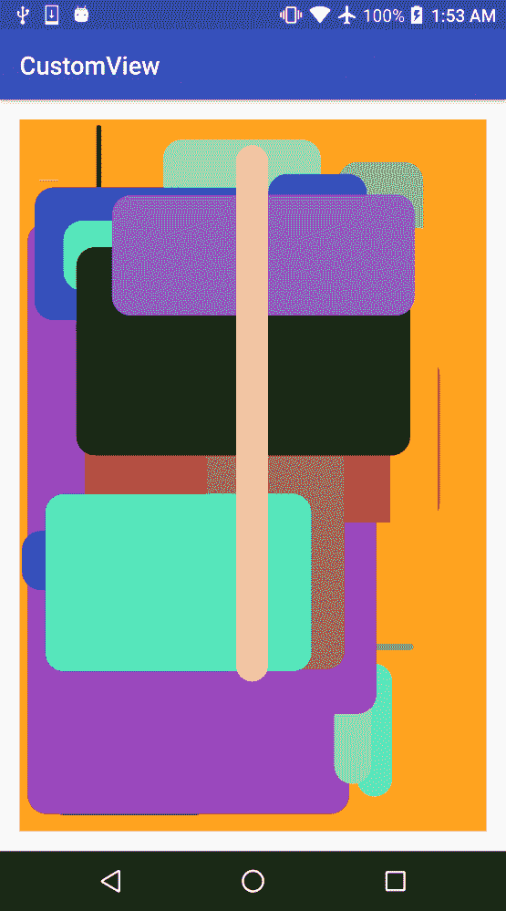

要查看完整源代码，请检查 GitHub 仓库中的 `Example14-Primitives-Rect` 文件夹。

让我们继续讨论其他原语，例如 `drawPoints`。`drawPoints(float[] points, Paint paint)` 方法将简单地绘制一系列点。它将使用 `paint` 对象的笔触宽度和笔触 `Cap`。例如，一个快速示例，绘制几条随机线，并在每条线的开始和结束处都绘制一个点：

```kt
@Override 
protected void onDraw(Canvas canvas) { 
    canvas.drawColor(BACKGROUND_COLOR); 

    if (points == null) { 
        points = new float[POINTS * 2]; 
        for(int i = 0; i < POINTS; i++) { 
            points[i * 2    ] = (float) Math.random() * getWidth(); 
            points[i * 2 + 1] = (float) Math.random() * getHeight(); 
        } 
    } 

    paint.setColor(0xffa0a0a0); 
    paint.setStrokeWidth(4.f); 
    paint.setStrokeCap(Paint.Cap.BUTT); 
    canvas.drawLines(points, paint); 

    paint.setColor(0xffffffff); 
    paint.setStrokeWidth(10.f); 
    paint.setStrokeCap(Paint.Cap.ROUND); 
    canvas.drawPoints(points, paint); 
} 
```

让我们看看结果：

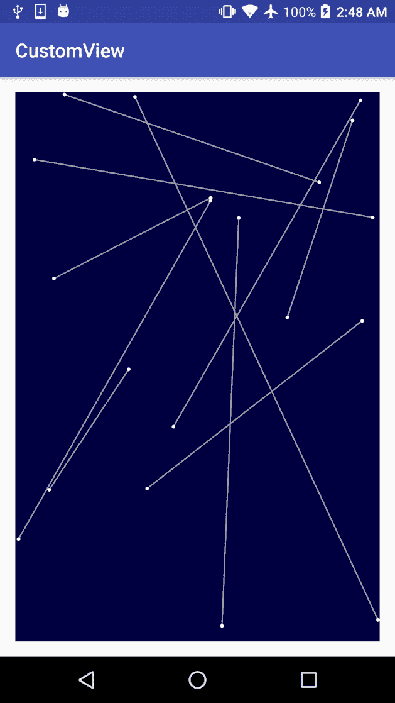

我们在这里的 `onDraw()` 方法中创建 points 数组，但这只做一次。

在 GitHub 仓库的 `Example15-Primitives-Points` 文件夹中查看这个例子的完整源代码。

在上一个示例的基础上，我们可以轻松引入 `drawCircle` 原语。不过，让我们稍微改一下代码；不是只生成随机值对，而是生成三个随机值。前两个将是圆的 `X` 和 `Y` 坐标，第三个是圆的半径。此外，为了清晰起见，我们删除了线条：

```kt
@Override 
protected void onDraw(Canvas canvas) { 
    canvas.drawColor(BACKGROUND_COLOR); 

    if (points == null) { 
        points = new float[POINTS * 3]; 
        for(int i = 0; i < POINTS; i++) { 
            points[i * 3    ] = (float) Math.random() * getWidth(); 
            points[i * 3 + 1] = (float) Math.random() * getHeight(); 
            points[i * 3 + 2] = (float) Math.random() * (getWidth()/4); 
        } 
    } 

    for (int i = 0; i < points.length / 3; i++) { 
        canvas.drawCircle( 
                points[i * 3    ], 
                points[i * 3 + 1], 
                points[i * 3 + 2], 
                paint); 
    } 
} 
```

我们还在类构造函数中初始化了 `paint` 对象：

```kt
paint = new Paint(); 
paint.setStyle(Paint.Style.FILL); 
paint.setAntiAlias(true); 
paint.setColor(0xffffffff); 
```

让我们看看结果：

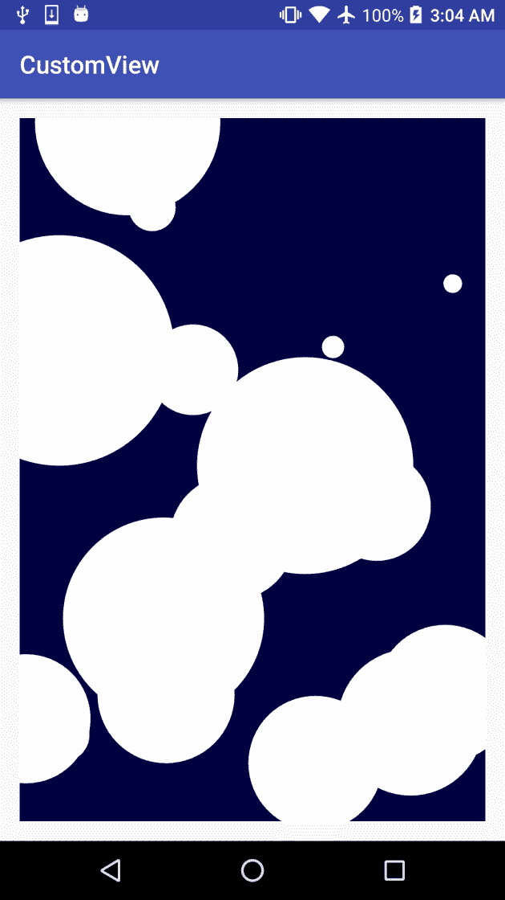

在 GitHub 仓库的 `Example16-Primitives-Circles` 文件夹中查看这个例子的完整源代码。

要了解有关在`Canvas`上绘制所有基本图形、模式和方法的详细信息，请查看 Android 文档。

可以将 Path 视为包含基本图形、线条、曲线以及其他几何形状的容器，正如我们已经看到的，它们可以用作裁剪区域、绘制或在其上绘制文本。

首先，让我们修改之前的示例，并将所有圆转换为`Path`：

```kt
@Override 
protected void onDraw(Canvas canvas) { 
    if (path == null) { 
        float[] points = new float[POINTS * 3]; 
        for(int i = 0; i < POINTS; i++) { 
            points[i * 3    ] = (float) Math.random() * getWidth(); 
            points[i * 3 + 1] = (float) Math.random() * getHeight(); 
            points[i * 3 + 2] = (float) Math.random() * (getWidth()/4); 
        } 

        path = new Path(); 

        for (int i = 0; i < points.length / 3; i++) { 
            path.addCircle( 
                    points[i * 3    ], 
                    points[i * 3 + 1], 
                    points[i * 3 + 2], 
                    Path.Direction.CW); 
        } 

        path.close(); 
    } 
```

我们不需要存储点，因此将其声明为局部变量。我们创建了一个`Path`对象。现在我们有了这个包含所有圆的`Path`，可以通过调用`drawPath(Path path, Paint paint)`方法绘制它，或者用作裁剪遮罩。

我们向项目中添加了一张图片，并将其作为背景图像绘制，但我们将应用由我们的`Path`定义的裁剪遮罩以增加趣味：

```kt
    canvas.save(); 

    if (!touching) canvas.clipPath(path); 
    if(background != null) { 
        backgroundTranformation.reset(); 
        float scale = ((float) getWidth()) / background.getWidth(); 
        backgroundTranformation.postScale(scale, scale); 
        canvas.drawBitmap(background, backgroundTranformation, null); 
    } 
    canvas.restore(); 
} 
```

让我们看看结果：

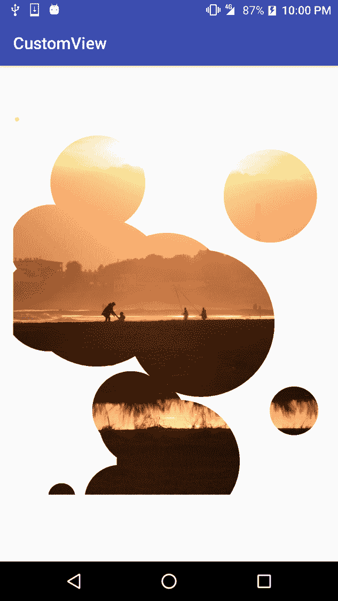

要查看此示例的完整源代码，请检查 GitHub 仓库中的`Example17-Paths`文件夹。

查看有关 Paths 的 Android 文档，我们可以看到有很多方法可以向`Path`添加基本图形，例如：

+   `addCircle()`

+   `addRect()`

+   `addRoundRect()`

+   `addPath()`

然而，我们不仅限于这些方法，我们还可以使用`lineTo`或`moveTo`方法添加线条或位移我们 path 的下一个元素的起始位置。如果我们想使用相对坐标，`Path`类为我们提供了`rLineTo`和`rMoveTo`方法，这些方法假设给定的坐标相对于`Path`的最后一个点。

有关`Path`及其方法的更多信息，请查看 Android 文档网站。我们可以使用`cubicTo`和`quadTo`方法来实现。贝塞尔曲线由控制点组成，这些控制点控制平滑曲线的形状。让我们构建一个快速示例，通过在用户每次点击屏幕时添加控制点。

首先，让我们定义两个`Paint`对象，一个用于贝塞尔线，另一个用于绘制控制点以供参考：

```kt
pathPaint = new Paint(); 
pathPaint.setStyle(Paint.Style.STROKE); 
pathPaint.setAntiAlias(true); 
pathPaint.setColor(0xffffffff); 
pathPaint.setStrokeWidth(5.f); 

pointsPaint = new Paint(); 
pointsPaint.setStyle(Paint.Style.STROKE); 
pointsPaint.setAntiAlias(true); 
pointsPaint.setColor(0xffff0000); 
pointsPaint.setStrokeCap(Paint.Cap.ROUND); 
pointsPaint.setStrokeWidth(40.f); 
```

控制点将以红色的圆点绘制，而贝塞尔线将以较细的白色线条绘制。在我们初始化对象时，也定义一个空的`Path`和浮点数数组来存储点：

```kt
points = new ArrayList<>(); 
path = new Path(); 
```

现在，让我们重写`onTouchEvent()`，以添加用户点击屏幕的位置，并通过调用 invalidate 方法触发我们自定义视图的重绘。

```kt
@Override 
public boolean onTouchEvent(MotionEvent event) { 
    if (event.getAction() == MotionEvent.ACTION_DOWN) { 
        points.add(event.getX()); 
        points.add(event.getY()); 

        invalidate(); 
    } 

    return super.onTouchEvent(event); 
} 
```

在我们的`onDraw()`方法中，首先检查是否已经有三个点。如果是这样，让我们向`Path`添加一个三次贝塞尔曲线：

```kt
while(points.size() - currentIndex >= 6) { 
    float x1 = points.get(currentIndex); 
    float y1 = points.get(currentIndex + 1); 

    float x2 = points.get(currentIndex + 2); 
    float y2 = points.get(currentIndex + 3); 

    float x3 = points.get(currentIndex + 4); 
    float y3 = points.get(currentIndex + 5); 

    if (currentIndex == 0) path.moveTo(x1, y1); 
    path.cubicTo(x1, y1, x2, y2, x3, y3); 
    currentIndex += 6; 
} 
```

`currentIndex`保持已插入到`Path`的点数组最后一个索引。

现在，让我们绘制`Path`和点：

```kt
canvas.drawColor(BACKGROUND_COLOR); 
canvas.drawPath(path, pathPaint); 

for (int i = 0; i < points.size() / 2; i++) { 
    float x = points.get(i * 2    ); 
    float y = points.get(i * 2 + 1); 
    canvas.drawPoint(x, y, pointsPaint); 
} 
```

让我们看看结果：

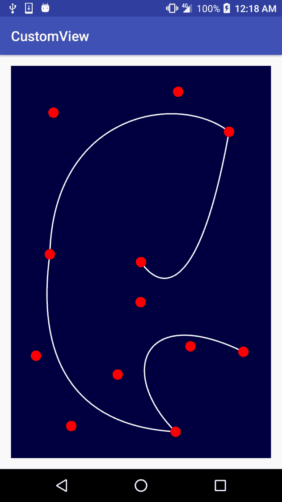

在 GitHub 仓库的`Example18-Paths`文件夹中查看此示例的完整源代码。

# 绘制文本

从`Canvas`操作的角度来看，文本可以被认为是一个基本元素，但我们将它单独放在这里，因为它非常重要。我们没有从最简单的例子开始，因为我们刚刚介绍了路径，我们将继续上一个例子，在`Path`顶部绘制文本。要绘制文本，我们将重用贝塞尔曲线的`Paint`对象，但我们将添加一些文本参数：

```kt
pathPaint.setTextSize(50.f); 
pathPaint.setTextAlign(Paint.Align.CENTER); 
```

这设置了文本的大小，并将文本对齐到`Path`的中心，这样每次我们添加新点时，文本位置都会适应保持居中。要绘制文本，我们只需调用`drawTextOnPath()`方法：

```kt
canvas.drawTextOnPath("Building Android UIs with Custom Views", path, 0, 0, pathPaint); 
```

这是我们代码中一个非常快速的增加，但如果我们执行我们的应用程序，我们可以看到文本覆盖在`Path`线条上的结果：

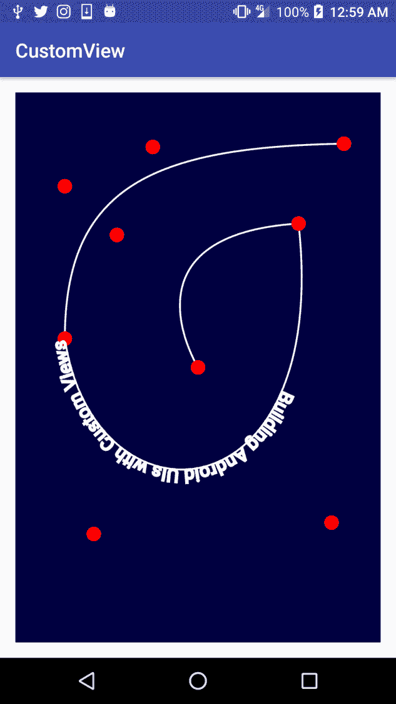

请记住，我们正在绘制之前绘制过的相同内容，但我们可以自由地使用`Path`作为文本的指导。无需绘制它或绘制控制点。

在 GitHub 仓库的`Example19-Text folder`中查看这个例子的完整源代码。

我们已经开始在路径上绘制文本，因为我们的例子几乎已经构建完成。然而，还有更简单的方法来绘制文本。例如，我们可以通过调用`canvas.drawText(String text, float x, float y, Paint paint)`或`canvas.drawText(char[] text, float x, float y, Paint paint)`在屏幕上的特定位置绘制文本。

这些方法只会完成它们的工作，但它们不会检查文本是否适合可用空间，而且绝对不会拆分和换行文本。要做到这一点，我们必须自己动手。`Paint`类为我们提供了测量文本和计算文本边界的方法。例如，我们创建了一个小助手方法，它返回`String`的宽度和高度：

```kt
private static final float[] getTextSize(String str, Paint paint) { 
    float[] out = new float[2]; 
    Rect boundaries = new Rect(); 
    paint.getTextBounds(str, 0, str.length(), boundaries); 

    out[0] = paint.measureText(str); 
    out[1] = boundaries.height(); 
    return out; 
} 
```

我们使用了文本边界来获取文本高度，但我们使用了`measureText()`方法来获取文本宽度。这两种方法在计算大小上有一些差异。尽管目前 Android 的官方文档网站上没有正确记录这一点，但在 Stack Overflow 上有一个关于这个问题的旧讨论：

[`stackoverflow.com/questions/7549182/android-paint-measuretext-vs-gettextbounds`](http://stackoverflow.com/questions/7549182/android-paint-measuretext-vs-gettextbounds)。

然而，我们不应该实现自己的文本拆分方法。如果我们想要绘制大段文本，并且我们知道它可能需要拆分和换行，我们可以使用`StaticLayout`类。在这个例子中，我们将创建一个宽度为视图宽度一半的`StaticLayout`。

我们可以在我们的`onLayout()`方法中实现它：

```kt
@Override 
protected void onLayout(boolean changed, int left, int top, int right, int bottom) { 
    super.onLayout(changed, left, top, right, bottom); 

    // create a layout of half the width of the View 
    if (layout == null) { 
        layout = new StaticLayout( 
                LONG_TEXT, 
                0, 
                LONG_TEXT.length(), 
                paint, 
                (right - left) / 2, 
                Layout.Alignment.ALIGN_NORMAL, 
                1.f, 
                1.f, 
                true); 
    } 
} 
```

在我们的`onDraw()`方法中，我们将它绘制在屏幕中心。我们知道，布局宽度是视图宽度的一半；我们知道我们需要将其位移到宽度的四分之一处。

```kt
@Override 
protected void onDraw(Canvas canvas) { 
    canvas.drawColor(BACKGROUND_COLOR); 

    canvas.save(); 
    // center the layout on the View 
    canvas.translate(canvas.getWidth()/4, 0); 
    layout.draw(canvas); 
    canvas.restore(); 
} 
```

这是结果：

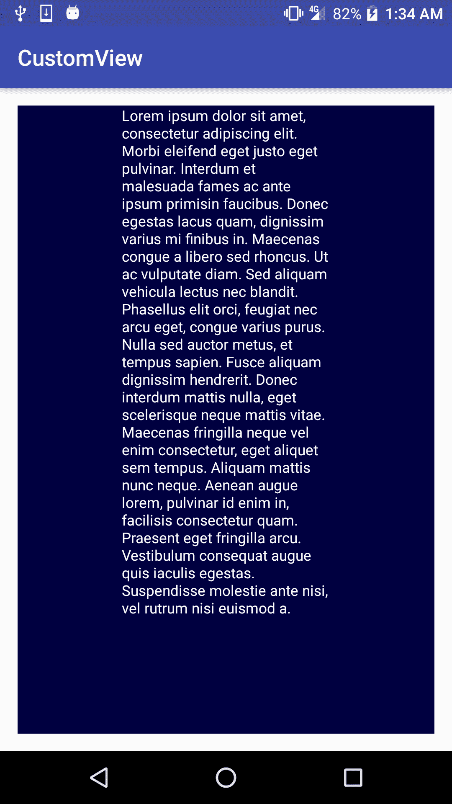

在 GitHub 仓库的`Example20-Text`文件夹中查看这个示例的完整源代码。

# 变换和操作

在我们的自定义视图上，我们已经使用了一些`canvas`变换，但让我们重新审视我们可以使用的`Canvas`操作。首先，让我们看看如何连接这些变换。一旦我们使用了变换，我们使用的任何其他变换都会被连接或应用在我们之前的操作之上。为了避免这种行为，我们必须调用我们之前也使用过的`save()`和`restore()`方法。为了了解变换是如何层层叠加的，让我们创建一个简单的示例。

首先，在我们构造函数中创建一个`paint`对象：

```kt
public PrimitiveDrawer(Context context, AttributeSet attributeSet) { 
    super(context, attributeSet); 

    paint = new Paint(); 
    paint.setStyle(Paint.Style.STROKE); 
    paint.setAntiAlias(true); 
    paint.setColor(0xffffffff); 
} 
```

现在，让我们在`onLayout()`方法中根据屏幕大小计算矩形尺寸：

```kt
@Override 
 protected void onLayout(boolean changed, int left, int top, int right,
 int bottom) { 
     super.onLayout(changed, left, top, right, bottom); 

     int smallerDimension = (right - left); 
     if (bottom - top < smallerDimension) smallerDimension = bottom -
     top; 

     rectSize = smallerDimension / 10; 
     timeStart = System.currentTimeMillis(); 
} 
```

我们还存储了开始时间，稍后我们将使用它进行快速简单的动画。现在，我们准备实现`onDraw()`方法：

```kt
@Override 
protected void onDraw(Canvas canvas) { 
    float angle = (System.currentTimeMillis() - timeStart) / 100.f; 

    canvas.drawColor(BACKGROUND_COLOR); 

    canvas.save(); 
    canvas.translate(canvas.getWidth() / 2, canvas.getHeight() / 2); 

    for (int i = 0; i < 15; i++) { 
        canvas.rotate(angle); 
        canvas.drawRect(-rectSize / 2, -rectSize / 2, rectSize / 2,
        rectSize / 2, paint); 
        canvas.scale(1.2f, 1.2f); 
    } 

    canvas.restore(); 
    invalidate(); 
} 
```

我们首先根据自开始以来经过的时间计算了`angle`。动画应该总是基于时间，而不是基于绘制的帧数。

然后，我们绘制背景，通过调用`canvas.save()`保存`canvas`状态，并进行平移到屏幕中心。我们将所有的变换和绘制都基于中心，而不是左上角。

在这个示例中，我们将绘制 15 个矩形，每个矩形都会逐渐旋转和缩放。由于变换是层层叠加的，因此在一个简单的`for()`循环中很容易实现。重要的是要从`-rectSize / 2`绘制到`rectSize / 2`，而不是从`0`到`rectSize`；否则，它将从一个角度旋转。

修改我们绘制矩形的代码行，改为`canvas.drawRect(0, 0, rectSize, rectSize, paint)`，看看会发生什么。

然而，这种方法有一个替代方案：我们可以在变换中使用枢轴点。`rotate()`和`scale()`方法都支持两个额外的`float`参数，它们是枢轴点的坐标。如果我们查看`scale(float sx, float sy, float px, float py)`的源代码实现，我们可以看到它只是应用了一个平移，调用了简单的缩放方法，然后应用了相反的平移：

```kt
public final void scale(float sx, float sy, float px, float py) { 
    translate(px, py); 
    scale(sx, sy);
    translate(-px, -py); 
} 
```

使用这种方法，我们可以以另一种方式实现`onDraw()`方法：

```kt
@Override 
protected void onDraw(Canvas canvas) { 
    float angle = (System.currentTimeMillis() - timeStart) / 100.f; 

    canvas.drawColor(BACKGROUND_COLOR); 

    canvas.save(); 
    canvas.translate(canvas.getWidth() / 2, 
                     canvas.getHeight() / 2); 

    for (int i = 0; i < 15; i++) { 
        canvas.rotate(angle, rectSize / 2, rectSize / 2); 
        canvas.drawRect(0, 0, rectSize, rectSize, paint); 
        canvas.scale(1.2f, 1.2f, rectSize / 2, rectSize / 2); 
    } 

    canvas.restore(); 
    invalidate(); 
} 
```

查看以下截图，了解矩形的连接方式：

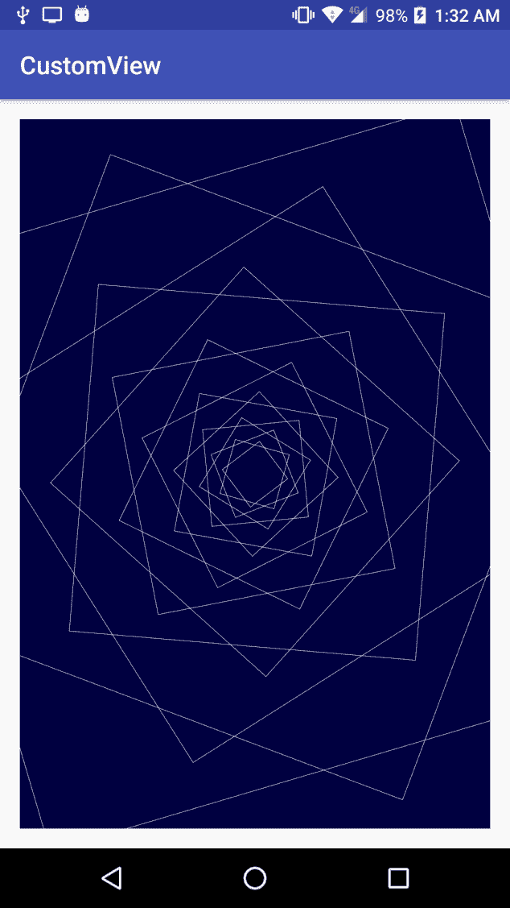

此外，这个完整示例的源代码可以在 GitHub 仓库的`Example21-Transformations`文件夹中找到。

我们已经了解了一些关于矩阵的基本操作，比如`scale()`、`rotate()`和`translate()`，但`canvas`为我们提供了更多附加方法：

+   `skew`：这应用一个斜切变换。

+   `setMatrix`：这让我们计算一个变换矩阵，并直接将其设置到我们的`canvas`中。

+   `concat`：这类似于前面的情况。我们可以将任何矩阵与当前矩阵进行拼接。

# 将它们全部组合在一起

到目前为止，我们已经看到了许多不同的绘图原语、剪辑操作和矩阵变换，但最有趣的部分是我们将它们全部组合在一起的时候。为了构建出色的自定义视图，我们必须使用许多不同类型的操作和变换。

然而，拥有如此多的操作是一个双刃剑。在向自定义视图添加这种复杂性时，我们必须小心，因为很容易损害性能。我们应该检查是否应用了过多的或不必要的剪辑操作，或者是否没有足够优化，或者没有最大化剪辑和变换操作的重用。在这种情况下，我们甚至可以使用`canvas`对象的`quickReject()`方法快速丢弃将落在剪辑区域外的区域。

同时，我们需要跟踪我们对`canvas`执行的所有`save()`和`restore()`。执行额外的`restore()`方法，不仅意味着我们的代码存在问题，实际上它是一个错误。如果我们需要改变到不同的先前保存的状态，我们可以使用`restoreToCount()`方法，并结合保存状态编号的调用来保存状态。

正如我们之前提到的，并在后续章节中会再次提到，避免在`onDraw()`方法中分配内存或创建对象的新实例；特别是如果你认为需要在`onDraw()`内部创建一个新的`paint`对象实例时，请记住这一点。重用`paint`对象或在类构造函数中初始化它们。

# 总结

在本章中，我们了解了如何绘制更复杂的图形原语，变换它们，并在绘制自定义视图时使用剪辑操作。大多数情况下，这些原语本身并不能为我们提供太多价值，但我们还看到了许多快速示例，展示了如何将它们组合在一起创建有用的东西。我们没有涵盖所有可能的方法、操作或变换，因为这将包含大量信息并且可能不实用；它可能会像是阅读一本语言字典。要了解所有可能的方法和绘图原语，请持续查看开发者的 Android 文档，并关注每个新版本的 Android 的发行说明，以了解新增内容。

在下一章中，我们将了解如何使用 OpenGL ES 为自定义视图添加 3D 渲染。
