# 第五章：引入 3D 自定义视图

在前面的章节中，我们已经了解了如何使用安卓 2D 图形库实现自定义视图。这是我们最常用的方法，但在某些情况下，由于额外的渲染特性或自定义视图的需求，我们可能需要更多的性能。在这些情况下，我们可能会使用**嵌入式系统 OpenGL**（**OpenGL ES**），并在我们的视图中启用 3D 渲染操作。

在本章中，我们将了解如何在自定义视图中使用 OpenGL ES，并展示一个实际示例，说明我们如何构建一个。更详细地说，我们将涵盖以下主题：

+   OpenGL ES 简介

+   绘制几何体

+   加载外部几何体

# OpenGL ES 简介

安卓支持 OpenGL ES 进行 3D 渲染。OpenGL ES 是桌面**OpenGL API**实现的一个子集。**开放图形库**（**OpenGL**）本身是一个非常流行的跨平台 API，用于渲染 2D 和 3D 图形。

使用 OpenGL ES 来渲染我们的自定义视图比标准的安卓画布绘制原语要稍微复杂一些，正如我们将在本章中看到的，它需要与常识一起使用，并不总是最佳方法。

有关 OpenGL ES 的任何额外信息，请参考 Khronos 集团的官方文档：

[Khronos 集团的 OpenGL ES 官方文档](https://www.khronos.org/opengles/).

# 在安卓中开始使用 OpenGL ES

创建一个支持 3D 的自定义视图非常简单。我们可以通过简单地扩展`GLSurfaceView`而不是仅从`View`类扩展来实现。复杂性在于渲染部分，但让我们一步一步来。首先，我们将创建一个名为`GLDrawer`的类并将其添加到我们的项目中：

```kt
package com.packt.rrafols.draw; 

import android.content.Context; 
import android.opengl.GLSurfaceView; 
import android.util.AttributeSet; 

public class GLDrawer extends GLSurfaceView { 
    private GLRenderer glRenderer; 

    public GLDrawer(Context context, AttributeSet attributeSet) { 
        super(context, attributeSet); 
    } 
} 
```

与我们之前的示例一样，我们使用`AttributeSet`创建了构造函数，因此我们可以从 XML 布局文件中充气并设置参数（如果需要的话）。

我们可能会认为 OpenGL ES 只用于全屏游戏，但它也可以用于非全屏视图，甚至可以在`ViewGroups`或`ScrollView`内部使用。

为了观察其行为，让我们将其添加到两个`TextView`之间的`layout`文件中：

```kt
<?xml version="1.0" encoding="utf-8"?> 
<LinearLayout  

    android:id="@+id/activity_main" 
    android:layout_width="match_parent" 
    android:layout_height="match_parent" 
    android:orientation="vertical" 
    android:padding="@dimen/activity_vertical_margin" 
    tools:context="com.packt.rrafols.draw.MainActivity"> 

<TextView 
        android:layout_width="match_parent" 
        android:layout_height="100dp" 
        android:background="@android:color/background_light" 
        android:gravity="center_vertical|center_horizontal" 
        android:text="@string/filler_text"/> 

<com.packt.rrafols.draw.GLDrawer 
        android:layout_width="match_parent" 
        android:layout_height="100dp"/> 

<TextView 
        android:layout_width="match_parent" 
        android:layout_height="100dp" 
        android:background="@android:color/background_light" 
        android:gravity="center_vertical|center_horizontal" 
        android:text="@string/filler_text"/> 
</LinearLayout> 
```

在我们的`GLDrawer`类可以工作之前，我们需要进行一个额外的步骤。我们必须创建一个`GLSurfaceView.Renderer`对象来处理所有的渲染工作，并通过使用`setRenderer()`方法将其设置到视图中。当我们设置这个渲染器时，`GLSurfaceView`将额外创建一个新线程来管理视图的绘制周期。让我们在`GLDrawer`类文件的末尾添加一个`GLRenderer`类：

```kt
class GLRenderer implements GLSurfaceView.Renderer { 
    @Override 
    public void onSurfaceCreated(GL10 gl, EGLConfig config) { 

    } 

    @Override 
    public void onSurfaceChanged(GL10 gl, int width, int height) { 

    } 

    @Override 
    public void onDrawFrame(GL10 gl) { 
        gl.glClearColor(1.f, 0.f, 0.f, 1.f); 
        gl.glClear(GL10.GL_COLOR_BUFFER_BIT); 
    } 
} 
```

`glClearColor()`方法告诉 OpenGL 我们希望从屏幕上清除哪种颜色。我们设置了四个分量：红色、绿色、蓝色和 alpha，以浮点格式表示，范围从`0`到`1`。`glClear()`是实际清除屏幕的方法。由于 OpenGL 还可以清除其他几个缓冲区，如果我们设置了`GL_COLOR_BUFFER_BIT`标志，它才会清除屏幕。现在我们已经介绍了一些 OpenGL 函数，让我们创建一个`GLRenderer`实例变量，并在类构造函数中初始化它：

```kt
private GLRenderer glRenderer;
public GLDrawer(Context context, AttributeSet attributeSet) { 
    super(context, attributeSet); 
    glRenderer = new GLRenderer()
    setRenderer(glRenderer);
} 
```

实现一个`GLSurfaceView.Renderer`类时，我们必须重写以下三个方法或回调：

+   `onSurfaceCreated()`: 每当 Android 需要创建 OpenGL 上下文时，都会调用此方法——例如，在首次创建渲染线程时，或者每次 OpenGL 上下文丢失时。当应用程序进入后台时，上下文可能会丢失。这个回调是放置所有依赖于 OpenGL 上下文的初始化代码的理想方法。

+   `onSurfaceChanged()`: 当视图大小发生变化时，将调用此方法。在第一次创建表面时也会被调用。

+   `onDrawFrame()`: 此方法是负责实际绘制的内容，并且每次需要绘制视图时都会被调用。

在我们的示例中，我们留下了`onSurfaceCreated()`和`onSurfaceChanged()`方法为空，因为此时我们只关注绘制实心背景以检查是否一切正常工作，而且我们暂时还不需要视图的大小。

如果我们运行这个示例，我们将看到两个`TextView`和带有红色背景的自定义视图：

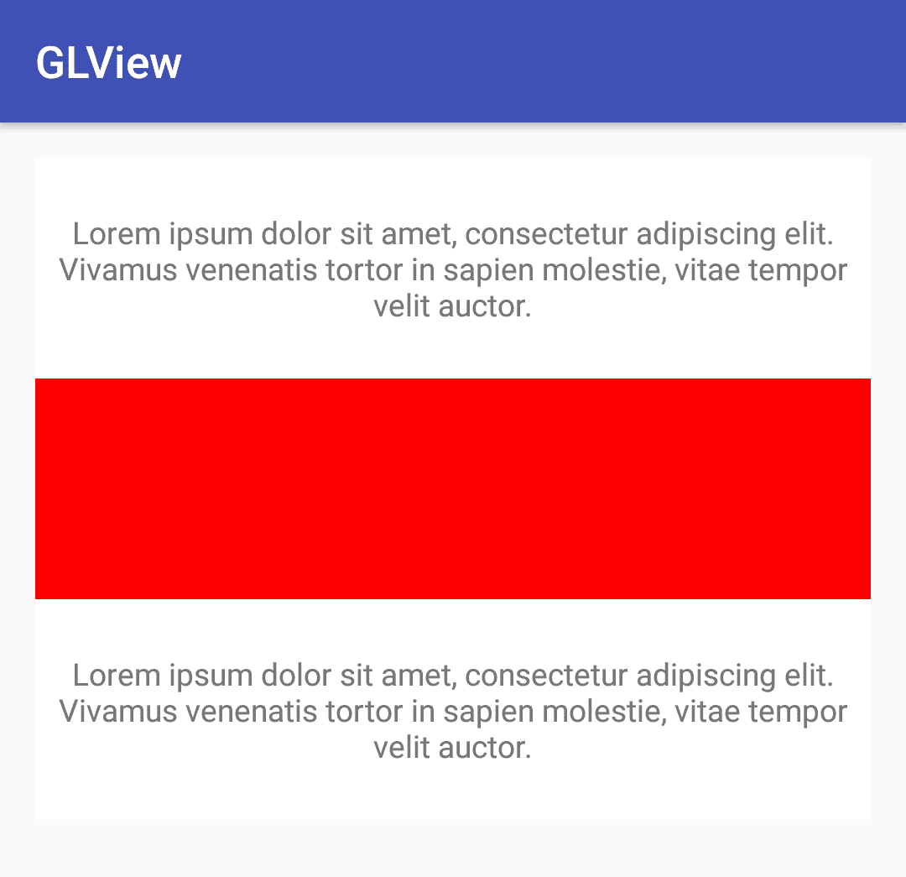

如果我们在`onDrawFrame()`方法中设置断点或打印日志，我们将看到视图在不断地重绘。这种行为与普通视图不同，因为渲染线程会不断调用`onDrawFrame()`方法。通过调用设置渲染器对象后的`setRender()`方法，可以修改这种行为。如果我们在此之前调用它，应用程序将会崩溃。有两种渲染模式：

+   `setRenderMode`(`RENDERMODE_CONTINUOUSLY`): 这是默认行为。渲染器将不断被调用以渲染视图。

+   `setRenderMode`(`RENDERMODE_WHEN_DIRTY`): 可以设置此选项以避免视图的连续重绘。我们不需要调用 invalidate，而必须调用`requestRender`来请求视图的新渲染。

# 绘制基本几何图形

我们已经初始化了视图并绘制了一个实心的红色背景。接下来让我们绘制一些更有趣的内容。在以下示例中，我们将关注 OpenGL ES 2.0，因为它自 Android 2.2 或 API 级别 8 起就已经可用，而且解释如何在 OpenGL ES 1.1 中实现它并没有太大意义。然而，如果你想了解更多，GitHub 上有些将旧的 NeHe OpenGL ES 教程移植到 Android 的项目：

[`github.com/nea/nehe-android-ports`](https://github.com/nea/nehe-android-ports)。

OpenGLES 1.1 和 OpenGL ES 2.0 的代码是不兼容的，因为 OpenGL ES 1.1 的代码基于固定功能管线，你需要指定几何体、灯光等，而 OpenGL ES 2.0 基于可编程管线，由顶点和片段着色器处理。

首先，由于我们需要 OpenGL ES 2.0，应该在清单文件中添加一个`uses-feature`配置行，这样 Google Play 就不会将应用程序展示给不兼容的设备：

```kt
<application> 
    .... 
<uses-feature android:glEsVersion="0x00020000" android:required="true" /> 
    ... 
</application> 
```

如果我们使用 OpenGL ES3.0 的特定 API，我们应该将要求更改为`android:glEsVersion="0x00030000"`，以便 Google Play 相应地进行筛选。

完成这一步后，我们可以开始绘制更多形状和几何体。但在设置渲染器之前，我们应该将渲染器上下文设置为`2`，以便创建一个 OpenGL ES 2.0 上下文。我们可以通过修改`GLDrawer`类的构造函数轻松实现这一点：

```kt
public GLDrawer(Context context, AttributeSet attributeSet) { 
    super(context, attributeSet); 
    setEGLContextClientVersion(2);
    glRenderer = new GLRenderer(); 
    setRenderer(glRenderer); 
} 
```

现在我们一步一步来学习如何在屏幕上画一个矩形。如果你熟悉 OpenGL ES 1.1 但不熟悉 OpenGL ES 2.0，你会发现这里需要多做一点工作，但最终，我们将从 OpenGL ES 2.0 的额外灵活性和强大功能中受益。

我们将从定义一个以位置`0, 0, 0`为中心的矩形或四边形的坐标数组开始：

```kt
private float quadCoords[] = { 
    -1.f, -1.f, 0.0f, 
    -1.f,  1.f, 0.0f, 
     1.f,  1.f, 0.0f, 
     1.f, -1.f, 0.0f 
 }; 
```

我们要画三角形，因此需要定义它们的顶点索引：

```kt
private short[] index = { 
    0, 1, 2, 
    0, 2, 3 
}; 
```

要理解这些索引背后的逻辑，如何将它们映射到我们之前定义的顶点索引，以及如何使用两个三角形来绘制一个四边形，请看以下图表：

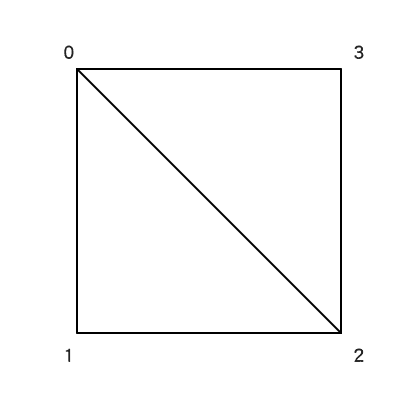

如果我们画一个顶点为`0`、`1`和`2`的三角形，再画一个顶点为`0`、`2`和`3`的三角形，最终我们会得到一个四边形。

在使用 OpenGL ES 时，我们需要使用`Buffer`或其子类来提供数据，因此让我们将这些数组转换为`Buffer`：

```kt
ByteBuffer vbb = ByteBuffer.allocateDirect(quadCoords.length * (Float.SIZE / 8)); 
vbb.order(ByteOrder.nativeOrder()); 

vertexBuffer = vbb.asFloatBuffer(); 
vertexBuffer.put(quadCoords); 
vertexBuffer.position(0); 
```

首先，我们需要为`Buffer`分配所需的空间。由于我们知道数组的大小，这会非常简单：只需将其乘以浮点数的大小（以字节为单位）。一个浮点数正好是四个字节，但我们也可以通过获取位数（使用`Float.SIZE`）并除以`8`来计算。在 Java 8 中，有一个名为`Float.BYTES`的新常量，它正好返回以字节为单位的大小。

我们需要指出，我们放入数据的`Buffer`将具有平台的本地字节序。我们可以通过在`Buffer`上调用`order()`方法，并以`ByteOrder.nativeOrder()`作为参数来实现这一点。完成这一步后，我们可以通过调用`Buffer.asFloatBuffer()`将其转换为浮点缓冲区，并设置数据。最后，我们将`Buffer`的位置重置为开始位置，即设置为`0`。

我们必须为顶点以及索引执行这个过程。由于索引作为短整数存储，我们在转换缓冲区以及计算大小时需要考虑这一点。

```kt
ByteBuffer ibb = ByteBuffer.allocateDirect(index.length * (Short.SIZE / 8)); 
ibb.order(ByteOrder.nativeOrder()); 

indexBuffer = ibb.asShortBuffer(); 
indexBuffer.put(index); 
indexBuffer.position(0); 
```

如前所述，OpenGL ES 2.0 渲染管线由顶点和片段`shader`处理。让我们创建一个辅助方法来加载和编译`shader`代码：

```kt
// Source: 
// https://developer.android.com/training/graphics/opengl/draw.html 
public static int loadShader(int type, String shaderCode){ 

    // create a vertex shader type (GLES20.GL_VERTEX_SHADER) 
    // or a fragment shader type (GLES20.GL_FRAGMENT_SHADER) 
    int shader = GLES20.glCreateShader(type); 

    // add the source code to the shader and compile it 
    GLES20.glShaderSource(shader, shaderCode); 
    GLES20.glCompileShader(shader); 

    return shader; 
} 
```

使用这个新方法，我们可以加载顶点和片段`shaders`：

```kt
private void initShaders() { 
    int vertexShader = loadShader(GLES20.GL_VERTEX_SHADER, vertexShaderCode); 
    int fragmentShader = loadShader(GLES20.GL_FRAGMENT_SHADER, fragmentShaderCode); 

    shaderProgram = GLES20.glCreateProgram(); 
    GLES20.glAttachShader(shaderProgram, vertexShader); 
    GLES20.glAttachShader(shaderProgram, fragmentShader); 
    GLES20.glLinkProgram(shaderProgram); 
} 
```

目前，让我们使用来自 Android 开发者 OpenGL 培训网站的默认`shaders`。

`vertexShader`如下所示：

```kt
// Source: 
// https://developer.android.com/training/graphics/opengl/draw.html 
private final String vertexShaderCode = 
        // This matrix member variable provides a hook to manipulate 
        // the coordinates of the objects that use this vertex shader 
"uniform mat4 uMVPMatrix;" + 
"attribute vec4 vPosition;" + 
"void main() {" + 
        // The matrix must be included as a modifier of gl_Position. 
        // Note that the uMVPMatrix factor *must be first* in order 
        // for the matrix multiplication product to be correct. 
"  gl_Position = uMVPMatrix * vPosition;" + 
"}"; 
```

`fragmentShader`如下所示：

```kt
private final String fragmentShaderCode = 
"precision mediump float;" + 
"uniform vec4 vColor;" + 
"void main() {" + 
"  gl_FragColor = vColor;" + 
"}"; 
```

在我们的`vertexShader`中添加了矩阵乘法，因此我们可以通过更新`uMVPMatrix`来修改顶点的位置。让我们添加一个投影和一些变换，以便实现基本的渲染。

我们不应该忘记`onSurfaceChanged()`回调；让我们使用它来设置我们的投影矩阵，并定义相机的裁剪平面，考虑到屏幕的宽度和高度以保持其长宽比：

```kt
@Override 
public void onSurfaceChanged(GL10 unused, int width, int height) { 
    GLES20.glViewport(0, 0, width, height); 

    float ratio = (float) width / height; 
    Matrix.frustumM(mProjectionMatrix, 0, -ratio * 2, ratio * 2, -2, 2,
    3, 7); 
} 
```

让我们通过使用`Matrix.setLookAtM()`计算视图矩阵，并将其与我们刚刚在`mProjectionMatrix`上计算出的投影矩阵相乘：

```kt
@Override 
public void onDrawFrame(GL10 unused) { 

    ... 

    Matrix.multiplyMM(mMVPMatrix, 0, mProjectionMatrix, 0, mViewMatrix,
    0); 

    int mMVPMatrixHandle = GLES20.glGetUniformLocation(shaderProgram,
    "uMVPMatrix"); 
    GLES20.glUniformMatrix4fv(mMVPMatrixHandle, 1, false, mMVPMatrix,
    0); 

    ... 

} 
```

在前面的代码中，我们还看到了如何更新一个可以从`shader`中读取的变量。为此，我们首先需要获取统一变量的句柄。通过使用`GLES20.glGetUniformLocation(shaderProgram, "uMVPMatrix")`我们可以得到`uMVPMatrix`统一变量的句柄，并在`GLES20.glUniformMatrix4fv`调用中使用这个句柄，我们可以将刚刚计算出的矩阵设置到它上面。如果我们检查`shader`的代码，可以看到我们定义了`uMVPMatrix`为统一变量：

```kt
uniform mat4 uMVPMatrix; 
```

既然我们知道如何设置一个统一变量，那么对于颜色我们也做同样的处理。在片段`shader`中，我们将`vColor`也设置为统一变量，因此我们可以使用同样的方法来设置它：

```kt
float color[] = { 0.2f, 0.2f, 0.9f, 1.0f }; 

... 

int colorHandle = GLES20.glGetUniformLocation(shaderProgram, "vColor"); 
GLES20.glUniform4fv(colorHandle, 1, color, 0); 
```

使用同样的机制，但将`glGetUniformLocation`更改为`glGetAttribLocation`，我们也可以设置顶点坐标：

```kt
int positionHandle = GLES20.glGetAttribLocation(shaderProgram, "vPosition"); 

GLES20.glVertexAttribPointer(positionHandle, 3, 
        GLES20.GL_FLOAT, false, 
        3 * 4, vertexBuffer); 
```

我们已经准备好将其绘制到屏幕上；我们只需要启用顶点属性数组，因为我们已经使用`glVertexAttribPointer()`调用和`glDrawElements()`只绘制启用的数组：

```kt
GLES20.glEnableVertexAttribArray(positionHandle); 

GLES20.glDrawElements( 
       GLES20.GL_TRIANGLES, index.length, 
       GLES20.GL_UNSIGNED_SHORT, indexBuffer); 

GLES20.glDisableVertexAttribArray(positionHandle); 
```

在 OpenGL 上绘制几何体的方法有很多，但我们使用了指向之前创建的面索引缓冲区的`glDrawElements()`调用。这里我们使用了`GL_TRIANGLES`图元，但还有许多其他的 OpenGL 图元可以使用。更多信息请查看 Khronos 官方文档关于`glDrawElements()`的部分：

[`www.khronos.org/registry/OpenGL-Refpages/gl4/html/glDrawElements.xhtml`](https://www.khronos.org/registry/OpenGL-Refpages/gl4/html/glDrawElements.xhtml)。

同时，作为良好的实践，并在绘制后恢复 OpenGL 机器状态，我们禁用了顶点属性数组。

如果我们执行这段代码，我们将得到以下结果——虽然还不是很有用，但这是一个开始！

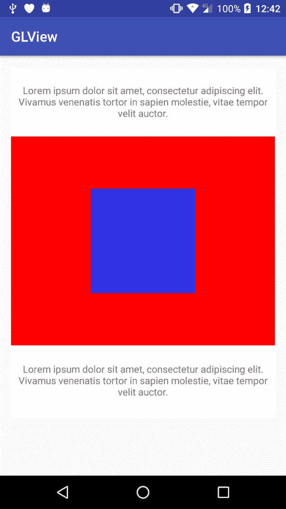

在 GitHub 仓库中查看`Example23-GLSurfaceView`以获取完整的示例源代码。

# 绘制几何体

到目前为止，我们已经了解了如何设置 OpenGL 渲染器并绘制一些非常基础的几何图形。但是，正如你所想象的，我们可以利用 OpenGL 做更多的事情。在本节中，我们将了解如何进行一些更复杂的操作以及如何加载使用外部工具定义的几何图形。有时，使用代码定义几何图形可能很有用，但大多数时候，尤其是如果几何图形非常复杂，它将通过 3D 建模工具设计和创建。知道如何导入这些几何图形对我们项目肯定非常有帮助。

# 添加体积

在上一个例子中，我们已经了解了如何用单一颜色绘制四边形，但如果是每个顶点都有完全不同的颜色呢？这个过程与我们已经做的不会有很大不同，但让我们看看如何实现它。

首先，让我们改变颜色数组，使其包含四个顶点的颜色：

```kt
float color[] = { 
        1.0f, 0.2f, 0.2f, 1.0f, 
        0.2f, 1.0f, 0.2f, 1.0f, 
        0.2f, 0.2f, 1.0f, 1.0f, 
        1.0f, 1.0f, 1.0f, 1.0f, 
}; 
```

现在，在我们的`initBuffers()`方法中，我们来初始化一个额外的`Buffer`来存储颜色：

```kt
private FloatBuffer colorBuffer; 

... 

ByteBuffer cbb = ByteBuffer.allocateDirect(color.length * (Float.SIZE / 8)); 
cbb.order(ByteOrder.nativeOrder()); 

colorBuffer = cbb.asFloatBuffer(); 
colorBuffer.put(color); 
colorBuffer.position(0); 
```

我们还必须更新我们的`shaders`以考虑颜色参数。首先，在我们的`vertexShader`中，我们必须创建一个新的属性，我们将其称为`aColor`，以保存每个顶点的颜色：

```kt
private final String vertexShaderCode = 
"uniform mat4 uMVPMatrix;" + 
"attribute vec4 vPosition;" + 
"attribute vec4 aColor;" + 
"varying vec4 vColor;" + 
"void main() {" + 
"  gl_Position = uMVPMatrix * vPosition;" + 
"  vColor = aColor;" + 
"}"; 
```

然后，我们定义一个可变的`vColor`变量，该变量将传递给`fragmentShader`，而`fragmentShader`将计算每个片段的值。让我们看看`fragmentShader`上的变化：

```kt
private final String fragmentShaderCode = 
"precision mediump float;" + 
"varying vec4 vColor;" + 
"void main() {" + 
"  gl_FragColor = vColor;" + 
"}"; 
```

我们唯一改变的是`vColor`的声明；它不再是统一变量，现在是一个`varying`变量。

就像我们对顶点和面索引所做的那样，我们必须将颜色数据设置到`shader`中：

```kt
int colorHandle = GLES20.glGetAttribLocation(shaderProgram, "aColor"); 
GLES20.glVertexAttribPointer(colorHandle, 4, 
        GLES20.GL_FLOAT, false, 
        4 * 4, colorBuffer); 
```

在绘制之前，我们必须启用和禁用顶点数组。如果颜色数组没有被启用，我们将得到一个黑色的正方形，因为`glDrawElements()`将无法获取颜色信息；

```kt
GLES20.glEnableVertexAttribArray(colorHandle); 
GLES20.glEnableVertexAttribArray(positionHandle); 
GLES20.glDrawElements( 
        GLES20.GL_TRIANGLES, index.length, 
        GLES20.GL_UNSIGNED_SHORT, indexBuffer); 

GLES20.glDisableVertexAttribArray(positionHandle); 
GLES20.glDisableVertexAttribArray(colorHandle); 
```

如果我们运行这个例子，我们会看到与上一个例子相似的效果，但我们可以看到颜色是如何在顶点之间插值的：

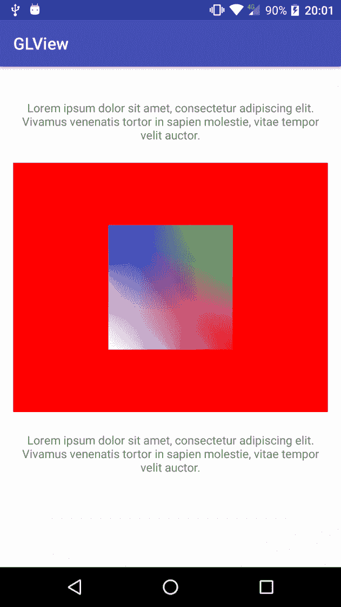

既然我们知道如何插值颜色，让我们在几何体中增加一些深度。到目前为止，我们所绘制的所有内容都非常平坦，所以让我们将四边形转换为立方体。这非常简单。首先定义顶点和新的面索引：

```kt
private float quadCoords[] = { 
       -1.f, -1.f, -1.0f, 
       -1.f,  1.f, -1.0f, 
        1.f,  1.f, -1.0f, 
        1.f, -1.f, -1.0f, 

       -1.f, -1.f,  1.0f, 
       -1.f,  1.f,  1.0f, 
        1.f,  1.f,  1.0f, 
        1.f, -1.f,  1.0f 
}; 
```

我们复制了之前相同的四个顶点，但是位移了*Z*坐标，这将给立方体增加体积。

现在，我们必须创建新的面索引。立方体有六个面，或者说四边形，可以用十二个三角形来复制：

```kt
private short[] index = { 
        0, 1, 2,        // front 
        0, 2, 3,        // front 
        4, 5, 6,        // back 
        4, 6, 7,        // back 
        0, 4, 7,        // top 
        0, 3, 7,        // top 
        1, 5, 6,        // bottom 
        1, 2, 6,        // bottom 
        0, 4, 5,        // left 
        0, 1, 5,        // left 
        3, 7, 6,        // right 
        3, 2, 6         // right 
}; 
```

同时为新的四个顶点添加新颜色：

```kt
float color[] = { 
        1.0f, 0.2f, 0.2f, 1.0f, 
        0.2f, 1.0f, 0.2f, 1.0f, 
        0.2f, 0.2f, 1.0f, 1.0f, 
        1.0f, 1.0f, 1.0f, 1.0f, 

        1.0f, 1.0f, 0.2f, 1.0f, 
        0.2f, 1.0f, 1.0f, 1.0f, 
        1.0f, 0.2f, 1.0f, 1.0f, 
        0.2f, 0.2f, 0.2f, 1.0f 
}; 
```

如果我们按原样执行这个例子，我们会得到一个类似以下截图的奇怪结果：

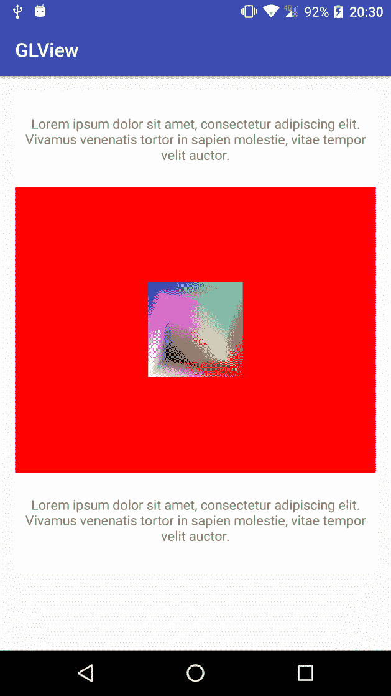

让我们给`mMVPMatrix`矩阵添加一个旋转变换，看看会发生什么。

我们必须定义一个私有变量来保存旋转角度，并将旋转应用到`mMVPMatrix`中：

```kt
private float angle = 0.f; 
... 
Matrix.setLookAtM(mViewMatrix, 0, 
        0, 0, -4, 
        0f, 0f, 0f, 
        0f, 1.0f, 0.0f); 

Matrix.multiplyMM(mMVPMatrix, 0, mProjectionMatrix, 0, mViewMatrix, 0); Matrix.rotateM(mMVPMatrix, 0, angle, 1.f, 1.f, 1.f);
```

在这个例子中，为了观察正在发生的事情，我们将旋转应用到三个轴：*x*、*y*和*z*。我们还稍微将相机从上一个示例中的位置移开，因为如果我们不这样做，现在可能会有一些剪辑。

为了定义我们必须旋转的角度，我们将使用一个 Android 定时器：

```kt
private long startTime; 
... 
@Override 
public void onSurfaceCreated(GL10 unused, EGLConfig config) { 
    initBuffers(); 
    initShaders(); 
    startTime = SystemClock.elapsedRealtime();
} 
```

我们在`startTime`变量上存储开始时间，在我们的`onDrawFrame()`方法中，我们根据自这一刻起经过的时间计算角度：

```kt
angle = ((float) SystemClock.elapsedRealtime() - startTime) * 0.02f; 
```

在这里，我们只是将其乘以`0.02f`以限制旋转速度，否则它会太快。这样做，动画速度将不受渲染帧率或 CPU 速度的影响，在所有设备上都是相同的。现在，如果我们运行这段代码，我们将看到我们遇到的问题的来源：

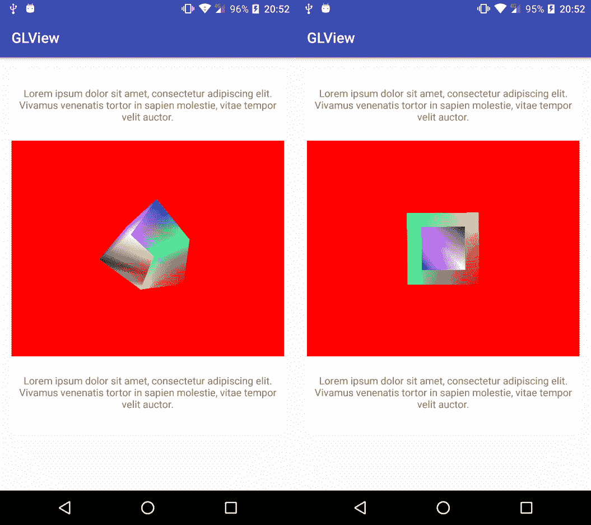

问题在于，OpenGL 在绘制所有三角形时没有检查像素的 z 坐标，因此可能会出现一些重叠和过度绘制，正如我们从前面的屏幕截图中轻易看到的那样。幸运的是，这个问题很容易解决。OpenGL 有一个状态，我们可以用它来启用和禁用深度（z）测试：

```kt
GLES20.glEnable(GLES20.GL_DEPTH_TEST);
GLES20.glEnableVertexAttribArray(colorHandle); 
GLES20.glEnableVertexAttribArray(positionHandle); 
GLES20.glDrawElements( 
        GLES20.GL_TRIANGLES, index.length, 
        GLES20.GL_UNSIGNED_SHORT, indexBuffer); 

GLES20.glDisableVertexAttribArray(positionHandle); 
GLES20.glDisableVertexAttribArray(colorHandle); GLES20.glDisable(GLES20.GL_DEPTH_TEST);
```

与上一个示例一样，在绘制之后，我们禁用我们启用的状态，以避免为任何其他绘图操作留下未知的 OpenGL 状态。如果我们运行这段代码，我们将看到差异：

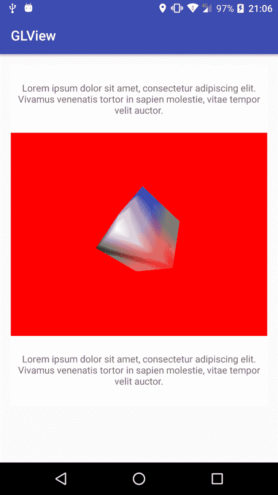

在 GitHub 仓库中查看`Example24-GLDrawing`以获取完整的示例源代码。

# 添加纹理

让我们继续做更有趣的事情！我们已经看到了如何为每个顶点添加颜色，但现在让我们看看如果我们想为 3D 对象添加一些纹理，我们需要做哪些改变。

首先，让我们将颜色数组替换为纹理坐标数组。我们将纹理坐标`0`映射到纹理的起点，在两个轴上都是如此，将`1`映射到纹理的终点，在两个轴上也是如此。使用我们上一个示例中的几何图形，我们可以这样定义纹理坐标：

```kt
private float texCoords[] = { 
        1.f, 1.f, 
        1.f, 0.f, 
        0.f, 0.f, 
        0.f, 1.f, 

        1.f, 1.f, 
        1.f, 0.f, 
        0.f, 0.f, 
        0.f, 1.f, 
}; 
```

为了加载这些纹理坐标，我们使用的流程与之前完全相同：

```kt
ByteBuffer tbb = ByteBuffer.allocateDirect(texCoords.length * (Float.SIZE / 8)); 
tbb.order(ByteOrder.nativeOrder()); 

texBuffer = tbb.asFloatBuffer(); 
texBuffer.put(texCoords); 
texBuffer.position(0); 
```

让我们也创建一个辅助方法来将资源加载到纹理中：

```kt
private int loadTexture(int resId) { 
    final int[] textureIds = new int[1]; 
    GLES20.glGenTextures(1, textureIds, 0); 

    if (textureIds[0] == 0) return -1; 

    // do not scale the bitmap depending on screen density 
    final BitmapFactory.Options options = new BitmapFactory.Options(); 
    options.inScaled = false; 

    final Bitmap textureBitmap =
    BitmapFactory.decodeResource(getResources(), resId, options); 
    GLES20.glBindTexture(GLES20.GL_TEXTURE_2D, textureIds[0]); 

    GLES20.glTexParameteri(GLES20.GL_TEXTURE_2D, 
            GLES20.GL_TEXTURE_MIN_FILTER, GLES20.GL_NEAREST); 

    GLES20.glTexParameteri(GLES20.GL_TEXTURE_2D, 
            GLES20.GL_TEXTURE_MAG_FILTER, GLES20.GL_NEAREST); 

    GLES20.glTexParameterf(GLES20.GL_TEXTURE_2D, 
            GLES20.GL_TEXTURE_WRAP_S, GLES20.GL_CLAMP_TO_EDGE); 

    GLES20.glTexParameterf(GLES20.GL_TEXTURE_2D, 
            GLES20.GL_TEXTURE_WRAP_T, GLES20.GL_CLAMP_TO_EDGE); 

    GLUtils.texImage2D(GLES20.GL_TEXTURE_2D, 0, textureBitmap, 0); 
    textureBitmap.recycle(); 

    return textureIds[0]; 
} 
```

我们必须考虑到纹理的两个维度都必须是 2 的幂。为了保持图像的原始大小并避免 Android 进行的任何缩放，我们必须将位图选项`inScaled`标志设置为`false`。在之前的代码中，我们生成了一个纹理 ID 来保存对我们纹理的引用，将其绑定为活动纹理，设置过滤和包裹的参数，并最终加载位图数据。完成这些操作后，我们可以回收临时位图，因为我们不再需要它。

如之前所做，我们也必须更新我们的`shaders`。在我们的`vertexShader`中，我们必须应用与之前几乎相同的更改，添加一个属性来设置顶点纹理坐标，以及一个`varying`变量传递给`fragmentShader`：

```kt
private final String vertexShaderCode = 
"uniform mat4 uMVPMatrix;" + 
"attribute vec4 vPosition;" + 
"attribute vec2 aTex;" + 
"varying vec2 vTex;" + 
"void main() {" + 
"  gl_Position = uMVPMatrix * vPosition;" + 
"  vTex = aTex;" + 
"}"; 
```

请注意，顶点坐标是 `vec2` 而不是 `vec4`，因为我们只有两个坐标：U 和 V。我们新的 `fragmentShader` 比我们之前的要复杂一些：

```kt
private final String fragmentShaderCode = 
"precision mediump float;" + 
"uniform sampler2D sTex;" + 
"varying vec2 vTex;" + 
"void main() {" + 
"  gl_FragColor = texture2D(sTex, vTex);" + 
"}"; 
```

我们必须创建一个 `varying` 纹理坐标变量，以及一个统一的 `sampler2D` 变量，我们将在其中设置活动的纹理。为了获取颜色，我们必须使用 `texture2D` 查找函数从指定坐标的纹理中读取颜色数据。

现在，让我们在我们的 `res` 文件夹的 drawables 中添加一个名为 `texture.png` 的位图，并修改 `onSurfaceCreated()` 方法以将其作为纹理加载：

```kt
@Override 
public void onSurfaceCreated(GL10 unused, EGLConfig config) { 
    initBuffers(); 
    initShaders(); 

    textureId = loadTexture(R.drawable.texture); 

    startTime = SystemClock.elapsedRealtime(); 
} 
```

这是我们示例中使用的图像：

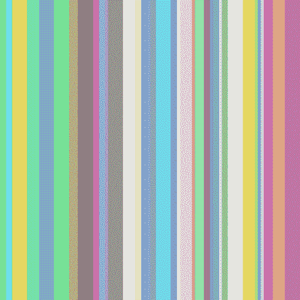

最后，让我们更新 `onDrawFrame()` 方法以设置纹理坐标：

```kt
int texCoordHandle = GLES20.glGetAttribLocation(shaderProgram, "aTex"); 
GLES20.glVertexAttribPointer(texCoordHandle, 2, 
        GLES20.GL_FLOAT, false, 
        0, texBuffer); 
```

这就是纹理本身：

```kt
int texHandle = GLES20.glGetUniformLocation(shaderProgram, "sTex"); 
GLES20.glActiveTexture(GLES20.GL_TEXTURE0); 
GLES20.glBindTexture(GLES20.GL_TEXTURE_2D, textureId); 
GLES20.glUniform1i(texHandle, 0); 
```

同样，正如我们之前所做的，我们必须启用，稍后禁用，纹理坐标顶点数组。

如果我们运行这段代码，我们将得到以下结果：

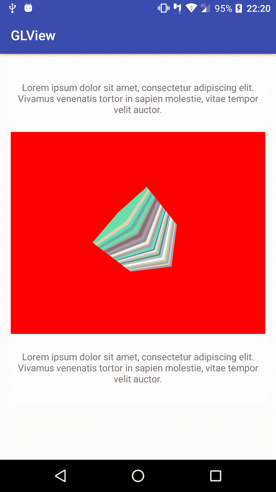

在 GitHub 仓库中查看 `Example25-GLDrawing` 以获取完整的示例源代码。

# 加载外部几何图形

到目前为止，我们一直在绘制四边形和立方体，但如果我们想要绘制更复杂的几何图形，使用 3D 建模工具进行建模可能更为方便，而不是通过代码实现。我们可以用多个章节来涵盖这个主题，但让我们先看一个快速示例，了解如何实现，你可以根据需要扩展它。

我们使用了 Blender 来建模我们的示例数据。Blender 是一个免费且开源的 3D 建模工具集，可以在其网站上免费下载：

[`www.blender.org/`](https://www.blender.org/)。

在这个例子中，我们没有建模一个极其复杂的例子；我们只是使用了 Blender 提供的一个基本形状：Suzanne：

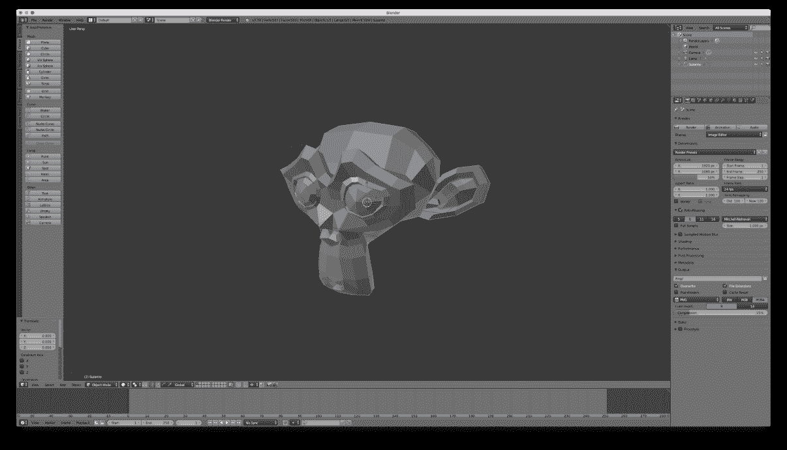

为了简化我们的导入工具，我们将在右侧的“场景”|“Suzanne”下拉菜单下选择对象网格，当我们按下 *Ctrl* + *T* 时，Blender 将把所有面转换为三角形。否则，我们的导出文件中既有三角形也有四边形，从我们的 Android 应用程序代码中实现面导入器并不直接：

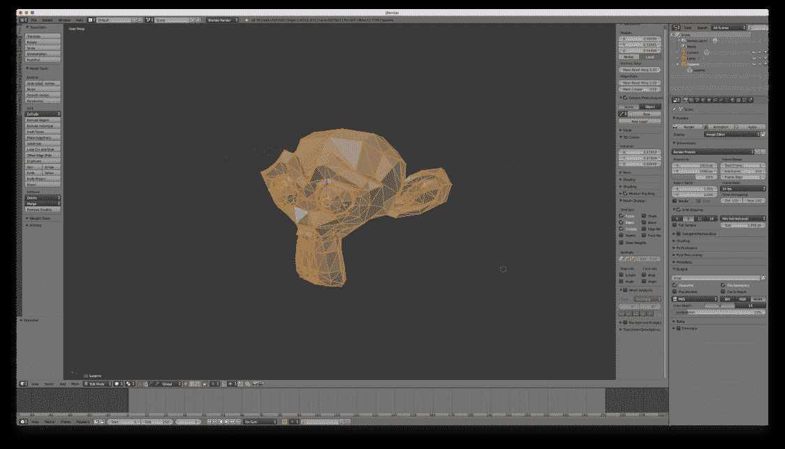

现在，我们将它导出为 `Wavefront`（`.obj`）文件，这将创建一个 `.obj` 文件和一个 `.mtl` 文件。后者是材质信息，目前我们将忽略它。让我们将导出的文件放入我们项目的 `assets` 文件夹中。

现在，让我们自己创建一个简单的 `Wavefront` 文件对象解析器。由于我们将要处理文件加载和解析，因此我们需要异步执行：

```kt
public class WavefrontObjParser { 
    public static void parse(Context context, String name, ParserListener listener) { 
        WavefrontObjParserHelper helper = new WavefrontObjParserHelper(context, name, listener); 
        helper.start(); 
    } 

    public interface ParserListener { 
        void parsingSuccess(Scene scene); 
        void parsingError(String message); 
    } 
} 
```

如你所见，这里并没有实际完成工作。为了进行实际的加载和解析，我们创建了一个帮助类，它将在一个单独的**线程**上执行，并根据解析文件成功或出现错误来调用监听器：

```kt
class WavefrontObjParserHelper extends Thread { 
    private String name; 
    private WavefrontObjParser.ParserListener listener; 
    private Context context; 

    WavefrontObjParserHelper(Context context, String name,
    WavefrontObjParser.ParserListener listener) { 
        this.context = context; 
        this.name = name; 
        this.listener = listener; 
    } 

```

然后，当我们调用 `helper.start()` 时，它将创建实际的线程，并在其上执行 `run()` 方法：

```kt
public void run() { 
        try { 

            InputStream is = context.getAssets().open(name); 
            BufferedReader br = new BufferedReader(new
            InputStreamReader(is)); 

            Scene scene = new Scene(); 
            Object3D obj = null; 

            String str; 
            while ((str = br.readLine()) != null) { 
                if (!str.startsWith("#")) { 
                    String[] line = str.split(""); 

                    if("o".equals(line[0])) { 
                        if (obj != null) obj.prepare(); 
                        obj = new Object3D(); 
                        scene.addObject(obj); 

                    } else if("v".equals(line[0])) { 
                        float x = Float.parseFloat(line[1]); 
                        float y = Float.parseFloat(line[2]); 
                        float z = Float.parseFloat(line[3]); 
                        obj.addCoordinate(x, y, z); 
                    } else if("f".equals(line[0])) { 

                        int a = getFaceIndex(line[1]); 
                        int b = getFaceIndex(line[2]); 
                        int c = getFaceIndex(line[3]); 

                        if (line.length == 4) { 
                            obj.addFace(a, b, c); 
                        } else { 
                            int d = getFaceIndex(line[4]); 
                            obj.addFace(a, b, c, d); 
                        } 
                    } else { 
                        // skip 
                    } 
                } 
            } 
            if (obj != null) obj.prepare(); 
            br.close(); 

            if (listener != null) listener.parsingSuccess(scene); 
        } catch(Exception e) { 
            if (listener != null) listener.parsingError(e.getMessage()); 
            e.printStackTrace(); 
        } 
    } 
```

在之前的代码中，我们首先通过提供的名称打开文件来读取资源。为了获取应用程序资源，这里我们需要一个`context`：

```kt
InputStream is = context.getAssets().open(name); 
BufferedReader br = new BufferedReader(new InputStreamReader(is)); 
```

然后，我们逐行读取文件，并根据开始的关键字采取不同的行动，除非行以`#`开始，这意味着它是一个注释。我们只考虑新对象、顶点坐标和面索引的命令；我们忽略了文件中可能存在的任何附加命令，比如使用的材质，或顶点和面法线。

由于我们可以获取面索引信息，如 f 330//278 336//278 338//278 332//278，我们创建了一个辅助方法来解析这些信息，并只提取面索引。斜杠后面的数字是面法线索引。参考官方文件格式以更详细地了解面索引数字的使用：

```kt
private static int getFaceIndex(String face) { 
    if(!face.contains("/")) { 
        return Integer.parseInt(face) - 1; 
    } else { 
        return Integer.parseInt(face.split("/")[0]) - 1; 
    } 
} 
```

同时，由于面索引从`1`开始，我们需要减去`1`以得到正确的结果。

为了存储我们从文件中读取的所有这些数据，我们还创建了一些数据类。`Object3D`类将存储所有相关信息——顶点、面索引，而`Scene`类将存储整个 3D 场景以及所有内部的`Objects3D`。为了简单起见，我们尽可能保持了这些实现的简短，但根据我们的需要，它们可以变得更加复杂：

```kt
public class Scene { 
    private ArrayList<Object3D> objects; 

    public Scene() { 
        objects = new ArrayList<>(); 
    } 

    public void addObject(Object3D obj) { 
        objects.add(obj); 
    } 

    public ArrayList<Object3D> getObjects() { 
        return objects; 
    } 

    public void render(int shaderProgram, String posAttributeName,
    String colAttributeName) { 
        GLES20.glEnable(GLES20.GL_DEPTH_TEST); 

        for (int i = 0; i < objects.size(); i++) { 
            objects.get(i).render(shaderProgram, posAttributeName,
            colAttributeName); 
        } 

        GLES20.glDisable(GLES20.GL_DEPTH_TEST); 
    } 
} 

```

我们可以看到`Scene`类上有一个`render()`方法。我们将渲染所有 3D 对象的责任移到了`Scene`本身，并且应用相同的原则，每个对象也负责渲染自身：

```kt
public void prepare() { 
    if (coordinateList.size() > 0 && coordinates == null) { 
        coordinates = new float[coordinateList.size()]; 
        for (int i = 0; i < coordinateList.size(); i++) { 
            coordinates[i] = coordinateList.get(i); 
        } 
    } 

    if (indexList.size() > 0 && indexes == null) { 
        indexes = new short[indexList.size()]; 
        for (int i = 0; i < indexList.size(); i++) { 
            indexes[i] = indexList.get(i); 
        } 
    } 

    colors = new float[(coordinates.length/3) * 4]; 
    for (int i = 0; i < colors.length/4; i++) { 
        float intensity = (float) (Math.random() * 0.5 + 0.4); 
        colors[i * 4    ] = intensity; 
        colors[i * 4 + 1] = intensity; 
        colors[i * 4 + 2] = intensity; 
        colors[i * 4 + 3] = 1.f; 
    } 

    ByteBuffer vbb = ByteBuffer.allocateDirect(coordinates.length *
   (Float.SIZE / 8)); 
    vbb.order(ByteOrder.nativeOrder()); 

    vertexBuffer = vbb.asFloatBuffer(); 
    vertexBuffer.put(coordinates); 
    vertexBuffer.position(0); 

    ByteBuffer ibb = ByteBuffer.allocateDirect(indexes.length *
   (Short.SIZE / 8)); 
    ibb.order(ByteOrder.nativeOrder()); 

    indexBuffer = ibb.asShortBuffer(); 
    indexBuffer.put(indexes); 
    indexBuffer.position(0); 

    ByteBuffer cbb = ByteBuffer.allocateDirect(colors.length * 
    (Float.SIZE / 8)); 
    cbb.order(ByteOrder.nativeOrder()); 

    colorBuffer = cbb.asFloatBuffer(); 
    colorBuffer.put(colors); 
    colorBuffer.position(0); 

    Log.i(TAG, "Loaded obj with " + coordinates.length + " vertices &"
    + (indexes.length/3) + " faces"); 
} 

```

一旦我们为`3DObject`设置好所有数据，我们可以通过调用其`prepare()`方法来准备渲染。这个方法将创建顶点和索引`Buffer`，并且由于在这种情况下数据文件中的网格没有任何颜色信息，它将为每个顶点生成一个随机颜色，或者更确切地说是一个强度。

在这里`3DObject`本身创建缓冲区允许我们渲染任何类型的对象。`Scene`容器不知道内部是什么类型的对象或几何图形。只要它处理自己的渲染，我们可以轻松地将这个类扩展为另一种类型的`3DObject`。

最后，我们在`3DObject`中添加了一个`render()`方法：

```kt
public void render(int shaderProgram, String posAttributeName, String colAttributeName) { 
    int positionHandle = GLES20.glGetAttribLocation(shaderProgram,
    posAttributeName); 
    GLES20.glVertexAttribPointer(positionHandle, 3, 
            GLES20.GL_FLOAT, false, 
            3 * 4, vertexBuffer); 

    int colorHandle = GLES20.glGetAttribLocation(shaderProgram,
    colAttributeName); 
    GLES20.glVertexAttribPointer(colorHandle, 4, 
            GLES20.GL_FLOAT, false, 
            4 * 4, colorBuffer); 

    GLES20.glEnableVertexAttribArray(colorHandle); 
    GLES20.glEnableVertexAttribArray(positionHandle); 
    GLES20.glDrawElements( 
            GLES20.GL_TRIANGLES, indexes.length, 
            GLES20.GL_UNSIGNED_SHORT, indexBuffer); 

    GLES20.glDisableVertexAttribArray(positionHandle); 
    GLES20.glDisableVertexAttribArray(colorHandle); 
} 
```

这个方法负责启用和禁用正确的数组并渲染自身。我们从方法参数中获取`shader`属性。理想情况下，每个对象都可以有自己的`shader`，但我们不想在这个示例中增加太多复杂性。

在我们的`GLDrawer`类中，我们还添加了一个辅助方法来计算透视失真矩阵。OpenGL 中最常用的调用之一是`gluPerspective`，而许多出色的 OpenGL 教程的作者 NeHe 创建了一个函数将`gluPerspective`转换为`glFrustrum`调用：

```kt
// source: http://nehe.gamedev.net/article/replacement_for_gluperspective/21002/ 

private static void perspectiveFrustrum(float[] matrix, float fov, float aspect, float zNear, float zFar) { 
    float fH = (float) (Math.tan( fov / 360.0 * Math.PI ) * zNear); 
    float fW = fH * aspect; 

    Matrix.frustumM(matrix, 0, -fW, fW, -fH, fH, zNear, zFar); 
} 
```

因为我们不再需要它，我们从`GLDrawer`中移除了所有顶点和面索引信息，并简化了`onDrawFrame()`方法，现在将所有对象的渲染委托给`Scene`类，默认情况下，委托给每个单独的`3DObject`：

```kt
@Override 
public void onDrawFrame(GL10 unused) { 
    angle = ((float) SystemClock.elapsedRealtime() - startTime) *
    0.02f; 
    GLES20.glClearColor(1.0f, 0.0f, 0.0f, 1.0f); 
    GLES20.glClear(GLES20.GL_COLOR_BUFFER_BIT | 
    GLES20.GL_DEPTH_BUFFER_BIT); 

    if (scene != null) { 
        Matrix.setLookAtM(mViewMatrix, 0, 
                0, 0, -4, 
                0f, 0f, 0f, 
                0f, 1.0f, 0.0f); 

        Matrix.multiplyMM(mMVPMatrix, 0, mProjectionMatrix, 0,
        mViewMatrix, 0); 
        Matrix.rotateM(mMVPMatrix, 0, angle, 0.8f, 2.f, 1.f); 

        GLES20.glUseProgram(shaderProgram); 

        int mMVPMatrixHandle = GLES20.glGetUniformLocation(shaderProgram, "uMVPMatrix"); 
        GLES20.glUniformMatrix4fv(mMVPMatrixHandle, 1, false,
        mMVPMatrix, 0); 

        scene.render(shaderProgram, "vPosition", "aColor"); 
    } 
} 
```

把所有内容放在一起，如果我们运行这个示例，我们将得到以下屏幕：

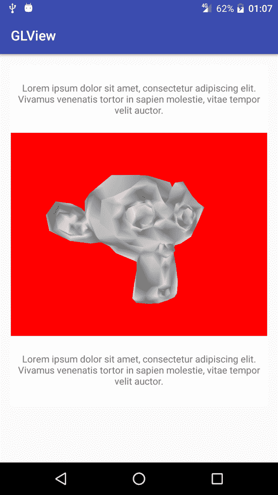

请在 GitHub 仓库中查看`Example26-GLDrawing`以获取完整的示例源代码。

# 总结

在本章中，我们学习了如何使用 OpenGL ES 创建非常基础的自定义视图。OpenGL ES 在创建自定义视图时提供了很多可能性，但如果我们没有太多与之工作的经验，它也会增加很多复杂性。我们本可以在这一主题上涵盖更多章节，但这并不是本书的主要目标。我们会有更多使用 3D 自定义视图的示例，但关于如何在 Android 设备上学习甚至掌握 OpenGL ES，已经有很多发布的材料了。

在下一章中，我们将学习如何为自定义视图添加更多动画和平滑的运动。由于我们可以动画化任何参数或变量，无论是 3D 自定义视图还是标准的 2D 自定义视图，这都不重要，但我们将看到如何在这两种情况下应用动画。
