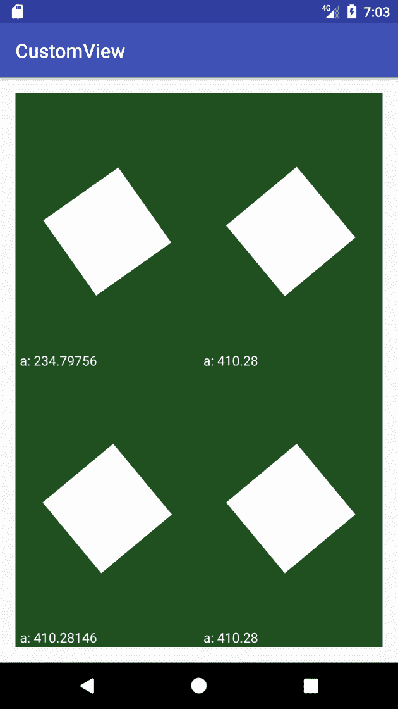
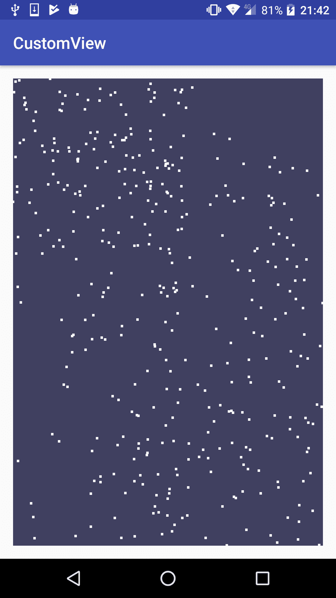
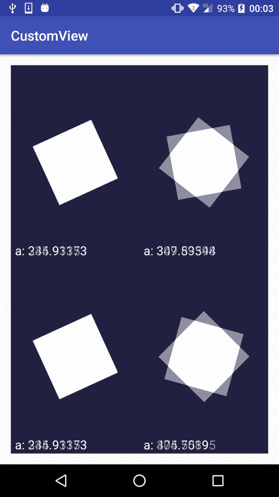

# 第六章：动画

到目前为止，我们已经了解了如何创建和渲染不同类型的自定义视图，从非常简单的 2D 画布绘图到更复杂的画布操作，以及最近如何使用 OpenGL ES 和顶点/片段着色器创建自定义视图。在一些用于演示如何使用这些渲染原语的示例中，我们已经使用了一些动画，正如你可以想象的，动画是自定义视图的关键元素之一。如果我们想使用自定义视图构建高度复杂的 UI，但完全不使用动画，那么使用静态图像可能更好。

在本章中，我们将介绍如何向自定义视图添加动画。有许多方法可以实现这一点，但我们会更详细地探讨以下主题：

+   自定义动画

+   固定时间步长技术

+   使用 Android 属性动画

此外，我们还将探讨如果我们错误地实现一些动画，可能会出现哪些问题，因为这看起来可能更简单，也许仅仅是运气好，尽管这可能会对我们不利，但它们似乎在我们的设备上可以完美运行。

# 自定义动画

让我们从如何自己实现一些值的变化开始，而不是过分依赖 Android SDK 提供的方法和类。在本节中，我们将了解如何使用不同的机制对一个或多个属性进行动画处理。这样，我们就可以根据我们想要实现的动画类型或我们正在实现的观点的具体特点，在我们自定义的视图中应用更合适的方法。

# 定时帧动画

在我们上一章的 3D 示例中，我们已经使用了这种类型的动画。主要概念是在绘制新帧之前，根据经过的时间为所有可动画属性分配一个新值。我们可能会被诱惑根据已绘制的帧数递增或计算一个新值，但这是非常不建议的，因为动画的播放速度将取决于设备速度、计算或绘图复杂性以及其他在后台执行的过程。

为了正确实现，我们必须引入与渲染速度、每秒帧数或已绘制的帧数无关的东西，而基于时间的动画是一个完美的解决方案。

Android 为我们提供了几种机制来实现这一点。例如，我们可以使用 `System.currentTimeMillis()`、`System.nanoTime()`，甚至是一些系统时钟中可用的方法，如 `elapsedRealtime()`。

让我们构建一个简单的示例来比较不同的方法。首先，创建一个简单的自定义视图，绘制四个旋转不同角度的矩形，或者说是 `Rect`：

```kt
private static final int BACKGROUND_COLOR = 0xff205020; 
private static final int FOREGROUND_COLOR = 0xffffffff; 
private static final int QUAD_SIZE = 50; 

private float[] angle; 
private Paint paint; 

public AnimationExampleView(Context context, AttributeSet attributeSet) { 
    super(context, attributeSet); 

    paint = new Paint(); 
    paint.setStyle(Paint.Style.FILL); 
    paint.setAntiAlias(true); 
    paint.setColor(FOREGROUND_COLOR); 
    paint.setTextSize(48.f); 

    angle = new float[4]; 
    for (int i = 0; i < 4; i++) { 
        angle[i] = 0.f; 
    } 
} 
```

在类的构造函数中，我们初始化 `Paint` 对象，并创建一个包含四个浮点数的数组来保存每个矩形的旋转角度。此时，这四个角度都将是 `0`。现在，让我们实现 `onDraw()` 方法。

在`onDraw()`方法中，我们首先要做的是用纯色清除画布背景，以清除我们之前的帧。

完成这些后，我们计算将绘制四个矩形的坐标并开始绘制。为了简化旋转，在本例中，我们使用了`canvas.translate`和`canvas.rotate`，以矩形的中心点作为旋转轴点。同时，为了避免进行额外的计算并尽可能保持简单，我们在每个矩形绘制前后分别使用`canvas.save`和`canvas.restore`，以保持每次绘制操作之前的状态：

```kt
@Override 
protected void onDraw(Canvas canvas) { 
    canvas.drawColor(BACKGROUND_COLOR); 

    int width = getWidth(); 
    int height = getHeight(); 

    // draw 4 quads on the screen: 
    int wh = width / 2; 
    int hh = height / 2; 

    int qs = (wh * QUAD_SIZE) / 100; 

    // top left 
    canvas.save(); 
    canvas.translate( 
        wh / 2 - qs / 2, 
        hh / 2 - qs / 2); 

    canvas.rotate(angle[0], qs / 2.f, qs / 2.f); 
    canvas.drawRect(0, 0, qs, qs, paint); 
    canvas.restore(); 

    // top right 
    canvas.save(); 
    canvas.translate( 
        wh + wh / 2 - qs / 2, 
        hh / 2 - qs / 2); 

    canvas.rotate(angle[1], qs / 2.f, qs / 2.f); 
    canvas.drawRect(0, 0, qs, qs, paint); 
    canvas.restore(); 

    // bottom left 
    canvas.save(); 
    canvas.translate( 
        wh / 2 - qs / 2, 
        hh + hh / 2 - qs / 2); 

    canvas.rotate(angle[2], qs / 2.f, qs / 2.f); 
    canvas.drawRect(0, 0, qs, qs, paint); 
    canvas.restore(); 

    // bottom right 
    canvas.save(); 
    canvas.translate( 
        wh + wh / 2 - qs / 2, 
        hh + hh / 2 - qs / 2); 

    canvas.rotate(angle[3], qs / 2.f, qs / 2.f); 
    canvas.drawRect(0, 0, qs, qs, paint); 
    canvas.restore(); 

    canvas.drawText("a: " + angle[0], 16, hh - 16, paint); 
    canvas.drawText("a: " + angle[1], wh + 16, hh - 16, paint); 
    canvas.drawText("a: " + angle[2], 16, height - 16, paint); 
    canvas.drawText("a: " + angle[3], wh + 16, height - 16, paint); 

    postInvalidateDelayed(10); 
} 
```

为了更清晰地看到差异，我们绘制了一个文本，显示每个矩形旋转的角度。并且，为了实际触发视图的重绘，我们调用了延迟 10 毫秒的`invalidate`。

第一个矩形将在每次绘制时简单地增加其角度，忽略时间方法，而其他三个将分别使用：`System.currentTimeMillis()`、`System.nanoTime()`和`SystemClock.elapsedRealtime()`。让我们初始化一些变量来保存定时器的初始值：

```kt
private long timeStartMillis; 
private long timeStartNanos; 
private long timeStartElapsed; 
```

在`onDraw()`方法的开头添加一个小计算：

```kt
if (timeStartMillis == -1)  
    timeStartMillis = System.currentTimeMillis(); 

if (timeStartNanos == -1)  
    timeStartNanos = System.nanoTime(); 

if (timeStartElapsed == -1)  
    timeStartElapsed = SystemClock.elapsedRealtime(); 

angle[0] += 0.2f; 
angle[1] = (System.currentTimeMillis() - timeStartMillis) * 0.02f; 
angle[2] = (System.nanoTime() - timeStartNanos) * 0.02f * 0.000001f; 
angle[3] = (SystemClock.elapsedRealtime() - timeStartElapsed) * 0.02f; 
```

由于从初始类创建到调用`onDraw()`方法之间可能经过了一段时间，我们在这里计算定时器的初始值。例如，如果`timeStartElapsed`的值是`-1`，这意味着它尚未初始化。

首先，我们设定了初始时间，然后可以计算出已经过去了多少时间，并将其作为动画的基础值。我们可以乘以一个因子来控制速度。在本例中，我们使用了`0.02`作为示例，并考虑到纳秒和毫秒的量级不同。

如果我们运行这个示例，我们将得到类似于以下截图的结果：



这种方法的一个问题是，如果我们把应用放到后台，过一段时间再把它调到前台，我们会看到所有基于时间的值都会向前跳跃，因为当我们的应用在后台时时间并不会停止。为了控制这一点，我们可以重写`onVisibilityChanged()`回调，并检查我们的视图是可见还是不可见：

```kt
@Override 
protected void onVisibilityChanged(@NonNull View changedView, int visibility) { 
    super.onVisibilityChanged(changedView, visibility); 

    // avoid doing this check before View is even visible 
    if ((visibility == View.INVISIBLE || visibility == View.GONE) &&  
          previousVisibility == View.VISIBLE) { 

        invisibleTimeStart = SystemClock.elapsedRealtime(); 
    } 

    if ((previousVisibility == View.INVISIBLE || previousVisibility ==
        View.GONE) && 
        visibility == View.VISIBLE) { 

        timeStartElapsed += SystemClock.elapsedRealtime() -
        invisibleTimeStart; 
    } 
    previousVisibility = visibility; 
} 
```

在前面的代码中，我们计算了视图不可见的时间，并调整`timeStartElapsed`。我们必须避免在第一次执行此操作，因为该方法将在视图第一次可见时被调用。因此，我们检查`timeStartElapsed`是否不等于`-1`。

由于我们有这个回调正好在视图变为可见之前，我们可以轻松地更改之前的代码来计算定时器的初始值，并将其放在这里，也简化我们的`onDraw()`方法：

```kt
@Override 
protected void onVisibilityChanged(@NonNull View changedView, int visibility) { 
    super.onVisibilityChanged(changedView, visibility); 

    // avoid doing this check before View is even visible 
    if (timeStartElapsed != -1) { 
        if ((visibility == View.INVISIBLE || visibility == View.GONE)
            && 
            previousVisibility == View.VISIBLE) { 

            invisibleTimeStart = SystemClock.elapsedRealtime(); 
        } 

        if ((previousVisibility == View.INVISIBLE || previousVisibility
            == View.GONE) && 
            visibility == View.VISIBLE) { 

            timeStartElapsed += SystemClock.elapsedRealtime() -
            invisibleTimeStart; 
        } 
    } else {
        timeStartMillis = System.currentTimeMillis();
        timeStartNanos = System.nanoTime();
        timeStartElapsed = SystemClock.elapsedRealtime();
    }
    previousVisibility = visibility;
}
```

通过这个微小的调整，只修改了`timeStartElapsed`，即使我们把应用放到后台，我们也会看到右下方的矩形保留了动画。

你可以在 GitHub 仓库的`Example27-Animations`文件夹中找到整个示例的源代码。

# 固定时间步长

在处理动画时，有时计算可能会非常复杂。一个明显的例子就是物理模拟和一般游戏中的情况，但在其他一些时候，即使是对于一个简单自定义视图，当使用基于时间的动画时，我们的计算也可能会有点棘手。固定时间步长将允许我们从时间变量中抽象出动画逻辑，但仍然使我们的动画与时间相关联。

设定固定时间步长的逻辑是假设我们的动画逻辑将始终以固定的速率执行。例如，我们可以假设无论实际渲染的每秒帧数是多少，它都将以*60* fps 的速率执行。为了展示如何做到这一点，我们将创建一个新的自定义视图，该视图将在我们按或拖动屏幕的位置生成粒子，并应用一些非常基础简单的物理效果。

首先，我们按照之前的示例创建一个基本的自定义视图：

```kt
private static final int BACKGROUND_COLOR = 0xff404060; 
private static final int FOREGROUND_COLOR = 0xffffffff; 
private static final int N_PARTICLES = 800; 

private Paint paint; 
private Particle[] particles; 
private long timeStart; 
private long accTime; 
private int previousVisibility; 
private long invisibleTimeStart; 

public FixedTimestepExample(Context context, AttributeSet attributeSet) { 
    super(context, attributeSet); 

    paint = new Paint(); 
    paint.setStyle(Paint.Style.FILL); 
    paint.setAntiAlias(true); 
    paint.setColor(FOREGROUND_COLOR); 

    particles = new Particle[N_PARTICLES]; 
    for (int i = 0; i < N_PARTICLES; i++) { 
        particles[i] = new Particle(); 
    } 

    particleIndex = 0; 
    timeStart = -1; 
    accTime = 0; 
    previousVisibility = View.GONE; 
} 
```

我们初始化基本变量，并且创建一个`particles`数组。同样，由于我们在上一个示例中实现了`onVisibilityChange`回调，让我们利用它：

```kt
@Override 
protected void onVisibilityChanged(@NonNull View changedView, int visibility) { 
    super.onVisibilityChanged(changedView, visibility); 
    if (timeStartElapsed != -1) { 
        // avoid doing this check before View is even visible 
        if ((visibility == View.INVISIBLE ||  visibility == View.GONE)
            && 
            previousVisibility == View.VISIBLE) { 

            invisibleTimeStart = SystemClock.elapsedRealtime(); 
        } 

        if ((previousVisibility == View.INVISIBLE || previousVisibility 
            == View.GONE) && 
            visibility == View.VISIBLE) { 

            timeStart += SystemClock.elapsedRealtime() -
            invisibleTimeStart; 
        } 
    } else { 
        timeStart = SystemClock.elapsedRealtime(); 
    } 
    previousVisibility = visibility; 
} 
```

现在我们来定义一个`Particle`类，尽量保持其简单：

```kt
class Particle { 
    float x; 
    float y; 
    float vx; 
    float vy; 
    float ttl; 

    Particle() { 
        ttl = 0.f; 
    } 
} 
```

我们只定义了`x`、`y`坐标，`x`和`y`的速度分别为`vx`和`vy`，以及粒子的生命周期。当粒子的生命周期达到`0`时，我们将不再更新或绘制它。

现在，我们来实现`onDraw()`方法：

```kt
@Override 
protected void onDraw(Canvas canvas) { 
    animateParticles(getWidth(), getHeight()); 

    canvas.drawColor(BACKGROUND_COLOR); 

    for(int i = 0; i < N_PARTICLES; i++) { 
        float px = particles[i].x; 
        float py = particles[i].y; 
        float ttl = particles[i].ttl; 

        if (ttl > 0) { 
            canvas.drawRect( 
                px - PARTICLE_SIZE, 
                py - PARTICLE_SIZE, 
                px + PARTICLE_SIZE, 
                py + PARTICLE_SIZE, paint); 
        } 
    } 
    postInvalidateDelayed(10); 
} 
```

我们将所有动画委托给`animateParticles()`方法，在这里我们只是遍历所有粒子，检查它们的生命周期是否为正，如果是，就绘制它们。

让我们看看如何使用固定时间步长来实现`animateParticles()`方法：

```kt
private static final int TIME_THRESHOLD = 16; 
private void animateParticles(int width, int height) { 
    long currentTime = SystemClock.elapsedRealtime(); 
    accTime += currentTime - timeStart; 
    timeStart = currentTime; 

    while(accTime > TIME_THRESHOLD) { 
        for (int i = 0; i < N_PARTICLES; i++) { 
            particles[i].logicTick(width, height); 
        } 

        accTime -= TIME_THRESHOLD; 
    } 
} 
```

我们计算自上次以来的时间差，或者说是时间增量，并将其累积在`accTime`变量中。然后，只要`accTime`高于我们定义的阈值，我们就执行一个逻辑步骤。可能会在两次渲染之间执行多个逻辑步骤，或者在有些情况下，可能在两帧之间没有执行。

最后，我们为每个执行的逻辑步骤从`accTime`中减去我们定义的时间阈值，并将新的`timeStart`设置为用于计算从上一次调用`animateParticles()`以来时间差的时间。

在这个例子中，我们将时间阈值定义为`16`，所以每`16`毫秒我们将执行一个逻辑步骤，无论我们是渲染`10`帧还是`60`帧每秒。

`Particle`类上的`logicTick()`方法完全忽略了计时器的当前值，因为它假设它将在固定的时间步长上执行：

```kt
void logicTick(int width, int height) { 
    ttl--; 

    if (ttl > 0) { 
        vx = vx * 0.95f; 
        vy = vy + 0.2f; 

        x += vx; 
        y += vy; 

        if (y < 0) { 
            y = 0; 
            vy = -vy * 0.8f; 
        } 

        if (x < 0) { 
            x = 0; 
            vx = -vx * 0.8f; 
        } 

        if (x >= width) { 
            x = width - 1; 
            vx = -vx * 0.8f; 
        } 
    } 
} 
```

这是对粒子物理模拟的极度简化。它基本上对粒子应用摩擦力并添加垂直加速度，计算它们是否需要从屏幕边缘反弹，并计算新的`x`和`y`位置。

我们只是缺少在按或拖动`TouchEvent`时生成新粒子的代码：

```kt
@Override 
public boolean onTouchEvent(MotionEvent event) { 
    switch (event.getAction()) { 
        case MotionEvent.ACTION_DOWN: 
        case MotionEvent.ACTION_MOVE: 
            spawnParticle(event.getX(), event.getY()); 
            return true; 
    } 
    return super.onTouchEvent(event); 
} 
```

在这里，只要我们有按下的或移动的触摸事件，我们就会调用`spawnParticle()`。`spawnParticle()`的实现也非常简单：

```kt
private static final int SPAWN_RATE = 8; 
private int particleIndex; 

private void spawnParticle(float x, float y) { 
    for (int i = 0; i < SPAWN_RATE; i++) { 
        particles[particleIndex].x = x; 
        particles[particleIndex].y = y; 
        particles[particleIndex].vx = (float) (Math.random() * 40.f) -
        20.f; 
        particles[particleIndex].vy = (float) (Math.random() * 20.f) -
        10.f; 
        particles[particleIndex].ttl = (float) (Math.random() * 100.f)
        + 150.f; 
        particleIndex++; 
        if (particleIndex == N_PARTICLES) particleIndex = 0; 
    } 
} 
```

我们使用`particleIndex`变量作为`particles`数组的循环索引。每当它到达数组末尾时，它将重新从数组开始处继续。这种方法设置触摸事件的`x`和`y`坐标，并随机化每个生成粒子的速度和生存时间。我们创建了一个`SPAWN_RATE`常量，以在同一个触摸事件上生成多个粒子，从而改善视觉效果。

如果我们运行应用程序，我们可以看到它的实际效果，它将与以下截图非常相似，但在这种情况下，很难在截图中捕捉到动画的想法：



但我们遗漏了一些东西。正如我们之前提到的，有时在两帧渲染之间，我们会执行两个或更多的逻辑步骤，但在其他时候，我们可能在连续的两帧之间不执行任何逻辑步骤。如果我们在这两帧之间不执行任何逻辑步骤，结果将是相同的，并且会浪费 CPU 和电池寿命。

即使我们处于逻辑步骤之间，这并不意味着在帧之间没有经过任何时间。实际上，我们处于上一个计算出的逻辑步骤和下一个步骤之间的某个位置。好消息是，我们实际上可以计算出这一点，从而提高动画的平滑度并同时解决此问题。

让我们把这个修改包括到`animateParticles()`方法中：

```kt
private void animateParticles(int width, int height) {
    long currentTime = SystemClock.elapsedRealtime();
    accTime += currentTime - timeStart;
    timeStart = currentTime;

     while(accTime > TIME_THRESHOLD) {
        for (int i = 0; i < N_PARTICLES; i++) {
            particles[i].logicTick(width, height);
        }

         accTime -= TIME_THRESHOLD;
    }

     float factor = ((float) accTime) / TIME_THRESHOLD;
     for (int i = 0; i < N_PARTICLES; i++) {
        particles[i].adjustLogicStep(factor);
    }
}
```

我们正在计算一个因子，该因子将告诉我们距离下一个逻辑步骤有多近或多远。如果因子是`0`，这意味着我们正好处于刚刚执行的逻辑步骤的确切时间。如果因子是`0.5`，这意味着我们处于当前步骤和下一个步骤之间的一半，而如果因子是`0.8`，我们几乎要到达下一个逻辑步骤，并且精确地*80%*的时间已经自上一个步骤过去了。在一步逻辑步骤和下一步之间平滑过渡的方法是使用这个因子进行插值，但要能够这样做，我们首先需要计算下一步的值。让我们改变`logicTick()`方法以实现这个变化：

```kt
float nextX; 
float nextY; 
float nextVX; 
float nextVY; 

void logicTick(int width, int height) { 
    ttl--; 

    if (ttl > 0) { 
        x = nextX; 
        y = nextY; 
        vx = nextVX; 
        vy = nextVY; 

        nextVX = nextVX * 0.95f; 
        nextVY = nextVY + 0.2f; 

        nextX += nextVX; 
        nextY += nextVY; 

        if (nextY < 0) { 
            nextY = 0; 
            nextVY = -nextVY * 0.8f; 
        } 

        if (nextX < 0) { 
            nextX = 0; 
            nextVX = -nextVX * 0.8f; 
        } 

        if (nextX >= width) { 
            nextX = width - 1; 
            nextVX = -nextVX * 0.8f; 
        } 
    } 
} 
```

现在，在每一个逻辑步骤中，我们都在将下一个逻辑步骤的值赋给当前变量以避免重新计算它们，并计算下一个逻辑步骤。这样，我们得到了这两个值；在执行下一个逻辑步骤之后的当前值和新值。

由于我们将使用`x`、`y`和`nextX`、`nextY`之间的中间值，我们也会在新变量上计算这些值。

```kt
float drawX; 
float drawY; 

void adjustLogicStep(float factor) { 
    drawX = x * (1.f - factor) + nextX * factor; 
    drawY = y * (1.f - factor) + nextY * factor; 
} 
```

正如我们所看到的，`drawX`和`drawY`将是当前逻辑步骤和下一个逻辑步骤之间的中间状态。如果我们将前一个示例的值应用到这个因子上，我们就会看到这种方法是如何工作的。

如果因子是`0`，则`drawX`和`drawY`正好是`x`和`y`。相反，如果因子是`1`，则`drawX`和`drawY`正好是`nextX`和`nextY`，尽管这实际上不会发生，因为另一个逻辑步骤将被触发。

在因子为`0.8`的情况下，`drawX`和`drawY`的值是对下一个逻辑步骤的值*80%*和当前步骤的值*20%*的线性插值，从而实现状态之间的平滑过渡。

你可以在 GitHub 仓库的`Example28-FixedTimestep`文件夹中找到整个示例源代码。固定时间步进在 Gaffer On Games 博客的“fix your timestep”文章中有更详细的介绍。

# 使用 Android SDK 类

到目前为止，我们已经了解了如何使用基于时间动画或固定时间步机制来创建我们自己的动画。但 Android 提供了多种使用其 SDK 和动画框架进行动画制作的方法。在大多数情况下，我们可以通过仅使用属性动画系统来简化我们的动画，而无需创建自己的系统，但这将取决于我们想要实现的内容的复杂性以及我们想要如何处理开发。

有关更多信息，请参考 Android 开发者文档网站上的属性动画框架。

# 值动画

作为属性动画系统的一部分，我们有`ValueAnimator`类。我们可以使用它来简单地动画化`int`、`float`或`color`变量或属性。它非常易于使用，例如，我们可以使用以下代码在`1500`毫秒内将浮点值从`0`动画化到`360`：

```kt
ValueAnimator angleAnimator = ValueAnimator.ofFloat(0, 360.f); 
angleAnimator.setDuration(1500); 
angleAnimator.start(); 
```

这是正确的，但如果我们想要获取动画的更新并对其做出反应，我们必须设置一个`AnimatorUpdateListener()`。

```kt
final ValueAnimator angleAnimator = ValueAnimator.ofFloat(0, 360.f); 
angleAnimator.setDuration(1500); 
angleAnimator.addUpdateListener(new ValueAnimator.AnimatorUpdateListener() { 
    @Override 
    public void onAnimationUpdate(ValueAnimator animation) { 
        angle = (float) angleAnimator.getAnimatedValue(); 
        invalidate(); 
    } 
}); 
angleAnimator.start(); 
```

同时，在这个例子中，我们可以看到我们在`AnimatorUpdateListener()`中调用了`invalidate()`，因此我们也在告诉 UI 重新绘制视图。

我们可以配置动画行为的许多方面：从动画重复模式、重复次数和插值器类型。让我们使用本章开始时使用的同一个示例来看一下它的实际应用。让我们在屏幕上绘制四个矩形，并使用`ValueAnimator`的不同设置来旋转它们：

```kt
//top left 
final ValueAnimator angleAnimatorTL = ValueAnimator.ofFloat(0, 360.f); 
angleAnimatorTL.setRepeatMode(ValueAnimator.REVERSE); 
angleAnimatorTL.setRepeatCount(ValueAnimator.INFINITE); 
angleAnimatorTL.setDuration(1500); 
angleAnimatorTL.addUpdateListener(new ValueAnimator.AnimatorUpdateListener() { 
    @Override 
    public void onAnimationUpdate(ValueAnimator animation) { 
        angle[0] = (float) angleAnimatorTL.getAnimatedValue(); 
        invalidate(); 
    } 
}); 

//top right 
final ValueAnimator angleAnimatorTR = ValueAnimator.ofFloat(0, 360.f); 
angleAnimatorTR.setInterpolator(new DecelerateInterpolator()); 
angleAnimatorTR.setRepeatMode(ValueAnimator.RESTART); 
angleAnimatorTR.setRepeatCount(ValueAnimator.INFINITE); 
angleAnimatorTR.setDuration(1500); 
angleAnimatorTR.addUpdateListener(new ValueAnimator.AnimatorUpdateListener() { 
    @Override 
    public void onAnimationUpdate(ValueAnimator animation) { 
        angle[1] = (float) angleAnimatorTR.getAnimatedValue(); 
        invalidate(); 
    } 
}); 

//bottom left 
final ValueAnimator angleAnimatorBL = ValueAnimator.ofFloat(0, 360.f); 
angleAnimatorBL.setInterpolator(new AccelerateDecelerateInterpolator()); 
angleAnimatorBL.setRepeatMode(ValueAnimator.RESTART); 
angleAnimatorBL.setRepeatCount(ValueAnimator.INFINITE); 
angleAnimatorBL.setDuration(1500); 
angleAnimatorBL.addUpdateListener(new ValueAnimator.AnimatorUpdateListener() { 
    @Override 
    public void onAnimationUpdate(ValueAnimator animation) { 
        angle[2] = (float) angleAnimatorBL.getAnimatedValue(); 
        invalidate(); 
    } 
}); 

//bottom right 
final ValueAnimator angleAnimatorBR = ValueAnimator.ofFloat(0, 360.f); 
angleAnimatorBR.setInterpolator(new OvershootInterpolator()); 
angleAnimatorBR.setRepeatMode(ValueAnimator.REVERSE); 
angleAnimatorBR.setRepeatCount(ValueAnimator.INFINITE); 
angleAnimatorBR.setDuration(1500); 
angleAnimatorBR.addUpdateListener(new ValueAnimator.AnimatorUpdateListener() { 
    @Override 
    public void onAnimationUpdate(ValueAnimator animation) { 
        angle[3] = (float) angleAnimatorBR.getAnimatedValue(); 
        invalidate(); 
    } 
}); 

angleAnimatorTL.start(); 
angleAnimatorTR.start(); 
angleAnimatorBL.start(); 
angleAnimatorBR.start(); 
```

我们现在配置了四个不同的 `ValueAnimators`，并通过它们的 `onAnimationUpdate()` 回调触发失效调用，而不是设置初始时间和计算时间差。在这些 `ValueAnimator` 上，我们使用了不同的插值器和不同的重复模式：`ValueAnimator.RESTART` 和 `ValueAnimator.REVERSE`。在所有这些中，我们将重复次数设置为 `ValueAnimator.INFINITE`，这样我们就可以在没有压力的情况下观察和比较插值器的细节。

在 `onDraw()` 方法中，我们移除了 `postInvalidate` 调用，因为视图将被动画失效，但保留 `drawText()` 非常有趣，因为这样我们可以看到 `OvershootInterpolator()` 的行为以及它如何超出最大值。

如果我们运行这个示例，我们将看到四个矩形使用不同的插值机制进行动画处理。尝试使用不同的插值器，甚至可以通过扩展 `TimeInterpolator` 并实现 `getInterpolation(float input)` 方法来实现自己的插值器。

`getInterpolation` 方法的输入参数将在 `0` 到 `1` 之间，将 `0` 映射到动画的开始，将 `1` 映射到动画的结束。返回值应在 `0` 到 `1` 之间，但如果像 `OvershootInterpolator` 那样我们想要超出原始值，它可能更低或更高。然后 `ValueAnimator` 将根据这个因素计算初始值和最终值之间的正确值。

这个示例需要在模拟器或真实设备上查看，但为屏幕截图添加一点动态模糊可以稍微显示矩形以不同的速度和加速度进行动画处理。



# ObjectAnimator

如果我们想直接对对象而不是属性进行动画处理，我们可以使用 `ObjectAnimator` 类。`ObjectAnimator` 是 `ValueAnimator` 的一个子类，并使用相同的功能和特性，但增加了通过名称对对象属性进行动画处理的能力。

例如，为了展示其工作原理，我们可以以这种方式动画化我们 View 的一个属性。让我们为整个画布添加一个小的旋转，由 `canvasAngle` 变量控制：

```kt
float canvasAngle; 

@Override 
protected void onDraw(Canvas canvas) { 
    canvas.save(); 
    canvas.rotate(canvasAngle, getWidth() / 2, getHeight() / 2); 

    ... 

    canvas.restore(); 
} 
```

我们需要创建具有正确名称的设置器和获取器：以驼峰命名法命名的 `set<变量名>` 和 `get<变量名>`，在我们的特定案例中：

```kt
public void setCanvasAngle(float canvasAngle) { 
    this.canvasAngle = canvasAngle; 
} 

public float getCanvasAngle() { 
    return canvasAngle; 
} 
```

由于这些方法将被 `ObjectAnimator` 调用，我们已经创建它们，现在可以设置 `ObjectAnimator` 本身了：

```kt
ObjectAnimator canvasAngleAnimator = ObjectAnimator.ofFloat(this, "canvasAngle", -10.f, 10.f); 
canvasAngleAnimator.setDuration(3000); 
canvasAngleAnimator.setRepeatCount(ValueAnimator.INFINITE); 
canvasAngleAnimator.setRepeatMode(ValueAnimator.REVERSE); 
canvasAngleAnimator.addUpdateListener(new ValueAnimator.AnimatorUpdateListener() { 
    @Override 
    public void onAnimationUpdate(ValueAnimator animation) { 
        invalidate(); 
    } 
}); 
```

这基本上与 `ValueAnimator` 的方法相同，但在这种情况下，我们指定要使用字符串和对象引用进行动画处理的属性。正如我们刚才提到的，`ObjectAnimator` 将使用 `set<变量名>` 和 `get<变量名>` 的格式调用属性的获取器和设置器。此外，在 `onAnimationUpdate` 回调中只有一个 `invalidate()` 调用。我们移除了任何像前一个示例中的值赋值，因为它们将自动由 `ObjectAnimator` 更新。

你可以在 GitHub 仓库的`Example29-PropertyAnimation`文件夹中找到整个示例的源代码。

# 总结

在本章中，我们学习了如何为自定义视图添加不同类型的动画，从使用 Android 属性动画系统中的`ValueAnimator`和`ObjectAnimator`类，到创建基于时间或使用固定时间步进机制的自定义动画。

Android 为我们提供了更多的动画类，比如`AnimatorSet`，我们可以组合多个动画，并指定哪个动画在另一个之前或之后播放。

作为建议，我们不应重复发明轮子，如果 Android 提供的功能足够用，尽量使用它，或者根据我们的特定需求进行扩展，但如果它不适合，不要强求，因为或许构建自己的动画可能会更简单且更容易维护。

与软件开发中的所有事物一样，应使用常识并选择最佳可用选项。

在下一章中，我们将学习如何提高自定义视图的性能。在自定义视图中，我们完全控制着绘制过程，因此优化绘制方法和资源分配至关重要，以避免使应用程序变得迟缓并节省用户的电量。
