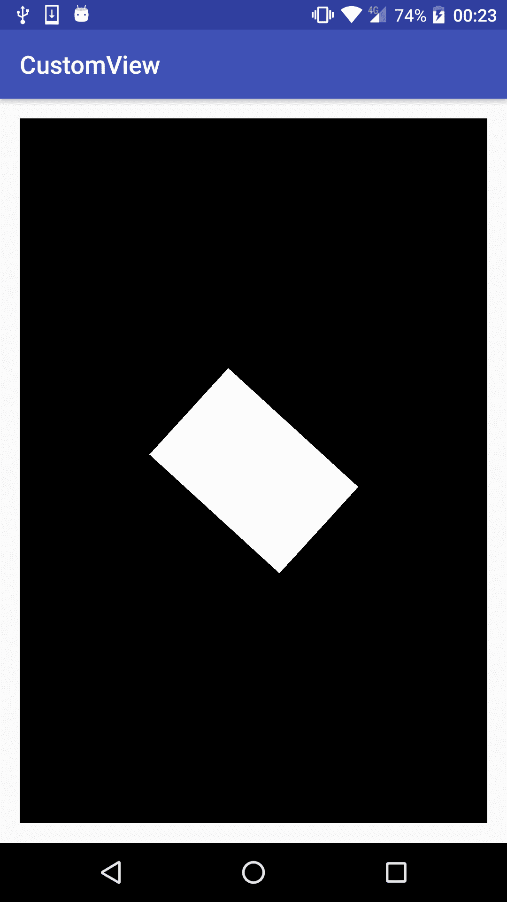
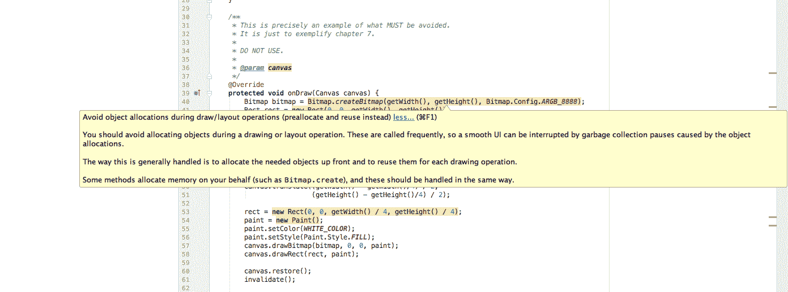
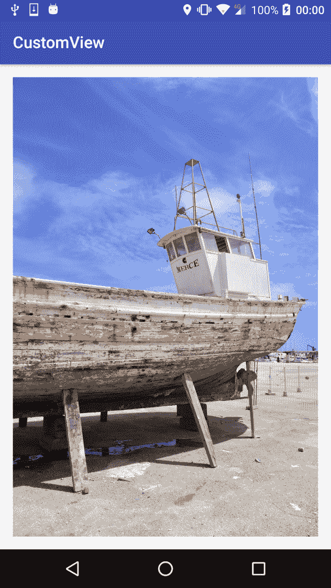
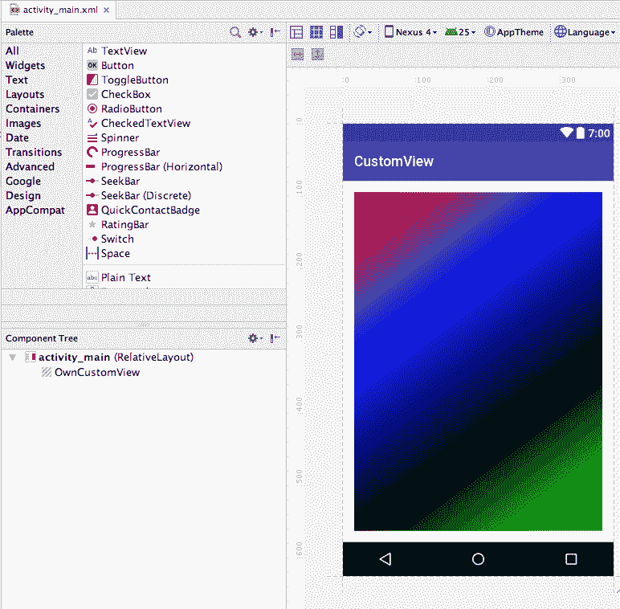

# 第七章：性能考虑

在前面的章节中，我们简要地讨论了性能问题，例如避免使用`onDraw()`方法进行某些操作。但我们还没有详细解释为什么你应该遵循这些建议，以及不遵循这些最佳实践对自定义视图和使用它的应用程序的真正影响。我们在这里解释的许多事情可能看起来是常识，实际上也应该是，但有时我们可能不会想到它们，或者我们可能不知道或不了解它们对应用程序可能产生的真实影响，无论是从性能角度还是关于电池消耗。

在本章中，我们将讨论这些问题，并更详细地了解以下主题：

+   建议和最佳实践

+   当不考虑性能时对应用的影响

+   代码优化

# 性能影响和推荐

正如我们所说，除非我们经历过性能问题，或者我们在支持低端或非常旧的设备，否则我们可能甚至不知道不遵循性能建议或最佳实践的影响是什么。如果我们使用高端设备来测试当前开发的内容，我们可能无法看到它在低端设备上的表现，而且很可能会有更多用户在中低端设备上使用它。这几乎就像是我们用良好可靠的 Wi-Fi 连接开发网络连接软件，或者拥有无限的 4G 网络。对于网络受限或按量计费的用户，尤其是仍在使用 2G 网络的用户，他们的体验可能完全不同。

在这两种情况下，重要的是要考虑我们的所有目标用户，并在多种场景下进行测试，使用不同的设备和硬件。

# 不遵循最佳实践的影响

在最近几章中，我们一直在推荐避免在`onDraw()`方法中分配对象。但如果我们开始分配对象，会发生什么呢？

让我们创建一个简单的自定义视图，并故意分配一个对象，以便我们可以在运行应用时评估结果：

```kt
package com.packt.rrafols.draw; 

import android.content.Context; 
import android.graphics.Bitmap; 
import android.graphics.BitmapFactory; 
import android.graphics.Canvas; 
import android.graphics.Paint; 
import android.graphics.Path; 
import android.graphics.Rect; 
import android.graphics.Region; 
import android.util.AttributeSet; 
import android.view.GestureDetector; 
import android.view.MotionEvent; 
import android.view.View; 
import android.widget.Scroller; 

public class PerformanceExample extends View { 
    private static final String TAG =PerformanceExample.class.
                                     getName(); 

    private static final int BLACK_COLOR = 0xff000000; 
    private static final int WHITE_COLOR = 0xffffffff; 
    private float angle; 

    public PerformanceExample(Context context, AttributeSet attributeSet)
    { 
        super(context, attributeSet); 

        angle = 0.f; 
    } 

    /** 
     * This is precisely an example of what MUST be avoided. 
     * It is just to exemplify chapter 7\. 
     * 
     * DO NOT USE. 
     * 
     * @param canvas 
     */ 
    @Override 
    protected void onDraw(Canvas canvas) { 
        Bitmap bitmap = Bitmap.createBitmap(getWidth(), getHeight(), 
                        Bitmap.Config.ARGB_8888); 
           Rect rect = new Rect(0, 0, getWidth(), getHeight()); 
           Paint paint = new Paint(); 
           paint.setColor(BLACK_COLOR); 
           paint.setStyle(Paint.Style.FILL); 
           canvas.drawRect(rect, paint); 
           canvas.save(); 

           canvas.rotate(angle, getWidth() / 2, getHeight() / 2); 
           canvas.translate((getWidth() - getWidth()/4) / 2, 
                 (getHeight() - getHeight()/4) / 2); 

           rect = new Rect(0, 0, getWidth() / 4, getHeight() / 4); 
           paint = new Paint(); 
           paint.setColor(WHITE_COLOR); 
           paint.setStyle(Paint.Style.FILL); 
           canvas.drawBitmap(bitmap, 0, 0, paint); 
           canvas.drawRect(rect, paint); 
           canvas.restore(); 
           invalidate(); 
           bitmap.recycle(); 
           angle += 0.1f; 
       } 
    } 
```

在这个快速示例中，我们在`onDraw()`方法中分配了多件事情，从`Paint`对象到`Rect`对象，再到创建一个新的`bitmap`，这会分配内部内存。

如果我们运行这段代码，我们会在屏幕中央得到一个旋转的白色的矩形，如下面的截图所示：



此外，我们不仅会得到一个类似的视图。如果我们在应用程序运行时检查 logcat 日志，我们可能会得到类似以下的行：

```kt
I art : Starting a blocking GC Explicit
I art : Explicit concurrent mark sweep GC freed 198893(13MB) AllocSpace objects, 30(656KB) LOS objects, 26% free, 43MB/59MB, paused 2.835ms total 313.353ms
I art : Background partial concurrent mark sweep GC freed 26718(2MB) AllocSpace objects, 1(20KB) LOS objects, 27% free, 43MB/59MB, paused 3.434ms total 291.430ms
```

应用程序执行期间，我们可能会多次获取它们。这是 Android 运行时（ART）的垃圾收集器介入，清理未使用的对象以释放内存。由于我们不断创建新对象，虚拟机将触发垃圾收集器来释放一些内存。

关于垃圾回收的更多信息可以在以下网址找到：

[`en.wikipedia.org/wiki/Garbage_collection_(computer_science)`](https://en.wikipedia.org/wiki/Garbage_collection_(computer_science))。

幸运的是，Android Studio 已经非常明确地告诉我们，在我们的 `onDraw()` 方法内部我们正在做错误的事情：



它还告诉我们，如果不遵循这个建议，可能会造成什么后果。在这种情况下，如果在滚动或绘制过程中垃圾回收器启动，我们可能会遇到一些卡顿，或者一个平滑的动画可能看起来会跳跃或不那么流畅。

请在 GitHub 存储库的 `Example30-Performance` 文件夹中查看这个示例的完整源代码，不建议遵循它。请将其作为一个应该避免的示例。

# 代码优化

在考虑自定义视图中的性能时，分配对象不是我们应该考虑的唯一事情。我们应该考虑的计算量、计算类型、我们正在绘制的原始数量、过度绘制的数量以及我们应该检查的事情列表非常庞大。最终，大多数事情都是常识：只是不要重新计算我们已经拥有的值，并最大化如果不需要更改就可以跳过的代码部分，或者基本上，尽量重复使用尽可能多的之前帧已经计算过的内容。

让我们比较两种将 YUV 像素数据转换为 RGB 的方法。这并不是自定义视图中你必须做的最典型的事情，但它完美地展示了通过尽可能多地重复使用和不重新计算不需要的内容，性能会受到怎样的影响。

在 Android 中从摄像头取景器获取帧时，它们通常是 YUV 格式而不是 RGB。关于 YUV 的更多信息可以在以下网址找到：

[YUV](https://en.wikipedia.org/wiki/YUV)的相关信息可以在以下网址找到。

我们将从直接的代码开始，并逐步对其进行优化，以评估所有优化的影响：

```kt
private static void yuv2rgb(int width, int height, byte[] yuvData,
    int[] rgbData) { 
    int uvOffset = width * height; 
    for (int i = 0; i < height; i++) { 
         int u = 0; 
         int v = 0; 
         for (int j = 0; j < width; j++) { 
           int y = yuvData[i * width + j]; 
           if (y < 0) y += 256; 

           if (j % 2 == 0) { 
               u = yuvData[uvOffset++]; 
               v = yuvData[uvOffset++]; 
            } 

            if (u < 0) u += 256; 
            if (v < 0) v += 256; 

            int nY = y - 16; 
            int nU = u - 128; 
            int nV = v - 128; 

            if (nY< 0) nY = 0; 

            int nR = (int) (1.164 * nY + 2.018 * nU); 
            int nG = (int) (1.164 * nY - 0.813 * nV - 0.391 * nU); 
            int nB = (int) (1.164 * nY + 1.596 * nV); 

            nR = min(255, max(0, nR)); 
            nG = min(255, max(0, nG)); 
            nB = min(255, max(0, nB)); 

            nR&= 0xff; 
            nG&= 0xff; 
            nB&= 0xff; 

            int color = 0xff000000 | (nR<< 16) | (nG<< 8) | nB; 
            rgbData[i * width + j] = color; 
        } 
    } 
} 
```

这个版本基于以下网址找到的 YUV 到 RGB 转换器：

[`searchcode.com/codesearch/view/2393/`](https://searchcode.com/codesearch/view/2393/) 和

[`sourceforge.jp/projects/nyartoolkit-and/`](http://sourceforge.jp/projects/nyartoolkit-and/)。

我们在这里使用了浮点数版本，以便稍后我们可以看到与固定点版本的差异。

现在，让我们创建一个小的自定义视图，它将在每一帧中将 YUV 图像转换为 RGB，将其设置为 `Bitmap`，并在屏幕上绘制：

```kt
@Override 
protected void onDraw(Canvas canvas) { 
    yuv2rgb(imageWidth, imageHeight, yuvData, rgbData); 
    bitmap.setPixels(rgbData, 0, imageWidth, 0, 0, imageWidth,
    imageHeight); 

    canvas.drawBitmap(bitmap, 0.f, 0.f, null); 

    frames++; 
    invalidate(); 
} 
```

让我们也添加一段代码来检查我们的小代码能管理的每秒帧数。我们将使用这个测量来检查我们将要进行的优化对性能的提升：

```kt
if (timeStart == -1) { 
    timeStart = SystemClock.elapsedRealtime(); 
} else { 
    long tdiff = SystemClock.elapsedRealtime() - timeStart; 
    if (tdiff != 0) { 
        float fps = ((float) frames * 1000.f) / tdiff; 
        Log.d(TAG, "FPS: " + fps); 
    } 
} 
```

如果我们就这样在我的设备上运行这段代码，它测量到的每秒帧数是 1.20。使用的演示图片是*1,000x1,500*的图像。让我们看看我们能做些什么来改进它。

首先，我们可以移除一些不必要的计算：

```kt
private static void yuv2rgb(int width, int height, byte[] yuvData,
    int[] rgbData) { 
    int uvOffset = width * height; 
    int offset = 0; 
    for (int i = 0; i < height; i++) { 
        int u = 0; 
        int v = 0; 
        for (int j = 0; j < width; j++) { 
            int y = yuvData[offset]; 
            ... 
            rgbData[offset] = color; 

            offset++; 
        } 
    } 
} 
```

在这里，我们移除了两个像素位置的计算，而是通过每个像素的单个增量来完成。在之前的情况下，无论是读取`yuvData`还是写入`rgbData`，都会进行`i * width + j`的计算。如果我们检查这个更改后的每秒帧数计数器，我们会注意到它略微增加到了 1.22。虽然提升不大，但这是一个开始。

现在，我们可以看到在原始实现中，即 Android SDK 中使用的方法，浮点运算被注释掉了，取而代之的是定点运算。浮点运算通常比整数运算成本更高。尽管这些年随着新硬件的出现，浮点运算的性能有了很大的提升，但整数运算仍然更快。我们无法获得与浮点运算相同的精度，但通过使用定点运算，我们可以得到相当好的近似值。

关于定点运算的更多信息可以在以下 URL 找到：

[定点运算](https://en.wikipedia.org/wiki/Fixed-point_arithmetic)的相关信息可以在以下链接找到。

使用定点运算时，我们必须定义一个整数值的位数，这将用作定点精度。剩余的位数将用于实际存储整数值。显然，我们用于存储的位数越多，精度就越高，但另一方面，用于存储整数值的位数就越少。想法是将所有常数和操作乘以 2 的幂次数，在完成所有操作后，将结果除以相同的数。由于它是 2 的幂，我们可以轻松地进行快速的位运算右移操作，而不是昂贵的除法。

例如，如果我们使用 10 位的定点精度，我们必须将所有值乘以*1,024*或左移 10 位，在所有计算结束时，执行 10 位的右移操作。

让我们把这些操作应用到这里：

```kt
int nR = (int) (1.164 * nY + 2.018 * nU); 
int nG = (int) (1.164 * nY - 0.813 * nV - 0.391 * nU); 
int nB = (int) (1.164 * nY + 1.596 * nV); 
```

我们将它们转换为以下形式：

```kt
int nR = (int) (1192 * nY + 2066 * nU); 
int nG = (int) (1192 * nY - 833 * nV - 400 * nU); 
int nB = (int) (1192 * nY + 1634 * nV); 
```

我们可以检查*1.164 * 1,024* 是向上取整的`1192`，其他所有常数也同样处理——我们四舍五入数字以获得最有效的近似值。

出于同样的原因，我们必须更改以下检查：

```kt
nR = min(255, max(0, nR)); 
nG = min(255, max(0, nG)); 
nB = min(255, max(0, nB)); 
```

我们必须将带有*255*255*乘以*1,024*的检查，左移`10`位：

```kt
nR = min(255 << 10, max(0, nR)); 
nG = min(255 << 10, max(0, nG)); 
nB = min(255 << 10, max(0, nB)); 
```

在输出颜色之前，先除以*1,024*或右移`10`位使用这些值：

```kt
nR>>= 10; 
nG>>= 10; 
nB>>= 10; 
```

实施这些更改后，即使与浮点版本相比我们增加了一些操作，但每秒帧数计数器提高到了*1.55*。

另一个小优化是我们可以避免计算每个分量的`亮度`因子，因为在每种情况下它都是相同的。所以让我们替换这段代码：

```kt
int nR = (int) (1192 * nY + 2066 * nU); 
int nG = (int) (1192 * nY - 833 * nV - 400 * nU); 
int nB = (int) (1192 * nY + 1634 * nV); 
```

对于这个只计算一次`亮度`的版本：

```kt
int luminance = 1192 * nY; 
int nR = (int)(luminance + 2066 * nU); 
int nG = (int)(luminance - 833 * nV - 400 * nU); 
int nB = (int)(luminance + 1634 * nV); 
```

这应该会被大多数编译器优化；我不确定新的编译器 D8 和 R8 会做什么，但使用当前的 Java/Android 工具链，它并没有被优化。通过这个小小的改动，我们将每秒帧数计数器提升到了*1.59*。

这种 YUV 文件格式的工作方式是，一对`U`和`V`色度值被两个`亮度`值共享，所以让我们尝试利用这一点同时计算两个像素，避免额外的检查和代码开销：

```kt
for(int j = 0; j < width; j += 2) {
   int y0 = yuvData[offset]; 
   if (y0 < 0) y0 += 256; 

   int y1 = yuvData[offset + 1]; 
   if (y1 < 0) y1 += 256; 

   u = yuvData[uvOffset++]; 
   v = yuvData[uvOffset++]; 
   if (u < 0) u += 256; 
   if (v < 0) v += 256; 

   int nY0 = y0 - 16; 
   int nY1 = y1 - 16; 
   int nU = u - 128; 
   int nV = v - 128; 

   if (nY0 < 0) nY0 = 0; 
   if (nY1 < 0) nY1 = 0; 

   int chromaR = 2066 * nU; 
   int chromaG = -833 * nV - 400 * nU; 
   int chromaB = 1634 * nV; 

   int luminance = 1192 * nY0; 
   int nR = (int) (luminance + chromaR); 
   int nG = (int) (luminance + chromaG); 
   int nB = (int) (luminance + chromaB); 

   nR = min(255 << 10, max(0, nR)); 
   nG = min(255 << 10, max(0, nG)); 
   nB = min(255 << 10, max(0, nB)); 

   nR>>= 10; 
   nG>>= 10; 
   nB>>= 10; 

   nR&= 0xff; 
   nG&= 0xff; 
   nB&= 0xff; 

   rgbData[offset] = 0xff000000 | (nR<< 16) | (nG<< 8) | nB; 

   luminance = 1192 * nY1; 
   nR = (int) (luminance + chromaR); 
   nG = (int) (luminance + chromaG); 
   nB = (int) (luminance + chromaB); 

   nR = min(255 << 10, max(0, nR)); 
   nG = min(255 << 10, max(0, nG)); 
   nB = min(255 << 10, max(0, nB)); 

   nR>>= 10; 
   nG>>= 10; 
   nB>>= 10; 

   nR&= 0xff; 
   nG&= 0xff; 
   nB&= 0xff; 

   rgbData[offset + 1] = 0xff000000 | (nR<< 16) | (nG<< 8) | nB; 

   offset += 2; 
} 
```

现在我们只计算一次色度分量，并且移除了检查，只在每两个像素获取新的`U`和`V`分量。进行这些更改后，我们的每秒帧数计数器提升到了*1.77*。

由于 Java 字节范围从-128 到 127，我们添加了一些对负数的检查，但我们可以通过快速进行按位与操作（`&`）来代替这些检查：

```kt
for (int i = 0; i < height; i++) { 
    for (int j = 0; j < width; j += 2) { 
      int y0 = yuvData[offset    ] & 0xff; 
      int y1 = yuvData[offset + 1] & 0xff; 

      int u = yuvData[uvOffset++] & 0xff; 
      int v = yuvData[uvOffset++] & 0xff; 

        ... 
   } 
} 
```

这个小小的改动将我们的每秒帧数计数器略微提升到了*1.83*。但我们还可以进一步优化。我们使用了`10`位固定小数点精度的算术，但在这个特定情况下，我们可能使用`8`位精度就足够了。从`10`位精度改为仅`8`位将节省我们一个操作步骤：

```kt
for (int i = 0; i < height; i++) { 
  for (int j = 0; j < width; j += 2) { 
        ... 
    int chromaR = 517 * nU; 
    int chromaG = -208 * nV - 100 * nU; 
    int chromaB = 409 * nV; 

    int lum = 298 * nY0; 

    nR = min(65280, max(0, nR)); 
    nG = min(65280, max(0, nG)); 
    nB = min(65280, max(0, nB)); 

    nR<<= 8; 
    nB>>= 8; 

    nR&= 0x00ff0000; 
    nG&= 0x0000ff00; 
    nB&= 0x000000ff; 

    rgbData[offset] = 0xff000000 | nR | nG | nB; 

        ... 

    offset += 2; 
   } 
} 
```

我们将所有常量更新为乘以`256`而不是*1,024*，并更新了检查。代码中出现的常数`65280`是`255`乘以`256`。在我们将值位移以获取实际颜色分量的代码部分，我们必须将红色分量右移`8`位，然后左移`16`位以调整到 ARGB 在颜色分量中的位置，这样我们只需进行一次`8`位左移的单一位移操作。在绿色坐标上甚至更好——我们需要将其右移`8`位然后左移`8`位，因此我们可以保持原样，不进行任何位移。我们仍然需要将蓝色分量右移`8`位。

我们还必须更新掩码，以确保每个分量保持在 0-255 的范围内，但现在掩码已经右移到了正确的位位置`0x00ff0000`，`0x0000ff00`和`0x000000ff`。

这个改变将我们的每秒帧数计数器略微提升到了*1.85*，但我们还可以做得更好。让我们尝试去掉所有的位移、检查和掩码操作。我们可以通过使用一些预先计算的表格来实现，这些表格在我们自定义视图创建时计算一次。让我们创建这个函数来预先计算我们需要的一切：

```kt
private static int[] luminance; 
private static int[] chromaR; 
private static int[] chromaGU; 
private static int[] chromaGV; 
private static int[] chromaB; 

private static int[] clipValuesR; 
private static int[] clipValuesG; 
private static int[] clipValuesB; 

private static void precalcTables() {
    luminance = new int[256];
    for (int i = 0; i <luminance.length; i++) {
        luminance[i] = ((298 * (i - 16)) >> 8) + 300;
    }
    chromaR = new int[256]; 
    chromaGU = new int[256]; 
    chromaGV = new int[256]; 
    chromaB = new int[256]; 
    for (int i = 0; i < 256; i++) {
       chromaR[i] = (517 * (i - 128)) >> 8;
       chromaGU[i] = (-100 * (i - 128)) >> 8;
       chromaGV[i] = (-208 * (i - 128)) >> 8;
       chromaB[i] = (409 * (i - 128)) >> 8;
    }

    clipValuesR = new int[1024]; 
    clipValuesG = new int[1024]; 
    clipValuesB = new int[1024]; 
    for (int i = 0; i < 1024; i++) { 
       clipValuesR[i] = 0xFF000000 | (min(max(i - 300, 0), 255) << 16); 
       clipValuesG[i] = min(max(i - 300, 0), 255) << 8; 
       clipValuesB[i] = min(max(i - 300, 0), 255); 
    } 
} 
```

我们正在计算`luminance`（亮度）的所有色度分量以及最后所有内容的剪辑、移位和遮罩值。由于`luminance`和某些色度可能是负数，我们在`luminance`值中添加了*+*`300`，因为它将加到所有值上，然后调整`clipValues`表以考虑这个`300`的偏移量。否则，我们可能会尝试用负索引来索引数组，这将导致我们的应用程序崩溃。在访问数组之前检查索引是否为负将消除所有性能优化，因为我们尽可能想要摆脱所有操作和检查。

使用这些表格，我们的 YUV 到 RGB 转换器代码减少到以下内容：

```kt
private static void yuv2rgb(int width, int height, byte[] yuvData,
    int[] rgbData) { 
    int uvOffset = width * height; 
    int offset = 0; 

    for (int i = 0; i < height; i++) { 
        for (int j = 0; j < width; j += 2) { 
        int y0 = yuvData[offset ] & 0xff; 
        int y1 = yuvData[offset + 1] & 0xff; 

        int u = yuvData[uvOffset++] & 0xff; 
        int v = yuvData[uvOffset++] & 0xff; 

        int chR = chromaR[u]; 
        int chG = chromaGV[v] + chromaGU[u]; 
        int chB = chromaB[v]; 

        int lum = luminance[y0]; 
        int nR = clipValuesR[lum + chR]; 
        int nG = clipValuesG[lum + chG]; 
        int nB = clipValuesB[lum + chB]; 

        rgbData[offset] = nR | nG | nB; 

        lum = luminance[y1]; 
        nR = clipValuesR[lum + chR]; 
        nG = clipValuesG[lum + chG]; 
        nB = clipValuesB[lum + chB]; 

        rgbData[offset + 1] = nR | nG | nB; 

        offset += 2; 
       } 
    } 
} 
```

进行这些更改后，我们获得了每秒*2.04*帧的速度计数，或者与原始方法相比性能提升了*70%*。无论如何，这只是一个代码如何优化的示例；如果你真的想要实时将 YUV 图像转换为 RGB，我建议你检查一下本地 C 或 C++ 的实现，或者采用 GPU 或渲染脚本的方法。

最后，如果我们运行这个应用程序，我们将得到一个类似于以下截图的屏幕。我们没有对图像进行缩放或应用任何额外的转换，因为我们只想测量从 YUV 图像转换为 RGB 图像所需的时间。你的屏幕图像可能会因屏幕大小和设备的不同而有所不同：



在 GitHub 仓库的`Example31-Performance`文件夹中查看整个示例源代码。

在谈论性能时，还有很多其他事情需要考虑。如果你想了解更多关于 Java 代码如何转换为 dex 字节码并在 Android VM 中执行的信息，请查看以下演示：

[字节码之谜](https://www.slideshare.net/RaimonRls/the-bytecode-mumbojumbo)。

# 模拟预览窗口

当在 Android Studio 中预览我们的自定义视图时，有时计算可能会非常复杂，或者例如我们需要初始化一些数据，但我们不能在 Android Studio 的预览窗口中显示我们的自定义视图时这样做。通过检查 `isInEditMode()` 方法，我们将能够对此进行处理。

如果我们处于 IDE 或开发工具内部，这个方法将返回 true。知道了这个信息，我们可以轻松地模拟一些数据，或者简化渲染，只显示我们想要绘制的内容的预览。

例如，在 GitHub 仓库中的`Example07-BuilderPattern`文件夹里，我们在自定义视图创建时调用这个方法来改变渐变中使用的颜色值，尽管实际上我们也可以在`onDraw()`方法中调用它，来改变视图的渲染效果：



# 总结

在本章中，我们已经了解了不遵循性能建议的影响，以及在我们实现自定义视图时为何有一套最佳实践和应避免的事项。我们还学习了如何改进或优化代码以提高性能，以及如何调整或自定义视图以在 Android Studio IDE 预览窗口中渲染预览。

正如我们将在下一章看到的，无论我们的自定义视图是被其他人使用还是被我们自己使用，都不应该有任何区别。它不应该因为自身的问题导致使用它的应用程序崩溃或行为异常。就像包含第三方库一样，它绝不应该让我们的应用程序崩溃，否则，我们很可能会停止使用它并用另一个库来替代。

因此，在下一章中，我们不仅将学习如何应用这些建议，还将学习如何使我们的自定义视图在多个应用中可复用，以及如何分享或开源它，以便在 Android 社区内广泛使用。
