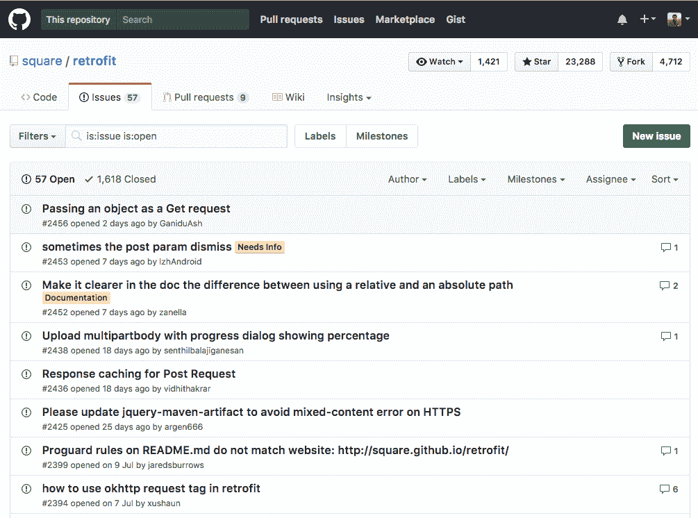
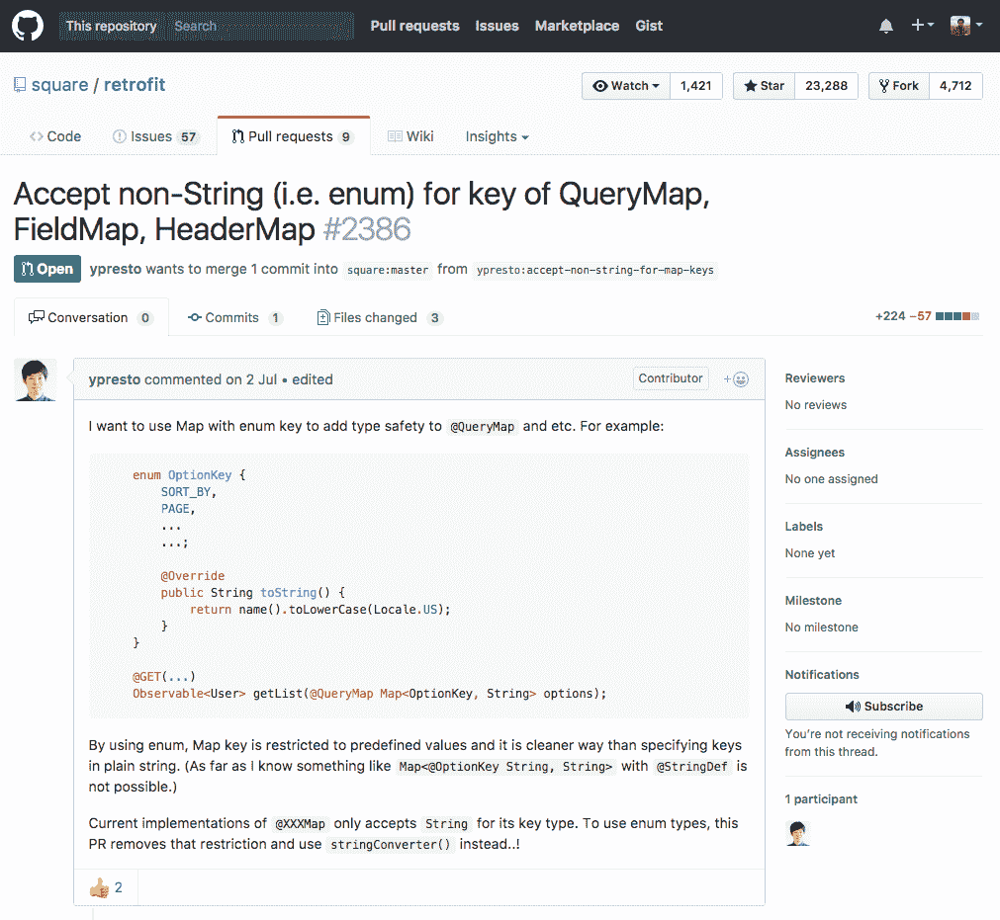
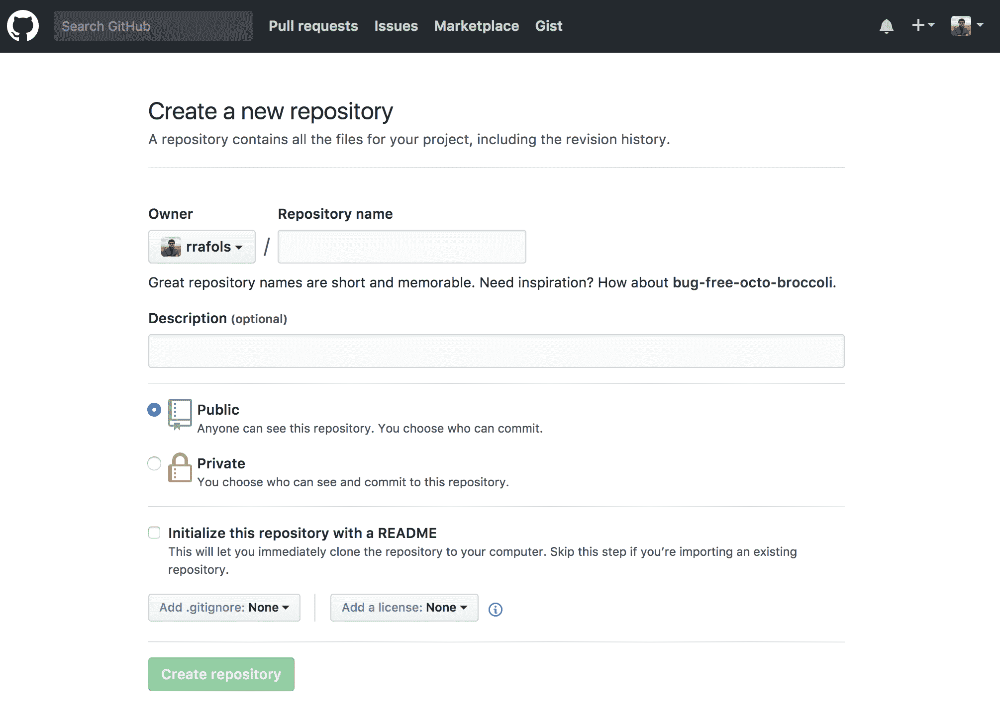
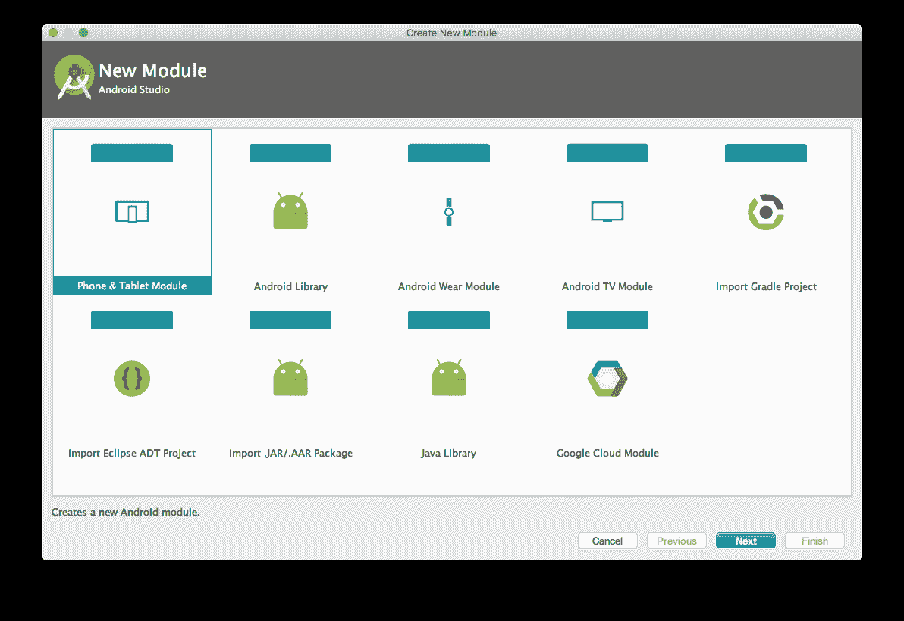
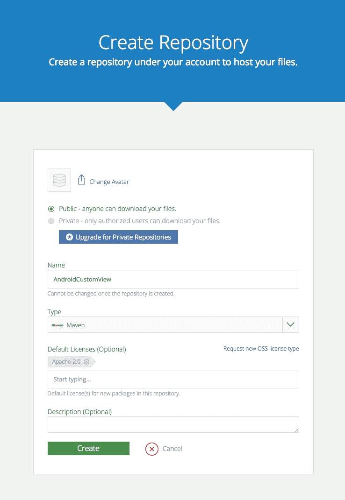
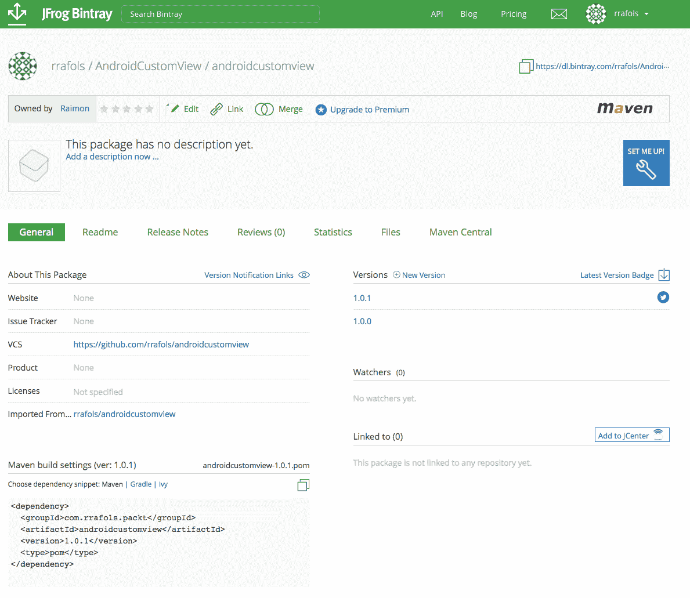
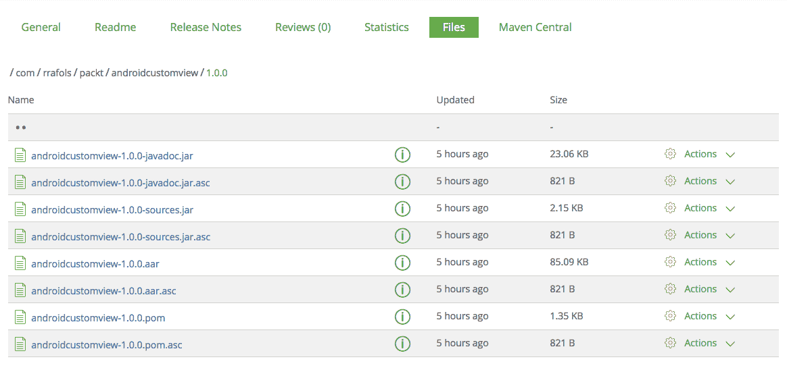

# 第八章：分享我们的自定义视图

在前面的章节中，我们已经构建了我们的自定义视图，或者其中许多。我们已经了解了如何与它们互动，如何绘制 2D 和 3D 原始图形，现在我们希望其他人也能使用它。这是一个很好的想法！这可能是为了我们自己，我们可能会在未来的项目中重用，或者可能是我们同事的一个项目。如果我们目标更高，它可能是 Android 社区的一个项目。

让 Android 社区变得出色的一件事是有大量的开源库。开发者们的所有这些贡献帮助许多其他开发者开始了 Android 开发，深入理解某些概念，或者能够首先构建他们的应用程序。

首先，发布你的自定义视图，或者一个 Android 库，是贡献给这个惊人社区的方法之一。其次，这样做是宣传自己、展示雇主的开放性以及吸引公司人才的好方法。

在本章中，我们将了解如果想要分享我们的自定义视图应该考虑什么，以及如何做到这一点。我们还将实践一些在前面章节中给出的重要建议。更重要的是，我们希望其他开发者能使用我们的自定义视图。

更详细地说，我们将涵盖以下主题：

+   建议和最佳实践

+   发布你的自定义视图

几乎所有给出的建议不仅适用于自定义视图，也适用于我们想要分享或希望让同事或其他项目可重用的任何 Android 库。

# 分享自定义视图的最佳实践

尽管我们只是在为自己或一个小型应用构建自定义视图或组件，我们也应该始终追求尽可能高的质量。然而，如果我们想要分享我们的自定义视图，让其他人也能使用它，我们需要考虑一些额外的检查和最佳实践。如果我们目标是让尽可能多的开发者在他们的应用中使用它或为它贡献，那么如果我们忽视这些建议，将很难吸引他们参与。

# 考虑事项和建议

我们应该考虑的一件事是，一旦我们分享了自定义视图，它可能会被许多 Android 应用使用。如果我们的自定义视图有错误并且崩溃了，它将导致使用它的应用崩溃。应用的用户不会认为是自定义视图的问题，而是应用本身的问题。应用开发者可能会尝试提出问题，甚至提交一个 pull 请求来修复它，但如果自定义视图给他们带来太多麻烦，他们只会替换它。

这也适用于你自己的应用程序；你不想使用一个不稳定的组件或自定义视图，因为你可能最终要重写它或修补它。正如我们刚刚提到的，我们应始终追求最高质量。如果我们的自定义视图只在一个应用程序中使用，那么在生产阶段或应用程序发布到商店时发现一个关键问题的影响只影响一个应用程序。但是，如果它在多个应用程序中使用，维护的影响和成本就会增加。你可以想象，在开源组件中发现一个高度关键的问题，并不得不为所有使用它的应用程序发布新版本的影响。

此外，你应该尽量保持代码干净、组织有序、测试充分且文档合理。这对于你以及如果你在公司分享自定义视图的同事来说，将更容易维护自定义视图。如果它是开源的，这将鼓励贡献，并且实际上不会吓跑外部贡献者。与其他许多事情一样，常识适用。不要过度文档化你的自定义视图，因为基本上没人会去读它；尽量保持简单明了，直击要点。

在以下截图中，我们可以看到`retrofit`库的开放问题，这是一个在许多应用程序中广泛使用的开源 Android 库：



同时，我们可以看到有几位开发者提交了许多拉取请求，他们要么在修复问题，要么在添加功能或特性。以下截图是提交给`retrofit`库的一个拉取请求示例：



我们之前已经提到过，但自定义视图的行为正确也很重要。它不仅必须保证不崩溃，还必须在多种设备和分辨率下正常工作，并且具有良好的性能。

我们可以用以下要点总结建议列表：

+   稳定

+   在多种设备和分辨率下工作

+   性能优良

+   应用最佳代码实践和标准风格开发

+   文档齐全且易于使用

# 可配置

在第二章，*实现你的第一个自定义视图*中，我们解释了如何参数化自定义视图。我们创建它是因为它可能服务于一个非常具体的目的，但一般来说，它配置得越灵活，就越有可能在其他地方被使用。

想象一下我们正在构建一个进度条。如果我们的自定义视图总是绘制一个水平红色条，它会有其用途，但不会太多，因为它太具体了。如果我们允许使用这个自定义视图的应用程序的开发者自定义条的颜色，我们就会为它增加几个其他用例。此外，如果我们还允许开发者配置背景颜色或者绘制水平条之外的哪种原始图形，我们的自定义视图将涵盖更多不同的场景。

我们也需要注意；添加太多选项也会增加代码和组件本身的复杂性。配置颜色是直接的，影响并不大，但例如能够更改绘图原语可能稍微有点复杂。增加复杂性可能会影响性能、稳定性，以及我们在发布或制作新版本时测试和验证所有场景是否正常工作的能力。

# 发布我们的自定义视图

一旦我们对自定义视图及其现状感到满意，我们就可以准备分享了。如果我们也遵循了最佳实践和推荐，我们可能会更有信心。即使没有，最好的学习方式就是尽快从社区获得反馈。不要害怕犯错误；你会在过程中学到东西的。

发布自定义视图的方法有很多：我们可以选择开源，例如，或者我们可以只发布编译后的二进制文件作为 SDK 或 Android 库。以上大多数建议针对的是开源方法或内部重用，无论是为了自己还是同事，但其中许多（并非全部）也适用于你的目标是发布一个封闭的 SDK 或只作为库发布编译后的二进制文件。

# 开源我们自定义的视图

开源一个自定义视图或者，作为替代，一个 Android 库，是相当简单和直接的。你需要确保你执行了一些额外的步骤，但整个过程非常简单。

我们一直在使用 GitHub 分享本书示例的源代码。这并非巧合。GitHub 是分享源代码、开源库和项目最广泛使用的工具之一。它也是我们将在本章推荐并使用的工具，来解释如何发布我们的自定义视图。

首要任务是，如果我们还没有 GitHub 账户，就需要注册并创建一个。只要我们只想托管公开的仓库或公开可访问的代码，创建账户是免费的。如果我们想要用它来存储私有代码仓库，就有付费选项。就本书的范围而言，免费选项已经足够了。

我们可以直接从主页注册：[`www.github.com`](https://www.github.com) 或者从以下链接：

[加入 GitHub](https://github.com/join)

创建账户后，我们创建一个代码仓库来存储代码。我们可以在以下位置进行操作：

[新建 GitHub 仓库](https://github.com/new)。如下截图所示：

（图片无需翻译，直接复制原文）

我们必须选择一个仓库名称。强烈建议添加描述，这样其他人更容易理解我们的组件或库的功能。我们还可以选择添加一个 `.gitignore` 文件和许可证。

`.gitignore`是一个非常有用的文件。这里提到的所有文件都不会上传到 GitHub。例如，没有必要上传所有临时文件、构建文件、中间构建文件或 Android Studio 的配置文件，这些文件包含有关项目的特定信息，仅保存在我们的本地计算机上。例如，知道我们将项目存储在`\Users\raimon\development\AndroidCustomView`没有任何用。

添加许可证对于确定我们授予使用源代码者的权利非常重要。开源项目中最常见的许可证有 Apache 2.0、MIT 和 GPLv3 许可证：

+   MIT 是最少限制和最宽容的许可证。只要其他方在使用源代码时包含许可证和版权声明，就可以以任何方式使用源代码。

+   Apache 2.0 许可证同样非常宽容。与 MIT 许可证一样，只要其他方在使用源代码时包含许可证和版权声明，并说明对原始文件的更改，就可以以任何方式使用源代码。

+   GPLv3 稍微严格一些，因为它要求任何使用你源代码的人必须按照相同的许可证发布使用该源代码的应用程序源代码。这对于一些希望保留源代码知识产权的公司来说可能是一种限制。

这三种许可证都限制了原始开发者的责任，并不提供任何担保。它们都是将软件或源代码“按现状”提供。

许多 Android 库使用 MIT 或 Apache 2.0 许可证，我们建议您的自定义视图也使用这两个许可证之一。

仓库创建并初始化后，我们可以上传代码。我们可以使用任何偏好的 Git 客户端，或者直接使用命令行界面。

首先，我们克隆刚才创建的仓库——仅作为参考，并非真实的仓库：

```kt
raimon$ git clone https://github.com/rrafols/androidcustomview.git 
Cloning into 'androidcustomview'... 
remote: Counting objects: 5, done. 
remote: Compressing objects: 100% (4/4), done. 
remote: Total 5 (delta 0), reused 0 (delta 0), pack-reused 0 
Unpacking objects: 100% (5/5), done. 
```

检查连接。完成。

如果我们已经有了一个包含源代码的目录，Git 会报错，无法创建目录：

```kt
raimon$ git clone https://github.com/rrafols/androidcustomview.git 
```

fatal: destination path `androidcustomview` already exists and is not an empty directory.

在这种情况下，我们必须使用不同的方法。首先，我们必须初始化本地仓库：

```kt
androidcustomview raimon$ gitinit 
Initialized empty Git repository in /Users/raimon/dev/androidcustomview/.git/ 
```

然后添加远程仓库：

```kt
androidcustomview raimon$ git remote add origin https://github.com/rrafols/androidcustomview.git 
```

最后，从主分支拉取内容：

```kt
androidcustomview raimon$ git pull origin master 
remote: Counting objects: 5, done. 
remote: Compressing objects: 100% (4/4), done. 
remote: Total 5 (delta 0), reused 0 (delta 0), pack-reused 0 
Unpacking objects: 100% (5/5), done. 
From https://github.com/rrafols/androidcustomview 
 * branch            master     -> FETCH_HEAD 
 * [new branch]      master     -> origin/master 
```

现在我们可以添加所有希望添加到 GitHub 仓库的文件。在这个例子中，我们将添加所有内容，Git 会自动忽略与`.gitignore`文件中模式匹配的文件：

```kt
androidcustomview raimon$ git add *
```

现在我们可以将改动提交到本地仓库。一定要使用有意义的提交信息或描述，因为这将有助于以后了解都更改了什么。

```kt
androidcustomview raimon$ git commit -m "Adding initial files" 
[master bc690c7] Adding initial files 
 6 files changed, 741 insertions(+) 
```

完成这些操作后，我们就可以将提交推送到远程仓库，本例中的远程仓库位于[`github.com/`](https://github.com/)：

```kt
androidcustomview raimon$ git push origin master 
Username for 'https://github.com': rrafols 
Password for 'https://rrafols@github.com':  
Counting objects: 9, done. 
Delta compression using up to 4 threads. 
Compressing objects: 100% (8/8), done. 
Writing objects: 100% (8/8), 6.06 KiB | 0 bytes/s, done. 
Total 8 (delta 3), reused 0 (delta 0) 
remote: Resolving deltas: 100% (3/3), done. 
To https://github.com/rrafols/androidcustomview.git 
343509f..bc690c7 master -> master
```

若要了解更多关于 Git 的信息，请访问：

[`en.wikipedia.org/wiki/Git`](https://en.wikipedia.org/wiki/Git).

创建仓库时，GitHub 会询问我们是否要创建一个`README.md`文件。这个`README.md`文件将显示在仓库页面上作为文档。它使用 markdown 格式，这就是扩展名为`.md`的原因，并且重要的是要将其与项目信息保持同步，包括如何使用、一个快速示例、以及关于许可和作者的信息。这里最重要的部分是，任何想要使用你的自定义视图的人都可以快速查看如何操作，许可是否合适，以及如何联系你寻求支持和帮助。这部分是可选的，因为他们总是可以在 GitHub 上提出问题，但这样更好。我们甚至可以直接从以下位置编辑和预览更改：

[`github.com/`](https://github.com/)。

不仅要保持文档更新，保持库的维护和更新也很重要。有一些需要解决的错误，需要添加的新功能，新的 Android 版本可能会破坏、弃用、改进或添加新的方法，以及其他开发者提出问题或询问。当寻找自定义视图或 Android 库时，如果没有最近的更新，或者至少在过去的几个月内没有，它看起来像是被遗弃了，这大大降低了其他人使用它的机会。

# 创建二进制工件

我们一直在谈论共享自定义视图和 Android 库，好像它们是同一回事。分享自定义视图最合适的方式是作为 Android 库。Android 应用程序和 Android 库之间的主要区别在于，后者不能在设备或模拟器上独立运行，并且只会生成一个`.aar`文件。这个`.aar`文件稍后可以作为依赖项添加到 Android 应用程序项目或其他库中。我们还可以在同一个项目内拥有子模块，并且它们之间可以有依赖关系。为了了解这是如何工作的，我们将把自定义视图项目转换成 Android 库，并且将添加一个测试应用程序项目以快速测试它。

首先，一旦我们有了 Android 应用程序，我们可以通过执行两个简单的步骤将其转换为库：

1.  在 app 模块的`build.gradle`文件中删除提到`applicationId`的行。

1.  将应用的插件从`com.android.application`更改为`com.android.library`。

基本上更改以下内容：

```kt
apply plugin: 'com.android.application'

android {
   compileSdkVersion 25
   buildToolsVersion"25.0.2"

   defaultConfig {
       applicationId"com.rrafols.packt.customview"
       minSdkVersion 21
       targetSdkVersion 25
       versionCode 1
       versionName"1.0"
```

更改为以下内容：

```kt
apply plugin: 'com.android.library'

android {
   compileSdkVersion 25
   buildToolsVersion"25.0.2"

    defaultConfig {
       minSdkVersion 21
       targetSdkVersion 25
       versionCode 1
       versionName"1.0"
```

在我们的示例中，还将应用模块名称重构为 lib。

关于如何将 Android 应用程序转换为 Android 库的更多信息可以在开发者 Android 文档页面找到：

[`developer.android.com/studio/projects/android-library.html`](https://developer.android.com/studio/projects/android-library.html)。

如果我们正在开发或扩展这个库，我们建议在项目中添加一个新的模块作为测试应用程序。这将大大加快自定义视图的开发和测试速度。

我们可以使用 Android Studio 文件菜单添加一个新模块：文件 | 新建 | 新模块：



添加测试应用模块后，我们向库添加一个依赖项。在新模块的`build.gradle`文件中，添加对本地库模块的依赖：

```kt

dependencies {
    compile project(":lib")
    compile fileTree(dir: 'libs', include: ['*.jar'])
    androidTestCompile('com.android.support.test.espresso:espresso-core:2.2.2',
    {
        exclude group: 'com.android.support', module: 'support-annotations'
    })

    compile 'com.android.support:appcompat-v7:25.3.1'
    compile 'com.android.support.constraint:constraint-layout:1.0.2'
    testCompile'junit:junit:4.12'
}
```

现在，你可以将自定义视图添加到这个新的测试应用布局中并测试它。此外，我们还可以生成一个库二进制文件以供分发。它只包含库或 lib 模块。我们可以通过在 gradle 上执行`lib:assembleRelease`任务来实现：

```kt
Example32-Library raimon$ ./gradlew lib:assembleRelease 
```

我们可以在项目的`lib/build/outputs/aar/lib-release.aar`文件夹中获取`.aar`文件。使用`lib:assembleDebug`任务，我们将生成调试库，或者简单地使用`lib:assembleDebug`来获取调试和发布版本。

你可以以任何你喜欢的方式发布二进制文件，但一个建议是上传到构件平台。许多公司都在使用内部构件或软件仓库来存储企业库和一般的构件，但如果你想要向更广泛的公众开放，你可以上传到例如`JCenter`。如果我们检查任何 Android 项目中的最顶层的`build.gradle`文件，我们会看到有一个依赖于`JCenter`来查找库的依赖项：

```kt
... 
repositories {
    jcenter()
}
```

我们可以通过 Bintray 轻松完成此操作，例如：[`bintray.com`](https://bintray.com)。注册后，我们可以创建项目，从 GitHub 导入它们，创建发布和版本，如果我们的项目被接受，甚至可以发布到`JCenter`。

要获取有关 Bintray gradle 插件的更多信息，请访问：

[关于 bintray 的 gradle 插件更多信息](https://github.com/bintray/gradle-bintray-plugin#readme)。

为了简化我们的工作，有一些开源示例和代码可以使这个过程变得简单得多。但首先，让我们在 Bintray 上创建一个仓库。

我们将其命名为`AndroidCustomView`，将其设置为 Maven 仓库，并添加默认的 Apache 2.0 许可证：



拥有了它之后，我们可以创建版本，或者直接从我们的 gradle 构建脚本中添加。为此，我们必须向最顶层的`build.gradle`添加一些依赖项：

```kt
buildscript {
    repositories {
        jcenter()
    }

    dependencies {
        classpath'com.android.tools.build:gradle:2.3.0'
        classpath'com.jfrog.bintray.gradle:gradle-bintrayplugin:1.4'classpath'com.github.dcendents:android-maven-gradleplugin:1.4.1'
    }
}
```

现在我们可以利用一些已经创建的开源 gradle 构建脚本。我们不需要复制粘贴或向我们的构建脚本中添加更多代码，可以直接从 GitHub 应用它。让我们在库`build.gradle`文件的最后添加这两行：

```kt
... 
apply from: 'https://raw.githubusercontent.com/nuuneoi/JCenter/master/installv1.gra
 dle' 
apply from: 'https://raw.githubusercontent.com/nuuneoi/JCenter/master/bintrayv1.gra
 dle' 

```

应用了这两个 gradle 构建脚本之后，我们最终会得到一个额外的任务：`bintrayUpload`。我们需要首先添加构件配置，所以在库模块`build.gradle`文件的 apply 库行后面最前面添加它：

```kt
apply plugin: 'com.android.library'

ext {
    bintrayRepo = 'AndroidCustomView'
    bintrayName = 'androidcustomview'
    publishedGroupId = 'com.rrafols.packt'
    libraryName = 'AndroidCustomView'
    artifact = 'androidcustomview'
    libraryDescription = 'Uploading libraries example.'
    siteUrl = 'https://github.com/rrafols/AndroidCustomView'
    gitUrl = 'https://github.com/rrafols/androidcustomview.git'
    libraryVersion = '1.0.0'
    developerId = 'rrafols'
    developerName = 'Raimon Ràfols'
    developerEmail = ''
    licenseName = 'The Apache Software License, Version 2.0'
    licenseUrl = 'http://www.apache.org/licenses/LICENSE-2.0.txt'
    allLicenses = ["Apache-2.0"]
}
```

我们需要将 Bintray 用户和 API 密钥信息添加到我们的`local.properties`文件中：

```kt
bintray.user=rrafols 
bintray.apikey=<key - can be retrieved from the edit profile option on bintray.com> 
```

`bintrayRepo`变量必须与我们要存储二进制文件的仓库相匹配，否则构建脚本将失败。

现在我们已经完成了所有配置，我们可以使用`./gradlew` install 构建库的新版本，并使用`./gradlew bintrayUpload`上传到 Bintray。

请记住，版本一旦被上传后就是只读的，因此我们将无法覆盖它们，除非我们更新版本号并上传不同的版本，否则在执行我们的 gradle 脚本时将会出现错误。

一旦我们上传了一个版本，我们将看到类似下面的屏幕：



我们还可以检查已上传版本中的文件，以了解已上传了哪些内容。如果我们进入某个版本，并点击文件菜单，我们会看到`.aar`的 Android 库文件以及脚本为我们上传的所有其他文件。



如我们所见，它还打包并上传了源代码、`Javadoc`并创建了一个`.pom`文件，因为它是作为 Maven 仓库托管的。

完成所有这些步骤后，我们可以直接从构件仓库页面通过点击添加到 JCenter 将库上传到`JCenter`。一旦获得批准，任何想要使用我们库的人只需在`com.rrafols.packt.androidcustomview`上定义一个依赖项，就可以直接从`JCenter`获取。

要了解关于这个过程以及这些 gradle 构建脚本的作者更多信息，请访问：

[`inthecheesefactory.com/blog/how-to-upload-library-to-jcenter-maven-central-as-dependency/en`](https://inthecheesefactory.com/blog/how-to-upload-library-to-jcenter-maven-central-as-dependency/en)。

我们还没有提到但同样重要的是，如何对我们的库进行版本控制。每当我们创建一个新的发布版本时，都会创建一个版本号。强烈建议在为自定义视图版本控制时使用语义版本`MAJOR.MINOR.PATCH`。这样我们可以轻松地指示一个版本中的更改是否引入了不兼容性。例如，使用语义版本控制，如果我们更改了主要版本号，就表示我们引入了与先前版本的不兼容性；或者通过更改次要版本号，表示我们添加了新功能但没有引入任何不兼容性。这对于使用我们库的第三方或其他开发人员来说非常重要，这样他们可以知道从一个版本到下一个版本应该期待什么。

若要了解更多关于语义版本控制的信息，请访问：

[`semver.org/`](http://semver.org/)。

也请查看此示例的完整源代码，位于 GitHub 仓库中的`Example32-Library`文件夹。

# 摘要

在本章中，我们了解了分享我们的自定义视图的建议以及如何实际操作。开源我们的自定义视图或在公司内部分享它们有很多好处。我们不仅会更关注质量和细节，而且还将促进合作并丰富 Android 开发者社区。

在接下来的章节中，我们将学习如何把我们最近几章所涵盖的所有信息综合起来，构建一些更复杂的自定义视图，以便在我们的应用程序中直接使用和包含。
