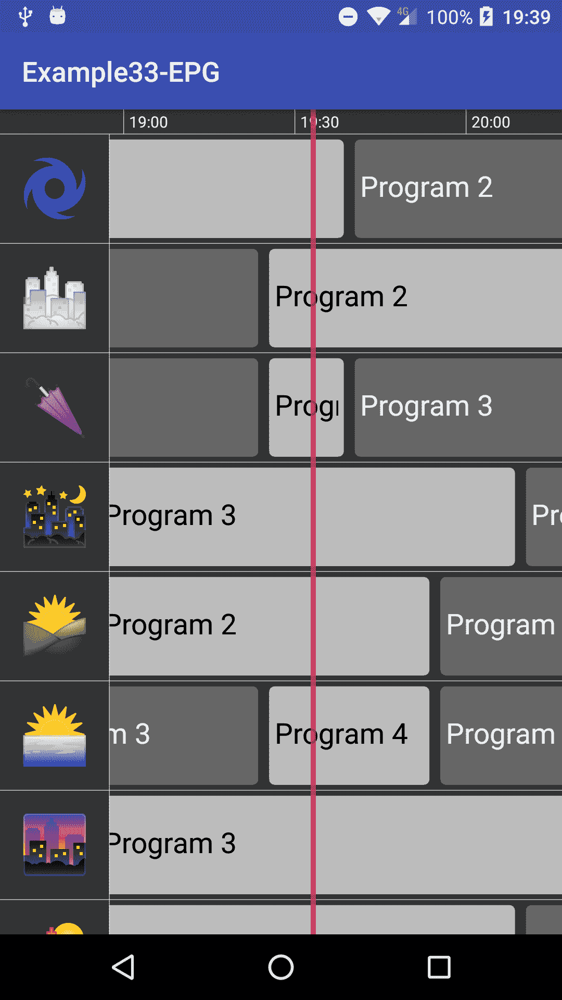
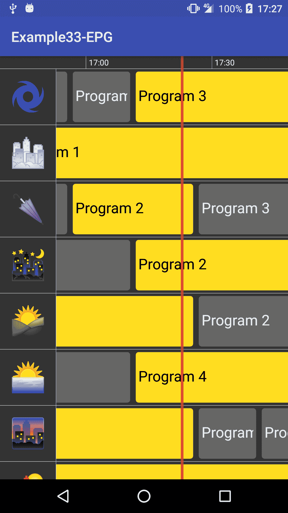

# 第九章：实现你自己的电子节目指南（EPG）

到目前为止，我们一直在构建一些非常基础的示例，以展示 Android 为我们提供的实现和绘制自定义视图的功能和方法。在本章中，我们将看到一个更复杂的自定义视图示例。我们将构建一个**电子节目指南**（**EPG**）。

EPG 是一个相当复杂的组件，如果构建不当，可能会影响用户体验。例如，如果它性能不佳，使用起来会感觉迟缓和繁琐。

我们将使用我们在前面章节中已经介绍过的几件事情。所有这些可能会有些多，但我们会一步一步地构建它，并且会更详细地介绍：

+   如何构建一个基本的 EPG 自定义视图

+   如何添加基本的动画和交互

+   如何允许缩放

+   使其可配置

# 构建 EPG

如果我们想让我们的 EPG 更有用，它应该能同时显示多个频道，以及当前和未来的电视节目。同时，清晰地看到当前正在播放的内容，并有明确的指示其他电视节目的开始和结束时间会很好。

在这个特定的组件中，我们将选择一种涵盖这些点的渲染方法。你可以把它作为一个例子，但还有许多其他方式来渲染同类的信息。同时，它不会连接到一个提供 EPG 数据的后端服务。所有的 EPG 数据都将被模拟，但可以轻松连接到任何服务，尽管可能需要进行一些更改。

# EPG 基础和动画设置

我们将从创建一个扩展视图的类开始。在其`onDraw()`方法中，我们将绘制以下部分：

+   视图背景

+   包含所有频道和电视节目的 EPG 主体

+   一个顶部的时间条提示时间

+   一条垂直线表示当前时间

如果我们有一些变量动画，我们还需要触发重绘周期。

所以，让我们开始实现这个`onDraw()`方法，并且一步一步地按照方法进行：

```kt
@Override 
protected void onDraw(Canvas canvas) { 
   animateLogic(); 

   long currentTime = System.currentTimeMillis(); 

   drawBackground(canvas); 
   drawEPGBody(canvas, currentTime, frScrollY); 
   drawTimeBar(canvas, currentTime); 
   drawCurrentTime(canvas, currentTime); 

   if (missingAnimations()) invalidate(); 
} 

```

最容易实现的方法将是`drawBackground()`：

```kt
private static final int BACKGROUND_COLOR = 0xFF333333; 
private void drawBackground(Canvas canvas) { 
    canvas.drawARGB(BACKGROUND_COLOR >> 24,  
            (BACKGROUND_COLOR >> 16) & 0xff, 
            (BACKGROUND_COLOR >> 8) & 0xff,  
            BACKGROUND_COLOR & 0xff); 
} 
```

在这个例子中，我们定义了一个背景颜色为`0xFF333333`，这是一种深灰色，我们只是用`drawARGB()`调用填充整个屏幕，遮罩和移动颜色组件。

现在，让我们来看看`drawTimeBar()`方法：

```kt
private void drawTimeBar(Canvas canvas, long currentTime) { 
    calendar.setTimeInMillis(initialTimeValue - 120 * 60 * 1000); 
    calendar.set(Calendar.MINUTE, 0); 
    calendar.set(Calendar.SECOND, 0); 
    calendar.set(Calendar.MILLISECOND, 0); 

    long time = calendar.getTimeInMillis(); 
    float x = getTimeHorizontalPosition(time) - frScrollX + getWidth()
             / 4.f; 

    while (x < getWidth()) { 
        if (x > 0) { 
            canvas.drawLine(x, 0, x, timebarHeight, paintTimeBar); 
        } 

        if (x + timeBarTextBoundaries.width() > 0) { 
            SimpleDateFormat dateFormatter = 
                    new SimpleDateFormat("HH:mm", Locale.US); 

            String date = dateFormatter.format(new Date(time)); 
            canvas.drawText(date, 
                    x + programMargin, 
                    (timebarHeight - timeBarTextBoundaries.height()) /
                    2.f + timeBarTextBoundaries.height(),paintTimeBar); 
        } 

        time += 30 * 60 * 1000; 
        x = getTimeHorizontalPosition(time) - frScrollX + getWidth() /
            4.f; 
    } 

    canvas.drawLine(0, 
            timebarHeight, 
            getWidth(), 
            timebarHeight, 
            paintTimeBar); 
} 
```

让我们解释一下这个方法的作用：

1.  首先，我们得到了我们想要开始绘制时间标记的初始时间：

```kt
calendar.setTimeInMillis(initialTimeValue - 120 * 60 * 1000); 
calendar.set(Calendar.MINUTE, 0); 
calendar.set(Calendar.SECOND, 0); 
calendar.set(Calendar.MILLISECOND, 0); 

long time = calendar.getTimeInMillis();  
```

我们在我们的类构造函数中定义了`initialTimeValue`，设置为当前时间后半小时。我们还移除了分钟、秒和毫秒，因为我们要指示每个小时的整点和半小时，例如：9.00, 9.30, 10.00, 10.30，等等。

然后，我们创建了一个辅助方法，根据时间戳获取屏幕位置，这将在代码中的许多其他地方使用：

```kt
private float getTimeHorizontalPosition(long ts) { 
    long timeDifference = (ts - initialTimeValue); 
    return timeDifference * timeScale; 
} 
```

1.  此外，我们需要根据设备屏幕密度计算一个时间刻度。为了计算它，我们定义了一个默认的时间刻度：

```kt
private static final float DEFAULT_TIME_SCALE = 0.0001f;  
```

1.  在类构造函数中，我们根据屏幕密度调整了时间刻度：

```kt
final float screenDensity = getResources().getDisplayMetrics().density; 
timeScale = DEFAULT_TIME_SCALE * screenDensity;  
```

我们知道有许多不同屏幕大小和密度的 Android 设备。这种方式，而不是硬编码像素尺寸，使得渲染在所有设备上尽可能接近。

在此方法的帮助下，我们可以轻松地循环处理半小时的块，直到达到屏幕末端。

```kt
float x = getTimeHorizontalPosition(time) - frScrollX + getWidth() / 4.f; 
while (x < getWidth()) { 

    ... 

    time += 30 * 60 * 1000; // 30 minutes 
    x = getTimeHorizontalPosition(time) - frScrollX + getWidth() / 4.f; 
} 

```

通过将 `30` 分钟（转换为毫秒）加到时间变量上，我们可以以 `30` 分钟的块来递增水平标记。

我们也考虑了 `frScrollX` 的位置。当我们添加允许滚动的交互时，这个变量将被更新，但我们在本章后面会看到这一点。

渲染非常直接：只要 `x` 坐标在屏幕内，我们就绘制一条垂直线：

```kt
if (x > 0) { 
    canvas.drawLine(x, 0, x, timebarHeight, paintTimeBar); 
} 

```

我们以 `HH:mm` 格式绘制时间，就在旁边：

```kt
SimpleDateFormat dateFormatter = new SimpleDateFormat("HH:mm", Locale.US); 
String date = dateFormatter.format(new Date(time)); 
canvas.drawText(date, 
        x + programMargin, 
        (timebarHeight - timeBarTextBoundaries.height()) / 2.f 
                + timeBarTextBoundaries.height(), paintTimeBar); 

```

我们可以做的性能改进之一是存储字符串，这样我们就无需一次又一次地调用格式化方法，避免昂贵的对象创建。我们可以通过创建一个以长整型变量作为键并返回字符串的 **HashMap** 来实现这一点：

```kt
String date = null; 
if (dateFormatted.containsKey(time)) { 
    date = dateFormatted.get(time); 
} else { 
    date = dateFormatter.format(new Date(time)); 
    dateFormatted.put(time, date); 
} 

```

如果我们已经有了格式化的日期，我们就使用它；如果这是第一次，我们先格式化并将其存储在 HashMap 中。

现在我们可以继续绘制当前时间指示器。这非常简单；它只是一个比单条线稍宽的垂直框，因此我们使用 `drawRect()` 而不是 `drawLine()`：

```kt
private void drawCurrentTime(Canvas canvas, long currentTime) { 
    float currentTimePos = frChNameWidth +
    getTimeHorizontalPosition(currentTime) - frScrollX; 
    canvas.drawRect(currentTimePos - programMargin/2, 
            0, 
            currentTimePos + programMargin/2, 
            timebarHeight, 
            paintCurrentTime); 

    canvas.clipRect(frChNameWidth, 0, getWidth(), getHeight()); 
    canvas.drawRect(currentTimePos - programMargin/2, 
            timebarHeight, 
            currentTimePos + programMargin/2, 
            getHeight(), 
            paintCurrentTime); 
} 

```

由于我们已经有了 `getTimeHorizontalPosition` 方法，我们可以轻松地确定绘制当前时间指示器的位置。由于我们将滚动浏览电视节目，因此我们将绘制分为两部分：一部分在时间条上绘制线条，不进行任何剪辑；另一部分从时间条末端到屏幕底部绘制线条。在后者中，我们应用剪辑，使其只绘制在电视节目上方。

为了更清楚地理解这一点，让我们看一下结果的截图：



在左侧，我们有表示频道的图标，顶部是时间条，其余部分是包含不同电视节目的电子节目指南（EPG）主体。我们希望避免当前时间线（红色）覆盖频道图标，因此我们应用了刚才提到的剪辑。

最后，我们可以实现整个 EPG 主体绘制。这比其他方法要复杂一些，因此让我们一步一步来。首先，我们需要计算要绘制的频道数量，以避免进行不必要的计算和试图在屏幕外绘制：

```kt
int startChannel = (int) (frScrollY / channelHeight); 
verticalOffset -= startChannel * channelHeight; 
int endChannel = startChannel + (int) ((getHeight() -  timebarHeight) / channelHeight) + 1; 
if (endChannel >= channelList.length) endChannel = channelList.length - 1; 
```

与时间刻度一样，我们也定义了一个默认的频道高度，并根据屏幕密度来计算它：

```kt
private static final int CHANNEL_HEIGHT = 80; 
... 
channelHeight = CHANNEL_HEIGHT * screenDensity; 

```

现在我们知道了需要绘制的初始频道和结束频道，我们可以概述绘制循环：

```kt
canvas.save(); 
canvas.clipRect(0, timebarHeight, getWidth(), getHeight()); 

for (int i = startChannel; i <= endChannel; i++) { 
    float channelTop = (i - startChannel) * channelHeight -
    verticalOffset +
    timebarHeight; 
    float channelBottom = channelTop + channelHeight; 

    ... 

} 

canvas.drawLine(frChNameWidth, timebarHeight, frChNameWidth, getHeight(), paintChannelText); 
canvas.restore(); 

```

我们将多次修改`canvas`的剪辑区域，因此让我们在方法开始时保存它，在结束时恢复它。这样我们就不会影响在此之后完成的任何其他绘图方法。在循环内，对于每个频道，我们还需要计算`channelTop`和`channelBottom`值，因为稍后在绘制时会很有用。这些值表示我们正在绘制的频道的顶部和底部的垂直坐标。

现在让我们为每个频道绘制图标，如果我们没有图标，首先从互联网上请求。我们将使用`Picasso`来管理互联网请求，但我们也可以使用任何其他库：

```kt
if (channelList[i].getIcon() != null) { 
    float iconMargin = (channelHeight -
    channelList[i].getIcon().getHeight()) / 2;

    canvas.drawBitmap(channelList[i].getIcon(), iconMargin, channelTop
    + iconMargin, null); 

} else { 
    if (channelTargets[i] == null) { 
        channelTargets[i] = new ChannelIconTarget(channelList[i]); 
    } 

    Picasso.with(context) 
            .load(channelList[i] 
            .getIconUrl()) 
            .into(channelTargets[i]); 
} 
```

关于毕加索的信息可以在以下链接找到：

[`square.github.io/picasso/`](http://square.github.io/picasso/)。

同时，对于每个频道，我们需要绘制屏幕内的电视节目。再次，让我们使用之前创建的方法将时间戳转换为屏幕坐标：

```kt
for (int j = 0; j < programs.size(); j++) { 
    Program program = programs.get(j); 

    long st = program.getStartTime(); 
    long et = program.getEndTime(); 

    float programStartX = getTimeHorizontalPosition(st); 
    float programEndX = getTimeHorizontalPosition(et); 

    if (programStartX - frScrollX > getWidth()) break; 
    if (programEndX - frScrollX >= 0) { 

        ... 

    } 
} 
```

在这里，我们从程序的开始和结束时间获取程序的开始和结束位置。如果开始位置超出了屏幕宽度，我们可以停止检查更多的电视节目，因为它们都将位于屏幕外，假设电视节目是按时间升序排序的。同样，如果结束位置小于 0，我们可以跳过这个特定的电视节目，因为它也将被绘制在屏幕外。

实际的绘制相当简单；我们使用`drawRoundRect`来绘制电视节目的背景，并在其上居中绘制节目名称。我们还剪辑了该区域，以防名称比电视节目框长：

```kt
canvas.drawRoundRect(horizontalOffset + programMargin + programStartX, 
       channelTop + programMargin, 
       horizontalOffset - programMargin + programEndX, 
       channelBottom - programMargin, 
       programMargin, 
       programMargin, 
       paintProgram); 

canvas.save(); 
canvas.clipRect(horizontalOffset + programMargin * 2 + programStartX, 
       channelTop + programMargin, 
       horizontalOffset - programMargin * 2 + programEndX, 
       channelBottom - programMargin); 

paintProgramText.getTextBounds(program.getName(), 0, program.getName().length(), textBoundaries); 
float textPosition = channelTop + textBoundaries.height() + ((channelHeight - programMargin * 2) - textBoundaries.height()) / 2; 
canvas.drawText(program.getName(), 
           horizontalOffset + programMargin * 2 + programStartX, 
           textPosition, 
           paintProgramText); 
canvas.restore(); 

```

我们还增加了一个小检查，以确定电视节目是否正在播放。如果当前时间大于或等于节目开始时间，并且小于结束时间，我们可以得出结论，电视节目目前正在播放，并用高亮颜色渲染它。

```kt
if (st <= currentTime && et > currentTime) { 
    paintProgram.setColor(HIGHLIGHTED_PROGRAM_COLOR); 
    paintProgramText.setColor(Color.BLACK); 
} else { 
    paintProgram.setColor(PROGRAM_COLOR); 
    paintProgramText.setColor(Color.WHITE); 
} 

```

现在让我们添加动画周期。在这个例子中，我们选择了固定时间步长机制。我们只对滚动变量进行动画处理，包括水平和垂直的滚动以及屏幕中频道部分的运动：

```kt
private void animateLogic() { 
    long currentTime = SystemClock.elapsedRealtime(); 
    accTime += currentTime - timeStart; 
    timeStart = currentTime; 

    while (accTime > TIME_THRESHOLD) { 
        scrollX += (scrollXTarget - scrollX) / 4.f; 
        scrollY += (scrollYTarget - scrollY) / 4.f; 
        chNameWidth += (chNameWidthTarget - chNameWidth) / 4.f; 
        accTime -= TIME_THRESHOLD; 
    } 

    float factor = ((float) accTime) / TIME_THRESHOLD; 
    float nextScrollX = scrollX + (scrollXTarget - scrollX) / 4.f; 
    float nextScrollY = scrollY + (scrollYTarget - scrollY) / 4.f; 
    float nextChNameWidth = chNameWidth + (chNameWidthTarget -
                            chNameWidth) / 4.f; 

    frScrollX = scrollX * (1.f - factor) + nextScrollX * factor; 
    frScrollY = scrollY * (1.f - factor) + nextScrollY * factor; 
    frChNameWidth = chNameWidth * (1.f - factor) + nextChNameWidth *
    factor; 
} 

```

在我们后面的渲染和计算中，我们将使用`frScrollX`、`frScrollY`和`frChNameWidth`变量，它们包含了当前逻辑刻度与下一个逻辑刻度之间的分数部分。

我们将在下一节讨论向电子节目指南添加交互时看到如何滚动，但我们刚刚引入了频道部分的移动。现在，我们只是将每个频道渲染为一个图标，但是为了获取更多信息，我们添加了一个切换功能，使当前有图标的频道框变得更大，并在图标旁边绘制频道标题。

我们创建了一个布尔开关来跟踪我们正在渲染的状态，并在需要时绘制频道名称：

```kt
if (!shortChannelMode) { 
    paintChannelText.getTextBounds(channelList[i].getName(), 
            0, 
            channelList[i].getName().length(), 
            textBoundaries); 

    canvas.drawText(channelList[i].getName(), 
            channelHeight - programMargin * 2, 
            (channelHeight - textBoundaries.height()) / 2 +
             textBoundaries.height() + channelTop, 
            paintChannelText); 
} 

```

切换非常简单，因为它只是将频道框宽度目标更改为`channelHeight`，这样它就会有正方形的尺寸，或者在绘制文本时是`channelHeight`的两倍。动画周期将负责动画化这个变量：

```kt
if (shortChannelMode) { 
    chNameWidthTarget = channelHeight * 2; 
    shortChannelMode = false; 
} else { 
    chNameWidthTarget = channelHeight; 
    shortChannelMode = true; 
}  
```

# 交互

到目前为止，这并不是很有用，因为我们不能与它互动。要添加交互，我们需要从 View 中重写`onTouchEvent()`方法，正如我们在前面的章节中看到的。

在我们自己的`onTouchEvent`实现中，我们主要对`ACTION_DOWN`、`ACTION_UP`和`ACTION_MOVE`事件感兴趣。让我们看看我们已经完成的实现：

```kt
private float dragX; 
private float dragY; 
private boolean dragged; 

... 

@Override 
public boolean onTouchEvent(MotionEvent event) { 

    switch(event.getAction()) { 
        case MotionEvent.ACTION_DOWN: 
            dragX = event.getX(); 
            dragY = event.getY(); 

            getParent().requestDisallowInterceptTouchEvent(true); 
            dragged = false; 
            return true; 

        case MotionEvent.ACTION_UP: 
            if (!dragged) { 
                // touching inside the channel area, will toggle
                   large/short channels 
                if (event.getX() < frChNameWidth) { 
                    switchNameWidth = true; 
                    invalidate(); 
                } 
            } 

            getParent().requestDisallowInterceptTouchEvent(false); 
            return true; 

        case MotionEvent.ACTION_MOVE: 
            float newX = event.getX(); 
            float newY = event.getY(); 

            scrollScreen(dragX - newX, dragY - newY); 

            dragX = newX; 
            dragY = newY; 
            dragged = true; 
            return true; 
        default: 
            return false; 
    } 
} 

```

这个方法并没有太多逻辑；它只是在检查我们是否在屏幕上拖动，用上一次事件的拖动量差值来调用`scrollScreen`方法，并且，在只是点击频道框而没有拖动的情况下，触发切换以使频道框变大或变小。

`scrollScreen`方法简单地更新`scrollXTarget`和`scrollYTarget`并检查其边界：

```kt
private void scrollScreen(float dx, float dy) { 
    scrollXTarget += dx; 
    scrollYTarget += dy; 

    if (scrollXTarget < -chNameWidth) scrollXTarget = -chNameWidth; 
    if (scrollYTarget < 0) scrollYTarget = 0; 

    float maxHeight = channelList.length * channelHeight - getHeight()
    + 1 + timebarHeight; 
    if (scrollYTarget > maxHeight) scrollYTarget = maxHeight; 

    invalidate(); 
} 
```

同时，调用`invalidate`以触发重绘事件非常重要。在`onDraw()`事件本身中，我们检查所有动画是否完成，如果需要，则触发更多的重绘事件：

```kt
if (missingAnimations()) invalidate(); 
```

`missingAnimations`的实际实现非常直接：

```kt
private static final float ANIM_THRESHOLD = 0.01f; 

private boolean missingAnimations() { 
    if (Math.abs(scrollXTarget - scrollX) > ANIM_THRESHOLD) 
    return true;

if (Math.abs(scrollYTarget - scrollY) > ANIM_THRESHOLD)
    return true;

if (Math.abs(chNameWidthTarget - chNameWidth) > ANIM_THRESHOLD)
    return true;

return false;
} 
```

我们只是检查所有可以动画的属性，如果它们与目标值的差小于预定义的阈值。如果只有一个大于这个阈值，我们需要触发更多的重绘事件和动画周期。

# 缩放

由于我们为每个电视节目渲染一个盒子，其大小直接由电视节目持续时间决定，可能会出现电视节目标题比其渲染的盒子大的情况。在这些情况下，我们可能想要阅读标题的更多部分，或者在其它时候，我们可能想要稍微压缩一下，以便我们可以了解那天稍后电视上会有什么节目。

为了解决这个问题，我们可以在我们的 EPG 小部件上通过在设备屏幕上捏合来实现缩放机制。我们可以将这种缩放直接应用到`timeScale`变量上，并且由于我们在所有计算中都使用了它，它将保持一切同步：

```kt
scaleDetector = new ScaleGestureDetector(context,  
    new ScaleGestureDetector.SimpleOnScaleGestureListener() {  

    ... 

    }); 

```

为了简化，我们使用`SimpleOnScaleGestureListener`，它允许我们只重写我们想要使用的方法。

现在，我们需要修改`onTouchEvent`，让`scaleDetector`实例也处理这个事件：

```kt
@Override 
public boolean onTouchEvent(MotionEvent event) { 
    scaleDetector.onTouchEvent(event); 

    if (zooming) { 
        zooming = false; 
        return true; 
    } 

    ... 

} 

```

我们还添加了一个检查，看看我们是否正在缩放。我们将在`ScaleDetector`实现中更新这个变量，但概念是避免在正在缩放时滚动视图或处理拖动事件。

现在让我们实现`ScaleDetector`：

```kt
scaleDetector = new ScaleGestureDetector(context, new ScaleGestureDetector.SimpleOnScaleGestureListener() { 
    private long focusTime; 
    private float scrollCorrection = 0.f; 
    @Override 
    public boolean onScaleBegin(ScaleGestureDetector detector) { 
        zooming = true; 
        focusTime = getHorizontalPositionTime(scrollXTarget +
        detector.getFocusX() - frChNameWidth); 
        scrollCorrection = getTimeHorizontalPosition((focusTime)) -
        scrollXTarget; 
        return true; 
    } 

    public boolean onScale(ScaleGestureDetector detector) { 
        timeScale *= detector.getScaleFactor(); 
        timeScale = Math.max(DEFAULT_TIME_SCALE * screenDensity / 2,  
                        Math.min(timeScale, DEFAULT_TIME_SCALE *
                        screenDensity * 4)); 

        // correct scroll position otherwise will move too much when
           zooming 
        float current = getTimeHorizontalPosition((focusTime)) -
        scrollXTarget; 
        float scrollDifference = current - scrollCorrection; 
        scrollXTarget += scrollDifference; 
        zooming = true; 

        invalidate(); 
        return true; 
    } 

    @Override 
    public void onScaleEnd(ScaleGestureDetector detector) { 
        zooming = true; 
    } 
}); 

```

我们基本上在做两件事情。首先，我们将`timeScale`变量从默认值的一半调整到默认值的四倍：

```kt
timeScale *= detector.getScaleFactor(); 
timeScale = Math.max(DEFAULT_TIME_SCALE * screenDensity / 2,  
                Math.min(timeScale, DEFAULT_TIME_SCALE * screenDensity
                * 4)); 
```

同时，我们调整滚动位置以避免缩放时的不良效果。通过调整滚动位置，我们试图保持捏合焦点的位置不变，即使放大或缩小后也是如此。

```kt
float current = getTimeHorizontalPosition((focusTime)) - scrollXTarget; 
float scrollDifference = current - scrollCorrection; 
scrollXTarget += scrollDifference; 

```

有关`ScaleDetector`和手势的更多信息，请查看官方 Android 文档。

# 配置和扩展

如果你想创建一个可供多人使用的自定义视图，它需要是可定制的。电子节目指南（EPG）也不例外。在我们的初步实现中，我们硬编码了一些颜色和值，但让我们看看如何扩展这些功能，使我们的 EPG 可自定义。

# 使其可配置

在本书的初始章节中，我们介绍了如何添加参数，这样就可以轻松自定义我们的自定义视图。遵循同样的原则，我们创建了一个`attrs.xml`文件，其中包含了所有可自定义的参数：

```kt
<?xml version="1.0" encoding="utf-8"?> 
<resources> 
    <declare-styleable name="EPG"> 
        <attr name="backgroundColor" format="color"/> 
        <attr name="programColor" format="color"/> 
        <attr name="highlightedProgramColor" format="color"/> 
        <attr name="currentTimeColor" format="color"/> 
        <attr name="channelTextColor" format="color"/> 
        <attr name="programTextColor" format="color"/> 
        <attr name="highlightedProgramTextColor" format="color"/> 
        <attr name="timeBarColor" format="color"/> 

        <attr name="channelHeight" format="float"/> 
        <attr name="programMargin" format="float"/> 
        <attr name="timebarHeight" format="float"/> 
    </declare-styleable> 
</resources> 
```

可以添加许多其他变量作为参数，但从自定义视图的外观和感觉角度来看，这些是主要的自定义功能。

在我们的类构造函数中，我们还添加了读取和解析这些参数的代码。在它们不存在的情况下，我们会默认使用我们之前硬编码的值。

```kt
TypedArray ta = context.getTheme().obtainStyledAttributes(attrs, R.styleable.EPG, 0, 0); 
try { 
    backgroundColor = ta.getColor(R.styleable.EPG_backgroundColor,
    BACKGROUND_COLOR); 
    paintChannelText.setColor(ta.getColor(R.styleable.EPG_channelTextColor
                          Color.WHITE)); 
    paintCurrentTime.setColor(ta.getColor(R.styleable.EPG_currentTimeColor,
                          CURRENT_TIME_COLOR)); 
    paintTimeBar.setColor(ta.getColor(R.styleable.EPG_timeBarColor,
                          Color.WHITE)); 

    highlightedProgramColor =
    ta.getColor(R.styleable.EPG_highlightedProgramColor,
        HIGHLIGHTED_PROGRAM_COLOR);

    programColor = ta.getColor(R.styleable.EPG_programColor,
    PROGRAM_COLOR);

    channelHeight = ta.getFloat(R.styleable.EPG_channelHeight,
    CHANNEL_HEIGHT) * screenDensity;

    programMargin = ta.getFloat(R.styleable.EPG_programMargin,
    PROGRAM_MARGIN) * screenDensity;

    timebarHeight = ta.getFloat(R.styleable.EPG_timebarHeight,
    TIMEBAR_HEIGHT) * screenDensity;

    programTextColor = ta.getColor(R.styleable.EPG_programTextColor,
    Color.WHITE);

    highlightedProgramTextColor =
    ta.getColor(R.styleable.EPG_highlightedProgramTextColor,
        Color.BLACK);
} finally { 
    ta.recycle(); 
} 
```

为了让任何尝试自定义它的人更简单、更清晰，我们可以进行一个小改动。让我们将直接映射到像素大小的参数重新定义为尺寸，而不是浮点数：

```kt
<attr name="channelHeight" format="dimension"/> 
<attr name="programMargin" format="dimension"/> 
<attr name="timebarHeight" format="dimension"/> 
```

将解析代码更新为以下内容：

```kt
channelHeight = ta.getDimension(R.styleable.EPG_channelHeight, 
        CHANNEL_HEIGHT * screenDensity); 

programMargin = ta.getDimension(R.styleable.EPG_programMargin, 
        PROGRAM_MARGIN * screenDensity); 

timebarHeight = ta.getDimension(R.styleable.EPG_timebarHeight, 
        TIMEBAR_HEIGHT * screenDensity); 
```

使用`getDimension`而不是`getFloat`，它会自动将设置为密度像素的尺寸转换为实际像素。它不会对默认值进行这种转换，因此我们仍然需要自己乘以`screenDensity`。

最后，我们需要在`activity_main.xml`布局文件中添加这些配置：

```kt
<?xml version="1.0" encoding="utf-8"?> 
<LinearLayout  

    android:layout_width="match_parent" 
    android:layout_height="match_parent" 
tools:context="com.rrafols.packt.epg.MainActivity"> 

    <com.rrafols.packt.epg.EPG 
        android:id="@+id/epg_view" 
        android:layout_width="match_parent" 
        android:layout_height="match_parent" 
        app:channelHeight="80dp"
        app:highlightedProgramColor="#ffffdd20"
        app:highlightedProgramTextColor="#ff000000"/>
</LinearLayout>  
```

我们可以在以下屏幕截图中看到这些更改的结果：



# 实现回调

我们还没有介绍 EPG 的另一个关键功能，即点击电视节目时实际执行某些操作的能力。如果我们想用我们的 EPG 做一些有用的事情，而不仅仅是展示即将到来的标题，我们必须实现这个功能。

这个实现相当直接，将处理逻辑传递给外部监听器或回调。修改源代码以在 EPG 本身上实现一些自定义行为也相对容易。

首先，我们在 EPG 类中创建一个新的接口，带有一个单一的方法：

```kt
interface EPGCallback { 
    void programClicked(Channel channel, Program program); 
} 

```

每当我们点击电视节目时，都会调用这个方法，实现这个回调的任何人都会同时获得`Channel`和电视`Program`。

现在，让我们修改`onTouchEvent()`方法以处理这个新功能：

```kt
if (event.getX() < frChNameWidth) { 

    ... 

} else { 
    clickProgram(event.getX(), event.getY()); 
} 

```

在我们之前的代码中，我们只检查是否点击了屏幕的频道区域。现在我们可以使用另一个区域来检测我们是否点击了电视节目内部。

现在让我们实现`clickProgram()`方法：

```kt
private void clickProgram(float x, float y) { 
    long ts = getHorizontalPositionTime(scrollXTarget + x -
    frChNameWidth); 
    int channel = (int) ((y + frScrollY - timebarHeight) / 
    channelHeight); 

    ArrayList<Program> programs = channelList[channel].getPrograms(); 
    for (int i = 0; i < programs.size(); i++) { 
        Program pr = programs.get(i); 
        if (ts >= pr.getStartTime() && ts < pr.getEndTime()) { 
            if (callback != null) { 
                callback.programClicked(channelList[channel], pr); 
            } 
            break; 
        } 
    } 
}  
```

我们首先将用户点击的水平位置转换成时间戳，结合触摸事件的垂直位置，我们可以确定频道。有了频道和时间戳，我们就可以检查用户点击了哪个节目，并带着这些信息调用回调函数。

在 GitHub 示例中，我们添加了一个虚拟的监听器，它只记录被点击的频道和节目：

```kt
@Override 
protected void onCreate(Bundle savedInstanceState) { 
    super.onCreate(savedInstanceState); 
    setContentView(R.layout.activity_main); 

    EPG epg = (EPG) findViewById(R.id.epg_view); 
    epg.setCallback(new EPG.EPGCallback() { 
        @Override 
        public void programClicked(Channel channel, Program program) { 
            Log.d("EPG", "program clicked: " + program.getName() + "
            channel: " + channel.getName()); 
        } 
    }); 

    populateDummyChannelList(epg); 
} 

```

在这个 Activity 的`onCreate`中还有一个`populateDummyChannelList()`方法。这个方法只会填充随机的频道和电视节目数据，如果与真实的电子节目指南（EPG）数据提供者连接，应该移除这个方法。

整个示例可以在 GitHub 仓库的`Example33-EPG`文件夹中找到。

# 总结

在本章中，我们了解了如何构建一个具有许多功能的简单 EPG，但我们可能还留下许多其他功能没有实现。例如，我们的电视节目渲染相当简单，我们可以在电视节目框中添加更多信息，比如持续时间、开始时间和结束时间，甚至可以直接显示电视节目描述。

请随意使用 GitHub 仓库中的内容，进行操作、添加新的自定义或功能，并根据您的需要进行调整。

我们并没有特别讨论性能问题，但我们尽可能减少了`onDraw`方法及其调用方法中的内存分配数量，并尽可能减少了屏幕上的绘制内容，甚至不处理那些将落在屏幕边界之外的元素。

如果我们希望自定义视图（在这个案例中是 EPG）能够快速响应、伸缩以适应更多频道和电视节目，那么考虑这些细节是至关重要的。

在下一章中，我们将构建另一个复杂的自定义视图，可以用它在我们的 Android 应用程序上绘制图表。
