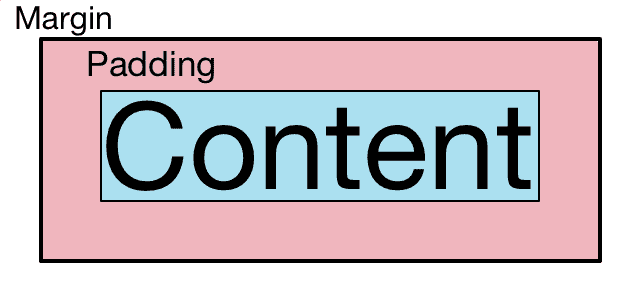
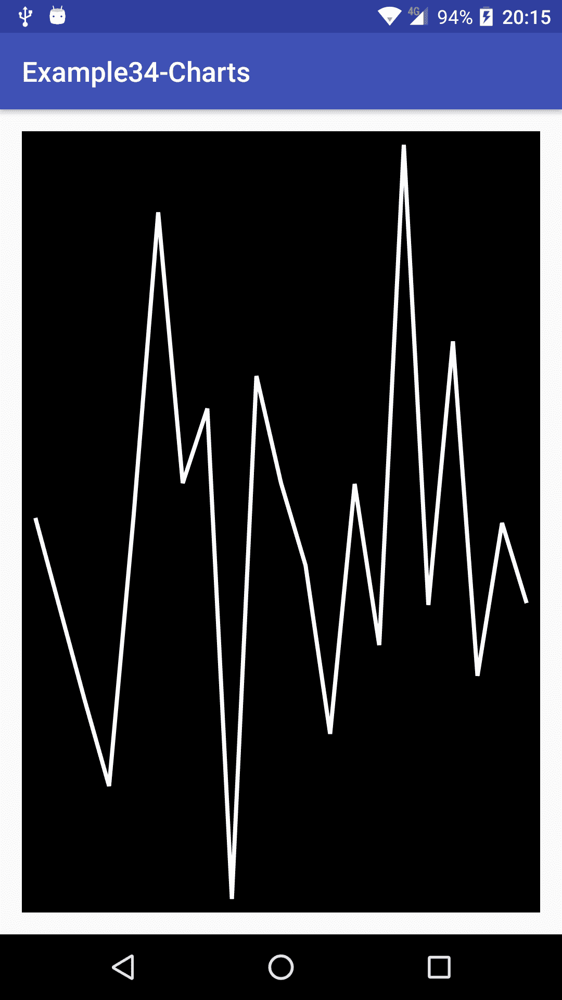
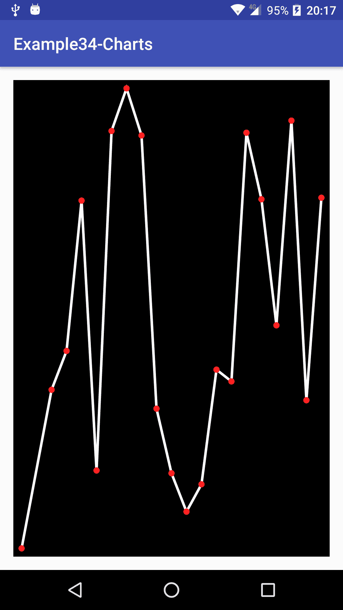
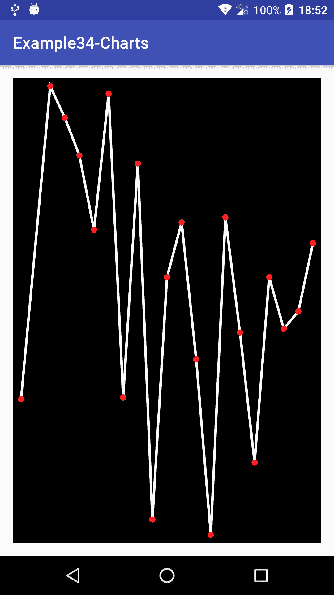
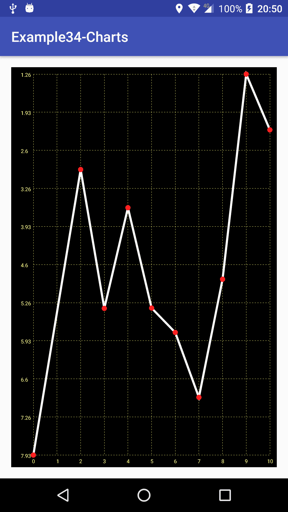
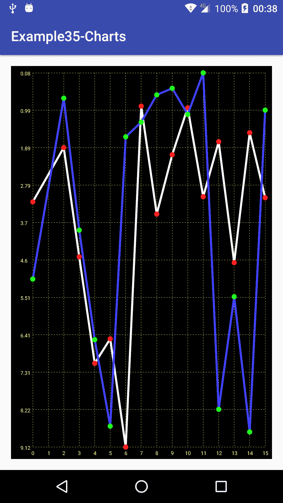

# 第十章：构建图表组件

在上一章中，我们了解到如何构建一个复杂的自定义视图，它融合了本书所介绍的所有内容。它包括一些渲染代码，使用第三方库，具有触摸交互和动画效果，并且我们简要讨论了性能考量。这是一个相当完整自定义视图的例子，但它并非唯一。在本章中，我们将构建另一个复杂自定义视图。逐步地，我们将构建一个图表自定义视图，用以绘制可以嵌入到我们的 Android 应用程序中的图形。我们将从构建一个非常基础的实施开始，并在途中添加额外的功能和功能性。更详细地说，我们将了解以下内容：

+   构建一个基础图表组件

+   如何考虑边距和填充

+   使用路径改善渲染

+   更新和扩展我们的数据集

+   增加额外的特性和自定义

# 构建一个基础的图表自定义视图

在 Android 应用程序中，我们可能需要在某个时刻绘制一些图表。它可以是静态图表，这并不那么有趣，因为它可以被简单地替换为图像，也可以是动态图表，允许用户交互和对数据变化的反应。最后一种情况是我们可以使用自定义视图来绘制实时图表，添加多个数据源，甚至为其添加动画。让我们从构建一个非常简单的自定义视图开始，稍后我们会添加更多功能。

# 边距和填充

与任何普通视图一样，我们的自定义视图将受到布局管理器的边距和视图填充的影响。我们不应该太担心边距值，因为布局管理器将直接处理它们，并且会透明地修改我们的自定义视图可用的尺寸。我们需要考虑的是填充值。正如在下图中所看到的，边距是布局管理器在我们自定义视图前后添加的空间，而填充则是视图边界与内容之间的内部空间：



我们的视图需要适当管理这个填充。为此，我们可以直接使用`canvas`中的不同`getPadding`方法，如`getPaddingTop()`、`getPaddingBottom()`、`getPaddingStart()`等。使用填充值，我们应该在`onDraw()`方法中相应地调整渲染区域：

```kt
protected void onDraw(Canvas canvas) {
    int startPadding = getPaddingStart();
    int topPadding = getPaddingTop();

    int width = canvas.getWidth() - startPadding - getPaddingEnd();
    int height = canvas.getHeight() - topPadding - getPaddingBottom();
}
```

在这段代码中，我们存储了 `Canvas` 的左侧和顶部点，分别是起始填充和顶部填充值。我们必须小心这句话，因为起始填充可能不是左侧填充。如果我们查看文档，我们会发现既有 `getPaddingStart()`，`getPaddingEnd()`，也有 `getPaddingLeft()` 和 `getPaddingRight()`。例如，如果我们的设备配置为**从右到左**（**RTL**）模式，则起始填充可能是右侧填充。如果我们想要支持 LTR 和 RTL 设备，我们必须注意这些细节。在这个特定示例中，我们将通过使用视图上可用的 `getLayoutDirection()` 方法检测布局方向来构建支持 RTL 的版本。但首先，让我们专注于一个非常简单的实现。

# 基本实现

我们的基本实现将非常直接。首先创建类及其构造函数：

```kt
public class Chart extends View {
    private Paint linePaint;

    public Chart(Context context, AttributeSet attrs) {
        super(context, attrs);
        linePaint = new Paint();
        linePaint.setAntiAlias(true);
        linePaint.setColor(0xffffffff);
        linePaint.setStrokeWidth(8.f);
        linePaint.setStyle(Paint.Style.STROKE);
    }
}
```

在我们的构造函数中初始化了一个 `Paint` 对象，但这次我们将样式设置为 `Paint.Style.STROKE`，因为我们只关心绘制线条。现在让我们添加一个方法，这样无论谁使用自定义视图都可以设置要渲染的数据：

```kt
private float[] dataPoints;
private float minValue;
private float maxValue;
private float verticalDelta;

public void setDataPoints(float[] originalData) {
    dataPoints = new float[originalData.length];
    minValue = Float.MAX_VALUE;
    maxValue = Float.MIN_VALUE;
    for (int i = 0; i< dataPoints.length; i++) {
        dataPoints[i] = originalData[i];
        if (dataPoints[i] <minValue) minValue = dataPoints[i];
        if (dataPoints[i] >maxValue) maxValue = dataPoints[i];
    }

    verticalDelta = maxValue - minValue;
    postInvalidate();
}
```

我们正在复制原始数据数组，因为我们无法控制它，它可能会在没有任何预警的情况下发生变化。稍后，我们将看到如何改进这种行为并适应数据集的变化。

我们还在数组上计算最大值和最小值以及它们之间的差值。这将使我们能够得到这些数字的相对比例，并将它们缩小或按需放大到 0 到 1 的比例，这将非常方便调整渲染以适应我们的视图高度。

现在我们有了数据，可以实现我们的 `onDraw()` 方法：

```kt
@Override
protected void onDraw(Canvas canvas) {
    canvas.drawARGB(255,0 ,0 ,0);

    float leftPadding = getPaddingLeft();
    float topPadding = getPaddingTop();

    float width = canvas.getWidth() - leftPadding - getPaddingRight();
    float height = canvas.getHeight() - topPadding -
    getPaddingBottom();

    float lastX = getPaddingStart();
    float lastY = height * ((dataPoints[0] - minValue) / verticalDelta)
    + topPadding;

    for (int i = 1; i < dataPoints.length; i++) {
        float y = height * ((dataPoints[i] - minValue) / verticalDelta)
        + topPadding;
        float x = width * (((float) i + 1) / dataPoints.length) +
        leftPadding;

        canvas.drawLine(lastX, lastY, x, y, linePaint);
        lastX = x;
        lastY = y;
    }
}
```

为了尽可能简单，目前我们使用 `canvas.drawARGB(255, 0, 0, 0)` 绘制黑色背景，然后通过从总宽度和高度中减去填充来计算 `Canvas` 上的可用大小。

我们还将在所有点之间平均分配水平空间，并垂直缩放它们以使用所有可用空间。由于我们计算了数据集中最小值和最大值之间的差，我们可以通过减去数值的最小值然后除以差值（或这里我们使用的 `verticalDelta` 变量）来将这些数字缩放到 `0` 到 `1` 的范围。

通过这些计算，我们只需跟踪之前的值，以便能够从旧点画到新点。这里，我们将最后的 `x` 和 `y` 坐标分别存储在 `lastX` 和 `lastY` 变量中，并在每次循环结束时更新它们。

# 使用路径进行优化和改进

实际上，我们可以在`onDraw()`方法中预先计算这些操作，因为每次在屏幕上绘制图表时都没有必要这样做。我们可以在`setDataPoints()`中执行，这是我们自定义视图中唯一可以更改或替换数据集的点：

```kt
public void setDataPoints(float[] originalData) {
    dataPoints = new float[originalData.length];

    float minValue = Float.MAX_VALUE;
    float maxValue = Float.MIN_VALUE;
    for (int i = 0; i < dataPoints.length; i++) {
        dataPoints[i] = originalData[i];
        if (dataPoints[i] < minValue) minValue = dataPoints[i];
        if (dataPoints[i] > maxValue) maxValue = dataPoints[i];
    }

    float verticalDelta = maxValue - minValue;

    for (int i = 0; i < dataPoints.length; i++) {
        dataPoints[i] = (dataPoints[i] - minValue) / verticalDelta;
    }

    postInvalidate();
}
```

现在，我们可以简化`onDraw()`方法，因为我们完全可以假设我们的数据集将始终在`0`和`1`之间变化：

```kt
@Override
protected void onDraw(Canvas canvas) {
    canvas.drawARGB(255,0 ,0 ,0);

    float leftPadding = getPaddingLeft();
    float topPadding = getPaddingTop();

    float width = canvas.getWidth() - leftPadding - getPaddingRight();
    float height = canvas.getHeight() - topPadding -
    getPaddingBottom();

    float lastX = getPaddingStart();
    float lastY = height * dataPoints[0] + topPadding;
    for (int i = 1; i < dataPoints.length; i++) {
        float y = height * dataPoints[i] + topPadding;
        float x = width * (((float) i) / dataPoints.length) +
        leftPadding;

        canvas.drawLine(lastX, lastY, x, y, linePaint);

        lastX = x;
        lastY = y;
    }
}
```

但我们可以更进一步，将线条图转换成一条`Path`：

```kt
private Path graphPath; 

@Override
protected void onDraw(Canvas canvas) {
    canvas.drawARGB(255,0 ,0 ,0);

    float leftPadding = getPaddingLeft();
    float topPadding = getPaddingTop();

    float width = canvas.getWidth() - leftPadding - getPaddingRight();
    float height = canvas.getHeight() - topPadding - 
    getPaddingBottom();

    if (graphPath == null) {
        graphPath = new Path();

        graphPath.moveTo(leftPadding, height * dataPoints[0] +
        topPadding);

        for (int i = 1; i < dataPoints.length; i++) {
            float y = height * dataPoints[i] + topPadding;
            float x = width * (((float) i + 1) / dataPoints.length) +
            leftPadding;

            graphPath.lineTo(x, y);
        }
    }

    canvas.drawPath(graphPath, linePaint);
}

```

它将在第一次调用`onDraw()`方法时生成一条从一点到另一点的`Path`。图表还将根据`canvas`的尺寸进行缩放。我们现在唯一的问题将是它不会自动调整以适应`canvas`大小的变化或我们的图表数据更新。让我们看看如何修复它。

首先，我们必须声明一个`boolean`类型的标志，以确定是否需要重新生成`Path`，以及两个变量来保存我们自定义视图的最后宽度和高度：

```kt
private boolean regenerate; 
private float lastWidth; 
private float lastHeight; 
```

在类的构造函数中，我们必须创建一个`Path`的实例。稍后，我们不是通过检查 null 来创建新实例，而是调用 reset 方法来生成新的`Path`，但重用这个对象实例：

```kt
graphPath = new Path(); 
lastWidth = -1; 
lastHeight = -1; 
```

在`setDataPoints()`中，我们只需在调用`postInvalidate`之前将`regenerate`设置为 true。在我们的`onDraw()`方法中，我们必须添加额外的检查以检测`canvas`大小何时发生变化：

```kt
if (lastWidth != width || lastHeight != height) {
    regenerate = true;

    lastWidth = width;
    lastHeight = height;
}
```

正如我们刚才提到的，我们将检查`boolean`标志的值而不是检查 null，以重新生成`Path`：

```kt
if (regenerate) {
    graphPath.reset();
    graphPath.moveTo(leftPadding, height * dataPoints[0] + topPadding);

    for (int i = 1; i < dataPoints.length; i++) {
        float y = height * dataPoints[i] + topPadding;
        float x = width * (((float) i + 1) / dataPoints.length) +
        leftPadding;

        graphPath.lineTo(x, y);
    }

    regenerate = false;
}
```

# 背景线条和细节

让我们将其添加到 Android 项目中以查看结果。首先创建一个非常简单的布局文件：

```kt
<?xml version="1.0" encoding="utf-8"?>
<LinearLayout 

    android:layout_width="match_parent"
    android:layout_height="match_parent"

    tools:context="com.rrafols.packt.chart.MainActivity">

    <com.rrafols.packt.chart.Chart
        android:layout_margin="16dp"
        android:padding="10dp"
        android:id="@+id/chart_view"
        android:layout_width="match_parent"
        android:layout_height="match_parent" />

</LinearLayout>
```

让我们也创建一个空的活动，这个活动将仅将此布局文件设置为内容视图，并为我们的图表组件生成一些随机数据以进行渲染：

```kt

@Override
protected void onCreate(Bundle savedInstanceState) {
   super.onCreate(savedInstanceState);
   setContentView(R.layout.activity_main);

   Chart chart = (Chart) findViewById(R.id.chart_view);

   float[] data = new float[20];
   for (int i = 0; i < data.length; i++) {
       data[i] = (float) Math.random() * 10.f;
   }

   chart.setDataPoints(data);
}
```

如果我们运行这个例子，我们将得到以下屏幕：



好的，我们已经完成了一个简单的实现，但让我们添加一些细节。首先，在每个数据点上添加一个小点以提高清晰度。让我们在类构造函数中创建一个新的`Paint`对象：

```kt
circlePaint = new Paint(); 
circlePaint.setAntiAlias(true); 
circlePaint.setColor(0xffff2020); 
circlePaint.setStyle(Paint.Style.FILL); 
```

一种实现方法是在每个数据点上绘制小圆圈。我们将在类构造函数中创建一个`circlePath`实例，并在需要重新生成时重置它。由于我们正在计算线条的坐标，因此可以直接将它们用作圆圈的位置：

```kt
@Override
protected void onDraw(Canvas canvas) {
    canvas.drawARGB(255,0 ,0 ,0);

    float leftPadding = getPaddingLeft();
    float topPadding = getPaddingTop();

    float width = canvas.getWidth() - leftPadding - getPaddingRight();
    float height = canvas.getHeight() - topPadding -
    getPaddingBottom();

    if (lastWidth != width || lastHeight != height) {

        regenerate = true;

        lastWidth = width;
        lastHeight = height;
    }

    if (regenerate) {
        circlePath.reset();
        graphPath.reset();

        float x = leftPadding;
        float y = height * dataPoints[0] + topPadding;

        graphPath.moveTo(x, y);
        circlePath.addCircle(x, y, 10, Path.Direction.CW);

        for (int i = 1; i < dataPoints.length; i++) {
            y = height * dataPoints[i] + topPadding;
            x = width * (((float) i + 1) / dataPoints.length) +
            leftPadding;

            graphPath.lineTo(x, y);
            circlePath.addCircle(x, y, 10, Path.Direction.CW);
        }

        regenerate = false;
    }

    canvas.drawPath(graphPath, linePaint);
    canvas.drawPath(circlePath, circlePaint);
}
```

在这个例子中，我们将圆的半径硬编码为`10`，仅比线条的厚度`8`稍大一点，但稍后我们将在本章中讨论自定义选项。

如果我们现在运行这个例子，我们将看到与之前版本的区别：



为了添加更直观的参考，我们还可以添加一些背景线条。由于它将使用不同的设置来绘制，首先我们创建一个新的`Paint`对象：

```kt
backgroundPaint = new Paint(); 
backgroundPaint.setColor(0xffBBBB40); 
backgroundPaint.setStyle(Paint.Style.STROKE); 
backgroundPaint.setPathEffect(new DashPathEffect(new float[] {5, 5}, 0)); 
```

现在，让我们修改`onDraw()`方法，以生成带有背景线条的新`Path`：

```kt
@Override
protected void onDraw(Canvas canvas) {
    canvas.drawARGB(255,0 ,0 ,0);

    float leftPadding = getPaddingLeft();
    float topPadding = getPaddingTop();

    float width = canvas.getWidth() - leftPadding - getPaddingRight();
    float height = canvas.getHeight() - topPadding -
    getPaddingBottom();

    if (lastWidth != width || lastHeight != height) {
        regenerate = true;

        lastWidth = width;
        lastHeight = height;
    }

    if (regenerate) {
        circlePath.reset();
        graphPath.reset();
        backgroundPath.reset();

 for (int i = 0; i <= dataPoints.length; i++) {
 float xl = width * (((float) i) / dataPoints.length) +
 leftPadding;
 backgroundPath.moveTo(xl, topPadding);
 backgroundPath.lineTo(xl, topPadding + height);
 }

 for (int i = 0; i <= 10; i++) {
 float yl = ((float) i / 10.f) * height + topPadding;
 backgroundPath.moveTo(leftPadding, yl);
 backgroundPath.lineTo(leftPadding + width, yl);
 }

        float x = leftPadding;
        float y = height * dataPoints[0] + topPadding;

        graphPath.moveTo(x, y);
        circlePath.addCircle(x, y, 10, Path.Direction.CW);

        for (int i = 1; i < dataPoints.length; i++) {
            x = width * (((float) i + 1) / dataPoints.length) + 
           leftPadding;
            y = height * dataPoints[i] + topPadding;

            graphPath.lineTo(x, y);
            circlePath.addCircle(x, y, 10, Path.Direction.CW);
        }

        regenerate = false;
    }

    canvas.drawPath(backgroundPath, backgroundPaint);
    canvas.drawPath(graphPath, linePaint);
    canvas.drawPath(circlePath, circlePaint);
}
```

在这里，我们创建水平和垂直的线条。水平线条将在有数据点的确切位置创建。对于垂直线条，我们不会遵循相同的原理，我们只需在`Canvas`的顶部和底部之间均匀绘制 10 条垂直线条。执行我们的示例，现在我们会得到类似于以下屏幕的内容：



这样可以，但我们仍然缺少一些参考点。让我们绘制一些水平和垂直的标签。

首先，让我们创建一个标签数组，并创建一个方法，让使用此自定义视图的任何人都可以设置它们：

```kt
private String[] labels; 

public void setLabels(String[] labels) {
    this.labels = labels;
}

```

如果它们没有被设置，我们可以选择不绘制任何内容，或者自己生成它们。在这个例子中，我们将自动使用数组索引生成它们：

```kt
if (labels == null) {
     labels = new String[dataPoints.length + 1];
     for (int i = 0; i < labels.length; i++) {
         labels[i] = "" + i;
     }
 }
```

为了测量文本，以便我们可以居中它，我们将复用`Rect`对象。让我们创建并实例化它：

```kt
private Rect textBoundaries = new Rect(); 
```

现在，我们可以将以下代码添加到`onDraw()`方法中，以绘制底部的标签，我们的数据集中的每个点都有一个：

```kt
for (int i = 0; i <= dataPoints.length; i++) {
    float xl = width * (((float) i) / dataPoints.length) + leftPadding;
    backgroundPaint.getTextBounds(labels[i], 0, labels[i].length(),
    textBoundaries);
    canvas.drawText(labels[i], 
        xl - (textBoundaries.width() / 2), 
        height + topPadding + backgroundPaint.getTextSize() * 1.5f, 
        backgroundPaint);
}
```

我们还调整了图表的总高度，以添加一些标签的空间：

```kt
float height = canvas.getHeight() - topPadding - getPaddingBottom() 
        - backgroundPaint.getTextSize() + 0.5f; 
```

让我们也绘制一个侧边图例，指示点的值和刻度。由于我们绘制的是预定义的一组垂直线条，我们只需计算这些值。我们需要将这些值从 0 到 1 的范围转换回它们的原始范围和特定值。

我们需要根据标签大小调整图表的宽度和初始左侧点。因此，让我们计算侧标签的最大宽度：

```kt
float maxLabelWidth = 0.f;

for (int i = 0; i <= 10; i++) {
    float step = ((float) i / 10.f);
    float value = step * verticalDelta + minValue;
    verticalLabels[i] = decimalFormat.format(value);
    backgroundPaint.getTextBounds(verticalLabels[i], 0,
    verticalLabels[i].length(), textBoundaries);
    if (textBoundaries.width() > maxLabelWidth) {
        maxLabelWidth = textBoundaries.width();
    }
}
```

我们还使用了一个`DecimalFormat`实例来格式化浮点数值。我们使用以下模式创建了此`DecimalFormat`：

```kt
decimalFormat = new DecimalFormat("#.##"); 
```

此外，我们将标签存储在数组中，以避免每次绘制视图时都重新生成它们。在`maxLabelWidth`变量中存储最大标签宽度后，我们可以调整填充：

```kt
float labelLeftPadding = getPaddingLeft() + maxLabelWidth * 0.25f; 
float leftPadding = getPaddingLeft() + maxLabelWidth * 1.5f; 
```

我们仍然使用`leftPadding`来渲染所有对象，并使用`labelLeftPadding`来渲染标签。我们已经添加了最大标签的大小以及绘制标签前后分布的额外*50%*填充。因此，标签将具有额外的*25%*`maxLabelWidth`填充，这样标签末尾和图表开始之间将有另外*25%*的空间。

我们只需遍历数组并计算正确的垂直位置，就可以轻松绘制垂直标签：

```kt
for (int i = 0; i <= 10; i++) {
    float step = ((float) i / 10.f);
    float yl = step * height + topPadding- (backgroundPaint.ascent() +
    backgroundPaint.descent()) * 0.5f;
    canvas.drawText(verticalLabels[i],
        labelLeftPadding, 
        yl, 
        backgroundPaint);
}
```

为了在垂直坐标上居中文本，我们使用了当前字体上升和下降之间的平均值。

如果我们现在运行这个示例，我们将更详细地查看我们的图表：



我们在本章开头提到，我们将支持 RTL 和 LTR 设备。如果设备布局配置为 RTL，那么在图表视图中，图例在屏幕右侧会感觉更自然。让我们快速实现这个变化：

```kt
float labelLeftPadding = getPaddingLeft() + maxLabelWidth * 0.25f; 
float leftPadding = getPaddingLeft() + maxLabelWidth * 1.5f; 
float rightPadding = getPaddingRight(); 
float topPadding = getPaddingTop(); 

float width = canvas.getWidth() - leftPadding - rightPadding; 
float height = canvas.getHeight() - topPadding - getPaddingBottom() 
        - backgroundPaint.getTextSize() + 0.5f; 

if (getLayoutDirection() == LAYOUT_DIRECTION_RTL) { 
    leftPadding = getPaddingEnd(); 
    labelLeftPadding = leftPadding + width + maxLabelWidth * 0.25f; 
} 
```

我们唯一需要做的改变是检查布局方向是否为`LAYOUT_DIRECTION_RTL`，并更改`leftPadding`和`labelLeftPadding`，以更新绘制图表和标签的位置。

# 自定义

在上一章我们已经看到了如何向自定义视图添加参数。在本章中我们构建的图表自定义视图，我们可以配置例如颜色、线条粗细、点的大小等等，但相反，我们将关注其他类型的自定义，例如，反转垂直轴，以及启用或禁用底部和侧标签或图表图例的渲染。与之前的配置相比，这些将需要一些额外的代码调整和特定实现。

我们先从允许反转垂直轴开始。我们的默认实现将在顶部渲染较小的值，在图表底部渲染较大的值。这可能不是预期的结果，所以让我们添加一种方法来反转轴：

```kt
private boolean invertVerticalAxis;

public void setInvertVerticalAxis(boolean invertVerticalAxis) {
    this.invertVerticalAxis = invertVerticalAxis;
    regenerate = true;
    postInvalidate();
}
```

然后，我们只需改变标签生成的步骤，并在适用的情况下反转数据点的值。要更改标签的生成，我们可以通过简单地更新步骤的顺序来实现。我们不是从`0`到`1`获取一个数字，而是反转这个过程，从`1`到`0`获取一个数字：

```kt
float maxLabelWidth = 0.f;
if (regenerate) {
    for (int i = 0; i <= 10; i++) {
        float step;

        if (!invertVerticalAxis) {
 step = ((float) i / 10.f);
 } else {
 step = ((float) (10 - i)) / 10.f;
 }

        float value = step * verticalDelta + minValue;
        verticalLabels[i] = decimalFormat.format(value);
        backgroundPaint.getTextBounds(verticalLabels[i], 0,
        verticalLabels[i].length(), textBoundaries);
        if (textBoundaries.width() > maxLabelWidth) {
            maxLabelWidth = textBoundaries.width();
        }
    }
}
```

如果需要，根据标志位的值获取数据点的反转值，让我们添加一个新方法来实现：

```kt
private float getDataPoint(int i) { 
    float data = dataPoints[i]; 
    return invertVerticalAxis ? 1.f - data : data; 
} 
```

现在，我们不是直接从数组获取数据点，而应该使用这个方法，因为它会在需要时透明地反转数字。

如我们之前提到的，我们还添加了一个`setLabels()`方法，因此标签也可以在外部进行自定义。

我们还可以添加一个`boolean`类型的标志，以允许或阻止绘制图例和背景线条：

```kt
private boolean drawLegend;

public void setDrawLegend(boolean drawLegend) {
    this.drawLegend = drawLegend;
    regenerate = true;
    postInvalidate();
}
```

在绘制背景线条和标签之前，只需检查此标志的状态。

在 GitHub 仓库的`Example34-Charts`文件夹中查看完整的示例。

# 添加高级功能

我们一直在构建一个简单的图表自定义视图实现。但是，我们的自定义视图可能需要一些更多的功能，否则可能会显得有些静态或不太有用。我们无法构建我们可能想到或可能需要的所有功能。同时，我们也应该注意不要构建一个瑞士军刀式的自定义视图，因为它可能难以维护，并且可能对自定义视图性能产生影响。

# 实时更新

在我们自定义视图的首次简单实现中，我们创建了一个设置数据点的方法，但无法修改或更新数据。让我们进行一些快速更改，以便能够动态添加点。在这个实现中，我们在`setDataPoints()`方法中直接将值调整到了 0 到 1 的刻度。由于我们将提供一个添加新数据值的方法，我们可能会得到超出原有最小值和最大值的值，这将使之前计算的刻度无效。

首先，让我们用集合而不是数组来存储数据，这样我们可以轻松添加新值：

```kt
private ArrayList<Float> dataPoints;

public void setDataPoints(float[] originalData) {
    ArrayList<Float> array = new ArrayList<>();
    for (float data : originalData) {
        array.add(data);
    }

    setDataPoints(array);
}

public void setDataPoints(ArrayList<Float> originalData) {
    dataPoints = new ArrayList<Float>();
    dataPoints.addAll(originalData);

    adjustDataRange();
}
```

我们将数据存储在`ArrayList`中，并修改了`setDataPoints()`方法以便能够这样做。同时，我们创建了`adjustDataRange()`方法来重新计算数据的范围，并触发数据重新生成和视图的重新绘制：

```kt
private void adjustDataRange() {
    minValue = Float.MAX_VALUE;
    maxValue = Float.MIN_VALUE;
    for (int i = 0; i < dataPoints.size(); i++) {
        if (dataPoints.get(i) < minValue) minValue = dataPoints.get(i);
        if (dataPoints.get(i) > maxValue) maxValue = dataPoints.get(i);
    }

    verticalDelta = maxValue - minValue;

    regenerate = true;
    postInvalidate();
}
```

`addValue()`方法的实现相当简单。我们将新数据添加到`ArrayList`中，如果它在当前范围内，我们只需触发图形的重新生成和视图的重新绘制。如果它超出了当前范围，我们调用`adjustDataRange()`方法来调整所有数据到新范围：

```kt
public void addValue(float data) {
    dataPoints.add(data);

    if (data < minValue || data > maxValue) {
        adjustDataRange();
    } else {
        regenerate = true;
        postInvalidate();
    }
}
```

我们只需修改`getDataPoint()`方法，将数据调整到`0`到`1`的范围：

```kt
private float getDataPoint(int i) { 
    float data = (dataPoints.get(i) - minValue) / verticalDelta; 
    return invertVerticalAxis ? 1.f - data : data; 
} 
```

如果我们运行示例，可以看到可以向图中添加新点，它会自动调整。要完全更改或更新数据，必须调用`setDataPoints()`方法。

# 多个数据集

有时，我们希望显示多个图表以进行比较，或者简单地同时显示多个数据集。让我们进行一些修改，以允许在我们的图表自定义视图中同时显示两个图表。它可以进一步扩展以支持更多的图表，但在这个示例中，我们将限制为两个以简化逻辑。

首先，我们需要为每个图表创建不同的 Paint 和 Path 对象。我们将创建数组来存储它们，这样稍后迭代和渲染它们会更容易。例如，我们可以为每个图表创建具有不同颜色的多个 Paint 对象：

```kt
linePaint = new Paint[2]; 
linePaint[0] = new Paint(); 
linePaint[0].setAntiAlias(true); 
linePaint[0].setColor(0xffffffff); 
linePaint[0].setStrokeWidth(8.f); 
linePaint[0].setStyle(Paint.Style.STROKE); 

linePaint[1] = new Paint(); 
linePaint[1].setAntiAlias(true); 
linePaint[1].setColor(0xff4040ff); 
linePaint[1].setStrokeWidth(8.f); 
linePaint[1].setStyle(Paint.Style.STROKE); 
circlePaint = new Paint[2]; 
circlePaint[0] = new Paint(); 
circlePaint[0].setAntiAlias(true); 
circlePaint[0].setColor(0xffff2020); 
circlePaint[0].setStyle(Paint.Style.FILL);  
circlePaint[1] = new Paint(); 
circlePaint[1].setAntiAlias(true); 
circlePaint[1].setColor(0xff20ff20); 
circlePaint[1].setStyle(Paint.Style.FILL); 
```

实际上，一次又一次地设置相同的参数是一项相当多的工作，因此我们可以使用`Paint`的另一个构造函数，它从一个已存在的`Paint`对象复制属性：

```kt
linePaint = new Paint[2]; 
linePaint[0] = new Paint(); 
linePaint[0].setAntiAlias(true); 
linePaint[0].setColor(0xffffffff); 
linePaint[0].setStrokeWidth(8.f); 
linePaint[0].setStyle(Paint.Style.STROKE);

linePaint[1] = new Paint(linePaint[0]); 
linePaint[1].setColor(0xff4040ff); 

circlePaint = new Paint[2]; 
circlePaint[0] = new Paint(); 
circlePaint[0].setAntiAlias(true); 
circlePaint[0].setColor(0xffff2020); 
circlePaint[0].setStyle(Paint.Style.FILL); 

circlePaint[1] = new Paint(circlePaint[0]); 
circlePaint[1].setColor(0xff20ff20); 
```

还有`Path`对象和数据存储：

```kt
graphPath = new Path[2]; 
graphPath[0] = new Path(); 
graphPath[1] = new Path(); 

circlePath = new Path[2]; 
circlePath[0] = new Path(); 
circlePath[1] = new Path(); 

dataPoints = (ArrayList<Float>[]) new ArrayList[2]; 
```

我们还需要一个机制来将数据添加到特定的数据集：

```kt
public void setDataPoints(ArrayList<Float> originalData, int index) {
    dataPoints[index] = new ArrayList<Float>();
    dataPoints[index].addAll(originalData);

    adjustDataRange();
}
```

由于我们将拥有不同的数据集，我们必须计算所有数据集的最小值和最大值。我们将每个图使用相同的刻度，这样比较起来更容易：

```kt
private void adjustDataRange() {
    minValue = Float.MAX_VALUE;
    maxValue = Float.MIN_VALUE;
    for (int j = 0; j < dataPoints.length; j++) {
        for (int i = 0; dataPoints[j] != null && i <
        dataPoints[j].size(); i++) {
            if (dataPoints[j].get(i) < minValue) minValue =
            dataPoints[j].get(i);
            if (dataPoints[j].get(i) > maxValue) maxValue =
            dataPoints[j].get(i);
        }
    }

    verticalDelta = maxValue - minValue;

    regenerate = true;
    postInvalidate();
}
```

最后，我们需要更新`getDataPoint()`方法，以允许我们从不同的数据集中获取数据：

```kt
private float getDataPoint(int i, int index) { 
    float data = (dataPoints[index].get(i) - minValue) / verticalDelta; 
    return invertVerticalAxis ? 1.f - data : data; 
} 
```

使用这些方法，我们可以更新路径生成代码以生成多个`Path`。如果该图的 数据集未定义，它将不会生成`Path`。

```kt
for (int j = 0; j < 2; j++) {
    if (dataPoints[j] != null) {
        float x = leftPadding;
        float y = height * getDataPoint(0, j) + topPadding;

        graphPath[j].moveTo(x, y);
        circlePath[j].addCircle(x, y, 10, Path.Direction.CW);

        for (int i = 1; i < dataPoints[j].size(); i++) {
            x = width * (((float) i + 1) / dataPoints[j].size()) + 
            leftPadding;
            y = height * getDataPoint(i, j) + topPadding;

            graphPath[j].lineTo(x, y);
            circlePath[j].addCircle(x, y, 10, Path.Direction.CW);
        }
    }
}
```

渲染代码，只是遍历所有生成的`Path`并使用相应的`Paint`对象进行绘制：

```kt
for (int j = 0; j < graphPath.length; j++) {
    canvas.drawPath(graphPath[j], linePaint[j]);
    canvas.drawPath(circlePath[j], circlePaint[j]);
}
```

如果我们用两组随机数据运行这个示例，我们将看到类似于以下屏幕的内容：



# 放大和滚动

我们可以实现的另一个有趣功能是自定义视图的放大和滚动能力。就像我们在上一章中所做的那样，我们将使用 Android 的`ScaleDetector`类来检测捏合手势并在自定义视图中更新放大。

实现将与上一章有很大不同。在这种情况下，我们会以更简单的方式来做。由于我们希望放大所有内容，我们将应用`canvas`转换，而不是再次重新生成缩放的`Path`对象，但首先，让我们实现手势检测器并添加滚动和动画属性的能力。

我们几乎可以复制之前在自定义 EPG 视图中使用的相同方法，用于动画变量逻辑的检查，以及我们是否还有未完成的动画：

```kt
private boolean missingAnimations() {
    if (Math.abs(scrollXTarget - scrollX) > ANIM_THRESHOLD) 
        return true;

    if (Math.abs(scrollYTarget - scrollY) > ANIM_THRESHOLD)
        return true;

    return false;
}

private void animateLogic() {
    long currentTime = SystemClock.elapsedRealtime();
    accTime += currentTime - timeStart;
    timeStart = currentTime;

    while (accTime > TIME_THRESHOLD) {
        scrollX += (scrollXTarget - scrollX) / 4.f;
        scrollY += (scrollYTarget - scrollY) / 4.f;
        accTime -= TIME_THRESHOLD;
    }

    float factor = ((float) accTime) / TIME_THRESHOLD;
    float nextScrollX = scrollX + (scrollXTarget - scrollX) / 4.f;
    float nextScrollY = scrollY + (scrollYTarget - scrollY) / 4.f;

    frScrollX = scrollX * (1.f - factor) + nextScrollX * factor;
    frScrollY = scrollY * (1.f - factor) + nextScrollY * factor;
}
```

我们还可以几乎原封不动地添加检查拖动事件、将触摸事件发送到缩放检测器并根据拖动量滚动屏幕的代码：

```kt
@Override
public boolean onTouchEvent(MotionEvent event) {
    scaleDetector.onTouchEvent(event);

    if (zooming) {
        invalidate();
        zooming = false;
        return true;
    }

    switch(event.getAction()) {
        case MotionEvent.ACTION_DOWN:
            dragX = event.getX();
            dragY = event.getY();

            getParent().requestDisallowInterceptTouchEvent(true);
            dragged = false;
            return true;

        case MotionEvent.ACTION_UP:
            getParent().requestDisallowInterceptTouchEvent(false);
            return true;

        case MotionEvent.ACTION_MOVE:
            float newX = event.getX();
            float newY = event.getY();

            scrollScreen(dragX - newX, dragY - newY);

            dragX = newX;
            dragY = newY;
            dragged = true;
            return true;
        default:
            return false;
    }
}

private void scrollScreen(float dx, float dy) {
    scrollXTarget += dx;
    scrollYTarget += dy;

    if (scrollXTarget < 0) scrollXTarget = 0;
    if (scrollYTarget < 0) scrollYTarget = 0;

    if (scrollXTarget > getWidth() * scale - getWidth()) {
        scrollXTarget = getWidth() * scale - getWidth();
    }

    if (scrollYTarget > getHeight() * scale - getHeight()) {
        scrollYTarget = getHeight() * scale - getHeight();
    }

    invalidate();
}
```

我们定义了一个名为 scale 的变量，它将控制我们对图表自定义视图的放大（或缩放）量。现在，让我们编写`scaleDetector`的实现：

```kt
scaleDetector = new ScaleGestureDetector(context, new ScaleGestureDetector.SimpleOnScaleGestureListener() {
    private float focusX;
    private float focusY;
    private float scrollCorrectionX = 0.f;
    private float scrollCorrectionY = 0.f;

    @Override
    public boolean onScaleBegin(ScaleGestureDetector detector) {
        zooming = true;
        focusX = detector.getFocusX();
        focusY = detector.getFocusY();
        scrollCorrectionX = focusX * scale - scrollXTarget;
        scrollCorrectionY = focusY * scale - scrollYTarget;
        return true;
    }

    public boolean onScale(ScaleGestureDetector detector) {
        scale *= detector.getScaleFactor();
        scale = Math.max(1.f, Math.min(scale, 2.f));

        float currentX = focusX * scale - scrollXTarget;
        float currentY = focusY * scale - scrollYTarget;

        scrollXTarget += currentX - scrollCorrectionX;
        scrollYTarget += currentY - scrollCorrectionY;

        invalidate();
        return true;
    }

    @Override
    public void onScaleEnd(ScaleGestureDetector detector) {
        zooming = true;
    }
});
```

我们还实现了一个滚动校正机制，以尽可能保持放大时的居中。在这种情况下，我们必须在水平和垂直轴上实现它。算法背后的主要思想是计算手势关注点的水平和垂直位置，并在改变缩放时调整滚动位置，以保持其位置不变。

现在，我们的`onDraw()`方法将简单地从以下内容开始：

```kt
animateLogic(); 

canvas.save(); 

canvas.translate(-frScrollX, -frScrollY); 
canvas.scale(scale, scale); 
```

我们需要通过调用`animateLogic()`来检查和处理动画周期，然后正确地表现并保存我们的`canvas`状态，应用由滚动值`frScrollX`和`frScrollY`确定的平移，以及通过`scale`变量缩放整个`canvas`。

我们要渲染的所有内容都将被滚动位置偏移并由 scale 变量的值进行缩放。在结束方法之前，我们必须恢复我们的`canvas`，并在不是所有的属性动画都完成时触发新的重绘周期：

```kt
canvas.restore(); 
if (missingAnimations()) invalidate(); 
```

在 GitHub 仓库的`Example35-Charts`文件夹中查看完整的示例源代码。

# 总结

在本章中，我们了解了如何在 Android 应用程序中构建图表的自定义视图。我们还快速介绍了如何管理内边距、RTL / LTR 支持，最后通过支持多个数据集或添加放大和滚动的功能，为我们的自定义视图增加了复杂性。

我们实现这个自定义视图的方式；使用独立的数据范围并动态适应屏幕，意味着它将自动调整以适应任何屏幕分辨率，或者例如，适应屏幕方向的改变。这通常是一个好习惯，可以防止在多种设备上测试自定义视图时出现许多问题。此外，像我们在上一个示例中所做的那样，使屏幕上绘制的一切大小依赖于屏幕密度，将使可移植性更加容易。

在下一章中，我们将展示如何利用前几章中介绍的三维渲染功能来构建自定义视图。 
