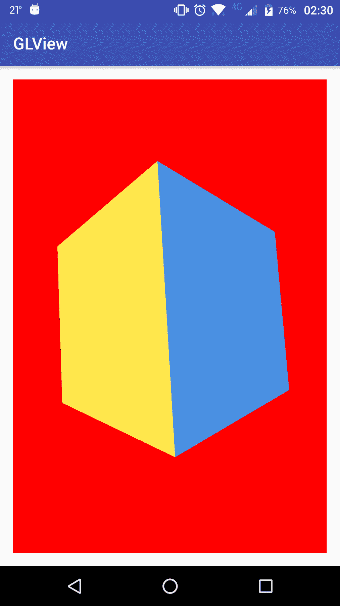
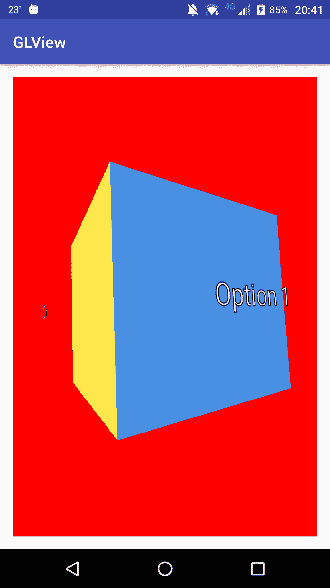
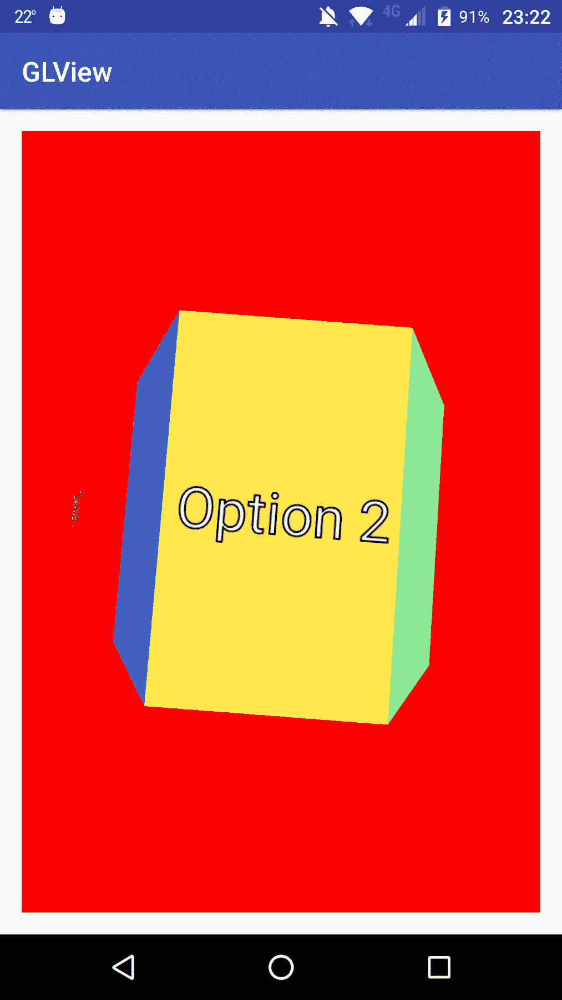

# 第十一章：创建一个 3D 旋转轮菜单

除了第五章，*介绍 3D 自定义视图*，我们解释了如何使用 OpenGL ES 构建自定义视图之外，本书中的所有其他示例都使用了`Canvas`类提供的 2D 绘图方法。在最后两章中，我们看到了如何构建稍微复杂的自定义视图，但它们都没有使用任何 3D 渲染技术。因此，在本章中，我们将展示如何构建和自定义一个完整的 3D 视图以及如何与之交互。

更详细地说，我们将在本章介绍以下内容：

+   向 3D 自定义视图添加交互

+   添加`GestureDetector`以管理复杂的手势

+   使用`scroller`管理滚动和抛动手势

+   将文本渲染成纹理并在 OpenGL ES 上绘制它们

+   程序化生成几何图形

# 创建一个交互式的 3D 自定义视图

在第五章，*介绍 3D 自定义视图*中，我们看到了如何使用 OpenGL ES 创建一个非常简单的旋转立方体。从这个示例开始，只需添加一种对用户交互做出反应的方式，我们就可以创建更复杂、更具交互性的自定义视图的基础。

# 添加交互

让我们从使用`Example25-GLDrawing`的代码开始。处理用户交互非常简单，正如我们在之前的示例中已经看到的。我们不需要做与之前不同的任何事情，只需在我们扩展`GLSurfaceView`的类中重写`onTouchEvent()`方法，并正确地对我们将接收到的不同 MotionEvents 做出反应。例如，如果我们接收到`MotionEvent.ACTION_DOWN`时不返回`true`，我们将不会收到任何进一步的事件，因为基本上我们是在说我们不处理这个事件。

一旦我们有示例的源代码，让我们添加一个简单的`onTouchEvent()`实现，用于跟踪拖动事件：

```kt
private float dragX; 
private float dragY; 

@Override 
public boolean onTouchEvent(MotionEvent event) { 
   switch(event.getAction()) { 
       case MotionEvent.ACTION_DOWN: 
           dragX = event.getX(); 
           dragY = event.getY(); 

           getParent().requestDisallowInterceptTouchEvent(true); 
           return true; 

       case MotionEvent.ACTION_UP: 
           getParent().requestDisallowInterceptTouchEvent(false); 
           return true; 

       case MotionEvent.ACTION_MOVE: 
           float newX = event.getX(); 
           float newY = event.getY(); 

           angleTarget -= (dragX - newX) / 3.f; 

           dragX = newX; 
           dragY = newY; 
           return true; 
       default: 
           return false; 
   } 
} 
```

我们将使用拖动量来改变立方体的旋转角度，我们将在以下代码片段中看到这一点。此外，在本章稍后，我们将看到如何使用`scroller`类进行此动画，但目前，让我们使用固定时间步进机制：

```kt
private float angle = 0.f; 
private float angleTarget = 0.f; 
private float angleFr = 0.f; 

private void animateLogic() { 
    long currentTime = SystemClock.elapsedRealtime(); 
    accTime += currentTime - timeStart; 
    timeStart = currentTime; 

    while (accTime > TIME_THRESHOLD) { 
        angle += (angleTarget - angle) / 4.f; 
        accTime -= TIME_THRESHOLD; 
    } 

    float factor = ((float) accTime) / TIME_THRESHOLD; 
    float nextAngle = angle + (angleTarget - angle) / 4.f; 

    angleFr = angle * (1.f - factor) + nextAngle * factor; 
} 
```

它使用了我们之前示例中一直遵循的相同原则，每隔`TIME_THRESHOLD`毫秒执行一次逻辑滴答。立方体角度值将在当前状态和下一个状态之间根据剩余执行时间进行插值。这个插值值将存储在`angleFr`变量中。

我们还对`onSurfaceChanged`进行了一些修改，以使用透视投影模式，而不是使用`Matrix.frustrumM`。后者定义了六个裁剪平面：近、远、上、下、左和右。然而，使用`Matrix.perspective`允许我们以摄像机视场角和两个裁剪平面：近和远来定义投影矩阵。在某些情况下可能更方便，但最终，这两种方法实现了相同的目标：

```kt
@Override 
public void onSurfaceChanged(GL10 unused, int width, int height) { 
    GLES20.glViewport(0, 0, width, height); 

    float ratio = (float) width / height; 
    Matrix.perspectiveM(mProjectionMatrix, 0, 90, ratio, 0.1f, 7.f); 
} 
```

最后，我们需要对`onDrawFrame()`方法进行一些修改：

```kt
@Override 
public void onDrawFrame(GL10 unused) { 
animateLogic();
    GLES20.glClearColor(1.0f, 0.0f, 0.0f, 1.0f); 
    GLES20.glClear(GLES20.GL_COLOR_BUFFER_BIT | GLES20.GL_DEPTH_BUFFER_BIT); 

    Matrix.setLookAtM(mViewMatrix, 0, 
            0, 0, -3, 
            0f, 0f, 0f, 
            0f, 1.0f, 0.0f); 

    Matrix.multiplyMM(mMVPMatrix, 0, mProjectionMatrix, 0, mViewMatrix, 0);
    Matrix.rotateM(mMVPMatrix, 0, angleFr, 0.f, 1.f, 0.f);
    Matrix.rotateM(mMVPMatrix, 0, 5.f, 1.f, 0.f, 0.f);
    GLES20.glUseProgram(shaderProgram); 
    int positionHandle = GLES20.glGetAttribLocation(shaderProgram, "vPosition"); 
    GLES20.glVertexAttribPointer(positionHandle, 3, 
            GLES20.GL_FLOAT, false, 
            0, vertexBuffer); 

    int texCoordHandle = GLES20.glGetAttribLocation(shaderProgram, "aTex"); 
    GLES20.glVertexAttribPointer(texCoordHandle, 2, GLES20.GL_FLOAT, false, 
                                 0, texBuffer); 
    int mMVPMatrixHandle = GLES20.glGetUniformLocation(shaderProgram,
                           "uMVPMatrix"); 

    GLES20.glUniformMatrix4fv(mMVPMatrixHandle, 1, false, mMVPMatrix, 0); 

    int texHandle = GLES20.glGetUniformLocation(shaderProgram, "sTex"); 
    GLES20.glActiveTexture(GLES20.GL_TEXTURE0); 
    GLES20.glBindTexture(GLES20.GL_TEXTURE_2D, textureId); 
    GLES20.glUniform1i(texHandle, 0); 

    GLES20.glEnable(GLES20.GL_DEPTH_TEST); 
    GLES20.glEnableVertexAttribArray(texHandle); 
    GLES20.glEnableVertexAttribArray(positionHandle); 
    GLES20.glDrawElements( 
            GLES20.GL_TRIANGLES, index.length, 
            GLES20.GL_UNSIGNED_SHORT, indexBuffer); 

    GLES20.glDisableVertexAttribArray(positionHandle); 
    GLES20.glDisableVertexAttribArray(texHandle); 
    GLES20.glDisable(GLES20.GL_DEPTH_TEST); 
} 
```

基本上，我们需要做的更改是调用`animateLogic()`方法来执行任何挂起的逻辑滴答，并使用插值的`angleFr`变量作为旋转角度。如果我们运行这个例子，我们将得到与`Example25`中相同的立方体，但在这个情况下，我们可以通过在屏幕上水平拖动来控制动画。我们还必须记住，从`GLSurfaceView`扩展我们的类时，无需调用`invalidate`或`postInvalidate`，除非特别指出，屏幕将不断重绘。

# 提高交互和动画效果。

我们一直在使用固定时间步机制来管理动画，但让我们看看使用 Android 提供的`scroller`类来处理动画，而不是自己处理所有动画，会给我们带来哪些优势。

首先，让我们创建一个`GestureDetector`实例来处理触摸事件：

```kt
private GestureDetectorCompat gestureDetector =  
        new GestureDetectorCompat(context, new MenuGestureListener()); 
```

我们使用了支持库中的`GestureDetectorCompat`，以确保在旧版本的 Android 上具有相同的行为。

正如我们在第三章《处理事件》中所述，通过引入`GestureDetector`，我们可以大大简化`onTouchEvent()`，因为所有逻辑将由`MenuGestureListener`回调处理，而不是在`onTouchEvent()`中处理：

```kt
@Override 
public boolean onTouchEvent(MotionEvent event) { 
    return gestureDetector.onTouchEvent(event); 
} 
```

`gestureDetector`需要一个`OnGestureListener`的实现，但如果我们只想实现一些方法，不想关心接口公开的其他方法，我们可以从`GestureDetector.SimpleOnGestureListener`继承，只覆盖我们需要的方法。`GestureDetector.SimpleOnGestureListener`类为`OnGestureListener`接口公开的所有方法提供了一个空的实现。

`SimpleOnGestureListener`还实现了其他接口，以使我们的软件工程师生活更加轻松，但请参考 Android 文档获取更多信息。

接下来，让我们创建自己的内部类`MenuGestureListener`，从`GestureDetector.SimpleOnGestureListener`继承：

```kt
class MenuGestureListener extends  
        GestureDetector.SimpleOnGestureListener { 
   @Override 
   public boolean onDown(MotionEvent e) { 
       scroller.forceFinished(true); 
       return true; 
   } 

   @Override 
   public boolean onScroll(MotionEvent e1, MotionEvent e2, float
   distanceX,
   float distanceY) { 
       scroller.computeScrollOffset(); 
       int lastX = scroller.getCurrX(); 

       scroller.forceFinished(true); 
       scroller.startScroll(lastX, 0, -(int) (distanceX + 0.5f), 0); 
       return true; 
   } 

   @Override 
   public boolean onFling(MotionEvent e1, MotionEvent e2, float 
   velocityX, float velocityY) { 
       scroller.computeScrollOffset(); 
       int lastX = scroller.getCurrX(); 

       scroller.forceFinished(true); 
       scroller.fling(lastX,
             0, 
             (int) (velocityX/4.f),
             0, 
             -360*100,
             360*100,
             0,
             0); 
       return true; 
   } 
} 
```

如我们之前提到的，即使是一个`OnGestureListener`实现，我们也需要在`onDown()`方法中返回`true`。否则，当有滚动或抛掷事件时，我们的`OnGestureListener`实现中的`onScroll()`或`onFling()`方法不会被调用。

无论如何，我们仍然需要在`onDown()`方法上做一些工作：我们需要停止任何正在运行的动画，以便自定义视图对用户的操作更加灵敏。

我们实现了另外两个方法：`onScroll()`和`onFling()`。它们都管理直接映射到不同滚动方式的不同的手势。当我们拖动屏幕时，将调用`onScroll()`方法，因为实际上我们正在滚动。另一方面，当我们执行抛动手势；即，当用户快速拖动并从屏幕上抬起手指时，我们需要考虑其他参数，如动画的速度和摩擦力。当手势结束时，动画仍会运行一段时间，根据定义的摩擦力逐渐减慢直至停止。在这种情况下，将调用我们监听器中的`onFling()`方法，并带有抛动事件的水平和垂直速度，由我们来处理摩擦力。

在这两个事件中，我们将使用`scroller`类来简化计算。我们本可以自己完成，尽管实现`onScroll()`逻辑相当直接，但正确实现`onFling()`动画需要一些计算和复杂性，通过使用`scroller`类我们可以省去这些麻烦。

在`onScroll()`实现中，我们仅从当前位置和拖动距离调用`scroller`的`startScroll`方法。为了获取当前位置，我们首先需要调用`scroller.computeScrollOffset`。如果我们不调用它，当前值将始终为零。调用此方法后，我们可以通过使用`getCurrX`方法来获取`scroller`的当前值。

由于在我们的监听器中获取的是浮点数距离，而`startScroll`只接受整数值，因此我们将`distanceX`值四舍五入，只需加上 0.5 然后转换为整数值。

类似地，在`onFling()`实现中，我们将调用`scroller`的`fling`方法。我们将获取当前位置，如我们在`onScroll()`实现中所描述的，并且我们将调整速度，因为从旋转立方体的动画角度来看它太高了。我们将立方体的最大和最小值设置为 100 圈，因为在正常情况下，我们不希望限制旋转。

现在，通过使用`scroller`，我们可以摆脱`animateLogic()`方法及其所有相关变量，因为我们不再需要它们。在滚动和抛动两种手势中，动画将在后台执行，我们可以直接从`scroller`实例查询当前的动画值。

在`onDraw()`方法上我们需要做的唯一更改是调用`scroller.computeScrollOffset`方法以获取更新后的值，并且不是使用`angleFr`变量，而是从`scroller`获取值：

```kt
Matrix.rotateM(mMVPMatrix, 0, scroller.getCurrX(), 0.f, 1.f, 0.f); 
```

# 添加可操作回调

让我们把这个转换成一个可操作的菜单。我们可以将一个动作映射到立方体的每个面。由于我们是沿着`y`轴水平旋转立方体，我们可以将一个动作映射到四个可用的每个面上。

为了更加清晰，目前旋转可能会在立方体的一个面的中间结束，让我们添加一个小功能：每当动画结束时，让它捕捉到最近的面对齐，这样在没有动画运行时，我们总会有一个完全对齐的立方体前方面。

实现捕捉功能相当简单。我们需要检查动画是否已经完成，如果是，检查哪个面正对相机。我们可以简单地将当前旋转角度除以`90`；四个面分割`360`度，每个面是`90`度。为了查看我们是否比下一个面更接近这个面，我们需要获取旋转角度的小数部分。如果我们计算旋转角度模`90`，我们会得到一个介于*0*和*89*之间的数字。如果这个结果小于从一个面切换到另一个面所需度数的一半，我们就在正确的面上。然而，在相反的情况下，如果这个结果大于`45`，或者小于`-45`，我们则分别需要旋转到下一个面或上一个面。让我们在`onDraw()`方法中，在调用`scroller.computeScrollOffset`之后，编写这个小逻辑：

```kt
if (scroller.isFinished()) { 
    int lastX = scroller.getCurrX(); 
    int modulo = lastX % 90; 
    int snapX = (lastX / 90) * 90; 
    if (modulo >= 45) snapX += 90; 
    if (modulo <- 45) snapX -= 90; 

    if (lastX != snapX) { 
        scroller.startScroll(lastX, 0, snapX - lastX, 0); 
    } 
} 
```

为了计算捕捉角度，我们对`90`进行整数除法并将结果乘以`90`。由于这是整数除法，它会去掉小数部分并计算该面的绝对角度值。另一种编写该代码的方式如下：

```kt
int face = lastX / 90; 
int snapX = face * 90; 
```

然后，根据模运算的结果，我们加上`90`或减去`90`，有效地转到下一个面或上一个面。

现在，让我们添加管理用户点击的代码。首先，让我们创建一个事件监听器的接口，将事件处理委托给该监听器：

```kt
interface OnMenuClickedListener { 
    void menuClicked(int option); 
} 
```

同时，让我们在我们的类中添加一个`OnMenuClickedListener`变量以及一个设置方法：

```kt
private OnMenuClickedListener listener; 

public void setOnMenuClickedListener(OnMenuClickedListener listener) { 
    this.listener = listener; 
} 
```

现在，我们可以在`MenuGestureListener`上实现`onSingleTapUp`方法：

```kt
@Override 
public boolean onSingleTapUp(MotionEvent e) { 
    scroller.computeScrollOffset(); 
    int angle = scroller.getCurrX(); 
    int face = (angle / 90) % 4; 
    if (face < 0) face += 4; 

    if (listener != null) listener.menuClicked(face); 
    return true; 
} 
```

让我们在`activity_main`布局文件中为我们的自定义视图添加一个`id`，这样我们就可以从代码中获取`GLDrawer`视图：

```kt
<?xml version="1.0" encoding="utf-8"?> 
<LinearLayout 

    android:id="@+id/activity_main" 
    android:layout_width="match_parent" 
    android:layout_height="match_parent" 
    android:orientation="vertical" 
    android:padding="@dimen/activity_vertical_margin" 
    tools:context="com.packt.rrafols.draw.MainActivity"> 

<com.packt.rrafols.draw.GLDrawer 
android:id="@+id/gldrawer"
        android:layout_width="match_parent" 
        android:layout_height="match_parent"/> 
</LinearLayout> 
```

最后，修改`MainActivity`类，创建一个`OnMenuClickedListener`并将其设置到`GLDrawer`视图：

```kt
@Override
protected void onCreate(Bundle savedInstanceState) {
    super.onCreate(savedInstanceState);
    setContentView(R.layout.activity_main);
    GLDrawer glDrawer = (GLDrawer) findViewById(R.id.gldrawer);
    glDrawer.setOnMenuClickedListener(new
    GLDrawer.OnMenuClickedListener() {
        @Override
        public void menuClicked(int option) {
            Log.i("Example36-Menu3D", "option clicked " + option);
        }
    });
}
```

如果我们运行这个例子，我们会看到`MainActivity`正在记录我们点击立方体的哪个面：

`com.packt.rrafols.draw I/Example36-Menu3D: 选项点击了 3`

`com.packt.rrafols.draw I/Example36-Menu3D: 选项点击了 2`。

我们还将看到捕捉功能是如何工作的。玩一玩它，看看它是如何捕捉到当前面，下一个面，或者如果我们向后滚动，则捕捉到前一个面。

# 自定义

我们仍然以`Example25`中留下来的方式渲染立方体。让我们改变它，用不同的实心颜色绘制每个立方体面。我们可以为每个顶点定义不同的颜色，但由于顶点在面之间共享，它们的颜色将会被插值。

我们将不得不复制一些顶点，以便每个面都有不同的唯一颜色：

```kt
private float quadCoords[] = { 
        -1.f, -1.f, -1.0f,  // 0 
        -1.f,  1.f, -1.0f,  // 1 
         1.f,  1.f, -1.0f,  // 2 
         1.f, -1.f, -1.0f,  // 3 

        -1.f, -1.f,  1.0f,  // 4 
        -1.f,  1.f,  1.0f,  // 5 
         1.f,  1.f,  1.0f,  // 6 
         1.f, -1.f,  1.0f,   // 7 

        -1.f, -1.f, -1.0f,  // 8 - 0 
        -1.f, -1.f,  1.0f,  // 9 - 4 
         1.f, -1.f,  1.0f,  // 10 - 7 
         1.f, -1.f, -1.0f,  // 11 - 3 

        -1.f,  1.f, -1.0f,  // 12 - 1 
        -1.f,  1.f,  1.0f,  // 13 - 5 
         1.f,  1.f,  1.0f,  // 14 - 6 
         1.f,  1.f, -1.0f,  // 15 - 2 

        -1.f, -1.f, -1.0f,  // 16 - 0 
        -1.f, -1.f,  1.0f,  // 17 - 4 
        -1.f,  1.f,  1.0f,  // 18 - 5 
        -1.f,  1.f, -1.0f,  // 19 - 1 

         1.f, -1.f, -1.0f,  // 20 - 3 
         1.f, -1.f,  1.0f,  // 21 - 7 
         1.f,  1.f,  1.0f,  // 22 - 6 
         1.f,  1.f, -1.0f   // 23 - 2 
}; 

private short[] index = { 
        0, 1, 2,        // front 
        0, 2, 3,        // front 
        4, 5, 6,        // back 
        4, 6, 7,        // back 
        8, 9,10,        // top 
        8,11,10,        // top 
       12,13,14,        // bottom 
       12,15,14,        // bottom 
       16,17,18,        // left 
       16,19,18,        // left 
       20,21,22,        // right 
       20,23,22         // right 
};  
```

我们还更新了索引，以便映射到新的面。在复制的顶点上，我们添加了带有新索引和旧索引的注释。

现在，我们可以定义一些颜色：

```kt
float colors[] = { 
        0.0f, 1.0f, 0.0f, 1.0f, 
        0.0f, 1.0f, 0.0f, 1.0f, 
        0.0f, 1.0f, 0.0f, 1.0f, 
        0.0f, 1.0f, 0.0f, 1.0f, 

        0.0f, 0.0f, 1.0f, 1.0f, 
        0.0f, 0.0f, 1.0f, 1.0f, 
        0.0f, 0.0f, 1.0f, 1.0f, 
        0.0f, 0.0f, 1.0f, 1.0f, 

        0.0f, 0.0f, 0.0f, 1.0f, 
        0.0f, 0.0f, 0.0f, 1.0f, 
        0.0f, 0.0f, 0.0f, 1.0f, 
        0.0f, 0.0f, 0.0f, 1.0f, 

        1.0f, 1.0f, 1.0f, 1.0f, 
        1.0f, 1.0f, 1.0f, 1.0f, 
        1.0f, 1.0f, 1.0f, 1.0f, 
        1.0f, 1.0f, 1.0f, 1.0f, 

        1.0f, 1.0f, 0.0f, 1.0f, 
        1.0f, 1.0f, 0.0f, 1.0f, 
        1.0f, 1.0f, 0.0f, 1.0f, 
        1.0f, 1.0f, 0.0f, 1.0f, 

        1.0f, 0.0f, 1.0f, 1.0f, 
        1.0f, 0.0f, 1.0f, 1.0f, 
        1.0f, 0.0f, 1.0f, 1.0f, 
        1.0f, 0.0f, 1.0f, 1.0f 
}; 
```

让我们也改变`initBuffer`方法中的纹理初始化，创建一个颜色`Buffer`，就像在`Example24-GLDrawing`中所做的那样：

```kt
ByteBuffer cbb = ByteBuffer.allocateDirect(colors.length * (Float.SIZE / 8)); 
cbb.order(ByteOrder.nativeOrder()); 

colorBuffer = cbb.asFloatBuffer(); 
colorBuffer.put(colors); 
colorBuffer.position(0); 
```

更新像素和顶点`Shader`：

```kt
private final String vertexShaderCode = 
        "uniform mat4 uMVPMatrix;" + 
        "attribute vec4 vPosition;" + 
        "attribute vec4 aColor;" + 
        "varying vec4 vColor;" + 
        "void main() {" + 
        "  gl_Position = uMVPMatrix * vPosition;" + 
        "  vColor = aColor;" + 
        "}"; 

private final String fragmentShaderCode = 
        "precision mediump float;" + 
        "varying vec4 vColor;" + 
        "void main() {" + 
        "  gl_FragColor = vColor;" + 
        "}"; 
```

为了使其更具可配置性，让我们在`GLDrawer`上创建一个公共的`setColors()`方法来更改颜色：

```kt
public void setColors(int[] faceColors) { 
    glRenderer.setColors(faceColors); 
} 
```

`Renderer`上的实现如下：

```kt
private void setColors(int[] faceColors) { 
    colors = new float[4 * 4 * faceColors.length]; 
    int wOffset = 0; 
    for (int faceColor : faceColors) { 
        float[] color = hexToRGBA(faceColor); 
        for(int j = 0; j < 4; j++) { 
            colors[wOffset++] = color[0]; 
            colors[wOffset++] = color[1]; 
            colors[wOffset++] = color[2]; 
            colors[wOffset++] = color[3]; 
        } 
    } 
    ByteBuffer cbb = ByteBuffer.allocateDirect(colors.length *
    (Float.SIZE /8)); 
    cbb.order(ByteOrder.nativeOrder()); 

    colorBuffer = cbb.asFloatBuffer(); 
    colorBuffer.put(colors); 
    colorBuffer.position(0); 
} 
```

为了简单起见，我们将颜色作为整数传递，而不是浮点数数组，这样我们就可以使用十六进制编码的颜色。要将整数颜色转换为浮点数数组，我们可以使用一个简单的辅助方法：

```kt
private float[] hexToRGBA(int color) { 
    float[] out = new float[4]; 

    int a = (color >> 24) & 0xff; 
    int r = (color >> 16) & 0xff; 
    int g = (color >>  8) & 0xff; 
    int b = (color      ) & 0xff; 

    out[0] = ((float) r) / 255.f; 
    out[1] = ((float) g) / 255.f; 
    out[2] = ((float) b) / 255.f; 
    out[3] = ((float) a) / 255.f; 
    return out; 
} 
```

为了更新示例，让我们使用刚才添加的方法设置一些颜色：

```kt
glDrawer.setColors(new int[] { 
        0xff4a90e2, 
        0xff161616, 
        0xff594236, 
        0xffff5964, 
        0xff8aea92, 
        0xffffe74c 
}); 
```

如果我们运行示例，我们将得到类似于以下截图的内容：



在 GitHub 仓库的`Example36-Menu3D`文件夹中查看此示例的完整源代码。

# 超越基本实现

我们已经拥有了一个非常基础且可操作的 3D 菜单，但为了使其能够用于生产应用程序，我们还需要添加一些更多细节。例如，现在我们可以根据我们选择的立方体面来选择不同的菜单选项，但除非我们正在做一个非常简单的颜色选择器，否则我们将完全盲目地选择一个选项，因为我们不知道每个面具体做什么。

解决此问题的一种方法是，根据选择的面来渲染一些文本，但在 OpenGL ES 上，我们不能像使用`Canvas`时那样简单地调用`drawText`来渲染文本。此外，在这个例子中，只有四个可选择的面或选项；让我们做一些更改，以便有更多可选择选项。

# 渲染文本

正如我们刚才提到的，为了渲染文本，我们不能仅仅调用一个`drawText`方法，在小型 3D 场景内渲染 3D 文本。实际上，我们会使用`drawText`，但只是将其渲染在背景`Bitmap`上，该`Bitmap`将用作我们还将渲染的附加平面的纹理。

为此，我们定义了该平面的几何形状：

```kt
private float planeCoords[] = { 
        -1.f, -1.f, -1.4f, 
        -1.f,  1.f, -1.4f, 
         1.f,  1.f, -1.4f, 
         1.f, -1.f, -1.4f, 
}; 

private short[] planeIndex = { 
        0, 1, 2, 
        0, 2, 3 
}; 

private float texCoords[] = { 
        1.f, 1.f, 
        1.f, 0.f, 
        0.f, 0.f, 
        0.f, 1.f 
}; 
```

由于立方体前面位于 z 坐标-1.f，这个平面将位于-1.4f，即比它靠前 0.4f，否则它可能会被立方体遮挡。

我们需要再次添加顶点和片段`Shader`，以便使用纹理进行渲染。尽管我们不会替换代码中已有的`Shader`，但我们将不得不同时使用这两套`Shader`：

```kt
private final String vertexShaderCodeText = 
        "uniform mat4 uMVPMatrix;" + 
        "attribute vec4 vPosition;" + 
        "attribute vec2 aTex;" + 
        "varying vec2 vTex;" + 
        "void main() {" + 
        "  gl_Position = uMVPMatrix * vPosition;" + 
        "  vTex = aTex;" + 
        "}"; 

private final String fragmentShaderCodeText = 
        "precision mediump float;" + 
        "uniform sampler2D sTex;" + 
        "varying vec2 vTex;" + 
        "void main() {" + 
        "  gl_FragColor = texture2D(sTex, vTex);" + 
        "}"; 
```

让我们也更新`initBuffers`方法，以初始化两套`Buffers`：

```kt
private void initBuffers() { 
    ByteBuffer vbb = ByteBuffer.allocateDirect(quadCoords.length  
            * (Float.SIZE / 8)); 
    vbb.order(ByteOrder.nativeOrder()); 

    vertexBuffer = vbb.asFloatBuffer(); 
    vertexBuffer.put(quadCoords); 
    vertexBuffer.position(0); 

    ByteBuffer ibb = ByteBuffer.allocateDirect(index.length 
            * (Short.SIZE / 8)); 
    ibb.order(ByteOrder.nativeOrder()); 

    indexBuffer = ibb.asShortBuffer(); 
    indexBuffer.put(index); 
    indexBuffer.position(0); 

    ByteBuffer cbb = ByteBuffer.allocateDirect(colors.length 
            * (Float.SIZE / 8)); 
    cbb.order(ByteOrder.nativeOrder()); 

    colorBuffer = cbb.asFloatBuffer(); 
    colorBuffer.put(colors); 
    colorBuffer.position(0); 

    vbb = ByteBuffer.allocateDirect(planeCoords.length 
            * (Float.SIZE / 8)); 
    vbb.order(ByteOrder.nativeOrder()); 

    vertexTextBuffer = vbb.asFloatBuffer(); 
    vertexTextBuffer.put(planeCoords); 
    vertexTextBuffer.position(0); 

    ibb = ByteBuffer.allocateDirect(planeIndex.length 
            *  (Short.SIZE / 8)); 
    ibb.order(ByteOrder.nativeOrder()); 

    indexTextBuffer = ibb.asShortBuffer(); 
    indexTextBuffer.put(planeIndex); 
    indexTextBuffer.position(0); 

    ByteBuffer tbb = ByteBuffer.allocateDirect(texCoords.length 
            * (Float.SIZE / 8)); 
    tbb.order(ByteOrder.nativeOrder()); 

    texBuffer = tbb.asFloatBuffer(); 
    texBuffer.put(texCoords); 
    texBuffer.position(0); 
}              
```

如我们所见，此方法分配了两套缓冲区：一套用于立方体，另一套用于我们将用来绘制文本的平面。我们必须对顶点和片段`Shaders`采取类似的方法，我们必须加载并链接两套`Shaders`：

```kt
private void initShaders() { 
    int vertexShader = loadShader(GLES20.GL_VERTEX_SHADER, vertexShaderCode); 
    int fragmentShader = loadShader(GLES20.GL_FRAGMENT_SHADER, 
    fragmentShaderCode); 

    shaderProgram = GLES20.glCreateProgram(); 
    GLES20.glAttachShader(shaderProgram, vertexShader); 
    GLES20.glAttachShader(shaderProgram, fragmentShader); 
    GLES20.glLinkProgram(shaderProgram); 

    vertexShader = loadShader(GLES20.GL_VERTEX_SHADER, vertexShaderCodeText); 
    fragmentShader = loadShader(GLES20.GL_FRAGMENT_SHADER,
    fragmentShaderCodeText); 

    shaderTextProgram = GLES20.glCreateProgram(); 
    GLES20.glAttachShader(shaderTextProgram, vertexShader); 
    GLES20.glAttachShader(shaderTextProgram, fragmentShader); 
    GLES20.glLinkProgram(shaderTextProgram); 
} 
```

我们将用于在纹理中绘制文本的着色器附加到我们将存储在`shaderTextProgram`变量中的另一个着色器程序。根据我们想要渲染的内容，我们现在可以从`shaderProgram`或`shaderTextProgram`之间切换。

现在让我们创建一个方法，该方法返回一个在其上居中文本的`Bitmap`：

```kt
private Bitmap createBitmapFromText(String text) { 
    Bitmap out = Bitmap.createBitmap(512, 512,
    Bitmap.Config.ARGB_8888); 
    out.eraseColor(0x00000000); 

    Paint textPaint = new Paint(); 
    textPaint.setAntiAlias(true); 
    textPaint.setColor(0xffffffff); 
    textPaint.setTextSize(60); 
    textPaint.setStrokeWidth(2.f); 
    textPaint.setStyle(Paint.Style.FILL); 

    Rect textBoundaries = new Rect(); 
    textPaint.getTextBounds(text, 0, text.length(), textBoundaries); 

    Canvas canvas = new Canvas(out); 
    for (int i = 0; i < 2; i++) { 
        canvas.drawText(text, 
                (canvas.getWidth() - textBoundaries.width()) / 2.f, 
                (canvas.getHeight() - textBoundaries.height()) / 2.f + 
                 textBoundaries.height(), textPaint); 
        textPaint.setColor(0xff000000); 
        textPaint.setStyle(Paint.Style.STROKE); 
    } 
    return out; 
} 
```

此方法创建一个大小为`512`乘`512`的`Bitmap`，每个颜色组件具有八位位深度，包含四个组成部分：alpha（透明度）、红色、绿色和蓝色。然后，它创建一个`Paint`对象，设置文本的颜色和大小，获取文本边界以便在`Bitmap`上居中，并在从`Bitmap`获取的`Canvas`对象上绘制两次文本。文本绘制两次，因为它首先使用纯白色绘制文本，然后，当我们把`Paint`对象的样式改为`STROKE`时，它使用黑色绘制轮廓。

我们在之前示例中的代码用于从本地资源加载纹理，它将其转换为未缩放的`Bitmap`，我们可以重用大部分代码来加载我们生成的`Bitmap`。让我们恢复我们已有的`loadTexture()`方法，但让我们更改它以使用辅助方法将`Bitmap`上传到`Texture`：

```kt
private int loadTexture(int resId) { 
    final int[] textureIds = new int[1]; 
    GLES20.glGenTextures(1, textureIds, 0); 

    if (textureIds[0] == 0) return -1; 

    // do not scale the bitmap depending on screen density 
    final BitmapFactory.Options options = new BitmapFactory.Options(); 
    options.inScaled = false; 

    final Bitmap textureBitmap =
    BitmapFactory.decodeResource(getResources(),
    resId, options); 
    attachBitmapToTexture(textureIds[0], textureBitmap); 

    return textureIds[0]; 
} 
```

辅助方法的实现如下：

```kt
private void attachBitmapToTexture(int textureId, Bitmap textureBitmap) { 
    GLES20.glBindTexture(GLES20.GL_TEXTURE_2D, textureId); 

    GLES20.glTexParameteri(GLES20.GL_TEXTURE_2D, 
            GLES20.GL_TEXTURE_MIN_FILTER, GLES20.GL_LINEAR); 

    GLES20.glTexParameteri(GLES20.GL_TEXTURE_2D, 
            GLES20.GL_TEXTURE_MAG_FILTER, GLES20.GL_LINEAR); 

    GLES20.glTexParameterf(GLES20.GL_TEXTURE_2D, 
            GLES20.GL_TEXTURE_WRAP_S, GLES20.GL_CLAMP_TO_EDGE); 

    GLES20.glTexParameterf(GLES20.GL_TEXTURE_2D, 
            GLES20.GL_TEXTURE_WRAP_T, GLES20.GL_CLAMP_TO_EDGE); 

    GLUtils.texImage2D(GLES20.GL_TEXTURE_2D, 0, textureBitmap, 0); 
} 
```

我们只需要创建一个将所有内容结合在一起的方法：即，一个从文本生成`Bitmap`，生成`textureIds`，将`Bitmap`上传为纹理，并回收`Bitmap`的方法：

```kt
private int generateTextureFromText(String text) { 
    final int[] textureIds = new int[1]; 
    GLES20.glGenTextures(1, textureIds, 0); 

    Bitmap textureBitmap = createBitmapFromText(text); 
    attachBitmapToTexture(textureIds[0], textureBitmap); 
    textureBitmap.recycle(); 
    return textureIds[0]; 
} 
```

使用此方法，我们现在可以为立方体的每个面生成不同的纹理：

```kt
@Override 
public void onSurfaceCreated(GL10 unused, EGLConfig config) { 
    initBuffers(); 
    initShaders(); 

    textureId = new int[4]; 
    for (int i = 0; i < textureId.length; i++) { 
        textureId[i] = generateTextureFromText("Option " + (i + 1)); 
    } 
} 
```

我们现在可以在`onDraw()`方法的底部添加一些额外的代码，以在立方体每个面的前方绘制一个平面：

```kt
GLES20.glUseProgram(shaderTextProgram); 
positionHandle = GLES20.glGetAttribLocation(shaderTextProgram, "vPosition"); 

GLES20.glVertexAttribPointer(positionHandle, 3, 
        GLES20.GL_FLOAT, false, 
        0, vertexTextBuffer); 

int texCoordHandle = GLES20.glGetAttribLocation(shaderTextProgram, "aTex"); 
GLES20.glVertexAttribPointer(texCoordHandle, 2, 
        GLES20.GL_FLOAT, false, 
        0, texBuffer); 

int texHandle = GLES20.glGetUniformLocation(shaderTextProgram, "sTex"); 
GLES20.glActiveTexture(GLES20.GL_TEXTURE0); 
GLES20.glEnable(GLES20.GL_BLEND); 
GLES20.glBlendFunc(GLES20.GL_SRC_ALPHA, GLES20.GL_ONE_MINUS_SRC_ALPHA); 

for (int i = 0; i < 4; i++) { 
    GLES20.glBindTexture(GLES20.GL_TEXTURE_2D, textureId[i]); 
    GLES20.glUniform1i(texHandle, 0); 

    mMVPMatrixHandle = GLES20.glGetUniformLocation(shaderTextProgram,
    "uMVPMatrix"); 
    GLES20.glUniformMatrix4fv(mMVPMatrixHandle, 1, false, mMVPMatrix,
    0); 

    GLES20.glEnableVertexAttribArray(texHandle); 
    GLES20.glEnableVertexAttribArray(positionHandle); 
    GLES20.glDrawElements( 
            GLES20.GL_TRIANGLES, planeIndex.length, 
            GLES20.GL_UNSIGNED_SHORT, indexTextBuffer); 

    GLES20.glDisableVertexAttribArray(positionHandle); 
    GLES20.glDisableVertexAttribArray(texHandle); 

    Matrix.rotateM(mMVPMatrix, 0, -90.f, 0.f, 1.f, 0.f); 
} 

GLES20.glDisable(GLES20.GL_BLEND); 
GLES20.glDisable(GLES20.GL_DEPTH_TEST); 
```

如我们所见，我们将`positionHandle`更改为平面几何，启用纹理顶点数组，并且，我们还需要启用混合模式。由于除了文本外，文本纹理将是透明的，我们需要启用混合，否则 OpenGL ES 将渲染透明像素为黑色。

为了绘制不同的平面，为立方体的每个水平面绘制一个，我们进行了一个小循环，每次迭代绑定不同的纹理并旋转 90 度。

如果我们运行这个示例，我们将看到类似于以下截图的内容：



# 多个面

现在我们已经在立方体的面上添加了渲染文本的能力，这样在点击选项时我们可以知道选择了什么，但我们仍然局限于四种不同的选项。目前，我们在代码中用几个数组对几何形状进行了硬编码。如果我们想要使选项的数量或面的数量动态化，我们就需要以编程方式生成几何形状和面索引。

幸运的是，我们的起点是在 3D 圆中有几个选择，所以我们只需要生成一个具有多个面的空心圆柱体，正好与我们想要的选项数量相同。

让我们在`GLDrawer`自定义视图类中添加一个方法，允许我们设置将要拥有的选项和面的数量：

```kt
public void setNumOptions(int options) { 
    double halfAngle = Math.PI / options; 
    float[] coords = new float[options * 3 * 4]; 
    int offset = 0; 
    for (int i = 0; i < options; i++) { 
        float angle = (float) (i * 2.f * Math.PI / options 
                - Math.PI / 2.f - halfAngle); 

        float nextAngle = (float) ((i + 1) * 2.f * Math.PI / options 
                - Math.PI / 2.f - halfAngle); 

        float x0 = (float) Math.cos(angle) * 1.2f; 
        float x1 = (float) Math.cos(nextAngle) * 1.2f; 
        float z0 = (float) Math.sin(angle) * 1.2f; 
        float z1 = (float) Math.sin(nextAngle) * 1.2f; 

        coords[offset++] = x0; 
        coords[offset++] = -1.f; 
        coords[offset++] = z0; 

        coords[offset++] = x1; 
        coords[offset++] = -1.f; 
        coords[offset++] = z1; 

        coords[offset++] = x0; 
        coords[offset++] = 1.f; 
        coords[offset++] = z0; 

        coords[offset++] = x1; 
        coords[offset++] = 1.f; 
        coords[offset++] = z1; 
    } 

    short[] index = new short[options * 6]; 
    for (int i = 0; i < options; i++) { 
        index[i * 6 + 0] = (short) (i * 4 + 0); 
        index[i * 6 + 1] = (short) (i * 4 + 1); 
        index[i * 6 + 2] = (short) (i * 4 + 3); 

        index[i * 6 + 3] = (short) (i * 4 + 0); 
        index[i * 6 + 4] = (short) (i * 4 + 2); 
        index[i * 6 + 5] = (short) (i * 4 + 3); 
    } 

    glRenderer.setCoordinates(options, coords, index); 
} 
```

以圆柱体的形式生成不同的面，只需将一个圆的`360`度（或两倍的`PI`弧度）除以我们想要的面数。在这里，我们将`2.f*Math.PI`除以选项的数量，然后乘以循环迭代器。通过计算该角度的正弦和余弦，我们可以得到两个坐标，通常是 2D 投影中的`x`和`y`，但在我们的特定情况下，我们将它映射到`x`和`z`，因为我们将`y`坐标设置为`-1.f`作为顶部垂直边缘，`1.f`作为底部垂直边缘。我们还在计算下一个`x`和`z`坐标，这样我们就可以在这些点之间创建一个面四边形。

我们为每个面生成四个点，并将它们作为索引数组中的两个三角形进行索引。这与我们之前生成颜色的方式完全匹配，因为我们为每个面生成了四个颜色值，现在我们也为每个面精确生成四个顶点，每个面都将有一个独特的实心颜色。

在方法的最后，我们调用了`GLRenderer`的`setCoordinates()`方法，但实现起来非常简单：

```kt
private void setCoordinates(int options, float[] coords, short[] index) { 
    this.quadCoords = coords; 
    this.index = index; 
    this.options = options; 
} 
```

只要我们在创建表面之前调用它，它就可以在不接触其他任何东西的情况下工作。正如我们所说，我们需要更新`onSurfaceCreated()`方法，以使用我们设置的选项数量，而不是之前代码中硬编码的默认四个：

```kt
@Override 
public void onSurfaceCreated(GL10 unused, EGLConfig config) { 
    initBuffers(); 
    initShaders(); 

    textureId = new int[options]; 
    for (int i = 0; i < textureId.length; i++) { 
        textureId[i] = generateTextureFromText("Option " + (i + 1)); 
    } 

    faceAngle = 360.f / options; 
} 
```

我们还在计算需要旋转多少度才能从一个面切换到另一个面。在我们之前的案例中这是简单的，因为只有四个面，`360`度除以 4 等于 90 度。现在，计算仍然简单，但我们需要用我们创建的这个新变量`faceAngle`替换代码中硬编码的 90 度，其值是`360`除以选项的数量。

让我们在`MainActivity`中测试这个新功能，在设置不同的颜色之后立即调用它：

```kt
@Override 
protected void onCreate(Bundle savedInstanceState) { 
    super.onCreate(savedInstanceState); 

    setContentView(R.layout.activity_main); 

    GLDrawer glDrawer = (GLDrawer) findViewById(R.id.gldrawer); 
    glDrawer.setOnMenuClickedListener(new
    GLDrawer.OnMenuClickedListener() { 
        @Override 
        public void menuClicked(int option) { 
            Log.i("Example37-Menu3D", "option clicked " + option); 
        } 
    }); 
    glDrawer.setColors(new int[] { 
            0xff4a90e2, 
            0xff161616, 
            0xff594236, 
            0xffff5964, 
            0xff8aea92, 
            0xffffe74c 
    }); 

    glDrawer.setNumOptions(6); 
} 
```

我们没有特别添加检查，但颜色的数量至少应该与选项的数量相同，否则在渲染时我们会遇到异常。

如果我们运行这个示例，我们将看到类似于以下截图的内容，具体取决于当前的旋转：



在 GitHub 仓库的`Example37-Menu3D`文件夹中查看这个示例的完整源代码。

# 总结

在本章中，我们学习了如何向 3D 自定义视图添加交互功能以实现互动性。此外，我们还了解了如何使用`scroller`实例来管理滚动和抛动手势，以及如何将文本渲染为纹理，并使用不同的 Buffer 和不同的`Shaders`来应用不同的几何形状。最后，我们还学习了如何轻松生成几何图形，使我们的自定义视图具有适应性和动态性。

在这本书中，我们学习了如何构建不同类型的自定义视图，并根据我们的需要使用 Android SDK 中的方法或类，或者使用我们自己的方法。我们还了解了如何构建 2D 和 3D 自定义视图，并使它们对用户输入做出反应。最终，借助我们所展示的所有 API 和大量的创造力，我们可以构建任何我们想要的自定义视图。但我们仍需牢记，Android 为我们提供了一个不断进化的优秀框架，其中包含了许多优秀且高效的绘制出色 UI 的方法，但有时我们想要构建一些特别的，无法仅通过标准 API 轻松实现的东西。

要进一步了解构建 Android UI 和自定义视图，开发博客上有大量的教程，许多开源的自定义视图，以及各种聚会和会议上的讨论环节。参加本地的聚会和会议不仅是了解自定义视图的好方法，还能跟上 Android 开发的最新动态。Android 社区有许多举措，我真心鼓励每个人尽其所能地贡献，以保持 Android 社区的活力和卓越。
