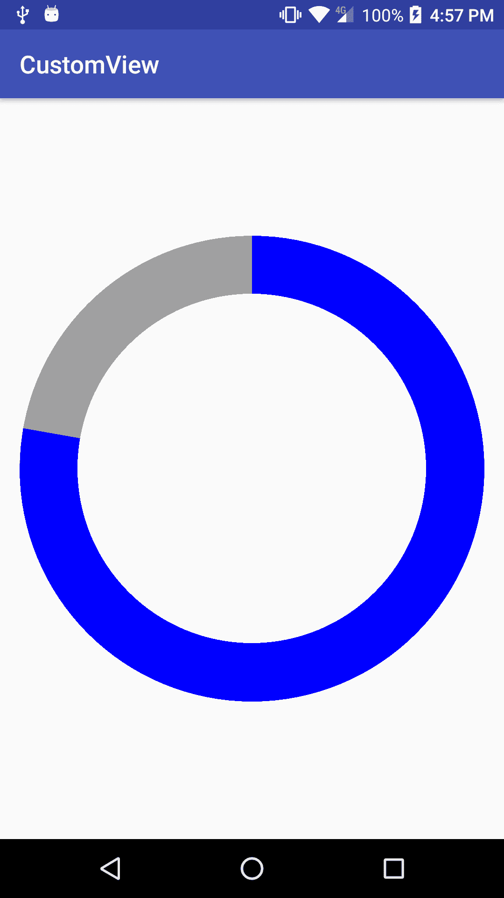
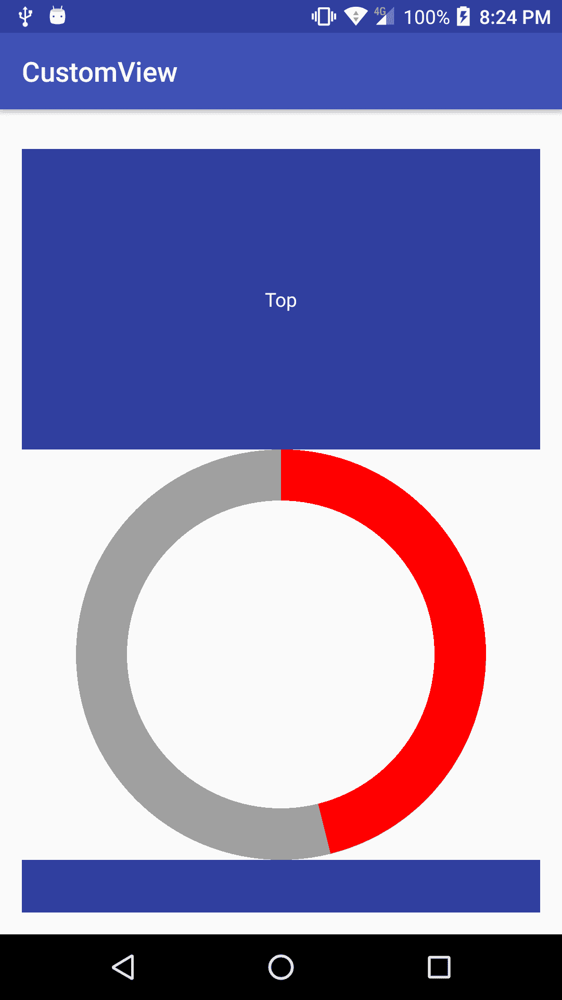

# 处理事件

现在，我们已经了解了画布绘制的基础知识，并且我们的自定义视图已经适应了它的大小，是时候与它进行交互了。许多自定义视图只需要以特殊的方式绘制一些东西；这就是我们将它们创建为自定义视图的原因，但是许多其他视图将需要对用户事件做出反应。例如，当用户在自定义视图上单击或拖动时，它将如何表现？

为了回答这些问题，我们将在本章中更详细地介绍以下几点:

*   基本事件处理
*   高级事件处理

# 基本事件处理

让我们从向自定义视图添加一些基本的事件处理开始。我们将从基础开始，稍后我们将添加更复杂的事件。

# 对触摸事件做出反应

为了使我们的自定义视图具有交互性，我们将实现的第一件事是处理触摸事件并对其做出反应，或者基本上，当用户在我们的自定义视图上触摸或拖动时。

安卓为我们提供了`onTouchEvent()`方法，我们可以在自定义视图中覆盖它。通过覆盖这个方法，我们将在它上面得到任何触摸事件。为了了解它的工作原理，让我们将其添加到上一章构建的自定义视图中:

```java
@Override 
public boolean onTouchEvent(MotionEvent event) { 
    Log.d(TAG, "touch: " + event); 
    return super.onTouchEvent(event); 
} 
```

让我们也添加一个日志调用来查看我们收到的事件。如果我们运行这段代码并触及视图顶部，我们将得到以下内容:

```java
D/com.packt.rrafols.customview.CircularActivityIndicator: touch: MotionEvent { action=ACTION_DOWN, actionButton=0, id[0]=0, x[0]=644.3645, y[0]=596.55804, toolType[0]=TOOL_TYPE_FINGER, buttonState=0, metaState=0, flags=0x0, edgeFlags=0x0, pointerCount=1, historySize=0, eventTime=30656461, downTime=30656461, deviceId=9, source=0x1002 }
```

我们可以看到，关于事件、坐标、动作类型、时间的信息很多，但是即使我们对其执行更多的动作，也只会得到`ACTION_DOWN`事件。这是因为视图的默认实现是不可点击的。默认情况下，如果我们不启用视图上的可点击标志，`onTouchEvent()`的默认实现将返回 false 并忽略进一步的事件。

如果事件已经处理，则`onTouchEvent()`方法必须返回`true`，否则返回假。如果我们在自定义视图中收到一个事件，并且我们不知道该做什么或者我们对此类事件不感兴趣，我们应该返回`false`，这样它就可以由我们视图的父视图或任何其他组件或系统处理。

要接收更多类型的事件，我们可以做两件事:

*   使用`setClickable(true)`将视图设置为可点击
*   实现我们自己的逻辑，并在我们的定制类中处理事件

稍后，我们将实现更复杂的事件；我们会选择第二种选择。

让我们执行一个快速测试，并将方法更改为简单地返回 true，而不是调用父方法:

```java
@Override 
public boolean onTouchEvent(MotionEvent event) { 
    Log.d(TAG, "touch: " + event); 
    return true; 
} 
```

现在，我们应该会收到许多其他类型的事件，如下所示:

```java
...CircularActivityIndicator: touch: MotionEvent { action=ACTION_DOWN, ...CircularActivityIndicator: touch: MotionEvent { action=ACTION_UP, ...CircularActivityIndicator: touch: MotionEvent { action=ACTION_DOWN, ...CircularActivityIndicator: touch: MotionEvent { action=ACTION_MOVE, ...CircularActivityIndicator: touch: MotionEvent { action=ACTION_MOVE, ...CircularActivityIndicator: touch: MotionEvent { action=ACTION_MOVE, ...CircularActivityIndicator: touch: MotionEvent { action=ACTION_UP, ...CircularActivityIndicator: touch: MotionEvent { action=ACTION_DOWN,
```

正如在前面的例子中看到的，我们可以看到在前面的日志中，我们不仅有`ACTION_DOWN`和`ACTION_UP`而且还有`ACTION_MOVE`来指示我们正在视图顶部执行拖动动作。

我们将首先关注处理`ACTION_UP`和`ACTION_DOWN`事件。让我们添加一个`boolean`变量名，它将跟踪我们当前是否正在按压或触摸我们的视图:

```java
private boolean pressed; 

public CircularActivityIndicator(Context context, AttributeSet attributeSet) { 
    ... 
    ... 
    pressed = false; 
} 
```

我们已经添加了变量，并将其默认状态设置为`false`，因为视图在创建时不会被按下。现在，让我们在`onTouchEvent()`实现中添加代码来处理这个问题:

```java
@Override 
public boolean onTouchEvent(MotionEvent event) { 
    Log.d(TAG, "touch: " + event); 
    switch(event.getAction()) { 
        case MotionEvent.ACTION_DOWN: 
            pressed = true; 
            return true; 

        case MotionEvent.ACTION_UP: 
            pressed = false; 
            return true; 

        default: 
            return false; 
    } 
} 
```

我们正在处理`MotionEvent`。`ACTION_DOWN`和`MotionEvent.ACTION_UP`事件；我们在这里收到的任何其他动作，我们都忽略并返回`false`，因为我们还没有处理过。

好了，现在我们有了一个变量，它可以跟踪我们是否在坚持我们的观点，但是我们应该做些别的事情，否则就没什么用了。让我们修改`onDraw()`方法，当视图被按下时，用不同的颜色绘制圆:

```java
private static final int DEFAULT_FG_COLOR = 0xffff0000; 
private static final int PRESSED_FG_COLOR = 0xff0000ff; 

@Override 
protected void onDraw(Canvas canvas) { 
    if (pressed) { 
        foregroundPaint.setColor(PRESSED_FG_COLOR); 
    } else { 
        foregroundPaint.setColor(DEFAULT_FG_COLOR); 
    } 
```

如果我们运行这个例子，并触摸我们的视图，我们将看到什么都没有发生！有什么问题？我们不会触发任何重画或重画事件，也不会再次绘制视图。例如，如果我们设法继续按视图并将应用程序放在后台并将其返回前台，我们可以看到这段代码正在工作。然而，为了正确地执行它，当我们更改需要重新绘制视图的内容时，我们应该触发一个重新绘制事件，如下所示:

```java
@Override 
public boolean onTouchEvent(MotionEvent event) { 
    Log.d(TAG, "touch: " + event); 
    switch(event.getAction()) { 
        case MotionEvent.ACTION_DOWN: 
            pressed = true; 
            invalidate(); 
            return true; 

        case MotionEvent.ACTION_UP: 
            pressed = false; 
            invalidate(); 
            return true; 

        default: 
            pressed = false; 
            invalidate(); 
            return false; 
    } 
} 
```

好吧，这应该就够了！调用 invalidate 方法将在未来触发一次`onDraw()`方法调用:
[https://developer . Android . com/reference/Android/view . html # invalidate()](https://developer.android.com/reference/android/view/View.html#invalidate())。

我们现在可以重构这段代码，并将其移入一个方法中:

```java
private void changePressedState(boolean pressed) { 
    this.pressed = pressed; 
    invalidate(); 
} 

@Override 
public boolean onTouchEvent(MotionEvent event) { 
    Log.d(TAG, "touch: " + event); 
    switch(event.getAction()) { 
        case MotionEvent.ACTION_DOWN: 
            changePressedState(true); 
            return true; 

        case MotionEvent.ACTION_UP: 
            changePressedState(false); 
            return true; 

        default: 
            changePressedState(false); 
            return false; 
    } 
} 
```

我们需要知道，invalidate 必须从 UI 线程调用，如果从另一个线程调用，将引发异常。例如，如果我们必须从另一个线程调用它，我们必须在从网络服务接收到一些数据后更新视图，我们必须调用`postInvalidate()`。

结果如下:



# 拖动事件

既然我们已经对`ACTION_DOWN`和`ACTION_UP`事件做出了反应，我们也将通过对`ACTION_MOVE`做出反应来增加一点复杂性。

让我们根据两个方向的拖动量来更新角度。为此，我们需要存储用户在第一时间按下的位置，因此我们将使用`ACTION_DOWN`事件上的`X`和`Y`坐标存储变量`lastX`和`lastY`。

当我们收到一个`ACTION_MOVE`事件时，我们计算`lastX`和`lastY`坐标与我们随该事件收到的当前值之间的差值。我们用`X`和`Y`差值的平均值更新`selectedAngle`，最终更新`lastX`和`lastY`坐标。我们必须记住调用 invalidate，否则我们的视图将不会被重绘:

```java
private float lastX, lastY; 

@Override 
public boolean onTouchEvent(MotionEvent event) { 
    switch(event.getAction()) { 
        case MotionEvent.ACTION_DOWN: 
            changePressedState(true); 

            lastX = event.getX(); 
            lastY = event.getY(); 
            return true; 

        case MotionEvent.ACTION_UP: 
            changePressedState(false); 
            return true; 

        case MotionEvent.ACTION_MOVE: 
            float dragX = event.getX(); 
            float dragY = event.getY(); 

            float dx = dragX - lastX; 
            float dy = dragY - lastY; 

            selectedAngle += (dx + dy) / 2; 

            lastX = dragX; 
            lastY = dragY; 

            invalidate(); 
            return true; 

        default: 
            return false; 
    } 
} 
```

这种运动可能会感觉有点不自然，所以如果我们想让圆的角度跟随我们实际按压的位置，我们应该从笛卡尔坐标改为极坐标:
[。](https://en.wikipedia.org/wiki/List_of_common_coordinate_transformations)

有了这个变化，就不需要跟踪以前的坐标，所以我们可以用下面的代码替换我们的代码:

```java
private int computeAngle(float x, float y) { 
    x -= getWidth() / 2; 
    y -= getHeight() / 2; 

    int angle = (int) (180.0 * Math.atan2(y, x) / Math.PI) + 90; 
    return (angle > 0) ? angle : 360 + angle; 
} 

@Override 
public boolean onTouchEvent(MotionEvent event) { 
    switch(event.getAction()) { 
        case MotionEvent.ACTION_DOWN: 
            selectedAngle = computeAngle(event.getX(), event.getY()); 
            changePressedState(true); 
            return true; 

        case MotionEvent.ACTION_UP: 
            changePressedState(false); 
            return true; 

        case MotionEvent.ACTION_MOVE: 
            selectedAngle = computeAngle(event.getX(), event.getY()); 
            invalidate(); 
            return true; 

        default: 
            return false; 
    } 
} 
```

# 复杂的布局

到目前为止，我们已经看到了如何在自定义视图上管理`onTouchEvent()`事件，但那是在占据整个屏幕大小的视图上，所以这是一种有点简单的方法。如果我们想包含或查看一个也处理触摸事件的`ViewGroup`，例如一个`ScrollView`，我们需要改变什么？

让我们更改这个的布局:

```java
<?xml version="1.0" encoding="utf-8"?> 
<RelativeLayout xmlns:android="http://schemas.android.com/apk/res/android" 
    xmlns:tools="http://schemas.android.com/tools" 
    android:id="@+id/activity_main" 
    android:layout_width="match_parent" 
    android:layout_height="match_parent" 
    android:padding="@dimen/activity_vertical_margin" 
    tools:context="com.packt.rrafols.customview.MainActivity"> 

    <ScrollView 
        android:layout_width="match_parent" 
        android:layout_height="wrap_content" 
        android:layout_alignParentTop="true" 
        android:layout_alignParentStart="true" 
        android:layout_marginTop="13dp"> 

        <LinearLayout 
            android:layout_width="match_parent" 
            android:layout_height="wrap_content" 
            android:orientation="vertical"> 

            <TextView 
                android:layout_width="match_parent" 
                android:layout_height="wrap_content" 
                android:paddingTop="100dp" 
                android:paddingBottom="100dp" 
                android:text="Top" 
                android:background="@color/colorPrimaryDark" 
                android:textColor="@android:color/white" 
                android:gravity="center"/> 

            <com.packt.rrafols.customview.CircularActivityIndicator 
                android:layout_width="match_parent" 
                android:layout_height="300dp"/> 

            <TextView 
                android:layout_width="match_parent" 
                android:layout_height="wrap_content" 
                android:paddingTop="100dp" 
                android:paddingBottom="100dp" 
                android:text="Bottom" 
                android:background="@color/colorPrimaryDark" 
                android:textColor="@android:color/white" 
                android:gravity="center"/> 
        </LinearLayout> 
    </ScrollView> 
</RelativeLayout> 
```

基本上，我们已经将自定义视图放入`ScrollView`中，因此两者都可以处理事件。我们应该选择哪些事件必须由我们的观点来处理，哪些必须由`ScrollView`来处理。

为此，视图为我们提供了`getParent()`方法，来获取它的父级:
[https://developer . Android . com/reference/Android/view/view parent . html](https://developer.android.com/reference/android/view/ViewParent.html)。

一旦我们有了父项，我们就可以调用`requestDisallowInterceptTouchEvent`来禁止父项及其父项拦截触摸事件。此外，为了仅消费我们感兴趣的事件，我们添加了一个检查，以查看用户触摸的位置是在圆的半径内还是外。如果触摸在外面，我们将忽略该事件，不会处理它。

```java
private boolean computeAndSetAngle(float x, float y) { 
    x -= getWidth() / 2; 
    y -= getHeight() / 2; 

    double radius = Math.sqrt(x * x + y * y); 
    if(radius > circleSize/2) return false; 

    int angle = (int) (180.0 * Math.atan2(y, x) / Math.PI) + 90; 
    selectedAngle = ((angle > 0) ? angle : 360 + angle); 
    return true; 
} 

@Override 
public boolean onTouchEvent(MotionEvent event) { 
    boolean processed; 

    switch(event.getAction()) { 
        case MotionEvent.ACTION_DOWN: 
            processed = computeAndSetAngle(event.getX(), event.getY()); 
            if(processed) { 
                getParent().requestDisallowInterceptTouchEvent(true); 
                changePressedState(true); 
            } 
            return processed; 

        case MotionEvent.ACTION_UP: 
            getParent().requestDisallowInterceptTouchEvent(false); 
            changePressedState(false); 
            return true; 

        case MotionEvent.ACTION_MOVE: 
            processed = computeAndSetAngle(event.getX(), event.getY()); 
            invalidate(); 
            return processed; 

        default: 
            return false; 
    } 
} 
```

我们用同样的笛卡尔坐标来计算半径。我们还更改了代码，因此如果触摸在圆的半径内，我们在`ACTION_DOWN`事件上调用`getParent().requestDisallowInterceptTouchEvent(true)`，告诉`ViewParent`不要拦截触摸事件。我们需要通过在`ACTION_UP`事件上调用相反的`getParent().requestDisallowInterceptTouchEvent(false)`来撤销这个动作。

这是这种变化的结果，我们可以看到在顶部有一个`TextView`视图，在我们的自定义视图底部还有一个:



现在，如果我们触摸圆圈，我们的自定义视图将只处理事件并更改圆圈角度。另一方面，在圆圈外触摸，我们将让`ScrollView`处理事件。

没有太多的变化，但是当构建一个可以在多个地方重用的自定义视图时，我们应该在多个布局配置上测试它，看看它是如何工作的。

在 GitHub 存储库中的`Example10-Events`文件夹中找到这个例子的完整源代码。

# 高级事件处理

我们已经看到了如何处理`onTouchEvent()`，但是我们也可以检测到一些**手势**或者更复杂的交互。安卓为我们提供了`GestureDetector`来帮助我们检测一些手势。支持库中甚至有一个`GestureDetectorCompat`为旧版安卓提供这种支持。

有关`GestureDetector`的更多信息，请查看安卓文档。

# 检测手势

让我们更改已经构建的代码以使用`GestureDetector`。我们还将使用`Scroller`实现在值之间平滑滚动。我们可以修改构造函数来创建`Scroller`对象和`GestureDetector`，实现一个`GestureDetector.OnGestureListener`:

```java
private GestureDetector gestureListener; 
private Scroller angleScroller; 

public CircularActivityIndicator(Context context, AttributeSet attributeSet) { 
    super(context, attributeSet); 

    ... 

    selectedAngle = 280; 
    pressed = false; 

    angleScroller = new Scroller(context, null, true); 
    angleScroller.setFinalX(selectedAngle); 

    gestureListener = new GestureDetector(context, new
    GestureDetector.OnGestureListener() { 
       boolean processed; 

       @Override 
       public boolean onDown(MotionEvent event) { 
           processed = computeAndSetAngle(event.getX(), event.getY()); 
           if (processed) { 
               getParent().requestDisallowInterceptTouchEvent(true); 
               changePressedState(true); 
               postInvalidate(); 
           } 
           return processed; 
       } 

       @Override 
       public void onShowPress(MotionEvent e) { 

       } 

       @Override 
       public boolean onSingleTapUp(MotionEvent e) { 
           endGesture(); 
           return false; 
       } 

       @Override 
       public boolean onScroll(MotionEvent e1, MotionEvent e2, float
       distanceX, float distanceY) { 
           computeAndSetAngle(e2.getX(), e2.getY()); 
           postInvalidate(); 
           return true; 
       } 

       @Override 
       public void onLongPress(MotionEvent e) { 
           endGesture(); 
       } 

       @Override 
       public boolean onFling(MotionEvent e1, MotionEvent e2, float
       velocityX, float velocityY) { 
           return false; 
       } 
   }); 
} 
```

这个界面有很多回调，但是首先为了处理手势，我们需要在`onDown()`回调上返回 true 否则，我们表明我们不会进一步处理事件链。

我们现在简化了`onTouchEvent()`，因为它只是简单地将事件转发给`gestureListener`:

```java
@Override 
public boolean onTouchEvent(MotionEvent event) { 
    return gestureListener.onTouchEvent(event); 
} 
```

由于我们可能有不同的手势、长按、投掷、滚动，我们创建了一种方法来结束手势并恢复状态:

```java
private void endGesture() { 
    getParent().requestDisallowInterceptTouchEvent(false); 
    changePressedState(false); 
    postInvalidate(); 
} 
```

我们修改了`computeAndSetAngle()`方法来使用`Scroller`:

```java
private boolean computeAndSetAngle(float x, float y) { 
    x -= getWidth() / 2; 
    y -= getHeight() / 2; 

    double radius = Math.sqrt(x * x + y * y); 
    if(radius > circleSize/2) return false; 

    int angle = (int) (180.0 * Math.atan2(y, x) / Math.PI) + 90; 
    angle = ((angle > 0) ? angle : 360 + angle); 

    if(angleScroller.computeScrollOffset()) { 
        angleScroller.forceFinished(true); 
    } 

    angleScroller.startScroll(angleScroller.getCurrX(), 0, angle -
    angleScroller.getCurrX(), 0); 
    return true; 
} 
```

`Scroller`实例将为这些值设置动画；我们需要不断检查更新的值来执行动画。一种方法是检查`onDraw()`方法动画是否完成，如果没有完成，则触发无效以重新绘制视图:

```java
@Override 
protected void onDraw(Canvas canvas) { 
    boolean notFinished = angleScroller.computeScrollOffset(); 
    selectedAngle = angleScroller.getCurrX(); 

    ... 

    if (notFinished) invalidate(); 
} 
```

如果`Scroller`还没有到达终点，`computeScrollOffset()`将返回真；同样在调用它之后，我们可以使用`getCurrX()`方法查询卷轴的值。在这个例子中，我们设置了圆角度值的动画，但是我们使用了`Scroller`的`X`坐标来设置它的动画。

使用这个`GestureDetector`，我们还可以检测到长时间的按压和投掷，例如。由于 flings 涉及更多的动画，我们将在本书的后续章节中介绍它。

关于如何使视图交互的更多信息，请参考:
[。](https://developer.android.com/training/custom-views/making-interactive.html)

这个例子的源代码可以在 GitHub 存储库中的`Example11-Events`文件夹中找到。

# 摘要

在本章中，我们已经看到了如何与自定义视图进行交互。构建自定义视图的一部分能力是与它们交互并使它们具有交互性的能力。我们还看到了如何简单地对触摸和释放事件做出反应，如何拖动元素并计算拖动事件之间的增量距离，最后如何使用`GestureDetector`。

由于渲染一直保持相当简单，所以在下一章中，我们将专注于使渲染更加复杂，并使用更多的绘制图元。