# 引入三维自定义视图

在前几章中，我们已经看到了如何使用安卓 2D 图形库实现自定义视图。这将是我们最常见的方法，但有时，由于额外的渲染特殊性或自定义视图的要求，我们可能需要更多的马力。在这种情况下，我们可以使用**嵌入式系统 OpenGL**(**OpenGL ES**)并在视图中启用 3D 渲染操作。

在本章中，我们将看到如何在我们的自定义视图中使用 OpenGL ES，并展示一个我们如何构建一个的实际例子。更详细地说，我们将涵盖以下主题:

*   OpenGL ES 简介
*   绘图几何
*   加载外部几何图形

# OpenGL ES 简介

安卓支持 OpenGL ES 进行 3D 渲染。OpenGL ES 是桌面 **OpenGL API** 实现的子集。就其本身而言，**开放图形库** ( **OpenGL** )是一个非常流行的跨平台 API，用于渲染 2D 和 3D 图形。

使用 OpenGL ES 渲染我们的自定义视图比标准的 Android 画布绘制原语稍微复杂一点，正如我们将在本章中看到的，它需要以常识来使用，并且它并不总是最好的方法。

关于 OpenGL ES 的更多信息，请参考来自 Khronos 集团的官方文档:
[https://www.khronos.org/opengles/](https://www.khronos.org/opengles/)。

# 安卓系统中的 OpenGL ES 入门

创建支持 3D 的自定义视图非常容易。我们可以通过简单地扩展`GLSurfaceView`来实现，而不仅仅是从`View`类进行扩展。复杂性来自渲染部分，但让我们一步一步来。首先，我们将创建一个名为`GLDrawer`的类，并将其添加到我们的项目中:

```java
package com.packt.rrafols.draw; 

import android.content.Context; 
import android.opengl.GLSurfaceView; 
import android.util.AttributeSet; 

public class GLDrawer extends GLSurfaceView { 
    private GLRenderer glRenderer; 

    public GLDrawer(Context context, AttributeSet attributeSet) { 
        super(context, attributeSet); 
    } 
} 
```

像我们前面的例子一样，我们用`AttributeSet`创建了构造函数，因此如果需要，我们可以从 XML 布局文件中对其进行膨胀并设置参数。

我们可能会有这样的印象，OpenGL ES 只在全屏游戏中使用，但它可以在非全屏视图中使用，甚至可以在`ViewGroups`或 a `ScrollView`内部使用。

要了解它的行为，让我们将其添加到两个`TextView`之间的`layout`文件中:

```java
<?xml version="1.0" encoding="utf-8"?> 
<LinearLayout  
    xmlns:android="http://schemas.android.com/apk/res/android" 
    xmlns:tools="http://schemas.android.com/tools" 
    android:id="@+id/activity_main" 
    android:layout_width="match_parent" 
    android:layout_height="match_parent" 
    android:orientation="vertical" 
    android:padding="@dimen/activity_vertical_margin" 
    tools:context="com.packt.rrafols.draw.MainActivity"> 

<TextView 
        android:layout_width="match_parent" 
        android:layout_height="100dp" 
        android:background="@android:color/background_light" 
        android:gravity="center_vertical|center_horizontal" 
        android:text="@string/filler_text"/> 

<com.packt.rrafols.draw.GLDrawer 
        android:layout_width="match_parent" 
        android:layout_height="100dp"/> 

<TextView 
        android:layout_width="match_parent" 
        android:layout_height="100dp" 
        android:background="@android:color/background_light" 
        android:gravity="center_vertical|center_horizontal" 
        android:text="@string/filler_text"/> 
</LinearLayout> 
```

在我们的`GLDrawer`课开始之前，我们需要做一个额外的步骤。我们必须创建一个`GLSurfaceView.Renderer`对象来处理所有渲染，并使用`setRenderer()`方法将其设置为视图。当我们设置这个渲染器时，`GLSurfaceView`将另外创建一个新的线程来管理视图的绘制周期。让我们在`GLDrawer`类文件的末尾添加一个`GLRenderer`类:

```java
class GLRenderer implements GLSurfaceView.Renderer { 
    @Override 
    public void onSurfaceCreated(GL10 gl, EGLConfig config) { 

    } 

    @Override 
    public void onSurfaceChanged(GL10 gl, int width, int height) { 

    } 

    @Override 
    public void onDrawFrame(GL10 gl) { 
        gl.glClearColor(1.f, 0.f, 0.f, 1.f); 
        gl.glClear(GL10.GL_COLOR_BUFFER_BIT); 
    } 
} 
```

`glClearColor()`方法告诉 OpenGL 我们希望从屏幕上清除哪种颜色。我们正在以浮点格式设置四个组件，红色、绿色、蓝色和 alpha，范围从`0`到`1`。`glClear()`是实际清除屏幕的方法。由于 OpenGL 还可以清除其他几个缓冲区，所以只有设置`GL_COLOR_BUFFER_BIT`标志，它才会清除屏幕。现在我们已经介绍了一些 OpenGL 函数，让我们创建一个`GLRenderer`实例变量，并在类构造函数中初始化它:

```java
private GLRenderer glRenderer;
public GLDrawer(Context context, AttributeSet attributeSet) { 
    super(context, attributeSet); 
    glRenderer = new GLRenderer()
    setRenderer(glRenderer);
} 
```

当实现一个`GLSurfaceView.Renderer`类时，我们必须重写以下三个方法或回调:

*   `onSurfaceCreated()`:每次安卓需要创建一个 OpenGL 上下文的时候都会调用这个方法——比如第一次创建渲染线程的时候，或者每次 OpenGL 上下文丢失的时候。每当应用进入后台时，上下文可能会丢失。这个回调是放置所有依赖于 OpenGL 上下文的初始化代码的理想方法。
*   `onSurfaceChanged()`:视图调整大小时会调用这个方法。它也将被称为第一次创建的表面。
*   `onDrawFrame()`:这个方法负责做实际的绘制，每次需要绘制视图的时候都会调用。

在我们的例子中，我们将`onSurfaceCreated()`和`onSurfaceChanged()`方法留空，因为此时，我们只关注于绘制一个坚实的背景来检查我们是否所有的东西都在工作，并且我们还不需要视图大小。

如果我们运行这个例子，我们会看到`TextView`和我们的自定义视图都有红色背景:

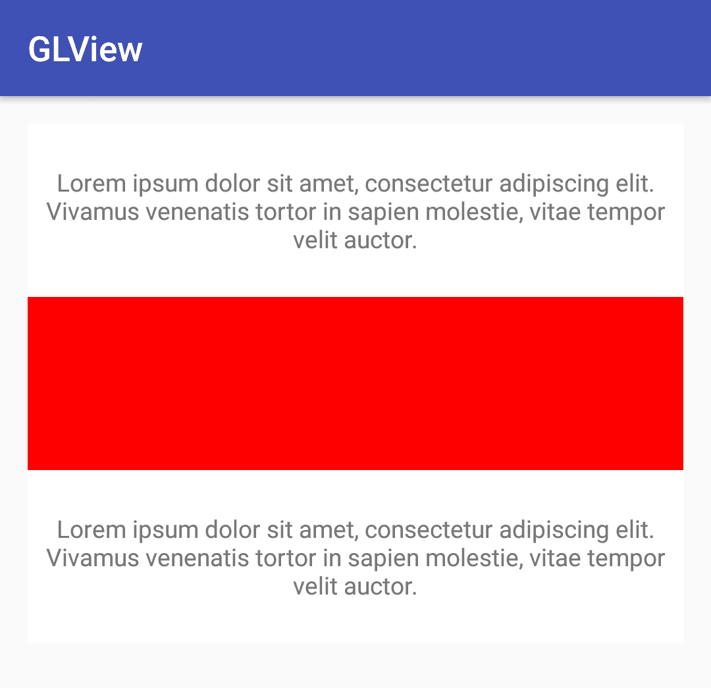

如果我们在我们的`onDrawFrame()`方法中设置一个断点或者打印一个日志，我们会看到视图被不断地重绘。这种行为不同于普通视图，因为渲染器线程将持续调用`onDrawFrame()`方法。一旦我们设置了渲染器对象，就可以通过调用`setRender()`方法来修改这个行为。如果我们之前调用它，它会使我们的应用崩溃。有两种渲染模式:

*   `setRenderMode` ( `RENDERMODE_CONTINUOUSLY`):这是默认行为。将持续调用渲染器来渲染视图。
*   `setRenderMode` ( `RENDERMODE_WHEN_DIRTY`):这个可以设置，避免视图连续重绘。我们必须调用`requestRender`来请求视图的新渲染，而不是调用 invalidate。

# 绘制基本几何图形

我们已经初始化了视图，并绘制了一个红色背景。让我们画一些更有趣的东西。在下面的例子中，我们将重点讨论 OpenGL ES 2.0，因为它从 Android 2.2 开始就已经可用了，或者说是 API level 8，在 OpenGL ES 1.1 中如何做到这一点真的不值得解释。不过，如果你想了解更多，GitHub 上有一些移植到安卓的旧 NeHe OpenGL ES 教程的端口:
[https://github.com/nea/nehe-android-ports](https://github.com/nea/nehe-android-ports)。

OpenGLES 1.1 和 OpenGL ES 2.0 代码是不兼容的，因为 OpenGL ES 1.1 代码基于固定功能的管道，在那里你必须指定几何图形、灯光等，而 OpenGL ES 2.0 基于由顶点和片段着色器处理的可编程管道。

首先，由于我们需要 OpenGL ES 2.0，我们应该在我们的清单文件中添加一个`uses-feature`配置行，这样 Google Play 就不会向那些不兼容的设备显示应用:

```java
<application> 
    .... 
<uses-feature android:glEsVersion="0x00020000" android:required="true" /> 
    ... 
</application> 
```

如果我们使用 OpenGL ES3.0 中的特定 API，我们会将要求更改为`android:glEsVersion="0x00030000"`以让 Google Play 进行相应的过滤。

完成这一步后，我们可以开始绘制更多的形状和几何图形。但是首先，在设置渲染器之前，我们应该将渲染器上下文设置为`2`，这样它将创建一个 OpenGL ES 2.0 上下文。我们可以通过修改`GLDrawer`类的构造函数轻松做到这一点:

```java
public GLDrawer(Context context, AttributeSet attributeSet) { 
    super(context, attributeSet); 
    setEGLContextClientVersion(2);
    glRenderer = new GLRenderer(); 
    setRenderer(glRenderer); 
} 
```

现在让我们一步一步地了解如何在屏幕上绘制矩形。如果您熟悉 OpenGL ES 1.1，但不熟悉 OpenGL ES 2.0，您会发现还有一点工作要做，但最终，我们将受益于 OpenGL ES 2.0 的额外灵活性和强大功能。

我们将从定义一个以位置`0, 0, 0`为中心的矩形或四边形坐标的数组开始:

```java
private float quadCoords[] = { 
    -1.f, -1.f, 0.0f, 
    -1.f,  1.f, 0.0f, 
     1.f,  1.f, 0.0f, 
     1.f, -1.f, 0.0f 
 }; 
```

我们将绘制三角形，因此我们必须定义它们的顶点索引:

```java
private short[] index = { 
    0, 1, 2, 
    0, 2, 3 
}; 
```

要理解这些索引背后的原因，如何将它们映射到我们之前定义的顶点索引，以及如何使用两个三角形绘制四边形，请查看下图:

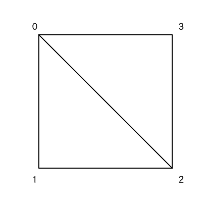

如果我们用顶点`0`、`1`和`2,`画一个三角形，用顶点`0`、`2`和`3`画另一个三角形，我们将得到一个四边形。

使用 OpenGL ES 时，我们需要使用`Buffer`或`Buffer`的子类来提供数据，所以让我们将这些数组转换成`Buffer`:

```java
ByteBuffer vbb = ByteBuffer.allocateDirect(quadCoords.length * (Float.SIZE / 8)); 
vbb.order(ByteOrder.nativeOrder()); 

vertexBuffer = vbb.asFloatBuffer(); 
vertexBuffer.put(quadCoords); 
vertexBuffer.position(0); 
```

首先，我们必须为`Buffer`分配我们需要的空间。由于我们知道数组的大小，这将非常容易:我们只需将其乘以以字节为单位的浮点数的大小。一个浮点正好是四个字节，但是我们可以通过使用`Float.SIZE`获得位数并将其除以`8`来计算它。在 Java 8 中，有一个名为`Float.BYTES`的新常数，它以字节为单位精确地返回大小。

我们必须指出，我们放入数据的`Buffer`将具有平台的本机字节顺序。我们可以通过以`ByteOrder.nativeOrder()`为参数调用`Buffer`上的`order()`方法来实现。一旦我们完成了这一步，我们可以通过调用`Buffer.asFloatBuffer()`并设置数据，将其转换为浮动缓冲区。最后，我们通过将`Buffer`的位置设置为`0`，将`Buffer`的位置重置为开始位置。

我们必须为顶点和索引做这个过程。由于索引存储为短整数，因此在转换缓冲区时，以及在计算大小时，我们需要考虑到这一点:

```java
ByteBuffer ibb = ByteBuffer.allocateDirect(index.length * (Short.SIZE / 8)); 
ibb.order(ByteOrder.nativeOrder()); 

indexBuffer = ibb.asShortBuffer(); 
indexBuffer.put(index); 
indexBuffer.position(0); 
```

正如我们之前提到的，OpenGL ES 2.0 渲染管道由顶点和片段`shader`处理。让我们创建一个助手方法来加载和编译`shader`代码:

```java
// Source: 
// https://developer.android.com/training/img/opengl/draw.html 
public static int loadShader(int type, String shaderCode){ 

    // create a vertex shader type (GLES20.GL_VERTEX_SHADER) 
    // or a fragment shader type (GLES20.GL_FRAGMENT_SHADER) 
    int shader = GLES20.glCreateShader(type); 

    // add the source code to the shader and compile it 
    GLES20.glShaderSource(shader, shaderCode); 
    GLES20.glCompileShader(shader); 

    return shader; 
} 
```

使用这种新方法，我们可以加载顶点和片段`shaders`:

```java
private void initShaders() { 
    int vertexShader = loadShader(GLES20.GL_VERTEX_SHADER, vertexShaderCode); 
    int fragmentShader = loadShader(GLES20.GL_FRAGMENT_SHADER, fragmentShaderCode); 

    shaderProgram = GLES20.glCreateProgram(); 
    GLES20.glAttachShader(shaderProgram, vertexShader); 
    GLES20.glAttachShader(shaderProgram, fragmentShader); 
    GLES20.glLinkProgram(shaderProgram); 
} 
```

暂时还是用安卓开发者的 OpenGL 培训网站的默认`shaders`吧。

`vertexShader`如下:

```java
// Source: 
// https://developer.android.com/training/img/opengl/draw.html 
private final String vertexShaderCode = 
        // This matrix member variable provides a hook to manipulate 
        // the coordinates of the objects that use this vertex shader 
"uniform mat4 uMVPMatrix;" + 
"attribute vec4 vPosition;" + 
"void main() {" + 
        // The matrix must be included as a modifier of gl_Position. 
        // Note that the uMVPMatrix factor *must be first* in order 
        // for the matrix multiplication product to be correct. 
"  gl_Position = uMVPMatrix * vPosition;" + 
"}"; 
```

`fragmentShader`如下:

```java
private final String fragmentShaderCode = 
"precision mediump float;" + 
"uniform vec4 vColor;" + 
"void main() {" + 
"  gl_FragColor = vColor;" + 
"}"; 
```

我们在`vertexShader`中增加了一个矩阵乘法，所以我们可以通过更新`uMVPMatrix`来修改顶点的位置。让我们添加一个投影和一些变换，以便有基本的渲染到位。

我们不应该忘记`onSurfaceChanged()`回调；让我们使用它来设置我们的投影矩阵，并定义相机的裁剪平面，同时考虑屏幕的宽度和高度以保持其纵横比:

```java
@Override 
public void onSurfaceChanged(GL10 unused, int width, int height) { 
    GLES20.glViewport(0, 0, width, height); 

    float ratio = (float) width / height; 
    Matrix.frustumM(mProjectionMatrix, 0, -ratio * 2, ratio * 2, -2, 2,
    3, 7); 
} 
```

让我们通过使用`Matrix.setLookAtM()`并将其乘以我们刚刚在`mProjectionMatrix`上计算的投影矩阵来计算视图矩阵:

```java
@Override 
public void onDrawFrame(GL10 unused) { 

    ... 

    Matrix.multiplyMM(mMVPMatrix, 0, mProjectionMatrix, 0, mViewMatrix,
    0); 

    int mMVPMatrixHandle = GLES20.glGetUniformLocation(shaderProgram,
    "uMVPMatrix"); 
    GLES20.glUniformMatrix4fv(mMVPMatrixHandle, 1, false, mMVPMatrix,
    0); 

    ... 

} 
```

在前面的代码中，我们也看到了如何更新一个可以从`shader`中读取的变量。为此，我们需要首先获取统一变量的句柄。通过使用`GLES20.glGetUniformLocation(shaderProgram, "uMVPMatrix")`我们可以获得`uMVPMatrix`统一变量的句柄，并且在`GLES20.glUniformMatrix4fv`调用中使用这个句柄，我们可以在上面设置我们刚刚计算的矩阵。如果我们检查`shader`的代码，我们可以看到我们已经将`uMVPMatrix`定义为统一的:

```java
uniform mat4 uMVPMatrix; 
```

既然我们知道如何设置一个统一的变量，让我们对颜色做同样的事情。在片段`shader`上，我们也将`vColor`设置为一个统一的变量，因此我们可以按照相同的方法进行设置:

```java
float color[] = { 0.2f, 0.2f, 0.9f, 1.0f }; 

... 

int colorHandle = GLES20.glGetUniformLocation(shaderProgram, "vColor"); 
GLES20.glUniform4fv(colorHandle, 1, color, 0); 
```

使用同样的机制，但是将`glGetUniformLocation`改为`glGetAttribLocation`，我们也可以设置顶点坐标:

```java
int positionHandle = GLES20.glGetAttribLocation(shaderProgram, "vPosition"); 

GLES20.glVertexAttribPointer(positionHandle, 3, 
        GLES20.GL_FLOAT, false, 
        3 * 4, vertexBuffer); 
```

我们准备好了一切，可以把它画到屏幕上；我们只需要启用顶点属性数组，因为我们已经使用`glVertexAttribPointer()`调用设置了坐标数据，`glDrawElements()`将只绘制启用的数组:

```java
GLES20.glEnableVertexAttribArray(positionHandle); 

GLES20.glDrawElements( 
       GLES20.GL_TRIANGLES, index.length, 
       GLES20.GL_UNSIGNED_SHORT, indexBuffer); 

GLES20.glDisableVertexAttribArray(positionHandle); 
```

在 OpenGL 上绘制几何图形有很多可能，但是我们已经使用了`glDrawElements()`调用来指向我们之前创建的面部索引的缓冲区。我们在这里使用了`GL_TRIANGLES`原语，但是还有很多其他的 OpenGL 原语可以使用。查看关于`glDrawElements()`的官方 Khronos 文档了解更多信息:
[https://www . Khronos . org/registry/OpenGL-Refpages/gl4/html/gldrawElements . XHTML](https://www.khronos.org/registry/OpenGL-Refpages/gl4/html/glDrawElements.xhtml)。

此外，作为良好的实践，为了恢复 OpenGL 机器状态，我们在绘制后禁用顶点属性数组。

如果我们执行这段代码，我们会得到如下结果——仍然不是很有用，但这是一个开始！

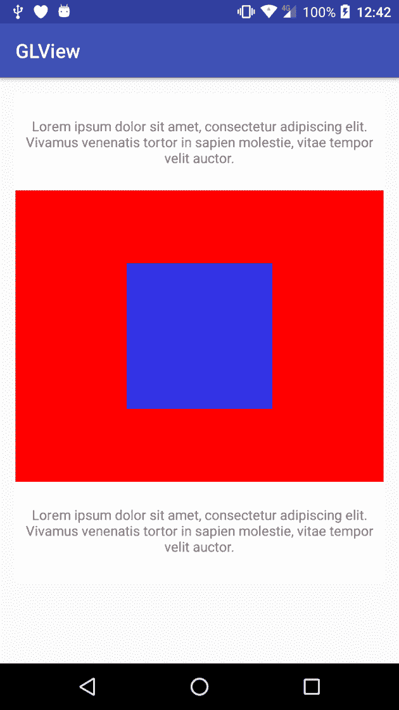

查看 GitHub 存储库中的`Example23-GLSurfaceView`获取完整的示例源代码。

# 绘图几何

到目前为止，我们已经看到了如何设置我们的 OpenGL 渲染器并绘制一些非常基本的几何图形。但是，你可以想象，我们可以用 OpenGL 做更多的事情。在本节中，我们将看到如何进行一些更复杂的操作，以及如何加载使用外部工具定义的几何图形。有时，使用代码定义几何可能会有用，但大多数时候，尤其是如果几何非常复杂，它将使用 3D 建模工具来设计和创建。知道如何导入几何图形对我们的项目肯定会非常有用。

# 添加音量

在前面的例子中，我们已经看到了如何用一种颜色绘制四边形，但是如果每个顶点都有完全不同的颜色呢？这个过程和我们已经做的不会有很大的不同，但是让我们看看我们能怎么做。

首先，让我们更改颜色数组以保持四个顶点的颜色:

```java
float color[] = { 
        1.0f, 0.2f, 0.2f, 1.0f, 
        0.2f, 1.0f, 0.2f, 1.0f, 
        0.2f, 0.2f, 1.0f, 1.0f, 
        1.0f, 1.0f, 1.0f, 1.0f, 
}; 
```

现在，在我们的`initBuffers()`方法中，让我们为颜色初始化一个附加的`Buffer`:

```java
private FloatBuffer colorBuffer; 

... 

ByteBuffer cbb = ByteBuffer.allocateDirect(color.length * (Float.SIZE / 8)); 
cbb.order(ByteOrder.nativeOrder()); 

colorBuffer = cbb.asFloatBuffer(); 
colorBuffer.put(color); 
colorBuffer.position(0); 
```

我们也必须更新我们的`shaders`来考虑颜色参数。首先，在我们的`vertexShader`上，我们必须创建一个新的属性，我们将称之为`aColor`来保存每个顶点的颜色:

```java
private final String vertexShaderCode = 
"uniform mat4 uMVPMatrix;" + 
"attribute vec4 vPosition;" + 
"attribute vec4 aColor;" + 
"varying vec4 vColor;" + 
"void main() {" + 
"  gl_Position = uMVPMatrix * vPosition;" + 
"  vColor = aColor;" + 
"}"; 
```

然后，我们定义一个可变的`vColor`变量，它将被传递给`fragmentShader`，而`fragmentShader`将计算每个片段的值。让我们看看`fragmentShader`上的变化:

```java
private final String fragmentShaderCode = 
"precision mediump float;" + 
"varying vec4 vColor;" + 
"void main() {" + 
"  gl_FragColor = vColor;" + 
"}"; 
```

我们唯一改变的是`vColor`的宣言；而不是统一变量，现在是`varying`变量。

就像我们对顶点和面索引所做的那样，我们必须将颜色数据设置为`shader`:

```java
int colorHandle = GLES20.glGetAttribLocation(shaderProgram, "aColor"); 
GLES20.glVertexAttribPointer(colorHandle, 4, 
        GLES20.GL_FLOAT, false, 
        4 * 4, colorBuffer); 
```

在绘制之前，我们必须启用和禁用顶点数组。如果没有启用颜色数组，我们会得到一个黑色的方块，因为`glDrawElements()`将无法得到颜色信息；

```java
GLES20.glEnableVertexAttribArray(colorHandle); 
GLES20.glEnableVertexAttribArray(positionHandle); 
GLES20.glDrawElements( 
        GLES20.GL_TRIANGLES, index.length, 
        GLES20.GL_UNSIGNED_SHORT, indexBuffer); 

GLES20.glDisableVertexAttribArray(positionHandle); 
GLES20.glDisableVertexAttribArray(colorHandle); 
```

如果我们运行这个示例，我们将看到与前面示例相似的效果，但是我们可以看到颜色是如何在顶点之间插值的:

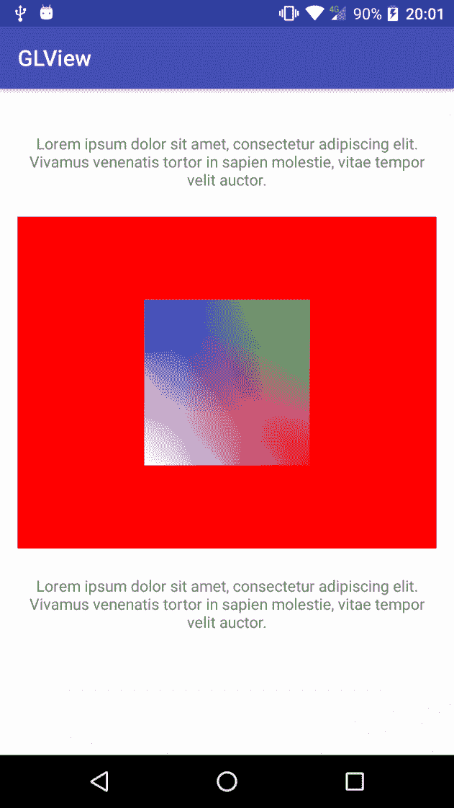

现在我们知道如何插值颜色，让我们给几何图形增加一些深度。到目前为止，我们绘制的所有东西都是平坦的，所以让我们将四边形转换为立方体。很简单。让我们首先定义顶点和新的面索引:

```java
private float quadCoords[] = { 
       -1.f, -1.f, -1.0f, 
       -1.f,  1.f, -1.0f, 
        1.f,  1.f, -1.0f, 
        1.f, -1.f, -1.0f, 

       -1.f, -1.f,  1.0f, 
       -1.f,  1.f,  1.0f, 
        1.f,  1.f,  1.0f, 
        1.f, -1.f,  1.0f 
}; 
```

我们已经复制了之前相同的四个顶点，但是有一个位移的 *Z* 坐标，这将增加立方体的体积。

现在，我们必须创建新的人脸索引。一个立方体有六个面，或者说四边形，可以用十二个三角形来复制:

```java
private short[] index = { 
        0, 1, 2,        // front 
        0, 2, 3,        // front 
        4, 5, 6,        // back 
        4, 6, 7,        // back 
        0, 4, 7,        // top 
        0, 3, 7,        // top 
        1, 5, 6,        // bottom 
        1, 2, 6,        // bottom 
        0, 4, 5,        // left 
        0, 1, 5,        // left 
        3, 7, 6,        // right 
        3, 2, 6         // right 
}; 
```

让我们也为新的四个顶点添加新的颜色:

```java
float color[] = { 
        1.0f, 0.2f, 0.2f, 1.0f, 
        0.2f, 1.0f, 0.2f, 1.0f, 
        0.2f, 0.2f, 1.0f, 1.0f, 
        1.0f, 1.0f, 1.0f, 1.0f, 

        1.0f, 1.0f, 0.2f, 1.0f, 
        0.2f, 1.0f, 1.0f, 1.0f, 
        1.0f, 0.2f, 1.0f, 1.0f, 
        0.2f, 0.2f, 0.2f, 1.0f 
}; 
```

如果我们照原样执行这个例子，我们会得到一个奇怪的结果，类似于下面的截图:

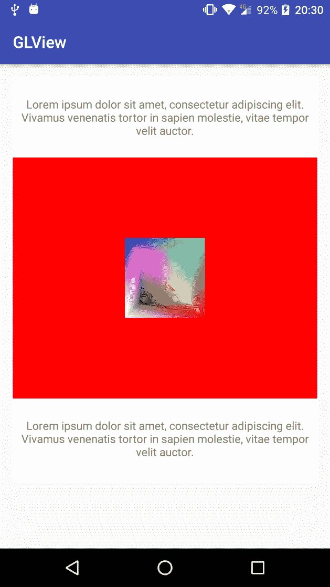

让我们给`mMVPMatrix`矩阵添加一个旋转变换，看看发生了什么。

我们必须定义一个私有变量来保持旋转角度，并将旋转应用于`mMVPMatrix`:

```java
private float angle = 0.f; 
... 
Matrix.setLookAtM(mViewMatrix, 0, 
        0, 0, -4, 
        0f, 0f, 0f, 
        0f, 1.0f, 0.0f); 

Matrix.multiplyMM(mMVPMatrix, 0, mProjectionMatrix, 0, mViewMatrix, 0); Matrix.rotateM(mMVPMatrix, 0, angle, 1.f, 1.f, 1.f);
```

在这种情况下，为了了解发生了什么，我们将旋转应用于三个轴: *x* 、 *y* 和 *z* 。我们还将相机从前面的例子中移开了一点，因为如果我们不这样做，现在可能会有一些剪辑。

为了定义我们必须旋转的量，我们将使用一个安卓计时器:

```java
private long startTime; 
... 
@Override 
public void onSurfaceCreated(GL10 unused, EGLConfig config) { 
    initBuffers(); 
    initShaders(); 
    startTime = SystemClock.elapsedRealtime();
} 
```

我们将开始时间存储在`startTime`变量上，在我们的`onDrawFrame()`方法中，我们根据从此刻起经过的时间计算角度:

```java
angle = ((float) SystemClock.elapsedRealtime() - startTime) * 0.02f; 
```

在这里，我们只是将它乘以`0.02f`来限制旋转速度，否则它会太快。这样做，无论渲染帧速率或 CPU 速度如何，所有设备上的动画速度都将相同。现在，如果我们运行这段代码，我们将看到我们遇到的问题的根源:

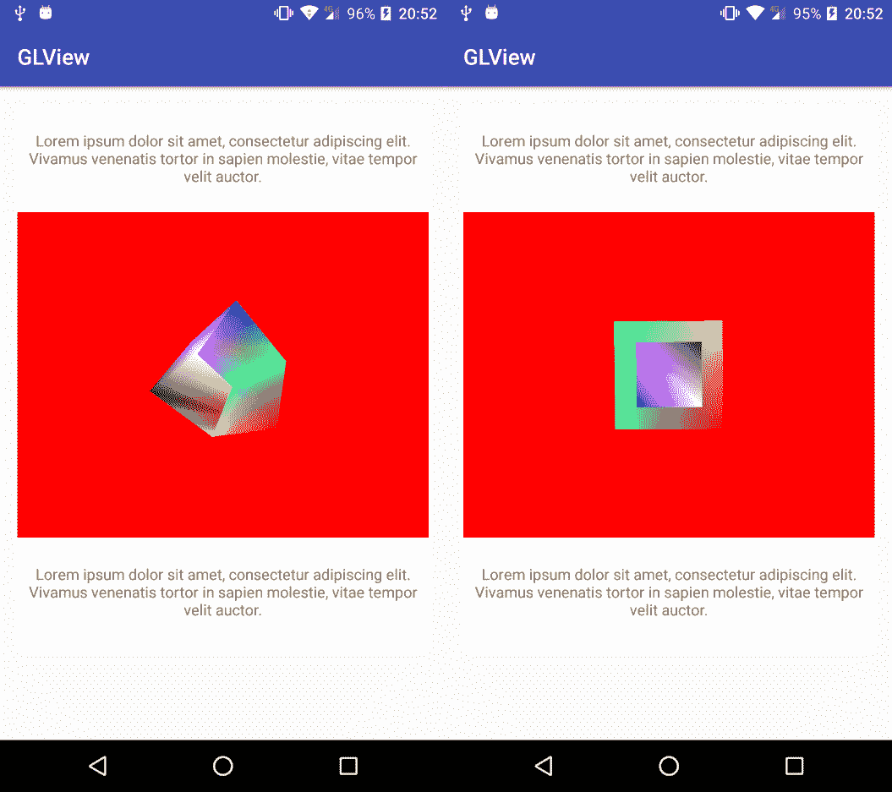

问题是，在绘制所有三角形时，OpenGL 没有检查像素的 z 坐标，所以可能会有一些叠加和透支，正如我们在前面的截图中很容易看到的那样。对我们来说幸运的是，这很容易解决。OpenGL 有一个状态，我们可以使用它来启用和禁用深度或 z 测试:

```java
GLES20.glEnable(GLES20.GL_DEPTH_TEST);
GLES20.glEnableVertexAttribArray(colorHandle); 
GLES20.glEnableVertexAttribArray(positionHandle); 
GLES20.glDrawElements( 
        GLES20.GL_TRIANGLES, index.length, 
        GLES20.GL_UNSIGNED_SHORT, indexBuffer); 

GLES20.glDisableVertexAttribArray(positionHandle); 
GLES20.glDisableVertexAttribArray(colorHandle); GLES20.glDisable(GLES20.GL_DEPTH_TEST);
```

与前面的例子一样，在绘制之后，我们禁用我们已经启用的状态，以避免为任何其他绘制操作留下未知的 OpenGL 状态。如果我们运行这段代码，我们会看到不同之处:

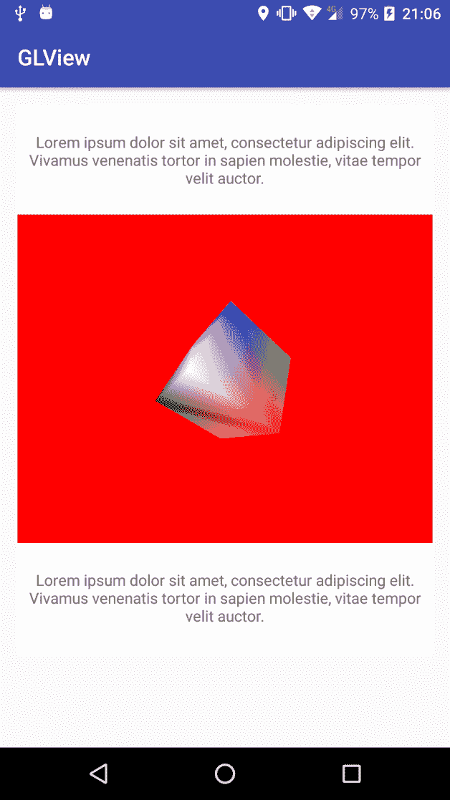

查看 GitHub 存储库中的`Example24-GLDrawing`获取完整的示例源代码。

# 添加纹理

让我们继续做更多有趣的事情！我们已经看到了如何为每个顶点添加一种颜色，但是现在让我们看看，如果我们想为我们的 3D 对象添加一些纹理，我们需要改变什么。

首先，让我们用纹理坐标数组替换颜色数组。我们将在两个轴上将纹理坐标`0`映射到纹理的起点，并将`1`映射到纹理的终点，也是在两个轴上。使用我们在前面例子中的几何图形，我们可以这样定义纹理坐标:

```java
private float texCoords[] = { 
        1.f, 1.f, 
        1.f, 0.f, 
        0.f, 0.f, 
        0.f, 1.f, 

        1.f, 1.f, 
        1.f, 0.f, 
        0.f, 0.f, 
        0.f, 1.f, 
}; 
```

为了加载这些纹理坐标，我们使用了与之前完全相同的过程:

```java
ByteBuffer tbb = ByteBuffer.allocateDirect(texCoords.length * (Float.SIZE / 8)); 
tbb.order(ByteOrder.nativeOrder()); 

texBuffer = tbb.asFloatBuffer(); 
texBuffer.put(texCoords); 
texBuffer.position(0); 
```

让我们也创建一个助手方法来将资源加载到纹理中:

```java
private int loadTexture(int resId) { 
    final int[] textureIds = new int[1]; 
    GLES20.glGenTextures(1, textureIds, 0); 

    if (textureIds[0] == 0) return -1; 

    // do not scale the bitmap depending on screen density 
    final BitmapFactory.Options options = new BitmapFactory.Options(); 
    options.inScaled = false; 

    final Bitmap textureBitmap =
    BitmapFactory.decodeResource(getResources(), resId, options); 
    GLES20.glBindTexture(GLES20.GL_TEXTURE_2D, textureIds[0]); 

    GLES20.glTexParameteri(GLES20.GL_TEXTURE_2D, 
            GLES20.GL_TEXTURE_MIN_FILTER, GLES20.GL_NEAREST); 

    GLES20.glTexParameteri(GLES20.GL_TEXTURE_2D, 
            GLES20.GL_TEXTURE_MAG_FILTER, GLES20.GL_NEAREST); 

    GLES20.glTexParameterf(GLES20.GL_TEXTURE_2D, 
            GLES20.GL_TEXTURE_WRAP_S, GLES20.GL_CLAMP_TO_EDGE); 

    GLES20.glTexParameterf(GLES20.GL_TEXTURE_2D, 
            GLES20.GL_TEXTURE_WRAP_T, GLES20.GL_CLAMP_TO_EDGE); 

    GLUtils.texImage2D(GLES20.GL_TEXTURE_2D, 0, textureBitmap, 0); 
    textureBitmap.recycle(); 

    return textureIds[0]; 
} 
```

我们必须考虑到两个纹理维度都必须达到`2`的幂。为了保持图像的原始大小，避免安卓系统进行任何缩放，我们必须将位图选项`inScaled`标记设置为`false`。在前面的代码中，我们生成一个纹理 ID 来保存对我们纹理的引用，将其绑定为活动纹理，设置过滤和包装的参数，最后加载位图数据。一旦我们这样做了，我们可以回收临时位图，因为我们不再需要它了。

和以前一样，我们也必须更新我们的`shaders`。在我们的`vertexShader,`中，我们必须应用与之前几乎相同的更改，添加一个属性，我们可以在其中设置顶点纹理坐标和一个`varying`变量以传递给`fragmentShader`:

```java
private final String vertexShaderCode = 
"uniform mat4 uMVPMatrix;" + 
"attribute vec4 vPosition;" + 
"attribute vec2 aTex;" + 
"varying vec2 vTex;" + 
"void main() {" + 
"  gl_Position = uMVPMatrix * vPosition;" + 
"  vTex = aTex;" + 
"}"; 
```

请注意，顶点坐标是一个`vec2`而不是一个`vec4`，因为我们只有两个坐标:U 和 v。我们的新`fragmentShader`比我们之前的更复杂一点:

```java
private final String fragmentShaderCode = 
"precision mediump float;" + 
"uniform sampler2D sTex;" + 
"varying vec2 vTex;" + 
"void main() {" + 
"  gl_FragColor = texture2D(sTex, vTex);" + 
"}"; 
```

我们必须创建`varying`纹理坐标变量和一个统一的`sampler2D`变量，在这里我们将设置活动纹理。为了得到颜色，我们必须使用`texture2D`查找功能从指定坐标上的纹理中读取颜色数据。

让我们现在添加一个名为`texture.png`的位图到我们的可绘制`res`文件夹中，并修改`onSurfaceCreated()`方法将其加载为纹理:

```java
@Override 
public void onSurfaceCreated(GL10 unused, EGLConfig config) { 
    initBuffers(); 
    initShaders(); 

    textureId = loadTexture(R.drawable.texture); 

    startTime = SystemClock.elapsedRealtime(); 
} 
```

以下是我们示例中使用的图像:

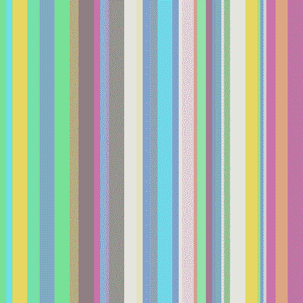

最后，让我们更新`onDrawFrame()`方法来设置纹理坐标:

```java
int texCoordHandle = GLES20.glGetAttribLocation(shaderProgram, "aTex"); 
GLES20.glVertexAttribPointer(texCoordHandle, 2, 
        GLES20.GL_FLOAT, false, 
        0, texBuffer); 
```

这是纹理本身:

```java
int texHandle = GLES20.glGetUniformLocation(shaderProgram, "sTex"); 
GLES20.glActiveTexture(GLES20.GL_TEXTURE0); 
GLES20.glBindTexture(GLES20.GL_TEXTURE_2D, textureId); 
GLES20.glUniform1i(texHandle, 0); 
```

此外，正如我们之前所做的，我们必须启用，然后禁用纹理坐标顶点数组。

如果我们运行这段代码，我们会得到以下结果:

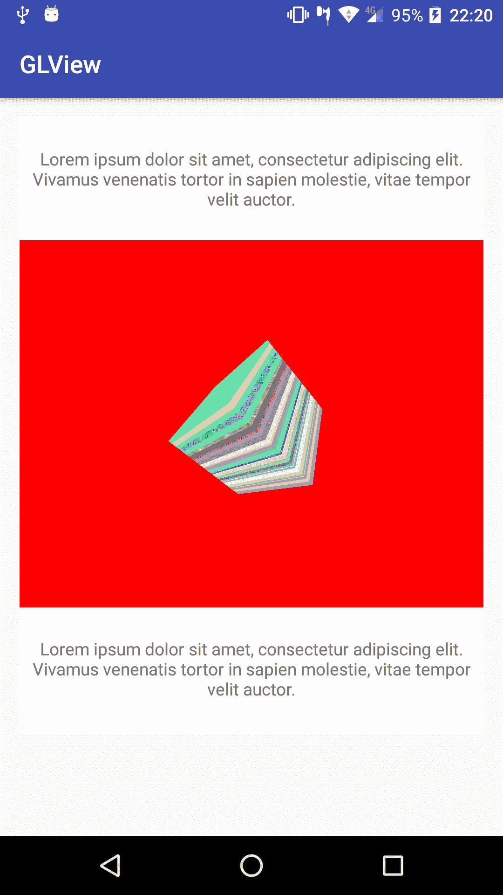

查看 GitHub 存储库中的`Example25-GLDrawing`获取完整的示例源代码。

# 加载外部几何图形

到目前为止，我们一直在绘制四边形和立方体，但是如果我们想绘制更复杂的几何图形，可能更容易在 3D 建模工具上建模，而不是通过代码来完成。我们可以涵盖这个主题的多个章节，但让我们看一个快速的例子，说明如何做到这一点，以及如何根据您的需求进行扩展。

我们使用了 Blender 来建模我们的示例数据。Blender 是一个免费的开源 3D 建模工具集，可以在它的网站上免费下载:
[https://www.blender.org/](https://www.blender.org/)。

对于这个例子，我们还没有建模一个极其复杂的例子；我们刚刚使用了 Blender 提供的一个原语:苏珊娜:

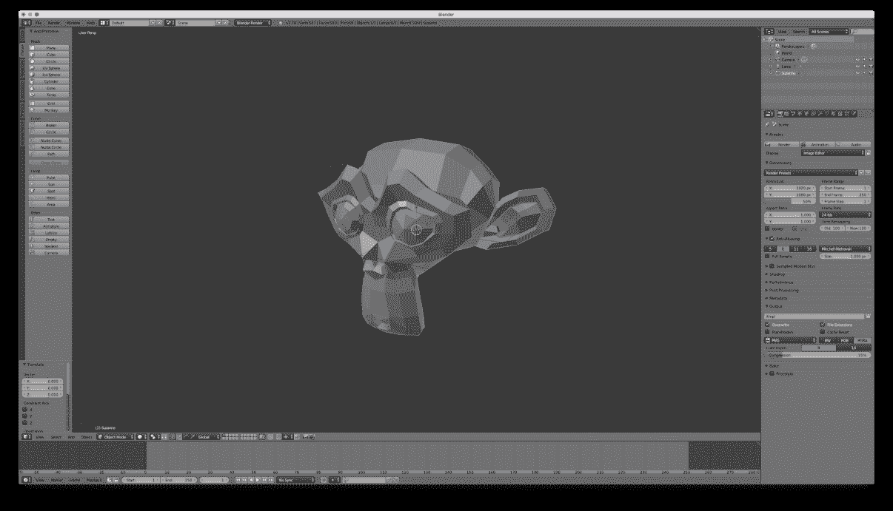

为了简化我们的导入工具，我们将在右侧的场景|苏珊娜下拉菜单下选择对象网格，当我们按下 *Ctrl* + *T* 时，Blender 将所有面转换为三角形。否则，我们将在导出的文件中同时包含三角形和四边形，从我们的安卓应用代码中实现人脸导入器并不简单:

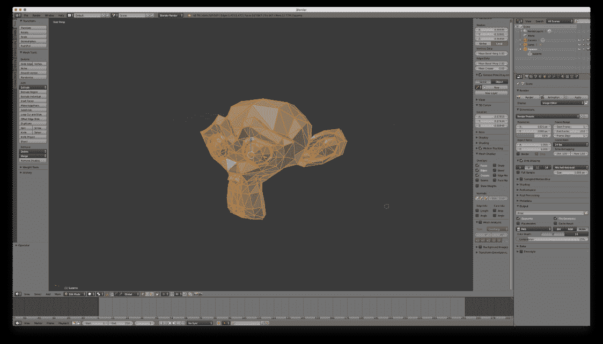

现在，我们将其导出为`Wavefront` ( `.obj`)文件，这将创建一个`.obj`和一个`.mtl`文件。后者是我们暂时忽略的物质信息。让我们将导出的文件放入`assets`文件夹中的项目中。

现在让我们自己创建一个非常简单的`Wavefront`文件对象解析器。由于我们将处理文件、加载和解析，我们将不得不异步完成:

```java
public class WavefrontObjParser { 
    public static void parse(Context context, String name, ParserListener listener) { 
        WavefrontObjParserHelper helper = new WavefrontObjParserHelper(context, name, listener); 
        helper.start(); 
    } 

    public interface ParserListener { 
        void parsingSuccess(Scene scene); 
        void parsingError(String message); 
    } 
} 
```

如您所见，这里没有实际工作。为了进行真正的加载和解析，我们创建了一个助手类，它将在一个单独的**线程**上进行，如果成功或者解析文件时出现错误，它将调用侦听器:

```java
class WavefrontObjParserHelper extends Thread { 
    private String name; 
    private WavefrontObjParser.ParserListener listener; 
    private Context context; 

    WavefrontObjParserHelper(Context context, String name,
    WavefrontObjParser.ParserListener listener) { 
        this.context = context; 
        this.name = name; 
        this.listener = listener; 
    } 

```

然后，当我们调用`helper.start()`时，它会创建实际的线程，并在其上执行`run()`方法:

```java
public void run() { 
        try { 

            InputStream is = context.getAssets().open(name); 
            BufferedReader br = new BufferedReader(new
            InputStreamReader(is)); 

            Scene scene = new Scene(); 
            Object3D obj = null; 

            String str; 
            while ((str = br.readLine()) != null) { 
                if (!str.startsWith("#")) { 
                    String[] line = str.split(""); 

                    if("o".equals(line[0])) { 
                        if (obj != null) obj.prepare(); 
                        obj = new Object3D(); 
                        scene.addObject(obj); 

                    } else if("v".equals(line[0])) { 
                        float x = Float.parseFloat(line[1]); 
                        float y = Float.parseFloat(line[2]); 
                        float z = Float.parseFloat(line[3]); 
                        obj.addCoordinate(x, y, z); 
                    } else if("f".equals(line[0])) { 

                        int a = getFaceIndex(line[1]); 
                        int b = getFaceIndex(line[2]); 
                        int c = getFaceIndex(line[3]); 

                        if (line.length == 4) { 
                            obj.addFace(a, b, c); 
                        } else { 
                            int d = getFaceIndex(line[4]); 
                            obj.addFace(a, b, c, d); 
                        } 
                    } else { 
                        // skip 
                    } 
                } 
            } 
            if (obj != null) obj.prepare(); 
            br.close(); 

            if (listener != null) listener.parsingSuccess(scene); 
        } catch(Exception e) { 
            if (listener != null) listener.parsingError(e.getMessage()); 
            e.printStackTrace(); 
        } 
    } 
```

在前面的代码中，我们首先通过用提供的名称打开文件来读取资产。要获取应用资产，我们需要一个`context`:

```java
InputStream is = context.getAssets().open(name); 
BufferedReader br = new BufferedReader(new InputStreamReader(is)); 
```

然后，我们一行一行地读取文件，并根据起始关键字采取不同的操作，除非该行以`#`开头，这意味着它是一个注释。我们只考虑新对象的命令、顶点坐标和面索引；我们忽略了文件中可能存在的任何附加命令，例如使用的材质，或者顶点和面法线。

由于我们可以获得人脸索引信息，例如 f 330//278 336//278 338//278 332//278，所以我们创建了一个助手方法来解析该信息，并且只提取人脸索引。斜线后的数字是面法线指数。请参考官方文件格式，以更详细地了解面部索引号的用法:

```java
private static int getFaceIndex(String face) { 
    if(!face.contains("/")) { 
        return Integer.parseInt(face) - 1; 
    } else { 
        return Integer.parseInt(face.split("/")[0]) - 1; 
    } 
} 
```

此外，由于面部指数从`1`开始，我们必须减去`1`才能得到正确的结果。

为了存储我们从文件中读取的所有数据，我们还创建了一些数据类。`Object3D`类将存储所有相关信息——顶点、人脸索引，`Scene`类将存储整个三维场景，其中包含所有的`Objects3D`。为了简单起见，我们尽可能缩短这些实现，但是根据我们的需要，它们可以变得更加复杂:

```java
public class Scene { 
    private ArrayList<Object3D> objects; 

    public Scene() { 
        objects = new ArrayList<>(); 
    } 

    public void addObject(Object3D obj) { 
        objects.add(obj); 
    } 

    public ArrayList<Object3D> getObjects() { 
        return objects; 
    } 

    public void render(int shaderProgram, String posAttributeName,
    String colAttributeName) { 
        GLES20.glEnable(GLES20.GL_DEPTH_TEST); 

        for (int i = 0; i < objects.size(); i++) { 
            objects.get(i).render(shaderProgram, posAttributeName,
            colAttributeName); 
        } 

        GLES20.glDisable(GLES20.GL_DEPTH_TEST); 
    } 
} 

```

我们可以看到`Scene`类上有一个`render()`方法。我们已经将渲染其所有三维对象的责任转移到了`Scene`本身，并且应用相同的原理，每个对象也负责渲染自身:

```java
public void prepare() { 
    if (coordinateList.size() > 0 && coordinates == null) { 
        coordinates = new float[coordinateList.size()]; 
        for (int i = 0; i < coordinateList.size(); i++) { 
            coordinates[i] = coordinateList.get(i); 
        } 
    } 

    if (indexList.size() > 0 && indexes == null) { 
        indexes = new short[indexList.size()]; 
        for (int i = 0; i < indexList.size(); i++) { 
            indexes[i] = indexList.get(i); 
        } 
    } 

    colors = new float[(coordinates.length/3) * 4]; 
    for (int i = 0; i < colors.length/4; i++) { 
        float intensity = (float) (Math.random() * 0.5 + 0.4); 
        colors[i * 4    ] = intensity; 
        colors[i * 4 + 1] = intensity; 
        colors[i * 4 + 2] = intensity; 
        colors[i * 4 + 3] = 1.f; 
    } 

    ByteBuffer vbb = ByteBuffer.allocateDirect(coordinates.length *
   (Float.SIZE / 8)); 
    vbb.order(ByteOrder.nativeOrder()); 

    vertexBuffer = vbb.asFloatBuffer(); 
    vertexBuffer.put(coordinates); 
    vertexBuffer.position(0); 

    ByteBuffer ibb = ByteBuffer.allocateDirect(indexes.length *
   (Short.SIZE / 8)); 
    ibb.order(ByteOrder.nativeOrder()); 

    indexBuffer = ibb.asShortBuffer(); 
    indexBuffer.put(indexes); 
    indexBuffer.position(0); 

    ByteBuffer cbb = ByteBuffer.allocateDirect(colors.length * 
    (Float.SIZE / 8)); 
    cbb.order(ByteOrder.nativeOrder()); 

    colorBuffer = cbb.asFloatBuffer(); 
    colorBuffer.put(colors); 
    colorBuffer.position(0); 

    Log.i(TAG, "Loaded obj with " + coordinates.length + " vertices &"
    + (indexes.length/3) + " faces"); 
} 

```

一旦我们将所有数据设置为`3DObject`，我们可以通过调用其`prepare()`方法来准备渲染。这个方法将创建顶点和索引`Buffer`，并且，在这种情况下，我们没有任何来自数据文件上的网格的颜色信息，它将为每个顶点生成一个随机的颜色，或者说一个强度。

在`3DObject`中创建缓冲区本身允许我们渲染任何类型的对象。`Scene`容器不知道里面是什么样的物体或者什么样的几何形状。我们可以很容易地用另一种类型的`3DObject`扩展这个类，只要它处理自己的渲染。

最后，我们给`3DObject`增加了一个`render()`方法:

```java
public void render(int shaderProgram, String posAttributeName, String colAttributeName) { 
    int positionHandle = GLES20.glGetAttribLocation(shaderProgram,
    posAttributeName); 
    GLES20.glVertexAttribPointer(positionHandle, 3, 
            GLES20.GL_FLOAT, false, 
            3 * 4, vertexBuffer); 

    int colorHandle = GLES20.glGetAttribLocation(shaderProgram,
    colAttributeName); 
    GLES20.glVertexAttribPointer(colorHandle, 4, 
            GLES20.GL_FLOAT, false, 
            4 * 4, colorBuffer); 

    GLES20.glEnableVertexAttribArray(colorHandle); 
    GLES20.glEnableVertexAttribArray(positionHandle); 
    GLES20.glDrawElements( 
            GLES20.GL_TRIANGLES, indexes.length, 
            GLES20.GL_UNSIGNED_SHORT, indexBuffer); 

    GLES20.glDisableVertexAttribArray(positionHandle); 
    GLES20.glDisableVertexAttribArray(colorHandle); 
} 
```

此方法负责启用和禁用正确的数组并呈现自身。我们从方法参数中获得`shader`属性。理想情况下，每个对象都可以有自己的`shader`，但是我们不想在这个例子中增加那么多复杂性。

在我们的`GLDrawer`类中，我们还添加了一个辅助方法来计算透视截头体矩阵。OpenGL 中最常用的调用之一是`gluPerspective`，许多令人敬畏的 OpenGL 教程的作者 NeHe 创建了一个将`gluPerspective`转换为`glFrustrum`调用的函数:

```java
// source: http://nehe.gamedev.net/article/replacement_for_gluperspective/21002/ 

private static void perspectiveFrustrum(float[] matrix, float fov, float aspect, float zNear, float zFar) { 
    float fH = (float) (Math.tan( fov / 360.0 * Math.PI ) * zNear); 
    float fW = fH * aspect; 

    Matrix.frustumM(matrix, 0, -fW, fW, -fH, fH, zNear, zFar); 
} 
```

由于我们不再需要它，我们已经从`GLDrawer`中移除了所有顶点和面索引信息，并简化了`onDrawFrame()`方法，现在将所有对象的渲染委托给`Scene`类，默认情况下，委托给每个个体`3DObject`:

```java
@Override 
public void onDrawFrame(GL10 unused) { 
    angle = ((float) SystemClock.elapsedRealtime() - startTime) *
    0.02f; 
    GLES20.glClearColor(1.0f, 0.0f, 0.0f, 1.0f); 
    GLES20.glClear(GLES20.GL_COLOR_BUFFER_BIT | 
    GLES20.GL_DEPTH_BUFFER_BIT); 

    if (scene != null) { 
        Matrix.setLookAtM(mViewMatrix, 0, 
                0, 0, -4, 
                0f, 0f, 0f, 
                0f, 1.0f, 0.0f); 

        Matrix.multiplyMM(mMVPMatrix, 0, mProjectionMatrix, 0,
        mViewMatrix, 0); 
        Matrix.rotateM(mMVPMatrix, 0, angle, 0.8f, 2.f, 1.f); 

        GLES20.glUseProgram(shaderProgram); 

        int mMVPMatrixHandle = GLES20.glGetUniformLocation(shaderProgram, "uMVPMatrix"); 
        GLES20.glUniformMatrix4fv(mMVPMatrixHandle, 1, false,
        mMVPMatrix, 0); 

        scene.render(shaderProgram, "vPosition", "aColor"); 
    } 
} 
```

综上所述，如果我们运行这个示例，我们将看到以下屏幕:


查看 GitHub 存储库中的`Example26-GLDrawing`获取完整的示例源代码。

# 摘要

在本章中，我们已经看到了如何使用 OpenGL ES 创建非常基本的自定义视图。OpenGL ES 在创建自定义视图时增加了很多可能性，但是如果我们没有那么多使用它的经验，它也会增加很多复杂性。我们可以在这个主题上覆盖更多的章节，但这不是本书的主要目标。我们会有更多使用 3D 自定义视图的例子，但是有很多关于如何在安卓设备上学习甚至掌握 OpenGL ES 的出版材质。

在下一章中，我们将看到如何向自定义视图中添加更多动画和平滑移动。因为我们可以动画任何参数或变量，它将无关紧要，如果它是一个三维自定义视图或标准 2D 自定义视图，但我们将看到如何在这两种情况下应用动画。