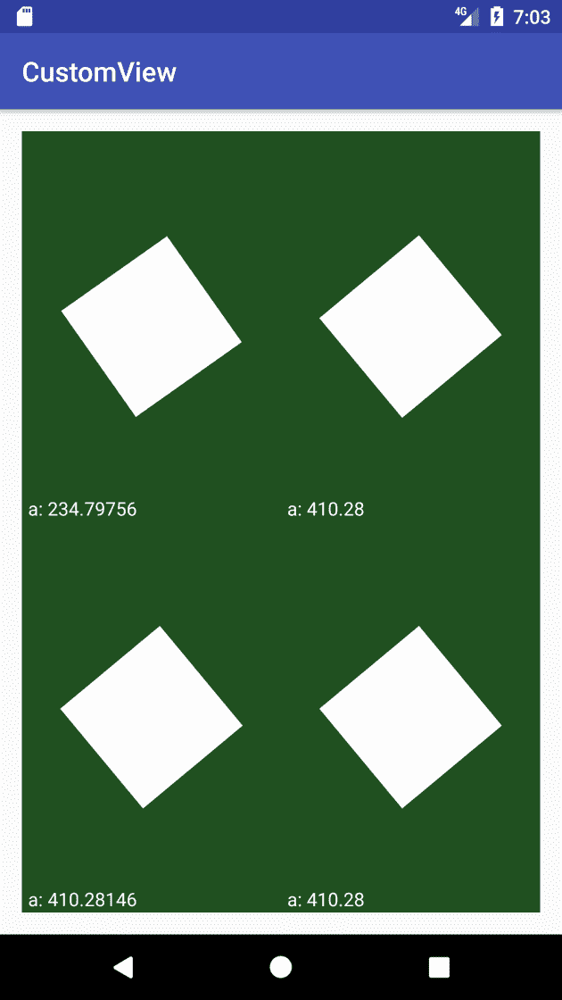
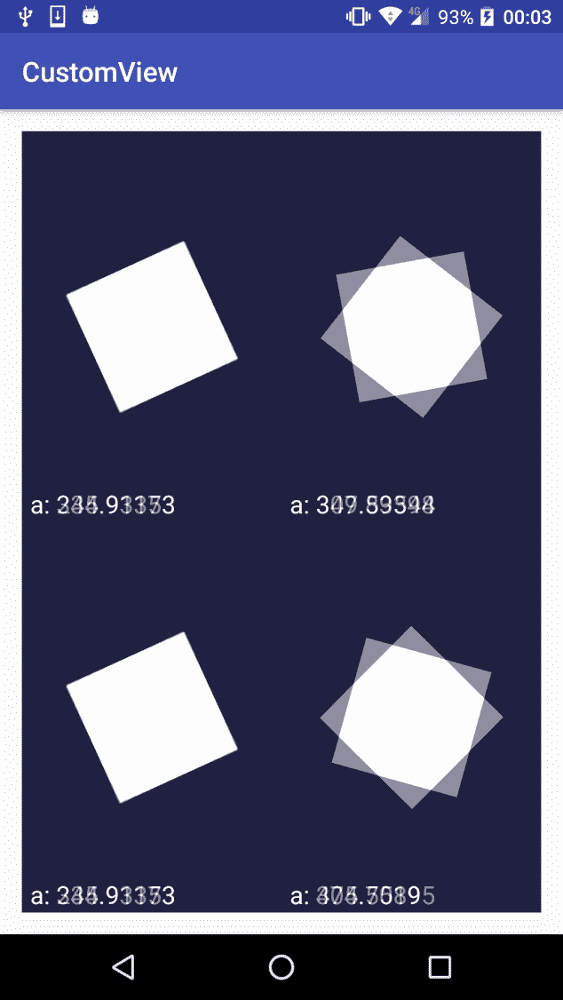

# 动画片

到目前为止，我们已经看到了如何创建和渲染不同类型的自定义视图，从非常简单的 2D 画布绘制到更复杂的画布操作，以及最近如何使用 OpenGL ES 和顶点/片段着色器创建自定义视图。在一些用于演示如何使用这些渲染原语的示例中，我们已经使用了一些动画，正如您可以想象的那样，动画是自定义视图的关键元素之一。如果我们想使用自定义视图构建一个高度复杂的用户界面，但我们根本没有对它进行动画制作，那么简单地使用静态图像可能会更好。

在本章中，我们将介绍如何向自定义视图添加动画。有许多方法可以做到这一点，但更详细地说，我们将关注以下主题:

*   定制动画
*   固定时间步长技术
*   使用安卓属性动画师

此外，如果我们以错误的方式实现一些动画，我们还会看到有什么问题，因为它可能看起来更简单，幸运的是，尽管它会对我们不利，但它们似乎在我们的设备上运行得很好。

# 定制动画

让我们从展示如何在不太依赖安卓软件开发工具包提供的方法和类的情况下，自己制作一些值的动画开始。在本节中，我们将看到如何使用不同的机制来激活单个属性或多个属性。通过这样做，我们可以在自定义视图上应用更适合我们的方法，这取决于我们想要实现的动画类型或我们正在实现的视图的特殊性。

# 定时帧动画

我们已经在前一章的 3D 例子中使用了这种动画。主要概念包括在根据过去的时间绘制新帧之前，为所有可动画化的属性分配一个新值。我们可以尝试根据绘制的帧数增加或计算一个新值，但这是非常不可取的，因为动画将以不同的速度播放，这取决于设备的速度、计算或绘图复杂性以及在后台执行的其他过程。

为了做到这一点，我们必须涉及一些独立于渲染速度、每秒帧数或绘制帧数的东西，一个完美的解决方案是使用基于时间的动画。

安卓为我们提供了几种机制来做到这一点。例如，我们可以使用`System.currentTimeMillis()`、`System.nanoTime()`，甚至系统时钟中可用的一些方法，如`elapsedRealtime()`。

让我们构建一个比较不同方法的简单示例。首先，让我们创建一个简单的自定义视图，绘制四个矩形，或`Rect` s，以不同的角度旋转:

```java
private static final int BACKGROUND_COLOR = 0xff205020; 
private static final int FOREGROUND_COLOR = 0xffffffff; 
private static final int QUAD_SIZE = 50; 

private float[] angle; 
private Paint paint; 

public AnimationExampleView(Context context, AttributeSet attributeSet) { 
    super(context, attributeSet); 

    paint = new Paint(); 
    paint.setStyle(Paint.Style.FILL); 
    paint.setAntiAlias(true); 
    paint.setColor(FOREGROUND_COLOR); 
    paint.setTextSize(48.f); 

    angle = new float[4]; 
    for (int i = 0; i < 4; i++) { 
        angle[i] = 0.f; 
    } 
} 
```

在类构造器上，我们初始化`Paint`对象，并创建一个由四个浮点数组成的数组来保存每个矩形的旋转角度。此时，他们四人将在`0`处。我们现在来实施`onDraw()`法。

在`onDraw()`方法上，我们要做的第一件事是用纯色清除画布背景，以清除我们之前的帧。

一旦我们这样做了，我们计算坐标，我们将绘制四个矩形，并继续绘制。为了简化旋转，在这种情况下，我们使用带有枢轴点的`canvas.translate`和`canvas.rotate`来旋转矩形的中心。另外，为了避免做额外的计算并使其尽可能简单，我们用`canvas.save`和`canvas.restore`包围每个矩形绘图，以在每次绘图操作之前保持相同的状态:

```java
@Override 
protected void onDraw(Canvas canvas) { 
    canvas.drawColor(BACKGROUND_COLOR); 

    int width = getWidth(); 
    int height = getHeight(); 

    // draw 4 quads on the screen: 
    int wh = width / 2; 
    int hh = height / 2; 

    int qs = (wh * QUAD_SIZE) / 100; 

    // top left 
    canvas.save(); 
    canvas.translate( 
        wh / 2 - qs / 2, 
        hh / 2 - qs / 2); 

    canvas.rotate(angle[0], qs / 2.f, qs / 2.f); 
    canvas.drawRect(0, 0, qs, qs, paint); 
    canvas.restore(); 

    // top right 
    canvas.save(); 
    canvas.translate( 
        wh + wh / 2 - qs / 2, 
        hh / 2 - qs / 2); 

    canvas.rotate(angle[1], qs / 2.f, qs / 2.f); 
    canvas.drawRect(0, 0, qs, qs, paint); 
    canvas.restore(); 

    // bottom left 
    canvas.save(); 
    canvas.translate( 
        wh / 2 - qs / 2, 
        hh + hh / 2 - qs / 2); 

    canvas.rotate(angle[2], qs / 2.f, qs / 2.f); 
    canvas.drawRect(0, 0, qs, qs, paint); 
    canvas.restore(); 

    // bottom right 
    canvas.save(); 
    canvas.translate( 
        wh + wh / 2 - qs / 2, 
        hh + hh / 2 - qs / 2); 

    canvas.rotate(angle[3], qs / 2.f, qs / 2.f); 
    canvas.drawRect(0, 0, qs, qs, paint); 
    canvas.restore(); 

    canvas.drawText("a: " + angle[0], 16, hh - 16, paint); 
    canvas.drawText("a: " + angle[1], wh + 16, hh - 16, paint); 
    canvas.drawText("a: " + angle[2], 16, height - 16, paint); 
    canvas.drawText("a: " + angle[3], wh + 16, height - 16, paint); 

    postInvalidateDelayed(10); 
} 
```

为了更清楚地看到差异，我们绘制了一个文本，显示每个矩形旋转的角度。实际上，为了触发视图的重绘，我们称之为`invalidate`，延迟 10 毫秒。

第一个矩形会在每次绘制时简单地增加角度，忽略时间方法，另外三个矩形会分别使用:`System.currentTimeMillis()`、`System.nanoTime(),`和`SystemClock.elapsedRealtime()`。让我们初始化一些变量来保存定时器的初始值:

```java
private long timeStartMillis; 
private long timeStartNanos; 
private long timeStartElapsed; 
```

在`onDraw()`方法的开头添加一个小计算:

```java
if (timeStartMillis == -1)  
    timeStartMillis = System.currentTimeMillis(); 

if (timeStartNanos == -1)  
    timeStartNanos = System.nanoTime(); 

if (timeStartElapsed == -1)  
    timeStartElapsed = SystemClock.elapsedRealtime(); 

angle[0] += 0.2f; 
angle[1] = (System.currentTimeMillis() - timeStartMillis) * 0.02f; 
angle[2] = (System.nanoTime() - timeStartNanos) * 0.02f * 0.000001f; 
angle[3] = (SystemClock.elapsedRealtime() - timeStartElapsed) * 0.02f; 
```

由于从初始类创建到调用`onDraw()`方法可能需要一些时间，因此我们在这里计算计时器的初始值。例如`timeStartElapsed`的值为`-1`，则表示尚未初始化。

然后，当我们设置了初始时间，我们可以计算已经过去了多少时间，并使用它作为我们动画的基础值。让我们乘以一个因子来控制速度。在这种情况下，我们以`0.02`为例，考虑到纳秒是毫秒以外的另一个数量级。

如果我们运行这个例子，我们会看到类似于下面截图的内容:



这种方法的一个问题是，如果我们将应用程序放在后台，一段时间后我们将其放回前台，我们可以看到所有取决于时间的值向前跳跃，因为当我们的应用程序在后台时，时间不会停止。为了控制这一点，我们可以覆盖`onVisibilityChanged()`回调，并在视图可见或不可见时进行检查:

```java
@Override 
protected void onVisibilityChanged(@NonNull View changedView, int visibility) { 
    super.onVisibilityChanged(changedView, visibility); 

    // avoid doing this check before View is even visible 
    if ((visibility == View.INVISIBLE || visibility == View.GONE) &&  
          previousVisibility == View.VISIBLE) { 

        invisibleTimeStart = SystemClock.elapsedRealtime(); 
    } 

    if ((previousVisibility == View.INVISIBLE || previousVisibility ==
        View.GONE) && 
        visibility == View.VISIBLE) { 

        timeStartElapsed += SystemClock.elapsedRealtime() -
        invisibleTimeStart; 
    } 
    previousVisibility = visibility; 
} 
```

在前面的代码中，我们正在计算视图不可见的时间，并使用该时间调整`timeStartElapsed`。我们必须避免第一次这样做，因为这个方法将在视图第一次可见时被调用。因此，我们正在检查`timeStartElapsed`是否与`-1`不同。

由于我们在视图变得可见之前有这个回调，我们可以很容易地更改我们之前的代码来计算计时器的初始值，并将其放在这里，从而简化了我们的`onDraw()`方法:

```java
@Override 
protected void onVisibilityChanged(@NonNull View changedView, int visibility) { 
    super.onVisibilityChanged(changedView, visibility); 

    // avoid doing this check before View is even visible 
    if (timeStartElapsed != -1) { 
        if ((visibility == View.INVISIBLE || visibility == View.GONE)
            && 
            previousVisibility == View.VISIBLE) { 

            invisibleTimeStart = SystemClock.elapsedRealtime(); 
        } 

        if ((previousVisibility == View.INVISIBLE || previousVisibility
            == View.GONE) && 
            visibility == View.VISIBLE) { 

            timeStartElapsed += SystemClock.elapsedRealtime() -
            invisibleTimeStart; 
        } 
    } else {
        timeStartMillis = System.currentTimeMillis();
        timeStartNanos = System.nanoTime();
        timeStartElapsed = SystemClock.elapsedRealtime();
    }
    previousVisibility = visibility;
}
```

有了这个小小的调整，只到`timeStartElapsed`，我们会看到动画被保留在右下角的矩形中，即使我们把应用放在背景中。

您可以在 GitHub 存储库中的`Example27-Animations`文件夹中找到整个示例源代码。

# 固定时间步长

在处理动画时，有时计算会非常复杂。一个明显的例子是在物理模拟和一般的游戏中，但是在其他时候，我们的计算，即使是简单的自定义视图，在使用基于时间的动画时也会变得有点棘手。有一个固定的时间步长将允许我们从时间变量中抽象出我们的动画逻辑，但仍然保持我们的动画与时间相关。

拥有固定时间步长背后的逻辑是假设我们的动画逻辑将总是以固定的速率执行。例如，我们可以假设它将在 *60* fps 下执行，而不管这是每秒的实际渲染帧。为了展示如何做到这一点，我们将创建一个新的自定义视图，它将在屏幕上我们按下或拖动的位置产生粒子，并应用一些非常基本和简单的物理。

首先，让我们像前面的示例一样创建基本的自定义视图:

```java
private static final int BACKGROUND_COLOR = 0xff404060; 
private static final int FOREGROUND_COLOR = 0xffffffff; 
private static final int N_PARTICLES = 800; 

private Paint paint; 
private Particle[] particles; 
private long timeStart; 
private long accTime; 
private int previousVisibility; 
private long invisibleTimeStart; 

public FixedTimestepExample(Context context, AttributeSet attributeSet) { 
    super(context, attributeSet); 

    paint = new Paint(); 
    paint.setStyle(Paint.Style.FILL); 
    paint.setAntiAlias(true); 
    paint.setColor(FOREGROUND_COLOR); 

    particles = new Particle[N_PARTICLES]; 
    for (int i = 0; i < N_PARTICLES; i++) { 
        particles[i] = new Particle(); 
    } 

    particleIndex = 0; 
    timeStart = -1; 
    accTime = 0; 
    previousVisibility = View.GONE; 
} 
```

我们正在初始化基本变量，我们还在创建一个`particles`数组。此外，由于我们已经在前面的示例中实现了`onVisibilityChange`回调，让我们利用它:

```java
@Override 
protected void onVisibilityChanged(@NonNull View changedView, int visibility) { 
    super.onVisibilityChanged(changedView, visibility); 
    if (timeStartElapsed != -1) { 
        // avoid doing this check before View is even visible 
        if ((visibility == View.INVISIBLE ||  visibility == View.GONE)
            && 
            previousVisibility == View.VISIBLE) { 

            invisibleTimeStart = SystemClock.elapsedRealtime(); 
        } 

        if ((previousVisibility == View.INVISIBLE || previousVisibility 
            == View.GONE) && 
            visibility == View.VISIBLE) { 

            timeStart += SystemClock.elapsedRealtime() -
            invisibleTimeStart; 
        } 
    } else { 
        timeStart = SystemClock.elapsedRealtime(); 
    } 
    previousVisibility = visibility; 
} 
```

现在我们来定义`Particle`类，让我们尽可能地简单:

```java
class Particle { 
    float x; 
    float y; 
    float vx; 
    float vy; 
    float ttl; 

    Particle() { 
        ttl = 0.f; 
    } 
} 
```

我们只定义了`x`、`y`坐标、`x`和`y`速度分别为`vx`和`vy`，以及粒子的存活时间。当粒子的生存时间达到`0`时，我们就不再更新或绘制了。

现在，让我们实现`onDraw()`方法:

```java
@Override 
protected void onDraw(Canvas canvas) { 
    animateParticles(getWidth(), getHeight()); 

    canvas.drawColor(BACKGROUND_COLOR); 

    for(int i = 0; i < N_PARTICLES; i++) { 
        float px = particles[i].x; 
        float py = particles[i].y; 
        float ttl = particles[i].ttl; 

        if (ttl > 0) { 
            canvas.drawRect( 
                px - PARTICLE_SIZE, 
                py - PARTICLE_SIZE, 
                px + PARTICLE_SIZE, 
                py + PARTICLE_SIZE, paint); 
        } 
    } 
    postInvalidateDelayed(10); 
} 
```

我们已经将所有的动画委托给`animateParticles()`方法，这里我们只是遍历所有的粒子，检查它们的生存时间是否为正，在这种情况下，绘制它们。

现在让我们看看如何用固定的时间步长实现`animateParticles()`方法:

```java
private static final int TIME_THRESHOLD = 16; 
private void animateParticles(int width, int height) { 
    long currentTime = SystemClock.elapsedRealtime(); 
    accTime += currentTime - timeStart; 
    timeStart = currentTime; 

    while(accTime > TIME_THRESHOLD) { 
        for (int i = 0; i < N_PARTICLES; i++) { 
            particles[i].logicTick(width, height); 
        } 

        accTime -= TIME_THRESHOLD; 
    } 
} 
```

我们计算距离上一次的时间差，或时间的增量，并将其累积在`accTime`变量中。然后，只要`accTime`高于我们定义的阈值，我们就执行一个逻辑步骤。渲染之间可能会执行多个逻辑步骤，或者在其他一些情况下，可能不会在两个不同的帧中执行。

最后，对于我们执行的每个逻辑步骤，我们将定义的时间阈值减去`accTime`，并将新的`timeStart`设置为用于计算与之前调用`animateParticles()`的时间差的时间。

在这个例子中，我们将时间阈值定义为`16`，所以每`16`毫秒我们将执行一个逻辑步骤，如果我们每秒渲染`10`或`60`帧，则独立执行。

`Particle`类上的`logicTick()`方法完全忽略定时器的当前值，因为它假设它将在固定的时间步长上执行:

```java
void logicTick(int width, int height) { 
    ttl--; 

    if (ttl > 0) { 
        vx = vx * 0.95f; 
        vy = vy + 0.2f; 

        x += vx; 
        y += vy; 

        if (y < 0) { 
            y = 0; 
            vy = -vy * 0.8f; 
        } 

        if (x < 0) { 
            x = 0; 
            vx = -vx * 0.8f; 
        } 

        if (x >= width) { 
            x = width - 1; 
            vx = -vx * 0.8f; 
        } 
    } 
} 
```

这是粒子物理模拟的极端过度简化。它基本上是对粒子施加摩擦力和垂直加速度，计算它们是否必须从屏幕极限反弹，并计算新的`x`和`y`位置。

当我们按下或拖动`TouchEvent`时，我们只是错过了产生新粒子的代码:

```java
@Override 
public boolean onTouchEvent(MotionEvent event) { 
    switch (event.getAction()) { 
        case MotionEvent.ACTION_DOWN: 
        case MotionEvent.ACTION_MOVE: 
            spawnParticle(event.getX(), event.getY()); 
            return true; 
    } 
    return super.onTouchEvent(event); 
} 
```

在这里，只要我们有按下或移动的触摸事件，我们就称之为`spawnParticle()`。`spawnParticle()`的实现也很简单:

```java
private static final int SPAWN_RATE = 8; 
private int particleIndex; 

private void spawnParticle(float x, float y) { 
    for (int i = 0; i < SPAWN_RATE; i++) { 
        particles[particleIndex].x = x; 
        particles[particleIndex].y = y; 
        particles[particleIndex].vx = (float) (Math.random() * 40.f) -
        20.f; 
        particles[particleIndex].vy = (float) (Math.random() * 20.f) -
        10.f; 
        particles[particleIndex].ttl = (float) (Math.random() * 100.f)
        + 150.f; 
        particleIndex++; 
        if (particleIndex == N_PARTICLES) particleIndex = 0; 
    } 
} 
```

我们使用`particleIndex`变量作为`particles`数组的循环索引。每当它到达数组的末尾，它就会从头开始。该方法设置触摸事件的`x`和`y`坐标，并随机每个衍生粒子的速度和存活时间。我们已经创建了一个`SPAWN_RATE`常量来在同一个触摸事件上产生多个粒子，并提高视觉效果。

如果我们运行应用程序，我们可以看到它在运行，它将非常类似于下面的截图，但是在这种情况下，很难在截图中捕捉到动画的想法:


但是我们错过了一些东西。正如我们之前提到的，有时我们会在两个渲染帧之间执行两个或者更多的逻辑步骤，但是在其他一些时候，我们不会在两个连续帧之间执行任何逻辑步骤。如果我们不在这两帧之间执行任何逻辑步骤，结果将是一样的，并且会浪费 CPU 和电池寿命。

即使我们处于逻辑步骤之间，这并不意味着它在帧之间没有经过任何时间。实际上，我们处于前一个计算的逻辑步骤和下一个逻辑步骤之间。好消息是，我们实际上可以计算出来，提高了动画的流畅度，同时解决了这个问题。

让我们包括对`animateParticles()`方法的修改:

```java
private void animateParticles(int width, int height) {
    long currentTime = SystemClock.elapsedRealtime();
    accTime += currentTime - timeStart;
    timeStart = currentTime;

     while(accTime > TIME_THRESHOLD) {
        for (int i = 0; i < N_PARTICLES; i++) {
            particles[i].logicTick(width, height);
        }

         accTime -= TIME_THRESHOLD;
    }

     float factor = ((float) accTime) / TIME_THRESHOLD;
     for (int i = 0; i < N_PARTICLES; i++) {
        particles[i].adjustLogicStep(factor);
    }
}
```

我们正在计算两者之间的因子，它将告诉我们离下一个逻辑步骤有多近或多远。如果因子为`0`，则意味着我们正好处于刚刚执行的逻辑步骤的准确时间。如果因子是`0.5`，这意味着我们处于当前步骤和下一个步骤的中间，如果因子是`0.8`，我们几乎处于下一个逻辑步骤，准确地说是*自上一步以来已经过去了 80%* 。平滑一个逻辑步骤和下一个逻辑步骤之间的过渡的方法是使用这个因子进行插值，但是为了能够这样做，首先我们也需要计算下一个步骤的值。让我们改变`logicTick()`方法来实现这个改变:

```java
float nextX; 
float nextY; 
float nextVX; 
float nextVY; 

void logicTick(int width, int height) { 
    ttl--; 

    if (ttl > 0) { 
        x = nextX; 
        y = nextY; 
        vx = nextVX; 
        vy = nextVY; 

        nextVX = nextVX * 0.95f; 
        nextVY = nextVY + 0.2f; 

        nextX += nextVX; 
        nextY += nextVY; 

        if (nextY < 0) { 
            nextY = 0; 
            nextVY = -nextVY * 0.8f; 
        } 

        if (nextX < 0) { 
            nextX = 0; 
            nextVX = -nextVX * 0.8f; 
        } 

        if (nextX >= width) { 
            nextX = width - 1; 
            nextVX = -nextVX * 0.8f; 
        } 
    } 
} 
```

现在，在每个逻辑步骤中，我们将下一个逻辑步骤的值分配给当前变量，以避免重新计算它们，并计算下一个逻辑步骤。这样，我们得到了两个值；执行下一个逻辑步骤后的当前值和新值。

由于我们将使用一些介于`x`、`y,`和`nextX`、`nextY`之间的中间值，我们也将在新变量上计算这些值:

```java
float drawX; 
float drawY; 

void adjustLogicStep(float factor) { 
    drawX = x * (1.f - factor) + nextX * factor; 
    drawY = y * (1.f - factor) + nextY * factor; 
} 
```

我们可以看到，`drawX`和`drawY`将是当前逻辑步骤和下一个逻辑步骤之间的中间状态。如果我们将前面的示例值应用于这个因子，我们将看到这个方法是如何工作的。

如果因子是`0drawX`和`drawY`正好是`x`和`y`。相反，如果因子是`1`，`drawX`和`drawY`正好是`nextX`和`nextY`，虽然这不应该发生，因为会触发另一个逻辑步骤。

在因子为`0.8`、`drawX`和`drawY`值的情况下，线性插值加权为*下一个逻辑步骤的值的 80%* 和当前逻辑步骤的 *20%* ，允许状态之间的平滑过渡。

您可以在 GitHub 存储库中的`Example28-FixedTimestep`文件夹中找到整个示例源代码。游戏博客上的修复你的时间步文章中包含了更多的细节。

# 使用安卓软件开发工具包类

到目前为止，我们已经看到了如何创建自己的动画，使用基于时间的动画或使用固定的时间步长机制。但是安卓为我们提供了几种使用其软件开发工具包和动画框架制作动画的方法。在大多数情况下，我们可以通过使用属性动画师系统来简化我们的动画，而不是创建我们自己的动画，但这将始终取决于我们想要实现的目标的复杂性以及我们想要如何处理开发。

更多信息请参考安卓开发者文档网站的属性动画框架。

# ValueAnimator

作为属性动画师系统的一部分，我们有`ValueAnimator`类。我们可以用它来简单地激活`int`、`float`或`color`变量或属性。这很容易使用，例如，我们可以使用以下代码在`1500`毫秒内将一个浮点值从`0`动画化到`360`:

```java
ValueAnimator angleAnimator = ValueAnimator.ofFloat(0, 360.f); 
angleAnimator.setDuration(1500); 
angleAnimator.start(); 
```

这没关系，但是如果我们想获得动画的更新并对它们做出反应，我们必须设置一个`AnimatorUpdateListener()`:

```java
final ValueAnimator angleAnimator = ValueAnimator.ofFloat(0, 360.f); 
angleAnimator.setDuration(1500); 
angleAnimator.addUpdateListener(new ValueAnimator.AnimatorUpdateListener() { 
    @Override 
    public void onAnimationUpdate(ValueAnimator animation) { 
        angle = (float) angleAnimator.getAnimatedValue(); 
        invalidate(); 
    } 
}); 
angleAnimator.start(); 
```

此外，在这个例子中，我们可以看到我们从`AnimatorUpdateListener()`调用`invalidate()`，所以我们也告诉用户界面重新绘制视图。

我们可以配置动画的许多行为方式:动画重复模式、重复次数和插值器类型。让我们使用本章开头使用的相同示例来看看它的实际应用。让我们在屏幕上画四个矩形，并使用一个`ValueAnimator`的不同设置来旋转它们:

```java
//top left 
final ValueAnimator angleAnimatorTL = ValueAnimator.ofFloat(0, 360.f); 
angleAnimatorTL.setRepeatMode(ValueAnimator.REVERSE); 
angleAnimatorTL.setRepeatCount(ValueAnimator.INFINITE); 
angleAnimatorTL.setDuration(1500); 
angleAnimatorTL.addUpdateListener(new ValueAnimator.AnimatorUpdateListener() { 
    @Override 
    public void onAnimationUpdate(ValueAnimator animation) { 
        angle[0] = (float) angleAnimatorTL.getAnimatedValue(); 
        invalidate(); 
    } 
}); 

//top right 
final ValueAnimator angleAnimatorTR = ValueAnimator.ofFloat(0, 360.f); 
angleAnimatorTR.setInterpolator(new DecelerateInterpolator()); 
angleAnimatorTR.setRepeatMode(ValueAnimator.RESTART); 
angleAnimatorTR.setRepeatCount(ValueAnimator.INFINITE); 
angleAnimatorTR.setDuration(1500); 
angleAnimatorTR.addUpdateListener(new ValueAnimator.AnimatorUpdateListener() { 
    @Override 
    public void onAnimationUpdate(ValueAnimator animation) { 
        angle[1] = (float) angleAnimatorTR.getAnimatedValue(); 
        invalidate(); 
    } 
}); 

//bottom left 
final ValueAnimator angleAnimatorBL = ValueAnimator.ofFloat(0, 360.f); 
angleAnimatorBL.setInterpolator(new AccelerateDecelerateInterpolator()); 
angleAnimatorBL.setRepeatMode(ValueAnimator.RESTART); 
angleAnimatorBL.setRepeatCount(ValueAnimator.INFINITE); 
angleAnimatorBL.setDuration(1500); 
angleAnimatorBL.addUpdateListener(new ValueAnimator.AnimatorUpdateListener() { 
    @Override 
    public void onAnimationUpdate(ValueAnimator animation) { 
        angle[2] = (float) angleAnimatorBL.getAnimatedValue(); 
        invalidate(); 
    } 
}); 

//bottom right 
final ValueAnimator angleAnimatorBR = ValueAnimator.ofFloat(0, 360.f); 
angleAnimatorBR.setInterpolator(new OvershootInterpolator()); 
angleAnimatorBR.setRepeatMode(ValueAnimator.REVERSE); 
angleAnimatorBR.setRepeatCount(ValueAnimator.INFINITE); 
angleAnimatorBR.setDuration(1500); 
angleAnimatorBR.addUpdateListener(new ValueAnimator.AnimatorUpdateListener() { 
    @Override 
    public void onAnimationUpdate(ValueAnimator animation) { 
        angle[3] = (float) angleAnimatorBR.getAnimatedValue(); 
        invalidate(); 
    } 
}); 

angleAnimatorTL.start(); 
angleAnimatorTR.start(); 
angleAnimatorBL.start(); 
angleAnimatorBR.start(); 
```

我们现在不是设置初始时间和计算时间差，而是配置四个不同的`ValueAnimators`并从它们的`onAnimationUpdate()`回调触发无效调用。在这些`ValueAnimator`上，我们使用了不同的插值器和不同的重复模式:`ValueAnimator.RESTART`和`ValueAnimator.REVERSE`。在所有这些设备上，我们都将重复计数设置为`ValueAnimator.INFINITE`，这样我们就可以无压力地观察和比较插值器的细节。

在`onDraw()`方法中，我们移除了`postInvalidate`调用，因为视图将被动画无效，但是留下`drawText()`非常有趣，因为我们将能够看到`OvershootInterpolator()`如何表现并超越它们的最大值。

如果我们运行这个例子，我们将看到四个矩形用不同的插值机制制作动画。玩转不同的插值器，甚至通过扩展 timeinsert 实现自己的插值器，实现`getInterpolation(float input)`方法。

`getInterpolation`方法的输入参数将在`0`和`1`之间，将`0`映射到动画的开头，`1`映射到动画的结尾。返回值应该在`0`和`1`之间，但是如果我们想要超出原始值，例如`OvershootInterpolator`，可以更低或/和更高。`ValueAnimator`然后将根据该因素计算初始值和最终值之间的正确值。

这个例子需要在模拟器或真实设备上看到，但是在截图中添加一点运动模糊，可以稍微看出矩形以不同的速度和加速度进行动画制作。



# ObjectAnimator

如果我们想直接动画对象而不是属性，我们可以使用`ObjectAnimator`类。`ObjectAnimator`是`ValueAnimator`的一个子类，使用相同的功能和特性，但是增加了按名称动画对象属性的能力。

例如，为了展示它是如何工作的，我们可以以这种方式激活我们自己的视图属性。让我们给整个画布添加一个小旋转，由`canvasAngle`变量控制:

```java
float canvasAngle; 

@Override 
protected void onDraw(Canvas canvas) { 
    canvas.save(); 
    canvas.rotate(canvasAngle, getWidth() / 2, getHeight() / 2); 

    ... 

    canvas.restore(); 
} 
```

我们必须创建一个名为`set<VariableName>`和`get<VariableName>`的 setter 和 getter，在 camel 的例子中，在我们的具体例子中:

```java
public void setCanvasAngle(float canvasAngle) { 
    this.canvasAngle = canvasAngle; 
} 

public float getCanvasAngle() { 
    return canvasAngle; 
} 
```

由于这些方法将被`ObjectAnimator`调用，因为我们已经创建了它们，我们准备好设置`ObjectAnimator`本身:

```java
ObjectAnimator canvasAngleAnimator = ObjectAnimator.ofFloat(this, "canvasAngle", -10.f, 10.f); 
canvasAngleAnimator.setDuration(3000); 
canvasAngleAnimator.setRepeatCount(ValueAnimator.INFINITE); 
canvasAngleAnimator.setRepeatMode(ValueAnimator.REVERSE); 
canvasAngleAnimator.addUpdateListener(new ValueAnimator.AnimatorUpdateListener() { 
    @Override 
    public void onAnimationUpdate(ValueAnimator animation) { 
        invalidate(); 
    } 
}); 
```

这基本上与`ValueAnimator`的方法相同，但是在这种情况下，我们使用字符串和对对象的引用来指定要制作动画的属性。正如我们刚刚提到的，`ObjectAnimator`将使用`set<VariableName>`和`get<VariableName>`格式调用属性的获取器和设置器。另外，在`onAnimationUpdate`回调中只有一个对`invalidate()`的调用。我们已经删除了前面例子中的任何值分配，因为它将由`ObjectAnimator`自动更新。

您可以在 GitHub 存储库中的`Example29-PropertyAnimation`文件夹中找到整个示例源代码。

# 摘要

在这一章中，我们已经看到了如何将不同类型的动画添加到我们的自定义视图中，从使用 Android 的 property animator 系统的`ValueAnimator`和`ObjectAnimator`类，到使用基于时间的动画或使用固定的时间步长机制创建我们自己的动画。

安卓为我们提供了更多的动画类，比如`AnimatorSet`，在这里我们可以组合几个动画，并指定哪个在另一个之前或之后播放。

作为一个建议，我们不应该重新发明轮子，如果足够的话，尝试使用安卓提供的东西，或者只是根据我们的特定需求进行扩展，但是如果它不适合，不要试图强迫它，因为也许构建自己的动画可能会更简单，更容易维护。

如同开发软件时的一切一样，使用常识并选择可用的最佳选项。

在下一章中，我们将看到如何提高自定义视图的性能。在我们的自定义视图中，我们完全控制绘图，因此优化绘图方法和资源分配对于避免应用程序运行缓慢和节省用户电池至关重要。